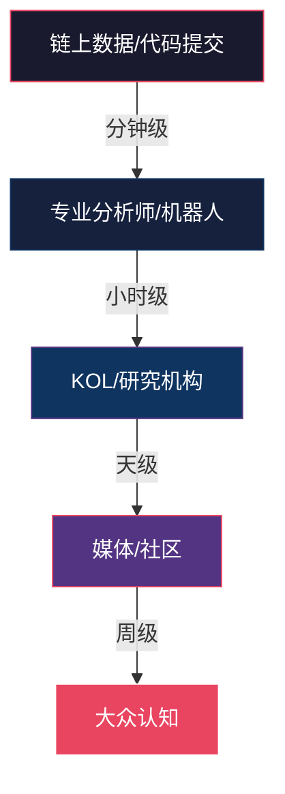

## 七、信息获取渠道

加密货币市场是全球首个真正意义上"信息即金钱"的金融市场。一条推文可以让代币暴涨300%，一份审计报告可以引发协议TVL归零，一个链上异常信号可以提前48小时预示崩盘。在这个7×24小时运转、缺乏统一监管、信息极度不对称的市场中，**建立系统化的信息获取能力是区分业余参与者和专业投资者的分水岭**。

本节将从道、法、术、器四个层面，构建完整的信息获取体系：先理解加密市场信息传播的本质规律，再建立信息筛选的方法论，然后掌握各渠道的使用技巧，最后用工具实现自动化监控。

### 1. 加密市场信息传播的本质规律

#### 1.1 信息不对称：加密市场的核心特征

传统金融市场有证监会、信息披露制度、内幕交易法等机制来缩小信息差距。加密市场几乎没有这些保护。信息不对称体现在三个维度：

| 维度 | 传统市场 | 加密市场 |
|------|----------|----------|
| 时间差 | 监管要求同步披露 | 链上数据公开但需要解读能力 |
| 能力差 | 分析师覆盖充分 | 散户缺乏链上分析技能 |
| 资源差 | Bloomberg终端约2万美元/年 | Dune Analytics免费但需要SQL |

**关键认知**：加密市场的信息优势不在于"比别人更早看到消息"，而在于"比别人更准确地解读数据"。链上数据对所有人公开，但能读懂的人极少。

#### 1.2 信息传播的四层模型

加密市场的信息从产生到被大众感知，经历四个阶段：



**实战意义**：如果你想在信息传播链的上游获取优势，就需要关注链上数据和开发者动态，而不是只刷Twitter。如果你的目标是验证已有信息的真伪，就需要理解每一层传播中的失真规律。

#### 1.3 信息的时效性分级

不同类型的信息有不同的"保鲜期"，错过窗口就失去价值：

| 信息类型 | 有效窗口 | 典型来源 | 适用策略 |
|----------|----------|----------|----------|
| 链上异动（巨鲸转账、合约交互） | 分钟级 | Nansen、Arkham | 自动化监控+即时响应 |
| 项目公告（空投、合作、升级） | 小时级 | 官方Twitter/Discord | 第一时间关注官方渠道 |
| 研究报告（深度分析、赛道梳理） | 天级 | Messari、Delphi | 深度阅读，建立认知框架 |
| 宏观政策（监管、ETF审批） | 周级 | 政府官网、CoinDesk | 理解长期影响 |
| 市场情绪（恐惧贪婪指数） | 实时 | Alternative.me | 辅助判断，不作为主要依据 |

### 2. 链上数据平台：信息获取的第一层

链上数据是加密市场最原始、最真实的信息源。所有交易、合约交互、资金流动都记录在区块链上，无法篡改。掌握链上数据分析，就掌握了"看到别人看不到的东西"的能力。

#### 2.1 区块浏览器：基础中的基础

区块浏览器是查看区块链上所有交易和地址的工具，相当于区块链的"搜索引擎"。

**各主链的标准区块浏览器：**

| 区块链 | 区块浏览器 | 网址 | 特色功能 |
|--------|-----------|------|----------|
| Ethereum | Etherscan | etherscan.io | 最全面，支持合约验证、Token追踪 |
| Bitcoin | Blockchain.com | blockchain.com | 历史最久，支持UTXO分析 |
| BSC | BscScan | bscscan.com | 兼容Etherscan，DeFi数据丰富 |
| Solana | Solscan | solscan.io | 支持SPL Token和NFT追踪 |
| Polygon | PolygonScan | polygonscan.com | L2数据完整 |
| Arbitrum | Arbiscan | arbiscan.io | L2交易和桥接数据 |
| Base | Basescan | basescan.org | Coinbase L2生态数据 |

**实操技巧——如何用Etherscan读懂一笔交易：**

1. **输入交易哈希**：在搜索栏粘贴TxHash，查看交易详情
2. **解读关键字段**：
   - `Status`：Success/Failed/Pending，判断交易是否完成
   - `From`/`To`：发送方和接收方地址，判断资金流向
   - `Value`：转账金额（ETH计价）
   - `Token Transfers`：ERC-20代币转移详情
   - `Input Data`：合约调用数据，解码后可看到具体函数和参数
   - `Gas Used` × `Gas Price`：实际消耗的手续费
3. **进阶操作**：
   - 点击`From`地址查看该地址的完整交易历史和资产持仓
   - 用"Token Holdings"查看地址持有的所有代币
   - 用"Internal Txns"查看合约内部的嵌套调用

**常见误区**：很多新手只看`Value`字段，以为转账金额就是全部。实际上，通过智能合约进行的代币交换不会显示在`Value`中，而是在`Token Transfers`里。一笔Uniswap交易可能`Value`为0，但实际交换了价值数万美元的代币。

#### 2.2 链上分析平台：从数据到洞察

区块浏览器提供原始数据，链上分析平台则将数据转化为可操作的洞察。

**Dune Analytics——链上分析的瑞士军刀**

Dune是一个基于SQL的链上数据查询平台，社区贡献了数十万个仪表盘。它的核心价值在于：你不需要自己运行节点，就能用SQL查询完整的链上数据。

入门使用步骤：
1. 访问 `dune.com`，用GitHub账号注册
2. 在搜索栏输入关键词（如"Uniswap volume"、"ETH staking"）
3. 浏览社区创建的仪表盘，找到你需要的数据
4. 如果会SQL，可以fork别人的查询，修改参数定制自己的分析

必看的Dune仪表盘（免费）：
- **DEX Volume**：各去中心化交易所的交易量对比
- **ETH Staking Overview**：以太坊质押总量、验证者数量、质押收益
- **Stablecoin Overview**：USDT/USDC/DAI等稳定币的供应量和流通链分布
- **Bridge Volume**：跨链桥的资金流动量

**Nansen——聪明钱追踪**

Nansen的核心功能是给区块链地址打标签，让你知道"谁在做什么"。它的地址标签包括：
- `Smart Money`：被算法识别为持续盈利的地址
- `Fund`：已知的加密基金地址
- `DEX LP`：去中心化交易所流动性提供者
- `Binance`/`Coinbase`等交易所热钱包/冷钱包

使用场景：
- 查看Smart Money最近在买什么代币
- 监控交易所的大额充提（大量充值可能预示抛压）
- 追踪特定项目的早期投资者是否在出货

免费版功能有限，付费版（约150美元/月）可解锁完整的地址标签和警报功能。

**Arkham Intelligence——免费的链上侦探工具**

Arkham是一个免费的链上分析平台，提供地址标签、实体追踪和警报功能。与Nansen相比，Arkham的优势在于免费额度较多，且支持多链分析。

核心功能：
- **Entity Dashboard**：查看交易所、基金、巨鲸等实体的持仓和动向
- **Alerts**：设置地址监控，当目标地址有大额交易时收到通知
- **Visualizer**：可视化展示地址间的资金流向图

#### 2.3 DeFi专用数据平台

| 平台 | 核心功能 | 网址 | 适用场景 |
|------|----------|------|----------|
| DefiLlama | TVL追踪、收益率对比、空投追踪 | defillama.com | DeFi研究的起点，免费且全面 |
| DeBank | 多链钱包资产追踪、DeFi持仓查看 | debank.com | 查看自己或他人的DeFi持仓 |
| L2Beat | Layer2 TVL和安全性评估 | l2beat.com | L2项目对比和风险评估 |
| Token Terminal | 协议收入、P/S比率、基本面数据 | tokenterminal.com | 用传统金融指标分析DeFi协议 |

**DefiLlama深度使用指南：**

DefiLlama是DeFi数据的"彭博终端"，完全免费。关键功能包括：

- **Yields页面**：对比各协议各池子的年化收益率，支持按链、资产类型、风险等级筛选。使用技巧：不要只看APY数字，关注"TVL"列——TVL低于100万美元的池子，收益率可能被操纵。
- **Airdrops页面**：追踪尚未发币的协议，评估潜在空投价值。这是免费获取空投信息的重要渠道。
- **Stablecoins页面**：监控各稳定币的供应量变化，USDT大量增发通常意味着资金入场。
- **Fees/Revenue页面**：查看各协议的真实收入，区分"靠补贴吸引的TVL"和"有真实收入的协议"。

### 3. 市场数据平台：价格、行情与交易数据

#### 3.1 综合行情平台

**CoinGecko vs CoinMarketCap对比：**

| 对比维度 | CoinGecko | CoinMarketCap |
|----------|-----------|---------------|
| 数据全面性 | 覆盖12000+代币 | 覆盖10000+代币 |
| 所有权 | 独立运营 | 币安旗下 |
| 数据争议 | 较少 | 曾因排名算法调整引发争议 |
| API免费额度 | 每分钟30次调用 | 每分钟30次调用 |
| 特色功能 | Trust Score（交易所可信度评分）、NFT板块 | 空投活动、理财板块 |
| 推荐场景 | 日常行情查看和研究 | 交叉验证数据 |

**使用建议**：两个平台都用，互相对比。当一个平台显示某代币数据异常时（如交易量突然暴增），用另一个平台验证。不要只依赖单一数据源。

#### 3.2 专业交易数据平台

**TradingView（tradingview.com）**

TradingView是加密货币技术分析的首选平台，提供专业的K线图表和技术指标。免费版功能已经足够日常使用：
- 支持数百种技术指标（MA、RSI、MACD、布林带等）
- 多时间周期分析（从1分钟到月线）
- 社区发布的交易想法和分析
- 警报功能（免费版可设置1个活跃警报，付费版无限制）

**TradingView在加密市场的特殊用法：**
- 用`BTC.D`（Bitcoin Dominance）指标判断市场风险偏好——BTC主导率上升时，山寨币通常表现不佳
- 用`TOTAL`指标查看加密市场总市值，判断大盘趋势
- 用`ETH/BTC`交易对判断以太坊相对比特币的强弱
- 关注`USDT.D`（USDT Dominance），大量资金流入USDT可能预示避险情绪

#### 3.3 衍生品数据

衍生品市场（期货、期权）的数据对判断市场方向极为重要，因为大资金通常在衍生品市场布局。

**关键数据源：**

- **Coinglass（coinglass.com）**：加密衍生品数据最全面的平台
  - 资金费率（Funding Rate）：正费率意味着多头支付空头，市场偏多；极端费率通常预示反转
  - 爆仓数据（Liquidations）：大量多头爆仓可能是短期底部信号
  - 持仓量（Open Interest）：持仓量增加+价格上涨=趋势强劲；持仓量减少+价格上涨=上涨乏力
  - 期权数据：看涨/看跌比率（Put/Call Ratio），低于0.7表示市场极度看涨

- **Laevitas（laevitas.ch）**：专业期权数据分析，提供隐含波动率曲面、期限结构等高级指标

#### 3.4 稳定币和资金流动数据

稳定币是加密市场的"血液"，监控稳定币流动可以判断资金进出市场的方向：

- **Circle Transparency（circle.com/transparency）**：USDC官方储备报告
- **Tether Transparency（tether.to/transparency）**：USDT官方储备报告
- **DefiLlama Stablecoins页面**：各稳定币在各链上的供应量变化
- **Glassnode（glassnode.com）**：链上资金流动指标，包括交易所净流入/流出

**解读技巧**：
- USDT/USDC大量铸造（Mint）→ 新资金入场 → 利好
- 交易所稳定币余额大幅增加 → 买入力储备 → 可能即将上涨
- 交易所稳定币余额大幅减少 → 资金撤离 → 可能即将下跌或已下跌

### 4. 新闻与媒体：信息获取的第二层

#### 4.1 英文主流加密媒体

英文媒体是加密行业信息传播的核心渠道，大部分重要消息首先以英文发布。

| 媒体 | 定位 | 网址 | 特色 | 可信度 |
|------|------|------|------|--------|
| CoinDesk | 综合新闻 | coindesk.com | 行业最权威，率先报道重大事件 | ★★★★★ |
| The Block | 深度报道 | theblock.co | 机构级研究，数据分析深入 | ★★★★★ |
| Decrypt | 大众化 | decrypt.com | 适合入门，文章通俗易懂 | ★★★★☆ |
| Cointelegraph | 综合新闻 | cointelegraph.com | 覆盖面广，但有时质量参差 | ★★★☆☆ |
| Blockworks | 机构视角 | blockworks.co | 侧重机构和政策动态 | ★★★★☆ |
| Unchained | 播客/深度 | unchainedcrypto.com | Laura Shin的深度访谈，业界影响力大 | ★★★★★ |

**使用建议**：
- 每天花15分钟浏览CoinDesk和The Block的头条
- 订阅The Block的每日Newsletter（免费）
- 每周听1-2期Unchained播客，了解行业深度观点

#### 4.2 中文加密媒体

| 媒体 | 定位 | 网址 | 特色 |
|------|------|------|------|
| PANews | 深度研究 | panewslab.com | 研报质量高，数据详实 |
| BlockBeats | 快讯+深度 | theblockbeats.info | 快讯速度最快，中文社区首选 |
| 金色财经 | 综合新闻 | jinse.cn | 覆盖面广，但广告较多 |
| Foresight News | 快讯+研究 | foresightnews.pro | 内容质量较高 |
| 链捕手 | 深度报道 | chaincatcher.com | 深度文章质量不错 |

**信息交叉验证原则**：永远不要只看单一来源。当一个重要消息出现时，至少用两个独立来源验证。加密媒体的"抢发"文化导致错误信息传播很快——先发消息再核实是常态。

#### 4.3 Newsletter：最被低估的信息渠道

Newsletter是经过筛选和整理的高质量信息源，比刷社交媒体效率高得多。推荐订阅：

- **The Daily Gwei**（sassal.eth的每日Newsletter）：以太坊生态最佳日报
- **Bankless**：Web3文化和DeFi深度分析
- **Messari Daily**：机构级加密市场日报
- **OurNetwork**：链上数据驱动的周报
- **DeFi Pulse Weekly**：DeFi生态周度回顾
- **a]6z Crypto Startup School**：a16z的加密投资洞察

**实操建议**：用专门的邮箱（不和日常邮箱混用）订阅，每天固定时间（如早上9点）集中阅读，避免碎片化信息干扰。

### 5. 社交媒体与社区：信息获取的第三层

#### 5.1 X（Twitter）：加密世界的"交易所大厅"

X是加密行业最重要的社交平台，几乎所有项目方、KOL、开发者都在上面活跃。

**必关注的账号类型：**

**项目方官方账号**（只关注你投资的项目）：
- 确保关注的是官方认证账号，而非仿冒号
- 开启通知功能，第一时间获取项目公告

**行业KOL分类关注：**

| 类型 | 代表账号 | 关注价值 |
|------|----------|----------|
| 宏观分析 | @RaoulGMI、@CryptoHayes | 宏观趋势判断 |
| 链上分析 | @WuBlockchain、@lookonchain | 巨鲸动向和链上异动 |
| DeFi深度 | @DeFiIgnas、@baboringxyz | DeFi协议深度分析 |
| 技术分析 | @CryptoKaleo、@tradinglord | 价格走势分析 |
| 安全审计 | @PeckShieldAlert、@CertiK | 安全事件预警 |
| 空投信息 | @layerggaborator、@AiraboringAlert | 空投机会追踪 |

**使用X的效率技巧：**
1. 创建专门的"加密信息"列表（List），将关注的加密账号加入列表，避免被其他内容干扰
2. 使用高级搜索功能：搜索特定代币名称+过滤条件（如"min_faves:100"只看100个赞以上的推文）
3. 警惕"喊单"行为：如果一个KOL频繁推荐低市值代币，大概率是付费推广或自己已建仓

#### 5.2 Telegram：项目社区的核心阵地

Telegram是加密项目建立社区的主要平台，也是获取一手信息的重要渠道。

**信息获取策略：**

- **加入项目官方群**：每个你投资的项目都有官方Telegram群，项目团队会在群里发布重要更新
- **使用"Pin"功能**：群管理员通常会将重要消息置顶，养成查看置顶消息的习惯
- **设置关键词提醒**：Telegram支持在群组中设置关键词提醒，当消息包含特定关键词时通知你
- **区分信号和噪音**：项目群中90%的消息是噪音，重点关注管理员和团队成员的发言

**安全警告**：
- Telegram是诈骗高发区。任何人私信你推荐投资机会，100%是骗局
- 不要点击群内陌生人发送的链接
- 不要在群内分享助记词、私钥或屏幕截图
- 管理员不会主动私信你

#### 5.3 Discord：开发者和深度社区

Discord是Web3项目的技术社区所在地，适合深度参与项目生态的用户。

**信息获取技巧：**
- 关注`#announcements`频道：项目重大更新通常在这里发布
- 关注`#dev-updates`或`#tech`频道：技术进展和代码更新
- 参与`#governance`频道：了解DAO治理提案和投票
- 使用Discord的"关注频道"功能：只接收特定频道的通知，避免信息过载

#### 5.4 Reddit：社区讨论的深度场

Reddit的加密相关subreddit适合深度讨论和社区观点汇总：

| Subreddit | 内容定位 | 活跃度 |
|-----------|----------|--------|
| r/cryptocurrency | 综合讨论 | 极高 |
| r/ethereum | 以太坊生态 | 高 |
| r/defi | DeFi深度讨论 | 中 |
| r/bitcoin | 比特币社区 | 高 |
| r/CryptoMoonShots | 低市值代币讨论（需极度谨慎） | 高 |
| r/SatoshiStreetBets | 交易和投机 | 中 |

**使用建议**：Reddit的"upvote"机制让高质量内容更容易被看到，但也要注意"群体思维"效应——当一个subreddit对某代币集体看涨时，往往是危险信号。

### 6. 研究报告与深度分析

#### 6.1 免费研究资源

- **Messari**（messari.io）：行业最权威的研究平台之一，免费报告覆盖面广
- **a16z Crypto**（a16zcrypto.com）：顶级VC的研究输出，视角前瞻
- **Paradigm Research**（paradigm.xyz）：技术深度极高，适合理解底层机制
- **Binance Research**：币安研究院报告，覆盖主流项目分析
- **Galaxy Digital Research**：机构级加密市场研究报告

#### 6.2 付费研究平台

| 平台 | 价格 | 核心价值 | 适合人群 |
|------|------|----------|----------|
| Delphi Digital | ~$1000/年 | DeFi和NFT深度研究 | 深度投资者 |
| The Block Research | ~$300/年 | 机构级数据和分析 | 专业交易者 |
| Messari Pro | ~$300/年 | 完整研报库+数据工具 | 研究型投资者 |
| Glassnode Advanced | ~$30/月 | 链上指标仪表盘 | 数据驱动型投资者 |

**性价比建议**：如果你的加密资产超过1万美元，Glassnode Advanced的30美元/月投入是值得的。如果资产超过10万美元，考虑订阅The Block Research或Messari Pro。不要在资产很少时就花钱买研究服务——免费资源已经足够。

#### 6.3 如何阅读研报

拿到一份研报后，不要从头读到尾。高效阅读的步骤：

1. **看摘要和结论**（2分钟）：快速判断这份报告是否与你的投资决策相关
2. **看图表和数据**（3分钟）：研报中的图表通常包含最有价值的信息
3. **看方法论**（2分钟）：了解分析师的分析框架，评估结论的可靠性
4. **选择性精读**（按需）：只精读与你当前投资决策直接相关的章节

### 7. 开发者和协议层面的信息

#### 7.1 GitHub：代码即真相

项目的GitHub仓库是了解项目真实进展的最佳渠道。营销文案可以说谎，但代码不会。

**如何查看项目GitHub：**
1. 在项目官网找到GitHub链接（通常在页面底部）
2. 查看关键指标：
   - **Commits频率**：活跃项目每周有数十次代码提交
   - **Contributors数量**：核心开发者越多，项目越健康
   - **Open Issues**：未解决的问题数量，反映代码质量
   - **Stars和Forks**：社区关注度指标
3. 查看`Releases`页面：了解版本更新历史和路线图执行情况
4. 查看`Pull Requests`：了解正在开发的功能

**警惕信号**：
- 代码仓库是空的或只有README → 可能是空气项目
- 很久没有代码提交（超过3个月）→ 开发停滞
- 只有1-2个贡献者 → 过度中心化

#### 7.2 治理论坛和提案

对于DAO治理的项目，治理论坛是了解项目发展方向的重要渠道：

- **Snapshot（snapshot.org）**：链下投票平台，查看各DAO的治理提案
- **Tally（tally.xyz）**：链上治理投票追踪
- **各项目治理论坛**：如Uniswap Governance、Aave Governance、MakerDAO Forum

**为什么要关注治理**：治理提案可能直接影响代币价值。例如，MakerDAO调整DAI利率直接影响MKR持有者的收益；Uniswap费用开关提案如果通过，UNI持有者可能获得协议收入分成。

### 8. 信息筛选与验证方法论

#### 8.1 信息可信度评估框架

面对任何加密市场信息，用以下框架评估可信度：

```text
可信度评分 = 信息源权重 × 证据充分度 × 逻辑自洽度 × 交叉验证结果

信息源权重：
- 官方公告/代码/链上数据：0.9
- 权威媒体独家报道：0.7
- KOL分析（有数据支撑）：0.5
- 社区传闻/匿名消息：0.2

证据充分度：
- 有链上数据/代码/截图佐证：0.9
- 有多个独立来源报道：0.7
- 单一来源，无佐证：0.3
- "据说"/"听说"/"朋友说"：0.1
```

#### 8.2 常见信息陷阱

**陷阱一：虚假官方账号**
诈骗者创建与项目官方账号极其相似的账号（如用`0`代替`o`，添加下划线等）。验证方法：只通过项目官网链接找到的社交媒体账号才是官方的。

**陷阱二：付费KOL推广**
大量KOL接受项目方付费推广但不披露。识别方法：
- 突然开始频繁提及某个之前从未提过的低市值代币
- 推文带有推广链接或追踪参数
- 使用"这不是投资建议"等免责声明

**陷阱三：伪造的链上数据截图**
截图可以PS。任何重要的链上数据，都要自己在区块浏览器上验证。

**陷阱四：虚假的"内幕消息"**
加密市场充斥着各种"内幕消息"，99%是假的。真正的内幕知情人不会在Telegram群里免费分享。

**陷阱五：回溯性叙事偏差**
当某个代币暴涨后，社区会构建一套"早就该涨"的叙事。这是事后诸葛亮，不要用来指导未来决策。

### 9. 构建个人信息系统

#### 9.1 信息层级架构

一个完整的加密投资信息系统应该包含三层：

```mermaid
graph TB
    subgraph 第一层：实时监控层
        A[链上警报] --> E[即时通知]
        B[价格警报] --> E
        C[安全事件警报] --> E
    end
    
    subgraph 第二层：日常扫描层
        F[Twitter列表] --> I[每日15分钟]
        G[Newsletter] --> I
        H[新闻头条] --> I
    end
    
    subgraph 第三层：深度研究层
        J[研报阅读] --> M[每周2-3小时]
        K[链上数据分析] --> M
        L[治理提案跟踪] --> M
    end
    
    E --> N[投资决策]
    I --> N
    M --> N
    
    style E fill:#e94560,color:#fff
    style I fill:#0f3460,color:#fff
    style M fill:#533483,color:#fff
    style N fill:#1a1a2e,stroke:#e94560,color:#fff
```

#### 9.2 工具化实现

**价格和链上警报设置：**
- TradingView：设置价格警报（免费版1个，付费版无限制）
- Dextools：设置新代币上线提醒
- Nansen/Arkham：设置巨鲸地址监控
- Twitter Lists：创建加密信息专用列表
- Feedly/RSS：聚合多个Newsletter和博客

**每日信息流程模板：**

| 时间 | 任务 | 工具 | 耗时 |
|------|------|------|------|
| 08:00 | 阅读Newsletter | 邮件 | 10分钟 |
| 08:15 | 扫描Twitter列表 | X App | 10分钟 |
| 12:00 | 检查链上警报 | Nansen/Arkham | 5分钟 |
| 12:05 | 扫描新闻头条 | CoinDesk/BlockBeats | 5分钟 |
| 20:00 | 深度阅读研报 | Messari/Delphi | 30分钟 |
| 20:30 | 更新Watchlist | CoinGecko | 10分钟 |

**每日总耗时：约70分钟**。这个时间投入对于认真的加密投资者来说是最低标准。

#### 9.3 信息管理的常见错误

- **信息过载**：关注了太多渠道，每天花3小时刷信息但没有深度思考。解决方案：严格限制信息源数量，宁少勿多。
- **确认偏误**：只关注支持自己已有观点的信息，忽略反面证据。解决方案：主动寻找反对意见，特别是当你重仓某个代币时。
- **行动瘫痪**：收集了大量信息但无法做出决策。解决方案：设定明确的决策标准，达到标准就执行，不追求完美信息。
- **FOMO驱动**：看到别人在某个代币上赚了钱就冲动买入。解决方案：在信息系统中加入"冷静期"机制——任何投资决策至少等待24小时再执行。

### 10. 进阶：自动化信息收集

#### 10.1 Twitter API + 自动化监控

如果你有编程能力，可以用Twitter API构建自动化监控系统：

```python
# 基于Tweepy的Twitter监控示例
import tweepy

# 设置API凭证
client = tweepy.Client(bearer_token="YOUR_BEARER_TOKEN")

# 监控特定关键词
keywords = ["airdrop", "token launch", "partnership"]

# 搜索最近的推文
tweets = client.search_recent_tweets(
    query=" OR ".join(keywords) + " -is:retweet lang:en",
    max_results=10,
    tweet_fields=["created_at", "public_metrics"]
)

for tweet in tweets.data:
    if tweet.public_metrics["like_count"] > 100:
        print(f"[{tweet.created_at}] {tweet.text[:100]}...")
```

#### 10.2 RSS聚合器

用RSS将多个信息源聚合到一个界面：

推荐的RSS源：
- CoinDesk RSS：`feeds.feedburner.com/CoinDesk`
- The Block RSS：`theblock.co/rss.xml`
- 以太坊基金会博客：`blog.ethereum.org/feed.xml`
- 各项目的Medium博客（通常有RSS）

推荐工具：Feedly（Web/App）、Inoreader（功能更强大）、NewsBlur（开源）

#### 10.3 机器人和Webhook

- **Discord Webhook**：将链上警报、价格变动推送到你的私人Discord服务器
- **Telegram Bot**：用BotFather创建自己的Bot，配合API实现自定义警报
- **IFTTT/Zapier**：无代码自动化工具，连接不同平台的信息流

### 11. 本节核心要点总结

| 要点 | 说明 |
|------|------|
| 信息分层获取 | 链上数据→专业分析→媒体报道→社区讨论，层层递进 |
| 交叉验证 | 任何重要信息至少用两个独立来源验证 |
| 效率优先 | 用Newsletter和列表聚合信息，避免碎片化刷屏 |
| 区分信号和噪音 | 90%的市场信息是噪音，聚焦对你投资决策有直接影响的信息 |
| 工具化自动化 | 用警报、RSS、Bot减少人工监控时间 |
| 安全第一 | 所有社交平台都是诈骗高发区，不点击陌生链接，不分享私钥 |
| 持续迭代 | 信息渠道需要定期评估和更新，删除低质量源，添加高质量源 |
