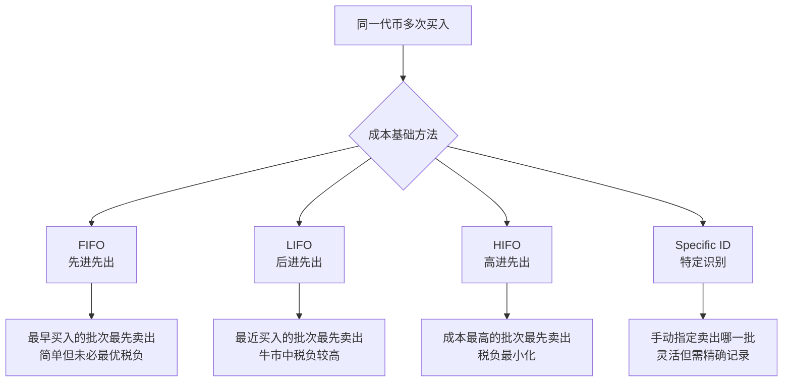
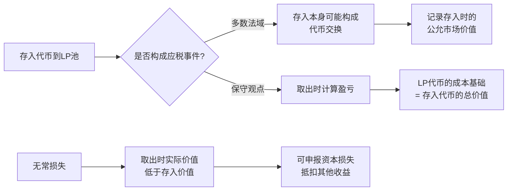
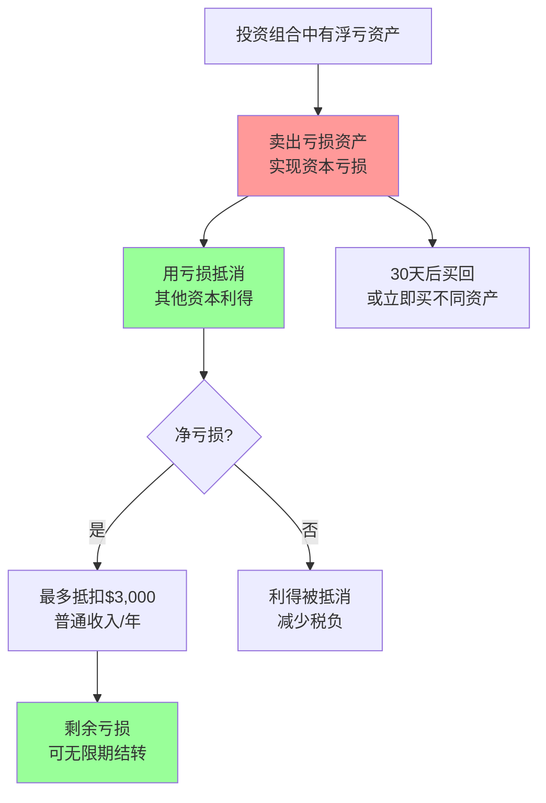
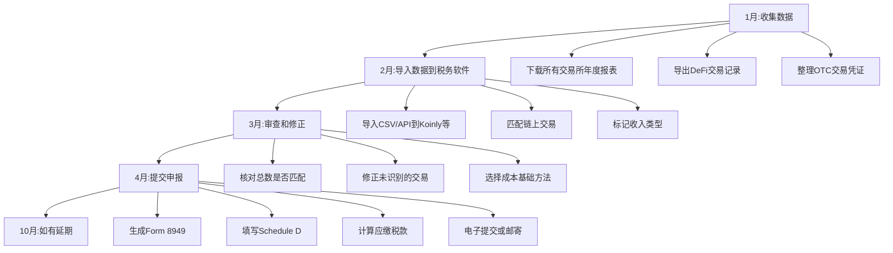

## 十二、税务合规与加密货币

加密货币投资的收益最终要面对一个现实问题：税务合规。无论你在链上赚了多少，如果忽视税务义务，轻则面临罚款和滞纳金，重则触发反洗钱调查甚至刑事追诉。随着全球各国税务机关对加密货币的监管能力持续升级——从交易所KYC信息共享到链上追踪工具的成熟——"不报税就不会被发现"的时代已经彻底结束。

本节将系统讲解加密货币税务的核心原理、各国税制对比、应税事件识别、计算方法、记录保存、DeFi/NFT特殊场景处理、合规工具选择以及税务优化策略，帮助你在合法框架内最大化税后收益。

### 1. 为什么加密货币需要纳税

#### 1.1 税务机关的视角

在绝大多数司法管辖区，加密货币被视为**财产（property）**或**资产（asset）**而非货币。这一分类决定了其税务处理方式：

- **美国（IRS）**：2014年Notice 2014-21明确将虚拟货币视为财产，适用资本利得税规则
- **中国**：2021年9月十部委联合公告将虚拟货币相关业务活动定性为非法金融活动，但个人持有和交易的税务义务并未免除
- **欧盟**：各国分类不同，但普遍视为应税资产
- **日本（NTA）**：归类为"杂项收入"，最高税率可达55%
- **韩国**：2025年起对加密收益超过250万韩元部分征收22%的税（税率曾多次推迟）
- **新加坡**：对个人投资者的资本利得不征税，但对频繁交易者可能视为营业收入征税

#### 1.2 不申报的后果

| 风险类型 | 具体后果 | 严重程度 |
|---------|---------|---------|
| 罚款 | 未申报金额的20%-75%（美国IRS） | 高 |
| 滞纳金 | 按日累计，年化利率通常5%-8% | 中 |
| 刑事指控 | 故意逃税可面临最高5年监禁（美国） | 极高 |
| 信用影响 | 影响贷款、签证等需要税务记录的场景 | 中 |
| 资产冻结 | 税务机关可申请冻结银行账户和交易所账户 | 高 |

#### 1.3 全球信息交换趋势

CRS（共同申报准则）和CARF（加密资产报告框架）正在形成全球税务信息自动交换网络：

- **OECD CARF**：2024年发布最终框架，要求加密资产服务提供商（CASP）自动报告用户交易信息，首批交换预计2027年启动
- **美国FATCA**：外国金融机构须向IRS报告美国纳税人的账户信息
- **交易所合作**：Coinbase、Binance等主流交易所已与多国税务机关签署信息共享协议
- **链上分析**：Chainalysis、Elliptic等工具已被数十个国家税务机关采购使用

### 2. 核心概念：应税事件与非应税事件

识别哪些行为触发税务义务是合规的第一步。

#### 2.1 应税事件（Taxable Events）

以下行为在大多数司法管辖区构成应税事件：

**资本利得类：**

| 事件 | 说明 | 税种 |
|------|------|------|
| 卖出加密货币换法币 | BTC→USD、ETH→CNY等 | 资本利得税 |
| 用加密货币购买商品/服务 | 用BTC买咖啡、用ETH付Gas费 | 资本利得税 |
| 加密货币互换 | BTC→ETH、USDT→SOL等 | 资本利得税 |
| NFT卖出 | 铸造后出售获得收益 | 资本利得税 |
| 空投代币出售 | 收到空投后代币增值后卖出 | 资本利得税（部分法域收到时即征税） |

**收入类：**

| 事件 | 说明 | 税种 |
|------|------|------|
| 挖矿收入 | 获得区块奖励和手续费 | 所得税 |
| 质押奖励 | PoS质押、DeFi质押收益 | 所得税 |
| 空投收入 | 收到空投代币的公允市场价值 | 所得税 |
| 流动性挖矿收益 | LP奖励代币 | 所得税 |
| 赚取利息 | CeFi/DeFi借贷利息 | 所得税 |
| 工资收入 | 以加密货币形式获得的工资 | 所得税+社保 |
| 参与IDO/IEO | 以折扣价获得代币 | 所得税 |

#### 2.2 非应税事件（Non-Taxable Events）

以下行为通常不直接触发税务义务（但可能需要记录）：

- **持有（HODLing）**：单纯持有未出售不产生应税事件
- **钱包间转移**：从一个自己的钱包转到另一个自己的钱包
- **用法币购买加密货币**：买入行为本身不征税（但需记录成本基础）
- **捐赠给合格慈善机构**：在部分法域可获得税前扣除
- **收到贷款**：用加密货币作为抵押获得贷款通常不征税（但清算抵押品则征税）

#### 2.3 灰色地带

部分场景的税务处理存在争议或因法域而异：

- **DeFi借贷存入/取出**：存入Aave获得aToken是否构成"交换"？多数税务专业人士认为取出时如果代币种类变化（如ETH→stETH）则构成应税事件
- **Rebase代币**：AMPL等弹性供应代币的数量变化是否征税？多数法域倾向于在出售时一次性计算
- **跨链桥转移**：ETH→Wrapped ETH是否构成应税交换？主流观点认为同资产跨链不征税，但不同资产的包装则可能构成交换
- **治理代币投票锁仓**：锁定代币参与投票是否改变持有期限？需参考当地法规

### 3. 成本基础计算方法

成本基础（Cost Basis）是计算资本利得的核心——卖出价减去买入成本。但当你分批买入同一代币时，如何确定"卖的是哪一批"？

#### 3.1 四种主流计算方法



**FIFO（先进先出）**：
- 2024年1月买入1 BTC @ $40,000
- 2024年6月买入1 BTC @ $60,000
- 2024年12月卖出1 BTC @ $70,000
- FIFO计算：利得 = $70,000 - $40,000 = $30,000（卖出最早的那批）

**HIFO（高进先出）**：
- 同上场景
- HIFO计算：利得 = $70,000 - $60,000 = $10,000（卖出成本最高的那批）
- 税负减少$20,000 × 税率

**特定识别（Specific Identification）**：
- 要求你能明确指定卖出的是哪一批（需要精确到交易哈希）
- 灵活度最高，但记录要求也最严格
- 美国IRS从2025年起要求交易所默认使用FIFO，个人可选特定识别但需自行证明

#### 3.2 美国新规：2025年起托管账户强制FIFO

美国IRS在2024年发布的最终规则中明确：
- **托管交易所**（Coinbase、Kraken等）：2025年1月1日起默认使用FIFO，用户可选择Specific ID但需提前通知
- **非托管钱包**：用户可继续选择任意方法，但需保持一致且有完整记录
- **反洗仓规则（Wash Sale）**：2025年起加密货币纳入反洗仓规则，30天内卖出再买回同类资产不能抵扣亏损

#### 3.3 不同方法的税务影响对比

| 方法 | 牛市影响 | 熊市影响 | 记录难度 | 推荐场景 |
|------|---------|---------|---------|---------|
| FIFO | 短期利得高，税负重 | 可能产生长期亏损 | 低 | 长期持有者 |
| LIFO | 短期利得可能更高 | 可能产生短期亏损 | 中 | 短线交易者 |
| HIFO | 最小化当前税负 | 可能消耗低成本基础 | 中 | 追求最小化当年税负 |
| Specific ID | 完全可控 | 完全可控 | 高 | 专业交易者 |

### 4. 各国/地区加密货币税制详解

#### 4.1 中国大陆

2021年9月之后，中国大陆对加密货币的监管态度是"全面禁止业务活动"，但**税务义务并未消失**：

**现行规则要点：**
- 加密货币交易不被视为合法金融活动，但个人持有本身不违法
- 如果产生收益（如通过境外交易所或OTC），理论上属于"偶然所得"或"财产转让所得"
- 个人所得税率：偶然所得20%；财产转让所得20%
- 实际执法中，主动申报极少，但一旦被查（如银行大额转账触发反洗钱审查），税务义务不可回避
- 境外交易所收入：中国税务居民全球收入需纳税，境外收入也需申报

**实操建议：**
- 保留所有交易记录，包括境外交易所的完整交易历史
- 大额OTC交易注意银行流水与交易记录的对应关系
- 避免频繁大额进出金引起银行关注
- 咨询专业税务师，了解最新的执法口径

#### 4.2 美国

美国是全球对加密货币税务执行最严格的国家之一：

**税率结构：**
- **短期资本利得**（持有≤1年）：按普通收入税率，10%-37%
- **长期资本利得**（持有>1年）：0%、15%或20%（取决于收入水平）
- **净投资所得税（NIIT）**：高收入者额外3.8%
- **州税**：各州不同，加州最高13.3%，得克萨斯州和佛罗里达州无州所得税

**申报要求：**
- Form 8949：报告每笔资本利得/亏损交易
- Schedule D：汇总资本利得/亏损
- Schedule 1：报告挖矿、质押、空投等收入
- Form 1040：第一页顶部必须回答加密货币相关问题（是/否）
- FBAR/FATCA：持有境外加密资产超过$10,000/$50,000需申报

**关键时间节点：**
- 4月15日：个人所得税申报截止日（可延期至10月15日）
- 每季度15日：预估税款缴纳截止日（有大额加密收益需预缴）

#### 4.3 日本

日本将加密货币收入归类为"杂项收入"（雑所得），不享受分离课税：

- 税率：累进制，最高55%（含住民税和复兴特别所得税）
- 亏损不可结转到下一年（与股票不同）
- 2023年起允许将加密货币亏损与其他投资收入对冲
- 稳定币交易也适用同样规则

#### 4.4 欧盟主要国家

| 国家 | 资本利得税率 | 持有期优惠 | 特殊规定 |
|------|------------|-----------|---------|
| 德国 | 0%（持有>1年） | 1年后免税 | 质押收益持有期延长至10年 |
| 法国 | 30%（统一税率） | 无 | 偶发交易30%，专业交易按商业收入 |
| 葡萄牙 | 0%（持有>1年） | 1年后免税 | 2023年起短期收益征28% |
| 荷兰 | 累进税（假设收益） | 无 | 基于资产总值的假设回报率征税 |
| 瑞士 | 0%（个人投资者） | 无资本利得税 | 专业交易者按商业收入征税 |

#### 4.5 新加坡与香港

**新加坡：**
- 个人资本利得不征税
- 频繁交易可能被视为"贸易行为"而征税（17%企业税率）
- 判断标准：交易频率、持有时间、交易动机、融资方式
- 挖矿收入通常视为营业收入征税

**香港：**
- 无资本利得税
- 以加密货币为主营业务的公司需缴纳利得税（8.25%-16.5%）
- 2023年起实施虚拟资产服务提供商（VASP）发牌制度

### 5. DeFi场景的税务处理

DeFi的复杂交互给税务记录带来了巨大挑战。

#### 5.1 流动性提供（LP）



**LP税务要点：**
- **存入**：将ETH+USDC存入Uniswap LP池，本质上是将两种代币换成LP代币，多数税务专业人士认为这构成应税交换
- **交易手续费收益**：每次有人通过你的LP池交易，你获得的手续费份额属于应税收入（按收到时的公允市场价值计算）
- **奖励代币**：流动性挖矿获得的奖励代币（如UNI、CRV）属于应税收入
- **取出**：取出时LP代币价值与成本基础的差额构成资本利得/亏损
- **无常损失**：取出时如果因价格波动导致代币组合与存入时不同，产生的损失可以作为资本损失申报

#### 5.2 借贷协议（Aave、Compound、MakerDAO）

| 操作 | 税务处理 | 记录要点 |
|------|---------|---------|
| 存入资产获得aToken/cToken | 非应税（观点一）或应税交换（观点二） | 记录存入时间和公允市场价值 |
| 赚取利息 | 应税收入，按收到时公允价值计算 | 记录每次利息分配的代币数量和价格 |
| 借出资产 | 非应税（贷款不是收入） | 记录借款金额和抵押品 |
| 抵押品被清算 | 应税事件，清算价格与成本基础的差额为利得/亏损 | 记录清算时间、数量、价格 |
| 偿还贷款 | 非应税 | 记录还款金额 |

**MakerDAO特殊场景：**
- 铸造DAI：用ETH抵押铸造DAI，这是一笔贷款，不征税
- 稳定费（Stability Fee）：支付的利息不可抵税（个人用途）
- 抵押品赎回：偿还DAI取回ETH，非应税
- 抵押品清算：如果ETH价格下跌触发清算，清算部分构成应税事件

#### 5.3 质押（Staking）

**PoS质押：**
- **直接质押**（如通过Lido、Rocket Pool）：获得的质押奖励按收到时的公允市场价值计为收入
- **stETH等流动质押代币**：ETH→stETH是否构成应税交换存在争议。保守做法是记录为应税交换，激进做法是视为同资产包装
- **质押期结束取出**：原始质押部分不征税，奖励部分已按收入征过税

**美国IRS立场（Revenue Ruling 2023-14）：**
- 明确质押奖励在" dominion and control"（支配和控制权）确立时即为应税收入
- 何时确立支配权：代币可用、可转让、可出售时
- 这意味着即使你没有卖出质押奖励，收到时就要交税

#### 5.4 空投与分叉

**空投税务处理：**

```python
# 空投收入计算示例
def calculate_airdrop_income(airdrops):
    """
    计算空投收入的税务影响
    airdrops: [{"token": str, "amount": float, "price_at_receipt": float, 
                "price_at_sale": float, "sale_date": str}]
    """
    total_income = 0
    total_gain = 0
    
    for airdrop in airdrops:
        # 收到空投时：按公允市场价值确认收入
        income = airdrop["amount"] * airdrop["price_at_receipt"]
        total_income += income
        
        # 卖出空投代币时：计算资本利得/亏损
        cost_basis = airdrop["price_at_receipt"]  # 成本基础=收到时的价格
        sale_value = airdrop["amount"] * airdrop["price_at_sale"]
        gain = sale_value - (airdrop["amount"] * cost_basis)
        total_gain += gain
        
        print(f"收到 {airdrop['amount']} {airdrop['token']}:")
        print(f"  确认收入: ${income:,.2f}")
        print(f"  资本利得/亏损: ${gain:,.2f}")
    
    return total_income, total_gain

# 示例：Uniswap空投
airdrops = [
    {
        "token": "UNI",
        "amount": 400,
        "price_at_receipt": 3.50,   # 收到时价格
        "price_at_sale": 25.00,     # 卖出时价格
        "sale_date": "2021-05-01"
    }
]

income, gain = calculate_airdrop_income(airdrops)
# 输出：
# 收到 400 UNI:
#   确认收入: $1,400.00
#   资本利得/亏损: $8,600.00
# 总收入: $1,400.00 | 总资本利得: $8,600.00
```

**硬分叉税务：**
- **BTC→BCH分叉（2017年）**：IRS立场是分叉产生的新代币在收到时即为应税收入
- 成本基础通常为0（因为你没有为新代币支付任何成本）
- 争议点：你是否真的"收到"了分叉代币？如果你没有控制私钥（如存放在不支持分叉代币的交易所），你可能根本没有收到

### 6. NFT税务

NFT的税务处理因其独特性质而更加复杂。

#### 6.1 不同参与者的税务义务

| 角色 | 税务处理 | 税种 |
|------|---------|------|
| 创作者（铸造并首次出售） | 销售收入，可扣除创作成本 | 所得税（自雇税可能适用） |
| 创作者（版税收入） | 每次二级市场交易的版税 | 所得税 |
| 买家（买入持有） | 非应税事件（仅买入） | 无 |
| 卖家（二级市场出售） | 资本利得/亏损 | 资本利得税 |
| NFT交易者（频繁买卖） | 可能被视为商业行为 | 所得税 |

#### 6.2 NFT的收藏品税率（美国）

美国IRS在2023年提议将NFT归类为"收藏品"（collectibles），这意味着：
- **长期资本利得税率**：最高28%（而非普通资产的20%）
- 判断标准：NFT是否代表或证明某物的所有权，且该物属于收藏品范畴
- 数字艺术NFT大概率被归为收藏品
- 游戏道具NFT、域名NFT等可能不适用收藏品税率

### 7. 记录保存与追踪工具

#### 7.1 必须记录的信息

每笔加密货币交易都应记录以下信息：

```csv
日期,交易类型,发送资产,发送数量,接收资产,接收数量,公允市场价值(USD),成本基础(USD),费用(USD),交易所/平台,交易哈希,备注
2024-01-15,买入,USD,40000,BTC,1.0,40000,40000,50,Coinbase,,定投
2024-03-20,卖出,BTC,0.5,USD,35000,35000,20000,25,Coinbase,,部分获利了结
2024-05-10,互换,ETH,5,USDC,15000,15000,12000,15,Uniswap,0xabc...,DeFi操作
2024-06-01,空投,,400,UNI,400,1400,0,0,Uniswap,,治理代币空投
2024-07-15,质押奖励,,0.5,ETH,0.5,1500,0,0,Lido,,ETH质押奖励
```

#### 7.2 主流税务追踪工具

| 工具 | 支持平台数 | DeFi支持 | NFT支持 | 价格(年) | 推荐场景 |
|------|-----------|---------|---------|---------|---------|
| Koinly | 800+ | 优秀 | 是 | $49-$279 | 多链DeFi用户 |
| CoinTracker | 500+ | 良好 | 是 | $59-$599 | 美国用户首选 |
| TokenTax | 100+ | 优秀 | 是 | $65-$199 | 专业交易者 |
| CoinLedger | 300+ | 良好 | 是 | $49-$299 | 性价比高 |
| TaxBit | 500+ | 良好 | 是 | 免费-$500+ | 企业用户 |
| CryptoTaxCalculator | 800+ | 优秀 | 是 | $49-$299 | 澳洲/全球用户 |

**工具选择建议：**
- **交易量<100笔/年**：Koinly免费版或CoinLedger基础版足够
- **重度DeFi用户**：Koinly或CryptoTaxCalculator对DeFi协议支持最好
- **美国用户需要专业税务师**：TokenTax提供CPA服务
- **企业/高净值**：TaxBit Enterprise或Chainalysis Tax

#### 7.3 链上数据导出

当交易所数据不完整时，需要从链上手动导出：

```python
# 使用Etherscan API导出交易记录示例
import requests
import csv
from datetime import datetime

def export_eth_transactions(address, api_key, output_file):
    """
    从Etherscan导出指定地址的所有ETH交易
    """
    url = "https://api.etherscan.io/api"
    params = {
        "module": "account",
        "action": "txlist",
        "address": address,
        "startblock": 0,
        "endblock": 99999999,
        "sort": "asc",
        "apikey": api_key
    }
    
    response = requests.get(url, params=params)
    data = response.json()
    
    if data["status"] != "1":
        print(f"错误: {data['message']}")
        return
    
    transactions = data["result"]
    print(f"获取到 {len(transactions)} 笔交易")
    
    with open(output_file, 'w', newline='', encoding='utf-8') as f:
        writer = csv.writer(f)
        writer.writerow([
            'Date', 'Type', 'From', 'To', 'Value(ETH)', 
            'Gas Fee(ETH)', 'TxHash', 'Block'
        ])
        
        for tx in transactions:
            value_eth = int(tx["value"]) / 1e18
            gas_fee = (int(tx["gasUsed"]) * int(tx["gasPrice"])) / 1e18
            date = datetime.fromtimestamp(int(tx["timeStamp"]))
            
            if tx["from"].lower() == address.lower():
                tx_type = "发送"
            else:
                tx_type = "接收"
            
            writer.writerow([
                date.strftime("%Y-%m-%d %H:%M:%S"),
                tx_type,
                tx["from"],
                tx["to"],
                f"{value_eth:.6f}",
                f"{gas_fee:.6f}",
                tx["hash"],
                tx["blockNumber"]
            ])
    
    print(f"已导出到 {output_file}")

# 使用方法
# export_eth_transactions("0xYOUR_ADDRESS", "YOUR_API_KEY", "eth_transactions.csv")
```

### 8. 税务优化策略（合法）

#### 8.1 税务亏损收割（Tax-Loss Harvesting）

税务亏损收割是最常用的合法节税策略：



**操作要点：**
1. 在12月前检查投资组合的浮亏情况
2. 卖出浮亏资产实现亏损
3. 用亏损抵消年内已实现的资本利得
4. 如果净亏损，最多$3,000可抵扣普通收入（美国）
5. 超过$3,000的亏损可无限期结转到未来年度
6. **注意Wash Sale规则**：2025年起美国加密货币适用30天内买回规则

**2025年前的特殊窗口：**
- 在2024年底之前，加密货币不受Wash Sale规则约束
- 你可以在亏损时卖出，立即买回同一代币，仍然实现亏损抵扣
- 这是传统股票投资者没有的"特权"——但即将消失

#### 8.2 长期持有策略

| 持有期限 | 美国税率 | 中国税率 | 日本税率 |
|---------|---------|---------|---------|
| <1年 | 10%-37% | 20% | 最高55% |
| >1年 | 0%-20% | 20% | 最高55% |
| >1年(德国) | - | - | 0% |
| >1年(葡萄牙) | - | - | 0% |

对于美国纳税人，长期持有可以将税率从37%降到20%，省下的17%对于大额持仓意义重大。

#### 8.3 合理选择居住地

部分国家/地区对加密货币收益不征税或税率极低：

- **葡萄牙**：持有超过1年的加密资产收益免税
- **德国**：持有超过1年免税（质押收益除外，需持有10年）
- **新加坡**：个人资本利得不征税
- **迪拜（UAE）**：无个人所得税
- **波多黎各（美国公民）**：Act 60下资本利得税0%-4%
- **萨尔瓦多**：比特币收益不征税

#### 8.4 捐赠策略

- 向合格慈善机构捐赠加密货币：按公允市场价值税前扣除，无需缴纳资本利得税
- 美国：捐赠增值资产是最高效的慈善策略之一
- 条件：持有超过1年，捐赠给501(c)(3)组织
- 年度扣除上限：AGI的30%（增值资产），超出部分可结转5年

### 9. 中国投资者的特殊考量

#### 9.1 境外收入申报

中国税务居民的全球收入都需要纳税。如果你在境外交易所（Binance、OKX国际版等）获得收益：

- **原则**：理论上需要申报并缴纳个人所得税
- **税率**：财产转让所得20%；偶然所得20%
- **实际执行**：目前主动申报案例极少，但随着CARF的推进，未来合规压力会增大
- **建议**：保留完整交易记录，至少做到"可以申报"的状态

#### 9.2 OTC交易的银行风险

国内投资者常用OTC（场外交易）出入金，面临的主要风险不是税务而是银行风控：

- 大额频繁转账可能触发银行反洗钱审查
- 涉及"赃款"的OTC交易可能被冻结银行卡
- 税务角度：如果银行流水显示频繁大额进出，税务机关可能要求说明资金来源
- **建议**：使用专门的银行卡进行OTC交易，与日常消费账户隔离

#### 9.3 未来趋势预判

- **数字人民币（e-CNY）的监控能力**：未来e-CNY全面推广后，资金流向的可追溯性将大幅提升
- **交易所合规化压力**：主流交易所可能被要求向中国税务机关提供用户数据
- **CRS/CARF扩展**：中国已加入CRS，加密资产报告框架（CARF）实施后，境外账户信息将自动交换
- **建议**：提前做好税务记录，不要等到政策落地才手忙脚乱

### 10. 常见税务误区

#### 误区一："加密货币是匿名的，税务局查不到"

**事实**：
- 比特币和以太坊是**伪匿名**的，所有交易公开可查
- 交易所KYC信息与链上地址可以关联
- Chainalysis等工具已被IRS、HMRC等税务机关广泛使用
- 2023年IRS通过John Doe传票从Coinbase获取了超过13,000名用户数据

#### 误区二："我没把加密货币换成法币就不用交税"

**事实**：
- 用加密货币购买商品/服务是应税事件
- 加密货币互换（如BTC→ETH）是应税事件
- 收到质押奖励、空投等都是应税收入，不需要卖出

#### 误区三："亏损了就不用报税"

**事实**：
- 即使你全年亏损，仍然需要申报
- 申报亏损可以用来抵消其他资本利得或最多$3,000普通收入
- 未使用的亏损可以无限期结转

#### 误区四："每个钱包/交易所单独计算盈亏"

**事实**：
- 你所有的加密货币活动应合并计算
- 不能在A交易所赚了$100,000不报，在B交易所亏了$80,000报亏损
- 必须合并报告所有交易所和钱包的活动

#### 误区五："DeFi交易没有KYC所以可以不报"

**事实**：
- 链上交易完全公开，任何人（包括税务机关）都可以查看
- 钱包连接交易所时，身份信息可能被关联
- 税务机关正在加强DeFi交易的追踪能力

### 11. 审计应对

#### 11.1 被审计的触发因素

以下行为可能增加被审计的概率：
- 申报大额资本损失
- 收入与生活方式不匹配
- 频繁使用隐私币或混币器
- 从已知加密交易所获得信息但未申报
- 申报的收入与交易所报告的数据不一致

#### 11.2 审计准备清单

```text
□ 完整的交易记录（所有交易所、所有钱包）
□ 成本基础计算方法和依据
□ 链上交易哈希可追溯
□ 交易所月度/年度报表
□ OTC交易的聊天记录和转账凭证
□ 挖矿/质押设备购买发票（如适用）
□ 税务软件导出的报告
□ 与税务师的沟通记录
```

#### 11.3 应对策略

1. **不要惊慌**：收到审计通知不代表有违规行为
2. **聘请专业税务师**：寻找有加密货币经验的CPA或税务律师
3. **完整提供材料**：不提供、不隐瞒、不伪造
4. **解释计算方法**：清晰说明你的成本基础计算方法
5. **协商解决**：如果确实存在差异，主动协商补税方案通常比被动接受罚款更好

### 12. 实操：年度税务申报流程

#### 12.1 完整申报流程



#### 12.2 季度预缴税款

如果你有大额加密货币收益，需要每季度预缴税款以避免罚款：

- **Q1**：1月1日-3月31日的收入，4月15日截止
- **Q2**：4月1日-5月31日的收入，6月15日截止
- **Q3**：6月1日-8月31日的收入，9月15日截止
- **Q4**：9月1日-12月31日的收入，次年1月15日截止

预缴金额要求：至少支付当年税款的90%或上一年税款的100%（高收入者110%）。

### 13. 本节核心要点总结

1. **税务合规是必修课**：全球税务机关对加密货币的监管能力正在快速提升，"不报税"的风险远大于"报税"的成本

2. **记录一切**：从第一笔交易开始就建立完整的记录习惯，事后补救的成本是事前记录的10倍以上

3. **理解应税事件**：不是只有"卖出换法币"才征税——互换、空投、质押奖励、LP收益都是应税事件

4. **选择合适的成本基础方法**：HIFO和Specific ID可以在合法范围内显著降低税负

5. **善用税务工具**：Koinly、CoinTracker等工具可以大幅减少手动记录的工作量和出错概率

6. **税务亏损收割是免费午餐**：年末检查浮亏仓位，实现亏损抵扣利得，2025年后注意Wash Sale规则

7. **长期持有享受优惠税率**：持有超过1年可以享受更低的资本利得税率（在适用的法域）

8. **中国投资者需特别注意**：虽然目前执行力度有限，但CARF等国际框架将改变现状，提前准备是明智之举

9. **聘请专业人士**：当你的加密资产规模超过$50,000或交易笔数超过100笔/年，专业税务师的费用远低于潜在的罚款和税务优化带来的收益

10. **税务是投资的一部分**：把税务成本纳入投资决策的考量，税前收益不等于税后收益

> **底线建议**：无论你的加密资产规模大小，从今天开始保存完整的交易记录。税务合规的最大成本不是税款本身，而是不合规带来的不确定性。当你在链上赚到第一个100万时，你会感谢今天做出的这个决定。
