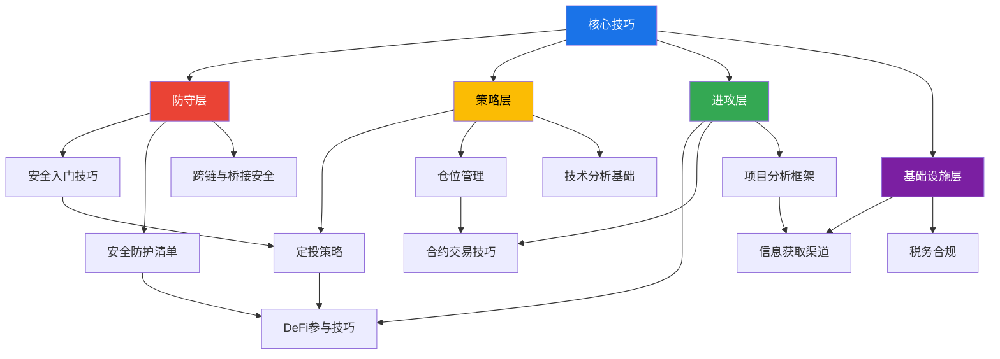
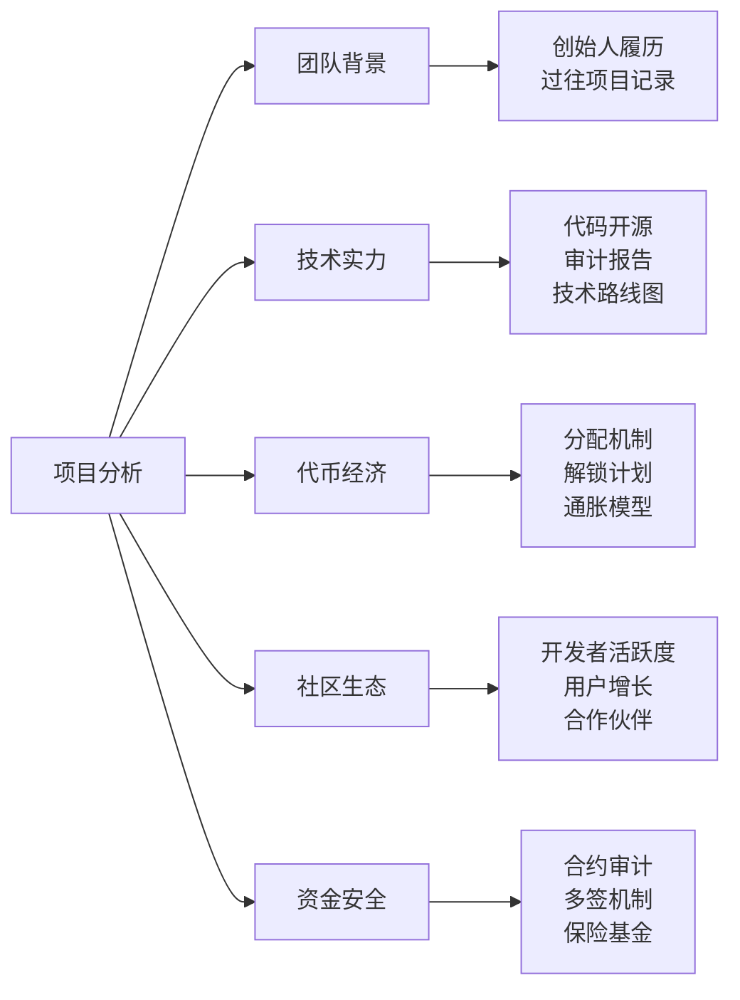

## 十三、核心技巧·本节总结

本节从安全入门到税务合规，系统构建了加密货币投资与DeFi参与的完整实操框架。总结不是简单罗列前文要点，而是将11个知识模块串联成一条**从认知到行动、从防守到进攻、从入门到精通**的完整决策链路，帮你建立"知道该做什么"和"知道不该做什么"的双重能力。

### 13.1 核心技巧知识体系全景

本节11个模块之间的逻辑关系如下：

**自底向上的学习路径**：先掌握防守（安全），再学习策略（定投/仓位/技术分析），然后才进入进攻（DeFi/合约/项目分析），同时持续完善基础设施（信息渠道和税务）。这个顺序不能颠倒——没有安全基础就去参与DeFi，等于没穿盔甲上战场。

### 13.2 各模块核心要点提炼

#### 13.2.1 防守层：安全是一切的前提

**安全入门技巧**——建立第一道防线

| 关键动作 | 具体要求 | 常见错误 |
|----------|---------|---------|
| 选择交易所 | 优先Binance/OKX等头部平台，验证域名真实性 | 点击搜索引擎广告链接进入钓鱼网站 |
| 注册与认证 | 开启二次验证（2FA），使用独立邮箱和强密码 | 复用其他平台密码，用短信验证代替2FA |
| 首次购入 | 小额试水（500-1000元），熟悉充值/交易/提币全流程 | 一次性大额投入，不熟悉操作就上重仓 |
| 钱包创建 | 离线生成助记词，手写备份在物理介质上 | 截图保存助记词，存云端或发给自己 |
| 资产存储 | 交易所只放交易资金，长期持有资产转冷钱包 | 全部资产放在交易所，"方便交易" |

核心认知：**加密货币世界没有客服、没有密码找回、没有退款。私钥即资产，丢失私钥等于丢失资产。** 2022年FTX暴雷导致用户数十亿美元资产无法取出，这是将资产长期存放在中心化交易所的惨痛教训。

**安全防护清单**——持续性的安全习惯

安全不是一次性操作，而是需要持续维护的系统工程。核心清单包括：

- **钱包安全**：助记词物理备份（至少两份，分开存放）、定期检查授权合约（[Revoke.cash](https://revoke.cash)）、不同用途使用不同钱包地址
- **交易安全**：大额转账先小额测试、核对地址前后各6位字符、警惕"先转后返"骗局
- **设备安全**：交易设备不安装来路不明软件、浏览器不装多余插件、考虑使用专用设备进行大额操作
- **信息验证**：项目官网手动输入不点链接、Discord/Telegram中的"官方客服"主动私聊100%是骗子、空投领取前检查合约安全性

**跨链与桥接安全**——跨链操作的特殊风险

跨链桥是DeFi生态中最脆弱的环节之一。2022年Ronin Bridge被黑损失6.25亿美元，Wormhole被黑损失3.2亿美元，Nomad被黑损失1.9亿美元。跨链操作需要注意：

- **选择桥接协议**：优先使用官方桥（如Arbitrum官方桥、Optimism官方桥），其次选经过多次审计且TVL较高的第三方桥（如Stargate、Across）
- **验证目标链代币**：跨链后收到的是"包装代币"还是"原生代币"，两者安全等级不同
- **注意滑点设置**：跨链桥交易的滑点通常比单链DEX更大，适当放大滑点容忍度但不要过大
- **了解桥接机制**：Lock-and-Mint、Burn-and-Mint、Liquidity Pool三种机制的风险模型不同

#### 13.2.2 策略层：纪律性投资体系

**定投策略**——最被低估的投资方法

定投的核心不是"懒人投资"，而是**用纪律对抗人性弱点**的数学最优解。关键要点：

| 定投维度 | 推荐配置 | 说明 |
|----------|---------|------|
| 标的 | BTC 50-70% + ETH 30-50% | 只定投长期存活概率最高的资产 |
| 金额 | 月收入的5%-15% | 不能影响生活质量，不能借钱定投 |
| 频率 | 每月或每周 | 频率差异对收益影响不到3%，坚持最重要 |
| 周期 | 至少3年，建议5年以上 | 覆盖至少一个完整牛熊周期 |
| 平台 | Binance/OKX自动定投 | 设定一次，自动执行，消除人为干扰 |

**定投的心理铁律**：固定时间不改、固定金额不变、不看盘不看新闻、至少坚持一个完整周期。统计数据表明，90%的定投失败者在第12-18个月放弃——恰恰是最可惜的时间点。

**进阶策略**：价值平均法（根据目标增长路径动态调整投入）、网格定投（不同价格区间投入不同倍数）、核心+卫星（70-80%标准DCA + 20-30%灵活操作）。

**仓位管理**——控制风险的数学基础

仓位管理的本质是**用数学限制人性的贪婪和恐惧**。核心工具和原则：

- **凯利公式**：f = (bp - q) / b。假设胜率60%、盈亏比2:1，最优仓位仅40%。超过这个比例长期反而降低总收益——这就是为什么"全仓梭哈"即使方向正确也是错误策略
- **金字塔加仓**：初始仓位占计划总仓位的30-50%，价格每下跌10-15%加仓一次，每次加仓量递减。总加仓不超过3-4次
- **止损纪律**：买入时就写好止损价位，用限价单自动执行。损失厌恶让"割肉"的痛苦是"落袋为安"快乐的2.5倍，只有自动化才能对抗这种本能
- **总仓位控制**：加密资产占个人总资产的比例建议不超过20-30%，其中单个项目不超过总加密仓位的20%

**技术分析基础**——辅助决策的工具而非水晶球

技术分析的价值不在于预测未来，而在于**量化当前市场状态**。必须掌握的基础工具：

- **趋势判断**：均线系统（MA5/MA20/MA60）、趋势线、支撑阻力位。当价格在均线上方且均线多头排列时为上升趋势，反之为下降趋势
- **动量指标**：RSI（超买>70/超卖<30）、MACD（金叉死叉）、成交量（放量突破有效，缩量突破存疑）
- **图表形态**：头肩顶/底、双顶/底、三角形整理、旗形。这些形态的意义在于它们代表了市场参与者的集体心理模式
- **链上数据**：这是加密市场独有的技术分析工具——交易所流入/流出、巨鲸地址动向、MVRV比率、NUPL指标。链上数据比价格数据更能反映真实的供需关系

**核心警告**：技术分析的准确率在最佳情况下也只有55-65%，它只是提高概率的工具，不是确定性的预测。任何声称能100%预测走势的人都是骗子。

#### 13.2.3 进攻层：DeFi与高级操作

**DeFi参与技巧**——去中心化金融的实操指南

DeFi参与按风险等级分为三层：

| 层级 | 参与方式 | 预期年化 | 核心风险 | 最低资金建议 |
|------|---------|---------|---------|------------|
| 低风险 | ETH质押（Lido/Rocket Pool） | 3%-5% | 锁仓期、协议Bug | 0.1 ETH |
| 中风险 | 借贷协议存款（Aave/Compound） | 2%-8% | 智能合约漏洞、清算 | 1000 USDC |
| 高风险 | 流动性挖矿（Uniswap/Curve） | 5%-50% | 无常损失、代币归零 | 1万USDC等值 |
| 极高风险 | 杠杆挖矿、收益聚合器 | 20%-200% | 清算、Rug Pull | 不建议新手参与 |

**无常损失**是DeFi流动性提供者必须理解的核心概念：当你为交易对提供流动性时，如果两种代币的价格比率发生变化，你的资产价值会低于直接持有（HODL）的价值。价格偏离越大，无常损失越严重。价格翻倍时无常损失约5.7%，翻10倍时约25.5%。

**合约交易技巧**——高风险高收益的双刃剑

合约交易（期货/永续合约）是加密市场中最危险的工具。据统计，**超过80%的合约交易者最终亏损**。核心要点：

- **杠杆控制**：新手不超过3倍，有经验者不超过10倍。20倍以上本质上是赌博
- **止损必须设置**：开仓同时设置止损单，止损幅度建议不超过本金的2-3%
- **仓位比例**：合约交易资金不超过总加密仓位的10-20%
- **资金费率**：永续合约每8小时结算一次资金费率，费率为正时空头付费给多头（市场看涨），费率为负时相反。持续高费率（>0.1%）意味着杠杆过度
- **爆仓机制**：当保证金率低于维持保证金率时触发强制平仓。维持保证金率通常为0.5-5%，这意味着即使小幅反向波动也可能爆仓

**项目分析框架**——识别优质项目与规避骗局

评估一个加密项目需要从五个维度系统分析：

**项目分析的核心检查清单**：

1. **代币分配**：团队持有比例超过30%需警惕；早期投资者解锁时间表是否集中（集中解锁=集中抛压）
2. **代码审计**：是否经过知名审计公司（Trail of Bits、OpenZeppelin、Certik）审计，审计发现的问题是否已修复
3. **TVL/市值比**：TVL/市值>1说明协议被低估，<0.5说明可能存在泡沫
4. **收入模型**：协议是否有真实收入（交易手续费、借贷利息），还是纯粹靠代币激励维持TVL
5. **Rug Pull信号**：匿名团队+未审计合约+高APY承诺+流动性未锁定 = 极高概率骗局

#### 13.2.4 基础设施层：信息与合规

**信息获取渠道**——建立自己的信息优势

加密市场是信息不对称最严重的市场之一。掌握高质量信息源是投资决策的基础：

| 信息类型 | 推荐来源 | 用途 |
|----------|---------|------|
| 价格数据 | CoinGecko、CoinMarketCap、TradingView | 行情追踪和技术分析 |
| 链上数据 | Dune Analytics、Nansen、Glassnode、DefiLlama | 判断资金流向和市场状态 |
| 新闻资讯 | The Block、CoinDesk、律动BlockBeats | 及时了解行业动态 |
| 项目研究 | Messari、Token Terminal、L2Beat | 深度研究项目基本面 |
| 社区讨论 | Crypto Twitter（X）、项目Discord | 了解社区情绪和早期信号 |
| 监管动态 | SEC官网、各国央行公告 | 预判监管政策变化 |
| 安全警报 | PeckShield、SlowMist、Rekt News | 及时了解安全事件 |

**信息过滤原则**：80%的加密媒体内容是噪音或利益驱动的。对任何"看涨/看跌"的观点，先问"说这话的人持有什么仓位"。对任何"推荐项目"，先查推荐者是否有该项目的代币持仓。

**税务合规**——合法投资的底线

加密货币的税务处理因国家/地区而异，但核心原则一致：

- **中国大陆**：个人加密货币交易的税务处理目前没有明确法规，但存在被认定为"偶然所得"（20%税率）的风险。矿场经营收入需缴纳增值税和企业所得税
- **美国**：加密货币被视为"财产"（Property），每次交易（包括币币交换）都可能触发资本利得税。持有超过1年适用长期资本利得税率（0-20%），不足1年适用普通所得税率（10-37%）
- **常见应税事件**：卖出为法币、币币交换、用加密货币支付商品/服务、获得挖矿/质押奖励、空投代币
- **记录习惯**：从第一天开始就记录所有交易（交易对、数量、价格、时间、手续费），使用Koinly或CoinTracker等工具自动汇总

### 13.3 能力成长路径

从新手到熟练参与者的成长不是线性的，而是分阶段的。每个阶段有明确的能力目标和里程碑：

| 阶段 | 时间跨度 | 能力目标 | 核心任务 | 里程碑标志 |
|------|---------|---------|---------|----------|
| **入门期** | 第1-3个月 | 建立安全意识，理解基本概念 | 注册交易所、创建钱包、小额买入、学会定投 | 能独立完成一次完整的"法币→加密→冷钱包"操作 |
| **基础期** | 第3-6个月 | 掌握投资策略，建立纪律 | 执行定投计划、学习仓位管理、理解技术分析基础 | 定投3个月不间断，能看懂K线图和基本指标 |
| **进阶期** | 第6-12个月 | 参与DeFi，理解链上世界 | 质押、借贷、流动性提供、学习链上数据分析 | 在Aave或Lido上成功质押并提取收益 |
| **熟练期** | 12-24个月 | 形成完整投资体系 | 项目分析、跨链操作、合约对冲、建立信息网络 | 能独立评估一个新项目的投资价值 |
| **精通期** | 24个月以上 | 持续迭代优化 | 策略回测、链上分析深度化、合规体系 | 投资收益稳定跑赢单纯定投，风险控制良好 |

### 13.4 核心技巧速查对照表

将本节11个模块的关键行动浓缩为一张速查表，方便日常决策参考：

| 场景 | 正确做法 | 常见错误 | 对应模块 |
|------|---------|---------|---------|
| 第一次买币 | 小额试水，走完充/买/提全流程 | 一次性大额投入 | 安全入门 |
| 保存助记词 | 手写在纸上，存两个不同物理位置 | 截图/云存储/发给自己 | 安全防护 |
| 日常投资 | 设定自动定投，不看盘不择时 | 每天盯盘，追涨杀跌 | 定投策略 |
| 大额交易 | 提前设置止损，控制杠杆≤3倍 | 不设止损，10倍以上杠杆 | 仓位管理+合约交易 |
| 发现新项目 | 团队/技术/代币经济/审计五维分析 | 看到APY高就冲进去 | 项目分析 |
| DeFi参与 | 先质押→后借贷→再流动性挖矿 | 直接去挖高APY池子 | DeFi技巧 |
| 跨链操作 | 用官方桥或高TVL第三方桥，先小额测试 | 用不知名桥，一步到位大额 | 跨链安全 |
| 看到"暴富机会" | 先问"谁在推荐，他持有什么仓位" | FOMO冲动投入 | 信息获取 |
| 牛市后期 | 减少卫星仓位，转入稳定币 | 加大投入追涨 | 定投退出+仓位管理 |
| 熊市暴跌 | 坚持定投，适度加仓 | 恐慌割肉 | 定投纪律 |
| 年底报税 | 记录所有交易，用工具汇总 | "加密不需要交税"的幻觉 | 税务合规 |
| 遇到安全事件 | 检查自己的授权，撤销可疑合约授权 | 事不关己不做检查 | 安全防护 |

### 13.5 核心认知纠偏

本节各模块涉及的常见误区，集中在以下十个认知陷阱上：

| 序号 | 误区 | 真相 | 后果 |
|------|------|------|------|
| 1 | "定投什么币都行" | 99%的山寨币会归零，只定投BTC/ETH等长期存活概率最高的资产 | 稳定亏钱 |
| 2 | "技术分析能预测走势" | 最佳准确率仅55-65%，是提高概率的工具而非水晶球 | 过度自信导致重仓 |
| 3 | "DeFi年化50%很安全" | 高APY意味着高风险，可能是代币通胀或无常损失的假象 | 本金归零 |
| 4 | "合约交易能快速致富" | 80%+合约交易者最终亏损，高杠杆是加速器也是粉碎机 | 爆仓 |
| 5 | "交易所很安全" | FTX暴雷证明中心化交易所不是银行，没有存款保险 | 资产无法取出 |
| 6 | "审计过的合约没问题" | 审计不是万能的，审计过也可能被黑（历史上多次发生） | 盲目信任 |
| 7 | "分散投资=买很多币" | 真正的分散是跨资产类别（BTC+ETH+稳定币理财），不是买20个山寨币 | 伪分散，实际高度相关 |
| 8 | "我不需要交税" | 多数国家要求申报加密货币收益，不申报可能面临严重处罚 | 法律风险 |
| 9 | "私钥存在手机备忘录很安全" | 手机丢失/中毒/被黑都会导致私钥泄露 | 资产丢失 |
| 10 | "别人赚了我也能赚" | 幸存者偏差——你听到的都是赚钱的故事，亏钱的人不会到处说 | FOMO |

### 13.6 一页纸行动计划

如果只读本节总结，这是你接下来30天的最小可行行动清单：

**第1周：安全基础**
- [ ] 选择头部交易所（Binance/OKX），完成注册和KYC
- [ ] 开启2FA（推荐Google Authenticator，不推荐短信验证）
- [ ] 创建独立的加密货币专用邮箱
- [ ] 购买一个硬件钱包（Ledger/Trezor，预算500-1500元）或创建软件冷钱包

**第2周：首次实操**
- [ ] 小额购入（500-1000元）BTC或ETH，走完整流程
- [ ] 将资产从交易所提到自己的钱包，体验Gas费和确认时间
- [ ] 记录交易信息（时间、金额、价格、交易哈希）

**第3周：策略建立**
- [ ] 确定定投金额（不超过月收入的10%）
- [ ] 在交易所设置自动定投计划
- [ ] 写一份定投承诺书（标的、金额、周期、不中途放弃）
- [ ] 设日历提醒：每季度复盘一次

**第4周：知识扩展**
- [ ] 注册CoinGecko账户，建立观察列表
- [ ] 学习使用Dune Analytics或DefiLlama看链上数据
- [ ] 关注3-5个高质量加密信息源（详见"信息获取渠道"模块）
- [ ] 了解当地税务申报要求，建立交易记录习惯

**长期习惯**：
- 每月：执行定投，不看价格，不改计划
- 每季度：复盘一次——标的基本面有没有变化？需要调整吗？
- 每年：检查安全措施——助记词是否还安全？授权合约是否需要清理？
- 遇到安全事件：第一时间检查自己的资产和授权是否受影响

### 13.7 本节核心公式与参数速查

**定投相关**：
- 平均成本 = N × C / ΣQᵢ（调和平均数，天然低于算术平均）
- 建议周期：≥3年（覆盖一个减半周期），理想5-8年
- 建议金额：月收入 × (5%~15%)

**仓位管理相关**：
- 凯利公式：f = (bp - q) / b（b=盈亏比，p=胜率，q=1-p）
- 单笔止损上限：总资金的2-3%
- 加密资产占总资产比例：≤20-30%
- 单项目占加密仓位比例：≤20%

**DeFi相关**：
- 无常损失：价格变化x倍时，IL = 2√x / (1+x) - 1
- 清算安全线：保持抵押率 > 协议最低要求的1.5倍
- APY分解：总APY = 基础收益 + 代币激励 + 手续费分成

**安全相关**：
- 2FA类型优先级：硬件密钥 > 认证App > 短信验证
- 授权检查频率：至少每月一次
- 大额转账前测试金额：1-10美元等值

---

**本节总结的总结**：核心技巧的本质是三件事——**安全地持有资产**（防守）、**纪律性地增值资产**（策略）、**理性地参与新机会**（进攻）。先防守，再策略，最后进攻。顺序反了，代价可能是本金归零。
