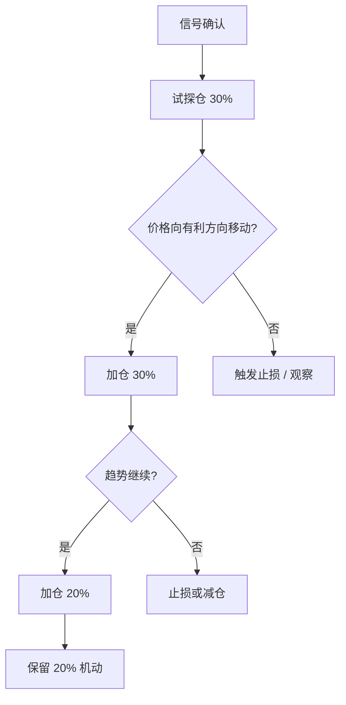
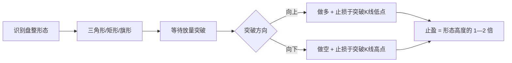

## 九、合约交易技巧

合约交易（Futures / Perpetual Contract）是加密货币市场中最锋利的双刃剑——它允许交易者用少量保证金撬动数倍乃至上百倍的头寸，既能放大收益，也能在瞬间吞噬本金。本章从原理到实战，系统性地拆解合约交易的核心技巧，帮助你建立可复用的交易框架。

### 9.1 合约交易基础认知

#### 9.1.1 什么是合约交易

合约交易是一种**衍生品交易**，交易者不直接持有标的资产（如 BTC、ETH），而是买卖一份约定未来以特定价格交割的合约。与现货交易的根本区别在于：

| 维度 | 现货交易 | 合约交易 |
|------|----------|----------|
| 持有资产 | 实际持有代币 | 仅持有合约仓位 |
| 杠杆 | 无（1x） | 1x—125x |
| 盈利方向 | 仅做多 | 做多 + 做空 |
| 爆仓风险 | 无（资产归零为极限） | 可能爆仓归零甚至穿仓 |
| 资金费率 | 无 | 永续合约每 8h 结算一次 |
| 适用场景 | 长期持有、价值投资 | 对冲、投机、套利 |

#### 9.1.2 合约类型详解

**1. 永续合约（Perpetual Contract）**

没有到期日，通过**资金费率（Funding Rate）**机制锚定现货价格。当永续合约价格高于现货时，多头向空头支付资金费；反之亦然。资金费率通常每 8 小时结算一次（部分交易所为 4h 或 1h）。

资金费率计算公式：

```text
资金费用 = 仓位价值 × 资金费率
```

例如：持有价值 $10,000 的 BTC 多头仓位，资金费率为 0.01%，则每 8 小时支付 $1。年化约 10.95%，这是持有成本，长期持仓必须考虑。

**2. 交割合约（Delivery / Futures）**

有固定到期日（当周、次周、当季、次季）。到期时按标记价格进行实物或现金交割。适合有明确时间窗口的策略，如事件驱动交易。

**3. 币本位 vs U本位**

- **U本位（USDT/USDC-M）**：保证金和盈亏以稳定币计价，计算直观，适合新手
- **币本位（Coin-M）**：保证金和盈亏以标的币种计价，适合"囤币做对冲"的老手

新手强烈建议从 **U本位永续合约**起步，概念最简单，风险最可控。

#### 9.1.3 核心术语速查

| 术语 | 含义 |
|------|------|
| 开仓（Open） | 建立多头或空头仓位 |
| 平仓（Close） | 结束仓位，实现盈亏 |
| 杠杆（Leverage） | 保证金的放大倍数，如 10x 意味着 $100 保证金控制 $1,000 仓位 |
| 保证金（Margin） | 开仓所需的抵押资产 |
| 维持保证金（Maintenance Margin） | 保持仓位不被强平的最低保证金比例 |
| 强平/爆仓（Liquidation） | 保证金不足以维持仓位时，交易所强制平仓 |
| 标记价格（Mark Price） | 用于计算强平价格的公允价格，防止插针爆仓 |
| 合约乘数（Contract Multiplier） | 一张合约代表的标的数量 |
| 未实现盈亏（Unrealized PnL） | 当前持仓的浮动盈亏 |
| 已实现盈亏（Realized PnL） | 已平仓部分的实际盈亏 |

### 9.2 杠杆使用的黄金法则

#### 9.2.1 杠杆与爆仓价格的关系

杠杆越高，爆仓价格越接近开仓价格。以做多 BTC 为例（忽略手续费和资金费）：

| 杠杆 | 开仓价 $60,000 时的强平价 | 容错幅度 |
|------|--------------------------|----------|
| 2x | $30,000 | -50% |
| 5x | $48,000 | -20% |
| 10x | $54,000 | -10% |
| 20x | $57,000 | -5% |
| 50x | $58,800 | -2% |
| 100x | $59,400 | -1% |
| 125x | $59,520 | -0.8% |

BTC 日内波动 2%—5% 是常态，使用 50x 以上杠杆意味着市场正常波动就可能触发强平。

#### 9.2.2 推荐杠杆区间

- **新手入门**：2x—3x，先学会控制仓位和止损
- **有经验交易者**：5x—10x，配合严格的止损策略
- **短线剥头皮**：10x—20x，极短线操作，持仓时间以分钟计
- **超过 20x**：本质上是赌博，不建议任何人在实战中使用

#### 9.2.3 逐仓 vs 全仓

| 模式 | 特点 | 适用场景 |
|------|------|----------|
| 逐仓（Isolated） | 每个仓位独立保证金，爆仓仅损失该仓位保证金 | 高杠杆、多策略并行、风险隔离 |
| 全仓（Cross） | 所有可用余额作为所有仓位的共同保证金 | 低杠杆、对冲策略、防止误爆 |

**关键原则**：使用逐仓模式时，可以手动追加保证金来降低强平价格；全仓模式下，一个仓位的亏损会占用其他仓位的保证金。

### 9.3 仓位管理——决定生死的核心技能

#### 9.3.1 单笔风险控制

**永远不要在单笔交易上承担超过总资金 1%—2% 的风险。** 这是职业交易者的铁律。

计算公式：

```text
最大仓位大小 = 总资金 × 单笔风险比例 ÷ (开仓价 - 止损价) / 开仓价
```

示例：账户 $10,000，单笔风险 1%（$100），BTC 开仓价 $60,000，止损价 $58,000

```text
最大仓位 = $10,000 × 1% ÷ ($60,000 - $58,000) / $60,000
         = $100 ÷ 3.33%
         = $3,000（即 0.05 BTC）
```

这意味着你需要 3.3x 杠杆开 $3,000 的仓位，而不是用 10x 杠杆开满。

#### 9.3.2 金字塔加仓法

不要一次性重仓，而是分批建仓：



每一步加仓都应**上移止损到盈亏平衡点**，确保后续加仓不增加整体风险。

#### 9.3.3 仓位大小速查表

以 $10,000 账户为例，单笔风险 1%（$100），10x 杠杆：

| 止损幅度 | 仓位大小 | 名义价值 | 实际杠杆 |
|----------|----------|----------|----------|
| 0.5% | $20,000 | $20,000 | 2x |
| 1% | $10,000 | $10,000 | 1x |
| 2% | $5,000 | $5,000 | 0.5x |
| 3% | $3,333 | $3,333 | 0.33x |
| 5% | $2,000 | $2,000 | 0.2x |

注意：止损幅度越大，可开仓位越小。这意味着大止损的交易需要更少的杠杆，而非更多。

### 9.4 止损策略——活着比赚钱更重要

#### 9.4.1 止损的三种类型

**1. 固定价格止损**

在开仓时确定一个明确的止损价位。优点是简单明确；缺点是不考虑市场结构。

**2. 技术位止损**

基于支撑/阻力、均线、前低前高等技术位置设置止损。这是最推荐的方法。

```text
做多止损位置选择优先级：
1. 最近的关键支撑位下方 0.5%—1%（留缓冲防止插针）
2. 开仓K线的低点下方
3. 关键均线（如 EMA20、EMA50）下方
4. ATR（平均真实波幅）的 1.5—2 倍
```

**3. 动态止损（Trailing Stop）**

止损价格随价格运动自动调整，锁定利润。

- 价格创新高后，止损上移至新低点
- 部分交易所原生支持追踪止损功能
- 也可以手动执行：每当价格突破新阻力位，将止损上移至该阻力位下方

#### 9.4.2 止损设置的常见错误

- **错误一：止损太紧**——正常的市场噪音就触发止损，反复被"扫"。应给价格足够的呼吸空间
- **错误二：止损太宽**——单笔风险远超 1%—2%，一次亏损就重伤账户
- **错误三：移动止损（扩大亏损方向）**——价格接近止损时手动下移止损，"再给它一次机会"。这是通向爆仓最快的路
- **错误四：不设止损**——"扛单"在合约市场是致命的。现货可以扛回，合约会爆仓

#### 9.4.3 必须使用止损的场景

- **隔夜持仓**：加密市场 24/7 运行，凌晨的一根针可以清仓
- **重大事件前后**：美联储议息、CPI 数据、交易所大额清算
- **高杠杆操作**：杠杆越高，止损必须越紧
- **流动性低的时段**：亚洲凌晨（UTC 2:00—6:00）流动性最薄，滑点大

### 9.5 资金费率套利策略

#### 9.5.1 费率套利原理

当资金费率持续为正且数值较高时（如 >0.05%/8h），存在低风险套利机会：

```text
策略：现货做多 + 永续做空
净敞口 = 0（市场中性）
收益 = 资金费率收入 - 交易成本
```

当资金费率持续为负时，反向操作：现货做空（借币卖出）+ 永续做多。

#### 9.5.2 实操步骤

1. **监控资金费率**：关注 Binance、Bybit、OKX 等主流交易所的费率排行
2. **计算净收益**：净收益 = 费率收入 - 开平仓手续费 - 滑点成本
3. **选择高费率且低波动的标的**：新上线的小币种费率可能很高（0.3%—1%/8h），但波动也大
4. **同步开仓**：现货和永续同时开仓，避免方向性风险
5. **定期收取资金费**：费率回归正常时平仓

#### 9.5.3 费率套利的风险

- **交易所风险**：资产存放在交易所，存在黑客攻击、跑路等风险
- **基差风险**：现货和永续的价差可能扩大，造成未实现亏损
- **费率突变**：费率可能从正转负，逆转套利方向
- **流动性风险**：平仓时滑点可能侵蚀利润
- **资金效率**：保证金占用大，年化收益通常 15%—40%，不如想象中高

### 9.6 常见合约交易策略

#### 9.6.1 趋势跟踪策略

**核心思想**：顺势而为，在趋势确认后入场，在趋势反转时出场。

入场条件：
- 价格突破关键阻力/支撑位
- 均线系统多头/空头排列（如 EMA8 > EMA21 > EMA55）
- MACD 金叉/死叉且零轴方向正确
- 成交量放大确认突破

出场条件：
- 趋势线被有效突破
- 均线死叉/金叉
- RSI 顶背离/底背离
- 达到目标止盈位

适用时间框架：4H、1D。趋势策略不适合 15m 以下的超短线。

#### 9.6.2 区间震荡策略

在明确的支撑/阻力区间内高抛低吸：

```text
识别区间：
- 至少两次触及阻力位回落
- 至少两次触及支撑位反弹
- RSI 在 30—70 之间震荡

做多条件：价格触及区间下沿 + RSI < 35 + 出现看涨K线形态
做空条件：价格触及区间上沿 + RSI > 65 + 出现看跌K线形态

止损：区间外 1%
止盈：区间对侧（盈亏比至少 1.5:1）
```

**重要警告**：区间策略在趋势行情中会连续亏损。必须设置"区间破坏"的退出机制——一旦价格有效突破区间，立即停止区间策略。

#### 9.6.3 突破交易策略



突破交易的核心难点是**假突破（Fakeout）**。过滤假突破的方法：
- 等待收盘确认（不追第一根突破K线）
- 要求突破时成交量至少为均量的 1.5 倍
- 使用"突破+回踩"模式：突破后等回踩支撑再入场
- 避免在重大事件前交易突破（如 BTC ETF 审批日前）

#### 9.6.4 网格交易策略

在设定的价格区间内，以固定间距布设多个买单和卖单，自动低买高卖。

参数设置示例（BTC $60,000—$70,000 区间）：

| 参数 | 推荐值 |
|------|--------|
| 网格数量 | 20—50 格 |
| 每格间距 | 0.5%—1% |
| 投入总额 | 账户的 30%—50% |
| 杠杆 | 1x—3x |
| 止损 | 区间下方 3%—5% |

网格交易的优势是**无需判断方向**，缺点是在单边趋势行情中会持续亏损（做多网格遇暴跌、做空网格遇暴涨）。

### 9.7 风控体系——系统化管理风险

#### 9.7.1 三层风控架构

```text
┌─────────────────────────────────────────────┐
│           第一层：账户级风控                    │
│  - 总资金回撤不超过 10%—15%                    │
│  - 单日最大亏损不超过 3%—5%                    │
│  - 同时持仓不超过 3—5 个                       │
│  - 总杠杆敞口不超过账户的 5x                    │
├─────────────────────────────────────────────┤
│           第二层：仓位级风控                    │
│  - 单笔亏损不超过 1%—2%                       │
│  - 盈亏比至少 2:1                             │
│  - 必须预设止损价                              │
│  - 逐仓模式隔离风险                           │
├─────────────────────────────────────────────┤
│           第三层：执行级风控                    │
│  - 禁止追涨杀跌                               │
│  - 禁止报复性交易（亏损后加倍赌）              │
│  - 禁止频繁切换策略                            │
│  - 每笔交易必须有明确的入场理由                │
└─────────────────────────────────────────────┘
```

#### 9.7.2 连续亏损应对方案

当连续亏损达到阈值时，执行以下"熔断"机制：

| 连续亏损次数 | 操作 |
|-------------|------|
| 3 次 | 仓位减半，重新审视策略 |
| 5 次 | 停止交易 24 小时，复盘所有交易记录 |
| 7 次 | 停止交易一周，检查策略是否与当前市场匹配 |
| 10 次 | 暂停所有实盘，回到模拟盘重新验证 |

#### 9.7.3 穿仓防护

穿仓（Negative Balance）指亏损超过保证金，账户余额变为负数。防护措施：

1. 使用逐仓模式——最有效的防护
2. 设置价格预警——在接近强平价时手动减仓
3. 不要在流动性极低的时段持有高杠杆仓位
4. 选择有穿仓保护机制的交易所（如 Binance 的保险基金机制）
5. 大仓位分散到多个交易所

### 9.8 交易所选择与实操指南

#### 9.8.1 主流合约交易所对比

| 交易所 | 最大杠杆 | 合约类型 | 资金费率频率 | 强平机制 | 特色 |
|--------|----------|----------|-------------|----------|------|
| Binance | 125x | U本位 + 币本位 | 8h / 4h（部分） | ADL + 保险基金 | 流动性最好，品种最多 |
| Bybit | 100x | USDT + 反向 | 8h | ADL + 保险基金 | 界面友好，API 稳定 |
| OKX | 125x | USDT + 币本位 + 模拟 | 8h | 梯度保证金 | 策略交易工具丰富 |
| Bitget | 125x | USDT + 反向 | 8h | ADL | 跟单功能强 |
| dYdX | 20x | 永续（链上） | 1h | 自动去中心化清算 | 去中心化，无需 KYC |

#### 9.8.2 新手操作流程

以 Binance U本位永续合约为例：

**第一步：开通合约账户**
1. 完成身份认证（KYC）
2. 进入"合约"页面，阅读风险提示并同意
3. 选择 U本位永续合约

**第二步：划转资金**
1. 从现货账户划转 USDT 到合约账户
2. 初始建议不超过总资金的 10%—20%
3. 使用限价划转，避免滑点

**第三步：设置杠杆和模式**
1. 选择逐仓模式（新手必须）
2. 设置杠杆为 3x—5x
3. 确认保证金币种为 USDT

**第四步：下单**
1. 选择限价单（Limit）而非市价单（Market）
2. 设置止损价和止盈价（使用 TP/SL 功能）
3. 确认仓位大小在风控范围内

**第五步：监控和管理**
1. 设置价格预警
2. 定期检查资金费率
3. 根据行情调整止损位

#### 9.8.3 API 交易

对于量化交易者，通过 API 进行合约交易可以实现自动化策略：

```python
# 示例：使用 ccxt 库连接 Binance 合约
import ccxt

exchange = ccxt.binance({
    'apiKey': 'YOUR_API_KEY',
    'secret': 'YOUR_SECRET',
    'options': {
        'defaultType': 'future',  # 切换到合约模式
    },
    'enableRateLimit': True,
})

# 设置杠杆
exchange.set_leverage(5, 'BTC/USDT:USDT')

# 设置逐仓模式
exchange.set_margin_mode('isolated', 'BTC/USDT:USDT')

# 下限价多单
order = exchange.create_limit_buy_order(
    symbol='BTC/USDT:USDT',
    amount=0.01,          # 0.01 BTC
    price=58000,          # 限价 $58,000
    params={
        'stopLoss': {
            'triggerPrice': 56500,  # 止损触发价
            'price': 56400,         # 止损委托价
        },
        'takeProfit': {
            'triggerPrice': 62000,  # 止盈触发价
            'price': 62100,         # 止盈委托价
        }
    }
)

print(f"订单ID: {order['id']}, 状态: {order['status']}")
```

### 9.9 合约交易的心理陷阱

#### 9.9.1 六大致命心理偏差

**1. 赌徒谬误（Gambler's Fallacy）**

"已经跌了这么多，一定会反弹"——市场价格没有均值回归的义务。趋势可以延续远超你的想象。

**纠正方法**：只看技术信号，不做主观预测。止损触发就走，不抱幻想。

**2. 损失厌恶（Loss Aversion）**

人类对亏损的痛感是等额盈利快感的 2—2.5 倍。这导致交易者倾向于：持有亏损仓位太久（"等回本"），过早平掉盈利仓位（"落袋为安"）。

**纠正方法**：严格执行预设的止损和止盈，用规则代替感觉。

**3. 过度交易（Overtrading）**

每天交易 10—20 次甚至更多，每次交易都在消耗手续费和注意力。

**纠正方法**：每天最多交易 2—3 次。没有信号就不交易。好的交易机会是等出来的。

**4. 锚定效应（Anchoring）**

"BTC 历史最高 $73,000，现在 $65,000 一定涨回去"——用过去的高点作为未来目标是危险的。

**纠正方法**：每笔交易只看当前的技术结构和市场情绪，与历史价格无关。

**5. FOMO（Fear of Missing Out）**

看到别人赚钱就着急入场，往往买在最高点。

**纠正方法**：接受"错过这次机会"是正常的。市场永远有机会，但你的资金是有限的。

**6. 报复性交易（Revenge Trading）**

亏损后急于"回本"，加大仓位和杠杆，导致更大的亏损。

**纠正方法**：亏损后强制休息。触发连续亏损熔断机制。

#### 9.9.2 建立交易纪律清单

每次开仓前对照检查：

```text
□ 我有明确的入场理由吗？
□ 我知道止损在哪里吗？
□ 我知道止盈在哪里吗？
□ 单笔风险在 1%—2% 以内吗？
□ 盈亏比至少 2:1 吗？
□ 我当前的情绪状态如何？（愤怒/焦虑/兴奋 → 不交易）
□ 我是否在报复性交易？
□ 这笔交易符合我的策略吗？
□ 我有足够的时间监控这笔交易吗？
□ 重大事件/数据发布在即吗？
```

10 项中如果有任何一项答"否"，就不应该开仓。

### 9.10 高级技巧与进阶策略

#### 9.10.1 多空对冲策略

同时持有方向相反的仓位，利用仓位差异或不同交易所的价差获利：

```text
策略 A：跨交易所价差对冲
- 在 A 交易所做多 BTC，B 交易所做空 BTC
- 当 A 的合约价格低于 B 时开仓
- 等价差收敛时同时平仓
- 风险：交易所提币延迟、单边强平

策略 B：永续 vs 交割价差
- 当季度合约溢价高于永续合约时
- 做空季度合约 + 做多永续合约
- 等交割日价差收敛获利
- 年化收益通常 10%—30%
```

#### 9.10.2 清算热力图分析

大额杠杆仓位的强平价格聚集区（清算池）会吸引价格运动。当价格接近大量清算聚集区时，容易出现"插针"行情。

分析工具：
- Coinglass（coinglass.com）提供实时清算热力图
- 观察价格上下方的清算密度
- 清算密集区 = 价格可能被吸引过去的磁铁

#### 9.10.3 未平仓合约（OI）分析

| OI 变化 | 价格变化 | 信号 |
|---------|----------|------|
| OI ↑ | 价格 ↑ | 新多头入场，趋势健康 |
| OI ↑ | 价格 ↓ | 新空头入场，下跌趋势 |
| OI ↓ | 价格 ↑ | 空头平仓（空头踩踏），反弹可能短暂 |
| OI ↓ | 价格 ↓ | 多头平仓（多头踩踏），下跌可能见底 |

OI 急剧增加（>20%/24h）通常预示即将出现剧烈波动。

#### 9.10.4 融资费率多空比分析

```text
多空比 > 2.0：市场过度看多，反转风险增加
多空比 < 0.5：市场过度看空，反弹概率增大
多空比在 0.8—1.5 之间：市场中性，趋势可能延续
```

注意：多空比是滞后指标，应结合价格行为和其他指标综合判断。

### 9.11 实战案例复盘

#### 案例一：趋势跟踪做多 BTC

```text
背景：BTC 在 $58,000—$62,000 盘整 3 周
信号：日线突破 $62,000，成交量 2 倍于均量，EMA8 上穿 EMA21
操作：
  - 入场：$62,200，5x 杠杆，逐仓
  - 试探仓 30%：$3,000 仓位
  - 止损：$60,000（-3.5%），风险 = $3,000 × 3.5% = $105（账户 1.05%）
  - 价格涨至 $64,000：加仓 30%，止损上移至 $62,000（盈亏平衡）
  - 价格涨至 $67,000：加仓 20%，止损上移至 $64,500
  - 价格涨至 $70,000：追踪止损触发于 $68,500
结果：平均仓位 $64,000，平仓 $68,500，收益约 7%（含杠杆后 35%）
复盘：严格执行分批建仓 + 移动止损，利润最大化的同时风险可控
```

#### 案例二：假突破做空 ETH

```text
背景：ETH 在 $3,400—$3,600 区间震荡
信号：价格突破 $3,650，但成交量仅为均量的 0.8 倍，RSI 顶背离
操作：
  - 等待：突破后 2 根 K 线收盘未能站稳 $3,600
  - 做空：$3,580，5x 杠杆
  - 止损：$3,700（+3.4%）
  - 止盈：$3,350（区间下沿），盈亏比 1.9:1
结果：价格 36 小时内回落至 $3,380，平仓获利
复盘：假突破是最佳的反向交易机会，但必须等待确认
```

### 9.12 常见误区与纠正

| 误区 | 真相 | 纠正方法 |
|------|------|----------|
| "高杠杆 = 高收益" | 高杠杆 = 低容错 = 高爆仓概率 | 降低杠杆，通过仓位管理放大收益 |
| "止损会让我亏钱" | 不止损会让你破产 | 止损是保险费，不是亏损 |
| "满仓梭哈一把暴富" | 99% 的人因此爆仓 | 分散仓位，控制单笔风险 |
| "合约就是赌博" | 没有策略的合约才是赌博 | 建立系统化的交易框架 |
| "跟着大V 交易准没错" | 你不知道大V 的仓位和止损 | 独立思考，自行决策 |
| "模拟盘没用" | 模拟盘是零成本试错场 | 新策略必须先在模拟盘验证 |
| "我一定能控制情绪" | 极端行情下没人能完全控制 | 用自动化工具代替情绪决策 |

### 9.13 推荐学习路径

```text
入门阶段（1—2 个月）：
├── 理解合约基础概念和机制
├── 在模拟盘练习开平仓操作
├── 学习基本的技术分析（K线、支撑阻力、均线）
├── 用 2x—3x 杠杆小额实盘（$100—$500）
└── 重点：学会止损

进阶阶段（3—6 个月）：
├── 建立自己的交易策略体系
├── 学习仓位管理和风险计算
├── 掌握资金费率和 OI 分析
├── 用 5x 杠杆中等仓位实盘
└── 重点：一致性执行

成熟阶段（6—12 个月）：
├── 优化策略参数，统计回测数据
├── 学习高级策略（对冲、套利）
├── 使用 API 进行半自动化交易
├── 逐步提高仓位规模
└── 重点：系统化和自动化
```
