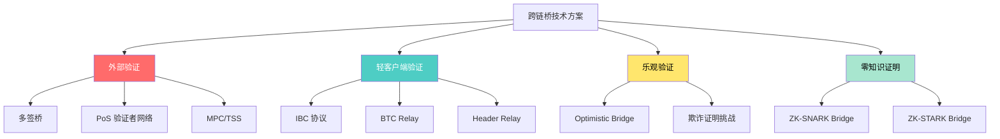

## 十、跨链技术与桥接安全

区块链世界并非单一链条的天下。以太坊、Solana、Avalanche、BNB Chain、Polygon、Arbitrum、Optimism 等数十条公链各自运行独立的状态机，资产和数据天然隔离。跨链技术（Cross-chain Technology）的核心使命就是打破这种隔离——让用户在链 A 上持有的资产能安全、高效地转移到链 B 上使用，或者让链 A 的智能合约能读取链 B 的状态。

桥接（Bridge）是跨链技术最直接的落地形态，也是 DeFi 生态中资金量最大、风险最集中的基础设施之一。据 DefiLlama 统计，跨链桥的总锁仓量（TVL）长期维持在 100 亿美元以上，而桥接协议也是黑客攻击的头号目标——2022 年仅 Ronin Bridge（6.25 亿美元）和 Wormhole（3.2 亿美元）两起事件就造成了近 10 亿美元的损失。理解跨链技术的原理和桥接安全的核心要点，是每个 DeFi 参与者的必修课。

---

### 1. 跨链问题的本质：为什么跨链这么难

#### 1.1 区块链的孤岛效应

每条区块链都是一个封闭的状态机。以太坊上的 USDT 余额记录在以太坊的状态树中，Solana 上的 SPL-USDT 记录在 Solana 的账户模型里。两条链之间没有共享的内存、没有共同的执行环境、甚至没有统一的时钟。跨链操作本质上是一个**分布式系统中的状态一致性问题**：如何在两个互不信任的系统之间，安全地转移资产的所有权？

这比传统金融中的跨境汇款还要复杂。银行之间至少有 SWIFT 这样的共享协议和法律框架，而区块链之间连最基本的"对方链是否真的执行了这笔交易"都需要额外的验证机制来确认。

#### 1.2 跨链的三大核心挑战

| 挑战 | 说明 | 具体表现 |
|------|------|----------|
| **状态验证** | 链 A 如何确认链 B 上确实发生了某笔交易？ | 以太坊无法直接读取 Solana 的区块头 |
| **资产映射** | 跨链后的"资产"到底是什么？原生资产还是包装资产？ | WETH、WBTC 等包装资产依赖桥的安全性 |
| **原子性保证** | 跨链操作要么两端都完成，要么两端都回滚——这几乎不可能在异构链间实现 | 用户在链 A 锁了资产，但链 B 的铸造失败，资产被困在桥合约中 |

#### 1.3 跨链不可能三角

跨链系统面临一个类似于区块链的不可能三角，三个目标最多只能同时满足两个：

| 特性 | 含义 |
|------|------|
| **通用性（Generality）** | 能传递任意消息，不仅仅是资产转移 |
| **无信任性（Trustlessness）** | 不依赖任何外部可信第三方 |
| **可扩展性（Extensibility）** | 能轻松支持新链 |

例如，原子交换（Atomic Swap）实现了无信任和通用性，但可扩展性差（需要 HTLC，且不支持复杂消息传递）。中心化桥实现了通用性和可扩展性，但牺牲了无信任性。

---

### 2. 跨链桥的技术架构分类

#### 2.1 按验证机制分类

跨链桥的核心差异在于**谁来验证源链上的交易**。根据验证机制的不同，桥可以分为以下几大类：

**（1）外部验证（External Validation / Multi-sig）**

由一组外部验证者（通常 3-21 个多签钱包或验证者节点）来确认源链上的交易，然后在目标链上执行对应操作。

- **工作原理**：用户在链 A 存入资产 → 外部验证者监听并确认 → 验证者在链 B 铸造包装资产
- **典型项目**：Wormhole（Guardian 网络）、Ronin Bridge（Axie Infinity 的侧链桥）、Multichain（已暴雷）
- **安全性取决于**：验证者集合的诚实多数假设，类似 PoS 共识
- **优点**：实现简单，支持任意消息传递，可扩展性强
- **缺点**：引入了外部信任假设，验证者合谋或被攻破即意味着资金损失

**（2）轻客户端验证（Light Client / Relay）**

在目标链上部署源链的轻客户端，通过中继器（Relay）传递区块头和默克尔证明，目标链上的合约可以自主验证源链交易的真实性。

- **工作原理**：中继器持续将链 A 的区块头同步到链 B 的轻客户端合约 → 用户提交默克尔证明 → 链 B 合约验证证明后执行操作
- **典型项目**：IBC（Cosmos 生态）、LayerZero（部分机制）、BTC Relay
- **安全性取决于**：源链和目标链的共识安全性，无额外信任假设
- **优点**：安全性最高，完全去信任
- **缺点**：实现复杂度高，链上验证成本大（需要验证签名和区块头），对目标链的智能合约能力有要求

**（3）乐观验证（Optimistic Validation）**

默认假设跨链消息是有效的，设置一个挑战期（通常 1-7 天），在此期间任何人都可以提交欺诈证明来挑战无效消息。

- **工作原理**：观察者（Relayer）提交跨链消息的断言 → 挑战期内无人挑战则视为有效 → 若被挑战则通过欺诈证明裁决
- **典型项目**：Optimism 的跨链桥、Arbitrum 的 L1↔L2 桥、Across Protocol
- **安全性取决于**：至少有一个诚实的观察者在线并愿意提交欺诈证明（1-of-N 信任假设）
- **优点**：无需链上验证所有签名，成本低；安全性优于多签方案
- **缺点**：存在挑战期延迟（通常 7 天），资金到账慢

**（4）零知识证明验证（ZK Verification）**

使用零知识证明（ZK-SNARK/ZK-STARK）来证明源链上某笔交易确实发生，目标链上的合约只需验证简洁的证明即可。

- **工作原理**：链下生成源链交易有效性的 ZK 证明 → 提交到目标链的验证合约 → 合约验证证明后执行操作
- **典型项目**：Succinct Labs、zkBridge、Polymer Labs、=nil; Foundation
- **安全性取决于**：密码学假设（椭圆曲线离散对数、哈希函数抗碰撞等）
- **优点**：安全性最高（密码学保证），无需信任任何第三方，验证成本低
- **缺点**：生成证明的计算成本高、延迟大；技术尚在早期，实际部署项目较少

#### 2.2 按资产转移方式分类

**（1）锁定-铸造（Lock-and-Mint）**

用户在源链将资产锁定到桥合约 → 桥在目标链铸造等量的包装资产（如 WETH、WBTC）。

这是最常见的模式，但引入了包装资产的对手方风险：如果桥合约被攻破，包装资产将失去底层支撑，变成废纸。2022 年 Wormhole 事件中，攻击者凭空铸造了 12 万 WETH，这些 WETH 理论上没有对应的 ETH 被锁定。

**（2）燃烧-铸造（Burn-and-Mint）**

资产在源链被销毁（burn） → 桥在目标链铸造等量的原生资产。这要求源链和目标链使用同一个代币标准，且桥具有在源链销毁代币的权限。

典型用例是 Circle 的 CCTP（Cross-Chain Transfer Protocol）：用户销毁 USDC → Circle 的 attestation 服务确认 → 在目标链铸造新的 USDC。

**（3）原子交换（Atomic Swap）**

使用哈希时间锁合约（HTLC），双方在两条链上分别锁定资产，用同一个哈希原像解锁。

```text
流程：
1. Alice 生成随机数 s，计算 hash = SHA256(s)
2. Alice 在链 A 锁定资产，条件：hash 解锁 or 超时退回
3. Bob 看到后在链 B 锁定资产，条件：同一个 hash 解锁 or 超时退回
4. Alice 用 s 解锁链 B 上 Bob 的资产（此时 s 被公开）
5. Bob 用公开的 s 解锁链 A 上 Alice 的资产
```

优点是完全去信任，缺点是只支持简单的资产交换，不支持复杂消息，且流动性碎片化。

**（4）流动性网络（Liquidity Network）**

在两条链上分别部署流动性池，用户在源链存入资产，流动性提供者（LP）在目标链垫付资产。本质上是一个跨链的做市商网络。

- **典型项目**：Across Protocol、Stargate、Hop Protocol、Thorchain
- **优点**：用户无需等待，速度快；不产生包装资产
- **缺点**：依赖 LP 提供充足流动性；大额跨链可能滑点高

#### 2.3 技术方案全景对比



| 维度 | 外部验证 | 轻客户端 | 乐观验证 | ZK 证明 |
|------|----------|----------|----------|---------|
| 信任模型 | 验证者多数诚实 | 仅信任双方链的共识 | 1-of-N 诚实观察者 | 仅信任密码学 |
| 安全性 | ★★☆ | ★★★ | ★★★☆ | ★★★★★ |
| 速度 | 快（分钟级） | 中等 | 慢（天级挑战期） | 中等（证明生成耗时） |
| 成本 | 低 | 高（链上验证） | 低 | 高（证明生成）低（验证） |
| 通用性 | 高 | 中 | 高 | 中（在发展中） |
| 典型项目 | Wormhole, Multichain | IBC, BTC Relay | Across, Hop | Succinct, zkBridge |

---

### 3. 主流跨链桥实战解析

#### 3.1 LayerZero：全链消息传递协议

LayerZero 严格来说不是一个桥，而是一个**跨链消息传递基础设施**。它定义了三个角色：

- **Endpoint（端点）**：部署在每条链上的入口合约，负责发送和接收消息
- **Oracle（预言机）**：将源链的区块头中继到目标链（默认使用 Chainlink）
- **Relayer（中继器）**：提交跨链消息的默克尔证明

安全性依赖于 Oracle 和 Relayer 的**独立性假设**：只要两者不同时作恶，消息就是安全的。这比纯粹的多签桥强，但比轻客户端验证弱。

**使用场景**：Stargate Finance（基于 LayerZero 的统一流动性桥）、lzUSDT 等全链代币。

**风险提示**：LayerZero 的安全模型要求用户信任 Oracle 和 Relayer 的独立运作。如果两者合谋（例如 Oracle 和 Relayer 都由同一实体控制），可以伪造任意跨链消息。

#### 3.2 IBC（Inter-Blockchain Communication）：Cosmos 生态的跨链标准

IBC 是目前安全性最高的跨链协议之一，它采用了**轻客户端验证**机制：

```text
IBC 跨链流程：
1. 链 A 上的 IBC 模块将数据包（Packet）发送到源链端口
2. 中继器（Relayer）将链 A 的区块头和证明提交到链 B
3. 链 B 上的轻客户端验证链 A 的区块头和交易证明
4. 验证通过后，链 B 执行对应的资产铸造或状态变更
```

IBC 的安全性等于底层链的共识安全性——没有任何额外的信任假设。但它的限制是：两端链都需要支持 Tendermint 共识或兼容的轻客户端验证，这使得它主要局限于 Cosmos 生态（以及支持 IBC 的 L2 如 Injective、dYdX Chain）。

#### 3.3 Across Protocol：基于 UMA 的乐观跨链桥

Across 采用**乐观验证 + 流动性网络**的组合方案：

1. 用户发起跨链请求
2. 中继器（Integrator）立即在目标链垫付资金给用户（秒级到账）
3. 中继器提交报销请求到以太坊主网的 Hub 合约
4. 进入挑战期（约 1-2 小时，远短于传统乐观桥的 7 天）
5. 无人挑战则中继器获得报销

安全性由 UMA 的**乐观预言机（Optimistic Oracle）**保障：任何争议都通过 UMA 的 DVM（Data Verification Mechanism）投票裁决。这意味着 Across 的安全性最终依赖于 UMA 代币持有者的经济博弈——攻击者需要控制足够的 UMA 代币才能通过恶意裁决。

#### 3.4 Circle CCTP：原生 USDC 跨链

Circle 的 Cross-Chain Transfer Protocol 是最安全的 USDC 跨链方案，因为它由 Circle（USDC 发行方）直接背书：

```text
CCTP 流程：
1. 用户在源链将 USDC 存入 CCTP 的 TokenMessenger 合约（USDC 被销毁）
2. Circle 的 attestation 服务确认这笔燃烧交易
3. 用户或中继器将 attestation 提交到目标链
4. 目标链的 MessageTransmitter 合约验证 attestation 后铸造新的 USDC
```

CCTP 的优势是不产生包装资产——在目标链铸造的是**原生 USDC**，而不是 wrapped USDC。劣势是仅支持 USDC，且依赖 Circle 的中心化 attestation 服务。

---

### 4. 桥接安全：历史事件深度复盘

#### 4.1 重大桥接攻击事件一览

| 事件 | 时间 | 损失 | 攻击方式 | 根因 |
|------|------|------|----------|------|
| Ronin Bridge | 2022.03 | 6.25 亿美元 | 社会工程学获取验证者私钥 | 5/9 多签，4 个由同一体控制 |
| Wormhole | 2022.02 | 3.2 亿美元 | 绕过签名验证的合约漏洞 | 代码 bug：未验证 Guardian 签名 |
| Nomad Bridge | 2022.08 | 1.9 亿美元 | 初始化漏洞，任何人都能伪造证明 | 合约升级时的初始化错误 |
| Harmony Horizon | 2022.06 | 1 亿美元 | 2/5 多签私钥泄露 | 多签门槛过低 |
| Multichain | 2023.07 | 1.26 亿美元 | CEO 被捕后 MPC 节点私钥失控 | 过度中心化，单点故障 |
| Heco Bridge | 2023.11 | 8600 万美元 | 热钱包私钥泄露 | 运营安全失误 |
| Socket | 2024.01 | 330 万美元 | 调用数据验证缺失 | 缺少输入验证 |
| Orbit Chain | 2024.01 | 8100 万美元 | 多签签名者私钥泄露 | 运营安全 |

#### 4.2 攻击模式分类

**模式一：验证者/签名者密钥泄露**

这是损失金额最大的攻击类型。当桥的安全性依赖于一组签名者时，攻击者只需要获取足够数量的私钥即可窃取所有锁定资产。

Ronin Bridge 的案例极具警示意义：Axie Infinity 的 Ronin 侧链桥只有 9 个验证者，其中 4 个由 Sky Mavis（Axie 开发公司）的员工控制，另一个由 Axie DAO 控制。攻击者（朝鲜 Lazarus 组织）通过社会工程学获取了这 5 个私钥，直接控制了桥中的所有资金。

**教训**：多签门槛必须足够高，且验证者必须在组织和地理上充分分散。5/9 多签如果其中 4 个属于同一实体，实际安全性等同于 1/2。

**模式二：智能合约逻辑漏洞**

Wormhole 事件中，攻击者利用了 Solana 端 Wormhole 合约的一个签名验证漏洞。合约在验证 Guardian 签名时，使用了一个已被废弃的 `load_instruction_at_checked` 函数，攻击者可以构造一个伪造的指令来绕过验证，凭空铸造 12 万 WETH。

Nomad 事件更离谱：合约升级后，初始化函数中将 trusted root 设为 0x0，这意味着任何以 0x0 开头的默克尔证明都能通过验证。任何人都可以复制攻击者的交易并修改目标地址来窃取资金——这导致了"群体抢劫"的场面，约 1000 个地址参与了这次攻击。

**教训**：桥合约必须经过多轮专业审计，升级流程需要严格的安全检查清单，尤其是初始化和权限配置。

**模式三：中心化运营失败**

Multichain 事件是一个运营安全的反面教材。Multichain 使用 MPC（多方计算）来管理跨链资产，但 MPC 节点的控制权集中在 CEO 个人手中。2023 年 5 月 Multichain 团队在中国被捕后，MPC 节点的私钥实际上处于失控状态。7 月，桥中资金被异常转移到不明地址——最终确认是 CEO 的姐姐在被捕前获取了服务器访问权限并转移了资金。

**教训**：不要将大量资金存放在过度中心化的桥中。MPC/TSS 方案的技术安全性无法弥补运营管理上的中心化风险。

#### 4.3 桥接安全的五个核心维度

| 维度 | 检查要点 | 评分方法 |
|------|----------|----------|
| **验证机制** | 是多签、PoS、轻客户端还是 ZK？门槛是多少？ | 轻客户端/ZK > 乐观 > MPC > 多签 |
| **验证者分布** | 验证者是否独立？是否有多签阈值过低的风险？ | 检查链上多签配置，评估地理和组织分散度 |
| **合约安全** | 是否经过多轮审计？是否有 Bug Bounty？升级机制是否安全？ | 查看审计报告，检查升级权限（Timelock、DAO 治理） |
| **TVL 集中度** | 单一桥中锁定的资金量是否过大？ | TVL 越大，攻击动机越强 |
| **运营透明度** | 团队是否公开？是否有紧急暂停机制？ | 检查团队背景、社交媒体活跃度、应急响应历史 |

---

### 5. 跨链操作的实用安全策略

#### 5.1 跨链前的安全检查清单

在使用任何跨链桥之前，按以下清单逐一确认：

```text
□ 桥的验证机制是什么？（优先选择轻客户端/ZK 证明）
□ 桥的审计报告是否公开？最近一次审计是什么时候？
□ 桥是否有活跃的 Bug Bounty 计划？赏金规模如何？
□ 桥的 TVL 是多少？（TVL 高=攻击吸引力大，但也说明经过了市场检验）
□ 桥的历史是否有安全事故？团队如何响应的？
□ 跨链后收到的是原生资产还是包装资产？
□ 桥是否支持紧急暂停（Pause）功能？
□ 桥的验证者/签名者集合是否去中心化？
```

#### 5.2 分散风险的跨链策略

**原则一：不要把所有资产放在同一个桥中**

即使是安全性最高的桥，也不能保证 100% 无风险。如果需要将大额资产从链 A 转移到链 B，可以分散使用 2-3 个不同的桥：

```text
示例：跨链转移 100 ETH
├── 40 ETH → Across Protocol（流动性网络，速度快）
├── 30 ETH → Stargate（LayerZero 生态，统一流动性）
└── 30 ETH → 官方桥（如 Optimism/Arbitrum 官方 L1↔L2 桥）
```

**原则二：优先使用官方桥或原生桥**

对于 L1↔L2 之间的跨链（如以太坊↔Arbitrum），优先使用官方桥。官方桥的安全性等同于 L2 本身的安全机制（如 Optimism 的 optimistic rollup 验证），不需要引入额外的信任假设。

**原则三：小额测试先行**

任何桥在首次使用时，先用小额资金（如 50-100 美元）测试完整流程，确认到账无误后再进行大额转移。

**原则四：减少跨链次数**

每次跨链都引入额外的风险。如果你的最终目标是链 C，不要先从链 A 跨到链 B 再跨到链 C，而是直接寻找链 A→链 C 的桥。多跳跨链的风险是乘法关系而非加法关系。

#### 5.3 包装资产的风险管理

跨链桥产生的包装资产（如 WETH、WBTC、anyUSDC）本质上是桥合约的**债务凭证**。如果桥合约被攻破，这些包装资产将无法赎回，价格会暴跌。

**管理策略**：

1. **了解包装资产的底层**：每个包装代币都有一个桥合约作为底层。Wormhole 的 WETH 和 Multichain 的 WETH 是完全不同的资产，安全性也不同。
2. **监控桥的健康状态**：如果桥合约被攻击，包装资产的价格通常会在链上 DEX 中迅速脱锚。设置价格预警可以帮你第一时间做出反应。
3. **避免长期持有包装资产**：如果不需要在目标链长期持有，尽快将包装资产兑换为目标链的原生资产。
4. **检查包装资产的总供应量是否与桥的 TVL 匹配**：如果包装资产的总铸造量大于桥合约中锁定的底层资产量，说明桥已经被攻击过。

#### 5.4 紧急情况应对

如果发现你使用的桥出现异常（如交易长时间未到账、桥合约暂停、社交媒体出现安全警报）：

```text
紧急操作流程：
1. 立即停止使用该桥进行任何新的跨链操作
2. 在目标链 DEX 上将该桥的包装资产兑换为其他资产（如果还有流动性）
3. 如果桥支持紧急提现，立即发起提现
4. 关注桥的官方 Twitter/Discord 了解最新动态
5. 如果资产已经被盗，立即记录交易哈希并向相关安全团队（如 Seal 911）报告
6. 保留所有交易记录，部分桥在事件后会进行赔付或补偿
```

---

### 6. 跨链的高级话题

#### 6.1 跨链 MEV（最大可提取价值）

跨链操作引入了新的 MEV 攻击面。当一笔跨链交易被发起后，中继器或验证者可以在目标链上**抢跑（Front-run）**这笔交易。例如：

- 用户通过桥将 100 ETH 从以太坊跨到 Arbitrum，打算在 Arbitrum 上购买某个代币
- 中继器观察到这个意图，先在 Arbitrum 上买入该代币
- 用户的交易执行后推高了代币价格
- 中继器卖出获利

这是跨链版的三明治攻击（Sandwich Attack）。目前的缓解方案包括使用私有交易池（如 Flashbots Protect）和跨链意图协议（如 Unchain、Socket 的聚合路由）。

#### 6.2 跨链意图（Cross-chain Intent）

跨链意图是跨链技术的下一代范式。传统跨链需要用户指定确切的桥和路径，而跨链意图让用户只需声明"我想从链 A 发送 X 到链 B"，由求解器（Solver/Filler）竞争性地提供最优路径和价格。

代表项目：
- **Across Protocol**：基于意图的跨链桥，中继器竞争性地提供最快和最便宜的跨链服务
- **UniswapX**：支持跨链交易的意图协议
- **Socket**：跨链聚合器，支持多种桥的自动路由
- **deBridge**：支持任意消息传递的跨链意图协议

跨链意图的优势是将复杂性从用户转移到了求解器，用户获得更好的价格和体验，但同时也引入了对求解器的信任。

#### 6.3 全链代币（Omnichain Token）

全链代币是一种新型代币标准，原生支持跨链转移，无需依赖桥的包装机制。

LayerZero 的 ONFT（Omnichain Non-Fungible Token）标准和 OFT（Omnichain Fungible Token）标准是目前最广泛使用的全链代币方案。代币在源链被锁定/销毁后，在目标链直接铸造为同一代币，用户无感知地在多链之间转移资产。

```text
传统桥接 vs 全链代币：

传统方式：ETH → (桥) → WETH on Arbitrum → (另一个桥) → WETH on Polygon
全链方式：OFT-USD → (原生跨链) → OFT-USD（同一代币，不同链上）
```

#### 6.4 链抽象（Chain Abstraction）

链抽象是更宏观的愿景：用户甚至不需要知道自己在使用哪条链。钱包自动处理跨链操作、Gas 支付和资产路由。

代表项目和方案：
- **Particle Network**：通过 Universal Accounts 实现链抽象
- **Near Protocol**：通过链签名（Chain Signatures）实现跨链操作
- **Socket**：模块化跨链基础设施，支持任意路由

链抽象将跨链的复杂性完全隐藏在基础设施层，是跨链技术的终极目标。

---

### 7. 跨链操作的常见误区

#### 误区一："官方桥一定比第三方桥安全"

官方桥在 L1↔L2 场景中确实安全性最高，但并非绝对。例如，Optimism 的官方桥依赖于挑战期机制，如果挑战期内没有诚实的验证者提交欺诈证明，恶意交易也可能被确认。此外，部分所谓的"官方桥"实际由第三方团队运营。

**正确做法**：评估桥的安全性要基于其技术机制，而不是品牌标签。

#### 误区二："桥的 TVL 越高越安全"

TVL 高只能说明该桥被广泛使用，但同时也意味着它是攻击者的高价值目标。Ronin Bridge 在被攻击前 TVL 超过 6 亿美元，Wormhole 超过 10 亿美元——TVL 高并没有阻止它们被攻破。

**正确做法**：TVL 是参考因素之一，但更关键的是验证机制、审计记录和团队响应能力。

#### 误区三："跨链交易是即时的"

不同桥的到账时间差异极大：
- 流动性网络桥（如 Across）：1-5 分钟
- 外部验证桥（如 Wormhole）：5-15 分钟
- 乐观桥（如 Optimism 官方桥）：7 天挑战期
- IBC 轻客户端桥：数分钟（取决于区块确认数）

**正确做法**：在发起跨链前了解该桥的预期到账时间，不要在未到账前重复发送交易。

#### 误区四："跨链失败资金会自动退回"

跨链操作涉及两条链的两次交易，中间还可能经过中继器。失败的原因多种多样：Gas 不足、目标链合约拒绝、中继器离线等。并非所有情况都能自动退回——在某些失败场景中，资金可能被困在桥合约中，需要人工介入或等待协议方修复。

**正确做法**：在跨链前设置足够的 Gas，使用支持失败回退的桥，并保存好所有交易哈希以便追踪。

#### 误区五："同一个包装代币在不同桥上是等价的"

不同桥铸造的包装代币是完全不同的合约。Multichain 的 WBTC 和 BitGo 的 WBTC 虽然名称相同，但背后锁定的 BTC 完全不同，风险也不同。在 DEX 上交易时，务必确认你收到的是哪个版本。

**正确做法**：在 DeFi 中使用包装代币前，确认其来源桥和合约地址。

---

### 8. 工具与资源推荐

| 工具/资源 | 用途 | 地址 |
|-----------|------|------|
| DefiLlama Bridges | 查看所有桥的 TVL、交易量、安全性评分 | defiLlama.com/bridges |
| L2Beat | L2 和桥的安全性分析 | l2beat.com |
| Rekt News | 桥接攻击事件的详细报道 | rekt.news |
| Socket | 跨链聚合器，自动路由最优桥 | socket.tech |
| Bungee | 跨链路径比较 | bungee.exchange |
| Chainlist | 查看各链的 RPC 和桥接信息 | chainlist.org |
| Seal 911 | 安全事件紧急响应 | seal-911.org |

---

### 9. 本节总结

跨链技术和桥接安全是 DeFi 中风险最高的领域之一。核心要点回顾：

1. **理解桥的安全模型**：不同验证机制的安全性差异巨大——轻客户端和 ZK 证明优于多签和外部验证。
2. **不要盲信品牌**：无论是"官方桥"还是"知名桥"，都可能有技术或运营层面的漏洞。
3. **分散风险**：使用多个桥、避免在单一桥中存放过多资产、优先使用原生资产。
4. **持续监控**：关注你使用过的桥的安全动态，设置包装资产的价格预警。
5. **了解包装资产的本质**：每个包装代币都是桥的债务凭证，桥被攻破等于你的资产归零。

跨链技术正在快速演进——从中心化多签到 ZK 证明验证，从手动操作到链抽象，安全性在不断提升。但在当前阶段，**保持警惕、分散风险、做好尽职调查**仍然是跨链操作最重要的安全策略。
