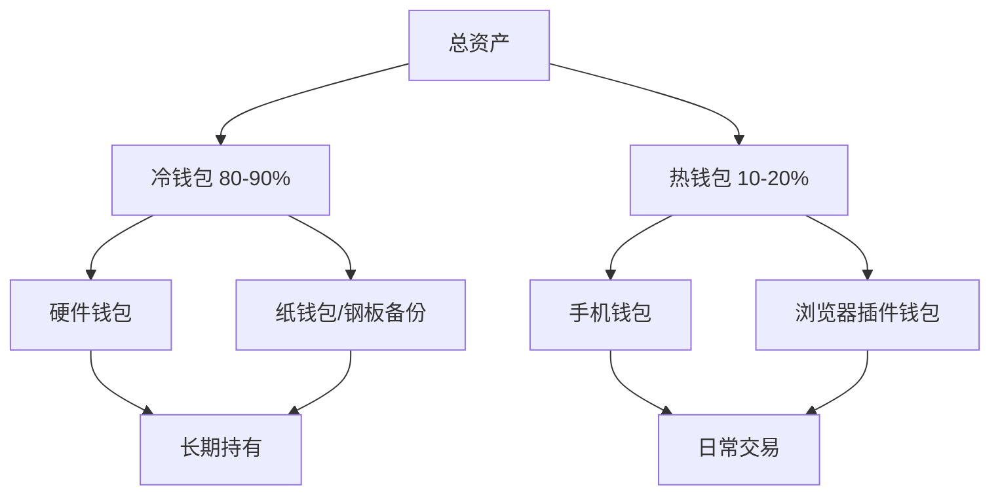
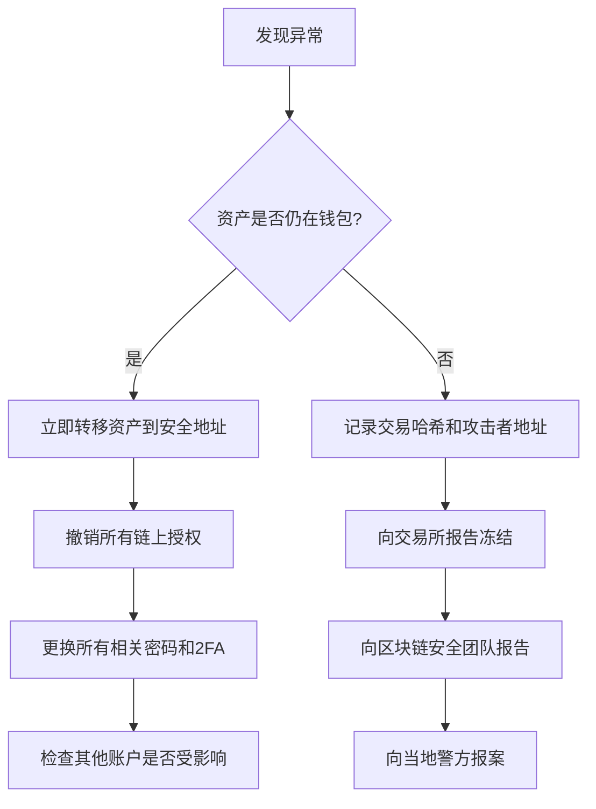

## 十一、安全防护清单

加密货币世界中没有"银行客服"帮你找回密码，没有"退款机制"追回误转的资金，更没有"冻结账户"阻止黑客提走资产。链上交易的不可逆性意味着——**安全不是可选项，而是生存前提**。

本清单是全章安全内容的终极汇总，按"事前防御 → 事中操作 → 事后应急"的完整链路组织，覆盖账户安全、资产存储、交易防护、DeFi交互、社交工程防范等全部场景。每一项都给出具体操作步骤，而非空泛的"注意安全"。

### 1. 账户与身份安全

#### 1.1 密码体系构建

单一密码保护多个账户是灾难的起点。2024年Coinbase数据泄露事件中，使用重复密码的用户损失最为惨重。

**密码管理三原则：**

- **唯一性**：每个平台使用完全不同的密码，绝不可复用
- **复杂性**：长度≥16位，混合大小写字母、数字、特殊符号
- **不可记忆性**：如果你能记住密码，说明它不够复杂——用密码管理器生成和存储

**推荐密码管理器：**

| 工具 | 类型 | 开源 | 适合场景 |
|------|------|------|----------|
| Bitwarden | 云同步 | ✅ | 多设备同步，免费版够用 |
| KeePassXC | 本地存储 | ✅ | 极端安全需求，离线保管 |
| 1Password | 云同步 | ❌ | 企业团队协作 |

**主密码设置要点：**

- 使用 passphrase 模式（4-6个随机单词拼接），如 `correct-horse-battery-staple-2026`
- 主密码只在本地设备输入，不存入任何云服务
- 写在纸上，锁入保险柜或防火保险箱，不要拍照存储

#### 1.2 双因素认证（2FA）

2FA是账户安全的第一道防线，但并非所有2FA方式安全性相同：

| 2FA类型 | 安全等级 | 说明 |
|---------|----------|------|
| 短信验证码（SMS） | ⭐⭐ | 可被SIM卡劫持攻击绕过，不推荐 |
| 邮箱验证码 | ⭐⭐ | 邮箱被攻破则完全失效 |
| TOTP验证器 | ⭐⭐⭐⭐ | 推荐。Google Authenticator / Authy / 2FAS |
| 硬件安全密钥 | ⭐⭐⭐⭐⭐ | 最高。YubiKey / Nitrokey，防钓鱼最佳 |

**TOTP设置实操：**

1. 在交易所/钱包的"安全设置"中启用2FA，选择"验证器应用"
2. 扫描二维码后立即备份恢复密钥（一串16位字母数字）
3. 恢复密钥离线存储（纸质备份），不要保存在手机截图或云相册
4. 至少在两台设备上配置TOTP（如手机+备用手机），避免单点故障

**硬件密钥进阶：**

- 注册 FIDO2/WebAuthn 标准的硬件密钥（如 YubiKey 5 NFC）
- 购买至少两把：一把日常使用，一把离线备份
- 在交易所、邮箱、密码管理器上都注册硬件密钥
- Binance、Coinbase、Kraken 等主流交易所均已支持

#### 1.3 邮箱安全加固

邮箱是所有账户的"万能钥匙"——密码重置、2FA恢复都依赖邮箱。邮箱被攻破等于所有账户全部沦陷。

**邮箱安全清单：**

- 加密货币相关账户使用**专用邮箱**，与日常邮箱完全隔离
- 启用邮箱自身的2FA（优先硬件密钥）
- Gmail 用户开启 Advanced Protection Program
- ProtonMail / Tutanota 等端到端加密邮箱作为备选
- 定期检查邮箱的"已授权应用"和"转发规则"，删除可疑条目
- 警惕邮箱中的"登录提醒"邮件——可能是钓鱼链接

#### 1.4 设备安全

**电脑端：**

- 操作系统保持最新版本，及时安装安全补丁
- 安装可信的杀毒/反恶意软件（Windows Defender 已足够）
- 不安装来历不明的浏览器扩展——恶意扩展可以读取所有网页内容
- 加密货币相关操作使用**专用浏览器配置文件**（Chrome Profile）
- 启用全盘加密（Windows BitLocker / macOS FileVault / Linux LUKS）

**手机端：**

- 不要Root/越狱设备
- 只从官方应用商店下载App
- 交易所App开启生物识别解锁
- 手机设置SIM卡PIN码，防止SIM卡被拔出后直接使用
- 联系运营商设置 SIM 卡账户密码（Port-out PIN），防止SIM卡劫持

### 2. 资产存储安全

#### 2.1 冷热钱包分层策略

资产存储的核心原则是**分层管理**——像银行不会把所有现金放在柜台一样。

**资产分层配置建议：**

| 资产规模 | 冷钱包比例 | 热钱包比例 | 推荐冷存储方案 |
|----------|-----------|-----------|---------------|
| <1万元 | 50% | 50% | 手机钱包+备份助记词 |
| 1-10万元 | 70% | 30% | 硬件钱包（Ledger/Trezor） |
| 10-100万元 | 85% | 15% | 硬件钱包+多签 |
| >100万元 | 90%+ | 5-10% | 多签方案/机构级托管 |

#### 2.2 助记词（Seed Phrase）管理

助记词是你资产的终极凭证。谁掌握了助记词，谁就掌握了资产。丢失助记词=永久失去资产。

**助记词生成的安全流程：**

1. 硬件钱包开箱后检查防拆封标签是否完好
2. 在硬件钱包设备上生成助记词（**绝不**在电脑/手机屏幕上生成）
3. 逐词抄写在纸上，核对两遍
4. 完成后在设备上验证助记词（设备会让你随机输入几个词确认）

**助记词存储的铁律：**

- **永远不要**将助记词输入电脑或手机（截屏、拍照、打字、语音输入全部禁止）
- **永远不要**将助记词存储在任何联网设备上（包括密码管理器、云笔记、邮箱）
- **永远不要**将助记词告诉任何人（包括"客服"、"技术支持"）
- 使用金属助记词板（如 Cryptosteel、Billfodl）防火防水防腐蚀
- 至少制作两份，分别存放在不同物理位置（如家中保险箱 + 银行保管箱）
- 可以考虑 Shamir's Secret Sharing（SSS）将助记词拆分为多份，需要N份中的M份才能恢复

#### 2.3 硬件钱包使用规范

**选购要点：**

| 品牌 | 代表型号 | 开源程度 | 支持币种 | 价格区间 |
|------|---------|---------|----------|----------|
| Ledger | Nano X / Stax | 固件闭源 | 5500+ | ¥500-1500 |
| Trezor | Model T / Safe 5 | 完全开源 | 1000+ | ¥500-1500 |
| Keystone | 3 Pro | 完全开源 | 5500+ | ¥800-1500 |
| Coldcard | Mk4 | 完全开源 | 仅BTC | ¥1000+ |

**使用注意事项：**

- 只从官方网站或授权经销商购买，不要在二手平台购买
- 收到后检查包装防拆封是否完整
- 首次使用立即更新固件到最新版本
- 设置PIN码（建议6-8位），启用防暴力擦除功能
- 每次交易在设备屏幕上**逐字核对**收款地址，不要只看首尾几位
- 设备固件更新前备份助记词

#### 2.4 交易所账户安全

交易所是最大的单点风险。FTX崩盘、Mt.Gox事件反复证明：**交易所不是银行，不保证你的资金安全。**

**交易所使用规范：**

- 主流交易所优先：Binance、Coinbase、Kraken、OKX等有长期运营记录的平台
- 单一交易所存放资产不超过总资产的20%
- 不交易时将资产提回自托管钱包
- 开启所有安全选项：2FA、提币白名单、反钓鱼码、登录IP限制
- 设置提币白名单后，新增地址需等待24-48小时冷却期
- 定期检查API Key权限，不使用的Key立即删除

**反钓鱼码设置：**

大多数交易所支持设置"反钓鱼码"——设置后，交易所发出的每封邮件都会包含你设定的专属代码。如果邮件中没有这个代码，就是钓鱼邮件。

### 3. 交易安全防护

#### 3.1 地址验证流程

加密货币转账不可逆。发送到错误地址=资金永久丢失。

**每次转账必做的验证步骤：**

1. **首次小额测试**：先发送一笔小额（如10美元等值）确认到账后再发送大额
2. **完整地址比对**：不要只看首尾几位，至少比对前10位和后10位
3. **独立渠道确认**：通过第二个渠道（电话、当面）确认对方地址
4. **警惕地址替换恶意软件**：剪贴板劫持程序会自动替换你复制的地址
5. **使用地址簿**：常用地址保存在钱包地址簿中，后续转账直接选取

**常见地址陷阱：**

- **剪贴板劫持**：恶意软件监控剪贴板，检测到加密地址后自动替换为攻击者地址。复制粘贴地址后务必**重新核对**完整地址
- **相似地址攻击**：攻击者生成与你常用地址首尾几位相同的地址。永远比对完整地址
- **合约地址混淆**：某些代币存在同名合约，收到的可能是假币。通过CoinGecko/CoinMarketCap确认正确的合约地址

#### 3.2 智能合约交互安全

与DeFi合约交互是加密货币使用中风险最高的操作之一。

**交互前检查清单：**

- [ ] 验证合约地址是否来自项目官方网站或可信来源
- [ ] 在Etherscan/BscScan上查看合约是否已验证源码
- [ ] 检查合约审计报告（Certik、OpenZeppelin、Trail of Bits等）
- [ ] 查看合约的TVL（总锁定价值）和运行时间——新合约风险更高
- [ ] 搜索该项目是否有安全事件历史

**授权管理（Token Approval）：**

当你与DApp交互时，通常需要"授权"合约使用你的代币。无限授权意味着合约可以随时转走你所有的该代币。

**最佳实践：**

- 授权时选择"指定数量"而非"无限授权"
- 交互完成后立即撤销不必要的授权
- 使用以下工具定期审查和撤销授权：
  - Revoke.cash（revoke.cash）—— 支持多链
  - Etherscan Token Approval Checker
  - Beefy Finance 的 Approval Scanner

#### 3.3 Gas费与交易安全

- 设置合理的 Gas Limit，不要设置过高（防止合约异常消耗）
- 使用 EIP-1559 交易时注意 Base Fee 和 Priority Fee 的设置
- 交易Pending期间不要重复提交相同交易（可能导致双重执行）
- 使用 Flashbots Protect（protect.flashbots.net）提交交易，防止MEV三明治攻击

### 4. DeFi专项安全

#### 4.1 流动性挖矿安全

流动性挖矿的收益来自真实风险，理解风险结构比追逐高APY更重要。

**风险矩阵：**

| 风险类型 | 说明 | 缓解措施 |
|---------|------|----------|
| 无常损失 | 代币价格比例变化导致的损失 | 选择稳定币对、理解无常损失公式 |
| 智能合约漏洞 | 合约被攻击导致资金损失 | 只参与已审计、TVL高、运行时间长的协议 |
| Rug Pull | 项目方卷款跑路 | 检查合约是否可升级、是否有时间锁、团队是否Doxxed |
| 清算风险 | 抵押借贷时抵押物价格下跌 | 保持健康因子>2.0，设置清算提醒 |

**协议安全评估要点：**

- 合约是否经过至少一家知名审计机构审计
- 合约是否有管理员权限（Owner Key）——多签比单签安全
- 是否有时间锁（Timelock）——治理变更需要等待24-48小时
- TVL是否足够大（通常>1亿美元的协议更安全）
- 团队是否有公开身份（Doxxed）——匿名团队跑路成本更低

#### 4.2 稳定币安全

稳定币并非"绝对安全"——2022年UST脱锚事件导致400亿美元蒸发。

**稳定币类型与风险对比：**

| 类型 | 代表 | 锚定机制 | 主要风险 |
|------|------|---------|----------|
| 法币抵押 | USDT、USDC | 1:1美元储备 | 储备不透明、中心化冻结风险 |
| 加密资产超额抵押 | DAI | 超额抵押 | 抵押物暴跌、清算瀑布 |
| 算法稳定币 | UST（已崩盘） | 算法调节 | 死亡螺旋脱锚 |
| 收益型 | sDAI、USDe | 复合策略 | 策略风险叠加 |

**稳定币使用建议：**

- 分散持有多种稳定币，不All-in单一稳定币
- USDT虽然市场份额最大但透明度最低，建议USDC/DAI搭配
- 关注稳定币发行方的储备报告
- 监控稳定币脱锚情况（可使用CoinGecko的稳定币追踪页面）

#### 4.3 钱包安全进阶

**多签钱包（Multisig）：**

对于大额资产，多签钱包提供了比单一助记词更高的安全性——需要多个私钥中的多数确认才能执行交易。

推荐方案：Safe（原Gnosis Safe）—— 以太坊生态最广泛使用的多签方案

- 支持2/3、3/5等灵活的签名阈值配置
- 每个签名者使用独立的硬件钱包
- 设置2-of-3多签：日常钱包 + 硬件钱包 + 备份硬件钱包

**社交恢复钱包：**

智能合约钱包（如Argent、Safe{Wallet}）支持"社交恢复"——设置可信的守护者（Guardian），丢失私钥时通过守护者多数投票恢复账户。

### 5. 社会工程学防范

据统计，**超过80%的加密货币损失来自社会工程攻击**（钓鱼、冒充、诱导），而非技术漏洞。

#### 5.1 常见钓鱼攻击手法

**钓鱼网站：**

- 攻击者创建与真实网站几乎完全相同的假网站
- 通过搜索引擎广告、社交媒体链接、邮件中的链接传播
- **防御**：手动输入网址或使用书签访问，不点击任何搜索广告结果

**假客服/假技术支持：**

- 在Telegram、Discord、Twitter私信中冒充交易所或项目方客服
- 要求你"验证钱包"、"领取空投"、"升级合约"——全部是骗局
- **铁律**：真正的客服**永远不会**主动私信你，**永远不需要**你的助记词或私钥

**假空投/假赠品：**

- 链上收到莫名其妙的代币（空投钓鱼）
- 要求你连接钱包并授权才能"领取"——授权后你的资产会被转走
- **防御**：不与不明来源的代币互动，不点击可疑空投链接

**假项目/假团队：**

- 创建与真实项目相同的社交媒体账号（仿冒账号）
- Telegram群中的"管理员"私信你要你"验证身份"
- **验证渠道**：通过多个独立来源验证项目官方信息

#### 5.2 安全意识训练

**遇到以下场景时立即警觉：**

- 任何人要求你提供助记词/私钥 → 100%骗局
- "限时领取"、"紧急操作"制造紧迫感 → 社工经典手法
- 链接地址与官方域名有微小差异（如binance.com vs bìnance.com）→ 钓鱼
- 合约要求"无限授权" → 高风险，需严格审查
- 私信推荐"稳赚"项目 → 庞氏骗局或Rug Pull
- 要求你安装远程控制软件（AnyDesk、TeamViewer） → 设备接管攻击

### 6. 安全审计与监控

#### 6.1 定期安全审计清单

建议每月执行一次完整安全审计：

**账户安全审计：**
- [ ] 检查所有交易所账户的登录记录和IP地址
- [ ] 审查所有交易所API Key的权限和使用记录
- [ ] 检查邮箱的转发规则和已授权应用
- [ ] 更新密码管理器中的弱密码/重复密码
- [ ] 确认所有2FA设备仍然可用

**链上安全审计：**
- [ ] 使用Revoke.cash审查所有链上Token授权
- [ ] 检查钱包地址是否有未知的代币交易
- [ ] 确认所有DeFi仓位的健康因子
- [ ] 检查流动性挖矿的协议是否出现安全事件

**资产安全审计：**
- [ ] 确认硬件钱包PIN码和固件版本
- [ ] 检查助记词备份的物理存储状态
- [ ] 核对各平台资产余额与预期是否一致
- [ ] 评估资产集中度，是否需要再平衡

#### 6.2 实时监控工具

| 工具 | 用途 | 链接 |
|------|------|------|
| Revoke.cash | 审查/撤销Token授权 | revoke.cash |
| DeBank | 多链资产总览+授权查看 | debank.com |
| Tenderly | 合约交易模拟和监控 | tenderly.co |
| Forta | 链上安全威胁实时警报 | forta.org |
| ScamSniffer | 钓鱼网站检测 | scamsniffer.io |
| SlowMist Hacked | 安全事件数据库 | hacked.slowmist.com |

**告警设置建议：**

- 在区块链浏览器上设置大额转账通知
- 使用 DeBank 或 Zerion 设置资产余额变动提醒
- 关注 SlowMist、PeckShield、CertiK 等安全团队的Twitter，获取最新安全事件信息
- 订阅所在链的官方安全公告频道

### 7. 应急响应预案

安全事件发生时的黄金时间通常只有几分钟。提前制定预案，比事后手忙脚乱有效百倍。

#### 7.1 应急响应流程

#### 7.2 不同场景的应急处理

**场景一：私钥/助记词泄露**

1. **立即行动**（分钟级）：将所有资产转移到新的安全钱包
2. 旧地址的任何剩余资产（如空投、奖励）视为已丢失，不要尝试回去取
3. 生成全新的助记词，使用全新的硬件钱包
4. 调整所有关联服务的设置

**场景二：交易所账户被盗**

1. 立即冻结账户（通过客服电话/在线支持）
2. 更改邮箱密码和2FA
3. 联系交易所安全团队提交工单
4. 向当地警方报案，获取报案回执（交易所处理需要）
5. 检查是否存在API Key泄露

**场景三：遭遇钓鱼/恶意合约**

1. 断开钱包与所有DApp的连接
2. 撤销所有Token授权
3. 将未受影响的资产转移到新的干净地址
4. 如果签名了恶意消息（Permit），检查是否有时间窗口可以抢先取消

**场景四：设备被盗/丢失**

1. 通过远程管理工具锁定/擦除设备（Find My iPhone / Google Find My Device）
2. 更改所有存储在该设备上的账户密码
3. 撤销该设备上的所有2FA信任
4. 如果硬件钱包也丢失，使用备份助记词在新设备上恢复

#### 7.3 安全事件报告渠道

| 平台/情况 | 联系方式 |
|----------|---------|
| Binance | 安全事件: security@binance.com |
| Coinbase | 被盗报告: support.coinbase.com |
| 慢雾（SlowMist） | 中文社区安全报告: team@slowmist.com |
| Chainalysis | 执法协助: chainalysis.com |
| Rekt News | DeFi攻击报告: rekt.news |
| 当地警方 | 经济犯罪/网络犯罪部门 |

### 8. 安全防护速查总表

将以上所有内容浓缩为一张可打印的速查表：

| 防护层级 | 核心措施 | 优先级 |
|---------|---------|--------|
| 密码 | 密码管理器+唯一密码 | 🔴 最高 |
| 2FA | TOTP/硬件密钥，禁用SMS | 🔴 最高 |
| 邮箱 | 专用邮箱+2FA+定期检查 | 🔴 最高 |
| 助记词 | 离线存储+金属备份+多地点 | 🔴 最高 |
| 硬件钱包 | 冷存储80%+资产 | 🟠 高 |
| 交易验证 | 小额测试+完整地址比对 | 🟠 高 |
| 授权管理 | 指定数量授权+定期撤销 | 🟠 高 |
| 社工防范 | 不信私信+不点链接+不给助记词 | 🟠 高 |
| 交易所 | 分散存放+提币白名单+反钓鱼码 | 🟡 中 |
| 多签 | 大额资产用多签钱包 | 🟡 中 |
| 监控告警 | 链上授权监控+余额变动通知 | 🟡 中 |
| 定期审计 | 每月安全清单检查 | 🟢 常规 |
| 应急预案 | 提前制定并演练 | 🟢 常规 |

### 9. 常见安全误区

**误区一："我的资产很少，黑客不会盯上我"**

现实：自动化攻击工具不区分目标大小。钓鱼邮件、恶意空投、假网站都是批量攻击，小金额用户反而是最容易中招的群体。

**误区二："交易所比我自己保管更安全"**

现实：交易所是黑客的首选目标（热钱包集中大量资产），且面临运营风险（FTX、Celsius、BlockFi等倒闭事件）。自托管+硬件钱包才是长期持有者的正确选择。

**误区三："助记词存在手机备忘录里很方便"**

现实：手机被入侵、被偷、维修时数据泄露，都会导致助记词暴露。联网设备上存储助记词等于把钥匙放在大门口的垫子下面。

**误区四："这个项目有明星投资机构背书，肯定安全"**

现实：投资机构的尽职调查不等于安全审计。Terra/Luna有Jump Capital、Galaxy Digital等顶级机构投资，照样崩盘。DYOR（Do Your Own Research）不可替代。

**误区五："撤销授权太麻烦，反正也没出过事"**

现实：无限授权就像给了陌生人一张没有限额的信用卡。不是"会不会出事"的问题，而是"什么时候出事"的问题。Revoke.cash上撤销授权只需几美元Gas费。

### 10. 持续学习资源

安全领域瞬息万变，持续学习是唯一不变的防护措施。

**安全新闻源：**

- Rekt News（rekt.news）—— DeFi攻击事件深度报道
- SlowMist Hacked（hacked.slowmist.com）—— 安全事件时间线数据库
- CertiK Skynet（skynet.certik.com）—— 项目安全评分
- PeckShieldAlert（Twitter）—— 实时安全警报

**安全工具集：**

- Chainabuse（chainabuse.com）—— 举报和查询诈骗地址
- Token Sniffer（tokensniffer.com）—— 代币合约风险检测
- GoPlus Security（gopluslabs.io）—— 代币/合约安全API

**学习路径建议：**

1. 先掌握本文清单中的所有基础防护措施（1-2周）
2. 学习使用区块链浏览器（Etherscan等）自主验证合约（1-2周）
3. 了解常见攻击向量：重入攻击、闪电贷攻击、预言机操纵（1个月）
4. 关注安全社区动态，培养安全直觉（持续进行）
