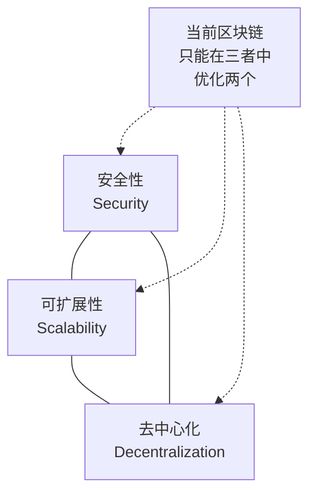

# 一、区块链技术原理

> 不理解区块链原理就去投资加密货币，如同不懂发动机原理就去赛车——也许能跑几圈，但迟早会翻车。

区块链是加密货币的地基。你要判断一个项目是否靠谱、一个代币是否有价值、一个DeFi协议是否安全，最终都要回到对底层技术的理解上。本节从零开始，用通俗语言讲清楚区块链的核心原理，让你具备辨别技术真伪的能力。

---

## 1.1 从问题出发：为什么需要区块链

### 1.1.1 传统信任模型的局限

在传统金融体系中，你和陌生人之间的交易必须依赖一个可信的第三方：

- 你给朋友转账 → 银行记录这笔交易
- 你在网上买东西 → 支付宝/微信支付作为中间人
- 你买股票 → 证券交易所撮合和清算

这个模型运行了几百年，但存在三个根本性问题：

| 问题 | 具体表现 | 后果 |
|------|----------|------|
| **单点故障** | 银行系统宕机则所有交易停摆 | 2020年美联储系统多次中断 |
| **信任成本** | 需要监管、审计、合规体系 | 全球金融中介成本约占GDP的7-10% |
| **审查风险** | 中心化机构可以冻结、拒绝交易 | 2022年加拿大冻结抗议者银行账户 |

2008年金融危机将这些问题暴露到极致——银行滥用信任，政府用纳税人的钱救助金融机构。中本聪在比特币创世区块中嵌入的那句话（"The Times 03/Jan/2009 Chancellor on brink of second bailout for banks"），正是对这套体系的控诉。

### 1.1.2 区块链的核心创新：无需信任第三方

区块链的本质创新是一句话：**让互不信任的参与者，在没有中心化权威的情况下，达成共识并维护一份共同的账本。**

这不是一个简单的技术问题，而是一个困扰了计算机科学界几十年的难题——"拜占庭将军问题"（Bygetine Generals Problem）。1982年由Leslie Lamport等人提出：一群将军围攻一座城市，他们只能通过信使通信，其中可能有叛徒。如何确保忠诚的将军们达成一致的行动方案？

比特币的PoW机制给出了第一个实用的解决方案。

---

## 1.2 区块链的数据结构

### 1.2.1 区块（Block）

区块是区块链的基本数据单元，每个区块包含两部分：

**区块头（Block Header）**：
- 前一区块的哈希值（形成链式结构）
- Merkle根（本区块所有交易的摘要）
- 时间戳
- 难度目标（挖矿难度）
- 随机数（Nonce，PoW中用于寻找有效哈希）

**区块体（Block Body）**：
- 一批经过验证的交易记录
- 比特币每个区块约包含2000-3000笔交易
- 以太坊每个区块的Gas上限约为3000万Gas

```text
┌─────────────────────┐
│      区块 #100       │
├─────────────────────┤
│ 区块头               │
│  ├ 前一区块哈希: 0x...│
│  ├ Merkle根: 0x...   │
│  ├ 时间戳: 2024-...  │
│  ├ 难度: 0x1bc...    │
│  └ Nonce: 782351...  │
├─────────────────────┤
│ 区块体               │
│  ├ 交易1: A→B 0.5BTC │
│  ├ 交易2: C→D 1.2BTC │
│  ├ 交易3: E→F 0.1BTC │
│  └ ... (共2341笔)    │
└─────────────────────┘
```

### 1.2.2 链式结构

每个区块通过包含前一区块的哈希值，形成一条不可断裂的链条：

```text
区块 #99  ──→  区块 #100  ──→  区块 #101
哈希: abc123    前哈希: abc123   前哈希: def456
                哈希: def456    哈希: ghi789
```

**为什么这很重要**：如果有人篡改了区块 #99 的任何数据，它的哈希值就会改变。区块 #100 中存储的"前一区块哈希"就对不上了，整条链从 #100 开始全部失效。要让篡改后的链被网络接受，必须重新计算 #99 之后所有区块的工作量证明——这在算力充足的大链上几乎是不可能的。

这就是"不可篡改"的技术基础。

### 1.2.3 哈希函数：区块链的"指纹"

哈希函数是区块链最核心的密码学工具。它将任意长度的输入转换为固定长度的输出（哈希值）。

以比特币使用的SHA-256为例：

```text
SHA-256("Hello") = 185f8db32271fe25f561a6fc938b2e264306ec304eda518007d1764826381969
SHA-256("hello") = 2cf24dba5fb0a30e26e83b2ac5b9e29e1b161e5c1fa7425e73043362938b9824
```

注意：只改了一个字母（大写H→小写h），输出完全不同。这叫做**雪崩效应**。

哈希函数的四个关键特性：

| 特性 | 含义 | 区块链中的作用 |
|------|------|---------------|
| **确定性** | 同一输入永远产生同一输出 | 所有节点对同一区块计算出相同的哈希 |
| **单向性** | 从输出无法反推输入 | 保护区块数据的隐私 |
| **抗碰撞性** | 极难找到两个不同输入产生相同输出 | 防止伪造区块 |
| **雪崩性** | 输入的微小变化导致输出完全不同 | 篡改任何数据都会被立即发现 |

---

## 1.3 密码学基础

### 1.3.1 非对称加密：公钥与私钥

区块链中"你是谁"不是通过用户名和密码来确认的，而是通过一对数学上相关的密钥：

- **私钥**（Private Key）：一个256位的随机数，只有你自己知道。相当于你的"签名印章"
- **公钥**（Public Key）：由私钥通过椭圆曲线算法（secp256k1）单向生成。相当于你的"身份标识"
- **地址**（Address）：对公钥再做一次哈希，得到你的收款地址

**单向性保证**：从私钥可以轻松计算出公钥，但从公钥反推私钥在计算上不可行——需要的算力超过全人类现有计算能力的总和。

**交易签名流程**：

```text
1. 你想给朋友转 1 BTC
2. 你用私钥对这笔交易进行签名 → 生成数字签名
3. 你把交易和签名广播到网络
4. 任何人可以用你的公钥验证：这笔交易确实是你发起的，且内容没有被篡改
5. 验证通过后，交易被打包进区块
```

**核心原则：不是你的私钥，就不是你的币。** 当你把资产存在交易所时，交易所持有私钥。如果交易所被黑、跑路或破产（如2022年FTX），你的资产就没了。这不是口号，是无数人用真金白银验证过的血泪教训。

### 1.3.2 助记词（Mnemonic Phrase）

256位的私钥（如 `3a1076bf45ab87712ad64ccb3b10217737f7faacbf2872e88fdd9a537d8fe266`）对人类来说不可能记住。助记词是私钥的人类可读版本：

```text
abandon ability able about above absent absorb abstract absurd abuse access accident
```

这就是为什么备份助记词如此重要——丢了助记词等于丢了私钥，等于永久失去资产。据Chainalysis估算，约20%的比特币（价值数百亿美元）因私钥丢失而永久锁死。

### 1.3.3 Merkle树：高效验证的数学结构

Merkle树是一种二叉哈希树，用于高效验证大量交易数据的完整性。

```text
            Merkle根
           /        \
       Hash(AB)    Hash(CD)
       /    \      /    \
    Hash(A) Hash(B) Hash(C) Hash(D)
      |       |       |       |
    交易A   交易B   交易C   交易D
```

**工作原理**：每笔交易先计算自己的哈希值，然后相邻两个哈希值拼接后再计算哈希，层层向上，最终汇聚到一个"Merkle根"。

**为什么重要**：
- Merkle根被写入区块头，只占32字节
- 要验证某笔交易是否在区块中，只需要提供一条"证明路径"（约log₂N个哈希值）
- 比特币的轻节点（SPV节点）不需要下载完整区块链，只需区块头+Merkle证明就能验证交易
- 这使得手机钱包等资源受限设备也能安全参与网络

---

## 1.4 共识机制：谁来记账

区块链最核心的技术问题：**在没有中心化权威的情况下，如何让所有参与者对"哪笔交易有效、哪个区块合法"达成一致？** 这就是共识机制要解决的问题。

### 1.4.1 工作量证明（Proof of Work, PoW）

**核心思想**：用计算工作量来决定记账权。谁先算出满足条件的哈希值，谁就有权打包下一个区块并获得奖励。

**详细流程**：

1. 矿工收集内存池中的待确认交易，组装成候选区块
2. 在区块头中填入前一区块哈希、Merkle根、时间戳等信息
3. 不断修改Nonce值，计算区块头的SHA-256哈希
4. 检查哈希值是否小于当前难度目标（以一定数量的前导零为特征）
5. 如果不满足，改Nonce再算；如果满足，广播区块
6. 其他节点验证后接受该区块，矿工获得区块奖励+交易手续费

**难度调整**：比特币每2016个区块（约两周）调整一次难度，目标是保持平均每10分钟出一个块。算力增加则难度增加，算力减少则难度降低。

**安全性分析**：

要篡改已确认的交易，攻击者需要：
- 重新计算目标区块及其后所有区块的工作量证明
- 在诚实链增长的同时，使攻击链超过诚实链
- 这需要超过全网51%的算力——以当前比特币网络的算力规模（约500 EH/s），这需要数十亿美元的硬件和电力投入

**PoW的优缺点**：

| 维度 | 优点 | 缺点 |
|------|------|------|
| 安全性 | 经过15年实战验证，从未被成功攻击 | 51%攻击在小链上确实发生过 |
| 去中心化 | 任何人都可以参与挖矿 | 矿池集中化趋势明显（前4大矿池占比>50%） |
| 公平性 | 纯粹按算力分配，无预挖 | ASIC矿机导致普通用户难以参与 |
| 能耗 | — | 比特币网络年耗电量约150 TWh，相当于一个中等国家 |

**代表项目**：比特币（BTC）、莱特币（LTC）、狗狗币（DOGE）

### 1.4.2 权益证明（Proof of Stake, PoS）

**核心思想**：用质押的代币数量来决定记账权。持有越多代币并质押，被选为验证者的概率越高。

**以太坊PoS的详细流程**：

1. 验证者需要质押至少32 ETH到质押合约
2. 每个epoch（6.4分钟）随机选择验证者委员会
3. 被选中的验证者负责提议区块和证明区块
4. 诚实行为获得奖励（年化约3-5%），恶意行为被罚没质押金（Slashing）
5. 51%攻击需要控制超过质押总量的33%（约340亿美元的ETH）

**罚没机制（Slashing）**：这是PoS最重要的安全设计。验证者如果同时签署两个冲突的区块（试图双花），或在同一slot中提议两个区块，其质押的ETH会被部分或全部销毁。这不是理论威慑——以太坊历史上已有多起验证者被罚没的案例。

**PoS的优缺点**：

| 维度 | 优点 | 缺点 |
|------|------|------|
| 能耗 | 比PoW降低约99.95% | — |
| 参与门槛 | 普通用户可通过质押池参与 | 需要先持有代币，"富者更富"倾向 |
| 最终性 | 有确定性最终性（2个epoch后） | — |
| 去中心化 | — | 流动性质押协议（如Lido）可能导致质押集中 |
| 安全性 | — | 未经PoW那样长时间的实战验证 |

**PoW vs PoS 核心对比**：

| 对比维度 | PoW（比特币） | PoS（以太坊） |
|----------|--------------|--------------|
| 记账权来源 | 算力竞争 | 质押代币 |
| 能耗 | 极高（约150 TWh/年） | 极低（约0.01 TWh/年） |
| 51%攻击成本 | 需要51%算力（硬件+电力） | 需要33%质押量（代币） |
| 最终性 | 概率性（6个确认约1小时） | 确定性（约12.8分钟） |
| 抗审查 | 强（矿工可匿名） | 较弱（大型质押实体受监管影响） |
| 激励相容性 | 矿工投资沉没成本，倾向维护网络 | 验证者质押资产，恶意行为被罚没 |

### 1.4.3 其他共识机制

**委托权益证明（DPoS）**：
- 持币者投票选出21-101个超级节点负责出块
- 出块速度极快（EOS约0.5秒/块）
- 代价是去中心化程度大幅降低——本质上是"区块链寡头制"
- 代表：EOS、TRON、BNB Chain

**权威证明（Proof of Authority, PoA）**：
- 预先指定的节点轮流出块
- 速度最快、能耗最低
- 但完全不适用于公链——这本质上是多签数据库
- 代表：部分企业联盟链、测试网（如Goerli）

**历史证明（Proof of History, PoH）**：
- Solana的创新：用可验证的延迟函数（VDF）为交易创建时间戳
- 所有节点无需相互通信就能确定交易顺序
- 极大提高吞吐量（理论峰值65,000 TPS）
- 代价是硬件要求极高，普通用户难以运行全节点
- 代表：Solana

**如何判断一个项目的共识机制是否靠谱**：

1. 看去中心化程度：验证者/矿工有多少？地理分布如何？前几大节点占比多少？
2. 看安全模型：攻击成本有多高？历史上是否被攻击过？
3. 看激励设计：诚实行为是否得到充分奖励？恶意行为是否有足够的惩罚？
4. 看长期运行记录：主网运行了多久？是否经历过极端行情的考验？

---

## 1.5 智能合约：可编程的区块链

### 1.5.1 什么是智能合约

2015年，Vitalik Buterin在以太坊白皮书中提出了区块链的第二次革命：**智能合约——部署在区块链上的、自动执行的程序代码。**

传统合同依赖法律执行，智能合约依赖代码执行：

```text
传统合同：
  "甲方在收到货物后30天内支付100万元"
  → 如果甲方不付，需要走法律程序（耗时数月到数年）

智能合约：
  if (货物已确认签收) {
      自动将100万元从甲方托管账户转给乙方
  }
  → 条件满足即自动执行，无人可以阻止或篡改
```

### 1.5.2 以太坊虚拟机（EVM）

智能合约运行在以太坊虚拟机（EVM）上。EVM是一个全球分布的、确定性的状态机：

- **全球分布**：每个以太坊全节点都运行一个EVM实例
- **确定性**：相同的输入永远产生相同的输出，所有节点的结果一致
- **图灵完备**：理论上可以执行任何计算（但通过Gas机制限制无限循环）

智能合约通常用Solidity语言编写，编译成字节码后部署到以太坊：

```solidity
// 一个最简单的智能合约：存储和读取一个数字
contract SimpleStorage {
    uint256 private storedValue;  // 状态变量，存储在区块链上

    // 写入函数：消耗Gas，修改区块链状态
    function set(uint256 value) public {
        storedValue = value;
    }

    // 读取函数：不消耗Gas（本地调用）
    function get() public view returns (uint256) {
        return storedValue;
    }
}
```

### 1.5.3 Gas机制：计算资源的定价

每次在以太坊上执行操作（转账、调用合约、部署合约）都需要消耗Gas。Gas是衡量计算工作量的单位，你需要用ETH支付Gas费用。

**Gas费用 = Gas用量 × Gas价格**

- **Gas用量**：取决于操作的复杂度。简单转账需要21,000 Gas，复杂DeFi操作可能需要数十万甚至上百万Gas
- **Gas价格**：由市场供需决定，网络拥堵时价格飙升

**EIP-1559（2021年生效）**改变了Gas定价模型：

```text
总费用 = Gas用量 × (基础费用 + 优先费)

- 基础费用（Base Fee）：由网络自动调节，被销毁（减少ETH供应）
- 优先费（Priority Fee）：用户自愿支付的小费，给矿工/验证者
```

**对投资者的意义**：Gas费用是使用区块链的"过路费"。当Gas费极高时（如NFT铸造热潮期间，单笔交易费可达数百美元），会抑制普通用户的参与，推动活动向Layer2和低成本链迁移。

### 1.5.4 智能合约的安全性问题

智能合约一旦部署就无法修改（除非预设了升级机制），这意味着代码中的Bug可能造成灾难性后果：

**历史重大智能合约安全事故**：

| 事件 | 时间 | 损失 | 原因 |
|------|------|------|------|
| The DAO攻击 | 2016年6月 | 360万ETH（约6000万美元） | 重入漏洞（Reentrancy） |
| Parity钱包冻结 | 2017年11月 | 51.37万ETH（约1.5亿美元） | 权限管理漏洞 |
| Wormhole桥被盗 | 2022年2月 | 12万ETH（约3.2亿美元） | 签名验证漏洞 |
| Ronin桥被盗 | 2022年3月 | 17.36万ETH+2550万USDC（约6.25亿美元） | 私钥管理不善 |
| Euler Finance | 2023年3月 | 约1.97亿美元 | 闪电贷+逻辑漏洞 |

**教训**：
- 审计报告不等于零风险——上述多数项目都经过审计
- 智能合约安全是动态博弈——新的攻击手法不断出现
- 参与DeFi时，优先选择运行时间长、经历过多次市场压力测试的协议

---

## 1.6 网络架构：节点、矿工与用户

### 1.6.1 节点类型

区块链网络中的参与者根据存储和验证程度分为不同类型：

| 节点类型 | 存储内容 | 验证能力 | 典型用途 |
|----------|----------|----------|----------|
| **全节点（Full Node）** | 完整区块链数据（比特币约550GB，以太坊约1TB） | 验证所有交易和区块 | 网络安全的基石 |
| **归档节点（Archive Node）** | 完整数据+每个区块的状态快照 | 可查询任意历史状态 | 链上数据分析、区块浏览器 |
| **轻节点（Light Node）** | 仅区块头 | 通过Merkle证明验证特定交易 | 手机钱包、浏览器插件钱包 |
| **矿工/验证者节点** | 运行全节点+共识客户端 | 参与区块生产和验证 | 获得出块奖励和手续费 |

### 1.6.2 交易的生命周期

一笔交易从发起到确认，经历以下完整流程：

```text
用户发起交易 → 签名 → 广播到网络 → 进入内存池（Mempool）
                                          ↓
                                    矿工/验证者选择交易
                                          ↓
                                    打包进候选区块
                                          ↓
                                    执行共识过程（PoW挖矿/PoS投票）
                                          ↓
                                    区块被广播到全网
                                          ↓
                                    其他节点验证并接受
                                          ↓
                                    交易获得1个确认
                                          ↓
                                    后续区块不断叠加（6个确认视为最终确认）
```

**内存池（Mempool）**：所有未确认交易的"等候室"。矿工通常优先选择Gas费高的交易（利润最大化），这也是"优先费"存在的原因——如果你想让交易更快被确认，就需要支付更高的优先费。

---

## 1.7 区块链的"不可能三角"

区块链领域广泛讨论的"不可能三角"（Blockchain Trilemma），由Vitalik Buterin提出：



**三个维度的含义**：

- **安全性**：网络能否抵抗攻击，交易是否不可逆
- **可扩展性**：每秒能处理多少交易（TPS），确认速度多快
- **去中心化**：有多少节点参与共识，普通用户能否参与

**不同项目的选择**：

| 项目 | 优先维度 | 牺牲维度 | 具体表现 |
|------|----------|----------|----------|
| 比特币 | 安全性+去中心化 | 可扩展性 | 7 TPS，10分钟出块 |
| 以太坊 | 安全性+去中心化 | 可扩展性 | 15-30 TPS（主网） |
| Solana | 可扩展性+安全性 | 去中心化 | 65,000 TPS理论值，但全节点硬件要求极高 |
| BNB Chain | 可扩展性 | 去中心化 | 高TPS，但验证者高度集中 |
| Layer2（如Arbitrum） | 继承主网安全性+高可扩展性 | — | 将执行层移至链下，结算层在主网 |

**对投资者的启示**：如果一个项目声称同时解决了三个问题——安全、快、去中心化——一定要保持警惕。技术上的取舍是客观存在的，声称完美解决方案的项目往往在某个维度上做了隐性的妥协。

---

## 1.8 从理论到判断：如何用技术知识评估项目

学完以上原理后，你已经具备了评估一个区块链项目技术基础的能力。以下是实操检查清单：

### 技术评估检查清单

**共识机制评估**：
- [ ] 共识机制类型是什么？是否经过充分验证？
- [ ] 出块时间和最终性是多少？
- [ ] 验证者/矿工的地理和组织分布如何？
- [ ] 51%攻击的成本有多高？
- [ ] 历史上是否遭受过共识层面的攻击？

**智能合约评估**：
- [ ] 合约代码是否开源？
- [ ] 是否经过知名审计机构审计（如Trail of Bits、OpenZeppelin、Consensys Diligence）？
- [ ] 审计报告中发现的问题是否已修复？
- [ ] 合约是否有升级机制？升级权限如何管理？
- [ ] 运行了多长时间？经历过哪些极端行情的考验？

**网络健康度**：
- [ ] 活跃节点数量和分布
- [ ] 全网算力/质押量的趋势
- [ ] 开发者活跃度（GitHub提交频率、核心开发者数量）
- [ ] 网络是否经历过重大事故？事故后的恢复情况

**不要只看白皮书里的花哨术语。** 很多项目的白皮书堆满了技术名词（零知识证明、分片、跨链互操作），但实际代码可能是从其他项目fork的、审计是找不知名小公司做的、主网运行不到半年。技术评估的核心是验证，不是宣传。

---

## 1.9 本节小结

| 概念 | 一句话总结 | 对投资者的意义 |
|------|-----------|---------------|
| 哈希函数 | 单向、确定、抗碰撞的"数字指纹" | 不可篡改的技术基础 |
| 非对称加密 | 私钥签名、公钥验证 | "不是你的私钥，就不是你的币" |
| Merkle树 | 高效验证大量数据的完整性 | 轻节点可以安全运行 |
| 共识机制 | 在无信任环境中达成一致的规则 | 决定链的安全性、速度和去中心化程度 |
| 智能合约 | 部署在链上的自动执行程序 | DeFi、NFT、DAO的底层基础设施 |
| Gas机制 | 计算资源的定价体系 | 使用区块链的"过路费"，影响用户体验和成本 |
| 不可能三角 | 安全、速度、去中心化不可能同时最优 | 识别过度宣传的工具 |

**下一节预告**：理解了区块链的技术原理后，我们将分析主流加密资产（比特币、以太坊、稳定币）的价值逻辑——技术只是基础，价值判断才是投资的核心。
