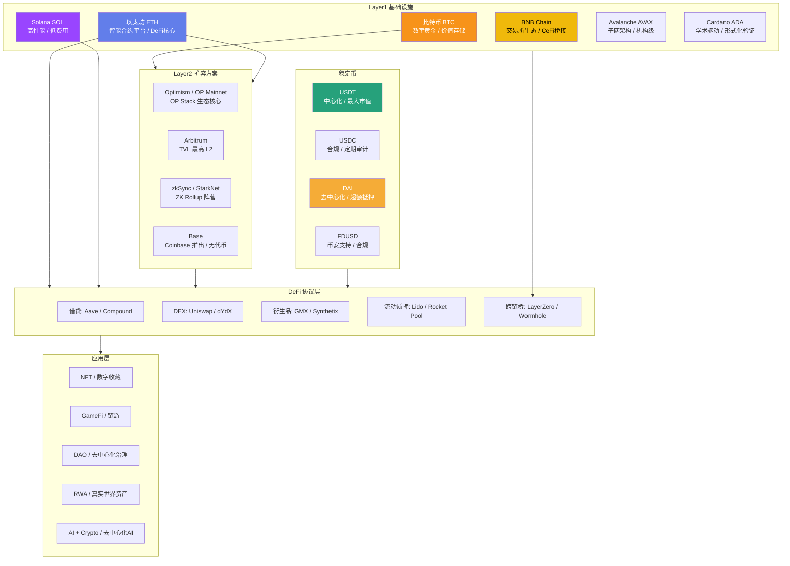
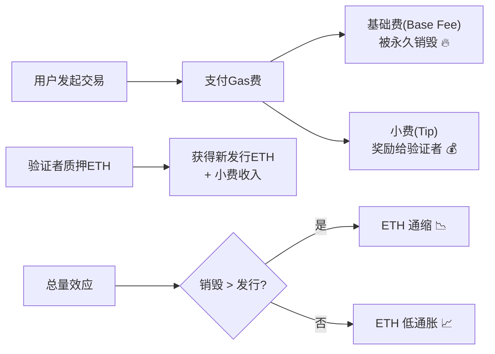
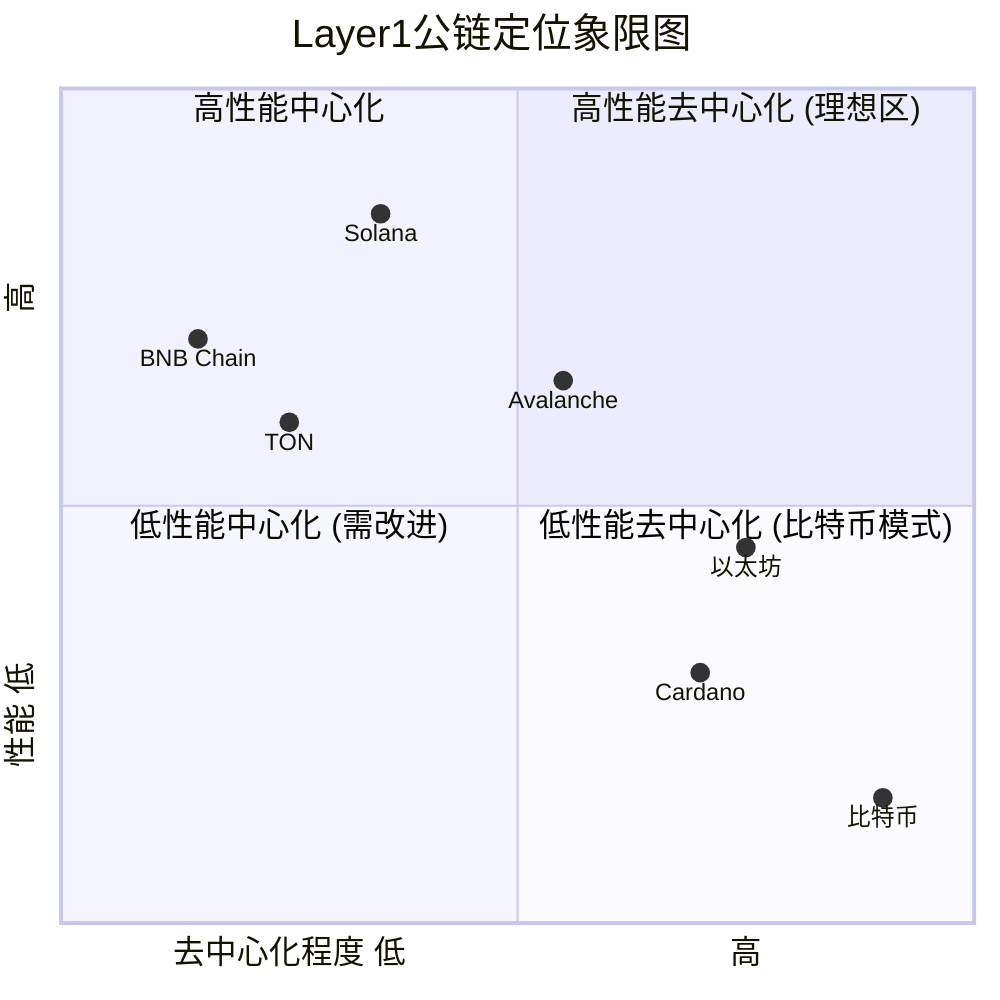
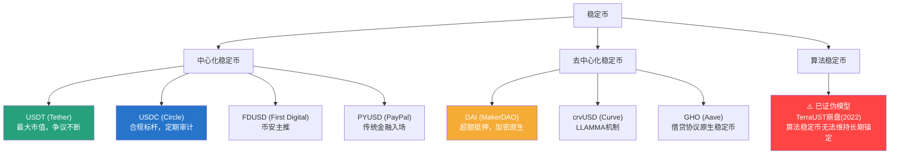
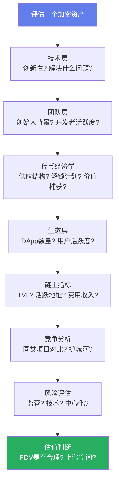

## 二、主流加密资产分析

理解加密资产不能停留在"买什么"的层面，而要建立一套**系统性的分析框架**：每种资产背后的技术架构是什么、价值捕获逻辑是什么、风险结构是什么、在投资组合中扮演什么角色。本节从全景概览入手，逐一深度拆解比特币、以太坊、主流Layer1公链、Layer2扩容方案、稳定币，最后给出一套可复用的资产分析方法论。

### 2.1 加密资产全景图

加密货币生态已经从2009年比特币单点突破，演化为一个多层次、多赛道的复杂系统。理解全景图是做任何分析的前提。



**2026年关键数据概览**：

| 指标 | 数值 | 说明 |
|------|------|------|
| 加密货币总市值 | 约3.2万亿美元 | 含比特币ETF资产 |
| 比特币市值 | 约1.8万亿美元 | 占比约55%，ETF推动占比上升 |
| 以太坊市值 | 约4000亿美元 | PoS转型后质押量持续增长 |
| 稳定币总市值 | 约2200亿美元 | USDT+USDC占90%+ |
| DeFi TVL | 约1500亿美元 | 以太坊+L2占70%+ |
| 比特币ETF总AUM | 约1200亿美元 | 2024年1月获批后持续流入 |

这些数字每季度变动显著，投资前务必通过CoinGecko、CoinMarketCap、DefiLlama等平台核实最新数据。

### 2.2 比特币（BTC）——数字黄金

#### 2.2.1 基本参数

| 属性 | 数值 |
|------|------|
| 诞生时间 | 2009年1月3日（创世区块） |
| 创始人 | 中本聪（Satoshi Nakamoto，匿名） |
| 总量上限 | 2100万枚（硬编码，不可更改） |
| 当前流通量 | 约1970万枚（2025年数据） |
| 出块时间 | 约10分钟（难度动态调整） |
| 共识机制 | 工作量证明（Proof of Work, PoW） |
| 最小区块单位 | 1聪 = 0.00000001 BTC |
| 哈希算法 | SHA-256 |
| 当前区块奖励 | 3.125 BTC（2024年4月减半后） |

#### 2.2.2 价值逻辑深度剖析

**稀缺性的数学基础**：比特币的稀缺性不是"承诺"，而是数学事实。2100万枚上限写在代码中，减半机制使新币产出呈指数衰减：

```text
总供应量 = Σ(50 × 210000 × (1/2)^n)，n从0到32
```

每次减半（约每4年，每210000个区块），矿工获得的新币奖励减半。这意味着比特币的供应曲线是一条渐近线——永远不会真正到达2100万，但无限趋近。与黄金不同，黄金每年还有约1.5%的新矿开采量，而比特币的新增供应趋近于零。

**减半周期与价格的深度分析**：

| 减半日期 | 区块奖励 | 减半前价格 | 减半后1年价格 | 涨幅倍数 | 历史背景 |
|----------|----------|-----------|-------------|---------|---------|
| 2012年11月28日 | 50→25 BTC | ~$12 | ~$1,000 | ~80x | 早期采用期，交易所刚起步 |
| 2016年7月9日 | 25→12.5 BTC | ~$650 | ~$2,500 | ~4x | ICO热潮前夕 |
| 2020年5月11日 | 12.5→6.25 BTC | ~$8,600 | ~$55,000 | ~6x | 疫情放水+机构入场 |
| 2024年4月20日 | 6.25→3.125 BTC | ~$64,000 | 持续观察中 | — | ETF已获批，机构化加深 |

需要注意的是：减半后的价格涨幅逐次递减，这符合边际效应递减规律。早期减半时市场认知度极低，每次减半都带来新的注意力浪潮；而随着市场成熟和预期被提前定价，减半的"惊喜效应"在减弱。这不意味着减半不重要，而是说不能简单线性外推历史涨幅。

**网络效应的护城河**：比特币是唯一一个从零开始、经历了15年以上不间断运行、没有发生过主网停机的区块链网络。这种**不可复制的历史安全性**是其核心护城河。全球有超过15000个全节点分布在100多个国家，攻击比特币网络需要全网51%以上的算力——当前约需超过1000亿美元的硬件投入和每年数十亿美元的电力成本。

#### 2.2.3 比特币ETF——里程碑事件

2024年1月10日，美国SEC批准了11只现货比特币ETF，这是加密货币历史上最重要的监管里程碑之一。

**为什么ETF如此重要**：
- **降低进入门槛**：传统投资者无需学习钱包、私钥、交易所操作，通过券商账户即可配置
- **机构资金入口**：养老基金、捐赠基金、家族办公室可以通过合规渠道配置比特币
- **税务简化**：ETF的税务处理比直接持有加密货币更清晰
- **价格发现效率**：ETF的套利机制使现货价格与NAV保持紧密联动

**主要比特币ETF对比**（截至2025年）：

| ETF | 发行方 | 费率 | AUM规模 | 特点 |
|-----|--------|------|---------|------|
| IBIT | BlackRock (iShares) | 0.25% | 最大 | 全球资管巨头背书 |
| FBTC | Fidelity | 0%→0.25% | 第二 | 自有托管，信任度高 |
| GBTC | Grayscale | 1.5%→0.20% | 前三大 | 最早的比特币信托转换 |
| ARKB | ARK Invest | 0.21% | 中等 | 木头姐品牌效应 |
| BITB | Bitwise | 0.20% | 较小 | 加密原生资管 |

ETF获批后比特币从约4.5万美元一路突破10万美元大关，充分说明了机构资金入场对价格的巨大推动力。

#### 2.2.4 比特币的技术演进

比特币并非一成不变。近几年的重要技术发展：

- **Taproot升级（2021年11月）**：引入Schnorr签名和MAST（默克尔抽象语法树），提升隐私性和脚本灵活性，为更复杂的智能合约奠定基础
- **Ordinals与BRC-20（2023年）**：在比特币上铸造NFT和发行代币，引发了关于比特币区块空间利用的激烈争论。支持者认为这增加了矿工收入（手续费），反对者认为它推高了交易费用、偏离了"电子现金"的初衷
- **闪电网络（Lightning Network）**：比特币的Layer2支付通道网络，实现秒级确认和极低手续费。2025年网络容量已超过5000枚BTC，被萨尔瓦多等国用于日常支付

#### 2.2.5 比特币的风险与争议

没有只涨不跌的资产。比特币面临的主要风险：

- **监管风险**：各国政策差异巨大，中国全面禁止挖矿和交易，美国在ETF获批后监管框架趋于明朗，但全球仍有大量不确定性
- **能源争议**：PoW共识机制消耗大量电力。剑桥大学估计比特币年耗电量约120TWh，相当于一个中等国家。虽然可再生能源占比在提高（估计超过50%），但批评者认为这些能源本可用于更有价值的用途
- **中心化趋势**：算力向大型矿池集中（前三大矿池控制超过50%算力），ETF托管集中在少数机构（Coinbase托管了大部分ETF资产），这与去中心化的初衷相矛盾
- **量子计算威胁**：如果大规模量子计算机成为现实，SHA-256和ECDSA算法可能被破解。虽然这是10-20年后的威胁，但社区已在研究后量子密码学方案
- **技术僵化风险**：比特币协议升级极为保守（需要广泛共识），这既是优势（安全稳定）也是劣势（难以快速创新）

### 2.3 以太坊（ETH）——世界计算机

#### 2.3.1 基本参数

| 属性 | 数值 |
|------|------|
| 诞生时间 | 2015年7月30日 |
| 创始人 | Vitalik Buterin 及联合创始人团队 |
| 共识机制 | 权益证明（PoS，2022年9月"The Merge"后） |
| 出块时间 | 约12秒 |
| 货币政策 | 无硬性上限，但有EIP-1559销毁机制 |
| 最低质押量 | 32 ETH（独立验证者） |
| 虚拟机 | EVM（以太坊虚拟机） |
| 编程语言 | Solidity、Vyper |

#### 2.3.2 价值逻辑深度剖析

以太坊的价值不只是"第二大加密货币"，而是一个**可编程的去中心化计算平台**。如果说比特币是一本不可篡改的账本，那么以太坊就是一台不可停机的全球计算机。

**智能合约的革命性**：传统金融中，合约的执行依赖法律系统和仲裁机构。智能合约将"如果……则……"的逻辑编码在区块链上，一旦部署即自动执行，无需信任任何中间人。这个概念看似简单，但催生了整个DeFi生态、NFT市场、DAO治理等全新范式。

**DeFi核心基础设施地位**：以太坊承载了超过60%的DeFi TVL。Uniswap（去中心化交易所）、Aave（借贷协议）、Lido（流动质押）、MakerDAO（稳定币发行）——这些协议每天处理数十亿美元的交易量，全部运行在以太坊上。这种网络效应形成了极强的护城河：新项目首选以太坊部署，因为用户最多、流动性最深、开发者工具最成熟。

**EIP-1559与通缩模型**：2021年8月上线的EIP-1559引入了**基础费用销毁机制**。每笔以太坊交易的一部分ETH被永久销毁（发送到一个无人拥有私钥的地址），另一部分作为小费（tip）奖励给验证者。在网络繁忙时（如NFT铸造热潮），销毁量可能超过新增发行量，使ETH进入**净通缩状态**。



#### 2.3.3 以太坊的质押经济学

The Merge后，以太坊从PoW转为PoS，这意味着：
- 不再有矿工消耗电力竞争算力，而是验证者通过质押ETH获得出块权
- 质押者获得的年化收益率约3-5%（取决于网络活跃度和质押总量）
- 截至2025年，已有超过3400万ETH被质押（约占总供应量的28%）

**质押方式对比**：

| 方式 | 门槛 | 收益 | 流动性 | 风险 |
|------|------|------|--------|------|
| 独立验证者 | 32 ETH + 硬件 | 最高（~4.5%） | 无（需退出期） | Slashing惩罚 |
| Lido (stETH) | 任意金额 | 中等（~3.8%） | 高（stETH可交易） | 智能合约风险、中心化 |
| Rocket Pool (rETH) | 最低0.01 ETH | 中等（~3.5%） | 高（rETH可交易） | 智能合约风险 |
| 交易所质押 | 最低1 ETH | 较低（~3%） | 取决于交易所 | 交易所对手方风险 |

Lido目前控制了约30%的质押ETH，引发了社区对中心化的担忧。如果单一实体控制超过33%的质押量，理论上可以影响网络共识。这是以太坊生态当前最重要的治理议题之一。

#### 2.3.4 以太坊升级路线图

以太坊的长期路线图（Vitalik称为"The Surge, The Verge, The Purge, The Splurge"）：

| 阶段 | 目标 | 时间 | 关键技术 |
|------|------|------|---------|
| The Merge | PoS转换 | 2022年9月 ✅ | 信标链合并 |
| Shanghai | 质押提款 | 2023年4月 ✅ | EIP-4895 |
| Cancun-Deneb | 降低L2费用 | 2024年3月 ✅ | EIP-4844 (Proto-Danksharding) |
| Pectra | 账户抽象+验证者改进 | 2025年 | EIP-7702等 |
| The Surge | 通过Danksharding实现10万+ TPS | 2026-2027年 | 完整数据分片 |
| The Verge | 状态验证轻量化 | 未来 | Verkle树 |

**Proto-Danksharding (EIP-4844)** 是一个里程碑升级，它为L2引入了专门的"数据blob"交易类型，使L2的费用降低了10-100倍。Arbitrum上的交易费从几美元降至几美分，直接推动了L2采用量的爆发式增长。

#### 2.3.5 以太坊的风险与挑战

- **L2碎片化**：数十个L2各自为政，流动性分散，用户体验割裂。跨L2桥接增加了操作复杂度和安全风险（跨链桥是黑客攻击的高发区）
- **MEV问题**：矿工/验证者可提取价值（MEV）导致普通用户遭受三明治攻击（sandwich attack），虽然Flashbots等方案在缓解，但问题远未解决
- **竞争压力**：Solana等高性能L1在支付、DeFi等场景提供更低成本和更快速度，分流了部分用户和开发者
- **监管不确定性**：美国SEC曾一度暗示ETH可能是证券（PoS后），虽然ETF获批化解了部分担忧，但全球监管态度仍在演变
- **技术复杂度**：以太坊的技术路线图极为复杂，每次升级都涉及多个EIP的协调，增加了出错的可能性

### 2.4 主流Layer1公链——以太坊的挑战者

#### 2.4.1 Solana（SOL）

**定位**：高性能单片链，目标是成为"加密世界的纳斯达克"。

| 属性 | 数值 |
|------|------|
| 诞生时间 | 2020年3月 |
| 创始人 | Anatoly Yakovenko（前高通工程师） |
| TPS | 理论65,000，实际约3,000-4,000 |
| 出块时间 | ~400毫秒 |
| 共识机制 | PoS + Proof of History（PoH） |
| 平均交易费 | < $0.01 |

**核心技术创新——Proof of History（PoH）**：传统区块链中，节点需要相互通信来确定交易顺序，这造成延迟。PoH通过一个高频的可验证延迟函数（VDF）创建一个全局时间戳序列，所有交易在提交时就附带了时间证明，节点无需再协商顺序。这就像给每笔交易盖了一个精确到纳秒的时间戳邮戳，大幅提高了吞吐量。

**Solana的优势**：
- **速度与成本**：亚秒级确认、几乎为零的手续费，使其成为高频交易、支付、小额DeFi操作的理想平台
- **移动端生态**：Solana是第一个认真做移动端的公链，推出了Solana Mobile手机（Saga）和移动端钱包，试图抢占Web3移动应用的先发优势
- **Meme币与投机文化**：Solana上诞生了大量Meme币（如BONK、WIF等），虽然投机属性强，但带来了巨大的链上活跃度和手续费收入
- **DePIN赛道**：Helium（去中心化无线网络）、Render（去中心化渲染）等DePIN（去中心化物理基础设施）项目选择Solana作为底层

**Solana的风险**：
- **网络稳定性**：历史上多次发生网络停机事件（2022年多次宕机），虽然2023-2024年大幅改善，但稳定性仍是关注点
- **验证者中心化**：运行验证者节点的硬件要求较高（128GB+ RAM），导致节点数量相对较少
- **FTX余波**：FTX/Alameda曾是Solana最大的支持者和持有者，其破产后的持续抛压是一个长期隐忧

#### 2.4.2 BNB Chain

**定位**：币安交易所的配套公链，CeFi与DeFi的桥接。

| 属性 | 数值 |
|------|------|
| 诞生时间 | 2020年9月（原BSC） |
| 发行方 | Binance |
| 共识机制 | PoSA（权益权威证明） |
| 验证者数量 | 21个（高度中心化） |
| 平均交易费 | ~$0.03 |

**BNB Chain的独特价值**：背靠全球最大加密交易所，BNB Chain天然拥有庞大的用户基础和资金流入渠道。币安Launchpad/Launchpool上的新项目通常优先在BNB Chain部署，形成了一个自成体系的生态循环。

**核心争议**：BNB Chain的21个验证者全部由币安控制或深度关联，这使其更像一个"分布式数据库"而非真正的去中心化网络。如果币安遭遇重大监管打击（如美国司法部起诉），BNB Chain的运行可能受到直接影响。投资者需要清楚地认识到：BNB Chain是**币安生态的延伸**，其价值高度绑定币安的品牌和运营。

#### 2.4.3 其他重要Layer1

| 公链 | 亮点 | 风险 | 适合场景 |
|------|------|------|---------|
| Avalanche (AVAX) | 子网架构允许企业定制区块链；与摩根大通等机构合作 | 生态规模较小；子网概念尚未充分验证 | 机构级应用、RWA |
| Cardano (ADA) | 学术驱动开发；Haskell形式化验证；非洲市场布局 | 开发节奏极慢；DeFi生态薄弱 | 对安全性要求极高的应用 |
| Polkadot (DOT) | 平行链共享安全；Substrate框架灵活 | 插槽拍卖机制复杂；生态发展不如预期 | 跨链互操作场景 |
| Sui / Aptos | Move语言（Meta/Libra遗产）；高并行处理 | 新链生态尚小；Move语言学习成本高 | 需要高并行的复杂应用 |
| TON | Telegram生态集成；10亿用户潜在入口 | 过度依赖Telegram；监管风险 | 社交支付、小游戏 |
| Tron (TRX) | USDT转账量最大链；波场DAO治理 | 孙宇晨个人争议大；极度中心化 | USDT转账、跨境支付 |

#### 2.4.4 Layer1对比分析



这个象限图揭示了区块链设计中的**不可能三角（Blockchain Trilemma）**：去中心化、安全性、可扩展性三者难以同时最优。每个公链都在这个三角中做出取舍——比特币优先去中心化和安全，Solana优先可扩展性，以太坊在三者间寻找平衡。投资者需要理解：**没有"最好的"公链，只有最适合特定用例的公链**。

### 2.5 Layer2 扩容方案——以太坊的分身

#### 2.5.1 为什么需要Layer2

以太坊主网的TPS约15-30笔/秒，远不能满足大规模应用需求。直接在L1上扩容会导致节点要求提高、去中心化程度降低。Layer2的思路是：**将计算和存储移到链下执行，只将最终结果（或压缩数据）提交到L1**，利用L1的安全性保证最终性，同时大幅提升吞吐量和降低成本。


#### 2.5.2 Rollup技术路线

Rollup是当前L2的主流技术路线，分为两大流派：

**Optimistic Rollup（乐观卷叠）**：
- **原理**：假设所有交易默认有效（"乐观"），将批量交易数据提交到L1。如果有人发现欺诈交易，可以在挑战期（通常7天）内提交**欺诈证明**
- **代表项目**：Arbitrum、Optimism（OP Mainnet）
- **优势**：技术成熟、EVM兼容性好、生态最丰富
- **劣势**：提款到L1需要等待7天挑战期（可通过第三方桥接服务加速）

**ZK Rollup（零知识证明卷叠）**：
- **原理**：每批交易都附带一个**零知识证明**（ZK-SNARK或ZK-STARK），L1验证证明的有效性，无需等待挑战期
- **代表项目**：zkSync Era、StarkNet、Polygon zkEVM、Scroll
- **优势**：即时最终性（无需等待挑战期）、理论上更安全
- **劣势**：技术更复杂、EVM兼容性实现难度大、生成证明消耗大量计算资源

| 对比维度 | Optimistic Rollup | ZK Rollup |
|----------|-------------------|-----------|
| 证明方式 | 欺诈证明（事后验证） | 有效性证明（事前验证） |
| 提款时间 | ~7天 | 几分钟 |
| EVM兼容性 | 完美兼容 | 逐步追赶中 |
| 技术成熟度 | 高 | 中（快速进步中） |
| 交易成本 | 极低 | 略高于Optimistic |
| 生态规模 | 更大 | 较小但增长快 |
| 长期潜力 | 受挑战期限制 | 更具扩展性上限 |

#### 2.5.3 主要L2生态对比

**Arbitrum**：TVL最高的L2（约150亿美元），DeFi生态最成熟。采用Nitro技术栈，EVM完全兼容，开发者迁移成本几乎为零。GMX（去中心化永续合约）等原生应用形成了强大的护城河。

**Optimism（OP Mainnet）**：最大的创新是**OP Stack**——一个开源的L2框架，允许任何人一键部署自己的L2链。Coinbase的Base链就是基于OP Stack构建的。OP Stack的愿景是形成一个"L2联盟"（Superchain），各链共享安全和通信协议。

**Base**：Coinbase于2023年推出的L2，无原生代币。凭借Coinbase的品牌和用户基础，Base迅速积累了大量链上用户，尤其在社交应用（Farcaster）和Meme币方面表现活跃。

**zkSync Era**：Matter Labs开发的ZK Rollup，使用自研的zkEVM方案。理论上安全性最高，但生态仍在建设中。

**StarkNet**：使用STARK证明（不需要可信设置），由StarkWare开发。Cairo语言虽强大但学习曲线陡峭，限制了开发者增长。

### 2.6 稳定币——加密世界的法定货币

稳定币是整个加密生态的血液：它们是DeFi交易的主要媒介、跨境转账的工具、以及投资者在波动中"避风港"。

#### 2.6.1 稳定币的分类



#### 2.6.2 主流稳定币深度对比

| 维度 | USDT | USDC | DAI | FDUSD |
|------|------|------|-----|-------|
| 发行方 | Tether Limited | Circle + Coinbase | MakerDAO (去中心化) | First Digital Labs |
| 市值(2025) | ~1400亿美元 | ~500亿美元 | ~50亿美元 | ~30亿美元 |
| 锚定机制 | 法币储备 | 法币储备 | 超额加密抵押 | 法币储备 |
| 储备构成 | 现金+国债+商业票据+担保贷款 | 现金+短期美国国债(100%) | ETH、WBTC等加密资产(150%+) | 现金+美国国债 |
| 审计方式 | 季度证明(非正式审计) | 月度储备证明(第三方审计) | 链上可查(完全透明) | 月度证明 |
| 主要链 | Tron(最大)、Ethereum、Solana | Ethereum(最大)、Solana、Base | Ethereum | Ethereum、BNB Chain |
| 监管态度 | 多次被罚款，合规隐忧 | 拥抱监管，MiCA合规 | 去中心化，灰色地带 | 监管友好 |
| 脱锚历史 | 曾跌至$0.95(2018) | 跌至$0.87(SVB事件,2023) | 短暂波动，相对稳定 | 无显著脱锚 |

**USDT为什么最大但争议最多？** Tether从未接受过四大会计师事务所的正式审计，其储备中包含商业票据和担保贷款等非现金资产，且在2021年被CFTC罚款4100万美元（因虚假声称100%由美元支持）。尽管如此，USDT的流动性极深，特别是在亚洲市场和Tron链上，几乎所有CEX的主流交易对都以USDT计价。这种**流动性霸权**使得即使存在信任问题，大多数交易者仍然不得不使用USDT。

#### 2.6.3 稳定币的监管演进

2024-2025年是稳定币监管的关键转折期：

- **欧盟MiCA法规**（2024年6月全面生效）：要求稳定币发行方获得许可证、维持1:1储备、每日赎回承诺。Tether未能完全满足MiCA要求，部分欧洲交易所已下架USDT
- **美国稳定币立法**：国会推进中的法案要求稳定币发行方获得联邦或州级牌照，储备必须全部为现金和短期国债，接受定期审计
- **日本模式**：日本已立法只允许持牌银行和信托公司发行稳定币，是全球最严格的框架

监管方向是明确的：**稳定币正在从灰色地带走向合规化**，这将重塑竞争格局——合规能力强的发行方（如Circle）将受益，而合规困难的（如Tether面临压力）可能需要调整业务模式。

#### 2.6.4 稳定币的收益策略

稳定币不只是"放在钱包里等升值"（它不会升值）。持有稳定币的主要收益方式：

| 策略 | 年化收益 | 风险等级 | 说明 |
|------|---------|---------|------|
| CEX活期理财 | 1-3% | 低 | 交易所理财产品，但存在对手方风险 |
| DeFi借贷(Aave) | 2-5% | 低-中 | 智能合约风险，历史上曾被攻击过 |
| LP提供流动性 | 5-20% | 中-高 | 无常损失+智能合约风险 |
| 循环杠杆(Curve) | 10-30% | 高 | 杠杆放大收益也放大清算风险 |
| RWA协议(Maker) | 4-6% | 低-中 | 投资美国国债等真实资产 |

### 2.7 加密资产分析框架

掌握了单一资产的知识后，你需要一套**系统性的分析框架**来评估任何加密资产。以下是经过市场验证的多维度分析方法：

#### 2.7.1 基本面分析（Fundamental Analysis）

与股票不同，加密资产没有市盈率（P/E）、现金流等传统估值指标，但有其独特的基本面指标：

**链上指标**：

| 指标 | 含义 | 在哪查 | 健康标准 |
|------|------|--------|---------|
| 活跃地址数 | 每日/每周独立交易地址 | Glassnode, Dune | 持续增长 |
| 交易量 | 链上转账总额 | CoinMetrics | 与市值匹配 |
| TVL（锁仓量） | DeFi协议中的总存款 | DefiLlama | 稳定增长 |
| 开发者数量 | 活跃代码贡献者 | Electric Capital | 行业领先 |
| 费用收入 | 链上交易手续费总额 | Token Terminal | 说明真实需求 |
| 质押比例 | 被质押锁定的代币占比 | Staking Rewards | 20-60%较健康 |

**代币经济学分析**（Tokenomics）：

这是评估加密资产最关键的维度之一，直接决定了代币的长期价值走势：

- **供应结构**：团队/投资方/社区各占多少？解锁时间表是怎样的？如果团队持有30%且6个月后开始解锁，意味着巨大的潜在抛压
- **通胀模型**：年增发率是多少？PoS链的质押奖励本质上是通胀，需要用费用收入来抵消
- **价值捕获机制**：代币持有者如何获得价值？分红？销毁？治理权？还是纯粹的投机？最强的价值捕获是"费用销毁"（如ETH的EIP-1559），最弱的是"治理代币"（除非治理权有实质影响力）
- **流通量vs总供应量**：如果流通量只占总供应的10%，意味着90%的代币未来会进入市场，这是巨大的稀释风险



#### 2.7.2 估值方法

虽然加密资产没有标准估值模型，但以下是几种常用的参考方法：

**协议收入倍数（P/S Ratio）**：类似股票的市销率。

```text
P/S = 完全稀释市值(FDV) / 年化协议收入
```

DeFi协议有真实的手续费收入，可以计算P/S。以太坊的P/S约在30-60之间（取决于市场周期），而许多小市值DeFi代币的P/S高达200+，说明估值偏高。

**梅特卡夫定律（Metcalf's Law）**：网络价值与活跃用户数的平方成正比。

```text
理论估值 ∝ (活跃地址数)^2
```

这个模型适合L1公链的粗略估值——如果某条链的活跃用户是以太坊的1/10，其公允估值应该约是以太坊的1/100（而非1/10）。

**库存流量比（S2F Model）**：专用于比特币的估值模型。

```text
S2F = 当前库存量 / 年新增产量
```

S2F模型将比特币与黄金对比，预测每次减半后的价格目标。但该模型在2022-2023年严重偏离实际价格，目前可信度下降。

#### 2.7.3 风险检查清单

在投资任何加密资产前，用这个清单逐一排查：

- [ ] **智能合约审计**：是否有知名审计机构（Trail of Bits, OpenZeppelin, Certora）的审计报告？已知漏洞是否已修复？
- [ ] **团队匿名度**：匿名团队意味着"跑路"零成本。已知身份的团队至少有声誉约束
- [ ] **代币解锁时间表**：查看Token Unlocks等平台，未来6-12个月是否有大额解锁？
- [ ] **交易所上线情况**：是否在Binance/Coinbase等一线交易所上线？只在小所交易的代币流动性差且操控风险高
- [ ] **治理集中度**：是否少数地址控制大部分投票权或代币？
- [ ] **监管风险**：该代币是否可能被认定为证券？发行方是否面临法律诉讼？
- [ ] **历史安全事故**：是否发生过黑客攻击、闪贷攻击或治理攻击？修复方案是否可靠？
- [ ] **社区活跃度**：GitHub提交频率、Discord/Telegram活跃度、开发者大会参与情况

#### 2.7.4 常见投资误区

| 误区 | 纠正 |
|------|------|
| "便宜币"心理：某个币只$0.01所以"便宜" | 单价毫无意义，要看完全稀释市值(FDV)。$0.01的币如果有1万亿枚供应，市值就是$100亿，一点也不便宜 |
| 追涨杀跌：涨了就买，跌了就卖 | 这是散户亏损的主要原因。建立买入计划（如定投）和止损规则 |
| ALL IN单一资产 | 即使是BTC/ETH也可能跌80%+。分散配置是生存的前提 |
| 只看技术不看代币经济学 | 一个技术优秀的项目，如果代币设计有问题（如团队持有50%且即将解锁），代币价格可能长期下跌 |
| 忽视Gas费和滑点 | 小额交易的Gas费可能吃掉大部分利润。L1上交易几百美元的代币可能不划算 |
| 盲信KOL推荐 | 大多数KOL在推荐前已经建仓，推荐是为了拉高出货。永远做自己的研究（DYOR） |

### 2.8 本节总结

加密资产的世界远不止"买比特币"这么简单。通过本节的学习，你应该建立起以下认知：

1. **比特币**是数字黄金，其价值来自不可复制的稀缺性和网络安全性，ETF的获批标志着机构化时代的到来
2. **以太坊**是可编程的去中心化平台，DeFi/NFT/L2生态构成其护城河，PoS转型和EIP-1559使其具备通缩潜力
3. **L1公链**竞争激烈，Solana在性能赛道领先，BNB Chain背靠交易所生态，但都在"不可能三角"中做出取舍
4. **L2**是以太坊扩容的核心方案，Optimistic Rollup生态更成熟，ZK Rollup技术潜力更大
5. **稳定币**是加密世界的血液，正在从灰色地带走向合规化，监管将重塑竞争格局
6. **分析框架**比信息更重要——链上数据、代币经济学、风险检查清单是做任何投资决策的必备工具

在下一节中，我们将深入了解**交易所基础设施**——加密资产的交易场所和执行层面的技术。
