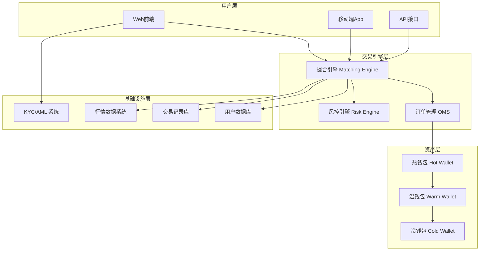
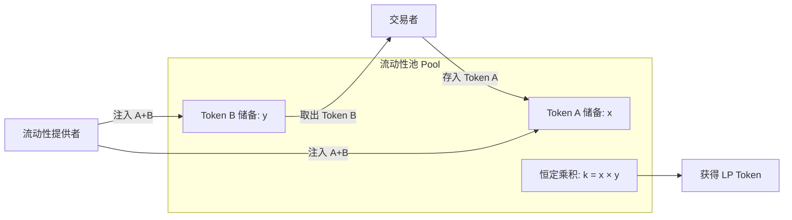
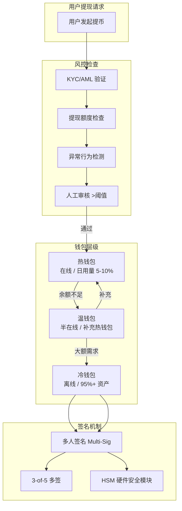
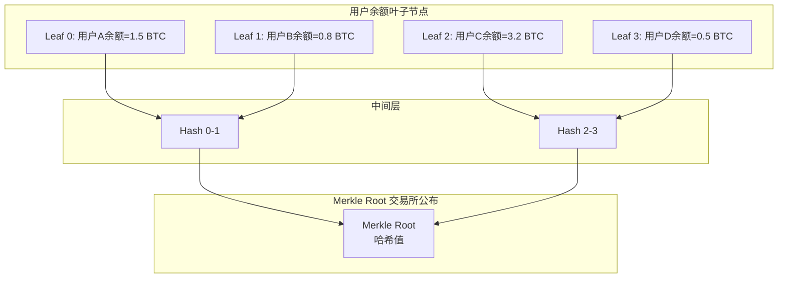
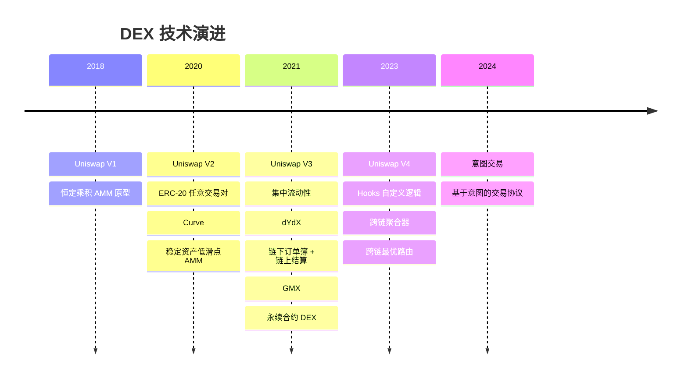

## 三、交易所基础设施

交易所是加密货币世界的"证券交易所"——它是资产定价、流动性汇聚和价值交换的核心枢纽。与传统金融市场不同，加密货币交易所运行在 7×24 小时不间断的全球市场中，承载着从现货买卖到复杂衍生品交易的全部功能。理解交易所的基础设施，不仅是参与加密市场的前提，更是保护资产安全、做出明智投资决策的基础。

### 3.1 交易所的类型与架构

#### 3.1.1 中心化交易所（CEX）

中心化交易所是目前加密市场中最主流的交易场所。其运作模式类似于传统券商：用户将资产充值到交易所控制的钱包中，交易在交易所内部的订单簿上撮合完成，资产的转移记录在交易所的内部账本上，而非链上。

**核心架构组成**：



**撮合引擎（Matching Engine）**是交易所的核心组件。它接收用户的买卖订单，按照"价格优先、时间优先"的原则进行撮合。高性能撮合引擎的订单处理延迟在微秒级别，每秒可处理数十万笔交易。撮合引擎通常采用内存撮合（in-memory matching）技术，将订单簿完全加载到内存中以实现最低延迟。

**订单管理系统（OMS）**负责订单的全生命周期管理：从用户下单开始，经历验证、排队、部分成交、完全成交或撤单等状态变化。OMS 需要保证每笔订单状态转换的原子性和一致性。

**风控引擎**实时监控所有交易活动，检测异常行为：大额交易预警、短时间高频下单监控、价格偏离度检测、关联交易识别等。当检测到异常时，风控引擎可以暂停特定用户的交易权限、冻结资产或触发人工审核。

#### 3.1.2 去中心化交易所（DEX）

去中心化交易所不依赖中心化的撮合引擎，而是在区块链上通过智能合约实现资产的交换。用户的资产始终在自己控制的钱包中，交易通过智能合约原子性地完成。

**自动做市商（AMM）机制**：

AMM 是当前 DEX 最主流的交易机制。它摒弃了传统的订单簿模式，改用数学公式来决定资产价格。

恒定乘积做市公式（Uniswap V2 模型）：

```text
x × y = k
```

其中 x 和 y 分别是流动性池中两种资产的数量，k 是常数。当用户用资产 A 交换资产 B 时，池中 A 的数量增加，B 的数量减少，但 k 保持不变，新的价格由变化后的比例决定。



**集中流动性（Uniswap V3 模型）**：

Uniswap V3 引入了集中流动性概念，允许流动性提供者（LP）将资金集中在特定价格区间内。这大幅提高了资金效率——理论上可以将资金效率提高 4000 倍以上。但同时也增加了管理复杂度，LP 需要主动管理头寸区间，如果价格移出设定区间，头寸将不再产生手续费收入。

**订单簿 DEX**：

部分 DEX（如 dYdX、Raydium Serum）采用链上或链下订单簿模式。链下订单簿 + 链上结算的混合模式在保持去中心化结算的同时，提供了接近 CEX 的交易体验。

#### 3.1.3 CEX 与 DEX 的全面对比

| 维度 | 中心化交易所（CEX） | 去中心化交易所（DEX） |
|------|---------------------|----------------------|
| 资产控制 | 交易所代持 | 用户自持 |
| 交易速度 | 毫秒级 | 数秒到数分钟（取决于链） |
| 交易成本 | 手续费 0.02%-0.1% | Gas 费 + 协议费（波动大） |
| 流动性 | 高，深度好 | 分散，部分主流池较好 |
| 隐私性 | 需要 KYC | 匿名或半匿名 |
| 抗审查 | 可被冻结账户 | 不可冻结 |
| 交易品种 | 现货/合约/期权/杠杆 | 现货为主，合约增长中 |
| 上币门槛 | 交易所审核 | 任何人可创建交易对 |
| 智能合约风险 | 无（但有中心化风险） | 合约漏洞可能被攻击 |
| 用户门槛 | 低 | 需要钱包和链上操作经验 |

### 3.2 核心交易机制

#### 3.2.1 订单簿与撮合机制

**订单簿（Order Book）**是交易所最核心的数据结构，它实时记录了所有未成交的买单（Bid）和卖单（Ask）。

订单簿的基本结构：

```text
卖单（Ask）          买单（Bid）
价格    数量         价格    数量
----------------    ----------------
42,100  0.5 BTC     42,000  1.2 BTC
42,050  0.8 BTC     41,950  2.0 BTC
42,020  1.0 BTC     41,900  0.3 BTC
42,010  0.3 BTC     41,850  1.5 BTC

       买卖价差（Spread）= 42,010 - 42,000 = 10 USDT
```

**订单类型详解**：

| 订单类型 | 定义 | 适用场景 | 优势 | 风险 |
|---------|------|---------|------|------|
| 限价单（Limit） | 指定价格挂单等待成交 | 有明确目标价时 | 价格确定 | 可能无法成交 |
| 市价单（Market） | 以当前最优价立即成交 | 需要快速建仓/平仓 | 保证成交 | 滑点风险 |
| 止损单（Stop-Loss） | 价格触及阈值后触发市价单 | 控制下行风险 | 自动止损 | 极端行情可能大幅滑点 |
| 止盈单（Take-Profit） | 价格达到目标后触发卖出 | 锁定利润 | 自动获利了结 | 可能过早卖出 |
| 止损限价单（Stop-Limit） | 触发后以限价单执行 | 精确控制止损价 | 避免极端滑点 | 可能不成交 |
| 冰山单（Iceberg） | 大单拆分显示 | 机构大额交易 | 减少市场冲击 | 执行时间长 |
| 追踪止损（Trailing Stop） | 止损价随价格上涨自动上移 | 趋势行情中保护利润 | 动态保护利润 | 震荡行情频繁触发 |

**滑点（Slippage）**是指预期成交价与实际成交价之间的差异。滑点主要由三个因素导致：（1）订单簿深度不足——大额订单消耗多个价格层级；（2）市场波动剧烈——下单到成交之间价格已变化；（3）网络延迟——特别是 DEX 上区块确认需要时间。

降低滑点的策略：
- 使用限价单而非市价单
- 大额交易拆分为多笔小单
- 在流动性最充沛的时段交易（美股/欧股开盘时段重叠时）
- DEX 交易时设置合理的滑点容忍度（通常 0.5%-1%，低流动性代币可能需要更高）

#### 3.2.2 杠杆与合约交易机制

**保证金交易原理**：

杠杆交易允许用户以少量保证金控制更大价值的头寸。假设使用 10 倍杠杆，用户只需 1,000 USDT 的保证金就可以建立 10,000 USDT 的头寸。

**保证金计算**：

```text
初始保证金 = 头寸价值 / 杠杆倍数
维持保证金 = 头寸价值 × 维持保证金率（通常 50%-80% 的初始保证金）

示例：
- 头寸价值：10,000 USDT
- 杠杆倍数：10x
- 初始保证金：1,000 USDT
- 维持保证金率：5%（即 500 USDT）
```

**强制平仓（Liquidation）机制**：

当亏损导致保证金余额低于维持保证金要求时，交易所会触发强制平仓。不同交易所的清算机制存在差异：

- **全仓模式（Cross Margin）**：所有持仓共享保证金余额，一个仓位的盈利可以弥补另一个仓位的亏损，但一个仓位的极端亏损可能拖垮所有资产。
- **逐仓模式（Isolated Margin）**：每个仓位独立使用分配的保证金，一个仓位被强平不影响其他仓位，最大损失限于该仓位的保证金。

**资金费率（Funding Rate）**：

永续合约没有到期日，为了让合约价格锚定现货价格，交易所引入了资金费率机制。当合约价格高于现货时（多头占优），多头向空头支付资金费率；反之亦然。资金费率通常每 8 小时结算一次，标准费率为 0.01%。极端行情下资金费率可能飙升至 0.3% 甚至更高，成为重要的交易成本。

### 3.3 主流交易所深度评测

#### 3.3.1 全球主要 CEX 对比

| 交易所 | 日均交易量 | 支持交易对 | 手续费（Maker/Taker） | 特色 | 监管状态 |
|--------|-----------|-----------|---------------------|------|---------|
| Binance | ~$150亿+ | 600+ | 0.02%/0.04%（VIP0: 0.1%/0.1%） | 最大交易量、最全币种 | 多国合规中，美国用户需用 Binance.US |
| OKX | ~$50亿+ | 400+ | 0.02%/0.05% | 统一账户、期权、跟单 | 香港牌照、多国合规 |
| Bybit | ~$100亿+ | 500+ | 0.02%/0.055% | 合约深度好、跟单系统 | 迪拜牌照 |
| Coinbase | ~$20亿+ | 250+ | 0.04%/0.06%（高级） | 美国合规标杆、上市公司 | SEC 注册 |
| Kraken | ~$10亿+ | 200+ | 0.02%/0.05% | 安全记录优秀、PoR 透明 | 美国 MSB |
| Gate.io | ~$20亿+ | 1700+ | 0.015%/0.05% | 币种最多、Startup 打新 | 多国运营 |

**手续费优化策略**：
- 持有平台币（如 BNB、OKB）可享受手续费折扣
- 提升 VIP 等级（基于 30 天交易量或资产持有量）
- 使用限价单（Maker）而非市价单（Taker）获取更低费率
- 参与交易所返佣计划

#### 3.3.2 交易所选择的评估框架

选择交易所不能只看交易量，需要从多个维度综合评估：

**安全性评估**：
1. 储备证明（Proof of Reserves, PoR）——交易所是否定期公布链上储备审计
2. 安全事件历史——是否发生过被盗事件，事后赔付态度如何
3. 冷热钱包比例——冷钱包占比越高越安全（行业标杆 >95%）
4. 是否有保险基金——用于覆盖极端情况下的用户损失
5. 提币速度和限制——正常提币是否顺畅

**合规性评估**：
1. 持有哪些国家/地区的牌照
2. 是否接受用户所在地区的监管
3. KYC/AML 政策的严格程度
4. 与监管机构的关系是否健康

**流动性评估**：
1. 目标交易对的买卖价差（Spread）
2. 订单簿深度（盘口 1% 以内的挂单量）
3. 大额订单的滑点测试
4. API 延迟和稳定性

### 3.4 交易所安全基础设施

#### 3.4.1 钱包架构

交易所的钱包架构采用分层设计来平衡安全性和运营效率：



**冷钱包安全措施**：
- 私钥存储在离线硬件设备中，永不触网
- 多签机制要求多人同时授权（如 3/5 多签）
- 使用地理分散的多个安全地点存放密钥碎片
- 定期进行安全审计和密钥恢复演练
- 部分交易所使用 MPC（多方计算）替代传统多签，避免单点暴露

#### 3.4.2 历史重大安全事件复盘

| 时间 | 事件 | 损失金额 | 根因 | 后果与教训 |
|------|------|---------|------|-----------|
| 2014.02 | Mt. Gox 被盗 | 85万 BTC（~$4.5亿） | 热钱包私钥泄露、内部管理混乱 | 行业开始重视冷热分离和审计 |
| 2016.08 | Bitfinex 被盗 | 12万 BTC（~$7200万） | 多签机制实施不当 | 推动了多签技术的标准化 |
| 2018.01 | Coincheck 被盗 | 5.3亿 NEM（~$5.3亿） | 热钱包存储大量资产 | 日本加强交易所监管 |
| 2019.05 | Binance 被盗 | 7000 BTC（~$4000万） | API 密钥+2FA 窃取 | Binance 使用 SAFU 基金全额赔付 |
| 2022.11 | FTX 崩盘 | 用户资产 ~$80亿 | 挪用客户资金、内部关联交易 | 推动行业 Proof of Reserves 透明化 |

**从安全事件中学到的教训**：
- 绝不将所有资产存放在单一交易所
- 大额资产应使用个人冷钱包存储
- 启用所有可用的安全功能（2FA、提币白名单、反钓鱼码）
- 定期检查交易所的 PoR 报告
- 对"超高收益"的交易所理财产品保持警惕

#### 3.4.3 Proof of Reserves（储备证明）

储备证明是交易所证明其拥有足够资产覆盖用户余额的审计机制，2022 年 FTX 事件后成为行业标配。

**Merkle Tree 储备证明原理**：



用户可以通过交易所提供的 Merkle Path 验证自己的余额是否被正确包含在储备证明中，而无需暴露其他用户的数据。

**局限性**：
- 只证明某个时间点的资产快照，不能防止事后挪用
- 不包含负债信息（需要配合负债证明才算完整审计）
- 交易所可能借入资产临时充数
- 第三方审计机构的独立性和能力参差不齐

### 3.5 交易所 API 基础设施

#### 3.5.1 API 接口类型

交易所通常提供三类 API 接口供程序化交易使用：

**REST API**：
- 适用于低频请求：查询账户余额、下单、撤单、获取K线数据
- 每个请求独立，需要鉴权
- 有严格的频率限制（通常 10-1200 次/分钟，视端点和 VIP 等级而定）

**WebSocket API**：
- 适用于实时数据推送：行情更新、订单状态变更、账户变动
- 建立长连接后，交易所主动推送数据
- 延迟远低于 REST API 轮询，适合高频交易和行情监控

**FIX 协议（部分机构级交易所）**：
- 传统金融标准协议，机构交易者熟悉的接口
- 极低延迟，支持复杂的订单类型

#### 3.5.2 API 安全实践

API 密钥的安全管理是程序化交易的生命线：

```text
API 密钥安全清单：
├── 权限最小化：只开必要的权限（只读/交易/提币分离）
├── IP 白名单：限制 API 密钥只能从特定 IP 访问
├── 定期轮换：每 90 天更换 API 密钥
├── 加密存储：密钥存放在加密的环境变量或密钥管理服务中
├── 绝不硬编码：不要将密钥写死在代码中
├── 监控告警：对异常 API 调用设置实时告警
└── 提币权限：API 密钥默认不开启提币权限，如必须开启则设置提币白名单
```

#### 3.5.3 交易所宕机与极端行情应对

交易所系统在极端行情下经常出现宕机或延迟飙升的情况。2021 年 5 月 19 日"519 暴跌"中，多个交易所出现 API 超时、APP 无法访问、订单无法撤销等问题。

应对策略：
- 使用多个交易所分散风险，避免单点依赖
- 程序化交易设置本地风控（不依赖交易所的风控）
- 在多个交易所设置条件单/止损单作为备份
- 极端行情下减少杠杆仓位，降低被强平风险
- 避免在重大事件前后（如 CPI 数据公布、FOMC 会议）使用高杠杆

### 3.6 去中心化交易所的技术演进

#### 3.6.1 DEX 协议发展脉络



#### 3.6.2 DEX 聚合器

DEX 聚合器（如 1inch、ParaSwap、Jupiter）在多个流动性源中寻找最优交易路径，将一笔交易拆分到不同的 DEX 和流动性池中执行，以获得最优价格。

聚合器的工作原理：
1. 接收用户的交易请求（Token A → Token B）
2. 扫描所有可用的流动性源（Uniswap、Curve、SushiSwap 等）
3. 计算最优拆分方案（可能将 50% 在 Uniswap 执行，30% 在 Curve，20% 在 SushiSwap）
4. 通过路由合约一次性执行所有子交易
5. 将最优结果返回给用户

聚合器通常比在单一 DEX 上直接交易节省 1%-5% 的成本，对于大额交易尤其显著。

#### 3.6.3 Gas 费优化

Gas 费是链上交易的主要成本之一。优化策略包括：

- **选择低 Gas 时段**：以太坊网络在亚洲凌晨（UTC 14:00-20:00）通常 Gas 最低
- **使用 Layer 2**：Arbitrum、Optimism 等 L2 的 Gas 费通常是以太坊主网的 1/10 到 1/100
- **Gas 代币**：在 Gas 低时铸造 Gas 代币（如 GST2），在 Gas 高时销毁以抵扣税费
- **交易批处理**：将多笔交易合并为一笔执行
- **设置 Gas 上限**：避免因合约 Bug 导致 Gas 无限消耗

### 3.7 交易所的监管与合规

#### 3.7.1 全球监管格局

全球交易所监管呈现碎片化格局，主要监管框架如下：

| 地区 | 监管框架 | 核心要求 | 代表性事件 |
|------|---------|---------|-----------|
| 美国 | SEC + CFTC + 各州 MSB | 证券属性判定、注册要求、严格 KYC | SEC 起诉 Binance、Coinbase |
| 欧盟 | MiCA（2024 生效） | 统一牌照、储备要求、投资者保护 | 全球首部综合性加密法规 |
| 日本 | FSA 交易所注册制 | 冷钱包存储比例、定期审计、赔付准备金 | Coincheck 事件后监管升级 |
| 香港 | SFC 虚拟资产牌照 | 仅限专业投资者（初期）、反洗钱 | 2023 年开放散户交易 |
| 新加坡 | MAS DPT 牌照 | 隔离客户资产、风险披露 | 多家交易所获批 |
| 迪拜 | VARA 监管框架 | 虚拟资产服务提供商牌照 | Bybit、OKX 等设立区域总部 |

#### 3.7.2 合规对用户的影响

交易所的合规状态直接影响用户权益：

- **资产安全**：受监管的交易所需遵守资本充足率要求和客户资产隔离规定
- **纠纷解决**：有监管框架的地区通常有明确的投诉和仲裁渠道
- **信息透明**：监管要求交易所定期披露财务和运营信息
- **使用限制**：合规交易所可能限制某些产品（如高倍杠杆、匿名币交易）
- **数据隐私**：KYC 数据可能被监管机构获取

### 3.8 常见误区与风险防范

#### 3.8.1 交易所使用常见误区

**误区一：交易所就是安全的"银行"**

交易所不是银行，不受存款保险制度保护。历史上已有多家交易所破产或跑路导致用户资产血本无归。正确的做法是遵循"Not your keys, not your coins"原则，大额资产转移到个人控制的钱包中。

**误区二：交易量大就是好交易所**

部分交易所存在刷量（Wash Trading）行为——通过自买自卖制造虚假交易量。识别刷量的方法：观察订单簿真实深度、检查 Taker/Maker 比例是否异常、参考 CoinMarketCap 的调整后交易量数据。

**误区三：提币到交易所更方便，放着就好**

即使是头部交易所也可能在一夜之间出问题（FTX 从巅峰到崩盘仅用了 3 天）。建议采取"交易即走"策略——只在交易所保留活跃交易需要的最小金额。

**误区四：所有 DEX 都比 CEX 安全**

DEX 消除了中心化对手方风险，但引入了智能合约风险。历史上多个 DEX 被黑客利用合约漏洞攻击（如 2022 年 Ronin Bridge 被盗 6.25 亿美元）。使用 DEX 需要评估合约审计报告和历史安全记录。

**误区五：小交易所的新币更容易翻倍**

小交易所上币审核宽松，容易出现拉盘砸盘（Pump and Dump）和 rug pull（项目方卷款跑路）。新手应优先在主流交易所交易，逐步积累经验后再探索小众平台。

#### 3.8.2 交易所资产安全操作清单

```text
□ 仅使用主流合规交易所（至少同时使用 2 家）
□ 完成身份验证（KYC），提高账户安全等级
□ 启用 Google Authenticator（不要用短信验证）
□ 设置提币白名单地址
□ 设置反钓鱼码（Anti-Phishing Code）
□ 大额资产转移到硬件钱包（Ledger/Trezor）
□ 定期检查交易所的 Proof of Reserves 报告
□ API 密钥权限最小化 + IP 白名单
□ 记录所有充值/提币交易的 TXID
□ 保存交易所账户的导出记录（定期）
```

### 3.9 进阶：交易所生态的战略价值

交易所早已超越了单纯的交易撮合功能，构建了一个庞大的生态系统：

**交易所公链**：BSC（BNB Chain）、OKC（OKX Chain）、Cronos（Crypto.com）等交易所自建公链，将交易所的用户基础和流动性优势延伸到 DeFi 领域。

**Launchpad/IEO**：交易所为新项目提供首发平台，用户通过持有平台币获得新项目的参与资格。这既是交易所的增值服务，也是项目方获取初始用户和流动性的重要渠道。

**理财产品**：交易所提供的活期/定期理财、Staking、流动性挖矿等产品，本质上是交易所将用户资产用于借贷或做市以赚取收益。需要关注的是这些产品的底层收益来源和风险敞口。

**Web3 钱包**：头部交易所纷纷推出自托管 Web3 钱包（如 Binance Web3 Wallet、OKX Web3 Wallet），意图打通 CEX 和 DeFi 的边界，让用户在一个入口内完成所有操作。

理解交易所的生态布局，有助于判断其长期竞争力和资产安全性——一个在多个领域持续投入、合规进展顺利的交易所，通常比单纯靠高收益吸引用户的平台更值得信赖。
