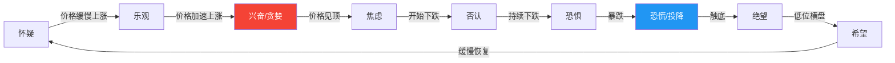
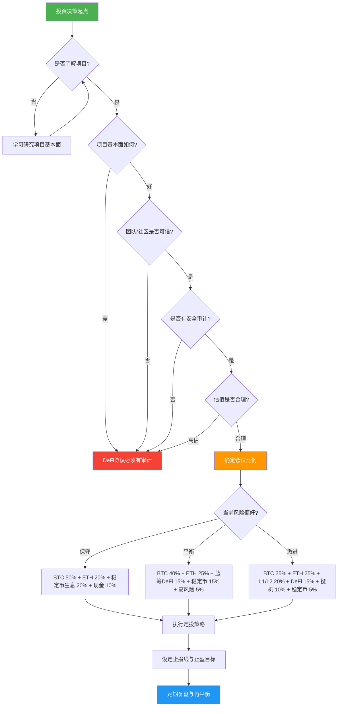

## 四、加密货币投资理论

投资理论是决策的底层操作系统。没有理论指导的投资如同蒙眼过马路——偶尔能平安穿过，但长期必然付出代价。加密货币市场因波动剧烈、信息不对称严重、市场结构不成熟，更需要扎实的理论框架来约束直觉、对抗情绪。

本章从经典金融理论出发，逐一分析它们在加密市场的适用性与局限性，并补充加密领域独有的估值与分析框架。

---

### 4.1 有效市场假说（EMH）

#### 4.1.1 理论核心

有效市场假说（Efficient Market Hypothesis）由 Eugene Fama 于 1970 年提出，核心命题是：**资产价格已充分反映了所有可获得的信息**。根据信息范围的不同，EMH 分为三种形态：

| 形态 | 价格反映的信息 | 能否获得超额收益 | 典型检验方法 |
|------|---------------|----------------|-------------|
| **弱式有效** | 历史价格和交易量 | 技术分析无效，基本面分析可能有效 | 序列自相关检验、滤波规则检验 |
| **半强式有效** | 所有公开信息 | 技术分析和基本面分析均无效 | 事件研究法（公告后价格调整速度） |
| **强式有效** | 所有信息（含内幕） | 任何分析都无法获得超额收益 | 内幕人士交易收益检验 |

传统金融市场中，美国大型股票市场被认为接近半强式有效，而小型股、新兴市场往往只达到弱式有效。

#### 4.1.2 加密市场的有效性分析

加密货币市场**远未达到有效市场标准**，处于弱式有效与非有效之间的灰色地带。原因如下：

**信息不对称严重**

- 项目方掌握代币解锁时间表、内部路线图变更等非公开信息
- 做市商和大户能看到订单簿深度，普通散户不能
- 链上数据（大额转账、聪明钱动向）虽公开但需要专业工具解读
- 中文圈与英文圈的信息传播存在 12-48 小时的时差

**市场操纵普遍**

- **拉高出货（Pump and Dump）**：小市值代币中尤为常见，Telegram/Discord群组协调行动
- **刷量交易（Wash Trading）**：部分交易所虚假交易量占比超过 70%（Bitwise 2019年报告指出，CoinMarketCap 上排名靠后的交易所 95% 的交易量为虚假）
- **鲸鱼操纵**：持有大量代币的地址可以通过大额买卖制造假突破或假跌破
- **交易所插针**：极端行情中交易所价格瞬间大幅偏离，触发连锁清算

**流动性碎片化**

- 同一代币在不同交易所价格差异可达 1-5%
- DEX 与 CEX 之间存在套利空间但执行有延迟
- 跨链资产的流动性分散在多个链上

#### 4.1.3 实证研究与数据

学术界对加密市场有效性的研究已有不少成果：

- **Urquhart (2016)**：研究比特币价格效率，发现早期（2010-2013）市场高度无效，但随时间推移效率在提升
- **Bariviera (2017)**：使用 Hurst 指数分析比特币，发现 2013 年后价格行为从趋势性转向接近随机游走
- **Wei (2018)**：分析多个交易所的虚假交易量后指出，真实流动性远低于表面数据
- **Hacker & Thomale (2018)**：通过方差比检验发现，主要加密货币的价格序列不服从随机游走，说明市场未达到弱式有效

#### 4.1.4 对投资者的实际启示

既然市场未达到有效，意味着**主动管理有机会获得超额收益**，但前提是你确实拥有信息优势或分析优势：

**技术分析的有限有效性**

- 在高流动性、被广泛交易的标的（BTC、ETH）上，经典技术形态的胜率接近 50%，与抛硬币无异
- 但在低流动性小币上，技术分析的自我实现效应更强——足够多人盯着同一支撑位，该支撑位就更可能起作用
- 链上分析（On-chain Analysis）是加密领域特有的"技术分析升级版"，因为它反映的是真实行为而非价格衍生指标

**基本面分析的价值**

- 项目的 GitHub 提交频率、开发者数量、TVL（总锁仓量）、活跃地址数等链上基本面指标可以提供领先信息
- 但基本面分析需要更长的时间框架才能兑现，短期价格仍由情绪和流动性驱动

**信息优势的构建路径**

- 运行自己的链上数据分析节点（而非依赖第三方聚合平台的延迟数据）
- 加入项目治理社区，提前了解提案和路线图变化
- 学习读懂智能合约代码，判断项目是否真有创新
- 关注监管动向，政策变化往往是最大的价格催化剂

---

### 4.2 行为金融学

#### 4.2.1 为什么行为金融学在加密市场尤为重要

传统金融市场有机构投资者、做市商、监管机制等"纠偏力量"，而加密市场以散户为主（估计占比 70-85%），缺乏这些缓冲机制。散户的情绪波动直接决定价格走势，导致加密市场呈现出比传统市场更极端的行为偏差现象。

#### 4.2.2 核心认知偏差详解

**锚定效应（Anchoring Bias）**

人倾向于以某个参考点为基准来做判断。在加密市场中，最常见的锚点是历史最高价（ATH）。

- **表现**："BTC 曾经到过 69000 美元，现在才 30000 美元，肯定能回去"——这个判断忽略了宏观环境、流动性条件可能已根本改变
- **危害**：导致在下跌趋势中不断抄底，在上涨趋势中过早卖出
- **纠正方法**：用估值模型（如 NVT 比率、市值/TVL 比率）代替"离 ATH 多远"来做价值判断

**损失厌恶（Loss Aversion）**

Kahneman 和 Tversky 的前景理论指出，损失带来的痛苦约为等量收益带来快乐的 2-2.5 倍。

- **表现**：亏损的币死拿着不卖（"不卖就不算亏"），盈利的币却急于落袋为安
- **数据**：Odean (1998) 的研究发现，投资者卖出盈利股票的概率比卖出亏损股票高 1.5 倍——即"处置效应"
- **加密场景**：一个代币从 1 美元跌到 0.1 美元，持有者拒绝卖出，理由是"等回本"。但这个代币可能永远不会回到 1 美元，而资金被锁死的机会成本巨大
- **纠正方法**：设定明确的止损规则并严格执行；把每笔投资看作独立决策，而非"回本游戏"

**从众心理（Herd Behavior）**

- **社交媒体放大效应**：Twitter（X）、Telegram 群组、Reddit 中的意见领袖（KOL）能在几小时内影响数万人的交易决策
- **FOMO（Fear of Missing Out）**：看到别人在某个币上赚了 10 倍，不假思索地冲进去，通常买在顶部
- **FUD（Fear, Uncertainty, Doubt）**：恐慌性抛售往往发生在市场底部附近
- **真实案例**：2021 年 SHIB 的暴涨中，大量散户在 0.00008 美元附近追高，随后价格跌去 80% 以上

**过度自信（Overconfidence Bias）**

- **表现**：牛市中把运气当作能力，认为自己是"交易天才"；加杠杆、加大仓位、频繁操作
- **数据**：Barber & Odean (2001) 研究发现，交易最频繁的投资者年化收益比最不频繁的低 7 个百分点
- **加密场景**：牛市中杠杆合约的高胜率让人产生错觉，一旦趋势反转，爆仓在瞬间发生
- **纠正方法**：记录每笔交易的理由和结果，定期复盘；特别警惕"连赢"后的心态变化

**确认偏差（Confirmation Bias）**

- **表现**：持有某个币后，只关注利好消息，忽略甚至否认利空信号
- **加密场景**：在项目社区中，质疑者被攻击为"FUD 传播者"，理性讨论被压制
- **危害**：错过最佳卖出时机，甚至在项目暴雷前仍不离场（LUNA/UST 崩盘前，社区仍有大量"信仰者"）
- **纠正方法**：主动寻找反对意见；建立"魔鬼代言人"机制——每次做出投资决策前，强迫自己写下三个反对理由

**幸存者偏差（Survivorship Bias）**

- **表现**：只看到成功案例（"有人 100 美元买了 BTC 变成千万富翁"），忽略无数归零的项目和破产的投资者
- **数据**：CoinGecko 数据显示，2014 年排名前 20 的加密货币中，到 2024 年仍活跃的不到 5 个
- **纠正方法**：关注整个投资组合的历史回报，而非单个标的；研究失败案例比研究成功案例更有教育意义

**禀赋效应（Endowment Effect）**

- **表现**：对自己已经持有的资产估值过高。"我的币"比"别人的币"感觉更有价值
- **加密场景**：空投获得的代币，明明没有持有理由，却因为"免费获得"而不愿卖出，最终看着它归零
- **纠正方法**：每天问自己——"如果我现在没有持仓，我会以当前价格买入吗？"如果答案是否定的，就应该卖出

#### 4.2.3 市场情绪周期模型

加密市场的情绪变化遵循一个可预测的周期，了解这个周期有助于识别当前所处的位置：



**关键判断指标**：

| 情绪阶段 | 链上信号 | 社交媒体信号 | 交易量特征 |
|---------|---------|-------------|-----------|
| 贪婪/顶部 | 大量新地址涌入，交易所净流入增加 | "to the moon"、"这次不一样" | 天量成交，杠杆率极高 |
| 恐慌/底部 | 交易所净流出增加，长期持有者开始买入 | "crypto is dead"、沉默 | 成交萎缩后突然放量下跌（投降式抛售） |
| 怀疑/早期 | 矿工持仓增加，活跃地址稳步上升 | 讨论减少，关注度低 | 温和放量 |

**工具推荐**：

- **Fear & Greed Index**（alternative.me/crypto/fear-and-greed-index）：综合多维度的市场情绪指标
- **Google Trends**：搜索"Bitcoin"的热度与价格周期高度相关
- **链上数据分析平台**：Glassnode、Nansen、Dune Analytics

#### 4.2.4 建立反行为偏差的投资纪律

认知偏差无法消除，只能通过制度化来对冲：

1. **投资清单制度**：每次交易前填写标准化清单（买入理由、目标价、止损价、仓位比例）
2. **冷静期规则**：做出重大交易决策后，强制等待 24 小时再执行
3. **定期复盘**：每月回顾交易记录，统计胜率、盈亏比、最大回撤
4. **仓位上限**：单一标的不超过总仓位的 15-20%
5. **信息多元**：关注至少 3 个不同立场的信息源，避免回音室效应

---

### 4.3 现代投资组合理论（MPT）在加密市场的应用

#### 4.3.1 马科维茨模型核心

Harry Markowitz 于 1952 年提出的现代投资组合理论（Modern Portfolio Theory）是资产配置的理论基石。核心思想：

- **分散化可以降低风险**：不同资产的相关性越低，组合的风险越低
- **有效前沿**：在给定风险水平下存在一个收益最大化的组合
- **风险-收益权衡**：不能只追求收益而忽视风险，也不能只规避风险而放弃收益

数学表达：

- 组合收益：E(Rp) = Σ wi × E(Ri)
- 组合方差：σ²p = Σ Σ wi × wj × σi × σj × ρij

其中 wi 为权重，ρij 为资产 i 和 j 的相关系数。

#### 4.3.2 加密市场中的相关性特征

传统投资组合理论的前提是资产之间存在低相关性甚至负相关性。但在加密市场中：

**加密资产内部的相关性**

- BTC 与 ETH 的相关系数通常在 0.7-0.9 之间（非常高）
- 山寨币之间的相关性同样很高，市场普涨普跌是常态
- 只有在极端行情中（如 BTC 单独暴涨/暴跌），相关性才会短暂降低

**加密与传统资产的相关性**

- 2020 年之前，BTC 与美股（标普 500）的相关性接近 0
- 2020 年之后，随着机构资金入场，相关性上升至 0.5-0.7
- 与黄金的相关性始终较低（-0.1 至 0.2）
- 与美元指数（DXY）呈负相关（-0.3 至 -0.5）

**这意味着什么**

- 纯加密组合的分散化效果有限——"把鸡蛋放在不同的加密篮子里"并不能显著降低风险
- 真正的分散化需要跨越资产类别：加密 + 股票 + 债券 + 商品 + 现金
- 在加密组合内部，应优先考虑不同赛道的配置（L1公链、DeFi、基础设施、稳定币生息）

#### 4.3.3 实用的加密资产配置框架

根据风险偏好不同，推荐以下配置模型：

**保守型（适合新手或风险厌恶者）**

| 资产类别 | 配置比例 | 具体标的 | 说明 |
|---------|---------|---------|------|
| BTC | 50% | 比特币 | 数字黄金，波动相对较低 |
| ETH | 20% | 以太坊 | 智能合约平台龙头 |
| 稳定币生息 | 20% | USDC/DAI 在 AAVE/Compound | 获取低风险收益 |
| 现金/其他 | 10% | 法币或黄金 ETF | 流动性储备 |

**平衡型（适合有一定经验的投资者）**

| 资产类别 | 配置比例 | 具体标的 | 说明 |
|---------|---------|---------|------|
| BTC | 40% | 比特币 | 核心仓位 |
| ETH | 25% | 以太坊 | 核心仓位 |
| 蓝筹 DeFi | 15% | UNI, AAVE, MKR, LINK | 经过时间验证的协议 |
| 稳定币 | 15% | DAI/USDC 生息 | 收益+流动性储备 |
| 高风险 | 5% | 新兴赛道龙头 | 不超过总仓位的卫星仓位 |

**激进型（适合高风险承受能力者）**

| 资产类别 | 配置比例 | 具体标的 | 说明 |
|---------|---------|---------|------|
| BTC | 25% | 比特币 | 即使激进也需要锚 |
| ETH | 25% | 以太坊 | 生态系统核心 |
| L1/L2 公链 | 20% | SOL, AVAX, ARB, OP | 公链竞争格局仍在变化 |
| DeFi + 基础设施 | 15% | UNI, AAVE, LINK, ARWEAVE | 中等风险 |
| 高风险投机 | 10% | 新叙事/新项目 | 可能归零的仓位 |
| 稳定币 | 5% | USDC | 最低流动性储备 |

#### 4.3.4 再平衡策略

投资组合一旦建立，并非一劳永逸。资产价格变化会导致实际配比偏离目标，需要定期再平衡：

**时间驱动再平衡**

- 每月或每季度检查一次组合配比
- 偏差超过 5% 时进行调整
- 优点：简单，减少交易频率
- 缺点：可能错过极端行情中的调仓机会

**阈值驱动再平衡**

- 任何单一资产的配比偏离目标超过 10%（相对）时触发
- 例如目标 40% BTC，实际变为 44% 或 36% 时需要调整
- 优点：更及时地响应市场变化
- 缺点：在高波动市场中可能触发过于频繁

**混合策略**（推荐）

- 每月检查一次，仅在偏差超过阈值时执行
- 在极端行情（单日涨跌超过 20%）时额外检查
- 再平衡时优先卖出超配资产，而非买入欠配资产（避免追涨）

---

### 4.4 风险管理理论与实践

#### 4.4.1 风险度量指标

**波动率（Volatility）**

- 标准差是最基本的风险度量
- 加密货币的年化波动率通常在 60-100%，远高于股票的 15-20%
- 意味着单日 10% 的涨跌在统计上属于"正常波动"（约 1.5 个标准差）

**最大回撤（Maximum Drawdown）**

- 从历史最高点到最低点的最大跌幅
- BTC 历史最大回撤：-83%（2017年12月至2018年12月）
- ETH 历史最大回撤：-94%（2018年1月至2018年12月）
- 山寨币的最大回撤接近 -99% 屡见不鲜
- **投资启示**：永远假设你持有的任何加密资产可能从高点下跌 80% 以上

**夏普比率（Sharpe Ratio）**

- 公式：Sharpe = (Rp - Rf) / σp
- 含义：每承担一单位风险获得的超额收益
- BTC 的长期夏普比率约为 0.8-1.2（2015-2024），高于股票（约 0.4-0.6）但伴随远更高的波动
- 用于比较不同策略的风险调整后收益

**VaR（Value at Risk）**

- 在给定置信水平下，一定时期内的最大预期损失
- 例如：95% VaR 为 5%，意味着有 95% 的概率单日亏损不超过 5%
- **加密市场的 VaR 局限**：极端事件（黑天鹅）的频率远高于正态分布假设，VaR 可能严重低估尾部风险
- 建议使用 CVaR（条件风险价值）替代，它考虑了超过 VaR 阈值后的平均损失

#### 4.4.2 仓位管理模型

**凯利公式（Kelly Criterion）**

凯利公式用于计算在已知胜率和赔率的情况下，每次下注的最优比例：

```text
f* = (bp - q) / b

f* = 最优投入比例
b  = 赔率（盈利/亏损的比值）
p  = 胜率
q  = 1 - p（败率）
```

**实例计算**：

假设你有一个交易策略：
- 胜率 p = 55%
- 平均盈利 = 15%，平均亏损 = 10%，赔率 b = 1.5
- f* = (1.5 × 0.55 - 0.45) / 1.5 = 0.3 = 30%

**凯利公式的实际应用要点**：

- **半凯利策略**：实际操作中建议使用凯利公式计算结果的一半（上例中用 15%），因为：
  - 胜率和赔率的估计本身有误差
  - 全凯利在连续亏损时波动巨大，心理难以承受
  - 半凯利的长期收益约为全凯利的 75%，但波动降低 50%
- **不适用于无法量化胜率的场景**：如果你无法用历史数据估算胜率和赔率，不要强行套用凯利公式
- **永远留有余地**：即使计算出最优比例，也不要将全部资金投入单一策略

**固定比例法**

- 每笔交易投入总资金的固定比例（如 2-5%）
- 简单易执行，不需要估算胜率
- 适合新手和无法量化策略的投资者

**ATR 仓位调整法**

- 基于平均真实波幅（ATR）动态调整仓位
- ATR 高时减小仓位，ATR 低时增大仓位
- 波动大的标的自动获得更小的仓位，实现风险均衡

#### 4.4.3 投资决策流程



#### 4.4.4 止损与止盈策略

**止损策略**

| 止损类型 | 规则 | 适用场景 | 优缺点 |
|---------|------|---------|--------|
| 固定百分比 | 亏损达到 X% 时卖出（如 -15%） | 所有场景 | 简单，但可能在震荡中被洗出 |
| 技术位止损 | 跌破关键支撑位时卖出 | 有明确技术支撑的标的 | 有逻辑依据，但需要分析能力 |
| 时间止损 | 持有 N 天后未达预期则卖出 | 事件驱动型交易 | 避免资金被长期锁定 |
| 波动率止损 | 亏损超过 2 倍 ATR 时卖出 | 高波动标的 | 自适应波动率，减少误触 |

**止盈策略**

- **分批止盈**：达到目标价 1 时卖出 1/3，达到目标价 2 时再卖 1/3，剩余 1/3 移动止损
- **移动止盈**：价格每上涨 20%，止损线上移 10%（保护利润的同时不封顶）
- **估值驱动止盈**：当链上估值指标（如 NVT）进入极度高估区间时卖出

#### 4.4.5 最大回撤控制

- **设定可承受的最大亏损上限**：建议单笔投资不超过总资金的 30% 亏损，组合总亏损不超过 20-25%
- **达到止损线严格执行**：不设例外、不抱幻想、不等"反弹"
- **保护本金是第一要务**：亏损 50% 需要盈利 100% 才能回本——亏损的修复成本是指数级增长的

| 亏损幅度 | 回本所需涨幅 |
|---------|------------|
| -10% | +11.1% |
| -20% | +25% |
| -30% | +42.9% |
| -50% | +100% |
| -70% | +233% |
| -90% | +900% |

---

### 4.5 加密货币特有估值理论

传统金融的 DCF（现金流折现）模型无法直接应用于多数加密资产，因为它们不产生传统意义上的现金流。以下介绍几种加密领域特有的估值框架。

#### 4.5.1 网络价值模型（NVT Ratio）

**原理**：类似于股票的市盈率（P/E），NVT（Network Value to Transactions）用网络市值除以链上交易价值。

```text
NVT = 市值 / 日均链上交易价值（USD）
```

- **NVT 偏低**：网络相对其使用量被低估
- **NVT 偏高**：网络相对其使用量被高估
- **NVT 信号（NVTS）**：使用 90 天移动平均的交易量来平滑波动，更稳定可靠

**局限性**：交易所内部转账、混币服务等非经济活动会污染交易量数据。

#### 4.5.2 梅特卡夫定律（Metcalfe's Law）

**原理**：网络的价值与用户数量的平方成正比（V ∝ n²）。

**在加密货币中的应用**：
- 活跃地址数可以作为用户数量的代理指标
- Willy Woo 等链上分析师使用此模型估算 BTC 的公允价值
- 历史回测显示，梅特卡夫定律能在一定程度上解释 BTC 的长期价格走势

**变体**：
- 齐普夫定律（Zipf's Law）修正版：V ∝ n × ln(n)，比纯平方关系更保守

#### 4.5.3 存量流量模型（Stock-to-Flow, S2F）

**原理**：由匿名分析师 PlanB 提出，核心逻辑是稀缺性决定价值。S2F = 存量 / 年产量。

- BTC 的 S2F 约为 60（当前约 1970 万枚存量，年新增约 32.8 万枚）
- 每次减半后 S2F 翻倍，理论价格应随之上涨
- 黄金的 S2F 约为 62，与 BTC 接近

**争议**：
- 2020-2021 年的走势高度吻合模型预测
- 2022-2024 年严重偏离（实际价格远低于模型预测值）
- 批评者认为 S2F 是纯供给侧模型，完全忽略需求变化，长期失效是必然的

#### 4.5.4 反身性理论（Reflexivity）

**原理**：索罗斯提出的反身性理论在加密市场中体现得淋漓尽致——**价格影响基本面，基本面又反过来影响价格**，形成正反馈或负反馈循环。

**正反馈循环（牛市）**：
1. 价格上涨 → 吸引更多用户和开发者
2. 更多用户 → 网络效应增强、TVL 增加
3. 基本面改善 → 更多资金流入
4. 更多资金 → 价格继续上涨 → 回到第 1 步

**负反馈循环（熊市）**：
1. 价格下跌 → 用户流失、开发者转向
2. 网络萎缩 → TVL 下降、活跃度降低
3. 基本面恶化 → 资金外流
4. 资金外流 → 价格继续下跌 → 回到第 1 步

**投资启示**：
- 不能简单地用"基本面好所以价格会涨"来推理——在熊市中，好基本面也会被价格下跌拖累
- 反身性意味着趋势一旦形成，会自我强化到过度的程度，然后反转
- 识别正反馈循环的临界点（从自我强化到过度延伸）是投资的核心技能

#### 4.5.5 估值框架对比

| 估值方法 | 适用标的 | 优势 | 局限 |
|---------|---------|------|------|
| NVT Ratio | BTC、ETH 等 L1 公链 | 直觉类比传统 P/E | 交易量数据有噪声 |
| 梅特卡夫定律 | 所有网络型协议 | 理论基础坚实 | 用户数难以精确衡量 |
| 存量流量 | BTC（PoW 币） | 供给侧逻辑清晰 | 完全忽略需求，已失效 |
| 市值/TVL | DeFi 协议 | 适用于产生收益的协议 | TVL 可被操纵 |
| P/S（市销率） | 产生手续费收入的协议 | 直接衡量收入能力 | 收入波动大 |

---

### 4.6 定投理论与实践

#### 4.6.1 定投的数学原理

定投（Dollar Cost Averaging, DCA）的核心优势是**降低平均成本**，在波动市场中效果尤为显著。

**数学证明**：

假设你有 12000 美元，分 12 个月投入 BTC：
- 月份 1-3：价格 $30,000，每月投入 $1000 → 获得 0.1 BTC
- 月份 4-6：价格 $20,000，每月投入 $1000 → 获得 0.15 BTC
- 月份 7-9：价格 $25,000，每月投入 $1000 → 获得 0.12 BTC
- 月份 10-12：价格 $35,000，每月投入 $1000 → 获得约 0.086 BTC

总投入 $12,000，获得约 0.456 BTC，平均成本约 $26,316/BTC
如果一次性在月份 1 以 $30,000 买入，获得 0.4 BTC，平均成本 $30,000

定投节省了约 12.3% 的成本。

#### 4.6.2 定投的优化策略

**基础定投**：固定时间、固定金额，无脑执行
- 适合：新手、时间有限的投资者
- 缺点：不区分市场估值高低

**价值定投（Value DCA）**：根据市场估值调整投入金额
- 当价格低于 200 日均线时，投入金额 × 1.5
- 当价格高于 200 日均线时，投入金额 × 0.5
- 优点：在低位积累更多筹码
- 缺点：需要判断"低估"和"高估"

**恐惧定投**：仅在市场恐惧指数低于 25 时加大投入
- 利用市场情绪的极端值来优化买入时机
- 历史数据显示，在"极度恐惧"时期买入 BTC 的 6 个月回报中位数约为 +40%

#### 4.6.3 定投的纪律要求

- **选择固定日期**：每月 1 号或每周一，不因短期波动改变
- **自动化执行**：使用交易所的定投功能或 API 自动执行
- **至少坚持一个完整周期**：加密市场约 4 年一个周期（与 BTC 减半相关），定投需要跨越至少一个完整周期才能体现优势
- **不看短期盈亏**：定投的收益来自长期积累，短期的账面亏损是正常的

---

### 4.7 常见投资误区与纠正

#### 误区一："这次不一样"

每次牛市都有人宣称"传统周期理论已经失效"。2017 年说"ICO 改变了一切"，2021 年说"机构入场改变了游戏规则"。但市场周期的底层逻辑从未改变——过度杠杆 → 泡沫 → 去杠杆 → 复苏。

**纠正**：市场形式会变，人性不会变。研究历史周期不是为了预测精确价格，而是理解市场运行的底层逻辑。

#### 误区二：把"信仰"当策略

"钻石手"（Diamond Hands）在某些情况下是美德，但不能替代止损纪律。LUNA 从 119 美元跌到 0.0001 美元的过程中，坚持"信仰"的投资者血本无归。

**纠正**：信仰可以用于 BTC 这样经过多轮周期验证的资产，但不能用于任何单一代币。区分"核心信仰"和"沉没成本谬误"。

#### 误区三：频繁交易等于勤奋

加密市场 24/7 不间断交易，容易让人觉得"随时都有机会"。但实际上，频繁交易的结果往往是：手续费吃掉利润、情绪化决策增加、错过大趋势。

**数据**：一项对加密交易者的研究显示，交易频率最高的 20% 交易者，年化收益率比最低的 20% 低 10 个百分点以上。

**纠正**：减少交易频率，增加每笔交易的思考深度。80% 的收益来自 20% 的交易——关键是确保那 20% 的交易你没有错过。

#### 误区四：只看收益不看风险

"这个币涨了 100 倍！"——但你投入了多少钱？你的组合承受了多大的回撤？你用了多大的杠杆？

**纠正**：永远用风险调整后的指标来评估——夏普比率、最大回撤、收益/回撤比。一个年化 100% 但最大回撤 90% 的策略，远不如年化 40% 但最大回撤 20% 的策略。

#### 误区五：忽视税务和合规

很多投资者在牛市中获利丰厚，但没有预留税款，熊市中亏损后无法缴税。

**纠正**：
- 了解你所在国家/地区对加密货币的税务规定
- 每笔盈利交易记录买入价、卖出价、时间
- 预留 20-30% 的利润作为税款储备
- 考虑使用专业的加密税务软件（如 Koinly、CoinTracker）

---

### 4.8 本章总结

| 理论 | 核心观点 | 加密市场适用性 | 实操建议 |
|------|---------|--------------|---------|
| 有效市场假说 | 价格反映信息 | 加密市场远未有效 | 主动管理有超额收益机会 |
| 行为金融学 | 人类存在系统性认知偏差 | 散户为主的市场偏差更极端 | 建立交易纪律，用制度对抗情绪 |
| 投资组合理论 | 分散化降低风险 | 加密资产内部高相关性 | 跨资产类别分散，定期再平衡 |
| 风险管理 | 量化风险，控制损失 | 波动率极高，尾部风险巨大 | 仓位管理、止损纪律、凯利公式 |
| 估值理论 | 确定资产合理价值 | 传统模型不适用 | NVT、梅特卡夫、市值/TVL 组合使用 |
| 定投理论 | 降低平均成本 | 高波动市场定投效果更佳 | 自动化执行，至少跨越一个完整周期 |

投资理论不是用来预测市场的水晶球，而是用来约束决策的框架。在加密这个充满噪声和诱惑的市场中，理论框架的最大价值是：**当所有人都在凭直觉和情绪行动时，你有一套经过验证的方法论来保持理性**。
