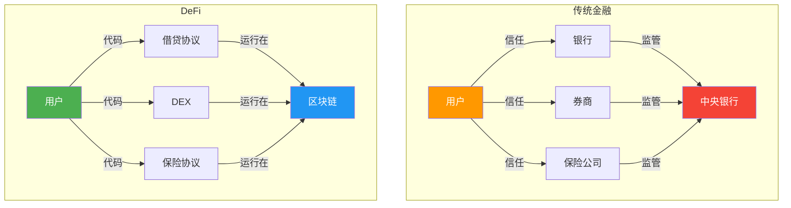
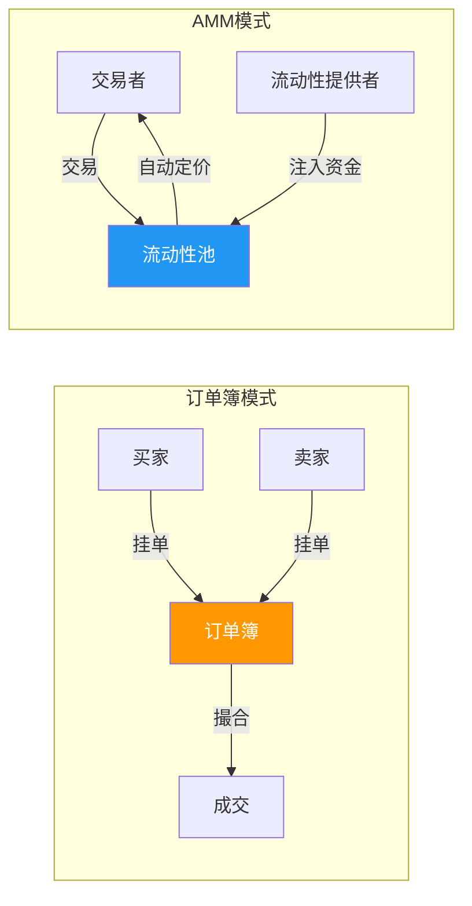
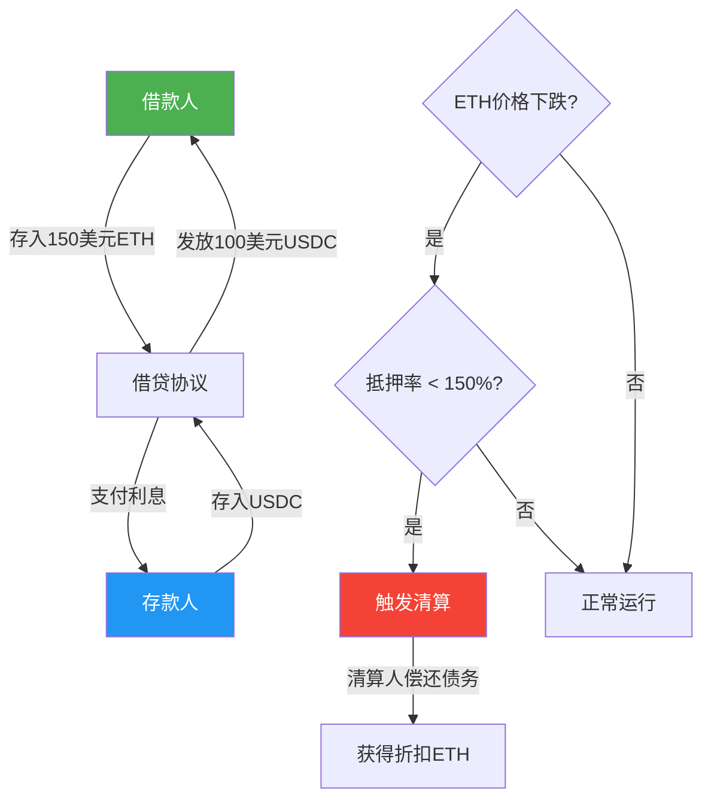
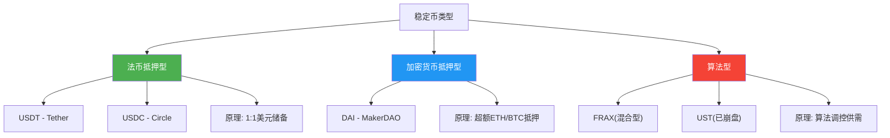
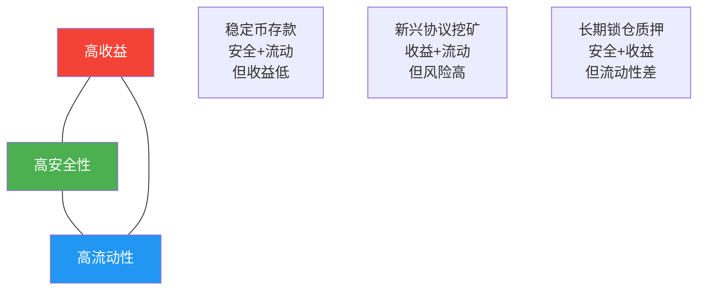
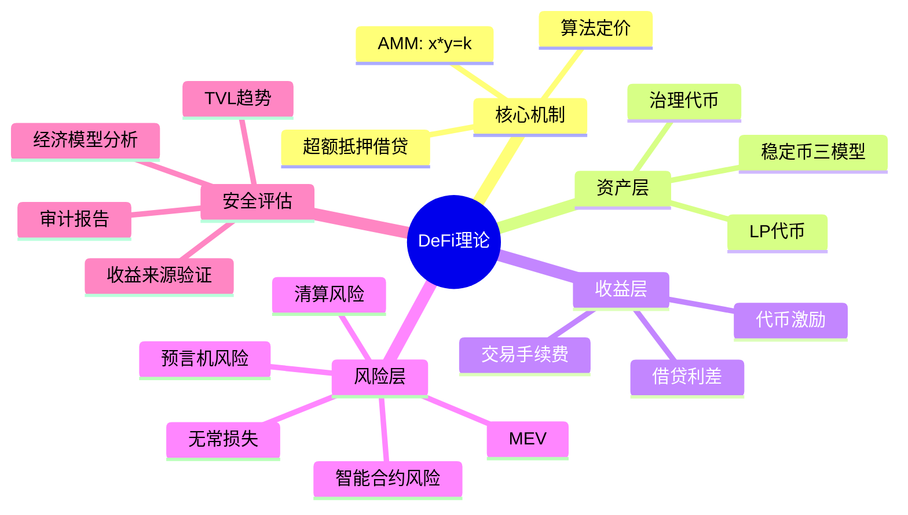

## 五、DeFi理论基础

### 5.1 什么是DeFi：从传统金融到去中心化金融

#### 5.1.1 DeFi的定义与核心理念

DeFi（Decentralized Finance，去中心化金融）是一组运行在区块链上的开放式金融协议，通过智能合约实现传统金融服务——借贷、交易、保险、衍生品——而无需银行、券商、保险公司等中介机构。

传统金融体系的运作依赖于**信任中介**：你在银行存款，是因为你信任银行不会跑路；你通过券商买股票，是因为你信任券商会如实执行交易。这种信任是有成本的——银行收取利差，券商收取佣金，保险公司收取保费。更关键的是，这种信任是有门槛的——全球约有14亿成年人没有银行账户，无法享受基本金融服务。

DeFi的核心理念是：**用代码替代信任**。当借贷规则写在智能合约里，当交易由自动做市商（AMM）算法执行，当利息分配由链上逻辑自动完成——你不需要信任任何机构，只需要信任经过审计的代码和区块链网络的安全性。



#### 5.1.2 DeFi与CeFi的对比

理解DeFi，最好的方式是与CeFi（Centralized Finance，中心化金融）对比：

| 维度 | CeFi（中心化金融） | DeFi（去中心化金融） |
|------|-------------------|---------------------|
| **信任模型** | 信任机构（银行、交易所） | 信任代码（智能合约） |
| **资产控制** | 机构托管（"不是你的私钥，就不是你的币"） | 用户自持私钥，资产由自己控制 |
| **透明度** | 黑盒运营，依赖审计报告 | 全部交易链上可查，代码开源可审计 |
| **准入门槛** | 需要KYC、银行账户、地域限制 | 只要有钱包和网络连接，全球任何人可参与 |
| **结算速度** | T+1到T+2（股票），跨境汇款数天 | 区块确认时间（以太坊约12秒，Solana约400毫秒） |
| **可组合性** | 各机构系统互不兼容 | 协议之间可自由组合（"乐高积木"） |
| **监管保护** | 有存款保险、法律追索权 | 几乎没有法律保护，出错不可逆 |
| **故障处理** | 可以撤销交易、冻结账户 | 交易上链不可篡改，智能合约漏洞无法回滚 |
| **运营时间** | 工作日、工作时间 | 7×24全天候运行 |

**关键认知**：DeFi不是"更好的银行"，而是一种全新的金融范式。它用去信任化和开放性换取了传统金融的监管保护和客户服务。选择DeFi还是CeFi，本质上是在"信任代码"和"信任机构"之间的权衡。

#### 5.1.3 DeFi的发展历程

| 阶段 | 时间 | 关键事件 | 里程碑意义 |
|------|------|---------|-----------|
| **萌芽期** | 2015-2017 | 以太坊上线，MakerDAO启动 | 智能合约使得可编程金融成为可能 |
| **早期发展** | 2018-2019 | Uniswap V1上线，Compound V1发布 | AMM机制验证了去中心化交易的可行性 |
| **DeFi Summer** | 2020年6-9月 | Compound发COMP治理代币，流动性挖矿爆发 | DeFi TVL从10亿飙涨到100亿美元 |
| **泡沫与调整** | 2021-2022 | TVL峰值超1800亿，LUNA/UST崩盘 | 算法稳定币的系统性风险被验证 |
| **理性重建** | 2023-2025 | Uniswap V3集中流动性成熟，RWA（真实世界资产）引入 | DeFi从纯投机转向服务真实经济需求 |

#### 5.1.4 DeFi生态全景

```mermaid
graph TD
    A[DeFi生态] --> B[基础设施层]
    A --> C[协议层]
    A --> D[应用层]
    A --> E[聚合层]

    B --> B1[公链: Ethereum, Solana, BSC]
    B --> B2[Layer2: Arbitrum, Optimism, zkSync]
    B --> B3[预言机: Chainlink, Pyth]
    B --> B4[跨链桥: LayerZero, Wormhole]

    C --> C1[DEX: Uniswap, Curve]
    C --> C2[借贷: Aave, Compound]
    C --> C3[稳定币: USDT, DAI, USDC]
    C --> C4[衍生品: dYdX, GMX]
    C --> C5[保险: Nexus Mutual]

    D --> D1[钱包: MetaMask, Phantom]
    D --> D2[收益聚合: Yearn, Beefy]
    D --> D3[资产管理: dHEDGE]

    E --> E1[DEX聚合: 1inch, Paraswap]
    E --> E2[收益聚合: DeFi Llama]
    E --> E3[仪表盘: Zapper, Zerion]

    style A fill:#1a73e8,color:#fff
    style B fill:#34a853,color:#fff
    style C fill:#fbbc04,color:#000
    style D fill:#ea4335,color:#fff
    style E fill:#7b1fa2,color:#fff
```



### 5.2 智能合约：DeFi的基石

#### 5.2.1 智能合约的本质

智能合约（Smart Contract）是部署在区块链上的自执行程序。它的逻辑可以用一个简单的类比理解：

> 传统合同：甲乙双方签订协议 → 发生争议 → 找法院仲裁 → 强制执行
> 智能合约：甲乙双方的协议写成代码 → 条件满足时代码自动执行 → 无需第三方仲裁

以太坊上的智能合约使用Solidity语言编写，编译后部署到区块链上。一旦部署，合约代码不可修改（除非预留了升级接口）。每个合约都有一个唯一地址，用户通过发送交易与合约交互。

```solidity
// 最简化的借贷合约逻辑示例（仅用于说明原理，非生产代码）
contract SimpleLending {
    mapping(address => uint256) public deposits;
    
    // 存款：存入ETH，记录余额
    function deposit() external payable {
        deposits[msg.sender] += msg.value;
    }
    
    // 取款：取回所有存款
    function withdraw() external {
        uint256 balance = deposits[msg.sender];
        require(balance > 0, "No deposits");
        deposits[msg.sender] = 0;
        payable(msg.sender).transfer(balance);
    }
}
```

#### 5.2.2 智能合约的可组合性（Composability）

DeFi最强大的特性之一是**可组合性**——不同协议可以像乐高积木一样自由组合。一个交易可以在一次操作中：在Aave借出USDC → 在Curve将USDC兑换为DAI → 在MakerDAO将DAI存入赚取利息。

这种可组合性带来两个效果：
- **正效应**：开发者可以快速组合已有协议构建新产品，无需从零开始
- **风险效应**：一个协议的漏洞可能影响所有依赖它的协议，形成连锁风险（systemic risk）

### 5.3 自动做市商（AMM）：去中心化交易的核心机制

#### 5.3.1 传统订单簿 vs AMM

中心化交易所（如Binance）使用**订单簿**模型：买家挂买单，卖家挂卖单，交易所撮合匹配。这需要大量的买方和卖方同时在线，否则你可能挂单很久都无法成交——这叫**流动性不足**。

去中心化交易所面临一个根本性问题：区块链交易确认需要时间（以太坊约12秒），不可能像中心化交易所那样毫秒级撮合。更重要的是，早期的DEX根本没有足够的用户来维持一个活跃的订单簿。

AMM（Automated Market Maker，自动做市商）的解决方案是：**用数学公式替代订单簿**。你不需要找到对手方，你直接与一个由智能合约管理的"流动性池"交易。



#### 5.3.2 恒定乘积做市公式（x * y = k）

Uniswap V2使用的核心公式极其简单：

> **x × y = k**

其中：
- x = 池中A代币的数量
- y = 池中B代币的数量
- k = 一个常数（在没有新增/移除流动性时保持不变）

**工作原理**：

假设一个ETH/USDC流动性池，初始状态：
- x = 10 ETH
- y = 30,000 USDC
- k = 10 × 30,000 = 300,000

这意味着初始价格为 30,000 / 10 = 3,000 USDC/ETH。

现在有人要买入1 ETH：
1. 他向池中放入 Δy USDC
2. 池中ETH减少到 9 枚
3. 为了保持 k = 300,000，新的USDC数量 = 300,000 / 9 = 33,333.33
4. 他需要支付 33,333.33 - 30,000 = 3,333.33 USDC
5. 实际成交价 = 3,333.33 USDC/ETH（比初始价格高，因为买盘推高了价格）

**价格影响（Price Impact）**：交易规模越大，实际成交价与市场价格的偏差越大。这叫做"滑点"（Slippage）。小交易几乎无滑点，大交易的滑点可能非常显著。

**滑点示例**：

| 买入数量 | 池中ETH剩余 | 需付USDC | 实际单价 | 滑点 |
|---------|------------|---------|---------|------|
| 0.1 ETH | 9.9 | 3,030.30 | 3,030.30 | 1.0% |
| 1 ETH | 9.0 | 3,333.33 | 3,333.33 | 11.1% |
| 3 ETH | 7.0 | 12,857.14 | 4,285.71 | 42.9% |

#### 5.3.3 流动性提供者的收益与风险

**流动性提供者（LP，Liquidity Provider）** 向池中注入两种代币（按当前价格等值配比），获得LP代币作为凭证。LP的收益来源：
- **交易手续费**：Uniswap V2收取每笔交易0.3%的手续费，按比例分配给LP
- **代币激励**：部分协议额外发行治理代币奖励LP（流动性挖矿）

**无常损失（Impermanent Loss）** 是LP面临的最大风险。当两种代币的价格比率发生变化时，LP持有的资产组合相比单纯持有原始代币会产生损失。

**无常损失计算示例**：

假设你向ETH/USDC池投入1 ETH + 3,000 USDC（总价值6,000美元）。如果ETH价格涨到12,000 USDC：

| 方案 | 资产组成 | 总价值 |
|------|---------|--------|
| 简单持有 | 1 ETH + 3,000 USDC | 15,000 美元 |
| 提供流动性 | 0.5 ETH + 6,000 USDC | 12,000 美元 |
| 无常损失 | — | **-3,000 美元（-20%）** |

注意：这里"无常"指的是如果价格回到初始水平，损失会消失。但如果你在损失状态下撤出流动性，损失就变成"永久"的。

**无常损失的数学关系**（价格变动倍数 vs 损失比例）：

| 价格变动倍数 | 无常损失 |
|-------------|---------|
| 1.25× | 0.6% |
| 1.5× | 2.0% |
| 2× | 5.7% |
| 3× | 13.4% |
| 5× | 25.5% |

**关键洞察**：只有当交易手续费收入 > 无常损失时，LP才真正赚钱。这就是为什么在低波动性代币对（如USDC/USDT稳定币对）上提供流动性，手续费占比更高，LP收益更稳定。

#### 5.3.4 Uniswap V3的集中流动性

Uniswap V2的流动性均匀分布在 0 到 ∞ 的整个价格区间，大部分资金实际上处于闲置状态。V3引入了**集中流动性（Concentrated Liquidity）**：LP可以指定一个价格范围，流动性只在这个范围内活跃。

**原理**：
- V2：你在一个池子里投入资金，覆盖所有价格
- V3：你选择一个价格范围（如ETH在2,800-3,200 USDC之间），你的资金只在这个范围内做市

**效果**：同样的资金，在窄价格范围内可以提供高达4,000倍的深度。但代价是——如果价格移出你的范围，你的仓位变成100%单一资产，停止赚取手续费，且无常损失加速累积。

#### 5.3.5 Curve：稳定资产的专用AMM

Curve Finance针对稳定币等锚定资产设计了不同的数学公式。因为USDC和USDT的价格通常在1:1附近波动，使用标准x*y=k公式会导致大量滑点。

Curve使用的StableSwap公式在接近1:1的区间内提供极低滑点，本质上是在x*y=k和x+y=k（恒定和公式，即"直线"）之间做插值。这使得Curve成为稳定币兑换的最佳场所——1亿USDC换成USDT，滑点可能不到0.01%。

### 5.4 借贷协议：去中心化的银行

#### 5.4.1 超额抵押借贷模型

DeFi借贷协议（如Aave、Compound）的核心机制是**超额抵押**：你存入价值150美元的ETH作为抵押品，才能借出价值100美元的USDC。这与传统银行的"信用贷款"完全不同——DeFi不评估你的信用，只看你抵押了多少资产。

**为什么要超额抵押？** 因为在没有信用评估机制的去中心化环境中，这是防止坏账的唯一方法。如果抵押物价格下跌，协议可以卖出抵押物来偿还债务（即"清算"），确保贷方资金安全。



#### 5.4.2 利率模型

DeFi借贷协议的利率不是固定的，而是由算法根据**资金利用率**动态调整：

> **资金利用率 = 已借出资金 / 总供给资金**

以Aave V3的利率模型为例：

```text
当 利用率 ≤ 最优利用率(如80%)：
    利率 = 基础利率 + (利用率 / 最优利用率) × 斜率1

当 利用率 > 最优利用率：
    利率 = 基础利率 + 斜率1 + ((利用率 - 最优利用率) / (1 - 最优利用率)) × 斜率2
```

关键点：斜率2远大于斜率1，所以当利用率超过最优值后，利率会急剧上升。这有两个作用：
1. 激励更多存款（高利率吸引存款人）
2. 抑制更多借款（高利率劝退借款人）
3. 确保始终有资金可供提取

**实际利率范围**（以Aave V3 Ethereum为例）：

| 资产 | 存款APY（低利用时） | 借款APY（低利用时） | 存款APY（高利用时） | 借款APY（高利用时） |
|------|-------------------|-------------------|-------------------|-------------------|
| USDC | 1%-3% | 3%-5% | 8%-15% | 15%-30% |
| ETH | 0.5%-2% | 2%-4% | 5%-10% | 10%-20% |
| WBTC | 0.1%-1% | 1%-3% | 3%-8% | 8%-15% |

#### 5.4.3 清算机制

当借款人的**健康因子（Health Factor）**低于1时，触发清算：

> **健康因子 = (抵押物价值 × 清算阈值) / 借款价值**

以Aave为例，ETH的清算阈值为82.5%。如果你抵押了10 ETH（价值30,000美元），最多可借 30,000 × 82.5% = 24,750美元。

**清算流程**：
1. ETH价格下跌，抵押物价值降为28,000美元
2. 健康因子 = 28,000 × 0.825 / 24,750 = 0.933 < 1
3. 触发清算——任何人都可以调用清算函数
4. 清算人替借款人偿还部分债务（如50%），获得等值抵押物 + 清算奖励（如5%）
5. 借款人的债务减少，抵押物减少，健康因子恢复到1以上

**清算罚金（Liquidation Penalty）** 通常为5%-10%，这是对借款人未能维护足够抵押率的惩罚。

**避免被清算的方法**：
- 保持健康因子 > 1.5（留足缓冲空间）
- 设置价格预警（当抵押物价格下跌10%以上时收到通知）
- 准备好备用资金，随时可以补充抵押物
- 不要借到上限（建议只使用最高借贷额度的50%-60%）

#### 5.4.4 闪电贷（Flash Loan）

闪电贷是DeFi独有的创新：你可以在同一笔交易中借出任意数量的资金，不需要任何抵押——**前提是必须在同一笔交易中归还**（加上手续费，通常0.09%）。

**原理**：区块链交易是原子性的——要么全部成功，要么全部回滚。如果还款步骤失败，整笔交易（包括借款）都会撤销，就像从未发生过一样。

**合法用途**：
- **套利**：发现A交易所ETH价格3,000美元，B交易所3,020美元。借1,000 ETH → 在A买入 → 在B卖出 → 归还本金+手续费 → 净赚差价
- **抵押物置换**：将自己的抵押物从ETH换成WBTC，无需先偿还借款
- **自我清算**：借入资金偿还自己的贷款，取回抵押物，卖出部分抵押物还闪电贷

**风险用途**：闪电贷也被用于攻击——借入大量资金操纵价格、利用协议漏洞等。2020-2022年间，数十起DeFi攻击使用了闪电贷作为资金来源。

### 5.5 稳定币：DeFi的血液

#### 5.5.1 稳定币的必要性

加密货币价格波动剧烈——ETH一天涨跌20%并不罕见。如果你需要一个稳定的计价单位来完成借贷、交易、支付等金融操作，就必须有一种与法币（通常是美元）1:1锚定的代币。这就是稳定币。

截至2025年，稳定币总市值超过2,000亿美元，日交易量超过800亿美元，是DeFi生态中使用最广泛的资产类型。

#### 5.5.2 三种稳定币模型



**（一）法币抵押型稳定币**

代表：USDT（Tether）、USDC（Circle）

**机制**：发行方每铸造1枚USDT/USDC，就在银行账户中存入1美元（或等值资产）。用户可以用1美元向发行方兑换1枚稳定币，也可以用1枚稳定币赎回1美元。

| 对比项 | USDT (Tether) | USDC (Circle) |
|--------|--------------|---------------|
| 发行方 | Tether Limited（英属维尔京群岛） | Circle（美国） |
| 市值（2025年） | 约1,400亿美元 | 约600亿美元 |
| 储备构成 | 现金+国债+商业票据+其他 | 现金+美国国债 |
| 审计频率 | 季度证明（非完整审计） | 月度证明（由Grant Thornton审计） |
| 监管合规 | 监管透明度较低 | 受美国监管，合规性较高 |
| 冻结能力 | 可以冻结特定地址 | 可以冻结特定地址 |

**优势**：机制简单、用户理解成本低、价格稳定
**风险**：中心化——发行方可以冻结你的资产；储备透明度存疑；如果发行方破产，可能无法1:1赎回

**（二）加密货币超额抵押型稳定币**

代表：DAI（MakerDAO）

**机制**：用户存入ETH、WBTC等加密资产作为抵押品（超额抵押率通常为150%以上），生成DAI。当抵押率不足时触发清算。

**生成DAI的流程**：
1. 向MakerDAO的Vault存入1.5 ETH（价值4,500美元）
2. 铸造最多3,000 DAI（以150%抵押率计算）
3. 支付稳定费（年化利率，类似贷款利息）
4. 归还DAI + 利息后可取回抵押品

**优势**：去中心化、透明、任何人可验证链上抵押物
**风险**：抵押物价格暴跌可能导致大规模清算→更多抛压→进一步下跌（死亡螺旋风险，但相比算法稳定币，有超额抵押物兜底）

**（三）算法稳定币**

代表：UST（Terra，已崩盘）、FRAX（部分算法）

**机制**：通过算法调节供给来维持锚定。以UST为例：
- 当UST > 1美元：用户可以用价值1美元的LUNA铸造1 UST（供给增加，价格回落）
- 当UST < 1美元：用户可以销毁1 UST换回价值1美元的LUNA（供给减少，价格回升）

**致命缺陷**：这种机制在极端情况下会形成**死亡螺旋**——UST脱锚 → 用户恐慌兑换LUNA → LUNA价格暴跌 → 铸造更多LUNA → LUNA继续暴跌 → 循环加速 → 归零。2022年5月，LUNA/UST崩盘，400多亿美元市值在几天内蒸发。

**教训**：没有足额抵押物支撑的稳定币，本质上是一种信心游戏。当信心崩溃时，算法无法阻止崩盘。

#### 5.5.3 如何选择稳定币

| 使用场景 | 推荐选择 | 原因 |
|---------|---------|------|
| 日常交易 | USDC | 合规性强，透明度高 |
| DeFi操作 | USDC + DAI | 流动性好，协议兼容性强 |
| 长期持有 | 分散持有 | 不要把所有资金放在一种稳定币 |
| 隐私需求 | DAI | 去中心化，不容易被冻结 |
| 跨链转移 | USDC | 支持多链，CCTP跨链协议 |

**关键原则**：永远不要把所有资金集中在一种稳定币上。USDT有储备透明度风险，USDC有中心化冻结风险，DAI有智能合约风险。分散持有是保护自己的最佳策略。

### 5.6 流动性挖矿与代币激励

#### 5.6.1 流动性挖矿的起源与机制

2020年6月，Compound协议推出了COMP治理代币分配机制——用户在Compound上借贷资产就能获得COMP代币奖励。这一事件引爆了"DeFi Summer"，TVL（总锁仓价值）在几个月内从10亿飙升到100亿美元。

**流动性挖矿（Yield Farming / Liquidity Mining）** 的本质是：协议通过发行治理代币来"贿赂"用户，让用户提供流动性、存款或参与协议。

**激励设计的目的**：
- **冷启动**：新协议需要流动性来运作，但没有用户会来一个没有流动性的协议。代币奖励是打破"冷启动困境"的手段
- **治理去中心化**：通过代币分配，将协议控制权逐步转移给社区
- **用户增长**：代币奖励是一种获客补贴

#### 5.6.2 收益来源的拆解

DeFi收益来自多个层次，理解每个层次才能判断收益是否可持续：

| 收益来源 | 可持续性 | 来源说明 | 典型年化 |
|---------|---------|---------|---------|
| 协议费用 | 高 | 交易手续费、借贷利差 | 1%-10% |
| 代币激励 | 中 | 协议发行治理代币奖励用户 | 5%-100% |
| 杠杆收益 | 低 | 循环借贷放大收益 | 20%-500% |
| 协议积分/空投 | 不确定 | 未来潜在代币奖励 | 不可预测 |

**判断收益可持续性的核心问题**：
1. **收益从哪里来？** 如果来自协议手续费（真实收入），可持续性高；如果来自代币增发（代币通胀），可持续性低
2. **代币通胀率是多少？** 如果年通胀100%而协议收入不足，代币价格会持续下跌，最终收益被价格下跌吃掉
3. **TVL增长还是流出？** TVL持续增长说明用户在增加，TVL流出说明代币吸引力在下降

#### 5.6.3 流动性挖矿的完整收益计算

假设你在Uniswap V3上为ETH/USDC池提供流动性：

```text
总收益 = 交易手续费收益 + 代币激励收益 - 无常损失 - Gas费

示例：
- 存入：5 ETH + 15,000 USDC（总价值30,000美元）
- 交易手续费年化：约15%（假设集中在活跃价格范围）
- 代币激励年化：约10%（如果有的话）
- 无常损失（假设ETH涨50%）：约5.7%
- Gas费（月度调整仓位）：约100美元/月 = 1,200美元/年
- 净年化收益 = 30,000 × (15% + 10% - 5.7%) - 1,200 = 4,590美元 = 15.3%
```

### 5.7 去中心化交易所（DEX）进阶

#### 5.7.1 DEX的交易流程

以Uniswap为例，一笔交易的完整流程：

1. 用户在前端页面选择交易对和数量
2. 前端调用路由器合约获取报价（含滑点计算）
3. 用户确认交易，签名后发送到以太坊网络
4. 交易进入内存池（mempool）等待打包
5. 矿工/验证者将交易打包进区块
6. AMM公式自动执行兑换，更新池中代币余额
7. 用户收到兑换后的代币

**Gas费的影响**：在以太坊主网上，一笔Uniswap交易的Gas费可能高达20-100美元（取决于网络拥堵程度）。这就是为什么Layer2（如Arbitrum、Optimism）上的DEX越来越流行——Gas费可以降低90%以上。

#### 5.7.2 MEV（最大可提取价值）

MEV（Maximal Extractable Value）是指区块生产者通过选择性地包含、排除或重新排序区块中的交易来获取的额外利润。

**MEV对普通用户的影响**：

| MEV类型 | 机制 | 对用户的影响 |
|---------|------|-------------|
| **三明治攻击（Sandwich）** | 攻击者在你的交易前后各插一笔交易：先买入推高价格→你的交易以更高价成交→他再卖出获利 | 你多付了钱（滑点被吃掉） |
| **套利** | 发现不同池子的价格差异，买入低的、卖出高的 | 中性——使价格趋于一致 |
| **清算** | 监控借贷协议，第一个清算不健康仓位获得奖励 | 对协议健康有益，但清算人获利 |

**防范三明治攻击**：
- 设置较低的滑点容忍度（如0.5%-1%）
- 使用Flashbots Protect等私密交易通道（交易不进公开内存池）
- 使用MEV保护的前端（如MEV Blocker）
- 避免大额交易直接在链上执行，使用聚合器的拆单功能

#### 5.7.3 DEX聚合器

当不同DEX之间存在价格差异时，手动逐个对比非常低效。DEX聚合器（如1inch、Paraswap、0x）自动扫描多个流动性来源，找到最优价格路径。

**聚合器可能的拆单路径**：
- 1,000 USDC → ETH：其中600 USDC通过Uniswap兑换，300 USDC通过Curve兑换，100 USDC通过SushiSwap兑换
- 甚至可能经过中间代币：USDC → DAI → ETH（如果这样滑点更低）

### 5.8 衍生品协议与杠杆

#### 5.8.1 永续合约

去中心化永续合约（如dYdX、GMX、Hyperliquid）允许用户做多或做空资产，使用杠杆放大收益和损失。与中心化合约交易所的机制类似，但交易在链上（或链下撮合+链上结算）进行。

**资金费率（Funding Rate）** 是永续合约的核心机制，用来使合约价格锚定现货价格：
- 当多头力量强（合约价格 > 现货价格）：多头付资金费率给空头
- 当空头力量强（合约价格 < 现货价格）：空头付资金费率给多头

资金费率通常每8小时结算一次，费率在 ±0.1% 之间波动（极端行情可能更高）。

#### 5.8.2 期权协议

DeFi期权协议（如Lyra、Opyn、Hegic）允许用户在链上买卖期权。期权买方支付权利金获得在未来以特定价格买入/卖出资产的权利（非义务），期权卖方收取权利金承担相应义务。

DeFi期权市场相比传统期权交易所仍然很小，流动性有限，但为DeFi生态提供了更丰富的风险对冲工具。

### 5.9 预言机（Oracle）：连接链上与链下

#### 5.9.1 预言机问题

智能合约运行在区块链上，无法直接访问链外数据（如ETH的美元价格、体育比赛结果、天气数据）。预言机是将链外数据安全地传递给智能合约的基础设施。

**为什么预言机至关重要？** 借贷协议需要知道ETH的当前价格来计算清算线；衍生品协议需要价格数据来结算合约；保险协议需要外部事件数据来理赔。预言机提供错误数据的后果是灾难性的——可能触发错误清算，或被操纵来窃取资金。

#### 5.9.2 Chainlink的工作机制

Chainlink是目前最广泛使用的去中心化预言机网络，其核心机制：

1. **数据源聚合**：从多个独立的数据提供商获取价格数据
2. **去中心化节点网络**：由多个独立节点分别获取和报告数据
3. **中位数聚合**：取所有节点报告值的中位数，排除异常值
4. **链上更新**：当价格变化超过阈值（如0.5%）或定期更新时，将数据写入链上

**预言机操纵攻击**：2022年Mango Markets被攻击，攻击者在低流动性的永续合约市场上大量做多MNGN代币→操纵MNGN价格→在Mango Markets上以虚高价格抵押借出真实资产→获利1.14亿美元。这次攻击的核心就是预言机使用了容易被操纵的价格来源。

### 5.10 DeFi协议安全分析框架

#### 5.10.1 智能合约风险层次

| 风险层次 | 描述 | 典型案例 | 评估方法 |
|---------|------|---------|---------|
| **代码漏洞** | 合约代码存在可被利用的Bug | The DAO被黑（2016，6,000万美元） | 查看审计报告、开源代码 |
| **逻辑漏洞** | 代码正确但经济模型有缺陷 | bZx闪电贷攻击（2020） | 经济模型分析、压力测试 |
| **预言机风险** | 价格源被操纵 | Mango Markets（2022，1.14亿） | 预言机来源审查 |
| **治理攻击** | 通过购买治理代币控制协议 | Beanstalk（2022，1.82亿） | 代币分布、治理机制 |
| **系统性风险** | 依赖的其他协议出问题 | LUNA崩盘影响整个DeFi | 依赖关系映射 |
| **升级风险** | 管理员私钥被盗或恶意升级 | Wormhole（2022，3.2亿） | 权限管理审查 |

#### 5.10.2 DeFi协议评估清单

在参与任何DeFi协议之前，检查以下项目：

**（一）代码安全**
- [ ] 是否经过至少1家知名审计公司审计？（Trail of Bits、OpenZeppelin、Consensys Diligence、Certora）
- [ ] 审计报告中的高危漏洞是否已修复？
- [ ] 合约代码是否开源？可以在GitHub或Etherscan上查看？
- [ ] 是否有漏洞赏金计划（Bug Bounty）？赏金金额是否足够？

**（二）团队与治理**
- [ ] 团队是否公开身份（Doxxed）？
- [ ] 合约是否有管理员权限（Admin Key）？权限范围是什么？
- [ ] 是否使用了多签钱包控制关键操作？
- [ ] 治理代币的分配是否合理？团队持仓比例是否过高？

**（三）经济模型**
- [ ] 收益来源是什么？（协议费用 or 代币通胀）
- [ ] 代币通胀率是多少？何时减半或结束排放？
- [ ] TVL趋势如何？是在增长还是流出？
- [ ] 是否有真实的用户需求和交易量？

**（四）依赖关系**
- [ ] 协议依赖哪些其他协议？（预言机、跨链桥、其他DeFi协议）
- [ ] 依赖的协议是否安全？
- [ ] 是否有"可组合性风险"——一个依赖出问题会导致连锁反应？

#### 5.10.3 TVL不是安全指标

一个常见的误区是认为TVL（总锁仓价值）高的协议更安全。事实并非如此——TVL只说明有多少资金在里面，不说明代码是否安全。

| 错误推理 | 现实 |
|---------|------|
| "这个协议有50亿美元TVL，肯定安全" | LUNA有400亿美元TVL，几天内归零 |
| "运行了2年没被黑，说明安全" | 也许只是还没被发现漏洞 |
| "大机构投资了，应该靠谱" | FTX也有大机构投资 |

### 5.11 DeFi参与的风险全景

#### 5.11.1 风险分类与应对

| 风险类型 | 描述 | 发生概率 | 损失程度 | 应对策略 |
|---------|------|---------|---------|---------|
| **智能合约风险** | 代码漏洞导致资金被盗 | 中 | 可能损失全部 | 选择经过多次审计的老牌协议 |
| **无常损失** | LP代币价值低于简单持有 | 高 | 5%-25% | 选择波动性低的代币对，或使用集中流动性 |
| **清算风险** | 抵押物价格暴跌触发清算 | 中 | 抵押物 + 罚金 | 保持低借贷率，设置预警 |
| **预言机操纵** | 价格数据被操纵 | 低 | 可能全部 | 使用Chainlink等去中心化预言机 |
| **治理攻击** | 恶意提案通过 | 低 | 可能全部 | 关注治理投票，分散风险 |
| **监管风险** | 协议被制裁或关闭 | 中 | 部分或全部 | 分散到多个协议和链 |
| **稳定币脱锚** | 稳定币价格偏离1美元 | 低-中 | 5%-100% | 分散持有多种稳定币 |
| **私钥风险** | 私钥泄露或丢失 | 低 | 全部 | 硬件钱包+多地备份助记词 |

#### 5.11.2 "不可能三角"模型

DeFi投资面临一个"不可能三角"：



**你最多只能同时拥有其中两个**：
- 高收益 + 高流动性 → 牺牲安全性（新兴协议的流动性挖矿）
- 高收益 + 高安全性 → 牺牲流动性（长期锁仓质押）
- 高安全性 + 高流动性 → 牺牲收益（Aave存USDC，年化1%-3%）

**任何声称同时提供高收益、高安全性和高流动性的协议，都是骗局。**

### 5.12 评估DeFi协议收益率是否可持续

#### 5.12.1 三步验证法

面对一个声称年化50%的DeFi协议，用以下三步验证：

**第一步：追溯收益来源**

```text
问：年化50%的收益从哪里来？

如果是协议交易手续费 → 需要有大量真实交易量支撑
→ 检查日交易量和手续费收入（DeFi Llama可查）

如果是代币激励 → 需要新代币不断增发
→ 检查代币通胀率（排放计划/代币经济学文档）
→ 如果年通胀100%，代币价格会持续下跌

如果无法解释收益来源 → 大概率是庞氏结构
→ 早期用户的收益来自后来用户的本金
```

**第二步：检查代币经济学**

```text
关键指标：
- 总供应量 vs 流通量（大量未解锁代币 = 未来抛压）
- 团队/投资者持仓比例和解锁时间表
- 代币的实际用途（治理投票？费用折扣？分红？）
- 代币是否不断通胀？通胀率是否逐步降低？
```

**第三步：压力测试思维实验**

```text
问：如果所有人都同时撤出会怎样？

- Aave：只要借款人还在，存款人可以撤出；大规模撤出会推高利率吸引新存款
- 流动性挖矿协议：如果奖励停止，TVL会崩塌 → 说明收益完全依赖代币补贴
- 算法稳定币：如果信心崩塌，死亡螺旋不可避免（LUNA的教训）
```

#### 5.12.2 收益率参照系

建立一个内心参照系，快速判断收益率的合理性：

| 收益水平 | 来源 | 可信度 |
|---------|------|--------|
| 1%-5% | 稳定币存款、ETH质押 | 真实可持续 |
| 5%-15% | 成熟DeFi协议的手续费分成 | 大概率可持续 |
| 15%-30% | 较新协议的代币激励+手续费 | 需要仔细分析 |
| 30%-100% | 主要依赖代币通胀 | 短期可能，长期不可持续 |
| >100% | 杠杆策略或高度投机 | 高风险，随时可能崩盘 |
| 保证收益 > 20% | 任何声称"保证"收益的 | 100%骗局 |

### 5.13 本节小结

DeFi理论基础的核心知识点可以归纳为以下框架：



**读者行动清单**：

1. **理解而非记忆**：DeFi机制的核心是数学和博弈论，理解原理比记住参数更重要
2. **先学后做**：在测试网（如Sepolia）上使用DeFi协议，不要一开始就用真金白银
3. **收益来源意识**：面对任何收益率，第一个问题永远是"收益从哪里来"
4. **安全第一**：参与前完成协议评估清单，不要因为FOMO跳过安全检查
5. **小资金试错**：初始参与DeFi时只投入你完全能承受损失的金额
6. **持续学习**：DeFi技术迭代极快，每季度关注主要协议的更新和安全事件

> **下一节预告**：六、NFT理论基础——理解数字资产所有权的技术标准、价值来源和市场逻辑。
