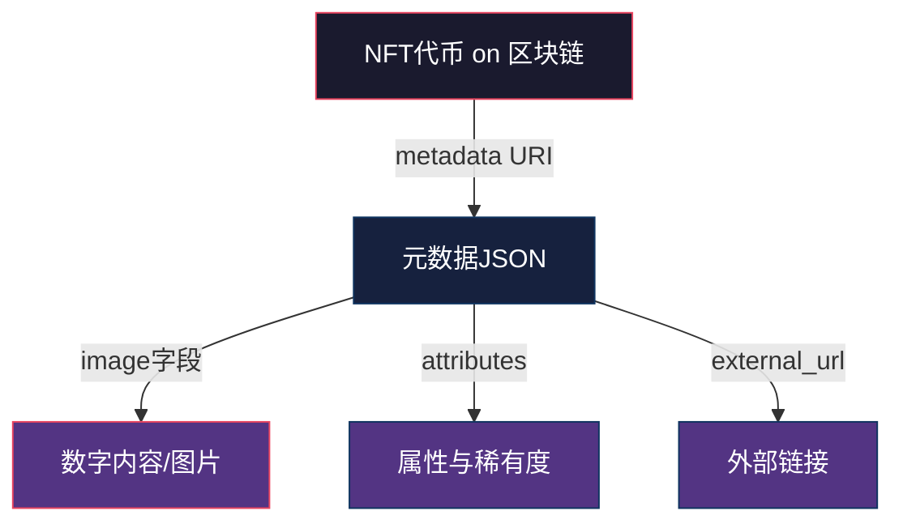
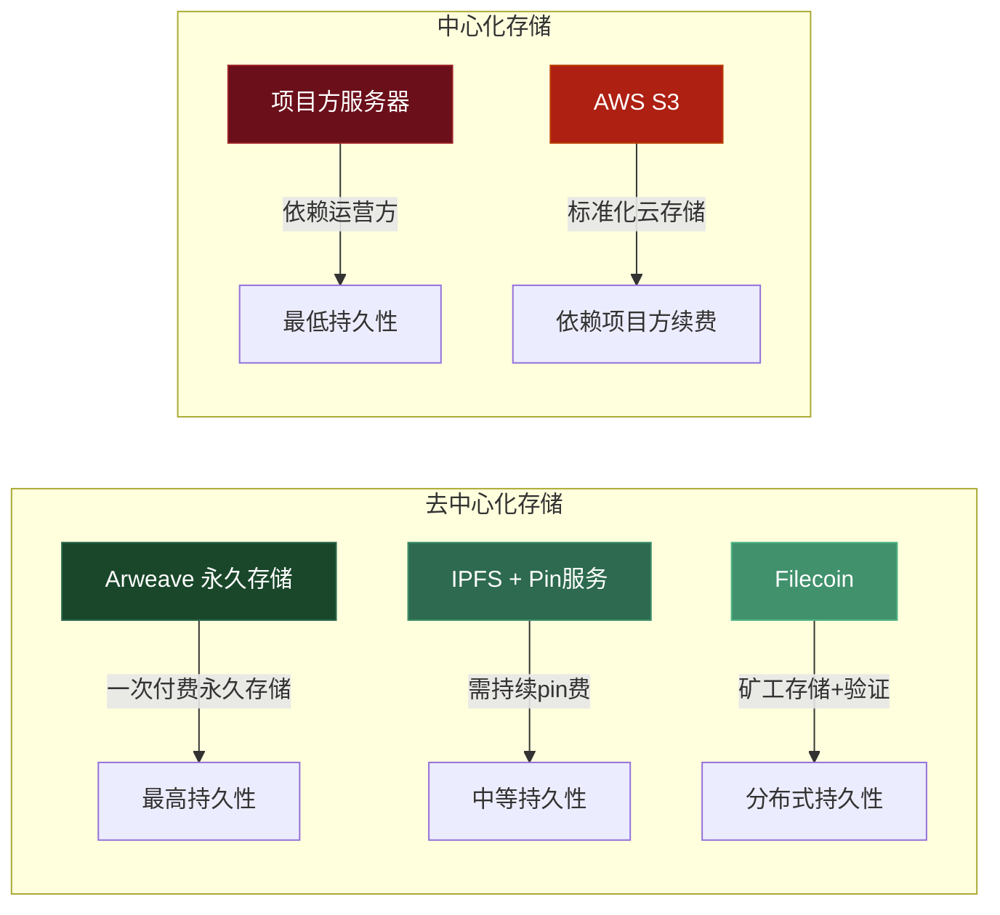
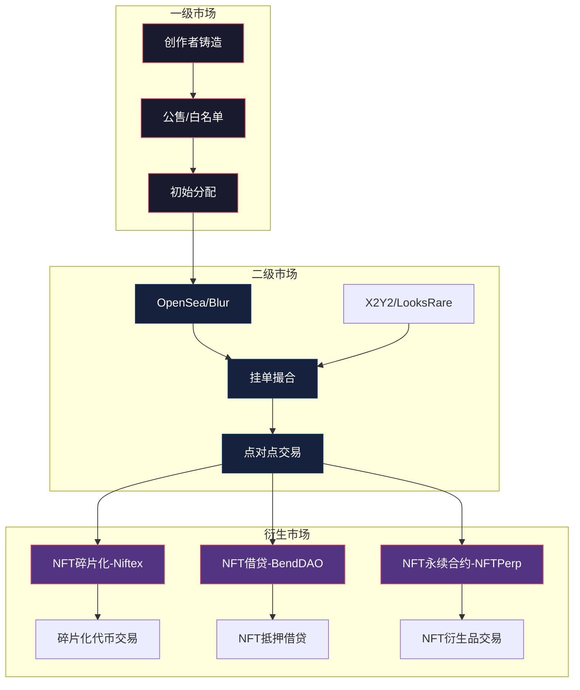
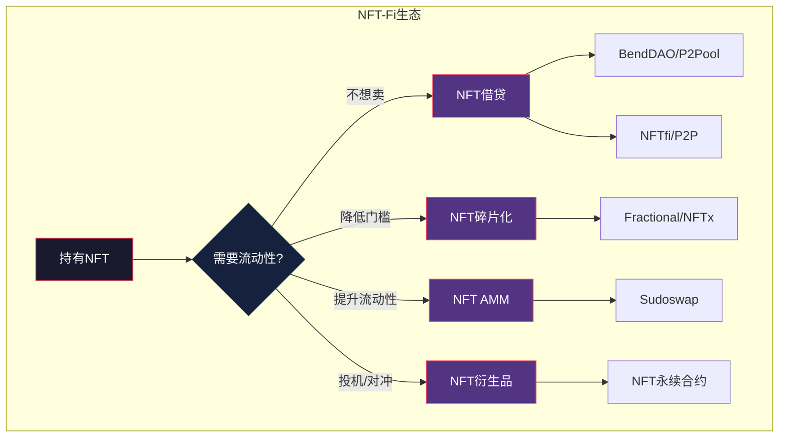

## 六、NFT理论基础

NFT（Non-Fungible Token，非同质化代币）是区块链技术在数字所有权领域的核心应用。如果说比特币和以太坊解决了"数字资产可以被拥有"的问题，那么NFT则解决了"数字资产可以被独一无二地拥有"的问题。理解NFT的底层理论，是在这个高波动市场中做出理性投资决策的前提。

---

### 1. 什么是NFT

#### 1.1 同质化与非同质化的本质区别

理解NFT的第一步是理解"同质化"（Fungibility）这个经济学概念：

- **同质化资产**：1个BTC与另1个BTC完全等价，持有哪个都一样，就像1元人民币纸币之间互换毫无区别。以太坊上的ERC-20代币标准就是同质化代币的标准。
- **非同质化资产**：每一枚NFT都有唯一的标识符（tokenID），彼此不可互换。就像房产证——虽然都是房产证，但每张对应不同的房子，价值、位置、面积完全不同。

| 属性 | 同质化代币（FT） | 非同质化代币（NFT） |
|------|-------------------|---------------------|
| 可互换性 | 1:1等价互换 | 不可互换 |
| 最小单位 | 可分割（如0.001 ETH） | 不可分割（1个NFT就是1个） |
| 标识 | 仅靠合约地址区分 | 合约地址 + 唯一tokenID |
| 典型标准 | ERC-20 | ERC-721, ERC-1155 |
| 类比 | 货币 | 艺术品、房产证、身份证 |

#### 1.2 NFT的核心技术定义

从技术角度，NFT是存储在区块链上的一条**不可篡改的数字所有权记录**，它包含以下关键数据：

```solidity
// ERC-721 标准中最核心的函数接口
interface IERC721 {
    function ownerOf(uint256 tokenId) external view returns (address owner);
    function transferFrom(address from, address to, uint256 tokenId) external;
    function approve(address to, uint256 tokenId) external;
    function balanceOf(address owner) external view returns (uint256);
}
```

- **ownerOf(tokenId)**：查询某个NFT的当前所有者，这是所有权的链上证明
- **transferFrom()**：转移NFT的所有权，交易记录永久写入区块链
- **approve()**：授权某个地址可以操作自己的NFT（用于交易市场）

一枚NFT本质上就是：`（智能合约地址, tokenID）→ 所有者地址` 这个映射关系的链上存储。

#### 1.3 NFT≠数字图片——常见误解澄清

这是新手最普遍的误解：把NFT等同于那张被"天价拍卖"的JPEG图片。实际上：

- **NFT是所有权凭证**，不是图片本身。图片通常存储在IPFS、Arweave或中心化服务器上，NFT仅存储指向该图片的元数据URI
- **NFT可以代表任何资产的所有权**：游戏道具、音乐版权、域名、门票、房产证、会员资格、链上身份等
- **拥有NFT≠拥有版权**：除非创作者在许可证中明确转让，否则购买NFT只获得代币本身，不获得作品的商业使用权



**NFT只是指向内容的指针，不是内容本身。** 理解这一点至关重要——如果存储内容的服务器关闭或IPFS节点离线，你的NFT仍然存在，但它指向的内容可能消失。这就是为什么去中心化存储（Arweave永久存储 vs IPFS需pin服务）是评估NFT项目的重要因素。

---

### 2. NFT的技术架构

#### 2.1 代币标准演进

| 标准 | 发布时间 | 核心特点 | 适用场景 |
|------|----------|----------|----------|
| **ERC-721** | 2018年 | 每个tokenID对应唯一一个NFT | 艺术品、收藏品、域名 |
| **ERC-1155** | 2019年 | 单合约管理多种代币（FT+NFT混合） | 游戏道具（可批量铸造不同类型） |
| **ERC-4907** | 2022年 | 在ERC-721基础上增加"租赁"功能 | 游戏角色租赁、票务临时授权 |
| **ERC-6551** | 2023年 | 让NFT本身拥有钱包地址 | NFT持有其他资产、链上身份 |

ERC-1155的批量铸造能力使得一次交易可以铸造多个不同类型的NFT，Gas费相比ERC-721降低约90%，是游戏项目的首选标准。ERC-6551（Token Bound Accounts）则是一个革命性升级——它让NFT变成一个可以持有资产的"账户"，实现了"用NFT管理NFT"的递归所有权。

#### 2.2 元数据存储方案对比

NFT的元数据（名称、描述、属性、图片链接等）决定了NFT"是什么"，其存储方式直接影响NFT的持久性和可靠性：



**实际现状**：截至2025年，大量早期NFT项目的元数据仍然存储在中心化服务器上。当项目方跑路或服务器过期，这些NFT就变成了"指向404页面的空壳"。购买NFT前，检查元数据URI是否指向IPFS或Arweave是基本功课。可以通过在OpenSea上查看NFT详情页的"Token ID"链接，或直接调用合约的`tokenURI()`函数来验证。

#### 2.3 NFT的生命周期

一个完整的NFT从创建到流通，经历以下阶段：

1. **铸造（Mint）**：创作者调用智能合约的`mint()`函数，在链上创建一枚新的NFT，写入tokenID、元数据URI和初始所有者
2. **上架（List）**：所有者将NFT挂到交易平台（OpenSea、Blur等），设定价格或接受竞价
3. **交易（Trade）**：买家支付加密货币，NFT从卖方转移到买方，交易记录上链
4. **持有/使用（Hold/Use）**：持有者可以展示、用于游戏、质押获取收益、或作为身份凭证
5. **再交易（Re-trade）**：NFT在二级市场继续流转，创作者通过智能合约自动获得版税（Royalty）
6. **销毁（Burn）**：所有者可以销毁NFT，部分项目要求销毁NFT以兑换实体商品或升级版本

#### 2.4 版税机制与争议

NFT版税（Royalty）是创作者从每笔二级市场交易中自动获得的百分比收益，通常设定为2.5%-10%。这是NFT相比传统艺术品市场的结构性创新——传统艺术市场中，艺术家通常只能在首次销售中获利。

**版税的技术实现**：

- **早期方案**：依赖交易平台（如OpenSea）在成交时自动扣除版税并转给创作者——这不是链上强制执行的
- **链上强制方案**：EIP-2981定义了标准的版税查询接口，但交易平台是否遵守取决于平台自身
- **争议核心**：2023年Blur等平台为了吸引交易量，将版税变为可选甚至默认为零，引发创作者社区强烈反对。2024年后，部分链上方案（如Limit Break的ERC-721C）通过合约级强制实现了真正的链上版税

**对投资者的意义**：版税是评估NFT项目创作者持续收入能力的指标。零版税的项目，创作者缺乏二级市场持续收益的激励，可能影响后续运营动力。

---

### 3. NFT市场的经济学分析

#### 3.1 NFT定价的底层逻辑

NFT的价格不像股票有现金流折现模型可以参考，其定价更接近艺术品和收藏品的逻辑：

**价值构成三要素**：

| 要素 | 说明 | 权重（因类型而异） |
|------|------|---------------------|
| **文化价值** | 社区认同、亚文化符号、历史意义 | 艺术类NFT主导因素 |
| **实用价值** | 游戏内使用、门票入场、会员权益 | 工具类NFT主导因素 |
| **投机价值** | 稀缺性、炒作预期、叙事驱动 | 所有NFT都存在 |

**定价模型参考**：

- **稀缺性定价**：同一NFT集合中，不同稀有度的NFT价格差异巨大。例如Bored Ape Yacht Club中，金色毛皮的猿猴比普通棕色的价格高5-10倍
- **网络效应定价**：持有者社区的规模和活跃度直接影响价格。社区越强大，共识越稳固
- **叙事定价**：创始人背景、合作品牌、文化运动等"故事"因素往往是短期暴涨的催化剂

#### 3.2 NFT市场结构



**主要交易平台格局**（2024-2025年）：

| 平台 | 定位 | 手续费 | 版税策略 | 优势 |
|------|------|--------|----------|------|
| **OpenSea** | 综合性最大平台 | 2.5% | 支持创作者设定 | 用户基数最大，上手简单 |
| **Blur** | 专业交易者平台 | 0% | 可选/默认零 | 速度快，聚合流动性，空投激励 |
| **Magic Eden** | 多链聚合（BTC/Solana/ETH） | 2% | 可选 | Solana生态龙头，比特币Ordinals支持 |
| **Tensor** | Solana专业交易 | 0-1.5% | 可选 | Solana上交易速度最快 |

#### 3.3 NFT市场周期特征

NFT市场经历了清晰的牛熊周期，每个周期的特征截然不同：

**2021年夏——狂热期**：CryptoPunks突破100 ETH，BAYC发售，NFT日交易量峰值突破4亿美元。大量投机资金涌入，项目方"画个猴子就能融资"。

**2022年——寒冬期**：NFT总市值从高峰下跌超过90%，大量项目归零。投机者离场，留下的是真正有社区和实用价值的项目。

**2023年——分化期**：蓝筹NFT（BAYC、Azuki、Pudgy Penguins等）相对稳定，中小项目大量淘汰。比特币Ordinals/BRC-20带来新的NFT叙事。

**2024-2025年——成熟期**：NFT与DeFi深度结合（NFT-Fi），传统品牌大规模采用，合规化进程加速。市场从纯投机转向实用价值驱动。

**关键数据参考**：NFT市场的流动性远低于加密货币。一枚BTC可以在几秒内按市价卖出，但一枚蓝筹NFT可能需要数天甚至数周才能以"合理价格"卖出。这种**流动性风险**是NFT投资中最被低估的风险之一。

---

### 4. NFT的分类体系

#### 4.1 按用途分类

| 类别 | 代表项目 | 价值驱动因素 | 流动性 |
|------|----------|--------------|--------|
| **PFP/头像类** | BAYC, CryptoPunks, Pudgy Penguins | 社区归属感、身份象征、文化符号 | 中 |
| **生成艺术** | Art Blocks, Fxhash, Art Blocks Curated | 算法美学、艺术家声誉、收藏价值 | 低 |
| **1/1艺术** | Beeple, XCOPY, Pak | 艺术家名气、稀缺性、艺术史意义 | 极低 |
| **游戏资产** | Axie Infinity, The Sandbox, Gods Unchained | 游戏内实用性、可组合性 | 中高 |
| **音乐NFT** | Royal, Sound.xyz, Catalog | 版税分红权、粉丝关系 | 低 |
| **域名** | ENS(.eth), Unstoppable Domains | 实用性（替代钱包地址） | 高 |
| **会员/通行证** | VeeFriends, PROOF Collective | 社群准入权、空投收益、活动权益 | 中 |
| **实物映射** | Courtyard(实体卡牌), 4K Protocol | 底层实物价值 | 低 |
| **RWA代币** | Centrifuge, Maple Finance | 链下资产所有权（债券、发票等） | 中 |

#### 4.2 按技术路线分类

- **完全链上型**：元数据和艺术品本身都存储在链上。优点是完全去中心化、永不可变；缺点是铸造成本极高，只适合小尺寸艺术品。代表：Autoglyphs、Larva Labs的OnChainMonkey
- **链上引用型**：NFT存储在链上，但元数据指向IPFS/Arweave等去中心化存储。这是目前最主流的方案，平衡了成本和持久性
- **链下依赖型**：元数据存储在中心化服务器上。最常见于早期项目和游戏类NFT，风险最高——服务器关闭则NFT内容消失
- **动态NFT（dNFT）**：元数据可根据外部条件（预言机数据、时间、持有者行为）自动变化。代表：Async Art（可编程音乐）、Chainlink VRF驱动的进化NFT

---

### 5. NFT投资的风险框架

#### 5.1 风险矩阵

| 风险类型 | 风险描述 | 严重程度 | 应对策略 |
|----------|----------|----------|----------|
| **流动性风险** | 卖不出去，或需要大幅折价才能成交 | ★★★★★ | 只投资能承受"归零"的资金；优先选择蓝筹 |
| **智能合约风险** | 合约漏洞导致NFT被盗或功能失效 | ★★★★ | 选择经过审计的项目；使用硬件钱包 |
| **项目方跑路** | 创始团队放弃项目、卷走资金 | ★★★★★ | 评估团队背景、资金使用透明度 |
| **元数据失效** | 存储NFT内容的服务器/IPFS节点离线 | ★★★ | 检查元数据存储方式，优先Arweave |
| **版权争议** | 项目抄袭或未获授权 | ★★★ | 调查原创性，避免来路不明的项目 |
| **市场操纵** | 项目方自买自卖制造虚假交易量 | ★★★★ | 用NFTGo/Nansen等工具分析真实交易 |
| **监管风险** | 各国对NFT的定性不同（证券/商品/收藏品） | ★★★ | 关注SEC、各国央行的最新表态 |
| **存储私钥风险** | 钱包助记词丢失或被盗 | ★★★★★ | 冷钱包存储、多签方案 |

#### 5.2 识别"割韭菜"项目的10个信号

1. **匿名团队+高额铸造价格**（铸造费超过0.1 ETH且团队匿名，风险极高）
2. **路线图只有"未来计划"没有已交付成果**——承诺P2E游戏、元宇宙、线下活动但无任何实质进展
3. **巨鲸集中持仓**——前10个地址持有超过30%的供应量
4. **交易量突然暴涨但地板价不涨**——通常是项目方的刷量行为
5. **频繁更换承诺**——路线图反复修改，核心功能一拖再拖
6. **Discord/Twitter粉丝多但互动率极低**——购买僵尸粉制造热度
7. **大量"免费空投"但要求连接钱包签名**——钓鱼签名可直接转走你的所有资产
8. **过度依赖名人背书**——名人站台≠项目质量，很多是付费推广
9. **没有开源合约代码**——透明度为零意味着风险最高
10. **铸造机制设计鼓励FOMO**——限时限量、倒计时、阶梯涨价都是操控情绪的手段

#### 5.3 链上分析方法

判断NFT项目质量的关键链上指标：

```python
# 使用Python查询NFT链上数据的示例框架（以OpenSea/Alchemy API为例）

# 1. 持有者分布分析
def analyze_holder_distribution(collection_address):
    """分析持有者集中度——健康项目应有较分散的持有者"""
    # 查询每个地址的持有数量
    # 计算基尼系数：越接近0越分散，越接近1越集中
    # 健康项目基尼系数应在0.3-0.6之间
    pass

# 2. 真实交易量分析
def filter_wash_trades(transactions):
    """过滤刷量交易"""
    # 标记以下可疑交易模式：
    # - 同一地址自买自卖
    # - 两个地址之间反复交易
    # - 成交价远偏离地板价（过高或过低）
    # - 短时间内频繁转手
    pass

# 3. 蓝筹指数计算
def blue_chip_score(collection):
    """综合评估NFT项目蓝筹程度"""
    scores = {
        'holder_count': weighted_score(collection.total_holders, 0.15),
        'unique_buyers_30d': weighted_score(collection.unique_buyers, 0.15),
        'avg_holding_duration': weighted_score(collection.avg_hold_days, 0.20),
        'floor_price_stability': weighted_score(collection.floor_volatility, 0.15),
        'community_activity': weighted_score(collection.discord_twitter, 0.15),
        'smart_money_holding': weighted_score(collection.smart_money_pct, 0.20),
    }
    return sum(scores.values())
```

**实用工具推荐**：

| 工具 | 功能 | 免费程度 |
|------|------|----------|
| **NFTGo** | 蓝筹指数、巨鲸追踪、实时交易 | 基础免费 |
| **Nansen** | Smart Money追踪、钱包标签分析 | 付费为主 |
| **DeGenData** | 自定义链上数据分析 | 部分免费 |
| **Etherscan** | 合约验证、交易记录查询 | 免费 |
| **Dune Analytics** | 自定义SQL查询链上数据 | 免费 |

---

### 6. NFT与DeFi的融合（NFT-Fi）

NFT与DeFi的结合是2023年以来最重要的趋势之一，它解决了NFT"流动性差"的核心痛点：

#### 6.1 NFT借贷

**模式一：点对池（Peer-to-Pool）**

借款人将NFT作为抵押品放入池中，贷方（流动性提供者）向池中注入资金。借款人按约定利率借出资金。

- **代表协议**：BendDAO, JPEG'd, ParaSpace
- **清算机制**：当NFT地板价下跌到抵押率的阈值（如借贷价值比超过80%），NFT会被清算拍卖
- **风险**：2022年BendDAO曾因BAYC地板价暴跌触发大量清算，导致流动性危机，地板价进一步螺旋下跌

**模式二：点对点（Peer-to-Peer）**

贷方和借方直接协商条款。每个NFT单独评估，不依赖地板价。

- **代表协议**：NFTfi, Arcade
- **优点**：避免地板价清算风险，支持非蓝筹NFT
- **缺点**：成交效率低，需要等待匹配

#### 6.2 NFT碎片化

将一枚高价值NFT拆分为多个ERC-20代币，降低投资门槛：

- **代表协议**：Fractional.art（现Tessera，已关闭）, NFTx
- **运作方式**：存入一个CryptoPunk → 获得1,000,000个PUNK碎片代币 → 任何人都可以买卖碎片代币
- **问题**：碎片化NFT的赎回需要100%碎片投票同意，协调难度极高

#### 6.3 NFT永续合约与衍生品

- **NFTPerp**（已关闭）：允许交易者做多/做空NFT地板价，杠杆高达5倍
- **Reservoir**：NFT交易聚合器，聚合多个市场的流动性
- **Sudoswap**：NFT AMM（自动做市商），用户创建NFT/ETH交易对，类似Uniswap的模式，显著提升NFT流动性



---

### 7. NFT的法律与监管现状

#### 7.1 全球监管态势

NFT的法律定性在全球范围内尚无统一标准，这是投资者必须关注的重大不确定性：

| 地区 | 监管态度 | 关键动向 |
|------|----------|----------|
| **美国** | 逐步收紧 | SEC对部分NFT项目发起证券法调查（如Stoner Cats案）；多数NFT暂未被归类为证券，但碎片化NFT可能触发证券法 |
| **欧盟** | MiCA框架下讨论 | MiCA法规明确排除"独特且不可互换"的加密资产，但NFT系列中的可互换NFT可能被纳入监管 |
| **中国** | 严格限制 | 2022年后全面禁止NFT二级市场交易（"数字藏品"仅允许一级发售）；严禁NFT金融化 |
| **日本** | 审慎开放 | 2023年起允许NFT在游戏中的使用；Web3政策组建议将NFT纳入现有法律框架 |
| **新加坡** | 相对开放 | MAS将纯收藏类NFT排除在监管范围外，但证券化NFT需持牌 |

#### 7.2 投资者需注意的法律风险

- **版权风险**：购买NFT≠获得版权。除非创作者明确转让版权，否则你只是获得了一个代币。许多项目方在条款中保留所有知识产权
- **证券法风险**：如果NFT带有"预期收益"属性（如分红、利息），可能被认定为证券，面临监管打击
- **税务风险**：多数国家将NFT交易视为应税事件。铸造、出售、交换NFT都可能触发资本利得税
- **洗钱风险**：NFT交易的匿名性和"定价自由"使其容易被用于洗钱，导致银行账户可能被风控冻结

---

### 8. NFT的技术演进方向

#### 8.1 动态NFT（Dynamic NFT）

NFT的元数据可以基于外部条件自动更新：

- **游戏进化**：角色NFT根据链上战斗数据升级属性
- **时间驱动**：艺术品NFT随时间季节变化
- **数据驱动**：体育NFT根据真实比赛数据更新统计数据

实现方式：通过Chainlink等预言机将链下数据写入NFT元数据，或通过链上事件触发元数据变更。

#### 8.2 Soulbound Token（SBT）

由以太坊创始人Vitalik Buterin在2022年论文中提出的概念——不可转让的NFT，用于表示链上身份和信誉：

- 学历证书、职业资质
- 参与证明（出席活动、完成课程）
- 信用评分和借贷历史
- 治理投票权（不可买卖）

SBT的不可转让特性从根本上消除了投机属性，使NFT回归"数字凭证"的本质。

#### 8.3 跨链NFT

随着多链生态的发展，NFT需要在不同区块链之间无缝流转：

- **LayerZero的ONFT标准**：通过消息传递实现跨链NFT转移，无需桥接
- **Wormhole的NFT桥**：在Solana和EVM链之间转移NFT
- **跨链统一市场**：Magic Eden已支持Solana、以太坊、比特币、Polygon的NFT统一交易

---

### 9. 实操指南：如何评估一个NFT项目

在投资任何NFT项目之前，按以下清单逐项评估：

#### 9.1 团队评估

- [ ] 创始人是否有可验证的身份（实名 > 匿名但有链上历史 > 完全匿名）
- [ ] 团队是否有相关领域的成功经验
- [ ] 开发者是否有智能合约开发能力（GitHub活跃度）
- [ ] 是否有知名投资机构背书

#### 9.2 社区评估

- [ ] Discord活跃成员数量和质量（不是机器人）
- [ ] Twitter粉丝增长是否自然（警惕突然暴涨）
- [ ] 社区讨论内容是否围绕项目本身（不是纯喊单）
- [ ] 创始团队是否定期与社区互动

#### 9.3 技术评估

- [ ] 合约代码是否开源并在Etherscan上验证
- [ ] 是否经过第三方审计（CertiK、Trail of Bits等）
- [ ] 元数据存储方式（Arweave > IPFS > 中心化服务器）
- [ ] 是否有防女巫攻击机制（铸造阶段的公平性）

#### 9.4 经济模型评估

- [ ] 总供应量是否合理（1000-10000为常见区间）
- [ ] 版税比例是否合理（5%-7.5%为行业中位数）
- [ ] 团队预留比例是否过高（超过20%需警惕）
- [ ] 是否有可持续的收入来源（非纯靠铸造收入）
- [ ] 空投/奖励机制是否可持续

#### 9.5 财务评估

- [ ] 当前地板价是否处于合理区间
- [ ] 持有者数量是否持续增长
- [ ] 真实交易量（过滤刷量后）是否健康
- [ ] Smart Money（聪明钱）是否在买入或卖出
- [ ] 相比同类别项目是否被高估或低估

---

### 10. 常见误区与纠正

| 误区 | 现实 | 纠正方法 |
|------|------|----------|
| "NFT就是图片，毫无价值" | NFT是所有权协议，可代表任何资产 | 理解NFT的技术本质，关注其实际用途 |
| "越贵的NFT越有投资价值" | 价格高可能是操纵结果，不代表真实价值 | 用链上数据分析真实需求 |
| "买了NFT就拥有版权" | 绝大多数NFT不包含版权转让 | 仔细阅读项目的许可证条款 |
| "蓝筹NFT永远涨" | BAYC从150 ETH跌到15 ETH以下 | 分散投资，不All-in任何单一NFT |
| "NFT市场已经死了" | NFT在不断进化，应用场景持续扩展 | 关注NFT-Fi、RWA等新趋势 |
| "铸造成本低=项目免费" | 铸造成本低但Gas费可能很高；持有成本（社区维护、后续活动）也是隐性成本 | 计算总持有成本（TCO） |
| "地板价就是我的NFT的价值" | 地板价是最低价，稀有度高的NFT可能远高于地板价 | 用稀有度工具（如Rarity Sniper）评估个体NFT |
| "免费空投的NFT没有价值" | 空投可以带来意外收益（如BAYC空投的ApeCoin） | 但也要警惕钓鱼空投，永远不要签署可疑交易签名 |

---

### 11. 本章小结

NFT理论基础的核心要点：

1. **本质认知**：NFT是非同质化的链上所有权凭证，不是图片本身，可以代表任何资产的所有权
2. **技术理解**：ERC-721/1155标准定义了NFT的行为规范，元数据存储方式决定了NFT的持久性
3. **市场规律**：NFT定价由文化价值、实用价值和投机价值共同驱动，市场具有强周期性和低流动性特征
4. **风险意识**：流动性风险、合约风险、项目跑路风险是三大核心风险，需要系统性的尽职调查
5. **趋势判断**：NFT-Fi、动态NFT、SBT、跨链NFT是未来的进化方向，实用性将取代投机性成为价值支撑

NFT市场是一个高风险、高回报、信息不对称严重的市场。进入这个市场之前，确保你投入的是"亏了不心疼"的资金，并且已经完成了系统性的学习和研究。记住：**在NFT市场中，你赚到的每一分钱都来自另一个人——保护好自己的私钥，比抓住下一个百倍项目更重要。**
