## 七、Layer2与扩容技术

### 1. 为什么需要扩容：区块链的性能瓶颈

#### 1.1 区块链三难困境

区块链系统设计始终面临一个根本性的权衡——**区块链三难困境（Blockchain Trilemma）**，由以太坊创始人Vitalik Buterin明确提出：去中心化、安全性、可扩展性三者不可兼得，任何系统最多只能同时满足其中两个。

| 维度 | 含义 | 典型代表 |
|------|------|----------|
| 去中心化 | 节点数量多，无单点控制 | 比特币、以太坊主网 |
| 安全性 | 抵抗攻击和篡改的能力 | 以太坊主网（数十万验证者） |
| 可扩展性 | 高TPS、低延迟、低费用 | Solana、BSC（牺牲去中心化） |

比特币主网每秒处理约7笔交易（TPS），以太坊主网约15-30 TPS。相比之下，Visa网络处理能力约65,000 TPS。这个数量级差距意味着：**如果要在不牺牲去中心化和安全性的前提下实现大规模应用，必须找到新的扩容方案**。

#### 1.2 扩容的两大路径

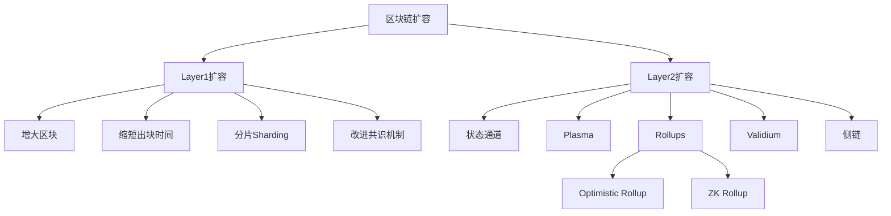

**Layer1扩容（链上扩容）**：直接修改底层区块链的协议参数或架构，提升基础层的处理能力。典型方案包括增大区块大小（如BCH将区块从1MB扩大到32MB）、缩短出块时间、分片技术（将网络拆分为多个并行处理的子网络）、以及改进共识机制（从PoW转向PoS）。

**Layer2扩容（链下扩容）**：在不改变底层区块链协议的前提下，将大量交易和计算转移到链下进行，仅将最终结果或证明提交到主链上。这种方式保留了主链的安全性和去中心化特性，同时大幅提升了吞吐量。

#### 1.3 为什么Layer2是主流方向

Layer1扩容存在天然限制：增大区块会提高节点运行门槛，削弱去中心化；分片技术（如以太坊的Danksharding路线图）虽然理论上有效，但实现周期长、复杂度高。Layer2方案则具有以下优势：

- **不修改底层协议**：无需硬分叉，兼容性好
- **继承主链安全性**：资产最终由主链保障
- **灵活迭代**：可以快速部署新的Layer2方案
- **费用降低10-100倍**：交易成本大幅下降

截至2025年，以太坊生态已经明确将"以Rollup为中心"作为核心扩容路线图。主链逐步演化为数据可用性层和结算层，而大部分用户活动在Layer2上进行。

---

### 2. 状态通道：最早的Layer2方案

#### 2.1 工作原理

状态通道（State Channel）是最早被提出的Layer2扩容方案。其核心思想是：两个或多个参与方在链下建立一个"通道"，在通道内进行任意次数的交易，仅在通道开启和关闭时与主链交互。

具体流程如下：

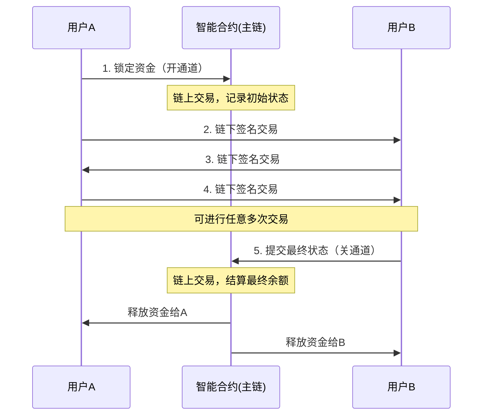

通道内的每笔交易都由双方签名确认，但不需要广播到主链。只有当一方想要关闭通道时，才将最终状态提交到主链进行结算。如果一方对提交的状态有异议，可以在挑战期内提交更新的状态进行反驳。

#### 2.2 闪电网络（Lightning Network）

闪电网络是比特币上最成熟的状态通道实现，也是目前最大的Layer2网络之一。

**核心机制**：
- **双向支付通道**：双方各自锁定一定数量的BTC到一个2-of-2多重签名地址
- **哈希时间锁合约（HTLC）**：确保跨通道支付的原子性——要么全部成功，要么全部失败
- **路由网络**：即使没有直接通道，也可以通过中间节点路由支付

**实际数据**（2025年初）：
- 网络容量：约5,000 BTC（约20亿美元）
- 通道数量：超过70,000个
- 节点数量：超过15,000个
- 平均手续费：不到0.01美元

**操作实例——在闪电网络上收付款**：

```bash
# 使用LND（Lightning Network Daemon）的命令行示例

# 1. 创建钱包
lncli create

# 2. 连接到一个节点并打开通道
lncli openchannel --node_key=<对方公钥> --local_amt=1000000

# 3. 等待通道确认后，进行链下支付
lncli sendpayment --dest=<收款方公钥> --amt=10000 --payment_hash=<hash>

# 4. 查看通道状态
lncli listchannels

# 5. 关闭通道（链上结算）
lncli closechannel --funding_txid=<通道交易ID> --output_index=0
```

**闪电网络的局限**：
- **流动性要求**：通道需要预先锁定资金，资金利用率低
- **在线要求**：接收方必须在线才能收款
- **路由挑战**：大额支付难以找到足够流动性的路由路径
- **适用场景有限**：更适合小额、频繁的支付，不适合复杂的智能合约交互

#### 2.3 状态通道的适用场景与局限

| 适用场景 | 不适用场景 |
|----------|-----------|
| 小额高频支付 | 复杂的DeFi交互 |
| 双方或多方博弈（如棋类游戏） | 需要全局状态的DApp |
| 预测市场下注 | 需要无许可参与的开放系统 |
| 微支付流（按时付费） | 大额单笔交易 |

---

### 3. Plasma：子链方案

#### 3.1 Plasma的架构设计

Plasma是由Vitalik Buterin和Joseph Poon在2017年提出的Layer2框架。其核心思想是在主链上创建多个"子链"（child chain），每个子链可以有自己的共识规则和区块结构，定期将状态根提交到主链。

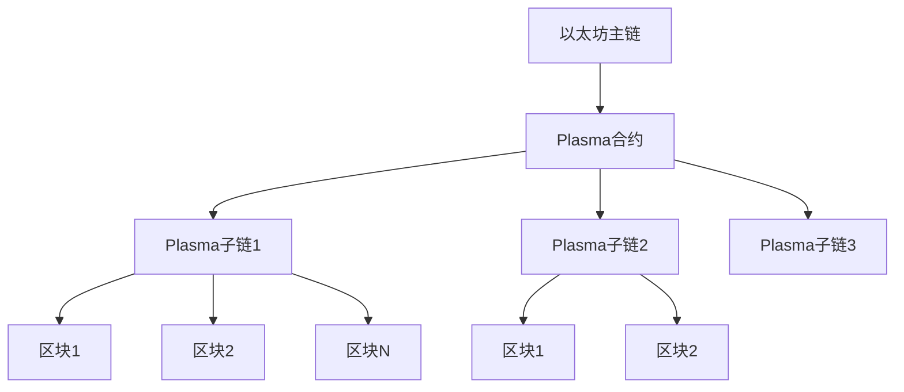

**Plasma的工作流程**：
1. 用户将资产存入主链上的Plasma合约
2. 存入的资产被映射到对应的Plasma子链
3. 子链运营者（Operator）批量处理交易，定期将Merkle根提交到主链
4. 用户可以随时将资产从子链提取回主链
5. 如果运营者作恶，用户可以在挑战期内通过欺诈证明保护自己的资产

#### 3.2 Plasma的安全模型

Plasma的安全性依赖于**欺诈证明（Fraud Proof）**机制：

- 运营者定期向主链提交状态根（Merkle root）
- 任何人都可以验证子链的交易是否正确
- 如果发现运营者提交了错误的状态，验证者可以提交欺诈证明
- 一旦欺诈证明被确认，作恶的运营者将被惩罚，错误的状态被回滚

#### 3.3 Plasma的局限与衰落

尽管Plasma在理论上很有吸引力，但实际应用中面临严重问题：

**数据可用性问题**：Plasma子链的交易数据不在主链上，只提交状态根。如果运营者扣留数据，用户可能无法证明自己的资产状态，从而无法安全退出。

**大规模退出问题**：如果子链出现问题，所有用户同时尝试退出主链，会造成主链严重拥堵。假设子链上有100万用户，以太坊区块只能容纳几百笔交易，全部退出可能需要数周甚至数月。

**状态膨胀**：Plasma的退出机制需要维护大量的Merkle证明，随着交易历史增长，验证成本越来越高。

**不支持智能合约**：标准Plasma设计只支持简单的支付和转账，无法运行复杂的智能合约逻辑。

正因为这些问题，Plasma方案逐渐被Rollups取代。不过Plasma的一些设计思想（如子链、欺诈证明）被后续方案继承和发展。OMG Network（原OmiseGo）是曾经最知名的Plasma项目，但在2024年已停止运营。

---

### 4. Rollups：当前的主流Layer2方案

Rollups是目前公认的最有前途的Layer2扩容方案，也是以太坊官方路线图的核心。其核心思想是：**将交易执行转移到链下，但将交易数据（或压缩后的数据）发布到主链上**。这样既获得了链下执行的效率，又保证了数据可用性。

#### 4.1 Rollup的基本架构

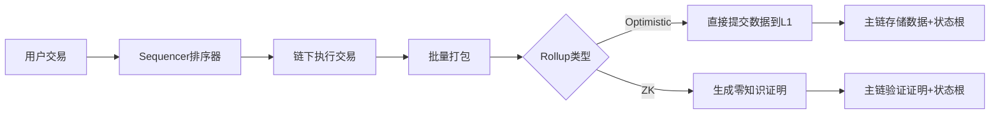

**核心组件**：
- **Sequencer（排序器）**：接收用户的交易请求，排序并打包成批次
- **执行环境**：在链下执行交易，计算新的状态
- **数据发布**：将交易数据（或压缩版本）提交到主链
- **状态验证**：通过欺诈证明或有效性证明确保状态转换的正确性

#### 4.2 Optimistic Rollup

**核心理念**：默认假设所有交易都是正确的（"乐观的"），只在有人质疑时才进行验证。

**工作流程**：
1. Sequencer收集交易，在链下执行
2. 将交易数据和新的状态根提交到主链
3. 设置一个**挑战期**（通常7天）
4. 在挑战期内，任何人可以提交欺诈证明
5. 如果没有挑战，状态根在挑战期后被确认
6. 如果有挑战，通过争议解决协议判定哪一方正确

**欺诈证明机制详解**：

欺诈证明是Optimistic Rollup安全性的核心。当验证者发现Sequencer提交了错误的状态根时：

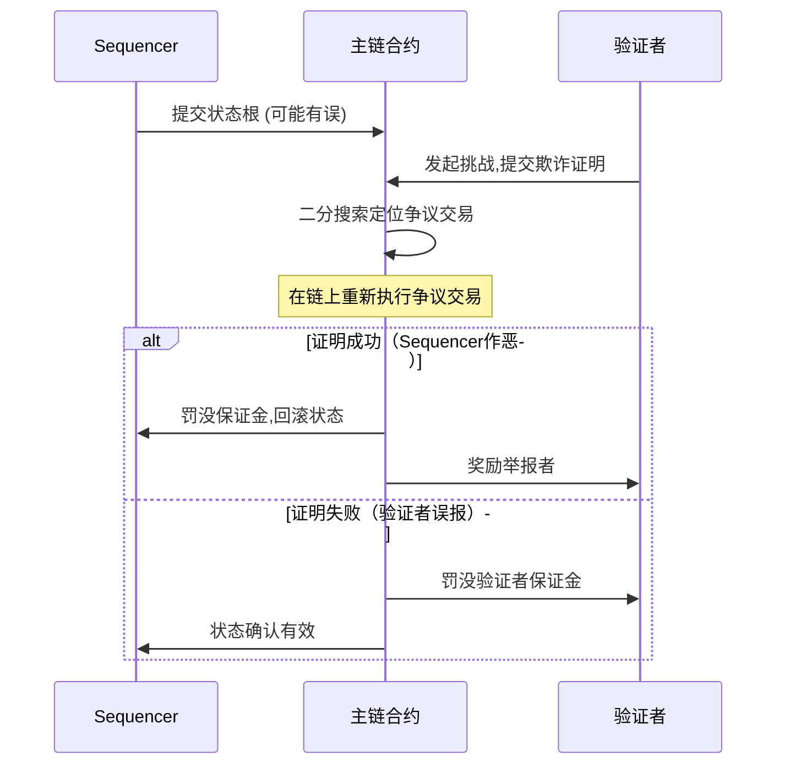

**Optimistic Rollup的代表项目**：

| 项目 | 发起方 | 特点 | TVL（2025年） |
|------|--------|------|---------------|
| Arbitrum One | Offchain Labs | 最大的Optimistic Rollup, Nitro架构 | ~150亿美元 |
| Optimism (OP Mainnet) | OP Labs | OP Stack开源框架,超级链生态 | ~80亿美元 |
| Base | Coinbase | 基于OP Stack,与Coinbase深度整合 | ~120亿美元 |
| Blast | Blur团队 | 内置收益机制,争议较多 | ~20亿美元 |

**Optimistic Rollup的优势与劣势**：

优势：
- EVM兼容性好——现有以太坊DApp可以几乎无缝迁移
- 技术成熟度高，已运行多年
- 不需要复杂的密码学证明
- 开发者体验友好

劣势：
- **7天挑战期**：资金从L2提取回L2需要等待7天（通过跨链桥可以缩短，但增加了信任假设）
- 安全性依赖至少有1个诚实验证者在线
- 交易数据需要上链，成本随数据量增加

#### 4.3 ZK Rollup

**核心理念**：每批次交易都附带一个**零知识证明**，主链可以直接验证证明的正确性，无需等待挑战期。

**工作流程**：
1. Sequencer收集交易，在链下执行
2. 生成零知识证明（ZK-SNARK或ZK-STARK）
3. 将交易数据和证明一起提交到主链
4. 主链上的验证合约验证证明
5. 如果证明有效，状态根被立即确认

**零知识证明简述**：

零知识证明是一种密码学协议，允许证明者向验证者证明某个陈述是正确的，而无需透露任何关于该陈述的具体信息。在Rollup场景中：

- **证明者**：Sequencer/Prover生成证明，证明"我正确执行了这批交易，得到了这个新的状态根"
- **验证者**：主链上的合约验证这个证明
- **零知识性**：验证过程不需要重新执行所有交易，只需验证证明即可

**ZK-SNARK vs ZK-STARK**：

| 特性 | ZK-SNARK | ZK-STARK |
|------|----------|----------|
| 全称 | 简洁非交互式零知识论证 | 可扩展透明零知识论证 |
| 证明大小 | 小（约200字节） | 较大（几十KB） |
| 验证时间 | 极快（毫秒级） | 快 |
| 需要可信设置 | 是 | 否 |
| 抗量子计算 | 否 | 是 |
| 代表项目 | zkSync, Scroll | StarkNet |

**ZK Rollup的代表项目**：

| 项目 | 证明系统 | 特点 | TVL（2025年） |
|------|---------|------|---------------|
| zkSync Era | SNARK (PLONK) | 通用EVM兼容ZK Rollup | ~100亿美元 |
| StarkNet | STARK | 原生智能合约语言Cairo | ~15亿美元 |
| Scroll | SNARK | 高度EVM等效 | ~20亿美元 |
| Linea | SNARK | ConsenSys开发,与MetaMask集成 | ~25亿美元 |
| Polygon zkEVM | SNARK | Polygon生态ZK方案 | ~10亿美元 |

**ZK Rollup的优势与劣势**：

优势：
- **即时确认**：不需要7天挑战期，证明被验证即可确认
- **更强的安全性**：密码学保证，不依赖诚实验证者假设
- **更好的隐私性**：零知识特性天然支持隐私交易
- **数据压缩效率更高**：ZK证明可以更高效地压缩交易数据

劣势：
- **计算成本高**：生成ZK证明需要大量计算资源
- **技术复杂度高**：开发难度大于Optimistic Rollup
- **EVM兼容性挑战**：ZK-EVM实现复杂，仍在迭代中
- **早期阶段**：部分项目还在测试网或早期主网阶段

#### 4.4 Optimistic vs ZK Rollup深度对比

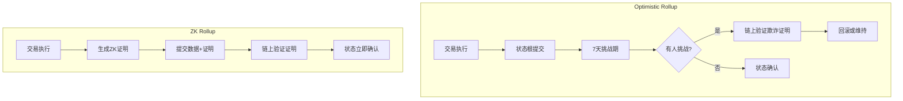

| 维度 | Optimistic Rollup | ZK Rollup |
|------|------------------|-----------|
| 安全模型 | 欺诈证明 + 至少1个诚实验证者 | 有效性证明 + 密码学保证 |
| 取款时间 | 7天（挑战期） | 分钟级（证明生成时间） |
| 计算开销 | 低（不需要生成证明） | 高（证明生成是主要瓶颈） |
| EVM兼容性 | 高（接近原生） | 中（ZK-EVM仍在改进） |
| 成熟度 | 高（2021年起运行） | 中（2023年起逐步上线） |
| 交易费用 | 较低 | 进一步降低（证明后数据更少） |
| 适合场景 | 通用DeFi、NFT、游戏 | 高频交易、支付、隐私应用 |

**投资者视角**：对于普通用户，两者的主要区别在于取款速度。如果不需要频繁将资金从L2转回L1，Optimistic Rollup已经完全够用。如果需要快速跨链转移，ZK Rollup更有优势。目前Arbitrum和Base的生态最为成熟，是入门首选。

---

### 5. Validium与Volition：数据可用性的变体

#### 5.1 Validium

Validium与ZK Rollup类似，都使用零知识证明来验证状态转换。但关键区别在于：**Validium不将交易数据发布到主链上，而是存储在链下**。

这意味着Validium的交易费用更低（不需要为链上数据存储付费），但安全性模型有所不同——用户需要信任数据可用性委员会（DAC）不会扣留数据。

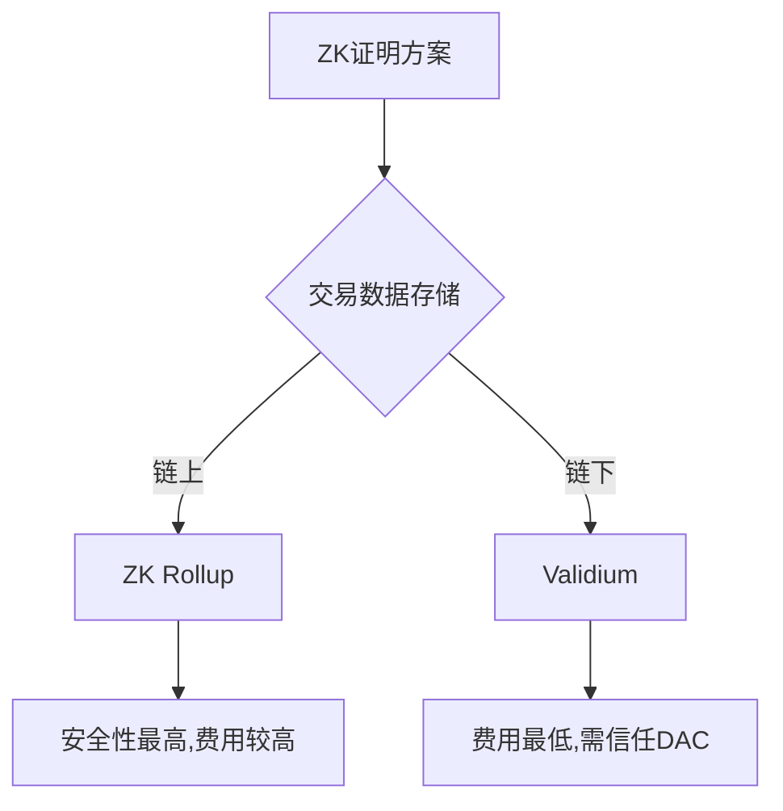

代表项目：
- **StarkEx**：StarkWare的交易引擎，被dYdX（迁移前）、Immutable X等使用
- **zkPorter**：zkSync的混合方案

#### 5.2 Volition

Volition是一种混合方案，允许用户自行选择每笔交易的数据存储位置：
- **链上模式**：数据发布到主链，安全性最高（等同于Rollup）
- **链下模式**：数据存储在链下，费用最低（等同于Validium）

这种灵活性让用户可以根据交易金额和安全需求做出选择：大额交易选择链上模式确保安全，小额高频交易选择链下模式节省费用。

---

### 6. 侧链：独立运行的平行链

#### 6.1 侧链的定义与特征

侧链（Sidechain）是独立于主链运行的区块链，通过双向桥与主链连接。侧链有自己的共识机制、区块参数和验证者集合。

**与Rollup的关键区别**：侧链不依赖主链的安全性，而是由自己的验证者集合保障安全。这意味着侧链的安全性可能低于主链。

#### 6.2 主要侧链项目

| 项目 | 共识机制 | TPS | 特点 |
|------|---------|-----|------|
| Polygon PoS | PoS + Plasma检查点 | ~7,000 | 最大的侧链生态,正在向ZK过渡 |
| Gnosis Chain | PoS (原xDai) | ~100 | 以太坊侧链,费用极低 |
| Ronin | DPoS | ~100 | Axie Infinity专用侧链 |
| Skale | PoS | ~2,000 | 多链网络,弹性侧链 |

#### 6.3 Polygon的演进路径

Polygon是Layer2生态中最值得关注的项目之一，因为它代表了从侧链向ZK Rollup演进的完整路径：

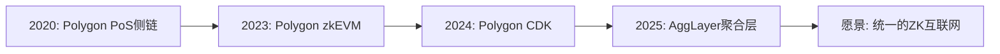

- **Polygon PoS**：最初的侧链方案，拥有最大的L2用户基数
- **Polygon zkEVM**：基于ZK技术的以太坊等效Rollup
- **Polygon CDK**：允许任何人创建自己的ZK L2链
- **AggLayer**：聚合层，将多个L2链的状态统一起来

---

### 7. 数据可用性层：新兴的关键基础设施

#### 7.1 什么是数据可用性

数据可用性（Data Availability, DA）是指确保交易数据对所有人可访问、可验证的能力。这是Rollup安全性的基础——如果交易数据不可用，用户就无法验证状态的正确性，也无法自行退出。

传统上，Rollup将交易数据发布到以太坊主链上。但随着Rollup数量增加，以太坊的DA成本成为主要瓶颈。

#### 7.2 以太坊的Danksharding

以太坊通过EIP-4844（Proto-Danksharding）引入了**Blob交易**，为Rollup提供专用的数据存储空间：

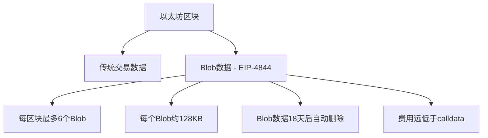

EIP-4844在2024年3月上线后，Rollup的交易费用降低了约10倍。未来完整的Danksharding实现后，每个区块将支持64个Blob，DA容量再提升约10倍。

#### 7.3 专用DA层

除了以太坊自身的DA方案，还出现了专门的数据可用性层：

| 项目 | 特点 | 代表使用方 |
|------|------|-----------|
| Celestia | 模块化区块链,专注DA | Manta, Eclipse |
| EigenDA | 基于EigenLayer的再质押DA | 多个OP Stack链 |
| Avail | 原Polygon团队开发的DA层 | 多个AppChain |
| Near DA | NEAR协议提供的DA服务 | 多个L2/L3 |

**模块化区块链**的概念正在成为趋势：将区块链的功能（执行、共识、数据可用性、结算）拆分到不同的层，每个层专注做好一件事。以太坊主链逐步定位为"结算层+DA层"，而执行层的功能由各种L2/L3承担。

---

### 8. Layer3与应用链：进一步的垂直扩展

#### 8.1 Layer3的概念

Layer3是在Layer2之上构建的又一层网络。如果说Layer2是通用的执行环境，那么Layer3则是为特定应用或场景定制的链。

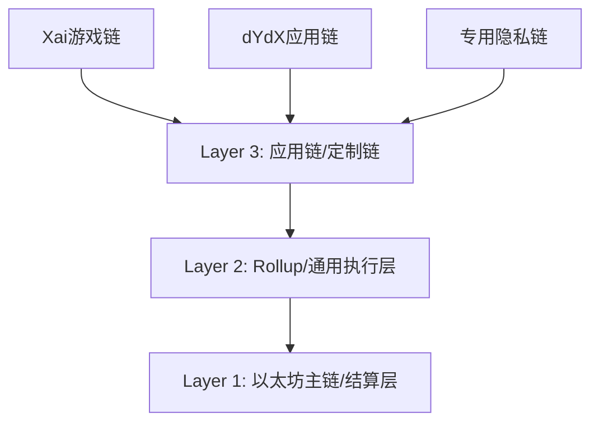

Layer3的优势：
- **极致定制**：可以为特定应用优化共识、虚拟机、手续费模型
- **费用更低**：数据发布到L2而非L1，成本进一步降低
- **主权控制**：应用团队完全控制链的参数和升级

#### 8.2 超级链（Superchain）生态

Optimism的OP Stack框架催生了"超级链"概念——多条共享相同技术栈的L2/L3链组成一个统一的网络：

| 超级链成员 | 运营方 | 专注领域 |
|-----------|--------|---------|
| OP Mainnet | OP Labs | 通用 |
| Base | Coinbase | 通用,与Coinbase集成 |
| Zora | Zora | NFT和创作者经济 |
| Mode | Mode | DeFi |
| Frax | Frax | 稳定币和DeFi |
| World | Worldcoin | 身份验证 |

超级链中的链共享桥接基础设施、安全模型和治理框架，降低了跨链交互的复杂性。

---

### 9. 实操指南：如何使用Layer2

#### 9.1 选择Layer2的决策框架

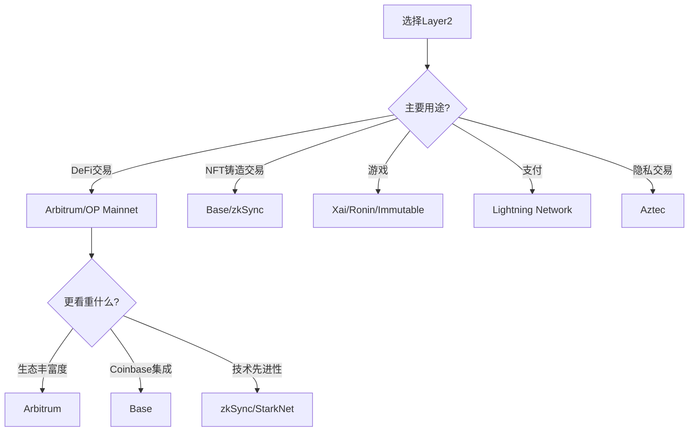

#### 9.2 从主网迁移到Layer2的操作步骤

以将以太坊从主网转移到Arbitrum为例：

**方法一：官方桥接（最安全，但较慢）**

1. 访问 Arbitrum Bridge（bridge.arbitrum.io）
2. 连接钱包（MetaMask等）
3. 选择要转移的资产和数量
4. 确认交易，支付L1 gas费
5. 等待约10-15分钟，资产到达L2

**方法二：第三方跨链桥（更快，但需评估风险）**

常用的跨链桥包括：
- **Across Protocol**：速度快，费用低，基于UMA的乐观预言机
- **Stargate**：LayerZero协议，支持多链
- **Jumper.exchange**：聚合多个桥接协议，自动选择最优路径

**跨链桥安全检查清单**：

- [ ] 桥接协议是否经过审计？审计报告是否公开？
- [ ] TVL是否足够高？（低于1亿美元的桥要谨慎）
- [ ] 是否有安全事件历史？如果有，事件后是否有修复和改进？
- [ ] 团队是否公开、可追踪？
- [ ] 是否有保险基金或安全模块？

#### 9.3 Layer2上的Gas费管理

Layer2的交易费虽然远低于主链，但仍需合理管理：

```yaml
# Layer2费用估算（2025年参考数据）

以太坊主网:     $2-20 / 笔交易
Arbitrum:       $0.01-0.10 / 笔
Optimism:       $0.01-0.15 / 笔
Base:           $0.01-0.05 / 笔
zkSync Era:     $0.02-0.15 / 笔
Polygon PoS:    $0.001-0.01 / 笔
StarkNet:       $0.01-0.20 / 笔
```

费用优化技巧：
1. **选择低峰时段交易**：UTC时间凌晨通常gas最低
2. **使用批量交易**：一些DApp支持批量操作，节省gas
3. **设置合理的Gas上限**：避免支付过高的优先费
4. **利用原生代币**：部分L2允许用原生代币支付gas

---

### 10. Layer2的风险与局限性

#### 10.1 技术风险

| 风险类型 | 描述 | 缓解措施 |
|---------|------|---------|
| 智能合约漏洞 | L2桥接合约可能有未知漏洞 | 选择经过审计和时间检验的项目 |
| Sequencer中心化 | 大多数L2的排序器是中心化的 | 关注去中心化排序器进展 |
| 证明系统漏洞 | ZK证明可能存在soundness问题 | 关注安全审计和bug bounty |
| 升级风险 | 升级多签可能更改规则 | 关注治理透明度和时间锁 |

#### 10.2 Sequencer中心化问题

当前几乎所有主流L2的Sequencer都是由项目方中心化运营的。这意味着：
- Sequencer可以审查特定交易（虽然通常有绕过机制）
- Sequencer宕机会导致L2暂时不可用
- Sequencer可以提取MEV（矿工可提取价值）

**正在推进的去中心化方案**：
- **共享排序器**：多个排序器组成的网络，如Espresso、Astria
- **基于DA层的排序**：将排序责任交给DA层
- **强制包含机制**：允许用户直接在L1上提交交易，绕过Sequencer

#### 10.3 碎片化问题

随着L2数量增加，流动性被分散到不同的链上，用户和开发者面临"碎片化地狱"：
- 跨L2转移需要桥接，增加成本和风险
- DeFi协议的流动性被分散到多个L2
- 用户需要在多个L2上管理资产

**解决方案的探索**：
- **意图（Intents）协议**：用户声明意图，由求解器（Solver）在多个链上找到最优执行路径
- **统一的桥接层**：如Across的跨链意图、Socket的聚合路由
- **链抽象**：让用户无感知地在不同L2之间交互

---

### 11. Layer2的投资分析框架

#### 11.1 评估Layer2项目的关键指标

| 指标 | 含义 | 数据来源 |
|------|------|---------|
| TVL（总锁仓量） | 锁定在L2上的资产总额 | DeFiLlama |
| 日活地址数 | 每日活跃的独立地址 | Dune Analytics |
| 交易笔数 | 日交易量 | L2Beat |
| Sequencer收入 | Sequencer赚取的交易费 | Dune Analytics |
| 开发者活动 | GitHub提交数、开发者数量 | Electric Capital |
| 桥接TVL | 通过桥接进入L2的资产量 | L2Beat |

**推荐数据平台**：
- **L2Beat**（l2beat.com）：最权威的L2数据分析平台，包含TVL、风险评估、技术细节
- **DeFiLlama**：跨链DeFi数据聚合
- **Dune Analytics**：可自定义的链上数据看板

#### 11.2 Layer2代币的价值捕获

Layer2代币的价值来源主要有：

1. **治理权**：对协议升级、费用参数等的投票权
2. **Sequencer收入**：部分收入可能分配给代币持有者
3. **质押收益**：用于排序器质押或安全模块
4. **生态激励**：代币空投和流动性激励

主要L2代币表现（截至2025年初）：
- **ARB（Arbitrum）**：治理代币，最大供应量100亿
- **OP（Optimism）**：治理代币，用于超级链治理
- **MATIC/POL（Polygon）**：用于质押和gas支付
- **STRK（StarkNet）**：用于质押和gas支付
- **ZK（zkSync）**：治理代币（2024年空投）

---

### 12. 常见误区与纠正

| 误区 | 真相 |
|------|------|
| "Layer2和侧链是一回事" | 侧链不依赖主链安全，Layer2继承主链安全性，根本区别在于安全模型 |
| "L2完全去中心化" | 目前大部分L2的排序器是中心化的，去中心化仍在推进中 |
| "ZK Rollup一定比Optimistic Rollup好" | 各有优劣，Optimistic Rollup更成熟，EVM兼容性更好 |
| "L2上没有风险" | 智能合约风险、桥接风险、排序器风险依然存在 |
| "跨链桥都是安全的" | 跨链桥是黑客攻击的重灾区，2022年桥接攻击损失超过20亿美元 |
| "L2代币必然上涨" | 代币价值取决于生态发展和价值捕获机制，不是所有L2代币都会增值 |
| "TVL高就安全" | TVL可以被短期激励人为推高，需要看有机增长趋势 |
| "L2费用永远最低" | 网络拥堵时L2费用也会飙升，只是通常远低于主链 |

---

### 13. 未来展望

#### 13.1 技术演进方向

**Based Rollup**：将排序权交给L1验证者，解决排序器中心化问题。L1验证者直接在L1区块中包含L2交易，实现真正的去中心化排序。

**ZK协处理器**：将ZK证明的应用从交易验证扩展到通用计算验证，允许在链上验证任意链下计算的结果。

**链抽象（Chain Abstraction）**：用户不需要知道自己在使用哪条链，钱包和协议自动处理跨链逻辑。这将是Layer2大规模采用的关键。

#### 13.2 生态演进趋势

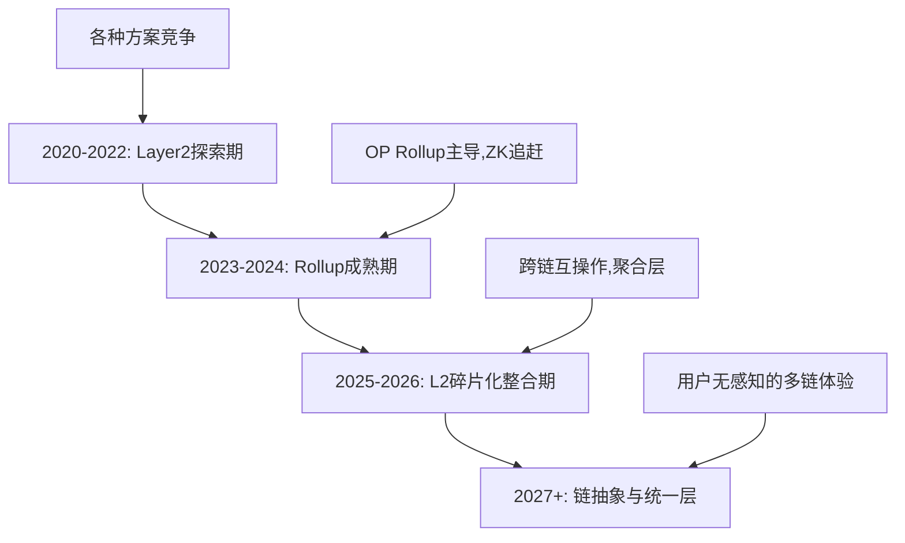

#### 13.3 给不同读者的建议

**新手入门**：
- 从Base或Arbitrum开始，体验费用低廉的DeFi和NFT
- 使用小额资金熟悉跨链桥操作
- 关注L2Beat的风险评估页面

**进阶用户**：
- 理解不同L2的技术差异，根据需求选择
- 关注跨链聚合器，优化资金效率
- 参与L2生态的空投和激励活动

**专业投资者**：
- 监控L2的TVL、活跃度、收入等指标
- 评估L2代币的价值捕获机制
- 关注排序器去中心化和代币经济学的演进
