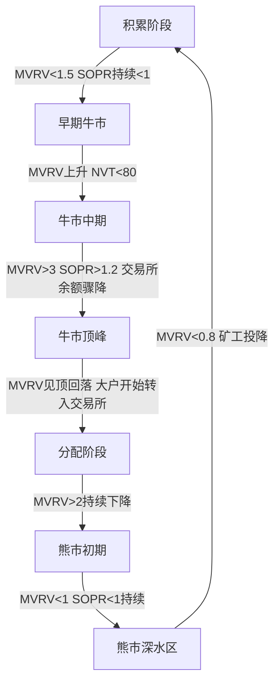
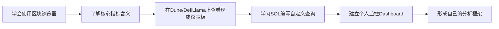

## 八、链上数据分析基础

区块链最本质的特征之一是**透明性**——每一笔交易、每一个地址余额、每一次合约调用都永久记录在公开账本上。链上数据分析（On-chain Analytics）就是从这些原始数据中提取投资洞察的过程。与传统金融市场不同，加密货币投资者可以实时审计整个市场的资金流动、持仓分布和行为模式，这是前所未有的信息优势。

本节从基础概念出发，逐步讲解链上数据的分类体系、核心指标、分析工具和实战方法，帮助读者建立系统的链上分析能力。

### 1. 为什么链上数据分析重要

#### 1.1 信息不对称的逆转

传统金融市场中，机构投资者拥有散户无法获取的数据优势——订单流、持仓报告、内部消息等。区块链的透明性打破了这种不对称：

| 维度 | 传统市场 | 加密货币市场 |
|------|----------|-------------|
| 持仓数据 | 季度披露（13F报告） | 实时可查 |
| 资金流向 | 需付费购买Level 2数据 | 免费链上查询 |
| 大户行为 | 延迟数周才知道 | 钱包监控可实时追踪 |
| 协议收入 | 需财报分析 | 链上可直接计算 |
| 供应分布 | 需推算 | 精确到每个地址 |

这意味着任何愿意花时间学习链上分析的投资者，都能获得与专业机构接近的信息基础。

#### 1.2 链上数据能回答什么问题

链上分析可以回答以下关键投资问题：

- **市场情绪**：大户是在买入还是卖出？散户是否在恐慌抛售？
- **供需动态**：交易所的比特币余额是增加还是减少？持有者是否在囤币？
- **协议健康**：DeFi协议的真实TVL是多少？用户活跃度如何？
- **风险预警**：是否有巨鲸在大量转移资产准备抛售？协议是否面临流动性危机？
- **估值参考**：网络使用量是否支撑当前市值？链上费用收入是否健康？

#### 1.3 链上分析的局限性

链上分析并非万能，需要了解其边界：

- **无法直接预测价格**：链上数据显示的是供需状态，但市场短期走势受情绪和叙事驱动更强
- **地址不等于用户**：一个人可以拥有多个地址，一个地址也可能属于多个用户（交易所热钱包）
- **隐私币例外**：Monero（XMR）、Zcash（ZEC）等隐私币的链上数据高度混淆，分析价值有限
- **跨链复杂性**：资产跨链转移后，在原链上看像是"消失"了，需要跨链视角
- **数据解读需要经验**：同一个信号在不同市场环境下含义不同，不能机械套用

### 2. 链上数据的分类体系

理解链上数据的结构是进行有效分析的前提。链上数据可以按照来源和用途分为以下几大类：

#### 2.1 第一层：网络层数据

网络层数据描述区块链本身的运行状态，反映底层网络的健康程度和使用情况。

**区块数据**：每个区块包含的基本信息——区块高度、时间戳、矿工/验证者地址、区块大小、Gas使用量。通过区块数据可以计算出块时间、网络拥堵程度等。

**交易数据**：每笔交易的完整记录——发送地址、接收地址、金额、Gas费用、交易状态（成功/失败）、输入数据（合约调用的函数和参数）。这是链上分析最核心的数据源。

**地址数据**：所有地址的当前余额和历史交易记录。通过地址数据可以追踪资金流向、分析持仓分布、识别大户行为。

#### 2.2 第二层：应用层数据

应用层数据来自部署在区块链上的智能合约，反映DeFi、NFT、DAO等应用的运行状态。

**DeFi协议数据**：包括借贷协议的存借款量和清算事件、DEX的交易量和流动性深度、质押协议的质押量和收益率等。

**NFT数据**：包括铸造数量、交易量、地板价、持有者分布等。

**代币数据**：ERC-20代币的转账记录、持有者分布、流通供应量等。

#### 2.3 第三层：衍生指标

衍生指标是通过对原始数据进行计算和聚合得到的分析指标，通常由专业分析平台提供。

```text
原始数据 → 清洗聚合 → 计算指标 → 可视化呈现 → 投资决策

示例：
交易记录 → 按地址聚合 → 计算交易所净流入 → 发现大额流入 → 判断潜在抛压
```

### 3. 核心链上指标详解

#### 3.1 网络活跃度指标

**活跃地址数（Active Addresses）**

定义：在特定时间段内发送或接收过交易的独立地址数量。这是衡量网络使用热度最直接的指标。

分析方法：
- **日活跃地址（DAA）**：反映短期网络热度。持续增长通常意味着新用户涌入或现有用户更活跃
- **周活跃地址（WAA）**：平滑了日波动，更适合趋势判断
- **活跃地址与价格的背离**：如果价格上涨但活跃地址下降，说明上涨可能缺乏基本面支撑；反之，活跃地址持续增加但价格横盘，可能意味着积累阶段

**交易量（Transaction Volume）**

定义：在特定时间段内链上转移的总价值（以美元或原生代币计）。

分析要点：
- 区分**有机交易量**和**非有机交易量**：某些地址会进行自转（同一控制人的地址间互转）来刷量
- 关注**中位数交易金额**而非平均值：一笔巨鲸转账就能大幅拉高平均值
- 交易量的趋势比绝对值更重要：持续增长的交易量比单日暴涨更有意义

**交易笔数（Transaction Count）**

定义：在特定时间段内成功确认的交易总数。

与交易量的区别：交易量关注金额大小，交易笔数关注使用频率。一个地址频繁进行小额DeFi操作会产生大量交易笔数但交易量不大。两者结合可以更全面地衡量网络活跃度。

**新增地址数（New Addresses）**

定义：首次出现在链上的地址数量。反映网络的新用户增长情况。

注意事项：交易所创建的新地址不代表真实新用户增长；同一用户可能创建多个新地址用于隐私保护。需要结合活跃地址数一起看，单独的新地址数可能存在较大噪音。

#### 3.2 持仓行为指标

**HODL Waves（持币波浪）**

HODL Waves 是由 Unchained Capital 开发的经典指标，将所有比特币按最后一次链上移动的时间分组，用不同颜色的波浪图展示各持有时间段的比特币占比。

| 持有时间 | 含义 | 市场信号 |
|----------|------|---------|
| < 1天 | 短期投机/套利 | 日内高频交易 |
| 1天-1周 | 短线交易者 | 近期买入的活跃交易者 |
| 1周-1月 | 短期持有者 | 近期市场参与者 |
| 1-3月 | 中短期持有者 | 通常在盈亏平衡线附近 |
| 3-6月 | 中期持有者 | 经历了完整牛熊周期的一部分 |
| 6-12月 | 中长期持有者 | 倾向于在盈利时卖出 |
| 1-2年 | 长期持有者 | 通常在牛市中期开始卖出 |
| 2-5年 | 老手持有者 | 通常在牛市末期大幅卖出 |
| 5年以上 | 极长期持有/丢失币 | 很少移动，可视为退出流通 |

实战应用：当短期持有者占比达到历史低位（大部分币被长期锁定），往往对应市场底部区域；当长期持有者开始大量转入短期持有状态（大规模获利了结），往往接近牛市顶部。

**实体调整后的指标（Entity-Adjusted Metrics）**

Glassnode 提出的方法：将属于同一实体（同一控制人）的多个地址归为一个实体，避免一个用户拥有大量地址导致的数据失真。

例如：一个交易所可能控制数千个地址，如果按地址计算持仓分布会严重失真。实体调整后的"持有1000+ BTC的实体"比"持有1000+ BTC的地址"更有分析价值。

**积累趋势分数（Accumulation Trend Score）**

Glassnode 开发的指标，衡量实体在最近30天内相对于其持仓量的增持/减持强度。分数范围0到1：
- 接近1：大型实体正在大量增持
- 接近0：大型实体正在减持或小型实体在增持

这个指标的优势在于同时考虑了实体大小和持仓变化方向，比单纯的净流入/流出更有信息量。

#### 3.3 交易所流动指标

交易所是连接链上世界和交易市场的关键枢纽，交易所的代币流入流出是最重要的信号之一。

**交易所余额（Exchange Balance）**

交易所热钱包和冷钱包中持有的代币总量。这是衡量市场潜在卖压的核心指标。

| 趋势 | 含义 | 市场信号 |
|------|------|---------|
| 持续下降 | 代币从交易所提走到自托管钱包 | 长期看涨信号（持有者囤币） |
| 持续上升 | 代币转入交易所 | 可能的看跌信号（准备卖出） |
| 突然激增 | 大量代币转入交易所 | 强烈看跌预警（大额抛售可能即将发生） |
| 持平 | 买卖平衡 | 市场处于平衡状态 |

**交易所净流入/流出（Exchange Netflow）**

特定时间段内流入交易所减去流出交易所的净额。

- **净流入为正**：更多代币进入交易所，通常对应卖压增加
- **净流入为负**：更多代币离开交易所，通常对应囤币行为

需要注意：交易所净流入为正不一定意味着立即下跌，但从供给角度看卖压在增加。实际影响取决于市场当时的买方力量。

**大户存款/提款（Whale Deposits/Withdrawals）**

单独追踪大额（例如超过100 BTC）的交易所存款和提款，比看总量更有信号价值。大额存款通常意味着机构或巨鲸准备卖出；大额提款可能意味着机构在建仓后转入冷存储。

#### 3.4 估值指标

**NVT比率（Network Value to Transactions Ratio）**

NVT = 市值 / 链上日交易量（美元）

这是加密货币版本的市盈率（P/E Ratio），衡量市场为每单位链上价值转移支付了多少溢价。

- **NVT > 150**：网络可能被高估，链上活动不足以支撑市值
- **NVT < 30**：网络可能被低估，链上活动相对市值很活跃
- **NVT趋势**：NVT持续上升意味着估值增长快于使用量增长，反之亦然

NVT的局限：不同链的"交易量"含义不同（以太坊包含大量合约调用，比特币主要是价值转移），不能直接跨链比较。

**MVRV比率（Market Value to Realized Value Ratio）**

MVRV = 市值 / 实现市值

实现市值（Realized Cap）是将每个代币按最后一次链上移动时的价格计算的市值，代表整个市场的"成本基础"。

- **MVRV > 3.5**：市场严重过热，大量持有者处于高盈利状态，获利了结压力大
- **MVRV < 1.0**：市场处于极端恐慌，整体持有者处于亏损状态，通常是长期底部区域
- **MVRV = 1**：市场总市值等于总成本基础，是重要的支撑/阻力分界线

MVRV是被广泛认可的比特币周期指标，在历次牛熊转换中表现优异。

**SOPR（Spent Output Profit Ratio）**

SOPR = 当天花费的代币的卖出价格 / 这些代币上次移动时的价格

- **SOPR > 1**：链上移动的代币平均处于盈利状态（卖方获利）
- **SOPR < 1**：链上移动的代币平均处于亏损状态（卖方亏损/恐慌卖出）
- **SOPR = 1**：盈亏平衡线

在牛市回调中，SOPR跌破1后迅速反弹到1以上，说明买方在亏损价格处承接，是健康的回调信号。如果SOPR持续低于1，说明恐慌情绪持续，可能是趋势反转的信号。

**Puell Multiple（普尔倍数）**

Puell Multiple = 当日矿工收入（美元） / 365日矿工收入均值

衡量矿工当前收入相对于历史平均的水平：
- **Puell Multiple > 4**：矿工收入远超均值，可能触发矿工卖出获利
- **Puell Multiple < 0.5**：矿工收入远低于均值，矿工面临生存压力，通常是市场底部区域

### 4. 链上分析工具全景

#### 4.1 区块浏览器——基础必备

区块浏览器是查看链上数据的最基本工具，类似于区块链的"搜索引擎"。

**主流区块浏览器：**

| 区块链 | 浏览器 | 特点 |
|--------|--------|------|
| Ethereum | Etherscan | 最全面的以太坊浏览器，支持合约验证和ABI查看 |
| Bitcoin | Blockchain.com / Mempool.space | 前者适合基础查询，后者专注内存池和费率分析 |
| BNB Chain | BscScan | 界面与Etherscan一致，支持BEP-20代币 |
| Polygon | PolygonScan | Polygon生态主浏览器 |
| Solana | Solscan / Solana.fm | Solana链上数据查询 |
| Arbitrum | Arbiscan | Arbitrum L2浏览器 |

**通过区块浏览器可以做什么：**

- 查看任意地址的余额和交易历史
- 追踪特定交易的资金去向
- 查看合约的源代码和ABI（已验证的合约）
- 监控Gas价格和网络拥堵情况
- 查看代币的持有者分布
- 分析特定地址的资金流入流出模式

**实战技巧——地址标签（Labels）**

区块浏览器和专业分析平台会为知名地址打标签，例如"币安热钱包"、"Uniswap V3 Router"、"MEV Bot"等。学会利用这些标签可以快速判断交易的性质。例如看到一个地址向"Coinbase Prime"转入大量ETH，基本可以确认是在准备卖出。

#### 4.2 数据聚合平台——中阶利器

**Dune Analytics**

Dune 是最受欢迎的社区驱动链上分析平台。用户可以通过编写SQL查询直接从区块链数据库中提取和分析数据，并创建可视化仪表板。

核心优势：
- 数据完全免费开放
- 社区已有超过20万个现成仪表板，覆盖几乎所有主流协议
- 支持Ethereum、Polygon、Arbitrum、Optimism、Base、BNB Chain等多条链
- 查询可以实时更新，嵌入到任何网页

使用示例——查看Uniswap日交易量：

```sql
-- Uniswap V3 日交易量查询（简化示例）
SELECT
    date_trunc('day', evt_block_time) AS day,
    SUM(amount0 * p.price / 1e18) AS volume_usd
FROM uniswap_v3."Pair_evt_Swap" s
LEFT JOIN prices.usd p
    ON date_trunc('minute', evt_block_time) = p.minute
    AND p.contract_address = '\x...' -- WETH地址
WHERE evt_block_time > now() - interval '30 days'
GROUP BY 1
ORDER BY 1 DESC
```

Dune的学习曲线较陡，需要掌握SQL和理解以太坊的数据结构（如事件日志、合约调用），但一旦掌握就是最强大的链上分析工具。

**Nansen**

Nansen 是面向专业投资者的付费链上分析平台，核心特色是**地址标签系统**。Nansen已经标记了超过1亿个地址的身份（交易所、基金、DeFi协议、MEV机器人等），用户可以直接按标签筛选数据。

关键功能：
- **Smart Money追踪**：追踪被标记为"聪明钱"的地址的实时操作
- **Token God Mode**：单个代币的全面分析，包括持仓分布、鲸鱼行为、交易所流入流出
- **Hot Contracts**：近期被大户频繁交互的合约，可以发现新兴热点
- **Wallet Profiler**：查看特定地址的完整交易历史和盈利情况

Nansen适合需要快速获取专业级洞察的投资者，但月费较高（约$150-$2500/月）。

**Glassnode**

Glassnode 是专注于比特币和以太坊的链上数据分析平台，以高质量的衍生指标闻名。前文介绍的MVRV、SOPR、Puell Multiple等指标，Glassnode都提供专业级的实时计算和图表。

优势指标：
- 实体调整后的各类指标
- 长短期持有者行为分析
- 矿工收入和行为追踪
- 市场周期位置判断指标

Glassnode有免费版本（基础指标）和付费版本（高级指标和实时API），是比特币长期投资者的必备工具。

#### 4.3 免费替代工具

对于预算有限的个人投资者，以下工具可以覆盖大部分需求：

| 工具 | 定位 | 免费额度 |
|------|------|---------|
| Arkham Intelligence | 地址标签和追踪 | 免费版支持基础地址追踪和警报 |
| DefiLlama | DeFi数据聚合 | 完全免费，TVL、收益率、桥接数据 |
| Token Terminal | 协议收入和估值 | 基础数据免费，高级功能付费 |
| CryptoQuant | 交易所和矿工数据 | 部分图表免费 |
| Lookonchain | 鲸鱼追踪（社交媒体形式） | 完全免费，通过Twitter/X发布分析 |
| Bubblemaps | 代币持仓可视化 | 基础功能免费 |

### 5. 链上分析实战框架

#### 5.1 市场周期判断框架

利用链上数据判断比特币所处的市场周期阶段，是链上分析最有价值的应用之一。



**各阶段的链上信号特征：**

**积累阶段（底部区域）：**
- MVRV低于1.0-1.5区间
- SOPR持续低于1（持有者亏损卖出）
- 交易所余额达到高点后开始缓慢下降
- 长期持有者开始增持
- 网络活跃度极低，新增地址数下降
- 矿工收入处于低位，部分矿机关机

**牛市中期：**
- MVRV在1.5-3之间上升
- SOPR在1附近波动，回调时不跌破1
- 新地址和活跃地址数持续增长
- 短期持有者占比上升（新资金入场）
- 交易所余额持续下降（提币囤积）

**牛市顶峰区域：**
- MVRV超过3.5甚至更高
- 长期持有者开始大量转入短期持有（大规模获利了结）
- 交易所净流入突然激增
- 大额存款到交易所频繁出现
- NVT比率快速上升（估值远超使用量）
- 新增地址数爆发式增长（散户FOMO入场）

**熊市初期至深水区：**
- MVRV快速下降，最终跌破1.0
- 短期持有者大量亏损（SOPR持续低于1）
- 交易所余额开始回升（持仓者放弃，转入交易所卖出）
- 恐慌性抛售后出现投降式成交量
- 网络活跃度持续萎缩

#### 5.2 DeFi协议健康检查框架

在参与任何DeFi协议之前，可以通过链上数据进行"尽职调查"：

**步骤一：TVL真实性和构成**

```text
查看DefiLlama数据：
1. TVL趋势：是持续增长还是短期暴涨后回落？
2. TVL构成：资金来源是否分散？是否高度依赖几个巨鲸地址？
3. TVL/市值比：比值过低可能意味着估值过高
4. 对比同赛道竞品：相对TVL份额是增长还是下降？
```

**步骤二：用户活跃度分析**

通过Dune或区块浏览器查看：
- 日活跃用户数（Unique Active Wallets）
- 平均每用户交易笔数（衡量用户粘性）
- 新用户vs回访用户比例
- 用户留存率（7日、30日留存）

**步骤三：收入和费用分析**

通过Token Terminal或Dune查看：
- 协议日收入（费用收入）
- 费用收入是否持续（vs 依赖代币激励的虚假繁荣）
- P/S比率（市值/收入）对比同行
- 收入来源是否多元（单一来源风险高）

**步骤四：代币持有分布**

通过区块浏览器或Nansen查看：
- 前10/50/100地址的持有占比（集中度风险）
- 团队和投资者地址的解锁计划
- 是否有大量代币集中在少数地址（拉盘/砸盘风险）
- 流通供应量占总供应量的比例

#### 5.3 鲸鱼追踪实战方法

追踪大户（鲸鱼）的行为是链上分析中最直接的信号来源。

**方法一：手动设置监控**

使用Etherscan等区块浏览器的"Watch List"功能，将已知的巨鲸地址添加到监控列表，设置余额变动提醒。

**方法二：使用Arkham Intelligence**

Arkham提供可视化的地址追踪和资金流图谱，可以直观看到资金在多个地址间的流动路径。免费版支持设置有限数量的地址监控和警报。

**方法三：追踪Smart Money**

在Nansen上查看"Smart Money"标签下的地址近期操作，筛选特定代币或协议的交互记录。这些被标记为Smart Money的地址通常是长期盈利表现优秀的交易者或机构。

**方法四：社交媒体聚合信息**

关注Lookonchain、OnchainDataNerd等链上分析账号，它们会实时发布大额交易和鲸鱼操作的分析。这是最低成本的信息获取方式，但需要自行判断信息的可靠性。

**鲸鱼行为解读：**

| 行为 | 可能含义 | 注意事项 |
|------|---------|---------|
| 大额转入交易所 | 准备卖出 | 也可能是用于合约保证金或OTC交易 |
| 从交易所大额提出 | 长期持有/转入冷存储 | 看涨信号，但也可能是交易所内部调仓 |
| 大额转入DeFi协议 | 参与挖矿/借贷 | 关注后续是否快速撤出 |
| 新地址收到大额转入 | 机构建仓或OTC交易后的接收 | 需要追踪后续操作才有意义 |
| 多地址集中转入同一地址 | 归集资金准备操作 | 通常在重大操作前发生 |

### 6. 高级分析方法

#### 6.1 UTXO分析（比特币特有）

比特币使用UTXO（未花费交易输出）模型，与以太坊的账户模型不同。UTXO分析可以提供更精细的持币行为洞察。

**UTXO年龄分布**：将所有UTXO按创建时间分组，可以识别哪些"币龄"段的UTXO正在被花费（卖出）。当长期未动的UTXO开始被花费时，通常是老手在出货。

**UTXO成本基础分布**：计算不同价格区间有多少UTXO被创建，形成"成本基础分布图"。密集的成本基础区域会成为强支撑或阻力，因为大量持有者在该价位处于盈亏平衡。

#### 6.2 MEV分析

MEV（最大可提取价值）是以太坊生态中越来越重要的分析维度。通过追踪MEV活动可以了解：

- **MEV总量**：每日被MEV搜索者提取的价值，反映链上交易的"隐形成本"
- **MEV类型分布**：套利（Arbitrage）、清算（Liquidation）、三明治攻击（Sandwich Attack）的比例
- **MEV对普通用户的影响**：三明治攻击直接导致普通交易者获得更差的执行价格

通过 Flashbots 的 MEV-Explore 或 EigenPhi 等平台可以查看MEV相关的链上数据。

#### 6.3 资金费率与链上数据结合

将链上数据与衍生品数据结合，可以获得更全面的市场视角：

- 当链上数据显示大户囤币（交易所余额下降）但永续合约资金费率极度看涨（费率很高），说明市场过热，可能出现回调
- 当链上数据显示投降式抛售（SOPR极度低于1）但合约市场出现大量空头平仓，说明空头在被挤出，反弹概率增加

#### 6.4 跨链数据分析

随着多链生态的发展，只看单一链的数据可能得出错误结论。跨链桥数据、多链TVL分布、跨链资金流向都是重要的分析维度。

DefiLlama 的 "Bridges" 板块提供跨链桥的交易量和资金流向数据。如果大量资金从以太坊流向某L2，说明该L2生态在吸引资金和用户。

### 7. 常见误区与纠正

#### 误区一：将地址等同于用户

**错误**："以太坊活跃地址数增长了50%，所以用户增长了50%。"

**纠正**：一个用户可能控制多个地址，一个地址也可能代表多个用户（交易所地址）。分析时应使用"实体调整"后的数据，或至少意识到活跃地址数是用户数的近似而非精确值。

#### 误区二：单一指标下结论

**错误**："交易所比特币余额在下降，所以比特币一定涨。"

**纠正**：任何单一指标都不能作为决策的唯一依据。交易所余额下降是看涨因素之一，但需要结合市场周期位置、宏观环境、资金费率等多维度信息综合判断。MVRV极高时交易所余额下降可能只是说明获利了结的人在用另一种方式存储。

#### 误区三：忽略数据的时间维度

**错误**："今天的链上数据显示巨鲸在卖出，所以看跌。"

**纠正**：一天的数据波动可能只是噪音。链上分析需要关注趋势——至少7天、最好30天的数据移动平均。单日大额转账可能只是交易所冷热钱包调仓、OTC交易结算或质押操作，并不直接反映市场方向。

#### 误区四：盲目跟随Smart Money

**错误**："Nansen上的Smart Money在买这个代币，所以我也买。"

**纠正**：Smart Money标签只是历史盈利统计，不保证未来表现。而且你看到的操作可能有延迟（从链上确认到平台标记可能有数小时），此时价格可能已经反映了该信息。更重要的是理解Smart Money为什么买，而不是简单跟随。

#### 误区五：忽视数据质量问题

**错误**："这个Dune仪表板显示的数据肯定准确。"

**纠正**：Dune上的仪表板由社区成员创建，数据质量参差不齐。使用前需要检查SQL查询逻辑是否正确、数据源是否可靠、是否包含已知的异常数据（如漏洞攻击期间的异常交易）。优先使用经过社区验证、点赞数高的仪表板。

### 8. 建立个人链上分析体系

#### 8.1 入门路径



**第一阶段（1-2周）：** 熟练使用Etherscan，能追踪任意地址的资金流向，理解交易、地址、合约之间的关系。

**第二阶段（2-4周）：** 注册Glassnode和CryptoQuant的免费账户，系统学习MVRV、SOPR、NVT等核心指标的含义和使用场景。每天花10分钟观察这些指标的变化趋势。

**第三阶段（1-2月）：** 注册Dune Analytics，浏览社区创建的高质量仪表板，学习基础SQL查询，尝试创建自己的简单查询。

**第四阶段（持续）：** 建立个人的链上监控体系——选定几个核心指标作为日常跟踪对象，设定异常警报阈值，形成自己的分析框架和决策流程。

#### 8.2 日常监控清单

将以下指标纳入日常监控习惯：

**每日快速检查（5分钟）：**
- 比特币和以太坊交易所净流入/流出
- Gas价格水平（网络活跃度的快速指标）
- 大额交易警报（关注是否影响市场方向）

**每周深度检查（30分钟）：**
- MVRV、SOPR等估值指标的位置和趋势
- 交易所余额的周变化趋势
- DeFi主流协议TVL变化
- 鲸鱼地址的异常操作

**每月全面检查（1-2小时）：**
- 市场周期位置的全面评估
- 持有者行为模式的变化
- 新兴链上趋势和叙事的识别
- 个人分析框架的回顾和优化

### 9. 本节小结

链上数据分析是加密货币投资者独有的信息武器。传统金融市场中散户根本无法获得的实时资金流动、持仓分布、协议收入等数据，在区块链上完全透明公开。掌握链上分析能力，意味着将投资决策从"跟消息面赌博"提升到"基于数据的理性判断"。

关键要点回顾：
- 链上数据分为网络层数据、应用层数据和衍生指标三个层次
- 核心指标包括网络活跃度（活跃地址、交易量）、持仓行为（HODL Waves、积累趋势）、交易所流动（余额、净流入）和估值指标（NVT、MVRV、SOPR）
- 工具选择：区块浏览器用于基础查询，Dune用于自定义分析，Glassnode/Nansen用于专业级指标，DefiLlama用于DeFi数据
- 分析方法：市场周期判断、DeFi协议健康检查、鲸鱼追踪是最核心的三个应用场景
- 避免单一指标决策，关注趋势而非单点数据，理解数据的局限性

链上分析能力的建立需要时间和实践，建议从区块浏览器的基础操作开始，逐步扩展到专业平台和自定义分析，最终形成适合自己的分析体系。
