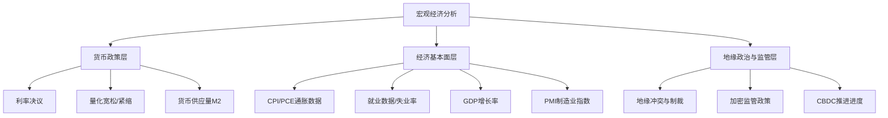
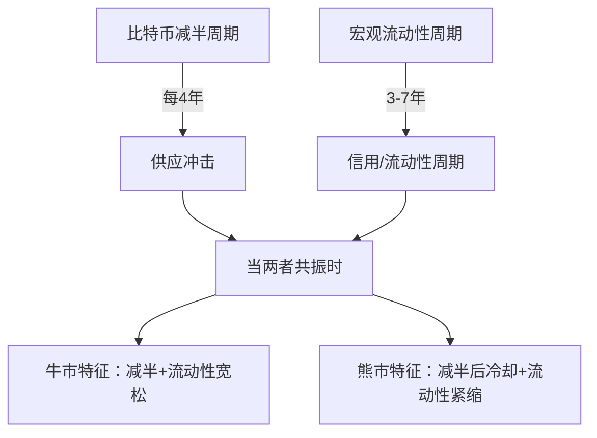

## 九、加密货币的宏观经济视角

理解加密货币不能只盯着链上数据和技术指标——它嵌套在全球宏观经济的大棋局中。美联储的一次议息会议、一份CPI报告、一场地缘冲突，都可能在数小时内引发加密市场数十亿美元的波动。本节从宏观经济的底层逻辑出发，系统梳理影响加密货币价格的核心宏观变量，建立一套可操作的宏观分析框架。

---

### 1. 为什么宏观分析对加密货币至关重要

#### 1.1 从"数字黄金"到"高贝塔科技股"：加密货币的叙事演变

比特币诞生于2008年金融危机之后，中本聪在创世区块中嵌入了《泰晤士报》的头条："财政大臣即将对银行进行第二轮救助"。这个创世叙事奠定了比特币的"反法币"基因——它被设计为一种不依赖中央银行、不受政府操控的去中心化货币。

然而，随着加密市场的成熟和机构资金的涌入，比特币的实际市场行为已经发生了显著变化：

| 时期 | 主流叙事 | 与纳斯达克相关性 | 驱动资金 |
|------|----------|------------------|----------|
| 2009-2016 | 极客实验/暗网货币 | ≈0.1 | 散户、早期信仰者 |
| 2017-2019 | 数字黄金/投机资产 | ≈0.3 | 散户FOMO、ICO热潮 |
| 2020-2022 | 通胀对冲→高贝塔资产 | ≈0.6-0.8 | 机构入场、DeFi |
| 2023-2025 | 另类宏观资产 | ≈0.4-0.7 | ETF资金、主权基金 |

2020年3月12日"黑色星期四"是一个分水岭：比特币在一天之内暴跌50%，与美股同步崩盘。这彻底打破了"加密货币与传统市场不相关"的迷思。此后，比特币与纳斯达克100指数的30日滚动相关系数长期维持在0.5以上。

**核心认知**：加密货币已经深度嵌入全球宏观金融体系，不再是"法外之地"。理解宏观变量是做出理性投资决策的前提。

#### 1.2 宏观分析的三个层次



---

### 2. 货币政策：加密市场的最大宏观驱动力

#### 2.1 利率周期与加密资产的跷跷板效应

利率是所有资产定价的锚。当央行加息时，无风险收益率上升，资金从高风险资产（包括加密货币）流向安全资产（国债、存款）；降息则相反。

**传导机制详解：**

联邦基金利率↑ → 无风险收益率↑ → 风险资产折现率↑ → 未来现金流现值↓ → 股票/加密货币估值↓

这个传导链在2022年的加息周期中表现得淋漓尽致：
- 2022年3月至2023年7月，美联储累计加息525个基点（从0.25%到5.50%）
- 同期比特币从约47,000美元跌至16,000美元，跌幅超过65%
- 纳斯达克100指数同期下跌约33%
- 加密市场总市值从约3万亿美元缩水至不足1万亿美元

反之，2020-2021年的超级牛市直接受益于零利率+无限QE：
- 联邦基金利率降至0-0.25%
- 美联储资产负债表从4.2万亿扩张至8.9万亿美元
- 比特币从3月低点3,800美元涨至11月高点69,000美元，涨幅超1700%

**投资者需要关注的关键时间节点：**
- FOMC利率决议（每年8次，通常在周三下午2:00 EST公布）
- 美联储主席国会证词（每年2次）
- 杰克逊霍尔全球央行年会（8月）
- 美联储经济预测摘要（SEP）和点阵图更新

#### 2.2 量化宽松与量化紧缩：流动性之水的涨落

如果说利率是水龙头的开关，量化宽松/紧缩（QE/QT）就是水库的水位。

**量化宽松（QE）的加密牛市效应：**


**量化紧缩（QT）的反向效应：**

美联储从2022年6月开始缩表，每月减少950亿美元的国债和MBS持有量。流动性收紧直接导致：
- 美国逆回购余额（RRP）从峰值2.5万亿美元下降
- 银行准备金余额收紧
- 金融市场流动性边际收缩
- 高风险资产（包括加密货币）估值承压

**关键指标：** 关注美联储资产负债表规模（FRED: WALCL）和美国银行准备金余额（FRED: WRESBAL）。当准备金余额跌破2.5万亿美元时，通常意味着流动性环境趋紧，需要警惕风险资产回调。

#### 2.3 M2货币供应量：比特币的"隐形价格锚"

M2是广义货币供应量，包括现金、活期存款、定期存款和货币市场基金。学术研究表明，比特币价格与全球M2之间存在显著的正相关关系，且M2的变化通常领先比特币价格3-6个月。

**历史数据对照：**

| 时间段 | 全球M2变化 | BTC价格变化 | 滞后期 |
|--------|-----------|-------------|--------|
| 2020Q1-2021Q4 | +27%（$83T→$105T） | +600%（$7K→$49K） | 3-6个月 |
| 2022Q1-2022Q4 | -4%（$105T→$101T） | -65%（$47K→$16K） | 2-4个月 |
| 2023Q2-2024Q4 | +8%（$101T→$109T） | +300%（$26K→$100K+） | 3-6个月 |

这个相关性的底层逻辑是：M2增长→法定货币贬值→购买力稀释→部分资金流入抗通胀资产（黄金、比特币）。但需要注意，这种相关性并非因果关系，且在市场情绪极端时可能短期失效。

**实操建议：** 使用Trading Macro等工具追踪全球M2趋势。当M2同比增速由负转正时，通常预示加密市场将进入上升周期。

---

### 3. 通胀数据与加密货币的"避险叙事"

#### 3.1 CPI与PCE：美联储的决策依据

美国劳工统计局（BLS）每月发布的消费者价格指数（CPI）和商务部经济分析局（BEA）发布的个人消费支出价格指数（PCE），是美联储制定货币政策的核心参考数据。

**加密市场对通胀数据的典型反应模式：**

| CPI数据 | 预期 | 市场反应 | 逻辑 |
|---------|------|----------|------|
| CPI高于预期 | 高通胀 | BTC先跌后涨 | 初期：加息预期→抛售；后期：通胀保值需求→买入 |
| CPI低于预期 | 通胀降温 | BTC上涨 | 降息预期升温→流动性宽松预期→风险资产上涨 |
| CPI符合预期 | 中性 | 小幅波动 | 市场已定价，反应平淡 |
| 核心CPI持续下降 | 趋势性 | BTC趋势性上涨 | 美联储政策转向预期强化 |

**核心CPI vs 总体CPI：** 美联储更关注核心CPI（剔除食品和能源），因为它更能反映潜在通胀趋势。当核心CPI连续3个月环比下降时，市场通常会押注美联储转向宽松。

#### 3.2 "比特币是通胀对冲工具"——一个需要解构的叙事

"比特币是数字黄金、是通胀对冲工具"是加密社区最根深蒂固的叙事之一。但实际数据并不完全支持这一论断：

**支持证据：**
- 2020-2021年全球大放水期间，比特币和黄金同步上涨
- 阿根廷、土耳其、委内瑞拉等高通胀国家的P2P比特币交易量显著上升
- 比特币的固定供应量（2100万枚）赋予其理论上抗通胀的特性

**反对证据：**
- 2022年美国CPI达到9.1%（40年新高），同期比特币暴跌65%
- 在高通胀+加息的组合下，比特币表现更像高风险科技股
- 比特币的短期波动率远高于通胀率，无法作为短期通胀对冲

**更准确的定位：**


**结论：** 比特币更适合作为"长期购买力保值工具"和"货币超发对冲"，而非短期CPI对冲。在"高通胀+低利率"的环境下（如2020-2021年），比特币表现最佳；在"高通胀+高利率"的环境下（如2022年），比特币表现最差。区分这两种环境至关重要。

---

### 4. 就业与经济增长数据：风险偏好的晴雨表

#### 4.1 非农就业报告（NFP）

每月第一个周五公布的非农就业数据是全球最重要的经济数据之一。加密市场对非农数据的反应逻辑：

- **非农就业人数远超预期** → 经济强劲 → 美联储可能维持紧缩 → 加密短期承压
- **非农就业人数远低于预期** → 经济放缓 → 美联储可能降息 → 加密短期利好
- **非农就业人数适中** → 市场焦点转向时薪增速和失业率

**2023年的经典案例：** 2023年1月非农就业新增51.7万人（预期18.5万），远超预期。数据公布后比特币在30分钟内从23,400美元跌至22,700美元，因为市场担忧美联储会因此维持更长时间的高利率。

#### 4.2 失业率与"萨姆规则"

失业率的变化不仅影响货币政策预期，还可能触发衰退恐慌。萨姆规则（Sahm Rule）指出：当3个月移动平均失业率较前12个月低点上升超过0.5个百分点时，美国经济已处于衰退初期。

萨姆规则触发 → 衰退恐慌 → 风险资产抛售 → 加密市场下跌

但这也可能倒逼美联储快速降息，形成"先跌后涨"的V型走势。

#### 4.3 GDP与PMI：经济增长的温度计

- **GDP连续两个季度负增长** = 技术性衰退定义，通常引发风险资产大幅回调
- **PMI低于50** = 制造业收缩，经济活动放缓的先行信号
- **PMI连续3个月低于50** = 强烈衰退信号

加密市场对PMI数据的反应通常在数据公布后1-4小时内完成定价，随后转向下一个宏观催化剂。

---

### 5. 美元指数与全球流动性

#### 5.1 DXY（美元指数）与比特币的反向关系

美元指数衡量美元相对于一篮子主要货币（欧元、日元、英镑等）的强弱。由于比特币以美元计价，二者之间存在天然的反向关系：

- DXY上涨 → 美元走强 → 新兴市场资金回流美国 → 加密市场流动性下降
- DXY下跌 → 美元走弱 → 新兴市场资金外流寻找替代资产 → 部分资金流入加密

历史数据表明，DXY与比特币的负相关系数约为-0.3至-0.5，在特定时期可以更强。2020-2021年DXY从103跌至89，同期比特币暴涨；2022年DXY从96飙升至114，比特币暴跌。

#### 5.2 全球流动性指标

追踪全球流动性的关键指标：

| 指标 | 含义 | 对加密的影响 |
|------|------|-------------|
| 全球M2 | 广义货币供应量 | M2↑ → 加密↑（领先3-6月） |
| 美联储资产负债表 | 美联储持有资产总量 | 规模↑ → 流动性↑ → 加密↑ |
| 逆回购余额（RRP） | 美联储吸收的过剩流动性 | 余额↓ → 流动性释放 → 加密↑ |
| 全球央行净流动性注入 | 各国央行QE-QT的净额 | 净注入↑ → 加密↑ |
| 财政部一般账户（TGA） | 美国财政部在美联储的存款 | TGA↓ → 流动性释放 → 加密↑ |

**重要公式：** 净流动性 = 美联储资产负债表 - TGA - RRP

当净流动性上升时，加密市场倾向于上涨；当净流动性下降时，加密市场承压。这是2020-2024年加密市场最可靠的宏观指标之一。

---

### 6. 地缘政治与避险需求

#### 6.1 战争、制裁与加密货币

地缘政治事件对加密市场的影响是双向的：

**短期冲击（通常为负面）：**
- 俄乌战争爆发（2022年2月）：比特币在24小时内从44,000美元跌至35,000美元
- 中东冲突升级（2023年10月）：加密市场短期下挫5-10%
- 逻辑：战争→不确定性↑→风险资产抛售→流动性枯竭

**中长期催化（可能为正面）：**
- 制裁导致SWIFT系统受限→替代支付网络需求↑→加密货币受关注
- 俄罗斯卢布暴跌后，俄罗斯P2P比特币交易量激增300%
- 乌克兰战争期间，加密捐赠超过1亿美元
- 逻辑：地缘风险→对传统金融体系的信任危机→替代资产需求↑

#### 6.2 中美博弈与加密市场的结构性影响

中美之间的科技竞争和金融博弈对加密市场产生深远的结构性影响：

- **中国禁止加密挖矿（2021年5月）**：比特币算力在一个月内下降50%，随后美国成为最大挖矿中心，算力地理分布彻底改变
- **美国SEC执法行动**：对币安、Coinbase等交易所的诉讼直接影响市场流动性和投资者信心
- **香港开放虚拟资产（2023年6月）**：释放亚洲市场开放信号，推动了后续的ETF预期

---

### 7. 加密货币自身的宏观周期

#### 7.1 减半周期：加密市场的"内在时钟"

比特币大约每4年经历一次区块奖励减半，这创造了加密市场独特的供需周期：

| 减半日期 | 区块奖励 | 减半后1年涨幅 | 减半后峰值涨幅 | 峰值时间 |
|----------|---------|--------------|---------------|---------|
| 2012-11-28 | 50→25 BTC | +8,000% | +9,000% | 12个月后 |
| 2016-07-09 | 25→12.5 BTC | +250% | +3,000% | 18个月后 |
| 2020-05-11 | 12.5→6.25 BTC | +400% | +700% | 18个月后 |
| 2024-04-20 | 6.25→3.125 BTC | 待观察 | 待观察 | 待观察 |

减半的核心机制：新币供应量减半 → 如果需求不变 → 价格上升压力 → 吸引更多关注和资金 → 价格进一步上涨 → FOMO情绪放大 → 泡沫形成 → 泡沫破裂 → 进入熊市 → 等待下一个减半

**重要警示：** 减半周期不是万能的。每一轮周期的涨幅都在递减，且外部宏观环境（利率、流动性）的影响越来越大。2024年减半后的走势，不仅取决于供应减少，更取决于美联储的利率政策和全球流动性环境。

#### 7.2 "四年周期"与宏观周期的叠加

加密市场的四年减半周期与全球宏观周期存在有趣的共振：



- **2020-2021年超级牛市** = 减半（2020年5月） + 零利率 + 无限QE → 完美共振
- **2022年加密寒冬** = 减半后冷却期 + 激进加息 + 缩表 → 双重打击
- **2024-2025年** = 新减半（2024年4月） + 降息预期 + ETF流入 → 可能的共振向上

当减半周期的上升期与宏观流动性宽松期重叠时，往往产生超级牛市。当二者错位时，市场走势更为复杂。

---

### 8. 监管政策：加密市场的"制度性宏观变量"

#### 8.1 主要经济体的监管框架对比

监管政策是加密市场的"制度性宏观变量"——它不直接影响短期价格，但决定了行业的中长期发展方向。

| 国家/地区 | 监管态度 | 关键政策 | 对市场的影响 |
|----------|---------|---------|-------------|
| 美国 | 渐进式合规 | BTC/ETH现货ETF获批；SEC执法行动 | 机构资金入场通道打开 |
| 欧盟 | 系统性监管 | MiCA（加密资产市场法规）2024年生效 | 市场规范化，合规成本上升 |
| 中国 | 全面禁止 | 2021年禁止挖矿和交易 | 算力外迁，但P2P交易仍活跃 |
| 日本 | 友好监管 | 交易所牌照制度，虚拟货币法 | 亚太市场的桥头堡 |
| 新加坡 | 审慎开放 | MAS牌照制度 | 亚洲Web3创业中心 |
| 阿联酋 | 积极拥抱 | VARA监管框架，虚拟资产自由区 | 中东加密枢纽 |
| 萨尔瓦多 | 激进实验 | 比特币法定货币（2021年9月） | 小国先行先试的案例 |

#### 8.2 现货ETF的宏观意义

2024年1月，SEC批准了11只比特币现货ETF，这是加密市场历史上最重要的制度性突破之一。其宏观意义在于：

- **资金管道打通**：传统投资者可以通过券商账户直接配置比特币，无需学习钱包、私钥等技术知识
- **养老金/保险资金入场**：这些资金此前因合规限制无法直接持有加密货币，ETF解决了这一障碍
- **定价权转移**：ETF的申购/赎回机制将部分定价权从加密原生交易所转移到华尔街做市商
- **波动率下降趋势**：机构资金的参与通常会降低市场的极端波动

截至2025年，比特币ETF的累计净流入已超过数百亿美元，成为影响比特币价格的重要因素。关注每日ETF资金流入/流出数据（可从SoSoValue等平台获取），已成为宏观交易者的日常功课。

#### 8.3 CBDC：央行数字货币的"挤出效应"风险

全球已有130多个国家在探索央行数字货币（CBDC）。CBDC对加密货币的影响是复杂的：

**潜在负面影响：**
- 支付类加密货币（如XRP、XLM）的使用场景可能被压缩
- 政府可能以CBDC为理由加强对私人加密货币的监管
- 数字人民币、数字欧元的普及可能减少对稳定币的需求

**潜在正面影响：**
- CBDC提高了公众对数字货币的整体认知
- CBDC的隐私争议可能反向推动去中心化加密货币的需求
- CBDC基础设施可能与DeFi协议产生互操作性

---

### 9. 构建宏观分析的实操框架

#### 9.1 宏观日历：加密交易者必须关注的数据日程

以下是加密交易者需要标记的核心宏观事件日历：

| 频率 | 事件 | 重要性 | 影响时间窗口 |
|------|------|--------|-------------|
| 每月第1个周五 | 非农就业数据 | ★★★★★ | 数据公布后1-4小时 |
| 每月中旬 | CPI/PPI数据 | ★★★★★ | 数据公布后1-6小时 |
| 每6周 | FOMC利率决议 | ★★★★★ | 决议前后各24小时 |
| 每季度 | GDP初值/终值 | ★★★★ | 数据公布后1-2小时 |
| 每月 | PCE物价指数 | ★★★★ | 数据公布后1-2小时 |
| 每月 | ISM制造业PMI | ★★★ | 数据公布后1-2小时 |
| 每月 | 零售销售数据 | ★★★ | 数据公布后1小时 |
| 每半年 | 杰克逊霍尔年会 | ★★★★ | 讲话后24-48小时 |
| 每季度 | 美联储经济预测摘要 | ★★★★★ | 公布后1-4小时 |
| 每日 | ETF资金流入/流出 | ★★★ | 累积效应 |

#### 9.2 宏观信号评估矩阵

当面对一个宏观事件时，按以下框架评估其对加密市场的影响：


#### 9.3 建立个人宏观仪表盘

推荐的宏观追踪工具和数据源：

| 类别 | 工具/平台 | 用途 | 费用 |
|------|----------|------|------|
| 宏观数据 | FRED（美联储经济数据库） | 利率、M2、就业等宏观数据 | 免费 |
| 加密ETF | SoSoValue | 每日ETF资金流入/流出 | 免费 |
| 全球流动性 | TradingMacro | 全球M2、流动性追踪 | 部分免费 |
| 经济日历 | Investing.com | 宏观数据发布时间和预期 | 免费 |
| 链上+宏观 | Glassnode | 链上数据与宏观结合分析 | 付费 |
| 美联储通讯 | Fed Watch Tool（CME） | 利率预期概率 | 免费 |
| 新闻聚合 | CoinDesk / The Block | 加密行业新闻和宏观分析 | 免费 |

**实操建议：**

1. 每天早上花10分钟浏览宏观日历，标记本周关键事件
2. FOMC决议前后24小时减少杠杆仓位，避免剧烈波动导致爆仓
3. 在CPI/NFP数据公布前，不建新仓，等待数据落地后再决策
4. 每月复盘：将当月宏观事件与BTC价格走势对照，训练宏观直觉
5. 建立一个Excel或Notion数据库，记录每次重大宏观事件前后的市场反应

#### 9.4 宏观分析的量化回测思路

如果你有编程基础，可以量化回测宏观因子对BTC回报的解释力：

```python
import pandas as pd
import numpy as np

# 示例：计算BTC月回报与宏观因子的相关性
# 数据来源：FRED API、CoinGecko API

# 伪代码框架
factors = {
    'fed_rate': 'DFEDTARU',          # 联邦基金利率
    'm2': 'WM2NS',                    # M2货币供应量
    'cpi': 'CPIAUCSL',               # CPI
    'dxy': 'DTWEXBGS',               # 美元指数
    'nasdaq': 'NASDAQCOM',           # 纳斯达克指数
    'vix': 'VIXCLS',                  # 恐慌指数
    'balance_sheet': 'WALCL',         # 美联储资产负债表
}

# 步骤1：获取月度数据
# 步骤2：计算月度回报率
# 步骤3：计算滚动相关系数（3个月、6个月、12个月窗口）
# 步骤4：回归分析，计算各因子的beta系数和t统计量
# 步骤5：构建多因子模型，评估因子对BTC回报的解释力（R²）
```

---

### 10. 常见误区与纠正

#### 误区一："比特币与传统市场不相关"

**现实：** 2020年之后，比特币与纳斯达克100的相关性长期在0.4-0.8之间。在流动性紧缩时，所有风险资产同涨同跌，加密货币也不例外。把比特币当作与股市完全独立的资产来配置，会导致组合风险被严重低估。

**纠正：** 认识到加密货币是全球风险资产的一部分。在计算组合风险时，必须考虑与传统资产的相关性。不过，这种相关性是时变的——在某些宏观环境下相关性会降低（如银行危机期间），此时比特币可能表现出独立走势。

#### 误区二："美联储只看通胀，不看加密货币"

**现实：** 虽然美联储的法定职责不包括监管加密货币，但美联储的政策工具（利率、流动性）对加密市场的影响是间接但巨大的。同时，美联储官员在多次讲话中提及加密货币和稳定币对金融稳定的影响。

**纠正：** 关注美联储的政策方向，而不仅仅是它是否直接提到加密货币。美联储的一举一动都在塑造加密市场的宏观环境。

#### 误区三："减半一定会带来牛市"

**现实：** 历史上三次减半后都出现了牛市，但样本量只有3次，统计上不足以建立因果关系。每一轮牛市都有不同的宏观背景配合：2012年是早期采用浪潮，2016年是ICO热潮，2020年是全球大放水。如果下一次减半遇到全球流动性紧缩或严重监管打压，结果可能截然不同。

**纠正：** 将减半视为"有利的供需因素"，而非"牛市保证"。把减半与宏观流动性环境结合分析，而非孤立看待。

#### 误区四："宏观分析能精确预测短期价格"

**现实：** 宏观分析提供的是方向性判断和概率评估，而非精确的买卖点位。即使你正确预判了美联储的政策方向，市场的短期反应也可能因情绪、杠杆、流动性等因素而偏离预期。

**纠正：** 将宏观分析用于战略层面的仓位管理（何时加仓/减仓），而非战术层面的精确择时。宏观分析的正确用法是"在正确的大方向上保持仓位"，而非"在每个数据公布时精确交易"。

#### 误区五："美元崩盘=比特币暴涨"

**现实：** "美元末日论"在加密社区有广泛的受众，但现实是美元在全球贸易和储备中的地位仍然稳固。美元指数的短期走弱确实利好比特币，但如果美元真的发生系统性崩盘，全球金融市场的混乱程度将远超任何人的想象——届时比特币可能同样遭受严重冲击（流动性枯竭、交易所关闭、监管干预）。

**纠正：** 比特币受益于美元的"温和走弱"，而非"系统性崩盘"。一个稳定的全球金融体系是加密市场正常运作的前提。

---

### 11. 进阶视角：跨学科宏观思考

#### 11.1 货币理论与比特币的估值框架

从奥地利经济学派的视角，比特币的固定供给（2100万枚）使其成为"硬通货"的数字化版本。哈耶克在《货币的非国家化》中预言的竞争性货币体系，在某种程度上通过加密货币变成了现实。

从货币数量论（MV=PQ）的角度分析：
- M（货币供应量）：比特币固定，可预测
- V（流通速度）：链上数据可追踪
- P（价格水平）：比特币计价的商品/服务价格
- Q（经济产出）：比特币网络的经济活动总量

#### 11.2 长波周期（康德拉季耶夫周期）与加密货币

一些分析师将加密货币放在更长的经济周期框架下分析。康德拉季耶夫长波周期约为40-60年，与技术革命和货币体系变革高度相关：

- 1971年布雷顿森林体系解体 → 信用货币时代开启 → 长波上升期
- 2008年金融危机 → 信用货币体系的深层矛盾暴露 → 长波下降期
- 2009年比特币诞生 → 去中心化货币的探索 → 可能是新货币范式的萌芽

这种宏观视角虽然高度理论化，但提供了一种理解加密货币历史定位的思维框架。

#### 11.3 加密货币作为"宏观对冲期权"

一个更精炼的认知框架是：把比特币视为全球经济体系的"看跌期权"——你不需要相信法币体系会崩溃，只需要认为"法币体系出现裂缝的概率>0"，就值得配置一部分比特币。

这个期权的"行权条件"包括：
- 主权债务危机（如希腊2015年、斯里兰卡2022年）
- 法币恶性通胀（如委内瑞拉、津巴布韦）
- 金融制裁导致的SWIFT替代需求
- 银行系统危机（如硅谷银行2023年倒闭）

在这些事件中，比特币都出现了交易量激增和价格上涨，验证了其"宏观对冲期权"的特性。

---

### 12. 本节总结

加密货币的宏观分析不是一门精确科学，而是一种概率思维和框架构建。核心要点：

1. **美联储政策是加密市场的最大宏观驱动力**——利率和流动性决定了市场的水位高低
2. **M2货币供应量是可靠的中长期指标**——领先比特币价格3-6个月
3. **比特币不是完美的短期通胀对冲**——在高利率环境下更像高贝塔科技股
4. **减半周期是"锦上添花"而非"雪中送炭"**——必须与宏观流动性环境结合分析
5. **监管政策是制度性变量**——决定行业长期方向，ETF是最重要的制度突破
6. **宏观分析用于战略仓位管理**——而非精确短期择时

宏观分析的终极价值在于：帮助你在市场的噪音中辨别真正的信号，在贪婪时保持清醒，在恐惧时看到机会。
