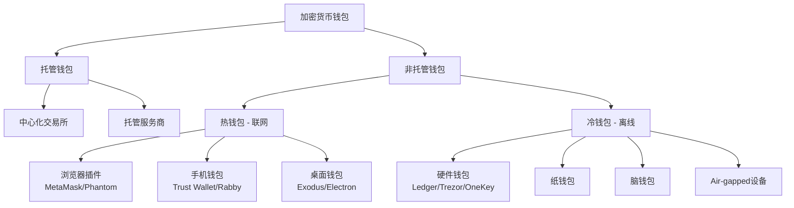
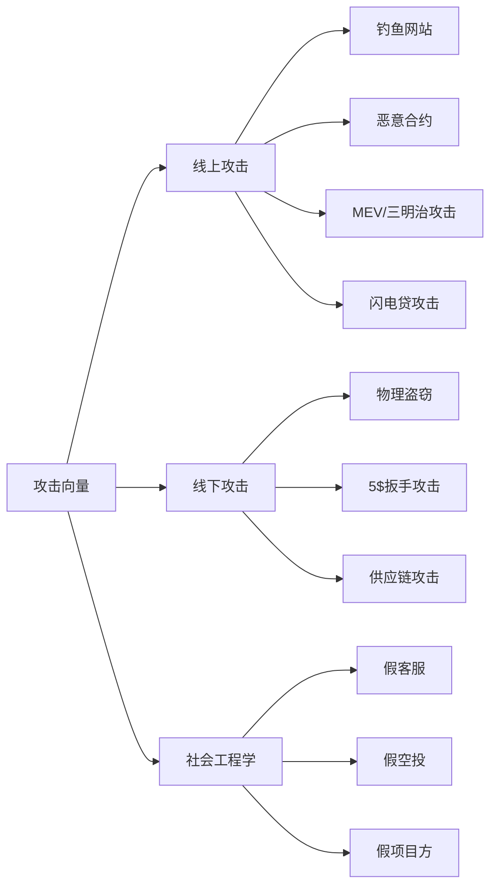

## 十、加密货币的安全存储技术

加密货币的核心特性是"私钥即资产"——谁掌握了私钥，谁就拥有对应地址上的全部资金。这与银行账户截然不同：银行可以冻结你的账户，也可以帮你找回密码，但在区块链上没有客服电话，没有密码重置入口，私钥一旦丢失或被盗，资产将永久丧失。因此，安全存储不是可选项，而是参与加密货币世界的生存技能。

### 10.1 核心概念：理解密钥体系

#### 10.1.1 私钥与公钥的数学关系

加密货币的安全性建立在椭圆曲线密码学（Elliptic Curve Cryptography, ECC）之上。以比特币和以太坊使用的 secp256k1 曲线为例：

- **私钥**：一个 256 位的随机数，通常表示为 64 个十六进制字符。例如：`3a1076bf45ab87712ad64ccb3b10217737f7faacbf2872e88fdd9a537d8fe266`
- **公钥**：由私钥通过椭圆曲线点乘运算生成。这个运算是**单向的**——从公钥反推私钥在计算上不可行（需要约 2^128 次操作）
- **地址**：由公钥经过 Keccak-256（以太坊）或双重 SHA-256 + RIPEMD-160（比特币）哈希后生成

```text
私钥 (256 bit)
    │  椭圆曲线点乘 (secp256k1)
    ▼
公钥 (512 bit, 压缩后 257 bit)
    │  Keccak-256 / SHA256 + RIPEMD160
    ▼
地址 (160 bit, 如 0x742d35Cc6634C0532925a3b844Bc9e7595f...)
```

**关键含义**：私钥是随机数，不依赖任何外部系统生成。这意味着你可以在完全离线的环境中生成私钥，从而从根源上杜绝网络攻击。

#### 10.1.2 助记词（BIP-39）与分层确定性钱包（BIP-32/44）

直接管理原始私钥既困难又危险。现代钱包系统通过两个关键标准简化了密钥管理：

**BIP-39 助记词**：将 128-256 位的随机熵（entropy）映射为人类可读的单词序列。

| 熵长度 | 助记词数量 | 安全强度 | 应用场景 |
|---------|-----------|---------|---------|
| 128 bit | 12 词 | 2^128 种可能 | 个人日常使用 |
| 160 bit | 15 词 | 2^160 种可能 | 高净值存储 |
| 192 bit | 18 词 | 2^192 种可能 | 机构级存储 |
| 224 bit | 21 词 | 2^224 种可能 | 极端安全需求 |
| 256 bit | 24 词 | 2^256 种可能 | 军事/国家级安全 |

从 12 词到 24 词的安全性提升：12 词已是 2^128 种可能，穷举所需能量超过太阳的总输出。对于个人用户，12 词助记词已经足够安全，24 词提供的是心理安慰而非实际安全增量。

**BIP-32 分层确定性（HD）钱包**：从单一种子（seed）派生出无限数量的子密钥对。派生路径遵循 BIP-44 规范：

```text
m / purpose' / coin_type' / account' / change / address_index
```

常见币种的 `coin_type` 值：

| 币种 | coin_type | 完整路径示例 |
|------|-----------|-------------|
| Bitcoin | 0 | m/44'/0'/0'/0/0 |
| Ethereum | 60 | m/44'/60'/0'/0/0 |
| Solana | 501 | m/44'/501'/0'/0' |
| Polygon | 966 | m/44'/966'/0'/0/0 |

**实用意义**：一套助记词可以管理所有链上所有地址的资产，无需为每条链单独备份私钥。

### 10.2 钱包类型全景



#### 10.2.1 托管钱包 vs 非托管钱包

| 维度 | 托管钱包 | 非托管钱包 |
|------|---------|-----------|
| 私钥控制 | 平台持有 | 用户持有 |
| 安全责任 | 平台负责 | 用户负责 |
| 资产恢复 | 可通过客服 | 只能靠自己 |
| 监管风险 | 账户可能被冻结 | 无此风险 |
| 典型场景 | 交易所账户 | MetaMask、Ledger |
| 适合人群 | 新手/频繁交易 | 重视自主权的用户 |

**"Not your keys, not your coins"** 这句话在 FTX 暴雷（2022 年 11 月，约 80 亿美元用户资金被挪用）后成为行业共识。但这不意味着所有人都应该自托管——自托管的风险在于你自己犯错时没有救济途径。正确的做法是根据资产规模和使用频率选择合适方案。

#### 10.2.2 热钱包深度解析

热钱包指私钥存储在联网设备上的钱包。常见实现方式：

**浏览器插件钱包（以 MetaMask 为例）**：
- 私钥加密存储在浏览器的 `chrome.storage.local` 中
- 使用用户设定的密码进行 AES-256-GCM 加密
- 风险点：浏览器扩展被恶意替换、恶意网站通过 `eth_requestAccounts` 诱导签名、clipboard 篡改（恶意软件替换剪贴板中的地址）

**手机钱包**：
- 私钥存储在手机的安全区域（iOS Keychain / Android Keystore）
- 相比浏览器钱包，手机的沙箱隔离更严格
- 风险点：手机丢失、恶意 App 读取剪贴板、root/越狱设备

**桌面钱包**：
- 私钥存储在本地文件系统（如 `~/.bitcoin/wallet.dat`）
- 通常提供更完整的节点功能
- 风险点：恶意软件直接读取钱包文件、勒索软件加密钱包文件

#### 10.2.3 冷钱包深度解析

冷钱包的私钥从未接触过互联网，通过物理隔离实现安全。

**硬件钱包**：

硬件钱包的核心是安全芯片（Secure Element, SE），其设计目标是即使设备被物理拆解，也无法提取私钥。

主流硬件钱包对比：

| 产品 | 安全芯片 | 开源程度 | 连接方式 | 价格区间 | 支持币种 |
|------|---------|---------|---------|---------|---------|
| Ledger Nano X | ST33J2M0 (CC EAL5+) | 固件闭源 | USB/蓝牙 | ¥500-800 | 5500+ |
| Trezor Model T | STM32F427 (无SE) | 完全开源 | USB | ¥1200-1800 | 1800+ |
| Trezor Safe 3 | STM32F427 + SE | 完全开源 | USB | ¥500-700 | 8000+ |
| OneKey Classic | ATECC608A | 完全开源 | USB | ¥300-500 | 1000+ |
| Keystone 3 Pro | 全开源SE方案 | 完全开源 | QR码(气隙) | ¥600-900 | 5500+ |

**关键安全事件**：
- Ledger 数据泄露（2020 年 12 月）：27 万用户个人信息泄露，虽未影响设备安全，但多名用户遭遇钓鱼攻击和社会工程学攻击
- 教训：硬件钱包的安全性不仅是设备本身，还包括你的操作习惯和信息安全意识

**纸钱包**：将私钥和地址打印或手写在纸上。曾经流行，但现在不推荐，因为：
- 生成过程通常在联网电脑上完成（已被入侵风险）
- 纸张容易损坏（水、火、霉变）
- 使用时需要导入私钥到热钱包，无法实现"冷签"
- 无法方便地管理多个地址

### 10.3 私钥管理的实操方案

#### 10.3.1 助记词备份的正确方法

**不锈钢助记词板**：使用金属板刻印助记词，可防火（耐温 1400°C+）、防水、防腐蚀。主流产品：

| 产品 | 材质 | 耐火温度 | 操作方式 | 价格 |
|------|------|---------|---------|------|
| Billfodl | 316不锈钢 | 1400°C | 字母滑块 | ¥400-600 |
| Cryptosteel Capsule | 304不锈钢 | 1400°C | 字母片卷入 | ¥300-500 |
| ColdTi | 钛合金 | 1668°C | 刻印 | ¥200-400 |
| 自制方案 | 不锈钢板+刻字笔 | 1200°C+ | 手动刻字 | ¥50-100 |

**分片存储策略**：不要将完整助记词存放在一个地点。采用地理分散的方式：

```text
示例：12词助记词分3个地点存储

地点 A（家中保险箱）：词 1-8 + 词 12
地点 B（银行保险柜）：词 1-4 + 词 9-12
地点 C（亲属家保险箱）：词 5-12

任意两个地点合在一起即可恢复完整助记词。
单个地点泄露无法还原钱包。
```

注意：这不是 Shamir's Secret Sharing（SSS），而是简单的冗余分片。SSS 是密码学方案，将秘密拆成 N 份，任意 K 份即可恢复，更灵活但更复杂。

#### 10.3.2 多重签名方案

多重签名（Multisig）要求 M-of-N 个私钥共同签名才能授权交易。这是机构和高净值个人的标准安全方案。

**比特币原生 Multisig**（基于 P2SH/P2WSH）：

```text
典型配置：2-of-3 多签

签名者 A：硬件钱包 (Ledger)
签名者 B：硬件钱包 (Trezor)
签名者 C：离线设备 (备份)

需要 A+B 或 A+C 或 B+C 才能签署交易。
单个设备被盗或丢失不影响资金安全。
```

**以太坊智能合约钱包**（如 Safe，前 Gnosis Safe）：

Safe 是以太坊生态中最广泛使用的多签钱包，管理超过 1000 亿美元资产。其优势包括：
- 可设定灵活的签名阈值和审批策略
- 支持交易批量执行
- 支持模块化扩展（社交恢复、定时转账等）
- 完全开源，经过多次审计

```solidity
// Safe 的 owner 配置示例（简化）
address[] owners = [
    0xOwner1_Ledger,    // 日常签名 - 硬件钱包
    0xOwner2_Phone,     // 移动签名 - 手机钱包
    0xOwner3_Cold       // 备份签名 - 离线设备
];
uint threshold = 2;     // 2/3 多签
```

#### 10.3.3 社交恢复机制

Vitalik Buterin 强烈推荐的方案，尤其适合普通用户。原理是设定多个"守护人"（guardian），当丢失访问权时，守护人多数同意即可恢复控制权。

**实现方式**：
- **智能合约钱包**（如 Argent、Safe + Recovery Module）：守护人在链上投票确认恢复请求
- **Shamir 助记词**（如 Trezor Model T 支持）：将助记词拆分为 N 份，任意 K 份可恢复
- **加密碎片云存储**：将加密后的助记词碎片分发给信任的人

**社交恢复的风险管理**：

```text
✅ 推荐：5 个守护人，阈值 3
   - 2 个是你的密友/家人（不同城市）
   - 1 个是你自己的另一个设备
   - 1 个是专业守护人服务
   - 1 个是机构级守护人

❌ 避免：
   - 守护人之间互相认识（串谋风险）
   - 所有守护人在同一地理区域（灾害风险）
   - 阈值设为 1（单点失败）
   - 守护人知道彼此身份（社会工程学攻击）
```

### 10.4 常见攻击向量与防御

#### 10.4.1 攻击分类



#### 10.4.2 钓鱼攻击详解

钓鱼是加密货币用户遭受损失最多的攻击类型。常见手法：

**恶意签名请求**：
- `eth_sign`：签署任意消息，攻击者可构造恶意交易数据
- `setApprovalForAll`：授权攻击者转走你所有的 NFT
- `approve`：授权攻击者转走你的 ERC-20 代币
- Permit（EIP-2612）：离线授权，无需 Gas 即可授权

**防御措施**：

```text
1. 永远不要签署你不理解的消息
2. 使用 Revoke.cash (revoke.cash) 定期检查和撤销授权
3. 使用 Rabby 等钱包的风险扫描功能（自动检测恶意签名请求）
4. 大额交易前在区块浏览器上验证合约地址
5. 使用硬件钱包时，仔细核对设备屏幕上的交易详情
6. 对"紧急"、"限时"、"最后机会"类信息保持高度警惕
```

**假网站识别**：

```text
真实网站: app.uniswap.org
钓鱼网站: app.uniswap-org.com     ← 注意横杠
钓鱼网站: app.uniswap.org.evil.com ← 子域名伪装
钓鱼网站: app.uniswap.org          ← 同形异义字 (homoglyph)
```

防御：使用书签访问 DeFi 站点，永远不通过搜索引擎结果、社交媒体链接或邮件链接直接访问。

#### 10.4.3 恶意合约攻击

恶意合约通常通过以下方式实施攻击：

**Approve 钓鱼合约**：看似正常的空投/奖励领取页面，实际调用的是 `approve(attacker, MAX_UINT256)`，一旦签名，攻击者即可转走你所有的对应代币。

**恶意代币**：攻击者创建一个代币并空投到你的地址。当你尝试在 DEX 上卖出时，合约会要求你先执行一笔授权操作，而这笔操作实际上是在授权攻击者。

**防范原则**：
- 不要与不明来源的代币交互
- 不要连接钱包到不信任的网站
- 使用模拟工具（如 Tenderly）预先模拟交易效果
- 设置合理的小额授权额度，避免 `MAX_UINT256` 授权

#### 10.4.4 供应链攻击

攻击者不直接攻击你，而是攻击你依赖的工具链：

- **Ledger Connect Kit 事件**（2023 年 12 月）：Ledger 的 npm 包 `@ledgerhq/connect-kit` 被入侵，注入恶意代码，直接窃取用户签名。影响使用 WalletConnect 连接的 dApp
- **防范**：使用硬件钱包时始终核对设备屏幕；及时更新安全补丁；关注官方安全公告

### 10.5 进阶安全方案

#### 10.5.1 Air-Gapped 设备签名

Air-gapped（气隙隔离）方案完全断绝设备的网络连接，通过二维码传递交易数据：

```text
工作流程：

1. 联网电脑：构建未签名交易 → 生成二维码
2. Air-gapped 设备：扫描二维码 → 用户确认 → 签名 → 生成签名二维码
3. 联网电脑：扫描签名二维码 → 广播交易到区块链

全过程中，私钥所在的设备从未接触网络。
```

支持此方案的设备：Keystone 3 Pro、AirGap Vault（旧手机改造）、SeedSigner（树莓派方案）。

**适用场景**：大额长期存储（>10 万美元）、机构级金库（Treasury）管理。

#### 10.5.2 Shamir's Secret Sharing（SSS）

SSS 是 Adi Shamir 在 1979 年提出的门限方案，将秘密拆分为 N 份，任意 K 份（K ≤ N）即可恢复，少于 K 份则完全无法获得任何信息。

```text
示例：(3, 5) 方案
- 将助记词拆分为 5 份
- 任意 3 份可以恢复完整助记词
- 2 份或更少无法获得任何信息（信息论安全）

分发方式：
Share 1 → 自己的保险箱
Share 2 → 银行保险柜
Share 3 → 父母家
Share 4 → 可信任的朋友
Share 5 → 异地亲属

即使任意 2 个地点被攻破，资金仍然安全。
```

实现工具：
- Trezor Model T / Safe 3：原生支持 SLIP-0039（SSS 的 BIP-39 版本）
- `ssss-split` / `ssss-combine`：Linux 命令行工具
- `silk`：Go 语言实现的 SLIP-0039 工具

#### 10.5.3 延时锁（Timelock）方案

通过智能合约实现时间延迟，在被盗后提供反应窗口：

```solidity
// 简化的延时锁逻辑
contract TimeLock {
    uint256 constant DELAY = 48 hours;
    mapping(bytes32 => uint256) public pendingOperations;

    function queueTransfer(address to, uint256 amount) external {
        bytes32 opId = keccak256(abi.encode(to, amount, block.timestamp));
        pendingOperations[opId] = block.timestamp + DELAY;
        // 48 小时后才能执行
    }

    function executeTransfer(address to, uint256 amount) external {
        bytes32 opId = keccak256(abi.encode(to, amount, ...));
        require(block.timestamp >= pendingOperations[opId], "Too early");
        // 执行转账
    }

    function cancelOperation(bytes32 opId) external {
        delete pendingOperations[opId];
        // 发现被盗时立即取消
    }
}
```

**实际应用**：Compound Finance 的治理 Timelock、Uniswap 的治理合约都使用此机制。个人用户可以通过 Safe + 时间锁模块实现类似效果。

### 10.6 安全存储的最佳实践清单

#### 10.6.1 按资产规模分级建议

| 资产规模 | 推荐方案 | 年度安全投入 |
|---------|---------|------------|
| < ¥1 万 | 手机非托管钱包（Trust Wallet）+ 云备份助记词 | ¥0 |
| ¥1 万 - 10 万 | 硬件钱包（Ledger/Trezor）+ 金属助记词板 | ¥500-1000 |
| ¥10 万 - 100 万 | 硬件钱包 + 2-of-3 多签 + 异地备份 | ¥2000-5000 |
| ¥100 万+ | 2-of-3 多签 + Air-gapped + SSS 分片 + 延时锁 | ¥5000-20000 |

#### 10.6.2 日常安全习惯

**必做项**：

```text
□ 所有新合约交互前检查合约地址（etherscan.io / solscan.io）
□ 定期检查授权状态（revoke.cash，每月一次）
□ 硬件钱包固件保持最新
□ 大额交易前先小额测试（发送 0.001 ETH 验证地址正确）
□ 助记词绝不拍照、不截屏、不存云端明文、不通过网络传输
□ 使用密码管理器管理交易所密码（推荐 Bitwarden / 1Password）
□ 启用所有账户的 2FA（优先使用硬件密钥 YubiKey，而非短信）
```

**禁忌项**：

```text
✗ 在任何地方输入助记词（除非恢复钱包）
✗ 与任何人分享私钥或助记词（"客服"不会问你要）
✗ 使用交易所默认密码或重复密码
✗ 点击社交媒体上的空投/奖励链接
✗ 在不信任的设备上连接钱包
✗ 将所有资产存放在单一地址或单一平台
```

#### 10.6.3 应急预案

建立应急计划，在发现安全事件时能快速响应：

```text
应急联系人清单（打印并存放在安全位置）：
1. 钱包服务商安全热线
2. 区块链安全公司联系方式（如 SlowMist、PeckShield）
3. 报警备案联系方式

应急操作流程：
1. 发现异常 → 立即将未受影响的资产转移到安全地址
2. 检查授权 → 撤销所有可疑授权（revoke.cash）
3. 证据保全 → 截图所有交易记录、合约交互记录
4. 报警备案 → 向当地警方报案，保存报案回执
5. 安全公司 → 联系专业团队追踪资金流向
6. 复盘改进 → 分析攻击路径，修补安全漏洞
```

### 10.7 常见误区与纠正

**误区 1：硬件钱包 100% 安全**

硬件钱包的安全性建立在两个假设之上：(1) 设备本身没有被篡改（供应链安全）；(2) 用户能正确识别恶意签名请求。如果用户在设备上确认了一笔恶意交易，硬件钱包无法保护你。硬件钱包防的是"私钥泄露"，不防"你主动授权给恶意合约"。

**误区 2：助记词分片越多越安全**

分片数量增加的是容灾能力，但同时也增加了泄露面。每多一个存储位置，就多一个潜在的攻击点。(3,5) 方案在安全性和容灾性之间取得了较好平衡。更重要的是，分片存储不是 SSS——简单的分割存储意味着每个分片都泄露了部分信息。

**误区 3：交易所很安全，不需要自托管**

交易所是高价值攻击目标。历史上重大交易所安全事件：Mt. Gox（2014，85 万 BTC）、Bitfinex（2016，12 万 BTC）、KuCoin（2020，2.81 亿美元）、FTX（2022，80 亿美元用户资金被挪用）。自托管的风险在于个人操作失误，交易所的风险在于平台系统性失败——两者需要权衡，而非二选一。

**误区 4：助记词存进密码管理器就安全了**

密码管理器保护的是密码（可以重置），助记词丢失意味着资产永久丢失。如果密码管理器被攻破（LastPass 2022 年数据泄露），你的助记词也随之泄露。助记词应该永远存在于物理介质上。

**误区 5：DeFi 协议审计过就安全**

审计报告只代表审计时的代码状态，不保证之后的更新没有引入漏洞。2022 年多个通过审计的协议仍然被攻击（如 Wormhole、Ronin Bridge）。审计是必要但不充分的条件。

### 10.8 安全存储技术的发展趋势

**账户抽象（Account Abstraction, ERC-4337）**：将钱包本身变成智能合约，支持社交恢复、批量交易、Gas 代付等高级功能，大幅降低自托管的门槛。以太坊生态正在快速推进。

**MPC 钱包（多方计算）**：将私钥拆分为多个分片，签名时多方协同计算，任何单一方都看不到完整私钥。兼顾了安全性（无单点失败）和易用性（无需管理助记词）。Fireblocks、ZenGo 等已在生产环境使用。

**Passkey 集成**：利用 WebAuthn/FIDO2 标准，将私钥存储在设备的安全硬件中（如手机的 Secure Enclave），通过生物识别解锁。用户体验接近 Web2，安全性接近硬件钱包。

```text
安全存储技术演进路线：

2009-2013  纸钱包 + Qt 钱包全节点
2013-2016  硬件钱包诞生 (Trezor/Ledger)
2016-2019  助记词标准化 (BIP-39) + HD 钱包普及
2019-2022  智能合约钱包 (Safe/Argent) + 多签
2022-2025  MPC 钱包 + 账户抽象 + Air-gapped
2025+      Passkey + 生物识别 + 去中心化社交恢复
```

加密货币安全存储的本质是一个风险管理问题：你需要在安全性（防丢失/被盗）、可用性（日常使用便捷性）和容灾性（故障恢复能力）之间找到适合自己的平衡点。没有完美的方案，只有最适合你资产规模、技术水平和使用习惯的方案。
