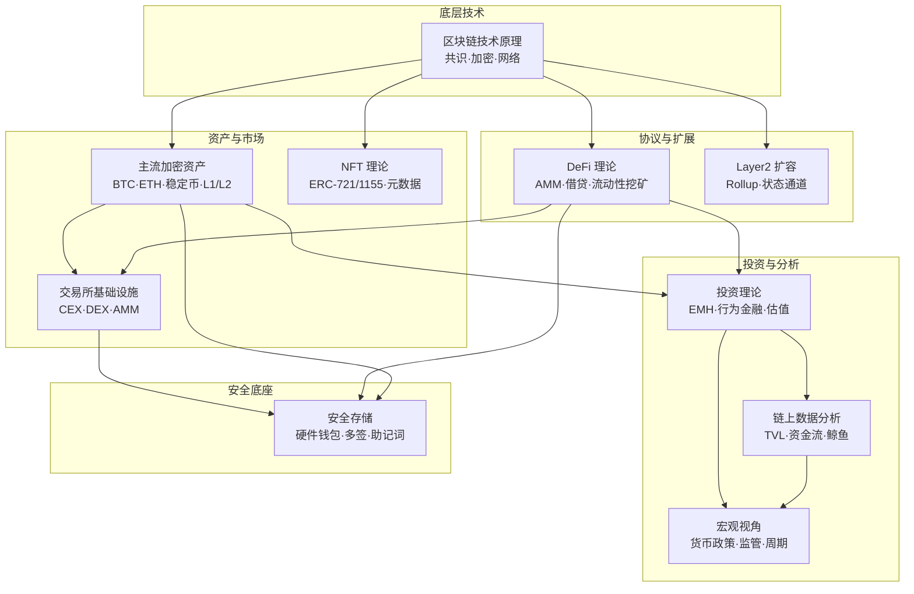
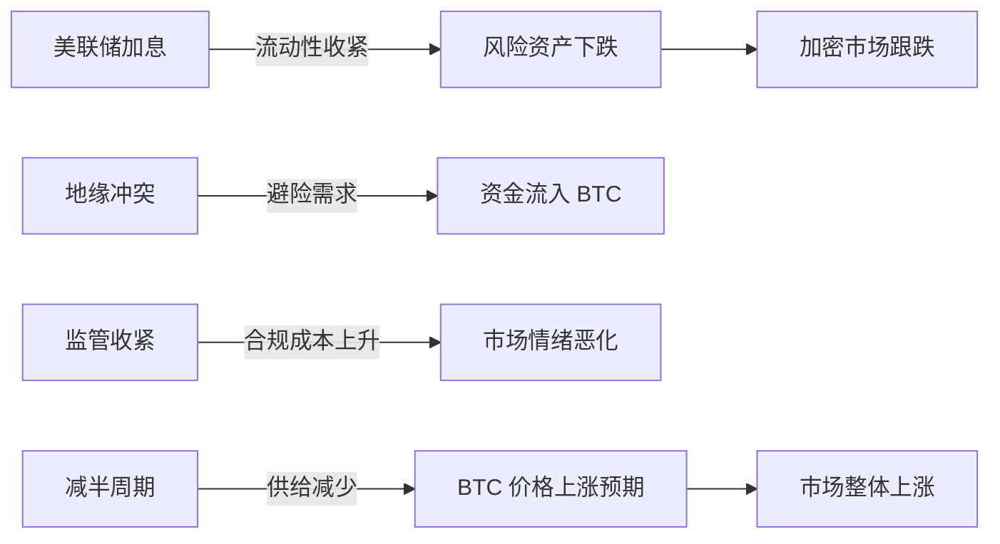
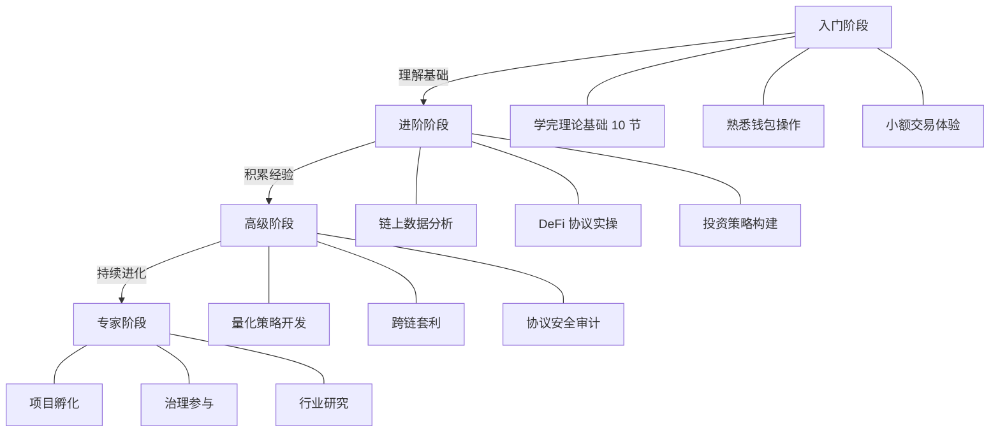

# 十一、本节总结

> 学完理论不总结，如同读完地图不出发——知道方向，却从未上路。

本节是"理论基础"部分的收官之作。前面十节分别从技术原理、资产分类、基础设施、投资理论、DeFi 协议、NFT 生态、扩容方案、链上分析、宏观视角和安全存储十个维度，构建了加密货币与 DeFi 的完整知识框架。本节将这十块拼图拼成一张全景图，帮你建立系统性认知，同时标注出后续实操章节需要重点强化的能力。

---

## 1. 知识体系全景回顾

### 1.1 十节内容纵览

下面这张表概括了每个核心知识点的定位、关键收获和后续关联：

| 节次 | 主题 | 核心定位 | 关键收获 | 后续关联 |
|------|------|----------|----------|----------|
| 第一节 | 区块链技术原理 | 地基 | 理解共识机制、加密哈希、默克尔树、P2P 网络 | 评判任何项目技术可信度的前提 |
| 第二节 | 主流加密资产分析 | 分类图谱 | BTC/ETH/稳定币/L1-L2/DeFi 代币的价值逻辑 | 资产筛选和配置的基础 |
| 第三节 | 交易所基础设施 | 交易入口 | CEX 与 DEX 的运作机制、订单簿 vs AMM、费率结构 | 实操交易和套利策略的前提 |
| 第四节 | 加密货币投资理论 | 决策框架 | 有效市场假说、行为金融学、链上估值模型 | 制定投资策略和风控规则的底层逻辑 |
| 第五节 | DeFi 理论基础 | 协议层 | AMM、借贷池、流动性挖矿、治理代币模型 | DeFi 实操（提供流动性、借贷、质押） |
| 第六节 | NFT 理论基础 | 非同质化资产 | ERC-721/1155 标准、元数据、版税机制、估值方法 | NFT 铸造、交易、策略 |
| 第七节 | Layer2 与扩容技术 | 性能层 | Rollup（Optimistic/ZK）、状态通道、侧链对比 | 降低交易成本、选择 L2 网络 |
| 第八节 | 链上数据分析基础 | 信息优势 | 活跃地址、TVL、资金流向、鲸鱼追踪 | 链上研判和时机选择 |
| 第九节 | 加密货币的宏观视角 | 周期判断 | 货币政策、监管动态、地缘政治对加密市场的影响 | 大周期仓位管理 |
| 第十节 | 安全存储技术 | 资产保护 | 热/冷钱包、硬件钱包、多签、助记词管理 | 所有实操的前置安全措施 |

### 1.2 知识结构关系图



---

## 2. 核心概念速查

### 2.1 技术层关键概念

| 概念 | 一句话解释 | 重要程度 |
|------|-----------|----------|
| **共识机制** | 网络参与者就账本状态达成一致的规则（PoW/PoS/DPoS） | ★★★★★ |
| **哈希函数** | 将任意数据映射为固定长度输出的单向函数，是区块链不可篡改性的基础 | ★★★★★ |
| **默克尔树** | 二叉哈希树结构，高效验证大量交易数据的完整性 | ★★★★ |
| **智能合约** | 部署在区块链上的自动执行程序，是 DeFi/NFT/DAO 的基础设施 | ★★★★★ |
| **EVM** | 以太坊虚拟机，智能合约的运行环境，已成为行业标准 | ★★★★ |
| **Gas** | 执行链上操作的计算费用，直接关系到使用成本 | ★★★★ |

### 2.2 资产层关键概念

| 概念 | 一句话解释 | 重要程度 |
|------|-----------|----------|
| **比特币（BTC）** | 总量 2100 万枚的数字黄金，PoW 共识，价值存储叙事 | ★★★★★ |
| **以太坊（ETH）** | 智能合约平台原生代币，PoS 共议，DeFi 生态核心 | ★★★★★ |
| **稳定币** | 锚定法币的加密资产（USDT/USDC/DAI），交易和 DeFi 的流动性基石 | ★★★★★ |
| **治理代币** | 持有者对协议参数有投票权，如 UNI、AAVE、MKR | ★★★★ |
| **LSD（流动性质押衍生品）** | 质押 ETH 后获得的流动性凭证（如 stETH），兼具收益和流动性 | ★★★★ |

### 2.3 DeFi 层关键概念

| 概念 | 一句话解释 | 重要程度 |
|------|-----------|----------|
| **AMM（自动做市商）** | 用数学公式（x*y=k）替代订单簿的交易机制 | ★★★★★ |
| **TVL（总锁仓价值）** | 锁定在协议中的资产总量，衡量协议规模的核心指标 | ★★★★ |
| **流动性挖矿** | 向协议提供流动性以获取代币奖励的收益策略 | ★★★★ |
| **闪电贷** | 无需抵押的即时贷款，必须在同一交易内还清，用于套利和清算 | ★★★★ |
| **无常损失** | 提供流动性时因价格变动导致的相对持有损失，是 LP 的核心风险 | ★★★★★ |
| **清算** | 抵押品价值跌破阈值时被强制卖出，借贷协议的核心风控机制 | ★★★★ |

### 2.4 分析层关键概念

| 概念 | 一句话解释 | 重要程度 |
|------|-----------|----------|
| **链上活跃地址数** | 反映网络真实使用情况的基本指标 | ★★★★ |
| **资金流向** | 交易所净流入/流出，反映市场买卖压力 | ★★★★ |
| **MVRV 比率** | 市值/已实现市值，判断市场整体高估或低估 | ★★★★ |
| **NUPL** | 未实现净盈亏，衡量持币者的整体盈亏状态 | ★★★★ |
| **鲸鱼追踪** | 监控大额持仓地址的买卖行为，预判市场方向 | ★★★★ |

---

## 3. 核心原理总结

### 3.1 区块链的信任革命

传统金融的核心矛盾是**信任成本**：你需要银行、交易所、审计机构、监管部门来保证交易安全。这些中介消耗了全球 GDP 的 7-10%。

区块链用数学和密码学替代了制度信任：

- **哈希函数**保证数据不可篡改
- **共识机制**保证去中心化的一致性
- **智能合约**保证规则的自动执行

这意味着：两个互不相识的人，可以在没有任何中介的情况下完成可信交易。这不是技术优化，而是**信任范式的转移**。

### 3.2 加密资产的价值逻辑

不同类型的加密资产有完全不同的价值来源：

| 资产类型 | 价值来源 | 类比 | 风险特征 |
|----------|----------|------|----------|
| BTC | 稀缺性+网络效应+共识 | 数字黄金 | 波动大，但长期趋势向上 |
| ETH | 平台使用价值+Gas 费+质押收益 | 数字石油 | 受生态发展和竞争影响 |
| 稳定币 | 法币储备+算法机制 | 数字美元 | 脱锚风险（UST 崩盘教训） |
| DeFi 代币 | 协议收入+治理权 | 协议股权 | 受协议 TVL 和收入驱动 |
| NFT | 稀缺性+社区+实用性 | 数字收藏品 | 流动性极差，估值主观 |

### 3.3 DeFi 的范式创新

DeFi 不是"把传统金融搬到链上"，而是用代码重构金融基础设施：

- **无许可**：任何人无需开户即可参与
- **可组合**：不同协议像乐高一样组合（DeFi Lego）
- **透明**：所有交易链上可查
- **非托管**：资产始终在用户钱包中

但 DeFi 也引入了新的风险维度：智能合约漏洞、预言机操纵、治理攻击、流动性枯竭。理解这些风险是安全参与的前提。

### 3.4 周期与宏观的共振

加密市场不是孤立系统，它与全球宏观环境深度耦合：



关键周期规律：
- **比特币减半周期**（约 4 年）：历史上减半后 12-18 个月出现牛市
- **货币政策周期**：美联储加息/降息对加密市场有直接传导
- **监管周期**：重大监管政策（如 ETF 获批）可引发结构性行情
- **技术周期**：重大升级（如 ETH 合并）可改变资产基本面

---

## 4. 关键指标速查

### 4.1 链上健康指标

| 指标 | 健康范围 | 警戒信号 | 数据来源 |
|------|----------|----------|----------|
| 活跃地址数 | 稳定或增长 | 持续下降 >30 天 | Glassnode / Dune |
| TVL | 与市值匹配 | TVL 暴跌但币价未跌 | DefiLlama |
| 交易所净流出 | 持续流出 | 大量流入（抛售信号） | CryptoQuant |
| 矿工收入 | 正常区间 | 极端低值（矿工投降） | Blockchain.com |
| MVRV 比率 | 1.0-2.5 | >3.5（极度高估） | LookIntoBitcoin |

### 4.2 投资决策指标

| 指标 | 用途 | 优秀水平 | 参考区间 |
|------|------|----------|----------|
| 夏普比率 | 风险调整后收益 | >1.5 | 加密资产通常 0.5-1.2 |
| 最大回撤 | 最坏情况损失 | <30% | BTC 历史最大回撤 ~83% |
| 波动率 | 价格波动幅度 | <50% 年化 | BTC 约 60-80% 年化 |
| 相关性 | 资产分散程度 | <0.3 | 加密资产间相关性普遍较高 |
| 费率消耗 | 交易和 Gas 成本 | <收益的 10% | 频繁交易者容易忽视 |

### 4.3 安全检查指标

| 检查项 | 标准 | 常见疏漏 |
|--------|------|----------|
| 钱包类型 | 大额用冷钱包，小额用热钱包 | 所有资产放交易所 |
| 助记词存储 | 离线、多地、加密备份 | 截图保存在手机相册 |
| 合约审计 | 参与前查审计报告 | 盲目追新合约 |
| 授权管理 | 定期撤销不必要的授权 | 无限授权后忘记撤销 |
| 多签配置 | 大额操作需多人签名 | 单点私钥风险 |

---

## 5. 认知框架总结

### 5.1 投资者常见认知陷阱

| 陷阱 | 表现 | 纠正方法 |
|------|------|----------|
| **FOMO（错失恐惧）** | 看到暴涨就追高 | 建立规则化的入场机制，拒绝情绪交易 |
| **锚定效应** | 以买入价作为卖出参考 | 以当前基本面而非成本价做决策 |
| **确认偏误** | 只看支持自己观点的信息 | 主动寻找反对论据，设置止损纪律 |
| **沉没成本** | 亏损后不愿割肉 | 每笔投资独立评估，不考虑已亏金额 |
| **幸存者偏差** | 只看到暴富案例 | 统计全部参与者收益，而非只看赢家 |
| **叙事谬误** | 被宏大故事吸引而忽视数据 | 所有判断必须有链上数据支撑 |
| **过度自信** | 连续盈利后加大仓位 | 仓位管理不因近期表现改变 |

### 5.2 风险管理原则

```text
1. 永远不要投入超过你能承受全部亏损的资金
2. 单一资产仓位不超过总资产的 20%
3. 杠杆倍数不超过 3 倍（新手不碰杠杆）
4. 每笔交易必须有明确的入场理由、止盈位和止损位
5. 分批建仓，分批止盈，不试图抄底逃顶
6. 交易所资产不超过总资产的 20%（"Not your keys, not your coins"）
7. 新合约/新协议先小额测试，确认安全后再加大投入
8. 定期审计自己的链上授权，撤销不必要的 approve
```

### 5.3 学习路径建议



---

## 6. 理论到实操的桥梁

### 6.1 下一阶段的知识衔接

理论基础部分结束后，实操部分将覆盖以下核心能力：

| 实操领域 | 依赖的理论基础 | 核心技能 |
|----------|----------------|----------|
| 钱包与安全 | 区块链原理 + 安全存储 | 创建钱包、管理助记词、硬件钱包使用 |
| 交易实操 | 交易所 + 投资理论 | CEX/DEX 交易、限价单、止盈止损 |
| DeFi 操作 | DeFi 理论 + 链上分析 | 提供流动性、借贷、质押、收益聚合 |
| NFT 策略 | NFT 理论 + 行为金融 | 铸造、二级市场交易、社区判断 |
| 链上研究 | 链上分析 + 宏观视角 | 使用 Dune/Glassnode、构建看板 |
| 风控系统 | 投资理论 + 宏观视角 | 仓位管理、组合构建、周期判断 |

### 6.2 工具清单

| 用途 | 推荐工具 | 费用 | 适用阶段 |
|------|----------|------|----------|
| 钱包 | MetaMask / Rabby / Phantom | 免费 | 入门 |
| 硬件钱包 | Ledger / Trezor / Keystone | ¥500-2000 | 进阶 |
| 链上数据 | Dune Analytics / DefiLlama | 免费/付费 | 进阶 |
| 交易所 | Binance / OKX / Coinbase | 交易手续费 | 入门 |
| DEX 聚合器 | 1inch / Paraswap / Jupiter | Gas 费 | 进阶 |
| 投资组合追踪 | DeBank / Zapper / Zerion | 免费 | 入门 |
| 安全审计 | Rekt.news / DeFi Safety / SlowMist | 免费 | 进阶 |
| 宏观分析 | TradingView / CoinGlass / Glassnode | 免费/付费 | 高级 |

---

## 7. 本章核心收获

完成"理论基础"全部内容后，你应该具备以下能力：

**认知层面：**
- 能够用通俗语言向非技术人员解释区块链为什么重要
- 能够区分不同加密资产的价值来源和风险特征
- 能够识别常见的投资认知陷阱并建立应对机制

**分析层面：**
- 能够阅读一份项目白皮书并提取关键技术信息
- 能够使用链上数据判断市场情绪和资金流向
- 能够从宏观角度理解加密市场的周期性波动

**判断层面：**
- 能够评估一个 DeFi 协议的基本安全性（审计、TVL、团队）
- 能够判断一个 NFT 项目的合理估值范围
- 能够根据自身风险承受能力制定资产配置方案

**安全层面：**
- 理解"不是你的私钥，就不是你的币"的深层含义
- 掌握钱包安全存储的基本原则和操作方法
- 了解常见攻击手法（钓鱼、Rug Pull、闪电贷攻击）的防范措施

> **最重要的一点：理论是地图，不是目的地。** 真正的投资能力只能在市场中锤炼，但有理论指引的投资者至少知道自己在哪里、要去哪里、以及如何避开已知的陷阱。

下一章我们将进入实操环节，从创建第一个钱包开始，把理论知识转化为可执行的投资技能。
