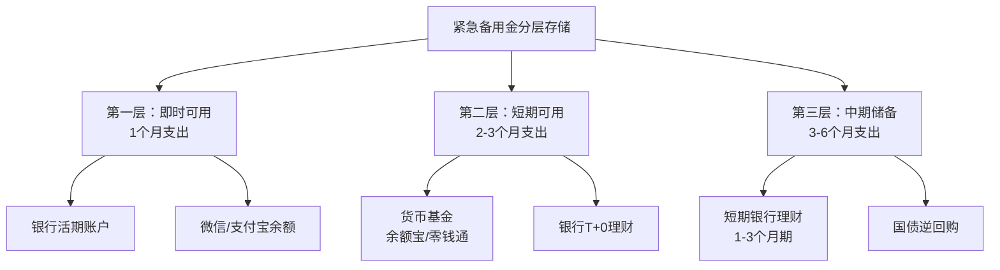
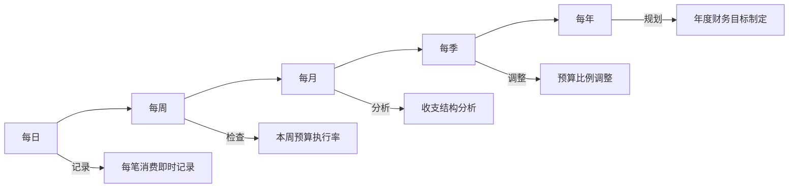
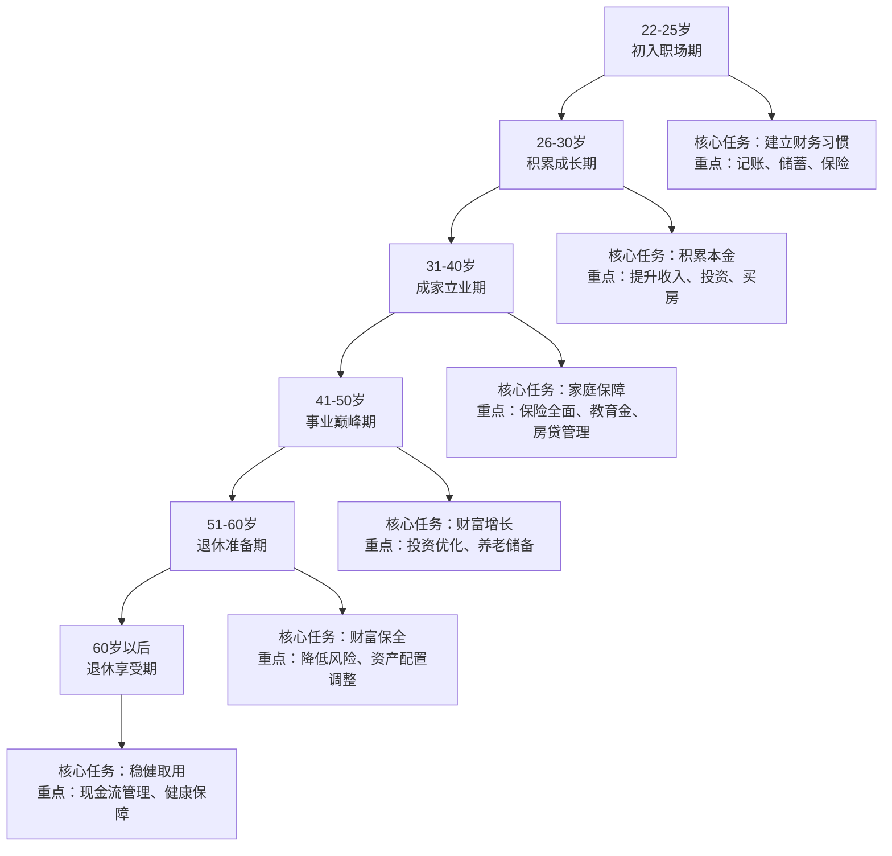
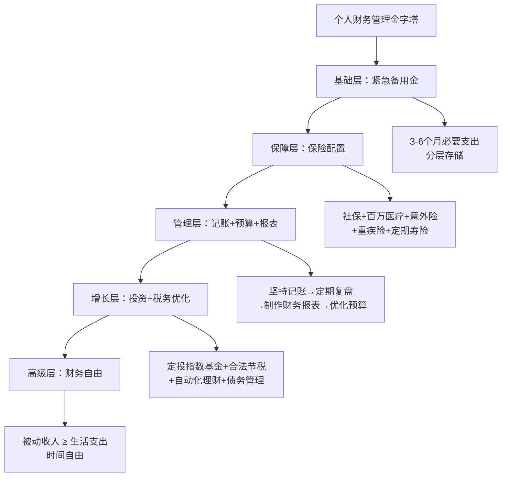

# 第十三章：个人财务管理工具

> "不能衡量的东西，就无法管理。" —— 彼得·德鲁克

个人财务管理是搞钱的基础。无论你月入五千还是月入五万，如果不清楚自己的钱从哪里来、到哪里去，财富增长就无从谈起。本章将从"道法术器"四个层面展开：先讲理财的底层逻辑（道），再讲系统化的方法论（法），接着给出可落地的操作模板（术），最后推荐趁手的工具（器）。内容覆盖记账、预算、财务报表、税务筹划、保险规划、信用管理、债务管理、紧急备用金、自动理财、行为金融、家庭财务、人生阶段规划和数字金融安全共十三个主题，力求为不同阶段的读者提供完整、可执行的个人财务管理框架。

***

## 13.1 紧急备用金：财务安全的第一道防线

在讨论任何投资或理财策略之前，必须先解决一个最基础的问题：如果明天突然失业、生病或遇到意外，你能撑多久？

### 13.1.1 为什么必须建立紧急备用金

紧急备用金（Emergency Fund）是指专门留出、用于应对突发事件的流动资金。美联储2023年发布的《美国家庭经济状况调查》显示，37%的美国成年人无法在不借钱的情况下应对400美元的紧急支出。中国的情况虽然因高储蓄率而略好，但支付宝2022年发布的《中国家庭理财报告》指出，约45%的家庭没有专门的应急储备。

紧急备用金的核心作用体现在三个方面：

- **缓冲失业风险**：即使拥有稳定工作，行业周期性裁员、公司倒闭、岗位调整都可能导致收入中断。智联招聘数据显示，2023年职场人平均求职周期为4.2个月，中高层岗位更长。
- **覆盖突发医疗支出**：虽然有医保覆盖，但重大疾病中的自费部分、进口药品、康复费用往往需要数万甚至数十万元。
- **避免被迫低价变现资产**：没有应急资金时，遇到急需用钱只能被迫在不利时机卖出股票、基金，甚至亏本出售资产。

### 13.1.2 存多少：紧急备用金的计算方法

紧急备用金的标准金额取决于两个变量：月必要支出和收入稳定性。

**计算公式**：

```text
紧急备用金 = 月必要支出 × 保障月数
```

**月必要支出**是指维持基本生活所需的最低开销，包括：房租/房贷、水电物业、基本餐饮、交通通讯、保险费用、最低还款额。不包括娱乐、旅游、非必要购物。

**保障月数的确定标准**：

| 收入类型 | 建议保障月数 | 原因 |
|---------|------------|------|
| 公务员/事业编 | 3个月 | 收入极度稳定，失业风险极低 |
| 大企业正式员工 | 6个月 | 相对稳定，但存在裁员可能 |
| 中小企业员工 | 6-9个月 | 稳定性一般，需要更多缓冲 |
| 自由职业/创业者 | 9-12个月 | 收入波动大，需要更多储备 |
| 高度季节性行业 | 12个月 | 淡旺季差异明显，需要更长缓冲 |

**实际案例**：假设你在北京工作，月必要支出8000元，是一家互联网公司的正式员工（建议6个月），则紧急备用金目标为：

```text
8000元 × 6个月 = 48,000元
```

如果家庭有双收入来源，可以适当降低到3-4个月；如果家庭只有单一收入来源，则应提高到8-12个月。

### 13.1.3 存哪里：紧急备用金的存放策略

紧急备用金的核心要求是"安全、流动性强、收益高于活期"。存放策略遵循"分层存储"原则：



**第一层（即时可用）**：存放1个月的必要支出金额。放在银行活期账户或支付宝/微信余额中，确保随时可以刷卡或扫码支付。这一层不追求收益，只追求即时可用性。

**第二层（短期可用）**：存放2-3个月的必要支出金额。放在货币基金（如余额宝、零钱通、朝朝宝）或银行T+0理财产品中。2024年货币基金年化收益率约1.5%-2%，虽然不高但远胜活期存款的0.2%，且T+0赎回可以在几分钟内到账。

**第三层（中期储备）**：存放3-6个月的必要支出金额。可以放在1-3个月期限的银行理财产品中，或者国债逆回购中。这些产品流动性略低（需要提前规划赎回），但收益相对更高。

### 13.1.4 常见误区

- **误区一："等有钱了再存"**。紧急备用金应当在开始任何投资之前建立。没有应急储备就去投资，一旦遇到紧急情况就被迫割肉，损失远大于不投资。
- **误区二："备用金越多越好"**。过多的现金储备意味着资金闲置，无法产生足够的投资收益。超过12个月的必要支出是浪费。
- **误区三："把投资账户当备用金"**。股票、基金的价值会波动，需要用钱时可能恰好处于亏损状态。备用金必须是低风险、保本的资产。
- **误区四："有了信用卡就不需要备用金"**。信用卡可以应急，但透支需要还款，且会产生利息。备用金是"花自己的钱"，信用卡是"花银行的钱"，两者的心理压力和财务成本完全不同。

***

## 13.2 财务目标设定：SMART框架

没有目标的财务管理就像没有目的地的航行。你需要一个清晰的框架来设定、追踪和达成财务目标。

### 13.2.1 SMART原则在财务中的应用

SMART是管理学中经典的目标设定框架，五个字母分别代表：Specific（具体）、Measurable（可衡量）、Achievable（可实现）、Relevant（相关）、Time-bound（有时限）。

将SMART原则应用到财务目标设定中：

| SMART要素 | 含义 | 错误示例 | 正确示例 |
|-----------|------|---------|---------|
| S - 具体 | 目标要明确，不能模糊 | "我要存钱" | "我要存够10万元购房首付" |
| M - 可衡量 | 有明确的数字指标 | "我要减少开支" | "我要将月支出从8000降到6500元" |
| A - 可实现 | 基于现实，不要好高骛远 | "我要一年存100万"（月薪1万） | "我要一年存5万元"（月薪1.5万） |
| R - 相关 | 与人生大方向一致 | "我要存钱买豪车"（实际需要买房） | "我要存够首付买房" |
| T - 有时限 | 有明确的截止日期 | "总有一天我要还清贷款" | "我要在2026年12月前还清车贷" |

### 13.2.2 财务目标的分类与时间维度

财务目标按时间维度分为三类：

**短期目标（1年以内）**：
- 建立紧急备用金
- 还清信用卡账单
- 存够旅行基金
- 购买某件特定物品

**中期目标（1-5年）**：
- 存够购房首付
- 还清车贷
- 积累10万元投资本金
- 建立子女教育基金的初始储备

**长期目标（5年以上）**：
- 实现财务自由（被动收入覆盖生活支出）
- 子女教育基金
- 退休养老储备
- 购买房产并还清贷款

### 13.2.3 目标分解与执行追踪

一个财务目标从设定到达成，需要经历"分解→执行→追踪→调整"的完整闭环。

**案例：三年存够20万购房首付**

```text
总目标：36个月内存够20万元
├── 年度分解
│   ├── 第1年：存6万元（月均5000元）
│   ├── 第2年：存7万元（月均5833元）——假设加薪
│   └── 第3年：存7万元（月均5833元）
├── 月度执行
│   ├── 发工资当天自动转存5000元到专用储蓄账户
│   ├── 每月15日检查消费预算
│   └── 每月底复盘实际存入金额
└── 季度调整
    ├── 如果连续3个月未达标：重新评估目标可行性
    ├── 如果提前达标：考虑提高目标或提前投资
    └── 如果收入变化：相应调整月存入金额
```

**执行工具推荐**：

- **记账App的预算功能**：随手记、钱迹等App可以设置月度预算和储蓄目标，自动追踪进度。
- **银行的定期自动转账**：设置工资到账后自动转入储蓄账户，实现"先储蓄后消费"。
- **Excel/Google Sheets追踪表**：每月记录进度，用图表可视化存款增长曲线。
- **日记本/备忘录**：简单但有效，每周写一行"本周存入X元，累计X元"。

***

## 13.3 记账工具与方法

### 13.3.1 记账的底层逻辑：为什么记账比投资更重要

很多人热衷于研究股票、基金、房产投资，却忽视了最基础的记账。实际上，对于大多数人来说，**控制支出比提高投资回报率更重要**。

举例说明：假设你月收入15000元，每月支出13000元，储蓄率仅13.3%。如果你通过记账发现每月有3000元的非必要支出（冲动购物、闲置订阅、频繁外卖），将支出降到10000元，储蓄率立刻提升到33.3%。这相当于你的储蓄能力提高了150%。而通过投资获得同等幅度的收益增长，需要找到年化收益率远超市场平均水平的投资机会，这对普通投资者几乎不可能。

**记账的核心价值**：

- **看清全貌**：大多数人不知道自己每月到底花了多少钱，记账能让模糊的消费印象变成精确的数字。
- **发现浪费**：记账3个月以上，你会发现大量"隐形支出"——自动续费的订阅、冲动购买后闲置的物品、高频小额消费。
- **建立预算**：有了历史数据才能制定合理的预算，没有数据支撑的预算只是空中楼阁。
- **追踪目标**：记账是实现储蓄目标的基础工具，没有记账就无法知道进度。

### 13.3.2 主流记账工具深度对比

选择记账工具的核心标准是：你愿意用它多久。一个功能再强大但你用两周就放弃的工具，不如一个功能简单但你能坚持用一年的工具。以下是四款主流工具的深度对比：

| 维度 | 随手记 | 挖财 | 钱迹 | MoneyWiz |
|------|--------|------|------|----------|
| **定位** | 综合财务管理 | 懒人自动记账 | 极简纯粹记账 | 专业级财务管理 |
| **界面复杂度** | 中等，功能入口多 | 中等，社区内容多 | 极简，上手极快 | 复杂，学习曲线陡 |
| **自动记账** | 支持银行卡导入 | 支持支付宝/银行卡自动导入 | 不支持，纯手动 | 支持银行同步（国际） |
| **多账本** | 支持，数量有限 | 支持 | 支持 | 支持，数量无限制 |
| **预算功能** | 支持月度预算 | 支持 | 支持，简洁好用 | 强大，支持自定义周期 |
| **报表分析** | 收支报表、趋势分析 | 详细报表、理财分析 | 基础报表，够用 | 专业报表，高度自定义 |
| **多币种** | 支持 | 支持 | 支持 | 原生支持，覆盖全球货币 |
| **投资跟踪** | 有限 | 支持理财产品管理 | 不支持 | 支持股票/基金/加密货币 |
| **数据导出** | 支持Excel导出 | 支持导出 | 支持CSV/Excel导出 | 支持多种格式导出 |
| **广告** | 有广告（免费版） | 有广告（免费版） | 无广告 | 无广告 |
| **价格** | 免费/198元/年高级版 | 免费/168元/年高级版 | 免费/98元/年高级版 | 免费/298元/年高级版 |
| **平台** | iOS/Android/网页 | iOS/Android/网页 | iOS/Android | iOS/Android/Mac/Windows |

**选型建议**：

- **记账新手**：从钱迹开始。它的界面最简洁，3秒完成一笔记录，没有花哨功能干扰，适合培养记账习惯。免费版无广告，体验流畅。等记账习惯稳定后再考虑是否需要更多功能。
- **懒人记账**：选择挖财。支持支付宝账单自动导入，你不需要每笔消费都手动记录，只需定期核对分类即可。适合觉得手动记账太麻烦的人。
- **家庭记账**：选择随手记。支持多人共享账本，夫妻可以各自记录、共同查看。预算管理功能也适合家庭开支控制。
- **有外币需求或投资跟踪**：选择MoneyWiz。它是唯一一款原生支持全球货币和投资账户跟踪的工具，适合有海外资产或经常出国的人。

### 13.3.3 记账方法论：收支分类与预算管理

**收支分类体系**：

一个好的分类体系应该满足三个条件：覆盖所有消费场景、层级不超过三级、符合你的思维习惯。以下是一个经过验证的通用分类框架：

**收入分类**：

| 一级分类 | 二级分类 | 说明 |
|---------|---------|------|
| 主动收入 | 工资薪金 | 税后到手工资、奖金、补贴、年终奖 |
| 主动收入 | 副业兼职 | 兼职收入、自由职业收入、稿费 |
| 被动收入 | 投资收益 | 利息、股息、基金分红、资本利得 |
| 被动收入 | 租金收入 | 房产出租收入 |
| 其他收入 | 非经常性收入 | 礼金、退款、理赔、中奖 |

**支出分类**：

| 一级分类 | 二级分类 | 说明 |
|---------|---------|------|
| 固定支出 | 居住成本 | 房租/房贷、物业费、维修基金 |
| 固定支出 | 通讯网络 | 手机话费、宽带 |
| 固定支出 | 保险费用 | 社保个人部分、商业保险 |
| 生活支出 | 餐饮食品 | 在家做饭、外卖、餐厅、零食饮料 |
| 生活支出 | 交通出行 | 公交地铁、打车、加油、停车 |
| 生活支出 | 日用百货 | 家居用品、清洁用品、个人护理 |
| 发展支出 | 学习成长 | 书籍、课程、培训、考试报名 |
| 发展支出 | 健康医疗 | 看病、药品、健身 |
| 享受支出 | 娱乐休闲 | 电影、游戏、旅游、兴趣爱好 |
| 享受支出 | 社交人情 | 聚餐、礼物、份子钱 |
| 享受支出 | 购物消费 | 服装、电子产品、家居装饰 |

**分类原则**：
- 不要超过三级分类，太细则记录成本高，太粗则无法分析。
- 第一次使用时参考以上框架，使用一个月后根据自己的实际消费习惯调整。
- 分类一旦确定，至少保持三个月不变，否则无法进行有效的趋势分析。

**预算制定方法——50/30/20法则的本土化改造**：

原版50/30/20法则是美国个人理财专家Elizabeth Warren提出的：50%用于必要支出，30%用于个人想要，20%用于储蓄和还债。但在高房价的中国一线城市，这个比例需要调整。

**一线城市版本（月入15000元为例）**：

```text
必要支出 55%（8250元）
├── 房租/房贷：4000元
├── 餐饮：2000元
├── 交通：500元
├── 通讯：200元
└── 水电物业：300元
保险支出 5%（750元）
├── 商业保险月均：500元
└── 社保补充：250元
个人想要 20%（3000元）
├── 娱乐休闲：1000元
├── 社交人情：800元
├── 购物消费：700元
└── 学习成长：500元
储蓄投资 20%（3000元）
├── 紧急备用金：1000元（如未建好）
├── 投资：1500元
└── 特定目标储蓄：500元
```

**二三线城市版本（月入10000元为例）**：

```text
必要支出 45%（4500元）
├── 房租/房贷：2000元
├── 餐饮：1200元
├── 交通：300元
├── 通讯：200元
└── 水电物业：200元
保险支出 5%（500元）
个人想要 25%（2500元）
├── 娱乐休闲：800元
├── 社交人情：700元
├── 购物消费：500元
└── 学习成长：500元
储蓄投资 25%（2500元）
├── 紧急备用金：800元
├── 投资：1200元
└── 特定目标储蓄：500元
```

### 13.3.4 零基预算法：进阶预算技术

零基预算（Zero-Based Budgeting）的核心思想是：每月的每一分钱都有明确的用途，收入减去支出等于零。不是"花光所有钱"，而是"每一分钱都有计划"——包括储蓄和投资。

**零基预算的执行步骤**：

1. **月初规划**：在每月第一天，将上月收入写在纸上。
2. **逐项分配**：从第一笔固定支出开始，逐项分配，直到每一分钱都有归属。
3. **优先级排序**：储蓄和投资优先于享受型消费（"先支付自己"原则）。
4. **月末检查**：如果有结余，分配到下个月的储蓄目标或投资中。

**案例**：月收入12000元的零基预算分配

```text
收入：12,000元
分配：
  - 储蓄/投资：2,400元（20%）    ← 第一个分配
  - 房租：3,500元
  - 餐饮：1,800元
  - 交通：400元
  - 通讯：200元
  - 水电物业：250元
  - 保险：400元
  - 学习：300元
  - 社交人情：600元
  - 娱乐休闲：800元
  - 日用百货：400元
  - 预留弹性：450元（应对意外支出）
  ───────────────
  总计：12,000元（分配完毕，余额为零）
```

### 13.3.5 定期复盘：从记账到财务洞察

记账本身不是目的，从记账数据中发现问题、优化决策才是目的。复盘的频率和深度决定了记账的价值。

**复盘框架**：



**月度复盘清单**：

1. **收入复盘**：本月总收入是多少？与预算相比如何？是否有额外收入来源可以开拓？
2. **支出复盘**：本月总支出是多少？哪些类别超预算？超支原因是刚需还是冲动消费？
3. **储蓄率复盘**：本月储蓄率是多少？是否达到20%的目标？如果没有，差距在哪里？
4. **异常消费检查**：有没有"幽灵消费"（自动续费的订阅、忘记取消的服务）？有没有重复购买的物品？
5. **趋势对比**：与上月相比如何？与去年同期相比如何？消费结构是否合理？

**复盘工具**：

- 记账App自带的报表功能是最便捷的复盘工具。
- 对于进阶用户，可以每月将数据导出到Excel/Google Sheets，制作趋势图表。
- 每年1月做一次年度总结，回顾过去一年的财务全貌。

***

## 13.4 个人财务报表制作

记账记录的是"流水"，财务报表反映的是"全貌"。就像企业需要三大财务报表一样，个人也需要定期制作自己的资产负债表和现金流量表。

### 13.4.1 个人资产负债表

个人资产负债表的核心公式是：

```text
净资产 = 总资产 - 总负债
```

净资产是你在某个时间点上真正"拥有"的财富。它是衡量个人财务状况最重要的单一指标。

**资产分类与估值方法**：

| 资产类别 | 具体项目 | 估值方法 | 流动性 |
|---------|---------|---------|--------|
| 现金类资产 | 手头现金、银行活期、定期存款 | 面值 | 极高 |
| 货币类资产 | 余额宝、零钱通、朝朝宝 | 当前市值 | 高（T+0或T+1） |
| 投资类资产 | 股票、基金、债券 | 当前市值 | 中高（T+1至T+3） |
| 固定资产（自用） | 自住房产 | 参考同小区近期成交价 | 低 |
| 固定资产（自用） | 自用车辆 | 参考二手车平台估价 | 低 |
| 固定资产（投资） | 投资性房产 | 参考市场评估价 | 低 |
| 其他资产 | 黄金、收藏品、加密货币 | 当前市场价 | 因品种而异 |
| 应收资产 | 别人欠你的钱 | 实际可收回金额（打折估算） | 不确定 |

**负债分类**：

| 负债类别 | 具体项目 | 记录金额 |
|---------|---------|---------|
| 短期负债 | 信用卡账单 | 未还金额 |
| 短期负债 | 消费分期 | 剩余未还本金 |
| 短期负债 | 亲友借款 | 借款余额 |
| 长期负债 | 住房贷款 | 剩余本金 |
| 长期负债 | 汽车贷款 | 剩余本金 |
| 长期负债 | 教育贷款 | 剩余本金 |

**实际案例：某28岁白领的资产负债表**

```text
                        个人资产负债表
                    编制日期：2024年12月31日

┌─────────────────────────────────────────────────────┐
│ 资产                          │ 金额（元）           │
├─────────────────────────────────────────────────────┤
│ 【现金类资产】                                      │
│   银行活期存款                │    15,000           │
│   手头现金                    │       500           │
│ 【货币类资产】                                      │
│   余额宝                      │    48,000           │
│ 【投资类资产】                                      │
│   股票账户                    │    85,000           │
│   基金账户                    │   120,000           │
│ 【固定资产】                                        │
│   自住房产（参考市价）         │ 2,000,000           │
│   自用车辆（参考二手价）       │    80,000           │
├─────────────────────────────────────────────────────┤
│ 资产合计                      │ 2,348,500           │
├─────────────────────────────────────────────────────┤
│ 负债                          │ 金额（元）           │
├─────────────────────────────────────────────────────┤
│ 【短期负债】                                        │
│   信用卡账单                  │     3,500           │
│ 【长期负债】                                        │
│   住房贷款（剩余本金）         │ 1,200,000           │
│   汽车贷款（剩余本金）         │    60,000           │
├─────────────────────────────────────────────────────┤
│ 负债合计                      │ 1,263,500           │
├─────────────────────────────────────────────────────┤
│ 净资产 = 2,348,500 - 1,263,500 = 1,085,000 元       │
└─────────────────────────────────────────────────────┘
```

**如何追踪净资产变化**：

建议每季度更新一次资产负债表。将四个季度的数据放在一起，观察净资产的增长趋势。如果你的净资产每年增长10%以上，说明你的财务状况在持续改善。

### 13.4.2 个人现金流量表

现金流量表记录的是一个时间段内（通常是一个月）的现金流入和流出。它回答的问题是："这个月，我的钱从哪来、到哪去、剩多少？"

```text
                个人月度现金流量表
              2024年12月

┌──────────────────────────────────────┐
│ 收入项目              │ 金额（元）    │
├──────────────────────────────────────┤
│ 工资薪金（税后）       │  15,000      │
│ 副业收入              │   2,000      │
│ 投资收益（利息/分红）  │     350      │
│ 其他收入              │       0      │
├──────────────────────────────────────┤
│ 收入合计              │  17,350      │
├──────────────────────────────────────┤
│ 支出项目              │ 金额（元）    │
├──────────────────────────────────────┤
│ 房贷月供              │   5,500      │
│ 餐饮食品              │   2,200      │
│ 交通出行              │     600      │
│ 通讯网络              │     200      │
│ 水电物业              │     350      │
│ 日用百货              │     400      │
│ 服装购物              │     800      │
│ 娱乐休闲              │   1,000      │
│ 社交人情              │     600      │
│ 学习成长              │     500      │
│ 医疗健康              │     200      │
│ 保险费用              │     400      │
│ 其他支出              │     300      │
├──────────────────────────────────────┤
│ 支出合计              │  13,050      │
├──────────────────────────────────────┤
│ 净现金流 = 17,350 - 13,050 = 4,300元  │
│ 月储蓄率 = 4,300 / 17,350 = 24.8%     │
└──────────────────────────────────────┘
```

### 13.4.3 财务健康指标体系

只有数据没有指标，就无法判断好坏。以下是衡量个人财务健康的核心指标：

| 指标名称 | 计算公式 | 健康标准 | 危险信号 |
|---------|---------|---------|---------|
| 储蓄率 | 月储蓄 / 月收入 × 100% | 20%以上 | 低于10% |
| 负债率 | 总负债 / 总资产 × 100% | 50%以下 | 超过70% |
| 流动性比率 | 流动资产 / 月支出 | 3-6个月 | 低于1个月 |
| 偿债比率 | 月还款额 / 月收入 × 100% | 40%以下 | 超过60% |
| 投资资产占比 | 投资资产 / 总资产 × 100% | 30%以上 | 低于10% |
| 被动收入占比 | 被动收入 / 总收入 × 100% | 逐步提高 | 长期为0 |

**指标解读**：

- **储蓄率**是最核心的指标。它直接决定了你积累财富的速度。储蓄率20%意味着你工作5年存下的钱等于1年的收入；储蓄率50%意味着工作5年存下2.5年的收入。
- **负债率**反映你的财务杠杆。适度负债（如房贷）是正常的，但如果负债率超过70%，说明你承担了过多的债务风险。
- **流动性比率**就是紧急备用金的量化指标。如果低于1个月，说明你的财务安全极其脆弱。
- **偿债比率**超过40%意味着你将近一半的收入用于还债，生活质量会严重下降。
- **被动收入占比**是通往财务自由的关键指标。当被动收入占比达到100%时，你就实现了财务自由。

***

## 13.5 税务筹划：合法节税的实战指南

税务筹划不是逃税，而是在法律框架内，通过合理安排收入和支出，降低税负。中国个人所得税制度相当复杂，但大多数工薪族并没有充分利用合法的节税工具。

### 13.5.1 个人所得税计算详解

中国个人所得税采用超额累进税率，综合所得（工资薪金、劳务报酬、稿酬、特许权使用费）适用以下税率表：

| 级数 | 全年应纳税所得额 | 税率 | 速算扣除数 |
|------|-----------------|------|-----------|
| 1 | 不超过36,000元 | 3% | 0 |
| 2 | 36,000-144,000元 | 10% | 2,520 |
| 3 | 144,000-300,000元 | 20% | 16,920 |
| 4 | 300,000-420,000元 | 25% | 31,920 |
| 5 | 420,000-660,000元 | 30% | 52,920 |
| 6 | 660,000-960,000元 | 35% | 85,920 |
| 7 | 超过960,000元 | 45% | 181,920 |

**应纳税所得额的计算**：

```text
应纳税所得额 = 年收入 - 60,000元（基本减除费用）- 专项扣除 - 专项附加扣除 - 其他扣除
```

其中：
- **基本减除费用**：每年60,000元（每月5,000元），所有人都可以扣除。
- **专项扣除**：社保和公积金的个人缴纳部分。
- **专项附加扣除**：见下文详解。
- **其他扣除**：商业健康保险（每年2,400元）、个人养老金（每年12,000元）等。

**实际计算案例**：

小王，月薪20,000元，五险一金个人部分每月4,000元，有一个子女（3岁），有首套房贷，独生子女赡养60岁老人。

```text
年收入 = 20,000 × 12 = 240,000元
基本减除费用 = 60,000元
专项扣除（五险一金）= 4,000 × 12 = 48,000元
专项附加扣除：
  - 子女教育 = 2,000 × 12 = 24,000元
  - 住房贷款利息 = 1,000 × 12 = 12,000元
  - 赡养老人 = 3,000 × 12 = 36,000元
专项附加扣除合计 = 72,000元

应纳税所得额 = 240,000 - 60,000 - 48,000 - 72,000 = 60,000元

应纳税额 = 60,000 × 10% - 2,520 = 3,480元

每月平均税负 = 3,480 / 12 = 290元
实际税负率 = 3,480 / 240,000 = 1.45%
```

如果没有利用专项附加扣除：

```text
应纳税所得额 = 240,000 - 60,000 - 48,000 = 132,000元
应纳税额 = 132,000 × 10% - 2,520 = 10,680元
实际税负率 = 10,680 / 240,000 = 4.45%
```

**仅通过填报专项附加扣除，小王每年就节省了7,200元的税款。**

### 13.5.2 专项附加扣除详解

专项附加扣除是国家给工薪族的合法节税工具，但由于信息不对称，很多人并没有充分利用。

| 扣除项目 | 每月扣除标准 | 条件 | 注意事项 |
|---------|------------|------|---------|
| 子女教育 | 每个子女2,000元 | 3岁至博士研究生 | 父母各50%或一方100% |
| 继续教育 | 400元/月或3,600元/年 | 学历教育400/月，职业资格3,600/年 | 在学期间或取证当年 |
| 大病医疗 | 超15,000部分，最高80,000/年 | 医保目录内自付超15,000 | 次年汇算时扣除 |
| 住房贷款利息 | 1,000元 | 首套房贷，最长240个月 | 与住房租金二选一 |
| 住房租金 | 800/1,100/1,500元 | 工作城市无房 | 直辖市/省会1,500，其他按城市规模 |
| 赡养老人 | 3,000元 | 赡养60岁以上老人 | 独生子女全额，非独生分摊 |
| 3岁以下婴幼儿照护 | 每个婴幼儿2,000元 | 3岁以下婴幼儿 | 父母各50%或一方100% |

**关键决策点：住房贷款利息 vs 住房租金**

这两项不能同时享受，需要选择对自己更有利的。一般来说：
- 如果房贷月供中的利息部分超过1,000元，选择住房贷款利息扣除（固定1,000元/月）。
- 如果你在一线大城市（租金扣除1,500元/月），且没有房贷，选择住房租金扣除。
- 如果你既有房贷又在租房（比如在工作城市租房，在老家有房贷），选择金额更高的那个。

**夫妻间的扣除分配优化**：

专项附加扣除中，子女教育、婴幼儿照护、住房贷款利息都可以在夫妻间分配。优化原则是：**让税率更高的一方多扣除**。

例如：丈夫月薪30,000元（边际税率20%），妻子月薪10,000元（边际税率3%）。有一个子女，应该让丈夫100%扣除子女教育的2,000元/月，因为丈夫的边际税率更高，每多扣1,000元节省200元税，而妻子只能节省30元。

### 13.5.3 年终奖计税的两种方式

年终奖的计税方式有两种，选择不同可能导致数千元的税差。

**方式一：单独计税**
年终奖单独作为一个月的收入计算个税，不并入综合所得。

```text
应纳税额 = 年终奖 × 适用税率 - 速算扣除数
```

适用税率按年终奖除以12个月后的金额确定。

**方式二：并入综合所得**
年终奖并入全年综合所得一起计算个税。

**选择策略**：

- **年终奖高、工资低**（如销售岗低底薪+高提成）：通常选择单独计税更优。
- **年终奖低、工资高**（如高薪但年终奖只有1-2个月）：通常选择并入综合所得更优。
- **不确定时**：分别计算两种方式的税额，选择税额低的那个。可以在"个人所得税"APP上两种方式都试算一下。

**注意**：年终奖存在"临界点"问题。例如年终奖36,000元适用3%税率（税额1,080元），而年终奖36,001元适用10%税率（税额3,390.10元），多发1元反而多缴2,310元税。企业HR在发放年终奖时需要注意避开这些临界点（36,000/144,000/300,000/420,000/660,000/960,000）。

### 13.5.4 年度汇算清缴

每年3月1日至6月30日，需要进行上一年度的综合所得汇算清缴。这是多退少补的过程。

**操作流程**：

1. 下载"个人所得税"APP并登录。
2. 进入"综合所得年度汇算"。
3. 确认收入信息（检查是否有遗漏或多报的收入）。
4. 确认扣除信息（检查专项附加扣除是否完整填报）。
5. 系统自动计算应补/应退金额。
6. 提交申报，绑定银行卡办理退税或补税。

**常见退税场景**：
- 年中有几个月没有收入（如跳槽空窗期），但每月都预缴了税。
- 专项附加扣除没有在每月预缴时填报，汇算时补充填报。
- 年终奖选择了更优的计税方式。
- 有符合条件的公益捐赠没有在预缴时扣除。

### 13.5.5 投资相关税务

**股票交易**：
- 印花税：卖出时按成交金额的0.05%征收（2023年8月28日起执行）。
- 股息红利：持股1个月以内税率20%；1个月至1年税率10%；超过1年免税。
- 资本利得：个人买卖A股股票的资本利得暂免征收个人所得税。

**基金**：
- 买卖基金的资本利得暂免征收个人所得税。
- 基金分红：基金分红本身不征税（已在基金层面处理）。
- 基金分红再投资：不产生额外税务负担。

**房产交易**：
- 契税：首套房90平以下1%，90平以上1.5%；二套房1%-3%（各地标准不同）。
- 增值税：个人出售购买不足2年的住房，按5.3%征收；满2年免征。
- 个人所得税：差额的20%或全额的1%-2%；满5年且是唯一住房免征。

### 13.5.6 合法节税策略汇总

| 节税方式 | 每年可节税金额 | 门槛 | 适合人群 |
|---------|--------------|------|---------|
| 充分填报专项附加扣除 | 数千元至上万元 | 满足相应条件 | 所有工薪族 |
| 公积金最大化（12%比例） | 数千元 | 单位同意提高比例 | 有议价能力的员工 |
| 商业健康保险 | 最多720元/年 | 购买符合规定产品 | 所有工薪族 |
| 个人养老金 | 最多5,400元/年（边际税率45%时） | 开通个人养老金账户 | 边际税率10%以上的工薪族 |
| 公益捐赠 | 应纳税所得额30%以内 | 通过合规渠道捐赠 | 有捐赠意愿的高收入者 |

**个人养老金的节税效果详解**：

个人养老金每年最高缴存12,000元，在缴存时可以从应纳税所得额中扣除。节税金额取决于你的边际税率：

| 边际税率 | 缴存12,000元节税金额 | 领取时缴税（3%） | 净节税 |
|---------|-------------------|----------------|--------|
| 3% | 360元 | 360元 | 0元 |
| 10% | 1,200元 | 360元 | 840元 |
| 20% | 2,400元 | 360元 | 2,040元 |
| 25% | 3,000元 | 360元 | 2,640元 |
| 30% | 3,600元 | 360元 | 3,240元 |
| 35% | 4,200元 | 360元 | 3,840元 |
| 45% | 5,400元 | 360元 | 5,040元 |

**注意**：边际税率为3%的人（年应纳税所得额不超过36,000元），个人养老金没有节税效果，因为缴存时扣除3%，领取时还要缴3%。但如果你预期退休后收入会大幅下降（边际税率降到0%），那么仍然值得考虑。

***

## 13.6 保险规划：用最小成本转移最大风险

### 13.6.1 保险的本质

保险的本质是风险转移。你用一笔确定的小支出（保费），换取对不确定的大损失（重疾、身故、意外）的保障。保险不是投资，不是理财，而是风险管理工具。

**社保体系概览**：

社保是最基础的保障体系，由五险组成：

| 险种 | 个人缴纳比例 | 单位缴纳比例 | 核心保障 |
|------|------------|------------|---------|
| 养老保险 | 8% | 16% | 退休后按月领取养老金 |
| 医疗保险 | 2% | 8% | 门诊和住院费用报销 |
| 失业保险 | 0.5% | 0.5% | 失业后领取失业金 |
| 工伤保险 | 0 | 0.2%-1.9% | 工伤医疗和伤残赔偿 |
| 生育保险 | 0 | 0.8% | 生育医疗费和生育津贴 |

社保的特点是"广覆盖、保基本"。它的优势是价格低、无门槛、保证续保；劣势是报销比例有限（通常60%-85%）、报销范围受限（进口药、特殊治疗不报）、有封顶线、没有身故/伤残保障。

**社保解决不了的问题**：

- 重大疾病的自费部分（进口药、靶向药、质子治疗）
- 重大疾病期间的收入中断
- 意外导致的身故或伤残
- 住院期间的护理费、营养费
- 出国就医的费用

这些问题需要商业保险来补充。

### 13.6.2 四大基础商业保险详解

**重疾险**：

重疾险的功能是"收入补偿"。一旦确诊合同约定的重大疾病，保险公司一次性赔付保额。这笔钱不限用途，可以用于治疗费用、康复费用、弥补收入损失、偿还房贷。

重疾险的保额建议为年收入的3-5倍。例如年收入20万元，保额应为60-100万元。这覆盖的是3-5年的收入中断期，因为重大疾病的康复期通常需要这个时长。

选择重疾险的关键决策点：
- **保障期限**：预算充足选终身，预算有限选保至70岁。
- **赔付次数**：单次赔付便宜但赔付后合同终止；多次赔付贵但保障更全面。
- **轻症/中症保障**：轻症赔付通常为保额的20%-45%，中症为50%-60%。
- **等待期**：通常90天或180天，等待期内确诊不赔。

**医疗险**：

医疗险的功能是"费用报销"。住院产生的医疗费用，在扣除免赔额后按比例报销。

| 类型 | 保额 | 免赔额 | 年保费（30岁） | 适合人群 |
|------|------|--------|--------------|---------|
| 百万医疗 | 200-600万 | 10,000元 | 200-400元 | 绝大多数人 |
| 中端医疗 | 100-300万 | 0-5,000元 | 2,000-5,000元 | 追求更好就医体验 |
| 高端医疗 | 上千万 | 0元 | 10,000元以上 | 高净值人群 |

百万医疗险是性价比最高的商业保险，30岁左右每年仅需200-400元，就能获得200万元以上的住院保障。选择百万医疗险时重点关注：续保条件（是否保证续保）、免赔额（1万元是常见标准）、报销范围（是否包含外购药、质子重离子治疗）。

**意外险**：

意外险保障因意外导致的身故、伤残和医疗费用。意外险的最大特点是"杠杆极高"——每年100-300元就能获得50-100万元的保额。

意外险的核心保障：
- 意外身故：一次性赔付保额。
- 意外伤残：按伤残等级比例赔付（1级100%，10级10%）。
- 意外医疗：报销因意外产生的医疗费用。

选择意外险时重点看：伤残保障是否全面（有些产品只保身故不保伤残）、意外医疗的免赔额和报销比例、是否包含猝死保障。

**寿险**：

寿险的功能是"身故保障"。如果被保险人身故或全残，保险公司赔付保额给受益人。寿险的核心意义是保护家庭经济支柱——如果你不在了，这笔钱可以覆盖房贷、子女教育、父母赡养等费用。

寿险分为定期寿险和终身寿险：
- **定期寿险**：保障到60岁或70岁，价格便宜，纯保障功能。
- **终身寿险**：保障终身，兼具保障和储蓄功能，价格较贵。

对于大多数工薪族，建议优先选择定期寿险，因为家庭经济责任最重的时期是30-60岁。保额建议覆盖：剩余房贷余额 + 子女教育费用 + 5年家庭生活费 - 已有储蓄。

### 13.6.3 不同人生阶段的保险配置方案

保险配置不是一次性决定，而是随人生阶段动态调整的过程。

**22-28岁（初入职场）**：

这个阶段收入较低，但身体健康，投保容易且保费低。配置优先级：

| 险种 | 是否必须 | 保额建议 | 年保费参考 |
|------|---------|---------|----------|
| 社保 | 必须 | - | 单位缴纳 |
| 百万医疗 | 强烈建议 | 200万+ | 200元左右 |
| 意外险 | 强烈建议 | 50万 | 150元左右 |
| 重疾险 | 建议 | 30-50万 | 2,000-4,000元 |
| 定期寿险 | 暂不需要 | - | - |

年保费预算：2,500-4,500元。优先把百万医疗和意外险配好，再考虑重疾险。

**29-35岁（成家立业）**：

这个阶段通常面临买房、结婚、生子，经济压力增大，但收入也在增长。家庭经济支柱的责任加重，保险配置需要全面。

| 险种 | 是否必须 | 保额建议 | 年保费参考 |
|------|---------|---------|----------|
| 社保 | 必须 | - | 单位缴纳 |
| 百万医疗 | 必须 | 200万+ | 300元左右 |
| 意外险 | 必须 | 100万 | 200元左右 |
| 重疾险 | 必须 | 50-80万 | 4,000-8,000元 |
| 定期寿险 | 必须 | 100-200万 | 1,000-3,000元 |

年保费预算：6,000-12,000元。如果预算有限，优先保证保额充足，可以通过缩短保障期限（如保至70岁而非终身）来降低保费。

**36-50岁（事业巅峰）**：

收入达到高峰，但健康风险开始增加。这个阶段的保险配置重点是"查漏补缺"和"保额提升"。

- 检查现有保单的保额是否足够覆盖当前的家庭责任。
- 如果之前没有配置寿险，此时应尽快配置（40岁后寿险保费显著上升）。
- 开始关注养老年金险，为退休做准备。
- 定期体检，保持健康记录，便于后续投保。

**50岁以上（退休准备）**：

这个阶段投保难度增大，保费高昂。重点是：
- 维持已有的保险保障，不要轻易退保。
- 如果没有重疾险，可以考虑防癌险（健康告知宽松）。
- 配置意外险（老年人意外骨折风险高）。
- 考虑长期护理险。

### 13.6.4 保险配置的常见误区

- **误区一："给孩子买保险最重要"**。正确做法是先给家庭经济支柱买保险。大人是家庭收入来源，大人的保障做好了，孩子才有保障。如果预算有限，大人的保险优先级高于孩子。
- **误区二："返还型保险更划算"**。返还型保险看似"不花钱"，但实际保费远高于消费型保险。将差额用于投资，几十年后的收益通常超过返还金额。
- **误区三："一张保单保所有"**。万能险、全能险看似什么都能保，但往往每个保障都不够充分。分开购买各险种，组合后的保障更全面、性价比更高。
- **误区四："买保险就是买品牌"**。保险公司都受银保监会监管，理赔有法律保障。大品牌的产品往往有品牌溢价，性价比不如中小品牌的产品。
- **误区五："有医保就够了"**。医保的报销范围、报销比例、封顶线都有限制。大病自费部分可能是医保报销金额的数倍。

### 13.6.5 理赔实操

理赔是保险价值的最终体现。以下是理赔的关键注意事项：

1. **如实告知**：投保时必须如实告知健康状况。隐瞒病史是拒赔的最常见原因。
2. **保留证据**：所有医疗费用发票、病历、检查报告都要保留原件。
3. **及时报案**：出险后第一时间向保险公司报案，通常要求在10日内。
4. **了解理赔流程**：通常为报案→提交材料→保险公司审核→赔付到账。
5. **理赔争议处理**：如果对理赔结果不满，可以向保险公司申诉、向银保监会投诉、或通过法律途径解决。

***

## 13.7 信用管理：你的隐形财富

信用是你在金融体系中的"通行证"。良好的信用可以让你获得更低的贷款利率、更高的信用卡额度、更快的审批速度。而信用污点可能导致贷款被拒、利率上浮、甚至影响就业。

### 13.7.1 个人征信系统

中国的个人征信系统由中国人民银行征信中心运营，记录了你在所有金融机构的信贷行为。

**征信报告包含的信息**：

- **个人基本信息**：姓名、身份证号、婚姻状况、职业、住址。
- **信贷信息**：所有贷款和信用卡的开户时间、额度、余额、还款记录。
- **非信贷信息**：水电费、通讯费、公积金缴存记录（逐步纳入）。
- **查询记录**：谁在什么时间因为什么原因查询了你的征信。

**查询方式**：
- **线上**：中国人民银行征信中心官网（www.pbccrc.org.cn），注册后可免费查询，每年前两次免费。
- **线下**：携带身份证到当地人民银行分支机构的自助查询机查询。
- **银行APP**：部分商业银行APP提供征信查询入口。

**建议**：每年至少查询一次自己的征信报告，检查是否有错误信息或异常记录。

### 13.7.2 信用卡使用策略

信用卡是双刃剑：用好了可以积累信用、享受免息期、获取积分奖励；用不好会产生高额利息、损害征信。

**信用卡的核心优势**：

- **免息期**：从消费到账单日再到还款日，通常有20-56天的免息期。合理利用免息期，相当于获得了一笔短期无息贷款。
- **积分回报**：消费产生的积分可以兑换礼品、航空里程、酒店住宿。部分信用卡的积分回报率可达0.5%-1%。
- **信用积累**：按时还款的记录会成为征信中的正面信息，有助于未来申请贷款。
- **消费保障**：信用卡通常附带消费保险、航班延误险、机场贵宾厅等权益。

**信用卡使用的关键原则**：

| 原则 | 说明 | 原因 |
|------|------|------|
| 按时全额还款 | 在还款日前还清全部账单 | 最低还款会产生年化18%左右的利息 |
| 利用免息期 | 大额消费安排在账单日后 | 最大化免息时间 |
| 控制使用额度 | 使用额度不超过信用额度的70% | 刷爆信用卡会影响征信评分 |
| 不要取现 | 信用卡取现没有免息期 | 从取现当天开始计息，且有手续费 |
| 谨慎分期 | 分期手续费实际年化利率很高 | 表面月费率0.6%，实际年化约13% |

**信用卡最低还款的真实成本**：

很多人选择最低还款（通常为账单金额的10%），以为只付少量利息。实际上，信用卡最低还款的利息计算方式是"全额罚息"——从消费日起按全额计息，日利率0.05%（年化约18.25%）。

例如：账单金额10,000元，最低还款1,000元，剩余9,000元。
利息 = 10,000 × 0.05% × 30天 = 150元（注意是按10,000元全额计息，不是按9,000元）

如果连续3个月只还最低还款，累计利息将超过450元，实际年化利率远高于表面数字。

### 13.7.3 贷款策略

**等额本息 vs 等额本金**：

| 还款方式 | 每月还款 | 总利息 | 适合人群 |
|---------|---------|--------|---------|
| 等额本息 | 每月金额相同 | 较高 | 收入稳定，前期现金流紧张 |
| 等额本金 | 逐月递减 | 较低 | 收入较高，希望少付利息 |

以100万元房贷、利率4.2%、30年期限为例：
- 等额本息：月供4,890元，总利息76.04万元。
- 等额本金：首月6,278元，末月2,787元，总利息63.18万元。
- 等额本金比等额本息少付12.86万元利息。

**提前还款的决策框架**：

不是所有情况下提前还款都是最优选择。需要考虑：

1. **贷款利率 vs 投资收益率**：如果贷款利率为4.2%，而你能稳定获得6%以上的投资收益，则不提前还款更优。
2. **还款阶段**：等额本息还款前期利息占比高，提前还款节省利息多；还款后期大部分是本金，提前还款意义不大。
3. **机会成本**：提前还款后，这笔钱就无法用于其他投资或应急。
4. **心理因素**：有些人不愿意背负债务，心理上的轻松感也有价值。

### 13.7.4 信用修复

如果征信出现了问题，修复方法如下：

- **逾期记录**：还清欠款后，逾期记录会在征信中保留5年。5年后自动消除。这期间保持良好的还款记录，可以用新记录覆盖旧记录。
- **非本人原因导致的逾期**：如银行系统故障、被盗刷等，可以向银行提出异议申诉，要求更正。
- **查询记录过多**：短期内频繁申请信用卡或贷款会导致"硬查询"过多，影响征信评分。通常3-6个月后影响减弱。
- **信用卡销卡**：逾期后不要急于销卡。销卡后逾期记录仍然保留，但无法通过新的良好记录覆盖。正确做法是继续使用该卡，保持按时还款。

***

## 13.8 债务管理：雪球法与雪崩法

### 13.8.1 好债与坏债

并非所有债务都是坏事。区分好坏债务的标准是：**这笔债务是否能产生超过其成本的收益**。

| 类型 | 定义 | 例子 | 策略 |
|------|------|------|------|
| 好债 | 用于购买增值资产或提升收入能力 | 房贷（房产增值）、教育贷款（提升收入） | 合理利用，控制杠杆 |
| 中性债 | 用于消费但成本可控 | 信用卡免息期内的消费 | 利用免息期，按时还款 |
| 坏债 | 用于消费且成本高昂 | 信用卡分期、消费贷、网贷 | 尽快还清，避免新增 |

### 13.8.2 债务偿还策略

当你有多笔债务需要偿还时，有两种经典的策略：

**雪球法（Debt Snowball）**：

由个人理财专家Dave Ramsey推广。核心思路是：**先还余额最小的债务，不管利率高低**。

执行步骤：
1. 列出所有债务，按余额从小到大排序。
2. 每笔债务都按时支付最低还款额。
3. 将所有额外的还款能力集中到余额最小的那笔债务上。
4. 最小的债务还清后，将原来用于还这笔债的钱（最低还款+额外还款）全部投入到第二小的债务上。
5. 重复直到所有债务还清。

**优势**：心理激励强——快速消灭一笔债务的成就感会激励你继续还款。
**劣势**：从数学角度看，总利息支出可能较高（因为没有优先还高利率债务）。

**雪崩法（Debt Avalanche）**：

核心思路是：**先还利率最高的债务，不管余额大小**。

执行步骤：
1. 列出所有债务，按利率从高到低排序。
2. 每笔债务都按时支付最低还款额。
3. 将所有额外的还款能力集中到利率最高的那笔债务上。
4. 利率最高的债务还清后，转移到利率第二高的债务上。
5. 重复直到所有债务还清。

**优势**：数学上最优，总利息支出最少。
**劣势**：如果高利率债务余额较大，可能很长时间看不到"消灭一笔债"的成果，容易中途放弃。

**两种策略对比**：

| 维度 | 雪球法 | 雪崩法 |
|------|--------|--------|
| 还款优先级 | 余额最小的债务 | 利率最高的债务 |
| 总利息支出 | 较高 | 最低 |
| 心理激励 | 强（快速消灭小债） | 弱（大债需要更长时间） |
| 适合人群 | 需要正反馈来坚持的人 | 理性自律的人 |

**实际案例**：

假设你有以下三笔债务：

| 债务 | 余额 | 利率 | 最低还款 |
|------|------|------|---------|
| 信用卡A | 5,000元 | 18% | 500元 |
| 消费贷 | 20,000元 | 12% | 1,000元 |
| 信用卡B | 8,000元 | 15% | 800元 |

每月可用于还债的总金额：4,000元。

**雪球法**：优先还信用卡A（余额最小），每月投入2,200元（500最低+1,700额外），约3个月还清。然后集中还信用卡B，约4个月还清。最后还消费贷。

**雪崩法**：优先还信用卡A（利率最高18%），每月投入2,200元，约3个月还清。然后还信用卡B（利率15%），约4个月还清。最后还消费贷。

在这个案例中，两种策略的结果恰好一致（因为余额最小的恰好也是利率最高的）。但在很多实际案例中，两种策略会导向不同的还款顺序。

**建议**：如果你有足够的自律性，选择雪崩法节省利息。如果你需要"小胜利"来保持动力，选择雪球法。最差的选择是"两种都不用"，没有计划地随意还款。

***

## 13.9 自动理财：让系统替你做决定

### 13.9.1 自动化的力量

行为金融学研究表明，人类最大的理财敌人是自己。我们会在市场高点追涨、低点恐慌卖出；会忘记按时转账储蓄；会因为"太麻烦"而推迟投资决策。

自动化理财的核心思想是：**将好的理财行为变成默认设置，让系统自动执行**。

### 13.9.2 自动化的四个层次

**第一层：自动储蓄**

设置工资到账当天，银行自动将固定金额转入专用储蓄账户。这是"先储蓄后消费"原则的自动化执行。

操作方法：在工资卡所在银行设置"自动转账"功能，每月发薪日后一天自动转出固定金额到储蓄账户或货币基金。

**第二层：自动还贷**

设置所有贷款和信用卡的自动还款，避免因遗忘导致逾期。

操作方法：
- 信用卡：绑定储蓄卡自动全额还款（不要设置最低还款）。
- 房贷/车贷：确保还款账户每月有足够余额。
- 设置提醒：在还款日前3天设置手机提醒，确认账户余额。

**第三层：自动投资**

设置定期定额投资（定投），让投资变成像交水电费一样的自动行为。

操作方法：
- 基金定投：在基金销售平台（天天基金、蚂蚁基金等）设置每月自动定投。
- 定投日期：建议选择每月发薪日后2-3天，确保资金到位。
- 定投金额：根据预算确定，建议不低于月收入的10%。

**第四层：自动调整**

高级自动化，根据预设规则自动调整投资组合。这通常需要借助智能投顾工具或自己编写简单脚本。

### 13.9.3 自动理财的工具配置示例

以下是一个月入15,000元的自动化理财配置方案：

```text
发薪日（每月5日）
├── 自动转账1：5,000元 → 还贷账户（房贷/车贷）
├── 自动转账2：2,000元 → 储蓄账户（紧急备用金/目标储蓄）
├── 自动转账3：1,500元 → 基金定投账户
│   ├── 800元 → 沪深300指数基金
│   └── 700元 → 中证500指数基金
├── 自动还款：信用卡全额还款（绑定储蓄卡）
└── 剩余：6,500元 → 日常消费账户

每月15日
└── 检查：各账户余额是否正常

每月25日
└── 检查：信用卡账单，确认无异常消费
```

### 13.9.4 常见陷阱

- **陷阱一：设置了就不管了**。自动化不等于"一劳永逸"，至少每月检查一次各自动转账是否正常执行。
- **陷阱二：定投不看市场**。定投的核心优势是"淡化择时"，但不意味着完全不关注。如果市场出现极端高估或低估，需要手动调整定投金额。
- **陷阱三：自动转入后忘记投资**。很多人设置了自动转到储蓄账户，但钱就一直躺在活期里。应该设置第二步：从储蓄账户自动转入投资账户。

***

## 13.10 行为金融：识别你的非理性决策

### 13.10.1 为什么理性人假设不成立

传统经济学假设人是理性的，但行为金融学（Behavioral Finance）的研究表明，人类在财务决策中存在系统性的认知偏差。诺贝尔经济学奖得主Daniel Kahneman和Amos Tversky的研究揭示了数十种影响财务决策的心理偏差。

### 13.10.2 影响个人理财的核心认知偏差

**损失厌恶（Loss Aversion）**：

人们对损失的痛苦感是同等收益快乐感的2-2.5倍。这意味着：亏损1000元的痛苦，需要盈利2000-2500元才能弥补。

在理财中的表现：
- 不愿意卖出亏损的股票（"割肉"太痛苦），却急于卖出盈利的股票（"落袋为安"）。
- 不敢投资股票（害怕亏损），将所有钱存银行（实际在被通胀侵蚀）。
- 为了不损失已投入的沉没成本，继续往亏损项目中追加投入。

应对方法：建立明确的投资纪律——设定止损线和止盈线，到点就执行，不靠感觉决策。

**锚定效应（Anchoring）**：

人们在做决策时，会过度依赖第一个接触到的信息（"锚点"）。

在理财中的表现：
- 股票曾经涨到100元，现在跌到60元，觉得"便宜了"——但60元是否便宜取决于公司基本面，而不是历史高点。
- 购物时看到原价1000元、现价500元，觉得很划算——但这件商品的实际价值可能只有200元。
- 买房时以邻居的成交价作为参考，而不分析房屋的实际价值。

应对方法：做任何财务决策前，独立评估事物的内在价值，而不是以某个参考点为基准。

**从众效应（Herd Behavior）**：

人们倾向于跟随大多数人的行为，即使这些行为可能是错误的。

在理财中的表现：
- 看到别人都在买某只股票，自己也跟风买入。
- 看到别人都在买某种理财产品，不管风险如何也跟着买。
- 房价上涨时恐慌性购房（"现在不买以后更贵"）。

应对方法：建立自己的投资逻辑和决策框架，独立思考。巴菲特的名言："在别人贪婪时恐惧，在别人恐惧时贪婪。"

**即时满足偏好（Present Bias）**：

人们倾向于选择眼前的满足，而忽视长期利益。

在理财中的表现：
- 明知道应该储蓄和投资，但"这个月先享受，下个月再开始"。
- 明知道信用卡分期成本高，但为了马上拥有商品而选择分期。
- 明知道应该坚持定投，但市场一下跌就停止定投。

应对方法：利用自动化工具克服即时满足偏好。设置自动储蓄和定投，让好的行为变成默认行为。

**过度自信（Overconfidence）**：

人们倾向于高估自己的知识和能力。

在理财中的表现：
- "我能选到牛股"——实际上长期跑赢市场的主动投资者不到20%。
- "这种事不会发生在我身上"——低估风险事件发生的概率。
- "我对这个市场很了解"——熟悉感不等于专业性。

应对方法：用数据验证自己的判断，定期复盘投资决策的对错。如果复盘发现自己的判断正确率低于50%，就应该放弃主动选股，转向指数基金定投。

### 13.10.3 建立"行为防火墙"

认识到自己的认知偏差是第一步，更重要的是建立系统来对抗这些偏差：

1. **写投资日志**：每次做出重大财务决策前，写下决策理由和预期结果。事后复盘时对照，检验自己的判断准确率。
2. **设置冷静期**：大额消费或投资决策前强制等待24-72小时。很多冲动消费在等待期内会自然消退。
3. **自动化执行**：将储蓄、投资、还款等行为自动化，减少人为干预的机会。
4. **建立清单**：为常见的财务决策建立检查清单（如购买保险的检查清单、评估投资机会的检查清单），每次决策时逐项核对。
5. **找"反方律师"**：在做重大财务决策前，主动寻找反对意见。如果所有人都同意你的判断，反而要警惕。

***

## 13.11 家庭财务管理

### 13.11.1 家庭财务的特殊性

个人财务管理只需要考虑一个人的收入和支出，而家庭财务管理涉及多人的协调。核心挑战包括：

- **收入合并管理**：双方收入如何统筹安排？各自管理还是统一管理？
- **支出责任划分**：哪些支出由谁承担？共同支出如何分摊？
- **目标对齐**：双方的财务目标是否一致？消费观是否协调？
- **风险分担**：如果一方失业或生病，家庭财务如何应对？

### 13.11.2 三种家庭财务管理模式

| 模式 | 特点 | 优点 | 缺点 | 适合情况 |
|------|------|------|------|---------|
| 完全共管 | 所有收入进一个账户，统一管理 | 透明度高，便于统筹 | 失去个人财务自由感 | 收入差距大或信任度高 |
| 完全独立 | 各管各的，共同支出AA | 个人自由度高 | 缺乏整体规划 | 双方收入接近、独立性强 |
| 混合模式 | 各自保留部分收入，其余进公共账户 | 兼顾透明和自由 | 需要协商具体比例 | 大多数家庭的最优选择 |

**混合模式的操作方案**：

```text
收入分配方案（以夫妻双方月入15,000+10,000为例）

双方收入合计：25,000元
├── 家庭公共账户：15,000元（60%）
│   ├── 房贷/房租：6,000元
│   ├── 家庭餐饮：3,000元
│   ├── 水电物业：500元
│   ├── 子女教育：2,000元
│   ├── 家庭保险：1,500元
│   └── 家庭储蓄/投资：2,000元
├── 丈夫个人账户：6,000元（24%）
│   ├── 个人消费
│   ├── 社交支出
│   └── 个人储蓄
└── 妻子个人账户：4,000元（16%）
    ├── 个人消费
    ├── 社交支出
    └── 个人储蓄
```

### 13.11.3 家庭财务沟通框架

很多家庭财务问题的根源不是钱不够，而是沟通不够。建议建立以下沟通机制：

1. **月度财务会议**：每月找一个固定时间（如月初的周末），双方一起回顾上月的收支情况，讨论本月的预算安排。
2. **年度财务规划**：每年年初一起制定年度财务目标，包括储蓄目标、投资计划、大额支出计划（旅行、装修、购车等）。
3. **重大支出审批规则**：设定一个金额门槛（如3000元），超过门槛的支出需要双方协商同意。
4. **财务透明**：双方都能看到完整的家庭财务状况，包括收入、支出、资产、负债。信息不对称是家庭财务矛盾的根源之一。

***

## 13.12 不同人生阶段的财务规划

### 13.12.1 人生财务周期模型



### 13.12.2 各阶段核心任务与财务指标

| 阶段 | 年龄 | 核心财务任务 | 储蓄率目标 | 保险重点 |
|------|------|------------|----------|---------|
| 初入职场 | 22-25 | 建立记账习惯，储备紧急备用金 | 15%-20% | 百万医疗+意外险 |
| 积累成长 | 26-30 | 提升收入，开始投资，考虑购房 | 20%-30% | +重疾险+定寿 |
| 成家立业 | 31-40 | 家庭保障，子女教育金，房贷管理 | 25%-35% | 全面配置，保额充足 |
| 事业巅峰 | 41-50 | 投资优化，养老储备加速 | 30%-40% | 检查保额，补充养老 |
| 退休准备 | 51-60 | 降低风险，资产从增值转向保值 | 35%-45% | 维持保障，关注护理险 |
| 退休享受 | 60+ | 现金流管理，稳健取用 | 维持储蓄 | 医疗险+意外险+护理险 |

### 13.12.3 各阶段的具体财务策略

**22-25岁：播下种子**

这个阶段收入不高，但负担也轻，最重要的是建立良好的财务习惯。

- **记账**：从第一份工资开始记账，养成习惯。
- **紧急备用金**：用1-2年时间存够3-6个月的紧急备用金。
- **开始定投**：即使每月只能投500元，也要开始。时间是投资最大的朋友——假设年化收益8%，25岁开始每月定投1000元，到60岁本息合计约230万元；如果35岁才开始，同样条件只有约100万元。
- **保险**：百万医疗和意外险是刚需，每年几百元就够了。
- **避免的坑**：不要过度消费、不要碰网贷、不要用消费贷买奢侈品。

**26-30岁：积累本金**

收入开始快速增长的阶段，也是人生中积累本金最重要的时期。

- **提高储蓄率**：收入增长的部分不要全部用于提高生活水平，至少将50%的加薪用于储蓄和投资。
- **职业投资**：这个阶段最大的投资回报来自提升自己的赚钱能力。花在学习、考证、提升技能上的钱，回报率远高于任何金融投资。
- **购房决策**：如果在一二线城市，首套房的首付是这个阶段最大的财务目标。要提前3-5年开始储蓄首付。
- **保险升级**：加入重疾险和定期寿险。

**31-40岁：成家立业**

家庭责任加重，财务决策影响的不再是一个人。

- **全面保险配置**：给家庭经济支柱配齐四大基础保险。
- **子女教育金**：开始为子女教育做长期储蓄。假设孩子18岁上大学，从出生开始每月定投1000元（年化6%），到18岁约有37万元。
- **房贷管理**：如果有房贷，确保月供不超过家庭月收入的40%。
- **收入多元化**：开始培养被动收入来源，减少对单一工资收入的依赖。

**41-50岁：事业巅峰**

收入达到高峰，距离退休还有15-20年，是加速积累养老储备的关键时期。

- **加速养老储备**：退休后的生活费通常是退休前的70%-80%。假设55岁退休，需要准备25-30年的生活费。这个阶段需要大幅提高养老储蓄。
- **投资组合调整**：逐步降低高风险资产（股票）的比例，增加中低风险资产（债券、银行理财）的比例。
- **避免中年危机消费**：不要因为"补偿心理"而大肆消费（买豪车、奢侈品）。

**51-60岁：退休准备**

距离退休越来越近，财务策略从"增长"转向"保全"。

- **资产配置保守化**：股票比例逐步降到30%以下。
- **还清所有贷款**：确保退休时没有房贷、车贷等负债。
- **健康投资**：定期体检、健康饮食、适量运动。健康是退休生活质量的基础，也是控制医疗支出的最好方法。
- **长期护理规划**：了解当地的长期护理保险政策，考虑购买商业护理险。

***

## 13.13 数字金融安全

### 13.13.1 为什么数字金融安全至关重要

随着金融数字化程度的提高，你的银行账户、投资账户、支付账户都在网络上。一旦安全防线被突破，损失可能是即时的、不可逆的。

公安部数据显示，2023年全国电信网络诈骗案件造成的损失超过千亿元。诈骗手段不断升级，从简单的"中奖短信"发展到精准的"冒充客服""投资理财""杀猪盘"等。

### 13.13.2 个人数字金融安全清单

**密码管理**：

- 每个金融账户使用不同的强密码（至少12位，包含大小写字母、数字、特殊符号）。
- 不要在所有网站使用同一个密码——一旦某个网站数据泄露，所有账户都会暴露。
- 使用密码管理器（如1Password、Bitwarden、KeePass）管理密码。
- 定期更换重要账户的密码（每3-6个月一次）。

**账户安全**：

- 所有金融账户开启双重验证（2FA）。优先使用验证器App（如Google Authenticator），其次使用短信验证码。
- 不要在公共WiFi下登录银行或投资账户。
- 定期检查账户的登录记录，发现异常立即修改密码并联系银行。
- 设置账户变动提醒（短信或APP推送），第一时间发现异常交易。

**防诈骗意识**：

| 诈骗类型 | 常见话术 | 识别方法 |
|---------|---------|---------|
| 冒充银行客服 | "您的账户存在风险，请点击链接验证" | 银行不会通过短信链接要求你输入密码 |
| 冒充公检法 | "您涉嫌洗钱，请将资金转入安全账户" | 公检法不会通过电话要求转账 |
| 投资理财诈骗 | "稳赚不赔，年化收益30%" | 没有稳赚不赔的高收益投资 |
| 杀猪盘 | 通过社交软件建立感情，引导投资 | 网上认识的人引导你投资的100%是骗局 |
| 冒充熟人 | "我是你领导/朋友，急用钱" | 通过其他渠道核实对方身份 |

**核心原则**：任何人要求你转账、提供验证码、点击链接，都要先通过官方渠道核实。宁可多花5分钟核实，也不要因为一时疏忽损失数万元。

### 13.13.3 信息泄露的应对措施

如果你怀疑自己的金融信息已经泄露：

1. **立即修改密码**：所有相关账户的密码立即修改。
2. **联系银行**：通知银行冻结可疑交易，必要时挂失银行卡。
3. **报警**：如果已经产生经济损失，立即拨打110报警。
4. **检查征信**：查询征信报告，检查是否有异常的贷款或信用卡申请。
5. **通知相关平台**：如支付宝、微信支付等，通知它们你的账户可能存在风险。

***

## 13.14 学习资源推荐

### 13.14.1 书籍推荐

| 书名 | 作者 | 推荐理由 | 适合阶段 |
|------|------|---------|---------|
| 《小狗钱钱》 | 博多·舍费尔 | 理财启蒙读物，用故事讲理财，适合零基础 | 入门 |
| 《富爸爸穷爸爸》 | 罗伯特·清崎 | 财务思维启蒙，区分资产和负债 | 入门 |
| 《个人理财规划》 | 通用教材 | 系统学习个人理财知识体系 | 入门-进阶 |
| 《保险怎么买》 | 李元霸 | 通俗易懂的保险配置指南 | 进阶 |
| 《思考，快与慢》 | 丹尼尔·卡尼曼 | 理解认知偏差，提升财务决策质量 | 进阶 |
| 《漫步华尔街》 | 伯顿·马尔基尔 | 投资入门经典，理解市场有效性 | 进阶 |
| 《指数基金投资指南》 | 银行螺丝钉 | 适合中国投资者的基金定投入门 | 进阶 |

### 13.14.2 官方平台与工具

| 平台/工具 | 网址 | 用途 |
|----------|------|------|
| 中国税务网 | chinatax.gov.cn | 税务政策查询、办税指南 |
| 社保查询平台 | si.12333.gov.cn | 社保缴纳信息查询 |
| 中国人民银行征信中心 | pbccrc.org.cn | 个人征信报告查询 |
| 国家医疗保障局 | nhsa.gov.cn | 医保政策查询 |
| 个人所得税APP | 各应用商店下载 | 专项附加扣除填报、年度汇算 |
| 房贷计算器 | 各银行官网或搜索引擎 | 计算房贷月供、总利息 |
| 复利计算器 | 各理财网站 | 计算定投收益、复利增长 |

### 13.14.3 在线课程

- **中国大学MOOC**（icourse163.com）：多所高校开设的个人理财相关课程，免费学习。
- **学堂在线**（xuetangx.com）：清华大学等高校的金融学基础课程。
- **得到APP**：香帅的《北大金融学课》等专栏，适合碎片化学习。
- **B站**：大量免费的理财科普视频，搜索"个人理财""基金入门"等关键词。

***

## 本章小结

个人财务管理是一个系统工程，不是某个单一技能。本章的核心框架可以用一句话概括：**先安全（紧急备用金），再保障（保险），后增长（投资），全程记录（记账）**。



**行动清单**（按优先级排序）：

1. **今天就做**：下载一个记账App，记录今天的每一笔消费。
2. **本周做**：查询自己的征信报告，检查是否有异常。
3. **本月做**：计算自己的财务健康指标（储蓄率、负债率、流动性比率）。
4. **本月做**：检查自己的保险配置是否齐全（社保+百万医疗+意外险是最低标准）。
5. **本月做**：确认是否填报了所有适用的专项附加扣除。
6. **本季做**：建立紧急备用金计划，开始存入第一笔应急资金。
7. **本季做**：设置自动储蓄和自动还贷，让好的行为自动化。
8. **本年做**：制作完整的个人资产负债表，设定年度财务目标。

财务管理的终极目标不是"赚更多的钱"，而是"用钱过上自己想要的生活"。记账让你看清现状，预算让你掌控支出，保险让你无后顾之忧，投资让钱为你工作，而行为金融的认知让你在漫长的投资生涯中少犯错误。从今天开始，迈出第一步。
