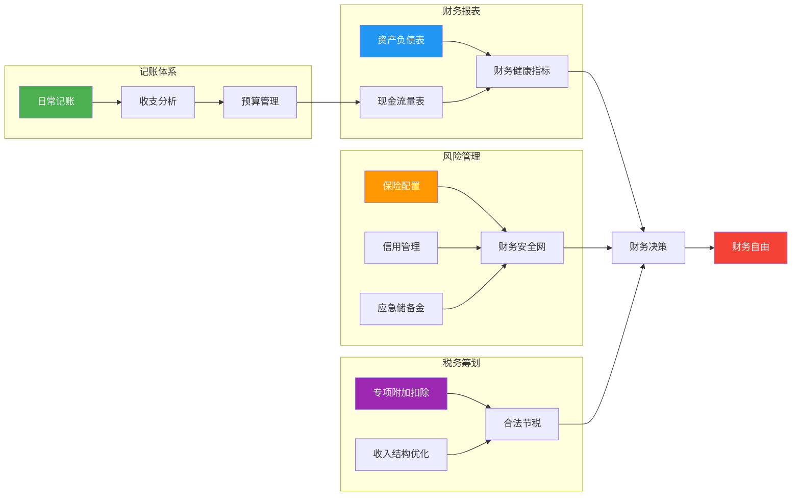
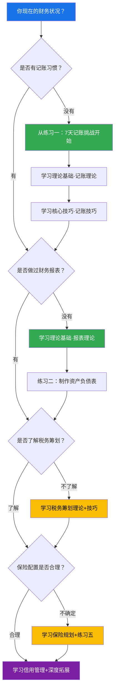

# 第13章 个人财务管理工具

## 章节定位：从"不知道钱去哪了"到"让每一分钱都有意义"

彼得·德鲁克说过一句被引用了无数遍的话："不能衡量的东西，就无法管理。"这句话在个人财务领域尤其刺痛人心——因为绝大多数人，真的不知道自己的钱去了哪里。

来看一组数据：中国人民银行2024年的调查显示，中国居民人均可支配收入约为3.9万元/年，但同期居民存款增速却在放缓，消费信贷余额突破20万亿元。这意味着大量收入被消费掉了，而且很多是通过信贷消费。招商银行的调研数据更直接——月入1万-3万的群体中，超过60%的人无法准确说出自己上个月的支出结构，超过40%的人没有任何形式的记账习惯。

这不是"懒"的问题，而是认知问题。大多数人对"财务管理"存在一个根深蒂固的误解：觉得它是有钱人才需要考虑的事情。事实恰恰相反——越是收入有限，越需要精确管理，因为你的容错空间更小。月入3万存款为零的人，和月入8千每年存下3万的人，差距不在收入，在于管理。

**本章的核心使命是帮你建立一套完整的个人财务管理体系**——不是那种"少喝一杯奶茶"的省钱鸡汤，而是一套从记账到报表、从税务到保险、从信用到投资的系统方法论。你不需要成为会计师或理财顾问，但你需要具备基本的"财务素养"——就像你不需要成为医生，但你需要知道血压和血糖意味着什么。

**本章的底层假设：** 个人财务管理是一项可以通过学习掌握的技能，而非天赋。记账、制表、税务筹划、保险配置、信用管理——每一项都有明确的方法和工具，只要有意愿，任何人都可以做到。财务管理的目标从来不是"省钱"，而是让有限的资金发挥最大的价值——该花的钱一分不少地花，不该花的钱一分不多地花。

## 知识体系全景图

```mermaid
graph TD
    A[第13章 个人财务管理工具] --> B[理论基础]
    A --> C[核心技巧]
    A --> D[实战案例]
    A --> E[常见误区]
    A --> F[练习方法]
    A --> G[深度拓展]

    B --> B1[个人财务管理的本质]
    B --> B2[个人财务报表理论]
    B --> B3[记账的理论基础]
    B --> B4[税务筹划理论]
    B --> B5[保险规划理论]
    B --> B6[信用管理理论]
    B --> B7[个人财务规划的高级理论]

    C --> C1[高效记账技巧]
    C --> C2[个人财务报表制作]
    C --> C3[税务筹划技巧]
    C --> C4[保险配置技巧]
    C --> C5[信用管理技巧]
    C --> C6[预算管理技巧]
    C --> C7[投资组合管理]
    C --> C8[自动化财务管理]

    D --> D1[月光族的财务逆袭]
    D --> D2[家庭财务规划]
    D --> D3[税务筹划实例]
    D --> D4[保险理赔经历]
    D --> D5[信用修复经历]
    D --> D6[投资理财成长之路]
    D --> D7[家庭财务危机化解]

    style A fill:#1a73e8,color:#fff
    style B fill:#34a853,color:#fff
    style C fill:#fbbc04,color:#000
    style D fill:#ea4335,color:#fff
    style E fill:#ff6d01,color:#fff
    style F fill:#46bdc6,color:#fff
    style G fill:#7b1fa2,color:#fff
```

## 核心问题框架

本章围绕六个层层递进的核心问题展开，从认知到实操，从理论到工具，覆盖个人财务管理的完整链路：

| 序号 | 核心问题 | 对应模块 | 能力层级 |
|:----:|----------|----------|----------|
| 1 | 财务管理的本质是什么？为什么有的人收入高却没钱？ | 理论基础·财务管理本质 | 认知层：理解"赚钱≠有钱"的核心差异 |
| 2 | 如何用一张表看清自己的财务全貌？ | 理论基础·财务报表理论 | 诊断层：掌握资产负债表和现金流量表的原理 |
| 3 | 怎么高效记账？记了账之后怎么分析？ | 理论基础·记账理论 + 核心技巧·记账技巧 | 工具层：建立科学的记账体系和分析习惯 |
| 4 | 合法节税有哪些方法？怎么充分利用政策？ | 理论基础·税务筹划 + 核心技巧·税务技巧 | 策略层：利用税收优惠政策降低税负 |
| 5 | 保险怎么买？买多少？给谁买？ | 理论基础·保险规划 + 核心技巧·保险配置 | 保障层：建立科学的风险转移体系 |
| 6 | 信用为什么重要？怎么维护和修复？ | 理论基础·信用管理 + 核心技巧·信用技巧 | 信用层：管理好"第二张身份证" |

## 内容结构详解

### 理论基础篇：建立财务管理的认知框架

理论部分不是学术空谈，而是帮你建立"为什么要这么做"的认知地基。没有理论支撑的实操是盲目的——你可能知道要记账，但不理解记账的本质目的；你可能知道要买保险，但不理解保险配置的底层逻辑。

**个人财务管理的本质**——从"高收入穷人"和"低收入富人"的对比切入，解释财务管理的核心是资源配置而非省钱。引入财务管理的生命周期理论（起步期→积累期→成长期→成熟期→收获期），让你理解不同人生阶段的财务管理重心完全不同。22岁刚工作时应该重点建立记账习惯和应急金，35岁家庭稳定期应该重点优化资产配置和保险体系，55岁临近退休应该重点规划财富传承和现金流。

**个人财务报表理论**——将企业财务报表的概念"降维"到个人层面。资产负债表帮你回答"我现在有多少钱"，现金流量表帮你回答"我的钱从哪来、到哪去"。引入会计恒等式（资产=负债+净资产），以及四大核心财务健康指标：储蓄率、负债率、流动性比率、投资回报率。这些指标就像体检报告里的血压和血糖——数字本身不重要，重要的是它们告诉你身体（财务）是否健康。

**记账的理论基础**——记账不是为了省钱，而是为了"了解"。引入马斯洛需求层次与支出分类的对应关系，帮你理解不同支出的优先级和弹性。介绍80/20法则在记账中的应用——80%的支出来自20%的消费类别，所以你只需要重点监控那些大额、高频的类别。详解三种预算管理理论：50/30/20法则（简单易行）、零基预算法（精确控制）、信封法（直观有效）。

**税务筹划理论**——从税收的基本原理讲起，帮你理解个人所得税的累进税率机制。重点区分节税（合法利用政策）、避税（灰色地带）和逃税（违法）的本质区别。详解七大专项附加扣除政策，每一项的扣除标准、适用条件和申报方式。很多人每年多交了几千甚至上万的税，仅仅是因为不知道这些政策的存在。

**保险规划理论**——保险不是消费，是风险转移工具。用"小额保费撬动大额保障"的杠杆原理解释保险的本质。建立保险配置的优先级体系：先社保后商保、先保障后理财、先大人后小孩、先保额后保费。给出四大基础保险（医疗险、重疾险、意外险、寿险）的保额计算公式和保费预算比例。

**信用管理理论**——信用是现代社会的"第二张身份证"。解释征信系统的运作机制，详解影响信用评分的五大因素及其权重。区分"好杠杆"和"坏杠杆"——借钱投资能产生高于利息回报的是好杠杆，借钱消费是坏杠杆。给出杠杆使用的核心原则：负债率不超过50%，月还款额不超过月收入的30%。

### 核心技巧篇：从理论到实操的桥梁

理论告诉你"为什么"，技巧告诉你"怎么做"。这一部分是全章的实操核心，每一节都提供具体的方法、工具和步骤。

**高效记账技巧**——不追求完美，追求坚持。提供四种记账方式的对比：实时记账法（适合自律型）、批量记账法（适合忙碌型）、自动记账法（适合技术型）、拍照记账法（适合懒人型）。详解记账工具的选择矩阵，从随手记、钱迹到MoneyWiz，不同需求对应不同工具。建立科学的收支分类体系，一级分类控制在7-10个，既不过于粗略也不过于繁琐。

**个人财务报表制作技巧**——手把手教你制作三张表：个人资产负债表（盘点资产、盘点负债、计算净资产）、月度现金流量表（记录收入、支出、净现金流）、财务指标计算表（储蓄率、负债率、流动性比率）。提供完整的表格模板和填写示例，照着填就能完成。

**税务筹划技巧**——不是教你逃税，而是教你合法地少交税。详解六大节税策略：充分利用专项附加扣除（很多人漏报了赡养老人或住房租金）、合理选择年终奖计税方式（单独计税和合并计税的差异可能数千元）、公积金最大化缴纳、个人养老金账户（每年12000元的税前扣除）、商业健康保险扣除、公益捐赠扣除。每一项都有具体的计算示例和操作步骤。

**保险配置技巧**——解决"买什么、买多少、给谁买"三个核心问题。提供不同收入水平的保险配置方案：年收入10万以下的极简方案（医疗险+意外险，年保费500-800元）、年收入10-30万的标准方案（加配重疾险和定期寿险）、年收入30万以上的全面方案。给出保额计算公式和保费预算比例，以及保险产品的评估框架。

**信用管理技巧**——从日常维护到危机处理。信用维护的核心是"按时还款"四个字，但远不止于此。详解如何合理使用信用卡（2-3张足够，不要贪多）、如何控制负债率、如何避免频繁申请新信用账户、如何定期查询和检查征信报告。如果已经出现逾期，给出信用修复的具体路径：还清欠款→保持后续按时还款→等待5年自动消除。

**预算管理技巧**——预算不是限制，是规划。详解三种预算方法的实操：50/30/20法则的月度执行（先扣储蓄再分配消费）、零基预算法的精细控制（每一分钱都有去处）、信封法的直观管理（物理或数字信封均可）。提供预算超支时的应对策略和季度调整方法。

**投资组合管理技巧**——在财务管理体系中，投资是让资产增值的关键环节。介绍从保守到进取的不同资产配置方案，详解指数基金定投的操作方法，以及投资组合再平衡的时机和方法。

**自动化财务管理技巧**——让系统替你管钱。介绍自动记账（银行账单导入）、自动储蓄（工资到账自动转出）、自动投资（定投计划）、自动还款（信用卡绑定还款）的设置方法。目标是减少人工干预，让好的财务习惯变成"默认行为"。

### 实战案例篇：真实场景的完整复盘

理论和技巧需要在真实场景中检验。这一部分通过七个真实案例，展示不同财务状况的人如何从混乱走向有序。

**案例一：月光族的财务逆袭**——月入1.2万、存款为零的95后，通过3个月的记账发现每月有3000元的"隐形消费"（奶茶、外卖、冲动购物），调整后6个月存下2.4万元。重点展示记账如何暴露消费黑洞。

**案例二：家庭财务规划**——双职工家庭（月入合计3.5万），面临房贷、孩子教育、父母赡养三重压力。通过制作家庭资产负债表和现金流量表，发现资产配置严重失衡（房产占比超过80%），重新规划后建立了合理的投资组合和保险体系。

**案例三：税务筹划实例**——年收入45万的互联网从业者，通过合理利用专项附加扣除（赡养老人+住房贷款利息+继续教育）、选择最优年终奖计税方式、开通个人养老金账户，合法节税超过1.8万元/年。详细展示每一步的计算过程。

**案例四：保险理赔经历**——35岁确诊甲状腺癌，幸亏两年前配置了重疾险和百万医疗险。重疾险一次性赔付50万，医疗险报销了全部治疗费用。对比同期确诊但没有保险的同事，经济压力天差地别。展示保险配置的决策过程和理赔流程。

**案例五：信用修复经历**——因大学时期的信用卡逾期导致征信不良，毕业后买房贷款被拒。通过还清欠款、保持良好记录、定期查询征信，3年后信用恢复正常。展示征信修复的具体步骤和时间线。

**案例六：投资理财的成长之路**——从"只存银行"到建立完整的投资组合。展示一个普通上班族如何从货币基金入门，逐步扩展到指数基金、债券基金，最终建立起适合自己的资产配置方案。

**案例七：家庭财务危机的化解**——突发失业导致家庭现金流断裂。展示如何通过应急储备金、保险保障、支出调整三板斧，在没有借债的情况下渡过3个月的收入空白期。这个案例的核心价值是展示"为什么需要应急储备金"。

### 常见误区篇：那些看起来对、实际错的财务认知

财务管理中有大量"听起来很有道理但实际上是错的"认知，这些误区如果不纠正，你的所有努力可能都是南辕北辙。

本章揭示十大常见误区：记账太麻烦没必要（真相：可以用自动导入，每周只花10分钟）、收入高就等于财务好（真相：月入5万负债累累的人比比皆是）、不买保险觉得是浪费钱（真相：一场大病可能倾家荡产）、忽视征信觉得无所谓（真相：逾期记录保留5年，影响贷款和就业）、不做预算花钱随心所欲（真相：不做预算是"默认"把钱花在不重要的地方）、只存银行不做任何投资（真相：3%通胀下，存银行实际在亏钱）、保险只给孩子买（真相：大人是家庭经济支柱，应该先保障大人）、信用卡越多越好（真相：2-3张足够，多了影响征信）、认为理财是有钱人的事（真相：100元也可以开始理财）、忽视税务筹划（真相：合法节税是纳税人的权利，不利用等于白送钱）。

每一个误区都配有：误区描述（你可能说过的原话）、误区分析（为什么这是错的）、正确认知（正确的理解是什么）、实践建议（现在应该怎么做）。

### 练习方法篇：从"知道"到"做到"的七步训练

财务管理是一项实践技能，光看不练等于没学。本章提供七个循序渐进的练习，每个练习都有明确的目标、步骤、模板和成功标准。

| 顺序 | 练习名称 | 时间投入 | 难度 | 核心价值 |
|:----:|----------|:--------:|:----:|----------|
| 1 | 7天记账挑战 | 1周 | ★☆☆ | 养成记账习惯，发现消费黑洞 |
| 2 | 个人资产负债表制作 | 1天 | ★★☆ | 看清财务全貌，计算净资产 |
| 3 | 月度预算制定 | 1天 | ★★☆ | 建立支出规划，控制消费节奏 |
| 4 | 专项附加扣除检查 | 1小时 | ★☆☆ | 堵住税收漏洞，合法节税 |
| 5 | 保险配置检查 | 2小时 | ★★☆ | 评估保障缺口，优化保险体系 |
| 6 | 征信报告查询 | 1天 | ★☆☆ | 了解信用状况，发现潜在问题 |
| 7 | 年度财务复盘 | 半天 | ★★★ | 全面回顾总结，制定下年计划 |

建议执行节奏：第1周完成练习1和6（记账+征信），第2周完成练习2和3（报表+预算），第3周完成练习4和5（税务+保险），第4周完成练习7（年度复盘）。

### 深度拓展篇：为高级读者准备的进阶内容

完成基础内容后，如果你希望更深入地理解个人财务管理，深度拓展部分提供了更高维度的知识。

**财务管理的数学模型**——复利公式（FV=PV×(1+r)^n）和72法则，帮你直观理解"时间是最好的朋友"这句话的数学含义。投资组合理论（马科维茨均值-方差模型、有效前沿、CAPM模型），帮你理解为什么分散投资能降低风险。财务比率分析（流动性比率、负债比率、储蓄比率），帮你建立量化的财务评估体系。

**自动化理财系统搭建**——从数据采集到分析决策到自动执行的完整架构设计。定期定额投资（DCA）、价值平均策略、动态再平衡策略的具体实现方法。智能现金管理和财务预警系统的搭建思路。

**财务健康评估框架**——五维评估模型（偿债能力、储蓄能力、投资能力、保障能力、退休准备度），每个维度的评分标准和改善方案。你可以用这个框架给自己做一次全面的"财务体检"。

**财务规划软件深度比较**——从随手记、挖财到YNAB、MoneyWiz，国内外主流财务规划工具的功能对比、优劣势分析和适用场景推荐。投资管理工具（天天基金、雪球、且慢）的功能对比。Excel/Google Sheets自建财务模型的进阶方法。

## 核心知识图谱：六大模块的关系

六大模块并非孤立存在，而是相互支撑的有机整体：记账产生数据，数据支撑报表，报表反映健康状况，健康状况决定风险管理和税务筹划的策略，所有这些最终服务于一个目标——让钱发挥最大价值。

## 学习目标

完成本章学习后，你将能够：

**基础能力（人人必备）**：
1. 建立并坚持记账习惯，清楚自己的收支结构
2. 制作个人资产负债表和现金流量表，准确计算净资产和储蓄率
3. 理解个人所得税的累进税率机制，充分利用专项附加扣除合法节税

**进阶能力（显著提升财务健康度）**：
4. 根据自身收入和家庭状况，配置合理的保险方案
5. 维护良好的个人信用记录，理解征信系统的运作机制
6. 制定并执行月度预算，将储蓄率提升到20%以上

**高阶能力（实现系统化财务管理）**：
7. 搭建自动化理财系统，减少人工干预
8. 建立完整的财务健康评估框架，定期进行"财务体检"
9. 根据人生阶段动态调整财务管理策略

## 适合人群

**强烈推荐（你应该立刻开始学习本章）**：
- 不知道自己钱花到哪里去的"月光族"——记账是改变的起点
- 有收入但从没看过自己财务报表的人——你需要一张"财务X光片"
- 即将面临重大财务决策的人（买房、结婚、生子）——提前做好规划能避免很多痛苦

**高度推荐（本章能帮你显著改善财务状况）**：
- 有记账习惯但不知道如何分析和优化的人——从记录到分析的升级
- 觉得自己交了太多税但不知道怎么合法节税的人——每年可能省下数千甚至上万元
- 买了保险但不确定配置是否合理的人——评估保额是否充足、保费是否合理

**建议了解（即使目前财务状况良好也值得学习）**：
- 想了解信用管理的人——信用是长期资产，维护比修复容易100倍
- 想从"存银行"升级到科学投资的人——先建立财务管理体系再谈投资
- 想为家庭建立完整财务规划的人——个人财务管理是家庭财务规划的基础

## 本章的学习路径

不同基础的读者可以选择不同的学习路径：

**零基础路径**（完全没有财务管理经验）：理论基础→练习一（7天记账）→核心技巧·记账→练习二（资产负债表）→核心技巧·报表→练习三（预算）→税务→保险→信用→深度拓展。预计需要2-3周。

**有基础路径**（有记账习惯但不够系统）：跳过记账基础，直接从财务报表理论开始→制作资产负债表→税务筹划→保险配置→信用管理→深度拓展。预计需要1-2周。

**查漏补缺路径**（大部分都了解，想补齐短板）：直接做练习七（年度财务复盘），根据复盘结果找到薄弱环节，针对性学习对应章节。

## 重要提醒

> **财务管理的目标不是省钱，而是让钱发挥最大价值。** 该花的钱——学习、健康、体验——一分不少地花；不该花的钱——冲动消费、虚荣消费、习惯性浪费——一分不多地花。记账不是为了让自己焦虑，而是为了让自己有掌控感。当你清楚地知道自己的钱去了哪里、每一分钱都在为你的目标服务时，你会发现：赚钱的动力更强了，花钱的焦虑消失了，存钱变成了一件自然而然的事情。

> **最好的财务管理工具是你能坚持使用的那个。** 不要追求功能最全的App，不要追求最精确的分类体系，不要追求完美的预算执行。一个简单的记账App + 每月看一次报表 + 每年做一次复盘，就已经超过了90%的人。坚持比完美重要100倍。

> **财务管理是终身技能，不是一次性任务。** 你不需要一周内学会所有内容，但你需要从今天开始行动。哪怕只是下载一个记账App，记录今天的午餐费用——这就是改变的开始。

## 章节与整本书的关系

个人财务管理工具是"搞钱指南"这本书的基础设施。前面的章节教你如何赚钱（创业、副业、投资），后面的章节教你如何用钱生钱（投资理财、资产配置）。但如果你连自己有多少钱、钱去了哪里都不知道，所有赚钱和投资的技巧都是空中楼阁。

本章与以下章节形成紧密的知识网络：

| 关联章节 | 关联点 | 为什么重要 |
|----------|--------|------------|
| 第8章 创业与副业 | 副业收入的管理和税务处理 | 赚到的副业收入需要纳入财务管理体系 |
| 第10章 技术技能变现 | 自由职业者的财务规划 | 收入不稳定更需要精确的财务管理 |
| 第11章 电商与跨境电商 | 电商经营的个人税务 | 电商收入的税务处理有特殊规则 |
| 第12章 加密货币与DeFi | 投资收益的记录和税务 | 加密货币收益需要纳入个人财务报表 |
| 第14章 投资理财基础 | 财务管理是投资的前提 | 没有财务基础的投资是赌博 |

## 阅读建议

**如果时间充裕**：按顺序阅读理论基础→核心技巧→实战案例→常见误区→练习方法→深度拓 展。理论是地基，技巧是工具，案例是验证，误区是避坑，练习是内化，拓展是升华。

**如果时间紧张**：直接从核心技巧篇开始，边做边学。遇到不理解的概念再回头查理论。每个技巧节都有独立的实操步骤，可以直接照着做。

**如果只想解决一个问题**：根据你最紧迫的需求选择——不知道钱花到哪里去看记账技巧，不知道自己有多少净资产看报表制作，想知道怎么少交税看税务筹划，担心生病看保险配置，想贷款买房看信用管理。

预计完整学习需要1-2周，但财务管理是一项终身技能。本章提供的方法论和工具，会在你未来人生的每一个财务决策中持续发挥作用。
