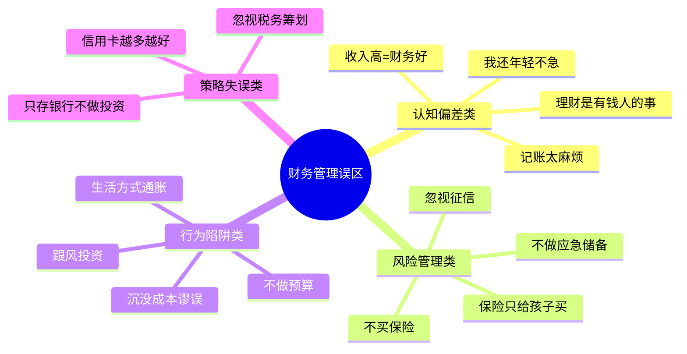
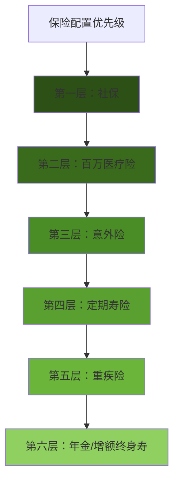
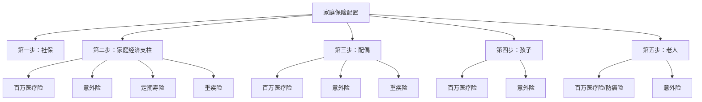
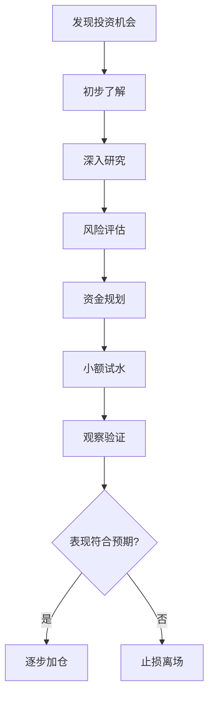

# 第13章 个人财务管理工具——常见误区

> "我们最大的敌人不是无知，而是以为自己知道。"——查理·芒格

个人财务管理中，错误认知的代价远高于知识匮乏。一个根深蒂固的错误观念，可能在十年内让你损失数十万元。本节揭示15个最常见的财务管理误区，不仅告诉你"错在哪里"，更从行为金融学的角度解释"为什么会犯这种错"，以及"如何系统性地避免"。



## 误区一：记账太麻烦，没必要

### 误区描述

"记账太麻烦了，每天都要记，坚持不下来。"
"我大概知道钱花在哪里，不需要记账。"
"记账有什么用？反正钱已经花了。"

### 心理学根源

这种误区源于**认知负荷理论**（Cognitive Load Theory）。人类大脑倾向于回避需要持续注意力的任务。记账被感知为"额外负担"，触发了**即时满足偏差**——比起未来的财务清晰，人们更在意当下的轻松。

另一个心理因素是**达克效应**（Dunning-Kruger Effect）：对自己的财务状况过度自信。研究表明，当被要求估算过去一个月的支出时，大多数人会低估15%-30%。

### 真实数据

根据中国人民银行2024年的调查数据：

| 指标 | 有记账习惯者 | 无记账习惯者 |
|------|------------|------------|
| 月储蓄率 | 28.3% | 11.7% |
| 年度净资产增长 | +12.4% | +3.1% |
| 冲动消费占比 | 8.2% | 23.6% |
| 对财务状况的了解程度 | 85分（自评） | 42分（自评） |

差距不是一星半点，而是结构性的。记账者平均每年多存下约2个月工资。

### 案例：小王的"大概知道"

小王，28岁，互联网公司产品经理，月薪18000元。他一直觉得自己"大概知道钱花在哪里"——房租4500、吃饭3000、交通500、其他2000，应该能存8000。

实际记账一个月后，他发现了这些"隐形支出"：

| 类别 | 以为的金额 | 实际金额 | 差额 |
|------|----------|---------|------|
| 外卖和奶茶 | 3000 | 4850 | +1850 |
| 网购（日用/数码） | 2000 | 3760 | +1760 |
| 社交聚餐 | 包含在"其他"里 | 2100 | - |
| 订阅服务（视频/音乐/App） | 没算过 | 386 | - |
| 打车 | 500 | 1240 | +740 |
| **实际月结余** | **8000** | **3164** | **-4836** |

小王以为自己是"准月存八千族"，实际是"月存三千族"。这4836元的差距，一年就是5.8万元，十年加上投资收益就是近80万元。

### 正确认知

**记账的本质不是记录，而是觉察。** 记账的核心价值有三层：

1. **数据层**：知道钱去了哪里（事实基础）
2. **分析层**：发现消费结构中的问题（模式识别）
3. **决策层**：基于数据优化支出（行为改变）

**记账不需要面面俱到。** 根据你的目标和性格，选择适合的精度：

| 记账精度 | 适合人群 | 每日耗时 | 核心价值 |
|---------|---------|---------|---------|
| 粗粒度：只记大额（>200元） | 极度忙碌/刚入门 | 2分钟 | 抓住主要矛盾 |
| 中粒度：按周汇总分类 | 大多数人（推荐） | 每周15分钟 | 平衡精度与负担 |
| 细粒度：每笔记录 | 财务优化期/数据爱好者 | 10分钟 | 发现所有细节 |

### 实操方案：三步启动法

**第一步：选择工具并设置自动导入**

推荐工具矩阵：

| 工具 | 类型 | 自动导入 | 费用 | 推荐指数 |
|------|------|---------|------|---------|
| 随手记 | App | 支持部分银行 | 免费/高级版 | ★★★★ |
| 钱迹 | App | 纯手动，极简 | 免费 | ★★★★ |
| MoneyWiz | App | 全面支持 | 订阅制 | ★★★★★ |
| Excel/Google Sheets | 表格 | 手动 | 免费 | ★★★ |
| 财务管家类App | App | 支持支付宝/微信 | 免费/付费 | ★★★★ |

**第二步：设定每周15分钟的"财务体检"**

```text
每周日晚上，花15分钟：
├── 5分钟：核对本周大额支出（>200元）
├── 5分钟：检查是否有异常扣款
└── 5分钟：更新本月预算执行进度
```

**第三步：月度复盘模板**

```markdown
## 本月财务复盘（YYYY年MM月）

### 收入
- 工资收入：¥______
- 其他收入：¥______
- 总收入：¥______

### 支出（按类别）
- 固定支出（房租/房贷/保险）：¥______
- 生活必需（餐饮/交通/日用）：¥______
- 弹性消费（购物/娱乐/社交）：¥______
- 总支出：¥______

### 储蓄率
- 储蓄金额：¥______
- 储蓄率：______%（目标：≥20%）

### 本月发现
- 最大的意外支出：______
- 最值得的消费：______
- 最后悔的消费：______

### 下月调整
- 需要减少的类别：______
- 需要增加预算的类别：______
```

---

## 误区二：收入高就等于财务好

### 误区描述

"我月入3万，不需要理财。"
"等我赚够了钱再开始管理。"
"我收入比同龄人高，财务状况肯定没问题。"

### 心理学根源

这种误区的核心是**锚定效应**（Anchoring Effect）。人们习惯性地以"收入"作为衡量财务健康的唯一锚点，忽视了"支出"和"资产"同样重要。

更深层的原因是**心理账户**（Mental Accounting）理论——人们对"赚到的钱"和"花掉的钱"有不同的心理感受。高收入带来的安全感，会降低对支出的警觉性，形成"反正赚得多"的自我麻痹。

### "高收入穷人"现象

这个现象在行为金融学中被称为**生活方式通胀**（Lifestyle Inflation），即收入增长时，消费水平同步甚至更快增长。

**典型案例对比：**

| 指标 | 张先生（月入3万） | 李先生（月入1.5万） |
|------|-----------------|-------------------|
| 月收入 | 30,000 | 15,000 |
| 月支出 | 28,500 | 9,000 |
| 月储蓄 | 1,500 | 6,000 |
| 储蓄率 | 5% | 40% |
| 年储蓄 | 18,000 | 72,000 |
| 10年后净资产（假设投资收益5%） | 约22万 | 约89万 |

收入是对方两倍，十年后的净资产却不到对方的四分之一。这就是"高收入穷人"的真实写照。

**为什么高收入者更容易陷入这个陷阱？**

1. **社交压力**：高收入圈子消费水平高，社交开支大
2. **补偿心理**："我这么辛苦工作，应该犒劳自己"
3. **里程碑消费**：升职加薪后立即升级生活方式（换车、换房、换手机）
4. **忽视复利**：觉得"反正以后赚得更多"，不重视当下储蓄

### 净资产公式与健康标准

**净资产**是衡量财务健康的真正指标：

```text
净资产 = 总资产 - 总负债

其中：
总资产 = 现金 + 存款 + 投资 + 房产市值 + 车辆残值 + 其他资产
总负债 = 房贷余额 + 车贷余额 + 信用卡欠款 + 其他贷款
```

**净资产健康参考值**（来源：托马斯·斯坦利《邻家的百万富翁》）：

```text
期望净资产 = (年龄 × 年收入) ÷ 10
```

举例：30岁，年收入36万（月入3万）
- 期望净资产 = (30 × 360,000) ÷ 10 = 108万元
- 如果实际净资产低于这个值，说明消费过高或投资不足

**更实用的分阶段标准：**

| 年龄段 | 储蓄率目标 | 净资产/年收入 | 说明 |
|--------|----------|-------------|------|
| 22-25岁 | ≥15% | 0.2-0.5 | 刚起步，养成习惯 |
| 26-30岁 | ≥20% | 0.5-1.5 | 快速积累期 |
| 31-35岁 | ≥25% | 1.5-3.0 | 收入增长期 |
| 36-45岁 | ≥30% | 3.0-6.0 | 巅峰积累期 |
| 46-55岁 | ≥35% | 6.0-10.0 | 退休准备期 |

### 正确认知

财务管理的核心不是"赚多少"，而是三个指标的综合表现：

1. **储蓄率**：每月能存下收入的百分之多少
2. **净资产增长率**：每年净资产增长百分之多少
3. **财务自由度**：被动收入能否覆盖基本生活开支

**先储蓄后消费**是唯一有效的策略。心理学研究表明，"先消费再存剩下的"几乎必然导致储蓄不足，因为消费具有**适应性**——花出去的钱会被合理化，而存下来的钱会被遗忘。

### 实践方案

**自动化储蓄系统**（发工资当天执行）：

```text
工资到账（¥30,000）
├── 自动转账1：¥6,000 → 储蓄/投资账户（20%）
├── 自动转账2：¥4,500 → 房租/房贷（15%）
├── 自动转账3：¥1,500 → 保险/应急（5%）
└── 剩余 ¥18,000 → 日常消费账户（60%）
```

**关键原则**：储蓄账户设为"只进不出"，除非真正的紧急情况。日常消费只能用剩余的钱，花完了就等下个月。

---

## 误区三：不买保险，觉得是浪费钱

### 误区描述

"保险都是骗人的。"
"我年轻健康，不需要保险。"
"买了保险也用不上，浪费钱。"
"保险公司就是靠不赔赚钱的。"

### 心理学根源

这个误区源于**乐观偏差**（Optimism Bias）——人们倾向于认为坏事不会发生在自己身上。研究表明，80%的人认为自己的风险水平低于平均水平，这在统计学上显然不可能。

另一个因素是**损失厌恶**（Loss Aversion）：每年交几千元保费是确定的"损失"，而未来可能的风险是不确定的。确定的痛苦比不确定的风险更让人难以接受。

还有一个被忽视的因素——**可得性启发**（Availability Heuristic）：人们更容易被"保险拒赔"的新闻影响，而忽视了大量正常理赔的案例。保险公司整体理赔率通常在95%以上。

### 风险的数学真相

用概率和期望值来理解保险：

**30岁男性，未来30年内发生重大疾病的概率：**

| 风险类型 | 发生概率 | 经济影响 | 期望损失 |
|---------|---------|---------|---------|
| 重大疾病（癌症/心脑血管） | 约25%-30% | 30-100万元 | 7.5-30万 |
| 严重意外伤残 | 约3%-5% | 50-200万元 | 1.5-10万 |
| 意外身故 | 约1%-2% | 家庭收入中断10-20年 | - |

即使只有25%的概率发生重大疾病，期望损失也在7.5万元以上。而一份百万医疗险的年保费通常只需300-800元，一份意外险只需100-300元。用不到1000元的成本对冲数十万元的风险，这在任何风险管理理论中都是最优决策。

### 真实案例：一场大病的财务冲击

**案例：刘先生，35岁，互联网公司技术经理，年收入40万**

2023年确诊甲状腺癌（属于轻症，治愈率高）。费用明细：

| 项目 | 金额 |
|------|------|
| 手术费 | 6.8万 |
| 住院费（15天） | 2.3万 |
| 靶向药（6个月） | 18.5万 |
| 康复期收入损失（3个月） | 10万 |
| 总计 | 37.6万 |

刘先生有百万医疗险（年保费480元），报销了医疗费用的90%（约24.7万）。如果没有保险，37.6万需要自掏腰包——相当于他一年的税后收入。

### 保险配置优先级



**各险种详解：**

| 险种 | 年保费参考 | 保额 | 核心作用 | 优先级 |
|------|----------|------|---------|-------|
| 社保（五险一金） | 工资扣除 | - | 基础保障，必须有 | ★★★★★ |
| 百万医疗险 | 300-800元 | 200-600万 | 覆盖大额医疗费 | ★★★★★ |
| 意外险 | 100-300元 | 50-100万 | 意外伤残/身故 | ★★★★★ |
| 定期寿险 | 500-2000元 | 100-300万 | 身故后家庭保障 | ★★★★ |
| 重疾险 | 3000-8000元 | 30-50万 | 确诊即赔，弥补收入损失 | ★★★★ |
| 年金/增额终身寿 | 自定义 | - | 强制储蓄/养老 | ★★★ |

**预算有限时的配置方案：**

```text
年预算 500元以内：
└── 百万医疗险（约300元）+ 意外险（约200元）

年预算 1000-2000元：
├── 百万医疗险（约500元）
├── 意外险（约200元）
└── 定期寿险（约800元，50万保额）

年预算 5000-10000元：
├── 百万医疗险（约600元）
├── 意外险（约300元）
├── 定期寿险（约1200元，100万保额）
└── 重疾险（约4000元，30万保额）
```

### 保险配置四大原则

1. **先保障后理财**：先把保障型保险配齐，有余力再考虑理财型
2. **先大人后小孩**：大人是家庭经济支柱，大人倒了孩子也没保障
3. **保额充足**：重疾险保额建议为年收入的3-5倍，寿险保额覆盖负债+5年家庭开支
4. **保费可控**：家庭总保费不超过年收入的10%

---

## 误区四：忽视征信，觉得无所谓

### 误区描述

"逾期几天没关系。"
"征信对我没影响。"
"反正我不贷款，征信无所谓。"
"征信报告看不懂，不看了。"

### 心理学根源

征信问题的忽视源于**时间折扣**（Temporal Discounting）——人们对远期后果的感知会大打折扣。逾期的后果要5年才消除，这个时间跨度让人觉得"以后再说"。

另一个因素是**控制错觉**（Illusion of Control）：人们觉得自己可以随时"修复"征信，实际上修复征信比维护征信困难10倍以上。

### 征信的真实影响力

在中国的社会信用体系下，征信报告的影响远超贷款：

| 场景 | 征信良好 | 征信不良 |
|------|---------|---------|
| 房贷利率 | 基准利率或下浮 | 上浮10%-30% |
| 信用卡审批 | 即批，额度高 | 拒批或低额度 |
| 租房（部分城市） | 正常租房 | 被要求额外担保 |
| 求职（金融/国企） | 无影响 | 可能被拒 |
| 创业贷款 | 可申请政府贴息贷款 | 无法申请 |
| 出行（严重失信） | 正常 | 限制高铁/飞机 |

**房贷利率差异的实际影响**：

以贷款100万、30年期为例：

| 征信状态 | 利率 | 月供 | 总利息 | 多付利息 |
|---------|------|------|--------|---------|
| 良好（基准4.2%） | 4.2% | 4,890元 | 76.0万 | - |
| 轻微逾期（上浮10%） | 4.62% | 5,146元 | 85.3万 | 9.3万 |
| 严重逾期（上浮30%） | 5.46% | 5,657元 | 103.6万 | 27.6万 |

一次严重逾期，可能让你在30年内多付27.6万元利息。

### 征信报告解读

个人征信报告在中国人民银行征信中心可以免费查询（每年2次免费）。关键字段：

```markdown
## 征信报告核心指标

### 1. 信贷记录
- 贷款笔数及状态（正常/逾期/结清）
- 信用卡张数及使用情况
- 逾期记录（近2年详细，近5年汇总）

### 2. 查询记录
- 机构查询：贷款审批、信用卡审批（硬查询，影响征信）
- 本人查询：不影响征信
- 近半年硬查询建议不超过6次

### 3. 公共信息
- 欠税记录
- 民事判决
- 强制执行
- 行政处罚

### 4. 健康指标
- 逾期次数：0次最佳
- 负债率：信用卡已用额度/总额度，建议<50%
- 查询频率：近半年硬查询<6次
- 账户状态：全部正常
```

### 维护征信的实操清单

**日常维护（每月执行）：**

- [ ] 所有信用卡设置自动还款（全额还款，不是最低还款）
- [ ] 设置还款日提前3天的提醒（防止自动扣款失败）
- [ ] 检查是否有未注意到的年费扣款
- [ ] 信用卡使用额度控制在总额度的50%以内

**季度检查（每3个月）：**

- [ ] 检查是否有未知的贷款审批查询
- [ ] 确认所有贷款的还款状态正常
- [ ] 检查是否有错误的逾期记录

**年度体检（每年1次）：**

- [ ] 通过中国人民银行征信中心查询完整征信报告
- [ ] 逐项核对信贷记录是否准确
- [ ] 检查是否有遗漏的担保记录
- [ ] 评估整体负债率是否健康

### 征信修复指南

**情况一：确实逾期了**

```text
逾期后的正确处理流程：
1. 立即还清欠款（本金+利息+罚息）
2. 继续正常使用该信用卡/贷款24个月
3. 用24个月的良好记录覆盖不良记录
4. 5年后不良记录自动消除

注意：不要销卡！销卡后不良记录会保留更久。
```

**情况二：征信报告有错误**

```text
异议处理流程：
1. 登录中国人民银行征信中心官网
2. 提交异议申请
3. 提供相关证明材料
4. 等待20个工作日核实
5. 核实后更正
```

---

## 误区五：不做预算，花钱随心所欲

### 误区描述

"做预算太死板了。"
"我花钱有分寸，不需要预算。"
"预算总是超，做了也没用。"
"人生苦短，何必委屈自己。"

### 心理学根源

不做预算的心理根源是**自我控制的有限资源模型**——人们认为"意志力是有限的"，做预算会消耗意志力，反而导致其他方面的失控。这个观点有一定道理，但忽略了**外部化控制**的价值——好的预算系统不需要持续消耗意志力，它通过结构化的方式自动执行。

另一个因素是**现状偏差**（Status Quo Bias）：维持现状（不做预算）比改变（开始做预算）感觉更舒适，即使现状并不理想。

### 预算的本质

**预算不是限制，是优先级排序。**

预算的本质回答一个核心问题："我的钱应该先去哪里？"

没有预算 = 没有优先级 = 钱自然流向最容易花的地方（通常是即时满足的消费），而不是最重要的地方（通常是长期目标）。

**三种预算方法对比：**

| 方法 | 原理 | 适合人群 | 优点 | 缺点 |
|------|------|---------|------|------|
| 50/30/20法则 | 50%必要、30%想要、20%储蓄 | 预算新手 | 简单易行 | 分类可能不精确 |
| 信封法 | 将钱分装在不同"信封"中 | 消费冲动型 | 物理限制消费 | 操作稍繁琐 |
| 零基预算 | 每一分钱都要有去处 | 追求精确者 | 完全掌控 | 需要较多时间 |
| 反向预算 | 先储蓄，剩余自由消费 | 不喜欢约束者 | 自动储蓄 | 需要自律执行 |

**推荐：反向预算法**

这是最适合"不喜欢被约束"的人的预算方法：

```text
月收入 ¥20,000
├── 第一步：自动储蓄 30%（¥6,000）→ 投资/储蓄账户
├── 第二步：固定支出 40%（¥8,000）→ 房租/房贷/保险/通讯
└── 第三步：剩余 30%（¥6,000）→ 随便花，不需要记账
```

关键在于"先储蓄后消费"——储蓄是自动执行的，不需要意志力。剩余的钱可以自由支配，不会产生"被限制"的感觉。

### 预算执行的三个阶段

**第一阶段：观察期（第1-2个月）**

目标：了解自己的真实消费结构，不设限

```text
操作：
1. 正常消费，不刻意节省
2. 每笔支出都记录
3. 月底汇总，按类别统计
4. 识别最大支出类别和意外支出
```

**第二阶段：调整期（第3-4个月）**

目标：设定合理预算，开始执行

```text
操作：
1. 根据观察期数据设定各类别预算
2. 预算 = 观察期实际值 × 0.85（先压缩15%）
3. 每周检查一次预算执行情况
4. 超支类别分析原因，下月调整
```

**第三阶段：稳定期（第5个月起）**

目标：形成习惯，持续优化

```text
操作：
1. 预算已经与实际匹配，执行压力小
2. 每月复盘一次即可
3. 收入增长时，储蓄率同步提高
4. 每季度评估一次预算结构是否需要调整
```

---

## 误区六：只存银行，不做任何投资

### 误区描述

"投资风险太大，不如存银行安全。"
"我不懂投资，还是存银行吧。"
"等我有钱了再投资。"
"股市都是割韭菜的。"

### 心理学根源

这个误区的核心是**模糊厌恶**（Ambiguity Aversion）——人们对"不确定的风险"比"确定的损失"更恐惧。银行利率虽然跑不赢通胀，但这种损失是"看不见的"；而投资可能亏损是"看得见的"。

另一个因素是**可得性启发**：媒体大量报道股市暴跌、P2P暴雷等负面新闻，而很少报道长期稳健投资的正面案例。这导致人们对投资的风险感知远高于实际。

### 通货膨胀的隐性侵蚀

假设年通胀率3%（中国近年实际通胀率约2%-3%）：

| 存款金额 | 10年后实际购买力 | 20年后实际购买力 | 30年后实际购买力 |
|---------|----------------|----------------|----------------|
| 10万 | 7.44万 | 5.54万 | 4.12万 |
| 50万 | 37.2万 | 27.7万 | 20.6万 |
| 100万 | 74.4万 | 55.4万 | 41.2万 |

100万元存银行30年不做任何投资，实际购买力缩水近60%。这就是"安全"的代价。

### 投资的正确入门路径


**各阶段详解：**

**阶段一：应急储备金（最重要）**

```text
金额：3-6个月基本生活开支
存放位置：货币基金（余额宝/零钱通/银行T+0理财）
要求：随时可取，收益不是重点
目的：应对失业、疾病等突发情况，避免被迫卖出投资
```

**阶段二：指数基金定投**

```text
什么是指数基金？
- 跟踪某个指数（如沪深300、中证500）
- 不需要选股，买入整个市场的"平均表现"
- 费率低（管理费通常0.5%以下）
- 长期年化收益约8%-12%（历史数据）

定投的优势：
- 平均成本法：市场下跌时买入更多份额
- 不需要择时：每月固定日期自动买入
- 强制储蓄：养成投资习惯
```

**不同风险偏好的配置建议：**

| 风险偏好 | 货币基金 | 债券基金 | 指数基金 | 股票基金 | 预期年化 |
|---------|---------|---------|---------|---------|---------|
| 保守型 | 40% | 40% | 15% | 5% | 3%-5% |
| 稳健型 | 20% | 30% | 35% | 15% | 5%-8% |
| 平衡型 | 10% | 20% | 40% | 30% | 8%-12% |
| 进取型 | 5% | 10% | 40% | 45% | 10%-15% |

### 投资的三个铁律

1. **不懂不投**：投资之前先学习，至少了解产品原理和风险
2. **分散投资**：不把所有钱放在一个篮子里
3. **长期持有**：投资是马拉松，不是短跑

---

## 误区七：保险只给孩子买

### 误区描述

"孩子最重要，先给孩子买保险。"
"大人不需要保险，孩子需要。"
"给孩子买教育金，比给大人买重疾险重要。"

### 心理学根源

这种误区源于**保护本能**——父母对子女的保护欲是人类最强烈的情感之一。在保险决策中，这种情感会导致**优先级错位**：把资源优先分配给"最心疼的人"，而不是"最需要保障的人"。

另一个因素是**沉没成本谬误**的变体——已经为孩子投入了大量时间和金钱，觉得"不能让孩子出事"，于是在保险上也过度倾斜。

### 家庭保险的正确优先级

**核心逻辑：保险保的不是人，是收入来源。**

一个家庭中，谁的收入中断对家庭影响最大？是家庭经济支柱（通常是父母），而不是孩子。

**错误配置 vs 正确配置对比：**

| 配置方式 | 父亲（经济支柱） | 母亲（经济支柱） | 孩子 |
|---------|----------------|----------------|------|
| 错误：先保孩子 | 无保障 | 无保障 | 重疾险50万+教育金 |
| 正确：先保支柱 | 重疾50万+医疗+意外+寿险100万 | 重疾30万+医疗+意外 | 医疗+意外（年保费<1000元） |

**假设父亲（年入30万）不幸患病：**

```text
错误配置下：
- 父亲无保险，医疗费自付30-50万
- 收入中断，家庭失去主要经济来源
- 孩子的保险还在交费，反而成为负担
- 家庭财务可能崩溃

正确配置下：
- 百万医疗险报销医疗费（年保费500元）
- 重疾险一次性赔付50万（弥补收入损失）
- 寿险赔付100万（最坏情况下的家庭保障）
- 家庭财务稳定，孩子保障不中断
```

### 家庭保险配置完整方案

**第一步：确定保费预算**

```text
家庭年收入 × 5%-10% = 年保费预算

示例：家庭年收入40万
年保费预算 = 40万 × 7% = 2.8万元
```

**第二步：按优先级配置**



**各家庭成员保费分配建议：**

| 家庭成员 | 保费占比 | 原因 |
|---------|---------|------|
| 家庭经济支柱 | 40%-50% | 收入中断影响最大 |
| 配偶 | 25%-30% | 共同承担家庭责任 |
| 孩子 | 10%-15% | 无收入贡献，保障需求低 |
| 老人 | 10%-15% | 年龄大保费贵，以医疗为主 |

---

## 误区八：信用卡越多越好

### 误区描述

"信用卡多，额度高，面子大。"
"多办几张信用卡，额度更高。"
"每张卡都有优惠，办了不亏。"
"信用卡就是免费的钱。"

### 心理学根源

信用卡越多越好的误区源于**禀赋效应**（Endowment Effect）——人们对"已经拥有的东西"赋予更高价值。每张卡都有"独特的优惠"，让人觉得"不用就是亏了"。

更深层的原因是**选择过载**（Choice Overload）：过多的信用卡反而增加管理成本，导致决策疲劳，最终可能选择最差的方案（比如忘记还款）。

### 信用卡过多的真实成本

| 持卡数量 | 年费管理成本 | 逾期风险 | 征信影响 | 消费控制难度 |
|---------|------------|---------|---------|------------|
| 1-2张 | 低（可免年费） | 低 | 正常 | 容易 |
| 3-4张 | 中（部分需消费达标免年费） | 中 | 查询记录适中 | 较容易 |
| 5-7张 | 高（年费管理复杂） | 高 | 查询记录较多 | 困难 |
| 8张以上 | 很高 | 很高 | 明显影响 | 非常困难 |

**真实案例：信用卡管理混乱**

张女士持有6张信用卡，每张卡的账单日和还款日都不同：

```text
卡1：账单日5号，还款日25号
卡2：账单日10号，还款日30号
卡3：账单日15号，还款日5号
卡4：账单日20号，还款日10号
卡5：账单日25号，还款日15号
卡6：账单日1号，还款日20号
```

结果：几乎每个月都有卡要还款，经常忘记某张卡的还款日，一年内逾期3次，征信报告上留下了不良记录。

### 信用卡的正确使用策略

**精简原则：保留2-3张卡**

```text
理想的信用卡组合：
├── 主力卡（1张）：日常消费主力，选择返现/积分最高的
├── 备用卡（1张）：不同银行/网络（Visa/Mastercard），用于主卡受限场景
└── 特殊用途卡（可选1张）：如航空里程卡、加油卡等
```

**信用卡选择标准：**

| 考量因素 | 说明 |
|---------|------|
| 年费政策 | 优先选择可免年费的卡（消费达标免年费或终身免年费） |
| 账单日 | 选择账单日在工资日之后的卡 |
| 还款方式 | 支持自动全额还款 |
| 权益匹配 | 选择与自己消费习惯匹配的权益（餐饮/加油/网购） |
| 积分价值 | 积分兑换比例高的卡 |

**信用卡使用的黄金法则：**

1. **全额还款，永远不最低还款**：最低还款的年化利率通常在15%-18%
2. **利用免息期，但不依赖免息期**：免息期是工具，不是借钱的理由
3. **消费不超过月收入的30%**：信用卡不是额外收入，是支付工具
4. **设置自动全额还款**：消除人为遗忘的风险
5. **定期检查年费和权益变化**：权益缩水及时换卡

### 信用卡与个人征信的关系

```text
信用卡对征信的影响：

正面影响：
├── 按时还款 → 信用记录良好
├── 使用时间长 → 信用历史丰富
└── 额度使用率低（<30%） → 负债率健康

负面影响：
├── 频繁申请新卡 → 硬查询过多
├── 逾期还款 → 不良记录
├── 额度使用率高（>70%） → 负债率过高
└── 长期最低还款 → 还款能力存疑
```

---

## 误区九：认为理财是有钱人的事

### 误区描述

"我钱太少了，没必要理财。"
"等我有钱了再开始理财。"
"理财是有钱人的游戏。"
"几千块钱能理什么财？"

### 心理学根源

这个误区源于**心理账户**理论——人们会为不同来源和用途的钱设立不同的"心理账户"。"小钱"被归入"不值得管理"的账户，而"大钱"才值得认真对待。

另一个因素是**损失厌恶**的变体：小额理财的收益看起来"不值得折腾"，而小额理财的学习成本和时间成本却被高估。

### 复利的力量：小额起步的惊人结果

假设每月投资1000元，年化收益率8%（指数基金长期平均收益）：

| 投资年限 | 总投入 | 账户总额 | 收益 | 收益/投入比 |
|---------|--------|---------|------|-----------|
| 5年 | 6万 | 7.3万 | 1.3万 | 22% |
| 10年 | 12万 | 18.3万 | 6.3万 | 53% |
| 20年 | 24万 | 58.9万 | 34.9万 | 145% |
| 30年 | 36万 | 150.0万 | 114万 | 317% |

每月1000元，30年后变成150万。这就是复利的力量——时间越长，效果越惊人。

**不同起步时间的差异：**

假设目标是60岁时拥有200万，每月投资，年化8%：

| 开始年龄 | 每月需投资 | 总投入 | 投资收益 |
|---------|----------|--------|---------|
| 25岁 | 1,068元 | 45.1万 | 154.9万 |
| 30岁 | 1,698元 | 61.1万 | 138.9万 |
| 35岁 | 2,802元 | 84.1万 | 115.9万 |
| 40岁 | 4,898元 | 117.6万 | 82.4万 |

晚开始5年，每月需要多投入50%-70%。这就是"越早开始越好"的数学证明。

### 小额理财的实操方案

**月入5000-8000元的理财方案：**

```text
月收入：¥6,000
├── 必要支出（60%）：¥3,600
│   ├── 房租：¥1,500
│   ├── 餐饮：¥1,200
│   └── 交通/通讯：¥900
├── 弹性消费（20%）：¥1,200
└── 储蓄/投资（20%）：¥1,200
    ├── 应急储备金（前6个月）：¥1,200 → 货币基金
    └── 之后：¥500 → 货币基金 + ¥700 → 指数基金定投
```

**月入8000-15000元的理财方案：**

```text
月收入：¥12,000
├── 必要支出（50%）：¥6,000
├── 弹性消费（20%）：¥2,400
└── 储蓄/投资（30%）：¥3,600
    ├── 应急储备金：¥1,000 → 货币基金
    ├── 指数基金定投：¥1,500
    └── 债券基金：¥1,100
```

### 理财起步的五个行动

1. **今天**：下载一个记账App，开始记录支出
2. **本周**：开通一个货币基金账户（余额宝/零钱通）
3. **本月**：设定自动转账，每月发工资后自动转入储蓄账户
4. **三个月后**：学习指数基金知识，开始定投
5. **半年后**：建立完整的资产配置方案

---

## 误区十：忽视税务筹划

### 误区描述

"税务是公司的事，跟我没关系。"
"我不知道怎么节税。"
"节税就是逃税，不敢做。"
"反正工资是税后的，没什么好筹划的。"

### 心理学根源

税务筹划被忽视的原因是**复杂性回避**——税法看起来太复杂，人们倾向于"不想了解"。另一个因素是**损失框架**：税务被视为"被拿走的钱"，人们不愿意面对这种"损失"，于是选择忽视。

### 节税与逃税的本质区别

| 维度 | 节税（合法） | 逃税（违法） |
|------|------------|------------|
| 定义 | 利用法律允许的方式减少税负 | 隐瞒收入或虚报支出 |
| 合法性 | 完全合法，受法律保护 | 违法，可能面临刑事处罚 |
| 本质 | 纳税人的合法权利 | 侵害国家税收利益 |
| 后果 | 无风险 | 罚款、滞纳金、刑事责任 |
| 示例 | 填报专项附加扣除 | 隐瞒收入不申报 |

### 个人所得税计算原理

```text
应纳税所得额 = 年收入 - 6万元（起征点） - 专项扣除 - 专项附加扣除 - 其他扣除

应纳税额 = 应纳税所得额 × 税率 - 速算扣除数
```

**2024年个人所得税税率表（综合所得）：**

| 级数 | 应纳税所得额 | 税率 | 速算扣除数 |
|------|------------|------|----------|
| 1 | ≤36,000 | 3% | 0 |
| 2 | 36,000-144,000 | 10% | 2,520 |
| 3 | 144,000-300,000 | 20% | 16,920 |
| 4 | 300,000-420,000 | 25% | 31,920 |
| 5 | 420,000-660,000 | 30% | 52,920 |
| 6 | 660,000-960,000 | 35% | 85,920 |
| 7 | >960,000 | 45% | 181,920 |

### 合法节税的六大方法

**方法一：充分利用专项附加扣除**

| 扣除项目 | 每月扣除额 | 每年扣除额 | 条件 |
|---------|----------|----------|------|
| 子女教育 | 2,000元/孩 | 24,000元/孩 | 3岁至博士毕业 |
| 继续教育 | 400元（学历）或3,600元（职业资格） | - | 在学或取得证书当年 |
| 大病医疗 | 实际支出超1.5万部分 | 最高80,000元 | 医保目录内自付部分 |
| 住房贷款利息 | 1,000元 | 12,000元 | 首套房贷，最长240个月 |
| 住房租金 | 800-1,500元 | 9,600-18,000元 | 工作城市无房 |
| 赡养老人 | 3,000元 | 36,000元 | 父母年满60岁 |
| 3岁以下婴幼儿照护 | 2,000元/孩 | 24,000元/孩 | 3岁以下 |

**方法二：合理选择年终奖计税方式**

年终奖有两种计税方式，需要分别计算后选择税额较低的：

```text
方式一：单独计税
年终奖 ÷ 12 → 查月度税率表 → 计算税额

方式二：并入综合所得
年终奖 + 工资 → 减去各项扣除 → 查综合所得税率表 → 计算税额

建议：两种方式都算一遍，选择税额较低的
```

**方法三：最大化公积金**

```text
公积金优势：
├── 税前扣除，直接减少应纳税所得额
├── 公司等额缴纳（等于免费加薪）
├── 购房时可低息贷款
└── 账户余额有利息

建议：在政策允许范围内，尽量提高公积金缴纳比例
```

**方法四：开通个人养老金账户**

```text
个人养老金：
├── 每年最高缴纳12,000元
├── 缴纳金额税前扣除
├── 投资收益暂不征税
├── 领取时按3%税率单独计税
└── 适合税率>3%的人群（年应纳税所得额>36,000元）
```

**方法五：合理利用商业健康保险**

```text
税优健康险：
├── 每年最高扣除2,400元（每月200元）
├── 可带病投保
├── 保证续保
└── 需要通过单位购买
```

**方法六：公益捐赠抵税**

```text
捐赠抵税规则：
├── 通过合规公益组织捐赠
├── 捐赠额不超过应纳税所得额30%的部分可扣除
├── 需要保留捐赠凭证
└── 在个税App中填报
```

### 税务筹划年度清单

```text
## 每年1月
- [ ] 检查专项附加扣除信息是否需要更新
- [ ] 确认公积金缴纳比例是否最优

## 每年3-6月（个税汇算清缴期）
- [ ] 下载"个人所得税"App
- [ ] 核对全年收入和扣除信息
- [ ] 选择年终奖计税方式（两种都算）
- [ ] 填报公益捐赠抵税（如有）
- [ ] 完成汇算清缴，多退少补

## 每年12月
- [ ] 评估是否需要缴纳个人养老金
- [ ] 确认专项附加扣除信息完整
- [ ] 检查是否有遗漏的扣除项目
```

---

## 误区十一：生活方式通胀无节制

### 误区描述

"升职加薪了，当然要改善生活。"
"赚得多了，消费水平也要跟上。"
"人生苦短，及时行乐。"

### 心理学根源

生活方式通胀的核心驱动力是**享乐适应**（Hedonic Adaptation）——人们对物质享受的快感会迅速消退，需要更高水平的刺激才能获得同样的满足感。加薪带来的快乐通常只能维持3-6个月，之后就需要更高水平的消费来维持。

另一个因素是**社会比较理论**——人们通过与他人比较来评估自己的状况。当收入增加时，比较对象也会升级（从同学变成同事，从同事变成行业精英），导致消费标准不断提高。

### 生活方式通胀的数学真相

假设两个人同时毕业，起薪都是月薪8000元：

**小A：保持50%储蓄率**

| 年份 | 月收入 | 月支出 | 月储蓄 | 储蓄率 |
|------|--------|--------|--------|--------|
| 第1年 | 8,000 | 4,000 | 4,000 | 50% |
| 第3年 | 12,000 | 6,000 | 6,000 | 50% |
| 第5年 | 18,000 | 9,000 | 9,000 | 50% |
| 第10年 | 30,000 | 15,000 | 15,000 | 50% |

**小B：收入涨多少，消费涨多少**

| 年份 | 月收入 | 月支出 | 月储蓄 | 储蓄率 |
|------|--------|--------|--------|--------|
| 第1年 | 8,000 | 7,500 | 500 | 6.25% |
| 第3年 | 12,000 | 11,500 | 500 | 4.17% |
| 第5年 | 18,000 | 17,500 | 500 | 2.78% |
| 第10年 | 30,000 | 29,500 | 500 | 1.67% |

10年后，小A的净资产约为220万（假设投资收益8%），小B的净资产约为8万。同样的起点，结果相差27倍。

### 控制生活方式通胀的策略

**策略一：50%规则**

```text
收入增长时，将增长部分的50%用于储蓄，50%用于改善生活。

示例：
月薪从10,000涨到15,000（增长5,000元）
├── 2,500元 → 增加储蓄/投资
└── 2,500元 → 改善生活

这样既享受了加薪的好处，又保持了储蓄率的增长。
```

**策略二：延迟消费升级**

```text
想要升级消费时，执行"30天等待"规则：
1. 记录想要升级的消费项目
2. 等待30天
3. 30天后仍然想要 → 认真评估后决定
4. 30天后不再想要 → 省下这笔钱

研究显示：70%的冲动消费在30天后会消失。
```

**策略三：定义"足够"标准**

```text
为每个消费类别定义"足够"的标准：
├── 住房：满足基本居住需求，不过度追求面积和地段
├── 餐饮：营养均衡，不过度追求高端餐厅
├── 交通：安全可靠，不过度追求品牌
├── 娱乐：适度放松，不过度追求刺激
└── 服饰：得体舒适，不过度追求品牌

"足够"的标准不会随收入增长而大幅提高。
```

---

## 误区十二：跟风投资

### 误区描述

"同事买的基金赚钱了，我也买。"
"网上都说这只股票要涨。"
"朋友推荐的投资项目，肯定没问题。"
"大家都买房，我也得买。"

### 心理学根源

跟风投资的核心驱动力是**从众效应**（Conformity）——人们倾向于模仿大多数人的行为，因为"大多数人不会错"。在投资领域，这种效应尤为危险，因为当大多数人形成一致预期时，往往意味着趋势即将反转。

另一个因素是**FOMO**（Fear of Missing Out，错失恐惧症）——看到别人赚钱，担心自己错过机会，于是匆忙入场。

### 跟风投资的惨痛教训

**案例一：2021年白酒基金热潮**

```text
时间线：
2020年：白酒基金年收益超过100%，成为"明星基金"
2021年1月：大量投资者跟风买入，基金规模暴增
2021年2月：白酒指数达到历史高点
2021年3月-2022年10月：白酒指数下跌超过50%
2023年底：仍有大量投资者处于亏损状态

教训：当所有人都在谈论某个投资机会时，往往已经太晚了。
```

**案例二：2015年股市杠杆牛市**

```text
时间线：
2014年底：股市开始上涨
2015年3-5月：全民炒股，"股市会涨到10000点"
2015年6月：上证指数达到5178点
2015年6-8月：股市暴跌，跌幅超过40%
无数投资者损失惨重，有人甚至跳楼

教训：市场狂热时，保持冷静；市场恐慌时，保持理性。
```

### 独立投资决策框架

**投资前的五个问题：**

```text
1. 我理解这个投资产品吗？
   → 不理解就不投

2. 这个投资的逻辑是什么？
   → 能用简单语言解释清楚

3. 最坏情况是什么？
   → 如果最坏情况发生，我能承受吗？

4. 我的投资期限是多长？
   → 短期资金不投长期产品

5. 这个决策是基于自己的分析，还是别人的建议？
   → 别人的建议只能参考，不能替代自己的判断
```

**独立研究的步骤：**



---

## 误区十三：不做应急储备

### 误区描述

"我有信用卡，不需要应急金。"
"钱放在那里不用，太浪费了。"
"应急金收益太低，不如都投出去。"

### 心理学根源

不做应急储备的心理根源是**当下偏差**（Present Bias）——人们过度重视当下的收益，忽视未来的风险。把钱放在货币基金里"只赚2%"，看起来不如投出去"赚8%"吸引人。

另一个因素是**控制错觉**——人们认为自己可以随时应对紧急情况，不需要提前准备。但现实是，紧急情况往往发生在最不方便的时候。

### 应急储备金的数学意义

假设你没有应急储备金，遇到紧急情况需要5万元：

```text
方案一：信用卡分期
├── 金额：50,000元
├── 分期手续费：0.6%/月
├── 分期12个月
├── 总手续费：50,000 × 0.6% × 12 = 3,600元
└── 实际年化利率：约13%

方案二：借呗/微粒贷
├── 金额：50,000元
├── 日利率：0.04%
├── 借款1年
├── 总利息：50,000 × 0.04% × 365 = 7,300元
└── 实际年化利率：约14.6%

方案三：有应急储备金
├── 金额：50,000元（从货币基金取出）
├── 成本：0元（只是损失了约1,000元的投资收益）
└── 净收益：比方案一省2,600元，比方案二省6,300元
```

### 应急储备金的正确配置

**金额标准：**

| 人群 | 建议金额 | 说明 |
|------|---------|------|
| 单身无房贷 | 3个月基本开支 | 最低标准 |
| 有房贷/车贷 | 6个月基本开支 | 考虑还款压力 |
| 有子女 | 6-9个月基本开支 | 考虑教育支出 |
| 自由职业/创业 | 9-12个月基本开支 | 收入不稳定 |
| 双职工家庭 | 3-6个月基本开支 | 收入来源分散 |

**存放位置：**

```text
应急储备金的存放要求：
├── 安全性：本金不能有损失
├── 流动性：随时可取，最好当天到账
├── 收益性：不是重点，但能跑赢活期就行

推荐存放方式：
├── 第一层（随时可取）：货币基金（余额宝/零钱通）
├── 第二层（1-3天可取）：银行T+0理财
└── 第三层（1周内可取）：短期债券基金

不推荐：
├── 定期存款（流动性差）
├── 股票/基金（有亏损风险）
└── 现金（无收益，有安全隐患）
```

### 应急储备金的建立计划

**月入10,000元，月开支6,000元的案例：**

```text
目标：6个月基本开支 = 36,000元

建立计划（6个月完成）：
├── 第1-2月：每月存3,000元（收入的30%）
├── 第3-4月：每月存3,000元
├── 第5-6月：每月存3,000元
└── 第6月底：应急储备金 = 18,000元 + 投资收益

继续存：
├── 第7-12月：每月存1,500元（收入的15%）
└── 第12月底：应急储备金 = 36,000元（目标达成）

之后：
├── 应急储备金维持在36,000元
├── 多出的钱用于投资
└── 每年检查一次金额是否足够
```

---

## 误区十四：沉没成本谬误

### 误区描述

"我已经投了这么多钱，不能放弃。"
"学了这么久，换方向太可惜了。"
"这个理财产品亏了，我要等它回本。"

### 心理学根源

沉没成本谬误（Sunk Cost Fallacy）是行为经济学中最经典的认知偏差之一。人们倾向于因为已经投入的成本（时间、金钱、精力）而继续一个不值得的决策，即使理性分析表明应该放弃。

**核心逻辑错误**：已经花掉的钱不应该影响未来的决策。无论你是否继续，沉没成本都不会回来。正确的决策应该只基于未来的收益和成本。

### 投资中的沉没成本陷阱

**案例：基金亏损后的决策**

```text
场景：
- 6个月前买入基金A，投入50,000元
- 现在基金A亏损30%，市值35,000元
- 同时发现基金B，预期收益更高

错误决策（沉没成本谬误）：
"我已经亏了15,000元，不能卖，要等它回本。"
→ 结果：继续持有基金A，可能继续亏损

正确决策（理性分析）：
"如果我现在有35,000元现金，我会买基金A还是基金B？"
→ 如果答案是基金B，就应该卖掉基金A，买入基金B
→ 无论之前投入多少，决策应该基于未来的预期
```

### 如何克服沉没成本谬误

**决策框架：零基思考法**

```text
当你面临"是否继续"的决策时，问自己：

"如果我现在没有投入任何成本，我会选择开始吗？"

如果答案是"不会"，那么无论已经投入多少，都应该停止。

示例：
- 读了一半的烂书 → 不读了，时间花在好书上
- 亏损的股票 → 如果不会现在买入，就应该卖出
- 不合适的课程 → 如果不会现在报名，就应该退出
- 无望的项目 → 如果不会现在启动，就应该止损
```

**实操建议：**

1. **设定止损线**：投资前就设定好止损点（如亏损15%强制卖出）
2. **定期评估**：每季度重新评估所有投资，用"零基思考法"
3. **记录决策**：记录每次"继续"或"放弃"的决策理由，事后复盘
4. **接受损失**：损失是投资的一部分，接受它才能做出理性决策

---

## 误区十五：过度依赖他人建议

### 误区描述

"理财经理推荐的，肯定没问题。"
"专家说的，应该没错。"
"朋友在这个领域很有经验，听他的。"
"网上大V说的，很多人都信。"

### 心理学根源

过度依赖他人建议源于**权威偏见**（Authority Bias）——人们倾向于相信权威人士的意见，即使他们的建议可能不适用于自己的情况。

另一个因素是**责任转移**——把决策责任推给他人，可以减轻自己的心理压力。如果投资亏损，可以怪"理财经理推荐的"，而不是怪自己。

### 他人建议的局限性

**理财经理的利益冲突：**

```text
理财经理的收入来源：
├── 销售佣金（卖产品赚提成）
├── 管理费分成（管理资产赚管理费）
└── 绩效奖金（完成销售目标）

理财经理的建议可能受到以下影响：
├── 佣金高的产品更容易被推荐
├── 公司主推的产品更容易被推荐
├── 适合客户的产品不一定佣金高
└── 佣金最高的产品往往费率最高
```

**专家建议的局限性：**

| 来源 | 优势 | 局限性 |
|------|------|--------|
| 理财经理 | 专业，有资源 | 利益冲突，可能推荐高佣金产品 |
| 网络大V | 信息量大 | 可能有广告合作，观点可能偏颇 |
| 朋友/家人 | 善意，无利益冲突 | 可能不够专业，经验有限 |
| 财经媒体 | 信息及时 | 追求流量，可能夸大风险/收益 |

### 如何正确使用他人建议

**原则：建议是信息来源，不是决策依据**

```text
正确流程：
1. 收集多方建议（不要只听一个人的）
2. 理解建议背后的逻辑（为什么推荐这个？）
3. 评估建议者的利益关系（他有什么利益？）
4. 结合自己的情况做决策（适合我吗？）
5. 自己承担决策责任（不怪别人）
```

**具体操作：**

```text
收到投资建议时：
├── 问：这个产品的风险是什么？
├── 问：你为什么推荐这个产品？
├── 问：你的收入来源是什么？（是否收佣金）
├── 问：如果我亏损了，你会怎么处理？
└── 问：有没有不收佣金的替代产品？

收到财务规划建议时：
├── 问：这个规划基于什么假设？
├── 问：最坏情况是什么？
├── 问：有没有更简单的替代方案？
├── 问：费用是多少？
└── 问：如果市场表现不如预期，怎么办？
```

---

## 本节总结

### 十五大误区对照表

| 序号 | 误区 | 心理学根源 | 正确认知 | 行动建议 |
|------|------|----------|---------|---------|
| 1 | 记账太麻烦 | 认知负荷、即时满足偏差 | 记账是觉察，不是负担 | 用懒人记账法，每周15分钟 |
| 2 | 收入高=财务好 | 锚定效应、生活方式通胀 | 关键是净资产增长 | 先储蓄后消费，保持储蓄率 |
| 3 | 不买保险 | 乐观偏差、损失厌恶 | 保险是风险转移工具 | 优先配置百万医疗+意外险 |
| 4 | 忽视征信 | 时间折扣、控制错觉 | 信用是第二张身份证 | 设置自动还款，每年查征信 |
| 5 | 不做预算 | 自我控制有限资源 | 预算是优先级排序 | 用反向预算法，先储蓄后消费 |
| 6 | 只存银行 | 模糊厌恶、可得性启发 | 通胀会侵蚀存款价值 | 从货币基金+指数定投开始 |
| 7 | 保险只给孩子 | 保护本能、优先级错位 | 保险保的是收入来源 | 先保家庭经济支柱 |
| 8 | 信用卡越多越好 | 禀赋效应、选择过载 | 2-3张足够 | 精简信用卡，设自动还款 |
| 9 | 理财是有钱人的事 | 心理账户、损失厌恶 | 复利的力量 | 从100元/月开始定投 |
| 10 | 忽视税务筹划 | 复杂性回避 | 合法节税是权利 | 填报专项附加扣除 |
| 11 | 生活方式通胀 | 享乐适应、社会比较 | 收入涨，储蓄率也要涨 | 50%规则：加薪的一半存起来 |
| 12 | 跟风投资 | 从众效应、FOMO | 独立思考，不懂不投 | 投资前问自己五个问题 |
| 13 | 不做应急储备 | 当下偏差、控制错觉 | 应急金是财务安全网 | 存够3-6个月开支 |
| 14 | 沉没成本谬误 | 损失厌恶、承诺升级 | 已花的钱不影响未来决策 | 用零基思考法 |
| 15 | 过度依赖他人建议 | 权威偏见、责任转移 | 建议是信息，不是决策 | 独立评估，自己负责 |

### 核心原则

1. **财务管理不是省钱**，是让钱发挥最大价值
2. **越早开始越好**，时间是最好的朋友
3. **坚持比完美更重要**，不追求一步到位
4. **持续学习**，财务知识需要不断更新
5. **独立思考**，不盲目跟风，不依赖他人
6. **系统思维**，用制度和工具代替意志力

### 自我诊断清单

花10分钟，诚实回答以下问题，看看你是否存在这些误区：

```text
□ 1. 我能准确说出上个月花了多少钱吗？
□ 2. 我知道自己的净资产是多少吗？
□ 3. 我有百万医疗险和意外险吗？
□ 4. 我的征信报告最近一年查过吗？
□ 5. 我有明确的月度预算吗？
□ 6. 我的投资收益率超过通胀率吗？
□ 7. 我的保险配置是先大人后小孩吗？
□ 8. 我的信用卡数量在3张以内吗？
□ 9. 我每月至少投资收入的10%吗？
□ 10. 我填报了所有专项附加扣除吗？
□ 11. 我的储蓄率随收入增长而提高了吗？
□ 12. 我的投资决策是基于自己的分析吗？
□ 13. 我有3-6个月的应急储备金吗？
□ 14. 我能理性止损，不被沉没成本影响吗？
□ 15. 我做财务决策时能独立思考吗？

评分：
- 12-15个"是"：财务认知优秀，继续保持
- 8-11个"是"：基本合格，需要改进几个方面
- 4-7个"是"：存在较多误区，建议系统学习
- 0-3个"是"：财务认知严重不足，需要立即行动
```

记住：认识到误区本身就是进步的开始。从今天开始，选择一个最影响你的误区，采取本节建议的行动，一步步改善你的财务状况。财务管理是一场马拉松，不是短跑——重要的不是起点，而是方向和坚持。
