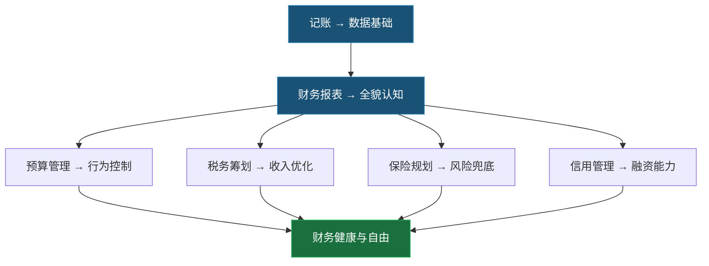

# 第13章 个人财务管理工具——本章小结

个人财务管理是整个"搞钱"体系的地基。没有清晰的财务画像，一切投资、创业、副业都是空中楼阁。本章从"道"（认知与理念）到"法"（方法论与框架）到"术"（实操技巧）到"器"（工具与系统），为你搭建了一套完整的个人财务管理操作系统。

本小结不是简单的目录复述，而是将全章知识打散重组，帮你建立一张完整的知识网络——哪些概念互相支撑，哪些技能必须先于其他技能掌握，哪些误区会毁掉你之前所有的努力。

---

## 一、全章知识地图

本章涵盖六大核心模块，每个模块之间存在明确的依赖关系：

**依赖逻辑**：记账是所有财务管理的起点——没有数据，报表是空的，预算是猜的，税务优化无从谈起。财务报表让你看到全貌，之后的预算、税务、保险、信用管理都是基于"知道自己有多少钱、钱在哪里"这个前提展开的。

---

## 二、六大模块核心要点提炼

### 2.1 记账：从"知道"到"看透"

**三个层次递进**：

| 层次 | 能力 | 关键动作 | 达标标志 |
|------|------|----------|----------|
| 记录 | 知道钱花到哪里去了 | 每笔收支都有记录 | 连续30天不断记 |
| 分析 | 看懂支出结构和趋势 | 每月出一份收支报表 | 能说出最大3个支出类别及占比 |
| 优化 | 调整支出、提高资金效率 | 基于数据制定预算并执行 | 储蓄率稳定≥20% |

**核心认知纠偏**：记账不是为了省钱，而是为了获得决策依据。很多人以为记账=抠门，这是最大的误解。记账让你知道哪些支出带来真正的价值（该保留），哪些支出是无意识的浪费（该砍掉），哪些支出可以找到更优的替代方案（该优化）。

**最低可行记账方案**：
- 工具：随手记或钱迹（免费、支持银行账单导入）
- 频率：每天花30秒记录，每周花10分钟核对分类
- 精度：大额（>100元）精确记录，小额可按日估算
- 分析：月末看一次报表，找出3个可优化项

> 记账最大的敌人不是复杂，而是"断"——一旦中断超过3天，大多数人就放弃了。所以核心策略是降低门槛、不求完美、但求连续。

### 2.2 个人财务报表：你的财务体检报告

**三张报表的作用与关系**：

| 报表 | 回答的问题 | 核心数据 | 更新频率 |
|------|-----------|----------|----------|
| 资产负债表 | "我现在有多少钱？" | 资产、负债、净资产 | 每季度 |
| 现金流量表 | "我的钱从哪来、到哪去？" | 收入、支出、净现金流 | 每月 |
| 财务指标表 | "我的财务状况健康吗？" | 储蓄率、负债率、流动性 | 每月 |

**四大健康指标的判断逻辑**：

| 指标 | 计算公式 | 优秀 | 良好 | 需改进 | 危险 |
|------|----------|------|------|--------|------|
| 储蓄率 | (收入-支出)/收入 | ≥30% | 20%-30% | 10%-20% | <10% |
| 负债率 | 总负债/总资产 | ≤30% | 30%-50% | 50%-70% | >70% |
| 流动性 | 流动资产/月支出 | ≥6个月 | 3-6个月 | 1-3个月 | <1个月 |
| 投资回报 | 投资收益/投资本金 | ≥10% | 5%-10% | 0%-5% | 为负 |

**净资产的参考基准**：净资产 = (年龄 × 年收入) / 10。例如30岁、年收入20万，参考净资产为60万。这个公式来自《金钱心理学》，只是一个粗略参考——更重要的是净资产的增长趋势。如果连续两年净资产在增长，说明你的财务方向是对的。

**财务自由度**：被动收入/日常支出。当这个比值≥1时，你就实现了财务自由。这是所有财务管理的终极指标——本章学到的每一个技巧，最终都是为了推动这个比值从0走向1。

### 2.3 预算管理：从"钱不够花"到"每分钱都有去处"

**三种预算方法对比**：

| 方法 | 原理 | 适合人群 | 操作难度 |
|------|------|----------|----------|
| 50/30/20法则 | 50%必要/30%想要/20%储蓄 | 初学者，收入稳定 | ★☆☆ |
| 信封法 | 按类别分配固定金额，花完即止 | 控制力差、冲动消费多 | ★★☆ |
| 零基预算 | 每一分钱都要有去处 | 收入不固定或追求精细管理 | ★★★ |

**预算执行的黄金法则**：先储蓄后消费。工资到账后，第一件事是把20%（或你设定的比例）转入储蓄/投资账户，剩下的才是可花的钱。这比"月底看看能存多少"有效10倍——因为人性是花完的，不是省下的。

### 2.4 税务筹划：合法留住更多收入

**个人所得税优化的四个抓手**：

**第一，专项附加扣除**（最容易被忽视的节税工具）：

| 扣除项目 | 扣除标准 | 关键提醒 |
|----------|----------|----------|
| 子女教育 | 2000元/月/孩 | 3岁起即可享受，夫妻可约定分摊 |
| 继续教育 | 400元/月（学历）或3600元/年（职业资格） | 取得证书当年一次性扣除 |
| 大病医疗 | 实际支出超1.5万部分，最高8万/年 | 年度汇算时扣除，需保留票据 |
| 住房贷款利息 | 1000元/月 | 首套房，最长240个月 |
| 住房租金 | 800-1500元/月 | 按城市级别，与房贷利息二选一 |
| 赡养老人 | 3000元/月 | 父母年满60岁，独生子女全额 |
| 3岁以下婴幼儿照护 | 2000元/月/孩 | 从出生当月起 |

以上扣除合计最高可减少应纳税所得额十几万元，按边际税率计算，每年可能节省数千到数万元税款。这是国家给你的合法福利，不申报等于白白丢钱。

**第二，年终奖计税方式选择**：年终奖可以选择单独计税或并入综合所得计税。两种方式在不同收入水平下差异很大——年收入较低（扣除后应纳税所得额≤0）时，并入综合所得更划算；年收入较高时，单独计税通常更优。关键是两种方式都算一遍，选税额低的那个。个人所得税APP在年度汇算时会提供两种方案的对比。

**第三，公积金最大化**：公积金缴存比例在5%-12%之间，个人缴存部分免征个税。如果你的公积金缴存比例低于12%，可以申请提高——相当于用税前收入做了一笔免税储蓄。

**第四，个人养老金**：每年最高缴存12000元，缴存金额可税前扣除，投资收益暂不征税，领取时按3%税率单独计税。对于边际税率高于3%的纳税人（月薪超过约8333元），这是一个确定性的节税工具。

**投资相关税费要点**：
- 股票：卖出时印花税0.05%（单边），股息红利税持股超1年免征
- 基金：持有不足7天赎回费率1.5%（惩罚性），基金分红暂免个税
- 房产：满五唯一免征个税和增值税，契税首套1%-1.5%

### 2.5 保险规划：用小钱锁住大风险

**四大基础保险的配置逻辑**：

| 保险 | 解决什么问题 | 保额公式 | 保费参考 | 配置优先级 |
|------|-------------|----------|----------|-----------|
| 重疾险 | 确确诊后一次性赔付，覆盖治疗+康复期收入损失 | 年收入×3-5 | 年收入5%-10% | ★★★ |
| 医疗险 | 报销住院和大额医疗费用 | ≥100万 | 几百-几千/年 | ★★★ |
| 意外险 | 意外身故/伤残保障 | 年收入×10 | 几百/年 | ★★★ |
| 寿险 | 身故后家庭经济保障 | 年收入×10 | 年收入5%-10% | ★★☆ |

**配置的四大铁律**：
1. **先保障后理财**——先把保障型保险配齐，再考虑年金、增额终身寿等理财型保险。没有保障的理财是在赌博。
2. **先大人后小孩**——大人是家庭收入来源，大人倒了孩子的保障也没了。优先为家庭经济支柱投保。
3. **保额充足比品牌更重要**——50万保额的大公司产品 vs 80万保额的小公司产品，选后者。保险理赔看合同条款，不看公司名气。
4. **保费预算不超过年收入的10%**——保险是风险转移工具，不应成为经济负担。预算有限时，优先配置百万医疗险（约300元/年）和意外险（约200元/年），花500元就能获得基础保障。

### 2.6 信用管理：现代社会的隐形资产

**征信的底层逻辑**：征信报告记录你所有的借贷行为，是银行和金融机构评估你还款意愿和能力的核心依据。征信不良的代价是真实的——贷款被拒或利率上浮、信用卡申请被拒、甚至影响部分岗位的求职。

**征信维护的五个要点**：

| 要点 | 具体做法 | 为什么重要 |
|------|----------|-----------|
| 按时还款 | 设置自动还款+还款提醒双保险 | 逾期记录保留5年 |
| 控制负债率 | 信用卡已用额度/总额度≤50% | 负债率过高影响贷款审批 |
| 不频繁申贷 | 每次申请都产生"硬查询"记录 | 短期内多次硬查询=财务紧张信号 |
| 定期查询 | 每年查1-2次，通过pbccrc.org.cn | 及时发现错误记录，异议处理需20个工作日 |
| 保留信用历史 | 不要注销最早的信用卡 | 信用历史长度是评分因素之一 |

**信用卡的正确打开方式**：信用卡不是洪水猛兽，合理使用反而是信用积累的利器。核心原则是2-3张常用卡、按时全额还款、合理利用免息期、绝不最低还款（实际年化利率约18%）和取现（手续费+利息双重损失）。

---

## 三、十大常见误区速查

本章"常见误区"篇揭示了10个最致命的财务管理错误。以下是速查对照表——左边是你可能正在犯的错，右边是正确的认知和立即可执行的行动：

| # | 误区 | 正确认知 | 立即行动 |
|---|------|----------|----------|
| 1 | 记账太麻烦，没必要 | 不记账=蒙眼开车 | 用懒人记账法，只记>100元的支出 |
| 2 | 收入高=财务好 | 关键是净资产增长，不是收入数字 | 设定储蓄率≥20%，先储蓄后消费 |
| 3 | 不买保险，浪费钱 | 保险是风险转移，不是消费 | 500元/年配齐百万医疗+意外险 |
| 4 | 忽视征信 | 信用是第二张身份证 | 设置所有贷款自动还款，每年查一次征信 |
| 5 | 不做预算 | 预算是规划，不是限制 | 用50/30/20法则做第一个月预算 |
| 6 | 只存银行 | 3%通胀下10万存10年只值7.4万 | 从货币基金开始，逐步尝试指数基金定投 |
| 7 | 保险只给孩子买 | 先保障家庭经济支柱 | 先给收入最高的人配齐四大基础保险 |
| 8 | 信用卡越多越好 | 2-3张足够，多了管理困难 | 精简到2-3张常用卡，设置自动还款 |
| 9 | 理财是有钱人的事 | 100元也能开始理财 | 今天下载记账App，开始第一步 |
| 10 | 忽视税务筹划 | 合法节税是纳税人的权利 | 打开个人所得税APP，检查专项附加扣除是否填报完整 |

---

## 四、实战案例的核心启示

本章7个实战案例覆盖了从月光族逆袭到家庭财务危机化解的完整场景。提炼出三个贯穿所有案例的规律：

**规律一：数据先行，决策后置。** 无论是月光族的记账逆袭、家庭财务规划，还是信用修复，第一步永远是"搞清楚现状"——盘点资产、分析支出、查询征信。没有数据的决策是猜测。

**规律二：先建安全垫，再谈增值。** 所有成功的财务改善案例都遵循同一个顺序：应急储备金（3-6个月生活费）→ 基础保险 → 还清高息负债 → 开始投资。跳过前三步直接投资，是在用沙子上盖楼。

**规律三：系统比意志力可靠。** 自动记账、自动还款、自动定投、自动再平衡——把重复性决策交给系统，把你的意志力留给真正需要判断的大额决策。手动操作越少，坚持的概率越高。

---

## 五、不同人生阶段的财务重点

| 阶段 | 年龄参考 | 核心任务 | 关键指标目标 |
|------|----------|----------|-------------|
| 积累期 | 22-30岁 | 养成记账习惯，建立应急储备金，开始基金定投，配置基础保险 | 储蓄率≥20%，应急金≥3个月 |
| 加速期 | 30-40岁 | 提升收入，买房规划，优化保险配置，开始系统投资 | 储蓄率≥25%，保险覆盖≥年收入10倍 |
| 稳定期 | 40-50岁 | 资产配置优化，子女教育金规划，增加被动收入 | 负债率≤40%，投资资产占比≥50% |
| 收获期 | 50岁+ | 退休规划，财富传承，保守型资产配置 | 财务自由度≥1，被动收入≥生活支出 |

> 年龄只是参考，关键是看你处在哪个"财务阶段"。一个25岁就月入3万但存款为零的人，和一个月入8千但每年存3万的人，后者的财务阶段更靠前。

---

## 六、从本章到下一章的衔接

本章解决的是"知道自己有多少钱"和"怎么管理钱"的问题。这是所有财务行为的基础。

下一章《投资工具与平台》将在此基础上解决"怎么让钱生钱"的问题——当你已经建立了记账习惯、了解了自己的财务状况、配置了基础保险、维护了良好信用之后，你就具备了开始系统投资的前提条件。

**在进入下一章之前，请确认你已经完成以下准备**：
1. 能清楚说出自己目前的净资产和储蓄率
2. 已经建立了至少3个月的应急储备金
3. 已经配置了百万医疗险和意外险（至少）
4. 所有贷款和信用卡都设置了自动还款
5. 已经打开了个人所得税APP检查了专项附加扣除

如果以上任何一项还没有完成，建议先回到本章的练习方法篇，用4周时间把基础打牢。投资不急于这一个月，但没有基础的投资会让你付出惨痛的代价。

---

## 七、本章核心概念速查表

| 概念 | 一句话定义 | 为什么重要 |
|------|-----------|-----------|
| 净资产 | 总资产 - 总负债 | 衡量个人财富的核心指标，比收入更能说明问题 |
| 现金流 | 收入 - 支出 | 正现金流=财务在增长，负现金流=财务在恶化 |
| 储蓄率 | 储蓄/收入 | 决定财富积累速度，20%是及格线 |
| 负债率 | 负债/资产 | 反映财务风险，>70%需要紧急处理 |
| 50/30/20法则 | 50%必要/30%想要/20%储蓄 | 最简单的预算框架，适合所有人入门 |
| 专项附加扣除 | 子女教育、房贷、赡养老人等7项 | 最容易被忽视的合法节税工具 |
| 财务自由度 | 被动收入/日常支出 | ≥1即实现财务自由，所有财务管理的终极指标 |
| 复利效应 | FV = PV × (1+r)^n | 时间是最大的杠杆，越早开始越有利 |
| 72法则 | 翻倍年数 ≈ 72/年化收益率 | 快速估算投资翻倍时间的心算工具 |
| 应急储备金 | 3-6个月生活费的流动资金 | 财务安全的第一道防线 |

---

## 八、行动路线图

财务管理不需要一步到位，但需要按正确的顺序推进。以下是分阶段行动路线——每一步都是下一步的前提：

### 第一周：建立数据基础

- [ ] 下载记账App（推荐随手记或钱迹），完成初始设置
- [ ] 开启银行账单自动导入
- [ ] 完成第一个7天的连续记账
- [ ] 计算自己当前的净资产（用练习方法篇的资产负债表模板）

### 第二周：看清全貌

- [ ] 完成个人资产负债表（资产-负债=净资产）
- [ ] 统计过去3个月的平均月支出
- [ ] 计算四个核心指标：储蓄率、负债率、流动性、投资回报
- [ ] 评估自己的财务健康等级（参考财务健康仪表盘）

### 第三周：补上安全网

- [ ] 查询个人征信报告（pbccrc.org.cn）
- [ ] 检查所有贷款和信用卡是否设置了自动还款
- [ ] 盘点现有保险，确认是否覆盖百万医疗+意外险
- [ ] 打开个人所得税APP，逐项检查专项附加扣除是否填报完整

### 第四周：建立系统

- [ ] 用50/30/20法则制定下月预算
- [ ] 设置工资卡自动转账——工资到账后自动转出20%到储蓄/投资账户
- [ ] 确认年终奖计税方式（两种都算一遍，选税额低的）
- [ ] 设置信用卡账单日错开，最大化利用免息期

### 持续执行：形成闭环

| 频率 | 动作 | 耗时 |
|------|------|------|
| 每天 | 记录支出 | 30秒 |
| 每周 | 核对分类，检查预算 | 10分钟 |
| 每月 | 查看报表，计算指标 | 30分钟 |
| 每季度 | 更新资产负债表 | 1小时 |
| 每年 | 年度财务复盘，调整保险和投资计划 | 半天 |

---

## 九、推荐资源

### 书籍（按优先级排序）

**财务管理入门**：
- 《富爸爸穷爸爸》——罗伯特·清崎：理解资产和负债的区别，建立财务思维的启蒙书
- 《小狗钱钱》——博多·舍费尔：用故事讲理财，适合零基础读者，2小时读完
- 《个人理财规划》——系统学习个人财务管理的教科书级读物

**保险配置**：
- 《保险怎么买》——从消费者视角讲保险配置，避开销售陷阱
- 《你的第一本保险指南》——手把手教你选保险产品，含具体产品对比

**税务筹划**：
- 《个人所得税实务》——全面了解个税政策和申报操作

### 官方平台

| 平台 | 网址 | 用途 |
|------|------|------|
| 国家税务总局 | chinatax.gov.cn | 税务政策查询、办税指南 |
| 个人所得税APP | 各应用商店下载 | 专项附加扣除填报、年度汇算 |
| 社保查询平台 | si.12333.gov.cn | 社保缴纳信息查询 |
| 中国人民银行征信中心 | pbccrc.org.cn | 个人征信报告查询 |
| 国家医疗保障局 | nhsa.gov.cn | 医保政策和报销查询 |
| 住房公积金查询 | 各地公积金管理中心 | 公积金余额和缴存明细 |

### 工具

| 工具 | 类型 | 特点 |
|------|------|------|
| 随手记 | 记账App | 功能全面，支持银行账单导入，免费版够用 |
| 钱迹 | 记账App | 界面简洁，无广告，专注记账 |
| 个人所得税APP | 税务管理 | 国家官方，专项扣除填报和年度汇算必备 |
| 房贷计算器 | 贷款计算 | 各银行APP内置，比较等额本息和等额本金 |

---

## 十、常见问题解答

### Q1：记账太麻烦了，有什么简单的方法？

**A**：用"懒人记账法"——只记>100元的支出，用App开启银行账单自动导入，每周花10分钟核对分类。关键是养成习惯，不追求每笔都精确。连续记30天后，你会发现自己的消费结构和你以为的完全不同——大多数人餐饮和外卖的实际支出是他们以为的2-3倍。

### Q2：净资产多少算正常？

**A**：参考公式是 净资产 = (年龄 × 年收入) / 10。但这只是粗略参考，更有价值的是净资产的增长趋势——如果你的净资产每年在增长，说明你的财务方向是对的。如果连续两年下降，需要立刻审视收支结构。

### Q3：保险应该买多少？

**A**：基础原则是"双十原则"——保额 = 年收入的10倍，保费 = 年收入的10%。但这是上限，不是必须花的钱。预算有限时，每年500元就能配齐百万医疗险（约300元/年）和意外险（约200元/年），获得基础保障。重疾险和寿险可以在收入提升后逐步补充。

### Q4：信用卡用多了会影响征信吗？

**A**：正常使用信用卡不影响征信，反而有助于积累信用记录。需要注意的是：不要逾期（设置自动还款）、已用额度不超过总额度的50%（负债率）、不要短期内频繁申请新卡（硬查询记录）。2-3张常用卡是最佳数量。

### Q5：如何合法节税？

**A**：按优先级：①填报专项附加扣除（个人所得税APP，7项逐项检查）→ ②年终奖两种计税方式都算一遍选低的 → ③申请提高公积金缴存比例到12% → ④开通个人养老金账户（年存12000元税前扣除）。这四步做完，大多数工薪族每年可以节省数千到数万元税款。

### Q6：月光族怎么开始理财？

**A**：三步走：①先记账1个月，搞清楚钱花到哪里了 → ②找到3个可以砍掉或缩减的支出项，把省下的钱自动转入一个独立账户 → ③从100元起买货币基金，体验"钱在增长"的感觉。不要一上来就追求高收益，先建立"有结余"的习惯。

---

> **德鲁克说**："不能衡量的东西，就无法管理。"个人财务管理的全部意义，就是让你的财务状况从不可衡量变为可衡量，从不可管理变为可管理。记账是衡量，报表是透视，预算是规划，保险是兜底，信用是杠杆，税务是优化——它们共同构成一个完整的系统，而不是六个孤立的技能。

> **先支付自己**：收入到手后，先储蓄和投资，再消费。这一条原则，胜过所有理财技巧的总和。
