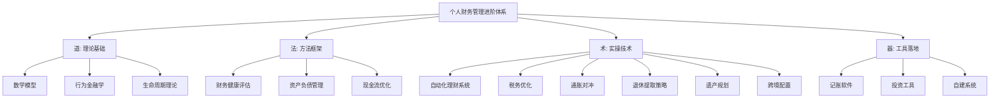
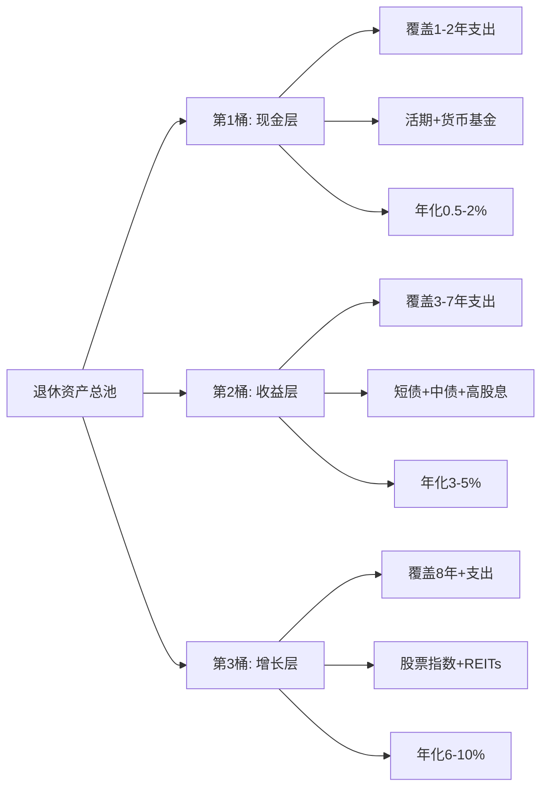
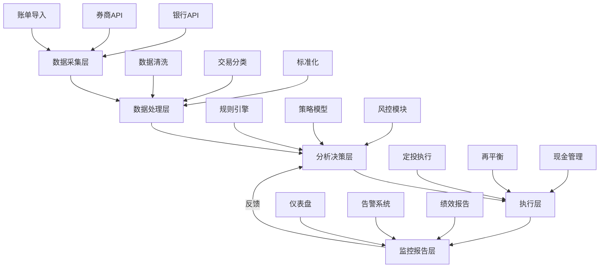
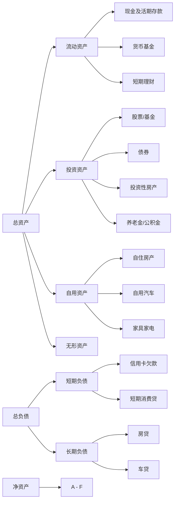
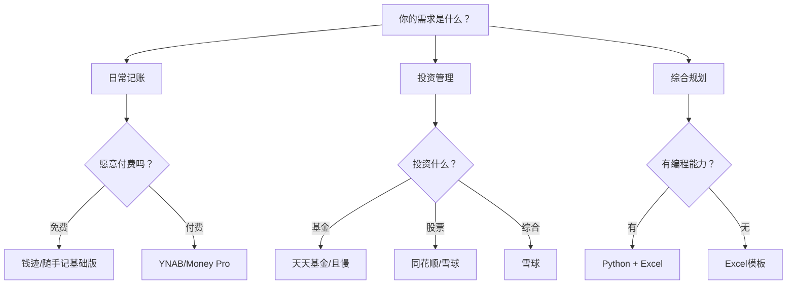

# 第13章 深度拓展：个人财务管理工具的进阶应用

个人财务管理的本质是**用数学语言描述财务决策，用系统工程实现财务目标**。本章从数学模型、通胀对冲、退休提取、紧急基金优化、自动化系统、评估框架、资产编制、现金流管理、税务优化、行为矫正与习惯养成、遗产规划、跨境配置和工具选型十三个维度，构建一套完整的进阶财务管理体系。无论你是刚开始认真管理财务的新手，还是已有多年经验的投资者，本章提供的框架和方法都能帮助你将个人财务管理提升到一个新的水平。

> **阅读提示**：本章内容深度递进，建议按顺序阅读。每节的 Python 代码均可直接运行，动手实践比单纯阅读效果提升 3 倍以上。

**本章知识体系全景图**：



***

## 一、财务管理的数学模型

数学模型是财务决策的底层语言。不做数学分析的财务管理，本质上是在"凭感觉"做决策。本节介绍个人财务管理中最核心的数学工具，每个模型都配有计算公式、Python 实现和实际案例。

### 1.1 复利模型与时间价值

复利是财务管理中最基本也最重要的数学模型。爱因斯坦曾称复利为"世界第八大奇迹"——这句话是否出自他口存疑，但复利的威力确实不亚于此。

**单利 vs 复利的本质区别**：单利只对本金计息，复利对"本金+已产生的利息"计息。这个看似微小的差异，在时间维度上会产生巨大的分野。

复利公式为：

**FV = PV × (1 + r)^n**

其中：FV为终值（Future Value），PV为现值（Present Value），r为每期利率，n为期数。

复利的威力在于其指数增长特性。以年化收益率7%为例：

| 年数 | 终值倍数 | 10万元变为 | 累计利息 |
|------|---------|-----------|---------|
| 10年 | 1.97倍 | 19.7万 | 9.7万 |
| 20年 | 3.87倍 | 38.7万 | 28.7万 |
| 30年 | 7.61倍 | 76.1万 | 66.1万 |
| 40年 | 14.97倍 | 149.7万 | 139.7万 |

注意最后10年（30→40年）的增长量：73.6万。而前10年仅增长9.7万。这就是"时间是复利最好的朋友"的数学解释。

**用 Python 验证复利增长**：

```python
import numpy as np
import matplotlib.pyplot as plt

def compound_growth(principal, rate, years):
    """计算复利增长曲线"""
    return principal * (1 + rate) ** np.arange(years + 1)

# 对比单利与复利
principal = 100000  # 10万元
rate = 0.07
years = 40

compound = compound_growth(principal, rate, years)
simple = principal * (1 + rate * np.arange(years + 1))

# 第40年终值对比
print(f"复利终值: {compound[-1]:,.0f}元")  # 1,497,446元
print(f"单利终值: {simple[-1]:,.0f}元")     # 380,000元
print(f"差异倍数: {compound[-1]/simple[-1]:.1f}倍")  # 3.9倍
```

**72法则**：资产翻倍所需的时间约等于72除以年化收益率。这个近似公式在收益率5%-15%范围内误差极小：

| 年化收益率 | 72法则估算 | 精确计算 | 误差 |
|-----------|-----------|---------|------|
| 4% | 18.0年 | 17.67年 | +0.33年 |
| 7% | 10.3年 | 10.24年 | +0.06年 |
| 10% | 7.2年 | 7.27年 | -0.07年 |
| 12% | 6.0年 | 6.12年 | -0.12年 |
| 15% | 4.8年 | 4.96年 | -0.16年 |

**现值计算**：PV = FV / (1 + r)^n。现值计算是评估未来现金流价值的基础。一个实际应用场景：10年后需要100万元子女教育金，按5%的贴现率计算，现在需要准备约61.4万元。如果从现在开始每月定投，需要投入多少？

```python
def monthly_investment_for_target(target_fv, annual_rate, months):
    """计算达到目标终值所需的每月定投金额"""
    monthly_rate = annual_rate / 12
    # 年金终值公式变形: PMT = FV * r / ((1+r)^n - 1)
    return target_fv * monthly_rate / ((1 + monthly_rate) ** months - 1)

target = 1000000  # 100万目标
months = 120      # 10年 = 120个月
annual_rate = 0.07

pmt = monthly_investment_for_target(target, annual_rate, months)
print(f"每月需定投: {pmt:,.0f}元")  # 约5,778元
print(f"总投入: {pmt * months:,.0f}元")  # 约693,360元
print(f"复利收益: {target - pmt * months:,.0f}元")  # 约306,640元
```

**年金计算**：普通年金终值 FV = PMT × [(1+r)^n - 1] / r。这是计算定期定额投资终值的公式。例如，每月投资2000元，年化收益率8%，30年后的终值约为298万元。其中本金仅72万元，复利收益高达226万元——复利贡献了总收益的76%。

**年金现值**：PV = PMT × [1 - (1+r)^(-n)] / r。用于计算未来一系列等额支付在今天的价值。典型应用：评估一份承诺每年支付10万元、持续20年的年金保险的实际价值（按5%贴现率约为124.6万元）。

**永续年金**：当 n→∞ 时，PV = PMT / r。这是评估永久性收入流的公式。例如，一个每年分红5万元的股票组合，按8%的贴现率计算，合理估值为62.5万元。这个公式也是"4%退休法则"的数学基础——如果年支出为20万元，按4%的提取率反推，需要500万元的退休储蓄（20万 / 4% = 500万）。

### 1.2 投资组合理论

单个资产的风险和收益是孤立的，但将多个资产组合在一起时，它们之间的相关性会产生"1+1<2"的风险对冲效果。这就是投资组合理论的核心洞察。

**马科维茨均值-方差模型**：现代投资组合理论（MPT）的基石，哈里·马科维茨因此获得1990年诺贝尔经济学奖。核心思想是：通过资产配置，可以在不降低预期收益的情况下降低风险，或在不增加风险的情况下提高收益。

投资组合的预期收益率：E(Rp) = Σ wi × E(Ri)

投资组合的方差：σp² = Σ Σ wi × wj × σij

其中 wi 和 wj 是各资产的权重，σij 是资产 i 和 j 之间的协方差。关键点在于：当两种资产的相关系数 ρ < 1 时，组合的方差一定小于各资产方差的加权平均。这就是分散化降低风险的数学原理。

```python
import numpy as np

def portfolio_stats(weights, returns, cov_matrix):
    """计算投资组合的预期收益率和标准差"""
    port_return = np.dot(weights, returns)
    port_variance = np.dot(weights.T, np.dot(cov_matrix, weights))
    port_std = np.sqrt(port_variance)
    return port_return, port_std

# 示例：A股、债券、黄金三资产组合
expected_returns = np.array([0.10, 0.04, 0.06])  # 预期收益率
std_devs = np.array([0.22, 0.05, 0.15])           # 标准差
# 相关系数矩阵
corr_matrix = np.array([
    [1.0, 0.1, -0.1],   # A股与债券低正相关，与黄金负相关
    [0.1, 1.0, 0.05],   # 债券与黄金几乎不相关
    [-0.1, 0.05, 1.0]
])
# 协方差矩阵 = 相关系数 × 标准差的外积
cov_matrix = np.outer(std_devs, std_devs) * corr_matrix

# 等权重组合
w = np.array([0.33, 0.34, 0.33])
ret, risk = portfolio_stats(w, expected_returns, cov_matrix)
print(f"组合预期收益: {ret:.2%}")   # 约6.6%
print(f"组合风险(标准差): {risk:.2%}")  # 约8.8%，远低于A股的22%
```

**有效前沿（Efficient Frontier）**：在给定风险水平下能够提供最高预期收益率的投资组合的集合。投资者应该选择有效前沿上的投资组合——任何位于有效前沿下方的组合都是"低效的"，因为存在同等风险下收益更高的替代方案。

**有效前沿的 Python 实现**：

```python
import numpy as np
from scipy.optimize import minimize

def find_efficient_frontier(expected_returns, cov_matrix, n_points=100):
    """生成有效前沿上的投资组合"""
    n_assets = len(expected_returns)
    results = []
    
    # 目标收益率范围
    target_returns = np.linspace(
        min(expected_returns), max(expected_returns), n_points
    )
    
    for target_ret in target_returns:
        # 最小化组合方差，约束条件：权重之和=1，预期收益=目标
        constraints = [
            {"type": "eq", "fun": lambda w: np.sum(w) - 1},
            {"type": "eq", "fun": lambda w: np.dot(w, expected_returns) - target_ret}
        ]
        bounds = tuple((0, 1) for _ in range(n_assets))  # 不允许做空
        
        result = minimize(
            fun=lambda w: np.dot(w.T, np.dot(cov_matrix, w)),
            x0=np.ones(n_assets) / n_assets,
            method="SLSQP",
            bounds=bounds,
            constraints=constraints
        )
        if result.success:
            port_std = np.sqrt(result.fun)
            results.append((port_std, target_ret, result.x))
    
    return results
```

**资本资产定价模型（CAPM）**：E(Ri) = Rf + βi × (E(Rm) - Rf)

其中 Rf 是无风险利率，βi 是资产 i 的系统性风险系数，E(Rm) 是市场预期收益率。CAPM 的核心含义是：只有系统性风险（不可分散的风险）才能获得风险溢价。个股的特有风险可以通过分散化消除，因此市场不会为此付费。

β系数衡量的是资产相对于市场的波动性：
- β = 1：资产波动与市场一致
- β > 1：资产波动大于市场（进攻型，如科技股β通常为1.2-1.5）
- β < 1：资产波动小于市场（防御型，如公用事业股β通常为0.5-0.8）
- β < 0：资产与市场反向运动（极少见，如某些避险资产）

**CAPM的局限性**：现实中，CAPM 的预测经常偏离实际。法马-弗伦奇三因子模型在此基础上增加了规模因子（小盘股溢价）和价值因子（低市净率股票溢价），对A股市场的解释力更强。后续又扩展为五因子模型，增加了盈利能力和投资风格因子。

**投资者应关注的实际含义**：投资组合的收益90%以上由资产配置决定，而非个股选择。研究表明，机构投资者90%的回报差异来自资产配置决策，而非证券选择或择时。这意味着，你花在"买什么基金"上的时间，远不如花在"股票和债券各配多少"上有价值。

### 1.3 财务比率分析

财务比率是将复杂的财务数据转化为可比较、可判断的标准化指标。以下比率构成个人财务健康的"体检指标"。

**流动性比率**（衡量短期偿债能力）：
- 流动比率 = 流动资产 / 流动负债。建议 ≥ 3，意味着流动资产至少能覆盖3个月的短期债务
- 紧急备用金比率 = 紧急备用金 / 月支出。建议 ≥ 6，即至少储备6个月的生活费
- 速动比率 =（流动资产 - 存货类资产）/ 流动负债。对个人而言，排除不易变现的资产

**负债比率**（衡量债务负担）：
- 负债比率 = 总负债 / 总资产。建议 ≤ 50%。超过70%属于高风险区间
- 偿债比率 = 月还款额 / 月收入。建议 ≤ 40%。银行审批房贷时通常要求不超过50%
- 利息覆盖率 = 年收入 / 年利息支出。建议 ≥ 5

**储蓄比率**（衡量财富积累能力）：
- 储蓄比率 = 月储蓄 / 月收入。建议 ≥ 20%。财务自由追求者通常目标在50%以上
- 投资资产比率 = 投资资产 / 总资产。建议逐年提高，反映从"消费型"向"投资型"的转变

**财务自由度指标**：
- 财务自由度 = 被动收入 / 日常支出
- 当财务自由度 ≥ 1 时，即实现财务自由——被动收入足以覆盖全部生活开支
- 财务自由度 ≥ 0.5 属于"半退休"状态，工作变为可选项而非必需

**一个完整的比率分析案例**：

| 指标 | 张三（月入2万） | 李四（月入2万） | 判断标准 |
|------|----------------|----------------|---------|
| 储蓄比率 | 30%（月存6000） | 8%（月存1600） | ≥20%为佳 |
| 偿债比率 | 25%（月还5000） | 55%（月还11000） | ≤40%为佳 |
| 紧急备用金 | 12个月 | 1.5个月 | ≥6个月为佳 |
| 投资资产比率 | 35% | 8% | 逐年提高 |
| 财务自由度 | 0.15 | 0.02 | ≥1为自由 |

同样月入2万，张三的财务状况远优于李四。问题不在收入，而在结构。

**财务比率的趋势分析**：单个时点的比率只是一张快照，真正有价值的是趋势。建议每月计算核心比率并绘制趋势图：

```python
import matplotlib.pyplot as plt

# 模拟12个月的财务比率变化
months = list(range(1, 13))
savings_rate = [0.15, 0.18, 0.20, 0.19, 0.22, 0.25, 0.23, 0.26, 0.28, 0.27, 0.30, 0.32]
debt_ratio = [0.65, 0.63, 0.60, 0.58, 0.55, 0.52, 0.50, 0.48, 0.45, 0.43, 0.40, 0.38]
emergency_months = [1.5, 2.0, 2.5, 3.0, 3.5, 4.0, 4.5, 5.0, 5.5, 6.0, 6.5, 7.0]

fig, axes = plt.subplots(1, 3, figsize=(15, 4))
axes[0].plot(months, savings_rate, "g-o"); axes[0].set_title("储蓄率趋势"); axes[0].axhline(y=0.2, color="r", linestyle="--", label="建议线")
axes[1].plot(months, debt_ratio, "r-o"); axes[1].set_title("负债率趋势"); axes[1].axhline(y=0.5, color="orange", linestyle="--", label="警戒线")
axes[2].plot(months, emergency_months, "b-o"); axes[2].set_title("紧急备用金月数"); axes[2].axhline(y=6, color="g", linestyle="--", label="安全线")
for ax in axes: ax.legend(); ax.set_xlabel("月份")
plt.tight_layout()
plt.savefig("financial_health_trends.png", dpi=150)
```

### 1.4 蒙特卡洛模拟：量化财务规划的不确定性

确定性计算（如"每年收益7%"）忽略了一个关键事实：实际收益是波动的。蒙特卡洛模拟通过随机抽样，生成数千种可能的未来路径，告诉你"目标达成的概率是多少"。

```python
import numpy as np

def monte_carlo_retirement(
    initial_savings,      # 当前储蓄
    annual_contribution,  # 年储蓄额
    years,                # 距退休年数
    expected_return,      # 预期年化收益率
    volatility,           # 收益率波动（标准差）
    target_amount,        # 目标金额
    simulations=10000     # 模拟次数
):
    """蒙特卡洛模拟退休储蓄"""
    results = []
    for _ in range(simulations):
        balance = initial_savings
        for year in range(years):
            # 每年收益率从正态分布中随机抽取
            annual_return = np.random.normal(expected_return, volatility)
            balance = balance * (1 + annual_return) + annual_contribution
        results.append(balance)
    
    results = np.array(results)
    probability = np.mean(results >= target_amount)
    percentiles = np.percentile(results, [5, 25, 50, 75, 95])
    
    return {
        "达成概率": f"{probability:.1%}",
        "5%分位(悲观)": f"{percentiles[0]:,.0f}元",
        "25%分位": f"{percentiles[1]:,.0f}元",
        "中位数": f"{percentiles[2]:,.0f}元",
        "75%分位": f"{percentiles[3]:,.0f}元",
        "95%分位(乐观)": f"{percentiles[4]:,.0f}元"
    }

# 场景：30岁，有10万储蓄，每年存8万，目标60岁前攒够500万
result = monte_carlo_retirement(
    initial_savings=100000,
    annual_contribution=80000,
    years=30,
    expected_return=0.07,
    volatility=0.15,
    target_amount=5000000
)
for k, v in result.items():
    print(f"{k}: {v}")
```

蒙特卡洛模拟的价值不在于"算出一个精确数字"，而在于**量化不确定性**。如果模拟显示达成概率仅为40%，你需要调整策略（增加储蓄、降低目标、延长年限），而不是继续祈祷市场会一直上涨。

**蒙特卡洛模拟的进阶应用**：除了退休规划，蒙特卡洛模拟还可用于以下场景：

1. **应急基金测试**：模拟10000次突发大额支出的场景（失业、疾病、意外），测试现有应急基金能否覆盖95%的情况
2. **教育金规划**：考虑学费增长率（通常高于一般通胀）、汇率波动（留学场景）等不确定因素
3. **提前退休压力测试**：FIRE（财务自由提前退休）人群常用蒙特卡洛模拟验证"4%提取率"在不同市场环境下的可持续性

```python
import numpy as np

def monte_carlo_withdrawal(
    initial_portfolio,
    annual_withdrawal,
    years,
    expected_return,
    volatility,
    simulations=10000
):
    """蒙特卡洛模拟退休后提取，测试资金是否会耗尽"""
    depleted_count = 0
    min_balances = []
    
    for _ in range(simulations):
        balance = initial_portfolio
        depleted = False
        min_balance = balance
        
        for year in range(years):
            annual_return = np.random.normal(expected_return, volatility)
            balance = balance * (1 + annual_return) - annual_withdrawal
            min_balance = min(min_balance, balance)
            if balance <= 0:
                depleted = True
                break
        
        if depleted:
            depleted_count += 1
        min_balances.append(min_balance)
    
    survival_rate = 1 - depleted_count / simulations
    return {
        "资金存活率": f"{survival_rate:.1%}",
        "资金耗尽概率": f"{depleted_count/simulations:.1%}",
        "最低余额5%分位": f"{np.percentile(min_balances, 5):,.0f}元",
    }

# 场景：500万退休资产，每年提取20万，持续30年
result = monte_carlo_withdrawal(
    initial_portfolio=5000000,
    annual_withdrawal=200000,
    years=30,
    expected_return=0.06,
    volatility=0.12
)
for k, v in result.items():
    print(f"{k}: {v}")
```

### 1.5 常见数学模型使用误区

**误区一：忽略通胀**
用名义收益率计算复利会严重高估实际购买力。假设年化收益8%，通胀3%，实际收益率仅约4.85%（(1.08/1.03)-1）。100万按8%复利30年为1006万，但按4.85%实际复利仅约413万。差距近600万——这就是通胀的隐性税。

**误区二：用平均收益率代替序列风险**
年化平均收益10%不代表每年都赚10%。第一年亏50%、第二年涨111%，平均收益约10%，但实际本金从100万变成55万再变成116万。先亏后赚的结果远不如稳定收益，这就是"序列风险"。

序列风险对退休提取者尤为致命：退休早期如果遭遇大幅亏损，加上持续提取，资产可能永久性缩水，再也无法恢复。因此退休后的投资应降低波动性，而非一味追求高收益。

**误区三：过度拟合历史数据**
用过去10年的收益率预测未来30年，忽略了经济周期、政策变化和均值回归效应。成熟市场的长期股权收益率约7-10%，但短期可能偏离很远。

更深层的问题是"生存者偏差"：我们看到的历史指数数据排除了已退市的公司和已消失的市场。曾经的全球第二大股票市场——日本日经225指数，从1989年的38957点到2024年才回到这个水平，经历了35年的"失落"。

**误区四：忽略费用和税收的复利效应**
1%的管理费在30年周期内会吞噬约25%的总收益。年化收益7%、管理费1%的情况下，30年后实际终值比无费用情况少了近四分之一。

具体计算：100万按7%增长30年为761万；按6%（扣费后）增长30年为574万。差异187万，相当于总收益的25%。这就是为什么低成本指数基金长期跑赢大多数主动管理基金。

**误区五：混淆名义资产与实际可变现金额**
自住房产估值200万，但紧急情况下快速出售可能只能拿到160万（急售折价20%），扣除交易税费后可能只有145万。养老金账户有50万，但提前支取需缴纳高额税费和罚款。投资账户有100万浮盈，但卖出后需缴纳资本利得税。**财务规划应基于"可变现净值"而非"账面市值"。**

**误区六：忽视提取率的脆弱性**
经典的"4%退休法则"基于美国历史数据（1926-1995年的回测），假设退休期30年。但这个法则在以下情况下可能失效：退休期超过30年（提前退休人群）、投资组合中缺少国际分散、处于低利率高通胀环境、前5年遭遇熊市。更稳健的做法是使用动态提取率：市场好时提取3.5%，市场差时提取3%，保持灵活性。

### 1.6 通胀对冲与资产保值策略

通胀是购买力的隐性税。年化3%的通胀在24年后会吞噬一半的购买力。理解通胀机制并构建对冲组合，是长期财务规划的核心能力。

**通胀的分类与影响**：

| 通胀类型 | 成因 | 影响 | 对冲难度 |
|---------|------|------|---------|
| 需求拉动型 | 经济过热、货币超发 | 资产价格普涨，工资滞后 | 中等 |
| 成本推动型 | 原材料涨价、供应链中断 | 生活成本上升，企业利润压缩 | 较高 |
| 结构型 | 人口老龄化、资源瓶颈 | 长期慢性通胀，难以逆转 | 高 |
| 滞胀 | 经济停滞+通胀并存 | 最恶劣环境，资产和收入双杀 | 极高 |

**各类资产的通胀对冲能力**：

| 资产类别 | 短期对冲（1-2年） | 长期对冲（10年+） | 流动性 | 门槛 |
|---------|-----------------|-----------------|--------|------|
| 股票（宽基指数） | 弱（可能随通胀下跌） | 强（企业盈利随通胀增长） | 高 | 低 |
| 房产（投资性） | 中（租金随通胀调整） | 强（实物资产+租金增长） | 低 | 高 |
| 黄金 | 强（避险属性） | 中（不产生收益） | 中 | 低 |
| 通胀挂钩债券（TIPS） | 强（本金随CPI调整） | 强（直接挂钩通胀） | 中 | 中 |
| 大宗商品 | 强（成本推动型直接受益） | 弱（长期回报低于股票） | 中 | 中 |
| 活期存款/现金 | 极弱（利率远低于通胀） | 极弱 | 极高 | 低 |
| 加密货币（BTC） | 波动极大 | 不确定（样本期太短） | 中 | 低 |

**构建通胀对冲组合的实操方案**：

```python
def inflation_hedge_portfolio(
    total_investment,
    inflation_expectation=0.03,  # 预期通胀率
    risk_level="moderate",       # "conservative", "moderate", "aggressive"
):
    """根据通胀预期和风险偏好构建对冲组合"""
    allocations = {
        "conservative": {
            "宽基指数基金": 0.25,
            "通胀挂钩债券": 0.25,
            "黄金ETF": 0.15,
            "短期债券基金": 0.20,
            "货币基金": 0.15,
        },
        "moderate": {
            "宽基指数基金": 0.40,
            "通胀挂钩债券": 0.15,
            "黄金ETF": 0.10,
            "REITs(房地产信托)": 0.10,
            "债券基金": 0.15,
            "货币基金": 0.10,
        },
        "aggressive": {
            "宽基指数基金": 0.50,
            "黄金ETF": 0.10,
            "REITs(房地产信托)": 0.15,
            "大宗商品基金": 0.10,
            "新兴市场基金": 0.10,
            "货币基金": 0.05,
        },
    }
    
    portfolio = allocations.get(risk_level, allocations["moderate"])
    result = {}
    for asset, weight in portfolio.items():
        amount = total_investment * weight
        result[asset] = {"比例": f"{weight:.0%}", "金额": f"{amount:,.0f}元"}
    
    # 估算组合的预期实际收益率（名义收益 - 通胀）
    expected_nominal = {
        "conservative": 0.045,
        "moderate": 0.065,
        "aggressive": 0.085,
    }
    nominal = expected_nominal.get(risk_level, 0.065)
    real_return = (1 + nominal) / (1 + inflation_expectation) - 1
    
    print(f"=== 通胀对冲组合（{risk_level}型）===")
    print(f"预期名义收益率: {nominal:.1%}")
    print(f"预期通胀率: {inflation_expectation:.1%}")
    print(f"预期实际收益率: {real_return:.2%}")
    print(f"\n资产配置:")
    for asset, detail in result.items():
        print(f"  {asset}: {detail['比例']} ({detail['金额']})")
    
    return result

# 示例：中等风险的通胀对冲组合
inflation_hedge_portfolio(500000, risk_level="moderate")
```

**通胀对冲的关键原则**：

1. **不要持有过多现金**：活期存款0.2%的利率在3%通胀下每年实际亏损2.8%。10万元闲置一年，购买力缩水2800元。仅保留必要的流动性资金（1-3个月支出），其余应投入能跑赢通胀的资产。

2. **关注实际收益率而非名义收益率**：投资广告说"年化6%"，如果通胀3%，实际购买力增长仅约2.9%。所有投资决策都应基于实际收益率。

3. **股票是长期最可靠的通胀对冲**：虽然短期股票可能随通胀下跌（央行加息应对通胀时），但长期来看，企业盈利随通胀增长，股票回报率历史上始终跑赢通胀。1926-2023年的美国数据显示，股票的实际年化收益率约7%，远超债券的2%。

4. **定期审视对冲组合的有效性**：通胀环境会变化（从低通胀转为高通胀时，应增加实物资产配置；从高通胀转为低通胀时，应增加债券配置）。


### 1.7 生命周期投资与年龄-风险模型

投资决策中最关键的变量之一是**投资期限**。一个30岁的投资者和一个55岁的投资者，即使风险偏好相同，最优资产配置也应该截然不同。生命周期投资理论的核心思想是：**人力资本（未来劳动收入的现值）本质上是一种"债券类资产"**——年轻时人力资本占比高，可以多配风险资产；年老时人力资本缩水，应增加安全资产比例。

**年龄-风险配置的经典公式**：

股票配置比例 ≈ 100 - 年龄（或更激进的 110 - 年龄）

这个公式虽然简单，但背后的逻辑是深刻的：年轻人有更长的时间来承受市场波动，即使短期亏损也有时间等待恢复；而临近退休的人，如果遭遇大幅亏损，可能没有足够的时间来弥补。

**不同年龄段的配置建议**：

| 年龄段 | 股票类 | 债券类 | 现金类 | 核心逻辑 |
|--------|--------|--------|--------|---------|
| 20-30岁 | 70-80% | 15-20% | 5-10% | 人力资本充裕，时间是最大优势 |
| 30-40岁 | 60-70% | 20-30% | 5-10% | 收入增长期，平衡增长与风险 |
| 40-50岁 | 50-60% | 30-35% | 5-15% | 退休规划关键期，逐步降低风险 |
| 50-60岁 | 35-50% | 35-45% | 10-20% | 保本优先，降低波动性 |
| 60岁+ | 20-35% | 40-50% | 15-30% | 现金流需求为主，稳健为先 |

**人力资本的量化评估**：你的"赚钱能力"其实是一项资产。评估方法：将未来预期年收入按适当的贴现率折算为现值。例如，30岁月入2万，假设收入每年增长5%，到60岁退休，按5%贴现率计算，人力资本现值约720万元。这意味着一个30岁年轻人的"总资产"远不只是银行存款——他的最大资产是自己的劳动能力。这也解释了为什么年轻人应该更激进地投资：即使股票全部亏损（极端假设），他还有720万的人力资本作为安全垫。

```python
def lifecycle_asset_allocation(
    age,
    retirement_age=60,
    risk_tolerance="moderate",  # "conservative", "moderate", "aggressive"
    human_capital_ratio=None,   # 人力资本占比（可选，自动估算）
):
    """生命周期资产配置建议"""
    years_to_retirement = max(0, retirement_age - age)
    
    # 基础股票配置
    base_equity = min(90, max(20, 110 - age))
    
    # 风险偏好调整
    tolerance_adj = {
        "conservative": -15,
        "moderate": 0,
        "aggressive": +10,
    }
    equity_pct = base_equity + tolerance_adj.get(risk_tolerance, 0)
    equity_pct = min(90, max(15, equity_pct))
    
    # 退休后进一步降低
    if age >= retirement_age:
        equity_pct = max(15, equity_pct - (age - retirement_age) * 1.5)
    
    bond_pct = min(60, max(10, 100 - equity_pct - 10))
    cash_pct = 100 - equity_pct - bond_pct
    
    return {
        "年龄": age,
        "距退休年数": years_to_retirement,
        "建议股票配置": f"{equity_pct:.0f}%",
        "建议债券配置": f"{bond_pct:.0f}%",
        "建议现金配置": f"{cash_pct:.0f}%",
        "配置逻辑": (
            "进攻型" if equity_pct >= 70 else
            "平衡型" if equity_pct >= 50 else
            "防御型"
        ),
    }

# 测试不同年龄
for age in [25, 35, 45, 55, 65]:
    result = lifecycle_asset_allocation(age)
    print(f"  {result['年龄']}岁: 股票{result['建议股票配置']} 债券{result['建议债券配置']} 现金{result['建议现金配置']} ({result['配置逻辑']})")
```

**滑行路径（Glide Path）策略**：不是每年突然调整配置，而是按照预设的"滑行路径"逐步降低风险资产比例。主流的滑行路径有三种：

| 策略 | 特点 | 适合人群 |
|------|------|---------|
| 直线型 | 每年等比例降低股票配置（如每年降1%） | 喜欢简单规则的投资者 |
| 阶梯型 | 每10年调整一次（30-40岁70%，40-50岁55%…） | 不想频繁调整的投资者 |
| 前陡后缓型 | 前期保持高配，退休前5年快速降低 | 后期发力型投资者 |

Vanguard的Target Date基金（目标日期基金）就是滑行路径策略的典型产品——你选择一个目标退休年份（如"2050退休"），基金自动按预设路径调整股债比例。国内的养老目标基金也采用类似策略。


### 1.8 退休收入提取策略

积累退休资产只是上半场，如何在退休后安全、可持续地提取资产才是下半场。提取策略不当，即使积累了500万也可能在晚年耗尽。

**经典4%法则及其局限**：

4%法则（由William Bengen在1994年提出）：退休第一年提取退休资产的4%，之后每年按通胀率调整提取金额。基于美国1926-1995年数据回测，这种策略在30年退休期内的成功率约95%。

但4%法则的假设条件非常严格：

| 假设条件 | 现实差异 | 影响 |
|---------|---------|------|
| 30年退休期 | 提前退休者可能需要40-50年 | 失效风险显著增加 |
| 50%股票+50%债券 | 实际配置千差万别 | 过于保守会失败 |
| 美国市场数据 | 其他市场表现差异大 | 日本投资者用4%法则会失败 |
| 固定提取率 | 实际支出会变化 | 退休早期支出通常更高 |
| 不考虑税费 | 提取时需缴税 | 实际可用金额减少 |

**动态提取策略（Dynamic Withdrawal）**：根据市场表现和剩余资产调整提取金额，比固定提取率更安全。

```python
def dynamic_withdrawal_simulation(
    initial_portfolio,
    base_withdrawal_rate=0.04,
    years=30,
    expected_return=0.06,
    volatility=0.12,
    floor_rate=0.03,    # 最低提取率
    ceiling_rate=0.05,  # 最高提取率
    simulations=5000
):
    """动态提取策略模拟：根据市场表现调整提取率"""
    import numpy as np
    
    depleted_count = 0
    final_balances = []
    
    for _ in range(simulations):
        balance = initial_portfolio
        annual_withdrawal = initial_portfolio * base_withdrawal_rate
        depleted = False
        
        for year in range(years):
            if balance <= 0:
                depleted = True
                break
            
            # 动态调整提取率：根据上一年的资产变化
            if year > 0:
                # 如果资产比初始值高，可以多提一点；低了就少提
                portfolio_ratio = balance / initial_portfolio
                adjusted_rate = base_withdrawal_rate * portfolio_ratio
                adjusted_rate = max(floor_rate, min(ceiling_rate, adjusted_rate))
                annual_withdrawal = balance * adjusted_rate
            
            # 模拟市场收益
            annual_return = np.random.normal(expected_return, volatility)
            balance = balance * (1 + annual_return) - annual_withdrawal
            
            if balance <= 0:
                depleted = True
                break
        
        if depleted:
            depleted_count += 1
        final_balances.append(max(0, balance))
    
    survival_rate = 1 - depleted_count / simulations
    return {
        "资金存活率": f"{survival_rate:.1%}",
        "资金耗尽概率": f"{depleted_count/simulations:.1%}",
        "最终余额中位数": f"{np.median(final_balances):,.0f}元",
        "最终余额10%分位": f"{np.percentile(final_balances, 10):,.0f}元",
    }

# 对比固定4%和动态提取
print("=== 固定4%提取率 ===")
# 使用monte_carlo_withdrawal函数（前面已定义）
print("=== 动态提取率（3%-5%浮动）===")
result = dynamic_withdrawal_simulation(
    initial_portfolio=5000000,
    base_withdrawal_rate=0.04,
    years=30,
    expected_return=0.06,
    volatility=0.12
)
for k, v in result.items():
    print(f"  {k}: {v}")
```

**桶策略（Bucket Strategy）**：将退休资产分为多个"桶"，每桶对应不同时间段和风险级别，是实践中最受欢迎的退休提取策略。



**桶策略的实施方法**：

| 桶 | 规模 | 资产类型 | 年化收益 | 目的 |
|----|------|---------|---------|------|
| 第1桶（即时） | 1-2年支出 | 活期存款、货币基金 | 0.5-2% | 日常开支，不受市场波动影响 |
| 第2桶（中期） | 3-7年支出 | 短债基金、高股息股、银行理财 | 3-5% | 补充第1桶，缓冲市场波动 |
| 第3桶（长期） | 剩余资产 | 股票指数基金、REITs、黄金 | 6-10% | 长期增长，抵御通胀 |

**桶策略的运行逻辑**：
1. 每年从第1桶提取生活费
2. 市场好年份：从第3桶收益中补充第1桶和第2桶
3. 市场差年份：不动第3桶，仅用第1桶和第2桶维持
4. 每2-3年重新平衡各桶的规模

**桶策略 vs 固定比例提取的对比**：

| 维度 | 固定比例提取 | 桶策略 |
|------|-----------|--------|
| 心理安慰 | 低（市场跌时仍需卖出） | 高（短期支出不受市场影响） |
| 操作复杂度 | 低 | 中等 |
| 序列风险防护 | 弱 | 强（短期资金不参与市场） |
| 长期收益 | 略高（全部资金持续投资） | 略低（部分资金低收益） |
| 适合人群 | 风险承受力高的人 | 大多数退休者 |

**中国的社保养老金与个人退休规划**：

中国的退休收入来源包括三个层次（三支柱体系）：

| 支柱 | 来源 | 特点 | 替代率 |
|------|------|------|--------|
| 第一支柱 | 基本养老保险 | 政府主导，覆盖面广 | 40-60%（逐年下降趋势） |
| 第二支柱 | 企业年金/职业年金 | 企业主导，覆盖面窄（约7%） | 10-20% |
| 第三支柱 | 个人养老金+商业保险 | 个人主导，2022年启动 | 取决于个人投入 |

**退休收入缺口计算**：

```python
def retirement_income_gap(
    current_age,
    retirement_age=60,
    life_expectancy=85,
    current_monthly_expense,
    inflation_rate=0.03,
    social_security_replacement=0.50,  # 社保替代率
    current_retirement_savings=0,
    expected_return=0.06,
):
    """计算退休收入缺口"""
    years_to_retirement = retirement_age - current_age
    years_in_retirement = life_expectancy - retirement_age
    
    # 退休时的月支出（考虑通胀）
    expense_at_retirement = current_monthly_expense * (1 + inflation_rate) ** years_to_retirement
    
    # 社保月养老金
    social_security_monthly = expense_at_retirement * social_security_replacement
    
    # 每月缺口
    monthly_gap = expense_at_retirement - social_security_monthly
    
    # 退休总需求（考虑退休期间通胀的精算现值）
    # 简化：假设退休期间支出按通胀增长，用实际收益率贴现
    real_return = (1 + expected_return) / (1 + inflation_rate) - 1
    if real_return > 0:
        total_needed = monthly_gap * 12 * (1 - (1 + real_return) ** (-years_in_retirement)) / real_return
    else:
        total_needed = monthly_gap * 12 * years_in_retirement
    
    # 当前储蓄的终值
    current_savings_fv = current_retirement_savings * (1 + expected_return) ** years_to_retirement
    
    # 缺口
    gap = max(0, total_needed - current_savings_fv)
    
    # 每月需储蓄
    monthly_rate = expected_return / 12
    months = years_to_retirement * 12
    if monthly_rate > 0:
        monthly_saving_needed = gap * monthly_rate / ((1 + monthly_rate) ** months - 1)
    else:
        monthly_saving_needed = gap / months
    
    return {
        "退休时月支出": f"{expense_at_retirement:,.0f}元",
        "社保月养老金": f"{social_security_monthly:,.0f}元",
        "每月缺口": f"{monthly_gap:,.0f}元",
        "退休总需求": f"{total_needed:,.0f}元",
        "当前储蓄终值": f"{current_savings_fv:,.0f}元",
        "资金缺口": f"{gap:,.0f}元",
        "每月需储蓄": f"{monthly_saving_needed:,.0f}元",
    }

# 示例：30岁月入2万，希望60岁退休
result = retirement_income_gap(
    current_age=30,
    retirement_age=60,
    current_monthly_expense=10000,
    current_retirement_savings=100000,
)
for k, v in result.items():
    print(f"  {k}: {v}")
```

### 1.9 紧急基金优化模型

紧急基金不是"越多越好"，而是需要精确计算的。过多的紧急资金意味着资金闲置（活期存款年化仅0.2%），过少则无法应对突发风险。

**紧急基金的最优规模模型**：

最优紧急基金 = max(基本需求, 风险加权需求)

其中：
- 基本需求 = 月支出 × 建议月数（通常6个月）
- 风险加权需求 = 月支出 × 基础月数 × 收入稳定性系数 × 家庭负担系数

**收入稳定性系数**（衡量收入中断风险）：

| 收入来源 | 系数 | 说明 |
|---------|------|------|
| 公务员/事业单位 | 0.8 | 收入极其稳定 |
| 大型企业正式员工 | 1.0 | 基准值 |
| 中小企业员工 | 1.3 | 裁员风险较高 |
| 自由职业/合同工 | 1.8 | 收入波动大 |
| 创业者/个体户 | 2.0-2.5 | 收入高度不确定 |

**家庭负担系数**（衡量家庭财务责任）：

| 家庭状况 | 系数 | 说明 |
|---------|------|------|
| 单身无负担 | 0.7 | 责任最轻 |
| 已婚无子女 | 1.0 | 基准值 |
| 已婚有1个子女 | 1.3 | 增加教育等刚性支出 |
| 已婚有2个及以上子女 | 1.5 | 多子女家庭开支大 |
| 需赡养老人 | +0.3（叠加） | 额外赡养责任 |

```python
def optimal_emergency_fund(
    monthly_expense,
    income_stability=1.0,    # 收入稳定性系数
    family_burden=1.0,       # 家庭负担系数
    health_risk=1.0,         # 健康风险系数（有慢性病取1.3-1.5）
    base_months=3,           # 基础月数
):
    """计算最优紧急备用金规模"""
    basic_need = monthly_expense * 6
    risk_weighted = monthly_expense * base_months * income_stability * family_burden * health_risk
    optimal = max(basic_need, risk_weighted)
    
    # 分层存放建议
    allocation = {
        "活期存款（即时可用）": optimal * 0.3,
        "货币基金（T+1可用）": optimal * 0.4,
        "短债基金/银行理财（T+2可用）": optimal * 0.3,
    }
    
    return {
        "月支出": f"{monthly_expense:,.0f}元",
        "基本需求（6个月）": f"{basic_need:,.0f}元",
        "风险加权需求": f"{risk_weighted:,.0f}元",
        "最优紧急备用金": f"{optimal:,.0f}元",
        "相当于月数": f"{optimal/monthly_expense:.1f}个月",
        "分层存放建议": {k: f"{v:,.0f}元" for k, v in allocation.items()},
        "年化收益预估": f"{optimal * 0.02:,.0f}元（按2%加权收益率）",
    }

# 示例：月支出8000元的中小企业员工，已婚有1个孩子
result = optimal_emergency_fund(
    monthly_expense=8000,
    income_stability=1.3,
    family_burden=1.3,
)
for k, v in result.items():
    print(f"  {k}: {v}")
```

**紧急基金的"三层防御"模型**：

| 层级 | 资金形式 | 规模 | 用途 | 流动性 |
|------|---------|------|------|--------|
| 第一层 | 活期存款/现金 | 1个月支出 | 即时应急（当天可用） | 即时 |
| 第二层 | 货币基金 | 2-3个月支出 | 短期应急（1-3天可用） | T+1 |
| 第三层 | 短债基金/定期理财 | 3-6个月支出 | 中期应急（需要时赎回） | T+2至T+7 |

这种分层结构在保证流动性的同时，将闲置资金的收益率从0.2%（全部存活期）提升到约1.5-2.0%（分层存放的加权收益）。以10万元紧急备用金为例，分层存放每年可多获得约1500元收益。

**紧急基金的"压力测试"方法**：使用蒙特卡洛模拟，测试你的紧急基金在各种极端场景下的表现。考虑以下变量：失业持续时间（取历史中位数3-6个月）、突发医疗支出（参考当地三甲医院常见手术费用）、失业期间是否能领取失业保险（通常为当地最低工资的70-90%，最长24个月）。

***

## 二、自动化理财系统搭建

### 2.1 自动化理财的架构设计

一个完善的自动化理财系统应该采用分层架构，确保数据从采集到执行的完整闭环：



**数据采集层**：自动采集银行账户、投资账户、信用卡账单等财务数据。实现方式按难度递增：
- **手动导入**：导出CSV/Excel，脚本解析。零门槛但需定期操作
- **账单解析**：解析银行短信、邮件账单。中等难度，覆盖面有限
- **开放API**：部分银行和券商提供API接口（如招商银行开放平台）。最稳定但需要申请权限
- **OCR识别**：对截图或PDF账单进行文字识别。通用性强但准确率需人工校验

**数据处理层**：对采集的原始数据进行清洗、分类和标准化处理。核心任务是交易自动分类。

```python
# 交易自动分类的规则引擎示例
CATEGORY_RULES = {
    "餐饮": ["美团", "饿了么", "肯德基", "麦当劳", "海底捞", "外卖"],
    "交通": ["滴滴", "高德", "地铁", "公交", "中国石油", "中国石化"],
    "购物": ["淘宝", "京东", "拼多多", "天猫", "唯品会"],
    "住房": ["链家", "自如", "物业", "水费", "电费", "燃气"],
    "娱乐": ["爱奇艺", "腾讯视频", "网易云", "Steam", "电影"],
    "医疗": ["医院", "药房", "体检", "口腔"],
    "教育": ["得到", "知乎", "Coursera", "培训"],
}

def classify_transaction(description, rules=CATEGORY_RULES):
    """基于关键词匹配的交易分类"""
    for category, keywords in rules.items():
        for keyword in keywords:
            if keyword in description:
                return category
    return "其他"  # 无法分类的交易标记为"其他"，后续人工或ML处理

# 测试
print(classify_transaction("美团外卖-朝阳区"))  # 输出: 餐饮
print(classify_transaction("滴滴出行-快车"))     # 输出: 交通
```

对于规则引擎无法覆盖的交易，可以使用机器学习模型（如朴素贝叶斯或轻量级BERT）进行分类，准确率可达90%以上。

**分析决策层**：基于预设的规则或算法模型，对财务状况进行分析，并生成投资建议和操作指令。关键规则包括：
- 当活期账户余额超过设定阈值（如5万元）时，自动将超额部分转入货币基金
- 当某个投资组合偏离目标配置比例超过5%时，自动触发再平衡操作
- 当月度支出超过预算80%时，发出预警通知

**执行层**：通过API接口或自动化脚本执行投资操作。需要注意的是，完全自动化的交易执行需要考虑合规性和风险控制。建议采用"半自动"模式：系统生成操作建议，人工确认后执行。国内券商的API限制较多，实际可自动化的场景主要是基金定投和货币基金申赎。

**监控报告层**：实时监控系统运行状态，定期生成财务报告和投资绩效分析。告警维度包括：账户余额异常、交易执行失败、投资组合大幅偏离、系统运行异常。

**异常检测与容错设计**：自动化系统必须考虑失败场景：

```python
import time
from datetime import datetime

class FinancialAutomationError(Exception):
    """自动化理财系统的自定义异常"""
    pass

def safe_execute_with_retry(func, max_retries=3, retry_delay=5):
    """带重试机制的安全执行封装"""
    last_error = None
    for attempt in range(max_retries):
        try:
            result = func()
            log_operation(func.__name__, "SUCCESS", f"第{attempt+1}次尝试成功")
            return result
        except Exception as e:
            last_error = e
            log_operation(func.__name__, "RETRY", f"第{attempt+1}次失败: {e}")
            if attempt < max_retries - 1:
                time.sleep(retry_delay * (attempt + 1))  # 指数退避
    
    log_operation(func.__name__, "FAILED", f"重试{max_retries}次后仍失败: {last_error}")
    raise FinancialAutomationError(f"操作失败: {func.__name__}") from last_error

def log_operation(name, status, detail):
    """记录操作日志"""
    timestamp = datetime.now().strftime("%Y-%m-%d %H:%M:%S")
    print(f"[{timestamp}] {status} | {name} | {detail}")
```

### 2.2 自动化投资策略

**定期定额投资（DCA）**：最基础也最实用的自动化投资策略。设定固定的投资金额和投资频率（如每月1日投资2000元到指数基金），系统自动执行。DCA的心理优势在于"不用做决策"，避免择时焦虑。

DCA的关键参数选择：
- **频率**：月定投 vs 周定投差异不大，月定投更便于预算管理
- **金额**：建议为月收入的10-30%，不影响生活质量
- **标的**：宽基指数基金（如沪深300、中证500）最适合DCA
- **起始时机**：任何时机都可以开始，DCA本身就是对择时的否定

**DCA的数学验证**：DCA为什么有效？不是因为它"买在低点"，而是因为它**强制你持续买入**，利用市场波动自动实现"跌时多买、涨时少买"的效果。模拟显示，2010年开始每月定投沪深300指数1000元，到2024年总投入约17万元，市值约24万元，年化收益率约6.5%，远超同期活期存款。

**价值平均策略（Value Averaging）**：比DCA更智能的策略。设定投资组合的目标价值增长路径，当实际价值低于目标时增加投资，高于目标时减少投资或取出。

公式：第n期的目标价值 = n × 每期目标增加值

第n期的投资金额 = 目标价值 - 当前实际价值

```python
def value_averaging(monthly_target_growth, current_value, market_change):
    """价值平均策略的投资金额计算"""
    n = 1  # 当前期数（简化示例）
    target_value = n * monthly_target_growth
    actual_value = current_value * (1 + market_change)
    investment = target_value - actual_value
    # 设置投资金额的上下限
    max_investment = monthly_target_growth * 3  # 最多投3倍
    min_investment = 0  # 不取出（保守版本）
    return max(min_investment, min(investment, max_investment))

# 市场下跌时增加投资，上涨时减少投资
print(value_averaging(2000, 20000, -0.10))  # 市场跌10%: 投4000
print(value_averaging(2000, 20000, 0.00))   # 市场持平: 投2000
print(value_averaging(2000, 20000, 0.10))   # 市场涨10%: 投0
```

**价值平均策略 vs DCA 的对比**：

| 维度 | DCA（定投） | 价值平均 |
|------|-----------|---------|
| 执行难度 | 极低，设置后不管 | 中等，需定期计算 |
| 心理压力 | 低 | 市场大跌时需追加资金 |
| 资金需求 | 固定 | 波动较大，需预留弹性资金 |
| 理论优势 | 强制投资，纪律性强 | 买低卖高，数学最优 |
| 实际效果 | 长期跑赢多数主动管理 | 略优于DCA，但差异不大 |
| 适合人群 | 所有人 | 有纪律且资金灵活的投资者 |

**动态再平衡策略**：当投资组合中各资产的实际比例偏离目标比例超过设定阈值时，自动进行再平衡。再平衡本质上是"卖高买低"——卖出涨多了的资产，买入跌多了的资产。

再平衡的关键决策：
- **阈值设定**：偏离5%触发是常用标准。阈值太小（如1%）会产生过多交易成本，太大（如10%）会失去再平衡意义
- **频率选择**：定期再平衡（如每季度）简单但可能错过最佳时点；触发式再平衡更灵活但需要持续监控
- **执行方式**：优先用新增资金再平衡（避免卖出产生的税费），仅在偏离严重时卖出再平衡

```python
def check_rebalance(portfolio, target_allocation, threshold=0.05):
    """检查投资组合是否需要再平衡"""
    total_value = sum(portfolio.values())
    needs_rebalance = []
    adjustments = {}
    
    for asset, value in portfolio.items():
        current_weight = value / total_value
        target_weight = target_allocation.get(asset, 0)
        deviation = abs(current_weight - target_weight)
        
        if deviation > threshold:
            needs_rebalance.append(asset)
            target_value = total_value * target_weight
            adjustments[asset] = {
                "当前比例": f"{current_weight:.1%}",
                "目标比例": f"{target_weight:.1%}",
                "偏离": f"{deviation:.1%}",
                "调整金额": f"{target_value - value:+,.0f}元"
            }
    
    return {
        "需要再平衡": len(needs_rebalance) > 0,
        "需要调整的资产": needs_rebalance,
        "调整详情": adjustments
    }

# 示例
portfolio = {
    "A股基金": 150000,
    "债券基金": 30000,
    "黄金ETF": 10000,
    "货币基金": 10000,
}
target = {
    "A股基金": 0.50,
    "债券基金": 0.25,
    "黄金ETF": 0.15,
    "货币基金": 0.10,
}
result = check_rebalance(portfolio, target)
for k, v in result.items():
    print(f"{k}: {v}")
```

**智能现金管理策略**：设定活期账户的目标余额（如2个月生活费），当余额超过目标时自动转入货币基金或短债基金，当余额不足时自动赎回。这个策略能将闲置资金的收益率从0.2%（活期存款）提升到2-3%（货币基金）。

### 2.3 自动化记账与预算管理

**自动化记账**：通过银行API或账单解析，自动记录每一笔收支。使用NLP技术自动识别交易类别，减少手动分类的工作量。

一个实用的自动化记账流程：
1. 每日自动拉取银行和信用卡交易数据
2. 规则引擎自动分类（覆盖80%的交易）
3. 无法分类的交易标记为"待分类"，每周集中处理一次
4. 自动生成每日/每周/每月的支出报告

**智能预算管理**：
- 基于过去3-6个月的历史数据自动设定各项支出的预算
- 实时监控预算执行情况，支出达到预算80%时发送预警
- 分析支出模式，发现可优化的支出项目（如"你的外卖支出比同收入群体高出40%"）

**50/30/20预算框架的进阶变体**：

| 类别 | 基础比例 | 进阶比例 | 说明 |
|------|---------|---------|------|
| 必要支出（住房、餐饮、交通） | 50% | 40-50% | 尽量压缩到50%以内 |
| 个人消费（娱乐、购物、社交） | 30% | 20-30% | 这是弹性最大的部分 |
| 储蓄与投资 | 20% | 25-40% | 财务自由追求者应提高到40%+ |

**财务预警系统**：
- 账户余额低于设定阈值时提醒（如低于1个月生活费）
- 信用卡还款日前3天自动提醒
- 投资组合单日跌幅超过3%时提醒
- 异常交易检测：单笔超过日常平均5倍的交易、非常规时间的交易、异地交易

### 2.4 自动化系统的安全防护

财务自动化系统处理的是最敏感的数据——你的银行账户、投资持仓和消费记录。安全不是可选项，而是必需品。

**API密钥管理**：

```python
# 错误做法：将密钥硬编码在代码中
API_KEY = "sk-1234567890abcdef"  # 绝对不要这样做

# 正确做法：使用环境变量或密钥管理工具
import os
API_KEY = os.environ.get("FINANCE_API_KEY")
if not API_KEY:
    raise ValueError("未设置 FINANCE_API_KEY 环境变量")

# 最佳做法：使用加密的密钥存储
import keyring
API_KEY = keyring.get_password("finance_app", "api_key")
```

**数据加密存储**：

```python
from cryptography.fernet import Fernet
import json

class SecureDataStore:
    """加密的本地数据存储"""
    
    def __init__(self, key_file="secret.key"):
        # 生成或加载加密密钥
        try:
            with open(key_file, "rb") as f:
                self.key = f.read()
        except FileNotFoundError:
            self.key = Fernet.generate_key()
            with open(key_file, "wb") as f:
                f.write(self.key)
        self.cipher = Fernet(self.key)
    
    def encrypt_and_save(self, data, filepath):
        """加密并保存数据"""
        json_data = json.dumps(data, ensure_ascii=False).encode()
        encrypted = self.cipher.encrypt(json_data)
        with open(filepath, "wb") as f:
            f.write(encrypted)
    
    def load_and_decrypt(self, filepath):
        """加载并解密数据"""
        with open(filepath, "rb") as f:
            encrypted = f.read()
        decrypted = self.cipher.decrypt(encrypted)
        return json.loads(decrypted.decode())
```

**安全最佳实践清单**：

| 安全措施 | 重要程度 | 实施方法 |
|---------|---------|---------|
| API密钥不硬编码 | 致命 | 环境变量或密钥管理工具 |
| 本地数据加密 | 高 | AES-256加密存储财务数据 |
| 最小权限原则 | 高 | API只申请只读权限，交易确认人工操作 |
| 日志脱敏 | 高 | 日志中不记录完整卡号、密码、密钥 |
| 定期备份 | 中 | 加密备份到独立存储（非同一硬盘） |
| 双因素认证 | 中 | 所有关联账户启用2FA |
| 网络安全 | 中 | 不在公共WiFi下操作财务系统 |
| 权限隔离 | 中 | 财务系统运行在独立的用户账户下 |

**合规性注意事项**：使用第三方API获取银行数据时，需注意以下合规要求：
- 确认API提供方的资质和数据使用授权
- 遵守《个人信息保护法》关于财务数据处理的规定
- 数据不得传输给未经授权的第三方
- 用户有权要求删除其财务数据

### 2.5 系统搭建实战：从零到一的完整流程

以搭建一个"月度财务自动化报告系统"为例，展示从零开始的完整流程：

**第一步：需求定义**
- 每月1日自动生成上月财务报告
- 报告内容：收入明细、支出分类、储蓄率、投资组合表现、预算执行情况
- 报告格式：HTML格式，发送到邮箱

**第二步：技术选型**

| 组件 | 推荐方案 | 备选方案 |
|------|---------|---------|
| 数据采集 | Python + 银行短信解析 | 手动CSV导入 |
| 数据存储 | SQLite（本地） | PostgreSQL（服务器） |
| 数据分析 | pandas + numpy | Excel |
| 报告生成 | Jinja2 HTML模板 | Markdown + pandoc |
| 定时执行 | cron定时任务 | Windows任务计划程序 |
| 通知推送 | SMTP邮件 | 微信推送（Server酱） |

**第三步：核心代码框架**

```python
import sqlite3
import pandas as pd
from datetime import datetime, timedelta
from jinja2 import Template

class FinanceReportGenerator:
    """月度财务报告生成器"""
    
    def __init__(self, db_path="finance.db"):
        self.conn = sqlite3.connect(db_path)
        self._init_tables()
    
    def _init_tables(self):
        """初始化数据库表"""
        self.conn.execute("""
            CREATE TABLE IF NOT EXISTS transactions (
                id INTEGER PRIMARY KEY AUTOINCREMENT,
                date TEXT NOT NULL,
                amount REAL NOT NULL,
                category TEXT,
                description TEXT,
                account TEXT,
                created_at TEXT DEFAULT CURRENT_TIMESTAMP
            )
        """)
        self.conn.commit()
    
    def add_transaction(self, date, amount, category, description, account):
        """添加交易记录"""
        self.conn.execute(
            "INSERT INTO transactions (date, amount, category, description, account) "
            "VALUES (?, ?, ?, ?, ?)",
            (date, amount, category, description, account)
        )
        self.conn.commit()
    
    def get_monthly_summary(self, year, month):
        """获取月度汇总"""
        start_date = f"{year}-{month:02d}-01"
        if month == 12:
            end_date = f"{year+1}-01-01"
        else:
            end_date = f"{year}-{month+1:02d}-01"
        
        df = pd.read_sql_query(
            "SELECT * FROM transactions WHERE date >= ? AND date < ?",
            self.conn, params=(start_date, end_date)
        )
        
        income = df[df["amount"] > 0]["amount"].sum()
        expenses = abs(df[df["amount"] < 0]["amount"].sum())
        savings_rate = (income - expenses) / income if income > 0 else 0
        
        # 按类别汇总支出
        expense_by_category = (
            df[df["amount"] < 0]
            .groupby("category")["amount"]
            .sum()
            .abs()
            .sort_values(ascending=False)
        )
        
        return {
            "月份": f"{year}年{month}月",
            "总收入": income,
            "总支出": expenses,
            "净储蓄": income - expenses,
            "储蓄率": savings_rate,
            "支出分类": expense_by_category.to_dict(),
            "交易笔数": len(df),
        }
    
    def generate_html_report(self, summary):
        """生成HTML格式报告"""
        template = Template("""
        <h1>{{ summary["月份"] }} 财务报告</h1>
        <table border="1">
            <tr><td>总收入</td><td>{{ "%.2f"|format(summary["总收入"]) }}元</td></tr>
            <tr><td>总支出</td><td>{{ "%.2f"|format(summary["总支出"]) }}元</td></tr>
            <tr><td>净储蓄</td><td>{{ "%.2f"|format(summary["净储蓄"]) }}元</td></tr>
            <tr><td>储蓄率</td><td>{{ "%.1%"|format(summary["储蓄率"]) }}</td></tr>
        </table>
        <h2>支出分类</h2>
        <ul>
        
            <li>{{ category }}: {{ "%.2f"|format(amount) }}元</li>
        
        </ul>
        """)
        return template.render(summary=summary)
```

**第四步：自动化调度**

```bash
# Linux/Mac: 使用cron定时任务
# 编辑crontab: crontab -e
# 添加以下行：每月1日上午8点执行
# 0 8 1 * * /usr/bin/python3 /path/to/finance_report.py

# Windows: 使用任务计划程序或Python的schedule库
```

**第五步：持续迭代**
- 第一版（1-2周）：手动导入CSV + 基础报告
- 第二版（1个月）：自动化分类 + HTML报告
- 第三版（2个月）：异常检测 + 邮件推送 + 趋势分析

***

## 三、财务健康评估框架

### 3.1 财务健康评估的维度

一个全面的财务健康评估应该覆盖五个维度，如同体检的各个科室——缺少任何一个都可能遗漏重大风险。

**偿债能力评估**：
- 短期偿债能力：流动比率、速动比率、紧急备用金月数
- 长期偿债能力：负债比率、利息保障倍数
- 月度偿债压力：月还款额/月收入比
- 债务结构：高息债务（信用卡、消费贷）占比——这个指标比负债总额更重要

**储蓄能力评估**：
- 月度储蓄率：月储蓄/月收入
- 年度储蓄增长：储蓄总额的年度增长率
- 储蓄目标达成率：实际储蓄/目标储蓄
- 储蓄可持续性：当前储蓄率能否维持1年以上（突然极端节俭不可持续）

**投资能力评估**：
- 绝对收益率：年化收益率
- 相对收益率：与沪深300等基准指数的对比
- 风险调整收益：夏普比率（Sharpe Ratio）= (Rp - Rf) / σp。夏普比率衡量每承担一单位风险获得的超额收益，>1为良好，>2为优秀
- 投资分散度：持仓集中度（最大单只持仓占比）、行业分散度

**保障能力评估**：
- 保险覆盖度：保险保额/家庭年收入（建议 ≥ 10倍）
- 紧急备用金充足度：紧急备用金/月支出（建议 ≥ 6个月）
- 医疗保障充足度：是否有足够的医疗和重疾保障
- 保障缺口分析：如果家庭主要收入来源者发生意外，家庭财务能维持多久

**退休准备度**：
- 退休储蓄充足度：当前退休储蓄/退休所需储蓄
- 退休储蓄增长率：是否在按计划积累退休资金
- 社保养老金预估：根据缴费基数和年限估算退休后社保能领多少
- 退休收入替代率：退休后收入/退休前收入（建议 ≥ 70%）

### 3.2 财务健康评分模型

建立一个综合的财务健康评分模型：

**评分维度及权重**：
- 偿债能力（20%）：负债比率、偿债比率
- 储蓄能力（25%）：储蓄比率、紧急备用金充足度
- 投资能力（20%）：投资收益率、投资分散度
- 保障能力（20%）：保险覆盖度、医疗保障
- 退休准备（15%）：退休储蓄充足度

**评分标准**（每项满分100分）：
- 优秀（90-100分）：各项指标均达到理想水平，财务状况健康且有冗余
- 良好（70-89分）：大部分指标达标，个别需要改进，总体安全
- 一般（50-69分）：部分指标需要改善，存在潜在风险
- 较差（30-49分）：多项指标需要紧急改善，财务脆弱
- 危险（0-29分）：财务状况严重不健康，可能面临债务危机

**量化评分示例**：

```python
def financial_health_score(metrics):
    """
    财务健康评分计算器
    metrics: dict，包含各维度的子指标
    """
    scores = {}
    
    # 偿债能力 (权重20%)
    debt_ratio = metrics.get("debt_ratio", 0)  # 负债/资产
    repay_ratio = metrics.get("repay_ratio", 0)  # 月还款/月收入
    debt_score = max(0, 100 - debt_ratio * 200) * 0.5 + \
                 max(0, 100 - repay_ratio * 200) * 0.5
    scores["偿债能力"] = min(100, max(0, debt_score))
    
    # 储蓄能力 (权重25%)
    save_ratio = metrics.get("save_ratio", 0)  # 月储蓄/月收入
    emergency_months = metrics.get("emergency_months", 0)  # 紧急备用金月数
    save_score = min(100, save_ratio * 100 / 0.3) * 0.5 + \
                 min(100, emergency_months / 12 * 100) * 0.5
    scores["储蓄能力"] = min(100, max(0, save_score))
    
    # 投资能力 (权重20%)
    invest_return = metrics.get("invest_return", 0)  # 年化收益率
    sharpe = metrics.get("sharpe_ratio", 0)
    invest_score = min(100, invest_return * 100 / 0.10) * 0.5 + \
                   min(100, sharpe / 2 * 100) * 0.5
    scores["投资能力"] = min(100, max(0, invest_score))
    
    # 保障能力 (权重20%)
    insurance_coverage = metrics.get("insurance_coverage", 0)  # 保额/年收入
    score = min(100, insurance_coverage / 10 * 100)
    scores["保障能力"] = min(100, max(0, score))
    
    # 退休准备 (权重15%)
    retirement_ratio = metrics.get("retirement_ratio", 0)  # 已准备/所需
    scores["退休准备"] = min(100, max(0, retirement_ratio * 100))
    
    # 加权总分
    weights = {
        "偿债能力": 0.20,
        "储蓄能力": 0.25,
        "投资能力": 0.20,
        "保障能力": 0.20,
        "退休准备": 0.15,
    }
    total = sum(scores[k] * weights[k] for k in scores)
    
    return {"各维度得分": scores, "综合评分": round(total, 1)}

# 示例：一个中等水平的财务状况
example = {
    "debt_ratio": 0.35,       # 负债率35%
    "repay_ratio": 0.30,      # 偿债比率30%
    "save_ratio": 0.20,       # 储蓄率20%
    "emergency_months": 6,    # 6个月紧急备用金
    "invest_return": 0.06,    # 年化收益6%
    "sharpe_ratio": 0.8,      # 夏普比率0.8
    "insurance_coverage": 5,  # 保额为年收入5倍
    "retirement_ratio": 0.3,  # 退休准备30%
}
result = financial_health_score(example)
print(f"综合评分: {result['综合评分']}")
for dim, score in result['各维度得分'].items():
    print(f"  {dim}: {score:.1f}")
```

**评分结果解读示例**：

以综合评分65分（"一般"等级）为例，逐维度解读：

| 维度 | 得分 | 评级 | 关键问题 | 改善优先级 |
|------|------|------|---------|-----------|
| 偿债能力 | 72 | 良好 | 负债率略高但可控 | 维持现有还款计划 |
| 储蓄能力 | 68 | 一般 | 储蓄率偏低，备用金不足 | **高** — 先提高储蓄率 |
| 投资能力 | 55 | 较差 | 收益率低于基准，分散不足 | **高** — 学习资产配置 |
| 保障能力 | 50 | 较差 | 保额仅5倍年收入 | **紧急** — 补充重疾险 |
| 退休准备 | 30 | 危险 | 退休准备严重不足 | 长期持续投入 |

改善顺序建议：保障能力（防灾难）→ 储蓄能力（建基础）→ 投资能力（提效率）→ 退休准备（长期目标）。

### 3.3 财务诊断与改善建议

根据财务健康评估结果，制定针对性的改善方案：

**偿债能力不足**的改善方案：
- 制定债务偿还计划——雪球法（先还最小债务，获得心理激励）或雪崩法（先还最高利率债务，数学最优）
- 雪崩法示例：信用卡欠款3万（年化18%）、消费贷5万（年化12%）、房贷50万（年化4.5%），优先全力偿还信用卡
- 增加收入来源：主业争取加薪、开发副业（自由职业、知识付费）
- 减少非必要支出：取消未使用的订阅服务、降低消费档次
- 考虑债务重组：将高息信用卡债务转为低息银行贷款

**雪球法 vs 雪崩法的数学对比**：

| 维度 | 雪球法（先还小额） | 雪崩法（先还高息） |
|------|-------------------|-------------------|
| 总利息支出 | 较多（多10-30%） | 最少（数学最优） |
| 心理激励 | 强（快速消除债务数量） | 弱（高息债务通常金额大） |
| 完成时间 | 略长 | 最短 |
| 适合人群 | 自律性较差者 | 数学理性者 |

**储蓄能力不足**的改善方案：
- 实施"先储蓄后消费"策略：工资到账日自动转出储蓄部分到专用账户
- 建立自动化储蓄机制：设置银行自动转账，消除"这个月先不存了"的借口
- 审视并削减非必要支出：用"30天规则"控制冲动消费——想买的东西先等30天
- 设定具体的储蓄目标：模糊的"多存点钱"不如"6个月内存够2万元旅行基金"

**债务优化的量化工具**：当有多笔债务时，选择正确的偿还顺序至关重要。以下工具可自动计算雪球法和雪崩法的差异：

```python
def debt_repayment_optimizer(debts, monthly_budget):
    """
    债务偿还优化器：对比雪球法和雪崩法
    debts: list of dict，每项包含 name, balance, rate (年利率), min_payment
    monthly_budget: 每月可用于还债的总金额
    """
    import copy
    
    def simulate(debts_input, strategy):
        """模拟一种还款策略"""
        debts = copy.deepcopy(debts_input)
        total_interest = 0
        months = 0
        max_months = 600  # 防止无限循环
        
        while any(d["balance"] > 0 for d in debts) and months < max_months:
            months += 1
            available = monthly_budget
            
            # 1. 先支付所有最低还款额
            for d in debts:
                if d["balance"] > 0:
                    payment = min(d["min_payment"], d["balance"])
                    d["balance"] -= payment
                    available -= payment
            
            # 2. 将剩余资金按策略分配
            if strategy == "snowball":
                # 雪球法：优先还余额最小的
                targets = sorted([d for d in debts if d["balance"] > 0], 
                               key=lambda x: x["balance"])
            else:
                # 雪崩法：优先还利率最高的
                targets = sorted([d for d in debts if d["balance"] > 0], 
                               key=lambda x: -x["rate"])
            
            for d in targets:
                if available <= 0:
                    break
                extra = min(available, d["balance"])
                d["balance"] -= extra
                available -= extra
            
            # 3. 计算本月利息
            for d in debts:
                if d["balance"] > 0:
                    interest = d["balance"] * d["rate"] / 12
                    d["balance"] += interest
                    total_interest += interest
        
        return {"months": months, "total_interest": total_interest}
    
    snowball = simulate(debts, "snowball")
    avalanche = simulate(debts, "avalanche")
    
    return {
        "雪球法": {"还清月数": snowball["months"], "总利息": f"{snowball['total_interest']:,.0f}元"},
        "雪崩法": {"还清月数": avalanche["months"], "总利息": f"{avalanche['total_interest']:,.0f}元"},
        "雪崩法节省利息": f"{snowball['total_interest'] - avalanche['total_interest']:,.0f}元",
        "雪崩法节省月数": f"{snowball['months'] - avalanche['months']}个月",
    }

# 示例：3笔债务，月还款预算8000元
debts = [
    {"name": "信用卡", "balance": 30000, "rate": 0.18, "min_payment": 900},
    {"name": "消费贷", "balance": 50000, "rate": 0.12, "min_payment": 1500},
    {"name": "亲友借款", "balance": 100000, "rate": 0.00, "min_payment": 0},
]
result = debt_repayment_optimizer(debts, 8000)
for k, v in result.items():
    print(f"  {k}: {v}")
```

**收入稳定性评估与预警**：在进行财务规划前，必须评估自己的收入稳定性。收入越不稳定，紧急备用金应越多，负债率上限应越低。

```python
def income_stability_assessment(monthly_incomes):
    """
    评估收入稳定性（输入最近12个月的收入数据）
    稳定性得分越高越好（满分100）
    """
    import numpy as np
    
    incomes = np.array(monthly_incomes)
    mean_income = np.mean(incomes)
    std_income = np.std(incomes)
    cv = std_income / mean_income if mean_income > 0 else float('inf')  # 变异系数
    
    # 趋势分析：收入是在增长还是下降
    months = np.arange(len(incomes))
    slope = np.polyfit(months, incomes, 1)[0]
    trend = "增长" if slope > mean_income * 0.01 else "下降" if slope < -mean_income * 0.01 else "稳定"
    
    # 稳定性评分
    if cv < 0.05:
        stability_score = 95
        stability_level = "极稳定（公务员/事业单位级别）"
    elif cv < 0.10:
        stability_score = 80
        stability_level = "稳定（大型企业正式员工）"
    elif cv < 0.20:
        stability_score = 60
        stability_level = "一般（中小企业员工/销售岗位）"
    elif cv < 0.35:
        stability_score = 40
        stability_level = "不稳定（自由职业/季节性收入）"
    else:
        stability_score = 20
        stability_level = "高度不稳定（创业者/临时工）"
    
    return {
        "月均收入": f"{mean_income:,.0f}元",
        "收入标准差": f"{std_income:,.0f}元",
        "变异系数": f"{cv:.2%}",
        "收入趋势": trend,
        "稳定性评分": stability_score,
        "稳定性等级": stability_level,
        "建议紧急备用金月数": f"{6 + int(cv * 20):.0f}个月",
        "建议最高负债率": f"{max(20, 50 - int(cv * 100)):d}%",
    }

# 示例：一个销售岗位的收入波动
result = income_stability_assessment([
    15000, 18000, 12000, 22000, 16000, 14000,
    25000, 19000, 11000, 20000, 17000, 28000
])
for k, v in result.items():
    print(f"  {k}: {v}")
```

**投资能力不足**的改善方案：
- 从指数基金定投开始，逐步积累投资经验和信心
- 学习资产配置基础：股债配比是投资收益90%以上的决定因素
- 建立投资组合并定期再平衡
- 记录每笔投资的决策逻辑和结果，定期复盘

### 3.4 人生阶段财务评估重点

不同人生阶段的财务评估重点截然不同：

| 人生阶段 | 年龄参考 | 评估重点 | 核心指标 |
|---------|---------|---------|---------|
| 职业起步期 | 22-28岁 | 储蓄习惯建立、紧急备用金、基础保险 | 储蓄率≥10%，备用金≥3个月 |
| 家庭建设期 | 28-35岁 | 购房规划、保险保障、子女教育金 | 负债率≤50%，保额≥10倍年收入 |
| 财富积累期 | 35-50岁 | 投资增长、退休准备、资产配置优化 | 投资资产占比逐年提高 |
| 退休过渡期 | 50-60岁 | 退休资金确认、风险降低、医疗保障 | 退休替代率≥70% |
| 退休期 | 60岁+ | 资产保值、现金流管理、遗产规划 | 被动收入覆盖支出 |

### 3.5 保险保障的量化评估

保险是财务安全网的核心组件，但大多数人要么保障不足，要么过度购买。本节提供一套量化评估方法。

**保障需求的精确计算**：

```python
def insurance_needs_analysis(
    annual_income,          # 家庭年收入
    annual_expenses,        # 家庭年支出
    outstanding_debts,      # 未偿还债务总额
    children_education_fund,# 子女教育金需求
    existing_coverage,      # 现有保险保额
    years_of_support=10,    # 需要保障的年数
):
    """计算保障缺口"""
    # 寿险需求 = 年支出 × 保障年数 + 债务 + 教育金
    life_insurance_need = (
        annual_expenses * years_of_support
        + outstanding_debts
        + children_education_fund
    )
    life_insurance_gap = max(0, life_insurance_need - existing_coverage)
    
    # 重疾险需求 = 年收入 × 3-5年（康复期收入损失）
    critical_illness_need = annual_income * 5
    critical_illness_gap = max(0, critical_illness_need - existing_coverage * 0.5)
    
    # 意外险需求 = 年收入 × 10倍
    accident_need = annual_income * 10
    
    return {
        "寿险需求总额": f"{life_insurance_need:,.0f}元",
        "寿险缺口": f"{life_insurance_gap:,.0f}元",
        "重疾险需求": f"{critical_illness_need:,.0f}元",
        "意外险需求": f"{accident_need:,.0f}元",
        "保障建议": _generate_insurance_recommendation(
            annual_income, life_insurance_gap, critical_illness_need
        ),
    }

def _generate_insurance_recommendation(income, life_gap, ci_need):
    """生成保险配置建议"""
    recommendations = []
    if life_gap > 0:
        recommendations.append(f"补充定期寿险保额{life_gap:,.0f}元")
    if ci_need > 0:
        recommendations.append(f"配置重疾险保额{ci_need:,.0f}元")
    recommendations.append(f"意外险保额{income * 10:,.0f}元")
    recommendations.append("百万医疗险（通常100-300万保额，年缴200-800元）")
    return recommendations

# 示例
result = insurance_needs_analysis(
    annual_income=300000,
    annual_expenses=200000,
    outstanding_debts=1000000,
    children_education_fund=500000,
    existing_coverage=500000,
    years_of_support=10,
)
for k, v in result.items():
    print(f"{k}: {v}")
```

**保险产品的性价比评估**：购买保险时，不能只看保额和保费，还要计算"杠杆率"（保额/保费）和"保障密度"（保额/保费/保障年数）。

| 保险类型 | 杠杆率 | 年缴保费参考（30岁） | 必要性 |
|---------|--------|-------------------|--------|
| 百万医疗险 | 1000-5000倍 | 200-800元 | 必备 |
| 定期寿险 | 100-300倍 | 1000-3000元 | 家庭经济支柱必备 |
| 意外险 | 500-1000倍 | 100-300元 | 必备 |
| 重疾险 | 20-50倍 | 3000-8000元 | 重要 |
| 终身寿险 | 3-10倍 | 数万元 | 高净值人群考虑 |
| 年金险 | 1-3倍 | 视需求 | 不建议普通家庭 |

**常见保险误区**：
1. **给孩子买寿险**：寿险的核心功能是保障家庭经济支柱，孩子不是收入来源，寿险需求极低。应优先给大人买足保额。
2. **返还型保险更"划算"**：返还型保费通常是消费型的2-3倍，多出的保费自己投资（按4%复利），几十年后的收益通常高于返还金额。
3. **只看保额不看条款**：重疾险的理赔条件、等待期、豁免条款比保额数字更重要。一份理赔条件宽松的50万重疾险，好过理赔条件苛刻的100万。
4. **忽视定期审视**：家庭结构变化（结婚、生子、购房）、收入变化时，保险需求也会变化，建议每年审视一次保险配置。

***

## 四、家庭资产负债表编制

### 4.1 资产负债表的基本结构

家庭资产负债表是反映家庭财务状况的静态快照，基本结构为：

**资产 = 负债 + 净资产**



**资产分类详解**：
- **流动资产**：现金、活期存款、货币基金等。特点：可在3个工作日内变现，几乎无损失。建议占总资产10-20%
- **投资资产**：股票、债券、基金、投资性房产等。特点：以增值为目的，有一定波动性。建议占比随年龄增长从60%逐步调整到40%
- **自用资产**：自住房产、自用汽车、家具家电等。特点：以使用为目的，通常会贬值（房产除外）。不建议过度配置
- **无形资产**：知识产权、数字资产（域名、数字版权等）。估值困难，建议保守计算

**负债分类详解**：
- **短期负债**：信用卡欠款、短期消费贷款（1年内到期）。利息通常很高，应优先偿还
- **长期负债**：房贷、车贷、教育贷款等（1年以上到期）。利率相对较低，属于"良性负债"——前提是贷款用于增值资产（如房产），而非消费

### 4.2 资产负债表的编制方法

**资产估值方法**：
- 现金及等价物：按面值计算
- 股票、基金：按当前市值计算，使用券商APP导出持仓数据
- 房产：参考链家、贝壳等平台同小区近期成交价，取中位数。不建议用挂牌价（通常偏高10-20%）
- 车辆：参考瓜子二手车、懂车帝等平台的估值。新车落地即贬值20-30%，之后每年贬值约10-15%
- 保险现金价值：查询保险公司的现金价值表。注意：消费型保险（如一年期医疗险）无现金价值
- 养老金/公积金：查询账户余额。公积金可通过当地公积金APP或支付宝查询

**负债计算方法**：
- 贷款：查询剩余本金（不含未来利息）。可通过银行APP或征信报告获取
- 信用卡：查询当前账单金额。注意区分已出账单和未出账单

**编制模板**：

```python
# 家庭资产负债表模板
balance_sheet = {
    "资产": {
        "流动资产": {
            "现金": 5000,
            "活期存款": 30000,
            "货币基金": 50000,
            "短期理财": 0,
        },
        "投资资产": {
            "股票": 80000,
            "基金": 120000,
            "债券": 0,
            "养老金账户": 65000,
            "公积金账户": 45000,
        },
        "自用资产": {
            "房产市值": 2000000,
            "车辆估值": 80000,
            "家具家电": 30000,
        },
    },
    "负债": {
        "短期负债": {
            "信用卡欠款": 8000,
            "消费贷款": 0,
        },
        "长期负债": {
            "房贷余额": 1200000,
            "车贷余额": 30000,
        },
    },
}
# 计算
total_assets = sum(
    sum(v.values()) for v in balance_sheet["资产"].values()
)
total_liabilities = sum(
    sum(v.values()) for v in balance_sheet["负债"].values()
)
net_worth = total_assets - total_liabilities

print(f"总资产: {total_assets:,}元")
print(f"总负债: {total_liabilities:,}元")
print(f"净资产: {net_worth:,}元")
print(f"负债比率: {total_liabilities/total_assets:.1%}")
```

**编制频率**：建议每季度编制一次，用于跟踪财务状况的变化趋势。如果在重大财务事件后（购房、大额投资、失业等），应立即更新。

### 4.3 资产负债表的分析应用

**资产结构分析**：
- 流动资产占比：建议 ≥ 10%（保证流动性）。低于5%意味着可能无法应对突发支出
- 投资资产占比：建议逐年提高。投资资产占比越高，财富增长潜力越大
- 自用资产占比：随房贷偿还逐步降低。如果自用资产（主要是房产）占比超过80%，资产流动性极差

**负债结构分析**：
- 负债比率：总负债/总资产。建议 ≤ 50%。2008年金融危机时，美国家庭平均负债率超过60%
- 长短期负债比例：短期负债应尽量少。短期负债占比超过30%属于危险信号
- 利息负担：月还款额/月收入。建议 ≤ 40%。超过60%意味着几乎没有财务弹性

**净资产增长分析**：
- 净资产年度增长率：反映财富积累速度。理想情况下应高于通胀率+5%
- 净资产构成变化：投资资产占比是否在提高？负债是否在减少？
- 净资产增速 vs 收入增速：如果净资产增速持续低于收入增速，说明支出控制有问题

**跨年度对比示例**：

| 指标 | 2024年 | 2025年 | 变化 | 判断 |
|------|--------|--------|------|------|
| 总资产 | 200万 | 230万 | +15% | 正常增长 |
| 总负债 | 120万 | 110万 | -8.3% | 负债在减少 ✓ |
| 净资产 | 80万 | 120万 | +50% | 增长显著 ✓ |
| 负债率 | 60% | 47.8% | -12.2% | 改善明显 ✓ |
| 流动资产占比 | 5% | 8% | +3% | 仍需提高 |
| 投资资产占比 | 15% | 25% | +10% | 转型中 ✓ |

### 4.4 特殊资产的评估方法

**数字资产与虚拟财产**：随着数字经济的发展，个人数字资产的种类和价值不断增加：

| 资产类型 | 估值方法 | 估值难度 | 计入建议 |
|---------|---------|---------|---------|
| 比特币/以太坊等加密货币 | 当前市价 | 低 | 按保守价计入投资资产 |
| 域名 | 评估平台估价（如GoDaddy） | 中 | 有明确买家时计入 |
| 数字版权/著作权 | 版税收入的年金现值 | 高 | 有稳定收入时计入 |
| 游戏账号/虚拟道具 | 交易平台参考价 | 中 | 一般不计入（流动性差） |
| 自媒体账号 | 年收入的2-5倍 | 高 | 有变现渠道时保守计入 |
| 在线课程/知识产品 | 近12个月收入 × 3 | 中 | 有稳定收入时计入 |

**知识产权与无形资产**：对于拥有专利、商标或著作权的个人，可以使用"收益法"估值：将该资产未来预期产生的净收益，按适当的贴现率折算为现值。例如，一项专利每年许可费收入10万元，预期持续10年，按10%贴现率，估值约61.4万元。

**保险现金价值的计算**：长期保险（终身寿险、年金险、分红险）通常有现金价值，退保时可取回。但注意：前几年退保，现金价值可能远低于已缴保费（退保损失可达50-80%）。查看保险合同中的"现金价值表"获取准确数字。

***

## 五、现金流管理的进阶方法

### 5.1 现金流的分类与管理

将个人现金流按企业财务的逻辑分为三类，能让"钱从哪来、到哪去"一目了然。

**经营性现金流**：工资收入、副业收入、日常支出等。这是现金流的主体。管理重点是提高收入、控制支出、增加结余。经营性现金流为正是财务健康的基础——如果连日常收支都为负，任何投资策略都无意义。

**投资性现金流**：投资收益、资本利得、投资支出等。管理重点是优化投资收益、控制投资成本（交易佣金、基金管理费、税费）。理想状态是投资性现金流逐步从负（投入期）转正（回报期）。

**筹资性现金流**：贷款收入、还款支出等。管理重点是优化负债结构、降低利息成本。提前还贷是否划算？取决于贷款利率与投资收益率的比较：如果贷款利率4.5%，而投资能稳定获得7%以上的收益，从数学上讲不应急于还贷。

**自由现金流**：经营性现金流净额 - 必要的资本支出。自由现金流是可用于投资或消费的实际可支配资金。这是衡量个人财务灵活性的核心指标。

```python
def calculate_free_cash_flow(
    salary,          # 月工资
    side_income,     # 副业收入
    daily_expenses,  # 日常支出
    necessary_capex, # 必要资本支出（如设备更新、学习投入）
):
    """计算月度自由现金流"""
    operating_cf = salary + side_income - daily_expenses
    free_cf = operating_cf - necessary_capex
    return {
        "经营性现金流": operating_cf,
        "自由现金流": free_cf,
        "自由现金流比率": free_cf / (salary + side_income),
    }

result = calculate_free_cash_flow(
    salary=20000,
    side_income=3000,
    daily_expenses=12000,
    necessary_capex=1000,
)
for k, v in result.items():
    if isinstance(v, float) and v < 1:
        print(f"{k}: {v:.1%}")
    else:
        print(f"{k}: {v:,}元")
```

### 5.2 现金流优化策略

**收入优化**：
- 提升主业收入：这是最高效的增收方式。每年投入100小时学习行业核心技能，通常能在2-3年内获得20-50%的薪资增长
- 开发副业收入：选择与主业有协同效应的副业（如程序员做技术咨询、设计师接私单），降低学习成本
- 优化收入结构：逐步增加被动收入比例。被动收入来源包括：投资分红、版税、租金、数字产品销售

**支出优化**：
- 固定支出优化：房贷再融资（利率下降时）、保险产品优化（定期审视是否有更优方案）、订阅服务整合（是否真的需要5个视频平台？）
- 可变支出优化：消费习惯调整（减少冲动消费）、优惠策略利用（信用卡返现、电商平台优惠）
- 建立支出优先级：必要支出（住房、饮食、交通）> 重要支出（保险、教育）> 一般支出（社交、服饰）> 可选支出（奢侈品、高频娱乐）

**支出优化的 Pareto 分析**：80/20法则在个人支出管理中同样适用——通常80%的支出来自20%的消费类别。找到这些"大头"并优化，效果远优于在零碎开支上斤斤计较。

```python
import pandas as pd

def pareto_expense_analysis(expenses: dict):
    """对支出进行Pareto分析，找出优化重点"""
    df = pd.DataFrame(
        list(expenses.items()), columns=["类别", "金额"]
    ).sort_values("金额", ascending=False)
    
    total = df["金额"].sum()
    df["占比"] = df["金额"] / total
    df["累计占比"] = df["占比"].cumsum()
    df["排名"] = range(1, len(df) + 1)
    
    # 找出占80%支出的类别
    pareto_categories = df[df["累计占比"] <= 0.80]
    
    print("=== 支出Pareto分析 ===")
    for _, row in df.iterrows():
        bar = "█" * int(row["占比"] * 50)
        print(f"{row['排名']:>2}. {row['类别']:<8} {row['金额']:>8,}元  "
              f"{row['占比']:>5.1%}  累计{row['累计占比']:>5.1%}  {bar}")
    
    print(f"\n前{len(pareto_categories)}个类别占总支出的80%:")
    for _, row in pareto_categories.iterrows():
        print(f"  - {row['类别']}: {row['金额']:,}元 ({row['占比']:.1%})")
    
    return df

# 示例
expenses = {
    "房贷": 8000,
    "餐饮": 3500,
    "交通": 1500,
    "购物": 2500,
    "娱乐": 1200,
    "教育": 800,
    "医疗": 300,
    "通讯": 200,
    "社交": 1000,
    "水电燃气": 500,
    "保险": 1500,
    "其他": 500,
}
pareto_expense_analysis(expenses)
```

**时间价值优化**：
- 利用信用卡免息期延长付款时间。合理使用可获得20-50天的免息期，这段时间资金可以产生收益
- 将闲置资金投入流动性高的理财产品。工资到账后立即转入货币基金，消费时再转出
- 优化账单支付时间：月初发工资后立即支付所有固定账单，避免忘记或逾期

### 5.3 现金流预测与规划

**月度现金流预测**：
- 收入预测：基于工资（确定性高）、投资收益（波动性大，取保守估计）、其他收入（不确定，取历史平均）
- 支出预测：固定支出（确定）+ 可变支出（基于历史数据和预算计划）
- 现金流缺口分析：识别可能出现的资金短缺月份（如交保险费的月份、旅游月份）

**年度现金流规划**：
- 大额支出规划：购房首付、车辆购置、教育培训、年度旅行等。这些支出应提前6-12个月开始规划
- 投资计划：定投计划、大额投资时点。避免在资金紧张时被迫卖出投资
- 保险规划：保费支出安排。年缴比月缴通常便宜5-10%

**多年期现金流模型**：
- 建立5-10年的现金流预测模型
- 关键变量：收入增长率（行业平均约5-8%/年）、通胀率（约2-3%/年）、投资收益率（保守估计5-7%/年）、大额支出时点
- 评估不同人生阶段的现金流需求：结婚、生子、购房、子女教育、父母赡养、退休

**大额支出场景分析**：

```python
def big_expense_planning(
    monthly_income,
    monthly_expenses,
    target_amount,
    target_months,
    current_savings=0,
):
    """大额支出规划：计算如何在目标时间内攒够特定金额"""
    monthly_surplus = monthly_income - monthly_expenses
    needed_savings = target_amount - current_savings
    
    if needed_savings <= 0:
        return {"状态": "已有足够资金", "缺口": 0}
    
    if monthly_surplus <= 0:
        return {
            "状态": "当前收支为负，无法攒钱",
            "建议": "先优化支出结构，确保月度结余为正"
        }
    
    months_needed = needed_savings / monthly_surplus
    
    # 分析不同方案
    plans = {
        "方案A_压缩支出": {
            "月储蓄额": monthly_surplus * 1.3,
            "所需月数": needed_savings / (monthly_surplus * 1.3),
            "每月需节省": monthly_expenses * 0.1,
        },
        "方案B_增加收入": {
            "月储蓄额": monthly_surplus * 1.5,
            "所需月数": needed_savings / (monthly_surplus * 1.5),
            "每月需增收": monthly_income * 0.1,
        },
        "方案C_延长目标": {
            "月储蓄额": monthly_surplus,
            "所需月数": months_needed,
            "建议": f"将目标推迟{max(0, months_needed - target_months):.0f}个月",
        },
    }
    
    return {
        "目标金额": f"{target_amount:,.0f}元",
        "当前缺口": f"{needed_savings:,.0f}元",
        "月度结余": f"{monthly_surplus:,.0f}元",
        "基础所需月数": f"{months_needed:.1f}个月",
        "方案对比": plans,
    }

# 示例：攒10万旅行基金
result = big_expense_planning(
    monthly_income=20000,
    monthly_expenses=14000,
    target_amount=100000,
    target_months=12,
    current_savings=20000,
)
for k, v in result.items():
    print(f"{k}: {v}")
```

**现金流预测的常见陷阱**：
- 过于乐观地估计收入增长
- 忽略突发事件（失业、疾病、意外）
- 忽略大额周期性支出（保险年缴、车辆保养、家电更换）
- 不考虑通胀对购买力的侵蚀

***

## 六、税务优化基础

税务优化是个人财务管理中经常被忽视但影响巨大的领域。合理合法的税务规划，每年可节省数千至数万元。

### 6.1 个人所得税基础

中国个人所得税采用超额累进税率，综合所得（工资薪金、劳务报酬、稿酬、特许权使用费）适用以下税率：

| 级数 | 应纳税所得额 | 税率 | 速算扣除数 |
|------|-------------|------|-----------|
| 1 | ≤36,000元 | 3% | 0 |
| 2 | 36,000-144,000元 | 10% | 2,520 |
| 3 | 144,000-300,000元 | 20% | 16,920 |
| 4 | 300,000-420,000元 | 25% | 31,920 |
| 5 | 420,000-660,000元 | 30% | 52,920 |
| 6 | 660,000-960,000元 | 35% | 85,920 |
| 7 | >960,000元 | 45% | 181,920 |

应纳税所得额 = 年收入 - 60,000元（基本减除） - 专项扣除（五险一金） - 专项附加扣除 - 其他扣除

### 6.2 专项附加扣除详解

这是最直接的合法节税途径，很多人没有充分利用：

| 扣除项目 | 每月扣除额 | 适用条件 |
|---------|-----------|---------|
| 子女教育 | 2,000元/子女 | 3岁到博士阶段 |
| 继续教育 | 400元（学历）或3,600元/年（职业资格） | 在学或取得证书当年 |
| 大病医疗 | 超1.5万部分，上限8万/年 | 医保目录内自付部分 |
| 住房贷款利息 | 1,000元 | 首套房贷，最长240个月 |
| 住房租金 | 800-1,500元 | 工作城市无房，按城市级别 |
| 赡养老人 | 3,000元 | 父母年满60岁 |
| 婴幼儿照护 | 2,000元/婴幼儿 | 3岁以下 |

**示例**：一个月入2万的上班族，有一个孩子、有房贷、父母年满60岁：
- 专项附加扣除 = 2,000（子女教育）+ 1,000（房贷利息）+ 3,000（赡养老人）= 6,000元/月
- 年节税 = 6,000 × 12 × 适用税率。如果适用20%税率，年节省约14,400元

**专项附加扣除的常见遗漏**：
1. **继续教育扣除**：取得职业资格证书（CPA、法律职业资格、教师资格等）的当年，可扣除3,600元。很多人不知道或忘记申报。
2. **大病医疗据实扣除**：需要保存医疗费用票据，年度汇算时申报。家庭成员的医疗费用可以由本人或配偶扣除。
3. **夫妻间的扣除分配**：子女教育和房贷利息可以选择由夫妻一方100%扣除或各50%扣除。应选择收入较高（适用税率较高）的一方扣除，以最大化节税效果。

```python
def optimize_deduction_allocation(
    spouse_a_income,
    spouse_b_income,
    deductions,
):
    """优化夫妻间的专项附加扣除分配"""
    # 简化计算：假设两人适用的边际税率
    def get_marginal_rate(taxable_income):
        """根据应纳税所得额确定边际税率"""
        brackets = [
            (36000, 0.03), (108000, 0.10), (156000, 0.20),
            (120000, 0.25), (240000, 0.30), (300000, 0.35),
            (float("inf"), 0.45)
        ]
        remaining = taxable_income
        for bracket_size, rate in brackets:
            if remaining <= bracket_size:
                return rate
            remaining -= bracket_size
        return 0.45
    
    # 假设五险一金约为工资的20%
    taxable_a = spouse_a_income * 12 * 0.8 - 60000
    taxable_b = spouse_b_income * 12 * 0.8 - 60000
    
    rate_a = get_marginal_rate(taxable_a)
    rate_b = get_marginal_rate(taxable_b)
    
    annual_deductions = {k: v * 12 for k, v in deductions.items()}
    total_annual = sum(annual_deductions.values())
    
    # 所有扣除给A的节税
    savings_a = total_annual * rate_a
    # 所有扣除给B的节税
    savings_b = total_annual * rate_b
    # 平均分配
    savings_equal = (total_annual / 2) * rate_a + (total_annual / 2) * rate_b
    
    best = max(
        ("全部给A方", savings_a),
        ("全部给B方", savings_b),
        ("平均分配", savings_equal),
        key=lambda x: x[1]
    )
    
    return {
        "A方边际税率": f"{rate_a:.0%}",
        "B方边际税率": f"{rate_b:.0%}",
        "全年扣除总额": f"{total_annual:,.0f}元",
        "全部给A方节税": f"{savings_a:,.0f}元",
        "全部给B方节税": f"{savings_b:,.0f}元",
        "平均分配节税": f"{savings_equal:,.0f}元",
        "最优方案": f"{best[0]}，节税{best[1]:,.0f}元",
    }

result = optimize_deduction_allocation(
    spouse_a_income=25000,
    spouse_b_income=12000,
    deductions={"子女教育": 2000, "房贷利息": 1000, "赡养老人": 3000},
)
for k, v in result.items():
    print(f"{k}: {v}")
```

### 6.3 投资相关税务

**股票投资**：
- 个人买卖A股免征个人所得税（政策性优惠）
- 股票分红：持股>1年免税，持股1个月-1年税率10%，持股<1个月税率20%
- 启示：长期持有（>1年）可免分红税，这是长期投资的税务优势

**基金投资**：
- 买卖开放式基金免征个人所得税和增值税
- 基金分红免征个人所得税
- 基金是税务效率较高的投资工具

**房产投资**：
- 自住房出售：满5年且唯一住房免征个税
- 非唯一住房：按差额的20%或全额的1-2%征收
- 增值税：满2年免征（普通住宅）

**合理利用税优账户**：
- 个人养老金账户：每年最高缴存12,000元，缴存时可抵扣个税，投资收益暂不征税，领取时按3%征税。对于适用10%以上税率的人群，每年可节税840-50,400元
- 企业年金/职业年金：单位和个人缴费部分在不超过工资4%的标准内可税前扣除
- 税延养老保险：保费支出在当月工资6%和1000元孰低的限额内可税前扣除

### 6.4 高收入人群的税务结构优化

当年收入超过50万元时，税务优化的空间显著增大。以下是几种合法的税务结构优化策略：

**收入性质转换**：
- 工资薪金（最高45%）vs 经营所得（最高35%）：对于有副业或自由职业收入的人，通过注册个体工商户或个人独资企业，部分收入可以按经营所得纳税
- 注意：收入性质转换必须基于真实的业务关系，虚构业务属于偷逃税

**年终奖的计税方式选择**：
- 单独计税：年终奖单独按月度税率表计算
- 并入综合所得：与工资薪金合并计税
- 选择取决于两者的适用税率。一般规则：如果年终奖单独计税的税率低于综合所得的边际税率，选择单独计税更优

```python
def annual_bonus_tax_strategy(annual_salary, bonus):
    """比较年终奖两种计税方式的税负"""
    # 方式一：单独计税
    bonus_monthly = bonus / 12
    if bonus_monthly <= 3000:
        bonus_rate, bonus_deduction = 0.03, 0
    elif bonus_monthly <= 12000:
        bonus_rate, bonus_deduction = 0.10, 210
    elif bonus_monthly <= 25000:
        bonus_rate, bonus_deduction = 0.20, 1410
    elif bonus_monthly <= 35000:
        bonus_rate, bonus_deduction = 0.25, 2660
    elif bonus_monthly <= 55000:
        bonus_rate, bonus_deduction = 0.30, 4410
    elif bonus_monthly <= 80000:
        bonus_rate, bonus_deduction = 0.35, 7160
    else:
        bonus_rate, bonus_deduction = 0.45, 15160
    
    tax_separate = bonus * bonus_rate - bonus_deduction
    
    # 方式二：并入综合所得（简化计算，假设五险一金20%，无其他扣除）
    taxable_separate = (annual_salary * 0.8 - 60000)
    taxable_combined = taxable_separate + bonus
    
    def calc_comprehensive_tax(taxable):
        """根据应纳税所得额计算综合所得税（超额累进）"""
        brackets = [
            (36000, 0.03, 0),
            (108000, 0.10, 2520),
            (156000, 0.20, 16920),
            (120000, 0.25, 31920),
            (240000, 0.30, 52920),
            (300000, 0.35, 85920),
        ]
        if taxable <= 0:
            return 0
        # 找到适用的税率档位
        cumulative = 0
        for bracket_size, rate, deduction in brackets:
            cumulative += bracket_size
            if taxable <= cumulative:
                return taxable * rate - deduction
        # 超过960000的部分
        return taxable * 0.45 - 181920
    
    tax_separate_salary = calc_comprehensive_tax(taxable_separate)
    tax_combined = calc_comprehensive_tax(taxable_combined)
    tax_combined_increment = tax_combined - tax_separate_salary
    
    print(f"年终奖: {bonus:,.0f}元")
    print(f"方式一（单独计税）: 年终奖税{tax_separate:,.0f}元")
    print(f"方式二（并入综合所得）: 增加税额{tax_combined_increment:,.0f}元")
    
    if tax_separate < tax_combined_increment:
        print(f"建议: 单独计税，节省{tax_combined_increment - tax_separate:,.0f}元")
    else:
        print(f"建议: 并入综合所得，节省{tax_separate - tax_combined_increment:,.0f}元")

annual_bonus_tax_strategy(annual_salary=400000, bonus=100000)
```

**个人养老金账户的深度利用**：个人养老金不仅是节税工具，更是长期投资的"免税增长池"。以适用25%税率的人为例：

| 维度 | 个人养老金 | 普通投资账户 |
|------|-----------|-------------|
| 年投入 | 12,000元 | 12,000元 |
| 缴存时节税 | 3,000元（25%税率） | 无 |
| 30年后本金+收益 | 约113万（7%复利） | 约113万 |
| 领取时税费 | 约3.4万（3%税率） | 无（但投入时已缴税3,000×30=9万） |
| 净优势 | 约5.6万 | — |

适用税率越高，个人养老金的优势越明显。适用45%税率的高收入者，30年累计节税可达15万元以上。

### 6.5 税务筹划的合规边界

税务筹划与偷逃税之间的界限，是每个纳税人必须清楚的红线。

**合法的税务筹划**：
- 充分利用专项附加扣除
- 选择最优的年终奖计税方式
- 合理利用个人养老金等税优账户
- 选择税务效率高的投资工具（如基金 vs 个股分红）
- 合理安排收入确认时间（如将部分收入递延到低收入年份）

**灰色地带（需谨慎）**：
- 通过个人独资企业转换收入性质——必须有真实业务支撑
- 利用不同地区的税收优惠政策——需确认政策的适用条件
- 股权激励的行权时机选择——需考虑未来的税率变化

**违法的红线**：
- 虚构业务或交易——这是偷税，不是筹划
- 隐瞒收入不申报——税务部门可以通过银行数据交叉比对
- 虚开发票——刑事犯罪
- 利用阴阳合同降低税基——违法且风险极高

**税务稽查的重点关注对象**：
- 年收入超过12万元但未如实申报的人群
- 大额资金频繁进出但纳税额不匹配的个人
- 多处取得收入但未合并申报的人
- 购买大额资产（房产、豪车）但收入不匹配的人

***

## 七、行为金融学与心理账户

### 7.1 影响财务决策的认知偏差

大多数财务错误不是数学错误，而是心理错误。了解常见的认知偏差，是避免非理性决策的第一步。

**损失厌恶（Loss Aversion）**：损失100元的痛苦约等于获得200元的快乐。这导致投资者过早卖出盈利的股票（急于"落袋为安"），却死抱亏损的股票（不愿"割肉"）。

纠正方法：设定明确的止损线和止盈线，用规则代替情绪做决策。

**锚定效应（Anchoring）**：将某个数字作为参考点，后续判断围绕这个点调整。例如，股票从100元跌到60元，觉得"便宜了"——但便宜与否取决于公司基本面，而非历史价格。

纠正方法：每次做投资决策时，问自己"如果我现在空仓，我会在这个价格买入吗？"

**从众效应（Herd Behavior）**：看到别人赚钱就跟风买入，看到别人恐慌就跟着卖出。2015年A股牛市顶峰时的全民炒股，和随后的恐慌性抛售，都是从众效应的典型表现。

纠正方法：建立自己的投资纪律和分析框架，不在市场情绪极端时做决策。

**心理账户（Mental Accounting）**：将钱分成不同的"心理账户"，对不同来源的钱有不同的消费倾向。例如，年终奖觉得是"意外之财"就大手大脚花掉，工资却精打细算。

纠正方法：将所有收入视为统一的"家庭财务池"，年终奖和工资同样纳入预算管理。

**过度自信（Overconfidence）**：高估自己的投资能力，低估风险。研究显示，约70%的散户认为自己的投资水平高于平均水平——这在统计上显然不可能。

纠正方法：记录每笔投资的决策逻辑和结果，定期复盘。用数据而非感觉评估自己的投资能力。

**处置效应（Disposition Effect）**：这是损失厌恶在投资中的具体表现——投资者倾向于过早卖出盈利资产（锁定收益）并过久持有亏损资产（等待回本）。研究表明，散户卖出盈利股票的概率比卖出亏损股票高1.5倍。

数学解释：假设你持有两只股票，A涨了20%，B跌了20%。你需要用钱。直觉告诉你卖A（"赚到了"），但从税务和概率角度：
- 卖A需缴资本利得税，卖B可以抵税
- B回本需要涨25%（跌20%后涨回来需要25%），A继续涨的概率和B回本的概率，取决于公司基本面，而非你的买入价

纠正方法：定期问自己"如果我现在没有持有这只股票，我会在当前价格买入吗？"如果答案是否定的，就应该卖出——无论盈亏。

**可得性偏差（Availability Bias）**：人们倾向于高估容易想起的事件的概率。媒体报道飞机失事后，很多人改坐火车——但实际上飞机事故率远低于火车。同样，股市大跌的新闻会让投资者过度悲观，忽视长期上涨的统计事实。

纠正方法：做决策前查看客观数据，而非依赖"印象"或"直觉"。建立投资日志，记录每次决策的依据和结果，用历史数据校准直觉。

**近因效应（Recency Bias）**：将最近发生的事当作未来的最佳预测。市场连涨3个月，就觉得会一直涨；连跌3个月，就觉得会一直跌。

纠正方法：回看更长时间范围的数据。标普500在任何20年持有期内，历史上从未出现过负收益。但单年的下跌概率约为30%。

**禀赋效应（Endowment Effect）**：人们对已经拥有的东西赋予更高的价值。在投资中表现为：你持有的股票，你总觉得它比别人持有的更好。实验显示，人们对已拥有物品的估价通常是未拥有时的2倍。这解释了为什么投资者总是高估自己持仓股票的价值，而低估其他同等质量的投资机会。

纠正方法：定期做"归零思考"——假设你现在手上没有任何持仓，你会重新构建一个什么样的投资组合？如果你的新组合和现有组合差异很大，说明你被禀赋效应绑架了。

**确认偏误（Confirmation Bias）**：只寻找和接受支持自己已有观点的信息，忽略反面证据。投资者在买入某只股票后，会不自觉地关注所有利好消息，而对利空消息视而不见。社交媒体的推荐算法加剧了这一偏差——你点赞了一篇看多文章，算法会推送更多看多内容，形成"信息茧房"。

纠正方法：建立"魔鬼代言人"机制——每笔投资决策前，专门花15分钟搜索和阅读反面观点。在投资日记中专门留一栏"反对理由"。

**框架效应（Framing Effect）**：同一信息以不同方式呈现，会导致截然不同的决策。"这只基金过去一年涨了20%"和"这只基金的波动率高达25%，最大回撤-30%"可能描述的是同一只基金。营销话术善于利用框架效应——只展示收益率而不提风险，只展示净值曲线而不标注回撤。

纠正方法：任何投资信息都要从"收益"和"风险"两个框架审视。看到"年化收益15%"，立刻追问"最大回撤是多少？夏普比率是多少？"

**现状偏见（Status Quo Bias）**：人们倾向于维持现状，即使改变明显更有利。在财务中表现为：明知道活期存款利率只有0.2%，但一直懒得把钱转到货币基金；明知道某个投资组合需要再平衡，但拖了几个月甚至几年；明知道某只基金表现持续落后，但就是不卖出。

纠正方法：设定固定的"行动日"——每月第一个周末专门处理"一直拖着没做的财务动作"。将大任务拆小：今天只是把货币基金的链接收藏好，明天设置自动转入。

**沉没成本谬误（Sunk Cost Fallacy）**："我已经在这只股票上亏了这么多钱了，现在卖出就亏了"。过去的投入（无论是资金还是时间）不应该影响未来的决策。唯一重要的是：从现在起，这笔资金放在哪里的预期收益最高？

纠正方法：问自己"如果今天收到一笔等额的现金，我会用它来买这只亏损的股票吗？"如果答案是不会，那就应该卖出。

**认知偏差的综合影响**：实际投资决策中，认知偏差往往不是单独出现的，而是叠加作用。例如：从众效应让你跟风买入（别人都在赚钱）→ 确认偏误让你只看利好信息 → 禀赋效应让你高估持仓价值 → 处置效应让你卖出盈利股而死抱亏损股 → 沉没成本谬误让你不愿止损。整个链条下来，你的投资决策质量远低于随机选择。

**打破偏差链的方法**：使用"投资决策协议"——一套固定的、事先写好的决策规则，在投资前就确定好买入条件、卖出条件和仓位管理规则。当市场波动时，执行规则而不是听从情绪。自动化投资（如定投）之所以有效，本质上就是用规则消除了认知偏差的干扰空间。

### 7.2 建立理性的决策框架

**投资决策清单**：在做出任何投资决策前，逐项检查：

1. 我的投资目标是什么？（期限、金额、用途）
2. 这笔投资的风险我能承受吗？（最坏情况下会亏多少？）
3. 我有足够的知识理解这个投资吗？
4. 我是在情绪平稳时做的决策吗？
5. 这笔投资的费用（管理费、交易佣金、税费）是多少？
6. 如果买了之后立刻下跌20%，我会怎么做？
7. 我的退出策略是什么？

**冷静期规则**：
- 任何超过月收入50%的投资决策，强制等待48小时
- 任何涉及新投资品种（之前没买过的）的决策，强制等待1周
- 在市场大幅波动（单日涨跌超过3%）时，不做任何操作

**反向压力测试**：在做任何重大财务决策前，进行"事前验尸"（Pre-Mortem）分析——假设决策已经失败，倒推失败原因。

```python
def pre_mortem_analysis(decision, worst_outcome):
    """事前验尸分析：假设决策已失败，找出失败原因"""
    print(f"=== 事前验尸分析 ===")
    print(f"决策: {decision}")
    print(f"假设结果: {worst_outcome}")
    print(f"\n假设这个决策已经导致了最坏结果，可能的原因是：\n")
    
    # 提示性分析框架
    failure_categories = {
        "市场因素": [
            "市场整体下跌，系统性风险不可分散",
            "行业/板块轮动，资金撤离你投资的领域",
            "政策变化导致行业基本面改变",
        ],
        "个人因素": [
            "高估了自己的风险承受能力",
            "投入了短期需要用到的钱",
            "因为从众心理跟风买入",
        ],
        "执行因素": [
            "没有设置止损线",
            "仓位过于集中，缺乏分散",
            "买入时机正好是阶段性高点",
        ],
    }
    
    for category, reasons in failure_categories.items():
        print(f"【{category}】")
        for reason in reasons:
            print(f"  - {reason}")
    
    print(f"\n针对以上风险，现在应该：")
    print(f"  1. 确认自己能承受最坏结果（如果不能，降低投入金额）")
    print(f"  2. 设置止损规则和退出策略")
    print(f"  3. 确保这笔投资不影响紧急备用金和基本生活")
    print(f"  4. 写下决策理由，便于事后复盘")

pre_mortem_analysis(
    "用20万积蓄全部买入某科技ETF",
    "6个月内亏损40%，8万本金蒸发"
)
```

### 7.3 行为金融学的实战应用

**建立投资日记**：每笔投资决策前记录以下信息，是克服认知偏差最有效的工具：

```python
import json
from datetime import datetime

class InvestmentJournal:
    """投资决策日记"""
    
    def __init__(self, filepath="investment_journal.json"):
        self.filepath = filepath
        try:
            with open(filepath, "r") as f:
                self.entries = json.load(f)
        except FileNotFoundError:
            self.entries = []
    
    def add_entry(self, action, asset, amount, reason, expected_outcome, 
                  exit_strategy, emotional_state):
        """记录一笔投资决策"""
        entry = {
            "timestamp": datetime.now().isoformat(),
            "action": action,  # "买入" / "卖出"
            "asset": asset,
            "amount": amount,
            "reason": reason,
            "expected_outcome": expected_outcome,
            "exit_strategy": exit_strategy,
            "emotional_state": emotional_state,  # "冷静" / "焦虑" / "兴奋" / "恐惧"
            "review": None,  # 事后复盘填写
            "actual_outcome": None,
        }
        self.entries.append(entry)
        self._save()
        return len(self.entries)
    
    def review_entry(self, index, actual_outcome, lessons_learned):
        """事后复盘"""
        if 0 <= index < len(self.entries):
            self.entries[index]["review"] = {
                "date": datetime.now().isoformat(),
                "actual_outcome": actual_outcome,
                "lessons_learned": lessons_learned,
                "decision_quality": self._evaluate_decision(
                    self.entries[index]["expected_outcome"],
                    actual_outcome
                ),
            }
            self._save()
    
    def _evaluate_decision(self, expected, actual):
        """评估决策质量（过程导向而非结果导向）"""
        # 好的决策+坏的结果 ≠ 坏的决策
        # 坏的决策+好的结果 ≠ 好的决策
        return "需根据决策过程而非结果评估"
    
    def get_stats(self):
        """统计投资决策质量"""
        total = len(self.entries)
        reviewed = sum(1 for e in self.entries if e.get("review"))
        emotional_decisions = sum(
            1 for e in self.entries 
            if e.get("emotional_state") in ("焦虑", "兴奋", "恐惧")
        )
        
        return {
            "总决策数": total,
            "已复盘数": reviewed,
            "复盘率": f"{reviewed/total:.0%}" if total > 0 else "N/A",
            "情绪化决策占比": f"{emotional_decisions/total:.0%}" if total > 0 else "N/A",
        }
    
    def _save(self):
        with open(self.filepath, "w") as f:
            json.dump(self.entries, f, ensure_ascii=False, indent=2)

# 使用示例
journal = InvestmentJournal()
journal.add_entry(
    action="买入",
    asset="沪深300ETF",
    amount=20000,
    reason="定投策略，本月定投额度",
    expected_outcome="年化7-10%，长期持有",
    exit_strategy="不卖出，退休后才提取",
    emotional_state="冷静"
)
print(journal.get_stats())
```

**情绪与投资决策的关系**：研究表明，投资者的决策质量与其情绪状态高度相关：

| 情绪状态 | 典型决策错误 | 发生频率 | 对策 |
|---------|------------|---------|------|
| 贪婪 | 追高买入、使用杠杆、忽视风险 | 牛市高峰期 | 写下买入理由，对照清单 |
| 恐惧 | 恐慌性抛售、错过反弹、持有现金 | 熊市底部 | 关闭行情软件，执行定投 |
| 后悔 | 报复性交易、频繁换仓、追涨杀跌 | 单次亏损后 | 暂停交易48小时 |
| 自大 | 重仓单一标的、忽视分散、频繁交易 | 连续盈利后 | 查看历史最大回撤数据 |
| 焦虑 | 频繁查看账户、过度关注短期波动 | 持仓初期 | 设定固定的检查频率 |

### 7.4 认知偏差的自我检测与修正

**行为金融学自测问卷**（答"是"越多，认知偏差越严重）：

1. 你是否经常在亏损后急于"扳回来"？
2. 你是否觉得"这次不一样"（市场不会跌了/不会再涨了）？
3. 你是否超过一周没有查看投资组合就感到不安？
4. 你是否因为朋友/同事在某只股票上赚了钱就想买入？
5. 你是否不愿意卖出亏损的股票，因为"亏了就是亏了"？
6. 你是否经常改变投资策略，而不是坚持长期计划？
7. 你是否因为"已经等了这么久"而不愿止损？
8. 你是否认为自己能预测市场的短期走势？
9. 你是否在投资前没有考虑过最坏情况？
10. 你是否投资了你不完全理解的产品？

评分：
- 0-2个"是"：认知偏差较轻，保持纪律
- 3-5个"是"：中度偏差，建议建立投资日记和决策清单
- 6-8个"是"：严重偏差，考虑使用自动化投资工具（如定投）减少人为干预
- 9-10个"是"：建议暂停主动投资，先系统学习行为金融学

**"去偏差"训练方法**：
1. **反面论证法**：每次想买入时，强迫自己写出3个不该买的理由；每次想卖出时，写出3个不该卖的理由
2. **概率思维训练**：把"肯定涨"替换为"有60%概率涨20%，40%概率跌15%"
3. **时间维度切换**：做决策前看日线图（易被短期波动影响），改为看月线图或年线图
4. **外部视角法**：问自己"如果这是别人的投资建议，我会怎么看？"


### 7.5 财务习惯养成系统

认知偏差的修正不能仅靠"知道"，必须通过系统化的习惯构建来"做到"。行为科学研究表明，习惯的形成需要三个要素：触发信号（Cue）、例行行为（Routine）和奖励反馈（Reward）。

**财务习惯的"触发-行为-奖励"回路**：

| 习惯目标 | 触发信号 | 例行行为 | 奖励反馈 |
|---------|---------|---------|---------|
| 每日记账 | 手机每晚9点闹钟 | 打开APP记录当日支出（2分钟） | 看到本周支出趋势图 |
| 每月储蓄 | 工资到账短信 | 自动转入储蓄账户（已设置） | 看到储蓄余额增长 |
| 定期投资 | 每月1日日历提醒 | 确认自动定投执行 | 查看投资组合年度收益 |
| 控制冲动消费 | 想买东西时 | 启动"30天等待"计时器 | 30天后发现80%不需要 |
| 季度财务体检 | 每季度第一个周末 | 运行财务比率分析脚本 | 看到健康评分提升 |

**"微习惯"策略**：不要试图一步到位建立完美的理财系统。从极小的行动开始：

1. **第1周**：每天花1分钟记录今天花了多少钱（精确到元不需要，大概即可）
2. **第2-4周**：每周日花5分钟回顾本周支出，标记"不必要"的消费
3. **第2个月**：设置工资自动转入储蓄账户（哪怕只有5%）
4. **第3个月**：开始指数基金定投（哪怕每月500元）
5. **第6个月**：建立完整的预算体系和自动化理财流程

**习惯堆叠（Habit Stacking）**：将新习惯附加在已有习惯上，大幅提高成功率。

```python
def habit_stacking_plan(existing_habits, new_financial_habits):
    """将财务习惯附加在已有习惯上"""
    plans = []
    for existing, new_habit in zip(existing_habits, new_financial_habits):
        plans.append({
            "已有习惯": existing,
            "附加财务习惯": new_habit,
            "触发时间": f"在'{existing}'之后立即执行",
        })
    
    print("=== 习惯堆叠计划 ===")
    for i, plan in enumerate(plans, 1):
        print(f"\n习惯{i}:")
        for k, v in plan.items():
            print(f"  {k}: {v}")
    
    return plans

habit_stacking_plan(
    existing_habits=[
        "早上刷牙后",
        "午饭后看手机时",
        "晚上关电脑前",
        "每月收到工资短信时",
    ],
    new_financial_habits=[
        "花30秒查看昨日支出总额",
        "浏览一条理财资讯（关注市场动态）",
        "花2分钟记录当日支出",
        "确认自动定投已执行，检查储蓄率",
    ]
)
```

**环境设计对理财行为的影响**：

行为经济学家理查德·塞勒（Richard Thaler，2017年诺贝尔经济学奖得主）提出的"助推"（Nudge）理论表明，改变环境比改变意志力更有效。

| 环境调整 | 预期效果 | 实施方法 |
|---------|---------|---------|
| 增加消费摩擦 | 减少冲动消费 | 删除购物APP、取消免密支付、不保存信用卡信息 |
| 降低储蓄摩擦 | 增加储蓄 | 设置工资自动转入、使用"余额自动归集"功能 |
| 设置默认选项 | 利用惰性 | 将默认支付方式设为储蓄账户（而非信用卡） |
| 可视化进展 | 增强动力 | 在手机桌面放财务目标进度小组件 |
| 社交承诺 | 增加约束 | 和朋友约定储蓄挑战，定期互相检查 |

**"发薪日流程"标准化**：将每月发薪日的财务动作固化为标准流程，消除每次决策的意志力消耗。

```python
def payday_workflow(monthly_income):
    """发薪日标准财务流程"""
    allocations = {
        "储蓄与投资": {
            "比例": 0.30,
            "分配": {
                "紧急备用金补充": 0.05,  # 直到达标后停止
                "指数基金定投": 0.15,
                "个人养老金": 0.10,
            }
        },
        "固定支出": {
            "比例": 0.45,
            "分配": {
                "房贷/房租": 0.25,
                "保险费": 0.05,
                "赡养父母": 0.05,
                "子女教育": 0.05,
                "水电通讯": 0.05,
            }
        },
        "弹性消费": {
            "比例": 0.25,
            "分配": {
                "餐饮": 0.10,
                "交通": 0.05,
                "娱乐社交": 0.05,
                "个人发展": 0.05,
            }
        },
    }
    
    print(f"=== 发薪日流程（月收入{monthly_income:,.0f}元）===")
    print(f"\n第1步：自动储蓄与投资（发薪日当天）")
    for name, detail in allocations["储蓄与投资"]["分配"].items():
        amount = monthly_income * detail
        print(f"  ✓ 转入{name}: {amount:,.0f}元")
    
    print(f"\n第2步：自动扣款固定支出（发薪日次日）")
    for name, detail in allocations["固定支出"]["分配"].items():
        amount = monthly_income * detail
        print(f"  ✓ 支付{name}: {amount:,.0f}元")
    
    print(f"\n第3步：弹性消费预算（本月自由支配）")
    for name, detail in allocations["弹性消费"]["分配"].items():
        amount = monthly_income * detail
        print(f"  ✓ {name}预算: {amount:,.0f}元")
    
    remaining = monthly_income * 0.25
    print(f"\n本月可支配余额: {remaining:,.0f}元")
    print(f"储蓄率: 30%")

payday_workflow(25000)
```

**戒除财务坏习惯的"替换法"**：单纯"戒掉"一个坏习惯很难，更有效的方法是用好习惯替换它。

| 坏习惯 | 替换行为 | 理由 |
|--------|---------|------|
| 看到打折就买 | 先加入愿望清单，30天后决定 | 80%的冲动消费在等待期后消失 |
| 频繁查看账户涨跌 | 设定每周固定时间查看（如周日晚上） | 减少情绪化决策 |
| 用消费减压 | 用免费活动替代（运动、阅读、散步） | 打破"消费=快乐"的神经关联 |
| 月底花光余额 | 月初先储蓄，花剩下的 | "先储蓄后消费"vs"先消费后储蓄" |
| 跟风投资 | 每次想跟风前先做15分钟独立研究 | 用理性分析替代从众心理 |


***

## 八、财务规划软件与工具比较

### 8.1 国内主流记账与预算软件

| 工具 | 核心优势 | 主要不足 | 价格 | 适合人群 |
|------|---------|---------|------|---------|
| 随手记 | 功能全面，支持多账户管理、预算管理、报表分析，社区活跃 | 部分高级功能需付费，广告较多 | 基础免费，高级版¥198/年 | 日常记账和预算管理入门 |
| 挖财 | 投资管理功能较强，支持多种投资产品跟踪 | 记账功能相对简单 | 基础免费 | 有投资管理需求的用户 |
| Money Pro | 界面美观，功能专业，支持多币种和账单管理 | 价格较高，学习曲线较陡 | ¥128一次性购买 | 对财务管理有较高要求的用户 |
| YNAB | 基于"零基预算"理念，帮助用户掌控每一分钱的去向，强制给每笔钱分配任务 | 价格较高，界面为英文，需要适应其理念 | $14.99/月或$99/年 | 希望彻底改善消费习惯的用户 |
| 薄荷记账 | 界面清新，操作简单，自动记账功能 | 功能相对简单，报表分析弱 | 基础免费 | 记账入门用户 |
| 钱迹 | 纯记账工具，无广告，极简设计 | 功能单一，无投资管理 | 基础免费，Pro ¥30/年 | 只需要纯粹记账的用户 |

### 8.2 投资管理工具

| 工具 | 核心功能 | 优势 | 适合人群 |
|------|---------|------|---------|
| 天天基金/蛋卷基金 | 基金筛选、组合管理、定投管理、基金诊断 | 数据全面，基金种类齐全，操作便捷 | 基金投资者 |
| 雪球 | 投资社区、投资组合跟踪、资讯分析、模拟炒股 | 社区氛围好，信息丰富，可以跟踪高手操作 | 股票和基金投资者 |
| 且慢 | 智能投顾、策略投资、一键跟投 | 提供专业的投资策略，降低决策难度 | 希望获得专业投资建议的用户 |
| 同花顺/东方财富 | 行情分析、技术指标、研究报告 | 数据最全面，分析工具最专业 | 需要深度分析的股票投资者 |
| 理杏仁 | 估值分析、基本面数据、指数估值 | 估值数据准确，适合价值投资者 | 关注估值的价值投资者 |
| 乌龟量化 | 指数估值、定投计算器、资产配置 | 界面简洁，估值数据直观 | 指数基金定投者 |

### 8.3 综合财务规划工具

**Excel/Google Sheets**：
- 优势：高度灵活，可完全自定义，无数据隐私顾虑，成本为零
- 劣势：需要一定的建模能力，维护成本高，数据更新需手动
- 最佳实践：使用模板起步，逐步定制。推荐使用Google Sheets实现多设备同步

**专业财务规划软件**（如MoneyGuidePro、eMoney Advisor）：
- 优势：功能全面，支持复杂的财务规划场景（退休规划、税务优化、遗产规划）
- 劣势：价格高，主要面向专业理财顾问，中文支持差
- 适用人群：专业理财顾问和高净值客户

**Python/编程方式**：
- 优势：完全可编程，可连接任何数据源，可实现最复杂的分析逻辑
- 劣势：需要编程能力，开发和维护成本高
- 最佳实践：使用pandas处理财务数据，matplotlib/seaborn可视化，Jupyter Notebook做分析报告

**选择决策树**：



### 8.4 工具选型的常见误区

**误区一：工具越多越好**
安装5个记账APP、3个投资软件，结果每个都用不好。建议：1个记账工具 + 1-2个投资工具足够。

**误区二：追求功能全面而忽略使用频率**
一个你每天会打开的简单工具，远好于一个功能强大但一个月才打开一次的复杂工具。工具的价值 = 功能 × 使用频率。

**误区三：忽视数据安全**
财务数据是敏感信息。选择工具时关注：数据是否加密存储、是否有数据导出功能、公司是否有隐私泄露历史。优先选择支持本地存储或端到端加密的工具。

**误区四：迷信自动化的准确性**
自动分类、自动估值等功能的准确率通常在80-90%。每月至少花30分钟核查一次自动处理的结果。

**误区五：忽略数据迁移成本**
选择工具前，确认它是否支持数据导出（CSV/JSON格式）。如果未来想换工具，数据能否顺利迁移？很多国产记账APP不支持标准格式导出，换工具意味着丢失历史数据。

### 8.5 开源与自建方案

对于有技术能力的用户，自建财务管理系统可以实现完全的数据控制和高度定制化。

**开源记账工具推荐**：

| 工具 | 技术栈 | 特点 | GitHub Stars |
|------|--------|------|-------------|
| Firefly III | PHP/Laravel | 功能最全面的开源记账工具，支持多账户、预算、报表 | 15k+ |
| GnuCash | C/C++ | 老牌桌面端复式记账软件，支持股票和基金跟踪 | 2k+ |
| Beancount | Python | 纯文本复式记账，程序员最爱，可配合fava做Web可视化 | 5k+ |
| hledger | Haskell | 命令行记账工具，极简高效 | 3k+ |
| Actual | Node.js | 本地优先的预算工具，类似YNAB的开源替代 | 10k+ |

**Beancount 快速上手示例**：

```python
# personal_finances.beancount
# 2025年1月的家庭财务记录

2025-01-01 open Assets:Bank:CMB
2025-01-01 open Assets:Investment:Fund
2025-01-01 open Expenses:Food
2025-01-01 open Expenses:Transport
2025-01-01 open Income:Salary

2025-01-05 * "工资入账"
  Income:Salary  -20000 CNY
  Assets:Bank:CMB  20000 CNY

2025-01-06 * "自动转入货币基金"
  Assets:Bank:CMB  -5000 CNY
  Assets:Investment:Fund  5000 CNY

2025-01-10 * "美团外卖"
  Expenses:Food  45 CNY
  Assets:Bank:CMB  -45 CNY

# 使用 fava 命令启动Web界面: fava personal_finances.beancount
```

**自建系统的推荐技术栈**：

| 层级 | 推荐方案 | 说明 |
|------|---------|------|
| 数据采集 | Python + Selenium/Playwright | 模拟浏览器操作采集数据 |
| 数据存储 | SQLite（个人）/ PostgreSQL（家庭） | 本地优先，避免云端隐私风险 |
| 数据分析 | pandas + numpy | 标准的数据分析工具 |
| 可视化 | Grafana / Streamlit / Dash | 实时仪表盘 |
| 定时任务 | cron / systemd timer | 自动化执行 |
| 通知推送 | Server酱 / Bark / 邮件 | 预警和报告推送 |

### 8.6 数据安全与隐私保护

**财务数据安全的三层防护**：

**第一层：存储安全**
- 本地存储优先于云端存储
- 数据文件必须加密（使用LUKS全盘加密或VeraCrypt加密容器）
- 定期备份到独立存储介质，备份文件同样加密

**第二层：传输安全**
- 仅使用HTTPS连接
- API密钥不通过邮件或即时通讯工具传输
- 不在公共WiFi环境下访问财务系统

**第三层：访问控制**
- 财务系统使用独立的强密码
- 启用两步验证（2FA）
- 定期审查已授权的第三方应用，撤销不再使用的授权

**隐私合规自查清单**：

| 检查项 | 要求 | 自查方法 |
|-------|------|---------|
| 财务数据是否加密存储 | 必须 | 检查存储目录是否使用加密容器 |
| API密钥是否安全存储 | 必须 | 确认未硬编码在代码中 |
| 是否有数据导出能力 | 建议 | 测试导出功能是否正常 |
| 第三方应用授权范围 | 必须 | 定期检查并撤销不必要的授权 |
| 备份是否加密 | 必须 | 确认备份文件不可直接打开 |
| 日志是否包含敏感信息 | 必须 | 检查日志中无完整卡号或密码 |
| 账户是否启用2FA | 建议 | 检查所有关联账户的安全设置 |

***

## 九、实战案例：完整的财务诊断与优化

### 9.1 案例背景

**基本情况**：
- 王先生，32岁，互联网公司产品经理，月薪25,000元（税前）
- 妻子李女士，30岁，教师，月薪12,000元（税前）
- 一个2岁的孩子
- 2023年购入一套总价300万的房产，首付90万（含借款30万），贷款210万，月供约11,000元
- 有一辆15万的代步车（无贷款）
- 双方父母均在农村，无退休金

### 9.2 诊断过程

**第一步：编制资产负债表**

```python
balance_sheet = {
    "资产": {
        "流动资产": {"活期存款": 30000, "货币基金": 50000},
        "投资资产": {"股票": 80000, "基金": 60000, "公积金": 80000},
        "自用资产": {"房产": 2800000, "车辆": 100000},
    },
    "负债": {
        "短期负债": {"亲友借款": 200000},
        "长期负债": {"房贷": 2050000},
    },
}

total_assets = sum(sum(v.values()) for v in balance_sheet["资产"].values())
total_liabilities = sum(sum(v.values()) for v in balance_sheet["负债"].values())
net_worth = total_assets - total_liabilities
print(f"总资产: {total_assets:,.0f}元")
print(f"总负债: {total_liabilities:,.0f}元")
print(f"净资产: {net_worth:,.0f}元")
print(f"负债率: {total_liabilities/total_assets:.1%}")
# 输出: 负债率约65.5%，远超50%的安全线
```

**第二步：计算关键财务比率**

| 指标 | 数值 | 标准 | 判断 |
|------|------|------|------|
| 负债率 | 65.5% | ≤50% | **危险** ⚠️ |
| 偿债比率 | 37% | ≤40% | 边际安全 |
| 储蓄率 | 12% | ≥20% | **不足** ⚠️ |
| 紧急备用金 | 2.2个月 | ≥6个月 | **严重不足** ⚠️ |
| 投资资产占比 | 5.8% | 逐年提高 | **极低** ⚠️ |
| 保险覆盖 | 0 | ≥10倍年收入 | **零覆盖** 🚨 |

**第三步：财务健康评分**

```python
result = financial_health_score({
    "debt_ratio": 0.655,
    "repay_ratio": 0.37,
    "save_ratio": 0.12,
    "emergency_months": 2.2,
    "invest_return": 0.04,
    "sharpe_ratio": 0.3,
    "insurance_coverage": 0,
    "retirement_ratio": 0.05,
})
print(f"综合评分: {result['综合评分']}")  # 约35分，属于"较差"等级
```

### 9.3 优化方案

**紧急优先级（1-3个月内完成）**：

1. **购买保险**：给夫妻二人各配置一份定期寿险（各100万保额，年缴约2000元/人）和百万医疗险（年缴约300元/人），总保费约4600元/年。这是最紧迫的——如果家庭经济支柱出现意外，房贷和孩子的未来将陷入困境。
2. **偿还亲友借款**：制定计划在12个月内还清20万亲友借款。每月额外还款1.7万元，可通过减少非必要支出来实现。

**高优先级（3-6个月内完成）**：

3. **建立紧急备用金**：目标6个月生活费（约8万元）。当前仅5.3万（活期+货基）。在偿还亲友借款的同时，每月额外存2000元到专用账户。
4. **优化支出结构**：当前月支出约2.3万（含月供1.1万），非月供支出1.2万。分析发现外卖支出占3000元/月，可压缩到1500元；各类订阅服务月支出800元，可精简到300元。

**中优先级（6-12个月内完成）**：

5. **优化税务**：充分利用专项附加扣除（子女教育2000+房贷利息1000+赡养老人3000=6000元/月），年节税约14,400元。
6. **建立定投习惯**：亲友借款还清后，将月供+借款还款的部分资金（约2000-3000元/月）转入指数基金定投。

**长期规划（1年以上）**：

7. **赡养老人准备**：双方父母均无退休金，需提前准备赡养基金。建议每月存入2000元到专用账户。
8. **子女教育金**：从3岁开始每月定投2000元到教育金专用基金（股债混合基金），按7%复利，15年后约有60万教育金。
9. **退休规划**：从35岁开始加大退休储蓄力度，目标退休储蓄率≥25%。

### 9.4 实施结果（模拟12个月后）

| 指标 | 优化前 | 优化后（12个月） | 改善 |
|------|--------|----------------|------|
| 负债率 | 65.5% | 52% | -13.5% |
| 储蓄率 | 12% | 22% | +10% |
| 紧急备用金 | 2.2个月 | 5个月 | +2.8个月 |
| 保险覆盖 | 0 | 200万（寿险） | 从无到有 |
| 投资资产占比 | 5.8% | 12% | +6.2% |
| 综合评分 | 35分 | 58分 | +23分 |

12个月内无法解决所有问题，但最关键的"安全网"（保险+紧急备用金）已建立，财务状况从"危险"提升到"一般"。再经过2-3年的持续优化，有望进入"良好"等级。

### 9.5 敏感性分析：关键变量对财务目标的影响

任何财务规划都不是一成不变的。收入变化、投资收益率波动、意外支出等变量都会影响最终结果。敏感性分析帮助你了解"哪些变量最关键"，从而把有限的精力集中在最能影响结果的事情上。

**关键变量的敏感性矩阵**（基于王先生的案例，目标：5年后净资产达到150万）：

| 变量 | 基准假设 | 悲观情景 | 乐观情景 | 对净资产的影响 |
|------|---------|---------|---------|-------------|
| 收入增长率 | 5%/年 | 0%（冻薪） | 10%/年（升职） | ±30万 |
| 投资收益率 | 7%/年 | 3%/年 | 10%/年 | ±15万 |
| 房产价值 | 保持不变 | -10% | +15% | ±40万 |
| 突发支出 | 0 | 10万/年 | 0 | -50万（5年） |
| 偿还借款速度 | 12个月 | 24个月 | 6个月 | ±3万（利息） |

**核心洞察**：房产价值波动（±40万）和收入增长率（±30万）是影响最大的变量——但房产价值不受个人控制，收入增长才是应该集中精力的方向。投资收益率的影响看似不大（±15万），但这是因为初期投资本金较少；随着资产积累，投资收益率的影响会逐年放大。

**压力测试**：假设最坏情况（失业6个月+突发医疗支出5万），王先生的财务状况会如何？

```python
def stress_test_scenario(
    monthly_income, monthly_expenses, emergency_fund,
    job_loss_months=6, unexpected_expense=50000
):
    """压力测试：模拟失业+意外支出的最坏情景"""
    # 失业期间的收入（假设领取失业保险，约为最低工资的80%）
    unemployment_benefit = 2320  # 北京2024年失业保险金约2320元/月
    total_expense = monthly_expenses * job_loss_months + unexpected_expense
    total_income = unemployment_benefit * job_loss_months
    
    deficit = total_expense - total_income
    remaining = emergency_fund - deficit
    
    return {
        "失业月数": job_loss_months,
        "期间总支出": f"{total_expense:,.0f}元",
        "失业保险收入": f"{total_income:,.0f}元",
        "资金缺口": f"{deficit:,.0f}元",
        "紧急备用金剩余": f"{remaining:,.0f}元",
        "能否撑过危机": "能" if remaining > 0 else f"缺口{abs(remaining):,.0f}元",
        "建议": "紧急备用金充足" if remaining > monthly_expenses * 3 else "紧急备用金不足，需要补充" if remaining > 0 else "需要动用投资资产或借款",
    }

result = stress_test_scenario(
    monthly_income=25000,
    monthly_expenses=23000,
    emergency_fund=80000,
    job_loss_months=6,
    unexpected_expense=50000
)
for k, v in result.items():
    print(f"  {k}: {v}")
```

**敏感性分析的核心方法论**：对每个关键变量，分别取基准值的70%和130%（或悲观/乐观情景），计算其对目标的影响。把影响最大的前3个变量列为"重点关注指标"，建立月度监控机制。当这些指标出现偏离时，及时调整策略——这比"年初做计划、年底看结果"的被动模式有效得多。


## 十、遗产规划与财富传承基础

遗产规划常被年轻人忽视，但它是财务管理体系中不可或缺的一环。没有遗产规划，你的资产可能无法按意愿分配，甚至可能引发家庭纠纷和不必要的税务损失。

### 10.1 为什么需要遗产规划

**不规划的后果**：

| 场景 | 无遗产规划 | 有遗产规划 |
|------|-----------|-----------|
| 意外离世 | 资产按法定继承分配（可能不符合意愿） | 按遗嘱或信托分配 |
| 失能/昏迷 | 家人无法动用银行账户（需公证或诉讼） | 有预先授权的财务代理人 |
| 多次婚姻 | 前婚子女与现任配偶可能产生继承纠纷 | 通过遗嘱或信托明确分配 |
| 企业主离世 | 企业股权继承混乱，可能影响经营 | 股权传承方案确保企业稳定 |

**中国继承法的基本框架**：

中国采用"法定继承"和"遗嘱继承"两种方式。遗嘱继承优先于法定继承。

法定继承顺序：
- 第一顺序：配偶、子女、父母（均等分配）
- 第二顺序：兄弟姐妹、祖父母、外祖父母（仅在无第一顺序继承人时继承）

**遗嘱的形式要求**：

| 遗嘱类型 | 要求 | 效力 | 建议 |
|---------|------|------|------|
| 自书遗嘱 | 亲笔书写全文、签名、注明年月日 | 有效但易被质疑 | 最基础的方式 |
| 代书遗嘱 | 两个以上见证人、其中一人代书、注明日期 | 有效 | 适用于书写困难者 |
| 打印遗嘱 | 两个以上见证人、每页签名注明日期 | 2021年民法典新增 | 现代常用方式 |
| 录像遗嘱 | 两个以上见证人、记录肖像和日期 | 2021年民法典新增 | 辅助手段 |
| 公证遗嘱 | 到公证处办理 | 效力最高、最难推翻 | **强烈建议** |

### 10.2 遗产规划的实操清单

**基础遗产规划（适合所有人）**：

1. **编制资产清单**：列出所有资产（银行账户、投资账户、房产、车辆、保险、数字资产）和负债，以及对应的账户信息和存放位置
2. **指定受益人**：检查所有保险、养老金、公积金的受益人设置，确保与当前意愿一致
3. **设立遗嘱**：即使资产不多，也应有一份基本遗嘱。公证遗嘱最具法律效力
4. **预先医疗指示**：指定医疗代理人，在你无法做决定时代为处理医疗事务
5. **重要文件管理**：将遗嘱、保险合同、房产证等重要文件的存放位置告知信任的家人

**进阶遗产规划（适合资产较多者）**：

1. **生前赠与**：利用每年每人10万元（2024年标准）的赠与免税额度，逐步转移资产
2. **保险作为传承工具**：指定受益人的保险金不纳入遗产分配，可实现定向传承
3. **家族信托**：高净值家庭可设立家族信托，实现资产隔离、税务优化和代际传承
4. **股权传承方案**：企业主应提前规划股权传承，避免身后企业经营混乱

### 10.3 数字遗产的处理

数字时代，个人的数字资产也需要纳入遗产规划：

| 数字资产类型 | 处理建议 |
|------------|---------|
| 社交媒体账号 | 设置"纪念账号"或"遗产联系人"（微信、支付宝均支持） |
| 电子邮箱 | 记录密码或设置不活跃账户自动转发 |
| 数字货币 | 记录钱包私钥和助记词，存放在安全且家人可访问的位置 |
| 在线订阅服务 | 记录所有订阅，便于家人取消不必要的续费 |
| 数字版权收入 | 记录版税来源和收款账户，确保收入不中断 |

***

## 十一、跨境资产配置基础

随着人民币国际化和个人财富的增长，越来越多的人开始关注跨境资产配置。即使不出国，了解跨境配置的基本逻辑也有助于分散风险。

### 11.1 跨境配置的核心逻辑

**为什么要考虑跨境配置**：

1. **货币风险分散**：如果所有资产都是人民币计价，人民币贬值会直接侵蚀全部资产的购买力。持有部分外币资产可以对冲这一风险
2. **市场分散**：A股与美股、欧股的相关性约为0.3-0.5，跨市场配置能有效降低组合波动
3. **制度风险对冲**：不同国家的法律、税收和金融制度不同，跨境配置可降低单一制度风险

**跨境配置的合理比例建议**：

| 投资者类型 | 建议海外资产占比 | 主要目的 |
|-----------|----------------|---------|
| 纯国内生活工作者 | 10-20% | 风险分散 |
| 有海外收入来源者 | 20-40% | 匹配收入币种 |
| 计划移民/子女留学者 | 30-50% | 匹配未来支出币种 |
| 已在海外定居者 | 按实际情况 | 资产负债币种匹配 |

### 11.2 个人跨境投资的合法渠道

| 渠道 | 门槛 | 投资范围 | 优势 | 劣势 |
|------|------|---------|------|------|
| QDII基金 | 低（1元起） | 全球股票、债券、商品 | 门槛最低、专业管理 | 费率较高、选择有限 |
| 港股通 | 50万（开通门槛） | 港股 | 直接投资港股 | 仅限港股 |
| 海外券商 | 中等 | 全球市场 | 选择最丰富 | 换汇额度限制、税务复杂 |
| 香港保险 | 中等 | 全球资产配置的保险产品 | 多币种、全球理赔 | 流动性差、需赴港签单 |
| 海外房产 | 高 | 各国房地产 | 实物资产、租金收益 | 门槛高、管理不便 |

**QDII基金配置建议**（最易实施的跨境配置方式）：

```python
def qdii_portfolio_recommendation(total_investment, risk_level="moderate"):
    """QDII基金跨境配置建议"""
    portfolios = {
        "conservative": {
            "美国国债QDII": 0.30,
            "全球债券QDII": 0.20,
            "美股标普500 QDII": 0.20,
            "黄金QDII": 0.15,
            "货币基金（人民币）": 0.15,
        },
        "moderate": {
            "美股标普500 QDII": 0.30,
            "纳斯达克100 QDII": 0.15,
            "全球债券QDII": 0.15,
            "港股QDII": 0.10,
            "黄金QDII": 0.10,
            "货币基金（人民币）": 0.20,
        },
        "aggressive": {
            "美股标普500 QDII": 0.30,
            "纳斯达克100 QDII": 0.20,
            "新兴市场QDII": 0.15,
            "港股QDII": 0.15,
            "黄金QDII": 0.10,
            "货币基金（人民币）": 0.10,
        },
    }
    
    portfolio = portfolios.get(risk_level, portfolios["moderate"])
    print(f"=== QDII跨境配置方案（{risk_level}型，总额{total_investment:,.0f}元）===")
    for fund, weight in portfolio.items():
        amount = total_investment * weight
        print(f"  {fund}: {weight:.0%} ({amount:,.0f}元)")
    
    return portfolio

qdii_portfolio_recommendation(200000, risk_level="moderate")
```

### 11.3 跨境配置的风险与注意事项

| 风险类型 | 说明 | 应对措施 |
|---------|------|---------|
| 汇率风险 | 外币贬值导致资产缩水 | 控制外币资产比例，使用多币种分散 |
| 政策风险 | 外汇管制政策变化 | 不超出个人年度换汇额度（5万美元） |
| 税务风险 | 境外收入可能需要申报纳税 | 了解CRS（共同申报准则）和双边税收协定 |
| 信息不对称 | 对海外市场了解不足 | 优先选择QDII基金（专业管理）而非直接投资 |
| 流动性风险 | 部分海外资产变现困难 | 保持足够的国内流动性资产 |

**合规提醒**：
- 个人每年购汇额度为等值5万美元
- 境外投资收益需在年度个税汇算时申报
- 中国已加入CRS（共同申报准则），海外金融账户信息会自动交换给中国税务机关
- 不要通过非法渠道（如地下钱庄）转移资金，这是刑事犯罪

***

## 十二、本章小结

个人财务管理不仅仅是简单的记账和省钱，而是一个融合数学模型、系统工程、行为科学和工具应用的综合性学科。

本章从十二个维度构建了完整的进阶财务管理体系，核心框架可以用"一个公式、两个系统、三张报表"来概括：

**一个公式**：净资产 = 资产 - 负债。所有财务行为的最终目标都是增加净资产。

**两个系统**：
1. 评估系统——用财务比率、健康评分和资产负债表定期"体检"
2. 执行系统——用自动化投资、预算管理和现金流优化持续"治疗"

**三张报表**：
1. 资产负债表——财务状况的静态快照
2. 现金流量表——财务活动的动态记录
3. 财务健康评分卡——综合诊断的量化指标

**十二大核心知识点回顾**：

| 知识领域 | 核心工具 | 行动要点 |
|---------|---------|---------|
| 数学模型 | 复利公式、投资组合理论、蒙特卡洛模拟 | 用数据代替直觉做财务决策 |
| 通胀对冲 | 实际收益率、对冲组合、资产分类 | 不让购买力被通胀无声侵蚀 |
| 退休提取 | 动态提取、桶策略、社保缺口计算 | 提前规划退休现金流 |
| 紧急基金 | 风险加权模型、三层防御、压力测试 | 精确计算而非凭感觉储备 |
| 自动化系统 | DCA定投、再平衡、自动记账 | 减少人为干预，让系统执行纪律 |
| 健康评估 | 财务比率、评分模型、保险评估 | 每季度做一次"财务体检" |
| 资产负债表 | 资产分类、负债管理、净值分析 | 每季度更新，追踪趋势 |
| 现金流管理 | 三类现金流、Pareto分析、预测规划 | 关注自由现金流，优化支出结构 |
| 税务优化 | 专项扣除、税优账户、年终奖策略 | 不遗漏任何合法节税机会 |
| 行为金融学 | 认知偏差识别、决策日记、习惯养成 | 用规则约束情绪，用系统构建习惯 |
| 遗产规划 | 遗嘱、受益人、数字遗产、传承工具 | 及早规划，避免身后纠纷 |
| 跨境配置 | QDII基金、港股通、多币种分散 | 适当分散单一市场和货币风险 |
| 工具选型 | 记账APP、投资工具、自建方案 | 少而精，用起来比功能多更重要 |

**进阶路线图**：

| 阶段 | 目标 | 核心行动 | 时间框架 |
|------|------|---------|---------|
| 基础建立 | 建立记账习惯，掌握收支全貌 | 选择1个记账工具，坚持3个月 | 1-3个月 |
| 结构优化 | 优化收支结构，建立紧急备用金 | 50/30/20预算，储蓄率≥20% | 3-6个月 |
| 投资起步 | 开始投资，理解风险收益 | 指数基金定投，学习资产配置 | 6-12个月 |
| 体系搭建 | 建立自动化理财系统 | 自动记账、自动定投、定期再平衡 | 1-2年 |
| 持续优化 | 动态调整，追求财务自由 | 税务优化、行为修正、多年期规划 | 持续进行 |

**本章常见误区总结**：

| 误区 | 正确认知 |
|------|---------|
| "我不需要学数学也能理财" | 数学是财务决策的底层语言，不学数学等于凭感觉 |
| "等有钱了再开始理财" | 100元也能开始定投，关键是从现在开始 |
| "工具越高级越好" | 最好的工具是你每天会用的那个 |
| "记账就够了" | 记账只是起点，分析和优化才是关键 |
| "我不需要保险" | 保险是低成本的财务安全网，没有保险等于裸奔 |
| "投资很复杂" | 指数基金定投+资产配置，能跑赢80%的主动投资者 |
| "情绪不会影响我的决策" | 每个人都会被认知偏差影响，承认偏差是修正的第一步 |
| "遗产规划是有钱人的事" | 任何有资产和家人的人都需要遗产规划，哪怕只是一份遗嘱 |
| "跨境配置太复杂" | QDII基金1元起投，是最简单的跨境配置方式 |
| "退休靠社保就够了" | 社保替代率逐年下降，仅靠社保退休后生活水平会大幅下降 |
| "我不需要了解通胀" | 3%通胀24年吞噬一半购买力，不了解通胀等于看着财富缩水 |

财务管理的最终目标是实现财务安全和财务自由。财务安全意味着被动收入能覆盖基本生活开支，财务自由意味着被动收入能覆盖全部生活开支。这需要长期的坚持和持续的优化——但好消息是，每一步优化都会产生复利效应，时间越长效果越显著。从今天开始，比从明天开始多一天的复利。
