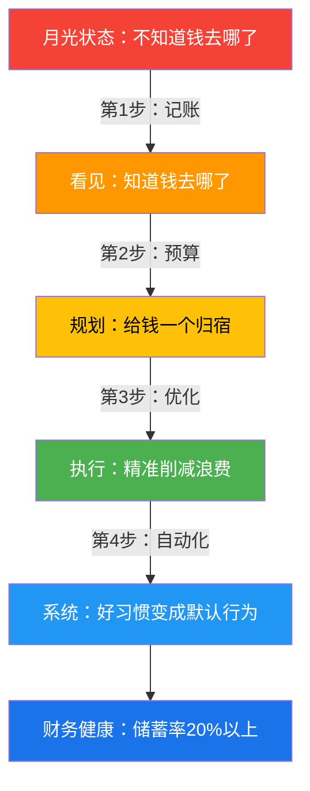

## 案例一：月光族的财务逆袭

> "我月薪一万二，工作三年，存款为零，信用卡还欠五千。每次发工资那天是我最富有的时刻，也是唯一富有的时刻。"——小李，26岁，互联网运营

这是中国数千万"月光族"的缩影。根据招商银行2024年的调研数据，月入1万-3万的群体中，超过60%的人无法准确说出上个月的支出结构，超过40%的人没有任何记账习惯。月光不是收入问题，是管理问题——这个案例完整展示了一个人如何从"不知道钱去哪了"到"每一分钱都有去处"。

### 背景信息

**主人公档案**

| 项目 | 详情 |
|------|------|
| 姓名 | 小李（化名） |
| 年龄 | 26岁 |
| 职业 | 互联网公司运营岗 |
| 工作年限 | 3年 |
| 月收入 | 税后12,000元 |
| 初始存款 | 0元 |
| 初始负债 | 信用卡欠款5,000元 |
| 所在城市 | 二线城市（成都） |
| 居住状态 | 合租，独立房间 |

**初始财务状况一句话概括**：赚得不算少，但钱像沙子一样从指缝流走，完全不知道流向了哪里。

小李的情况非常典型。他不奢侈，不赌博，不打赏主播，甚至觉得自己"挺节省的"。但事实是，他对"钱花到哪里去了"这个问题完全没有答案。这不是个案——中国人民银行2024年的调查显示，居民消费信贷余额突破20万亿元，大量收入通过无意识消费流失。

### 问题诊断：钱到底去哪了

#### 第一步：全面记录一个月的支出

小李做的第一件事不是制定预算，不是削减开支，而是**老老实实记录一个月的每一笔支出**。这一步看似简单，却是整个逆袭的起点。

他下载了"随手记"App（在本章核心技巧篇有详细的记账工具对比），从第一天开始记录。规则很简单：花一分钱，记一笔账。不用精确分类，先记下来再说。

#### 第二步：月度支出分析

一个月后，小李拉出了自己的支出报表：

| 类别 | 月均金额 | 占收入比 | 合理区间 | 评价 |
|------|----------|----------|----------|------|
| 房租 | 3,000元 | 25% | 20-30% | ✅ 合理 |
| 餐饮 | 2,500元 | 21% | 10-15% | ❌ 偏高（超支约800元） |
| 交通 | 500元 | 4% | 3-5% | ✅ 合理 |
| 娱乐 | 2,000元 | 17% | 5-10% | ❌ 严重偏高（超支约1,000元） |
| 购物 | 2,500元 | 21% | 5-10% | ❌ 严重偏高（超支约1,500元） |
| 社交 | 1,000元 | 8% | 5-8% | ✅ 合理 |
| 其他 | 500元 | 4% | 5-8% | ✅ 合理 |
| **合计** | **12,000元** | **100%** | — | **储蓄率：0%** |

**关键发现**：餐饮、娱乐、购物三项合计7,000元，占收入的58%。按照合理的支出结构（餐饮15%+娱乐8%+购物8%=31%），这三项的合理支出应该是3,720元，实际超支3,280元。

#### 第三步：拆解"隐形消费"

小李进一步拆解了超支的三个类别，发现了真正的"消费黑洞"：

**餐饮超支拆解（2,500元中）：**

| 子项 | 金额 | 占比 | 必要性 |
|------|------|------|--------|
| 工作日午餐（食堂/外卖） | 900元 | 36% | 必要 |
| 工作日晚餐（外卖） | 600元 | 24% | 可优化（自己做饭可省400元） |
| 周末聚餐 | 400元 | 16% | 可优化（频率过高） |
| 奶茶/咖啡 | 350元 | 14% | 可大幅削减 |
| 零食/下午茶 | 250元 | 10% | 可削减 |
| **合计** | **2,500元** | **100%** | — |

奶茶每天一杯15-25元，一个月就是350元。这个数字让小李自己都震惊了——"我从来没觉得一杯奶茶是大钱"。

**娱乐超支拆解（2,000元中）：**

| 子项 | 金额 | 占比 | 必要性 |
|------|------|------|--------|
| 视频/音乐/游戏订阅 | 120元 | 6% | 可保留1-2个 |
| 线下娱乐（KTV、剧本杀、电影） | 800元 | 40% | 频率过高，可减半 |
| 游戏充值 | 300元 | 15% | 可大幅削减 |
| 网购"娱乐性消费" | 780元 | 39% | 属于冲动消费 |
| **合计** | **2,000元** | **100%** | — |

**购物超支拆解（2,500元中）：**

| 子项 | 金额 | 占比 | 必要性 |
|------|------|------|--------|
| 衣物鞋帽 | 800元 | 32% | 部分必要，频率过高 |
| 数码配件/小家电 | 500元 | 20% | 多为冲动消费 |
| 护肤品/日用品 | 400元 | 16% | 必要，但可优化品牌选择 |
| 网购"凑单"商品 | 500元 | 20% | 典型冲动消费 |
| 其他杂物 | 300元 | 12% | 多为无意识消费 |
| **合计** | **2,500元** | **100%** | — |

"凑单"商品是小李发现的最大黑洞——为了满减优惠买了一堆不需要的东西，实际多花了钱而不是省了钱。

### 改善过程：从混乱到有序的四阶段

小李的改善不是一蹴而就的，而是分四个阶段循序渐进。每个阶段解决一个核心问题。

#### 阶段一：认知觉醒（第1个月）——"看见"自己的消费

**目标**：不是省钱，而是建立消费意识。

**具体做法**：

1. **坚持记账**：使用随手记App，每花一笔钱立即记录（不超过5秒钟）
2. **不改变任何消费习惯**：这个月不做任何刻意的节省，因为目的是"观察"而非"控制"
3. **每周查看一次周报**：随手记自动生成的周度支出报告

**第1个月的关键发现**：

- 周三和周五是消费高峰日（周三下午茶+周五聚餐）
- 每月1-5号（发工资后）消费明显高于其他时段（"发工资效应"）
- 每月有3-5笔"不知道是什么"的支出，金额50-200元不等

**心理学洞察**：记账本身就有"行为矫正"效果。行为经济学中的"霍桑效应"指出，当人们知道自己正在被观察时（即使观察者是自己），行为会自动改善。小李在记账的第3周就开始下意识地减少了一些"不好意思记下来"的消费——比如第三杯奶茶。

#### 阶段二：建立预算（第2个月）——给钱一个"归宿"

**目标**：用预算取代"随心所欲"的消费模式。

**预算方法选择**：小李采用了**50/30/20法则**——这是最适合财务管理新手的预算方法（本章核心技巧篇详解了零基预算法和信封法，适合进阶使用）。

| 类别 | 比例 | 金额 | 说明 |
|------|------|------|------|
| 必要支出（needs） | 50% | 6,000元 | 房租、基本餐饮、交通、通讯 |
| 弹性支出（wants） | 30% | 3,600元 | 娱乐、购物、社交、非必要餐饮 |
| 储蓄/还债（savings） | 20% | 2,400元 | 优先还债，其次储蓄 |

**关键原则：先储蓄，后消费**。工资到账当天，自动转出2,400元到专门的储蓄账户（小李用的是招商银行的"月月存"功能），剩余9,600元才是这个月可支配的金额。

这一步的心理学意义巨大——当你的可支配收入从12,000元变成9,600元时，你会自动调整消费行为。这就是"心理账户"理论的实际应用：人对"剩下的钱"和"所有的钱"的消费态度完全不同。

**第2个月的执行情况**：

| 类别 | 预算 | 实际 | 差异 |
|------|------|------|------|
| 必要支出 | 6,000元 | 5,800元 | ✅ 节余200元 |
| 弹性支出 | 3,600元 | 4,200元 | ❌ 超支600元 |
| 储蓄 | 2,400元 | 2,400元 | ✅ 达成 |
| **合计** | **12,000元** | **12,400元** | **动用了部分信用卡额度** |

弹性支出超支600元，主要是因为"突然被限制"的心理反弹——行为心理学中叫做"限制性反弹效应"（reactance）。解决方案不是更严格的限制，而是给弹性支出留足空间。

**调整策略**：将必要支出压缩500元（自己做饭替代部分外卖），给弹性支出增加500元的缓冲空间。

#### 阶段三：优化支出（第3个月）——刀刀见血的精准削减

**目标**：在不降低生活质量的前提下，找到最大的省钱杠杆。

**优化策略一：餐饮重构（月省800元）**

| 优化项 | 优化前 | 优化后 | 月省金额 |
|--------|--------|--------|----------|
| 工作日晚餐 | 外卖（20元/餐×30天） | 自己做饭（8元/餐×20天）+外卖（20元×10天） | 省240元 |
| 周末聚餐 | 每周2次×200元 | 每周1次×150元 | 省250元 |
| 奶茶/咖啡 | 每天1杯（平均20元） | 每周2杯（自己泡茶替代） | 省220元 |
| 零食/下午茶 | 每天15元 | 每周3次×10元 | 省180元 |

小李学会了做五道菜：番茄炒蛋、蒜蓉西兰花、可乐鸡翅、蛋炒饭、酸辣土豆丝。"不需要成为大厨，能做出5道能吃的菜就够了。"他在B站看了几个"一人食"教程，周末花2小时做好一周的菜（meal prep），工作日只需要热一下。

**优化策略二：购物管控（月省1,000元）**

建立**"72小时冷静期"规则**：任何超过100元的非必要消费，加入购物车后等待72小时再决定。如果72小时后仍然想要，才下单。

**优化策略三：娱乐替代（月省500元）**

| 替代前 | 替代后 | 月省金额 |
|--------|--------|----------|
| KTV（200元/次×2次） | 公园跑步/免费展览（0元） | 省200元 |
| 游戏充值300元 | 限时100元 | 省200元 |
| 线下电影（80元×2次） | 流媒体+投影仪（均摊） | 省100元 |

**第3个月的执行结果**：

| 类别 | 预算 | 实际 | 差异 |
|------|------|------|------|
| 必要支出 | 5,500元 | 5,300元 | ✅ 节余200元 |
| 弹性支出 | 4,100元 | 3,800元 | ✅ 节余300元 |
| 储蓄 | 2,400元 | 2,400元 | ✅ 达成 |
| **合计** | **12,000元** | **11,500元** | **月结余500元** |

三个月下来，小李不仅存了2,400×3=7,200元，还额外结余了约800元。更重要的是，他第一次有了"掌控感"——知道自己的钱去了哪里，知道每一分钱的去处。

#### 阶段四：巩固与进阶（第4-6个月）——从习惯到系统

**第4个月：还清负债**

小李用第4个月的结余一次性还清了5,000元信用卡欠款。信用卡从"负债工具"变成了"支付工具"——他设置了自动全额还款，从此不再产生利息。

**第5个月：建立应急储备金**

还清负债后，小李开始全力积累应急储备金。他的目标是3个月的基本生活支出（约15,000元），这是个人财务管理的"安全垫"——万一失业、生病或其他突发情况，有3个月的缓冲期。

**第6个月：建立自动化系统**

小李搭建了一套简单的自动化财务管理系统：

```text
工资到账（每月5日）
    ├── 自动转出：2,400元 → 储蓄账户（招商银行月月存）
    ├── 自动还款：信用卡全额还款
    ├── 自动扣款：房租3,000元
    └── 剩余：约6,600元 → 日常消费账户
```

这个系统的核心思想是"先支付给自己"（Pay Yourself First）——储蓄不是月底剩下的钱，而是月初就预先扣除的固定支出。这是本章核心技巧篇"自动化财务管理"的具体应用。

### 改善成果：六个月前后的对比

| 指标 | 改善前 | 改善后（第6个月） | 变化 |
|------|--------|-------------------|------|
| 月储蓄 | 0元 | 2,500元 | 从无到有 |
| 储蓄率 | 0% | 21% | 达到健康线（20%以上） |
| 负债 | 5,000元 | 0元 | 完全清零 |
| 应急储备金 | 0元 | 15,000元 | 覆盖3个月基本支出 |
| 财务健康度 | 极差 | 良好 | 从"财务病人"到"财务健康" |
| 消费焦虑 | 高（不知道钱去哪了） | 低（完全掌控） | 心理状态根本改善 |

### 踩过的坑和应对策略

小李的逆袭之路并非一帆风顺。以下是他在过程中踩过的坑和总结的应对策略。

**坑一：第1周记账就放弃了**

刚开始记账时，小李觉得"每笔都记太麻烦了"，第3天就断了。解决方案：不要追求完美记录，先养成习惯。前两周允许"模糊记账"——比如今天花了大概100元吃饭，记一笔"餐饮100元"就行，不用精确到每一杯奶茶。

**坑二：发工资后报复性消费**

第一个月发工资后，小李"奖励自己"买了一双800元的鞋，直接超支。解决方案：将"奖励"从物质消费改为体验消费——比如一次免费的公园徒步，或者看一部期待已久的电影（而不是"顺便"买一堆零食）。

**坑三：朋友聚餐的社交压力**

小李的朋友圈消费水平不低，每周聚餐、剧本杀的邀请不断。减少社交频率后，一度感到"被孤立"。解决方案：主动提出替代方案——"不去人均200的餐厅，改去人均80的小馆子"或者"不去KTV了，来我家打游戏"。真正的朋友不会因为你选了便宜的地方就不来。

**坑四：看到优惠就想凑单**

电商平台的"满300减50"让小李多花了很多钱——为了省50元，多买了200元不需要的东西。解决方案：只买已经列在购物清单上的东西，满减优惠视为"如果刚好够就用"的bonus，而不是"为了用优惠而凑单"的触发器。

**坑五：情绪性消费**

工作压力大、心情不好的时候，小李会通过网购来"治愈自己"。这种情绪性消费是最难控制的，因为它和理性无关。解决方案：建立"情绪消费替代清单"——压力大时去跑步（免费），心情差时找朋友聊天（免费），无聊时看纪录片（免费或低成本）。关键不是消灭情绪，而是给情绪找到一个不花钱的出口。

### 核心方法论提炼

小李的案例不是"节俭故事"，而是一套可复制的方法论：

**第一步：记账（看见）** ——不记账就不知道问题在哪里，这是所有改变的起点。你不需要记一辈子，但至少需要认真记3个月，建立对自己消费结构的完整认知。

**第二步：预算（规划）** ——50/30/20法则是最适合新手的预算框架。核心原则是"先储蓄后消费"——工资到账当天就转出储蓄部分，剩下的才是可支配金额。

**第三步：优化（执行）** ——找到最大的消费黑洞，精准削减。不是什么都砍，而是砍掉那些"花了也没感觉"的消费——奶茶、凑单商品、冲动购物。

**第四步：系统化（坚持）** ——把好的财务习惯变成自动化系统，减少对意志力的依赖。自动转账、自动还款、72小时冷静期——让系统替你做正确的决定。



### 适用人群与变体方案

小李的方案不是万能模板，不同情况需要做调整：

**收入更低（月入6,000-8,000元）的变体**：

- 储蓄比例从20%调整为10%，优先建立应急储备金
- 必要支出比例可能高达60-70%（房租占比更高）
- 优化重点放在餐饮上（自己做饭是最有效的省钱手段）
- 不建议一上来就追求20%储蓄率，先从10%开始

**收入更高（月入20,000-30,000元）的变体**：

- 储蓄比例可以提高到30-40%
- 优化重点不在"省钱"而在"配置"——高收入月光往往是大额非必要支出（奢侈品、高端消费）
- 建议引入零基预算法（本章核心技巧篇详解），精确控制每一分钱的去向

**有家庭的变体**：

- 预算需要加入家庭共同账户的概念
- 必要支出中需要加入子女教育、赡养老人等项目
- 储蓄目标从"应急储备金"扩展到"教育基金""养老基金"
- 需要伴侣双方共同参与记账和预算

### 长期规划：从月光到财务自由的路线图

小李的逆袭只是第一步。从月光到财务自由，还需要经历以下几个阶段：

| 阶段 | 时间线 | 核心任务 | 储蓄率目标 |
|------|--------|----------|------------|
| 脱离月光 | 0-6个月 | 记账+预算+还清负债 | 10-20% |
| 建立安全垫 | 6-12个月 | 积累3-6个月应急储备金 | 20% |
| 优化配置 | 1-2年 | 学习投资，建立资产配置 | 20-30% |
| 加速积累 | 2-5年 | 提升收入+优化支出双管齐下 | 30-40% |
| 财务自由 | 5年+ | 被动收入覆盖基本生活支出 | 40%+ |

小李目前处于"脱离月光"到"建立安全垫"的过渡阶段。下一步他计划：

1. 学习本章第14章的投资理财基础，从货币基金和指数基金定投开始
2. 优化保险配置（目前只有社保，缺少商业医疗险和意外险）
3. 检查专项附加扣除是否充分利用（本章核心技巧篇·税务筹划技巧）

### 可直接使用的模板

**月度预算模板（适合月入1万-1.5万的单身人士）：**

```markdown
# 月度预算 - [月份]

## 收入
- 工资收入：______元
- 其他收入：______元
- 收入合计：______元

## 储蓄（工资到账当天自动转出）
- 应急储备金：______元（目标：3个月基本支出）
- 投资/理财：______元
- 储蓄合计：______元（目标：收入的20%以上）

## 必要支出（不超过收入的50%）
- 房租：______元
- 餐饮（基本）：______元
- 交通：______元
- 通讯：______元
- 必要支出合计：______元

## 弹性支出（不超过收入的30%）
- 娱乐：______元
- 购物：______元
- 社交：______元
- 餐饮（非必要）：______元
- 其他：______元
- 弹性支出合计：______元

## 预算检查
- 总支出 + 储蓄 = 收入？ □ 是 □ 否
- 储蓄率 ≥ 20%？ □ 是 □ 否
```

**"72小时冷静期"购物清单模板：**

```markdown
# 想要清单

| 日期 | 想买的东西 | 价格 | 是否必要 | 72小时后还想买？ | 最终决定 |
|------|-----------|------|----------|-----------------|----------|
| 6/1 | 无线耳机 | 299元 | 否 | 是 | 买了（从娱乐预算扣） |
| 6/3 | 凑单小夜灯 | 39元 | 否 | 否 | 不买 |
| 6/5 | 运动鞋 | 459元 | 部分 | 否（现有够用） | 不买 |
```

### 本案例与全章知识的关联

这个案例覆盖了本章多个知识模块的实际应用：

| 案例中用到的知识 | 对应章节模块 | 具体应用 |
|-----------------|-------------|----------|
| 记账方法和工具选择 | 核心技巧·高效记账技巧 | 使用随手记App，实时记账法 |
| 月度支出分析 | 理论基础·个人财务报表理论 | 制作月度现金流量表 |
| 50/30/20预算法 | 核心技巧·预算管理技巧 | 建立月度预算框架 |
| "先储蓄后消费"原则 | 理论基础·记账理论 | 工资到账自动转出储蓄 |
| 信用卡管理 | 核心技巧·信用管理技巧 | 自动全额还款，从负债工具变为支付工具 |
| 应急储备金 | 理论基础·保险规划理论 | 建立3个月基本支出的安全垫 |
| 自动化财务管理 | 核心技巧·自动化财务管理 | 设置自动转账和自动还款 |

如果你对上述任何模块感兴趣，可以跳转到对应章节深入学习。本案例是这些知识的"浓缩实战版"，帮你理解它们在真实生活中如何协同运作。

***

> **一句话总结**：月光的本质不是"赚得少"，而是"看不见"。记账让你看见，预算让你规划，优化让你执行，系统让你坚持。四步走完，月光变月存。
