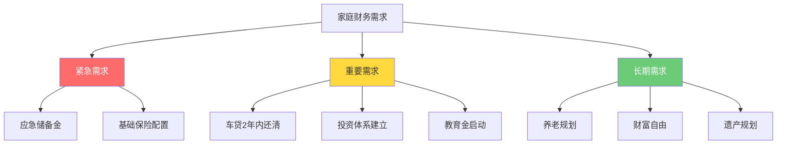

## 案例二：家庭财务规划

家庭财务规划不是简单地记账和存钱，而是一项需要系统思维的综合工程。它涉及收入分配、风险管理、投资增值、税务优化、子女教育储备和养老规划等多个维度。本案例将完整还原一个典型双收入家庭从"财务混乱"到"系统运转"的全过程，不仅展示最终方案，更详细拆解每一步的决策逻辑和推导过程。

### 案例背景：一个典型的城市中产家庭

#### 家庭画像

| 成员 | 年龄 | 职业 | 月税后收入 | 备注 |
|------|------|------|-----------|------|
| 张先生 | 32岁 | 互联网公司程序员 | 25,000元 | 家庭经济支柱，收入占比71% |
| 李女士 | 30岁 | 公立小学教师 | 10,000元 | 工作稳定，有编制保障 |
| 儿子 | 2岁 | — | — | 刚入托班阶段 |

**家庭月总收入**：35,000元（税后）

#### 初始财务状况描述

这个家庭代表了大量城市双职工家庭的典型状态——收入不算低，但缺乏系统规划：

- **没有预算体系**：每月花多少算多少，月底不知道钱花到哪里去了
- **保险严重不足**：仅有公司缴纳的社保，没有任何商业保险
- **投资全凭感觉**：股票是听同事推荐买的，基金是银行理财经理推销的，没有自己的投资逻辑
- **没有应急储备**：全部银行存款5万元，一旦遇到突发情况（失业、大病），撑不过两个月
- **负债压力中等**：房贷+车贷月供1.1万元，占收入的31%，在合理范围内但没有余量缓冲
- **零教育和养老储备**：孩子刚2岁，完全没有开始教育金规划；夫妻双方也没有任何养老储蓄

张先生找到财务规划师时说了一句话："我们俩收入加起来不算少，但总感觉钱不够用，也不知道该先做什么。"这句话道出了无数家庭的核心困惑——不是赚得少，而是没有章法。

### 第一阶段：全面财务体检

在给出任何建议之前，必须先对家庭财务进行一次彻底的"体检"。这不是简单地列个资产负债表就完事，而是要从多个维度评估家庭的财务健康度。

#### 家庭资产负债表

资产负债表是财务体检的第一张底片，它告诉你"这个家庭现在有多少钱、欠多少钱"。

| 资产类别 | 具体项目 | 金额（元） | 占比 | 说明 |
|---------|---------|-----------|------|------|
| **流动资产** | 银行活期+定期存款 | 50,000 | 2.3% | 随时可动用 |
| **投资资产** | 股票账户 | 30,000 | 1.4% | 3只个股，无策略 |
| | 基金账户 | 20,000 | 0.9% | 1只混合基金 |
| **固定资产** | 自住房产 | 2,000,000 | 90.9% | 2019年购入，贷款余额120万 |
| | 家用轿车 | 100,000 | 4.5% | 2021年购入，贷款余额8万 |
| **资产合计** | | **2,200,000** | **100%** | |
| **负债类别** | | | | |
| **长期负债** | 房贷余额 | 1,200,000 | 93.8% | 剩余22年，利率4.1% |
| **中期负债** | 车贷余额 | 80,000 | 6.2% | 剩余2年，利率3.5% |
| **负债合计** | | **1,280,000** | **100%** | |
| **净资产** | | **920,000** | | 资产-负债 |

#### 资产结构分析

单看数字不够，要分析资产结构是否健康：

**问题一：资产过度集中于房产**

房产占总资产的90.9%，这意味着家庭的财富绑死在一套房子上。房产是低流动性资产——你不能在需要用钱的时候立刻卖掉一个卧室。合理的房产占比建议控制在总资产的60%-70%以内。当然，对于中国城市的年轻家庭来说，这个比例偏高是普遍现象，不必焦虑，但需要通过后续的投资积累来逐步稀释房产占比。

**问题二：流动资产严重不足**

5万元的银行存款，对照每月27,000元的刚性支出（房贷8,000 + 车贷3,000 + 生活费8,000 + 孩子3,000 + 保险2,000 + 其他3,000），仅够维持1.85个月。财务规划的底线标准是应急储备金覆盖3-6个月的必要支出，这个家庭明显不达标。

**问题三：投资资产过于单薄**

5万元的投资资产（股票3万+基金2万）对于一个年收入42万的家庭来说，投资资产仅占净资产的5.4%。这说明过去几年的可支配收入没有有效地转化为投资。

#### 核心财务健康指标

把上面的数据转化为几个关键指标，可以更直观地判断家庭财务健康度：

| 指标 | 计算方式 | 本案例数值 | 健康标准 | 评估 |
|------|---------|-----------|---------|------|
| 负债率 | 负债÷资产 | 58.2% | <60% | ⚠️ 临界 |
| 负债收入比 | 月还款÷月收入 | 31.4% | <36% | ✅ 合理 |
| 流动性比率 | 流动资产÷月支出 | 1.85 | 3-6 | ❌ 严重不足 |
| 储蓄率 | 月储蓄÷月收入 | 22.9% | >20% | ✅ 勉强达标 |
| 投资资产比 | 投资÷净资产 | 5.4% | >30% | ❌ 严重不足 |
| 财务自由度 | 被动收入÷支出 | ≈0% | >100% | ❌ 未起步 |

通过这张指标表，问题一目了然：这个家庭不是"没钱"，而是钱没有被科学地配置。

### 第二阶段：需求分析与优先级排序

财务规划最常见的错误是"眉毛胡子一把抓"——什么都想做，什么都做不好。正确的做法是先识别所有需求，再按照紧迫性和重要性排序。

#### 家庭财务需求全景



#### 优先级排序逻辑

为什么是这个顺序？背后的逻辑链如下：

**第一优先级：应急储备金**
没有应急储备金的家庭，就像没有安全气囊的汽车。任何一次突发事故（失业、大病、意外）都会迫使你以极高的代价去借钱——信用卡分期年化利率15%以上，网贷更是20%-36%。建立应急储备金的本质是避免未来被迫承担高息负债。

**第二优先级：保险配置**
张先生是家庭经济支柱（收入占比71%），如果他发生意外或重大疾病，家庭收入直接腰斩，但房贷、车贷、生活费一分不会少。保险的本质是用确定的小额支出（保费）转移不确定的巨额风险（大病/意外的经济损失）。在没有保险的情况下谈投资，等于在没有刹车的车上踩油门。

**第三优先级：偿还车贷**
车贷利率3.5%，看似不高，但车辆是贬值资产——每年贬值15%-20%。尽快还清车贷可以释放每月3,000元的现金流，同时减少"为贬值资产付利息"的心理负担。

**第四优先级：投资体系建立**
有了应急储备和保险兜底，有了车贷释放的现金流，才应该认真做投资。这时候投资的钱是"闲钱"，即使短期亏损也不会影响家庭正常运转。

**第五优先级：教育金和养老**
这两个目标时间跨度长（教育金16年、养老30年以上），可以承受更大的波动，适合用定投的方式长期积累。

### 第三阶段：制定优化方案

#### 一、保险配置方案

##### 设计思路

保险配置遵循"先保障后理财、先大人后小孩、先支柱后配偶"的原则。具体到这个家庭：

- **第一优先保障张先生**：他是收入支柱（月入25,000元，占71%），保额要覆盖他的收入中断风险
- **第二优先保障李女士**：虽然收入较低，但教师编制稳定，且承担主要育儿责任，重疾和意外同样需要保障
- **第三保障孩子**：孩子不产生收入，不需要寿险，但需要重疾险和医疗险来覆盖大病医疗费用

##### 详细保险方案

| 险种 | 张先生（32岁） | 李女士（30岁） | 儿子（2岁） | 设计理由 |
|------|---------------|---------------|------------|---------|
| **重疾险** | 50万保额 | 30万保额 | 20万保额 | 覆盖3-5年收入损失+康复费用；儿童保额受监管限制最高50万 |
| **医疗险** | 百万医疗（100万） | 百万医疗（100万） | 百万医疗（100万） | 覆盖大病住院费用，弥补社保报销上限 |
| **意外险** | 100万保额 | 50万保额 | 20万保额 | 程序员虽非高危职业，但加班猝死风险需覆盖 |
| **定期寿险** | 100万保额 | 50万保额 | 不需要 | 覆盖房贷余额+5年家庭生活费；孩子无经济责任不需寿险 |
| **年保费小计** | ≈15,000元 | ≈8,000元 | ≈3,000元 | |

**家庭年保费总计**：约26,000元，月均约2,167元，占家庭年收入的6.2%。

行业通用的保费占比建议是家庭年收入的5%-10%，6.2%处于合理区间的中低位，既不会造成保费压力，又能获得充足保障。

##### 保额设计的推导过程

**张先生定期寿险100万是怎么算出来的？**

寿险保额需要覆盖"如果这个人不在了，家庭需要多少钱才能维持正常运转"：

| 项目 | 金额 | 说明 |
|------|------|------|
| 房贷余额 | 1,200,000元 | 必须覆盖，否则房子会被银行收回 |
| 车贷余额 | 80,000元 | 短期负债 |
| 孩子抚养到18岁 | ≈600,000元 | 按月均3,000元×16年估算 |
| 老人赡养 | 200,000元 | 双方父母的基本赡养 |
| **需求合计** | **2,080,000元** | |
| 减去现有资产 | -500,000元 | 存款+投资+可变现资产 |
| 减去配偶收入能覆盖部分 | -300,000元 | 李女士收入能承担的部分 |
| **实际缺口** | **1,280,000元** | 取整为100万（留有余量） |

寿险保额100万是基于缺口分析得出的，不是拍脑袋定的。定期寿险（保到60岁）保费低廉，32岁男性100万保额年保费仅约1,200-1,800元（纯保障型产品）。

##### 产品选择原则

- **重疾险**：选择消费型（不要返还型），保额优先于保障病种数量。多次赔付的产品如果价格合理可以考虑，但单次赔付的高保额比多次赔付的低保额更重要
- **医疗险**：百万医疗是标配，关注续保条件（保证续保20年的优于1年期的），免赔额1万元是行业标准
- **意外险**：选择一年期消费型产品，性价比最高。注意保障范围要包含猝死责任
- **定期寿险**：选择纯保障型，不要附加任何理财功能。保到60岁即可（届时孩子已成年、房贷已还清）

**常见误区提醒**：很多家庭会优先给孩子买一大堆保险，而忽略了大人的保障。正确的顺序是——大人的保障做全了，再给孩子买。因为大人是孩子的"保险"，大人倒下了，孩子的保费都交不起。

#### 二、储蓄与投资方案

##### 第一步：建立应急储备金

**目标金额**：100,000元（≈3.7个月的刚性支出）

为什么要3-6个月？行业经验值来自两个考量：
1. 失业后平均找工作时间：技术岗在一线城市约为2-4个月
2. 突发医疗费用的自付部分：即使有百万医疗险，免赔额+自费药+康复期收入损失也需要一笔缓冲资金

**攒钱计划**：

当前月结余8,000元，需要12.5个月攒够10万元。为了加快进度，可以采取以下策略：

| 来源 | 金额 | 说明 |
|------|------|------|
| 月结余中划出 | 6,000元/月 | 从8,000元结余中优先划出 |
| 现有存款 | 50,000元 | 全部转为应急储备金 |
| 车贷还清后释放 | 3,000元/月 | 车贷还完后这笔钱转为储蓄 |
| **预计达标时间** | **4-5个月** | 现有5万+每月6千=4个月达标 |

**存放方式**：应急储备金必须兼顾安全性和流动性。推荐分散存放：

- **5万元**放在货币基金（如余额宝、零钱通），年化约1.5%-2%，随时可取
- **3万元**放在银行活期存款，确保极端情况下（如货币基金赎回延迟）有即时可用的资金
- **2万元**放在短期银行理财（1-3个月期），年化约2.5%-3%，略提高收益

绝对不能把应急储备金投入股票、基金等波动性资产。应急金的核心价值是"确定性"，而不是收益率。

##### 第二步：车贷提前还清策略

车贷余额8万元，月供3,000元，剩余还款期约27个月。年利率3.5%。

**要不要提前还？计算一下：**

如果按原计划还完，总利息支出约：80,000 × 3.5% × 27/24 ≈ 3,150元

这个利息金额不大，提前还款的经济收益有限。但提前还款的核心价值是**释放现金流**——还清后每月多出3,000元，可以立刻投入定投或其他用途。

**建议方案**：在应急储备金达标后（第5个月左右），用累积的额外储蓄一次性还清车贷。预计在第8-10个月可以完成。不建议动用应急储备金来还车贷——那是拆东墙补西墙。

##### 第三步：建立投资体系

**可用投资资金**：每月8,000元结余 - 保险月均2,167元 = 约5,800元/月
车贷还清后释放3,000元 → 投资资金提升至约8,800元/月

**投资分配方案**：

| 资金用途 | 月投入 | 占比 | 产品类型 | 预期年化 | 风险等级 |
|---------|-------|------|---------|---------|---------|
| 基金定投（核心） | 4,000元 | 45% | 沪深300指数基金+中证500指数基金各半 | 8%-12% | 中 |
| 孩子教育基金 | 2,000元 | 23% | 目标日期基金（16年期）或"沪深300+债券基金"组合 | 6%-10% | 中低 |
| 养老储蓄 | 1,500元 | 17% | 个人养老金账户（每年12,000元限额）+商业养老保险 | 4%-6% | 低 |
| 机动资金 | 1,300元 | 15% | 货币基金暂存，等待加仓机会或补充其他账户 | 1.5%-2% | 极低 |
| **合计** | **8,800元** | **100%** | | | |

##### 基金定投的具体执行方案

**为什么选择指数基金而不是主动基金？**

长期数据（中国公募基金20年回测）表明：在10年以上的投资周期中，仅有约20%的主动基金能跑赢对应的宽基指数。对于没有基金研究能力的普通家庭，指数基金是更可靠的选择——它不依赖基金经理的能力，跟踪的是市场平均收益，且管理费率低（通常0.5% vs 主动基金1.5%）。

**定投组合设计**：

```text
每月4,000元定投分配：
├── 沪深300指数基金：2,000元（大盘蓝筹，稳定性好）
├── 中证500指数基金：1,500元（中小盘，成长性更强）
└── 纳斯达克100(QDII)：500元（海外配置，分散A股单一市场风险）
```

**定投纪律**：
- 每月固定日期（如工资日次日）自动扣款，消除"要不要投"的纠结
- 不看短期涨跌，不做择时。市场跌了反而是好事——同样的钱买到更多份额
- 每半年检视一次组合，偏离目标比例超过5%时再平衡
- 设定止盈线：整体收益率达到30%时，赎回利润部分，本金继续定投

##### 教育金专项规划

**目标**：为孩子准备大学教育金，目标金额50-80万元（按当前购买力估算，考虑学费上涨率约3%-5%/年）

**测算**：每月定投2,000元，年化收益8%，16年后（孩子18岁）：

复利计算公式：FV = PMT × [(1+r)^n - 1] / r

- 月投入2,000元，年化8%（月化0.667%），192个月
- 终值 ≈ 2,000 × [(1.00667)^192 - 1] / 0.00667
- 终值 ≈ 2,000 × 396.7
- **终值 ≈ 793,400元**

这个数字可以覆盖国内一本院校4年学费+生活费，或者作为出国留学的部分资金。

**教育金投资策略随孩子年龄调整**：

| 孩子年龄 | 股票基金占比 | 债券基金占比 | 说明 |
|---------|------------|------------|------|
| 2-10岁 | 80% | 20% | 距离用钱时间长，可承受高波动 |
| 11-14岁 | 60% | 40% | 逐步降低风险 |
| 15-17岁 | 30% | 70% | 临近用钱，以稳健为主 |
| 18岁 | 0% | 100% | 全部转为货币基金或短期理财 |

#### 三、负债管理方案

##### 房贷策略分析

张先生的房贷情况：余额120万，月供8,000元，剩余22年，利率4.1%（假设为LPR浮动利率）。

**要不要提前还房贷？这是很多人纠结的问题。分析如下：**

**不建议提前还的理由**：
1. 房贷利率4.1%是普通家庭能获得的最低利率贷款，远低于信用卡分期（15%+）和消费贷（8%+）
2. 通胀是房贷的天然盟友——20年后的8,000元/月，实际购买力远低于今天
3. 提前还贷会占用本可以用于投资的资金。如果投资年化收益能超过4.1%，那就不亏
4. 房贷利息可以抵扣个税（每月1,000元标准扣除），对于张先生这样的纳税人有一定税务优惠

**建议提前还的情况**：
- 如果LPR上升到5.5%以上，且家庭没有更好的投资渠道
- 如果心理上无法接受长期负债（负债焦虑影响生活质量时）
- 如果收入出现大幅下降，月供压力超过收入的40%

**结论**：维持正常还款，不提前还贷。将多余资金投入年化收益预期8%-10%的基金定投，获取正向利差。

##### 车贷还清时间表

车贷余额8万元，月供3,000元，年利率3.5%。车辆本身每年贬值约15%-20%，属于"负资产"——持有越久亏得越多。

建议在应急储备金达标后的2-3个月内集中还清。具体时间表：

| 时间节点 | 行动 | 资金来源 |
|---------|------|---------|
| 第1-4个月 | 优先建立应急储备金 | 月结余6,000元+现有存款5万 |
| 第5个月 | 应急储备金达标（10万） | — |
| 第5-8个月 | 集中攒钱还车贷 | 月结余中划出8,000-10,000元 |
| 第8-10个月 | 一次性还清车贷8万 | 累积储蓄 |
| 第10个月起 | 月结余提升至约11,000元 | 车贷释放3,000元+正常结余 |

#### 四、税收优化建议

虽然本案例的税务筹划空间有限（工薪收入由单位代扣代缴），但仍有几个可以利用的节税工具：

**1. 个人所得税专项附加扣除确认**

张先生家庭目前可以享受的专项附加扣除：

| 扣除项目 | 金额/月 | 操作说明 |
|---------|--------|---------|
| 子女教育 | 2,000元 | 孩子满3岁后开始，需在个税APP填报 |
| 住房贷款利息 | 1,000元 | 首套房贷，最长240个月 |
| 赡养老人 | 3,000元 | 独生子女3,000元/月；非独生分摊 |
| 3岁以下婴幼儿照护 | 2,000元 | 孩子当前2岁可享受 |

以上合计可扣除8,000元/月，以张先生25,000元月薪估算，适用税率可能从20%降到10%，每月可节税约800-1,200元。务必在每年12月确认下一年度的扣除信息。

**2. 个人养老金账户**

每年可存入12,000元（月均1,000元），在综合所得中据实扣除。对于张先生适用20%税率的情况，每年可节税2,400元。这笔钱锁定到退休才能取出，适合长期养老储备。

**3. 税优健康险**

部分城市支持税优健康险抵扣个税（每年2,400元限额），可以在配置保险时优先选择带有税优识别码的产品。

### 第四阶段：执行落地与监控

#### 完整月度预算表

方案制定完成后，需要落地为一份可执行的月度预算：

| 支出项目 | 优化前（元） | 优化后（元） | 变化 | 说明 |
|---------|------------|------------|------|------|
| 房贷 | 8,000 | 8,000 | — | 维持不变 |
| 车贷 | 3,000 | 0（还清后） | -3,000 | 第8-10个月还清 |
| 生活费 | 8,000 | 7,000 | -1,000 | 建立预算后减少不必要开支 |
| 孩子费用 | 3,000 | 3,000 | — | 维持不变 |
| 保险 | 2,000 | 2,167 | +167 | 配置完整商业保险 |
| 其他 | 3,000 | 2,000 | -1,000 | 减少冲动消费 |
| **储蓄投资** | — | — | — | — |
| 应急储备 | — | 6,000→0 | 达标后停止 | 前4个月集中储蓄 |
| 基金定投 | — | 4,000 | 新增 | 沪深300+中证500+纳指100 |
| 教育基金 | — | 2,000 | 新增 | 目标日期基金定投 |
| 养老储蓄 | — | 1,500 | 新增 | 个人养老金账户 |
| 机动资金 | — | 1,300 | 新增 | 货币基金暂存 |
| **月结余** | **8,000** | **0** | | 收支平衡，每一分钱都有去处 |

#### 年度里程碑

| 时间 | 里程碑 | 验证指标 |
|------|--------|---------|
| 第1个月 | 建立月度预算，开始记账 | 记账APP已安装并连续记录30天 |
| 第4个月 | 应急储备金达标 | 银行存款+货币基金≥10万元 |
| 第8-10个月 | 车贷还清 | 车贷余额归零 |
| 第12个月 | 投资体系运转满半年 | 定投扣款连续6个月无中断 |
| 第24个月 | 投资资产达20万 | 投资账户余额≥200,000元 |
| 第36个月 | 家庭净资产翻倍（180万+） | 净资产≥1,800,000元 |

#### 季度复盘清单

每3个月花1小时做一次家庭财务复盘，检查以下项目：

```text
□ 本季度实际支出 vs 预算，偏差是否在10%以内？
□ 定投是否按时执行？有无漏投？
□ 保险是否有新增需求？（如家庭成员变化、收入变化）
□ 应急储备金是否被挪用？需补充吗？
□ 投资组合是否需要再平衡？（偏离目标比例>5%）
□ 是否有新的专项附加扣除可以申报？
□ 下季度是否有大额支出需要提前准备？（旅行、家电更换等）
```

### 一年后实际成果

按照上述方案执行12个月后，家庭财务状况发生了显著变化：

| 指标 | 规划前 | 规划后（12个月） | 变化 |
|------|-------|----------------|------|
| 应急储备金 | 50,000元 | 100,000元 | +100% |
| 投资资产 | 50,000元 | ≈120,000元 | +140% |
| 车贷余额 | 80,000元 | 0元 | 清零 |
| 商业保险 | 无 | 4份保单（重疾+医疗+意外+寿险） | 从零到全覆盖 |
| 月净现金流 | 8,000元 | ≈11,000元（车贷释放后） | +37.5% |
| 财务安全感 | 焦虑 | 安心 | 心理层面的巨大变化 |

张先生在回访时说："最大的变化不是账户里的数字，而是我知道每一分钱该去哪里，晚上睡觉踏实多了。"

### 常见误区与避坑指南

#### 误区一：先投资再存应急金

很多人觉得"存钱太慢，不如先投资赚收益"。这是典型的本末倒置。没有应急金的家庭，一旦遇到突发情况就不得不在最差的时机卖出投资（通常是市场下跌时），亏损出局。**先建安全垫，再做投资**。

#### 误区二：给孩子买齐保险大人裸奔

这是中国家庭最常见的保险误区。孩子的保费便宜、保额高，容易让家长产生"给孩子买更划算"的错觉。但孩子生病，家长可以赚钱治疗；家长倒下，孩子的保费都交不起。**先保大人，再保孩子**。

#### 误区三：追求高收益忽略风险

"同事买的基金一年赚了30%，我也要。"这种想法很危险。高收益必然伴随高波动。如果你不能承受30%的浮亏，就不应该追求30%的收益。**用你能承受的最大波动来决定投资组合的风险等级**。

#### 误区四：频繁调整投资方案

今天听人说黄金好就买黄金，明天看新闻说股市要涨就加仓股票。频繁买卖不仅增加交易成本（申购赎回费、印花税），还容易在高点买入、低点卖出。**定投的核心逻辑就是"无视择时"，坚持比聪明更重要**。

#### 误区五：保险只看价格不看条款

两份重疾险，一份便宜30%但轻症只赔1次且没有豁免条款，另一份贵30%但轻症赔3次且自带投保人豁免。保险不是越便宜越好，**要看保障范围、赔付条件、免责条款和理赔服务**。

#### 误区六：把所有鸡蛋放在一个篮子里

有人只买股票，有人只存银行，有人只买房产。任何单一资产都有其周期性和局限性。**资产配置的核心是"低相关性"——当股票跌的时候，债券可能涨；当国内低迷的时候，海外市场可能活跃**。本案例中的投资组合（A股宽基+海外指数+债券）就是一种基础的分散配置。

### 本案例的关键启示

**1. 财务规划不是有钱人的专利**

张先生家庭月收入3.5万元，不算富裕也不算低。真正的区别不在于收入高低，而在于有没有系统规划。月入1万但规划清晰的家庭，财务状况可能好过月入5万但无规划的家庭。

**2. 顺序比速度更重要**

先应急、再保险、后投资——这个顺序不能乱。很多人一上来就问"买什么基金"，这就像房子还没打地基就开始装修。

**3. 自动化是纪律的最好保障**

定投设为自动扣款，工资到账自动分流到各个账户，保险自动续保——把正确的决策自动化，消除"人性"对财务的干扰（冲动消费、恐慌卖出、贪心加仓）。

**4. 规划是动态的，不是一劳永逸的**

每年至少做一次全面复盘：收入变了，支出结构变了，市场环境变了，家庭成员变了——方案都要相应调整。上一版的最优方案可能已经不是当前的最优解。

**5. 财务安全感是最有价值的回报**

很多家庭在开始系统规划后，最大的感受不是"钱变多了"，而是"心里有底了"。知道应急时有钱、生病时有保险、退休时有养老金——这种确定性带来的心理价值，远超账户上多出的那几个百分点的收益。
