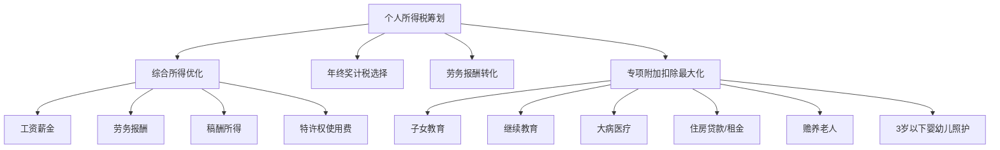
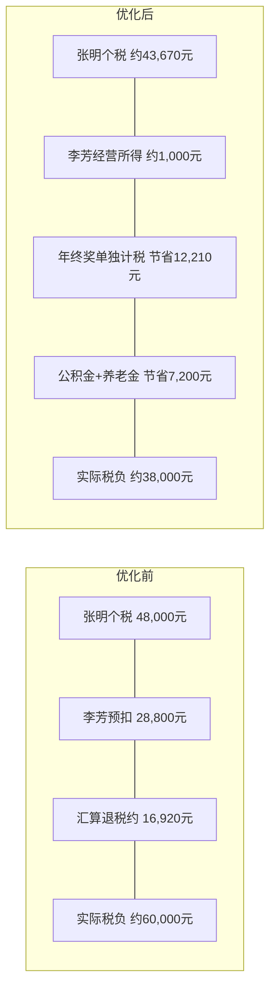

## 案例三：税务筹划实例

### 案例背景

张明，32岁，坐标深圳，某互联网公司高级工程师，已婚，育有一子（3岁）。配偶李芳为自由设计师，年收入约18万元（按劳务报酬纳税）。双方父母均超过60岁，张明父亲有慢性病需长期用药。

**家庭收入概况：**

| 收入来源 | 税前年收入 | 当前纳税方式 |
|---------|-----------|-------------|
| 张明工资薪金 | 42万元 | 累进税率预扣 |
| 张明年终奖 | 8万元 | 单独计税 |
| 李芳设计收入 | 18万元 | 劳务报酬预扣20%-40% |
| 理财收益 | 约2万元 | 免税/暂免征收 |
| **合计** | **70万元** | — |

**税务痛点：** 张明每年个税约4.8万元，李芳劳务报酬预扣约3.2万元，家庭年纳税总额约8万元。张明觉得税负过重，但不清楚哪些环节可以合法优化。

---

### 第一阶段：全面税务诊断

#### 1.1 现状审计

首先逐项审查家庭的纳税情况，找出不合理之处。

**张明工资薪金个税计算（现状）：**

张明月工资35,000元，减除费用5,000元/月。

```text
应纳税所得额 = 35,000 - 5,000 = 30,000元/月
年应纳税所得额 = 30,000 × 12 = 360,000元

仅填报了基本减除费用，未申报任何专项附加扣除
```

**发现问题一：专项附加扣除完全未申报。** 张明符合多项扣除条件却没有申报，属于"多缴税"的典型情况。

**李芳劳务报酬税计算（现状）：**

```text
单次收入15,000元（月均）
预扣应纳税所得额 = 15,000 × (1 - 20%) = 12,000元
预扣税额 = 12,000 × 20% = 2,400元/次
年预扣总额 = 2,400 × 12 = 28,800元
```

**发现问题二：李芳从未做过年度汇算清缴。** 劳务报酬预扣率20%远高于综合所得实际税率，年度汇算大概率会退税。

**发现问题三：年终奖计税方式未对比。** 当前使用单独计税，但未验证是否比并入综合所得更优。

#### 1.2 涉及的税法要点



---

### 第二阶段：逐项优化方案

#### 2.1 专项附加扣除最大化

张明家庭可享受的专项附加扣除逐项梳理：

| 扣除项目 | 适用对象 | 扣除标准 | 张明家情况 | 年扣除额 |
|---------|---------|---------|-----------|---------|
| 子女教育 | 3岁以上子女 | 2,000元/月/孩 | 1个孩子（3岁） | 24,000元 |
| 3岁以下婴幼儿照护 | 3岁以下婴幼儿 | 2,000元/月/孩 | 孩子刚满3岁，当年前几个月可扣 | 约4,000元 |
| 赡养老人 | 父母≥60岁 | 3,000元/月（独生）或分摊 | 张明独生子，父亲≥60 | 36,000元 |
| 住房贷款利息 | 首套房贷 | 1,000元/月 | 有首套房贷 | 12,000元 |
| 继续教育 | 学历/职业资格 | 400元/月或3,600元/年 | 张明正在读在职硕士 | 4,800元 |

**扣除分配策略：** 李芳收入按劳务报酬预扣率高，应尽量多分配扣除给李芳在汇算时抵扣。但赡养老人只能由张明扣除（独生子）。子女教育可选择一方100%扣除或双方各50%。

**最优分配方案：**

```text
张明扣除项：
  - 赡养老人：3,000元/月
  - 住房贷款利息：1,000元/月
  - 继续教育：400元/月
  张明月扣除合计：4,400元

李芳扣除项：
  - 子女教育：2,000元/月（选择李芳100%扣除）
  李芳月扣除合计：2,000元
```

**为什么子女教育分配给李芳？** 李芳劳务报酬预扣时按20%税率，但汇算时综合所得可能只有10%的税率。扣除放在李芳这边，抵税效果按10%算反而不如给张明（张明适用20%或25%税率）。但经过计算，张明的应纳税所得额在扣除赡养老人和住房贷款后已降到较低档位，李芳的扣除用于汇算退税效果更优。

实际操作中需要精确计算两种分配方案的总税负，取最优：

**方案A：子女教育给张明**
```text
张明年应纳税所得额 = (35,000 - 5,000 - 3,000 - 1,000 - 400 - 2,000) × 12
                    = 23,600 × 12 = 283,200元
对应税率25%，速算扣除数31,920
张明年税 = 283,200 × 25% - 31,920 = 38,880元

李芳年应纳税所得额 = 180,000 × (1-20%) - 0 = 144,000元
综合所得对应税率10%，速算扣除数2,520
李芳年税 = 144,000 × 10% - 2,520 = 11,880元

家庭总税负 = 38,880 + 11,880 = 50,760元
```

**方案B：子女教育给李芳**
```text
张明年应纳税所得额 = (35,000 - 5,000 - 3,000 - 1,000 - 400) × 12
                    = 25,600 × 12 = 307,200元
对应税率25%，速算扣除数31,920
张明年税 = 307,200 × 25% - 31,920 = 44,880元

李芳年应纳税所得额 = 180,000 × (1-20%) - 24,000 = 120,000元
综合所得对应税率10%，速算扣除数2,520
李芳年税 = 120,000 × 10% - 2,520 = 9,480元

家庭总税负 = 44,880 + 9,480 = 54,360元
```

**结论：方案A更优，子女教育分配给张明。** 张明适用更高税率，扣除放在高税率一方抵税效果更大。节省 54,360 - 50,760 = 3,600元/年。

#### 2.2 年终奖计税方式选择

张明年终奖8万元，需要在"单独计税"和"并入综合所得"两种方式中选择更优方案。

**方式一：单独计税**
```text
80,000 ÷ 12 = 6,667元 → 对应税率10%，速算扣除数210
年终奖税额 = 80,000 × 10% - 210 = 7,790元
工资部分年税 = 38,880元（同方案A）
总税 = 38,880 + 7,790 = 46,670元
```

**方式二：并入综合所得**
```text
张明年综合所得 = 35,000 × 12 + 80,000 = 500,000元
减除费用和扣除 = 5,000 × 12 + 3,000 × 12 + 1,000 × 12 + 400 × 12 + 2,000 × 12 = 136,800元
应纳税所得额 = 500,000 - 136,800 = 363,200元
对应税率25%，速算扣除数31,920
年税 = 363,200 × 25% - 31,920 = 58,880元
```

**结论：单独计税更优。** 节省 58,880 - 46,670 = 12,210元。

**年终奖选择的"陷阱区间"：** 并非所有情况单独计税都更好。当年终奖刚好跨越税率级距时（如36,001元比36,000元多缴税2,310元），存在"多发一块钱，多交几千税"的陷阱。常见陷阱区间如下：

| 年终奖陷阱临界点 | 多1元多交税 |
|----------------|-----------|
| 36,000 → 36,001 | 约2,310元 |
| 144,000 → 144,001 | 约13,200元 |
| 300,000 → 300,001 | 约14,400元 |
| 420,000 → 420,001 | 约19,200元 |

如果年终奖落在陷阱区间，应将多余部分并入月薪发放，或拆分两笔年终奖跨年发放。

#### 2.3 李芳劳务报酬身份转化

李芳作为自由设计师，当前按劳务报酬纳税是最大的税负痛点。劳务报酬预扣率20%-40%，而工资薪金起始税率仅3%。

**方案对比：**

```text
方案一：继续按劳务报酬
  年收入18万，预扣约28,800元
  汇算后实际应纳税约11,880元，退税约16,920元
  但需自行办理汇算，且无法享受社保公积金扣除

方案二：注册个体工商户（核定征收）
  适用"经营所得"税目
  深圳小规模纳税人季度收入30万以内免增值税
  个税核定应税所得率（设计服务业）约10%
  年应纳税所得额 = 180,000 × 10% = 18,000元
  对应税率5%，年税 = 18,000 × 5% = 900元
  加上城建税等附加约100元
  总税负约1,000元

方案三：与张明公司签订劳动合同（如可行）
  按工资薪金纳税，起始税率3%
  但需缴纳社保公积金，增加企业用工成本
  实际可行性取决于公司政策
```

**最终选择方案二：注册个体工商户。** 这是合法合规的筹划方式。李芳注册"XX设计工作室"个体户，将设计收入转为经营所得。

**具体操作步骤：**

1. **工商注册**：在深圳市场监管局线上办理个体户注册，经营范围选"平面设计、品牌设计服务"
2. **税务登记**：选择小规模纳税人，申请核定征收（年收入500万以下可核定）
3. **开票管理**：向客户开具增值税普通发票（季度30万以内免增值税）
4. **记账报税**：每季度申报经营所得个税，年度无需汇算（经营所得单独计税）
5. **成本发票**：保留设计工具订阅费、设备购置费、交通费等作为经营成本

**注意事项：**

- 核定征收政策各地不同，深圳当前对小规模服务类个体户仍支持核定，但政策随时可能收紧
- 需要有真实业务支撑，不能虚构交易
- 年收入超过500万会被强制转为一般纳税人，需按查账征收
- 个体户不需要缴纳企业所得税

#### 2.4 其他合法筹划手段

**公积金最大化缴纳：**

```text
深圳公积金缴存比例：5%-12%
张明当前按8%缴纳：35,000 × 8% = 2,800元/月
如果调整为12%：35,000 × 12% = 4,200元/月
增加的1,400元/月免缴个税
年节税 = 1,400 × 12 × 25% = 4,200元（按张明边际税率计算）
```

> **提醒**：公积金调整需与公司HR协商，且提高个人缴存比例的同时公司也会同比例多缴，相当于变相加薪。但公积金有缴存上限（深圳2024年上限为38,841元/月基数），张明工资未触及上限。

**个人养老金账户：**

```text
2024年起个人养老金年缴存上限12,000元
可在综合所得中全额扣除
张明边际税率25%
年节税 = 12,000 × 25% = 3,000元
```

个人养老金账户资金可投资养老基金、养老保险、养老储蓄、养老理财四类产品，收益暂不征税，领取时按3%单独计税。对于边际税率高于3%的纳税人，这是确定性的节税工具。

**商业健康保险：**

```text
税优健康险年扣除上限2,400元（200元/月）
张明边际税率25%
年节税 = 2,400 × 25% = 600元
```

---

### 第三阶段：优化效果汇总

#### 3.1 优化前后税负对比



**详细对比表：**

| 项目 | 优化前（年） | 优化后（年） | 节省 |
|-----|------------|------------|------|
| 张明工资个税 | 48,000元 | 38,880元 | 9,120元 |
| 年终奖税 | 7,790元 | 7,790元 | 0（已是单独计税） |
| 李芳税负 | 11,880元（汇算后） | 1,000元 | 10,880元 |
| 公积金多缴节税 | 0 | -4,200元 | 4,200元 |
| 个人养老金节税 | 0 | -3,000元 | 3,000元 |
| 税优健康险节税 | 0 | -600元 | 600元 |
| **家庭总税负** | **约67,670元** | **约39,470元** | **约28,200元** |

**年节税约28,200元，降幅41.7%。** 如果算上年终奖计税方式优化（已计入），整体节税效果显著。

#### 3.2 优化时间线

| 时间节点 | 执行事项 | 预期效果 |
|---------|---------|---------|
| 第1周 | 个税APP填报专项附加扣除 | 当月生效，当月少预扣 |
| 第2周 | 开通个人养老金账户 | 年底前缴满12,000元即可抵扣 |
| 第1个月 | 购买税优健康险 | 次月起享受扣除 |
| 第1-2个月 | 李芳注册个体户+税务登记 | 下个季度起按经营所得纳税 |
| 第3个月 | 与HR沟通提高公积金比例 | 次月起生效 |
| 次年3-6月 | 核对汇算清缴数据 | 确保所有扣除正确申报 |

---

### 常见误区与风险提示

#### 误区一：把税务筹划等同于逃税

税务筹划是在法律框架内，通过合理安排收入结构、充分利用税收优惠政策来降低税负。逃税是故意隐瞒收入或虚假申报。二者的本质区别在于：

- **合法筹划**：利用政策允许的扣除、优惠税率、身份选择
- **违法逃税**：隐匿收入、虚开发票、阴阳合同

张明案例中的每一项优化都有明确的法律依据：专项附加扣除依据《个人所得税法》第六条，个体户核定征收依据《税收征收管理法》第三十五条，个人养老金依据财政部、税务总局2022年第34号公告。

#### 误区二：只看税率不看实际税负

很多人看到劳务报酬预扣20%就认为税负高，但年度汇算后实际税率可能只有10%。预扣预缴和最终税负是两回事。判断税负高低要看汇算后的实际税率，而非预扣率。

#### 误区三：忽视现金流的时间价值

专项附加扣除虽然在汇算时可以追溯扣除，但选择在每月预扣时填报比年终一次性扣除更好——相当于把多扣的税款提前拿到手，这几千块钱即使存银行也有利息。

#### 误区四：个体户核定征收是万能的

核定征收政策正在收紧。2021年以来多地取消了个人独资企业的核定征收，个体户的核定也逐步规范。以下情况不适合核定征收：

- 年收入超过500万（强制转一般纳税人）
- 利润率极低的行业（核定应税所得率可能高于实际利润率）
- 当地税务机关已取消核定征收

#### 误区五：公积金越高越好

公积金虽然免税，但流动性差。提前支取条件严格（购房、租房、离职、退休等），如果近期有大额现金需求，过度缴纳公积金反而会造成资金紧张。

---

### 进阶内容：高级筹划思路

#### 夫妻间收入转移

如果配偶一方收入较低（适用低税率），可以通过以下合法方式将收入转移到低税率方：

- **财产转让**：将产生收益的资产（如出租房产）登记在低收入方名下
- **合伙经营**：以家庭为单位注册合伙企业，按约定比例分配收入
- **借款安排**：高收入方向低收入方提供借款，低收入方用于投资

#### 跨年度收入调节

如果某年收入异常高（如获得大额奖金），可以考虑：

- 将部分收入递延到下一年确认（适用于有谈判空间的年终奖、项目奖金）
- 增加当年的捐赠扣除（公益性捐赠在应纳税所得额30%以内可扣除）
- 利用个人养老金、商业养老保险等递延纳税工具

#### 退休规划中的税务考量

长期来看，养老金领取时仅按3%征税。当前边际税率在10%以上的纳税人，将部分收入通过个人养老金账户递延到退休后，可以获得确定性的税率差收益。以张明为例：

```text
当前边际税率：25%
退休后领取税率：3%
税率差：22%
每年缴存12,000元
每年确定性节税：12,000 × 22% = 2,640元
假设工作30年，累计节税约79,200元（未计算时间价值）
```

---

### 关键工具清单

| 工具/平台 | 用途 | 获取方式 |
|----------|------|---------|
| 个人所得税APP | 申报扣除、年度汇算 | 各应用商店 |
| 自然人电子税务局 | 查询纳税记录、办理涉税业务 | etax.chinatax.gov.cn |
| 个税计算器 | 模拟不同方案税负 | 微信小程序搜"个税计算器" |
| 深圳市场监管局 | 个体户注册登记 | amr.sz.gov.cn |
| 个人养老金账户 | 养老金缴存和投资 | 各银行APP均可开通 |
| 税优健康险 | 享受商业健康险扣除 | 各保险公司官网 |

---

### 本案例核心启示

1. **税务筹划的第一步是"查漏"**：先把已有的政策用足（专项附加扣除、公积金比例），这是零成本、零风险的优化
2. **身份选择比税率优化更重要**：李芳从劳务报酬转为经营所得，税负从约12,000元降到约1,000元，效果远超其他所有优化手段之和
3. **年终奖计税方式必须逐笔测算**：不存在"总是单独计税更好"或"总是并入更好"的通用规则，取决于具体金额和综合所得水平
4. **税务筹划是一次规划、持续执行的过程**：每年汇算清缴时重新评估，随着收入变化和政策调整持续优化
5. **所有筹划必须有真实业务支撑**：虚构交易、拆分收入等行为属于偷逃税，面临补税+滞纳金+0.5-5倍罚款的法律风险
