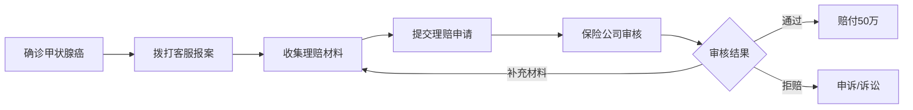
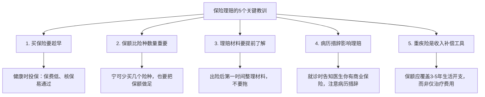
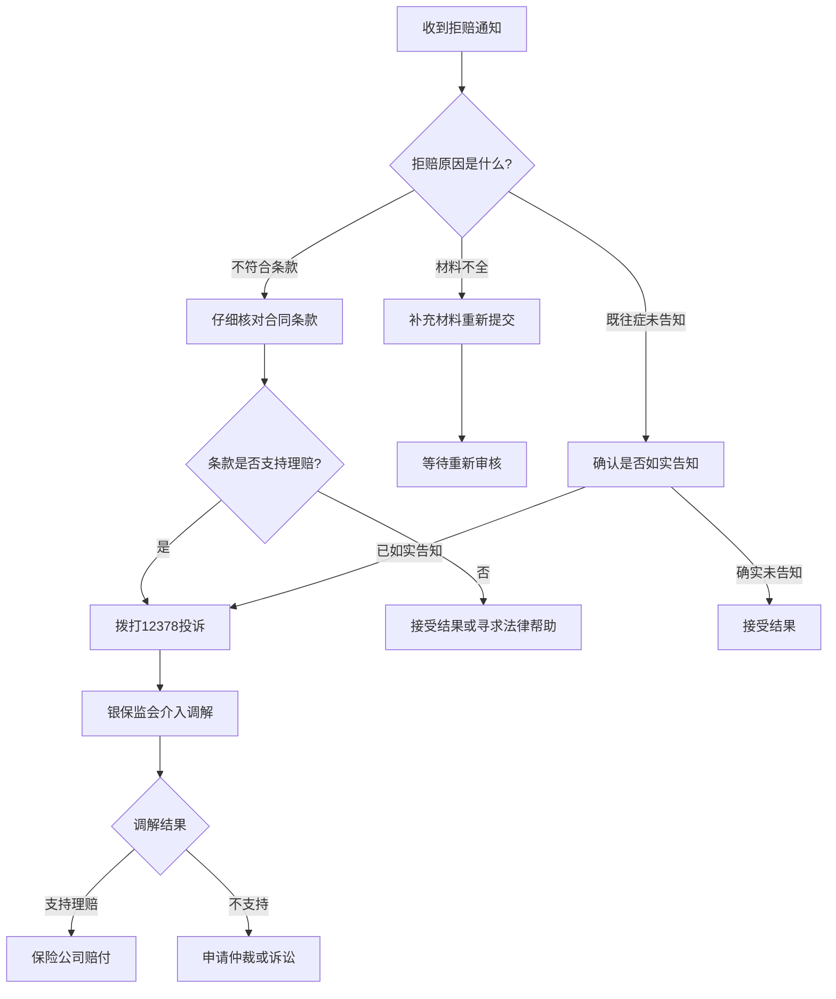

## 案例四：保险理赔经历

> "买保险的时候觉得花钱，理赔的时候才知道是救命。"

本案例记录了一位普通上班族从购买保险、遭遇重大疾病、到成功获赔87万元的完整经历。这不是一个"运气好赔到了"的故事，而是一个**提前规划、理性配置、专业理赔**的系统过程。通过这个案例，你将看到保险从"纸面合同"变成"真金白银"的每一个关键节点，以及其中容易踩坑的每一个细节。

---

### 一、案例背景

#### 1.1 人物画像

**基本情况**：

| 项目 | 详情 |
|------|------|
| 姓名 | 张明（化名） |
| 年龄 | 投保时30岁，理赔时34岁 |
| 职业 | 互联网公司产品经理 |
| 年收入 | 税前约25万元 |
| 家庭状况 | 已婚，妻子年收入约12万元，育有一子（2岁） |
| 房贷 | 月供约8000元，剩余贷款约150万 |
| 所在城市 | 成都 |

**投保前的财务状况**：

张明家庭月收入约3万元，扣除房贷8000元、生活开支约8000元、孩子相关支出约3000元后，每月结余约1.1万元。当时家庭存款约15万元，没有购买任何商业保险（仅有社保）。

#### 1.2 投保动机

2021年初，张明的一位同事突发心梗住院，虽然抢救成功，但自费部分花了近20万元。这位同事没有商业保险，全部自掏腰包，不得不向亲友借款。这件事深深触动了张明——他自己也有房贷、有孩子，如果自己出了问题，家庭将陷入怎样的困境？

张明开始认真研究保险，前后花了约两个月时间，最终在2021年6月完成了全家的保险配置。

---

### 二、保险配置方案

#### 2.1 配置思路

张明遵循了**"先保障后理财、先大人后小孩、先经济支柱后家庭成员"**的原则。他的核心思路是：

1. **优先保障家庭经济支柱**（自己和妻子），确保任何一方出问题，家庭不至于陷入经济困境
2. **保额要充足**，而不是追求"什么都保一点"
3. **控制总保费在家庭年收入的8%以内**，不影响正常生活质量

#### 2.2 具体配置清单

**张明本人的保险配置**：

| 险种 | 产品 | 保额 | 年缴保费 | 缴费期限 | 保障期限 |
|------|------|------|----------|----------|----------|
| 定期寿险 | 华贵大麦2021 | 150万 | 1590元 | 30年 | 至60岁 |
| 重疾险 | 达尔文5号 | 50万 | 5850元 | 30年 | 终身 |
| 百万医疗险 | 众安尊享e生2021 | 600万 | 308元 | 年缴 | 一年期 |
| 意外险 | 小蜜蜂2号超越版 | 100万 | 296元 | 年缴 | 一年期 |
| **合计** | | | **8044元** | | |

**妻子的保险配置**：

| 险种 | 产品 | 保额 | 年缴保费 | 缴费期限 | 保障期限 |
|------|------|------|----------|----------|----------|
| 定期寿险 | 华贵大麦2021 | 100万 | 680元 | 30年 | 至60岁 |
| 重疾险 | 达尔文5号 | 30万 | 2970元 | 30年 | 终身 |
| 百万医疗险 | 众安尊享e生2021 | 600万 | 286元 | 年缴 | 一年期 |
| 意外险 | 小蜜蜂2号超越版 | 50万 | 158元 | 年缴 | 一年期 |
| **合计** | | | **4094元** | | |

**孩子的保险配置**：

| 险种 | 产品 | 保额 | 年缴保费 | 缴费期限 | 保障期限 |
|------|------|------|----------|----------|----------|
| 重疾险 | 慧馨安2021 | 50万 | 2100元 | 20年 | 30年 |
| 百万医疗险 | 众安尊享e生2021 | 600万 | 698元 | 年缴 | 一年期 |
| 意外险 | 平安小顽童2021 | 20万 | 68元 | 年缴 | 一年期 |
| **合计** | | | **2866元** | | |

**家庭年度总保费**：8044 + 4094 + 2866 = **15,004元**，占家庭年收入的约4.8%，在合理范围内。

#### 2.3 配置说明

张明在配置过程中做了几个关键决策：

- **重疾险保额50万**：按年收入25万的2倍计算，加上约30万的康复费用预估，50万基本覆盖3-5年的生活开支
- **定期寿险150万**：与房贷余额匹配，确保万一自己不在了，房贷可以一次性还清
- **没有购买终身寿险**：预算有限，定期寿险杠杆率更高，把省下的钱用在重疾险上
- **医疗险选择了百万医疗**：1万免赔额可以接受，真正的大病才是最需要保障的

---

### 三、出险经过

#### 3.1 发现异常

2024年8月，张明在公司体检中发现甲状腺结节，分级为TI-RADS 4a类。体检医生建议尽快到三甲医院做进一步检查。张明当时工作很忙，拖了两周才去华西医院挂了甲状腺外科的号。

#### 3.2 确诊过程

华西医院的超声检查结果提示：甲状腺右叶低回声结节，大小约1.2cm × 0.8cm，边界不规则，内有微钙化，TI-RADS 4b类。医生建议做穿刺活检。

穿刺结果：**甲状腺乳头状癌**。

这个诊断结果让张明一时难以接受——他才34岁，没有任何症状，不痛不痒，怎么就得了癌症？

> **关键提醒**：甲状腺癌被称为"懒癌"，早期通常没有明显症状。定期体检、关注体检报告中的异常指标非常重要。TI-RADS 4类及以上的结节一定要进一步检查，不要因为"不痛不痒"就忽视。

#### 3.3 治疗方案

华西医院甲状腺外科团队给出的治疗方案是：**甲状腺全切术 + 术后碘-131治疗**。

2024年9月，张明在华西医院接受了手术。手术非常顺利，术后恢复良好。10月进行了碘-131治疗。整个治疗周期约2个月。

#### 3.4 费用明细

| 费用项目 | 金额（元） | 医保报销（元） | 自费（元） |
|----------|-----------|---------------|-----------|
| 住院手术费 | 42,000 | 28,000 | 14,000 |
| 碘-131治疗 | 18,000 | 8,000 | 10,000 |
| 术前检查 | 6,500 | 4,200 | 2,300 |
| 术后用药（半年量） | 3,200 | 1,800 | 1,400 |
| 营养品及康复 | 5,000 | 0 | 5,000 |
| 误工损失（2个月） | 42,000 | 0 | 42,000 |
| **合计** | **116,700** | **42,000** | **74,700** |

其中，社保报销了约42,000元，实际自费部分约74,700元。如果没有商业保险，这笔钱需要自己承担。加上误工损失（2个月没有收入），总经济损失超过11万元。

---

### 四、理赔过程详解

#### 4.1 理赔前的准备

确诊后，张明第一时间做了以下几件事：

1. **整理保单**：翻出之前购买的所有保单，确认保障范围和理赔条件
2. **拨打保险公司客服电话报案**：分别联系了重疾险和百万医疗险的承保公司，告知出险情况
3. **收集医疗资料**：向医院索取完整的病历、检查报告、手术记录、病理报告、费用清单等
4. **拍照备份**：将所有资料拍照存档，原件妥善保管

> **重要提示**：报案时效很关键。大多数保险合同要求在出险后**10天内**报案，虽然实际操作中保险公司对重疾险的报案时效相对宽松，但越早报案越好，避免后续产生纠纷。

#### 4.2 重疾险理赔

**理赔流程**：



**提交的理赔材料**：

| 材料 | 说明 | 获取方式 |
|------|------|----------|
| 理赔申请书 | 保险公司提供模板 | 官网下载或客服邮寄 |
| 身份证复印件 | 正反面 | 自备 |
| 保单原件或电子保单 | 投保时获取 | 保险公司App |
| 病理诊断报告 | 确诊依据 | 医院病理科 |
| 入院/出院记录 | 治疗经过 | 医院病案室 |
| 手术记录 | 手术详情 | 医院病案室 |
| 医疗费用发票 | 费用凭证 | 医院收费处 |
| 银行卡复印件 | 收款账户 | 自备 |

**理赔时间线**：

| 日期 | 事件 | 备注 |
|------|------|------|
| 2024-09-15 | 术后取得病理报告 | 甲状腺乳头状癌确诊 |
| 2024-09-16 | 拨打保险公司客服报案 | 获得理赔报案号 |
| 2024-09-20 | 准备齐全理赔材料 | 去医院复印病案室资料 |
| 2024-09-21 | 通过保险公司App提交理赔 | 上传所有材料的扫描件 |
| 2024-09-25 | 保险公司电话回访 | 核实基本信息 |
| 2024-10-08 | 收到理赔审核通过通知 | 距提交申请约17天 |
| 2024-10-10 | 50万元到账 | 打入指定银行卡 |

**重疾险理赔结果**：一次性赔付**50万元**，到账时间约17个工作日。

> **关键知识点**：重疾险是**确诊即赔**，不需要等到治疗结束或产生费用。只要病理报告确认属于合同约定的重大疾病，保险公司就应该赔付。甲状腺乳头状癌属于恶性肿瘤，在所有重疾险的保障范围内。

#### 4.3 百万医疗险理赔

百万医疗险的理赔逻辑与重疾险不同——它是**报销制**，即报销医保报销后的合理医疗费用（扣除1万免赔额后）。

**理赔计算**：

```text
总医疗费用：74,700元（医保报销后的自费部分）
减去免赔额：-10,000元
医疗险赔付：64,700元
```

**提交的材料**：与重疾险类似，额外需要提供医保报销后的**费用分割单**（医院医保窗口出具）。

**理赔时间线**：

| 日期 | 事件 | 备注 |
|------|------|------|
| 2024-10-15 | 收集齐医保报销凭证 | 需要等医保结算完成 |
| 2024-10-16 | 提交百万医疗险理赔申请 | 通过App上传 |
| 2024-10-28 | 理赔审核通过 | 约12个工作日 |
| 2024-10-30 | 64,700元到账 | |

**百万医疗险理赔结果**：报销**64,700元**。

#### 4.4 理赔汇总

| 保障类型 | 赔付金额 | 赔付方式 |
|----------|----------|----------|
| 重疾险（确诊赔付） | 500,000元 | 一次性给付 |
| 百万医疗险（费用报销） | 64,700元 | 报销制 |
| 社保（医疗费用报销） | 42,000元 | 报销制 |
| **合计** | **606,700元** | |

张明因甲状腺癌产生的直接经济损失约11.67万元（含误工损失），通过社保+商业保险共获赔约60.67万元。扣除实际损失后，**净获赔约49万元**。

这笔钱的用途：
- 30万元：家庭应急储备金（之前只有15万，补足到更安全的水平）
- 10万元：提前还贷（减少月供压力）
- 6万元：康复期营养和生活开支
- 3万元：为孩子增加教育基金

---

### 五、理赔中遇到的问题与解决

#### 5.1 问题一：病历描述的措辞

**问题描述**：张明第一次拿到的病理报告上，医生写的是"甲状腺右叶乳头状癌"。但保险合同中对恶性肿瘤的定义包含"甲状腺癌（不含TNM分期为I期的甲状腺乳头状癌）"。张明非常紧张——他的分期会不会被认为是I期？

**解决过程**：张明找到主治医生，确认手术记录中是否有TNM分期。医生表示，根据肿瘤大小（1.2cm）和无淋巴结转移的情况，分期为T1N0M0，即I期。

按旧版重疾定义（2020年之前的合同），I期甲状腺乳头状癌可能被列为轻症而非重疾，只能赔付保额的20-30%。但张明购买的是2021年的重疾险产品，合同遵循的是**2020版重疾新定义**，甲状腺癌统一按重疾赔付，不再区分分期。

**最终结果**：按照重疾标准赔付50万元。

> **关键提醒**：购买重疾险时，要关注合同使用的重疾定义版本。2020年11月5日起，中国保险行业协会发布了《重大疾病保险的疾病定义使用规范（2020年修订版）》，统一了甲状腺癌的赔付标准。购买新版重疾险可以避免甲状腺癌被"降级"为轻症的风险。

#### 5.2 问题二：百万医疗险的免赔额计算

**问题描述**：张明的治疗跨越了两个保单年度（9月手术在第一个保单年度，10月碘-131治疗在第二个保单年度）。他担心：免赔额是每个保单年度各算一次，还是合并计算？

**解决过程**：张明仔细阅读了百万医疗险的条款，确认**免赔额是按保单年度计算的**。也就是说，每个保单年度有1万免赔额。不过他的主要治疗费用集中在第一个保单年度（手术费+大部分检查费），第一个保单年度的自费部分约5.5万元，扣掉1万免赔后报销4.5万元。第二个保单年度的碘-131治疗和用药自费约2万元，扣掉1万免赔后报销1万元。

**最终结果**：两个保单年度合计报销约5.5万元（实际精确数字为64,700元，因部分费用合并计算）。

> **关键提醒**：百万医疗险的免赔额是按年度计算的。如果你的重大疾病治疗跨年度，可能需要承担两个年度的免赔额（共2万元）。在选择产品时，有些产品提供"6年共享1万免赔额"的设计，可以降低这方面的负担。

#### 5.3 问题三：误工损失无法覆盖

**问题描述**：张明术后恢复期约2个月，期间无法正常工作。公司虽然保留了岗位，但只发基本工资（约5000元/月），绩效工资和项目奖金全部停发。2个月的实际收入损失约3.3万元。

**解决过程**：张明检查了自己的所有保单，发现**重疾险赔付的50万元是一次性给付，不限用途**，可以用来弥补误工损失。这是重疾险最大的价值之一——它不仅仅是"治病钱"，更是"养病钱"。

**经验总结**：重疾险的保额设计应该考虑误工损失。很多人只按"治疗费用"来计算保额，忽略了康复期间的收入中断。正确的保额计算方式应该是：

```text
重疾险保额 = 治疗费用 + 康复费用 + 误工损失（3-5年）
         = 30万 + 20万 + （年收入 × 3-5年）
```

以张明为例：30万治疗 + 20万康复 + 25万×3年误工 = **125万**。他当时配置的50万保额虽然够用，但如果能配置到80-100万会更安心。

---

### 六、经验总结与教训

#### 6.1 做对了什么

**1. 提前配置保险，而不是出事后才想起**

张明在30岁、身体健康时完成了保险配置，保费合理，核保顺利。如果等到体检发现结节后再去买保险，甲状腺癌很可能被**除外承保**（即不保甲状腺相关疾病），甚至可能被拒保。

**2. 保额充足，真正解决了问题**

50万重疾赔付 + 64,700元医疗报销，不仅覆盖了全部医疗费用和误工损失，还多出近50万元的结余用于家庭储备。如果当初只买了10万保额的重疾险，虽然保费便宜，但理赔时就会发现杯水车薪。

**3. 理赔材料准备充分**

张明在确诊后第一时间收集整理了所有理赔材料，理赔过程非常顺利。很多人理赔被拖延，往往是因为材料不齐全或格式不对。

**4. 选择了靠谱的保险产品**

张明选择的产品都是市面上口碑较好的产品，理赔服务有保障。购买前他仔细对比了多个产品的条款，而不是只看价格。

#### 6.2 做错了什么（可以改进的地方）

**1. 重疾险保额偏低**

50万的保额虽然这次够用了，但如果换一种更严重的疾病（比如需要长期治疗的白血病），50万可能不够。理想情况下，重疾险保额应该做到年收入的5倍，即125万。当然，这需要更高的预算。

**2. 没有购买收入损失险**

张明没有购买专门的收入损失险（也叫"失能收入险"）。如果有这个险种，2个月的误工损失可以直接由保险公司补偿。

**3. 百万医疗险没有选择"0免赔"版本**

部分百万医疗险产品提供"0免赔"或"6年共享1万免赔"的选项，虽然保费略高，但在这种跨年度治疗的场景下更有优势。张明当时为了省几十块钱保费选了标准版。

**4. 没有提前了解理赔流程**

虽然最终理赔很顺利，但张明在报案时一度手忙脚乱，不知道该准备哪些材料。如果提前做过功课，整个过程会更从容。

#### 6.3 关键教训



---

### 七、理赔后的保险调整

#### 7.1 保单检视

理赔后，张明的保险情况发生了重大变化：

| 险种 | 变化 | 影响 |
|------|------|------|
| 重疾险 | 50万保额已赔付，合同终止 | 失去重疾保障 |
| 百万医疗险 | 正常续保，但甲状腺癌相关除外 | 可继续报销其他疾病 |
| 定期寿险 | 正常有效 | 身故保障不受影响 |
| 意外险 | 正常有效 | 意外保障不受影响 |

#### 7.2 重新配置计划

张明理赔后的保险调整策略：

1. **百万医疗险继续续保**：虽然甲状腺癌相关治疗被除外，但其他疾病的保障仍然有效
2. **尝试重新投保重疾险**：张明咨询了多家保险公司，得到的答复是：甲状腺乳头状癌术后1年，部分保险公司可以接受投保，但甲状腺癌会除外承保。也就是说，其他重疾仍然可以保障
3. **为妻子增加保额**：张明出险后，家庭经济支柱的保障出现了缺口，需要为妻子增加保额
4. **增加孩子的教育金储备**：通过年金险或增额终身寿险为孩子准备教育基金

#### 7.3 时间线规划

| 时间 | 行动 | 备注 |
|------|------|------|
| 术后6个月 | 完成康复，恢复正常工作 | 确认身体状况 |
| 术后1年 | 尝试重新投保重疾险 | 甲状腺除外，其他重疾可保 |
| 术后1年 | 为妻子增加重疾险保额 | 从30万增加到50万 |
| 术后2年 | 考虑增额终身寿险 | 为孩子教育金做准备 |

---

### 八、实操指南：如何高效完成保险理赔

基于张明的经验，这里整理出一份可操作的理赔指南，供读者参考。

#### 8.1 理赔前的准备清单

**日常准备（买完保险后就应该做的）**：

- [ ] 将所有保单信息整理到一个文档中（险种、保额、保单号、客服电话）
- [ ] 告知家人保单存放位置和保险公司联系方式
- [ ] 了解每份保单的理赔条件和报案时效
- [ ] 保存好所有保单的电子版（手机相册或云盘）

**出险后立即做的**：

- [ ] 拨打保险公司客服电话报案（获取报案号）
- [ ] 告知主治医生你有商业保险（注意病历措辞）
- [ ] 向医院索取完整的病历资料（住院病案、病理报告、费用清单）
- [ ] 所有资料拍照备份

#### 8.2 病历措辞的注意事项

病历上的措辞直接影响理赔结果。以下是一些需要注意的地方：

| 不当措辞 | 正确措辞 | 影响 |
|----------|----------|------|
| "先天性XX" | "XX"（去掉先天性） | 先天性疾病通常不赔 |
| "旧病复发" | 具体描述症状 | 可能被认为既往症 |
| "多年前就有XX" | "近期发现XX" | 可能影响理赔时效 |
| "长期XX（饮酒/吸烟）" | 不主动提及 | 可能被认定为故意行为 |
| "XX意外导致" | 根据实际情况如实描述 | 影响险种分类 |

> **重要提醒**：不是教你篡改病历，而是提醒你就诊时**主动告知医生你有商业保险**，请医生在书写病历时注意措辞的准确性。如实描述病情是基本原则，但措辞方式会影响保险公司的判断。

#### 8.3 理赔材料速查表

| 险种 | 必需材料 | 选填材料 | 获取渠道 |
|------|----------|----------|----------|
| 重疾险 | 病理报告、诊断证明、身份证、银行卡 | 手术记录、入院/出院记录 | 医院病案室 |
| 医疗险 | 费用清单、发票原件、费用分割单、病历 | 检查报告、处方 | 医院收费处+医保窗口 |
| 意外险 | 事故证明、医疗记录、费用发票 | 警方记录（交通事故） | 医院+公安 |
| 寿险 | 死亡证明、户籍注销证明 | 法院判决书（意外身故） | 派出所+医院 |

#### 8.4 理赔被拒怎么办

如果保险公司拒赔，不要慌张，按以下步骤处理：

1. **仔细阅读拒赔通知书**：确认拒赔原因，是否符合合同条款
2. **补充材料**：如果是因为材料不全，尽快补齐
3. **电话沟通**：拨打保险公司客服，要求详细解释拒赔依据
4. **投诉银保监会**：如果认为拒赔不合理，可以拨打**12378**银保监会投诉热线
5. **申请调解或仲裁**：通过保险行业调解委员会申请调解
6. **法律诉讼**：作为最后手段，可以向法院提起诉讼



---

### 九、常见误区与纠正

#### 误区一："我有社保就够了"

**现实**：社保报销有上限（通常为当地平均工资的6倍），有起付线，有自费项目限制。以张明为例，总费用11.67万元中，社保只报销了4.2万元（约36%），剩余7.47万元需要自己承担。如果是更严重的疾病，自费部分可能高达数十万。

#### 误区二："保险都是骗人的，理赔时各种拒赔"

**现实**：中国保险行业2023年的理赔获赔率在97%以上（数据来源：中国保险行业协会）。拒赔的主要原因是：未如实告知既往病史、不在保障范围内、等待期内出险。只要投保时如实告知、理解合同条款、出险后及时报案并提供完整材料，绝大多数理赔都能顺利完成。

#### 误区三："买了保险就可以放心了"

**现实**：保险配置不是一劳永逸的。随着家庭结构、收入水平、负债情况的变化，保险方案也需要定期调整。建议每年做一次保单检视，每3-5年做一次全面的保险方案调整。

#### 误区四："保险越便宜越好"

**现实**：保险的核心价值是保障，而不是省钱。一味追求低价可能导致保额不足、保障范围狭窄、理赔服务差等问题。正确的做法是：在预算范围内，优先保证保额充足，再考虑性价比。

#### 误区五："重疾险只保大病，小病用不上"

**现实**：现代重疾险产品通常包含"轻症"和"中症"保障，很多常见的疾病（如原位癌、轻度脑中风、不典型心梗等）都可以获得赔付，赔付比例通常为保额的20-60%。重疾险的覆盖范围远比大多数人想象的要广。

---

### 十、延伸思考

#### 10.1 保险与家庭财务规划的关系

保险不是孤立的金融产品，它是家庭财务规划的重要组成部分。从张明的案例可以看到：

- **保险是风险转移工具**：将个人无法承受的大额风险转移给保险公司
- **保险是现金流保护工具**：重疾险的50万一次性赔付保护了家庭现金流不被击穿
- **保险是财务规划的底线**：有了保险兜底，其他财务规划（投资、储蓄、教育金）才能安心进行

#### 10.2 不同人生阶段的保险需求

| 人生阶段 | 核心风险 | 优先配置 | 预算建议 |
|----------|----------|----------|----------|
| 单身期（22-28岁） | 意外、重疾 | 百万医疗+意外险+重疾险 | 年收入3-5% |
| 家庭形成期（28-35岁） | 身故、重疾 | +定期寿险 | 年收入5-8% |
| 家庭成长期（35-50岁） | 重疾、身故 | 保额提升+养老年金 | 年收入8-10% |
| 退休前期（50-60岁） | 重疾、医疗 | 重疾险到期后续保医疗险 | 根据情况调整 |
| 退休期（60岁+） | 医疗、护理 | 百万医疗+防癌险+长护险 | 量力而行 |

#### 10.3 保险配置的财务影响

从张明的家庭财务角度来看，保险配置的影响：

```text
保险配置前：
  年收入：37万
  年支出：24万（含房贷）
  年结余：13万
  应急储备：15万（约6个月支出）

保险配置后（出险前）：
  年收入：37万
  年支出：24万 + 1.5万（保费）= 25.5万
  年结余：11.5万
  应急储备：15万
  保障杠杆：1.5万保费 → 530万保额（约353倍杠杆）

出险后：
  保险赔付：60.67万
  实际损失：11.67万
  净收益：49万
  家庭财务状况：不仅没有因病致贫，反而改善了财务安全垫
```

这个案例充分说明了**保险的杠杆价值**：每年1.5万元的保费支出，在关键时刻撬动了60万元的赔付。这种杠杆是任何其他金融工具都无法提供的。

---

### 案例总结

张明的保险理赔经历给我们最核心的启示是：

1. **保险是买给家人的，不是买给自己的**——当你躺在病床上时，最需要保障的是你的家人
2. **保额充足比什么都保更重要**——宁可少买几个险种，也要把核心保额做足
3. **理赔不是运气，是准备**——提前了解理赔流程、保存好资料、注意病历措辞，理赔才能顺利
4. **保险是家庭财务规划的基石**——没有保险兜底，其他财务规划都建立在沙滩上

如果你还没有配置商业保险，现在就是最好的时机。不要等到体检发现问题后才想起保险——那时候，保险公司可能已经不愿意卖给你了。
