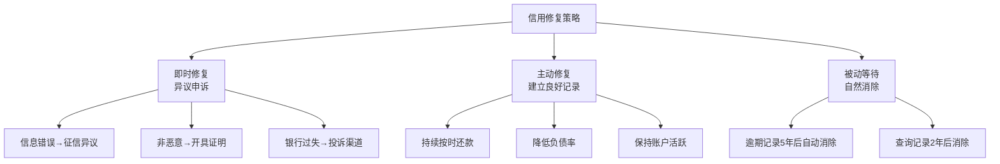

## 案例五：信用修复经历

### 案例背景

**主人公**：张明（化名），30岁，杭州某互联网公司产品经理
**月收入**：税后18,000元
**信用状况**：征信报告存在3笔逾期记录，信用评分极低
**触发事件**：2024年计划购房，申请房贷时被银行拒绝，这才意识到问题的严重性

**张明的征信问题来源**：

| 问题类型 | 具体情况 | 发生时间 | 逾期天数 |
|----------|----------|----------|----------|
| 信用卡逾期 | 招商银行信用卡，忘记还款 | 2021年3月 | 47天 |
| 花呗逾期 | 绑定银行卡余额不足，自动扣款失败 | 2021年9月 | 22天 |
| 信用卡年费逾期 | 未激活的附属卡产生年费，未收到账单 | 2022年6月 | 89天 |

张明的情况在年轻人中非常典型——并非恶意欠款，而是因为疏忽和对信用体系不了解导致的"非恶意逾期"。但征信系统不会区分"恶意"和"非恶意"，任何逾期都会如实记录。

---

### 信用诊断

#### 第一步：拉取完整征信报告

张明首先通过中国人民银行征信中心（www.pbccrc.org.cn）查询了个人信用报告。查询方式有两种：

**线上查询**（推荐）：
1. 登录征信中心官网，注册账号
2. 选择"个人信用信息服务平台"
3. 提交查询申请，24小时内获取结果
4. 每年有2次免费查询机会，第3次起收费10元/次

**线下查询**：
1. 携带本人身份证前往当地人民银行网点
2. 通过自助查询机或柜台查询
3. 当场获取报告

**关键发现**——张明征信报告中的问题：

```text
信用报告摘要
━━━━━━━━━━━━━━━━━━━━━━━━━━━━━━━━
信贷记录：2张信用卡 + 1笔花呗（已结清）
逾期记录：3笔
  ├─ 2021.03 招行信用卡 逾期47天 金额￥1,280
  ├─ 2021.09 花呗      逾期22天 金额￥650
  └─ 2022.06 招行附属卡 逾期89天 金额￥200（年费）
查询记录：近2年被查询8次（贷款审批）
公共记录：无
━━━━━━━━━━━━━━━━━━━━━━━━━━━━━━━━
```

#### 第二步：问题归因分析

张明的信用问题可以归为三类：

**第一类：纯疏忽型**——招行信用卡逾期
- 当月出差频繁，忘记还款日
- 没有设置自动还款
- 发现时已逾期47天

**第二类：系统故障型**——花呗逾期
- 绑定的储蓄卡余额不足
- 自动扣款失败后未收到有效通知
- 手机号更换，催收短信发到旧号码

**第三类：信息不对称型**——附属卡年费逾期
- 主卡申请时勾选了"同时申请附属卡"
- 附属卡激活后产生200元年费
- 账单寄到旧地址，从未收到
- 逾期长达89天才发现

---

### 修复方案设计

#### 策略总览

根据征信管理的相关规定和实践经验，张明制定了三管齐下的修复策略：



#### 策略一：异议申诉（针对信息错误和银行过失）

**适用场景**：征信报告中的信息存在错误、遗漏，或者因银行/机构过失导致的逾期。

**张明的操作**：

**案例A——附属卡年费逾期（银行过失）**

这是张明最有希望通过异议撤销的一笔记录，因为存在以下银行过失：
- 申请主卡时未充分告知附属卡年费政策
- 账单寄送地址变更后未更新
- 未通过有效渠道（短信/APP推送）提醒年费产生

**操作步骤**：

1. **收集证据**
   - 主卡申请表复印件（查看是否有明确的附属卡年费告知）
   - 地址变更记录（证明银行未及时更新）
   - APP消息记录截图（证明未收到年费通知）

2. **联系发卡行客服**
   - 拨打招行信用卡客服 400-820-5555
   - 说明情况：附属卡年费逾期是因银行未尽到告知义务
   - 要求：撤销该笔逾期记录，退还年费

3. **银行内部处理**
   - 银行会在15个工作日内调查
   - 如果认定银行存在过失，会向征信中心报送更正
   - 张明的情况：银行承认通知不到位，同意撤销该笔记录

4. **征信异议申请（备选）**
   - 如果银行不同意撤销，可通过征信中心提交异议
   - 登录征信中心官网 → "异议申请" → 填写异议信息
   - 征信中心会在20个工作日内核查并回复

**结果**：招行同意撤销附属卡年费逾期记录，并退还了200元年费。这一笔89天的逾期记录从征信报告中消除。

**案例B——花呗逾期（部分可申诉）**

花呗逾期的争议点在于：
- 自动扣款失败后，通知是否到位
- 手机号更换后，是否尽到了通知义务

**操作步骤**：

1. **联系支付宝客服**（95188）
   - 说明手机号更换导致未收到还款提醒
   - 提供新旧手机号的证明
   - 要求开具"非恶意逾期证明"

2. **协商结果**
   - 支付宝拒绝撤销征信记录（因确实存在逾期事实）
   - 但同意在征信记录中添加"情况说明"
   - 同时出具了一份"结清证明"

3. **经验教训**
   - 更换手机号后，必须第一时间更新所有金融账户的绑定信息
   - 自动扣款不等于万无一失，需要定期检查扣款是否成功

#### 策略二：主动修复（建立良好信用记录）

对于无法通过异议撤销的逾期记录，张明采取了主动修复策略。

**核心原则**：用新的良好记录覆盖旧的不良影响。

**具体操作**：

**操作一：保持现有信用卡正常使用**

张明保留了招行信用卡，每月正常使用并按时全额还款：

| 月份 | 消费金额 | 还款情况 | 账户状态 |
|------|----------|----------|----------|
| 第1-3月 | 2,000-3,000元 | 全额按时还款 | 正常 |
| 第4-6月 | 3,000-5,000元 | 全额按时还款 | 正常 |
| 第7-12月 | 3,000-5,000元 | 全额按时还款 | 正常 |
| 第13-18月 | 3,000-5,000元 | 全额按时还款 | 正常 |

**关键细节**：
- 每月消费控制在额度的30%以内（降低负债率）
- 设置自动还款+提前3天手动检查双保险
- 还款日提前到发工资后第2天，确保账户余额充足

**操作二：优化负债结构**

张明的负债优化策略：

| 优化项目 | 优化前 | 优化后 | 效果 |
|----------|--------|--------|------|
| 信用卡使用率 | 75% | 25% | 负债率大幅降低 |
| 花呗额度 | 使用中 | 主动关闭 | 减少一个信贷账户 |
| 网贷记录 | 2笔小额 | 全部结清 | 消除"多头借贷"标签 |
| 贷款笔数 | 3笔 | 1笔（房贷） | 简化信贷结构 |

**操作三：控制征信查询次数**

征信查询分为"硬查询"和"软查询"：
- **硬查询**：贷款审批、信用卡审批——会影响信用评分
- **软查询**：本人查询、贷后管理——不影响评分

张明的操作：
- 停止一切不必要的贷款和信用卡申请
- 不点击任何"测测你的额度"链接
- 每半年自查一次征信，了解修复进度

**18个月内查询记录变化**：

| 时间 | 硬查询次数（近半年） | 评价 |
|------|----------------------|------|
| 修复前 | 6次 | 频繁，影响评分 |
| 第6个月 | 3次 | 仍然偏多 |
| 第12个月 | 1次 | 恢复正常 |
| 第18个月 | 0次 | 理想状态 |

#### 策略三：等待自然消除

**征信记录的保存期限**：

| 记录类型 | 保存期限 | 起算时间 |
|----------|----------|----------|
| 逾期记录 | 5年 | 从还清欠款之日起计算 |
| 查询记录 | 2年 | 从查询之日起计算 |
| 正面记录 | 永久 | 一直保留 |

**关键认知**：
- 逾期记录不是从发生之日起5年消除，而是从**还清之日起**5年
- 如果欠款一直不还，逾期记录会一直存在
- 所以第一步永远是：**先把欠款还清**

张明的情况：
- 3笔逾期的欠款早已还清
- 附属卡年费逾期已被撤销
- 花呗逾期从2021年9月还清算起，到2026年9月满5年自动消除
- 招行信用卡逾期从2021年3月还清算起，到2026年3月满5年自动消除

---

### 修复过程时间线

| 阶段 | 时间 | 操作 | 结果 |
|------|------|------|------|
| 诊断期 | 第1个月 | 拉取征信报告，归因分析 | 明确3笔逾期的原因和修复路径 |
| 异议期 | 第2-3个月 | 提交附属卡年费异议，联系花呗客服 | 89天逾期撤销；花呗添加情况说明 |
| 修复期 | 第4-12个月 | 正常使用信用卡，按时还款，降低负债率 | 征信逐步改善，硬查询次数降至0 |
| 巩固期 | 第13-18个月 | 继续保持良好记录，控制新增负债 | 信用评分持续上升 |
| 成果期 | 第18个月 | 重新申请房贷 | 审批通过 |

---

### 修复成果

**征信报告对比（修复前 vs 修复18个月后）**：

| 指标 | 修复前 | 修复18个月后 |
|------|--------|-------------|
| 逾期记录数 | 3笔 | 1笔（花呗，即将到期消除） |
| 最长逾期天数 | 89天 | 22天 |
| 信用卡使用率 | 75% | 25% |
| 近半年硬查询 | 6次 | 0次 |
| 信贷账户数 | 4个 | 2个 |
| 房贷审批 | 被拒 | 通过，利率LPR+0BP |

**房贷申请结果**：
- 贷款金额：180万元
- 贷款期限：30年
- 利率：LPR（4.2%），无上浮
- 月供：约8,800元

如果信用未修复，即使能获批，利率通常会上浮10%-30%，以LPR+30BP（4.5%）计算，月供约为9,120元，30年总利息多付约11.5万元。

---

### 深度解析：信用修复的底层逻辑

#### 征信系统的运作机制

很多人对征信有误解，这里做一个系统性的澄清：

**误解一："逾期一次就完了"**
- 真相：单次短期逾期（30天内）对信用评分的影响有限
- 银行审批时更关注：逾期次数、逾期时长、是否连续逾期
- 偶尔一次30天内的逾期，远不如连续3个月逾期严重

**误解二："销卡就能消除逾期记录"**
- 真相：销卡后逾期记录仍然保留5年
- 而且销卡会缩短信用历史长度，反而可能降低评分
- 正确做法：保留卡片，继续使用并按时还款

**误解三："花钱可以修复征信"**
- 真相：任何声称"花钱消除征信记录"的都是骗局
- 征信记录只有两种途径消除：异议申诉成功，或5年到期自动消除
- 市面上的"征信修复"服务，要么是帮你做异议申诉（你自己也能做），要么是诈骗

**误解四："频繁查征信不影响信用"**
- 真相：本人查询不影响，但"贷款审批"类查询会影响
- 短期内大量"贷款审批"查询会被视为"资金紧张"信号
- 建议半年内硬查询不超过3次

#### 银行审批房贷时的信用评估逻辑

银行在审批房贷时，除了看征信报告，还会综合评估以下因素：

| 评估维度 | 权重 | 张明的情况 | 评价 |
|----------|------|-----------|------|
| 还款能力（月供/月收入） | 30% | 8,800/18,000=49% | 偏高但可接受 |
| 逾期记录 | 25% | 1笔22天逾期（花呗） | 影响较小 |
| 负债率 | 20% | 信用卡使用率25% | 良好 |
| 工作稳定性 | 15% | 同一公司工作4年 | 良好 |
| 首付比例 | 10% | 30%首付 | 标准 |

**关键指标——负债收入比（DTI）**：
- 月供8,800 + 其他月还款0 = 8,800元
- 月收入18,000元
- DTI = 8,800 / 18,000 = 48.9%
- 银行通常要求DTI不超过50%，张明刚好在红线以内

---

### 常见误区与避坑指南

#### 误区一：找"征信修复"中介

**真相**：
- 2022年国家发改委明确：征信修复属于违法违规行为
- 所谓"征信修复公司"通常有两种操作模式：
  - **模式A**：帮你走异议申诉流程（你可以自己免费做）
  - **模式B**：伪造材料提交异议（涉嫌违法，可能被追究刑责）
- 收费通常在3,000-10,000元/条，完全是智商税

#### 误区二：逾期后直接销卡

**错误做法**：
```text
逾期 → 慌张 → 马上销卡 → 以为记录会消失
```

**正确做法**：
```text
逾期 → 立即还清 → 继续正常使用 → 按时还款 → 用新记录覆盖旧记录
```

销卡的坏处：
1. 逾期记录仍然保留5年，销卡不会让它消失
2. 销卡缩短了信用历史长度（占评分的15%）
3. 失去了用良好记录覆盖不良记录的机会

#### 误区三：只还最低还款额

**最低还款的陷阱**：
- 只还最低还款不会产生逾期记录（这是对的）
- 但会产生高额利息（日息万分之五，年化约18%）
- 更重要的是：高负债率会拉低信用评分
- 银行看到你长期只还最低还款，会认为你资金紧张

#### 误区四：频繁申请信用卡来"养信用"

**错误逻辑**：申请越多信用卡 → 信用记录越多 → 信用越好

**真相**：
- 每次申请都会产生一次"硬查询"
- 短期内大量申请会被视为"资金饥渴"
- 正确做法：持有2-3张信用卡，正常使用即可

---

### 预防措施：如何避免再次踩坑

张明在修复信用后，建立了一套完整的信用维护体系：

#### 第一层：自动化防线

```text
所有信贷账户设置自动还款（全额还款）
    ↓
绑定工资卡作为还款账户
    ↓
设置还款日前3天的提醒通知
    ↓
每月1号检查所有自动扣款是否成功
```

#### 第二层：定期监控

| 监控项 | 频率 | 工具 |
|--------|------|------|
| 征信报告 | 每半年1次 | 征信中心官网（免费） |
| 信用卡账单 | 每月 | 各银行APP |
| 负债率 | 每月 | 自行计算（建议<30%） |
| 异常查询 | 每半年 | 征信报告中的"查询记录" |

#### 第三层：信息同步

每次更换手机号、地址、工作单位时：
1. 更新银行预留信息（所有银行APP）
2. 更新支付宝、微信支付绑定信息
3. 更新社保、公积金账户信息
4. 更新保险公司预留信息

#### 第四层：用卡纪律

| 原则 | 具体做法 |
|------|----------|
| 额度使用率≤30% | 每月消费不超过信用卡额度的30% |
| 全额还款 | 永远不还最低还款，不使用分期 |
| 按时还款 | 设置自动还款，绝不逾期 |
| 不随意申请 | 非必要不申请新卡，控制硬查询 |
| 定期自查 | 每半年查一次征信，防患于未然 |

---

### 进阶知识：不同逾期情况的应对策略

#### 情况一：短期逾期（1-30天）

**影响程度**：轻微
**处理方式**：
1. 立即还清欠款
2. 联系客服说明情况，请求不上报征信
3. 如果已经上报，请求开具"非恶意逾期证明"
4. 很多银行对30天内的首次逾期有"容时容差"服务

**银行的"容时容差"政策**：

| 银行 | 容时（宽限期） | 容差（最低免还额） |
|------|---------------|-------------------|
| 工商银行 | 无（部分卡有） | 无 |
| 建设银行 | 3天 | 10元 |
| 招商银行 | 3天 | 10元 |
| 交通银行 | 3天 | 10元 |
| 浦发银行 | 3天 | 10元 |
| 中信银行 | 3天 | 10元 |

> 注意：各银行政策可能随时调整，以发卡行最新规定为准。

#### 情况二：中度逾期（31-90天）

**影响程度**：中等
**处理方式**：
1. 立即还清全部欠款（包括利息和违约金）
2. 联系银行协商：是否可以撤销逾期记录或添加说明
3. 如果存在银行过失（未通知、系统故障等），坚决走异议
4. 接下来24个月内保持完美还款记录

#### 情况三：严重逾期（90天以上）

**影响程度**：严重
**处理方式**：
1. 立即还清全部欠款
2. 如果已被起诉或进入执行程序，处理完法律纠纷
3. 从还清之日起计算5年，逾期记录自动消除
4. 5年等待期内，用良好记录逐步修复

**特别提醒**：
- "连三累六"（连续3次逾期或累计6次逾期）是银行的红线
- 触碰这条红线，短期内几乎无法获批任何贷款
- 只能通过时间+良好记录来修复

#### 情况四：被冒名贷款/信用卡

**处理方式**：
1. 立即报警，取得报案回执
2. 联系相关银行/机构，申请冻结账户
3. 向征信中心提交异议申请，附上报案回执
4. 征信中心核实后会删除冒名记录
5. 必要时通过法律途径维权

---

### 信用修复的核心公式

总结张明的信用修复经历，可以提炼出一个可复用的公式：

```text
信用修复效果 = 异议撤销（能改的改） + 良好记录覆盖（能做的做） + 时间消解（等得起的等）
```

**三个关键变量**：

| 变量 | 适用条件 | 效果 | 时间 |
|------|----------|------|------|
| 异议撤销 | 信息错误、银行过失、非本人操作 | 直接删除记录 | 15-20个工作日 |
| 良好记录覆盖 | 无法撤销的逾期 | 提升评分，降低逾期影响 | 6-18个月 |
| 时间消解 | 所有已还清的逾期 | 记录完全消除 | 5年 |

**优先级**：异议撤销 > 良好记录覆盖 > 时间消解

能通过异议解决的，优先走异议；不能异议的，用良好记录去覆盖；最后才是等待时间消解。三管齐下，信用修复的效果最好。

---

### 关键启示

1. **信用是隐形资产**：平时感觉不到它的价值，关键时刻（买房、买车、创业）才发现它有多重要
2. **预防大于修复**：设置自动还款、定期查征信、更新绑定信息——这些举手之劳可以避免90%的信用问题
3. **非恶意逾期也有救**：不要因为一次疏忽就放弃，异议申诉和良好记录覆盖都是有效的修复手段
4. **远离"征信修复"骗局**：花钱消记录不存在，自己做异议申诉才是正道
5. **时间是最好的修复师**：只要还清欠款并保持良好记录，5年后一切归零

***
