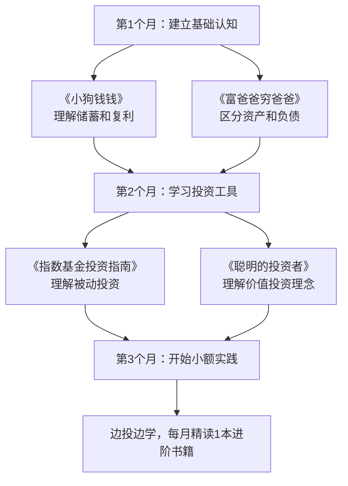

## 案例六：投资理财的成长之路

### 案例概述

本案例记录了一位普通职场人从"月光族"到建立完整投资体系的五年成长历程。主人公张明（化名），28岁，二线城市互联网公司产品经理，月薪从最初的8000元增长到15000元。他的投资之路并非一帆风顺——经历过盲目跟风的亏损、也踩过P2P的雷——但通过系统学习和持续实践，最终建立了一套适合自己的投资理财体系，五年内实现了资产从零到50万的跨越。

这个案例的价值不在于"暴富神话"，而在于展示一个普通人如何**用正确的方法、在可承受的风险范围内**，通过时间的复利效应实现财富的稳步增长。每一步都有具体数据、决策逻辑和反思总结，读者可以对照自身情况借鉴参考。

### 第一阶段：投资启蒙与认知转变（第0-6个月）

#### 1. 从月光到记账：财务意识的觉醒

张明在工作第三年发现自己银行卡余额长期徘徊在2000元以下，而同期入职的同事已经攒了10万。这种对比让他意识到"只靠工资收入、不管理支出"的模式不可持续。

**第一步行动：全面记账**

他使用随手记App记录了连续90天的每一笔支出，发现了三个关键问题：

| 支出类别 | 月均金额 | 占比 | 问题诊断 |
|----------|----------|------|----------|
| 餐饮外卖 | 2800元 | 35% | 工作日几乎全点外卖，单餐均价35元 |
| 冲动消费 | 1500元 | 19% | 直播间下单、限时折扣囤货 |
| 社交娱乐 | 1200元 | 15% | 无效社交聚餐过多 |
| 交通出行 | 600元 | 8% | 短途也打车 |
| 房租 | 1800元 | 23% | 合理范围 |

通过记账，他将月支出从8000元压缩到5500元，每月结余从0提升到2500元。这笔钱成为他投资理财的"种子资金"。

**核心认知转变：** 储蓄是投资的前提。没有结余，一切投资策略都是空中楼阁。

#### 2. 建立应急储备金

在开始投资之前，张明先用4个月时间存下了1万元应急储备金（约2个月基本开支）。这笔钱放在货币基金中，年化收益约2%，但其核心价值不是收益，而是**提供安全感**——确保突发支出不会打断投资计划。

**应急储备金的标准：**

- 刚需档（2个月支出）：覆盖失业过渡期的房租和基本生活
- 安全档（3-6个月支出）：覆盖医疗突发、设备损坏等意外
- 充足档（6-12个月支出）：适合自由职业者或收入不稳定人群

张明选择先达到刚需档，再用后续结余同步推进投资和补充储备金。

#### 3. 投资知识的系统学习

在投入真金白银之前，张明花了2个月进行系统学习。他没有碎片化地看各种"理财博主"的短视频，而是选择了几本经典书籍进行深度阅读：

**入门书单与学习路径：**



**学习成果检验：** 在开始实际投资前，张明能够回答以下问题：

- 什么是复利？72法则如何应用？（72÷年化收益率=资产翻倍年数）
- 股票、债券、基金的本质区别是什么？
- 什么是市盈率（PE）、市净率（PB）？如何看懂一只基金的持仓？
- 为什么"不要把鸡蛋放在一个篮子里"？
- 主动基金和被动基金的优劣势分别是什么？

### 第二阶段：初试投资——小额试错（第7-18个月）

#### 1. 第一笔投资：货币基金

张明的第一笔"投资"是将应急储备金放入余额宝。虽然年化收益仅2%左右，但这个动作的意义在于**跨出从"存钱"到"投资"的心理门槛**。他在这个阶段学会了：

- 货币基金的运作原理（投资短期债券、银行存单等低风险资产）
- 七日年化收益率和万份收益的区别
- T+0赎回和T+1赎回的流动性差异

#### 2. 定投指数基金：用纪律对抗情绪

经过学习，张明决定用**基金定投**作为核心投资策略。他的选择逻辑如下：

**为什么选择指数基金定投？**

| 对比维度 | 主动管理基金 | 指数基金（被动） |
|----------|-------------|-----------------|
| 费率 | 管理费1.5%+申购费 | 管理费0.5%以下 |
| 选股依赖 | 依赖基金经理能力 | 跟踪指数，规则透明 |
| 长期表现 | 仅30%能跑赢指数 | 市场平均收益 |
| 心理压力 | 需要选人、换人 | 只需选指数、坚持定投 |
| 适合人群 | 有研究能力的投资者 | 普通上班族 |

**他的定投方案：**

- 每月定投2000元，发工资次日自动扣款
- 标的选择：沪深300指数基金（60%）+ 中证500指数基金（40%）
- 平台：支付宝基金频道（费率打1折）
- 定投日：每月10号（工资到账次日）

**第一个月的纠结：** 扣款第一天就遇到市场下跌1.5%，账面浮亏30元。张明本能想赎回，但想起书里说的"下跌正是积累便宜筹码的好时机"，硬着头皮继续。这个心理关卡是每个新手投资者必须迈过的。

#### 3. 第一次亏损：盲目跟风的代价

定投半年后，张明在同事推荐下，将5000元投入一只"最近涨得特别好"的行业主题基金——某新能源基金。买入理由仅仅是"同事赚了30%"。

结果买入后一个月下跌12%，亏损600元。这次亏损教会他三个教训：

**教训一：追涨杀跌是亏损之源**

过去一年该基金涨幅68%是因为行业处于景气周期顶部，此时买入相当于"接最后一棒"。

**教训二：不要用"别人赚了"作为买入理由**

同事赚钱是因为他买入时间早（半年前），成本远低于当前价格。同样的基金，不同时间买入，收益天差地别。

**教训三：投资决策必须基于自己的分析框架**

张明总结出一个买入检查清单：

```text
买入前检查清单（checklist）：
□ 我了解这个投资标的的本质吗？（它投资什么？）
□ 我知道它的合理估值范围吗？（当前PE/PB处于历史什么分位？）
□ 我有明确的持有期限吗？（短期投机还是长期配置？）
□ 如果下跌20%，我能承受吗？（风险承受能力评估）
□ 这笔钱是闲钱吗？（不影响生活的钱）
□ 我是独立决策还是跟风？（信息来源审查）
```

这次亏损后，张明赎回了行业基金，将资金回归到指数基金定投的主线上。他把这次经历称为"交了5000元学费的投资入门课"。

### 第三阶段：体系化投资（第19-36个月）

#### 1. 构建资产配置框架

随着投资知识的积累和资金量的增长（此时已累计投资约6万元），张明开始学习资产配置。他不再"只买基金"，而是建立了多层次的投资结构。

**张明的资产配置金字塔：**

```text
                    △  进取层（10%）
                   ╱  ╲  个股投资、行业ETF
                  ╱    ╲  目标：年化15%+
                 ╱──────╲
                ╱  成长层  ╲（30%）
               ╱  指数基金定投 ╲
              ╱  偏股混合基金   ╲  目标：年化8-12%
             ╱────────────────╲
            ╱    稳健层（40%）    ╲
           ╱  债券基金、银行理财    ╲
          ╱  目标：年化4-6%         ╲
         ╱──────────────────────────╲
        ╱      保障层（20%）           ╲
       ╱  货币基金、应急储备金、保险     ╲
      ╱  目标：流动性优先，收益其次        ╲
     ╱──────────────────────────────────────╲
```

**各层的具体配置：**

| 层级 | 占比 | 具体品种 | 月投入 | 目标年化 |
|------|------|----------|--------|----------|
| 保障层 | 20% | 货币基金3万 + 消费型保险 | 维持即可 | 2-3% |
| 稳健层 | 40% | 纯债基金、二级债基 | 2000元 | 4-6% |
| 成长层 | 30% | 沪深300+中证500定投 | 1500元 | 8-12% |
| 进取层 | 10% | 少量个股、行业ETF | 500元 | 15%+ |

#### 2. 建立投资记账系统

张明用Google Sheets建立了一个投资追踪表，每月更新一次。核心追踪指标包括：

**投资组合月度追踪模板：**

```markdown
## 投资组合月报 - YYYY年MM月

### 一、本月操作
- 定投扣款：2000元（沪深300）+ 1500元（中证500）
- 债基买入：2000元（XX纯债）
- 新股/新债：中签XX转债，收益180元

### 二、持仓汇总
| 品种 | 持有金额 | 本月涨跌 | 累计收益 | 持有天数 |
|------|----------|----------|----------|----------|
| 沪深300ETF | ¥32,000 | +2.1% | +8.5% | 380天 |
| 中证500ETF | ¥18,000 | +3.4% | +12.3% | 380天 |
| 纯债基金 | ¥25,000 | +0.3% | +5.2% | 200天 |
| 货币基金 | ¥30,000 | +0.15% | — | — |

### 三、关键指标
- 总资产：¥105,000
- 本月收益率：+1.8%
- 年化收益率：+9.2%
- 最大回撤：-5.3%（3月记录）
```

这个系统帮助他做到三件事：

1. **去情绪化**：不看盘、不追热点，只在月底审视一次
2. **可追溯**：每笔操作都有记录，复盘时能找到决策依据
3. **及时调整**：如果某类资产偏离目标配置超过5%，下月再平衡

#### 3. 保险配置：为投资保驾护航

在投资体系成型的同时，张明意识到"不被意外击穿"和"获得收益"同样重要。他用年收入的5%配置了基础保障：

| 险种 | 产品类型 | 年保费 | 保额 | 配置理由 |
|------|----------|--------|------|----------|
| 医疗险 | 百万医疗 | 300元 | 200万 | 覆盖大病住院费用 |
| 重疾险 | 消费型 | 2500元 | 30万 | 弥补大病期间收入损失 |
| 意外险 | 一年期 | 150元 | 50万 | 杠杆率极高的基础保障 |
| 定期寿险 | 20年期 | 800元 | 50万 | 有房贷后的必要配置 |

**总保费：约3750元/年，占年收入（约15万）的2.5%。**

配置原则：先保障后理财，先大人后小孩，先保额后保费。保险不是投资，而是防止"一夜回到解放前"的安全网。

### 第四阶段：投资进阶与持续优化（第37-60个月）

#### 1. 从定投到动态平衡

第三年开始，张明的基金持仓已达10万以上。他开始实践**动态再平衡策略**：

**再平衡规则：**

- 频率：每季度检查一次，偏离目标超过5%才操作
- 方法：卖出超配资产、买入低配资产，恢复目标比例
- 纪律：不在市场情绪极端时做再平衡（大涨大跌期间暂缓一周）

**实际案例：** 2024年Q3，A股大幅反弹，张明的股票类资产占比从目标的40%飙升到52%。他按计划卖出部分股票基金，将资金转入债券基金，使比例恢复到40/60。事后证明，这次再平衡恰好在市场回调前锁定了部分收益。

**再平衡的本质是"高抛低吸"的纪律化版本**——不需要预测市场，只需要遵守规则。

#### 2. 学习个股投资：交学费后的理性回归

在投资第三年下半年，张明拿出总资产的10%（约1.5万元）尝试个股投资。他选择了自己熟悉的互联网行业，买入了两只股票。

**第一次个股投资记录：**

| 操作 | 股票 | 买入价 | 卖出价 | 收益率 | 持有时间 |
|------|------|--------|--------|--------|----------|
| 盈利 | 某互联网龙头 | 85元 | 102元 | +20% | 4个月 |
| 亏损 | 某SaaS公司 | 32元 | 24元 | -25% | 6个月 |

综合下来，个股投资半年收益约-2%（同期他的指数基金定投收益+8%）。

**反思与决策：** 张明认识到个股投资需要投入大量时间研究财报、行业趋势、竞争格局，而他的本职工作已经很忙。他做出了一个务实的决定：

- 将个股投资比例从10%降到5%
- 仅投资自己深度研究过的公司（不超过3只）
- 把更多精力放在提升主业收入上（投入产出比更高）

**这个认知非常重要：** 对于大多数人来说，花10小时研究个股获得的超额收益，可能不如花10小时精进职业技能带来的薪资涨幅。投资自己的人力资本，往往是回报率最高的投资。

#### 3. 税务优化：不可忽视的隐性收益

随着投资规模增大，张明开始关注税务优化：

**基金投资的税务要点：**

- 基金分红：个人投资者暂免征收个人所得税
- 基金赎回：差价收入暂免征收个人所得税（政策截至2027年底）
- 持有期超过1年：免征增值税
- 基金转换：同一基金管理人旗下的基金转换，不视为赎回，可延迟纳税

**张明的税务优化动作：**

1. 优先选择红利再投资（而非现金分红），利用免税复利
2. 长期持有（超过1年），避免频繁交易产生的税费
3. 年底前赎回亏损基金，实现"税务收割"（抵消其他收益）

#### 4. 收入增长带来的配置升级

到第五年，张明的月薪已从8000元涨到15000元（跳槽+晋升），月投资金额从2000元提升到6000元。他的资产配置也做了相应升级：

| 年份 | 月收入 | 月投资额 | 投资占比 | 累计资产 |
|------|--------|----------|----------|----------|
| 第1年 | 8,000 | 2,000 | 25% | 约3万 |
| 第2年 | 10,000 | 3,000 | 30% | 约8万 |
| 第3年 | 12,000 | 4,000 | 33% | 约16万 |
| 第4年 | 13,000 | 5,000 | 38% | 约28万 |
| 第5年 | 15,000 | 6,000 | 40% | 约50万 |

**50万资产构成：**

- 指数基金持仓：18万（定投收益+本金）
- 债券基金：12万
- 货币基金+应急金：8万
- 个股持仓：5万
- 其他（打新收益、转债等）：7万

### 关键数据汇总

#### 五年投资收益分析

| 指标 | 数值 | 说明 |
|------|------|------|
| 总投入本金 | 约36万 | 五年累计投入 |
| 期末总资产 | 约50万 | 含投资收益 |
| 投资收益 | 约14万 | 含基金分红、资本增值 |
| 整体年化收益率 | 约8.5% | 跑赢通胀和银行理财 |
| 最大单月亏损 | -5.3% | 2024年3月市场调整 |
| 最大单月盈利 | +6.8% | 2024年9月反弹 |
| 投资胜率 | 62% | 盈利月数/总月数 |

#### 与"不投资"的对比

如果张明将每月结余全部放在银行活期（年化0.2%），五年后总资产约为36.2万。实际50万 vs 理论36.2万，差额13.8万就是**投资体系带来的价值**。

### 踩坑复盘：六个典型错误

张明在五年投资路上犯过的错误，以及每个错误的教训：

**错误一：P2P踩雷（亏损8000元）**

第二年在朋友推荐下投入P2P平台，年化收益标称12%。三个月后平台暴雷，本金损失80%。教训：**收益率超过8%的固收类产品，必须审查底层资产和平台资质。** 银行理财年化才4%，凭什么P2P能给12%？多出来的收益对应的是你可能血本无归的风险。

**错误二：频繁查看收益（第1年）**

刚开始定投时每天看三次账户，涨了开心、跌了焦虑，严重影响工作状态。后来改为每月看一次，心态明显改善。教训：**投资频率和查看频率应该匹配。** 定投是月度行为，不需要每天盯盘。

**错误三：在市场恐慌时暂停定投（第2年）**

2023年底A股持续下跌，张明恐慌之下暂停了两个月定投。结果恰恰错过了那段时间的"便宜筹码"，后来市场反弹时少赚了约2000元。教训：**定投的最大优势就是自动执行，人为干预只会削弱这个优势。**

**错误四：过度分散（第3年）**

一度持有12只基金，其中多只持仓高度重叠（比如"消费主题"和"内需增长"的前十重仓股几乎一样）。后来精简到5只核心基金。教训：**分散投资≠持有更多产品，而是持有相关性低的资产。** 5只精心挑选的基金，好过12只随意买入的基金。

**错误五：忽视费率（前2年）**

早期买的基金年管理费1.5%+申购费1.5%，后来发现同类指数基金管理费仅0.5%且免申购费。两年下来多付了约3000元费用。教训：**费率是确定性的收益侵蚀，选择低费率产品是"无风险增收"。**

**错误六：把投资当赌博（第3年个股投资期间）**

投入个股后，心态从"长期配置"变成了"短期博弈"，频繁买卖，手续费吃了不少。教训：**如果一笔投资让你睡不好觉，要么是仓位太重，要么是你不了解它。**

### 经验提炼：可复制的投资方法论

从张明的五年实践中，提炼出一套可复制的投资成长路径：


#### 核心原则清单

1. **先储蓄后投资**：月储蓄率至少20%，先建立3个月应急金再开始投资
2. **先学习后实操**：至少读完3本经典投资书籍再投入真金白银
3. **先指数后个股**：指数基金定投是普通人的最优起点
4. **先纪律后策略**：坚持定投比选对基金更重要
5. **先保障后增值**：配齐基础保险再追求收益
6. **先主业后投资**：提升主业收入的确定性远高于投资收益

#### 适合不同阶段的投资策略

| 阶段 | 资产规模 | 推荐策略 | 核心工具 | 预期年化 |
|------|----------|----------|----------|----------|
| 启蒙期 | 0-5万 | 强制储蓄+货币基金 | 记账App+余额宝 | 2-3% |
| 起步期 | 5-15万 | 指数基金定投 | 支付宝/天天基金 | 6-10% |
| 成长期 | 15-50万 | 资产配置+动态平衡 | 基金组合+债基 | 7-10% |
| 成熟期 | 50-200万 | 多元配置+个股+REITs | 券商账户+海外配置 | 8-12% |
| 进阶期 | 200万+ | 全球配置+另类投资 | 专业顾问+私募 | 10%+ |

#### 每月只需30分钟的投资管理流程

张明总结了一套低维护成本的投资管理流程，每月仅需30分钟：

```text
每月投资管理SOP（30分钟版）

1. [5分钟] 记录本月收入、支出、结余
2. [5分钟] 检查定投是否正常执行（确认扣款成功）
3. [10分钟] 更新投资组合追踪表（输入各品种当前市值）
4. [5分钟] 检查资产配置比例是否偏离目标±5%
5. [5分钟] 记录本月投资心得和市场观察

每季度额外任务（+30分钟）：
- 执行再平衡操作（如有必要）
- 回顾过去3个月的决策质量
- 检查是否有更好的低费率替代产品
```

### 给初学者的行动清单

如果你正处于"想开始投资但不知从何下手"的阶段，以下是具体的第一周行动计划：

**第1天：** 下载记账App（随手记/MoneyWiz），开始记录今天的所有支出

**第2天：** 列出你目前所有的收入来源和固定支出，计算每月可结余金额

**第3天：** 开通一个基金账户（支付宝基金/天天基金/蛋卷基金，任选其一）

**第4天：** 买入第一笔货币基金（金额不限，100元也行），体验完整的买入流程

**第5天：** 阅读《指数基金投资指南》第1-3章（约2小时）

**第6天：** 设置第一个基金定投计划（沪深300指数基金，金额=月结余的30%）

**第7天：** 写下你的投资目标（具体金额+时间期限），贴在显眼的地方

**完成以上7步，你就已经超越了80%的"想投资却一直没开始"的人。**

### 常见误区与纠偏

| 误区 | 正确认知 | 实际行动 |
|------|----------|----------|
| "等有钱了再投资" | 100元就可以开始基金定投 | 今天就设置最小金额的定投 |
| "投资太复杂了" | 指数基金定投是最简单的投资策略 | 只需要选一个指数+设置自动扣款 |
| "现在不是好时机" | 定投的本质就是不用择时 | 永远不要试图"等最低点" |
| "收益太低没意思" | 年化8%，10年就是119%（复利） | 用72法则算一下：72÷8=9年翻倍 |
| "我要找个高手带我" | 没有人能持续预测市场 | 自己学基础知识，比信任何人靠谱 |
| "炒股比基金赚得多" | 七亏二平一赚是铁律 | 先用基金验证自己的投资纪律 |

### 结语

张明的故事告诉我们：投资理财不需要天赋异禀，不需要内幕消息，不需要盯盘到凌晨。需要的是**正确的认知 + 纪律的执行 + 足够的耐心**。

从月光族到50万资产，张明用了五年。这五年里他没有一夜暴富，也没有惊心动魄的操盘故事。有的只是每月雷打不动的定投、每季度一次的再平衡、每年一次的策略复盘。

**复利是世界第八大奇迹，但它只奖励那些有耐心的人。**

如果你今天开始，五年后你也会拥有属于自己的投资成长故事。
