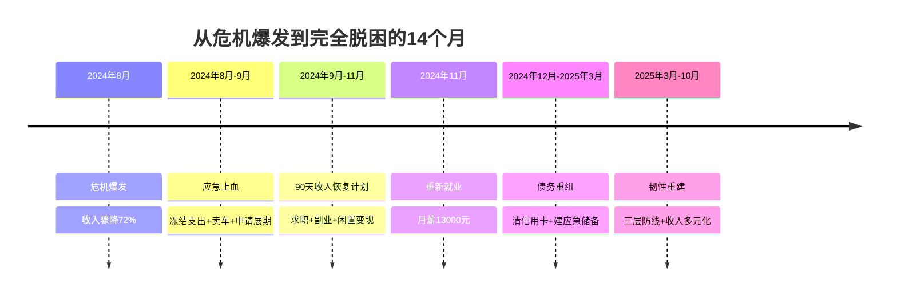
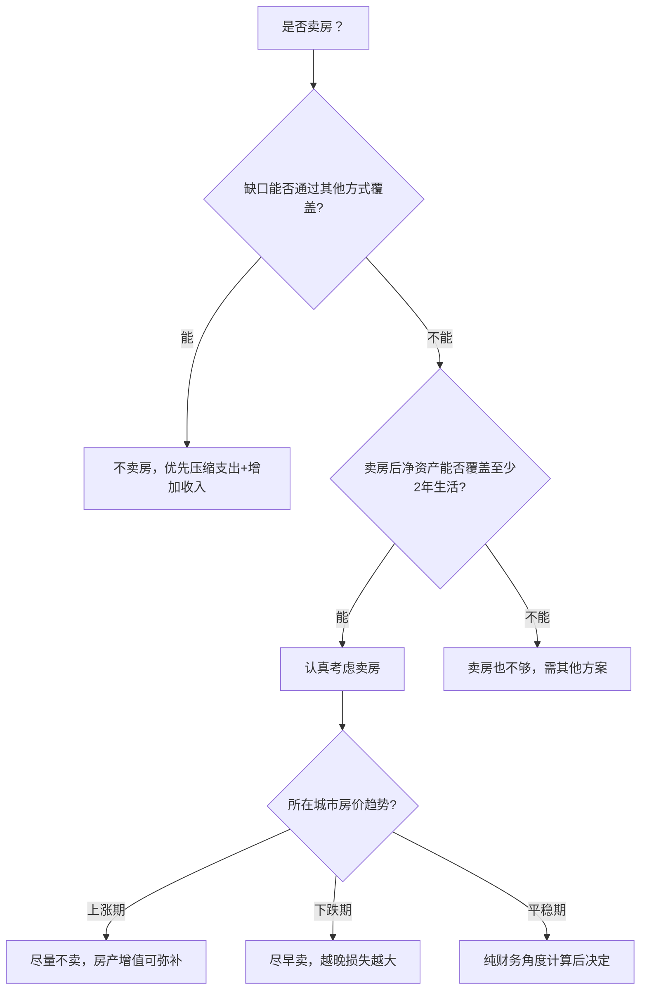
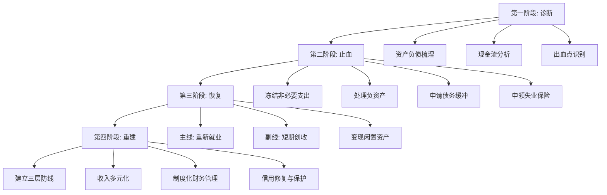

## 案例七：家庭财务危机的化解

> **本章导读：** 这是全书篇幅最长、信息密度最高的案例——它不只是一份"危机应对指南"，更是一套可复用的家庭财务急救系统。无论你现在是否面临危机，都建议完整阅读：前半部分（诊断→止血→恢复）教你"出事了怎么办"，后半部分（重建→韧性→预防）教你"如何让危机永不发生"。核心公式：**现金流管理 × 时间窗口 = 生存概率**。

家庭财务危机是个人理财中最棘手的场景——它往往不是单一问题，而是收入骤降、债务堆积、支出失控、情绪崩溃等多个问题同时爆发的连锁反应。根据中国家庭金融调查（CHFS）数据，约37%的家庭在遭遇主要收入来源中断后会在6个月内出现严重财务困难，其中超过一半的家庭因缺乏系统化应对策略而陷入长期困境。

本案例完整还原一个典型三口之家从陷入危机到逐步脱困的全过程，展示系统化的危机诊断、应急处置、心理调适和长期重建策略。与单纯的技术性分析不同，本案例特别关注危机中被多数人忽略的心理维度和法律权益保护——因为真正压垮一个家庭的往往不是财务数字本身，而是决策瘫痪、关系破裂和权益损失。

### 一、案例背景

#### 1.1 家庭基本情况

张先生（35岁）和李女士（33岁），育有一子（5岁），居住在二线城市。危机爆发前的家庭财务状况如下：

| 项目 | 金额（月） | 说明 |
|------|-----------|------|
| 张先生工资收入 | 15,000元 | 某制造企业中层管理 |
| 李女士工资收入 | 8,000元 | 私立幼儿园教师 |
| 家庭月收入合计 | 23,000元 | — |
| 房贷月供 | 6,500元 | 贷款85万，剩余22年 |
| 车贷月供 | 3,200元 | 贷款12万，剩余2年 |
| 幼儿园学费 | 3,500元 | 私立园，含兴趣班 |
| 生活开支 | 5,000元 | 餐饮、水电、交通等 |
| 保险支出 | 1,800元 | 重疾险+医疗险+意外险 |
| 其他支出 | 2,000元 | 社交、衣物、日用品 |
| 月结余 | 1,000元 | 几乎无储蓄缓冲 |

从账面看，这个家庭"收支平衡"，但存在三个致命隐患：

- **应急储备几乎为零**：活期存款仅1.2万元，覆盖不了半个月开支。国际通行标准是3-6个月支出的应急储备，这个家庭仅0.5个月。
- **负债率偏高**：月还款占收入42%，已超过30%的安全线。更危险的是，这个比率建立在双收入基础上——任何一方收入中断都会让比率飙升。
- **收入来源单一**：夫妻双方收入都依赖受薪，没有任何被动收入或副业收入。这意味着一旦停止工作，收入立即归零。

这三个隐患单独看都不是致命的，但组合在一起就构成了一个"脆弱系统"——任何一个环节出问题都会引发连锁反应。

**脆弱性自检评分表：**

在分析张先生家庭之前，你可以用以下评分表快速评估自己家庭的财务脆弱程度。每项1-5分，总分越高越脆弱：

| 维度 | 1分（安全） | 3分（警戒） | 5分（危险） | 张先生家庭 |
|------|-----------|-----------|-----------|-----------|
| 应急储备 | ≥6个月支出 | 3-6个月 | <3个月 | 0.5个月 → **5分** |
| 月负债率 | <20% | 20%-40% | >40% | 42% → **5分** |
| 收入来源数 | ≥3个独立来源 | 2个 | 1个 | 2个（实际单一）→ **4分** |
| 保险覆盖 | 全面覆盖+补充 | 基础覆盖 | 无或严重不足 | 基础覆盖 → **2分** |
| 职业稳定性 | 体制/刚需行业 | 稳定行业 | 下行/周期行业 | 制造业下行 → **4分** |
| **总分** | 5-8分安全 | 9-15分需改善 | 16-25分高度危险 | **20分** |

**如何使用这个评分表：** 如果你的总分在9分以上，现在就应该开始改善——不是"以后"，而是"现在"。因为改善需要时间（建立应急储备至少需要6-12个月），而危机不会等你准备好。具体的改善优先级：先补最低分的项目（通常是应急储备），再逐步优化其他维度。每3个月重新评分一次，追踪改善进度。

#### 1.2 危机触发

2024年8月，张先生所在企业因行业下行启动裁员，张先生被列入优化名单。公司支付了3个月工资的经济补偿金（共45,000元），但从此家庭月收入从23,000元骤降至8,000元。

与此同时，李女士因幼儿园招生不足被通知降薪20%，实际到手降至6,400元。

**危机爆发后的财务状况：**

| 项目 | 金额（月） | 变化 |
|------|-----------|------|
| 家庭月收入 | 6,400元 | 下降72% |
| 固定支出（房贷+车贷） | 9,700元 | 不变 |
| 生活必需开支 | 4,000元 | 压缩后 |
| **月缺口** | **-7,300元** | — |

以45,000元补偿金加上1.2万元活期存款（合计57,000元）计算，按7,300元/月的缺口仅能支撑约7.8个月。如果不能在8个月内找到解决方案，将面临断供风险。

但这里需要引入一个重要的正面变量：张先生在职期间连续缴纳失业保险超过5年，依法有资格领取失业保险金（详见第四章）。以当地标准计算，每月可领取约1,800元，最长可领18个月，合计约32,400元。虽然这笔钱是逐月发放而非一次性到账，但它将月缺口从7,300元缩小至5,500元（7,300-1,800），从而将纯消耗存款的生存期从7.8个月延长到约10.4个月（57,000÷5,500）。这就是为什么在危机爆发后的**第一周**就去办理失业登记至关重要——它直接决定了你有多少时间来解决问题。

**关键时间节点线：**



### 二、危机中的心理调适：被多数人忽略的"第一战场"

在讨论任何技术性解决方案之前，必须先谈心理层面。财务危机中的心理冲击往往比财务冲击更具破坏性——它会导致决策瘫痪、关系破裂、甚至健康恶化。研究表明，财务压力是成年人焦虑和抑郁的首要来源之一，其影响程度超过工作压力和健康问题。

#### 2.1 危机中的典型心理反应阶段

财务危机中的心理反应通常遵循以下模式：

| 阶段 | 典型表现 | 持续时间 | 危险信号 |
|------|---------|---------|---------|
| 震惊与否认 | "不可能，一定是搞错了" | 1-3天 | 完全不做任何应对 |
| 愤怒与归咎 | "都是公司的错""当初不该买房" | 3-7天 | 向家人发泄、冲动决策 |
| 焦虑与恐慌 | 失眠、反复计算、灾难化想象 | 1-4周 | 拒绝查看银行账户 |
| 讨价还价 | "如果能找到XX工作就好了" | 2-4周 | 寄希望于小概率事件 |
| 接受与行动 | "这就是现实，我要解决问题" | 持续 | 这是转折点 |

张先生在危机第一周经历了典型的否认期——他花了三天反复确认裁员通知，试图找HR争取留任。这种反应是正常的，但不能停留太久。

**如何识别自己是否"卡"在某个阶段：** 如果某个阶段的症状持续超过正常时间范围的2倍（例如焦虑期超过8周），或者出现以下情况，建议寻求专业心理咨询：连续失眠超过2周、完全无法执行任何应对行动、出现躯体症状（胸闷、头痛、胃痛等）、反复出现"活着没意思"的念头。心理咨询费用通常在200-500元/次，部分城市有免费的心理援助热线（全国24小时心理危机干预热线：400-161-9995）。

#### 2.2 夫妻关系的压力测试

财务危机对夫妻关系的冲击常被低估。张先生和李女士在危机第二周爆发了严重争吵——李女士责怪张先生"为什么是你被裁"，张先生则反驳"你的工资也不高"。这种互相指责是危机中最常见的关系陷阱。

**他们最终采取了三个关键步骤：**

**第一步：建立"危机作战会议"制度。** 每天晚饭后用20分钟专门讨论财务问题，其他时间不谈钱。这个边界非常重要——它既保证了问题得到处理，又防止财务焦虑渗透到生活的每个角落。

**第二步：明确分工。** 张先生负责收入恢复（求职+副业），李女士负责支出管控和家庭日常。分工明确避免了互相推诿和重复劳动。

**第三步：设立"情绪安全词"。** 当讨论变得激烈时，任何一方可以说"暂停"，暂停至少30分钟再继续。这避免了在情绪激动时做出伤害性的言语。

**危机中的夫妻沟通模板：**

在"危机作战会议"中，使用以下结构化沟通模板可以有效减少冲突：

```text
【事实】本周的现金流数据是：收入___元，支出___元，缺口___元
【感受】我对这个状况感到（焦虑/担心/平静/有信心）
【需要】我最需要的支持是___
【请求】具体希望对方做的一件事是___
```

这个模板的原理来自非暴力沟通（NVC）框架——先陈述事实，再表达感受，然后说明需要，最后提出具体请求。它能有效避免互相指责的恶性循环。

#### 2.3 对5岁孩子的影响与保护

很多家长认为"孩子小不懂事"，但研究表明，3岁以上的孩子能敏锐感知家庭氛围的变化。张先生的儿子在危机期间出现了两个明显变化：食欲下降和夜间惊醒。

**有效的应对措施包括：**

- **维持日常节奏不变**：幼儿园、作息、游戏时间保持稳定，给孩子可预期的安全感
- **用孩子能理解的语言解释变化**："我们家最近在省钱，所以不去餐厅吃饭了，但爸爸妈妈做的饭也很好吃"
- **避免在孩子面前争吵**：所有财务讨论在孩子入睡后进行
- **保持一个"不变"的快乐元素**：他们保留了每周日去公园的习惯，这是孩子最期待的事

**向学龄前儿童解释家庭变化的沟通要点：**

| 做法 | 正确示范 | 错误示范 |
|------|---------|---------|
| 解释原因 | "爸爸换了新工作，要等一阵子" | "爸爸失业了，我们没钱了" |
| 说明影响 | "我们不去餐厅，在家做好吃的" | "什么都涨价，什么都买不起" |
| 给予安全感 | "爸爸妈妈会照顾好你" | "你要懂事，别乱要东西" |
| 保持边界 | 孩子不需要知道具体数字 | 把账单给孩子看，让他"知道生活不易" |

核心原则是：**孩子需要知道"发生了什么变化"和"我是安全的"，但不需要承担"解决问题"的压力。** 过早让孩子接触财务压力可能导致焦虑型人格，影响其一生的财务观念。

#### 2.4 求职期的心理管理

张先生在求职第4-6周经历了最严重的心理低谷——连续投了60多份简历没有回音，开始怀疑自己的能力。这是求职中非常普遍的"中段低谷"现象。

**他采用了三个具体的心理调节方法：**

- **量化行动而非量化结果**：每天的目标是"投5份简历"而不是"拿到1个面试"，因为行动可控而结果不可控
- **保持"上班"节奏**：每天8点到图书馆"上班"，下午5点"下班"回家。这种结构化避免了在家无所事事时的焦虑螺旋
- **每周记录3个小成就**：哪怕是"优化了简历的项目描述"或"学了一个新技能"，这些记录帮助对抗"我什么都没做到"的负面感觉

**求职期的社交管理：** 失业后很多人选择回避社交，这是自然反应但弊大于利。张先生的做法是每周至少参加一次行业聚会或前同事聚会，既保持信息渠道又维持社会连接。他的3个面试机会中有2个来自前同事内推——如果他完全断绝社交，这两个机会都不会出现。

### 三、危机诊断：用财务体检找出所有出血点

面对危机，第一反应不应该是"怎么赚钱"，而是"全面诊断"。很多家庭在危机中犯的第一个错误就是急于行动——卖房、借钱、盲目找工作——而没有先搞清楚到底缺多少钱、缺多久、哪些地方可以省。

张先生在朋友建议下，用一周时间做了完整的家庭财务体检。

#### 3.1 资产负债表梳理

| 资产类别 | 金额 | 负债类别 | 金额 |
|---------|------|---------|------|
| 活期存款 | 57,000元 | 房贷余额 | 820,000元 |
| 定期存款 | 0 | 车贷余额 | 68,000元 |
| 房产市值（估） | 1,300,000元 | 信用卡欠款 | 8,500元 |
| 车辆市值（估） | 70,000元 | — | — |
| 公积金余额 | 35,000元 | — | — |
| **资产合计** | **1,462,000元** | **负债合计** | **896,500元** |
| **净资产** | **565,500元** | — | — |

净资产为正，说明这个家庭并非资不抵债，但流动性严重不足——钱都锁在房子里。这是中国家庭最普遍的财务隐患：纸面上是"百万资产"，实际上连一个月的账单都可能付不起。

#### 3.2 四大出血点识别

通过梳理，张先生识别出四个核心问题：

**出血点一：现金流断裂。** 月收入6,400元 vs 月固定支出（房贷6,500+车贷3,200+压缩后生活开支4,000）=13,700元，缺口7,300元。这是最紧急的问题，每天都在消耗仅有的存款。但这里需要注意一个关键变量——张先生有资格申领失业保险金（详见第四章），申领后每月增加约1,800元收入，实际缺口可缩小至5,500元。不过失业保险金需要办理手续后次月才到账，因此第一个月仍需按7,300元的缺口来规划。

**出血点二：刚性负债过高。** 房贷6,500+车贷3,200=9,700元，占当前收入（6,400元）的152%。即使大幅压缩生活开支，仅负债本身就超过全部收入。这意味着除非降低负债支出，否则无论如何节省生活开支都无法实现收支平衡。更深层的问题是，这个负债结构在危机前就已经处于危险区间——负债率42%虽然低于警戒线，但建立在双收入基础上，一旦任何一方收入中断就会瞬间失控。

**出血点三：零缓冲储备。** 活期存款1.2万+补偿金4.5万=5.7万。按7,300元/月的缺口计算约7.8个月；考虑申领失业保险金后缺口降至5,500元/月，约10.4个月。但这两种算法都假设没有任何意外支出——而现实中意外几乎必然发生。一次孩子发烧住院（即使医保报销后自付部分也要数百元）、一次家电维修、一次人情往来，都会加速消耗。真正的"生存期"可能比计算值短20%-30%。

**出血点四：收入恢复不确定。** 35岁中层管理在制造业下行期重新就业，平均周期3-6个月，薪资可能打7-8折。年龄和行业都对再就业不利。根据智联招聘2024年数据，制造业中层管理岗位的平均求职周期为4.2个月，薪资中位数为原薪资的78%。这意味着即使顺利找到工作，收入也可能从15,000元降至11,700元左右，长期来看家庭财务结构仍需调整。

#### 3.3 隐性出血点：被忽略的成本

除了上述四个显性出血点，张先生还发现了三个容易被忽略的隐性成本：

- **信用卡利息**：8,500元欠款如果只还最低还款额，年化利率约18%，每月产生约128元利息。看似不多，但这是在"流血不止"的情况下额外出血。
- **车险年缴压力**：车辆每年保险约5,000元，按年缴纳意味着在某个时间点需要一次性拿出这笔钱。
- **人情往来的隐性压力**：中国社会的人情支出（婚礼、满月、节日）在危机期间仍然是刚性需求，完全切断社交会带来额外的心理压力和关系损失。

#### 3.4 危机诊断工具：现金流缺口计算器

在完成资产负债梳理后，你需要精确计算"存款能撑多久"。以下是可直接使用的计算模板：

```python
# 家庭财务危机缺口计算器
# 将以下变量替换为你的实际数据

# === 月度收支 ===
monthly_income = 6400        # 当前月收入（失业后，不含失业保险金）
unemployment_benefit = 1800  # 失业保险金（如有，逐月发放）
mortgage = 6500              # 房贷月供
car_loan = 3200              # 车贷月供
living_expense = 4000        # 压缩后的生活必需开支
social_insurance = 1150      # 灵活就业社保（养老+医疗）
other_fixed = 500            # 其他固定支出（水电、通讯等）

# === 可用现金（一次性） ===
savings = 57000              # 活期存款
severance = 45000            # 补偿金

# === 计算 ===
total_monthly_outflow = mortgage + car_loan + living_expense + social_insurance + other_fixed
total_cash = savings + severance  # 一次性可用现金 = 102,000元
gap_without_benefit = total_monthly_outflow - monthly_income
gap_with_benefit = gap_without_benefit - unemployment_benefit

print(f"=== 月度现金流分析 ===")
print(f"月总支出: {total_monthly_outflow:,.0f}元")
print(f"月收入（不含失业金）: {monthly_income:,.0f}元")
print(f"月缺口（不含失业金）: -{gap_without_benefit:,.0f}元")
print(f"月缺口（含失业金）: -{gap_with_benefit:,.0f}元")
print()
print(f"=== 生存期估算 ===")
print(f"可用现金: {total_cash:,.0f}元")
if gap_without_benefit > 0:
    months_without = total_cash / gap_without_benefit
    print(f"纯消耗存款生存期: {months_without:.1f}个月")
if gap_with_benefit > 0:
    months_with = total_cash / gap_with_benefit
    print(f"领取失业金后生存期: {months_with:.1f}个月")
    print(f"  注：此为保守估算（不含失业金总额）。")
    print(f"  失业金逐月发放({unemployment_benefit}元/月)，")
    print(f"  实际可延长至约{total_cash / (gap_with_benefit - unemployment_benefit):.1f}个月")
    print(f"  但需注意失业金有申领延迟（首次到账通常需1-2个月）")
else:
    print(f"领取失业金后月结余: {-gap_with_benefit:,.0f}元，可维持")
```

**张先生家庭的实际计算结果：**

```text
=== 月度现金流分析 ===
月总支出: 15,350元
月收入（不含失业金）: 6,400元
月缺口（不含失业金）: -8,950元
月缺口（含失业金）: -7,150元

=== 生存期估算 ===
可用现金: 102,000元
纯消耗存款生存期: 11.4个月
领取失业金后生存期: 14.3个月
  注：此为保守估算（不含失业金总额）。
  失业金逐月发放(1,800元/月)，
  实际可延长至约19.0个月（理论极限）
  但需注意失业金有申领延迟（首次到账通常需1-2个月）
```

**重要说明：** 上述计算中的"月总支出15,350元"是尚未执行止血措施前的完整支出（房贷6,500+车贷3,200+生活费4,000+社保1,150+其他500）。在下一节的72小时止血中，通过卖车（-3,200车贷-1,500用车费）、申请公积金冲还贷（-2,800）、贷款展期（-2,000）等措施，月支出将大幅压缩至6,200元左右，届时加上失业金即可实现正向现金流。这个计算器的意义不在于得出最终结论，而在于**让你清楚看到差距有多大、需要填多少坑**。

### 四、法律权益与政府救助：你不知道自己拥有什么

大多数人在失业时只关注"找工作"，而忽略了自己依法享有的权益和政府救助渠道。这些权益如果全部利用起来，每月可以增加数千元的现金流支持。

#### 4.1 失业保险金申领

张先生在职期间连续缴纳失业保险超过5年，依法可以领取失业保险金。

**申领条件与标准：**

| 条件 | 说明 |
|------|------|
| 缴费年限要求 | 累计缴费满1年 |
| 非自愿离职 | 被裁员、合同到期不续签等（主动辞职不符合） |
| 已办理失业登记 | 到户籍所在地或参保地社保局办理 |
| 有求职意愿 | 需定期报告求职情况 |

**领取金额与期限：**

失业保险金的计算标准因地区而异，二线城市通常为当地最低工资标准的70%-90%。以张先生所在城市为例：

- 每月可领取约1,800元
- 缴费5年可领取最长18个月
- 合计可领取约32,400元

这笔钱虽然不多，但足以覆盖基本生活开支的很大一部分。张先生在离职后第5天就办理了失业登记，第二个月开始领取。

**申领流程：**

1. 离职后60日内到社保局办理失业登记（带身份证、离职证明、社保卡）
2. 填写《失业保险金申领表》
3. 每月通过线上或线下方式报告求职情况
4. 审核通过后次月发放到社保卡银行账户

**重要提醒：** 60天是硬性期限，超过60天未办理视为自动放弃。离职后第一周就应该去办理，不要拖延。此外，领取失业保险金期间，医疗保险由失业保险基金代缴，个人不需要额外缴纳——这又省下了一笔开支。

> ⚠️ **关键时限提醒：** 离职后**60天内**必须办理失业登记，逾期视为自动放弃。同时，离职证明上必须注明"非自愿离职"（裁员/合同到期），否则不符合申领条件。离职当天就确认这两件事，不要等到"有空再说"。

**各地失业保险金参考标准（2024年）：**

| 城市类型 | 月发放标准 | 缴费5年可领月数 | 合计金额 |
|---------|-----------|---------------|---------|
| 一线城市（北上广深） | 1,800-2,200元 | 18个月 | 32,400-39,600元 |
| 二线城市 | 1,400-1,800元 | 18个月 | 25,200-32,400元 |
| 三四线城市 | 1,000-1,400元 | 18个月 | 18,000-25,200元 |

注：具体标准以当地社保局公布为准。缴费1-5年可领12个月，5-10年可领18个月，10年以上最长24个月。

#### 4.2 公积金的多重用途

住房公积金在危机期间是可以动用的"救命钱"，但很多人不知道其全部用途：

**用途一：逐月冲还贷。** 张先生公积金账户有35,000元余额，申请逐月冲还贷后，每月公积金自动抵扣房贷。失业后公司部分暂停缴纳，但个人账户存量仍可使用，每月可抵扣约2,800元。

**用途二：租房提取。** 如果选择卖房租房，可以一次性提取公积金余额用于支付房租和押金。

**用途三：生活困难提取。** 部分城市允许因生活困难提取公积金，需提供低收入证明或失业证明。

**公积金操作注意事项：**

- 逐月冲还贷需要到公积金管理中心办理签约，带上身份证、贷款合同、还款银行卡
- 办理后次月生效，第一个月仍需自己还贷
- 部分城市支持线上办理（当地公积金APP或小程序）
- 如果未来重新就业，新公司开始缴纳后可以提高冲还贷金额

**公积金冲还贷的两种方式对比：**

| 方式 | 操作 | 适合场景 |
|------|------|---------|
| 逐月冲还贷 | 每月自动从公积金账户扣款还贷 | 长期还贷，稳定减轻月供压力 |
| 一次性提取 | 提取公积金余额到银行卡 | 需要大额现金应急 |

危机期间建议优先选择逐月冲还贷——它能持续降低月供压力，且不影响公积金账户的后续使用。

#### 4.3 灵活就业社保续缴

失业后社保断缴会影响医保报销、养老金累计和购房资格。张先生选择以灵活就业身份续缴社保：

- **养老保险**：可选择60%-300%的缴费基数，按最低基数每月约800元
- **医疗保险**：每月约350元，保持医保报销资格
- **合计**：每月约1,150元

这笔支出看起来增加了压力，但不能省。一旦社保断缴超过3个月，医保报销资格会中断，如果这个期间生病住院，全部费用自付——这可能直接让家庭财务归零。

**社保断缴影响一览表：**

| 险种 | 断缴影响 | 缓冲期 | 恢复条件 |
|------|---------|--------|---------|
| 医疗保险 | 无法实时报销，住院全自费 | 2-3个月（各地不同） | 重新缴纳后次月或等待6个月 |
| 养老保险 | 累计缴费年限中断，影响退休金 | 无硬性期限 | 补缴或续缴，累计满15年即可 |
| 生育保险 | 无法享受生育报销和津贴 | 无 | 连续缴纳满12个月 |
| 购房/落户资格 | 连续缴纳记录中断，需重新累计 | 各地政策不同 | 重新连续缴纳 |

**危机期间社保续缴的优先级：** 如果资金极度紧张，优先保医保（每月约350元），其次保养老（每月约800元）。医保是"保命"的，养老是"保未来"的。两者合计1,150元虽然增加了月度压力，但远低于一场大病的自费支出。

#### 4.4 经济补偿金的法律细节与谈判策略

很多人不知道，裁员时的经济补偿金有明确的法律标准，而且这个标准是可以谈的。了解这些可以在离职时争取到应得的权益。

**法定标准（《劳动合同法》第47条）：**

- 每工作满1年，支付1个月工资
- 6个月以上不满1年，按1年计算
- 不满6个月，支付半个月工资
- "月工资"指离职前12个月的平均工资，包括奖金、补贴等

**张先生的情况：** 工作5年8个月，应得6个月工资。按前12个月平均工资15,000元计算，应得90,000元。实际获得3个月工资（45,000元），少拿了约45,000元。如果当时了解法律，可以通过劳动仲裁争取全额补偿。

**补偿金谈判的实操策略：**

很多公司在裁员时会以"协商解除"的名义压低补偿标准。以下是谈判时的关键策略：

**策略一：先签字前算清账。** 不要在HR办公室当场签字。要求将协议带回家，对照法定标准逐项核实。需要核实的核心项目包括：

| 核实项目 | 计算方法 | 张先生的实际差距 |
|---------|---------|----------------|
| 工作年限 | 入职日期到离职日期，6个月以上按1年 | 5年8个月→应按6年算 |
| 月工资基数 | 离职前12个月的税前平均工资 | 应含奖金、补贴、加班费 |
| N+1中的"+1" | 未提前30天通知的，额外支付1个月工资 | 公司未提前通知，应有+1 |
| 年假补偿 | 未休年假按日工资300%折算 | 需确认剩余年假天数 |

**策略二：录音留证。** 与HR的所有沟通建议录音（中国法律允许当事人一方录音作为证据）。特别注意记录HR是否有威胁性语言（如"不签字就不给离职证明""影响你以后找工作"），这些可能构成违法解除。

**策略三：掌握谈判话术。** 以下是几个关键场景的应对话术：

```text
场景1：HR说"公司规定只能给N"
回应："我理解公司有内部规定，但《劳动合同法》第47条的法定标准是N或
N+1。如果公司愿意协商，我也可以接受一个合理的方案，但低于法定标准
的部分，我可能需要通过劳动仲裁来主张。"

场景2：HR说"签了字就不能反悔了"
回应："我需要时间仔细阅读协议内容。根据法律规定，劳动者有权在签署
前充分了解协议条款。我可以在3个工作日内给您答复。"

场景3：HR施压说"今天不签就没有了"
回应："补偿标准是法定权益，不会因为签字时间而改变。我需要咨询一下，
明天给您答复。"（这通常是虚张声势，法定权益不会因时效而消失）

场景4：离职证明被卡
回应："根据《劳动合同法》第50条，用人单位应当在解除劳动合同时出具
离职证明。如果贵司拒绝出具，我将向劳动监察部门投诉。"
```

**策略四：知道什么时候该妥协。** 如果公司给出的方案已经达到法定标准的80%以上，且公司经营状况确实困难（有破产风险），及时落袋为安可能是更明智的选择——破产清算的债权清偿顺序中，员工工资虽然优先，但实际回收率往往很低。

**经济补偿金的税务处理：** 经济补偿金在当地上年职工平均工资3倍以内的部分免征个人所得税。以二线城市为例，2024年职工平均工资约8万元/年，3倍即24万元。张先生获得的45,000元远低于这个标准，因此完全免税。如果补偿金超过免税额度，超出部分按照综合所得税率表单独计税，不并入当年综合所得。在签订补偿协议时，务必确认公司代扣代缴的税额是否正确——如果多扣了，可以在年度汇算清缴时申请退税。

**失业期间的个税注意事项：** 失业本身不产生个税义务，但以下情况需要注意：

- **失业保险金**：免征个人所得税，不需要申报
- **灵活就业收入**（如咨询费、稿费）：属于劳务报酬，单次超过800元的部分需要预扣个税。年度汇算清缴时与综合所得合并计算，如果全年总收入较低（如只有几个月的收入），很可能获得退税
- **闲置物品出售**：个人出售自用物品的收入免征个税，不需要申报
- **年度汇算清缴**：即使失业了，如果有上一年度多缴的个税，仍然可以通过个税APP申请退税。张先生在次年3月的汇算清缴中退回了约3,200元（因为前8个月按高税率预扣，后4个月失业无收入，全年平均税率远低于预扣率）

**离职时必须确认的清单：**

- [ ] 经济补偿金是否按法定标准计算（N或N+1，N=工作年限）
- [ ] 是否有未休年假的工资补偿（按日工资的300%计算）
- [ ] 离职证明是否注明"非自愿离职"（影响失业保险金申领）
- [ ] 社保缴纳是否到离职当月
- [ ] 竞业限制协议是否需要签署（如有，公司需支付竞业补偿金，标准为离职前12个月平均工资的30%，按月支付）
- [ ] 是否有未报销的差旅费、培训费等
- [ ] 年终奖是否按比例发放（部分公司有"在职才能拿年终奖"的条款，但法律上存在争议）

**劳动仲裁的实用信息：** 如果公司拒绝支付法定补偿，可以在离职后1年内申请劳动仲裁。仲裁免费（不收取受理费），周期通常为1-2个月。需要准备的材料包括：劳动合同、工资条或银行流水、离职证明或裁员通知。仲裁结果如果不服，可在15日内向法院起诉。12333热线可以提供免费的劳动法律咨询。

#### 4.5 其他政府救助渠道

除了上述主要渠道外，还有多种政府救助可以申请。以下是按紧急程度排列的完整清单：

| 救助类型 | 条件 | 金额/形式 | 申请渠道 | 审批周期 |
|---------|------|----------|---------|---------|
| 失业保险金 | 非自愿离职+缴费满1年 | 每月约1,500-2,000元，最长24个月 | 社保局 | 1-2周 |
| 临时救助 | 因突发事件导致基本生活困难 | 一次性2,000-10,000元 | 街道办/社区 | 1-2周 |
| 最低生活保障（低保） | 家庭人均收入低于当地低保线 | 每人每月数百元（各地不同） | 街道办/民政局 | 1-2个月 |
| 教育救助 | 子女就学困难 | 学费减免或补贴 | 学校+教育局 | 1个月 |
| 医疗救助 | 因病致贫 | 医保报销比例提高+自付部分补贴 | 医保局+民政局 | 2-4周 |
| 公租房 | 低收入家庭 | 远低于市场价的租金 | 住房保障中心 | 3-6个月 |
| 住房补贴 | 部分城市针对低收入家庭 | 每月数百元 | 住房保障中心 | 1-2个月 |
| 廉租房租金减免 | 已住廉租房的困难家庭 | 租金减免50%-100% | 住房保障中心 | 1个月 |
| 司法救助 | 因诉讼导致生活困难 | 一次性数千元 | 法院 | 1-2个月 |
| 残疾人补贴 | 家庭成员有残疾 | 每月数百元 | 残联+民政局 | 1个月 |

**教育救助详解：** 很多家长不知道，子女教育费用在困难时期有多种减免渠道。以下是可操作的具体政策：

| 救助项目 | 适用对象 | 具体内容 | 申请方式 |
|---------|---------|---------|---------|
| 学前教育资助 | 家庭经济困难的3-6岁幼儿 | 公办园免保教费，民办园按公办标准减免 | 向就读幼儿园提交《家庭经济困难认定申请表》+低收入证明 |
| 义务教育"两免一补" | 义务教育阶段学生 | 免学杂费+免教科书费+寄宿生生活补助（小学1,000元/年，初中1,250元/年） | 学校自动办理，困难补助需申请 |
| 营养改善计划 | 农村义务教育学生 | 每生每天5元营养膳食补助（每年约1,000元） | 学校自动覆盖 |
| 校内资助 | 各学段在校生 | 学校从事业收入中提取3%-5%用于资助困难学生 | 向学校学生资助中心申请 |
| 社会助学金 | 各学段困难学生 | 金额不等，如"希望工程""春蕾计划"等 | 当地团委、妇联、慈善总会 |
| 勤工助学 | 高校学生 | 校内岗位，时薪不低于当地最低工资标准 | 学校勤工助学中心 |

张先生的儿子当时在私立幼儿园，学费3,500元/月。危机后他们做了两件事：一是向幼儿园说明情况申请缓交（幼儿园同意延后2周缴费），二是开始排队附近的公办幼儿园（保教费约800元/月）。如果孩子已经在上小学，"两免一补"政策会直接减轻教育负担。

**低保申请详解：** 最低生活保障是兜底性的社会救助制度。以二线城市为例，2024年低保标准通常为每人每月800-1,200元。如果张先生家庭申请低保（3口人），按人均1,000元计算，家庭月收入需低于3,000元才符合条件——而李女士的工资收入6,400元已经超标，因此不符合低保条件。但如果李女士也失业，家庭收入为零，则可以申请。需要注意的是，低保申请需要核查家庭全部资产（包括房产），有房产的家庭通常不符合条件（除非房产是唯一住房且价值不高）。

**申请技巧：** 很多救助政策不会主动告知，需要自己去问。建议在危机发生后的第一周，就到户籍所在地的社区服务中心做一次全面咨询，了解所有可能适用的救助政策。带上身份证、户口本、收入证明、失业证明等材料，一次咨询可能节省数周的摸索时间。

### 五、应急处置：止血的前72小时

确定诊断结果后，张先生立即启动了72小时应急行动。这72小时的核心目标只有一个：**把月缺口从7,300元降到可控范围内。**

#### 5.1 第一步：冻结一切非必要支出（当天执行）

立即将月开支从13,700元压到8,500元：

| 支出项 | 原金额 | 调整后 | 节省 | 具体措施 |
|--------|--------|--------|------|---------|
| 餐饮 | 3,000元 | 1,500元 | 1,500元 | 全部在家做饭，取消外卖。周末批量备餐（meal prep），利用应季蔬菜和促销食材 |
| 交通 | 1,000元 | 300元 | 700元 | 车停用改骑电动车，减少油费。利用公共交通月卡 |
| 幼儿园 | 3,500元 | 2,000元 | 1,500元 | 退兴趣班，公立园排队转学。向幼儿园说明情况申请缓交 |
| 社交 | 1,000元 | 200元 | 800元 | 坦诚告知朋友现状，减少应酬。真正的朋友会理解 |
| 衣物日用 | 1,000元 | 500元 | 500元 | 暂停一切非必需消费。利用家中存量物品 |
| 保险 | 1,800元 | 1,800元 | 0 | **不砍保险**——危机中最需要保障（详见下文） |
| 其他 | 2,400元 | 2,200元 | 200元 | 水电燃气等刚性支出。养成随手关灯关水的习惯 |

**关键决策：保险不能砍。** 很多人在财务紧张时第一反应是退保，这是极度危险的。危机中的家庭抗风险能力最弱，一场大病就能让局面彻底失控。张先生保留了全部保险，并将年缴改为月缴以减轻现金流压力。

> ⚠️ **退保的隐性成本：** 退保不仅失去保障，还面临直接经济损失。长期险（如重疾险）前几年退保的现金价值极低——年缴6,000元的重疾险，第一年退保可能只拿回200-500元。更重要的是，退保后重新投保需要重新核保，年龄增长会导致保费上涨，如果期间出现健康问题甚至可能被拒保。**退保是"省了小钱、赌了大命"的决策。**

**保险优化策略（详细说明）：**

| 险种 | 处理方式 | 原因 |
|------|---------|------|
| 重疾险 | 保留，年缴改月缴 | 核心保障，退保损失大且失去保障 |
| 医疗险 | 保留，绝不中断 | 百万医疗险年费仅几百元，性价比极高 |
| 意外险 | 保留 | 年费低（约200元），杠杆高 |
| 寿险 | 视现金价值决定 | 如有现金价值较高的储蓄型寿险，可考虑减额交清 |
| 车险 | 卖车后自然取消 | 随车辆处置一并解决 |

如果确实面临极端困难，有几个退保之前的替代方案：保单贷款（用保单现金价值向保险公司借款，利率低于信用卡）、减额交清（降低保额但不再缴费）、宽限期利用（多数保险有60天宽限期，期间保障不中断）。

#### 5.2 第二步：处理车贷（48小时内）

车辆在危机期是纯负债——油费、保险、保养每月至少1,500元，而家庭已无力承担。

**方案对比：**

| 方案 | 月度影响 | 一次性影响 | 风险 |
|------|---------|-----------|------|
| 卖车还贷 | 月省4,700元（车贷3,200+用车费1,500） | 还清车贷后可能收回部分差价 | 需要评估车辆残值vs贷款余额 |
| 继续还贷 | 月增4,700元压力 | 无 | 断供后车被收走，还影响征信 |

张先生通过二手车平台评估，车辆市值约7万元，车贷余额6.8万元。卖车后不仅能清掉车贷，还能回收约2,000元。最终在一周内完成交易，月度现金流立刻改善4,700元。

**卖车操作要点：**

1. **先询价再决定**：至少在3个平台（瓜子、人人车、本地二手车商）询价，取最高价
2. **算清差额**：车辆售价 - 剩余贷款 = 实际回收金额。如果售价低于贷款余额，需要自己补差价
3. **办理流程**：先还清贷款解除抵押→拿到绿本→过户给买家→完成交易
4. **替代交通方案提前准备**：卖车前先买好电动车或公交卡，避免出现交通真空期

**卖车时间线（实操参考）：**

| 天数 | 事项 | 备注 |
|------|------|------|
| 第1天 | 在3个平台发布卖车信息，同时询价 | 准备好行驶证、购车发票照片 |
| 第2-3天 | 接待看车，对比报价 | 警惕车商压价，以平台报价为基准 |
| 第3-4天 | 确定买家，签订买卖合同 | 合同中注明贷款余额由卖家自行结清 |
| 第4-5天 | 联系贷款银行办理提前还款 | 部分银行需提前预约，可能有1-3个工作日处理期 |
| 第5-7天 | 解除抵押→过户→收款 | 车管所办理，通常当天完成 |

调整后的月度状况：

| 项目 | 金额 |
|------|------|
| 家庭月收入 | 6,400元 |
| 房贷月供 | 6,500元 |
| 压缩后生活开支 | 3,300元 |
| 灵活就业社保 | 1,150元 |
| **月缺口** | **-4,550元** |

缺口从7,300元降到4,550元，加上失业保险金后进一步缩小至2,750元。

#### 5.3 第三步：申请房贷缓冲（一周内）

张先生主动联系了贷款银行，申请了两项措施：

**措施一：公积金冲还贷。** 张先生公积金账户有35,000元余额，申请逐月冲还贷后，每月公积金自动抵扣房贷，可覆盖约2,800元（个人+公司部分，失业后公司部分暂停，仅个人存量）。

**措施二：贷款展期申请。** 银行提供了"困难客户还款方案"——将月供从6,500元降至4,500元（延长还款期限5年），条件是提供失业证明和求职记录。张先生提交了材料，两周后获批。

**与银行协商的实用技巧与话术：**

很多借款人不知道银行有专门的"困难客户处理通道"，更不知道怎么开口。以下是实操中经过验证的协商话术和流程：

**第一步：找到对的人。** 不要打普通客服热线，要求转接"贷后管理部门"或"特殊资产管理部"。普通客服只有标准流程权限，贷后部门才有展期、减免的审批权。

**第二步：开场白。**

```text
"您好，我是贵行房贷客户XXX，贷款合同号XXXXX。我因为公司裁员失业了，
目前收入大幅下降，短期内无法按原计划还款。我想咨询贵行有没有针对困难
客户的还款调整方案。我目前在积极求职，预计X个月内可以恢复正常还款。"
```

**第三步：准备证明材料。** 银行通常要求以下材料（提前准备好，能显著提高成功率）：

| 材料 | 用途 | 获取方式 |
|------|------|---------|
| 失业证明/离职证明 | 证明收入中断 | 社保局办理失业登记时获取 |
| 求职记录 | 证明有恢复还款的意愿和行动 | 打印投递记录、面试邀请截图 |
| 家庭财务状况说明 | 展示真实的还款困难 | 手写或打印，包含收入、支出、存款 |
| 银行流水 | 证明现金流确实不足 | 打印最近3个月的工资卡流水 |

**第四步：协商方案选择。** 银行通常会提供以下方案，根据自己的情况选择：

| 方案 | 月供变化 | 总利息变化 | 适用条件 |
|------|---------|-----------|---------|
| 延长还款期限 | 降低 | 增加 | 收入暂时下降，未来可恢复 |
| 先息后本（过渡期） | 大幅降低 | 增加 | 短期现金流极度紧张 |
| 减免罚息 | 不变 | 减少 | 已经逾期，协商减免 |
| 调整还款日 | 不变 | 不变 | 收入发放日与还款日不匹配 |

**第五步：如果被拒绝。** 以下是升级路径：

```text
银行客服拒绝 → 拨打银行总行投诉热线 → 拨打12378金融监管投诉热线
→ 向当地银保监局提交书面投诉
```

实际操作中，12378投诉的解决率显著高于直接与银行协商。银保监会投诉电话12378，工作日9:00-17:00有人工接听。投诉时说清楚：哪家银行、什么贷款、什么原因、要求什么方案、银行拒绝的理由是什么。

> 💡 **协商的核心原则：** 银行不想你违约（处理不良贷款的成本远高于协商成本），所以只要你表现出还款意愿并提供真实困难证明，银行通常愿意协商。关键是**主动联系、不要等逾期**——逾期后再协商，银行态度会完全不同，因为此时你的信用已经受损，银行的谈判筹码增加了。

调整后月度状况：

| 项目 | 金额 |
|------|------|
| 家庭月收入 | 6,400元 |
| 调整后房贷月供 | 4,500元 |
| 公积金抵扣 | -2,800元 |
| 实际房贷支出 | 1,700元 |
| 压缩后生活开支 | 3,300元 |
| 灵活就业社保 | 1,150元 |
| 失业保险金 | +1,800元 |
| **月结余** | **+2,050元** |

**从月亏7,300元到月余2,050元，止血的核心决策在两周内完成，但各项措施的生效时间不同。** 卖车在一周内见效，支出压缩当天生效，但公积金冲还贷需要到公积金中心签约后次月生效，失业保险金需要办理失业登记后次月开始发放，贷款展期审批通常需要2-4周。因此，**前两个月仍然需要消耗存款来覆盖缺口**，但缺口从7,300元缩小到约2,000-3,000元（过渡期），到第三个月开始实现真正的正向现金流。这个时间差非常重要——很多人在看到"月余2,050元"时会产生虚假的安全感，实际上必须预存至少2个月的过渡期资金。

#### 5.4 危机预算表：每日追踪模板

止血后，需要用严格的预算表控制每一分钱的流向。以下是可以直接使用的危机期月度预算模板：

```text
【月度危机预算表】
日期：____年____月
收入：
  夫妻工资收入：____元
  失业保险金：____元
  副业/兼职收入：____元
  其他收入：____元
  收入合计：____元

刚性支出（不可压缩）：
  房贷（扣除公积金后）：____元
  灵活就业社保：____元
  保险保费：____元
  水电燃气通讯：____元
  刚性支出合计：____元

弹性支出（严格控制）：
  餐饮（预算上限：____元）：实际____元
  交通（预算上限：____元）：实际____元
  子女教育（预算上限：____元）：实际____元
  日用品（预算上限：____元）：实际____元
  弹性支出合计：____元

月末：
  总支出：____元
  结余/缺口：____元
  累计可用现金：____元
  距离归零还有：____个月
```

**追踪工具推荐：**

| 工具 | 类型 | 费用 | 适合场景 |
|------|------|------|---------|
| 随手记APP | 手机记账 | 免费基础版 | 日常支出记录，支持多人共享账本 |
| 钱迹APP | 极简记账 | 免费 | 只记收支，无广告无理财推荐 |
| Excel/WPS表格 | 自定义模板 | 免费 | 完全自定义，适合复杂预算管理 |
| 纸质笔记本 | 手写记录 | 几乎零成本 | 夫妻共同查看最方便，无学习成本 |

危机期间的记账不需要精细分类，核心是回答三个问题：这个月花了多少？还剩多少？还能撑几个月？过度精细的记账反而会消耗精力，简洁为上。

### 六、收入恢复：多管齐下的90天计划

止血只是争取时间，真正的脱困需要恢复收入。张先生制定了90天收入恢复计划。

#### 6.1 主线：重新就业

| 阶段 | 时间 | 行动 | 产出 |
|------|------|------|------|
| 准备期 | 第1-2周 | 更新简历、梳理项目经验、整理LinkedIn | 3份针对不同岗位的简历 |
| 广撒网期 | 第3-6周 | 投递+内推+猎头，每天至少5份 | 累计投递150+份 |
| 面试期 | 第4-10周 | 集中面试，每周复盘调整策略 | 获得3个offer |
| 决策期 | 第10-12周 | 对比offer，谈判薪资，确定入职 | 入职新公司 |

**实际结果：** 张先生在第9周收到了一家同行企业的offer，月薪13,000元（比原来低13%），但通勤距离更近，综合性价比可接受。

**求职中的关键策略：**

- **降低预期但不降低标准**：接受薪资降幅，但不接受完全不对口的岗位。盲目降维求职会导致职业路径断裂，长期来看损失更大
- **利用失业期考证**：张先生在求职期间考取了PMP证书，增加了竞争力。考证的费用（约3,000元）可以视为对未来的投资
- **保持作息规律**：每天8点开始"上班"投简历，避免陷入消极情绪循环
- **善用内推渠道**：统计表明，内推的简历通过率是海投的5-10倍。张先生有3个面试机会来自前同事的内推
- **面试复盘**：每次面试后记录被问到的问题和自己的回答，找出薄弱点持续改进

**求职期简历优化要点：**

| 维度 | 优化前 | 优化后 |
|------|--------|--------|
| 工作描述 | "负责团队管理" | "带领12人团队，年度成本降低15%，效率提升22%" |
| 项目经历 | 罗列所有项目 | 挑选3个与目标岗位最相关的项目，突出量化成果 |
| 技能部分 | 罗列所有技能 | 按目标岗位JD优先级排序，匹配度高的放前面 |
| 求职意向 | 不限/面议 | 明确写"制造业中层管理/运营经理" |

#### 6.2 副线：在求职期间创造收入

等待面试的空窗期，张先生同时启动了两项短期收入来源：

**来源一：利用管理经验做咨询。** 在行业论坛和知识星球发布内容，以每小时200元的价格提供制造业管理咨询服务。前两周零收入，第三周开始陆续有人约，90天内累计收入8,000元。

**来源二：闲置物品变现。** 整理家中闲置物品（电子产品、未拆封礼品、健身器材等），通过闲鱼出售，累计回血6,500元。

**咨询副业冷启动的详细路径：**

很多人有专业经验但不知道怎么把它变成收入。以下是张先生实际操作的完整流程：

**第1周：建立存在感。**

| 天数 | 行动 | 具体操作 |
|------|------|---------|
| 第1-2天 | 选择平台 | 知识星球（适合深度内容）、在行（适合1对1咨询）、知乎（适合引流） |
| 第3-4天 | 撰写3-5篇专业文章 | 主题选择：你工作中反复被同事/同行问到的问题。比如"制造业如何降低15%的采购成本""中小工厂的库存管理避坑指南" |
| 第5-7天 | 在行业社群分享 | 加入制造业管理相关的微信群、QQ群，以"分享干货"而非"卖服务"的姿态出现 |

**第2周：启动接单。**

- 在知识星球定价199元/年（低门槛，先积累用户和口碑）
- 在"在行"上架1对1咨询，定价200元/小时
- 在文章末尾留咨询入口，自然转化

**第3-4周：迭代优化。**

- 根据咨询者的反馈，调整服务内容和定价
- 收集好评和案例（征得客户同意后脱敏使用）
- 逐步提高价格到300-500元/小时

**关键数据：** 张先生第一个月收入0元（主要在写内容和建立存在感），第二个月收入2,000元（3个咨询客户），第三个月收入6,000元（8个咨询客户+2篇付费文章）。累计90天收入8,000元，时薪约150-200元。

**闲置变现的操作细节：**

- **拍照技巧**：自然光、干净背景、多角度拍摄。好的照片能让售价提高20-30%
- **定价策略**：先搜索同类商品的成交价（不是标价），定价在中位数偏低10%
- **描述要点**：品牌型号+购买时间+使用频率+成色+瑕疵说明。诚实描述减少售后纠纷
- **优先卖高价值物品**：电子产品（手机、平板、游戏机）和品牌物品变现效率最高
- **批量出清低价值物品**：书籍、衣物等低价物品可以打包出售或捐赠，节省时间成本

这两项收入虽然不多，但覆盖了求职期间的交通和面试着装费用，避免了存款进一步消耗。

#### 6.3 李女士的收入恢复策略

李女士的降薪虽然幅度较小（20%），但在总收入已经大幅下降的情况下，每一分钱都很重要。她采取了两个措施：

- **周末兼职**：利用幼师专业优势，在周末做儿童托管服务，每月增加约1,500元收入
- **技能提升**：报名了蒙氏教育认证课程（费用约2,000元），为未来跳槽到薪资更高的幼儿园做准备

#### 6.4 短期创收渠道评估矩阵

失业期间，需要快速评估哪些创收方式最适合自己。以下是按"启动速度×收入潜力"排列的常见渠道：

| 渠道 | 启动时间 | 月收入范围 | 技能门槛 | 适合人群 |
|------|---------|-----------|---------|---------|
| 闲鱼卖闲置 | 1天 | 500-5,000元 | 零 | 所有人 |
| 外卖/跑腿 | 3天 | 3,000-6,000元 | 低 | 有电动车/时间灵活 |
| 线上咨询 | 1-2周 | 1,000-8,000元 | 中 | 有专业经验的人 |
| 自媒体写作 | 2-4周 | 0-3,000元 | 中 | 文笔好的人 |
| 线上家教 | 1周 | 2,000-5,000元 | 中 | 有教学能力的人 |
| 临时工/兼职 | 1-3天 | 2,000-4,000元 | 低 | 时间充裕的人 |
| 技能接单（设计/编程/翻译） | 1-2周 | 2,000-10,000元 | 高 | 有硬技能的人 |

**选择原则：** 不要只看收入上限，要看"确定性"。危机期间优先选择启动快、收入稳定的方式，即使金额不高。比如闲鱼卖闲置虽然上限低，但几乎零风险零成本，第一天就能开始。

#### 6.5 如果90天不够：B计划的启动条件

张先生在9周内找到了工作，但并非所有人都这么顺利。如果90天后收入恢复仍不理想，需要明确B计划的启动条件：

**启动信号：** 以下任意一条出现，就应该启动B计划：
- 90天内没有收到任何正式offer
- 收到的offer薪资低于原薪资的60%
- 可用现金降至3个月支出以下
- 出现逾期还款的风险

**B计划选项：**

| 选项 | 适用条件 | 代价 | 收益 |
|------|---------|------|------|
| 降维就业 | 行业整体衰退 | 薪资降幅30-50%，职业路径可能断裂 | 快速恢复现金流 |
| 城市迁移 | 本地就业机会枯竭 | 搬迁成本+社会关系重建 | 可能找到更好的机会 |
| 卖房变现 | 房产价值高且无学区需求 | 失去房产+搬迁 | 回收大量现金 |
| 技能转型 | 原行业不可逆衰退 | 3-6个月学习期+收入中断 | 进入更有前景的领域 |
| 创业/自由职业 | 有可变现的技能和资源 | 收入不稳定+社保自缴 | 长期可能收入更高 |

**关键原则：** B计划不是"放弃"，而是"调整预期"。很多家庭在危机中犯的错误是等到存款耗尽才做决定，此时选择余地已经极小。提前设定B计划的启动条件，可以让你在还有选择权的时候做出决策。

### 七、住房抉择：卖房还是坚持？

这是家庭财务危机中最艰难的决策之一。张先生家庭的房产市值130万，房贷余额82万，理论上卖掉可以回收48万现金。但卖房意味着全家租房，涉及孩子的学区、生活圈子、长期资产增值等一系列问题。

#### 7.1 决策分析框架



**卖房的财务计算：**

```text
卖房回收 = 房产市值 - 房贷余额 - 中介费 - 税费
         = 130万 - 82万 - (130万×2%) - 约1万
         = 130万 - 82万 - 2.6万 - 1万
         = 44.4万

租房成本 = 月租约2,000-2,500元（二线城市两居室）

卖房后月度改善：
  省去房贷月供：4,500元（展期后）
  新增房租支出：-2,250元
  净改善：+2,250元/月
  一次性回收：44.4万
```

**张先生的决策：** 经过计算，44.4万的现金回收加上月度改善，足以让家庭安全度过2年以上。但考虑到以下因素，他们最终选择不卖：

1. 孩子5岁，明年上小学，学区房价值不可替代
2. 通过卖车+失业保险+公积金冲还贷+贷款展期，已经实现了正向现金流
3. 张先生在3个月内重新就业的概率较高（实际9周就找到工作）
4. 二线城市房价下跌空间有限，持有成本可控

#### 7.2 什么情况下应该卖房

| 信号 | 说明 |
|------|------|
| 缺口持续6个月以上无法弥合 | 其他手段已用尽，卖房是最后的救命手段 |
| 房价处于快速下跌通道 | 越晚卖损失越大 |
| 贷款余额远低于房产价值 | 卖房后回收现金足够支撑较长时间 |
| 所在城市无学区等附加价值 | 房产只是居住功能，租房可替代 |
| 夫妻双方都无法在本地就业 | 可能需要搬迁到其他城市重新开始 |

#### 7.3 卖房的替代方案

如果不想卖房但需要缓解房贷压力，还有几个方案：

- **出租部分房间**：如果房子有多个卧室，可以出租一间，每月增加1,000-2,000元收入
- **搬到更便宜的住处，出租现有房屋**：如果出租收入高于新租支出，可以赚取差价
- **以房换房**：卖掉大房子，买小房子，回收差价
- **申请房贷转公积金贷款**：如果符合条件，公积金贷款利率远低于商业贷款，月供可大幅降低

### 八、向亲友借款：被回避但有时必要的选项

很多家庭在危机中会考虑向亲友借钱，但因为面子、怕关系破裂等原因不敢开口。这是一个需要谨慎处理但不应该被完全排除的选项。

#### 8.1 什么情况下应该考虑向亲友借款

向亲友借款不是"丢人"的事，但需要满足以下条件才应该考虑：

| 条件 | 说明 |
|------|------|
| 差额是短期的（<6个月） | 你有明确的还款来源和时间表 |
| 其他渠道已经用尽 | 银行协商、政府救助、资产变现都已尝试 |
| 亲友有经济能力 | 不要向同样困难的人借钱，那会伤害双方 |
| 你有还款意愿和计划 | 借钱不是"要钱"，是借用 |

#### 8.2 怎么开口：话术与边界

**开口前的准备：**

- 想清楚需要借多少、借多久、怎么还
- 准备一份简单的"借款计划"（金额、用途、还款时间、还款方式）
- 选择合适的对象——通常是父母、兄弟姐妹或关系亲密且有经济能力的朋友

**参考话术：**

```text
"爸/妈/哥，我遇到一些困难，想跟你说一下情况。
我因为公司裁员失业了，目前在积极找工作，预计3个月内可以恢复。
目前家里的现金流有缺口，想向你借____元，用于____。
我计划在____月内还清，可以按月还，每月还____元。
我知道这不是小数目，你可以考虑一下，我完全理解。"
```

**关键原则：**

- **坦诚说明情况**：不要编造理由。如果对方知道你失业了还在撑面子，反而会失去信任
- **主动提出还款计划**：这表明你不是在"要钱"，而是在"借钱"
- **接受拒绝**：如果对方拒绝，不要怨恨。每个人都有自己的财务考量
- **写借条**：即使是亲人之间，写一份简单的借条也是对双方的保护。内容包括：借款金额、借款日期、还款日期、还款方式、双方签名
- **按时还款**：这比借钱本身更重要。如果约定每月还2,000元，就准时还。一次逾期就可能损害多年的信任关系

#### 8.3 借亲友钱的"禁忌"

| 禁忌 | 为什么危险 | 正确做法 |
|------|-----------|---------|
| 不提还款时间 | 对方不好意思催，但心里会焦虑 | 主动说明"X月X日前还清" |
| 借了不还或拖延 | 关系永久受损，且在亲友圈留下口碑 | 确实还不上时提前沟通，协商延期 |
| 向多人借小额 | 看似分散压力，实际把所有关系都拖入风险 | 优先向1-2位最亲近的人借够需要的金额 |
| 把借款当作"收入" | 借的钱是要还的，不能计入可支配收入 | 在预算中单独列出"借款还款"支出 |
| 借新还旧 | 从亲友处借钱还银行，再从银行借钱还亲友——债务转移而非消除 | 只借真正需要的金额 |

**张先生的实际做法：** 他的父母在得知情况后主动提供了2万元经济支持，说是"给孩子的生活费"而非借款。张先生在经济恢复后加倍还给了父母，并为他们购买了一份补充医疗保险作为"利息"。这种处理方式既解决了燃眉之急，又维护了家庭关系。

### 九、债务重组：从负循环到正循环

就业恢复后，张先生没有"回到从前"，而是利用危机倒逼出的纪律，进行了一次彻底的债务重组。

#### 9.1 信用卡债务清零

8,500元信用卡欠款在入职第一个月一次性还清。信用卡调整为每月全额还款，并设置了消费上限（3,000元/月）。

**信用卡管理的铁律：**

- 永远全额还款，不用最低还款（最低还款的实际年化利率约18%）
- 设置消费提醒（每笔超过100元推送通知）
- 每月查看账单，发现异常立即处理
- 不要持有超过2张信用卡——管理成本远大于积分收益

**信用卡最低还款的真实成本：** 以8,500元欠款为例，如果每月只还最低还款额（通常为10%，即850元），剩余7,650元按日利率万分之五计息，每月产生约115元利息。看似不多，但关键是：你还的850元中大部分是利息，本金减少极慢。按这个速度还清全部欠款需要约18个月，总支付利息约1,600元——相当于这笔钱的实际年化成本超过18%。

#### 9.2 房贷优化策略

虽然贷款展期降低了月供，但总利息增加了。张先生制定了加速还款计划：


具体计划：
- 第1-6个月：月供4,500元，全力积累应急储备
- 第7-12个月：月供恢复6,500元（申请取消展期）
- 第2年起：每年用年终奖的50%（约2万元）提前还本金
- 预计可提前5年还清，节省利息约12万元

**提前还款的注意事项：**

- 部分银行对提前还款收取违约金（通常为还款金额的1%-3%），需提前确认
- 等额本息还款方式下，前半段还款周期提前还款更划算（因为前期利息占比高）
- 提前还款有两种方式：缩短年限（月供不变）或减少月供（年限不变）。前者节省更多利息
- 每次提前还款金额建议不低于1万元，否则手续费占比过高

#### 9.3 债务清偿优先级矩阵

当有多种债务时，按以下优先级偿还：

| 优先级 | 债务类型 | 年化利率 | 还款策略 |
|--------|---------|---------|---------|
| 1 | 网贷/消费贷 | 12%-36% | 立即清零，绝不续借 |
| 2 | 信用卡分期 | 12%-18% | 一次性还清或转低息贷款 |
| 3 | 亲友借款 | 0% | 协商还款计划，维护关系 |
| 4 | 车贷 | 4%-8% | 按计划还款或提前清零 |
| 5 | 房贷 | 3%-5% | 最后处理，优先保证不逾期 |

核心原则：**先清高息债务，再清低息债务。** 高息债务每多存一天就多产生一天利息，是真正的"出血点"。

> ⚠️ **债务清偿的常见误区：** 很多人习惯先还"金额最小"的债务（心理学上叫"雪球法"），觉得还清一笔有成就感。但从纯财务角度，**雪崩法**（先还利率最高的）能省更多利息。举例：同样有1万元闲钱，先还年化18%的信用卡（每月省150元利息）比先还年化4%的车贷（每月省33元利息）多省4.5倍。建议：心理压力可控时用雪崩法，情绪压力大时用雪球法，关键是"还"而不是"怎么还"。

#### 9.4 建立"绝不重蹈覆辙"的财务结构

危机教会了张先生一个核心教训：**没有缓冲的家庭财务，就像没有安全气囊的汽车——平时看不出问题，出事就是大事。**

他建立了三层财务防线：

| 防线 | 目标金额 | 存放位置 | 用途 | 建设优先级 |
|------|---------|---------|------|-----------|
| 第一层：活期应急 | 20,000元 | 货币基金 | 突发支出，随时可取 | 最高——首先完成 |
| 第二层：失业缓冲 | 60,000元 | 短债基金 | 覆盖6个月刚性支出 | 高——6个月内完成 |
| 第三层：机会储备 | 30,000元 | 定期存款 | 投资自己或抓住机会 | 中——1年内完成 |

### 十、信用保护：危机中容易被忽略的长期资产

信用记录是危机中最容易被牺牲、但恢复最慢的资产。一次逾期记录会在征信报告上保留5年，期间会影响贷款、信用卡申请、甚至部分工作机会。

#### 10.1 危机中的信用保护策略

**优先级排序：** 当现金流不足以覆盖所有债务时，需要明确还款优先级：

| 优先级 | 债务类型 | 原因 |
|--------|---------|------|
| 1 | 房贷 | 逾期直接影响住房，且银行处理流程最严格 |
| 2 | 信用卡 | 逾期上征信最快（T+1），影响面最广 |
| 3 | 车贷 | 车辆可被收回，但相对损失可控 |
| 4 | 亲友借款 | 通常可以协商延期，不涉及征信 |

**具体保护措施：**

- **信用卡最低还款**：实在无法全额还款时，至少还最低还款额（通常为账单金额的10%），避免逾期上征信
- **设置自动还款**：为所有债务设置自动扣款，避免因忘记还款导致逾期
- **定期查询征信**：通过中国人民银行征信中心（www.pbccrc.org.cn）每年免费查询2次个人征信报告，及时发现问题
- **异议申诉**：如果出现非本人原因的逾期记录（如系统错误），可以向征信中心提出异议申诉

#### 10.2 危机后的信用修复

如果已经出现逾期记录，修复路径如下：

1. **立即还清欠款**：逾期记录从还清之日起计算5年消除
2. **持续使用信用卡**：还清后继续正常使用并按时还款，用新的良好记录覆盖旧的不良记录
3. **不要销卡**：很多人逾期后选择销卡，这是错误的——销卡后不良记录仍然保留，但没有新的良好记录来覆盖
4. **非恶意逾期可申请消除**：如果逾期是因为银行系统错误、不可抗力等原因，可以向银行申请出具"非恶意逾期证明"

### 十一、医疗危机：财务困难期间的健康风险管控

财务危机期间，家庭对疾病的承受能力接近于零。一次中等规模的住院（如急性阑尾炎手术）可能花费2-5万元，即使是医保报销后，自付部分也可能达到5,000-15,000元——这在正常时期是可以承受的，但在月缺口数千元的危机中，可能直接压垮整个止血计划。

#### 11.1 失业期间的医保保障衔接

张先生在办理失业登记时确认了一个关键事实：**领取失业保险金期间，医疗保险由失业保险基金代缴，个人不需要额外缴纳。** 这意味着从领取失业金的当月起，医保报销资格自动延续。但这里有一个容易忽略的时间差：

| 阶段 | 医保状态 | 说明 |
|------|---------|------|
| 离职当月 | 正常（公司缴纳到当月） | 最后一个月的公司缴纳 |
| 失业登记后次月起 | 失业保险基金代缴 | 需要先办理失业登记 |
| 失业金领取期满后 | 需自行续缴 | 以灵活就业身份缴纳 |

**风险窗口：** 从离职到失业登记生效之间的这段时间（通常1-2个月），如果选择不续缴社保，医保处于断缴状态。虽然医保有2-3个月的缓冲期（各地政策不同），但在此期间就医可能无法实时结算，需要先自费再报销。张先生的做法是离职当月就去办理失业登记，确保无缝衔接。

如果已经断缴超过3个月，重新缴纳后通常有6个月的等待期才能恢复医保报销资格。这6个月是极其危险的"裸奔期"，建议购买一份短期商业医疗险作为过渡（年费约200-500元，覆盖住院费用）。

#### 11.2 危机期间的医疗费用控制策略

**策略一：善用分级诊疗。** 小病去社区卫生服务中心，报销比例通常比三甲医院高10-20个百分点，且挂号费更低。社区能处理的常见病（感冒、肠胃炎、慢性病复诊）不需要去大医院排队。

**策略二：慢性病药物管理。** 如果家庭成员有慢性病需要长期用药，确保在医保定点医院开具处方，走医保报销通道。同样的药物，医保报销后可能只需自付30%-50%。部分城市支持"长处方"政策，一次可开3个月的药量，减少就诊次数。

**策略三：儿童医疗费用控制。** 5岁的孩子正是容易生病的年龄。张先生采取了以下措施：
- 确保孩子的少儿医保（城乡居民医保）正常缴费，年费约300-500元，住院报销比例60%-80%
- 常备药品清单（退烧药、止咳药、创可贴、碘伏）在家中备齐，避免频繁去药店购买
- 疫苗接种严格按照国家免疫规划程序走免费疫苗，暂缓自费疫苗（如五联疫苗、肺炎疫苗等，待经济恢复后再补种）

**策略四：心理健康的低成本干预。** 前文提到财务危机的心理影响，但专业心理咨询费用（200-500元/次）对困难家庭来说是额外负担。以下是低成本或免费的心理支持渠道：
- 全国24小时心理危机干预热线：400-161-9995（免费）
- 北京心理危机研究与干预中心：010-82951332
- 部分社区卫生服务中心提供免费心理咨询
- 高校心理系常有低价或免费的实习咨询项目

#### 11.3 医疗救助政策详解

当医疗费用成为家庭的额外负担时，以下政策可以申请：

**大病医疗救助：** 因病致贫的家庭可以申请医疗救助，救助标准因地区而异，一般为自付医疗费用的50%-80%，年度上限通常为5-10万元。申请渠道为户籍所在地的医保局或民政局。

**临时救助（医疗类）：** 因突发重大疾病导致基本生活困难的家庭，可以向街道办申请临时救助金，金额通常为2,000-10,000元。审批周期较短（通常1-2周），适合应急。

**慈善救助：** 水滴筹、轻松筹等平台虽然争议较大，但对于确实面临高额医疗费用且无力承担的家庭，仍然是一个可选渠道。需要注意的是，这些平台需要真实的医疗证明和费用清单，且平台会收取3%-5%的服务费。

### 十二、家庭财务韧性重建

危机化解后，张先生家庭的财务结构发生了质的变化。

#### 12.1 收入多元化

| 收入来源 | 月均金额 | 占比 | 稳定性 |
|---------|---------|------|--------|
| 张先生工资 | 13,000元 | 62% | 高 |
| 李女士工资 | 6,400元 | 30% | 中 |
| 管理咨询副业 | 1,500元 | 7% | 低 |
| 公积金（公司部分） | 1,500元 | — | 高 |
| **合计** | **22,400元** | 100% | — |

虽然工资收入比危机前有所下降（20,900 vs 23,000），但收入来源从2个增加到3个，加上公积金公司缴纳部分后总收入差距缩小到600元（22,400 vs 23,000），抗风险能力显著提升。

#### 12.2 负债率回归安全线

| 指标 | 危机前 | 危机中 | 重建后 |
|------|--------|--------|--------|
| 月负债/月收入 | 42% | 152% | 29% |
| 应急储备月数 | 0.5个月 | 0个月 | 4个月（持续增长中） |
| 被动收入占比 | 0% | 0% | 7% |
| 保险覆盖率 | 基础 | 基础 | 基础+失业险（新增） |

#### 12.3 新增的制度化习惯

张先生建立了四项"铁律"，写在家庭财务手册中：

**铁律一：发工资当天自动转存。** 工资到账后，自动转入三层防线账户，剩余的钱才是可花的钱。这个"先储蓄后消费"的顺序是财务健康的第一原则。

> 💡 **"先储蓄后消费" vs "先消费后储蓄"：** 这是穷人和富人最根本的财务习惯差异。先消费后储蓄的人，月底发现"又没剩下"；先储蓄后储蓄的人，花掉的是"剩下的钱"而不是"存剩下的钱"。心理学上这叫"心理账户"效应——当储蓄已经"被花掉"（转到专用账户），你会自然地调整消费来适应可支配金额。设置工资到账当天自动转账到储蓄账户，是最简单也最有效的财务习惯。

**铁律二：任何超过500元的支出必须双人审批。** 夫妻双方互相监督，避免冲动消费。这个金额门槛可以根据家庭情况调整，关键是建立"大额支出需要思考"的习惯。

**铁律三：每季度做一次家庭财务体检。** 更新资产负债表、检查保险覆盖、评估投资组合。体检模板包括：资产负债表更新、现金流分析、保险覆盖检查、投资收益回顾、债务进度跟踪。

**铁律四：每年做一次"压力测试"。** 假设收入减半，能否撑过6个月？如果不能，说明缓冲不够。这个测试帮助在风平浪静时保持警觉。

#### 12.4 家庭压力测试实操方法

"压力测试"不是一句口号，而是需要具体执行的量化分析。以下是完整方法：

**第一步：确定测试场景**

| 场景 | 触发条件 | 影响程度 |
|------|---------|---------|
| 场景A：单人失业 | 一方收入归零 | 中等 |
| 场景B：双人失业 | 双方收入归零 | 严重 |
| 场景C：收入减半+大额支出 | 收入下降50%+医疗/维修等意外 | 极端 |

**第二步：计算每个场景的生存月数**

```text
生存月数 = (活期存款 + 可快速变现资产) / 月缺口
月缺口 = 刚性支出 - 测试场景下的收入
```

**第三步：制定应对预案**

| 场景 | 生存月数 | 如果<6个月需要做什么 |
|------|---------|-------------------|
| 场景A | 计算值 | 申请展期+冻结支出+失业保险 |
| 场景B | 计算值 | 上述+卖车+处置非核心资产 |
| 场景C | 计算值 | 上述+考虑卖房或搬迁 |

**第四步：记录测试结果并设定改进目标**

```text
【____年度家庭压力测试结果】
测试日期：____年____月____日

场景A（单人失业）：可撑____个月 → 目标：≥6个月
场景B（双人失业）：可撑____个月 → 目标：≥6个月
场景C（极端情况）：可撑____个月 → 目标：≥3个月

需要改善的方面：
1. ____
2. ____
3. ____

下次测试日期：____年____月____日
```

张先生在危机恢复后的第一次压力测试中，三个场景分别达到了8个月、4个月、2个月。他设定了一年内将场景B提升到6个月的目标。

#### 12.5 14个月完整复盘：从危机到重建的数据记录

以下数据来自张先生家庭的完整财务记录，展示了从危机爆发到完全脱困的14个月中，每个关键节点的财务状况变化：

| 时间节点 | 月收入 | 月支出 | 月结余 | 累计现金 | 关键事件 |
|---------|--------|--------|--------|---------|---------|
| 2024年8月（危机爆发） | 6,400 | 14,700 | -8,300 | 57,000 | 失业+降薪，月缺口含社保 |
| 2024年8月（卖车后） | 6,400 | 10,000 | -3,600 | 59,000 | 卖车回收2,000+省4,700/月 |
| 2024年9月 | 8,200 | 7,500 | +700 | 59,700 | 失业保险金到账，公积金冲还贷签约 |
| 2024年10月 | 8,200 | 6,200 | +2,000 | 61,700 | 公积金冲还贷+贷款展期生效 |
| 2024年11月 | 8,200 | 6,200 | +2,000 | 63,700 | 持续积累 |
| 2024年12月 | 21,200 | 6,200 | +15,000 | 78,700 | 入职新公司（月薪13,000） |
| 2025年1月 | 22,400 | 7,500 | +14,900 | 93,600 | 恢复正常支出水平 |
| 2025年3月 | 22,400 | 7,500 | +14,900 | 123,400 | 应急储备达标（2个月） |
| 2025年6月 | 22,400 | 7,500 | +14,900 | 168,100 | 应急储备达标（4个月） |
| 2025年10月 | 22,400 | 15,200 | +7,200 | 196,900 | 恢复房贷原月供+三层防线基本建成 |

**关键转折点分析：**

1. **第1个月（最危险）**：月缺口8,300元，纯消耗存款。这是唯一需要"动老本"的阶段。
2. **第2个月（止血见效）**：卖车+失业保险金+支出压缩，缺口缩小到3,600元。
3. **第3个月（转正）**：公积金冲还贷+贷款展期生效，首次实现月结余700元。
4. **第5个月（收入恢复）**：入职新公司，月收入从8,200元跳升到21,200元。
5. **第7个月（储备重建）**：应急储备达到2个月支出，心理安全感显著提升。

**复盘的核心教训：** 危机中最关键的不是"赚更多钱"，而是"管理好现金流"。张先生在收入最低的4个月里（8-11月），通过精确的支出控制和政策利用，不仅没有增加负债，反而累计增加了6,700元的现金。这证明了"止血优先于创收"的原则是正确的。

### 十三、关键教训与可复用框架

#### 13.1 家庭财务危机的五个预警信号

不要等到危机爆发才行动。以下信号出现任意两个，就应该启动防御模式：

1. **应急储备不足3个月支出** —— 没有安全垫，任何意外都是危机
2. **月负债率超过40%** —— 已经处于危险区间，缓冲空间极小
3. **收入来源只有1-2个** —— 单点故障风险，一旦中断就是全面崩溃
4. **保险覆盖有明显缺口** —— 一场大病可能让家庭财务归零
5. **连续3个月零结余或负结余** —— 在透支未来的安全

#### 13.2 家庭财务危机化解的四阶段框架



#### 13.3 危机中绝对不能做的七件事

| 序号 | 错误行为 | 为什么危险 | 正确做法 |
|------|---------|-----------|---------|
| 1 | 退保省保费 | 失去保障后一场大病直接归零 | 保留保险，改月缴，降保额也要保 |
| 2 | 借新还旧 | 高利贷/网贷利息滚雪球，越借越深 | 先和银行协商展期或减免 |
| 3 | 盲目投资翻本 | 焦虑心态下决策质量极差，容易被骗 | 先稳定现金流，再考虑投资 |
| 4 | 隐瞒家人 | 独自扛压力容易崩溃，且错过家人的资源和支持 | 坦诚沟通，共同面对 |
| 5 | 放弃社保医保 | 失去最基础的医疗和养老保障 | 即使失业也要以灵活就业身份续缴 |
| 6 | 情绪低谷时做重大决策 | 财务压力下决策质量下降40%以上，包括卖房、离婚、辞职、借钱创业等 | 重大决策至少等72小时冷静期，等情绪恢复到相对平稳状态再做 |
| 7 | 盲信"快速赚钱"机会 | 财务困难人群是诈骗首选目标——"翻本"心理让人丧失判断力 | 凡是要你先掏钱的"赚钱机会"都是骗局，不确定时拨打12315或110咨询 |

**第七条展开：最常见的针对财务困难人群的骗局：**

| 骗局类型 | 话术 | 识别方法 | 真实案例 |
|---------|------|---------|---------|
| 网络刷单 | "日赚300-500，轻松无门槛" | 任何需要先垫付资金的"兼职"都是骗局 | 先让你刷小额单返利建立信任，再要求大额垫付后消失 |
| 虚拟货币投资 | "一个月翻倍，错过再等一年" | 承诺高回报且无风险的投资100%是骗局 | 建立假平台，显示虚假盈利，提现时要求缴纳"保证金" |
| 网贷中介 | "不看征信，秒批到账" | 实际年化利率可能超过100%，且有暴力催收 | 借1万到手7千（砍头息），实际年化超200% |
| 传销/资金盘 | "拉人头赚佣金，躺着赚钱" | 收入来源是下线投入的资金，迟早崩盘 | 伪装成"区块链""新零售"项目 |
| 代办补贴 | "帮你申请政府补贴，先交手续费" | 政府补贴从不收取手续费 | 收了手续费就消失，或套取个人信息 |
| 高薪招聘 | "月薪过万，不限学历经验" | 要求先交培训费/服装费/押金的都是骗局 | 常见于ktv、夜场、模特等行业 |

**防骗核心原则：凡是要你先掏钱的"赚钱机会"，都是骗局。** 正规的求职不需要交任何费用，正规的投资不会承诺保本保息，正规的政府补贴不收手续费。如果你不确定，拨打12315消费者热线或110咨询。

> 🚨 **记住这三条铁律，可以过滤99%的骗局：**
> 1. **要你先掏钱的"赚钱机会"**——100%是骗局
> 2. **承诺"保本保息高回报"**——100%是骗局
> 3. **催你"限时决定、错过就没有"**——100%是骗局

#### 13.4 可直接使用的危机应对清单

当家庭遭遇财务危机时，按以下顺序执行：

**第一天（止血）：**
- [ ] 列出所有资产和负债，计算净资产
- [ ] 列出所有月度收入和支出，计算缺口
- [ ] 冻结一切非必要支出
- [ ] 检查所有保单，确认保障不中断
- [ ] 和家人坦诚沟通，统一口径

**第一周（减压）：**
- [ ] 到社保局办理失业登记，申领失业保险金
- [ ] 联系银行协商房贷/车贷还款方案
- [ ] 评估是否需要处置车辆等负资产
- [ ] 申请公积金冲还贷
- [ ] 以灵活就业身份续缴社保
- [ ] 查询是否符合临时救助条件
- [ ] 到社区服务中心咨询所有可申请的救助政策

**第一个月（启动恢复）：**
- [ ] 制定求职/创收的90天计划
- [ ] 整理闲置物品变现
- [ ] 查询个人征信报告，评估信用状况
- [ ] 梳理可利用的人脉资源
- [ ] 确认所有自动还款设置正常

**第三个月（评估调整）：**
- [ ] 检查存款消耗速度vs恢复进度
- [ ] 如收入恢复不及预期，启动B计划（更大幅度降级或搬迁）
- [ ] 如收入已恢复，开始重建应急储备
- [ ] 复盘整个危机处理过程，更新家庭财务手册
- [ ] 做一次家庭压力测试，确认防线是否足够

#### 13.5 资源清单：危机中可以求助的渠道

| 资源类型 | 具体渠道 | 联系方式/获取方式 |
|---------|---------|----------------|
| 失业保险金 | 当地社保局 | 12333热线或线下窗口 |
| 公积金业务 | 当地公积金管理中心 | 12329热线或公积金APP |
| 银行协商 | 贷款银行客服 | 客户经理或955XX客服热线 |
| 金融监管投诉 | 国家金融监管总局 | 12378热线 |
| 临时救助 | 街道办/社区服务中心 | 户籍所在地社区 |
| 心理援助 | 全国心理危机干预热线 | 400-161-9995（24小时） |
| 法律援助 | 当地法律援助中心 | 12348热线（免费法律咨询） |
| 征信查询 | 中国人民银行征信中心 | www.pbccrc.org.cn |
| 劳动仲裁 | 当地劳动人事争议仲裁委员会 | 12333热线转接 |
| 消费维权 | 市场监管局 | 12315热线 |
| 求职平台 | BOSS直聘、拉勾、猎聘 | APP下载 |

### 十四、延伸思考：从个体案例到普遍规律

张先生的案例并非极端情况。根据央行数据，中国家庭负债率从2010年的28%上升到2024年的62%，其中房贷占比超过70%。这意味着大量家庭都处于类似的脆弱状态——看起来岁月静好，实际上没有任何抗风险余量。

#### 14.1 家庭财务危机的三种典型模式

张先生的案例属于"收入骤降型"，这是最常见的模式。但家庭财务危机还有其他两种典型模式：

**模式一：收入骤降型（本案例）。** 主要收入来源突然中断，如失业、企业倒闭、行业衰退。特征是危机来得快、冲击大，但如果能快速恢复收入，恢复周期相对较短。应对重点是"止血+快速创收"。

**模式二：支出膨胀型。** 收入没有明显变化，但支出因某种原因急剧增加——最常见的是重大疾病、意外事故、法律纠纷。特征是渐进式恶化，往往在意识到问题时已经债台高筑。应对重点是"保险覆盖+医疗费用控制"。

**模式三：债务累积型。** 长期超前消费、多头借贷、以贷养贷，最终债务雪球滚到无法承受。特征是缓慢积累，当事人往往有"收入还能撑"的错觉。应对重点是"债务重组+消费行为矫正"。

识别自己处于哪种模式，决定了采取哪种应对策略：

| 模式 | 首要行动 | 核心策略 | 恢复周期 |
|------|---------|---------|---------|
| 收入骤降型 | 冻结支出+申领失业保险 | 快速恢复收入 | 3-6个月 |
| 支出膨胀型 | 医疗救助+保险理赔 | 控制支出源头 | 6-12个月 |
| 债务累积型 | 停止借贷+债务协商 | 重建消费纪律 | 12-24个月 |

#### 14.2 家庭财务危机的本质：流动性错配

家庭财务危机的本质是**流动性错配**：资产（房产）是长期的、不流动的，而负债（月供）是短期的、刚性的。一旦收入中断，长期资产无法快速变现来覆盖短期负债，危机就会爆发。

这种错配在中国家庭中尤为严重，因为中国家庭资产的70%以上集中在房产上。一套价值130万的房产，变现周期至少3-6个月（挂牌、看房、谈判、过户、放款），但房贷月供必须每月按时支付。当你最需要钱的时候，你最大的资产恰恰是动不了的。

> 💡 **流动性错配的核心教训：** 资产的"市值"和"可用现金"是完全不同的概念。一套价值130万的房子，在紧急情况下可能连1万元的应急现金都提供不了。建立财务韧性的第一步，是确保你有足够的**流动资产**（活期存款、货币基金等）来覆盖至少3-6个月的刚性支出——这部分钱的"收益率"不重要，"随时可取"才是核心价值。

建立财务韧性的核心原则是：**让流动性的来源永远大于流动性的消耗。** 具体来说：

- 保持至少3-6个月支出的流动储备
- 月负债率控制在30%以内
- 收入来源至少2个以上
- 保险覆盖所有重大风险
- 定期做压力测试，假设最坏情况

#### 14.3 代际视角：如何避免将脆弱性传递给下一代

张先生的案例中有一个容易被忽略的细节：他的父母在危机中提供了2万元的经济支持。这不是偶然的——他的父母有退休金和存款，具备帮助能力。反过来看，如果张先生的父母同样财务脆弱，三代人都可能被卷入危机。

代际财务脆弱性的传递路径：
- 父母无养老储备 → 子女需要赡养支出 → 子女储蓄减少 → 子女抗风险能力下降 → 孙辈同样脆弱
- 父母有充足养老储备 → 子女无赡养压力 → 子女可以专注于自身财务建设 → 孙辈起点更高

打破这个循环的关键是在每一代人中建立"先储蓄后消费"的纪律，并确保养老储备不依赖子女。张先生在危机恢复后做的第一件事，就是为父母购买了一份补充医疗保险（年费约1,500元），防止父母的重大医疗支出成为家庭的下一个危机点。

#### 14.4 给读者的最后建议

这些原则听起来简单，但只有经历过危机的人才能真正理解它们的分量。本案例的意义不仅在于展示"如何化解危机"，更在于提醒每一位读者：**最好的危机化解，是让危机永远不会发生。**

如果你正在阅读这篇文章时家庭财务状况良好，请现在就做三件事：
1. 检查你的应急储备是否达到3个月支出
2. 检查你的月负债率是否低于30%
3. 检查你的保险是否覆盖了重大风险

如果其中任何一项不达标，你距离危机可能只有一次裁员或一场大病的距离。不要等到危机来了才行动——预防的成本永远低于治疗。

### 本章核心要点速查

| 维度 | 关键数字 | 行动建议 |
|------|---------|---------|
| 应急储备 | ≥3个月刚性支出 | 发工资当天自动转存，先储蓄后消费 |
| 月负债率 | <30% | 超过40%立即启动债务重组 |
| 收入来源 | ≥2个独立来源 | 在职时就发展副业，不要等到失业 |
| 保险覆盖 | 重疾+医疗+意外 | 危机中绝不退保，可改月缴/降保额 |
| 失业保险 | 离职60天内办理 | 离职当天确认"非自愿离职"证明 |
| 债务清偿 | 先高息后低息 | 网贷>信用卡>车贷>房贷 |
| 压力测试 | 每年1次 | 假设收入减半，能撑≥6个月 |
| 防骗铁律 | 先掏钱=骗局 | 不确定就打12315或110 |
