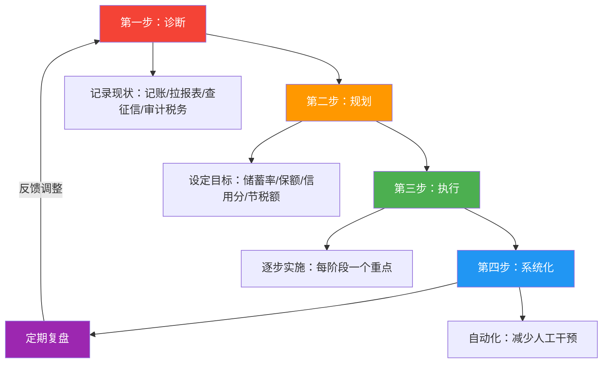
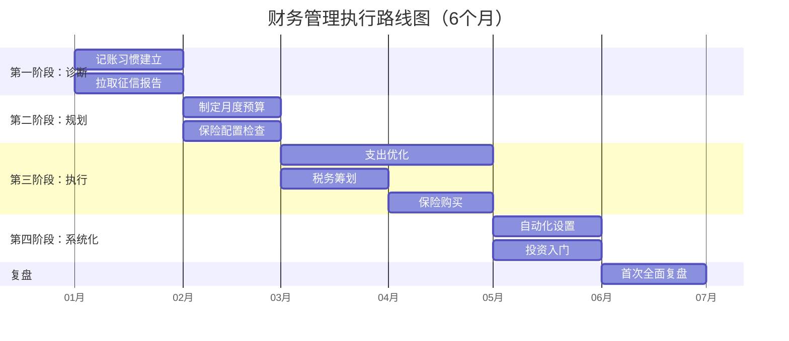

## 案例总结

七个案例，七种人生境况，却指向同一套底层逻辑。本节不是对前七个案例的简单复述，而是从它们中提取可迁移的方法论、共性规律和行动框架，帮你在读完所有案例后，形成一套属于自己的财务管理系统。

### 为什么要看总结，而不是直接跳走

单个案例是"点"——你看到了一个人怎么解决一个问题。但当你把七个案例放在一起，你会看到"面"——不同人生阶段、不同收入水平、不同财务困境背后，那些反复出现的决策模式、行为陷阱和成功杠杆。

如果你只看了一个案例就离开，你可能觉得"这跟我情况不一样"。但当你发现七个不同背景的人，都在用"先诊断再行动"的逻辑、都在踩"拖延记账"的坑、都在"自动化系统"上受益——你会意识到，这些不是个案故事，而是**财务管理的通用操作系统**。

### 七个案例的全景对照

| 案例 | 主角画像 | 核心困境 | 关键行动 | 最终成果 | 耗时 |
|------|---------|---------|---------|---------|------|
| 案例一：月光族逆袭 | 26岁，月入1.2万，存款0 | 不知道钱去哪了 | 记账→预算→优化→自动化 | 6个月存2.4万，储蓄率21% | 6个月 |
| 案例二：家庭财务规划 | 32岁双职工，月入3.5万 | 资产配置失衡，无保险 | 制作报表→重构配置→建立保险体系 | 资产合理分布，保障全覆盖 | 3-6个月 |
| 案例三：税务筹划 | 32岁工程师，家庭年入70万 | 税负过重，不了解优惠政策 | 全面诊断→逐项优化→结构重组 | 年省税1.8万+ | 1-2个月 |
| 案例四：保险理赔 | 34岁产品经理，确诊甲状腺癌 | 重大疾病冲击 | 提前配置重疾+医疗险 | 获赔87万，经济无压力 | 提前2年规划 |
| 案例五：信用修复 | 30岁，3笔逾期记录 | 征信不良，房贷被拒 | 还清→养信→定期监测 | 3年后信用恢复正常 | 3年 |
| 案例六：投资理财成长 | 普通上班族 | 只存银行，资产不增值 | 货币基金→指数基金→组合投资 | 建立完整投资体系 | 1-2年 |
| 案例七：家庭危机化解 | 有家庭，突发失业 | 现金流断裂 | 应急金+保险+支出调整 | 无借债渡过3个月空白期 | 即时响应 |

从这张表里可以读出两个关键信息：

**第一，财务管理的投入产出比极高。** 案例三的税务筹划花1-2个月就能年省1.8万；案例一的记账习惯用6个月建立，但影响终身；案例四的保险配置每年几千元保费，关键时刻赔付87万。这些回报率远超任何理财产品。

**第二，越早开始，代价越小。** 案例五的信用修复花了3年，但如果当初按时还款，成本为零。案例四的保险如果确诊后再买，已经来不及。案例一如果25岁就开始记账，到30岁可能已经有20万存款。时间是财务管理中最昂贵的变量——每一天的拖延都有隐性成本。

### 七个案例揭示的五条底层规律

把七个案例拆开再拼在一起，你会发现以下规律反复出现，无论收入高低、年龄大小、处境如何：

#### 规律一：所有改变都始于"看见"

案例一的小李不知道钱去哪了，直到记账一个月才发现每月7000元的"隐形消费"。案例二的张先生不知道资产配比失衡，直到制作资产负债表才发现房产占比超过80%。案例三的张明不知道自己多交了税，直到逐项审计才发现每年多缴1.8万。

**"不知道"是最大的财务风险。** 你以为自己"大概知道"，但数据会告诉你，你的"大概"通常偏差30%-50%。这不是感觉问题，是认知盲区——行为心理学中的"确认偏差"让我们只记得那些符合自我认知的消费（"我很节省"），而忽略那些不符合的（奶茶、凑单、冲动购物）。

**可执行的行动**：不管你现在处于什么阶段，第一步永远是"诊断"。花一个周末，拉出过去三个月的银行流水和信用卡账单，按类别汇总。你不需要精确到分，但你需要一个"数量级"的认知——你的钱，大头去了哪里。

#### 规律二：系统比意志力可靠一万倍

案例一的小李靠意志力省钱，第一周就放弃了。后来靠自动化系统（工资到账自动转出储蓄、信用卡自动还款），储蓄变成了"默认行为"。案例二的家庭靠"记住每个月该做什么"来理财，结果总是漏项，后来建立了月度财务例会制度，每项任务都有固定时间点。

**意志力是有限资源，系统是无限执行。** 这不是偷懒，是聪明。行为经济学家理查德·塞勒在《助推》中提出的"默认选项"理论表明：当储蓄成为默认行为（自动转账），而非需要主动决策的行为（"这个月我要存多少钱"），执行率提升3-5倍。

**可执行的行动**：建立至少三个自动化——（1）工资到账当天自动转出储蓄部分；（2）信用卡绑定储蓄卡自动全额还款；（3）定投计划自动执行。这三件事设置好，你80%的财务管理工作就完成了。

#### 规律三：预防的成本永远低于修复

案例四的张明每年花几千元保费，确诊时获赔87万。如果他没有提前配置保险，同样的疾病可能让家庭负债数十万。案例五的张明因为几次疏忽导致征信不良，花了3年修复。如果当初设置了自动还款提醒，这些逾期根本不会发生。

**"没事"不代表"不需要"。** 这是所有财务规划中最反直觉的一点——你为保险花的钱，在"什么都没发生"的年份看起来像浪费，但它真正的价值就是"什么都没发生"。应急储备金存在银行里，看起来像"闲钱"，但它的存在让你在失业时不用借高利贷。

**可执行的行动**：检查你的"财务安全网"是否有三个层次——（1）应急储备金：3-6个月基本生活支出的现金；（2）基础保险：医疗险+意外险（最低配置），加上重疾险+定期寿险（推荐配置）；（3）信用维护：所有贷款和信用卡设置自动还款。这三层做好，你就有了抵御绝大多数财务风险的能力。

#### 规律四：合法的优化空间比你以为的大得多

案例三的张明家庭年入70万，通过税务筹划年省1.8万。这不需要任何灰色操作，仅仅是充分利用了国家公开的税收优惠政策——专项附加扣除、年终奖计税方式选择、个人养老金账户。但他之前不知道，白白多交了几年的税。

**大多数人不是赚得少，而是"漏"得多。** 这个"漏"体现在：（1）不知道有哪些税收优惠政策（专项附加扣除漏报率极高）；（2）不知道保险的杠杆作用（用几千元保费撬动几十万保障）；（3）不知道信用的价值（良好的征信能帮你拿到更低的贷款利率）；（4）不知道投资的基本逻辑（3%通胀下，只存银行等于每年亏3%）。

**可执行的行动**：做一次"财务体检"——逐项检查你的税务（专项附加扣除是否全部填报）、保险（是否有基础保障）、信用（征信报告是否有异常）、投资（资产是否只存银行）。每一项"不知道"的背后，可能都是每年数千甚至上万元的损失。

#### 规律五：不同人生阶段，财务管理的重心完全不同

| 人生阶段 | 年龄区间 | 核心任务 | 最高优先级 | 常见错误 |
|---------|---------|---------|-----------|---------|
| 起步期 | 22-28岁 | 建立习惯，积累第一桶金 | 记账+应急金 | 觉得"钱少不用管" |
| 积累期 | 28-35岁 | 优化配置，扩大收入 | 保险+投资 | 收入涨了消费也跟着涨 |
| 成长期 | 35-45岁 | 资产配置，子女教育 | 教育基金+养老规划 | 过度集中房产 |
| 成熟期 | 45-55岁 | 风险控制，稳健增值 | 降低风险敞口 | 还在激进投资 |
| 收获期 | 55岁+ | 财富传承，现金流管理 | 养老现金流 | 没有提前规划传承 |

案例一的小李处于起步期，核心任务是"建立习惯"——记账、预算、还债。案例二的家庭处于积累期，核心任务是"优化配置"——保险、投资、教育基金。案例四的张明如果到了55岁才发现没有保险，已经来不及了。

**可执行的行动**：根据你当前的人生阶段，确定最高优先级的1-2件事，集中精力做好。不要试图同时解决所有问题——财务管理是一场马拉松，不是百米冲刺。

### 从七个案例中提炼的可复用方法论

七个案例虽然场景各异，但解决问题的框架是通用的。以下是经过验证的四步法：



#### 第一步：诊断——用数据取代感觉

每个案例的起点都是"诊断"。不是凭感觉判断"我应该没什么问题"，而是用真实数据说话。

**诊断清单**（花一个周末完成）：

```markdown
# 我的财务诊断清单

## 1. 收支诊断（案例一方法）
- [ ] 拉出最近3个月的银行流水和信用卡账单
- [ ] 按类别汇总支出（餐饮/交通/娱乐/购物/其他）
- [ ] 计算各项支出占收入的比例
- [ ] 对比合理区间，标记超标项

## 2. 资产负债诊断（案例二方法）
- [ ] 列出所有资产：银行存款+理财+房产+车辆+其他
- [ ] 列出所有负债：房贷+车贷+信用卡欠款+其他
- [ ] 计算净资产 = 资产 - 负债
- [ ] 计算各资产类别的占比，检查是否过度集中

## 3. 税务诊断（案例三方法）
- [ ] 检查个人所得税APP中的专项附加扣除是否全部填报
- [ ] 确认年终奖计税方式（单独计税 vs 合并计税，哪个更优）
- [ ] 是否开通个人养老金账户（年省税最高5400元）
- [ ] 是否有其他可扣除项（商业健康险、公益捐赠等）

## 4. 保险诊断（案例四方法）
- [ ] 是否有医疗险（百万医疗或中端医疗）
- [ ] 是否有意外险
- [ ] 家庭经济支柱是否有重疾险和定期寿险
- [ ] 保额是否充足（重疾险保额 = 年收入×3-5倍）

## 5. 信用诊断（案例五方法）
- [ ] 最近一次查询征信报告是什么时候
- [ ] 是否有逾期记录
- [ ] 信用卡数量是否超过3张
- [ ] 所有贷款和信用卡是否设置了自动还款
```

#### 第二步：规划——设定具体可量化的目标

诊断完成后，你需要设定目标。目标必须满足三个条件：具体、可量化、有时间线。

**反面例子**："我要多存点钱"——这不是目标，是愿望。

**正面例子**："6个月内将储蓄率从0%提升到20%，每月自动转出2400元到储蓄账户"——这是可执行的目标。

不同案例的目标设定参考：

| 维度 | 初始状态 | 6个月目标 | 1年目标 | 3年目标 |
|------|---------|---------|---------|---------|
| 储蓄率 | 0%（案例一） | 15% | 20% | 30%+ |
| 应急储备金 | 0（案例一、二） | 1个月支出 | 3个月支出 | 6个月支出 |
| 年省税额 | 0（案例三） | — | 5,000-18,000元 | 持续优化 |
| 保险覆盖 | 无（案例二、四） | 医疗+意外 | 加配重疾+寿险 | 定期检视保额 |
| 信用评分 | 极低（案例五） | 停止新增逾期 | 逐步恢复 | 完全正常 |

#### 第三步：执行——每阶段只做一件事

七个案例中，成功的人有一个共同点：**不贪多，每次只聚焦一个重点**。

案例一的小李第一个月只做一件事——记账。第二个月加上预算。第三个月加上优化。如果他第一个月就同时要求自己记账+做预算+省钱+学投资，大概率全部放弃。

**执行节奏建议**：



#### 第四步：系统化——让好习惯变成默认行为

系统化是所有案例中最关键的一步，也是区分"坚持下来"和"半途而废"的分水岭。

**系统化的核心原则**：减少需要"做决定"的次数。每一次做决定都消耗意志力，而意志力是有限的。好的财务系统应该让你在"不思考"的状态下，自动做出正确的财务决策。

**系统化清单**：

```markdown
# 我的自动化财务系统

## 已设置 ✅ / 未设置 ❌

### 收入端
- [ ] 工资到账自动分账：储蓄账户 vs 日常消费账户

### 支出端
- [ ] 信用卡绑定储蓄卡自动全额还款
- [ ] 房租/房贷自动扣款
- [ ] 保险保费自动扣款

### 投资端
- [ ] 指数基金定投计划（每月固定日期自动买入）
- [ ] 货币基金自动转入（日常账户余额超阈值时）

### 监控端
- [ ] 记账App自动导入银行账单
- [ ] 每月1号查看上月支出报表
- [ ] 每季度做一次财务健康检查
- [ ] 每年做一次全面财务复盘

### 信用端
- [ ] 所有信用卡设置还款日提醒
- [ ] 每年查询一次征信报告
```

### 七个案例中的典型"踩坑"与应对

把七个案例中所有出现过的错误和陷阱汇总，你会发现它们可以归为五类：

#### 坑一：认知类——"我以为我知道"

| 典型表现 | 案例来源 | 真相 | 应对 |
|---------|---------|------|------|
| "我挺节省的" | 案例一 | 实际每月隐形消费7000元 | 用数据说话，不凭感觉 |
| "房产是最好的投资" | 案例二 | 资产过度集中房产，流动性极差 | 资产配置多元化 |
| "买保险是浪费钱" | 案例四 | 一场大病可能倾家荡产 | 理解保险的杠杆原理 |
| "理财是有钱人的事" | 案例六 | 100元也能开始投资 | 小额起步，建立习惯 |

**应对原则**：对任何"我觉得"的财务判断，都追问一句——"数据支持吗？"

#### 坑二：拖延类——"以后再说"

| 典型表现 | 案例来源 | 代价 | 应对 |
|---------|---------|------|------|
| "记账太麻烦，明天开始" | 案例一 | 多月光了几个月 | 先粗后细，降低启动门槛 |
| "保险不急，等等再买" | 案例四 | 年龄越大保费越贵，健康变化可能买不了 | 趁年轻健康尽早配置 |
| "征信没事，不用查" | 案例五 | 发现问题时已经影响了房贷申请 | 每年主动查一次 |

**应对原则**：拖延的每一刻都有隐性成本。把"以后再说"改成"今天做第一步"——哪怕第一步只是下载一个记账App。

#### 坑三：过度类——"越多越好"

| 典型表现 | 案例来源 | 实际后果 | 应对 |
|---------|---------|---------|------|
| 记账分类太细（20+类别） | 案例一 | 坚持不到两周就放弃 | 一级分类控制在7-10个 |
| 保险买太多（重复保障） | 案例四 | 保费浪费，保额重叠 | 先规划再购买，避免重复 |
| 信用卡太多张 | 案例五 | 影响征信，管理混乱 | 2-3张足够 |

**应对原则**：财务管理追求"够用"而非"完美"。一个能坚持的简单系统，胜过一个三天就放弃的完美系统。

#### 坑四：情绪类——"我控制不住"

| 典型表现 | 案例来源 | 心理机制 | 应对 |
|---------|---------|---------|------|
| 发工资后报复性消费 | 案例一 | "限制性反弹效应" | 先转出储蓄，花"剩下的" |
| 压力大时网购 | 案例一 | 情绪性消费 | 建立"不花钱的情绪出口"清单 |
| 看到优惠就想凑单 | 案例一 | "沉没成本"心理 | 只买清单上的东西 |
| 朋友聚餐不好意思省钱 | 案例一 | 社交压力 | 主动提出平价替代方案 |

**应对原则**：情绪性消费靠"系统"而非"意志力"控制。设置自动转账、72小时冷静期、购物清单——让系统替你做正确的决定。

#### 坑五：孤立类——"我自己搞"

| 典型表现 | 案例来源 | 后果 | 应对 |
|---------|---------|------|------|
| 投资只听同事推荐 | 案例二 | 亏损 | 学习基础知识，建立自己的判断框架 |
| 家庭财务一人说了算 | 案例二 | 配偶不配合，执行困难 | 双方共同参与，定期开财务例会 |
| 税务不知道问谁 | 案例三 | 多交了几年的税 | 善用官方渠道（个税APP、12366热线） |

**应对原则**：财务管理可以自己做，但不要闭门造车。利用官方资源、专业工具和可靠的信息渠道。

### 财务健康自评框架

根据七个案例的经验，设计一个五维自评框架。每项1-5分，总分25分。建议每季度做一次，追踪变化趋势。

```markdown
# 我的财务健康评分（第___季度）

## 1. 收支管理能力（满分5分）
评分标准：
- 5分：坚持记账6个月以上，清楚每类支出占比，储蓄率≥30%
- 4分：坚持记账3个月以上，储蓄率20-30%
- 3分：偶尔记账，大概知道支出结构，储蓄率10-20%
- 2分：很少记账，不清楚支出结构，储蓄率0-10%
- 1分：从不记账，储蓄率为0或负数
我的评分：___分

## 2. 风险保障能力（满分5分）
评分标准：
- 5分：有医疗+意外+重疾+寿险，保额充足，有6个月应急储备金
- 4分：有医疗+意外险，有3个月应急储备金
- 3分：仅有社保，有1-2个月应急储备金
- 2分：仅有社保，无应急储备金
- 1分：无任何保障
我的评分：___分

## 3. 信用管理水平（满分5分）
评分标准：
- 5分：征信无异常，合理使用2-3张信用卡，负债率<30%
- 4分：征信无异常，有信用卡但使用规范
- 3分：征信有少量瑕疵，但已开始修复
- 2分：有逾期记录，未处理
- 1分：严重逾期或被列入黑名单
我的评分：___分

## 4. 税务优化程度（满分5分）
评分标准：
- 5分：充分利用所有专项附加扣除，最优年终奖计税，开通个人养老金
- 4分：大部分扣除已填报，年终奖计税方式已优化
- 3分：部分扣除已填报
- 2分：只填报了很少的扣除项
- 1分：完全不了解税务优惠政策
我的评分：___分

## 5. 资产配置能力（满分5分）
评分标准：
- 5分：多元化配置（现金+固收+权益），有明确的投资计划和再平衡机制
- 4分：有基金定投，了解基本的投资逻辑
- 3分：有少量理财产品，但缺乏系统规划
- 2分：只存银行活期/定期
- 1分：没有任何储蓄或投资
我的评分：___分

## 总分：___/25分

### 评分解读
- 21-25分：财务健康，继续保持，关注优化细节
- 16-20分：财务状况良好，有明确的改进空间
- 11-15分：财务亚健康，需要系统性改善
- 6-10分：财务风险较高，建议立即行动
- 5分：财务危机状态，需要紧急干预
```

### 不同人群的行动优先级

七个案例覆盖了多种人群画像。根据你的实际情况，选择最紧迫的1-2项开始：

| 你的现状 | 最高优先级 | 参考案例 | 第一步行动 |
|---------|-----------|---------|-----------|
| 月光，存不下钱 | 记账+预算 | 案例一 | 下载记账App，记录今天的支出 |
| 有存款但没规划 | 制作资产负债表 | 案例二 | 花1小时列出所有资产和负债 |
| 感觉税交多了 | 税务诊断 | 案例三 | 打开个税APP检查专项附加扣除 |
| 没有任何保险 | 基础保险配置 | 案例四 | 买一份百万医疗险（年费200-400元） |
| 征信有问题 | 信用修复 | 案例五 | 拉取征信报告，了解现状 |
| 只存银行不做投资 | 学习投资基础 | 案例六 | 先从货币基金开始 |
| 没有应急储备金 | 建立安全垫 | 案例七 | 设定目标：3个月基本支出 |

### 本案例总结与全章知识的关联

本总结综合了本章六个知识模块的实际应用：

| 总结中涉及的知识 | 对应章节模块 | 核心要点 |
|-----------------|-------------|---------|
| 记账习惯建立 | 理论基础·记账理论 + 核心技巧·记账技巧 | 先粗后细，坚持比精确重要 |
| 财务报表制作 | 理论基础·财务报表理论 + 核心技巧·报表制作 | 资产负债表看家底，现金流量表看流向 |
| 税务优化方法 | 理论基础·税务筹划 + 核心技巧·税务筹划 | 专项附加扣除+年终奖计税+个人养老金 |
| 保险配置逻辑 | 理论基础·保险规划 + 核心技巧·保险配置 | 先社保后商保，先保障后理财 |
| 信用管理策略 | 理论基础·信用管理 + 核心技巧·信用管理 | 按时还款是核心，定期查征信是习惯 |
| 预算管理方法 | 核心技巧·预算管理 | 50/30/20法则入门，零基预算法进阶 |
| 投资组合入门 | 核心技巧·投资组合管理 | 从货币基金到指数基金定投 |
| 自动化系统搭建 | 核心技巧·自动化财务管理 | 自动转账+自动还款+自动定投 |

如果你在阅读本总结时对某个具体领域产生了兴趣，可以跳转到对应的理论或技巧章节深入学习。本总结是"全景地图"，帮你理解各模块如何协同运作；具体的"道路施工细节"（操作步骤、工具选择、模板下载），在对应章节中都有详细展开。

***

> **一句话总结**：财务管理不复杂——诊断让你"看见"，规划让你"有序"，执行让你"改变"，系统让你"坚持"。七个案例，四种人生困境，一套通用解法。从今天开始做第一步，六个月后你会感谢自己。
