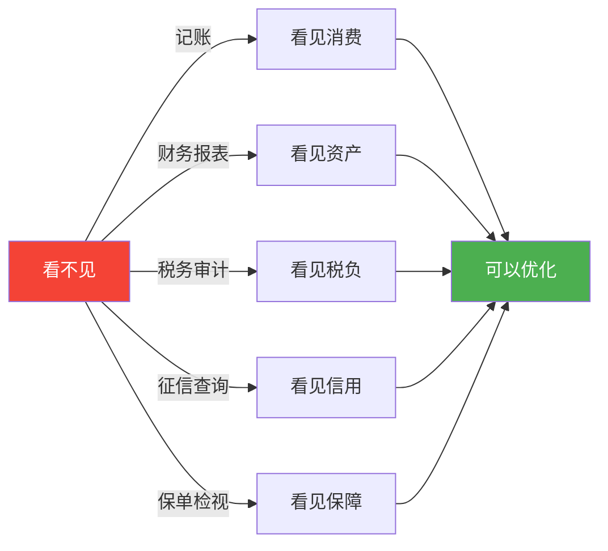
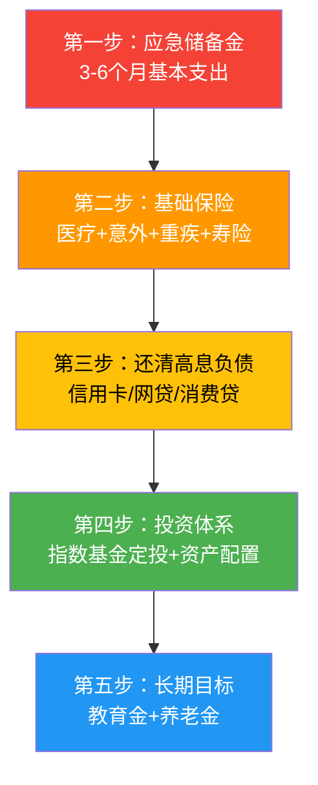
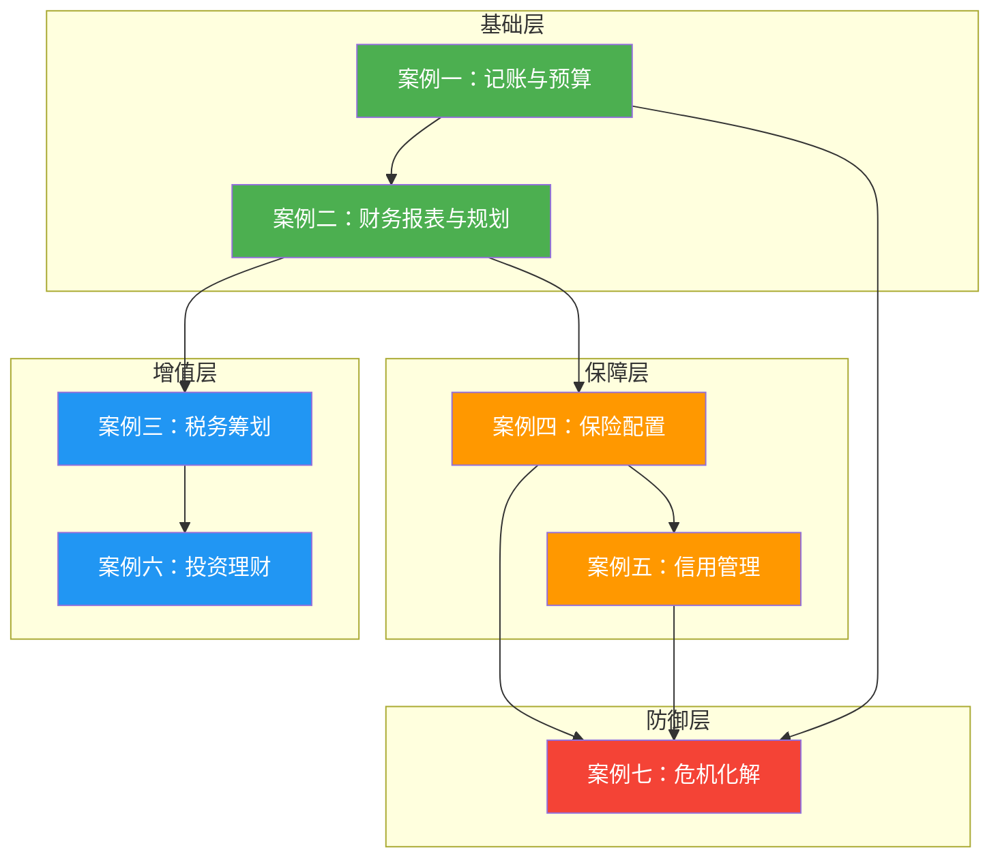

## 案例总结：七大案例的核心启示与行动框架

七个案例已经走完。从月光族的觉醒到家庭财务危机的化解，从税务筹划的精打细算到保险理赔的生死时速，每一个案例都不是"别人的故事"——它们是你可能正在经历、即将经历、或需要提前预防的真实场景。

这一节不是简单地重复每个案例的结论，而是从七个案例中提炼出**共性规律、核心方法论和可复用的行动框架**。如果你时间有限，只看这一节就够了。

### 一、七大案例全景回顾

先用一张表快速回顾每个案例的核心信息：

| 案例 | 主人公 | 初始困境 | 核心方法 | 关键成果 | 覆盖模块 |
|------|--------|----------|----------|----------|----------|
| 案例一：月光族逆袭 | 小李，26岁，月入1.2万 | 存款为零，信用卡欠5千 | 记账→预算→优化→自动化 | 6个月存2.4万，储蓄率21% | 记账、预算、自动化 |
| 案例二：家庭财务规划 | 张先生家庭，月入3.5万 | 无保险、无投资、无应急金 | 财务体检→优先级排序→分步执行 | 12个月应急金翻倍、投资体系建立 | 报表、保险、投资、税务 |
| 案例三：税务筹划 | 张明家庭，年入70万 | 年纳税约8万，多项扣除未申报 | 诊断→逐项优化→身份转化 | 年节税约2.8万，降幅41.7% | 税务筹划 |
| 案例四：保险理赔 | 张明，34岁，确诊甲状腺癌 | 仅有社保，无商业保险 | 提前配置→确诊即赔→高效理赔 | 获赔约60.67万，覆盖全部损失 | 保险规划 |
| 案例五：信用修复 | 张明，30岁，3笔逾期 | 房贷申请被拒 | 异议申诉+良好记录覆盖+等待 | 18个月后房贷审批通过 | 信用管理 |
| 案例六：投资理财成长 | 上班族，投资小白 | 只存银行，不懂投资 | 货币基金→指数基金→资产配置 | 建立完整投资组合 | 投资管理 |
| 案例七：家庭财务危机化解 | 突发失业家庭 | 现金流断裂，收入归零 | 应急储备+保险保障+支出调整 | 无借债渡过3个月空白期 | 应急管理 |

### 二、贯穿七个案例的五条核心规律

这七个案例虽然场景各异，但背后有五条反复出现的规律。理解这些规律，比记住任何一个案例的具体数字都更有价值。

#### 规律一：财务管理的起点永远是"看见"

小李不知道钱去了哪里，张先生不知道自己的资产结构，张明不知道自己多交了多少税，另一位张明不知道自己的征信有多糟糕。**几乎所有财务问题的根源都是"看不见"**——看不见消费结构、看不见资产全貌、看不见税务漏洞、看不见信用风险。

记账是最基础的"看见"工具，但它不是唯一的。资产负债表让你看见资产配置，征信报告让你看见信用状况，保单检视让你看见保障缺口。**"看见"是一切改变的前提**——你无法改善你看不见的东西。



**行动要点**：如果你还没有做过以下任何一项，今天就开始：

- 下载记账App，记录7天的每一笔支出
- 登录征信中心（www.pbccrc.org.cn），拉一份个人信用报告
- 打开个税APP，检查专项附加扣除是否全部填报
- 整理所有保单，列出险种、保额、保费、到期日

#### 规律二：顺序比速度更重要

案例二中张先生家庭的案例最能说明这一点。他们的月收入3.5万不低，但"眉毛胡子一把抓"——既没有应急储备金，也没有商业保险，同时还在盲目炒股。正确的顺序是：

**应急储备金 → 保险配置 → 偿还高息负债 → 投资体系建设 → 长期目标（教育金/养老金）**

为什么是这个顺序？逻辑链如下：

1. **没有应急金**：突发情况只能借高利贷（信用卡分期年化15%+），所有投资收益都抵不过利息
2. **没有保险**：一场大病可能清零全部积蓄，投资的钱白赚了
3. **高息负债没还清**：投资年化8%，信用卡利息18%，越投资越亏
4. **前三项都解决了**：投资的钱才是"闲钱"，亏了不影响生活



**一个检验方法**：问自己"如果明天突然失业，我能撑多久？"如果答案是"不知道"或"不到3个月"，你的第一步就应该是攒应急金，而不是学投资。

#### 规律三：自动化是对抗人性的最优解

案例一中小李搭建的自动转账系统，案例二中张先生设置的定投自动扣款，案例五中张明设置的信用卡自动还款——每一个成功改善财务状况的人，最终都走向了自动化。

这不是巧合。行为经济学反复证明：**人的意志力是有限资源**。靠意志力省钱、靠意志力投资、靠意志力按时还款，短期可以，长期一定失败。正确的做法是把好的决策变成"默认行为"——工资到账自动分流、基金定投自动扣款、信用卡自动还款。

| 需要自动化的行为 | 自动化方式 | 节省的心理成本 |
|-----------------|-----------|--------------|
| 储蓄 | 工资到账日自动转出固定金额到储蓄账户 | 消除"要不要存"的纠结 |
| 投资 | 设置基金定投自动扣款 | 消除"要不要投"的择时焦虑 |
| 还款 | 信用卡绑定储蓄卡自动全额还款 | 彻底杜绝逾期 |
| 记账 | 银行账单自动导入记账App | 降低记账的执行成本 |
| 监控 | 每月1号自动生成财务报表 | 用数据而非感觉做决策 |

**核心原则**：一次性做好决策，然后让系统替你执行。你不需要每天都在"要不要存钱"上消耗意志力——系统已经帮你存了。

#### 规律四：最大的成本是"不知道"

七个案例中，最昂贵的不是花出去的钱，而是**因为不知道而损失的钱**：

| 案例 | "不知道"的代价 | 如果早知道 |
|------|---------------|-----------|
| 案例一：小李 | 3年月光，存款为零 | 早记账3年，可能已攒下10万+ |
| 案例二：张先生 | 应急金不足，投资混乱 | 早规划1年，投资收益多出数千元 |
| 案例三：张明 | 每年多交2.8万税 | 早优化1年，多省2.8万 |
| 案例四：张明（保险） | 保额偏低（50万 vs 理想125万） | 早多配75万保额，年增保费约3000元 |
| 案例五：张明（信用） | 房贷被拒，差点错过购房时机 | 早查征信1年，提前修复 |
| 案例六 | 资金闲置在银行活期，跑不赢通胀 | 早投资3年，复利效应显著 |
| 案例七 | 没有应急金，差点借高利贷 | 早攒6个月应急金，从容应对 |

**信息不对称是财务管理中最大的敌人**。很多人不是没有钱，而是不知道自己的钱该怎么管。本章的理论基础和核心技巧，本质上就是在消除这种信息不对称。

#### 规律五：财务规划是动态过程，不是一次性事件

案例二中的季度复盘清单、案例四中理赔后的保单调整、案例五中的定期征信监控——每一个案例都在强调同一件事：**财务管理不是"做完就完了"**。

人生阶段在变（单身→结婚→生子→退休），收入在变（涨薪→降薪→失业→副业），市场在变（牛市→熊市→震荡），政策在变（税法调整→利率变化→保险新规）。去年的最优方案，今年可能已经不是最优解。

| 复盘维度 | 建议频率 | 具体动作 |
|---------|---------|---------|
| 记账与预算 | 每月 | 对比实际支出vs预算，偏差>10%需要调整 |
| 财务报表 | 每季度 | 更新资产负债表，计算核心指标 |
| 保险配置 | 每年 | 检查保额是否充足，是否需要加保 |
| 征信报告 | 每半年 | 查询征信，检查是否有异常记录 |
| 税务筹划 | 每年12月 | 确认下一年度专项附加扣除信息 |
| 投资组合 | 每半年 | 检查是否需要再平衡（偏离>5%） |
| 全面财务体检 | 每年 | 五维评估：偿债、储蓄、投资、保障、退休 |

### 三、七大案例的方法论提炼

#### 案例一的核心方法：四步脱离月光

小李的方法论可以概括为四个字：**看、规、砍、固**。

1. **看**（记账）：老老实实记录一个月的支出，不做任何改变，只是"看见"
2. **规**（预算）：用50/30/20法则建立预算框架，工资到账先转出储蓄
3. **砍**（优化）：找到最大的消费黑洞（奶茶、凑单、冲动购物），精准削减
4. **固**（自动化）：自动转账、自动还款、72小时冷静期，让系统替你做正确决定

**适用条件**：月光族、消费无节制、不知道钱去了哪里的人

**关键数据**：6个月，储蓄率从0%提升到21%

#### 案例二的核心方法：五步家庭财务规划

张先生家庭的方法论是一套完整的规划流程：

1. **体检**：制作资产负债表+现金流量表，计算6大核心指标
2. **排序**：识别所有需求，按紧迫性和重要性排序（应急→保险→还债→投资→长期目标）
3. **配置**：逐项制定方案（保险方案、储蓄方案、投资方案、税务方案）
4. **执行**：落地为可执行的月度预算，设定年度里程碑
5. **监控**：每季度复盘，根据变化动态调整

**适用条件**：有家庭、有负债、需要系统规划的中产家庭

**关键数据**：12个月，应急金从5万增至10万，投资资产从5万增至12万

#### 案例三的核心方法：三层税务优化

张明家庭的税务优化分三个层次：

1. **第一层：用足已有政策**（零成本、零风险）
   - 填报所有专项附加扣除
   - 确认年终奖最优计税方式
   - 提高公积金缴纳比例
   - 开通个人养老金账户

2. **第二层：优化收入结构**（需要一定操作成本）
   - 配偶从劳务报酬转为经营所得（注册个体户）
   - 合理分配夫妻间的扣除项目

3. **第三层：长期递延策略**（需要前瞻性规划）
   - 养老金递延纳税（当前25%→退休后3%）
   - 跨年度收入调节

**适用条件**：有多项收入来源、未充分利用税收优惠政策的家庭

**关键数据**：年节税约2.8万，降幅41.7%

#### 案例四的核心方法：保险配置与理赔三原则

张明（保险案例）的经历提炼出三个原则：

1. **配置原则：保额比险种数量重要**
   - 宁可少买几个险种，也要把保额做足
   - 重疾险保额 = 治疗费用 + 康复费用 + 3-5年误工损失
   - 定期寿险保额 = 房贷余额 + 子女抚养 + 赡养费用 - 配偶可覆盖部分

2. **理赔原则：材料完整、报案及时**
   - 确诊后第一时间报案（10天内）
   - 整理完整理赔材料（病理报告、费用清单、诊断证明）
   - 就诊时告知医生有商业保险（注意病历措辞）

3. **调整原则：出险后重新评估保障缺口**
   - 重疾险赔付后合同终止，需要重新投保
   - 家庭经济支柱变化后，配偶保额需要提升

**适用条件**：没有保险、保险不足、或即将面临保险需求的家庭

**关键数据**：年保费1.5万（占收入4.8%），获赔60.67万

#### 案例五的核心方法：信用修复三管齐下

张明（信用案例）的修复策略可以概括为一个公式：

```text
信用修复效果 = 异议撤销（能改的改） + 良好记录覆盖（能做的做） + 时间消解（等得起的等）
```

三个变量的优先级：**异议撤销 > 良好记录覆盖 > 时间消解**

1. **异议撤销**：信息错误或银行过失导致的逾期，15-20个工作日可解决
2. **良好记录覆盖**：保持信用卡正常使用、按时还款、降低负债率，6-18个月见效
3. **时间消解**：已还清的逾期记录，5年后自动消除

**适用条件**：有征信不良记录、计划申请贷款的人

**关键数据**：18个月修复后房贷审批通过，利率无上浮

#### 案例六的核心方法：投资入门三步走

投资理财的成长路径遵循"先稳后攻"的原则：

1. **入门期**：货币基金（余额宝/零钱通），熟悉"钱生钱"的感觉
2. **成长期**：指数基金定投（沪深300+中证500），建立长期投资纪律
3. **成熟期**：多元资产配置（A股+海外+债券），分散风险

**核心纪律**：定投不择时、半年再平衡、止盈线30%

**适用条件**：有闲钱但不懂投资、风险承受能力中等的上班族

#### 案例七的核心方法：危机应对三板斧

家庭财务危机的化解依赖三个支柱：

1. **应急储备金**：3-6个月基本支出的安全垫，是渡过危机的第一道防线
2. **保险保障**：重疾险、医疗险、意外险、寿险，防止大额支出击穿家庭财务
3. **支出调整**：危机时期立即削减非必要支出，将月支出压缩20-30%

**核心理念**：应急金不是"闲钱"，而是"保险的保险"——它保护你在最脆弱的时候不需要借高利贷、不需要贱卖资产、不需要放弃原则。

**适用条件**：所有人——无论收入高低，都需要应急储备金

### 四、案例之间的关联与知识网络

七个案例并非孤立存在，它们之间有清晰的知识关联：



**案例一→案例二**：记账是财务报表的数据来源，没有记账就无法制作准确的现金流量表

**案例二→案例四**：财务报表揭示保障缺口，保险配置是风险管理的核心手段

**案例二→案例三**：财务规划中税务优化是提升净收入的重要杠杆

**案例三→案例六**：省下的税钱可以投入投资，投资收益又可以享受税收递延

**案例四/五/一→案例七**：保险是危机的第二道防线，信用是危机时的融资通道，应急金是第一道防线

### 五、不同人群的案例阅读优先级

不是每个案例都对你同样重要。根据你当前的财务状况，优先阅读最相关的案例：

| 你的现状 | 优先阅读 | 次要阅读 | 原因 |
|---------|---------|---------|------|
| 月光族，没有存款 | 案例一 | 案例五 | 先解决消费失控问题，同时注意信用维护 |
| 有存款但没有规划 | 案例二 | 案例三 | 需要系统化财务规划，同时检查税务漏洞 |
| 收入高但税负重 | 案例三 | 案例六 | 税务优化是最快见效的增收手段 |
| 没有商业保险 | 案例四 | 案例二 | 保险是财务安全网的底线 |
| 计划买房/贷款 | 案例五 | 案例二 | 信用是贷款审批的关键因素 |
| 有闲钱想投资 | 案例六 | 案例三 | 先建立投资体系，同时用税务优化释放更多资金 |
| 担心突发风险 | 案例七 | 案例四 | 应急金+保险是风险管理的两大支柱 |
| 家庭财务混乱 | 案例二 | 案例一 | 家庭规划需要系统思维，记账是基础 |

### 六、从案例到行动：你的30天启动计划

读完七个案例，最重要的不是"学到了什么"，而是"接下来做什么"。以下是一个30天的启动计划，每个步骤都有明确的时间投入和产出：

| 天数 | 行动 | 时间投入 | 产出 |
|------|------|---------|------|
| 第1天 | 下载记账App，开始记录支出 | 10分钟 | 记账习惯启动 |
| 第2天 | 登录征信中心，查询个人信用报告 | 30分钟 | 了解信用现状 |
| 第3天 | 登录个税APP，检查专项附加扣除 | 20分钟 | 发现可补报的扣除项 |
| 第4-7天 | 坚持记账，不改变任何消费习惯 | 每天5分钟 | 第一周消费数据 |
| 第8天 | 分析第一周支出，找出最大的3个消费黑洞 | 30分钟 | 消费结构认知 |
| 第9天 | 用50/30/20法则制定月度预算 | 40分钟 | 第一份预算方案 |
| 第10天 | 设置工资到账自动转出储蓄 | 15分钟 | "先储蓄后消费"系统 |
| 第11-14天 | 继续记账，对比实际vs预算 | 每天5分钟 | 预算执行数据 |
| 第15天 | 整理所有保单，列出保障清单 | 45分钟 | 保障缺口清单 |
| 第16天 | 制作个人资产负债表 | 60分钟 | 第一张财务X光片 |
| 第17天 | 计算核心财务指标（储蓄率、负债率、流动性比率） | 30分钟 | 财务健康度评分 |
| 第18天 | 设置信用卡自动全额还款 | 10分钟 | 杜绝逾期风险 |
| 第19-21天 | 继续记账+预算执行 | 每天5分钟 | 三周消费数据 |
| 第22天 | 月度支出分析，对比预算 | 40分钟 | 第一次月度复盘 |
| 第23天 | 制定消费优化方案（找到最大的省钱杠杆） | 30分钟 | 优化方案 |
| 第24-28天 | 执行优化方案，继续记账 | 每天5分钟 | 优化效果数据 |
| 第29天 | 学习基金定投入门（本章案例六） | 60分钟 | 投资知识储备 |
| 第30天 | 全面复盘：本月成果、下月计划、长期目标 | 60分钟 | 完整的财务管理系统雏形 |

**30天后的你**：有了记账习惯、有了预算框架、有了第一张资产负债表、有了自动储蓄和自动还款系统、了解了自己的信用状况和税务状况。这不是终点，而是一个扎实的起点。

### 七、案例中的关键数据速查表

以下汇总了七个案例中的关键数字，供快速参考：

| 参考指标 | 数值 | 来源案例 | 说明 |
|---------|------|---------|------|
| 健康储蓄率 | ≥20% | 案例一 | 案例一中小李从0%提升到21% |
| 应急储备金 | 3-6个月基本支出 | 案例二、七 | 案例二目标10万，案例七靠此渡过危机 |
| 房产占总资产比 | ≤60-70% | 案例二 | 案例二中高达90.9%，需要逐步稀释 |
| 保费占家庭年收入 | 5-10% | 案例二、四 | 案例二为6.2%，案例四为4.8% |
| 重疾险保额 | 年收入×3-5倍 | 案例四 | 案例四中50万偏理想想为125万 |
| 定期寿险保额 | 房贷余额+抚养费+赡养费 | 案例二、四 | 基于缺口分析而非拍脑袋 |
| 信用卡使用率 | ≤30% | 案例五 | 超过50%会显著拉低信用评分 |
| 征信硬查询 | 半年内≤3次 | 案例五 | 频繁查询被视为"资金饥渴" |
| 逾期记录消除 | 还清后5年 | 案例五 | 从还清之日起算，不是从逾期日起 |
| 个人养老金年缴上限 | 12,000元 | 案例三 | 边际税率越高，节税效果越显著 |
| 专项附加扣除项 | 7项 | 案例三 | 很多人只报了1-2项，漏报率极高 |

### 八、常见问题解答

**Q：七个案例我应该从哪个开始看？**

A：如果你是零基础，从案例一开始——记账是所有财务管理的起点。如果你已经有记账习惯，根据上表"不同人群的案例阅读优先级"选择最相关的案例。

**Q：案例中的具体产品（如保险产品、基金产品）还值得买吗？**

A：案例中的产品名称仅供参考，说明的是配置思路和选择逻辑。具体购买时，请以最新市场上的产品为准，关注保障范围、费率、条款而非品牌名称。

**Q：案例中的数字（收入、支出、保额）适用于我吗？**

A：案例中的数字是特定场景下的参考值。你需要根据自己的收入水平、家庭结构、所在城市、风险偏好来调整。核心方法论是通用的，具体数字因人而异。

**Q：我应该一次性做完所有优化吗？**

A：不建议。案例一的小李花了6个月，案例二的张先生规划了12个月的执行时间表，案例五的张明修复信用花了18个月。**财务改善是一个渐进过程**，急不得。按照优先级，一次解决一个问题，比同时处理所有问题更有效。

**Q：如果我的收入很低（月入5000以下），这些案例还有参考价值吗？**

A：有，而且更重要。收入越低，容错空间越小，越需要精确管理。案例一的方法论（记账→预算→优化→自动化）完全适用于低收入人群，只是储蓄率目标可以从20%调整为10%甚至5%。先养成习惯，再逐步提升。

### 九、核心启示

从七个案例中，我们可以提炼出以下核心启示：

**第一，财务管理是技能，不是天赋。** 案例中的每一个人都是普通人——小李月薪1.2万，张先生家庭月入3.5万，张明年薪25-45万。他们没有金融背景，没有特殊资源，只是学会了方法并坚持执行。你和他们之间的差距不是"钱"，而是"方法"和"行动"。

**第二，最好的开始时间是现在。** 小李如果早3年开始记账，可能已经攒下10万+。张明如果早1年查征信，不会差点错过购房时机。张明（保险案例）如果晚2年买保险，可能已经因体检异常被拒保。**每晚一天开始，就多付出一天的代价。**

**第三，系统比意志力可靠。** 自动转账、自动还款、定投扣款、72小时冷静期——这些"系统"不需要你每天做正确的决定，它们替你做了。案例中每一个成功的人，最终都把好的决策固化成了系统。

**第四，预防的成本远低于修复。** 设置自动还款（10分钟）的成本 vs 信用逾期后修复（18个月）的成本。买一份百万医疗险（300元/年）的 cost vs 没有保险自费大病（数十万）的 cost。填报专项附加扣除（20分钟）的 cost vs 每年多交数千元税的 cost。**财务管理中最划算的投资，永远是预防。**

**第五，每个人都可以从今天开始改变。** 不需要等到"有钱了再说"，不需要等到"忙完这阵子"，不需要等到"学会所有知识"。打开手机，下载一个记账App，记录今天的午餐费用——这就是改变的开始。

***

> **一句话总结**：七个案例，七种困境，一个共同的底层逻辑——**看见问题→理解原理→掌握方法→建立系统→持续优化**。财务管理不难，难的是开始。现在就开始。
