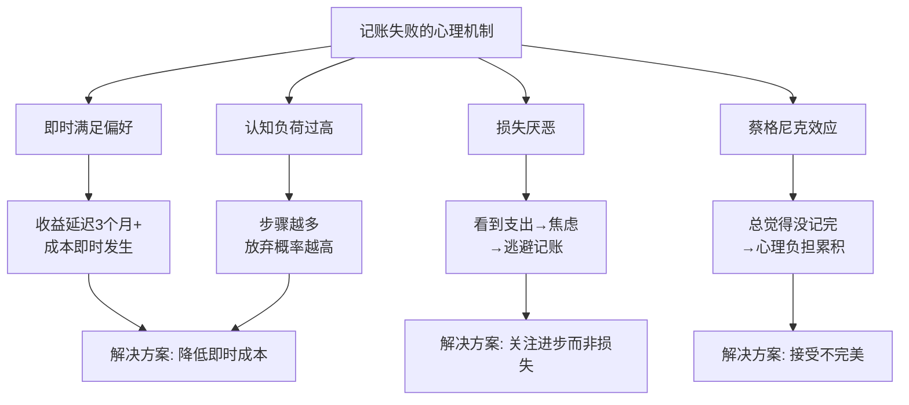
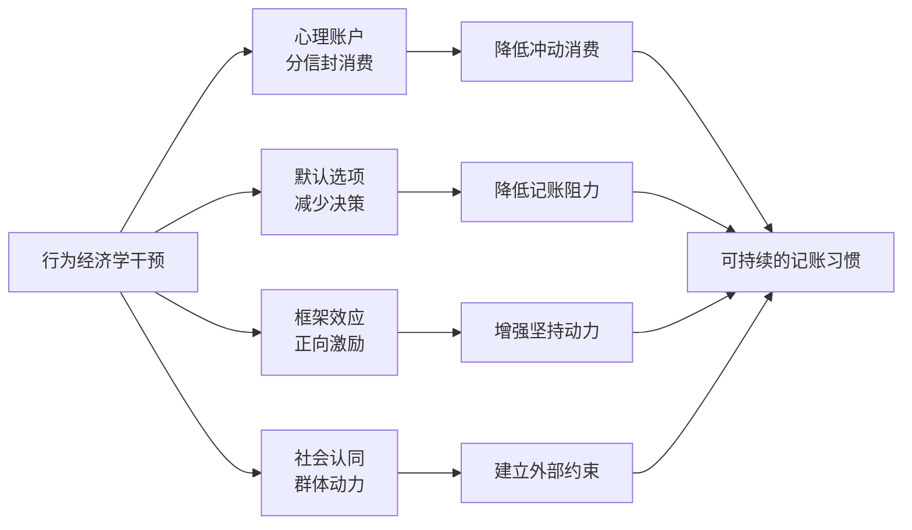
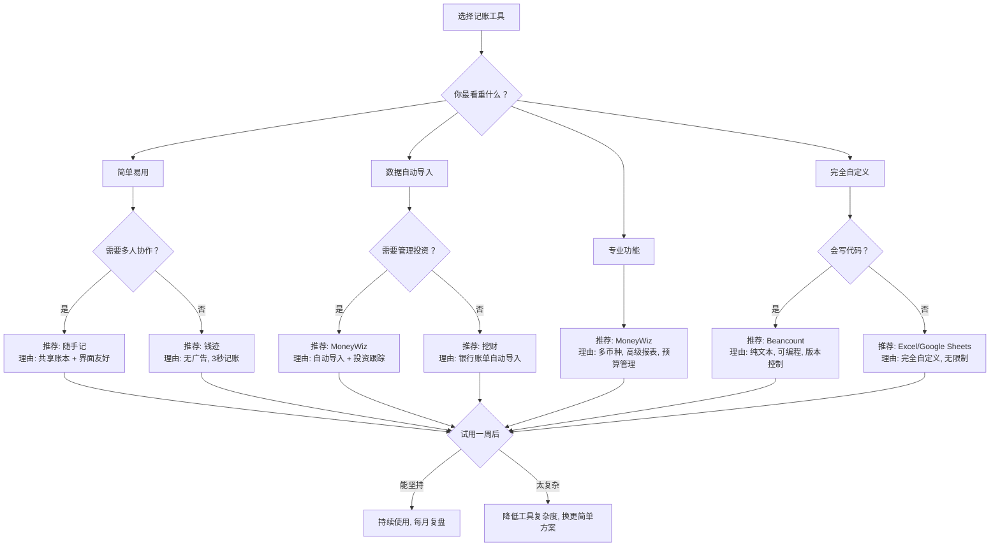
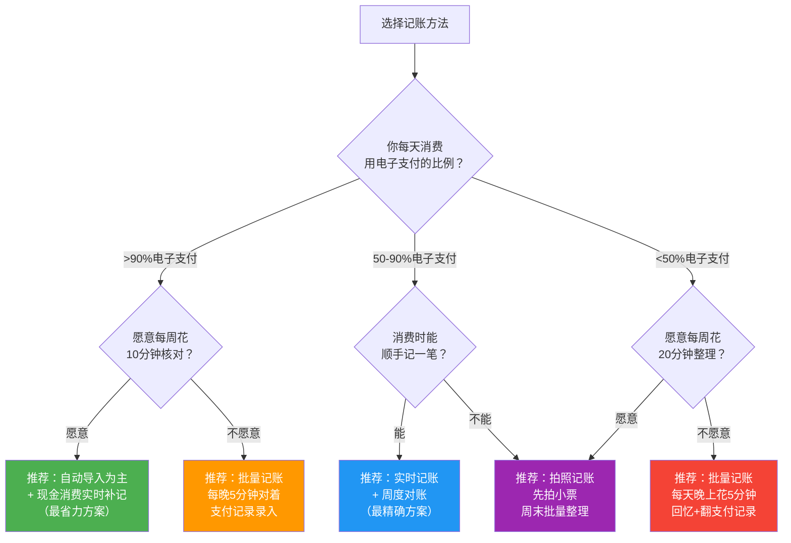
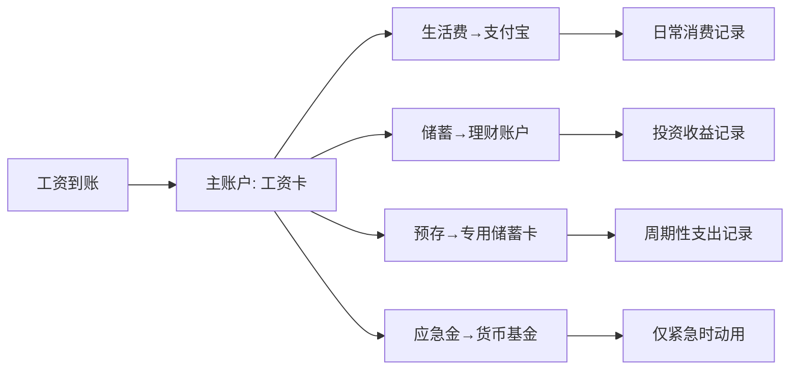
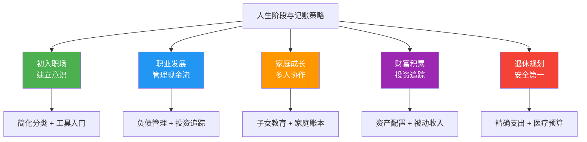
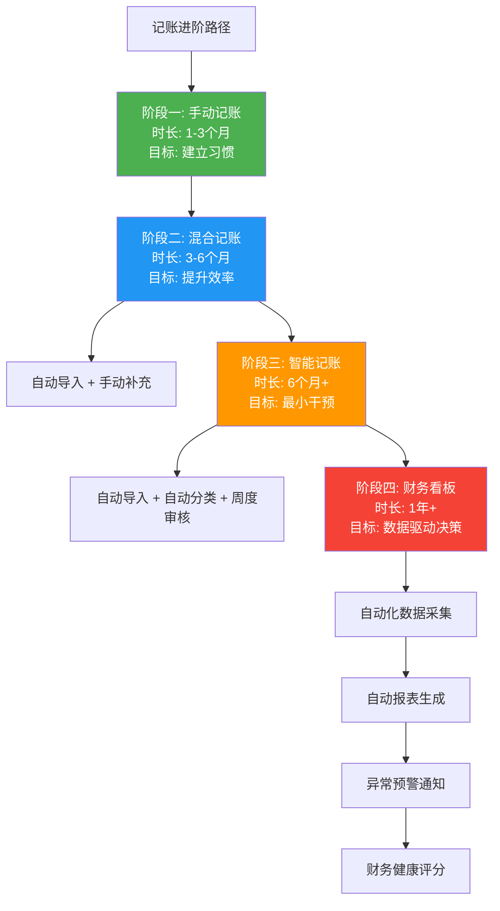

记账是个人财务管理的第一步，也是最基础的一步。但"记账"这两个字劝退了无数人——一提到记账，脑海里浮现的就是每天拿着小本本记流水账、分门别类贴发票、月底对账对到头秃的画面。这其实是对记账最大的误解。

**高效记账的核心不是"记得全"，而是"记得住"——能坚持下去的记账方式，才是最好的方式。** 本节从工具选择、分类体系、记账方法、数据分析到常见误区，手把手教你建立一套可持续运转的记账系统。

### 1.1 为什么记账总是坚持不下来？

在讨论"怎么记"之前，先搞清楚"为什么记不下去"。大量实践案例表明，记账失败的原因集中在以下四点：

| 失败原因 | 表现 | 占比 | 本质 |
|----------|------|------|------|
| 流程太繁琐 | 每笔消费都要记录、选分类、加备注 | 45% | 工具问题 |
| 看不到价值 | 记了三个月不知道记账有什么用 | 30% | 反馈缺失 |
| 追求完美 | 漏记一笔就焦虑，干脆放弃 | 15% | 心理问题 |
| 分类太复杂 | 二级分类超过50个，每次选分类要翻半天 | 10% | 体系问题 |

理解了失败原因，就能有针对性地设计解决方案。本节的每一个技巧都围绕一个核心目标：**降低记账的心理阻力，让你能坚持下去。**

#### 1.1.1 记账失败的心理学机制

要真正解决"坚持不下来"的问题，需要理解背后的心理学机制。行为经济学和习惯心理学的研究揭示了几个关键原理：

**即时满足 vs 延迟回报**：记账的收益（财务洞察、优化支出、达成目标）是延迟的，通常需要3个月以上才能感受到。但记账的成本（时间、注意力、认知负担）是即时的。人类大脑天然偏好即时满足，这就是为什么"今天太累了明天再记"如此有诱惑力——明天的你会面对同样的心理冲突。

**认知负荷理论**：心理学家 George Miller 的研究表明，人的工作记忆一次只能处理 7±2 个信息块。当记账流程涉及"打开App→输入金额→选一级分类→选二级分类→选支付方式→加备注→拍照"等步骤时，每增加一个步骤，放弃概率就增加约15%。这就是为什么"3秒记账"的工具能显著提高坚持率。

**损失厌恶的双刃剑**：记账让你"看到"钱花出去了，这会触发损失厌恶心理。短期内这能抑制冲动消费，但长期来看，如果每次记账都伴随"又花了这么多"的焦虑，就会产生负面条件反射——把记账和不愉快的体验绑定，最终逃避记账。

**蔡格尼克效应**（Zeigarnik Effect）：未完成的任务会持续占据心理资源。如果你的记账系统设计得让你总觉得"还有没记的"，这种未完成感会持续消耗注意力，最终导致倦怠。



**关键洞察**：理解这些心理机制后，你就能设计出"顺应人性"而非"对抗人性"的记账系统。好的记账系统应该像刷牙一样——简单到不需要意志力就能完成。

#### 1.1.2 行为经济学在记账中的应用

理解心理机制是第一步，将行为经济学原理应用到记账系统设计中才是真正的进阶。以下是四个经过验证的行为干预策略：

**策略一：心理账户效应（Mental Accounting）**

诺贝尔经济学奖得主 Richard Thaler 的研究表明，人们会把钱分到不同的"心理账户"中——同样是100元，"工资收入"和"年终奖"的消费倾向完全不同。善用这个效应，你可以在记账中设置"消费信封"：

```text
实操方法：
1. 每月工资到账后，按预算分配到不同"信封"
   - 生活必需（50%）：房租、餐饮、交通
   - 生活品质（20%）：娱乐、社交、日用
   - 自我投资（15%）：学习、健康
   - 自由支配（15%）：没有任何用途限制

2. 记账时标注消费来自哪个信封
3. 当某个信封余额不足时，该类消费自动"暂停"
```

心理账户的核心价值是：当你知道"娱乐信封"只剩200元时，你会更慎重地选择娱乐方式——而不是"反正卡里还有钱"。

**策略二：默认选项效应（Default Effect）**

行为经济学发现，人们倾向于接受默认选项。应用到记账中：设置好默认分类、默认支付方式、默认记账时间，让"正确的记账行为"成为最容易的选择。

```text
默认设置清单：
- 默认分类：设为"餐饮"（最高频消费）
- 默认支付方式：设为你最常用的支付方式
- 默认记账提醒时间：设为你每天最空闲的时间
- 默认报表周期：设为"月度"（最常见的分析周期）
```

**策略三：损失框架效应（Framing Effect）**

同样一笔支出，"今天花了200元"和"今天比预算少花了50元"给人的感受完全不同。善用框架效应：

- 月度报表不要只显示"总支出"，同时显示"比上月节省了多少"
- 设置"挑战目标"（如"本周餐饮<350元"），让记账变成游戏
- 用"累计节省金额"替代"累计支出金额"作为首页展示指标

**策略四：社会认同效应（Social Proof）**

人类行为受群体影响极大。利用这个效应坚持记账：

- 加入记账社群（豆瓣记账小组、小红书记账话题）
- 和朋友组队记账，每周互相比拼储蓄率
- 分享记账成果（匿名化的月度报告）获取正反馈



#### 1.1.3 消费中的认知偏差清单

除了记账本身的阻力，消费决策中的认知偏差也是"钱不知道花到哪里去了"的重要原因。识别这些偏差，是用记账数据优化消费的前提。

| 认知偏差 | 定义 | 消费中的表现 | 记账如何识别 |
|----------|------|-------------|-------------|
| 锚定效应 | 第一个看到的数字会影响后续判断 | "原价999，现在只要399"感觉很划算 | 追踪"折扣消费"占比，发现被"打折"诱导的消费 |
| 禀赋效应 | 拥有某物后会高估其价值 | 不舍得退掉不合适的东西 | 追踪退货率，发现自己"买了但后悔"的模式 |
| 从众效应 | 看到别人买就想买 | 朋友都买了，我也要买 | 用@社交标签追踪"社交驱动"的消费占比 |
| 沉没成本 | 已经花的钱影响后续决策 | 电影票买了，烂片也要看完 | 识别"为了不浪费而继续花钱"的模式 |
| 心理账户 | 不同来源的钱有不同的消费倾向 | 年终奖比工资更容易花掉 | 对比"工资消费"和"奖金消费"的结构差异 |
| 边际效用递减 | 同一事物的满足感随数量增加而降低 | 第一杯奶茶很满足，第三杯已经没什么感觉 | 追踪同一消费的频率，发现"过度消费" |
| 现时偏差 | 高估当下的价值，低估未来的价值 | "先享受再说"，不愿为未来储蓄 | 对比即时消费和延迟满足类消费的比例 |
| 损失厌恶 | 损失的痛苦是同等收益快乐的2倍 | 害怕"错过优惠"而囤货 | 追踪"囤货消费"的实际使用率 |

**实操方法：用记账数据诊断你的消费偏差**

```text
步骤1: 记账3个月后，导出所有数据
步骤2: 给每笔消费打标签（@需要/@想要/@冲动/@社交）
步骤3: 统计各标签占比
       - @冲动 > 15%：存在冲动消费问题
       - @社交 > 20%：社交压力消费过多
       - @想要 > 30%：延迟满足能力需要提升
步骤4: 针对性制定优化策略
       - 冲动消费：设置24小时冷静期
       - 社交消费：学会说"不"
       - "想要"消费：建立"愿望清单"，30天后还想买再买
```

### 1.2 选择适合自己的记账工具

工具是记账的载体。选对工具，记账效率提升10倍；选错工具，三天就放弃。

#### 1.2.1 工具选择矩阵

根据你的核心需求，选择对应的工具：

| 需求场景 | 推荐工具 | 核心优势 | 适合人群 | 学习成本 |
|----------|----------|----------|----------|----------|
| 新手入门 | 随手记 | 界面直观，功能全面，社区活跃 | 第一次记账的人 | 低 |
| 极简记账 | 钱迹 | 无广告，3秒完成一笔记录，纯本地存储 | 讨厌复杂操作的人 | 极低 |
| 自动导入 | 挖财 | 支持银行账单、支付宝/微信账单自动导入 | 不想手动记录的人 | 中 |
| 专业管理 | MoneyWiz | 多币种支持，投资跟踪，高级报表 | 有投资和跨境需求的人 | 高 |
| 家庭记账 | 随手记 | 支持多人共享账本，家庭成员协同 | 已婚或需要家庭记账的人 | 低 |
| 数据控 | Excel/Google Sheets | 完全自定义，无功能限制，可建复杂模型 | 喜欢折腾、追求精确控制的人 | 中高 |
| 技术型 | Beancount (命令行) | 纯文本记账，版本控制，可编程分析 | 程序员和极客 | 高 |

#### 1.2.2 记账工具选择决策流程



#### 1.2.3 工具选择的四大原则

**原则一：能坚持使用的才是最好的。** 功能再强大，用不起来等于零。很多人花了几个小时研究哪个App最好，下载了五六个对比，最后哪个都没坚持下来。正确做法是：选一个，用一周，能坚持就继续，不能坚持就换更简单的。

**原则二：够用就好，不要追求功能全面。** 90%的人只需要"记录金额 + 选择分类 + 查看报表"三个功能。那些高级功能（多币种、投资跟踪、自定义报表）在你建立记账习惯之前都是干扰。

**原则三：优先支持多端同步。** 手机记账、电脑查报表是最佳组合。如果工具只支持单设备，你换手机时数据迁移会非常痛苦。

**原则四：免费版通常够用。** 大部分记账App的免费版已经能满足基本需求。付费功能（高级报表、数据导出、多账本）等你真正需要时再考虑。

#### 1.2.4 主流工具功能深度对比

| 功能维度 | 钱迹 | 随手记 | 挖财 | MoneyWiz | Beancount |
|----------|------|--------|------|----------|-----------|
| 记账速度 | ★★★★★ | ★★★☆☆ | ★★★☆☆ | ★★★☆☆ | ★★☆☆☆ |
| 自动导入 | ☆☆☆☆☆ | ★★★☆☆ | ★★★★★ | ★★★★★ | 需脚本 |
| 报表分析 | ★★★☆☆ | ★★★★☆ | ★★★☆☆ | ★★★★★ | ★★★★★ |
| 多端同步 | ★★★★☆ | ★★★★★ | ★★★★☆ | ★★★★★ | Git同步 |
| 家庭协作 | ☆☆☆☆☆ | ★★★★★ | ★★★☆☆ | ★★★☆☆ | ☆☆☆☆☆ |
| 广告干扰 | 无 | 有 | 有 | 无 | 无 |
| 数据隐私 | 本地优先 | 云端 | 云端 | 本地+云 | 完全本地 |
| 学习成本 | 极低 | 低 | 中 | 高 | 高 |

#### 1.2.5 工具迁移与数据导出

选择工具时，一个常被忽略但极其重要的因素是**数据可迁移性**。如果你用了一年某款App，想换工具却发现数据导出困难，之前的所有记录就可能作废。

**数据可迁移性评估**：

| 工具 | 数据导出格式 | 导出难度 | 迁移到其他工具 |
|------|------------|----------|---------------|
| 钱迹 | CSV/Excel | 低（一键导出） | 容易，通用格式 |
| 随手记 | CSV/Excel | 低 | 容易 |
| 挖财 | CSV | 中（需网页端） | 容易 |
| MoneyWiz | CSV/QIF/OFX | 低 | 容易，支持多格式 |
| Beancount | 纯文本文件 | 无难度 | 容易，本身就是纯文本 |
| Excel/Sheets | 原生格式 | 无难度 | 容易 |

**建议**：无论使用哪款工具，每月至少导出一次CSV备份到本地或云盘。这样即使App停止运营或你决定换工具，数据也不会丢失。

#### 1.2.6 数据安全与隐私保护

记账数据包含你最敏感的财务信息——收入水平、消费习惯、银行账户、支付记录。数据安全不是可选项，而是必须考虑的问题。

**不同工具的安全模型对比**：

| 安全维度 | 本地存储（钱迹/Beancount） | 云端存储（随手记/挖财） | 混合存储（MoneyWiz） |
|---------|------------------------|---------------------|-------------------|
| 数据存储位置 | 手机本地 | 服务商服务器 | 本地+可选云同步 |
| 服务商泄露风险 | 无 | 有（取决于服务商安全能力） | 低 |
| 手机丢失风险 | 高（数据随手机丢失） | 低（云端可恢复） | 中 |
| 网络依赖 | 无 | 必须联网 | 部分功能需联网 |
| 推荐操作 | 定期导出备份到云盘 | 开启两步验证 | 本地为主，云为备份 |

**六条安全准则**：

1. **定期导出备份**：每月至少导出一次CSV到加密云盘或本地硬盘。这是最基础也最重要的安全措施——即使App停止运营，你的数据也不会丢失。
2. **开启应用锁**：给记账App设置指纹/面容/密码锁，防止手机被他人借用时数据泄露。
3. **谨慎授权**：自动导入功能需要你授权第三方读取银行或支付平台数据。授权前确认服务商的隐私政策，了解数据如何存储和使用。如果不放心，宁可手动记录也不要授权。
4. **避免截图泄露**：记账报表的截图不要随意发到社交平台，注意隐去关键数字。
5. **两步验证**：使用云端记账工具时，务必开启两步验证（短信/验证器App），防止账号被盗。
6. **换手机时的数据迁移**：换手机前，先导出全部数据到电脑，再在新手机上导入验证。不要只依赖云同步——同步出错可能导致数据丢失。

#### 1.2.7 极客方案：Beancount 纯文本记账实战

对于程序员和喜欢版本控制的用户，Beancount 是最佳选择。以下是快速上手指南：

**安装**：
```bash
pip install beancount fava
# fava 是 Beancount 的 Web 界面，功能强大
```

**基础记账文件（personal.bean）**：
```text
; ===== 账户定义 =====
2024-01-01 open Assets:Bank:Salary      ; 工资卡
2024-01-01 open Assets:Alipay           ; 支付宝
2024-01-01 open Assets:WeChat           ; 微信零钱
2024-01-01 open Income:Salary           ; 工资收入
2024-01-01 open Income:SideJob          ; 副业收入
2024-01-01 open Expenses:Food           ; 餐饮
2024-01-01 open Expenses:Transport      ; 交通
2024-01-01 open Expenses:Housing        ; 住房
2024-01-01 open Expenses:Daily          ; 日用
2024-01-01 open Expenses:Entertainment  ; 娱乐
2024-01-01 open Expenses:Social         ; 社交
2024-01-01 open Expenses:Education      ; 学习
2024-01-01 open Expenses:Medical        ; 医疗

; ===== 日常记账示例 =====
2024-03-15 * "午餐 - 食堂"
  Expenses:Food         25.00 CNY
  Assets:Alipay

2024-03-15 * "地铁通勤"
  Expenses:Transport     6.00 CNY
  Assets:WeChat

2024-03-15 * "京东买洗衣液"
  Expenses:Daily        45.90 CNY
  Assets:Alipay
  ; tags: #居家 #需要

2024-03-16 * "朋友生日聚餐"
  Expenses:Social      150.00 CNY
  Assets:WeChat
  ; tags: #社交 #值得

; ===== 工资收入 =====
2024-03-20 * "3月工资"
  Assets:Bank:Salary   15000.00 CNY
  Income:Salary

; ===== 转账（不记收支） =====
2024-03-20 * "工资转入支付宝"
  Assets:Alipay         5000.00 CNY
  Assets:Bank:Salary
```

**常用命令**：
```bash
# 检查语法
bean-check personal.bean

# 启动 Web 界面（浏览器打开 http://localhost:5000）
fava personal.bean

# 命令行查询余额
bean-query personal.bean "SELECT account, SUM(position) GROUP BY account"

# 查询本月餐饮支出
bean-query personal.bean "
  SELECT account, SUM(position) 
  WHERE account ~ 'Expenses:Food' 
    AND date >= 2024-03-01 
  GROUP BY account"
```

**Beancount 的核心优势**：
- 纯文本文件，可以用 Git 做版本控制
- 复式记账，天然支持余额校验
- fava 提供精美的 Web 报表
- 可编程分析，写 Python 脚本直接读取数据
- 数据完全在本地，无隐私顾虑

**Beancount 自动化进阶**：

当你用了一个月以上，可以搭建自动化流水线，让记账几乎零手动：

```bash
#!/bin/bash
# auto-import.sh — 自动从支付宝/微信CSV导入到Beancount
# 用法: ./auto-import.sh alipay_202403.csv wechat_202403.csv

set -e

for csv_file in "$@"; do
    echo "处理: $csv_file"
    # 用 beancount 的 csv importer 转换
    # 需先安装: pip install beancount-import
    python3 -c "
import csv, sys
from datetime import datetime

with open('$csv_file', 'r', encoding='utf-8') as f:
    reader = csv.DictReader(f)
    for row in reader:
        # 根据CSV格式调整字段名
        date = row.get('交易时间', row.get('交易创建时间', ''))[:10]
        amount = row.get('金额', row.get('交易金额', '0'))
        desc = row.get('商品说明', row.get('交易对方', '未知'))
        trans_type = row.get('收/支', row.get('资金状态', ''))

        if trans_type in ('收入', '已收入'):
            acct_from = 'Income:Uncategorized'
            acct_to = 'Assets:Alipay'
        else:
            acct_from = 'Expenses:Uncategorized'
            acct_to = 'Assets:Alipay'

        amount_val = abs(float(amount))
        print(f'{date} * \"{desc}\"')
        print(f'  {acct_from}  {amount_val:.2f} CNY')
        print(f'  {acct_to}')
        print()
"
done
echo "导入完成，请检查输出并分类到正确的账户"
```

```bash
# 定时备份脚本（加入crontab）
# crontab -e 添加: 0 23 * * * /path/to/backup-beancount.sh
# backup-beancount.sh
#!/bin/bash
BEAN_DIR="$HOME/finance"
BACKUP_DIR="$HOME/finance/backup"
mkdir -p "$BACKUP_DIR"
DATE=$(date +%Y%m%d)
cp "$BEAN_DIR"/*.bean "$BACKUP_DIR/"
cd "$BEAN_DIR" && git add -A && git commit -m "auto: daily backup $DATE" || true
echo "[$(date)] Beancount 备份完成"
```

**Beancount 常见问题排查**：

| 问题 | 原因 | 解决方案 |
|------|------|---------|
| `bean-check` 报错 "Unbalanced transaction" | 借贷双方金额不等 | 检查是否漏写了金额，或让未填金额的一方自动平衡 |
| fava 打不开 | 端口被占用或文件路径错误 | `fava -p 5001 personal.bean` 换端口 |
| 中文乱码 | 文件编码不是UTF-8 | `file personal.bean` 检查编码，用 `iconv` 转换 |
| 金额精度问题 | 浮点数运算误差 | 始终用两位小数，不要用浮点运算 |
| Git 冲突 | 多设备编辑冲突 | `git pull --rebase` 后手动解决冲突 |

#### 1.2.8 Notion 记账模板搭建指南

Notion 是近年来最受欢迎的"第二大脑"工具，用它记账的优势是：界面美观、多视图切换、支持公式计算、可以和待办/日历联动。

**数据库结构设计**：

```text
Notion 记账数据库属性设置：

属性名        类型          说明
─────────────────────────────────────────────
日期          Date          消费日期
金额          Number        正数=支出，负数=收入（或用类型字段区分）
类型          Select        收入 / 支出 / 转账
一级分类      Select        餐饮/交通/住房/日用/娱乐/社交/学习/医疗/其他
二级分类      Select        正餐/外卖/零食（可选，按需添加）
支付方式      Select        微信/支付宝/现金/信用卡/银行卡
备注          Title         消费描述（如"午餐-食堂"）
标签          Multi-select  需要/想要/冲动/社交（可选）
月份          Formula       自动从日期提取（见下方公式）
```

**Notion 月份自动提取公式**：

```text
prop("日期").formatDate("YYYY-MM")
```

**核心视图配置**：

| 视图名称 | 类型 | 筛选/分组 | 用途 |
|----------|------|----------|------|
| 日常记账 | Table | 按日期降序 | 每日记账入口 |
| 月度汇总 | Board | 按月份分组 | 快速查看每月总支出 |
| 分类分析 | Table | 按一级分类分组 | 查看各分类支出总额 |
| 收入记录 | Table | 类型=收入 | 单独查看收入 |
| 本月支出 | Gallery | 日期=本月 | 直观展示本月消费 |

**Notion 记账的局限性**：

- 不支持自动导入银行/支付平台数据，需要手动录入
- 手机端记账体验不如专业记账App流畅
- 数据量大时（超过5000条）页面加载变慢
- 公式功能不如 Excel 灵活，复杂分析需要导出到 Excel

**建议**：Notion 适合作为"分析和展示"工具，而非"日常记录"工具。最佳搭配是：用记账App日常记录 → 每月导出CSV → 导入Notion做月度复盘和可视化。

#### 1.2.9 记账工具故障排查与数据迁移

**常见故障排查**：

| 问题 | 可能原因 | 解决方案 |
|------|---------|---------|
| App闪退/卡顿 | 缓存过多或数据量太大 | 清除缓存（不删数据），或导出数据后重装 |
| 同步失败 | 网络问题或账号异常 | 检查网络 → 退出重新登录 → 联系客服 |
| 数据丢失 | 换手机未迁移或云同步故障 | 检查云端是否有备份 → 从最近的CSV导入恢复 |
| 导入CSV报错 | 编码或格式不匹配 | 用Excel打开CSV检查列名，确保UTF-8编码 |
| 分类丢失 | 更新App版本后分类重置 | 重新导入分类配置，或手动恢复 |
| 金额显示异常 | 小数点/千分位格式冲突 | 检查系统语言设置，确保与App一致 |

**换手机数据迁移完整流程**：

```text
换手机前（旧手机操作）：
1. 打开记账App → 设置 → 数据导出 → 导出全部数据（CSV格式）
2. 将CSV文件发送到电脑或云盘（不要只存在手机里）
3. 截图当前账本的分类列表和账户设置
4. 如果App支持云同步，确认同步状态为"已完成"

换手机后（新手机操作）：
1. 安装同一款记账App，登录同一个账号
2. 如果支持云同步 → 等待同步完成 → 核对数据完整性
3. 如果不支持云同步 → 导入旧手机的CSV文件
4. 对照截图恢复分类列表和账户设置
5. 用支付宝/微信的月度账单核对最近一个月的数据是否完整
6. 确认无误后，旧手机的数据再保留1个月后删除
```

**关键提醒**：换手机前务必先导出数据。很多用户在换手机后才发现记账App的数据没有迁移过来，之前的记录全部丢失。养成每月导出一次CSV备份的习惯，是最可靠的安全网。

### 1.3 建立科学的分类体系

分类体系是记账的骨架。分类太粗，分析不出有价值的结论；分类太细，每次记账都要纠结选哪个分类，心理阻力剧增。

#### 1.3.1 推荐分类结构

经过大量实践验证，以下分类结构兼顾了"够用"和"不繁琐"的平衡点：

**收入分类**（3-4个一级分类）：

```text
收入
├── 主动收入
│   ├── 工资薪金（基本工资、绩效奖金、补贴津贴）
│   ├── 副业收入（兼职、自由职业、稿费）
│   └── 临时收入（红包、礼金、退款、中奖）
├── 被动收入
│   ├── 投资收益（利息、股息、基金分红）
│   └── 资产收益（房租、版税、专利费）
└── 其他收入（年终奖、赔偿金、遗产）
```

**支出分类**（7-8个一级分类，这是核心）：

```text
支出
├── 住房（房租/房贷、物业、维修、家具家电）
├── 餐饮（正餐、外卖、零食饮料、请客）
├── 交通（公交地铁、打车、油费停车、长途出行）
├── 日用（日用品、衣物鞋帽、个人护理）
├── 娱乐（电影演出、旅游、游戏、订阅服务）
├── 社交（聚餐AA、礼物、人情往来）
├── 学习（书籍课程、考试培训、会员订阅）
├── 医疗（门诊挂号、药品、体检、商业保险）
└── 其他（无法归类的杂项）
```

#### 1.3.2 分类设计的五大原则

**原则一：一级分类控制在7-10个。** 认知心理学中的"米勒定律"（7±2法则）指出，人的短期记忆容量约为7个组块。一级分类超过10个，每次记账选分类时就会产生"选择困难"，增加心理阻力。

**原则二：二级分类根据实际需要添加，不要预设太多。** 刚开始只用一级分类就够了。当你发现某个一级分类的支出占比异常时，再拆分二级分类深入分析。比如"餐饮"占比40%，你可以拆分出"正餐/外卖/零食"来定位问题。

**原则三：分类名称要直观，不要用专业术语。** "生活必需品"不如"日用"直观，"可选消费"不如"娱乐"清晰。分类名称的目标是一眼就知道该选哪个。

**原则四：保持一致性，至少稳定三个月再调整。** 频繁更改分类会导致历史数据无法对比分析。如果某个月你把"咖啡"从"餐饮"移到了"娱乐"，那之前的"餐饮"数据就不可比了。

**原则五：预留"其他"类，但要监控它的比例。** "其他"类支出如果超过总支出的10%，说明你的分类体系需要优化——有些高频支出应该单独拎出来。

#### 1.3.3 特殊场景的分类处理

很多记账新手会遇到"这笔钱该放哪个分类"的困惑。以下是常见场景的处理建议：

| 场景 | 推荐分类 | 理由 |
|------|----------|------|
| 超市买了一堆东西（食物+日用品+零食） | 拆分为三笔，分别记入餐饮、日用、娱乐 | 混合消费不拆分会导致分析失真 |
| 发红包给别人 | 社交·人情往来 | 属于社交支出，不是"其他" |
| 收到别人红包 | 不记收入 | 红包金额小、频率低，记入收入会扭曲收入结构 |
| 信用卡还款 | 不记支出 | 消费时已经记过，还款只是资产转移 |
| 转账给别人（非消费） | 不记支出 | 纯资金流转，不属于收支 |
| 公司报销的费用 | 先记支出，报销时记收入 | 保持支出记录完整，报销后净效果为零 |
| 花呗/信用卡消费 | 消费时记支出 | 记账以"消费发生"为准，不是"还款"为准 |
| 合租AA的房租 | 只记自己承担的部分 | 记全额再记室友还款会虚增支出 |
| 代朋友买东西后转账回来 | 记支出（自己的部分），朋友转账不记 | 只记净支出 |
| 花呗分期手续费 | 单独记入"财务费用"或"其他" | 这是真实的额外成本，不应被忽略 |
| 积分兑换/优惠券抵扣 | 记实际支付金额 | 优惠券不是收入，实际花了多少就记多少 |
| 给宠物买东西 | 日用·宠物（或单独设"宠物"二级分类） | 宠物支出是持续性支出，值得单独追踪 |
| 充值会员卡/储值卡 | 充值时不记支出，消费时记支出 | 充值是预付款，不是消费 |
| 借钱给别人 | 不记支出（记为"应收"） | 这是资产转移，不是消费 |
| 收回借出的钱 | 不记收入（冲销"应收"） | 同上，资金回流不是收入 |
| 股票/基金买入 | 不记支出 | 投资交易不属于消费，应单独管理 |
| 股票/基金卖出（含盈利） | 不记收入 | 同上，投资收益单独追踪 |

#### 1.3.4 分类歧义快速决策树

当你遇到"这笔钱到底该放哪"的困惑时，用以下决策树快速判断：

```mermaid
flowchart TD
    A[这笔钱该放哪个分类？] --> B{花这笔钱后<br/>钱消失了还是变成了别的形式？}

    B -->|"钱消失了（换回商品/服务）"| C{消费的主要目的是什么？}
    B -->|"钱变成了资产（房产/股票/借出）"| D[不记为支出<br/>记为资产变动]
    B -->|"钱只是转移了账户"| E[不记收支<br/>只在账户间调]

    C -->|维持生存| F[住房/餐饮/交通<br/>（刚性支出）]
    C -->|提升生活品质| G[日用/娱乐<br/>（弹性支出）]
    C -->|维护关系| H[社交]
    C -->|提升自己| I[学习]
    C -->|维护健康| J[医疗]
    C -->|说不清/混合| K[先记"其他"<br/>月底分析后调整]

    F --> L{这笔消费是否定期发生？}
    L -->|是| M[标记为"周期性支出"<br/>方便年度预算]
    L -->|否| N[正常记录即可]
```

**实用口诀**："花出去的钱变没了才记支出，钱换了个地方不算支出。"记住这条原则，80%的分类困惑都能解决。

#### 1.3.5 分类体系的演进路径

分类不是一成不变的，它应该随着你的记账深度而演进：

| 阶段 | 时长 | 分类数量 | 特点 | 目标 |
|------|------|----------|------|------|
| 起步期 | 第1-2周 | 3-5个一级分类 | 只分大类，能记下来就行 | 建立习惯 |
| 稳定期 | 第3周-第2月 | 7-9个一级分类 | 覆盖所有常见消费场景 | 数据可分析 |
| 精细期 | 第3-6月 | 一级7-9个 + 部分二级 | 按需拆分高频/高占比类别 | 定位问题 |
| 成熟期 | 6个月以上 | 一级+二级+标签系统 | 多维度分析，标签补充分类 | 深度洞察 |

**关键原则**：只在有明确分析需求时才增加分类。不要为了"万一以后需要"而预设太多分类——那只会增加当下的记账阻力。

### 1.4 四种记账方法的深度对比

没有"最好的"记账方法，只有"最适合你的"记账方法。以下是四种主流方法的详细对比：

**记账方法快速选择决策树**：



**选择的核心原则**：先选一个方法坚持21天。如果21天后觉得太麻烦，就换更省力的方法；如果觉得数据不够精确，就换更精确的方法。没有完美的起点，只有不断优化的过程。

#### 1.4.1 实时记账法：消费发生时立即记录

**操作流程**：
1. 消费完成，拿出手机
2. 打开记账App
3. 输入金额，选择分类
4. （可选）添加备注或拍照
5. 保存，耗时约10-15秒

**优点**：
- 数据最精确，不会遗漏
- 每次消费都有"提醒"效果，能抑制冲动消费
- 适合需要严格控制支出的人

**缺点**：
- 每次消费都要掏手机，有些场合不方便
- 容易因为"这次忘了"而产生焦虑
- 社交场合记账可能让人尴尬

**适合人群**：自律性强、刚开始建立记账习惯需要"仪式感"的人。

**实操技巧**：
- 把记账App放在手机首屏最显眼的位置
- 开启App的快捷记账功能（Android Widget / iOS小组件）
- 消费后先拍小票照片，空闲时再补录
- 不要因为漏记一笔就放弃当天的记录

**心理陷阱与应对**：

实时记账最大的心理陷阱是"全有或全无"思维——漏记了一笔就感觉"今天不完美了"，然后干脆放弃当天剩余的记录。应对方法是建立"补录机制"：漏记了就在App里记一笔总额（如"午餐约30元"），不追求精确，保持记录的连续性。

#### 1.4.2 批量记账法：每天固定时间集中记录

**操作流程**：
1. 每天晚上（或午休时）花5-10分钟
2. 翻看手机支付记录（支付宝账单、微信账单、银行App交易明细）
3. 逐笔录入记账App
4. 核对总额是否与支付记录一致

**优点**：
- 不影响日常消费节奏
- 每天只需5-10分钟，心理负担小
- 结合支付记录核对，不容易遗漏

**缺点**：
- 如果隔了几天才记，回忆会失真
- 容易因为"今天太累了明天再记"而拖延
- 现金消费容易遗漏

**适合人群**：工作忙碌、不想在消费时被打断的人。

**实操技巧**：
- 设置手机闹钟，每天21:00提醒记账
- 善用支付宝"账单"和微信"钱包-账单"功能，它们已经按时间排序
- 如果某天实在没时间，至少记下总金额，第二天补细节
- 建立"日历打卡"习惯，连续记账天数本身就是激励

**高效批量记账的具体操作**：

批量记账的关键是建立"信息源→记账App"的流水线。以下是经过优化的操作流程：

```text
步骤1: 打开支付宝 → 我的 → 账单 → 今日
步骤2: 从上到下逐笔对照，已记的跳过，未记的录入
步骤3: 切换到微信 → 我 → 服务 → 钱包 → 账单 → 今日
步骤4: 重复步骤2
步骤5: 检查是否有现金消费（翻看手机相册是否有小票照片）
步骤6: 核对今日总支出是否与各平台合计一致
```

整个流程熟练后约5-8分钟。关键技巧是**先扫支付记录再录**，而不是凭记忆录——凭记忆会遗漏，对着记录逐笔对照则几乎不会遗漏。

#### 1.4.3 自动记账法：让系统替你记录

**操作流程**：
1. 在记账工具中开启银行账单自动导入
2. 开启支付宝/微信账单导入（部分工具支持）
3. 系统自动拉取交易记录并分类
4. 每周花10-15分钟核对和修正分类

**优点**：
- 人工干预最少，几乎"零成本"
- 不会遗漏任何一笔交易
- 适合长期坚持

**缺点**：
- 自动分类准确率通常只有60-70%，需要人工修正
- 不是所有银行和支付平台都支持
- 数据安全需要考虑（授权第三方读取银行数据）
- 现金交易无法自动记录

**适合人群**：大部分消费通过电子支付完成、不想花时间手动记录的人。

**实操技巧**：
- 优先选择支持"银联闪付"和"主流银行"的工具
- 自动导入后，每周花10分钟批量修正分类错误
- 现金消费仍需手动记录，建议尽量减少现金使用
- 定期检查授权是否过期，确保数据持续同步

**自动分类的修正策略**：

自动导入最大的痛点是分类不准。以下是系统化的修正策略：

| 常见分类错误 | 示例 | 正确分类 | 修正方法 |
|-------------|------|----------|---------|
| 美团外卖→餐饮 | 但你在美团买了日用品 | 按实际内容分类 | 手动修正，无捷径 |
| 微信转账→收入 | 实际是朋友还你钱 | 不记收入（已记过支出） | 标记为"转账"排除 |
| 银行扣款→其他 | 实际是房贷/保险 | 住房/医疗 | 设置规则自动分类 |
| 混合商户→错误分类 | 超市买了食物+日用品 | 拆分为两笔 | 手动拆分 |

**关键建议**：不要追求100%的自动分类准确率——那是不现实的。目标是80%自动准确 + 20%手动修正，整体效率远高于100%手动记录。

#### 1.4.4 拍照记账法：先拍照后整理

**操作流程**：
1. 消费后拍下小票、收据或屏幕截图
2. 存入手机相册的专用文件夹（如"记账小票"）
3. 每周集中时间（如周日下午）批量录入
4. 录入完成后删除已处理的照片

**优点**：
- 消费时只需1秒拍照，不打断节奏
- 小票照片可作为消费凭证
- 集中处理效率高

**缺点**：
- 一周的消费集中录入，工作量可能较大
- 部分消费没有小票（如路边摊、扫码付款）
- 照片可能模糊或丢失

**适合人群**：经常忘记记账、但愿意每周花20-30分钟整理的人。

**实操技巧**：
- 在手机桌面创建"记账"相册小组件，一键拍照归档
- 电子支付截图比纸质小票更可靠（不会褪色丢失）
- 每周固定时间处理，不要拖到月底

#### 1.4.5 组合记账法：混合使用才是最优解

实际使用中，很少有人只用一种方法。以下是经过验证的最佳组合方案：

**组合方案一：自动导入 + 实时补记（推荐指数 ★★★★★）**

```text
日常：自动导入处理85%的电子支付交易
补充：现金消费用实时记账法（每天最多1-2笔）
审核：每周日晚花10分钟核对自动导入的数据
```

这种组合的优势是：自动导入覆盖了大部分交易，你只需要处理少量现金消费和分类修正，每天实际花费在记账上的时间不超过2分钟。

**组合方案二：批量记账 + 拍照备用（推荐指数 ★★★★☆）**

```text
日常：每天晚上花5分钟对着支付记录批量录入
备用：消费时如果来不及记，拍一张截图存到专用相册
补救：周末统一处理相册中的截图
```

这种组合的优势是：不依赖任何自动导入功能，适用于任何记账工具，且有拍照作为兜底机制。

**组合方案三：实时记账 + 周度对账（推荐指数 ★★★☆☆）**

```text
日常：每笔消费发生时立即记录
对账：每周日花5分钟核对记账数据与支付平台数据
修正：发现遗漏及时补记
```

这种组合适合自律性强的人，但要注意避免"漏记焦虑"——如果某天漏记了，用批量法补录即可。

#### 1.4.6 四种方法对比总结

| 维度 | 实时记账 | 批量记账 | 自动记账 | 拍照记账 |
|------|----------|----------|----------|----------|
| 每日耗时 | 分散10-15秒/笔 | 集中5-10分钟 | 接近0 | 1秒/笔拍照 |
| 每周额外耗时 | 0 | 0 | 10-15分钟核对 | 20-30分钟整理 |
| 数据精确度 | ★★★★★ | ★★★★☆ | ★★★☆☆ | ★★★★☆ |
| 坚持难度 | 中 | 低 | 极低 | 低 |
| 遗漏风险 | 低 | 中 | 低（电子支付）/高（现金）| 中 |
| 最佳组合 | 单独使用 | +自动导入辅助 | +手动补记现金 | +批量日核对 |

**最佳实践建议：不要死守一种方法，组合使用效果更好。** 比如"自动记账为主 + 实时记账补充现金消费"，或者"批量记账为主 + 拍照记账作为备用"。

### 1.5 记账数据的分析与应用

记账本身不是目的，分析数据、发现问题、指导决策才是目的。只记不分析，等于白记。

#### 1.5.1 月度分析：三步走

**第一步：看总量。** 本月总收入多少？总支出多少？结余多少？储蓄率是多少？

```text
储蓄率 = (总收入 - 总支出) / 总收入 × 100%

健康标准：
- 储蓄率 ≥ 30%：优秀
- 储蓄率 20-30%：良好
- 储蓄率 10-20%：及格
- 储蓄率 < 10%：需要优化
- 储蓄率 < 0%：入不敷出，立即调整
```

**第二步：看结构。** 各分类支出占比是否合理？有没有某个分类占比异常？

正常支出结构参考（以月入1万为例）：

| 支出类别 | 合理占比 | 警戒线 | 说明 |
|----------|----------|--------|------|
| 住房 | 25-35% | >40% | 超过40%严重挤压其他支出 |
| 餐饮 | 15-25% | >30% | 外卖频繁可能导致占比过高 |
| 交通 | 5-10% | >15% | 通勤距离过远或打车过多 |
| 日用 | 5-10% | >15% | 冲动购物通常是主因 |
| 娱乐 | 5-15% | >20% | 需要适度，但不宜为零 |
| 社交 | 5-10% | >15% | 社交投资有价值，但要控制 |
| 学习 | 3-10% | — | 越高越好（投资性支出） |
| 医疗 | 2-5% | >10% | 超过10%需检查是否有重大疾病 |

**不同收入水平的支出结构差异**：

上述比例以月入1万为参考。收入不同，合理比例也会变化：

| 收入水平 | 住房合理占比 | 餐饮合理占比 | 储蓄率目标 | 特点 |
|----------|------------|------------|-----------|------|
| 月入5000以下 | 30-40% | 20-30% | 10-15% | 刚性支出占比高，优化空间有限 |
| 月入5000-1万 | 25-35% | 15-25% | 20-30% | 有一定优化空间 |
| 月入1-2万 | 20-30% | 10-20% | 30-40% | 弹性支出占比增加 |
| 月入2万以上 | 15-25% | 8-15% | 40%+ | 应重点优化投资配置 |

**第三步：看趋势。** 与上月对比，哪些分类增长了？哪些减少了？增长是合理的（如季节性支出）还是异常的（如冲动消费）？

**月度分析实战示例**：

以下是一个完整的月度分析案例，展示如何从原始数据中提取洞察：

```text
月份：2025年3月
总收入：15,000元（工资12,000 + 副业3,000）
总支出：11,800元（同比上月 +8.2%）
结余：3,200元
储蓄率：21.3%（同比上月 -3.1%）

支出结构分析：
住房：4,200元（占比35.6%）  趋势：→  状态：正常
餐饮：2,800元（占比23.7%）  趋势：↑15%  状态：⚠️ 偏高
交通：600元（占比5.1%）    趋势：↓    状态：正常
日用：900元（占比7.6%）    趋势：↑25%  状态：⚠️ 需关注
娱乐：1,200元（占比10.2%）  趋势：→    状态：正常
社交：800元（占比6.8%）    趋势：→    状态：正常
学习：500元（占比4.2%）    趋势：↓30%  状态：⚠️ 投入不足
医疗：200元（占比1.7%）    趋势：→    状态：正常
其他：600元（占比5.1%）    趋势：↑40%  状态：⚠️ 需拆分

关键发现：
1. 餐饮支出比上月增加420元，拆分后发现外卖从1,200元涨到1,620元
   ——原因：3月加班频繁，几乎天天点外卖
   ——对策：周末提前做好便当，工作日至少带2天

2. 日用支出比上月增加180元，主要是买了一件外套399元
   ——这是一次性支出，不影响趋势判断

3. 学习投入从700元降到500元，原因是上月买了一个课程本月没有
   ——需要确保学习投入不低于收入的5%（750元）
   ——对策：下个月报名一个在线课程

4. "其他"类600元中有400元是给朋友的生日礼物
   ——应归入"社交"分类，下次注意选择正确分类
```

**月度分析模板**：

```text
月份：____年____月
总收入：______元（同比上月 +/- ___%）
总支出：______元（同比上月 +/- ___%）
结余：______元
储蓄率：______%

支出结构分析：
住房：____元（占比____%）  趋势：↑/↓/→
餐饮：____元（占比____%）  趋势：↑/↓/→
交通：____元（占比____%）  趋势：↑/↓/→
日用：____元（占比____%）  趋势：↑/↓/→
娱乐：____元（占比____%）  趋势：↑/↓/→
社交：____元（占比____%）  趋势：↑/↓/→
学习：____元（占比____%）  趋势：↑/↓/→
医疗：____元（占比____%）  趋势：↑/↓/→
其他：____元（占比____%）  趋势：↑/↓/→

本月关键发现：
1. _______________
2. _______________
3. _______________

下月优化计划：
1. _______________
2. _______________
```

#### 1.5.2 年度分析：五看总结

年度分析是记账数据最有价值的应用场景。花半天时间做一次年度财务复盘，效果远超365天的日常记录。

**一看总收入构成**：主动收入和被动收入的比例。理想状态是被动收入占比逐年提升。

**二看支出结构变化**：哪些类别在增长？增长原因是合理需求升级还是消费习惯恶化？

**三看储蓄率趋势**：全年12个月的储蓄率是否在提升？有没有季节性波动（如春节、双十一）？

**四看大额支出分布**：全年超过月均收入50%的大额支出有哪些？这些支出是计划内还是意外？

**五看财务目标达成**：年初设定的储蓄目标、投资目标、还债目标完成了多少？

**年度分析的核心指标体系**：

| 指标 | 计算方式 | 健康标准 | 意义 |
|------|----------|----------|------|
| 年度储蓄率 | 年结余 / 年总收入 | ≥25% | 衡量财富积累速度 |
| 收入增长率 | (今年收入 - 去年收入) / 去年收入 | ≥通胀率+5% | 衡量赚钱能力提升 |
| 支出增长率 | (今年支出 - 去年支出) / 去年收入 | <收入增长率 | 支出不应快于收入增长 |
| 被动收入占比 | 被动收入 / 总收入 | 逐年提升 | 财务自由度指标 |
| 负债收入比 | 月还款额 / 月收入 | ≤30% | 偿债压力指标 |
| 应急储备月数 | 应急金 / 月均支出 | ≥6个月 | 抗风险能力指标 |
| 大额意外支出比 | 意外大额支出 / 年收入 | ≤10% | 财务规划完善度 |

#### 1.5.3 数据驱动的决策示例

记账数据能直接指导具体的财务决策。以下是三个真实场景：

**场景一：发现"拿铁因子"**

小王月入1.5万，感觉"也没怎么花钱"但每月存不下3000元。记账三个月后发现：每月奶茶/咖啡支出850元（平均每天28元）、外卖比食堂贵出1200元、各平台会员订阅合计280元。这三项"隐形消费"合计2330元/月，占收入的15.5%。调整后（自带咖啡、减少外卖、取消不用的会员），每月多存1800元。

**场景二：识别"社交黑洞"**

小李月入8000元，每月社交支出高达2500元（聚餐、KTV、礼物）。记账分析发现，80%的社交支出花在了"不太熟的朋友"身上，真正的好朋友反而花得少。调整社交策略后，社交支出降到1200元/月，社交质量反而提升了。

**场景三：优化"订阅陷阱"**

小张发现自己每月有17个订阅服务（视频会员×3、音乐会员×2、云存储、健身App、记账App等），合计支出680元。实际每周使用的只有3个。取消14个不常用的订阅后，每月省下480元。

**场景四：房租占比过高导致财务失衡**

小陈月入1.2万，房租5500元（占比45.8%）。表面上看"住得舒服"，但实际上餐饮被压缩到1500元（只能吃外卖和泡面）、社交几乎为零、学习投入为零。记账半年后发现，自己的生活质量在下降，而房租带来的舒适感已经边际递减。最终搬到月租3500元的房子，每月多出2000元用于改善生活和自我投资，整体幸福感反而提升了。

**场景五：识别"社交型消费"的隐性成本**

小赵和朋友们每周聚餐2-3次，每次人均150-200元。记账分析发现，每月餐饮支出4500元中，有2800元（62%）是聚餐消费，而这些聚餐中，有40%是"不好意思拒绝"而非"真心想去"的。调整策略：对不想去的聚餐学会说"不"，每月社交餐饮降到1600元，省下的1200元用于健身和学习。

#### 1.5.4 高级分析技巧：同比与环比

当你的记账数据积累到3个月以上，可以使用同比和环比分析来发现更深层的趋势：

**环比分析**（本月 vs 上月）：
```text
某分类环比增长率 = (本月金额 - 上月金额) / 上月金额 × 100%

解读规则：
- 增长 > 20%：需要关注，查找原因
- 增长 0-20%：正常波动
- 下降：可能是优化效果，也可能遗漏了记录
```

**同比分析**（本月 vs 去年同月）：
```text
某分类同比增长率 = (本月金额 - 去年同月金额) / 去年同月金额 × 100%

适用场景：
- 消除季节性影响（如春节、双十一）
- 评估长期消费习惯变化
- 检验年度优化目标的执行效果
```

**移动平均分析**：

用3个月移动平均来平滑短期波动，看清长期趋势：

```text
3个月移动平均 = (本月 + 上月 + 上上月) / 3

当实际支出 > 移动平均 × 1.2：支出有上升趋势，需要警惕
当实际支出 < 移动平均 × 0.8：支出在下降，确认是否合理
```

#### 1.5.5 数据可视化：让数字开口说话

光看数字很难发现规律，图表能让趋势一目了然。以下是不同分析场景的最佳图表选择：

| 分析目的 | 推荐图表 | 适用工具 | 说明 |
|----------|----------|----------|------|
| 支出结构占比 | 饼图/环形图 | 记账App自带、Excel | 一眼看出哪个分类"吃"掉最多钱 |
| 月度趋势变化 | 折线图 | Excel、Google Sheets | 观察支出是上升还是下降趋势 |
| 分类对比 | 柱状图/条形图 | 所有工具 | 对比各分类的绝对金额 |
| 预算执行进度 | 进度条/仪表盘 | Notion、Excel | 直观显示"这个月还剩多少" |
| 收入vs支出对比 | 堆叠柱状图 | Excel | 同时展示收入和支出的月度变化 |
| 多维度交叉分析 | 热力图 | Python、Excel | 发现"哪个月+哪个分类"异常 |

**Excel图表快速搭建指南**：

```text
步骤1: 将记账数据整理为标准表格格式
       日期 | 金额 | 类型(收入/支出) | 一级分类 | 二级分类 | 支付方式

步骤2: 用数据透视表(PivotTable)汇总
       - 行：月份
       - 列：一级分类
       - 值：金额求和

步骤3: 基于透视表插入图表
       - 右键透视表 → 插入图表
       - 月度趋势 → 折线图
       - 分类占比 → 饼图
       - 分类对比 → 柱状图

步骤4: 添加条件格式
       - 超出预算的单元格标红
       - 储蓄率低于目标的月份标黄
```

**Google Sheets 自动化看板示例**：

```text
Sheet1（原始数据）：手动或脚本导入记账CSV
Sheet2（月度汇总）：
  =QUERY(Sheet1!A:F, 
    "SELECT D, SUM(B) 
     WHERE C='支出' 
     GROUP BY D 
     PIVOT MONTH(A)")
Sheet3（看板）：
  - 引用Sheet2的数据
  - 插入图表和条件格式
  - 设置自动刷新（每小时）
```

#### 1.5.6 记账与预算的衔接：从"记录过去"到"规划未来"

记账和预算是财务管理的一体两面——记账告诉你"钱去了哪里"，预算告诉你"钱应该去哪里"。两者的衔接点在于：**用记账数据校准预算，用预算目标引导记账。**

**从记账数据到预算方案的四步法**：

```text
第一步：统计过去3个月的月均支出（按分类）
       住房 4,200 | 餐饮 2,600 | 交通 600 | 日用 800
       娱乐 1,000 | 社交 700 | 学习 500 | 医疗 200

第二步：设定储蓄目标（先储蓄后消费）
       月收入 15,000 - 目标储蓄 4,500（30%）= 可支配 10,500

第三步：将可支配金额按历史比例分配到各分类
       住房 4,200（保持不变）→ 剩余 6,300
       餐饮 2,600 → 目标降到 2,200（减少外卖）→ 剩余 4,100
       交通 600 → 保持 → 剩余 3,500
       日用 800 → 保持 → 剩余 2,700
       娱乐 1,000 → 目标降到 800 → 剩余 1,900
       社交 700 → 保持 → 剩余 1,200
       学习 500 → 目标提高到 700（投资性支出）→ 剩余 500
       医疗 200 → 保持 → 剩余 300
       其他 300 → 作为缓冲 → 最终剩余 0

第四步：执行时，记账数据实时对比预算
       如果餐饮已花1,800但月才过半 → 后半月需要节约
```

**预算-记账闭环的核心价值**：有了预算，记账不再是"记录流水"，而是"追踪目标进度"。你会发现，每次记账时会自然地想"这个月餐饮预算还剩多少"——这种目标导向的意识，才是记账最强大的行为改变力量。

> 更多预算管理的理论和方法，请参见本章"核心技巧·预算管理技巧"一节。

#### 1.5.7 记账数据与税务/保险规划的衔接

记账数据不仅能帮你省钱，还能为税务优化和保险规划提供关键依据。

**税务规划**：

对于有副业收入、自由职业或投资收益的人，记账数据是年度个税汇算的基础：

```text
记账数据在税务中的应用：
1. 副业/自由职业收入
   - 全年收入汇总 → 确定适用税率
   - 相关支出（设备、软件、差旅）→ 可能的税前扣除
   
2. 专项附加扣除
   - 子女教育支出：记账数据可作为辅助凭证
   - 继续教育支出：培训费、考试费的实际金额
   - 住房贷款利息：每月还款金额精确记录
   - 住房租金：每月租金支出记录
   - 赡养老人：赡养费支出记录

3. 投资收益
   - 股票/基金买卖记录 → 计算资本利得
   - 利息收入 → 综合所得申报
```

**保险规划**：

记账数据可以帮你精确计算需要多少保险保障：

```text
用记账数据计算保险需求：
1. 年度支出总额 × 10 = 基本寿险保额
   （确保家人有10年的生活保障）
   
2. 月均支出 × 6 = 最低应急储备
   （记账数据直接告诉你这个数字）
   
3. 医疗支出历史 → 确定医疗险保额
   （过去3年医疗支出平均值 × 3 作为参考）
   
4. 住房月支出 × 36 = 房贷险/寿险参考
   （确保3年的房贷不会断供）
```

**记账与保险的实操建议**：
- 在记账中增加"保险支出"二级分类，追踪每年的保费投入
- 每年续保前，用记账数据评估保额是否足够
- 用"家庭月均支出 × 12"计算一年期定期寿险的保额参考

#### 1.5.8 财务健康评分系统

记账数据积累3个月以上后，你可以建立一个量化的"财务健康评分"体系，将零散的数据汇总为一个直观的分数，快速判断自己的财务状况。

**评分模型（百分制）**：

| 维度 | 权重 | 指标 | 评分规则 |
|------|------|------|----------|
| 储蓄能力 | 30分 | 月度储蓄率 | ≥30%→30分，20-30%→24分，10-20%→18分，<10%→10分，<0%→0分 |
| 支出结构 | 20分 | 住房占比 | ≤30%→20分，30-40%→15分，40-50%→10分，>50%→5分 |
| 应急储备 | 20分 | 应急金/月均支出 | ≥6个月→20分，3-6个月→15分，1-3个月→10分，<1个月→5分 |
| 负债控制 | 15分 | 负债收入比 | ≤20%→15分，20-30%→12分，30-40%→8分，>40%→3分 |
| 收入多元化 | 15分 | 被动收入占比 | ≥20%→15分，10-20%→12分，5-10%→8分，<5%→5分 |

**评分解读**：

```text
85-100分：财务健康，继续保持
70-84分：良好，有优化空间
55-69分：及格，需要重点关注薄弱环节
40-54分：预警，存在财务风险
<40分：危险，立即调整
```

**实操示例**：

```text
小王的财务健康评分（2025年3月）：

储蓄能力：月储蓄率21.3% → 24分
支出结构：住房占比35.6% → 15分
应急储备：应急金2.1万/月均支出1.18万=1.8个月 → 10分
负债控制：房贷月还4200/月入15000=28% → 12分
收入多元化：副业3000/总收入15000=20% → 15分

总分：24+15+10+12+15 = 76分（良好）

最薄弱环节：应急储备（仅1.8个月，远低于6个月标准）
优先优化方向：每月多存1000元到应急账户，6个月后达到4.1个月
```

**季度评分追踪表**：

```text
| 季度 | 储蓄能力 | 支出结构 | 应急储备 | 负债控制 | 收入多元化 | 总分 | 趋势 |
|------|----------|----------|----------|----------|------------|------|------|
| Q1   | 24       | 15       | 10       | 12       | 15         | 76   | —    |
| Q2   | 24       | 18       | 12       | 12       | 15         | 81   | ↑5   |
| Q3   | 24       | 18       | 15       | 12       | 18         | 87   | ↑6   |
| Q4   | 30       | 20       | 18       | 12       | 18         | 98   | ↑11  |
```

评分系统的价值在于：它把"感觉还行"变成了"76分，应急储备是短板"——有了精确的数字，优化方向一目了然。建议每季度计算一次，追踪趋势比单次分数更重要。

### 1.6 进阶技巧：从记账到财务洞察

当记账习惯稳定运行3个月以上后，可以尝试以下进阶技巧：

#### 1.6.1 标签系统：突破分类的局限

分类是"树状结构"（一笔支出只能属于一个分类），标签是"网状结构"（一笔支出可以有多个标签）。善用标签可以实现多维度分析。

**实用标签示例**：

| 标签类型 | 标签值 | 分析用途 |
|----------|--------|----------|
| 消费场景 | @居家 @通勤 @出差 @旅行 | 分析不同场景的支出结构 |
| 消费动机 | @需要 @想要 @冲动 @社交 | 区分必要消费和非必要消费 |
| 支付方式 | @微信 @支付宝 @现金 @信用卡 | 分析各支付渠道的消费习惯 |
| 满意度 | @值得 @一般 @后悔 | 追踪消费与幸福感的关系 |

通过标签组合，你可以回答这样的问题："我在出差场景下，通过信用卡支付的冲动消费有多少？"——这种洞察是单纯的分类体系无法提供的。

**标签设计的核心原则**：

1. **标签数量控制在20个以内**。标签太多会导致每次记账时选择困难。建议维护一个"核心标签库"（10-15个），只在有明确分析需求时才新增标签。

2. **标签正交化**。不同标签类型之间不应有重叠。比如"冲动"和"后悔"是相关的，但"冲动"描述的是消费决策过程，"后悔"描述的是消费后感受——两者可以同时存在，也可以不同时存在。

3. **定期清理无效标签**。每月检查一次标签使用频率，连续3个月未使用的标签应该删除或合并。

**标签分析的实际应用**：

假设你记录了3个月的消费数据并使用了标签，以下是几个有价值的分析维度：

```text
分析1: 消费动机分析
@需要 占比 65%  → 基本生活保障
@想要 占比 20%  → 生活品质提升
@冲动 占比 10%  → 可优化空间
@社交 占比 5%   → 社交投资

分析2: 消费满意度分析
@值得 占比 70%  → 消费决策质量高
@一般 占比 22%  → 可选择性优化
@后悔 占比 8%   → 需要重点分析原因

分析3: 冲动消费的场景分布
@冲动 + @居家: 30%  → 深夜网购
@冲动 + @通勤: 25%  → 路过奶茶店
@冲动 + @社交: 20%  → 被朋友种草
@冲动 + @旅行: 15%  → 旅游纪念品
@冲动 + @其他: 10%  → 其他场景
```

#### 1.6.2 周期性支出的管理

很多支出不是每月都发生，但如果只在发生时才"突然发现"，会对当月预算造成冲击。

**常见周期性支出**：

| 支出项 | 频率 | 月均摊金额（示例） | 管理方法 |
|--------|------|-------------------|----------|
| 车险 | 年付 | 4000元÷12≈333元/月 | 每月预存333元到专用账户 |
| 房租 | 季付/半年付 | 按实际计算 | 提前一个月储备 |
| 手机话费 | 年付套餐 | 200元÷12≈17元/月 | 忽略不计或月付 |
| 体检 | 年付 | 800元÷12≈67元/月 | 每月预存 |
| 旅游 | 不定期 | 按年预算计算 | 年初规划，按月储蓄 |
| 人情往来 | 不定期 | 按历史数据估算 | 每月预留500-1000元 |

**实操方法**：为每项周期性支出创建一个"预存目标"，每月从收入中自动转入对应的"虚拟信封"。支出发生时从信封中扣除，避免单月支出暴增。

**周期性支出管理的进阶方法——"年度预算拆解法"**：

传统的"每月预存"方法有一个问题：你很难记住每个信封里有多少钱。更系统的方法是建立一个"年度周期性支出预算表"：

```text
年度周期性支出预算表

支出项目      年度总额    已预存    待支出    月均摊
──────────────────────────────────────────────────
车险          4,000元    2,000元   2,000元   333元
体检          800元      400元     400元     67元
手机年费      240元      240元     0元       20元
春节红包      3,000元    1,500元   1,500元   250元
旅游基金      6,000元    3,000元   3,000元   500元
人情往来      8,000元    4,000元   4,000元   667元
──────────────────────────────────────────────────
合计          22,040元   11,140元  10,900元  1,837元
```

每月发工资后，先从收入中扣除1,837元作为"周期性支出储备"，剩余的才是可自由支配的收入。这样做的好处是：当车险到期需要交4000元时，你不会觉得"这个月超支了"，因为这笔钱早就在那里了。

#### 1.6.3 多账户管理技巧

很多人的钱分散在多个账户（工资卡、支付宝、微信零钱、理财账户），导致记账时不知道"总资产到底是多少"。

**推荐做法**：
1. 选定一个"主账户"作为资金归集中心（通常是工资卡）
2. 每月工资到账后，按预算分配到各账户：生活费→支付宝/微信、储蓄→理财账户、预存→专用储蓄卡
3. 记账时只记录消费端的账户，不重复记录账户间转账
4. 每月初检查各账户余额是否与记账数据一致



**多账户管理的常见陷阱**：

| 陷阱 | 表现 | 后果 | 解决方案 |
|------|------|------|---------|
| 账户间转账记为收支 | 把工资卡→支付宝的转账记为"支出" | 支出虚增，实际没花钱 | 转账不记收支，只记消费 |
| 遗忘小账户 | 微信零钱、支付宝余额宝等"小钱" | 总资产统计不准 | 每月盘点一次所有账户余额 |
| 信用卡额度当资产 | 把信用卡额度算作可用资产 | 高估财务状况 | 资产统计只算实际余额 |
| 理财产品记账混乱 | 买基金记为"支出"，赎回记为"收入" | 收支数据失真 | 投资交易单独记录，不影响收支 |

**建议的账户体系**：

```text
账户体系设计

1. 收入账户（1个）
   └── 工资卡：所有收入先进这里

2. 消费账户（1-2个）
   ├── 支付宝：日常消费、网购
   └── 微信：社交支付、线下消费

3. 储蓄账户（1-2个）
   ├── 定期存款/大额存单：长期储蓄
   └── 货币基金：应急储备金

4. 投资账户（按需）
   ├── 证券账户：股票、基金
   └── 其他投资渠道

5. 专用账户（按需）
   └── 周期性支出专用卡：车险、人情等大额周期支出
```

#### 1.6.4 消费冲动的"冷静期"记账法

这是一个结合记账和行为经济学的高级技巧：在记账时给"非必要消费"加一个"冷静期标记"。

**操作方法**：
1. 消费时，如果这笔钱不是刚需（餐饮、交通、住房等），在备注中加一个标记：`[冷静期]`
2. 月底汇总所有标记了`[冷静期]`的消费，计算总额
3. 问自己："这些消费中，如果时间倒流，有多少我不会再花？"
4. 把"不会再花"的金额记录下来，作为下个月的优化目标

这个方法的核心价值是：它不要求你在消费时就判断"该不该花"（那太难了），而是在事后回顾时做判断——这时你已经脱离了消费场景的情绪影响，判断更理性。

#### 1.6.5 记账与财务自由（FIRE）的连接

FIRE（Financial Independence, Retire Early）即"财务独立，提前退休"，是近年来备受关注的理财理念。而记账是实现FIRE的基础中的基础——你无法优化你不了解的东西。

**FIRE的核心公式**：

```text
财务自由数字 = 年支出 × 25

这个公式来自"4%法则"——如果每年从投资组合中取出不超过4%，
本金可以支撑30年以上（基于美国股市历史回测数据）。

示例：
- 月支出1万 → 年支出12万 → 财务自由数字 = 300万
- 月支出1.5万 → 年支出18万 → 财务自由数字 = 450万
- 月支出2万 → 年支出24万 → 财务自由数字 = 600万
```

**记账数据如何支撑FIRE规划**：

| FIRE要素 | 需要的记账数据 | 如何获取 |
|----------|---------------|----------|
| 当前年支出 | 过去12个月的总支出 | 月度报表汇总 |
| 支出优化空间 | 各分类占比和趋势 | 分类分析报表 |
| 储蓄率 | 月度储蓄率趋势 | 收支对比分析 |
| 投资回报 | 投资收益记录 | 收入分类中的投资收益 |
| FIRE进度 | 当前资产/财务自由数字 | 多账户资产统计 |

**三种FIRE变体与记账策略**：

```text
1. 肥FIRE（Fat FIRE）
   目标：年支出50万+的财务自由
   记账重点：追踪大额支出，优化投资配置
   适合人群：高收入人群

2. 瘦FIRE（Lean FIRE）
   目标：年支出10万以下的极简财务自由
   记账重点：极致压缩非必要支出，追踪每一分钱
   适合人群：极简主义者

3. Coast FIRE（滑行FIRE）
   目标：已有足够投资本金，只需覆盖当前生活开支
   记账重点：确保投资收益能覆盖日常支出
   适合人群：已有一定积蓄的人
```

**从记账到FIRE的四步路径**：

```text
第一步：记账3个月 → 了解真实年支出
       月均支出 × 12 = 年支出 = 你的"财务自由数字"的基数

第二步：计算储蓄率 → 评估FIRE速度
       储蓄率50% → 约17年达到FIRE
       储蓄率70% → 约8.5年达到FIRE
       （假设投资年化收益7%，基于MR Money Mustache的计算）

第三步：优化支出结构 → 提高储蓄率
       用记账数据定位"拿铁因子"，每年多存的钱直接加速FIRE

第四步：追踪投资增长 → 监控FIRE进度
       每季度计算：当前资产 / 财务自由数字 = 完成百分比
```

**FIRE进度看板示例**：

```text
FIRE进度追踪（2025年Q1）

财务自由数字：300万（月支出1万 × 25 × 12）
当前投资资产：85万
完成百分比：28.3%

季度增长：
Q1 2024: 52万 → Q2: 58万 → Q3: 65万 → Q4: 75万 → Q1 2025: 85万
年增长：+33万（其中投资收益约6万，储蓄投入约27万）

按当前速度预测：
- 达到100万（33%）：约6个月后
- 达到200万（67%）：约3.5年后
- 达到300万（100%）：约6.5年后
```

**重要提醒**：4%法则是基于美国股市历史数据的回测结论，中国市场的情况有所不同。保守起见，建议将提取率调整为3%（即年支出×33作为财务自由数字），或根据自己的投资组合实际回报率动态调整。记账数据是你做出这些判断的唯一可靠依据。

#### 1.6.6 记账与心理健康：避免"记账焦虑"

记账的初衷是改善财务状况，但如果不注意方式方法，记账本身可能成为焦虑的来源。以下是常见的"记账心理陷阱"及其应对方法：

**陷阱一：过度监控导致决策疲劳**

每天查看记账报表、反复计算预算余额、为每一笔小消费纠结——这种过度监控会消耗大量心理资源，反而影响工作和生活。

```text
症状：
- 每天打开记账App超过5次
- 为一杯奶茶（15元）纠结10分钟
- 月底看到支出报表心情变差
- 记账成为负担而非工具

应对：
- 设定"记账时间窗口"：只在固定时间（如每晚9点）处理记账
- 设置"小额免记"阈值：50元以下的日常消费不逐笔审视
- 关注趋势而非单笔：月度数据比日度数据更有意义
```

**陷阱二：社交比较引发焦虑**

看到别人月储蓄率50%而自己只有15%，看到别人投资收益翻倍而自己还在还贷——这种比较毫无意义，因为每个人的起点、收入、责任完全不同。

```text
正确的比较方式：
- 只和自己的过去比：这个月比上月好吗？
- 关注进步速度而非绝对值：储蓄率从10%提升到15%就是巨大进步
- 考虑人生阶段：刚毕业和工作10年的人没有可比性
```

**陷阱三：完美主义导致放弃**

漏记一笔就焦虑，分类选错了就烦躁，月底数据不完整就感觉"这个月白记了"——完美主义是记账坚持的最大敌人。

```text
"60分原则"：
- 记了60%的消费就是成功
- 分类选错了月底再改，不影响大局
- 某个月完全没记？下个月重新开始就好
- 记账是马拉松，不是百米冲刺
```

**陷阱四：看到真相后的"财务焦虑"**

很多人第一次认真记账后会发现"原来我每个月花了这么多"，这种真相冲击可能导致过度节俭或报复性消费。

```text
应对方法：
- 记账的第一目标是"了解"，不是"改变"
- 看到问题后，制定一个渐进式优化计划（每月减少5%非必要支出）
- 不要试图一次性改变所有消费习惯
- 允许自己有"享乐预算"——完全不娱乐的记账是不可持续的
```

### 1.7 情侣与家庭记账：多人协作的实操指南

个人记账已经不容易，多人记账更是难上加难——谁来记？怎么分？记多少细节？隐私边界在哪里？本节提供经过验证的情侣和家庭记账方案。

#### 1.7.1 情侣记账的三种模式

| 模式 | 适用场景 | 操作方式 | 优点 | 缺点 |
|------|---------|---------|------|------|
| **完全AA制** | 恋爱初期、双方收入差距不大 | 各记各的，共同消费当场AA | 清晰无争议 | 缺乏亲密感 |
| **共同账户制** | 同居/订婚、信任度高 | 每月各转固定金额到共同账户，共同消费从共同账户出 | 简化记账 | 需要协商金额 |
| **比例分摊制** | 收入差距较大 | 按收入比例分担共同支出（如7:3） | 公平合理 | 计算稍复杂 |

**推荐方案：共同账户 + 个人账本分离**

```text
操作流程：
1. 开设一个共同账户（可以是支付宝亲密付/微信亲属卡）
2. 每月双方各转入约定金额（如每人2000元）
3. 共同消费（房租、日用、餐饮）从共同账户支出
4. 个人消费（衣服、社交、学习）从个人账户支出
5. 共同账户单独记一本账，个人账户各自记账
6. 每月底核对共同账户余额，补充差额
```

**情侣记账的关键原则**：
- **透明但不监控**：共享的是"共同支出概况"，不是"每笔个人消费明细"
- **预算而非审计**：讨论的是"下个月我们共同预算多少"，不是"你上个月为什么花了这么多"
- **弹性而非僵化**：特殊日期（生日、纪念日）的消费不需要AA，这是感情投资

#### 1.7.2 家庭记账的实操方案

家庭记账比情侣记账更复杂，涉及更多成员、更多支出类型、更长的时间跨度。

**家庭账本的分层结构**：

```text
家庭总账本
├── 公共账本（所有家庭成员可见）
│   ├── 家庭固定支出：房贷/房租、物业、水电、宽带
│   ├── 家庭日用：食材、日用品、家电维修
│   ├── 子女支出：学费、培训、奶粉、玩具
│   ├── 老人支出：赡养费、医疗、保健品
│   └── 家庭活动：旅游、聚餐、节日开支
│
├── 个人账本A（成员A私有）
│   ├── 个人消费：衣物、社交、学习
│   └── 个人收入：工资、奖金、副业
│
└── 个人账本B（成员B私有）
    ├── 个人消费：衣物、社交、学习
    └── 个人收入：工资、奖金、副业
```

**家庭记账的工具选择**：

| 工具 | 家庭协作能力 | 推荐指数 | 说明 |
|------|------------|---------|------|
| 随手记 | ★★★★★ | 首选 | 原生支持多人共享账本，权限管理完善 |
| MoneyWiz | ★★★☆☆ | 备选 | 支持多设备同步，但协作功能较弱 |
| 共享Excel/Sheets | ★★★★☆ | 灵活 | 完全自定义，适合有表格能力的家庭 |
| Notion数据库 | ★★★★☆ | 进阶 | 界面美观，支持多视图和权限 |

**家庭月度财务会议**：

每月固定一个时间（如月初第一个周末），全家人一起花15-30分钟做以下事情：

```text
家庭月度财务会议议程（15-30分钟）

1. 上月回顾（5分钟）
   - 总收入和总支出
   - 储蓄率是否达标
   - 各分类支出是否在预算内

2. 问题讨论（10分钟）
   - 哪些支出超预算？原因是什么？
   - 有哪些大额支出需要提前规划？
   - 子女/老人相关支出有无变化？

3. 下月预算（10分钟）
   - 确定下月总预算
   - 各分类预算分配
   - 大额支出提醒（如保险到期、学费缴纳）

4. 财务目标进度（5分钟）
   - 储蓄目标进度
   - 还贷进度
   - 投资计划执行情况
```

**家庭记账的隐私边界**：

家庭记账最大的挑战不是技术，而是隐私。以下是经过验证的隐私边界设定：

| 信息类别 | 是否共享 | 理由 |
|---------|---------|------|
| 家庭总收入 | 是 | 预算规划的基础 |
| 各自收入金额 | 视情况 | 有些夫妻选择不透明，尊重个人选择 |
| 家庭共同支出 | 是 | 必须透明 |
| 个人消费明细 | 否 | 每个人都有消费隐私权 |
| 储蓄和投资总额 | 是 | 家庭财务安全的基础 |
| 负债情况 | 是 | 债务影响家庭整体财务健康 |

#### 1.7.3 合租记账：室友间的财务协作

合租是年轻人最常见的居住方式之一，但"谁该出多少钱"、"公共物品怎么分摊"、"水电费怎么算"这些问题处理不好，轻则尴尬，重则翻脸。以下是经过验证的合租记账方案。

**合租费用的三种分摊模式**：

| 模式 | 适用场景 | 操作方式 | 优点 | 缺点 |
|------|---------|---------|------|------|
| **均摊制** | 房间大小相近 | 所有费用平均分 | 最简单 | 不够公平 |
| **比例制** | 房间大小差异大 | 按房间面积比例分摊 | 公平 | 计算稍复杂 |
| **主次制** | 有主卧/次卧之分 | 主卧多出，次卧少出 | 符合实际 | 需要协商比例 |

**推荐方案：分类分摊 + 记账App共享**

```text
合租费用分类处理：

1. 房租
   - 按房间面积比例分摊（如主卧15㎡/次卧10㎡ → 6:4）
   - 各自直接转给房东，不经过他人

2. 水电燃气
   - 按人头均摊（因为使用量难以精确区分）
   - 每月由一人先垫付，其他人转账
   - 建议轮流垫付，避免"永远是同一个人在出钱"

3. 公共日用（卫生纸、垃圾袋、清洁用品）
   - 建立"公共基金"：每人每月出100元
   - 由一人管理，采购后从基金扣除
   - 每月底对账，余额转入下月

4. 公共家电/家具
   - 大件（冰箱、洗衣机）按使用年限分摊
   - 小件（垃圾桶、拖把）从公共基金出

5. 各自私人消费
   - 各自记录，不共享
   - 互不干涉
```

**合租记账的工具选择**：

| 工具 | 推荐指数 | 适用场景 |
|------|---------|---------|
| 微信群+接龙 | ★★★☆☆ | 最简单，适合2人合租 |
| 支付宝"AA收款" | ★★★★☆ | 自动计算每人应付金额 |
| Splitwise | ★★★★★ | 专业分账工具，支持多人、多币种、债务简化 |
| 共享Excel/Sheets | ★★★★☆ | 完全自定义，适合长期合租 |
| 随手记共享账本 | ★★★☆☆ | 功能全面，但学习成本稍高 |

**合租记账的关键原则**：

```text
1. 费用透明：公共支出的所有票据共享，任何人都可以查看
2. 定期结算：每月固定一天结算，不要拖到"以后再说"
3. 小额不计较：10元以下的公共支出（如多买了一包纸巾）不值得记
4. 提前约定：入住前就把分摊规则写清楚，避免事后扯皮
5. 留有缓冲：公共基金多留20%余额，应对突发采购
```

**合租记账的常见陷阱与应对**：

| 陷阱 | 表现 | 解决方案 |
|------|------|---------|
| "我的朋友来了" | 室友的朋友频繁使用公共设施 | 约定：留宿超过3天/月需额外分摊水电 |
| "我用得少" | 室友声称自己很少用厨房/客厅 | 按人头均摊，不按使用频率 |
| "先垫着吧" | 某人长期垫付，不好意思催收 | 用AA收款功能自动提醒 |
| "搬家了不结" | 退租时才发现账没结清 | 每月结算，不要攒到退租 |
| "公共物品归属" | 退租时公共物品归谁 | 入住时约定：按出资比例分配或折价转让 |

### 1.8 常见误区与纠正

#### 误区一："漏记了一笔，今天白记了"

**真相**：记账是80分万岁的游戏。漏记一笔对月度分析的影响可以忽略不计。放弃当天的记录才是真正的损失。

**纠正**：漏记了就漏记了，继续记下一笔。月底如果差额超过总收入的5%，说明遗漏太多，需要换更省力的记账方式。

#### 误区二："分类越细越好，分析越精确"

**真相**：过度细分只会增加记账阻力，降低坚持概率。而且过细的分类会导致每个类别的数据量太少，统计意义不大。

**纠正**：一级分类7-10个，二级分类按需添加。当你发现自己反复纠结"这笔钱该放A还是B"时，说明A和B应该合并。

#### 误区三："记账就是为了省钱"

**真相**：记账的目的是"了解"和"优化"，不是"压缩"。盲目省钱会降低生活质量，最终导致报复性消费。

**纠正**：记账的正确心态是——该花的钱一分不少（学习、健康、体验），不该花的钱一分不多（冲动消费、虚荣消费、习惯性浪费）。

#### 误区四："手动记账太麻烦了，等有自动导入再开始"

**真相**：永远在"等"的人永远开始不了。手动记账虽然不完美，但比不记好一万倍。

**纠正**：先用最简单的方式开始（哪怕用备忘录），建立习惯后再考虑工具升级。第一天只要记录3笔消费就算成功。

#### 误区五："记账数据是隐私，不能给别人看"

**真相**：除了你自己，不需要给任何人看。但如果你有伴侣，共享账本能显著提升家庭财务透明度。

**纠正**：个人记账数据是你的隐私。但如果有家庭财务规划需求，与伴侣共享支出概况（不需要每笔明细）有助于建立共识。

#### 误区六："记账了就应该每月都有结余"

**真相**：有些月份天然就是高支出月——春节、搬家、换工作、生病。记账的目的是让你**预期**这些支出，而不是让每个月都一样。

**纠正**：看年度数据而非月度数据。如果全年12个月中有8个月有结余、4个月入不敷出，但年度总储蓄率达标，那就是健康的。

#### 误区七："记账必须精确到分"

**真相**：个人记账不是企业财务，不需要精确到分。过于追求精确会大幅增加记账阻力。

**纠正**：金额精确到元即可。现金消费记个大概数就行（"午餐约25元"）。自动导入的数据自然是精确的，手动记录的允许误差在5%以内。

#### 误区八："记账和预算是同一件事"

**真相**：记账是"记录过去"，预算是"规划未来"。只记账不预算，你永远在"事后诸葛亮"；只预算不记账，你的预算缺乏数据支撑。

**纠正**：先用记账积累3个月数据，了解自己的真实消费模式，再基于数据制定预算。记账是预算的数据基础，预算是记账的目标导向。

### 1.9 不同人生阶段的记账策略

记账不是一成不变的，不同人生阶段的收入结构、支出重点和财务目标完全不同，记账策略也应该随之调整。

#### 1.9.1 大学/初入职场（18-25岁）

**财务特征**：收入低且不稳定，支出以刚需为主，消费冲动性强。

**记账重点**：
- 重点关注"钱花到哪里去了"——这个阶段的首要目标是建立财务意识
- 分类可以简化为5-6个大类：餐饮、交通、学习、娱乐、日用、其他
- 特别关注"隐形消费"：奶茶、零食、冲动网购是这个年龄段的最大漏洞
- 不必追求储蓄率，但要确保"月光"不是常态

**推荐工具**：钱迹（极简）或随手记（功能全面）

**常见陷阱**：
- 花呗/信用卡分期——"每月只要XX元"的心理诱导会让消费失控
- "犒劳自己"的过度消费——工作辛苦想奖励自己是正常的，但要设上限
- 社交压力消费——同事聚餐、朋友旅行的"不好意思拒绝"

#### 1.9.2 职业发展期（25-35岁）

**财务特征**：收入快速增长，开始有投资和负债（房贷/车贷），家庭责任增加。

**记账重点**：
- 从"记录支出"升级到"管理现金流"——关注收入、支出、投资、负债四条线
- 增加"负债管理"维度：房贷/车贷还款、利息支出、提前还款规划
- 开始追踪投资收益：基金定投、股票、理财产品
- 如果结婚，需要建立家庭账本（参见1.7节）

**推荐工具**：MoneyWiz（投资+多账户）或随手记（家庭协作）

**关键指标**：
```text
职业发展期的核心财务指标：
- 负债收入比 ≤ 40%（月还款/月收入）
- 储蓄率 ≥ 25%
- 应急储备 ≥ 6个月支出
- 投资收入占比（追踪趋势，不设硬指标）
```

#### 1.9.3 家庭成长期（30-45岁）

**财务特征**：收入稳定但支出暴增（子女教育、房贷、赡养老人），财务压力最大的阶段。

**记账重点**：
- 子女支出单独追踪：学费、培训、医疗、日常——这是最大的新增支出
- 建立"教育基金"专项：从孩子出生就开始每月定额储蓄
- 老人赡养支出预算化：医疗、生活费、保健品
- 夫妻财务透明化：每月财务会议（参见1.7.2节）

**推荐工具**：随手记（家庭多人协作）或共享Excel

**关键决策**：
```text
家庭成长期的记账驱动决策：
1. 子女教育投入 vs 家庭储蓄的平衡
   - 建议：教育支出不超过家庭收入的20%
2. 是否需要一方全职带娃
   - 记账数据可以精确计算"全职带娃的机会成本"
3. 老人医疗支出的应急储备
   - 建议：为双方父母各预留5-10万医疗应急金
```

#### 1.9.4 财富积累期（45-55岁）

**财务特征**：收入达到峰值，负债减少，投资资产积累到一定规模。

**记账重点**：
- 从"节流"转向"开源"——关注投资收益和被动收入
- 增加"资产配置"维度：房产、股票、基金、保险、现金的比例
- 开始规划退休财务：养老金缺口计算、退休后生活成本预估
- 子女独立后的支出结构调整

**推荐工具**：Excel/Google Sheets（完全自定义）或MoneyWiz

#### 1.9.5 退休规划期（55岁以后）

**财务特征**：收入下降（退休金），医疗支出增加，追求财务安全而非增长。

**记账重点**：
- 精确追踪每月支出，确保不超过退休金+被动收入
- 医疗支出单独管理和预测
- 简化分类——不需要太细，重点是"花了多少"和"还剩多少"
- 考虑遗产规划和资产传承



### 1.10 记账习惯的建立与维持

知道方法不够，坚持才是关键。以下是经过验证的习惯建立策略：

#### 1.10.1 21天启动法

**第1-7天（适应期）**：只记录金额和一级分类，不追求精确。每天至少记录1笔就算成功。

**第8-14天（稳定期）**：尝试每天记录所有消费，开始关注"今天花了多少"。

**第15-21天（习惯期）**：记账变成自动行为，开始关注"这个月花了多少"。

**21天后的习惯巩固策略**：

研究表明，习惯的真正巩固需要66天（伦敦大学学院 Phillippa Lally 的研究），而非流行的"21天"。21天只是让你度过最艰难的启动期。以下是21-66天的巩固策略：

| 天数 | 阶段 | 挑战 | 应对策略 |
|------|------|------|---------|
| 22-30天 | 动摇期 | 新鲜感消退，开始觉得麻烦 | 切换记账方式（如App→Excel）保持新鲜感 |
| 31-45天 | 适应期 | 记账成为半自动化行为 | 开始看月度报表，发现数据价值 |
| 46-60天 | 稳定期 | 偶尔忘记，但能快速补录 | 建立"补录机制"，接受不完美 |
| 61-66天 | 内化期 | 记账像刷牙一样自然 | 开始尝试进阶功能（标签、分析） |

#### 1.10.2 降低阻力的六个技巧

1. **Widget大法**：把记账App的快捷入口放在手机首屏，长按即可快速记账
2. **语音记账**：部分App支持语音输入（"午餐28元"），比打字更快
3. **默认分类**：设置默认分类（如"餐饮"），减少选择步骤
4. **定期提醒**：设一个每晚21:00的闹钟，提醒自己记账
5. **社交激励**：加入记账打卡群，或者和朋友比赛谁的记账天数长
6. **可视化奖励**：每连续记账7天，奖励自己一件小事（看场电影、买杯好咖啡）

**技巧详解——语音记账的正确姿势**：

语音记账是降低阻力最有效的方式之一。以下是各工具的语音记账支持情况和使用技巧：

| 工具 | 语音记账 | 识别格式 | 示例 |
|------|----------|----------|------|
| 随手记 | 支持 | "金额+分类+备注" | "午餐28元食堂" |
| 钱迹 | 部分支持 | "金额" | "28"（需手动选分类） |
| MoneyWiz | 支持 | 英文为主 | "lunch 28 yuan" |

**通用语音记账技巧**：
- 说关键词而非完整句子，识别率更高
- 如果App不支持语音，可以用手机备忘录语音输入，晚上再批量录入
- Android用户可以用Google Assistant设置快捷指令："嘿Google，记账[金额]"

#### 1.10.3 应对"记账倦怠"的策略

即使成功建立了记账习惯，也可能会在某段时间感到倦怠——觉得记账没意思、不想记了。这是正常的。

**应对策略**：
- **降低精度**：倦怠期只记总金额，不选分类，不加备注
- **减少频率**：从每天记改为每周记，用批量法替代实时法
- **换种方式**：如果一直用App，试试Excel；如果一直手动，试试自动导入
- **回顾数据**：翻看前几个月的记账数据，看看自己的消费变化，重新找到动力
- **接受不完美**：如果某个月完全没记，不要自责，下个月重新开始就好

**关键认知：记账不是"要么完美要么放弃"的事情，而是"持续做到60分"的长期主义。** 一年365天，你记了300天，比记了30天完美记录有价值得多。

#### 1.10.4 记账习惯的"触发器"设计

习惯心理学研究（James Clear《原子习惯》）表明，习惯由四个要素组成：提示→渴望→反应→奖励。记账习惯的设计也应该遵循这个框架：

| 要素 | 记账习惯的设计 | 具体做法 |
|------|--------------|---------|
| 提示（Cue） | 让记账的触发信号无处不在 | 手机Widget、每晚闹钟、支付完成通知 |
| 渴望（Craving） | 让记账与积极感受关联 | "又积累了一天数据"的成就感 |
| 反应（Response） | 让记账动作尽可能简单 | 3秒完成一笔记录，一键Widget |
| 奖励（Reward） | 给坚持记账的自己正反馈 | 连续记账天数、月度报表的"啊哈时刻" |

**最有效的提示设计——"习惯叠加"**：

不要把记账当作一个独立习惯来建立，而是把它"叠加"到一个已有的习惯上：

```text
已有习惯          +    新习惯（记账）         =    触发条件
─────────────────────────────────────────────────────
刷完牙准备睡觉    +    打开记账App记今天的账   =    每晚刷牙后
吃完午饭放下筷子  +    记录午餐费用            =    每天午餐后
收到支付宝支付通知 +    打开App记一笔          =    每次支付后
```

习惯叠加的核心是：利用已有的习惯作为"自动触发器"，让记账变成条件反射，而不需要额外的意志力。

### 1.11 从记账到自动化：进阶路径

当记账习惯稳定运行半年以上，可以考虑向自动化升级，进一步降低维护成本：



每个阶段的目标不是"跳到下一阶段"，而是"在当前阶段稳定运行"。很多人急于搭建自动化系统，结果连手动记账的习惯都没建立起来，自动化系统也就成了摆设。

#### 1.11.1 阶段四详解：搭建个人财务看板

当记账数据积累1年以上，你可以搭建一个自动化财务看板，实现"零维护"的财务监控。

**技术方案（适合有技术基础的人）**：

```python
# 个人财务看板：基于Python + pandas 的自动化分析
# 安装依赖：pip install pandas matplotlib openpyxl
# 用法：将记账App导出的CSV放在同目录，运行此脚本

import pandas as pd
import matplotlib.pyplot as plt
from datetime import datetime, timedelta
import warnings
warnings.filterwarnings('ignore')

# ===== 配置 =====
CSV_FILE = '记账数据.csv'  # 记账App导出的CSV文件
ENCODING = 'utf-8'         # 如果中文乱码试试 'gbk'
DATE_COL = '日期'          # 日期列名
AMOUNT_COL = '金额'        # 金额列名
TYPE_COL = '类型'          # 收入/支出
CATEGORY_COL = '分类'      # 一级分类

# ===== 1. 数据加载与清洗 =====
df = pd.read_csv(CSV_FILE, encoding=ENCODING)
df[DATE_COL] = pd.to_datetime(df[DATE_COL])
df['月份'] = df[DATE_COL].dt.to_period('M')
df['年'] = df[DATE_COL].dt.year
df['月'] = df[DATE_COL].dt.month

# 分离收入和支出
income = df[df[TYPE_COL] == '收入']
expense = df[df[TYPE_COL] == '支出']

# ===== 2. 月度核心指标 =====
monthly_income = income.groupby('月份')[AMOUNT_COL].sum()
monthly_expense = expense.groupby('月份')[AMOUNT_COL].sum()
monthly_summary = pd.DataFrame({
    '总收入': monthly_income,
    '总支出': monthly_expense,
}).fillna(0)
monthly_summary['结余'] = monthly_summary['总收入'] - monthly_summary['总支出']
monthly_summary['储蓄率'] = (monthly_summary['结余'] / monthly_summary['总收入'] * 100).round(1)

print("=" * 60)
print("📊 月度财务概览")
print("=" * 60)
print(monthly_summary.to_string())

# ===== 3. 分类支出占比分析 =====
cat_expense = expense.groupby(CATEGORY_COL)[AMOUNT_COL].sum().sort_values(ascending=False)
cat_pct = (cat_expense / cat_expense.sum() * 100).round(1)

print("\n" + "=" * 60)
print("📂 支出分类占比")
print("=" * 60)
for cat, amount in cat_expense.items():
    pct = cat_pct[cat]
    bar = '█' * int(pct / 2)
    print(f"  {cat:8s}  {amount:>8,.0f}元  {pct:>5.1f}%  {bar}")

# ===== 4. 异常检测（超过均值+2倍标准差） =====
print("\n" + "=" * 60)
print("⚠️  异常支出检测")
print("=" * 60)
anomaly_found = False
for cat in expense[CATEGORY_COL].unique():
    cat_monthly = expense[expense[CATEGORY_COL] == cat].groupby('月份')[AMOUNT_COL].sum()
    if len(cat_monthly) < 3:
        continue  # 数据太少，跳过
    mean = cat_monthly.mean()
    std = cat_monthly.std()
    threshold = mean + 2 * std
    anomalies = cat_monthly[cat_monthly > threshold]
    if len(anomalies) > 0:
        anomaly_found = True
        for month, amount in anomalies.items():
            print(f"  ⚠️ {cat} 在 {month} 支出 {amount:,.0f}元")
            print(f"     均值 {mean:,.0f}元，阈值 {threshold:,.0f}元，超出 {amount-threshold:,.0f}元")
if not anomaly_found:
    print("  ✅ 未检测到异常支出")

# ===== 5. 趋势预测（线性回归） =====
print("\n" + "=" * 60)
print("📈 趋势预测")
print("=" * 60)
recent = monthly_summary.tail(6)  # 最近6个月
if len(recent) >= 3:
    x = list(range(len(recent)))
    y_expense = recent['总支出'].values
    # 简单线性回归
    n = len(x)
    sum_x = sum(x)
    sum_y = sum(y_expense)
    sum_xy = sum(a*b for a, b in zip(x, y_expense))
    sum_x2 = sum(a**2 for a in x)
    slope = (n * sum_xy - sum_x * sum_y) / (n * sum_x2 - sum_x**2)
    intercept = (sum_y - slope * sum_x) / n
    next_month_pred = slope * n + intercept
    trend = "上升" if slope > 0 else "下降"
    print(f"  近6个月支出趋势：{trend}（月均变化 {slope:+,.0f}元）")
    print(f"  下月支出预测：{next_month_pred:,.0f}元")

# ===== 6. 储蓄率评估 =====
latest = monthly_summary.iloc[-1]
sr = latest['储蓄率']
print(f"\n  最新储蓄率：{sr}%")
if sr >= 30:
    print("  评价：🌟 优秀！继续保持")
elif sr >= 20:
    print("  评价：✅ 良好，有提升空间")
elif sr >= 10:
    print("  评价：⚠️ 及格，建议优化支出结构")
elif sr >= 0:
    print("  评价：🔴 偏低，需要重点优化")
else:
    print("  评价：🚨 入不敷出，立即调整！")

print("\n" + "=" * 60)
print("分析完成。如需图表，取消下方注释：")
print("=" * 60)

# ===== 7. 图表生成（取消注释即可使用） =====
# fig, axes = plt.subplots(2, 2, figsize=(14, 10))
# plt.rcParams['font.sans-serif'] = ['SimHei', 'Arial Unicode MS']
# 
# # 图1: 月度收入vs支出
# ax1 = axes[0, 0]
# monthly_summary[['总收入', '总支出']].plot(kind='bar', ax=ax1)
# ax1.set_title('月度收入与支出')
# ax1.set_ylabel('金额（元）')
# 
# # 图2: 储蓄率趋势
# ax2 = axes[0, 1]
# monthly_summary['储蓄率'].plot(ax=ax2, marker='o')
# ax2.axhline(y=30, color='g', linestyle='--', label='优秀线(30%)')
# ax2.axhline(y=20, color='orange', linestyle='--', label='良好线(20%)')
# ax2.set_title('储蓄率趋势')
# ax2.set_ylabel('%')
# ax2.legend()
# 
# # 图3: 支出分类饼图
# ax3 = axes[1, 0]
# cat_expense.plot(kind='pie', ax=ax3, autopct='%1.1f%%')
# ax3.set_title('支出分类占比')
# ax3.set_ylabel('')
# 
# # 图4: 分类月度趋势
# ax4 = axes[1, 1]
# cat_by_month = expense.pivot_table(
#     index='月份', columns=CATEGORY_COL, values=AMOUNT_COL, aggfunc='sum'
# ).fillna(0)
# cat_by_month.plot(ax=ax4)
# ax4.set_title('各分类月度趋势')
# ax4.set_ylabel('金额（元）')
# 
# plt.tight_layout()
# plt.savefig('财务看板.png', dpi=150, bbox_inches='tight')
# print("图表已保存到: 财务看板.png")
```

**使用方法**：
1. 从记账App导出CSV文件（钱迹：设置→数据导出；随手记：更多→数据导出）
2. 修改脚本顶部的列名配置，使其与你的CSV列名一致
3. 运行 `python 财务分析.py`，即可获得完整的月度分析报告
4. 取消注释末尾的图表代码，可生成可视化图表

**非技术方案**：

| 工具 | 实现方式 | 优势 | 劣势 |
|------|----------|------|------|
| Google Sheets + 图表 | 手动导入CSV，用公式和图表做看板 | 免费，灵活 | 需要手动更新数据 |
| Notion数据库 | 建立记账数据库，用视图做报表 | 界面美观，支持多视图 | 学习成本中等 |
| 记账App自带报表 | 直接使用MoneyWiz等高级报表功能 | 零配置 | 定制性有限 |

### 1.12 支付平台数据的提取与利用

中国人的日常消费高度集中在微信支付和支付宝两大平台。据统计，这两个平台合计覆盖了超过90%的移动支付场景。善用它们的内置数据功能，可以让记账效率提升一个量级。

#### 1.12.1 支付宝账单的深度利用

支付宝账单不只是"看看花了多少钱"，它还隐藏了很多实用功能：

**账单导出操作**：

```text
路径：支付宝 → 我的 → 账单 → 右上角「···」→ 开具交易流水证明
或：支付宝 → 我的 → 账单 → 导出账单（部分版本支持CSV导出）

导出内容：
- 交易时间（精确到秒）
- 交易对方
- 商品说明
- 金额
- 收/支类型
- 交易状态
- 交易订单号
```

**支付宝账单的隐藏分析功能**：

```text
1. 年度账单（每年1月自动生成）
   路径：支付宝搜索"年度账单"
   内容：全年收支总览、消费分类占比、月度趋势、消费场景分布

2. 消费分类统计
   路径：支付宝 → 我的 → 账单 → 统计
   功能：按月/按分类查看支出占比，支持切换时间范围

3. 商家消费排名
   路径：支付宝 → 我的 → 账单 → 统计 → 向下滚动
   功能：显示你在哪些商家花的钱最多（常去的餐厅、超市等）
```

**实操技巧**：每月初花2分钟打开支付宝账单统计页面，截屏保存。这个截屏就是你"电子支付部分"的月度汇总，与记账App的数据交叉核对，可以快速发现遗漏。

#### 1.12.2 微信支付账单的利用

微信支付的账单功能比支付宝更隐蔽，但同样有价值：

**账单导出操作**：

```text
路径：微信 → 我 → 服务 → 钱包 → 账单 → 右上角「···」→ 下载账单

导出格式：CSV文件（发送到指定邮箱）
导出内容：交易时间、交易类型、交易对方、商品、收/支、金额、支付方式、交易状态、交易单号

注意：
- 导出的CSV文件密码保护，密码通过微信支付公众号通知
- 单次最多导出3个月的账单
- 导出后建议立即解密并备份
```

**微信账单的分析功能**：

```text
1. 月度账单
   路径：微信 → 我 → 服务 → 钱包 → 账单 → 月度账单
   功能：按月查看收支总额和分类统计

2. 消费趋势
   路径：同上，切换"支出"标签
   功能：显示近6个月的支出趋势图
```

#### 1.12.3 银行App交易明细的利用

除了支付宝和微信，银行App的交易明细也是重要的数据来源：

**常见银行的账单导出方式**：

| 银行 | 导出路径 | 格式 | 说明 |
|------|---------|------|------|
| 工商银行 | 手机银行→我的账户→明细→导出 | PDF/Excel | 支持自定义时间范围 |
| 建设银行 | 手机银行→账户→明细→更多→导出 | Excel | 需要网银盾验证 |
| 招商银行 | 掌上生活→我的→账单→导出 | Excel/PDF | 支持信用卡和储蓄卡 |
| 支付宝 | 我的→账单→导出 | CSV | 上面已详述 |
| 微信 | 服务→钱包→账单→下载 | CSV | 上面已详述 |

**银行明细在记账中的价值**：

1. **自动扣款追踪**：房贷、保险、话费等自动扣款只出现在银行明细中，支付宝和微信不会显示
2. **对账基准**：银行明细是最权威的资金流水记录，可以用来核对记账App的数据完整性
3. **收入确认**：工资到账、理财收益等收入项目，银行明细比记账App更准确

#### 1.12.4 三大平台数据的整合方案

当你的消费分散在支付宝、微信和银行卡时，需要一个系统化的整合方案：

```text
月度数据整合流程（每月1号，耗时约10分钟）：

步骤1: 导出三大平台的上月账单
       支付宝：账单统计页截屏
       微信：月度账单页截屏
       银行：导出上月交易明细CSV

步骤2: 汇总各平台总支出
       支付宝支出：____元
       微信支出：____元
       银行卡直接消费：____元
       现金消费：____元
       ─────────────────
       平台汇总：____元

步骤3: 与记账App数据对比
       记账App显示总支出：____元
       差额：____元

步骤4: 差额分析
       差额 < 5%：正常（现金消费估算误差）
       差额 5-10%：需要检查是否有遗漏
       差额 > 10%：必须逐笔核对找出遗漏
```

#### 1.12.5 三大平台CSV数据导入实操

从支付宝、微信、银行导出的CSV文件格式各不相同，直接导入记账工具往往会出错。以下是经过验证的标准化处理流程：

**支付宝CSV格式字段对照**：

| 原始字段名 | 含义 | 导入时映射为 |
|-----------|------|------------|
| 交易创建时间 | 交易时间 | 日期 |
| 交易对方 | 商家名称 | 备注/商户 |
| 商品说明 | 交易描述 | 备注 |
| 金额（元） | 交易金额 | 金额 |
| 收/支 | 收入或支出 | 类型 |
| 交易状态 | 成功/关闭 | 筛选条件（只导入"成功"） |
| 资金渠道 | 余额/花呗/银行卡 | 支付方式 |

**微信CSV格式字段对照**：

| 原始字段名 | 含义 | 导入时映射为 |
|-----------|------|------------|
| 交易时间 | 交易时间 | 日期 |
| 交易类型 | 转账/商户消费等 | 筛选条件 |
| 交易对方 | 商家名称 | 备注/商户 |
| 商品 | 交易描述 | 备注 |
| 收/支 | 收入或支出 | 类型 |
| 金额(元) | 交易金额 | 金额 |
| 支付方式 | 零钱/银行卡 | 支付方式 |
| 当前状态 | 支付成功/已退款 | 筛选条件 |

**标准处理流程（用Excel处理）**：

```text
步骤1: 导出CSV文件
       支付宝：我的→账单→右上角「···」→开具交易流水证明
       微信：我→服务→钱包→账单→右上角「···」→下载账单

步骤2: 用Excel打开CSV（注意编码选择UTF-8）
       如果乱码：用"数据→从文本/CSV"导入，选择UTF-8编码

步骤3: 数据清洗
       - 筛选"交易状态=成功"的记录（排除关闭/退款的）
       - 删除"交易类型=转账"的记录（账户间转移不属于收支）
       - 如果有退款记录，与对应的消费记录抵消

步骤4: 字段标准化
       - 将日期格式统一为 YYYY-MM-DD
       - 将金额统一为正数（支出）/负数（收入），或用类型字段区分
       - 将交易对方填入"备注"字段

步骤5: 分类标注（最耗时的步骤）
       - 按交易对方批量分类（如"美团→餐饮"、"滴滴→交通"）
       - 混合商户（如超市）需要逐笔判断
       - 可以用Excel的筛选+替换功能批量处理

步骤6: 导入记账工具
       - 按照目标工具的导入格式要求调整列名
       - 导入后核对总额是否与平台显示一致
```

**省时技巧**：用Excel的"查找和替换"功能批量分类。比如先筛选所有包含"美团"的记录，然后批量替换分类为"餐饮"。同样的方法处理"滴滴→交通"、"京东→日用"等高频商户。这样处理100条记录只需要5分钟，逐笔分类则需要30分钟以上。

### 1.13 AI辅助记账：2025-2026年的新范式

AI技术正在深刻改变记账的方式。从自动分类到语音记账再到智能分析，AI可以让记账的门槛降到前所未有的低水平。2025-2026年，大语言模型（LLM）的普及让"对话式记账"和"智能财务顾问"成为现实。

#### 1.13.1 AI在记账中的应用场景

| 场景 | 传统方式 | AI辅助方式 | 效率提升 |
|------|---------|-----------|---------|
| 分类选择 | 手动从列表中选择 | AI根据商户名/金额自动推荐 | 减少80%操作 |
| 消费备注 | 手动输入 | AI自动生成描述（如"美团-肯德基午餐"） | 减少60%输入 |
| 异常检测 | 月底人工复盘 | 实时推送异常消费提醒 | 从月度变为实时 |
| 预测分析 | 人工估算 | AI基于历史数据预测下月支出 | 精度提升40% |
| 报表生成 | 手动整理Excel | AI自动生成自然语言分析报告 | 从小时变为秒级 |

#### 1.13.2 当前可用的AI记账工具

**方案一：记账App内置AI功能**

```text
随手记AI助手（2024年上线）：
- 智能分类：输入"星巴克35元"，自动归类为"餐饮·咖啡"
- 语音记账：说"中午吃了碗牛肉面28块"，自动解析金额和分类
- 消费洞察：每周推送"本周餐饮支出偏高，主要因为外卖增加了3次"
- 预算预警：餐饮预算用到80%时主动提醒

钱迹AI分类（2024年更新）：
- 基于商户名自动匹配分类，准确率约85%
- 支持用户纠错反馈，准确率随使用时间提升
- 可设置自动分类规则（如"美团→餐饮"、"滴滴→交通"）
```

**方案二：用ChatGPT/Claude分析导出数据**

这是一种零成本的AI辅助方案。将记账数据导出为CSV后，上传给AI分析：

```text
提示词模板：

"以下是我过去3个月的记账数据（CSV格式）。请帮我分析：
1. 支出结构是否合理？哪个分类偏高？
2. 有没有'拿铁因子'（小额高频但总额惊人的消费）？
3. 储蓄率趋势如何？有哪些优化建议？
4. 预测下个月的支出金额和结构。

[粘贴CSV数据]"
```

AI会给出结构化的分析报告，包括具体的数据支撑和可执行的优化建议。这种方法的优势是不依赖任何特定工具，只要有导出的CSV数据就行。

**方案三：对话式AI记账（2025-2026年新趋势）**

随着大语言模型（LLM）的成熟，"对话式记账"正在成为主流。你不再需要打开记账App手动操作，直接用自然语言告诉AI：

```text
示例对话：

你："今天中午在公司食堂吃了黄焖鸡米饭，微信付了22块"
AI："已记录：3月15日 餐饮·正餐 22元 微信支付 ✓"

你："这周花了多少？"
AI："本周支出合计387元，其中餐饮245元（占比63%），日用89元，
    交通53元。餐饮支出比上周增加15%，主要是外卖增加了2次。"

你："帮我看看这个月的预算还剩多少"
AI："本月餐饮预算2200元，已用1580元（72%），剩余620元。
    距月底还有12天，日均52元，低于你本月日均67元的水平。
    建议控制外卖频率，预算充足。"
```

**实现方式**：

| 方案 | 工具 | 难度 | 说明 |
|------|------|------|------|
| 微信机器人 | 个人微信号+ChatGPT API | 中 | 用微信发消息给机器人，自动记录 |
| Telegram Bot | BotFather+Python脚本 | 中 | 技术用户的首选，隐私性好 |
| 飞书/钉钉机器人 | 企业场景 | 低 | 适合团队费用管理 |
| 本地LLM | Ollama+自定义脚本 | 高 | 数据完全不出本地，最安全 |
| 记账App内置 | 随手记/钱迹等 | 极低 | 等待App更新支持即可 |

**方案四：本地AI脚本（适合技术型用户）**

```python
# AI辅助记账分析脚本
# 依赖：pip install pandas scikit-learn

import pandas as pd
from sklearn.ensemble import RandomForestClassifier
from sklearn.model_selection import train_test_split

def train_auto_classifier(csv_file):
    """用历史数据训练自动分类器"""
    df = pd.read_csv(csv_file)
    
    # 特征工程：用商户名和金额作为特征
    df['merchant_hash'] = df['交易对方'].apply(lambda x: hash(x) % 10000)
    df['amount_bucket'] = pd.cut(df['金额'], bins=[0, 10, 50, 100, 500, 99999], 
                                  labels=[1, 2, 3, 4, 5]).astype(int)
    
    X = df[['merchant_hash', 'amount_bucket']]
    y = df['分类']
    
    # 训练模型
    X_train, X_test, y_train, y_test = train_test_split(X, y, test_size=0.2)
    model = RandomForestClassifier(n_estimators=100)
    model.fit(X_train, y_train)
    
    accuracy = model.score(X_test, y_test)
    print(f"自动分类准确率：{accuracy:.1%}")
    
    return model

def predict_category(model, merchant, amount):
    """预测新交易的分类"""
    merchant_hash = hash(merchant) % 10000
    amount_bucket = min(5, max(1, int(amount // 50) + 1))
    prediction = model.predict([[merchant_hash, amount_bucket]])[0]
    return prediction
```

**方案五：基于LLM的智能记账助手（完整实现思路）**

如果你想搭建一个真正可用的AI记账系统，以下是经过验证的架构：

```python
"""
AI记账助手核心架构
技术栈：Python + SQLite + OpenAI API (或本地Ollama)
功能：自然语言记账、自动分类、智能分析、预算提醒
"""

import sqlite3
import json
from datetime import datetime, timedelta

# ===== 数据库设计 =====
def init_db():
    conn = sqlite3.connect('finance.db')
    conn.execute('''CREATE TABLE IF NOT EXISTS transactions (
        id INTEGER PRIMARY KEY AUTOINCREMENT,
        date TEXT NOT NULL,
        amount REAL NOT NULL,
        type TEXT NOT NULL,          -- 'income' / 'expense'
        category TEXT NOT NULL,      -- 一级分类
        subcategory TEXT,            -- 二级分类
        merchant TEXT,               -- 商户名
        description TEXT,            -- 备注
        payment_method TEXT,         -- 支付方式
        source TEXT DEFAULT 'manual', -- 'manual' / 'ai' / 'import'
        confidence REAL DEFAULT 1.0,  -- AI分类置信度
        created_at TEXT DEFAULT (datetime.now().isoformat())
    )''')
    
    conn.execute('''CREATE TABLE IF NOT EXISTS budgets (
        id INTEGER PRIMARY KEY AUTOINCREMENT,
        category TEXT NOT NULL,
        monthly_limit REAL NOT NULL,
        alert_threshold REAL DEFAULT 0.8  -- 80%时预警
    )''')
    conn.commit()
    return conn

# ===== AI分类引擎 =====
CATEGORY_RULES = {
    # 基于商户名的规则匹配（覆盖80%场景）
    '餐饮': ['美团', '饿了么', '肯德基', '麦当劳', '星巴克', '食堂', 
             '瑞幸', '海底捞', '外卖', '餐厅', '小吃'],
    '交通': ['滴滴', '高德', '地铁', '公交', '加油站', '停车', '高铁', '12306'],
    '购物': ['淘宝', '京东', '拼多多', '天猫', '唯品会', '苏宁'],
    '娱乐': ['电影', 'KTV', '游戏', 'Steam', '爱奇艺', '优酷', 'B站'],
    '学习': ['得到', '知乎', '极客时间', '慕课', '图书', '当当'],
    '医疗': ['医院', '药店', '体检', '牙科', '眼科'],
    '住房': ['房租', '物业', '水费', '电费', '燃气', '宽带'],
}

def auto_classify(merchant, amount, description=''):
    """自动分类：规则匹配 + 置信度评估"""
    text = f"{merchant} {description}".lower()
    
    for category, keywords in CATEGORY_RULES.items():
        for keyword in keywords:
            if keyword in text:
                return category, 0.9  # 规则匹配，高置信度
    
    # 金额启发式
    if amount <= 30:
        return '餐饮', 0.5  # 小额大概率是餐饮
    elif amount >= 500:
        return '购物', 0.4  # 大额可能是购物
    
    return '其他', 0.2  # 无法判断

# ===== 自然语言解析 =====
def parse_natural_language(text):
    """
    解析自然语言记账输入
    示例："今天中午在食堂吃了黄焖鸡米饭，微信付了22块"
    返回：{'date': '2025-03-15', 'amount': 22, 'merchant': '食堂',
           'description': '黄焖鸡米饭', 'payment_method': '微信'}
    """
    import re
    
    # 提取金额
    amount_match = re.search(r'(\d+\.?\d*)\s*[元块]', text)
    amount = float(amount_match.group(1)) if amount_match else None
    
    # 提取支付方式
    payment = '其他'
    for method in ['微信', '支付宝', '现金', '信用卡', '花呗']:
        if method in text:
            payment = method
            break
    
    # 提取商户/场景
    merchant_keywords = ['在', '去', '到']
    merchant = ''
    for kw in merchant_keywords:
        if kw in text:
            after_kw = text.split(kw)[1][:10]
            merchant = after_kw.split('吃')[0].split('买')[0].split('付')[0].strip()
            break
    
    return {
        'date': datetime.now().strftime('%Y-%m-%d'),
        'amount': amount,
        'merchant': merchant,
        'description': text[:50],
        'payment_method': payment
    }
```

**搭建步骤**：

```text
1. 安装依赖
   pip install openai flask

2. 配置API
   - OpenAI: 设置OPENAI_API_KEY环境变量
   - 本地Ollama: 启动ollama serve，使用qwen2.5模型

3. 接入消息渠道
   - 微信：使用wechaty或itchat库
   - Telegram：使用python-telegram-bot库
   - 钉钉/飞书：使用官方机器人SDK

4. 部署运行
   - 本地运行：python ai_bookkeeper.py
   - 服务器部署：使用systemd或Docker
   - 定时任务：用cron每天发送日报
```

#### 1.13.3 AI记账的局限与注意事项

AI辅助记账不是万能的，以下是需要注意的局限：

| 局限 | 说明 | 应对方法 |
|------|------|---------|
| 分类不准 | AI对新商户、混合消费的分类可能错误 | 前3个月保持人工审核，逐步信任AI |
| 隐私风险 | 上传数据到云端AI意味着数据离开本地 | 敏感数据用本地AI脚本处理 |
| 过度依赖 | 完全依赖AI可能导致"不知道自己花了什么" | 每周至少花5分钟亲自浏览账单 |
| 文化差异 | 通用AI可能不理解中国特色消费场景 | 使用国内记账App的AI功能更准确 |

**核心原则**：AI是辅助工具，不是替代品。最佳实践是"AI处理80%的机械工作 + 人类处理20%的判断决策"。每周花10分钟审核AI的分类结果和分析报告，既能保持对财务状况的掌控感，又能享受AI带来的效率提升。

### 1.14 跨境与多币种记账

随着出境旅游、海淘购物和海外投资的普及，越来越多人需要处理多币种记账问题。

#### 1.14.1 跨境消费的记账挑战

| 挑战 | 说明 | 影响 |
|------|------|------|
| 汇率波动 | 同一笔消费在不同时间点的人民币价值不同 | 支出数据不可比 |
| 多币种混用 | 信用卡外币消费、支付宝境外消费、现金消费 | 数据分散 |
| 手续费 | 货币转换费、境外取现手续费容易被忽略 | 真实成本被低估 |
| 退款延迟 | 境外退款到账时间长，可能跨月 | 月度数据失真 |

#### 1.14.2 多币种记账的三种方案

**方案一：统一折算法（推荐新手）**

所有外币消费在记账时统一按当天汇率折算为人民币。这是最简单的方法，适合偶尔有外币消费的人。

```text
操作方法：
1. 记账时输入人民币金额（信用卡账单会显示）
2. 如果用现金外币消费，查当天汇率折算
3. 备注中保留原始外币金额（如"$45.99"）

优点：简单，与人民币记账无缝融合
缺点：汇率差异导致同一商品在不同时间的"价格"不同
```

**方案二：双币种记账法（推荐常旅客）**

同时记录外币原始金额和人民币折算金额，用分类或标签区分币种。

```text
账户设置：
├── Assets:Bank:CNY:Salary      （人民币工资卡）
├── Assets:Bank:USD:CreditCard  （美元信用卡）
├── Assets:Cash:JPY             （日元现金）
└── Assets:Alipay:CNY           （支付宝人民币）

记账示例：
2024-03-15 * "东京拉面午餐"
  Expenses:Food:Travel         5,000 JPY
  Expenses:Financial:ForexFee    150 JPY  ; 货币转换费
  Assets:Cash:JPY
  ; 汇率: 1 JPY = 0.048 CNY
  ; 折合人民币: 247.20元

月度分析时，所有外币金额按月末汇率统一折算
```

**方案三：Beancount多币种方案（推荐程序员）**

Beancount天然支持多币种，是处理跨境记账的最佳工具：

```text
; 设置汇率
2024-03-15 price USD 7.24 CNY
2024-03-15 price JPY 0.048 CNY

; 外币账户定义
2024-01-01 open Assets:Bank:USD:Credit USD
2024-01-01 open Assets:Cash:JPY JPY
2024-01-01 open Expenses:Food:Travel CNY
2024-01-01 open Expenses:Financial:ForexFee CNY

; 消费记录
2024-03-15 * "Amazon.com - USB Hub"
  Expenses:Daily:Electronics    29.99 USD
  Assets:Bank:USD:Credit

; Beancount会自动用最新汇率折算为人民币生成报表
; 查询时可以用 bean-query 按币种筛选
```

#### 1.14.3 跨境记账的常见陷阱

| 陷阱 | 说明 | 正确做法 |
|------|------|---------|
| 忽略货币转换费 | 信用卡外币消费通常收1-2%转换费 | 单独记为"财务费用" |
| 汇率时点不一致 | 消费日汇率与入账日汇率可能不同 | 以银行账单的入账金额为准 |
| 退款按不同汇率 | 退款时汇率可能已变，金额与消费不同 | 退款记实际到账的人民币金额 |
| 退税未记录 | 境外购物退税是一笔"收入" | 退税到账时记为"其他收入" |
| 双币卡混淆 | 双币卡的人民币和外币账户要分开记 | 在记账工具中设两个账户 |

### 1.15 年度记账日历：关键时间节点

把全年的财务关键节点标记出来，避免"突然发现"大额支出的窘境。

```text
年度记账日历（建议打印或设为手机壁纸）

┌──────┬──────────────────────────────────────────┐
│ 月份 │ 关键财务事件                                │
├──────┼──────────────────────────────────────────┤
│ 1月  │ 年终奖到账 · 年度账单出炉 · 年度财务复盘       │
│      │ → 做全年财务总结 + 新年预算规划               │
├──────┼──────────────────────────────────────────┤
│ 2月  │ 春节消费高峰 · 红包支出 · 年货采购            │
│      │ → 提前预留1-2万春节基金                      │
├──────┼──────────────────────────────────────────┤
│ 3月  │ 年终奖消费退潮 · 恢复正常消费节奏             │
│      │ → 个税年度汇算开始（3月1日-6月30日）          │
├──────┼──────────────────────────────────────────┤
│ 4月  │ 年度保险续保高峰 · 车险到期集中               │
│      │ → 检查所有保单，评估保障是否充足              │
├──────┼──────────────────────────────────────────┤
│ 5月  │ 五一旅游消费 · 换季购物                       │
│      │ → 旅游预算提前规划                           │
├──────┼──────────────────────────────────────────┤
│ 6月  │ 618购物节 · 年中财务检查                     │
│      │ → 做半年财务复盘，检查储蓄率是否达标          │
├──────┼──────────────────────────────────────────┤
│ 7月  │ 暑期培训/旅游支出高峰                       │
│      │ → 子女暑期活动预算                           │
├──────┼──────────────────────────────────────────┤
│ 8月  │ 开学季支出（学费、文具、培训）                 │
│      │ → 教育基金提取                               │
├──────┼──────────────────────────────────────────┤
│ 9月  │ 中秋节人情往来 · 秋季旅游                     │
│      │ → 月饼/礼品预算                             │
├──────┼──────────────────────────────────────────┤
│ 10月 │ 国庆长假消费 · 双十一预售开始                  │
│      │ → 旅游预算 + 列购物清单                       │
├──────┼──────────────────────────────────────────┤
│ 11月 │ 双十一购物节（全年最大消费节点）                │
│      │ → 严格按清单购物，拒绝凑单冲动                │
├──────┼──────────────────────────────────────────┤
│ 12月 │ 年终总结 · 次年预算规划 · 信用卡年费检查        │
│      │ → 全年财务复盘 + 来年目标设定                  │
└──────┴──────────────────────────────────────────┘
```

**使用方法**：在每月初，对照日历标记本月的财务关键事件，提前做好预算准备。这比"钱花完了才发现"要好一万倍。

### 1.16 常见消费场景的记账决策速查表

实际记账中，80%的时间花在了20%的"不确定该不该记"的场景上。以下速查表覆盖了最常见的困惑场景：

| 场景 | 是否记账 | 记什么 | 一句话解释 |
|------|---------|--------|-----------|
| 朋友请客吃饭 | 不记 | — | 没花钱就不记 |
| 请朋友吃饭 | 记支出 | 社交·请客 | 你的主动消费 |
| 收到微信红包 | 不记收入 | — | 小额不记，避免扭曲收入结构 |
| 发微信红包 | 记支出 | 社交·人情 | 你的主动消费 |
| 拼多多砍价免费拿 | 不记 | — | 没花钱 |
| 用积分兑换商品 | 不记 | — | 积分不是现金 |
| 信用卡年费 | 记支出 | 财务费用 | 真实成本 |
| 花呗利息 | 记支出 | 财务费用 | 真实的额外成本 |
| 理财收益到账 | 记收入 | 投资收益 | 被动收入 |
| 房租押金 | 不记 | — | 资产转移（可退） |
| 租房中介费 | 记支出 | 住房·中介费 | 不可回收的真实成本 |
| 公司团建报销 | 不记 | — | 公司承担，与你无关 |
| 自费团建后报销 | 先记支出 | 社交 | 报销到账后冲销 |
| 借钱给朋友 | 不记支出 | — | 记为"应收"（资产） |
| 朋友还钱 | 不记收入 | — | 冲销"应收" |
| 买彩票 | 记支出 | 娱乐·彩票 | 花了钱就是消费 |
| 彩票中奖 | 记收入 | 其他收入 | 意外收入 |
| 退货运款到账 | 不记收入 | — | 冲销之前的消费 |
| 运费险赔付 | 不记收入 | — | 与退货对应 |
| 给孩子压岁钱 | 记支出 | 社交·人情 | 家庭内部可选择不记 |
| 收到长辈压岁钱 | 不记收入 | — | 记入收入会扭曲结构 |
| 买了件衣服又退了 | 消费时记，退货时冲销 | — | 保持数据完整 |
| 自动续费扣款 | 记支出 | 对应分类 | 发现不需要的及时取消 |

### 1.17 本节要点回顾

| 要点 | 核心内容 | 行动建议 |
|------|----------|----------|
| 工具选择 | 选能坚持用的，不选功能最全的 | 今天就下载一个App，记录3笔消费 |
| Beancount | 程序员首选，纯文本+版本控制 | 安装beancount+fava，跑通示例文件 |
| Notion模板 | 适合分析和展示，不适合日常记录 | 用记账App记录+每月导入Notion复盘 |
| 工具故障排查 | 换手机前务必先导出CSV备份 | 每月导出一次CSV到云盘 |
| 分类体系 | 一级分类7-10个，够用就好 | 用推荐的9类分类结构直接开始 |
| 记账方法 | 四种方法组合使用效果最佳 | 用决策树选方法，坚持21天 |
| 数据分析 | 月度看结构，年度看趋势 | 每月1号花15分钟看上月报表 |
| 财务健康评分 | 五维度百分制量化财务状况 | 每季度计算一次，追踪趋势 |
| 数据可视化 | 饼图看占比，折线看趋势 | 用Excel透视表搭建第一个看板 |
| 税务保险 | 记账数据支撑税务优化和保额计算 | 增加"保险支出"分类，追踪年度保费 |
| 常见误区 | 漏记不可怕，放弃才可怕 | 接受不完美，坚持60分原则 |
| 人生阶段 | 不同阶段的记账重点不同 | 根据自己阶段调整分类和关注点 |
| 家庭记账 | 公共账本+个人账本分离 | 与伴侣讨论并建立共同账本 |
| 合租记账 | 分类分摊+公共基金 | 入住前约定规则，每月结算 |
| 记账与预算 | 记账记录过去，预算规划未来 | 先积累3个月数据再制定预算 |
| 记账与FIRE | 财务自由数字=年支出×25 | 记账3个月后计算FIRE进度 |
| 记账与心理健康 | 避免过度监控和完美主义 | 设定记账时间窗口，坚持60分原则 |
| 支付平台数据 | 善用支付宝/微信/银行App的账单功能 | 每月1号花10分钟整合三大平台数据 |
| CSV数据导入 | 支付宝/微信/银行CSV格式不同，需标准化处理 | 用Excel批量分类，100条记录仅需5分钟 |
| AI辅助记账 | 对话式AI记账成为新趋势，AI处理80%+人处理20% | 试用App的AI功能或用LLM分析CSV数据 |
| 跨境多币种 | 统一折算为人民币，备注原始金额 | 偶尔外币消费用折算法，频繁出境用双币记账 |
| 年度记账日历 | 标记全年财务关键节点 | 每月初对照日历提前准备预算 |
| 决策速查表 | 覆盖常见"不确定该不该记"的场景 | 遇到困惑时查阅速查表快速决策 |
| 行为经济学 | 心理账户、默认选项、框架效应、认知偏差 | 设置消费信封，利用习惯叠加 |
| 进阶路径 | 手动→混合→智能→看板 | 先稳定3个月再考虑升级 |

> **最后一句话：记账最大的价值不在于记了多少数据，而在于它改变了你和金钱的关系——从"不知道钱去了哪里"到"每一分钱都在为我的目标服务"。** 这种掌控感，是任何投资回报都无法替代的。

***
