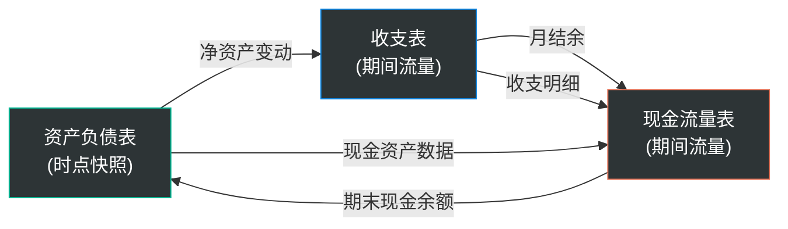
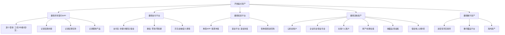
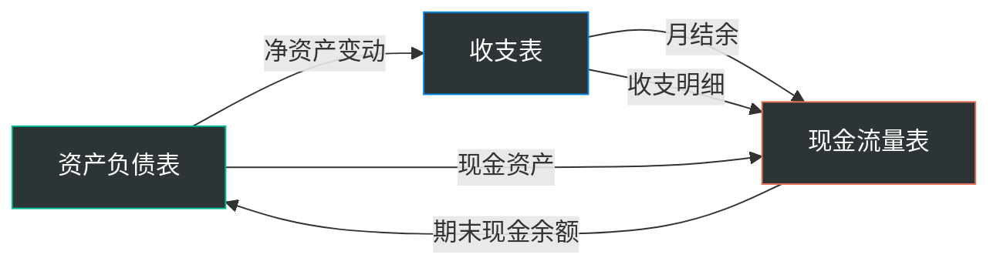
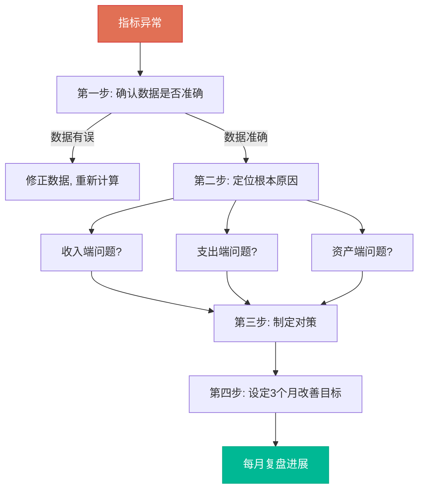
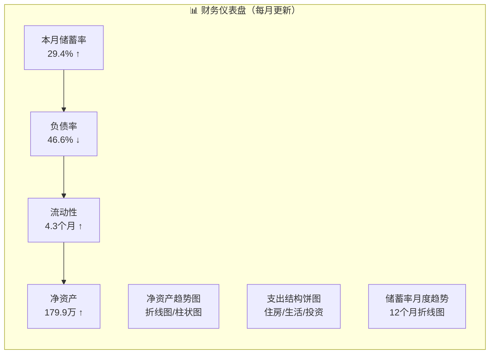
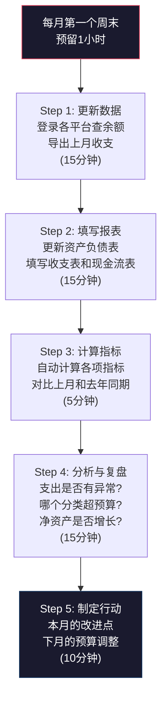

## 二、个人财务报表制作技巧

理论文件中我们已经理解了三张财务报表（资产负债表、收支表、现金流量表）的定义、分类和分析框架。本节聚焦于"怎么做"——如何从零开始制作一套实用的个人财务报表，如何避免常见的坑，以及如何借助工具实现半自动化。

**一个关键认知**：制作财务报表不是一次性工程，而是一个持续运转的系统。你需要的不是一张完美但只填过一次的表格，而是一套每月花30分钟就能更新的流程。本节的所有技巧都围绕这个目标展开。

**三张报表的定位与关系**：

在动手之前，先理清三张报表各自解决什么问题、它们之间的数据如何流转：

| 报表 | 回答的核心问题 | 更新频率 | 数据来源 |
|------|---------------|---------|---------|
| 资产负债表 | 我有多少钱？欠多少钱？净资产多少？ | 每月或每季度 | 各平台账户余额、房产估值、贷款余额 |
| 收支表 | 钱从哪来？花到哪去？结余多少？ | 每月 | 记账APP、银行流水、支付平台账单 |
| 现金流量表 | 手上实际有多少现金可用？资金节奏如何？ | 每月 | 银行账户变动、投资进出、贷款扣款 |

**三张报表的数据流转关系**：



**整体工作流程概览**：


### 2.0 制作前的心理准备与认知校准

在动手之前，必须先解决两个心理障碍——它们比任何技术问题都更容易导致你半途而废。

**心理障碍一："我钱太少，不值得做报表"**

这是最常见的借口，也是最大的误解。财务报表的本质不是"有钱人的工具"，而是"把模糊变成精确"的工具。你月薪5000元时需要知道钱花在哪里，和月薪50000元时需要知道钱花在哪里，逻辑完全一样。事实上，钱越少，每一笔支出的影响越大，你对精确信息的需求反而越强烈。

举一个具体的例子：月入8000元的人，如果每月多花了1000元在不必要的订阅服务上，一年就是12000元——相当于1.5个月的工资。而月入30000元的人，同样的1000元只占年收入的0.3%。钱越少，"漏钱"的相对伤害越大。

**心理障碍二："看到自己的财务状况会焦虑"**

很多人凭直觉知道自己财务状况不好，但选择不去面对。这是一种"鸵鸟心态"——不看数字，问题就不存在吗？恰恰相反，模糊的焦虑远比具体的数字更折磨人。当你把焦虑变成"负债率65%，需要在18个月内降到50%以下"时，焦虑就变成了可执行的计划。

心理学研究表明，"不确定性"本身就是焦虑的主要来源。面对具体数字时，人脑会自动进入"问题解决模式"——这是进化赋予我们的本能。模糊的焦虑消耗心理能量，具体的数字驱动行动计划。

**制作报表的三个基本原则**：

1. **诚实原则**：数据必须真实。低估负债、高估资产只会让报表失去决策价值。宁可看到一个不好的真实数字，也不要活在一个好看的虚假数字里。一个真实但不好看的报表能救你，一个虚假但好看的报表会害你——因为基于错误数据的决策比不决策更危险。
2. **一致原则**：分类标准、计价方式一旦确定就不要随意更改。如果中途改变了分类方式，前后数据就无法比较，趋势分析也就失效了。如果确实需要调整分类标准，在调整的那个月做一份"调整说明"，记录新旧标准的映射关系，这样至少可以在换算后做近似比较。
3. **可维护原则**：宁可简化也不要复杂到坚持不下去。一个每月花30分钟能更新的简易报表，远比一个做了两个月就放弃的完美报表有价值。如果你发现自己在分类上纠结超过10秒，说明你的分类体系太细了——合并一些分类，直到每个分类都能在5秒内判断归属。

**隐性第四原则：渐进原则**。不要试图一步到位做出"完美报表"。第一个月只做资产负债表（摸清家底），第二个月加上收支表（看清流向），第三个月加上现金流量表和指标计算（完整体系）。每个月只增加一个新模块，让习惯先于复杂度建立。

### 2.1 资产负债表制作实战

资产负债表是三张表中信息密度最高的——它浓缩了你的全部财务家底。制作它需要一次性投入较多时间（首次约2-3小时），但后续每月更新只需15-20分钟。

#### 2.1.1 第一步：全面盘点资产

盘点资产最大的挑战不是计算，而是"找到所有资产在哪"。很多人有5-10个不同平台的账户，时间一长自己都忘了。

**资产盘点的完整流程**：



**实操建议：用"账户清单表"来避免遗漏**

在正式制作资产负债表之前，先花20分钟填这张账户清单：

| 平台名称 | 账户类型 | 账号/备注 | 是否已登录 | 余额(元) |
|----------|----------|-----------|-----------|----------|
| 工商银行 | 储蓄卡 | 工资卡 | □ | |
| 招商银行 | 储蓄卡 | 日常消费 | □ | |
| 建设银行 | 房贷 | 房贷还款卡 | □ | |
| 支付宝 | 综合 | 余额+余额宝+基金 | □ | |
| 微信 | 支付 | 零钱+零钱通 | □ | |
| 华泰证券 | 股票 | A股持仓 | □ | |
| 天天基金 | 基金 | 定投持仓 | □ | |
| 住房公积金 | 公积金 | 单位缴存 | □ | |
| 企业年金 | 年金 | 企业补充养老 | □ | |
| 币安/OKX | 加密货币 | BTC/ETH持仓 | □ | |
| 港股券商 | 港股 | 海外投资 | □ | |

填完这张表后，逐个登录查余额，打勾确认。这个过程本身就是一次有价值的财务自查——你会发现有些平台已经很久没登录了，里面可能有遗忘的资金。

**进阶技巧：翻查银行APP的"睡眠账户"**。很多人在不常用的银行还有账户，里面可能有几十到几千元的余额。建议花10分钟回忆所有你办过卡的银行，逐一登录确认。如果你用的是同一家银行的多张卡，在APP的"我的账户"中通常能看到所有关联卡的列表。

**找到遗忘资产的三种信号**：
1. 翻看手机里安装了但很久没打开的金融类APP
2. 搜索邮箱/短信中的"开户成功"、"到账通知"等关键词
3. 在中国人民银行征信中心查询个人信用报告（免费，每年2次），上面会列出你所有的银行账户和贷款信息

#### 2.1.2 资产计价的实操要点

理论文件讲了"保守原则"和"市值法"，这里给出具体的估值方法：

**流动资产（最简单）**：直接取账户余额，1:1计价。定期存款如果提前取出会损失利息，可以在附注中标注到期日和提前支取的罚息。

**股票和基金**：取当前持仓市值，而非买入成本。操作方式：
- 股票：登录券商APP → 持仓 → 查看"最新市值"列
- 基金：登录基金平台 → 我的持仓 → 查看"持有市值"
- 注意区分"持有市值"和"持有收益"——资产负债表填的是市值

**房产估值**（最复杂且最容易出错）：

```text
房产估值的三种方法，精度递减：

1. 成交参考法（最准）
   - 打开贝壳/链家APP
   - 搜索你的小区
   - 查看"近期成交"，找户型/楼层最接近的
   - 取最近3个月内成交单价的中位数
   - 你的房产价值 ≈ 成交单价 × 你的面积

2. 挂牌参考法（偏乐观）
   - 查看同小区在售房源的挂牌价
   - 一般需要打85-90折才是真实成交价
   - 因为挂牌价普遍高于实际成交价

3. 评估价法（最保守）
   - 银行贷款时的评估价通常低于市场价10-20%
   - 可以参考你贷款时的评估价，再根据市场涨跌调整
```

**估值偏差的校正**：三种方法得出的数字可能差距很大。以一套市价300万的房产为例：

| 估值方法 | 估算结果 | 与成交价偏差 | 适用场景 |
|----------|----------|-------------|----------|
| 成交参考法 | 300万 | 基准 | 资产负债表首选 |
| 挂牌参考法 | 340万 | +13% | 仅作上限参考 |
| 银行评估价 | 250万 | -17% | 申请贷款时使用 |

**建议**：资产负债表中使用成交参考法的结果，在附注中注明估值日期和参考来源。每半年更新一次房产估值——房产不是股票，不需要每月盯。

**车辆估值**：打开瓜子二手车或懂车帝APP，输入你的车型、年份、公里数，系统会给出参考价。车辆是贬值资产，建议每年至少更新一次估值。以下是典型的折旧节奏：

| 车龄 | 残值率（相对新车价） | 说明 |
|------|---------------------|------|
| 1年 | 75-80% | 第一年折旧最猛 |
| 3年 | 55-65% | 三年是二手车交易的高频节点 |
| 5年 | 40-50% | 折旧速度趋缓 |
| 8年 | 25-35% | 主要看车况和品牌 |
| 10年+ | 15-25% | 除非是保值品牌（如丰田、雷克萨斯） |

**数字资产的估值处理**：

随着越来越多人持有加密货币、数字藏品等数字资产，它们也需要纳入资产负债表：

```text
数字资产的估值要点：

1. 加密货币（BTC、ETH等）
   - 估值方式：持有数量 × 当前市场价格
   - 数据来源：CoinMarketCap、币安、OKX等交易所的实时价格
   - 注意：加密货币波动极大，建议用最近7天均价而非瞬时价格
   - 税务提示：中国目前对加密货币交易的税务处理尚不明确，
     但如果你有海外交易所账户，需要在附注中披露

2. 数字藏品/NFT
   - 估值方式：最近成交价或同类藏品的地板价
   - 注意：NFT市场流动性极差，很多藏品可能已经"归零"
   - 建议：对流动性差的数字藏品，保守估值为买入价的50%或更低
   - 如果你的NFT长期没有交易记录，可以按"沉没成本"处理，
     即在报表中列为"其他资产"并注明"流动性极低"

3. 数字账户余额
   - 游戏账号/装备：通常不计入（流动性极低且估值困难）
   - 但如果有明确的交易平台（如Steam市场），
     可以参考近期成交价估值
   - 预付费账户（如理发店、健身房充值卡）：
     按剩余可用金额计入，但标注"受限资产"
```

**海外资产的估值处理**：

如果你持有海外资产（港股、美股、海外房产等），需要额外注意：

```text
海外资产估值的特殊处理：

1. 币种转换
   - 所有资产必须折算为人民币计入
   - 使用编制报表当日的央行中间价
   - 在附注中标注使用的汇率

2. 港股/美股
   - 估值方式：持有数量 × 当前港币/美元价格 × 当日汇率
   - 注意：港股T+2交割，美股T+1，估值时确认数据的时效性
   - 券商APP通常会显示人民币市值，直接使用即可

3. 海外房产
   - 估值方式与国内类似，但需要考虑：
     - 当地市场的成交价（而非人民币等值）
     - 汇率波动对资产价值的影响
     - 海外房产的持有成本（物业税、管理费）
   - 建议：在附注中单独说明海外房产的估值假设和汇率风险
```

**多币种资产的汇率风险管理**：

如果你持有较多外币资产，汇率波动会直接影响你的人民币净资产。以下是管理汇率风险的实操方法：

```text
汇率风险管理：

1. 记录基准汇率
   - 在资产负债表附注中记录编制日的汇率
   - 例：2024年6月 USD/CNY = 7.25, HKD/CNY = 0.93

2. 计算汇率敏感度
   - 外币资产占总资产的比例
   - 如果 > 20%，需要特别关注汇率走势

3. 汇率对冲思路
   - 简单方法：外币资产占比不超过总资产的30%
   - 进阶方法：在资产负债表中增加"汇率风险敞口"指标
   - 计算：外币资产总额 × 近1年汇率波动率（通常2-5%）

4. 月度更新时的汇率处理
   - 每月使用同一来源的汇率（如央行中间价）
   - 不要在同一张报表中混用不同来源的汇率
   - 汇率变动导致的资产价值变化，在附注中单独说明
```

**容易遗忘的资产清单**：

| 遗忘资产 | 估算方式 | 常见金额范围 |
|----------|----------|-------------|
| 公积金账户 | 公积金APP查询 | 5万-30万 |
| 企业年金 | 咨询HR或年金管理平台 | 1万-20万 |
| 社保个人账户 | 社保APP查询（养老个人账户） | 2万-15万 |
| 医保个人账户 | 医保APP查询 | 1000-2万 |
| 借给他人的钱 | 回忆+翻聊天记录 | 因人而异 |
| 未到期的定期存款 | 银行APP"我的存款" | 因人而异 |
| 保险现金价值 | 咨询保险公司或查保单 | 退保能拿回的钱 |
| 未提取的公积金利息 | 公积金APP | 通常不多但不应遗漏 |
| 住房维修基金 | 物业或住建局查询 | 几千到几万 |
| 未使用的预付卡/充值卡 | 检查各类会员卡余额 | 几百到几千 |
| 加密货币 | 交易所账户 | 波动大，0到巨额 |
| 海外账户余额 | 登录海外银行/券商 | 因人而异 |

**关于"保险现金价值"的补充说明**：很多人买了长期寿险（如终身寿险、年金险），这些保单有"现金价值"——即退保时能拿回的金额。它不等于已交保费（通常远低于已交保费），但确实是你的资产。查询方式：保单上通常有现金价值表，或者登录保险公司APP查看。注意：短期意外险、医疗险没有现金价值。

**估值时的"保守原则"实战应用**：

当你对某项资产的估值拿不准时，遵循以下优先级：
1. 有公开市场成交价的，用成交价（如股票、基金）
2. 没有成交价但有挂牌价的，打8折（如房产、二手车）
3. 没有公开市场参考的，用买入成本的50%或更低（如收藏品、NFT）
4. 实在无法估值的，在附注中说明，不计入总资产

这样做的好处是：你的净资产是一个"保守估计"——真实值大概率高于报表数字。这种保守会让你在做财务决策时更安全。

#### 2.1.3 负债盘点实操

负债盘点比资产盘点容易——因为欠钱的平台通常会主动提醒你还款。但仍有几个容易遗漏的地方：

**容易遗漏的负债**：

| 遗忘负债 | 检查方式 | 说明 |
|----------|----------|------|
| 花呗/白条 | 支付宝→花呗→当月账单 | 未出账单也算负债 |
| 信用卡未出账消费 | 各银行APP→信用卡→"未出账单" | 很多人只看出账单 |
| 亲友借款 | 翻聊天记录 | 借了但没还的钱 |
| 分期付款 | 查各平台分期详情 | 手机分期、教育分期等 |
| 为他人担保 | 回忆签过的担保协议 | 或有负债，概率低但金额大 |
| 房租押金 | 租房合同 | 虽然退租时能拿回，但当前是占用资金 |
| 未缴纳的罚款/税款 | 12123 APP/税务局 | 忘记处理的罚款会产生滞纳金 |
| 花呗/借呗额度外的信用贷 | 各金融APP | 有些贷款在"钱包"而非"贷款"页面 |
| 助学贷款 | 国家开发银行APP | 毕业后开始还款 |

**负债计价的关键**：填的是"当前剩余未还本金"，不是"总借款金额"。

举例：你3年前贷款100万买房，现在剩余本金72万，那资产负债表上填72万，不是100万。查看方式：银行APP→贷款→查看"剩余本金"。

**区分"好负债"和"坏负债"**：在盘点负债的同时，应该对每笔负债做一个标记——它是"好负债"（低利率、用于资产增值，如房贷）还是"坏负债"（高利率、用于消费，如信用卡分期）。这个标记不影响资产负债表的填写，但对后续的还款优先级决策至关重要：

```text
坏负债的特征（应优先偿还）：
- 年化利率 > 8%（花呗分期实际年化约13-15%，信用卡分期约12-18%）
- 用于消费而非资产增值
- 期限短、月供压力大

好负债的特征（不必急于偿还）：
- 年化利率 < 5%（如公积金贷款3.1%，商贷3.5-4.5%）
- 用于购买增值资产（如房产）
- 利率低于你的投资回报率

判断是否提前还贷的公式：
  如果 贷款利率 > 投资回报率 + 2% → 优先提前还贷
  如果 贷款利率 < 投资回报率 → 不急着还，钱拿去投资更划算
  （+2%是因为投资有风险而还贷是确定收益，需要风险补偿）
```

**负债还款的两种策略对比**：

当你有多笔负债需要偿还时，有两种经典策略：

```text
策略一：雪球法（Snowball Method）
  - 按负债金额从小到大排序
  - 优先还清金额最小的那笔
  - 还清后，把这笔的还款额加到下一笔的还款中
  - 优点：快速获得"还清一笔"的成就感，心理激励强
  - 缺点：可能不是利息最优的方案
  - 适合：需要心理激励、容易放弃的人

策略二：雪崩法（Avalanche Method）
  - 按利率从高到低排序
  - 优先偿还利率最高的那笔
  - 还清后，把还款额加到下一笔中
  - 优点：总利息支出最少，数学上最优
  - 缺点：高利率的贷款通常金额大，短期内看不到"还清"的成果
  - 适合：自律性强、追求最优解的人

实际操作示例：
  负债A：信用卡分期 12,000元，年化15%
  负债B：花呗 3,000元，年化13%
  负债C：车贷 45,000元，年化5%
  负债D：房贷 720,000元，年化3.5%

  雪球法顺序：B → A → C → D
  雪崩法顺序：A → B → C → D

  差异分析：
  - 如果每月能拿出3,000元额外还款
  - 雪球法：3个月还清B，6个月还清A，总利息约2,100元
  - 雪崩法：5个月还清A，6个月还清B，总利息约1,800元
  - 差异：300元（雪崩法省300元利息）
  - 但雪球法在第3个月就有"还清一笔"的正反馈

建议：如果你的负债利率差异不大（<5%），用雪球法；
如果利率差异大（>8%），用雪崩法。
```

#### 2.1.4 资产负债表填写模板

以下是填入真实数字后的完整示例（以一个普通上班族为例）：

**资产端**：

| 资产类别 | 具体项目 | 金额（元） | 说明 |
|----------|----------|-----------|------|
| 现金及活期 | 工商银行活期 | 15,000 | 工资卡 |
| | 招商银行活期 | 8,500 | 日常消费卡 |
| | 支付宝余额+余额宝 | 23,000 | |
| | 微信零钱+零钱通 | 5,200 | |
| | **流动资产小计** | **51,700** | |
| 短期理财 | 招行朝招金 | 50,000 | 随时可赎回 |
| | 国债逆回购 | 20,000 | 到期自动回来 |
| | **短期理财小计** | **70,000** | |
| 投资资产 | 股票持仓市值 | 85,000 | 券商APP最新市值 |
| | 基金持仓市值 | 120,000 | 天天基金持有市值 |
| | **投资资产小计** | **205,000** | |
| 固定资产 | 自住房产估值 | 2,800,000 | 参考同小区成交价 |
| | 车辆估值 | 80,000 | 瓜子二手车估价 |
| | **固定资产小计** | **2,880,000** | |
| 其他资产 | 公积金账户 | 128,000 | 公积金APP查询 |
| | 企业年金 | 35,000 | HR查询 |
| | **其他资产小计** | **163,000** | |
| **总资产** | | **3,369,700** | |

**负债端**：

| 负债类别 | 具体项目 | 金额（元） | 说明 |
|----------|----------|-----------|------|
| 短期负债 | 信用卡未出账单 | 3,800 | 招行信用卡 |
| | 花呗待还 | 1,200 | 本月消费 |
| | **短期负债小计** | **5,000** | |
| 长期负债 | 房贷剩余本金 | 1,520,000 | 建行房贷 |
| | 车贷剩余本金 | 45,000 | 车贷分期 |
| | **长期负债小计** | **1,565,000** | |
| 或有负债 | 朋友借款担保 | 100,000 | 朋友贷款担保（附注） |
| **总负债** | | **1,570,000** | 不含或有负债 |

**净资产** = 3,369,700 - 1,570,000 = **1,799,700元**

**关键指标速算**：
- 负债率 = 1,570,000 ÷ 3,369,700 = **46.6%**（正常偏高，不宜再增加负债）
- 流动性比率 = 51,700 ÷ 月支出12,000 = **4.3个月**（良好，但未达6个月的安全线）
- 投资资产比 = 205,000 ÷ 3,369,700 = **6.1%**（偏低，资产过度集中在房产）

这个示例揭示了一个典型的中国城市中产家庭画像：纸面上有几百万资产，但大部分是自住房产，流动性和投资资产占比很低。这种结构意味着财务弹性不足——一旦失业或收入下降，可动用的流动资金非常有限。

**资产负债表填写的常见错误**：

| 错误 | 正确做法 |
|------|----------|
| 房产按买入价计 | 按当前市场成交价计 |
| 股票按买入成本计 | 按当前持仓市值计 |
| 漏记花呗/信用卡未出账单 | 未出账消费也是负债 |
| 把公积金/年金当作"可用资金" | 这些是受限资产，退休前无法动用 |
| 资产和负债各算各的，不做交叉验证 | 必须验证：总资产 = 总负债 + 净资产 |

**多账户/多人场景的合并处理**：

如果你和伴侣有多个账户，合并时需要特别注意：

```text
合并原则：
1. 共同名下的资产（如联名账户）只算一次
2. 各自名下的资产分别计入，加总后得出家庭总资产
3. 内部借贷（夫妻之间的借款）在合并时相互抵消
4. 共同负债（如联名房贷）只算一次

合并示例：
  丈夫资产：150万    妻子资产：80万
  丈夫负债：60万     妻子负债：20万
  家庭总资产 = 150 + 80 = 230万
  家庭总负债 = 60 + 20 = 80万
  家庭净资产 = 230 - 80 = 150万

  如果丈夫借给妻子5万（内部借贷）：
  丈夫资产中包含"应收妻子5万"
  妻子负债中包含"应付丈夫5万"
  合并时相互抵消，不影响家庭净资产
```

#### 2.1.5 资产负债表的验证与交叉核对

填写完资产负债表后，不要急着收工——花5分钟做以下验证，可以避免低级错误：

**验证一：检查恒等式**

`总资产 = 总负债 + 净资产` 必须成立。如果左边不等于右边，说明有计算错误。

**验证二：与上期对比**

如果这是你第二次做资产负债表，把两期的数据放在一起比较。净资产的变化应该能用"本期收入-本期支出"大致解释。如果净资产涨了很多但你说不清原因，可能是某项资产估值有误；如果净资产跌了但你的储蓄率为正，也说明有数据问题。

**验证三：现金余额交叉验证**

资产负债表中的"现金及活期"合计数，应该和你实际查到的所有银行账户余额总和一致。如果不一致，检查是否有账户遗漏或金额抄错。

**验证四：净资产变化的合理性检验**

```text
本月净资产变化 = 本月储蓄 + 投资收益（或亏损） + 资产估值变化

例：
  本月储蓄：4,700元（收入-支出）
  投资收益：基金浮盈2,000元
  房产估值变化：0元（半年更新一次）
  → 预期净资产变化：+6,700元

  实际净资产变化：+8,000元
  差异：+1,300元

  差异分析：
  - 如果差异在±10%以内 → 正常（估值误差、时间差等）
  - 如果差异超过±20% → 需要逐项排查数据错误
  - 常见原因：漏记某笔收入/支出、资产估值更新、汇率变动
```

**验证五：三表之间的勾稽关系**

三张报表不是孤立的，它们之间存在逻辑关联：



关键勾稽关系：
1. 收支表的"月结余" ≈ 资产负债表"净资产的月度变动"
2. 现金流量表的"期末现金余额" = 资产负债表中"现金及活期"合计
3. 如果这三条等式都不成立，说明某张表的数据有问题

### 2.2 收支表制作实战

收支表是三张表中最容易上手的——如果你已经在记账，你的记账软件基本已经自动生成了。但"有数据"和"会分析"是两回事。

#### 2.2.1 收支表的两种编制方式

**方式一：从记账软件导出**

大多数记账APP（随手记、钱迹、MoneyWiz）都支持按月导出收支汇总。操作路径通常是：报表 → 月度/年度报表 → 导出/截图。

这种方式的优点是省力，缺点是受限于APP的分类体系，可能和你需要的分析维度不一致。

**方式二：手工汇总**

如果你用多个支付渠道（银行卡、支付宝、微信、现金），需要从各平台分别导出数据再汇总：

```text
汇总步骤：

1. 导出银行卡流水
   - 工商银行APP → 明细 → 筛选日期 → 导出Excel
   - 招商银行APP → 交易查询 → 导出

2. 导出支付宝账单
   - 支付宝 → 我的 → 账单 → 右上角"..." → 开具交易流水证明
   - 或者：支付宝 → 账单 → 月度账单 → 截图汇总

3. 导出微信账单
   - 微信 → 我 → 服务 → 钱包 → 账单 → 右上角"..." → 账单下载

4. 汇总到Excel
   - 将各平台数据合并到一个表格
   - 统一分类标准
   - 去重（同一笔转账在两个平台都会记录）
```

**去重是关键**：你在支付宝用银行卡付款，银行和支付宝都会记录一笔。汇总时必须识别并去重，否则支出会虚增。简单的方法是：以支付宝/微信的记录为准，银行端只记录那些不经过第三方支付的交易（如ATM取现、银行转账）。

**更高效的去重方法**：如果你将多个平台的数据导出为CSV，可以用Excel的"条件格式 → 重复值"功能快速发现重复条目。重复条目的特征通常是：金额相同、日期相同或相差1天。匹配到重复条目后，删除银行端的那条，保留支付宝/微信端的（因为它们的商户信息更完整）。

**方式三：API自动抓取（技术型用户）**

如果你有编程能力，可以通过以下方式实现半自动化：
- 银行流水：部分银行提供开放银行API（如招行），或使用第三方服务（如银联云闪付的账单导出）
- 支付宝：通过支付宝开放平台的账单API（需要开发者账号）
- 微信：微信没有官方账单API，但可以通过导出CSV后用Python脚本自动解析
- 统一处理：用Python的pandas库将各平台数据合并、去重、分类，然后写入Excel

这种方式的前期投入较高（需要几小时搭建脚本），但后续每月只需运行一次脚本就能完成数据汇总。

#### 2.2.2 收支分类的实操标准

理论文件讲了按可控性分类的框架。实际操作中，你需要一套既不过于复杂（分类太多记不下去）又不过于粗糙（分类太少看不出问题）的分类体系。

**推荐的二级分类体系**（共6大类、18小类）：

| 一级分类 | 二级分类 | 包含内容 | 典型占比 |
|----------|----------|----------|----------|
| **住房** | 房贷/房租 | 月供、租金 | 20-30% |
| | 物业水电 | 物业费、水电气、宽带 | 3-5% |
| **生活** | 餐饮食品 | 外卖、堂食、买菜、零食 | 10-15% |
| | 交通出行 | 地铁、公交、打车、加油、停车 | 3-8% |
| | 日用百货 | 日用品、家居用品 | 2-3% |
| | 服饰美容 | 衣服、鞋、护肤、理发 | 3-5% |
| | 医疗健康 | 门诊、药费、体检 | 1-3% |
| **保障** | 保险 | 商业保险保费 | 3-5% |
| | 税费 | 个人所得税（如有自行申报部分） | 因人而异 |
| **成长** | 教育学习 | 课程、书籍、培训、考试 | 2-5% |
| | 职业发展 | 工具软件、行业会议 | 1-2% |
| **社交** | 娱乐休闲 | 电影、游戏、旅游 | 3-8% |
| | 人情往来 | 礼金、请客、送礼 | 2-5% |
| | 家庭孝敬 | 给父母的生活费 | 5-10% |
| **投资** | 储蓄 | 定期存款、货币基金转入 | ≥20% |
| | 投资 | 股票、基金、理财买入 | 按计划 |

**分类的原则**：
- 二级分类不要超过20个，否则选分类时会犹豫
- 设一个"其他"兜底，但每月"其他"的金额不应超过总支出的5%——如果超过，说明你需要拆分新的分类
- 保险单独列出来，不要混入"生活支出"——因为保险是保障项，性质完全不同

**分类争议的处理方法**：有些支出确实不好归类，比如"买了一本书是教育还是娱乐？""给朋友买生日礼物是人情还是社交？"遇到这种情况，不要纠结——定一个规则然后坚持执行就好。比如"所有书籍归教育学习"或"所有礼物归人情往来"。分类的一致性比分类的准确性更重要，因为一致性让你能做趋势分析。

**自由职业者的收支分类调整**：

如果你是自由职业者、个体户或有副业收入，需要在分类体系中增加以下维度：

```text
自由职业者的额外分类：

收入端增加：
├─ 主营业务收入（核心业务的收款）
├─ 副业收入（非核心业务的收款）
├─ 被动收入（版权费、租金、利息等）
└─ 一次性收入（稿费、咨询费、项目奖金）

支出端增加：
├─ 业务成本（原材料、外包费、平台佣金）
├─ 营业税费（增值税、附加税、个税预缴）
├─ 业务工具（软件订阅、设备折旧、办公用品）
└─ 营销获客（广告投放、社交应酬）

关键区别：
- 自由职业者的"收入"应该是税后净收入
- 业务成本应该从毛收入中扣除后再计算储蓄率
- 如果业务和个人消费混用同一账户，需要先拆分再记账
```

**不规则收入的处理方式**：

自由职业者、销售、季节性工作者的收入波动大，需要特殊处理：

```text
不规则收入的记账原则：

1. 按"到账日"记收入，不按"开票日"或"签约日"
   - 例：12月签约的项目，1月才收到款 → 记为1月收入

2. 用"月均收入"而非"单月收入"做预算
   - 计算方法：过去6个月或12个月的平均值
   - 例：6个月收入分别是 3万/8万/2万/5万/6万/4万
     → 月均收入 = (3+8+2+5+6+4) ÷ 6 = 4.67万
     → 用4.67万做预算，而不是用最高的8万

3. 设立"收入平滑账户"
   - 收入高的月份：超出月均的部分转入平滑账户
   - 收入低的月份：从平滑账户补充到月均水平
   - 目标：平滑账户余额能覆盖2-3个月的收入差额
   - 这个账户应该用货币基金或短期理财，保持流动性

4. 在报表中区分"经常性收入"和"偶发性收入"
   - 经常性收入：每月稳定到账的（如固定客户、租金）
   - 偶发性收入：不规律的一次性收款（如稿费、项目奖金）
   - 偶发性收入不应该计入月均收入的基数
```

#### 2.2.3 收支表填写示例

以一个月入15,000元的上班族为例：

| 项目 | 金额（元） | 占收入比 |
|------|-----------|---------|
| **收入** | | |
| 工资税后 | 15,000 | 93.8% |
| 理财收益 | 350 | 2.2% |
| 兼职收入 | 650 | 4.0% |
| **收入合计** | **16,000** | **100%** |
| **支出** | | |
| 房贷月供 | 4,200 | 26.3% |
| 物业水电宽带 | 580 | 3.6% |
| 餐饮食品 | 2,100 | 13.1% |
| 交通出行 | 450 | 2.8% |
| 日用百货 | 320 | 2.0% |
| 服饰美容 | 400 | 2.5% |
| 医疗健康 | 150 | 0.9% |
| 保险 | 680 | 4.3% |
| 教育学习 | 300 | 1.9% |
| 娱乐休闲 | 500 | 3.1% |
| 人情往来 | 350 | 2.2% |
| 家庭孝敬 | 1,000 | 6.3% |
| 其他支出 | 270 | 1.7% |
| **支出合计** | **11,300** | **70.6%** |
| **月结余** | **4,700** | **29.4%** |

**关键数据解读**：
- 储蓄率29.4%——接近"良好"标准（20%-30%），还有提升空间
- 住房相关支出占比29.9%——在合理范围内（30%以内为佳）
- 生活支出合计约3,420元——控制得不错
- 保险支出4.3%——合理，提供了基础保障
- "其他"占比1.7%——控制在5%以内，说明分类体系覆盖度高

**收入结构分析**：这个示例中，工资收入占93.8%，被动收入（理财收益）仅占2.2%。理想的收入结构应该逐步提升被动收入占比——当被动收入能覆盖基本生活支出时，你就实现了"财务自由"的第一阶段。当前2.2%的被动收入占比意味着收入结构极度依赖主动劳动，抗风险能力弱。

**如何解读"占收入比"背后的含义**：

```text
健康的支出结构参考（以税后月入15,000元为例）：

住房：≤30%（≤4,500元）→ 超过这个比例会挤压其他支出
生活必需：≤25%（≤3,750元）→ 餐饮+交通+日用
保障：≤10%（≤1,500元）→ 保险+税费
成长：≥5%（≥750元）→ 教育学习是长期投资
社交：≤10%（≤1,500元）→ 娱乐+人情
储蓄投资：≥20%（≥3,000元）→ 这是底线

判断方法：
- 如果住房+生活+保障 > 70% → 收入太低或支出太高
- 如果储蓄投资 < 20% → 需要优先压缩前三项
- 如果成长 < 5% → 短期省钱但长期亏
```

#### 2.2.4 预算编制：从"记录过去"到"规划未来"

收支表告诉你"花了多少"，预算告诉你"应该花多少"。两者结合才是完整的财务管理闭环。很多人只做记账不做预算，就像只看后视镜不看导航——你知道自己走过了哪里，但不知道该往哪走。

**预算编制的三种方法**：

```text
方法一：收入百分比法（最适合新手）

规则：按收入的固定百分比分配各类支出上限
示例（月入15,000元）：
  住房：30% = 4,500元
  生活必需：25% = 3,750元
  保障（保险+税费）：10% = 1,500元
  成长：5% = 750元
  社交：10% = 1,500元
  储蓄投资：20% = 3,000元

优点：简单直观，不需要历史数据
缺点：不够精细，可能和实际需求不匹配

方法二：历史数据法（最适合已记账3个月以上的人）

规则：基于过去3-6个月的实际支出，设定合理的预算
步骤：
  1. 计算每个分类过去3个月的平均支出
  2. 对每个分类设定预算（平均值 × 0.9 或 1.0）
  3. 优先压缩"弹性支出"（娱乐、服饰、餐饮外出）
  4. "刚性支出"（房贷、保险、教育）按实际金额设定

优点：基于真实数据，预算更贴合实际
缺点：如果历史支出本身就超标的，预算也会偏高

方法三：目标倒推法（最适合有明确储蓄目标的人）

规则：先确定储蓄目标，倒推可支出金额
步骤：
  1. 确定月储蓄目标（如5,000元）
  2. 可支出总额 = 月收入 - 月储蓄目标 = 10,000元
  3. 将可支出总额分配到各分类
  4. 优先保障刚性支出，剩余分配给弹性支出

优点：确保储蓄目标达成
缺点：可能让某些月份的预算过于紧张
```

**预算模板示例**：

| 分类 | 预算（元） | 实际（元） | 差异 | 差异率 | 状态 |
|------|-----------|-----------|------|--------|------|
| 房贷 | 4,200 | 4,200 | 0 | 0% | ✅ |
| 物业水电 | 550 | 580 | -30 | -5.5% | ⚠️ |
| 餐饮食品 | 2,000 | 2,100 | -100 | -5% | ⚠️ |
| 交通出行 | 400 | 450 | -50 | -12.5% | ⚠️ |
| 娱乐休闲 | 500 | 500 | 0 | 0% | ✅ |
| 教育学习 | 300 | 300 | 0 | 0% | ✅ |
| 其他 | 500 | 270 | +230 | +46% | ✅ |
| **支出合计** | **11,150** | **11,300** | **-150** | **-1.3%** | |
| **月结余目标** | **4,850** | **4,700** | **-150** | | |

**预算差异分析的规则**：
- 差异率在 ±10% 以内：正常波动，不需要干预
- 差异率在 ±10%-20%：需要关注，分析原因
- 差异率超过 ±20%：需要立即干预，制定纠正措施
- 连续2个月超预算的分类：说明预算设定不合理或消费习惯需要改变

**预算执行跟踪的关键技巧**：
1. **分周监控**：不要等到月底才看预算，每周检查一次。如果第一周就花了预算的40%，说明节奏太快
2. **设立"缓冲池"**：在总预算中留5%-10%作为弹性空间，应对意外支出
3. **超支的处理**：如果某个分类超支，从其他弹性分类中调拨，而不是"透支下个月的预算"
4. **季度调整**：每3个月根据实际数据调整一次预算——预算不是一成不变的

#### 2.2.5 收支表的常见陷阱

**陷阱一：把转账当作支出**

你从银行卡转5000元到支付宝，这不是支出，只是资金在不同账户之间的流转。很多记账软件会把这种内部转账也计入收支，导致数据失真。解决方法：在记账时将内部转账标记为"转账"而非"支出"，并在报表中过滤掉。

**如何识别和处理内部转账**：

```text
内部转账的识别规则：

1. 同一自然人名下的不同账户之间的资金流动 = 内部转账
   例：你的工行卡 → 你的支付宝余额 = 转账（不算支出）

2. 转入投资账户 = 投资行为（在收支表中记为"投资支出"）
   例：支付宝余额 → 买入基金 = 投资支出（算支出，但归入投资类）

3. 从投资账户赎回 = 投资回流（不算收入）
   例：卖出基金 → 银行卡到账 = 转账（不算收入）

4. 信用卡还款 = 还债（不算支出）
   例：银行储蓄卡 → 还信用卡 = 转账（消费时已经记过支出了）

5. 转给他人（非同一自然人）= 支出
   例：你的账户 → 朋友的账户 = 支出（除非是借款，将来会还）
   如果是借款，在备注中标注"借给张三"，
   还款时记为"收入：张三还款"
```

**陷阱二：忽略年度大额支出**

有些支出是年度性的：车险（3000-8000元/年）、旅游（5000-20000元/年）、节日礼物（1000-5000元/年）。如果只看月度报表，这些支出会让某个月的支出突然飙升。建议做法：将年度大额支出分摊到12个月（月均摊销），这样月度数据更有可比性。

```text
月均摊销的计算方式：

年度车险：6,000元 → 月均：6,000 ÷ 12 = 500元/月
年度旅游：12,000元 → 月均：12,000 ÷ 12 = 1,000元/月
节日礼物：3,600元 → 月均：3,600 ÷ 12 = 300元/月

月均摊销总额：1,800元/月
实际记账时仍按实际发生月记录，但在分析时加上摊销调整
```

**双维度记录法**：对于年度大额支出，建议在Excel中维护两张表——一张记录"实际发生"（用于现金流管理），一张记录"月均摊销"（用于趋势分析）。这样你既能知道"这个月实际花了多少"，也能知道"如果把年度支出平摊，这个月的真实消费水平是多少"。

**陷阱三：把信用卡还款当支出**

你用信用卡消费3000元，月底还信用卡3000元。消费那笔是支出，还款那笔不是——它只是偿还了你之前的消费。如果你把两者都计入，支出就虚增了3000元。正确做法：只在消费时记支出，还款时标记为"转账"。

**陷阱四：忽略现金支出**

在移动支付时代，现金支出容易被遗忘。你从ATM取了500元现金，记账时通常只记了"取现"——但这笔钱最终花在哪里了？如果不清点，这500元就从你的财务记录中"消失"了。建议：每次取现后，在备注中写下用途（如"ATM取现500元，用于同事聚餐"），或者养成取现后立即用记账APP记录的习惯。

**陷阱五：把"想花的"和"实际花的"混淆**

有些人会在记账时把"计划支出"提前记入（如"下个月要交物业费2000元"），导致当月支出虚增。收支表应该只记录**实际发生的交易**，不记录预期或计划中的交易。

**陷阱六：忽略"隐形消费"——订阅服务的累积效应**

```text
常见的"隐形消费"：

单个看起来不多，但累积后惊人：
- 视频会员（爱奇艺/腾讯/B站）：25元/月
- 音乐会员（QQ音乐/网易云）：15元/月
- 云存储（iCloud/百度网盘）：10元/月
- 工具软件（Notion/Obsidian Sync）：30元/月
- 外卖会员：15元/月
- 健身APP：20元/月
→ 合计：115元/月 = 1,380元/年

排查方法：
1. 打开支付宝 → 设置 → 支付设置 → 免密支付/自动扣款
2. 打开微信 → 我 → 服务 → 钱包 → 支付设置 → 自动续费
3. 检查Apple ID/Google Play的订阅列表
4. 逐一确认：这个服务我上个月用了吗？用的频率高吗？
5. 取消不常用的，保留高频使用的
```

### 2.3 现金流量表制作实战

现金流量表是三张表中最容易被忽略的，但对特定人群（自由职业者、有房贷者、有多笔投资者）至关重要。

#### 2.3.1 现金流量表与收支表的核心区别

| 维度 | 收支表 | 现金流量表 |
|------|--------|-----------|
| 记账基础 | 权责发生制（应收应付） | 收付实现制（实际到账/支出） |
| 典型差异 | 12月工资记为12月收入 | 1月5日到账则记为1月流入 |
| 关注重点 | 赚了多少、花了多少 | 手上实际有多少现金可动用 |
| 核心用途 | 分析收支结构和储蓄率 | 管理流动性，防止资金链断裂 |

对于工资即时发放的上班族，两者的差异通常很小。但对于以下人群，差异可能很大：

- 自由职业者：客户付款可能延迟30-90天
- 个体户/小企业主：收入到账时间不规律
- 有房贷的人：每月固定大额支出，现金流节奏是核心
- 有多笔投资者：基金赎回T+1到T+7，股票卖出T+1
- 有分期付款的人：分期摊还让每期的现金流出与实际消费金额不同
- 年底拿年终奖的人：全年大部分月份收入偏低，12月或1月突然暴增

**为什么自由职业者尤其需要现金流量表**：假设你是一名自由设计师，10月份完成了3个项目，合计收入9万元。收支表上你的10月收入是9万——看起来很好。但这3个客户的付款周期不同：A客户10月底付了3万，B客户11月中付了3万，C客户拖到12月才付3万。你的10月现金流入实际只有3万。如果你的10月支出是5万，你就面临2万的现金流缺口——即使你的收支表上显示"收入9万"。这就是现金流量表的不可替代价值。

#### 2.3.2 现金流量表的简化分类

企业现金流量表分为经营/投资/筹资三类，个人可以简化为：

| 流入类别 | 具体项目 | 流出类别 | 具体项目 |
|----------|----------|----------|----------|
| 工资到账 | 工资、奖金实际到账 | 日常消费 | 所有消费性支出 |
| 副业到账 | 兼职、稿费、咨询费到账 | 固定支出 | 房贷月供、保险费、房租 |
| 投资回流 | 卖出股票/基金到账、分红 | 投资支出 | 买入股票/基金、定期存款 |
| 融资流入 | 贷款到账、借入资金 | 债务偿还 | 还贷、还信用卡、还借款 |
| 其他流入 | 退款、退税、礼金 | 其他流出 | 借出资金、大额消费 |

**现金流量表示例**：

| 项目 | 金额（元） |
|------|-----------|
| **期初现金余额** | **52,000** |
| **现金流入** | |
| 工资到账 | 15,000 |
| 基金赎回到账 | 10,000 |
| 朋友还款到账 | 3,000 |
| **流入小计** | **28,000** |
| **现金流出** | |
| 日常消费（实际付款） | 7,100 |
| 房贷月供扣款 | 4,200 |
| 保险费扣款 | 680 |
| 买入基金 | 5,000 |
| 信用卡还款 | 3,800 |
| **流出小计** | **20,780** |
| **净现金流** | **+7,220** |
| **期末现金余额** | **59,220** |

**解读这份现金流量表**：
- 净现金流为正（+7,220元），说明本月现金储备在增加
- 工资是唯一的经营性流入来源，结构单一
- 基金赎回的10,000元是投资回流——它增加了现金但减少了投资资产，不是"赚钱"
- 信用卡还款3,800元是偿还上月消费，不计入本月支出（本月消费已在"日常消费"中记录）

#### 2.3.3 现金流管理的核心指标

**现金流安全垫（月数）** = 期末现金余额 ÷ 月均固定支出

以本例：59,220 ÷ (4,200 + 680) = **12.2个月**

这个指标告诉你：如果收入完全中断，你手上的现金能维持多久的固定支出。12个月是非常充裕的安全垫。

**现金流覆盖率** = 经营性现金流入 ÷ 经营性现金流出

以本例：15,000 ÷ (7,100 + 4,200 + 680) = **1.25**

大于1说明日常收入能覆盖日常支出，小于1说明你在消耗存量现金或需要投资回流来补充。

**现金流波动率**（进阶指标）：如果你连续做了6个月以上的现金流量表，可以计算净现金流的标准差。波动率越大，说明你的收入或支出越不稳定，需要更厚的安全垫。

```text
计算方法：

1. 收集过去6-12个月的净现金流数据
2. 计算平均值和标准差
3. 波动率 = 标准差 ÷ 平均值

解读：
- 波动率 < 30%：收入和支出都很稳定，3个月安全垫足够
- 波动率 30%-60%：有一定波动，建议6个月安全垫
- 波动率 > 60%：收入或支出极不稳定（如自由职业者），建议9-12个月安全垫
```

#### 2.3.4 现金流预测：从回顾过去到前瞻未来

现金流管理的精髓不只是记录已发生的，更是预测即将到来的。做好现金流预测能帮你提前发现资金缺口，避免临时周转困难。

**现金流预测的三层方法**：

```text
第一层：已知流出预测（最基础）

列出未来3个月已确定的现金流出：
- 每月房贷：4,200元
- 季度保险费（下月到期）：6,000元
- 年度车险（两个月后）：5,000元
→ 未来3个月已知流出 = 4,200×3 + 6,000 + 5,000 = 23,600元

已知流入预测：
- 每月工资：15,000元（假设稳定）
- 季度奖金（下月）：8,000元
→ 未来3个月已知流入 = 15,000×3 + 8,000 = 53,000元

现金缺口预测：
已知流出 - 已知流入 = 23,600 - 53,000 = -29,400元
负数说明已知流入能覆盖已知流出，还有29,400元的余量

安全边际：
= (期末现金余额 + 已知流入 - 已知流出) ÷ 月均支出
= (59,220 + 53,000 - 23,600) ÷ 11,300 = 7.8个月
→ 安全边际充足

第二层：概率加权预测（进阶）

对不确定的流入/流出给出概率：
- 项目A回款（80%概率本月到账）：30,000 × 0.8 = 24,000
- 年终奖（100%概率下月到账）：50,000 × 1.0 = 50,000
- 朋友还钱（50%概率本月到账）：10,000 × 0.5 = 5,000
→ 概率加权流入 = 79,000元

这种预测更适合收入不确定的自由职业者。

第三层：情景分析（高级）

设定三种情景：
- 乐观：所有预期流入都到账，无意外支出
- 基准：80%的流入到账，有少量意外支出
- 悲观：只有60%的流入到账，有大额意外支出

分别计算每种情景下的现金余额，确保"悲观情景"下仍然为正。
```

**现金流日历：可视化你的资金节奏**

对于现金流波动较大的人（自由职业者、有大额分期的人），建议制作一张"现金流日历"——在日历上标注每天的预期流入和流出，直观看到资金的进出节奏：

```text
现金流日历示例（某月）：

日期    | 流入      | 流出      | 累计余额
--------|-----------|-----------|----------
1日     | -         | 房贷4,200 | 47,800
5日     | 工资15,000| -         | 62,800
8日     | -         | 保险680   | 62,120
10日    | -         | 信用卡3,800| 58,320
15日    | 项目款8,000| -        | 66,320
20日    | -         | 基金定投2,000| 64,320
25日    | -         | 社保补缴1,200| 63,120
月底    | -         | 日常消费5,000| 58,120
```

从这张日历可以看出：月初发工资前是资金最紧张的时段（如果期初余额只有47,800），月底余额虽然不错但中间有几次大额扣款。这种可视化让你能提前规划——比如把大额扣款尽量安排在工资到账之后。

**季节性收入的现金流管理**：

如果你的收入有明显的季节性特征（如旅游从业者、教育行业、年终奖制），现金流管理需要额外注意：

```text
季节性收入的现金流策略：

1. 计算"年度总收入 ÷ 12"作为月均基准
   例：年收入24万，月均2万，但实际分布：
   - 旺季（6-9月）：月均4万
   - 淡季（其他月）：月均1.2万

2. 设立"旺季储备池"
   - 旺季收入超出月均的部分存入储备池
   - 旺季4个月：(4万-2万)×4 = 8万存入储备池
   - 淡季8个月：从储备池补充差额
   - 淡季每月补充：(2万-1.2万)×8 ÷ 8 = 8,000元

3. 储备池的管理
   - 存放位置：货币基金或短期理财（保持流动性）
   - 目标金额：至少能覆盖3个月的淡季差额
   - 不要和应急基金混在一起——应急基金是防意外，储备池是平滑收入

4. 在现金流量表中的处理
   - 旺季：流入高，但要标注"其中X万为储备池转入"
   - 淡季：流入低，但要标注"其中X万从储备池补充"
   - 这样你能区分"真实收入"和"储备池调节"
```

#### 2.3.5 三表联动：如何让报表互相验证

制作完三张表后，需要做一次交叉验证，确保数据一致：

```text
验证公式：

1. 收支表"月结余" ≈ 资产负债表"净资产月度变动"
   - 月结余 = 收入 - 支出 = 4,700元
   - 净资产变动 = 期末净资产 - 期初净资产
   - 如果差异较大，检查是否有资产估值变动（如股票涨跌）

2. 现金流量表"期末现金余额" = 资产负债表"现金及活期合计"
   - 现金流量表期末余额：59,220元
   - 资产负债表现金合计：59,220元
   - 必须相等，否则有数据错误

3. 收支表"投资支出" = 现金流量表"投资流出"
   - 收支表中"投资类支出"：5,000元
   - 现金流量表中"买入基金"：5,000元
   - 必须一致

4. 收支表"消费支出" ≤ 现金流量表"日常消费流出"
   - 收支表消费：7,100元
   - 现金流量表日常消费：7,100元
   - 如果现金流量表 > 收支表，可能有未记录的消费（如现金消费）
```

### 2.4 财务指标的计算与解读

理论文件给出了指标的定义和健康标准，这里提供一个可直接使用的计算模板和解读方法。

#### 2.4.1 一键计算模板

以下是基于前三张表数据的自动计算公式（可在Excel中直接使用）：

```text
假设数据位置：
- 总资产在单元格 B5
- 总负债在单元格 B10
- 流动资产在单元格 B3
- 月总支出在单元格 D8
- 月总收入在单元格 D3
- 月结余在单元格 D12
- 投资资产在单元格 B7
- 投资收益在单元格 D6
- 被动收入在单元格 D4
- 房贷月供在单元格 D5

=== 偿债能力指标 ===
负债率      = B10/B5            → 格式: 百分比, ≤50%为安全
流动性比率  = B3/D8             → 格式: 数字, ≥6为优秀
月供收入比  = D5/D3             → 格式: 百分比, ≤40%为安全

=== 储蓄能力指标 ===
储蓄率      = D12/D3            → 格式: 百分比, ≥30%为优秀
净资产      = B5-B10            → 格式: 金额

=== 投资效率指标 ===
投资回报率  = D6/B7             → 格式: 百分比, 年化计算
投资资产比  = B7/B5             → 格式: 百分比, ≥30%为佳
被动收入占比 = D4/D3            → 格式: 百分比, 持续提升中

=== 综合指标 ===
净资产增长率 = (期末净资产-期初净资产)/期初净资产 → 格式: 百分比
```

#### 2.4.2 指标健康度的分级解读

不同指标的健康标准不是一刀切的——它们取决于你的年龄、收入水平和人生阶段。以下是分层解读：

**储蓄率的分级标准**：

| 储蓄率 | 评级 | 含义 | 适用建议 |
|--------|------|------|----------|
| < 10% | 危险 | 入不敷出或接近月光 | 立即审视所有非必要支出 |
| 10%-20% | 及格 | 有结余但抗风险能力弱 | 重点优化高占比支出项 |
| 20%-30% | 良好 | 有适度的储蓄和投资能力 | 保持并寻找被动收入机会 |
| 30%-50% | 优秀 | 较强的财富积累能力 | 可适当增加投资比例 |
| > 50% | 精英 | 极强的储蓄能力 | 注意不要过度节俭影响生活质量 |

**负债率的年龄敏感性**：年轻人（25-35岁）的负债率通常较高（因为刚买房），60%-70%在这个年龄段是可以接受的。但到了45岁以后，负债率应该降到40%以下。因此，不要用一个固定标准来衡量所有人。

**不同人生阶段的基准参考**：

| 人生阶段 | 年龄范围 | 储蓄率基准 | 负债率基准 | 流动性基准 | 核心财务任务 |
|----------|----------|-----------|-----------|-----------|-------------|
| 职场新人 | 22-25岁 | ≥15% | ≤30% | ≥3个月 | 建立应急基金，养成记账习惯 |
| 成家立业 | 26-35岁 | ≥20% | ≤65% | ≥6个月 | 购房规划，保险配置，开始投资 |
| 事业上升 | 36-45岁 | ≥30% | ≤50% | ≥6个月 | 加速还贷，增加投资，子女教育金 |
| 财务巩固 | 46-55岁 | ≥35% | ≤30% | ≥9个月 | 降低负债，稳健投资，养老规划 |
| 退休准备 | 56-65岁 | ≥40% | ≤10% | ≥12个月 | 清零负债，保守投资，医疗储备 |

**如何解读基准表**：
- 基准是"建议达到"而非"必须达到"——如果你在30岁时储蓄率只有15%，不必恐慌，但需要有明确的提升计划
- 高线城市（北上广深）的负债率通常高于基准，因为房价高——这是结构性问题，不是个人失败
- 如果你在某个指标上远超基准（如25岁储蓄率50%），不需要继续压缩生活来追求更高数字——把多出来的钱用于提升生活质量或增加投资

#### 2.4.3 指标异常的诊断与应对

当指标不在健康范围内时，不要焦虑——先定位原因，再制定对策：

| 异常指标 | 可能原因 | 优先对策 | 次优先对策 |
|----------|----------|----------|-----------|
| 储蓄率<10% | 收入低或支出失控 | 砍掉非必要支出 | 发展副业增收 |
| 负债率>70% | 房贷过高或消费贷过多 | 停止新增负债 | 优先偿还高息负债 |
| 流动性<3个月 | 存量现金不足 | 暂停投资，补充应急基金 | 减少非必要支出 |
| 投资回报率为负 | 投资亏损 | 检视投资策略 | 考虑降低风险敞口 |
| 月供收入比>50% | 房贷压力过大 | 考虑延长贷款期限 | 增加收入来源 |
| 投资资产比<10% | 资产过度集中在房产或现金 | 开始定投指数基金 | 提升财务知识 |
| 被动收入占比为0 | 纯劳动收入，无投资收益 | 先建立应急基金再投资 | 从货币基金开始 |

**诊断的逻辑框架**：遇到指标异常时，按照"确认数据→定位原因→制定对策→设定时间表"的顺序处理：



#### 2.4.4 指标的动态追踪

单月的指标意义有限，趋势才是关键。建议在Excel中维护一个12个月的指标追踪表：

```text
月份   | 储蓄率 | 负债率 | 流动性(月) | 净资产(万) | 投资回报率
-------|--------|--------|-----------|-----------|----------
1月    | 22%    | 48%    | 3.2       | 172       | -
2月    | 25%    | 47%    | 3.5       | 174       | -
3月    | 18%    | 47%    | 3.1       | 173       | 2.1%
...    | ...    | ...    | ...       | ...       | ...
12月   | 29%    | 44%    | 4.3       | 185       | 8.5%
趋势   | ↑ 改善 | ↓ 降低 | ↑ 提升    | ↑ 增长    | ↑ 改善
```

从趋势中你能发现：
- 哪些月份储蓄率异常低（可能是春节、618、双11等消费高峰）
- 负债率是否在稳步下降（说明你在持续还债）
- 净资产是否在增长（终极目标）

**年度同比分析**：除了月度环比，还应该做年度同比——把今年1月和去年1月比较、今年6月和去年6月比较。同比能消除季节性因素的干扰，让你看到真实的改善幅度。比如，你可能发现"2月储蓄率比1月低了5个百分点"，但如果和去年2月比反而提高了3个百分点，说明总体趋势是向好的，2月的下降只是春节效应。

**多年数据的管理策略**：

当你积累了2年以上的数据后，需要考虑数据管理的问题：

```text
多年数据的组织方式：

方案一：单工作簿多Sheet（推荐，数据量<5年）
  - 2024年资产负债表
  - 2024年收支表
  - 2024年现金流量表
  - 2025年资产负债表
  - ...
  - 汇总仪表盘（跨年引用）

方案二：每年一个工作簿（数据量>5年）
  - 2024_Finance.xlsx
  - 2025_Finance.xlsx
  - ...
  - Master_Dashboard.xlsx（跨文件引用）

数据保留策略：
  - 月度明细数据：保留最近24个月
  - 年度汇总数据：永久保留
  - 关键指标趋势：永久保留
  - 原始交易流水（CSV导出）：保留12个月后归档
```

#### 2.4.5 综合健康评分系统

将多个指标整合为一个综合分数，方便快速判断整体财务健康状况：

```text
综合健康评分 = 储蓄率得分(30分) + 流动性得分(30分) + 投资资产比得分(20分) + 被动收入占比得分(20分)

各指标得分规则：

储蓄率得分（满分30分）：
  ≥30% → 30分
  20%-30% → 20分
  10%-20% → 10分
  <10% → 0分

流动性得分（满分30分）：
  ≥6个月 → 30分
  3-6个月 → 20分
  1-3个月 → 10分
  <1个月 → 0分

投资资产比得分（满分20分）：
  ≥30% → 20分
  20%-30% → 15分
  10%-20% → 10分
  <10% → 5分

被动收入占比得分（满分20分）：
  ≥30% → 20分
  10%-30% → 15分
  >0% → 10分
  0% → 0分

总分解读：
  80-100分 → A-优秀：财务健康，持续优化即可
  60-79分 → B-良好：基本健康，有明确改善空间
  40-59分 → C-及格：需要重点关注短板指标
  20-39分 → D-警告：财务风险较高，需要立即行动
  0-19分 → E-危机：财务状况严重失衡，需要全面整改
```

**评分权重的设定逻辑**：储蓄率和流动性各占30分，因为它们直接决定了你"能不能活下来"；投资资产比和被动收入占比各占20分，因为它们决定了你"能不能活得好"。活下来是基础，活得好是进阶——这个权重分配反映了财务安全的优先级。

**注意**：评分系统是一个简化模型，不能替代对具体指标的深入分析。一个总分70分（B-良好）的人，可能储蓄率很好但流动性很差——这时你需要针对性地改善流动性，而不是满足于"良好"的评级。

**从评分到行动的映射**：

```text
不同评级的行动优先级：

A-优秀（80-100分）：
  → 保持现有策略，关注资产配置优化
  → 考虑更积极的投资策略
  → 开始规划长期目标（子女教育、提前退休）

B-良好（60-79分）：
  → 找出最低的单项指标，针对性改善
  → 设定6个月内提升一个等级的目标
  → 开始建立被动收入来源

C-及格（40-59分）：
  → 优先解决流动性问题（建立应急基金）
  → 严格控制支出，提升储蓄率
  → 暂停高风险投资，先保本

D-警告（20-39分）：
  → 立即停止所有非必要支出
  → 列出所有负债，制定还款计划
  → 寻找增加收入的途径

E-危机（0-19分）：
  → 这是财务紧急状态
  → 考虑债务重组或协商还款
  → 必要时寻求专业财务咨询
  → 优先保障基本生活和最低还款
```

### 2.5 制作工具与自动化方案

手工制作财务报表是入门方式，但长期来看你需要一套半自动化的工作流。

#### 2.5.1 工具方案对比

| 方案 | 适合人群 | 自动化程度 | 学习成本 | 维护成本 |
|------|----------|-----------|----------|----------|
| 纯Excel/Google Sheets | 所有人 | 低（手动填数据） | 低 | 中（每月手动更新） |
| 记账APP+Excel | 大多数人 | 中（APP自动记账，手动导出） | 低 | 低 |
| Python脚本+API | 技术型用户 | 高（自动抓取+计算） | 高 | 低 |
| 专业财务软件 | 高净值/企业主 | 高 | 中 | 中 |
| Notion/飞书多维表格 | 喜欢一体化管理的用户 | 中 | 中 | 低 |
| 财务SaaS工具 | 小微企业主/自由职业者 | 高 | 低 | 中 |

**选择建议**：不要一开始就追求高自动化。建议分三个阶段：

1. **起步期（前3个月）**：用记账APP + Excel手动填写。目标是建立习惯，熟悉数据
2. **稳定期（3-12个月）**：用记账APP + Excel模板 + 半自动导出。目标是降低维护成本
3. **进阶期（1年后）**：根据需要引入Python脚本或专业工具。目标是深度分析和自动化

#### 2.5.2 Excel模板的完整搭建指南

对于大多数人，Excel是最灵活的方案。以下是完整的工作簿搭建流程：

**工作簿结构**：

```text
Sheet 1: "仪表盘" —— 汇总所有关键指标和图表
Sheet 2: "资产负债表" —— 按月记录资产和负债
Sheet 3: "收支表" —— 按月记录收入和支出明细
Sheet 4: "现金流量表" —— 按月记录现金流入流出
Sheet 5: "指标追踪" —— 12个月的指标趋势
Sheet 6: "账户清单" —— 所有账户和平台的清单
Sheet 7: "预算表" —— 各分类的预算与实际对比
```

**核心公式汇总（可直接复制到Excel中使用）**：

```text
=== Sheet 2: 资产负债表 ===

B列是金额，行号根据你的实际数据调整：

流动资产小计:   =SUM(B3:B8)         // 银行活期+支付宝+微信等
短期理财小计:   =SUM(B10:B12)       // 朝招金+国债逆回购等
投资资产小计:   =SUM(B14:B17)       // 股票+基金+债券等
固定资产小计:   =SUM(B19:B21)       // 房产+车辆等
其他资产小计:   =SUM(B23:B26)       // 公积金+年金等
总资产:         =SUM(B9,B13,B18,B22,B27)  // 各类小计之和

短期负债小计:   =SUM(B31:B33)       // 信用卡+花呗等
长期负债小计:   =SUM(B35:B37)       // 房贷+车贷等
总负债:         =B34+B38            // 短期+长期

净资产:         =B28-B39            // 总资产-总负债
负债率:         =B39/B28            // 格式设为百分比

验证公式:
资产=负债+净资产: =IF(ABS(B28-B39-B41)<0.01,"✅ 平衡","❌ 不平衡!")

=== Sheet 3: 收支表 ===

收入合计:       =SUM(收入各项目)
支出合计:       =SUM(支出各项目)
月结余:         =收入合计-支出合计
储蓄率:         =月结余/收入合计        // 格式设为百分比
恩格尔系数:     =餐饮食品/支出合计      // 食品支出占比

=== Sheet 5: 指标追踪表 ===

// A列=月份, B列=储蓄率, C列=负债率, D列=流动性, E列=净资产

// 储蓄率趋势图数据引用:
1月储蓄率:  =收支表!F5   // 引用1月收支表的储蓄率单元格

// 环比变化（判断改善还是退步）:
储蓄率环比: =B3-B2       // 本月储蓄率-上月储蓄率

// 净资产月度变动:
净资产变动: =E3-E2       // 本月净资产-上月净资产

// 实际净资产增长率（扣除通胀）:
实际增长率: =(E3-E2)/E2 - 0.0025   // 名义增长率 - 月化CPI(假设年化3%)

=== Sheet 7: 预算表 ===

// A列=分类, B列=预算, C列=实际, D列=差异, E列=差异率, F列=状态

差异:           =B2-C2
差异率:         =D2/B2              // 格式设为百分比
状态判断:       =IF(ABS(E2)>0.2,"🔴 异常",IF(ABS(E2)>0.1,"⚠️ 关注","✅ 正常"))

// 剩余预算（离月底还有多少可花）:
剩余预算:       =B2-C2              // 正数=还有空间, 负数=已超支
```

**仪表盘的核心元素**：



**制作仪表盘的Excel技巧**：

```text
1. 净资产趋势图（折线图）
   - 选中指标追踪表的"月份"和"净资产"两列
   - 插入 → 折线图 → 带数据标记的折线图
   - 右键图表 → 添加趋势线 → 线性 → 显示公式
   - 趋势线的斜率就是你的月均净资产增长速度

2. 支出结构饼图
   - 选中收支表的一级分类和对应金额
   - 插入 → 饼图 → 二维饼图
   - 右键 → 添加数据标签 → 显示百分比
   - 一眼看出钱花在哪里

3. 储蓄率月度趋势（带目标线的折线图）
   - 折线图 + 添加一条水平参考线（目标储蓄率）
   - 方法：在数据源中增加一列，所有行都填20%（目标值）
   - 用虚线样式区分目标线和实际线
   - 实际线在目标线上方 = 达标，下方 = 未达标

4. 预算执行仪表（条件格式条形图）
   - 选中预算表的"差异率"列
   - 开始 → 条件格式 → 数据条
   - 设置：正数=绿色（省钱），负数=红色（超支）
   - 视觉上一眼看出哪些分类超支了

5. 负债率与流动性双轴图（组合图）
   - 负债率用柱状图（左轴）
   - 流动性用折线图（右轴）
   - 两者单位不同，需要双Y轴
   - 插入 → 组合图 → 自定义组合
```

**条件格式的高级应用**：

```text
为指标追踪表设置自动颜色标记：

1. 储蓄率列（B列）:
   选中B2:B13 → 条件格式 → 新建规则 → 使用公式
   公式: =B2>=0.3   格式: 绿色填充（优秀）
   公式: =AND(B2>=0.2,B2<0.3)  格式: 黄色填充（良好）
   公式: =B2<0.2   格式: 红色填充（需改善）

2. 负债率列（C列）:
   公式: =C2<=0.5   格式: 绿色填充（安全）
   公式: =AND(C2>0.5,C2<=0.7)  格式: 黄色填充（警告）
   公式: =C2>0.7   格式: 红色填充（危险）

3. 流动性列（D列）:
   公式: =D2>=6     格式: 绿色填充（充裕）
   公式: =AND(D2>=3,D2<6)  格式: 黄色填充（尚可）
   公式: =D2<3      格式: 红色填充（不足）

效果：打开Excel一眼就能看到红黄绿，无需逐个数字判断。
```

**数据验证的设置**：为关键输入单元格设置数据验证规则，防止输入错误：
- 金额列：只允许正数（数据 → 数据验证 → 小数 → 大于0）
- 日期列：只允许有效日期
- 分类列：使用下拉列表，只允许选择预设分类（数据 → 数据验证 → 序列 → 输入分类列表）
- 百分比列：限制在0%-100%之间

**Excel高级技巧：透视表分析支出结构**

当你积累了3个月以上的记账数据后，透视表（Pivot Table）是最强大的分析工具：

```text
透视表的创建步骤：

1. 选中收支明细数据区域
2. 插入 → 数据透视表 → 新工作表
3. 将"分类"拖到"行"区域
4. 将"金额"拖到"值"区域（默认求和）
5. 将"日期"拖到"列"区域（按月分组）

透视表能回答的问题：
- 哪个分类的支出增长最快？（对比各月数据）
- 哪些分类的支出有季节性规律？（如餐饮在春节飙升）
- 支出的集中度如何？（前3个分类占总支出的比例）

进阶：添加计算字段
- 在透视表中添加"占比"计算字段 = 各分类金额 / 总金额
- 添加"同比变化"字段 = (本月 - 去年同月) / 去年同月
```

**Excel常见错误及修复方法**：

```text
在制作财务报表时，你可能会遇到以下Excel错误：

1. #REF! 错误
   原因：引用的单元格被删除了
   修复：检查公式中引用的单元格是否存在
   预防：删除行/列前，先检查是否有公式引用它

2. #DIV/0! 错误
   原因：除数为零（如收入为0时计算储蓄率）
   修复：使用IFERROR或IF函数
   示例：=IF(B2=0, 0, A2/B2)

3. #VALUE! 错误
   原因：公式中混入了文本格式的数字
   修复：选中单元格 → 设置格式为"数值" → 重新输入
   预防：从记账APP导出的数据经常有这个问题，导入后先检查格式

4. 循环引用
   原因：公式直接或间接引用了自己
   修复：检查公式链，找到循环引用的起点
   示例：A1=B1+1, B1=A1+1 就是循环引用

5. 日期格式混乱
   原因：不同平台导出的日期格式不一致（2024-06-01 vs 06/01/2024）
   修复：统一使用TEXT函数转换
   示例：=TEXT(A2,"YYYY-MM-DD")

6. 数字精度问题
   原因：浮点数计算导致 0.1+0.2 ≠ 0.3
   修复：使用ROUND函数
   示例：=ROUND(A1+B1, 2)  // 保留2位小数
```

#### 2.5.3 Google Sheets：云端协作的最佳选择

如果你需要和伴侣/家人共同管理财务，或者需要在多设备间同步，Google Sheets是比Excel更好的选择。

**Google Sheets的核心优势**：

```text
相比Excel，Google Sheets在财务管理中的独特优势：

1. 实时协作
   - 多人同时编辑同一份表格
   - 修改实时可见，不需要来回传文件
   - 适合夫妻共同管理家庭财务

2. 自动保存和版本历史
   - 每次修改自动保存到云端
   - 可以查看任意时间点的历史版本
   - 误操作可以轻松恢复

3. 跨设备访问
   - 手机、平板、电脑都能访问
   - 出门在外也能随时查看财务数据

4. Google Finance 函数
   - =GOOGLEFINANCE("AAPL","price") → 获取苹果股票实时价格
   - =GOOGLEFINANCE("CURRENCY:USDCNY") → 获取实时汇率
   - 免费获取金融数据，不需要额外API

5. Apps Script 自动化
   - 类似VBA但更现代
   - 可以设置定时提醒、自动发送报告
```

**Google Sheets特有的实用函数**：

```text
在财务报表中特别有用的Google Sheets函数：

1. 获取股票/基金价格
   =GOOGLEFINANCE("AAPL","price")           // 苹果股价
   =GOOGLEFINANCE("TSLA","price")           // 特斯拉股价
   =GOOGLEFINANCE("SHA:600519","price")     // 茅台股价（上海交易所）
   =GOOGLEFINANCE("SHE:000858","price")     // 五粮液股价（深圳交易所）

2. 获取汇率
   =GOOGLEFINANCE("CURRENCY:USDCNY")        // 美元兑人民币
   =GOOGLEFINANCE("CURRENCY:HKDCNY")        // 港币兑人民币

3. 获取历史价格（用于计算持仓市值变化）
   =GOOGLEFINANCE("AAPL","price",DATE(2024,1,1),DATE(2024,6,30),"WEEKLY")

4. IMPORTRANGE 函数（跨表格引用数据）
   =IMPORTRANGE("表格URL","资产负债表!B5")
   用途：从伴侣的个人财务表中引用数据到家庭合并表

5. QUERY 函数（数据查询，类似SQL）
   =QUERY(收支明细!A:E,"SELECT B, SUM(D) WHERE C='支出' GROUP BY B ORDER BY SUM(D) DESC")
   用途：按分类汇总支出，不需要手动做透视表
```

**Google Sheets的自动提醒设置**：

```text
用Google Apps Script设置每月财务提醒：

1. 打开Google Sheets → 扩展 → Apps Script
2. 粘贴以下代码：

function sendFinanceReminder() {
  // 获取当前日期
  var today = new Date();
  var day = today.getDate();

  // 每月1号发送提醒
  if (day === 1) {
    var sheet = SpreadsheetApp.getActiveSpreadsheet();
    var dashboard = sheet.getSheetByName("仪表盘");

    // 读取关键指标
    var savingsRate = dashboard.getRange("B2").getValue();
    var netWorth = dashboard.getRange("B5").getValue();
    var liquidity = dashboard.getRange("B8").getValue();

    // 构建提醒内容
    var message = "📊 月度财务提醒\n\n";
    message += "净资产: " + netWorth + "元\n";
    message += "储蓄率: " + (savingsRate * 100).toFixed(1) + "%\n";
    message += "流动性: " + liquidity.toFixed(1) + "个月\n\n";
    message += "请在本周末完成月度财务更新！";

    // 发送邮件提醒
    GmailApp.sendEmail(
      Session.getActiveUser().getEmail(),
      "📊 月度财务报表更新提醒",
      message
    );
  }
}

3. 设置触发器：扩展 → Apps Script → 触发器 → 添加触发器
   - 选择函数: sendFinanceReminder
   - 事件源: 时间驱动
   - 类型: 月计时器
   - 日期: 每月1日
```

#### 2.5.4 Python自动化方案（进阶）

对于技术型用户，可以用Python脚本实现从数据采集到报表生成的全流程自动化。以下是一个生产级的实现方案，包含CSV导入、数据处理、报表生成和趋势分析：

```python
"""
个人财务报表自动生成系统
功能：
  1. 从CSV文件导入记账数据（支持随手记/钱迹/MoneyWiz格式）
  2. 自动合并多平台数据、去重、分类
  3. 生成资产负债表、收支表、现金流量表
  4. 计算关键财务指标并给出健康评级
  5. 生成月度趋势分析
  6. 导出Excel报表（含图表）

依赖安装：
  pip install pandas openpyxl matplotlib
"""

import pandas as pd
from datetime import datetime, timedelta
from pathlib import Path
import json


class PersonalFinanceReport:
    """个人财务报表生成器"""

    def __init__(self, data_dir: str = "./finance_data"):
        self.data_dir = Path(data_dir)
        self.data_dir.mkdir(exist_ok=True)
        self.assets = {}       # 资产数据 {类别: [{名称, 金额, 流动性}]}
        self.liabilities = {}  # 负债数据 {类别: [{名称, 金额}]}
        self.transactions = None  # pandas DataFrame

    # === 资产负债管理 ===

    def add_asset(self, category: str, name: str, value: float,
                  liquidity: str = "中"):
        """添加资产项目。流动性: 极高/高/中/低/极低"""
        if category not in self.assets:
            self.assets[category] = []
        self.assets[category].append({
            "name": name, "value": value, "liquidity": liquidity
        })

    def add_liability(self, category: str, name: str, value: float):
        """添加负债项目"""
        if category not in self.liabilities:
            self.liabilities[category] = []
        self.liabilities[category].append({
            "name": name, "value": value
        })

    def balance_sheet(self) -> dict:
        """生成资产负债表"""
        total_assets = sum(
            item["value"]
            for category in self.assets.values()
            for item in category
        )
        total_liabilities = sum(
            item["value"]
            for category in self.liabilities.values()
            for item in category
        )
        net_worth = total_assets - total_liabilities

        # 按流动性分组统计资产
        liquidity_groups = {}
        for category in self.assets.values():
            for item in category:
                liq = item.get("liquidity", "中")
                liquidity_groups[liq] = liquidity_groups.get(liq, 0) + item["value"]

        return {
            "总资产": total_assets,
            "总负债": total_liabilities,
            "净资产": net_worth,
            "负债率": total_liabilities / total_assets if total_assets > 0 else 0,
            "流动性分组": liquidity_groups,
        }

    # === 收支数据处理 ===

    def load_transactions(self, csv_path: str, platform: str = "auto"):
        """
        从CSV导入记账数据。

        支持的平台格式:
        - qianji: 钱迹 (日期,分类,金额,备注,收/支)
        - suishouji: 随手记 (交易时间,交易分类,交易金额,交易类型)
        - generic: 通用 (date,category,amount,type,note)
        """
        df = pd.read_csv(csv_path, encoding="utf-8-sig")

        if platform == "auto":
            platform = self._detect_platform(df)

        # 标准化列名
        df = self._normalize_columns(df, platform)

        # 数据清洗
        df["date"] = pd.to_datetime(df["date"])
        df["amount"] = pd.to_numeric(df["amount"], errors="coerce").abs()
        df = df.dropna(subset=["amount"])
        df["platform"] = platform

        if self.transactions is None:
            self.transactions = df
        else:
            self.transactions = pd.concat([self.transactions, df], ignore_index=True)

        return len(df)

    def _detect_platform(self, df: pd.DataFrame) -> str:
        """自动检测CSV格式"""
        columns = set(df.columns.str.strip())
        if "交易分类" in columns or "交易时间" in columns:
            return "suishouji"
        if "分类" in columns and "收/支" in columns:
            return "qianji"
        return "generic"

    def _normalize_columns(self, df: pd.DataFrame, platform: str) -> pd.DataFrame:
        """将不同平台的列名统一为标准格式"""
        col_map = {
            "qianji": {"日期": "date", "分类": "category",
                       "金额": "amount", "收/支": "type", "备注": "note"},
            "suishouji": {"交易时间": "date", "交易分类": "category",
                          "交易金额": "amount", "交易类型": "type"},
            "generic": {},
        }
        mapping = col_map.get(platform, {})
        if mapping:
            df = df.rename(columns=mapping)
        return df

    def deduplicate(self) -> int:
        """去重：相同金额+相同日期±1天的记录视为重复"""
        if self.transactions is None or len(self.transactions) == 0:
            return 0
        before = len(self.transactions)
        df = self.transactions.sort_values(["date", "amount", "platform"])
        # 优先保留支付宝/微信的记录（商户信息更完整）
        platform_priority = {"支付宝": 1, "微信": 2, "银行": 3}
        df["_priority"] = df["platform"].map(platform_priority).fillna(9)
        df = df.sort_values(["date", "amount", "_priority"])
        # 相同日期±1天 + 相同金额 → 保留第一条（优先级最高的）
        df["date_floor"] = df["date"].dt.floor("D")
        df = df.drop_duplicates(
            subset=["date_floor", "amount"], keep="first"
        ).drop(columns=["_priority", "date_floor"])
        removed = before - len(df)
        self.transactions = df.reset_index(drop=True)
        return removed

    def classify_transactions(self, rules: dict = None) -> None:
        """
        自动分类交易记录。

        rules格式: {"关键词": "分类名"}
        例: {"美团": "餐饮食品", "滴滴": "交通出行", "房租": "住房"}
        """
        if rules is None:
            rules = {
                "美团|饿了么|外卖|食堂": "餐饮食品",
                "滴滴|地铁|公交|高铁|打车": "交通出行",
                "房租|物业|水电|宽带": "住房",
                "淘宝|京东|拼多多": "日用百货",
                "医院|药房|体检": "医疗健康",
                "保险|保费": "保险",
                "电影|游戏|旅游|门票": "娱乐休闲",
                "转账|还款": "转账",
            }
        import re
        for pattern, category in rules.items():
            mask = self.transactions["note"].str.contains(
                pattern, case=False, na=False, regex=True
            )
            self.transactions.loc[mask, "category"] = category

    # === 报表生成 ===

    def income_expense_table(self, month: str = None) -> dict:
        """
        生成收支表。month格式: "2024-06"，不传则汇总所有数据。
        """
        df = self.transactions.copy()
        if month:
            df = df[df["date"].dt.strftime("%Y-%m") == month]

        income = df[df["type"].str.contains("收|income", case=False, na=False)]
        expense = df[df["type"].str.contains("支|expense", case=False, na=False)]

        income_by_cat = income.groupby("category")["amount"].sum().to_dict()
        expense_by_cat = expense.groupby("category")["amount"].sum().to_dict()

        total_income = sum(income_by_cat.values())
        total_expense = sum(expense_by_cat.values())
        savings = total_income - total_expense

        return {
            "收入明细": income_by_cat,
            "支出明细": expense_by_cat,
            "收入合计": total_income,
            "支出合计": total_expense,
            "月结余": savings,
            "储蓄率": savings / total_income if total_income > 0 else 0,
        }

    def cash_flow_table(self, month: str,
                        opening_balance: float,
                        inflows: dict, outflows: dict) -> dict:
        """生成现金流量表"""
        total_in = sum(inflows.values())
        total_out = sum(outflows.values())
        net = total_in - total_out
        closing = opening_balance + net

        return {
            "期初现金余额": opening_balance,
            "现金流入明细": inflows,
            "流入小计": total_in,
            "现金流出明细": outflows,
            "流出小计": total_out,
            "净现金流": net,
            "期末现金余额": closing,
            "现金流安全垫_月": closing / (total_out if total_out > 0 else 1),
        }

    # === 财务指标 ===

    def key_metrics(self, monthly_income: float, monthly_expense: float,
                    liquid_assets: float, investment_assets: float,
                    passive_income: float, mortgage_payment: float = 0) -> dict:
        """计算关键财务指标"""
        savings = monthly_income - monthly_expense
        bs = self.balance_sheet()
        total_assets = bs["总资产"]
        return {
            "储蓄率": savings / monthly_income if monthly_income > 0 else 0,
            "流动性比率_月": liquid_assets / monthly_expense if monthly_expense > 0 else 0,
            "投资资产比": investment_assets / total_assets if total_assets > 0 else 0,
            "被动收入占比": passive_income / monthly_income if monthly_income > 0 else 0,
            "月供收入比": mortgage_payment / monthly_income if monthly_income > 0 else 0,
            "负债率": bs["负债率"],
            "净资产": bs["净资产"],
        }

    def health_grade(self, metrics: dict) -> str:
        """给出健康评级（100分制）"""
        score = 0
        # 储蓄率评分（满分30）
        sr = metrics["储蓄率"]
        score += 30 if sr >= 0.3 else 20 if sr >= 0.2 else 10 if sr >= 0.1 else 0
        # 流动性评分（满分30）
        lr = metrics["流动性比率_月"]
        score += 30 if lr >= 6 else 20 if lr >= 3 else 10 if lr >= 1 else 0
        # 投资资产比评分（满分20）
        ir = metrics["投资资产比"]
        score += 20 if ir >= 0.3 else 15 if ir >= 0.2 else 10 if ir >= 0.1 else 5
        # 被动收入占比评分（满分20）
        pr = metrics["被动收入占比"]
        score += 20 if pr >= 0.3 else 15 if pr >= 0.1 else 10 if pr > 0 else 0

        grades = [
            (80, "A-优秀"), (60, "B-良好"),
            (40, "C-及格"), (20, "D-警告"), (0, "E-危机")
        ]
        for threshold, grade in grades:
            if score >= threshold:
                return f"{grade}（{score}分）"
        return f"E-危机（{score}分）"

    # === 趋势分析 ===

    def monthly_trend(self, months: int = 12) -> pd.DataFrame:
        """生成最近N个月的收支趋势表"""
        if self.transactions is None:
            return pd.DataFrame()

        df = self.transactions.copy()
        df["month"] = df["date"].dt.to_period("M")

        expense = df[df["type"].str.contains("支|expense", case=False, na=False)]
        income = df[df["type"].str.contains("收|income", case=False, na=False)]

        monthly_exp = expense.groupby("month")["amount"].sum()
        monthly_inc = income.groupby("month")["amount"].sum()

        trend = pd.DataFrame({
            "收入": monthly_inc,
            "支出": monthly_exp,
        }).fillna(0)
        trend["结余"] = trend["收入"] - trend["支出"]
        trend["储蓄率"] = (trend["结余"] / trend["收入"]).fillna(0)

        return trend.tail(months)

    def category_analysis(self, month: str = None) -> pd.DataFrame:
        """支出分类分析：各分类的金额、占比、同比变化"""
        df = self.transactions.copy()
        if month:
            df = df[df["date"].dt.strftime("%Y-%m") == month]

        expense = df[df["type"].str.contains("支|expense", case=False, na=False)]
        by_cat = expense.groupby("category")["amount"].agg(["sum", "count"])
        by_cat.columns = ["金额", "笔数"]
        by_cat["占比"] = by_cat["金额"] / by_cat["金额"].sum()
        by_cat = by_cat.sort_values("金额", ascending=False)
        return by_cat

    # === 导出 ===

    def export_excel(self, output_path: str = "财务报表.xlsx"):
        """导出完整报表到Excel（含格式和图表）"""
        with pd.ExcelWriter(output_path, engine="openpyxl") as writer:
            # 资产负债表
            bs = self.balance_sheet()
            bs_data = []
            for cat, items in self.assets.items():
                for item in items:
                    bs_data.append({"类别": f"资产-{cat}", "项目": item["name"],
                                    "金额": item["value"]})
            bs_data.append({"类别": "", "项目": "总资产", "金额": bs["总资产"]})
            for cat, items in self.liabilities.items():
                for item in items:
                    bs_data.append({"类别": f"负债-{cat}", "项目": item["name"],
                                    "金额": item["value"]})
            bs_data.append({"类别": "", "项目": "总负债", "金额": bs["总负债"]})
            bs_data.append({"类别": "", "项目": "净资产", "金额": bs["净资产"]})
            bs_data.append({"类别": "", "项目": "负债率", "金额": bs["负债率"]})
            pd.DataFrame(bs_data).to_excel(writer, sheet_name="资产负债表", index=False)

            # 收支趋势
            trend = self.monthly_trend(12)
            if not trend.empty:
                trend.to_excel(writer, sheet_name="收支趋势")

            # 支出分类
            cat_analysis = self.category_analysis()
            if not cat_analysis.empty:
                cat_analysis.to_excel(writer, sheet_name="支出分类分析")

        print(f"报表已导出: {output_path}")

    # === 完整输出 ===

    def print_report(self, monthly_income: float, monthly_expense: float,
                     liquid_assets: float, investment_assets: float,
                     passive_income: float, mortgage_payment: float = 0):
        """输出完整报表到终端"""
        bs = self.balance_sheet()
        metrics = self.key_metrics(
            monthly_income, monthly_expense,
            liquid_assets, investment_assets, passive_income, mortgage_payment
        )

        print("=" * 50)
        print("           个人资产负债表")
        print("=" * 50)
        print(f"  总资产:    ¥{bs['总资产']:>14,.0f}")
        print(f"  总负债:    ¥{bs['总负债']:>14,.0f}")
        print(f"  净资产:    ¥{bs['净资产']:>14,.0f}")
        print(f"  负债率:    {bs['负债率']:>13.1%}")

        print("\n" + "=" * 50)
        print("           流动性分组")
        print("=" * 50)
        for liq, amount in bs["流动性分组"].items():
            print(f"  {liq}: ¥{amount:>14,.0f}")

        print("\n" + "=" * 50)
        print("           关键财务指标")
        print("=" * 50)
        print(f"  储蓄率:      {metrics['储蓄率']:.1%}")
        print(f"  流动性:      {metrics['流动性比率_月']:.1f} 个月")
        print(f"  投资资产比:  {metrics['投资资产比']:.1%}")
        print(f"  被动收入:    {metrics['被动收入占比']:.1%}")
        print(f"  月供收入比:  {metrics['月供收入比']:.1%}")
        print(f"  健康评级:    {self.health_grade(metrics)}")

        # 收支表
        if self.transactions is not None and len(self.transactions) > 0:
            ie = self.income_expense_table()
            print("\n" + "=" * 50)
            print("           收支汇总")
            print("=" * 50)
            print(f"  收入合计:  ¥{ie['收入合计']:>14,.0f}")
            print(f"  支出合计:  ¥{ie['支出合计']:>14,.0f}")
            print(f"  月结余:    ¥{ie['月结余']:>14,.0f}")
            print(f"  储蓄率:    {ie['储蓄率']:>13.1%}")
            print("\n  支出明细:")
            for cat, amount in sorted(
                ie["支出明细"].items(), key=lambda x: x[1], reverse=True
            ):
                pct = amount / ie["支出合计"] * 100 if ie["支出合计"] > 0 else 0
                print(f"    {cat:<12} ¥{amount:>10,.0f}  ({pct:.1f}%)")


# === 使用示例 ===

if __name__ == "__main__":
    report = PersonalFinanceReport()

    # 录入资产
    report.add_asset("流动", "银行活期", 51700, "极高")
    report.add_asset("理财", "朝招金", 50000, "高")
    report.add_asset("投资", "股票", 85000, "高")
    report.add_asset("投资", "基金", 120000, "中")
    report.add_asset("固定", "房产", 2800000, "极低")
    report.add_asset("固定", "车辆", 80000, "低")
    report.add_asset("其他", "公积金", 128000, "极低")
    report.add_asset("其他", "企业年金", 35000, "极低")

    # 录入负债
    report.add_liability("短期", "信用卡", 3800)
    report.add_liability("短期", "花呗", 1200)
    report.add_liability("长期", "房贷", 1520000)
    report.add_liability("长期", "车贷", 45000)

    # 导入记账数据（如有）
    # report.load_transactions("qianji_export.csv", platform="qianji")
    # report.deduplicate()
    # report.classify_transactions()

    # 输出报表
    report.print_report(
        monthly_income=16000,
        monthly_expense=11300,
        liquid_assets=51700,
        investment_assets=205000,
        passive_income=1000,
        mortgage_payment=4200,
    )

    # 导出Excel
    report.export_excel("我的财务报表.xlsx")
```

**Python方案的扩展方向**：
- 用 `openpyxl` 库将数据直接写入Excel模板，省去手动填写
- 用 `schedule` 库设置定时任务，每月自动提醒你更新数据
- 用 `matplotlib` 生成指标趋势图，比Excel图表更灵活
- 如果你有多个投资账户，可以对接券商/基金平台的API自动抓取持仓数据（注意：部分平台API需要申请权限）
- 用 `pandas` 做年度同比和环比分析，自动生成分析报告
- 用 `jinja2` 模板引擎生成HTML格式的月度财务报告

#### 2.5.5 记账APP的报表导出技巧

如果你主要依赖记账APP，以下是最常用的导出方式：

**随手记**：报表 → 年度报表 → 截图或导出PDF。支持按月查看收支分类汇总。但导出的PDF格式不够灵活，建议截图后手动录入关键数据到Excel。

**钱迹**：统计 → 月度/年度 → 导出CSV。CSV格式可以直接在Excel中做进一步分析。钱迹的CSV导出是所有记账APP中最友好的——字段完整、格式规范、可以直接用。

**MoneyWiz**：Reports → 选择报表类型 → Export。支持CSV和PDF格式，投资跟踪报表是其强项。如果你有海外资产或多币种需求，MoneyWiz是最佳选择。

**随手记、钱迹、MoneyWiz功能对比**：

| 功能 | 随手记 | 钱迹 | MoneyWiz |
|------|--------|------|----------|
| 价格 | 免费+VIP | 免费+Pro | 付费（¥68/年） |
| CSV导出 | VIP专享 | 免费支持 | 支持 |
| 多币种 | 不支持 | 不支持 | 支持 |
| 投资跟踪 | 基础 | 无 | 完善 |
| 自动记账 | 银行短信识别 | 银行短信识别 | 银行连接（海外） |
| 分类自定义 | 支持 | 支持 | 支持 |
| 家庭共享 | 支持 | 不支持 | 支持 |

**关键提示**：无论用哪个APP，建议每月初导出上月数据备份。APP可能下架、数据可能丢失，但导出的CSV文件永远是你的。

### 2.6 家庭财务报表的特殊处理

如果你已婚或有家庭财务规划需求，个人报表需要扩展为家庭报表。

#### 2.6.1 合并还是分开？

| 方案 | 适合情况 | 优点 | 缺点 |
|------|----------|------|------|
| 完全合并 | 收入差距不大、财务目标一致 | 看到全貌，便于规划 | 失去个人财务自主感 |
| 完全分开 | AA制家庭 | 各自自由，减少冲突 | 看不到家庭全貌 |
| **混合模式（推荐）** | 大多数家庭 | 公共账户+个人账户 | 需要约定规则 |

**混合模式的操作方式**：

```text
收入分配流程：

工资到账（各自账户）
    ↓
按比例转入公共账户（建议各出收入的50-70%）
    ↓
公共账户覆盖：
    - 房贷/房租
    - 水电物业
    - 子女教育
    - 家庭保险
    - 家庭旅游
    ↓
个人账户自由支配：
    - 个人消费
    - 个人投资
    - 个人社交
```

**混合模式的关键约定**：
- **出资比例**：可以按收入比例出资（收入高多出），也可以各出50%（对等），具体取决于双方的价值观
- **公共账户的管理权**：谁负责记账？谁负责支付？建议每月轮换或一人管账一人审核
- **大额支出的决策门槛**：比如超过5000元的非必要支出需要双方商量。这个门槛因家庭收入而异，但一定要事先约定
- **个人账户的透明度**：个人账户是完全保密还是可以看到余额？建议至少让对方知道余额范围，因为这也是家庭财务风险的一部分

**家庭财务的税务协同**：

```text
家庭层面的税务优化思路：

1. 专项附加扣除的分配
   - 子女教育：夫妻双方各50%，或一方100%
   - 住房贷款利息：只能由一方100%扣除
   - 赡养老人：只能由一方100%扣除
   - 原则：谁的税率高，扣除就给谁（节税效果更大）

2. 年终奖的计税方式选择
   - 单独计税 vs 并入综合所得
   - 需要根据夫妻双方的收入水平分别测算
   - 有时候一方选择单独计税、另一方并入更划算

3. 住房相关税务
   - 首套房和二套房的契税差异
   - 房产证写谁的名字会影响未来的交易税费
   - 夫妻间的房产加名/去名有税务成本

4. 在家庭报表中记录税务优化带来的节省
   - 例：通过优化扣除分配，年度个税节省3,000元
   - 这3,000元应该记为"家庭理财收益"
```

#### 2.6.2 家庭资产负债表的合并规则

合并家庭资产负债表时，有几个特殊处理：

**房产**：自住房产只算一次，不要夫妻各算一份。对应的房贷也是合并计算。

**公积金**：夫妻双方的公积金可以合并计算，因为购房时可以共同使用。

**保险**：各自的保单分别计入，但受益人为对方的保单可以在附注中标注。

**投资**：各自名下的投资分别计入，共同投资（如联名账户）合并计算。

**婚前财产**：如果有婚前财产协议，婚前财产应该单独标注。它虽然计入家庭总资产，但在分析时应区分"婚前积累"和"婚后共同积累"。

**子女相关资产**：如果以子女名义开设了账户（如教育基金、压岁钱账户），建议单独列出而不计入家庭净资产。因为这笔钱的使用权受限，不应视为家庭可支配资产。

**家庭财务报表的特殊项目**：

```text
家庭报表中需要额外关注的项目：

1. 子女教育基金
   - 单独列出，不计入家庭净资产
   - 但需要追踪：当前余额、年度投入、预计使用时间
   - 建议：设定目标金额（如大学教育金50万），追踪完成进度

2. 赡养准备金
   - 如果父母没有足够的养老金，需要预留赡养准备金
   - 估算方式：每月赡养费 × 12 × 预计赡养年数
   - 例：每月给父母2,000元 × 12 × 20年 = 48万

3. 家庭保险覆盖度
   - 计算：家庭总保额 ÷ 家庭年收入
   - 健康标准：≥10倍（即保额至少是年收入的10倍）
   - 如果 < 10倍，说明保障不足

4. 家庭应急基金
   - 计算：家庭月均支出 × 6个月
   - 这个金额应该在高流动性资产中
   - 不要和子女教育基金、赡养准备金混在一起
```

#### 2.6.3 家庭财务报表的常见矛盾与解决

**矛盾一：消费观不同**

一方认为"该花的花"，另一方认为"能省则省"。解决方法：不是争论谁对谁错，而是用数据说话——"过去3个月，我们在餐饮上花了9000元，占收入的20%，建议控制在15%以内"。数据化的表述比"你太浪费了"有效得多。

**矛盾二：投资决策分歧**

一方想买股票，另一方只信任银行存款。解决方法：在报表中设立"投资配置"板块，按风险等级划分——保守型（存款、国债）、稳健型（基金、理财）、进取型（股票）。每个人用个人账户投资自己偏好的品种，公共账户只做保守型投资。

**矛盾三：赡养父母的支出**

给双方父母的生活费是否应该对等？没有标准答案，但报表可以帮助你做出理性判断——"今年给男方父母共转了36,000元，给女方父母共转了24,000元"。有了数据，讨论就有基础。

**矛盾四：财务透明度的边界**

```text
夫妻财务透明度的三个层次：

层次一：完全透明（推荐用于公共账户）
  - 双方都能看到所有公共账户的交易记录
  - 每月共同查看家庭财务报表
  - 适用：信任基础好、财务目标一致的夫妻

层次二：部分透明（推荐用于个人账户）
  - 双方知道对方的收入和大致支出
  - 个人账户的具体消费不需要逐一报告
  - 适用：大多数夫妻的最佳平衡点

层次三：完全独立（仅适用于特殊情况）
  - 各自管理各自的财务
  - 公共支出按约定比例分担
  - 适用：AA制、再婚家庭、财务观念差异极大的夫妻

无论选择哪个层次，有一条底线：
→ 共同负债（房贷、车贷）必须双方都知道并同意
→ 任何一方的负债都可能影响家庭整体财务安全
```

### 2.7 常见错误与纠正

制作财务报表最容易犯的错误，按严重程度排列：

#### 错误一：自欺欺人的资产估值

**表现**：房产按买入价而非市场价计、股票按成本价而非市价计、收藏品按"我觉得值多少"计。

**后果**：净资产虚高，财务决策基于错误数据。你以为自己身价300万，实际可能只有200万。

**纠正**：每季度至少更新一次市价类资产的估值。房产参考贝壳成交价，股票/基金查最新市值，车辆用二手车平台估价。

**一个真实的教训**：有人在2021年用买入价记录房产为500万，到2024年同小区成交价已经跌到380万。他一直以为自己净资产有400多万，实际只有280万。这个120万的误差差点让他做出错误的贷款决策。

#### 错误二：遗漏"隐形负债"

**表现**：花呗白条不算负债、信用卡未出账单不算负债、帮朋友担保不算负债。

**后果**：负债率被低估，过度乐观地认为自己财务健康。

**纠正**：建立"负债检查清单"，每月盘点时逐项核对（参见2.1.3节的遗漏清单）。

#### 错误三：混淆"资产"和"能用的钱"

**表现**：把房产、公积金、企业年金这些流动性极低的资产当作"可用资金"。

**后果**：高估自己的财务弹性。账面上有300万，但失业后真正能动用的可能只有5万。

**纠正**：将资产按流动性分为"3天内可变现"、"1个月内可变现"、"1个月以上可变现"三档，重点关注第一档的金额是否够6个月生活费。

**流动性分档的实操示例**：

| 流动性等级 | 资产项目 | 变现时间 | 变现成本 |
|-----------|----------|----------|----------|
| 极高（3天内） | 银行活期、支付宝余额 | 即时 | 无 |
| 高（3天内） | 货币基金、余额宝 | T+0或T+1 | 无 |
| 中（1周内） | 股票 | T+1 | 交易佣金+印花税 |
| 中（1周内） | 开放式基金 | T+1到T+7 | 赎回费（持有<7天1.5%） |
| 低（1月+） | 定期存款 | 到期或损失利息 | 提前支取罚息 |
| 极低（不确定） | 房产 | 数月到数年 | 中介费1-3%、税费 |
| 不可变现 | 公积金、企业年金 | 退休/特定条件 | 不适用 |

#### 错误四：只做一次就不更新

**表现**：年初做了一次资产负债表，然后全年再也没更新过。

**后果**：数据过时，无法反映真实财务变化，也无法发现趋势。

**纠正**：设置每月固定时间（比如每月第一个周末）更新报表。把这件事和交水电费一样当成固定事项。

**坚持更新的心理技巧**：
- 在手机日历上设置每月1号的提醒，标题写"财务体检日"
- 和朋友/伴侣互相监督，约定同一天更新
- 更新完成后给自己一个小奖励（比如一杯喜欢的奶茶）
- 把更新时间控制在30分钟以内——超过30分钟你会觉得烦

#### 错误五：指标只看绝对值不看趋势

**表现**：储蓄率30%，觉得自己很好，但没发现已经从上个月的35%降了5个百分点。

**后果**：问题在积累中恶化，等到发现时已经来不及了。

**纠正**：维护12个月的指标追踪表，关注的是变化方向而非绝对数值。

#### 错误六：忽略通货膨胀对净资产的影响

**表现**：净资产从100万增长到105万，觉得很好。但如果通胀率是3%，105万的实际购买力只相当于去年的101.9万——实际增长只有1.9万而非5万。

**后果**：以为自己在进步，实际上可能在原地踏步甚至退步。

**纠正**：在指标追踪表中增加一列"实际净资产增长率" = 名义增长率 - 通胀率。中国近年CPI在2%-3%左右，用这个数字做简单扣除即可。

#### 错误七：报表之间数据不一致

**表现**：资产负债表的现金余额和现金流量表的期末余额不一致；收支表的月结余和净资产变动对不上。

**后果**：不知道哪张表的数据是对的，分析结论不可靠。

**纠正**：每完成一轮报表更新，必须做交叉验证（参见2.3.5节）。如果发现不一致，从最小的数据单元开始排查——先查单个账户余额是否正确，再查分类加总是否正确，最后查公式是否正确。

#### 错误八：过度关注细节而忽略全局

**表现**：花2小时把每笔5块钱的消费都精确分类，但3个月没更新过资产负债表。

**后果**：在微观层面追求完美，宏观层面一塌糊涂。精确的支出分类对决策的帮助远不如一张及时更新的资产负债表。

**纠正**：遵循"二八原则"——80%的决策价值来自20%的数据。优先确保资产负债表和关键指标的准确性，支出分类可以适当粗放。如果你时间有限，按优先级排序：资产负债表 > 关键指标 > 支出分类 > 现金流量表。

### 2.8 数据安全与隐私保护

财务数据是你最敏感的个人信息之一。制作和存储财务报表时，必须考虑数据安全。

#### 2.8.1 存储安全

**本地存储**：
- Excel文件必须设置密码保护（文件 → 信息 → 保护工作簿 → 用密码加密）
- 不要把财务文件放在桌面或下载文件夹等容易被他人看到的位置
- 定期备份到加密U盘或加密云盘

**云端存储**：
- 如果使用Google Sheets或腾讯文档，确保账号开启了两步验证
- 不要在共享电脑上登录你的财务文档账号
- Google Sheets支持"受保护的范围"功能——可以防止其他协作者修改关键数据

**手机端**：
- 记账APP务必设置应用锁或生物识别
- 不要在手机相册中保留财务报表的截图——它们没有加密保护

**密码管理的最佳实践**：

```text
财务相关账号的密码策略：

1. 使用密码管理器（如1Password、Bitwarden）
   - 每个金融账号使用不同的随机密码
   - 主密码至少16位，包含大小写+数字+特殊字符
   - 不要在浏览器中保存金融账号的密码

2. 两步验证（2FA）
   - 所有金融账号必须开启2FA
   - 优先使用硬件密钥（如YubiKey）
   - 其次使用认证器APP（如Google Authenticator）
   - 短信验证码是最低安全级别，但聊胜于无

3. 定期检查
   - 每季度检查一次账号的登录记录
   - 发现异常登录立即修改密码
   - 定期更新密码（至少每年一次）
```

#### 2.8.2 分享与协作的安全边界

如果你和伴侣共同管理财务，分享数据时的安全建议：
- 使用"受保护的范围"（Google Sheets）或"保护工作表"（Excel）来防止意外修改
- 不要通过微信/QQ直接发送财务文件——使用加密链接分享
- 财务文件不要和工作文件混在一起存储

**数据泄露的应急处理**：

```text
如果财务数据可能泄露：

1. 立即修改所有金融账号的密码
2. 检查银行和投资账户的交易记录，确认无异常交易
3. 如果Excel文件泄露，修改文件密码并重新加密
4. 如果记账APP账号泄露，联系客服冻结账号
5. 如果涉及身份证号、银行卡号等敏感信息泄露：
   - 联系银行挂失换卡
   - 在征信中心查询是否有异常贷款申请
   - 必要时报警
```

#### 2.8.3 备份策略的3-2-1原则

```text
财务数据的备份策略（3-2-1原则）：

3份副本：
  - 原始文件（电脑本地）
  - 本地备份（加密U盘或外接硬盘）
  - 云端备份（加密云盘或Google Drive）

2种介质：
  - 至少使用两种不同的存储介质
  - 例：电脑硬盘 + 加密U盘 + 云端
  - 不要把所有备份都放在同一个物理位置

1份异地：
  - 至少有一份备份存放在不同的物理位置
  - 例：家里一份，办公室一份，云端一份
  - 防止火灾、盗窃等物理灾害导致数据全部丢失

备份频率：
  - 月度更新后立即备份
  - 年度报表单独备份一份
  - 每半年检查一次备份是否可读

备份文件命名规范：
  - 财务报表_2024年6月.xlsx
  - 财务报表_2024年度汇总.xlsx
  - 避免用"最新版"、"final"等模糊命名
```

### 2.9 从报表到行动：月度财务复盘流程

制作报表只是手段，驱动行动才是目的。以下是每月财务复盘的标准化流程：



**复盘时必须回答的5个问题**：

1. **净资产是涨了还是跌了？** 如果跌了，原因是投资亏损还是超支消费？
2. **储蓄率达标了吗？** 如果没达标，是收入减少了还是支出增加了？
3. **哪项支出超出预期？** 是偶发性的（可以接受）还是趋势性的（需要干预）？
4. **流动性是否安全？** 应急基金是否还够6个月？
5. **下个月有什么大额支出预期？** 提前准备，避免措手不及。

**复盘记录的模板**：

```text
=== 2024年6月 财务复盘 ===

一、关键数据
- 净资产: 185.3万 (上月183.1万, +1.2%)
- 储蓄率: 28% (上月31%, 下降3个百分点)
- 流动性: 4.5个月 (上月4.3个月)

二、异常分析
- 餐饮支出比上月多800元 → 原因: 有两次朋友聚餐
- 这是偶发性的，不需要干预

三、本月亮点
- 基金定投收益不错，浮盈3.2%
- 流动性持续改善

四、下月行动
- 控制餐饮在2000元以内
- 7月有车险到期（约5000元），提前从活期预留
- 继续定投2000元/月
```

**复盘的进阶技巧**：

```text
让复盘更有效的三个方法：

1. 建立"财务日志"
   - 不只是记录数字，还记录决策和感受
   - 例："本月犹豫了很久要不要买那双鞋(899元)，
     最后决定不买，因为鞋子不是刚需"
   - 这些日志能帮你发现自己的消费模式和决策偏好

2. 设定"月度财务主题"
   - 不要试图每个月改善所有指标
   - 每个月选一个主题：如"控制餐饮支出"、"增加被动收入"
   - 聚焦一个主题更容易坚持和看到效果

3. 季度深度复盘
   - 每3个月做一次比月度更深入的分析
   - 包括：投资组合检视、保险覆盖度评估、负债结构优化
   - 季度复盘可以花2-3小时，因为涉及更多的分析和规划
```

### 2.10 实战案例：从零到完整的财务报表

以下是一个完整的案例，展示一个人如何从"不知道自己有多少钱"到"清楚掌握每一笔财务数据"的过程。

**背景**：小李，28岁，月薪12,000元（税后），在上海工作，租房居住。工作4年，从未系统管理过财务。

**第1周：盘点与摸底**

小李花了一个下午做了资产盘点：
- 4张银行卡余额合计：32,000元
- 支付宝（余额+余额宝）：18,000元
- 微信零钱：2,500元
- 基金账户：45,000元（定投2年）
- 公积金账户：52,000元
- 总资产：149,500元
- 负债：信用卡账单2,800元，无其他贷款
- **净资产：146,700元**

小李的第一反应："工作4年，只存了15万不到？"但这就是数据的力量——它让模糊的焦虑变成了具体的数字，而数字是可以被改变的。

**第1个月：建立收支表**

小李用钱迹APP记了一个月账，发现：
- 月收入：12,000元
- 月支出：9,800元（餐饮2,800 + 房租3,500 + 交通600 + 娱乐1,500 + 其他1,400）
- 月结余：2,200元
- **储蓄率：18.3%**（及格线水平）

支出结构分析：餐饮和娱乐合计4,300元，占收入的35.8%——这是最大的优化空间。

**第2个月：优化支出**

基于数据分析，小李做了调整：
- 减少外卖频率（从每天外卖改为工作日带饭3天）：餐饮降至2,000元
- 取消2个不常用的订阅服务：节省150元
- 娱乐预算从1,500元控制到1,000元
- 调整后月支出：8,550元
- 月结余：3,450元
- **储蓄率提升到28.8%**

**第3个月起：持续追踪**

小李建立了Excel追踪表，每月第一个周末花30分钟更新。到第6个月时：
- 净资产：162,000元（增长10.4%）
- 储蓄率稳定在27%-30%
- 流动性：5.2个月（从3.5个月提升）
- 开始每月定投从1,000元增加到2,000元

**6个月后的财务健康评分**：从最初的55分（C-及格）提升到72分（B-良好）。

**6个月变化的可视化追踪**：

```text
           净资产(万元)    储蓄率     流动性(月)
初始        14.67         18.3%      3.5
第1月末     14.90         18.3%      3.5
第2月末     15.24         28.8%      3.8
第3月末     15.56         27.5%      4.2
第4月末     15.82         29.1%      4.6
第5月末     16.01         28.3%      4.9
第6月末     16.20         29.0%      5.2
累计增幅    +10.4%        +10.7pp    +1.7个月
```

这个案例的核心启示：财务报表不是有钱人才需要的工具，恰恰相反——**越是钱少，越需要清楚钱花在哪里**。报表的作用不是让你一夜暴富，而是让你从"不知道钱去哪了"变成"每一分钱都有明确去向"。

小李6个月的改变并不戏剧性——没有暴富，没有中彩票，只是通过数据驱动的决策，每月多存了1000多元，6个月后净资产增长了1.5万。但这种改变是可持续的、可复制的——再过6个月，净资产就会接近18万；再过3年，加上投资收益，净资产突破30万是完全可预期的。这就是复利的力量——起点不重要，方向和坚持才重要。

**小李案例的后续规划**：

```text
小李的下一个6个月目标：

1. 储蓄率从28%提升到32%
   - 手段：进一步优化餐饮支出，尝试副业增收

2. 建立完整的三表体系
   - 目前只有资产负债表和收支表
   - 下一步：加上现金流量表，追踪实际到账节奏

3. 投资资产比从6%提升到15%
   - 手段：增加基金定投金额，开始学习指数基金投资
   - 目标：投资资产从12万增加到25万

4. 建立被动收入来源
   - 目前被动收入占比接近0
   - 目标：通过基金分红和理财收益，达到收入的3-5%

5. 1年后的预期状态
   - 净资产：22-25万
   - 储蓄率：30-35%
   - 流动性：6个月+
   - 健康评分：80分（A-优秀）
```

***

**本节小结**：

个人财务报表制作不是一次性的工程，而是一个持续运转的系统。核心要点：

1. **资产负债表**是你的财务"体检报告"——至少每季度更新一次，重点关注净资产和负债率
2. **收支表**是你的"收支显微镜"——每月编制，重点关注储蓄率和支出结构
3. **预算**是你的"财务导航"——从记录过去到规划未来，让每笔支出都有明确目的
4. **现金流量表**是你的"资金体温计"——对自由职业者和有房贷者尤为重要
5. **指标不是数字游戏**——它们是驱动财务决策的依据，趋势比绝对值更重要
6. **工具服务于坚持**——选择你能坚持使用的方案，比追求完美更重要
7. **数据安全不可忽视**——财务数据是最敏感的个人信息，务必加密存储
8. **家庭财务需要共识**——报表是沟通工具，不是吵架武器
9. **三表必须联动**——资产负债表、收支表、现金流量表之间存在勾稽关系，数据必须一致
10. **不同人生阶段有不同的基准**——不要用一把尺子量所有人，根据自己的阶段设定合理目标
11. **从报表到行动才是目的**——每月复盘、制定改进计划、追踪执行效果，形成闭环
