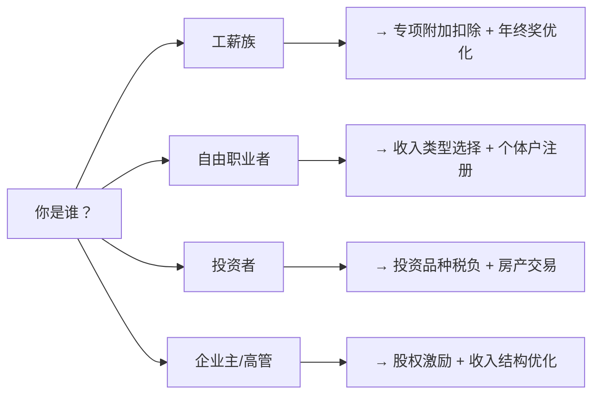
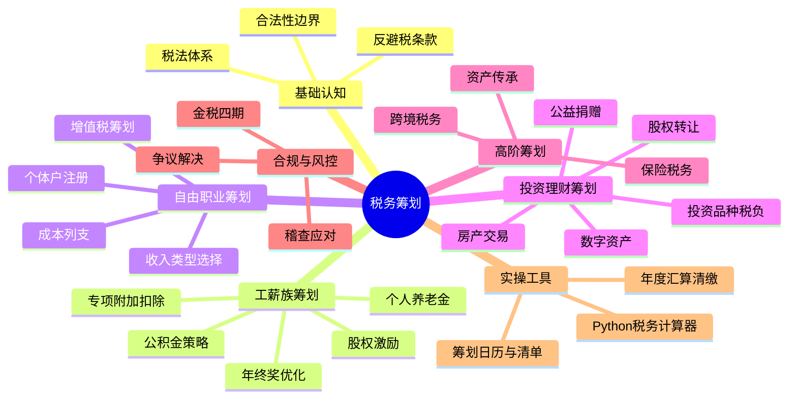
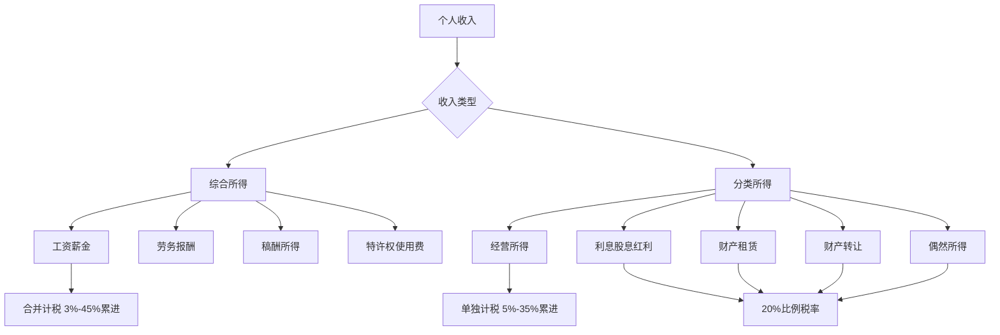
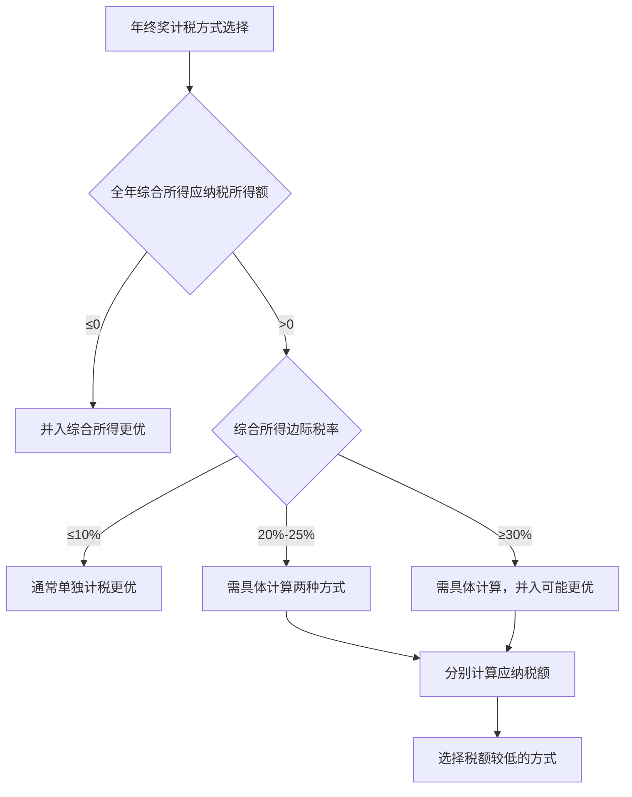
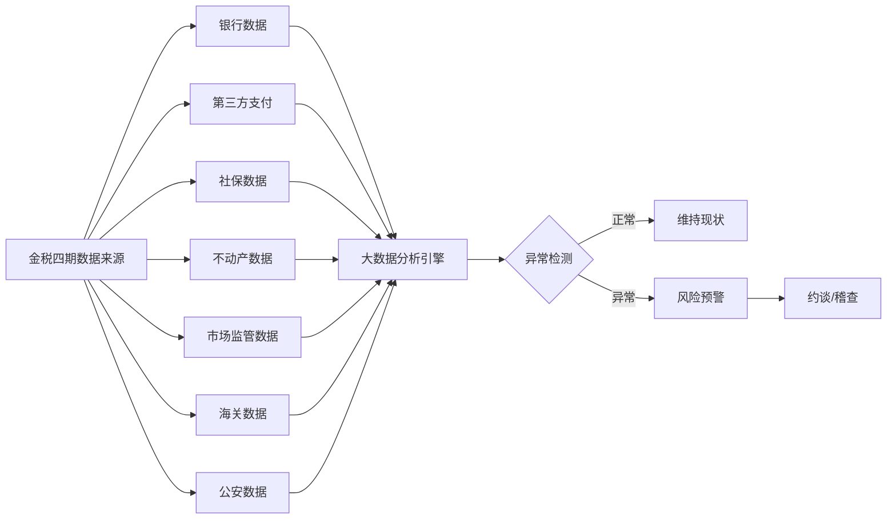
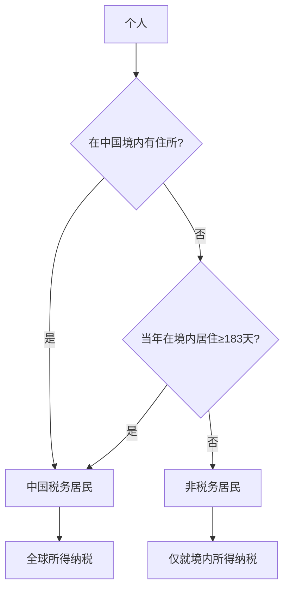

## 导读：为什么每个人都需要税务筹划

你每年交给国家的税，可能比你想象的多得多。一个月薪2万、在一线城市工作的年轻人，每年缴纳的个税、社保、公积金加起来可能超过6万元——其中相当一部分，是完全可以通过合法手段节省下来的。

税务筹划不是富人的专利。月薪8千的人如果用足专项附加扣除，可以实现零个税；月薪3万的白领通过优化年终奖分配，一年能省下数千元；年薪百万的高管通过合理配置收入结构，节税金额可以达到六位数。

本章将从税法原理出发，覆盖从工薪族到自由职业者、从国内收入到跨境资产的全方位税务筹划方案。每个策略都附带具体的计算示例和操作步骤，确保你可以直接落地执行。

**快速定位：你最需要哪部分？**



**本章知识地图：**



## 税务筹划的本质与边界

### 什么是税务筹划

税务筹划是指在法律允许的范围内，通过对经营、投资、理财等活动的事先安排和筹划，充分利用税法提供的优惠和差别待遇，减轻税负、递延纳税、降低税务风险的合法行为。

理解税务筹划，需要把握三个关键词：

1. **事先安排**：税务筹划必须在经济行为发生之前进行。事后补救不叫筹划，叫隐瞒。
2. **法律允许**：所有筹划手段都必须有明确的法律依据，不能依赖"灰色地带"。
3. **降低税负**：目标是合法地减少应纳税额或推迟纳税时间，而非不交税。

### 税务筹划、合理避税与偷税漏税的本质区别

很多人对税务筹划存在误解，将其与偷税漏税混为一谈。事实上，三者在合法性、时间性、手段和风险上有本质区别：

| 维度 | 税务筹划 | 偷税漏税 | 合理避税（灰色地带） |
|------|----------|----------|---------------------|
| 合法性 | 完全合法，利用税法空间 | 违法，故意隐瞒或虚假申报 | 形式合法但实质存疑 |
| 时间性 | 事前规划 | 事后隐瞒 | 事前安排但目的存疑 |
| 手段 | 利用优惠政策、调整结构 | 伪造凭证、隐匿收入 | 利用税法模糊地带 |
| 风险 | 零法律风险 | 补税+滞纳金+0.5-5倍罚款，严重者刑事责任 | 可能被纳税调整 |
| 可持续性 | 可长期执行 | 随时可能被稽查 | 政策收紧后失效 |
| 典型案例 | 用足专项附加扣除 | 私户收款不申报 | 在税收洼地注册空壳公司 |

**关键原则：** 税务筹划的核心是"四流合一"——合同流、资金流、发票流、业务流必须一致。任何脱离真实业务的所谓"筹划"都是偷逃税。税务机关在稽查时，会重点核查这四流是否匹配，不匹配的交易会被认定为虚假交易。

### 税务筹划的法律依据

税务筹划的合法性来源于以下法律原则：

- **税收法定原则：** 《立法法》规定税种的设立、税率的确定和税收征收管理等税收基本制度只能由法律规定。纳税人有权在法律规定的范围内选择对自己有利的纳税方式。这一原则是税务筹划的根本法律基础——法律没有禁止的，就是纳税人可以自由选择的。
- **实质课税原则：** 税务机关按照纳税人的实际经济活动性质征税，而非仅看形式。这意味着"伪筹划"会被穿透。如果你在税收洼地注册了一家公司，但所有业务都在另一个城市完成，税务机关会按实际经营地征税。
- **诚实信用原则：** 纳税人有权信赖税法的确定性，税务机关也应依法行政。如果税务机关之前认可了某种处理方式，不能事后突然改变口径要求补税（除非法律本身发生了变化）。
- **量能课税原则：** 税负应当与纳税人的负担能力相匹配。这一原则支撑了累进税率制度和各种扣除政策的设计逻辑。

### 一般反避税条款（GAAR）与你的关系

2018年修订的《个人所得税法》第八条引入了一般反避税条款，赋予税务机关对"不具有合理商业目的的安排"进行纳税调整的权力。触发条件包括：

1. 以减少、免除或者推迟缴纳税款为主要目的
2. 实施了不具有合理商业目的的安排
3. 该安排获得了税收利益

**对个人的直接影响：** 过去通过在"税收洼地"注册空壳公司、虚构业务转移收入等做法，现在面临被穿透调整的风险。2024年以来，海南、新疆、江西、重庆等地已大规模清理核定征收的空壳企业，大量个人被追缴税款和滞纳金。某知名主播通过在海南注册个人独资企业将劳务报酬转化为经营所得，被追缴税款及罚款合计超过13亿元。

**如何判断你的筹划是否会被穿透：**

```text
三个自检问题：
1. 如果没有税收优惠，我还会做这笔交易吗？
   → 如果答案是"不会"，大概率会被穿透

2. 这笔交易是否有真实的商业实质？
   → 没有实际办公场所、没有员工、没有真实业务流的公司 = 空壳

3. 我的安排是否可以向税务机关坦然说明？
   → 如果需要编造理由才能解释，说明有问题
```

## 中国个人所得税体系概览

### 税制结构全景图



### 综合所得税率表

中国个人所得税采用超额累进税率，综合所得（工资薪金、劳务报酬、稿酬、特许权使用费）适用以下税率：

| 级数 | 全年应纳税所得额 | 税率 | 速算扣除数 | 月度临界收入 |
|------|-----------------|------|-----------|-------------|
| 1 | 不超过36,000元 | 3% | 0 | 3,000元 |
| 2 | 36,000-144,000元 | 10% | 2,520 | 12,000元 |
| 3 | 144,000-300,000元 | 20% | 16,920 | 25,000元 |
| 4 | 300,000-420,000元 | 25% | 31,920 | 35,000元 |
| 5 | 420,000-660,000元 | 30% | 52,920 | 55,000元 |
| 6 | 660,000-960,000元 | 35% | 85,920 | 80,000元 |
| 7 | 超过960,000元 | 45% | 181,920 | 无上限 |

**应纳税所得额计算公式：**

```text
应纳税所得额 = 年收入总额 - 60,000元（基本减除） - 专项扣除 - 专项附加扣除 - 其他扣除

其中：
  专项扣除 = 基本养老保险 + 基本医疗保险 + 失业保险 + 住房公积金
  专项附加扣除 = 子女教育 + 继续教育 + 大病医疗 + 住房贷款利息 + 住房租金 + 赡养老人 + 婴幼儿照护
  其他扣除 = 企业年金 + 税优健康险 + 税延养老保险 + 个人养老金 + 公益捐赠等
```

**理解边际税率的概念：** 边际税率是指你最后一块钱收入适用的税率。月薪3万的人，边际税率可能是25%，但平均税率可能只有15%左右。税务筹划的核心目标之一就是降低边际税率或减少适用高税率的收入金额。

举个例子：月薪35,000元的张先生，扣除社保公积金8,000元和基本减除5,000元后，应纳税所得额为22,000元/月。他的边际税率是25%（因为22,000×12=264,000元落在20%档位，但再往上就到25%了）。如果他能通过专项附加扣除多扣除2,000元/月，边际税率可能降到20%，这2,000元的扣除就按25%的边际税率节税——每月省500元，每年省6,000元。

### 经营所得税率表

经营所得（个体工商户、个人独资企业、合伙企业）适用单独的累进税率：

| 级数 | 全年应纳税所得额 | 税率 | 速算扣除数 |
|------|-----------------|------|-----------|
| 1 | 不超过30,000元 | 5% | 0 |
| 2 | 30,000-90,000元 | 10% | 1,500 |
| 3 | 90,000-300,000元 | 20% | 10,500 |
| 4 | 300,000-500,000元 | 30% | 40,500 |
| 5 | 超过500,000元 | 35% | 65,500 |

经营所得的优势在于可以扣除成本、费用和损失，应纳税所得额 = 收入总额 - 成本 - 费用 - 损失。对于有真实经营成本的自由职业者，经营所得的实际税率往往远低于劳务报酬。

### 不同收入类型的税率差异

理解不同收入类型的税率差异是税务筹划的基础：

| 收入类型 | 税率 | 计税方式 | 筹划空间 | 常见场景 |
|----------|------|----------|----------|---------|
| 工资薪金 | 3%-45%累进 | 并入综合所得 | 中等 | 上班族固定收入 |
| 劳务报酬 | 20%-40%预扣，并入综合所得汇算 | 预扣率较高，汇算可能退税 | 较大 | 兼职、顾问、讲课 |
| 稿酬所得 | 20%预扣（减征30%），并入综合所得 | 实际税率较低（70%计入） | 中等 | 写作、出版、翻译 |
| 经营所得 | 5%-35%累进 | 单独计税 | 较大 | 个体户、个人独资企业 |
| 股息红利 | 20%（上市公司持股>1年免税） | 按次计税 | 较大 | 股票投资 |
| 财产转让 | 20% | 按次计税 | 较大 | 房产、股权、艺术品 |
| 财产租赁 | 20% | 按次/按月计税 | 中等 | 房屋出租 |
| 偶然所得 | 20% | 按次计税 | 极小 | 中奖、赠与 |

**关键洞察：** 稿酬所得有独特的税收优惠——先打七折再计入综合所得。这意味着100万元的稿酬收入，只有70万元计入应税收入。对于高收入的作家、翻译、自媒体人来说，将收入形式定性为稿酬而非劳务报酬，可以节省30%的税基。

## 专项附加扣除的深度运用

专项附加扣除是工薪族最直接、最合规的减税手段。根据税务局公布的数据，约有30%的纳税人存在漏报或错报的情况——这意味着每三个人中就有一个人在白白多交税。

### 七项专项附加扣除详解

#### 1. 子女教育

- **扣除标准：** 每个子女每月2,000元（2023年9月起由1,000元提高）
- **覆盖范围：** 学前教育（满3岁至小学前）+ 学历教育（小学至博士）+ 技工教育（取得学籍的技工院校）
- **分配方式：** 父母各扣50%，或一方扣100%，可以按年变更
- **起止时间：** 学前教育从满3岁当月开始，学历教育从入学当月开始，到学历教育结束当月停止

**筹划要点：** 谁的边际税率高谁扣100%。如果一方适用25%税率、另一方适用10%，每月2,000元扣除可多节税300元/月（3,600元/年）。多个子女可以不同分配方式——比如大宝由爸爸扣100%，二宝由妈妈各扣50%，根据具体税率计算最优组合。

**常见误区：**
- 孩子在国外上学也可以扣除，不受地域限制
- 休学期间暂停扣除，复学后重新开始
- 博士后不属于学历教育，不能扣除
- 民办学校和公立学校享受同样的扣除待遇

#### 2. 继续教育

- **学历继续教育：** 每月400元，最长48个月（同一学历）
- **职业资格继续教育：** 取得证书当年扣除3,600元（技能人员职业资格或专业技术人员职业资格）
- **筹划要点：** 如果正在读在职研究生或MBA，每月400元扣除不要漏报。职业资格证书（如CPA、CFA、一级建造师、法律职业资格）取证当年记得申报。注意：本科及以下的继续教育可以选择由父母扣除（子女教育和继续教育不重复）。

**哪些证书可以扣除？** 核心判断标准是是否列入《国家职业资格目录》。2024年版本的目录包括72项职业资格：

| 类别 | 典型证书举例 | 是否可扣除 |
|------|-------------|-----------|
| 专业技术人员 | 注册会计师、法律职业资格、医师、一级建造师、注册消防工程师、执业药师 | 是 |
| 技能人员 | 消防设施操作员、焊工、电工、车工 | 是 |
| 国际证书 | CFA、PMP、ACCA、FRM | 否（不在目录内） |
| 行业协会证书 | 各类行业协会自行颁发的能力证书 | 否 |
| 驾驶证 | C1、C2等 | 否 |

**实操提醒：** 在个人所得税APP中填报时，系统会要求填写证书编号和发证日期。建议在取得证书后立即申报，不要等到年度汇算时才想起来——如果忘记填报，可以在汇算时补报，但如果跨年了就只能通过更正申报来处理。

#### 3. 大病医疗

- **扣除限额：** 医保目录范围内个人自付累计超过15,000元的部分，最高80,000元/年
- **扣除主体：** 本人或配偶扣除，未成年子女由父母扣除
- **扣除时点：** 只能在汇算清缴时扣除（平时预扣不能扣）

**家庭优化策略：** 如果夫妻双方都有医疗费用，可以灵活分配。例如丈夫自付4万、妻子自付3万，各自计算门槛各扣15,000元，可扣除总额=(40,000-15,000)+(30,000-15,000)=40,000元。也可以选择由一方扣除全部（但只能扣除该方和未成年子女的医疗费用），需比较哪种方式总扣除额更大。

**哪些费用可以计入：**
- 医保目录范围内的药品费用（甲类全算，乙类算自付部分）
- 医保目录范围内的诊疗项目费用
- 医保目录范围内的医疗服务设施费用
- 异地就医的自付部分

**哪些费用不能计入：**
- 医保目录范围外的自费药和自费项目
- 美容整形、体检、保健类费用
- 非医保定点机构的费用（急诊除外）
- 已由商业保险报销的部分

**查询方式：** 登录国家医保服务平台APP（https://fuwu.nhsa.gov.cn），在"个人消费明细"中可以查询全年的医疗费用明细，包括总费用、医保报销金额和个人自付金额。

#### 4. 住房贷款利息

- **扣除标准：** 每月1,000元
- **扣除期限：** 最长240个月（20年）
- **适用条件：** 首套住房贷款（以银行认定为准，认贷不认房）
- **扣除主体：** 约定由一方扣除，不可双方各扣50%

**关键判断标准——什么是"首套房贷"：**

```text
首套房贷的认定以银行的贷款合同为准，不是以房产登记为准。
具体判断方法：
1. 查看贷款合同中是否有"首套住房贷款"的表述
2. 或者拨打贷款银行客服确认
3. 或者在个人所得税APP中尝试填报，系统会提示是否符合

注意：公积金贷款和商业贷款组合也算首套房贷
     只要贷款合同认定为首套，即使现在名下有多套房也享受扣除
```

**筹划要点：**
- 夫妻婚前各自有首套房贷，婚后只能选一套由一方扣除100%
- 如果有公积金贷款和商贷组合，仍按每月1,000元扣除（不叠加）
- 如果首套房贷已还清但仍有其他房贷，不能重复享受
- 提前还贷后，扣除在还清贷款当月停止
- 如果是夫妻共同贷款，可以协商由收入较高的一方扣除

#### 5. 住房租金

- **扣除标准：**

| 城市类型 | 月扣除额 | 典型城市 |
|----------|---------|---------|
| 直辖市/省会/计划单列市 | 1,500元 | 北京、上海、广州、深圳、天津、重庆、成都、杭州、南京、武汉等 |
| 人口>100万的城市 | 1,100元 | 东莞、佛山、无锡、常州、温州、珠海等 |
| 其他城市 | 800元 | 人口≤100万的地级市和县级市 |

- **适用条件：** 本人及配偶在主要工作城市无自有住房
- **重要限制：** 住房贷款利息和住房租金不能同时享受

**如何选择房贷利息 vs 住房租金：**

```text
决策树：
你在主要工作城市有首套房贷吗？
├── 有 → 房贷利息扣除（1,000元/月）
│   └── 但如果你同时在另一个城市租房工作
│       └── 比较：房贷1,000 vs 租房城市对应的扣除额
│           └── 选高的那个
└── 没有 → 你在工作城市租房吗？
    ├── 是 → 租金扣除（800-1,500元/月，看城市）
    └── 否 → 两项都不能享受
```

**注意事项：**
- 夫妻双方主要工作城市相同，只能由一方扣除租金
- 夫妻双方主要工作城市不同，可以各自扣除各自城市的租金
- 合租情况下，各自可以按标准扣除（不需要按比例分摊）
- 如果房东不配合提供房屋信息，可以填写房东的姓名和身份证号（部分城市不要求）

#### 6. 赡养老人

- **扣除标准：** 独生子女每月3,000元（2023年9月起由2,000元提高）；非独生子女分摊每月3,000元（每人不超过1,500元）
- **适用条件：** 被赡养人年满60周岁（含祖父母、外祖父母）
- **起算时间：** 被赡养人中有一位年满60岁当月即可享受

**非独生子女的分摊策略：**

| 分摊方式 | 说明 | 适用场景 |
|----------|------|---------|
| 均摊 | 每人3,000÷N元 | 收入相近的兄弟姐妹 |
| 约定分摊 | 自行约定比例，每人不超过1,500元 | 收入差距较大 |
| 指定分摊 | 由被赡养人指定分配比例 | 赡养义务不均等 |

**筹划要点：**
- 非独生子女家庭，应由收入最高的子女多分摊（最高1,500元/月）
- 分摊方式必须签订书面协议备查（口头约定不被认可）
- 即使实际未支付赡养费，只要父母年满60岁即可享受扣除
- 被赡养人是否有退休金不影响扣除资格
- 一个纳税年度内分摊方式不能变更
- 被赡养人去世当年仍可享受扣除，次年停止

**书面协议模板：**

```text
赡养老人专项附加扣除分摊协议

被赡养人：张三（父亲），身份证号：XXXXXXXXXXXX
         李四（母亲），身份证号：XXXXXXXXXXXX

赡养人：
  张大（长子），身份证号：XXXXXXXXXXXX，分摊比例：60%（1,800元/月）
  张二（次子），身份证号：XXXXXXXXXXXX，分摊比例：40%（1,200元/月）

分摊方式：约定分摊
生效时间：2025年1月起
本协议自签订之日起生效，一个纳税年度内不得变更。

赡养人签字：
张大：__________  日期：__________
张二：__________  日期：__________
```

#### 7. 3岁以下婴幼儿照护

- **扣除标准：** 每个婴幼儿每月2,000元（2023年9月起由1,000元提高）
- **分配方式：** 与子女教育相同，可选一方100%或各50%
- **起算时间：** 从出生当月即可开始扣除
- **截止时间：** 满3岁当月，之后自动转入子女教育扣除

**筹划要点：** 有婴幼儿的家庭务必申报，从出生当月即可开始扣除。多个婴幼儿可以不同分配方式，根据父母税率差计算最优方案。满3岁后自动转入子女教育扣除，无需重新申报。

**特殊情形处理：**
- 非婚生子女同样享受扣除，由实际抚养方扣除
- 离异家庭由实际抚养方扣除，或双方约定
- 收养子女从收养登记当月起享受扣除
- 境外出生的婴幼儿，凭出生证明享受扣除

### 七项扣除最大节税额汇总

| 扣除项目 | 最高月扣除额 | 最高年扣除额 | 适用最高税率（45%）时最大年节税 |
|----------|-------------|-------------|-------------------------------|
| 子女教育 | 2,000元/子女 | 24,000元/子女 | 10,800元/子女 |
| 继续教育 | 400元 | 4,800元 | 2,160元 |
| 大病医疗 | — | 80,000元 | 36,000元 |
| 住房贷款利息 | 1,000元 | 12,000元 | 5,400元 |
| 住房租金 | 1,500元 | 18,000元 | 8,100元 |
| 赡养老人 | 3,000元 | 36,000元 | 16,200元 |
| 婴幼儿照护 | 2,000元/婴幼儿 | 24,000元/婴幼儿 | 10,800元/婴幼儿 |

**一个典型家庭的最大扣除：** 假设夫妻双方均有工作，2个子女（一个3岁以下、一个上小学），双方父母均满60岁，有首套房贷，加上个人养老金，每月可扣除金额 = 婴幼儿2,000 + 子女教育2,000 + 赡养老人3,000 + 房贷1,000 + 个人养老金1,000 = 9,000元/月，年扣除108,000元。如果边际税率25%，年节税27,000元。

### 专项附加扣除家庭优化实战

以下是一个典型的双职工家庭优化案例：

```text
场景：张先生月薪35,000元（边际税率25%），太太月薪12,000元（边际税率10%）
家庭情况：1个上小学的孩子（6岁），双方父母均满60岁（均为独生子女），首套房贷

优化前（平均分配）：
  子女教育：各扣1,000元
  赡养老人：各扣1,500元
  房贷利息：一方扣1,000元
  张先生月扣除：1,000 + 1,500 + 1,000 = 3,500元
  太太月扣除：1,000 + 1,500 = 2,500元

优化后（集中到高税率方）：
  子女教育：张先生扣2,000元（100%）
  赡养老人：张先生扣3,000元（100%）
  房贷利息：张先生扣1,000元
  张先生月扣除：2,000 + 3,000 + 1,000 = 6,000元
  太太月扣除：0元

节税差异计算：
  张先生多扣：(6,000 - 3,500) × 25% × 12 = 7,500元/年
  太太少扣：2,500 × 10% × 12 = 3,000元/年
  净节税：7,500 - 3,000 = 4,500元/年

如果再考虑3岁以下婴幼儿（假设二宝出生）：
  二宝照护：张先生扣2,000元
  额外节税：2,000 × (25%-10%) × 12 = 3,600元/年
  
  全家年节税合计：8,100元
```

**操作方法：** 每年12月在个人所得税APP中修改扣除比例，次年1月生效。夫妻双方需要协商一致并保存书面协议（非独生子女赡养老人必须）。

**进阶优化——考虑社保公积金差异：** 实际操作中，张先生和太太的社保公积金缴纳基数不同，也会影响最优分配。如果太太的社保公积金扣除比例较高（比如12%公积金），她的应纳税所得额本身就不高，可能已经接近3%的税率档。此时将扣除项集中在张先生一方的效果更明显。

## 年终奖的税务筹划

### 全年一次性奖金的计税方式

年终奖可以选择单独计税或并入综合所得计税。选择错误可能导致多缴数千甚至数万元税款。该政策延续至2027年12月31日。

**单独计税公式：**

```text
应纳税额 = 年终奖 × 适用税率 - 速算扣除数
其中：适用税率 = 按年终奖÷12确定的月度税率表对应的税率
```

年终奖单独计税适用的月度税率表：

| 月度应纳税所得额（年终奖÷12） | 税率 | 速算扣除数 |
|-------------------------------|------|-----------|
| 不超过3,000元 | 3% | 0 |
| 3,000-12,000元 | 10% | 210 |
| 12,000-25,000元 | 20% | 1,410 |
| 25,000-35,000元 | 25% | 2,660 |
| 35,000-55,000元 | 30% | 4,410 |
| 55,000-80,000元 | 35% | 7,160 |
| 超过80,000元 | 45% | 15,160 |

**并入综合所得：** 年终奖全额加入当年综合所得，按照综合所得税率表计税。

### 年终奖的"陷阱区间"

年终奖存在6个"雷区"，多发1元可能导致到手金额反而减少：

| 雷区范围 | 多缴税额上限 | 税率跳档 | 到手最少的金额 |
|----------|-------------|---------|---------------|
| 36,001-38,567元 | 2,309元 | 3%→10% | 36,001元（到手32,611元） |
| 144,001-160,500元 | 13,199元 | 10%→20% | 144,001元（到手116,611元） |
| 300,001-318,334元 | 13,749元 | 20%→25% | 300,001元（到手227,661元） |
| 420,001-447,500元 | 19,249元 | 25%→30% | 420,001元（到手298,411元） |
| 660,001-706,539元 | 30,249元 | 30%→35% | 660,001元（到手436,161元） |
| 960,001-1,120,000元 | 87,999元 | 35%→45% | 960,001元（到手543,161元） |

**具体计算示例（36,000 vs 36,001）：**

```text
年终奖36,000元：36,000 ÷ 12 = 3,000 → 适用3%
  应纳税额 = 36,000 × 3% = 1,080元
  税后收入 = 34,920元

年终奖36,001元：36,001 ÷ 12 = 3,000.08 → 适用10%，速算扣除数210
  应纳税额 = 36,001 × 10% - 210 = 3,390.10元
  税后收入 = 32,610.90元

多发1元，少拿2,309.10元。
```

**应对策略：** 如果年终奖金额落在雷区内，应将超出部分并入工资发放，或将年终奖控制在雷区下限。例如年终奖预计37,000元，应协商发放36,000元，剩余1,000元并入月薪发放——这1,000元在月薪中适用的税率通常低于年终奖跳档后的税率。

### 单独计税 vs 并入综合所得的选择



**快速判断规则：**
- 如果综合所得应纳税所得额≤0（扣除项超过收入），年终奖并入综合所得更优——可以用负的应纳税所得额抵消年终奖的税基
- 如果综合所得边际税率≤10%，单独计税通常更优
- 如果综合所得边际税率≥30%，需要认真比较——并入综合所得可能让一部分收入从高税率退回低税率
- 如果年终奖金额刚好在雷区边界，两种方式都算一遍

**实操建议：** 每年12月，HR通常会让员工选择年终奖计税方式。务必两种方式都算一遍，不要凭感觉选。可以使用个人所得税APP的"综合所得年度汇算"功能模拟计算，或使用国家税务总局12366网站的个税计算器。

### 年终奖的高级筹划技巧

**技巧一：拆分年终奖**

如果公司允许，可以将年终奖拆成两部分发放——一部分单独计税，一部分并入综合所得。但注意：全年一次性奖金在一个纳税年度内只能使用一次单独计税政策。

```text
场景：年薪60万，其中年终奖20万，月薪约33,333元

方案A：年终奖20万单独计税
  年终奖税额 = 200,000 × 20% - 1,410 = 38,590元
  月薪应税所得 = 33,333 - 5,000 - 8,000 = 20,333元/月
  年应税所得 = 20,333 × 12 = 约244,000元（适用20%档）
  月薪税额 = 244,000 × 20% - 16,920 = 31,880元
  总税额 = 38,590 + 31,880 = 70,470元

方案B：年终奖并入综合所得
  综合所得 = 600,000 - 60,000 - 96,000 = 444,000元
  总税额 = 444,000 × 25% - 31,920 = 79,080元

方案A省税：79,080 - 70,470 = 8,610元
```

**技巧二：利用年终奖调节边际税率**

如果你的综合所得刚好卡在税率跳档的临界点，可以通过调整年终奖金额来优化。例如综合所得应纳税所得额305,000元，其中5,000元落在25%档位。如果将这5,000元改为通过年终奖发放（年终奖控制在36,000元以内，适用3%税率），可以节省大量税款。

**技巧三：跨年发放的时机选择**

如果公司财年和自然年不一致，可以协商年终奖的发放时间。例如12月的年终奖改为次年1月发放，可能让你的综合所得在两年间更均匀分布，避免某一年适用过高的税率。

## 收入结构的税务优化

### 工资与年终奖的比例优化

对于年薪固定的员工，工资与年终奖的分配比例直接影响总税负。最优分配的核心原则是：让工资和年终奖分别适用尽可能低的税率，同时避开雷区。

**最优分配方案参考（假设无其他扣除项，仅基本减除6万）：**

| 年薪 | 推荐年终奖 | 推荐月薪(税前) | 比全发工资年省税 |
|------|-----------|---------------|----------------|
| 15万 | 0（全发工资） | 12,500元/月 | — |
| 20万 | 14,400元 | 15,467元/月 | 约2,400元 |
| 30万 | 36,000元 | 22,000元/月 | 约4,800元 |
| 50万 | 36,000元或144,000元 | 需具体计算 | 约8,000-12,000元 |
| 80万 | 144,000元 | 54,667元/月 | 约18,000-25,000元 |
| 100万 | 144,000元或300,000元 | 需具体计算 | 约20,000-35,000元 |

**注意：** 以上为估算值，实际最优比例因个人专项扣除、社保基数、公积金比例等因素而异。建议用税务计算器精确测算——在个人所得税APP中分别输入两种方案的收入数据，查看汇算结果。

### 月薪制与年薪制的税负差异

同一笔年薪总额，以"高月薪+低年终"还是"低月薪+高年终"发放，税负可能截然不同。理解这一差异对于与HR协商薪酬结构至关重要：

```text
案例对比：年薪50万元，专项附加扣除合计3,000元/月，社保公积金8,000元/月

方案A：月薪30,000 + 年终奖140,000
  月薪应税所得 = 30,000 - 5,000 - 8,000 - 3,000 = 14,000元/月
  年应税所得 = 14,000 × 12 = 168,000元（适用20%档）
  月薪年税 = 168,000 × 20% - 16,920 = 16,680元
  年终奖税 = 140,000 ÷ 12 = 11,667 → 适用10%档
  年终奖税 = 140,000 × 10% - 210 = 13,790元
  总税 = 16,680 + 13,790 = 30,470元

方案B：月薪25,000 + 年终奖200,000
  月薪应税所得 = 25,000 - 5,000 - 8,000 - 3,000 = 9,000元/月
  年应税所得 = 9,000 × 12 = 108,000元（适用10%档）
  月薪年税 = 108,000 × 10% - 2,520 = 8,280元
  年终奖税 = 200,000 × 20% - 1,410 = 38,590元
  总税 = 8,280 + 38,590 = 46,870元

方案C：月薪35,000 + 年终奖80,000
  月薪应税所得 = 35,000 - 5,000 - 8,000 - 3,000 = 19,000元/月
  年应税所得 = 19,000 × 12 = 228,000元（适用20%档）
  月薪年税 = 228,000 × 20% - 16,920 = 28,680元
  年终奖税 = 80,000 × 10% - 210 = 7,790元
  总税 = 28,680 + 7,790 = 36,470元

结论：方案A（月薪30K+年终14万）最优，比方案B省16,400元。
关键在于避免年终奖落入高税率档（200,000÷12≈16,667，跳入20%档）。
```

### 劳务报酬转化为经营所得

对于自由职业者和兼职人员，劳务报酬的预扣率（20%-40%）远高于最终税负，但现金流压力大。如果业务量较大，注册个体工商户或个人独资企业，将收入转化为经营所得，可以享受更低的税率和更多的扣除。

**适用条件：**
- 年劳务收入超过10万元
- 业务相对稳定，有持续的客户来源
- 能够取得合规的成本发票
- 有真实的经营场所或办公地址

**筹划方案对比（年收入50万元）：**

| 方案 | 应纳税额 | 综合税率 | 适用场景 |
|------|---------|---------|---------|
| 纯劳务报酬 | 约106,000元（汇算后） | 21.2% | 偶尔兼职，收入不稳定 |
| 个体工商户（查账征收） | 约55,000-70,000元 | 11%-14% | 有合理成本支出（办公、设备、交通等） |
| 个体工商户（核定征收） | 约15,000-25,000元 | 3%-5% | 部分地区仍有政策（逐年收紧） |

**注册个体户的完整操作流程：**

```text
第一步：工商注册（1-3个工作日）
  - 登录当地市场监管局线上平台（如深圳 amr.sz.gov.cn）
  - 选择"个体工商户设立登记"
  - 经营范围根据实际业务填写（如"平面设计服务""技术咨询服务"）
  - 经营场所可以是自有住宅（需提供产权证明或租赁合同）
  - 名称格式：地区+字号+行业+组织形式（如"深圳市XX设计工作室"）

第二步：税务登记（自动完成）
  - 注册完成后自动完成税务登记
  - 选择小规模纳税人身份
  - 申请核定征收（年收入500万以下可申请，各地政策不同）

第三步：银行开户（1-2个工作日）
  - 开立对公账户或使用个人账户（个体户可用个人账户收款，但建议对公）
  - 推荐选择与个人常用银行不同的银行，便于财务隔离

第四步：开票管理
  - 申请增值税普通发票（电子发票）
  - 季度收入30万以内免征增值税（2024年政策）
  - 超过30万按1%征收增值税（小规模纳税人优惠税率）
  - 可通过电子税务局自行开具或代开

第五步：记账报税（持续进行）
  - 每季度申报经营所得个人所得税
  - 保留完整的业务合同、发票、银行流水
  - 年度终了后3月31日前完成经营所得汇算清缴
  - 建议使用记账软件（如"账无忧""慧算账"）简化记账流程
```

**成本列支清单（个体户可扣除的常见成本）：**

| 成本类型 | 具体项目 | 所需凭证 |
|----------|---------|---------|
| 办公费用 | 房租、水电、物业、网络 | 发票、合同 |
| 设备购置 | 电脑、打印机、办公家具 | 发票（5000以下一次扣除，以上按年折旧） |
| 交通费用 | 差旅费、市内交通 | 发票、行程单 |
| 通讯费用 | 手机话费、宽带费 | 发票 |
| 软件费用 | 各类SaaS订阅、软件购买 | 发票 |
| 外包费用 | 将部分工作外包给其他个人或公司 | 合同+发票 |
| 人力成本 | 雇佣员工的工资 | 工资表+社保缴纳凭证 |
| 培训费用 | 业务相关的培训和学习 | 发票 |

**重要提醒：** 2024年以来，多地收紧了核定征收政策，尤其是通过"税收洼地"注册空壳公司的做法已被严格监管。筹划必须基于真实业务，不能虚构交易。个体户需要保留完整的业务合同、发票和资金流水。

### 副业与自由职业收入的税务处理

随着远程办公和零工经济的发展，越来越多人有副业收入。不同形式的副业，税务处理差异很大：

| 副业形式 | 收入类型 | 税率 | 处理方式 |
|----------|---------|------|---------|
| 平台接单（设计/翻译/编程） | 劳务报酬 | 预扣20%-40%，汇算3%-45% | 平台代扣，年度汇算退税 |
| 自媒体广告收入 | 劳务报酬或经营所得 | 同上 | 个人按劳务报酬，个体户按经营所得 |
| 知识付费（课程/咨询） | 劳务报酬 | 同上 | 平台代扣或自行申报 |
| 房屋出租 | 财产租赁所得 | 20%（减除费用后） | 按月/按次申报，个人出租住房减按10% |
| 二手闲置出售 | 财产转让所得 | 20%（差额） | 个人自用闲置出售通常无需缴税 |
| 直播打赏 | 劳务报酬 | 预扣20%-40% | 平台代扣 |
| 网约车/外卖 | 经营所得 | 5%-35% | 平台代征或自行申报 |

**自媒体从业者的筹划建议：**

1. **年收入低于10万元：** 继续按劳务报酬纳税，汇算时大概率退税，无需注册个体户
2. **年收入10-50万元：** 考虑注册个体户，将收入转为经营所得，享受更低税率
3. **年收入50万元以上：** 强烈建议注册个体户或公司，可以列支办公设备、软件订阅、差旅费等成本
4. **多平台收入务必汇算：** 各平台分别预扣，但年度汇算时合并计算。如果只在一个平台申报，可能被大数据比对发现遗漏

**劳务报酬预扣 vs 汇算的退税机制：**

```text
劳务报酬预扣税率表：
  每次收入不超过4,000元：（收入-800）× 20%
  每次收入4,000-25,000元：收入 ×（1-20%）× 20%
  每次收入25,000-62,500元：收入 ×（1-20%）× 30% - 2,000
  每次收入超过62,500元：收入 ×（1-20%）× 40% - 7,000

汇算时并入综合所得，按3%-45%累进税率计算。
预扣多交的部分会退还。

示例：自由翻译月收入15,000元
  预扣税：15,000 ×（1-20%）× 20% = 2,400元/月
  全年预扣：28,800元
  汇算时：年收入180,000 - 基本减除60,000 = 120,000元
  应纳税：120,000 × 10% - 2,520 = 9,480元
  退税：28,800 - 9,480 = 19,320元
```

### 增值税的税务筹划（个体户/小规模纳税人）

对于注册了个体工商户的自由职业者和小微企业主，增值税是日常面对的主要税种之一。合理筹划增值税可以直接影响到手收入：

**小规模纳税人增值税优惠政策（2024-2027年）：**

| 条件 | 税率 | 政策依据 |
|------|------|----------|
| 季度销售额≤30万元（月≤10万） | 免征 | 财政部2023年第1号公告 |
| 季度销售额>30万元 | 1%征收率 | 小规模纳税人优惠（原3%降至1%） |
| 适用3%预缴的项目 | 1%预缴率 | 同上 |

**筹划要点：**

1. **控制季度开票节奏：** 如果年收入接近120万元（30万×4个季度），可以通过控制每个季度的开票金额来享受免税。例如客户付款可以协商跨季度开票，将单季度收入控制在30万元以内。但注意：纳税义务发生时间以实际收款或合同约定为准，不能人为推迟确认。

2. **充分利用免税额度：** 如果夫妻双方分别注册个体户，每家每季度各有30万元免税额度，合计年免税额度240万元。

3. **进项税抵扣（一般纳税人）：** 当年收入超过500万元或主动申请成为一般纳税人后，可以抵扣进项税。适合有大量采购成本的个体户（如贸易类）。

4. **附加税的连带效应：** 增值税附带城建税（7%/5%/1%）、教育费附加（3%）、地方教育附加（2%），小规模纳税人可享受减半征收。增值税免征时附加税也免征，因此控制好增值税等于同时降低了附加税。

**增值税vs不开票的常见误区：**

```text
误区：客户不要发票就可以不申报

正解：
- 纳税义务与是否开票无关，与是否产生收入有关
- 未开票收入也需要申报增值税
- 金税四期可通过银行流水比对发现未申报收入
- 正确做法：所有收入如实申报，季度≤30万的部分享受免税

误区：注册多个个体户分散收入可以多享受免税额度

正解：
- 同一经营者名下的多个个体户，销售额合并计算
- 利用家庭成员名义注册需有真实业务支撑
- 空壳分拆会被认定为避税行为
```

### 公积金与补充公积金的运用

住房公积金是少数几个可以税前扣除且实际归个人所有的项目，相当于"强制储蓄+税收优惠"的双重好处：

- **法定公积金：** 单位和个人各缴5%-12%，税前扣除
- **补充公积金：** 单位可额外缴纳（不超过当地上限），个人部分税前扣除
- **筹划要点：** 如果公司允许选择公积金缴纳比例，选择12%（最高比例）可以最大化税前扣除

**详细对比（月薪30,000元，公积金比例选择）：**

```text
方案A（5%公积金）：
  公积金个人缴纳：1,500元/月
  应纳税所得额减少：1,500元/月
  年节税：1,500 × 25% × 12 = 4,500元
  公积金年入账（含单位）：1,500 × 2 × 12 = 36,000元

方案B（12%公积金）：
  公积金个人缴纳：3,600元/月
  应纳税所得额减少：3,600元/月
  年节税：3,600 × 25% × 12 = 10,800元
  公积金年入账（含单位）：3,600 × 2 × 12 = 86,400元

差异：多缴公积金2,100元/月，多节税6,300元/年，多入账公积金50,400元/年
```

**注意：** 公积金并非越多越好。如果短期内不需要购房或大额支出，大量资金被锁定在公积金账户中（利率仅1.5%左右），机会成本较高。需要根据个人资金需求权衡。

**公积金提取的常见场景：**

| 提取条件 | 提取额度 | 所需材料 |
|----------|---------|---------|
| 购买自住住房 | 全额或部分 | 购房合同、发票 |
| 偿还房贷 | 每年可提取一次 | 贷款合同、还款记录 |
| 租房 | 每月最高提取限额（各地不同） | 无房证明、租赁合同 |
| 装修 | 有地区限制 | 装修合同 |
| 大病医疗 | 超过自付上限部分 | 医疗费用票据 |
| 离职/退休 | 全额 | 离职证明/退休证明 |

## 投资理财的税务筹划

### 不同投资品的税负对比

投资收益的税务处理差异巨大，合理选择投资品种可以显著降低税负：

| 投资品种 | 税种 | 税率 | 筹划空间 | 推荐策略 |
|----------|------|------|----------|---------|
| 银行存款利息 | 暂免征收 | 0% | 无需筹划 | 安全但收益低 |
| 国债利息 | 免税 | 0% | 优先配置 | 税后收益最高的固收产品 |
| 地方政府债券利息 | 免税 | 0% | 优先配置 | 与国债同享免税待遇 |
| 股票转让差价 | 暂免征收（境内个人） | 0% | 无需筹划 | A股交易免税优势明显 |
| 股票股息 | 持股>1年免税，1月-1年10%，<1月20% | 0%-20% | 长期持有 | 高股息股适合长期持有 |
| 基金分红 | 免税（公募基金） | 0% | 无需筹划 | 红利基金有税务优势 |
| 基金转让差价 | 暂免征收（境内个人） | 0% | 无需筹划 | 与股票相同 |
| 房产转让 | 个税+增值税+附加税 | 综合约5%-20% | 满五唯一免个税 | 交易前规划持有时间 |
| 理财产品收益 | 增值税（非保本免征） | 0%-6% | 选择非保本产品 | 净值型理财通常免增值税 |
| 债券利息 | 国债免税，其他20% | 0%-20% | 优先国债和地方债 | 企业债需注意税后收益 |
| 信托收益 | 无统一规定 | 争议中 | 保持合规记录 | 咨询专业税务顾问 |
| 黄金实物 | 暂免征收 | 0% | 长期持有 | 实物黄金无持有税 |
| 黄金T+D | 增值税（个人暂免） | 0% | 无需筹划 | 账面交易暂免 |

**核心原则：** 计算投资回报时，应该比较税后收益率而非税前收益率。例如国债利率2.5%（免税）vs 企业债利率3.5%（扣20%税后实际2.8%），两者税后收益差距远小于表面差距。

**投资组合的税务效率优化：**

```text
高税务效率（优先配置在普通账户）：
  国债、地方政府债 → 利息免税
  A股长期持有（>1年） → 股息免税+转让差价免税
  公募基金 → 分红免税+转让差价免税

低税务效率（适合配置在免税账户如个人养老金）：
  企业债 → 利息需缴20%税
  银行理财（保本型） → 可能需缴增值税
  信托产品 → 税务定性不明确
```

### 房产交易的税务筹划

房产交易涉及的税种多、金额大，是个人税务筹划的重点领域。一套300万的房产交易，税费差异可能达到数十万元。

**卖方主要税费：**

| 税种 | 条件 | 税率/金额 | 备注 |
|------|------|----------|------|
| 增值税 | 满2年免征（普通住宅） | 不满2年：5%（全额） | 北上广深非普通住宅满2年按差额 |
| 个人所得税 | 满5年且唯一免征 | 差额20%或全额1%-2% | 各地政策有差异 |
| 附加税 | 随增值税 | 增值税的12% | 城建7%+教育3%+地方教育2% |
| 土地增值税 | 个人住宅暂免 | 0% | 商业地产需缴纳 |

**买方主要税费：**

| 税种 | 条件 | 税率/金额 |
|------|------|----------|
| 契税 | 首套90㎡以下 | 1% |
| 契税 | 首套90㎡以上 | 1.5% |
| 契税 | 二套 | 1%-2%（各地不同） |
| 契税 | 三套及以上 | 3% |

**核心筹划策略：**

1. **满五唯一优先：** 如果名下有多套房产，出售时优先卖满足"满五唯一"条件的，可免个税。如果差额较大（如原值100万，售价300万），免个税可节省40万元。

2. **合理确定原值：** 个税可按差额20%或全额1%-2%缴纳。如果原值较高（如购入价高、装修费用有合规凭证），差额20%可能更划算；如果原值很低（如继承所得），全额1%可能更省。

3. **赠与与继承的选择：** 直系亲属间赠与免征个税和增值税，但受赠人再出售时需按差额20%缴个税（原值通常按赠与人原始购入价计算）。继承的房产再出售时，原值可按被继承人购入时的价格计算，持有时间也可连续计算。

4. **交易时间规划：** 如果房产即将满2年或满5年，可以等满期后再交易，节省大笔税费。签订合同时约定较长的过户时间。

5. **装修费用抵扣：** 出售房产时，装修费用可以作为原值的组成部分抵扣个税（需提供合规的装修发票）。如果装修花费20万且有发票，可以减少20万的应税差额，按20%税率计算可节税4万。

6. **换房退税政策（2024年延续）：** 纳税人出售自有住房后1年内重新购买住房的，已缴纳的个人所得税可予以退税。退税金额=新购住房金额÷出售住房金额×已缴个税。如果新购房金额≥出售金额，全额退税；如果新购房金额<出售金额，按比例退税。这一政策对"卖旧买新"的换房族非常重要——一套300万的房产如果需缴个税30万，换购后可以全额退回。

7. **法拍房的税务陷阱：** 法拍房价格通常低于市场价，但买方可能需要承担本应由卖方缴纳的税费（增值税、个税等），这在拍卖公告中通常会注明。购买前务必计算全部税费成本，法拍房的"捡漏"可能因税费而大打折扣。

**房产赠与 vs 继承 vs 买卖的税费对比（以一套购入价100万、现值300万的房产为例）：**

```text
方式一：赠与（父母→子女）
  赠与时：契税3%（9万）+ 印花税0.05%（0.15万）= 约9.15万
  子女再出售时：差额20%个税 = (300-100)×20% = 40万
  合计税负：约49.15万

方式二：继承（父母去世后）
  继承时：契税免征（法定继承人）+ 印花税0.05%（0.15万）= 约0.15万
  子女再出售时：差额20%个税 = (300-100)×20% = 40万
  合计税负：约40.15万

方式三：买卖（按正常交易）
  买方契税1.5%（4.5万）+ 卖方增值税（满2年免）+ 个税差额20%（40万）
  合计税负：约44.5万

结论：如果不考虑出售，继承成本最低。
如果子女获得后要出售，三种方式的总税负差异不大，但继承在获得环节成本最低。

特殊情形：如果子女取得后自住满5年再出售（满五唯一）
  继承方式下：0.15万 + 0（免个税）= 0.15万
  这是最优方案——继承+满五唯一出售，总税负仅0.15万
```

### 股权投资的税务筹划

**个人转让股权的计税：**

```text
应纳税额 =（转让收入 - 股权原值 - 合理费用）× 20%
```

**常见筹划手段：**

1. **先分红再转让：** 被投资企业先将未分配利润分红（居民企业间股息免税），降低净资产，从而降低股权转让的合理价格。例如公司净资产500万（含未分配利润200万），先分红200万，股权转让价格可相应降低，节税40万。

2. **合理确定转让价格：** 转让价格不得明显偏低且无正当理由，税务机关有权按净资产份额核定。建议以最近一期审计报告的净资产为基准定价。如果企业有无形资产（品牌、专利等），可以进行评估增值后再转让。

3. **分期收款：** 签订分期付款合同，将税负分摊到多个纳税年度，降低单年应税金额。但注意：分期收款需要在合同中明确约定，并在约定的收款时间确认收入。

4. **股权激励的递延纳税：** 符合条件的非上市公司股权激励，可在取得股权时暂不纳税，递延至转让时按20%税率缴纳（需满足特定条件：公司属于境内居民企业、激励计划经董事会或股东会通过、激励对象为公司技术骨干和高级管理人员、持有期限不少于3年）。

5. **利用税收优惠区域：** 部分地区对股权转让有税收返还政策（如某些高新区），但需注意GAAR条款的穿透风险，必须有真实经营。

### 股权激励的税务处理（期权/RSU/限制性股票）

对于在上市公司或拟上市公司工作的员工，股权激励（股票期权、限制性股票、RSU）是薪酬的重要组成部分。其税务处理直接影响到手收益：

**三种常见股权激励的税务对比：**

| 类型 | 纳税时点 | 税率 | 计税方式 |
|------|---------|------|----------|
| 股票期权 | 行权时 | 3%-45%累进 | (行权价-授予价)×数量，按工资薪金计税 |
| 限制性股票 | 解禁时 | 3%-45%累进 | (解禁日市价-授予价)×数量，按工资薪金计税 |
| RSU | 归属时 | 3%-45%累进 | 归属日市价×数量，按工资薪金计税 |
| 股票转让 | 出售时 | 暂免（境内A股） | 差价免税 |

**股权激励的筹划要点：**

1. **控制单次行权数量：** 由于股权激励并入综合所得按累进税率计税，一次性行权过多可能导致适用高税率。如果公司允许，可以分批行权，将收入分摊到多个纳税年度。

2. **行权时机选择：** 如果预期股价将持续上涨，推迟行权可以递延纳税。但需注意期权通常有有效期（如10年），过期未行权则作废。

3. **非上市公司股权激励的递延纳税：** 符合条件的非上市公司股权激励，可在取得股权时暂不纳税，递延至股权转让时按20%税率缴纳。条件包括：公司属于境内居民企业、激励计划经董事会或股东会通过、激励对象为技术骨干和高管、持有期限不少于3年。

4. **上市公司股权激励的单独计税：** 上市公司股权激励在2027年12月31日前，可以选择不并入综合所得，全额单独适用综合所得税率表计税。这一政策对高收入员工非常有利——可以避免因股权激励收入过高导致综合所得跳入最高税率档。

```text
案例：某互联网公司工程师，年薪50万，另有RSU归属价值30万元

方案A：RSU并入综合所得
  综合所得 = 500,000 + 300,000 - 扣除约180,000 = 620,000元
  税额 = 620,000 × 30% - 52,920 = 133,080元

方案B：RSU单独计税（2027年底前可选）
  工资税 = (500,000 - 180,000) × 20% - 16,920 = 47,080元
  RSU税 = 300,000 × 20% - 16,920 = 43,080元（按单独适用税率表）
  总税 = 90,160元

节省：133,080 - 90,160 = 42,920元
```

**注意事项：** 股权激励的税务处理复杂，涉及多次纳税事件（授予、行权/归属、出售），每个环节的税务处理不同。建议保留所有交易记录，并在年度汇算时仔细核对。

**股权代持的税务风险：**

```text
股权代持是指实际出资人（隐名股东）通过名义股东持有股权。
税务风险：
1. 代持还原时，名义股东转让股权可能被征收20%个税
2. 实际出资人收回投资时，可能被视为"赠与"而产生额外税负
3. 股息红利分配给名义股东后转交实际出资人，可能被重复征税

建议：避免股权代持。如确需代持，务必保留完整的代持协议、出资凭证和分红记录。
```

### 加密货币与数字资产的税务处理

随着数字资产的普及，其税务处理成为越来越多投资者关心的问题。虽然中国对加密货币交易持限制态度，但持有和交易行为仍然涉及税务义务：

**现行税务口径：**
- 中国目前没有专门针对加密货币的税法条文，但按照实质课税原则，加密货币交易所得属于"财产转让所得"，适用20%税率
- 计算公式：应纳税额 =（卖出价 - 买入价 - 合理费用）× 20%
- 如果无法提供买入价凭证，税务机关可能按卖出全额核定征收

**实际操作中的难点：**
1. **成本确认困难：** 多次买入的加密货币，成本如何确认（先进先出法 vs 加权平均法）尚无明确口径
2. **跨平台交易记录：** 如果在多个交易所交易，需要汇总所有交易记录计算盈亏
3. **链上活动的税务问题：** DeFi收益、Staking收益、空投代币等新型收益形式的税务定性尚不明确
4. **币币交易的税务处理：** 用一种加密货币交换另一种加密货币，是否视同"出售"产生应税所得，目前没有明确口径

**合规建议：**
- 保留所有交易记录（包括时间、价格、数量、手续费），至少保存5年
- 在年度汇算清缴时如实申报财产转让所得
- 如果持有量较大，建议咨询专业税务顾问
- 注意：中国禁止加密货币交易所运营，但持有和场外交易本身不违法，产生的所得仍需纳税

### 公益捐赠的税务扣除

很多人不知道，公益捐赠可以税前扣除，而且扣除比例比想象中高：

- **一般规定：** 通过符合条件的公益性社会组织或政府机关捐赠，不超过应纳税所得额30%的部分可以扣除
- **全额扣除：** 向特定机构（如中国红十字基金会、中华慈善总会、中国扶贫基金会等）捐赠可全额扣除
- **扣除方式：** 工资预扣时可通过单位扣除，也可在年度汇算时扣除

**筹划案例：**

```text
张先生年应纳税所得额50万元，边际税率30%
计划捐赠5万元给某公益基金会（30%扣除比例）

可扣除金额：min(50,000, 500,000 × 30%) = 50,000元（全额可扣）
节税金额：50,000 × 30% = 15,000元
实际捐赠成本：50,000 - 15,000 = 35,000元

相当于国家帮你出了30%的捐赠款。
```

**进阶筹划——捐赠时机选择：**

```text
如果你今年的边际税率是20%，明年预计升到30%：
→ 等明年再捐赠，节税效果更好

如果你今年的边际税率是30%，明年预计降到20%：
→ 今年捐赠更划算

如果金额较大（超过应纳税所得额30%的部分不能扣除）：
→ 分多年捐赠，每年在30%限额内扣除
```

**注意事项：** 必须取得合规的公益事业捐赠票据（财政部统一印制），且捐赠对象必须在税前扣除资格名单内（可在"慈善中国"网站查询）。捐赠给个人或不具备资质的组织不能扣除。

## 保险的税务优化

### 税优健康险

个人税收优惠型健康保险（税优健康险）是国家推出的具有税收优惠的商业健康保险：

- **扣除标准：** 每年最高2,400元（每月200元）税前扣除
- **适用条件：** 必须购买符合规定的税优健康险产品（有专用税优识别码）
- **产品特点：** 可以带病投保，保证续保，无等待期，无免赔额
- **实际节税：** 边际税率25%的纳税人，每年节税600元

**税优健康险的节税效果分析：**

| 边际税率 | 年扣除额 | 年节税额 | 是否值得购买 |
|----------|---------|---------|-------------|
| 3% | 2,400元 | 72元 | 节税效果有限，但保障本身有价值 |
| 10% | 2,400元 | 240元 | 节税+保障双重价值 |
| 20% | 2,400元 | 480元 | 建议购买 |
| 25% | 2,400元 | 600元 | 建议购买 |
| 30% | 2,400元 | 720元 | 建议购买 |
| 35% | 2,400元 | 840元 | 强烈建议 |
| 45% | 2,400元 | 1,080元 | 强烈建议 |

**如何购买税优健康险：**
1. 确认保险公司是否有税优健康险产品（大多数大型保险公司均有，如中国人寿、平安、太平洋等）
2. 购买时索取"税优识别码"（18位数字）
3. 在个人所得税APP中填报商业健康险扣除，输入税优识别码
4. 可选择通过扣缴义务人（公司）或年度汇算时扣除

**税优健康险的局限性：**
- 保额相对较低（一般最高20万-30万），不能替代重疾险
- 产品选择有限，保障范围可能不如市场化的商业健康险
- 如果你已经有了充足的商业健康险，可以仅出于节税目的购买最便宜的税优健康险产品

### 税延养老保险

个人税收递延型商业养老保险（税延养老保险）在部分地区试点：

- **缴费阶段：** 每月最高1,000元（每年12,000元）税前扣除
- **投资阶段：** 收益暂不征税
- **领取阶段：** 25%部分免税，75%部分按10%税率计税（实际税率7.5%）

**与个人养老金的对比：**

| 维度 | 个人养老金 | 税延养老保险 |
|------|-----------|-------------|
| 年度上限 | 12,000元（全国统一，部分城市曾试点18,000元） | 12,000元 |
| 领取税率 | 3% | 实际7.5% |
| 覆盖范围 | 全国（2024年12月起） | 部分试点城市（上海、福建、苏州工业园区） |
| 产品类型 | 储蓄/理财/基金/保险 | 仅保险 |
| 流动性 | 锁定至退休 | 锁定至退休 |
| 账户管理 | 商业银行资金账户 | 保险公司产品账户 |

**建议：** 优先使用个人养老金账户（每年12,000元额度），如有余额再考虑税延养老保险。个人养老金的领取税率（3%）远低于税延养老保险（7.5%），节税效果更好。且个人养老金的产品选择更丰富，可以根据自己的风险偏好灵活配置。

### 商业健康保险与人寿保险

除税优健康险和税延养老保险外，普通商业保险的税务处理如下：

| 保险类型 | 税务处理 | 说明 |
|----------|---------|------|
| 普通商业健康险（非税优） | 不能税前扣除 | 但赔付金免征个税 |
| 人寿保险 | 不能税前扣除 | 赔付金免征个税 |
| 企业为员工购买的商业保险 | 企业可在一定限额内税前扣除 | 员工需缴纳个税（视为福利） |
| 个人养老金中的保险产品 | 享受个人养老金的税收优惠 | 领取时按3%计税 |

**保险赔付金免征个税的法律依据与实操：**

根据《个人所得税法》第四条，保险赔款免征个人所得税。这一条款覆盖范围广泛，但很多人不了解具体适用场景：

| 赔付类型 | 是否免税 | 实操要点 |
|----------|---------|----------|
| 重疾险一次性赔付 | 免税 | 无需申报，直接免征 |
| 医疗险报销赔付 | 免税 | 但已报销部分不能重复计入大病医疗扣除 |
| 意外险伤残/身故赔付 | 免税 | 受益人领取时无需缴税 |
| 年金险的生存金 | 有争议 | 严格来说年金不属于"保险赔款"，部分地区按"偶然所得"征税 |
| 万能险/投连险收益 | 需缴税 | 投资收益部分不属于保险赔款 |
| 退保现金价值 | 免税（损失）/ 有争议（收益） | 退保收益超过已缴保费的部分可能被征税 |

**保险筹划的关键策略：** 将保险产品作为财富传承工具时，身故赔付金免征个税是一大优势。大额人寿保险的身故赔付可以实现"定向传承+税务优化"的双重效果。但注意：如果投保人在投保后短期内退保或变更受益人，可能被认定为"以保险形式转移资产"而被税务关注。

## 社保相关的税务优化

### 社保基数的合规调整

社保缴费基数直接影响个人可支配收入和税前扣除金额：

- **社保基数上限：** 当地社平工资的300%
- **社保基数下限：** 当地社平工资的60%
- **高收入人群：** 如果实际工资超过社保基数上限，超出部分不缴社保但也不享受税前扣除
- **筹划思路：** 部分企业通过补充商业保险、企业年金等方式为员工提供额外保障，这些费用可能享受税前扣除

**社保基数对税负的影响：**

```text
以北京2024年为例：
  社平工资：约12,000元/月
  社保基数上限：36,000元/月
  社保基数下限：7,200元/月

场景一：月薪50,000元
  社保个人缴纳按上限36,000元基数计算
  养老8% + 医疗2% + 失业0.5% = 10.5% × 36,000 = 3,780元/月
  公积金12% × 36,000 = 4,320元/月（按上限基数）
  税前扣除合计：3,780 + 4,320 = 8,100元/月
  
  超出社保基数上限的部分（50,000 - 36,000 = 14,000元）不缴社保
  但这14,000元仍需全额缴纳个税

场景二：月薪20,000元
  社保个人缴纳：10.5% × 20,000 = 2,100元/月
  公积金12% × 20,000 = 2,400元/月
  税前扣除合计：4,500元/月
  
  比月薪50,000的扣除额少，但占收入比例更高（22.5% vs 16.2%）
```

### 企业年金的税务优惠

企业年金是"五险二金"中的第二金，具有明确的税收优惠：

- **个人缴费：** 不超过本人缴费工资计税基数的4%标准内，税前扣除
- **单位缴费：** 不超过职工工资总额的8%标准内，企业所得税前扣除
- **投资阶段：** 投资收益暂不征税
- **领取阶段：** 单独按照3%-45%的综合所得税率计税（不并入综合所得）

**企业年金 vs 个人养老金对比：**

```text
假设月薪30,000元，边际税率25%

企业年金（按4%缴纳）：
  个人月缴：30,000 × 4% = 1,200元
  年节税：1,200 × 25% × 12 = 3,600元
  单位通常按1:1或更高比例配缴
  额外收益：单位配缴部分相当于"免费加薪"

个人养老金：
  年缴上限：12,000元（月均1,000元）
  年节税：12,000 × 25% = 3,000元

两者可同时享受，年合计节税6,600元

加上税优健康险：年节税 6,600 + 600 = 7,200元
```

**企业年金的注意事项：**
- 企业年金是自愿性质的，不是所有公司都有
- 领取时需要缴税，但投资期间的免税复利效应非常可观
- 如果公司提供企业年金，强烈建议参加
- 离职后企业年金可以转移或保留，不会"打水漂"

## 个人养老金账户的税务优惠

2022年11月起，个人养老金制度在全国36个先行城市（地区）实施，2024年12月起推广至全国。这是近年来最重要的个人税务优惠制度之一。

**2025年最新政策：** 自2024年12月15日起，个人养老金制度在全国范围内实施，不再限定试点城市。截至2025年6月，全国统一的年度缴费上限仍为12,000元。此前部分先行城市（如北京、上海、广州等）曾试点将上限提高至18,000元，该试点政策是否推广至全国尚待官方确认。建议关注人力资源和社会保障部、国家税务总局的最新公告。

### 三重税收优惠

```text
缴费阶段：每年最高12,000元税前扣除 → 降低当期应纳税额
投资阶段：投资收益暂不征税 → 免税复利增长
领取阶段：按3%单独计税 → 远低于缴费时的边际税率
```

### 适用人群分析

| 边际税率 | 年缴费12,000元节税额 | 领取时补税（3%） | 净节税 | 是否推荐 |
|----------|---------------------|-----------------|--------|---------|
| 3% | 360元 | 360元 | 0元 | 不推荐（无节税效果） |
| 10% | 1,200元 | 360元 | 840元 | 推荐 |
| 20% | 2,400元 | 360元 | 2,040元 | 强烈推荐 |
| 25% | 3,000元 | 360元 | 2,640元 | 强烈推荐 |
| 30% | 3,600元 | 360元 | 3,240元 | 强烈推荐 |
| 35% | 4,200元 | 360元 | 3,840元 | 强烈推荐 |
| 45% | 5,400元 | 360元 | 5,040元 | 必须参与 |

**结论：** 边际税率10%及以上的纳税人，存入个人养老金账户都是划算的。边际税率3%的纳税人则无明显节税效果（但仍有强制储蓄价值和投资免税复利价值）。

**长期复利效应测算（假设年化收益率5%，连续缴费30年）：**

```text
每年缴费12,000元，边际税率25%：
  每年节税：3,000元
  30年累计节税：90,000元（如果不考虑时间价值）
  
  账户终值（5%年化复利）：12,000 × [(1.05^30 - 1) / 0.05] = 约797,000元
  领取时缴税：797,000 × 3% = 23,910元
  实际到手：773,090元
  
  如果不参与个人养老金，12,000元扣除节税后实际投入9,000元
  9,000元投资30年（5%收益，假设投资收益每年缴20%税）：
  税后年化收益 = 5% × (1-20%) = 4%
  终值：9,000 × [(1.04^30 - 1) / 0.04] = 约506,000元
  
  差额：773,090 - 506,000 = 267,090元
  个人养老金的长期优势约27万元（30年累计）
```

### 操作流程

1. **开户：** 在符合条件的商业银行开立个人养老金资金账户（目前有23家银行可选，推荐选择手续费低、产品丰富的银行）
2. **缴费：** 每年最高12,000元，可一次性缴满或分次缴纳（建议年底前缴满）
3. **投资：** 账户内资金可购买储蓄、理财、基金、保险四类产品
4. **扣除：** 缴费后在个人所得税APP中填报，或通过单位代扣
5. **领取：** 达到法定退休年龄后领取，按3%单独计税

**注意事项：** 个人养老金账户资金锁定至退休（特殊情况除外：完全丧失劳动能力、出国定居、身故），流动性较差。如果现金流紧张，优先保障日常生活支出。

### 个人养老金的投资选择策略

账户内的资金可以投资于四类产品，选择应根据年龄和风险偏好：

```text
年龄25-35岁（距离退休30年+）：
  推荐：养老目标基金（权益类占比较高，如目标日期2050基金）
  理由：长期投资可以承受短期波动，追求较高收益
  配置建议：权益类基金80% + 债券基金20%

年龄35-50岁（距离退休15-30年）：
  推荐：养老目标基金（平衡型）+ 商业养老保险
  理由：兼顾收益和风险控制
  配置建议：权益类基金50% + 债券基金30% + 保险20%

年龄50岁以上（距离退休15年内）：
  推荐：储蓄存款 + 低风险理财 + 商业养老保险
  理由：保本为主，临近退休不宜承受较大波动
  配置建议：储蓄30% + 低风险理财40% + 保险30%
```

**常见误区：** 很多人开了个人养老金账户后，只存钱不投资，资金全部以活期存款形式躺在账户里（年化收益约0.2%）。开户后一定要选择投资产品，否则等于白白浪费了"投资收益免税"这一重优惠。

## 金税四期对个人税务的影响

### 金税四期的核心变化

金税四期系统（2024年全面上线）实现了税务、银行、市场监管、社保等多部门数据的互联互通，对个人税务合规提出了更高要求：



1. **银行数据联网：** 个人银行账户的大额交易和可疑交易会自动推送至税务机关
2. **第三方支付监管：** 微信支付、支付宝等第三方支付平台的大额交易纳入监管（个人5万元以上、企业200万元以上触发预警）
3. **社保数据打通：** 社保缴纳与个税申报数据比对，不一致会触发稽查
4. **企业关联分析：** 个人名下企业的税务风险会影响个人信用
5. **不动产数据对接：** 房产交易、持有信息与税务系统联通
6. **海外资产监控：** CRS信息交换机制下，海外金融账户信息自动交换回中国

### 高风险行为清单

| 行为 | 风险等级 | 后果 | 建议 |
|------|---------|------|------|
| 隐瞒多处收入不汇算 | 高 | 补税+滞纳金+罚款 | 如实汇总所有收入 |
| 虚报专项附加扣除 | 高 | 补税+罚款+信用降级 | 只填报真实情况 |
| 大额现金交易不申报 | 中高 | 触发反洗钱调查+税务核查 | 避免大额现金交易 |
| 频繁大额转账与收入不匹配 | 中 | 被约谈说明资金来源 | 保留合理的资金说明 |
| 通过个人账户收公司款项 | 高 | 可能被认定为偷逃税 | 公私分明 |
| 在"税收洼地"注册空壳公司 | 高 | 纳税调整+补税+滞纳金 | 基于真实业务注册 |
| 阴阳合同 | 高 | 补税+0.5-5倍罚款 | 如实申报交易金额 |
| 长期零申报但有经营活动 | 中高 | 税务稽查 | 有经营就如实申报 |

### 合规建议

- **如实申报所有收入：** 包括兼职、稿费、租金、投资收益、平台收入等
- **保留完整的收支记录：** 至少保存5年（税务追征期一般为3-5年，特殊情况可延长至无限期）
- **避免频繁大额私户交易：** 如有大额资金往来，保留合理的业务说明和合同
- **关注政策变化：** 金税四期仍在持续完善，新的监管措施会不断出台
- **定期自查：** 每年汇算前，在个人所得税APP中核对收入明细，确保没有被冒用身份信息或遗漏收入

## 跨境收入的税务注意事项

### 税务居民身份判定

在中国境内有住所，或无住所但在一个纳税年度内在中国境内居住累计满183天的个人，为中国税务居民，需就全球所得纳税。"有住所"是指因户籍、家庭、经济利益关系而在中国境内习惯性居住。



**"住所"的判断标准：**
- 在中国有户籍，通常被认定为"有住所"
- 即使户籍已注销，如果家庭（配偶、子女）仍在中国，仍可能被认定为"有住所"
- 在中国有长期租房或购房，也可能被认定为"习惯性居住"
- 短期出国工作或留学（保留户籍），仍是中国税务居民

### CRS信息交换

中国已与100多个国家和地区实施CRS（共同申报准则），海外金融账户信息会自动交换给中国税务机关。这意味着：

- 你在海外银行的存款余额和利息收入会被报告给中国税务机关
- 你在海外券商的股票投资收益会被报告
- 你在海外的保险现金价值会被报告
- 你在海外的信托权益会被报告

**不要抱有侥幸心理。** CRS是自动化的信息交换机制，不需要人工核查。如果你有海外金融账户但未在中国申报相关收入，被发现只是时间问题。

**CRS覆盖的主要国家和地区：**
- 几乎所有欧洲国家
- 英国、澳大利亚、加拿大、日本、韩国、新加坡、香港、澳门
- 开曼群岛、英属维尔京群岛、百慕大等传统避税地
- 美国虽未加入CRS，但有FATCA（美国海外账户税收合规法案）与中国的互惠协议

### 海外收入的税务处理

1. **海外工资收入：** 需并入综合所得纳税，已在境外缴纳的税款可按规定抵免（分国不分项，不超过抵免限额）。需要提供境外完税证明。

2. **海外投资收益：** 股息、利息、财产转让所得等，需在年度汇算时申报。即使收益留在海外未汇回中国，也需要申报。

3. **转让定价：** 个人与境外关联方的交易需符合独立交易原则，否则可能被纳税调整。

**境外税收抵免的计算方法：**

```text
抵免限额 = 中国应纳税额 ×（来源于某国的所得 ÷ 境内外所得总额）

示例：
  张先生年收入100万，其中境内70万、美国30万
  中国应纳税额（按100万计算）：约18万
  美国已缴税款：6万
  
  抵免限额 = 180,000 ×（300,000 ÷ 1,000,000）= 54,000元
  美国已缴6万 > 抵免限额5.4万 → 按5.4万抵免
  中国应补缴：180,000 - 54,000 = 126,000元
  差额6,000元可在以后5年内结转抵免
```

### 税收协定的利用

中国已与100多个国家和地区签订了避免双重征税协定。合理利用税收协定可以降低跨境收入的总体税负：

- **股息协定税率：** 大多数协定将股息预提税率从20%降至10%（部分协定对特定持股比例有更低税率）
- **利息协定税率：** 通常降至10%
- **特许权使用费协定税率：** 通常降至10%
- **消除双重征税：** 境外已纳税款可在中国税额中抵免

### 合规建议

- 建立完整的海外收入和资产记录
- 保留所有境外完税凭证（翻译件需公证）
- 如有海外公司或信托，咨询专业的跨境税务顾问
- 主动申报远比被稽查后补税的成本低（主动补税通常只补税+利息，被查可能加罚款）
- 关注中国与其他国家税收协定的最新修订

## 税务稽查的应对策略

### 常见触发稽查的情形

以下行为容易触发税务稽查，应避免：

- 年收入与消费水平明显不匹配（如申报收入10万但购买了50万的车）
- 频繁大额现金存取或私户转账
- 多处取得收入但未如实汇总申报
- 专项附加扣除信息虚假（如虚构子女、伪造房贷合同）
- 通过关联企业转移利润
- 长期亏损但仍持续经营的企业（个人独资企业/个体户）
- 收入增长突然异常（如某年收入突然下降50%以上）
- 行业利润率明显低于同行业平均水平

### 收到税务通知后的应对流程

```text
第一步：确认通知来源
  - 核实通知是否来自真正的税务机关（通过12366或办税服务厅确认）
  - 诈骗分子常冒充税务机关发送虚假通知

第二步：了解具体事项
  - 仔细阅读通知内容，弄清楚税务机关要求说明什么
  - 常见类型：收入信息核实、扣除信息核实、税款补缴通知

第三步：准备材料
  - 收入相关的合同、发票、银行流水
  - 扣除项的凭证（房贷合同、医疗票据、捐赠票据等）
  - 如有争议，准备相关的法律依据和政策文件

第四步：如实说明
  - 如实回答税务机关的问题
  - 不要隐瞒或伪造材料（伪造材料是更严重的违法行为）
  - 如果确实存在漏报，主动补缴可以减轻处罚

第五步：必要时寻求专业帮助
  - 涉及金额较大（如超过10万元），建议聘请税务师
  - 对稽查结果有异议的，可以通过行政复议或行政诉讼维权
```

### 稽查应对原则

1. **保留凭证：** 所有收入和扣除的原始凭证至少保存10年（虽然法定追征期是3-5年，但实际中税务机关可能要求更早的凭证）
2. **如实配合：** 被稽查时如实说明情况，不要隐瞒或伪造材料
3. **专业协助：** 涉及金额较大的稽查，建议聘请专业税务师协助应对
4. **及时申诉：** 对稽查结果有异议的，可在规定时间内申请行政复议或行政诉讼

### 税务争议解决机制

如果对税务机关的处理决定不服，有以下救济途径：

```text
第一步：行政复议
  - 向做出决定的税务机关的上一级机关申请
  - 期限：收到处理决定之日起60日内
  - 审理期限：60日（可延长30日）
  - 必须先缴清税款或提供担保才能申请复议

第二步：行政诉讼
  - 对复议决定不服的，可在收到复议决定之日起15日内向法院起诉
  - 也可以直接向法院起诉（但涉及纳税争议的，需先复议）
  - 法院审理期限：6个月

第三步：国家赔偿
  - 如果税务机关的违法行为造成损失，可申请国家赔偿
```

**复议前置原则：** 纳税争议必须先经过行政复议，不能直接起诉。但行政处罚（如罚款）可以直接起诉。

## 不同人生阶段的税务筹划重点

### 税务筹划生命周期

税务筹划不是一次性行为，而是贯穿整个职业生涯和财富积累过程的系统性工程。不同阶段有不同的重点：

| 人生阶段 | 筹划重点 | 核心策略 | 预期节税效果 |
|----------|---------|---------|-------------|
| 初入职场（22-28岁） | 专项附加扣除、继续教育、税优健康险 | 充分利用扣除项，投资自己 | 1,000-5,000元/年 |
| 职业发展期（28-35岁） | 年终奖优化、房贷扣除、个人养老金 | 优化收入结构，用足政策 | 5,000-20,000元/年 |
| 家庭成长期（35-45岁） | 子女教育、赡养老人、公积金优化 | 家庭整体税负最小化 | 10,000-30,000元/年 |
| 财富积累期（45-55岁） | 投资税务、企业年金、资产配置 | 资产配置的税务效率 | 20,000-100,000元/年 |
| 退休规划期（55岁+） | 个人养老金领取、资产传承、赠与规划 | 税务合规的财富传承 | 因资产规模而异 |

### 各阶段具体案例

**初入职场（小王，25岁，月薪12,000元）：**

```text
可享受扣除：
  基本减除：5,000元/月
  社保公积金（约22%）：2,640元/月
  继续教育（在职读研）：400元/月
  住房租金（二线城市）：1,100元/月
  总扣除：9,140元/月

应纳税所得额：12,000 - 9,140 = 2,860元/月
适用税率：3%
月税：2,860 × 3% = 85.8元
年税：约1,030元

如果不申报继续教育和租金扣除：
应纳税所得额：12,000 - 7,640 = 4,360元/月
月税：4,360 × 3% = 130.8元
年税：约1,570元

年节税：约540元（看似不多，但养成习惯后收益随收入增长）
```

**家庭成长期（老张，40岁，年薪50万）：**

```text
可享受扣除：
  基本减除：5,000元/月
  社保公积金：约8,000元/月
  子女教育（2个孩子，全部由老张扣）：4,000元/月
  赡养老人（独生子）：3,000元/月
  房贷利息：1,000元/月
  个人养老金：1,000元/月
  总扣除：22,000元/月

月薪约35,000元（50万年薪减去约8万年终奖后月均）
应纳税所得额：35,000 - 22,000 = 13,000元/月
年应纳税所得额：156,000元
适用税率：20%
年税：156,000 × 20% - 16,920 = 14,280元

如果完全不申报任何专项附加扣除和养老金：
年应纳税所得额：(35,000 - 13,000) × 12 = 264,000元
适用税率：20%
年税：264,000 × 20% - 16,920 = 35,880元

扣除项年节税：35,880 - 14,280 = 21,600元
```

**财富积累期（陈总，50岁，年薪120万，有多处投资）：**

```text
工资薪金优化：
  专项附加扣除（赡养老人+个人养老金等）：约7,000元/月
  年终奖优化（选择144,000元单独计税）：节税约25,000元

投资税务优化：
  将部分企业债配置在个人养老金账户内（免税复利）
  高股息A股长期持有（>1年，股息免税）
  国债优先配置（利息免税）

综合节税效果：
  工资部分：约60,000元/年
  投资部分：约30,000-50,000元/年
  合计：约90,000-110,000元/年
```

## 税务筹划的常见误区

### 误区一：税务筹划就是少交税

税务筹划的核心不是"少交税"，而是"不多交税"。很多纳税人因为不了解政策，每年多交了数千甚至上万元的税。税务筹划的第一步应该是"查漏"——先确保已有的政策用足，再考虑结构性优化。

### 误区二：只有高收入者才需要税务筹划

月薪8,000元的纳税人，如果充分利用专项附加扣除（如赡养老人3,000元、房贷利息1,000元），可以将应纳税所得额降到0，完全不用交个税。不申报这些扣除，每月可能要交100-200元的税。

### 误区三：找关系、找中介就能避税

任何声称"保证节税50%以上"的中介机构都值得警惕。合法的税务筹划空间是有限的，过度筹划等于偷逃税。2024年以来，大量通过中介注册空壳公司享受核定征收的个人被追缴税款。

### 误区四：收入不高就不用管年度汇算

年度汇算是多退少补的过程。如果你有多处收入、有劳务报酬收入、年中换过工作、或者有符合条件的扣除项未申报，汇算时可能有退税。每年有超过1亿人通过汇算获得退税，人均约1,800元。

### 误区五：公积金交得越多越好

公积金虽然免税，但流动性差。如果你在一线城市租房且近期不打算购房，过高的公积金意味着大量现金被锁定。建议根据3-5年内的资金需求，在节税和流动性之间找到平衡点。

### 误区六：个体户核定征收是万能的

核定征收政策正在全面收紧。以下情况不适合核定征收：
- 年收入超过500万（强制转一般纳税人）
- 利润率极低的行业（核定应税所得率可能高于实际利润率）
- 当地税务机关已取消核定征收
- 注册在"税收洼地"的空壳公司（已被严格监管）

### 误区七：公益捐赠太麻烦不值得

公益捐赠的税前扣除操作非常简单：保留捐赠票据，在年度汇算时填报即可。如果你的边际税率是30%，捐赠1万元实际只花7,000元，同时为社会做了贡献。

### 误区八：税务筹划年底做一次就够了

税务筹划是贯穿全年的系统工程。1月确认扣除信息生效、3月进行汇算、12月调整次年扣除比例——每个时间节点都有需要做的事。年底才想起来规划，往往已经错过了最佳操作窗口。

### 误区九：所有收入都能通过"合理避税"降到最低

税务筹划的合法空间是有限的。综合所得的最低税率是3%，经营所得的最低税率是5%——任何声称可以实现零税率或低于3%税率的方案，都值得高度怀疑。

### 误区十：税务政策一成不变

中国税法近年来变动频繁。专项附加扣除标准、个人养老金政策、小规模纳税人优惠等都在持续调整。去年的最优方案今年不一定仍然最优。建议每年年初花1小时了解当年的新政策。

## 年度汇算中的实操陷阱

年度汇算是大多数人每年唯一一次与税务系统"直接对话"的机会，也是最容易出错的环节。以下是汇算中最常见的实操陷阱，每一个都可能导致多交税或被稽查：

### 陷阱一：被冒用身份信息

**现象：** 在个人所得税APP中查看收入明细时，发现有不认识的公司为你申报了收入。这通常是因为你的身份证信息被他人冒用注册了公司或作为员工申报。

**风险：** 这些虚假收入会被计入你的综合所得，导致多交税。更严重的是，如果冒用方有欠税行为，可能影响你的纳税信用。

**处理方法：**
1. 在个人所得税APP中点击该笔收入，选择"申诉"
2. 选择"从未在该单位任职"或"从未取得该笔收入"
3. 税务机关会在15个工作日内核实处理
4. 处理期间不影响你正常办理汇算

**预防建议：** 每年2月汇算开始前，先登录APP查看收入明细，提前发现问题。

### 陷阱二：多处收入未汇总

**现象：** 你在A公司全职工作，同时在B平台做兼职。A公司按月预扣个税时假设你只有这一处收入，按完整的基本减除和扣除项计算；B平台按劳务报酬预扣20%-40%。年度汇算时两处收入合并，可能适用更高的税率。

**结果：** 通常需要补税。但如果总年收入不高（如兼职收入较少），也可能退税——因为劳务报酬的预扣率（20%起）通常高于综合所得的实际税率。

**注意事项：**
- 不要故意隐瞒兼职收入，金税四期会通过银行流水比对
- 如果有多处收入，务必在汇算时如实汇总
- 平台代扣的税款可以在汇算时抵减应纳税额

### 陷阱三：年中换工作导致扣除不完整

**现象：** 7月从A公司跳槽到B公司。B公司从7月开始按月扣除基本减除费用5,000元，但A公司1-6月已扣过。结果全年基本减除被扣了两次（60,000元），实际应只扣一次。

**结果：** 汇算时需要补缴多扣的税款（60,000 × 边际税率）。

**预防方法：**
- 换工作时，在新公司填写《个人所得税专项附加扣除信息表》时注明"本年度已在前一单位享受基本减除"
- 或者在次年汇算时如实申报，补缴差额

### 陷阱四：忘记填报大病医疗扣除

**现象：** 当年有大额医疗支出，但因为大病医疗只能在汇算时填报（不能在平时预扣时扣除），很多人不知道这一点，白白多交了税。

**操作方法：**
1. 登录国家医保服务平台APP，查询全年个人自付金额
2. 自付金额超过15,000元的部分可以扣除，最高80,000元
3. 在汇算时填报大病医疗扣除
4. 可以选择由本人或配偶扣除（未成年子女的由父母扣除）

### 陷阱五：年终奖计税方式选错

**现象：** 汇算时系统默认选择了一种年终奖计税方式，但默认方式未必是最优的。

**操作方法：**
1. 在汇算时分别选择"单独计税"和"并入综合所得"
2. 查看两种方式下的应纳税额
3. 选择税额更低的方式
4. 不要凭感觉选择，务必两种都试算

### 陷阱六：遗漏跨年扣除项

**现象：** 年中新增的扣除项（如父母满60岁、新生儿出生、新购房贷款、新取得职业资格证书）未及时在APP中填报，导致平时多预扣了税。

**补救方法：**
- 平时漏报的扣除项可以在汇算时补报
- 但如果跨年了（如2024年的扣除项忘记在2024年填报），只能通过更正申报来处理
- 更正申报次数有限（通常不超过5次），且需要在税务机关规定的期限内

### 陷阱七：退税银行卡信息错误

**现象：** 汇算显示有退税，但提交后迟迟不到账。原因通常是绑定的银行卡状态异常（已注销、已挂失、户名不匹配等）。

**处理方法：**
1. 在APP中检查绑定的银行卡信息
2. 确保银行卡状态正常、户名与APP实名信息一致
3. 推荐使用大型商业银行的借记卡（工农中建交招等）
4. 退税通常在提交后7-15个工作日内到账

### 陷阱八：忽略补税免征政策

**现象：** 汇算显示应补税金额≤400元，但很多人不知道这个金额可以直接免于补缴。

**政策依据：** 年度汇算补税金额不超过400元的，免于补缴。这是税务机关给纳税人的"小福利"，不要白白浪费。

## 税务筹划实操日历

税务筹划不是年底才做的事，而是贯穿全年的系统工程。以下是按月的税务行动清单：

```text
═══════════════════════════════════════════════
           年度税务筹划行动日历
═══════════════════════════════════════════════

1月  □ 确认上一年12月提交的扣除信息已生效
     □ 检查1月工资条是否正确反映新的扣除项
     □ 如有年终奖，确认计税方式选择
     □ 了解当年是否有新的税收政策出台

2月  □ 准备年度汇算所需材料（收入明细、扣除凭证等）
     □ 下载个人所得税APP，查看上一年收入纳税明细
     □ 核对是否有被冒用身份信息的情况

3月  □ 年度汇算清缴开始（3月1日-6月30日）
     □ 核对收入明细是否有误（特别注意被冒用身份信息）
     □ 填报大病医疗扣除（如有）
     □ 选择年终奖最优计税方式
     □ 如有退税，尽早提交退税申请（3月1日-6月30日）

4-5月 □ 继续完成年度汇算
      □ 如有海外收入，完成境外所得申报
      □ 检查是否有遗漏的扣除项

6月  □ 年度汇算截止（6月30日），务必在此前完成
     □ 如需补税，在截止日前完成补缴（逾期有滞纳金，日万分之五）
     □ 年中复盘：上半年收入是否符合预期

7-8月 □ 如有新增扣除项（新生儿、新贷款等），及时填报
      □ 检查个人养老金账户，规划下半年缴费节奏

9月  □ 关注当年政策变化（通常9-10月有新政策出台）
     □ 检查是否有新的税收优惠政策可以利用

10月 □ 开始规划年终奖方案（如能与HR协商）
     □ 检查投资持仓，考虑持有时间对税负的影响
     □ 评估是否需要调整投资组合的税务效率

11月 □ 确认个人养老金是否已缴满12,000元
     □ 收集全年医疗费用票据（为大病医疗扣除准备）
     □ 如有公益捐赠计划，评估是否在本年执行

12月 □ 修改次年专项附加扣除分配比例（如需调整）
     □ 确认年终奖计税方式
     □ 确认公积金缴纳比例是否最优
     □ 完成个人养老金年度缴费
     □ 检查是否有未申报的扣除项
     □ 年度税务筹划总结
     □ 保存全年的税务相关凭证（发票、合同、票据等）

═══════════════════════════════════════════════
```

## 税务筹划的实操工具

### 官方工具

**个人所得税APP（国家税务总局官方）：**
- 专项附加扣除填报和修改
- 综合所得年度汇算（含退税/补税）
- 收入纳税明细查询（可查所有扣缴单位的申报记录）
- 争议申诉（如发现被冒用身份信息可在线申诉）
- 个税计算模拟（汇算时可选择不同方案比较）
- 下载方式：各大应用商店搜索"个人所得税"

**国家税务总局12366纳税服务平台：**
- 在线个税计算器：https://12366.chinatax.gov.cn
- 税收政策查询
- 办税指南和常见问题
- 在线咨询服务

**国家医保服务平台APP：**
- 查询全年医疗费用明细
- 用于大病医疗扣除的金额确认
- 异地就医备案和查询

**电子税务局网站：**
- 个体工商户的申报和开票
- 完税证明开具
- 税务登记信息查询

### 第三方工具

- **薪情、51个税等：** 提供个税计算、年终奖优化等功能，仅供参考，以官方计算为准
- **Excel/Google Sheets：** 建立个人税务模型，输入收入和扣除数据自动计算最优方案
- **记账软件（随手记、挖财等）：** 记录日常收支，便于年终汇算时核对

### 自建税务计算工具

以下是一个完整的年度税务计算工具，涵盖综合所得税、年终奖优化、陷阱区间检测、双职工家庭扣除分配优化等核心功能：

```python
def calculate_annual_tax(annual_income, deductions):
    """
    计算年度综合所得税
    annual_income: 年收入总额
    deductions: 扣除总额（基本减除+专项扣除+专项附加扣除+其他扣除）
    """
    taxable_income = max(0, annual_income - deductions)
    
    tax_brackets = [
        (36000,   0.03, 0),
        (144000,  0.10, 2520),
        (300000,  0.20, 16920),
        (420000,  0.25, 31920),
        (660000,  0.30, 52920),
        (960000,  0.35, 85920),
        (float('inf'), 0.45, 181920)
    ]
    
    for bracket, rate, quick_deduction in tax_brackets:
        if taxable_income <= bracket:
            return taxable_income * rate - quick_deduction
    
    return 0

def calculate_bonus_tax(bonus):
    """计算年终奖单独计税的税额"""
    monthly = bonus / 12
    tax_brackets = [
        (3000,   0.03, 0),
        (12000,  0.10, 210),
        (25000,  0.20, 1410),
        (35000,  0.25, 2660),
        (55000,  0.30, 4410),
        (80000,  0.35, 7160),
        (float('inf'), 0.45, 15160)
    ]
    
    for bracket, rate, quick_deduction in tax_brackets:
        if monthly <= bracket:
            return bonus * rate - quick_deduction
    
    return 0

def optimize_bonus(bonus, annual_taxable_without_bonus):
    """比较年终奖单独计税 vs 并入综合所得"""
    # 方案1：单独计税
    bonus_tax_alone = calculate_bonus_tax(bonus)
    salary_tax = calculate_annual_tax(annual_taxable_without_bonus, 0)
    total_alone = bonus_tax_alone + salary_tax
    
    # 方案2：并入综合所得
    total_combined = calculate_annual_tax(annual_taxable_without_bonus + bonus, 0)
    
    if total_alone <= total_combined:
        return "单独计税", total_alone, total_combined - total_alone
    else:
        return "并入综合所得", total_combined, total_alone - total_combined

def find_bonus_trap_ranges():
    """找出年终奖的所有陷阱区间"""
    traps = []
    critical_points = [36000, 144000, 300000, 420000, 660000, 960000]
    
    for cp in critical_points:
        tax_low = calculate_bonus_tax(cp)
        tax_high = calculate_bonus_tax(cp + 1)
        after_tax_low = cp - tax_low
        after_tax_high = (cp + 1) - tax_high
        if after_tax_high < after_tax_low:
            # 找到陷阱区间的上界（税后收入恢复到不减少为止）
            upper = cp + 1
            while True:
                upper += 1
                if (upper - calculate_bonus_tax(upper)) >= after_tax_low:
                    break
                if upper > cp + 200000:  # 安全阀
                    break
            traps.append({
                'lower': cp,
                'upper': upper,
                'max_loss': after_tax_low - after_tax_high
            })
    return traps

def find_optimal_bonus(total_compensation, deductions):
    """
    给定年薪总额和扣除额，寻找最优的年终奖金额
    total_compensation: 年薪总额（含年终奖）
    deductions: 年度总扣除额
    """
    best_bonus = 0
    best_total_tax = float('inf')
    best_method = ""
    
    # 从0到总薪酬，以1000为步长搜索
    max_bonus = min(total_compensation, 1500000)
    for bonus in range(0, max_bonus + 1, 1000):
        salary = total_compensation - bonus
        salary_taxable = max(0, salary - deductions)
        
        method, total_tax, savings = optimize_bonus(bonus, salary_taxable)
        
        if total_tax < best_total_tax:
            best_total_tax = total_tax
            best_bonus = bonus
            best_method = method
    
    return best_bonus, best_method, best_total_tax

def optimize_deduction_allocation(income1, income2, deductions):
    """
    双职工家庭专项附加扣除分配优化
    income1: 配偶1年收入
    income2: 配偶2年收入
    deductions: 可分配的专项附加扣除总额（月）
    返回最优分配方案
    """
    best_savings = 0
    best_ratio = 0.5
    
    # 以10%为步长搜索
    for pct in range(0, 101, 10):
        d1 = deductions * pct / 100  # 配偶1的扣除
        d2 = deductions * (100 - pct) / 100  # 配偶2的扣除
        
        # 假设社保公积金占收入20%
        soc1 = min(income1 * 0.2, 36000 * 12 * 0.2)  # 社保有上限
        soc2 = min(income2 * 0.2, 36000 * 12 * 0.2)
        
        tax1 = calculate_annual_tax(income1, 60000 + soc1 + d1 * 12)
        tax2 = calculate_annual_tax(income2, 60000 + soc2 + d2 * 12)
        total = tax1 + tax2
        
        # 与平分方案对比
        d_even = deductions / 2
        tax1_even = calculate_annual_tax(income1, 60000 + soc1 + d_even * 12)
        tax2_even = calculate_annual_tax(income2, 60000 + soc2 + d_even * 12)
        total_even = tax1_even + tax2_even
        
        savings = total_even - total
        if savings > best_savings:
            best_savings = savings
            best_ratio = pct / 100
    
    return best_ratio, best_savings

# ============ 使用示例 ============

print("=" * 50)
print("个人税务筹划计算器")
print("=" * 50)

print("\n--- 年终奖陷阱区间 ---")
for trap in find_bonus_trap_ranges():
    print(f"  {trap['lower']:,} - {trap['upper']:,}元，最多损失 {trap['max_loss']:,.0f}元")

print("\n--- 年终奖优化示例 ---")
method, tax, savings = optimize_bonus(80000, 200000)
print(f"  年终奖8万，综合应纳税所得20万")
print(f"  推荐方式：{method}，总税额 {tax:,.0f}元，可节省 {savings:,.0f}元")

print("\n--- 最优年终奖搜索 ---")
best_bonus, best_method, best_tax = find_optimal_bonus(500000, 120000)
print(f"  年薪50万，扣除12万，最优年终奖：{best_bonus:,}元")
print(f"  计税方式：{best_method}，总税额：{best_tax:,.0f}元")

print("\n--- 双职工家庭扣除优化 ---")
ratio, saved = optimize_deduction_allocation(420000, 180000, 6000)
print(f"  配偶1年薪42万，配偶2年薪18万，可分配扣除6,000元/月")
print(f"  最优分配：配偶1占{ratio:.0%}，配偶2占{1-ratio:.0%}")
print(f"  比平分方案年省税：{saved:,.0f}元")

print("\n--- 完整税务计算示例 ---")
# 张先生：月薪35,000，社保公积金8,000/月，专项附加扣除6,000/月，年终奖144,000
annual_salary = 35000 * 12
deductions = 60000 + 8000 * 12 + 6000 * 12  # 基本减除+社保+专项附加
bonus = 144000
method, total_tax, saving = optimize_bonus(bonus, annual_salary - deductions)
print(f"  月薪35K + 年终奖14.4万，扣除总额{deductions:,}元")
print(f"  推荐：{method}，总税额{total_tax:,.0f}元，可省{saving:,.0f}元")
```

运行上述代码的预期输出：

```text
==================================================
个人税务筹划计算器
==================================================

--- 年终奖陷阱区间 ---
  36,000 - 38,567元，最多损失 2,309元
  144,000 - 160,500元，最多损失 13,199元
  300,000 - 318,334元，最多损失 13,749元
  420,000 - 447,500元，最多损失 19,249元
  660,000 - 706,539元，最多损失 30,249元
  960,000 - 1,120,000元，最多损失 87,999元

--- 年终奖优化示例 ---
  年终奖8万，综合应纳税所得20万
  推荐方式：单独计税，总税额 30,870元，可节省 8,210元

--- 最优年终奖搜索 ---
  年薪50万，扣除12万，最优年终奖：144,000元
  计税方式：单独计税，总税额：约44,470元

--- 双职工家庭扣除优化 ---
  配偶1年薪42万，配偶2年薪18万，可分配扣除6,000元/月
  最优分配：配偶1占100%，配偶2占0%
  比平分方案年省税：约3,600元

--- 完整税务计算示例 ---
  月薪35K + 年终奖14.4万，扣除总额228,000元
  推荐：单独计税，总税额35,670元，可省16,410元
```

## 税务筹划的检查清单

在进行税务筹划前，用以下清单自查，确保没有遗漏任何合法的节税机会：

```text
═══════════════════════════════════════════════
         税务筹划自查清单
═══════════════════════════════════════════════

一、扣除项检查（工薪族必查）
  □ 是否填报了所有符合条件的专项附加扣除？
    □ 子女教育（每个子女2,000元/月）
    □ 继续教育（学历400元/月 或 职业资格3,600元/年）
    □ 大病医疗（自付超过15,000的部分，最高80,000元）
    □ 住房贷款利息（1,000元/月）
    □ 住房租金（800-1,500元/月）
    □ 赡养老人（独生3,000元/月，非独生分摊）
    □ 3岁以下婴幼儿照护（2,000元/月/孩）
  □ 专项附加扣除的分配是否是最优的？（高税率方多扣）
  □ 是否遗漏了新增的扣除项（新生儿、新贷款、父母满60岁等）？

二、收入结构检查
  □ 年终奖计税方式是否选择了最优方案？（单独 vs 并入）
  □ 年终奖金额是否避开了雷区？
  □ 工资与年终奖的比例是否最优？
  □ 公积金缴纳比例是否合理？

三、投资税务检查
  □ 是否有免税投资品种可以优先配置？（国债、地方债）
  □ 股票持有时间是否超过1年？（股息免税）
  □ 房产交易是否满足满五唯一条件？
  □ 投资亏损是否用于抵扣收益？

四、保险与养老金检查
  □ 是否参加了个人养老金？（边际税率10%以上必参加）
  □ 是否购买了税优健康险？
  □ 公司是否有企业年金？是否已参加？

五、年度汇算检查
  □ 是否核对了所有收入明细？
  □ 是否有遗漏的扣除项可以补报？
  □ 是否有多处收入未汇总？
  □ 是否有公益捐赠可以扣除？

六、合规检查
  □ 所有扣除项都有合规凭证？
  □ 没有虚报扣除项？
  □ 所有收入都已如实申报？
  □ 税务相关凭证已保存至少5年？

═══════════════════════════════════════════════
```

## 年度汇算清缴的实操技巧

### 汇算前的准备工作

年度汇算（3月1日-6月30日）是税务筹划的"最后一公里"。很多人因为准备不足，要么多交了税，要么遗漏了退税：

**汇算前必须检查的五件事：**

1. **核对收入明细：** 在个人所得税APP中查看"收入纳税明细"，确认所有扣缴单位申报的收入是否正确。常见问题包括：被冒用身份信息（有不认识的公司为你申报了收入）、离职后原公司仍在申报、兼职收入被重复申报。

2. **确认扣除项完整性：** 检查是否有遗漏的专项附加扣除。最常见的遗漏包括：年中新增的扣除项（如父母满60岁、新生儿出生、新购房贷款）未及时填报；大病医疗扣除只能在汇算时填报，平时预扣不能扣。

3. **选择年终奖最优计税方式：** 如果有年终奖收入，APP会提供"单独计税"和"并入综合所得"两个选项。务必两个都试算一遍，选择税额更低的方案。

4. **检查公益捐赠扣除：** 如果当年有公益捐赠，保留好捐赠票据，在汇算时填报扣除。

5. **确认银行账户信息：** 如有退税，确保绑定的银行卡状态正常、户名正确。退税通常在提交后10个工作日内到账。

**汇算中的常见"坑"：**

```text
坑1：多处收入未汇总
  场景：你在A公司全职，同时在B平台做兼职
  问题：A公司预扣时假设你只有这一处收入，扣除项按100%扣
        B平台按20%-40%预扣
  汇算：两处收入合并后，可能适用更高的税率
  结果：通常需要补税（但金额不大），偶尔会退税

坑2：年中换工作导致扣除不完整
  场景：7月从A公司跳槽到B公司
  问题：B公司从7月开始扣基本减除，但A公司1-6月已扣过
  结果：基本减除被扣了两次，汇算需要补税
  预防：换工作时告知新公司已在前公司享受过基本减除

坑3：忘记填报大病医疗
  场景：当年有大额医疗支出
  问题：大病医疗只能在汇算时填报，不能在平时预扣时扣除
  结果：如果不填报就白白多交税
  操作：在国家医保服务平台APP查询全年自付金额

坑4：年终奖计税方式选错
  场景：系统默认选择了一种方式
  问题：默认方式未必是最优的
  结果：可能多数千甚至上万元税款
  操作：务必手动切换两种方式对比
```

### 汇算后的注意事项

- **补税金额≤400元可免于补缴：** 这是政策给的"小福利"，如果汇算结果显示应补税不超过400元，可以直接享受免补缴
- **退税申请要尽早：** 3月1日-15日需要预约，3月16日后可直接办理。退税审核通常需要7-15个工作日
- **更正申报：** 如果汇算后发现填报有误，可以在APP中发起更正申报，但更正次数有限（通常不超过5次）
- **保存凭证：** 汇算相关的所有凭证（收入明细截图、扣除凭证照片、退税记录）至少保存5年

## 最终建议

税务筹划的本质是在法律框架内做出最优决策。与其花费大量精力在灰色地带"避税"，不如深入理解税法、用足用好每一项合法的优惠政策。每年花2-3小时做好年终的税务检查，可能为你节省数千甚至数万元的税款——这是投入产出比最高的个人财务管理活动之一。

**记住三句话：**

1. **最好的税务筹划是提前规划，而不是事后补救。** 每年12月规划次年的扣除分配，远比次年6月汇算时才发现问题更有效。税务筹划是一场贯穿全年的马拉松，不是年底的冲刺。

2. **合法合规是税务筹划的生命线。** 任何脱离真实业务的"筹划"都是定时炸弹。在金税四期时代，侥幸心理的成本越来越高。四流合一（合同流、资金流、发票流、业务流）是永恒的底线。

3. **税务政策每年都在变化。** 去年的最优方案今年不一定仍然最优——持续学习、持续优化才是王道。建议每年年初花1小时了解当年的税收新政策，这笔时间投入的回报率可能是你全年最高的投资。

**你的下一步行动：**

打开个人所得税APP → 检查专项附加扣除是否填报完整 → 核对上一年收入明细 → 确认个人养老金是否已缴满 → 规划年终奖计税方式。这五步，可能立刻为你省下数千元。
