先看一组真实数据：2024年全国保险理赔案件超过2亿件，赔付总额突破2万亿元，行业平均获赔率97.8%。与此同时，中国家庭因大病致贫的比例仍高达42.3%——不是没有治疗方案，而是**没有钱治疗**。

保险的本质是**用确定的小额支出，对冲不确定的巨额损失**。很多人对保险的认知停留在"推销员卖的东西"，但实际上保险是个人财务安全网中不可或缺的一环——它是唯一能在风险发生时**瞬间提供数十万甚至上百万现金流**的金融工具，银行存款需要多年积累，投资理财可能面临亏损变现，而保险理赔款在符合条件时可以在数天内到账。

**本节的目标**：让你拿到任何一款保险产品，能在10分钟内判断值不值得买、怎么买最划算、出险了怎么赔。从保险的底层原理出发，覆盖需求分析、产品选择、合同解读、购买策略、理赔实操、常见误区和进阶策略，构建从零基础到精通的完整保险配置能力。与理论篇（侧重经济学原理和精算逻辑）不同，本节聚焦**可落地的实操技巧**——拿到一份保险产品，怎么判断值不值得买、怎么买最划算、出险了怎么赔。

## 4.1 理解保险的本质机制

### 4.1.1 保险的经济学原理

保险的核心机制是**风险分摊**。大量投保人缴纳保费形成资金池，少数发生风险的投保人从资金池获得赔付。保险公司通过精算模型计算出每类人群的风险概率，据此定价。

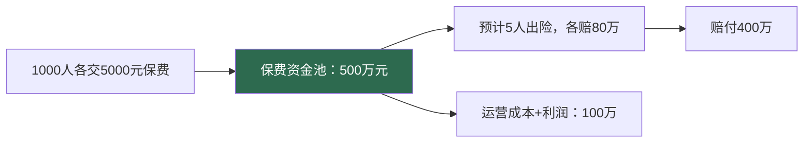

理解这个机制，就能明白三个关键点：

- **保险不是投资**：不要期待"回本"，买保险的目的就是在风险发生时获得赔付，没用上说明你很幸运。把保险当投资，是大多数人买错保险的根本原因
- **保险越早买越便宜**：因为年轻时风险概率低，保费自然低；等到身体出问题，可能买不了或要加费。以50万终身重疾险为例，25岁投保约4500元/年，35岁投保约7500元/年，45岁投保约13000元/年——晚买20年，总保费可能多交2-3倍
- **保险公司的盈利不靠拒赔**：保险公司的利润主要来自"死差"（实际出险率低于预期）、"利差"（投资收益高于给客户的保证利率）和"费差"（运营成本低于预算），而不是靠拒赔赚钱。国家金融监督管理总局数据显示，行业平均获赔率在97%以上

#### 保险定价的精算逻辑

保险定价的核心公式是：

```text
纯保费 = 保险金额 × 保险事故发生概率
毛保费 = 纯保费 + 附加费用（运营成本 + 渠道费用 + 利润预留）
```

以30岁男性购买50万重疾险为例：精算师根据生命表计算出30岁男性未来30年内发生重大疾病的概率约为15%-20%，据此计算出每年的纯保费约为2500-3500元，再加上保险公司的运营成本（约占保费的20%-35%），最终年保费在3500-5000元之间。

**影响保费的五大因素**：

| 因素 | 影响机制 | 影响幅度 |
|------|---------|---------|
| 年龄 | 年龄越大，疾病和死亡概率越高 | 25岁→45岁保费可能翻2-3倍 |
| 性别 | 男性平均寿命短于女性，重疾概率略高 | 男性保费通常高10%-20% |
| 职业 | 高危职业意外概率高 | 4-6类职业意外险保费增加50%-200% |
| 健康状况 | 既往症增加出险概率 | 可能导致加费、除外或拒保 |
| 保障期限 | 保终身比保至70岁贵 | 终身比定期贵40%-60% |

### 4.1.2 四大基础险种的定位

| 险种 | 解决什么问题 | 赔付方式 | 典型保额 | 年保费参考（30岁） |
|------|-------------|---------|---------|-------------------|
| **医疗险** | 看病花钱 | 报销型（实报实销） | 100-600万 | 300-500元 |
| **重疾险** | 大病停工没收入 | 给付型（一次性给） | 30-100万 | 3000-8000元 |
| **意外险** | 意外伤残/身故 | 给付型+报销型 | 50-200万 | 100-300元 |
| **寿险** | 身故后家庭经济断裂 | 给付型（一次性给） | 100-500万 | 500-2000元 |

**关键区分——医疗险和重疾险不是一回事**：

医疗险报销你花掉的钱（发票金额），重疾险不管你花多少直接给保额。举个具体例子：一个人得了癌症，医疗险报销了50万治疗费，但停工3年没有收入，重疾险赔付的50万就是用来维持生活的。两者的赔付互不冲突，可以叠加。

这就像一个漏桶比喻：医疗险负责把漏出去的水（医疗费用）补回来，重疾险负责在你修桶期间（康复期）保证你还有水喝。

#### 报销型vs给付型的核心区别

理解这两种赔付方式的差异是保险配置的基础：

| 维度 | 报销型（如医疗险） | 给付型（如重疾险/寿险） |
|------|-------------------|----------------------|
| 赔付依据 | 医疗发票金额 | 确诊/身故即赔，与花费无关 |
| 赔付金额 | 不超过实际花费 | 固定保额，买多少赔多少 |
| 多家理赔 | 不能重复报销（可互补报销） | 可以多家叠加理赔 |
| 理赔材料 | 需要发票原件 | 诊断证明即可 |
| 典型用途 | 覆盖医疗费用 | 补偿收入损失、偿还债务 |

**实际案例**：张先生同时购买了A公司50万重疾险和B公司50万重疾险，确诊肺癌后，A公司赔付50万、B公司赔付50万，合计100万。但他的医疗费用只有30万，百万医疗险报销了社保后的22万自费部分。所以张先生实际获得122万赔付——100万用于康复期间的生活开支和房贷，22万覆盖了医疗费用。

### 4.1.3 社保与商业保险的关系

社保是基础保障，但有明确的局限性。很多人以为"有社保就够了"，直到真正生大病才发现缺口有多大。

**社保报销的实际计算逻辑**：


具体来说，社保的局限包括：

- **起付线限制**：门诊起付线通常1500-2000元/年，住院起付线500-1500元/次，这部分完全自付
- **报销比例限制**：通常只报销70%-85%，剩余部分自付。而且不同等级医院报销比例不同——社区医院报销比例最高（90%），三甲医院报销比例最低（70%-80%）
- **药品目录限制**：2025年版国家医保药品目录收录药品超过3100种，但临床用药远不止这些。很多进口药、靶向药、免疫治疗药物不在社保目录内。以癌症治疗为例，PD-1免疫药物年费用约10-20万元，社保报销比例很低甚至不报
- **封顶线限制**：各地职工医保封顶线通常在30-50万，大病治疗轻松突破。2023年全国重大疾病平均治疗费用约35-50万元，复杂病例可达100万以上
- **无收入补偿**：大病停工期间，社保不补偿你的收入损失。而大病平均康复周期3-5年，这段时间的收入损失才是最大的隐性成本
- **无身故保障**：社保不提供身故赔付（仅有丧葬费和抚恤金，金额有限）

**门诊慢特病保障**值得单独说明：社保对高血压、糖尿病、恶性肿瘤放化疗等门诊慢特病有特殊报销政策，报销比例通常在70%-90%。但申请需要提供诊断证明并向社保局备案，很多人不知道这个政策而白花了很多钱。

**个人账户与家庭共济**：职工医保个人账户的余额可以用于支付配偶、父母、子女的医疗费用（门诊和购药）。2023年起全国已基本实现职工医保个人账户家庭共济，具体操作需要在医保App或社保局办理家庭成员绑定。

**大病医保（二次报销）**：这是很多人忽略的社保补充保障。当年度个人自付医疗费用超过一定金额（各地标准不同，通常1-2万元）后，大病医保会自动启动二次报销，报销比例50%-80%，封顶线通常20-30万。不需要额外缴费，是职工医保和居民医保的自动延伸。关键是很多人不知道有这个报销，自费后没有去申请。

**社保报销的真实计算案例**：

王女士因乳腺癌住院，总费用28万元。社保报销计算如下：

```text
总费用：280,000元
起付线：1,500元
自费药品（靶向药）：80,000元
社保目录内费用：280,000 - 1,500 - 80,000 = 198,500元
按80%报销：198,500 × 80% = 158,800元
封顶线内实际报销：158,800元
个人自付：280,000 - 158,800 = 121,200元（自付比例43%）
大病医保二次报销：(121,200 - 15,000) × 60% = 63,720元
最终个人负担：121,200 - 63,720 = 57,480元
```

即使经过社保和大病医保两轮报销，个人仍需自付约5.7万元。如果加上3年康复期的收入损失（假设年收入15万），总经济损失约50万元——这就是商业保险需要覆盖的缺口。

所以商业保险不是"可选消费"，而是社保的**必要补充**。

### 4.1.4 保险公司大小是否重要

很多消费者迷信"大公司理赔更容易"，这是一个常见误解。

**事实是**：理赔看合同条款，不看公司大小。中国所有保险公司都受国家金融监督管理总局统一监管，理赔标准一致。拒赔的原因99%是"不符合合同条款"或"未如实告知"，而不是"公司太小不想赔"。

**那大小公司的区别在哪里？**

| 对比维度 | 大公司（如平安、国寿） | 中小公司（如复星联合、华贵人寿） |
|---------|---------------------|-------------------------------|
| 品牌溢价 | 高（广告、网点成本高） | 低（互联网渠道为主） |
| 产品性价比 | 中等 | 通常更高（同保额保费低20%-40%） |
| 理赔速度 | 差异不大 | 差异不大 |
| 线下网点 | 多（适合喜欢面对面的人） | 少（多为线上理赔） |
| 增值服务 | 通常更丰富 | 基础服务都有 |
| 偿付能力 | 都在监管红线以上 | 都在监管红线以上 |

**建议**：不要因为"公司没听过"就拒绝一款好产品。保险公司的成立门槛极高（注册资本最低2亿元），而且有保险保障基金兜底。**条款好 > 品牌大**。

#### 如何查验保险公司是否正规

购买前务必验证保险公司的合法性，以下三种方式可以交叉确认：

1. **国家金融监督管理总局官网**（www.cbirc.gov.cn）→ 在线查询 → 保险机构查询，确认公司是否有合法经营许可
2. **保险保障基金**：中国所有保险公司都必须缴纳保险保障基金，即使保险公司破产，保单也会由其他公司接管或由保障基金兜底
3. **偿付能力报告**：每家保险公司每季度公布偿付能力充足率，国家金融监督管理总局要求核心偿付能力充足率不低于50%，综合偿付能力充足率不低于100%。可在保险公司官网或国家金融监督管理总局官网查询

### 4.1.5 团体保险与个人保险的关系

很多人公司有团体保险（团险），就以为不需要个人商业保险了。这是一个危险的认知。

**团体保险的特点**：

| 维度 | 团体保险 | 个人保险 |
|------|---------|---------|
| 投保主体 | 公司统一投保 | 个人自行投保 |
| 保障稳定性 | 离职即失去保障 | 保障终身跟随 |
| 保障范围 | 通常较基础（意外+补充医疗） | 可自由定制 |
| 保额 | 通常较低（10-30万） | 可自由选择 |
| 健康告知 | 通常免健康告知 | 需要健康告知 |
| 费用 | 公司承担 | 个人承担 |

**关键结论**：团体保险是"锦上添花"，不能替代个人保险。原因是：

- 你不可能在一家公司干一辈子，离职后保障就没了
- 团险保额通常不足以覆盖大病或身故风险
- 换工作期间可能出现保障空白期，而这期间恰恰是最脆弱的（压力大、身体可能出现问题）
- 团险的保障范围通常很窄，不包含重疾险和定期寿险的完整功能

**建议策略**：先配置好个人基础保险（医疗+意外+重疾+寿险），团险作为额外补充。团险的补充医疗可以覆盖百万医疗险的1万免赔额部分，两者配合效果最佳。

## 4.2 保险需求分析

### 4.2.1 保额计算：科学量化你的保障需求

保额不是拍脑袋决定的，需要根据个人/家庭的实际情况精确计算。以下是四种险种的保额计算方法。

**重疾险保额公式**：

```text
重疾险保额 = 年收入 × 3~5倍 + 康复费用（约20~30万）
```

为什么是3-5倍年收入？因为重大疾病（如癌症、心梗、脑中风）的平均康复周期是3-5年，这段时间你可能无法正常工作。保额要能覆盖这段时期的收入损失和基本生活开支。注意这里说的是"年收入"而非"年结余"——因为即使不生病，你每月的房贷、生活费、孩子教育费也不会停。

**举例**：年收入20万的人，重疾险保额建议 = 20万 × 3 + 25万 = 85万（取整约80-100万）

**医疗险保额选择**：

```text
医疗险保额 = 100万以上（百万医疗险即可覆盖绝大多数情况）
```

百万医疗险的保额通常是100-600万，但实际赔付不会超过你的医疗费用。保额从100万提升到600万，保费差异很小（可能只差几十元），所以选高保额即可。真正需要关注的不是保额数字，而是**续保条件**和**外购药保障**。

**意外险保额公式**：

```text
意外险保额 = 年收入 × 10倍（重点关注意外伤残赔付）
```

意外险的保额主要用于**意外伤残**赔付。伤残按等级赔付（1级赔100%，10级赔10%），所以保额要足够高，即使10级伤残也能获得有意义的赔付。比如保额100万，10级伤残赔10%=10万，这对康复和生活调整有实际帮助；如果保额只有10万，10级伤残只赔1万，几乎无意义。

**寿险保额公式**：

```text
寿险保额 = 家庭负债总额 + 子女教育费用（至大学毕业）
         + 父母赡养费用（5-10年） + 家庭生活费（3-5年）
         - 已有储蓄和保障
```

**举例**：房贷余额150万 + 子女教育预估80万 + 父母赡养50万 + 家庭3年生活费60万 - 存款20万 = 320万

寿险的保额公式看起来复杂，但核心逻辑很简单：**你不在了，家庭需要多少钱才能维持正常运转？** 减去已有的存款和其他保障，差额就是你需要的寿险保额。

#### 保额计算的常见错误

很多人在计算保额时犯以下错误，导致保障不足：

| 错误 | 正确做法 |
|------|---------|
| 用"年结余"代替"年收入"计算重疾险保额 | 用年收入，因为房贷、生活费不会因生病停止 |
| 只算治疗费，不算康复费和收入损失 | 重疾险保额 = 治疗费 + 3-5年收入损失 |
| 寿险保额只覆盖房贷 | 还要加上子女教育、父母赡养、家庭生活费 |
| 意外险保额太低（10万） | 至少年收入×10倍，确保10级伤残也有意义 |
| 医疗险纠结保额100万还是300万 | 差别不大，关注续保条件和外购药保障 |

### 4.2.2 保费预算控制

**保费预算原则**：

- **个人保费**：年收入的5%-10%
- **家庭保费**：家庭年收入的5%-10%（不是每人5%-10%，是全家合计）
- **保费上限**：绝对不能影响基本生活质量。如果你每月交完保费后吃饭都紧张，说明保费过高

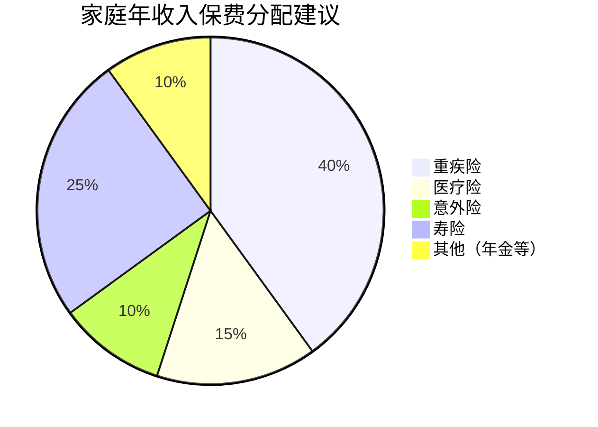

**不同收入水平的配置策略**：

| 年收入水平 | 年保费预算 | 优先配置 | 配置重点 |
|-----------|-----------|---------|---------|
| 10万以下 | 3000-5000元 | 医疗险+意外险 | 先把基础保障做足，重疾险选消费型定期保至60岁，以后再补 |
| 10-30万 | 5000-15000元 | 医疗+意外+重疾+寿险 | 四大基础险种配齐，重疾选消费型终身或定期 |
| 30-50万 | 15000-30000元 | 四大险种+中高端医疗 | 可以考虑多次赔付重疾险、中端医疗（覆盖特需/国际部） |
| 50万以上 | 30000-50000元 | 全面配置+高端医疗 | 高端医疗（私立医院直付、全球就医）、终身重疾、养老年金 |

**预算紧张时的取舍策略**：

如果预算只够买两个险种，优先买**百万医疗险+意外险**（合计500-800元/年），这两个加起来不到1000元就能获得几百万的保障。重疾险和寿险等收入增长后再补充。千万不要为了"什么都保一点"而每个险种都买低保额——10万保额的重疾险在大病面前杯水车薪。

### 4.2.3 不同人生阶段的保险配置

保险配置不是一成不变的，需要随着人生阶段动态调整：

**单身期（22-28岁）**：
- 优先级：百万医疗 > 意外险 > 重疾险
- 暂不需要寿险（没有家庭负担）
- 重疾险选定期（保至60/70岁），降低保费
- 预算有限时，先用消费型产品把保额做足
- 参考方案：百万医疗300元 + 意外险150元 + 定期重疾50万≈2500元 = 合计约3000元/年

**成家期（28-35岁）**：
- 优先级：寿险 > 重疾险 > 百万医疗 > 意外险
- 有房贷后必须配置定期寿险，保额覆盖房贷余额
- 夫妻双方都要配，经济支柱保额更高
- 参考方案：寿险150万≈1500元 + 重疾50万≈5000元 + 医疗300元 + 意外200元 = 合计约7000元/年

**育儿期（30-45岁）**：
- 家庭责任最重的阶段，保障必须全面
- 经济支柱的寿险和重疾险保额要充足
- 给孩子配置医疗险+意外险（少儿重疾险可选）
- 不要给孩子买寿险（孩子不承担家庭经济责任）
- 参考方案：大人合计约15000元 + 孩子约3000元 = 合计约18000元/年

**中年期（45-55岁）**：
- 重疾险保费已经很贵，如果之前没买，考虑防癌险替代
- 医疗险续保稳定性很重要，选择保证续保产品
- 开始关注养老年金的配置
- 身体可能出现各种小异常，核保成为关键难题

**退休期（55岁以后）**：
- 重点：医疗险（如果还能买）+ 意外险
- 重疾险基本买不了或保费倒挂（交的保费比保额还多）
- 考虑防癌医疗险作为替代方案
- 关注当地惠民保（政府指导的补充医疗险），投保门槛低，适合有既往症的老年人

#### 惠民保：老年人和既往症人群的兜底保障

惠民保（各地名称不同，如北京"京惠保"、上海"沪惠保"、深圳"重特大疾病补充医疗保险"）是由政府指导、商业保险公司承保的城市定制型商业医疗保险。

**惠民保的核心特点**：

| 特点 | 说明 |
|------|------|
| 投保门槛 | 极低，不限年龄、不限职业、不限健康状况（既往症可投保） |
| 年保费 | 通常50-200元/年 |
| 保额 | 通常100-300万 |
| 免赔额 | 较高，通常2-3万 |
| 报销比例 | 社保内70%-80%，社保外50%-70%（既往症报销比例更低） |
| 既往症 | 可投保但报销比例降低（通常降至30%-50%） |

**适合人群**：买不了百万医疗险的老年人、有严重既往症的人群、预算极低的人群。惠民保不是百万医疗险的替代品，而是在买不了其他保险时的兜底选择。

### 4.2.4 特殊人群的保险配置策略

不是所有人都按标准模板买保险。以下几类特殊人群需要针对性的策略。

**自由职业者/灵活就业者**：

中国灵活就业人口已超过2亿，包括外卖骑手、网约车司机、自媒体从业者、独立开发者等。这类人群没有单位缴纳的职工社保，保障缺口更大，且收入不稳定增加了保险配置的难度。

**灵活就业者的社保方案**：

| 参保方式 | 保障内容 | 月缴费参考 | 适合人群 |
|---------|---------|-----------|---------|
| 灵活就业职工社保 | 养老+医疗（与职工社保同等待遇） | 800-2000元 | 收入稳定的自由职业者 |
| 城乡居民社保 | 基础养老+基础医疗 | 200-500元/年 | 收入较低或不稳定的灵活就业者 |
| 新业态职业伤害保障 | 工伤保障（试点中） | 平台代缴 | 外卖骑手、网约车司机等平台从业者 |

**自由职业者的商业保险策略**：

自由职业者没有单位缴纳的职工社保，保障缺口更大。策略如下：
- 首先自己缴纳职工社保或城乡居民社保（医保必须有，否则看病全自费）
- 商业保险配置优先级高于有单位的人（因为没有工伤保险等补充保障）
- 收入不稳定时，选消费型产品，保费低，不占用太多现金流
- 考虑投保灵活就业人员专属意外险（覆盖工作期间的意外）

**有既往症/体检异常的人**：

这是最棘手的情况，但并非完全无解。常见体检异常的投保策略：

| 体检异常 | 医疗险 | 重疾险 | 寿险 | 投保策略 |
|---------|--------|--------|------|---------|
| 甲状腺结节1-3级 | 通常标体或除外 | 通常标体或除外 | 标体 | 大部分产品可正常投保 |
| 甲状腺结节4级+ | 多数除外或拒保 | 多数除外或拒保 | 需核保 | 先做穿刺明确性质，良性可除外承保 |
| 乳腺结节1-3级 | 通常除外 | 通常除外 | 标体 | 多家尝试，选择核保宽松的产品 |
| 肺结节<6mm | 部分可标体 | 部分可标体 | 标体 | 提供完整的CT报告，选择智能核保 |
| 脂肪肝（轻度） | 标体 | 标体 | 标体 | 基本不影响投保 |
| 高血压（1级） | 部分可保 | 部分可保 | 需核保 | 控制在140/90以下，选择宽松产品 |
| 乙肝病毒携带 | 多数除外 | 部分可保 | 标体 | 肝功能正常即可尝试多家投保 |
| 抑郁症/焦虑症 | 多数拒保 | 多数拒保 | 多数拒保 | 康复2年以上可尝试人工核保 |

**关键技巧**：
- **智能核保不留记录**：先用智能核保试探，被拒不影响在其他公司投保
- **多家同时投保**：不同公司核保标准不同，A公司拒保不代表B公司也拒
- **选择核保宽松的产品**：有些产品专门针对亚健康人群设计
- **预核保**：部分平台支持预核保（正式投保前的模拟核保），不留记录，可以提前知道结果

**远程工作者/数字游民**：

远程工作和数字游民群体在保险配置上有特殊需求：

- **异地就医**：如果你在A城市参保、B城市看病，需要提前办理异地就医备案（国家医保服务平台App可在线办理），否则报销比例可能降低10%-20%
- **海外工作者**：如果长期在海外工作，国内社保可以继续缴纳（通过灵活就业方式），商业保险建议配置全球版医疗险或专门的海外工作者保险
- **职业风险变化**：远程工作者的意外风险与传统上班族不同（如久坐导致的颈椎病、腰椎病），但这些属于慢性病，意外险不赔，需要通过医疗险和重疾险覆盖
- **收入波动**：自由远程工作者收入不稳定，优先选择消费型保险，避免返还型产品的高额保费压力

**高危职业人群**：

保险公司将职业分为1-6类（以及拒保类），职业风险越高，能选择的产品越少：
- 1-3类（办公室、服务业等）：所有产品均可投保
- 4类（外卖骑手、货车司机等）：部分意外险可保，但保费会增加
- 5-6类（建筑工人、矿工等）：意外险选择极少，寿险和重疾险通常不受影响
- 建议：寻找专门针对高危职业的意外险产品，或通过团体保险获得保障

**孕期女性**：
- 孕期大部分保险不接受投保（重疾险、寿险除外，但需看具体产品）
- 孕期专属保险：覆盖妊娠并发症、新生儿疾病等
- 最佳策略：在备孕期就完成重疾险、医疗险、寿险的配置
- 注意：医疗险通常不覆盖生育相关费用，生育费用由社保的生育保险承担

**全职妈妈/全职爸爸**：

没有个人收入的家庭成员，保险配置容易被忽略，但同样重要：
- 重疾险保额按"替代家务劳动和育儿的市场价值"计算，建议30-50万
- 医疗险和意外险必须配置（与经济支柱同等优先级）
- 寿险保额可以低于经济支柱，但不能为零（万一全职家长身故，另一方需要请保姆或减少工作）
- 保费来源：从家庭共同收入中支出，不需要自己有收入才能买

## 4.3 产品对比技巧

### 4.3.1 对比维度清单

买保险不是比谁价格低，而是在同等保障下找性价比最高的产品。以下是核心对比维度：

| 对比维度 | 具体要点 | 常见陷阱 |
|---------|---------|---------|
| **保障范围** | 疾病种类、理赔条件、是否分组 | 病种数量≠保障质量，要看高发病种是否覆盖 |
| **保额** | 赔付金额、是否递增 | 注意多次赔付的间隔期和分组限制 |
| **保费** | 年缴/月缴、总保费对比 | 同等保障才比价，不能拿不同保障比价格 |
| **等待期** | 等待期内出险不赔 | 重疾险90天vs180天，差一倍 |
| **免赔额** | 百万医疗通常1万免赔 | 免赔额越低越好，但保费会更高 |
| **续保条件** | 是否保证续保、续保是否需要审核 | 一年期产品最怕"不保证续保" |
| **理赔服务** | 理赔速度、获赔率、口碑 | 看国家金融监督管理总局公布的理赔数据，不看营销话术 |
| **增值服务** | 绿通、质子重离子、外购药 | 这些增值服务在关键时刻可能非常有用 |

**一个重要原则：先确定保额需求，再比较价格**。很多人反过来——先看哪个便宜，结果买了10万保额的重疾险，出事时发现远远不够。

### 4.3.2 重疾险对比要点

重疾险是保费最高的险种，也是最容易踩坑的。核心对比要素：

**病种覆盖**：国家金融监督管理总局规定了28种必保重疾（占理赔的95%以上），所以病种数量从28种增加到100种，实际意义不大。真正重要的是：

- **高发轻症是否覆盖**：轻度恶性肿瘤、较轻急性心肌梗死、轻度脑中风后遗症——这三种轻症是最高发的，必须覆盖
- **赔付比例**：轻症赔20%还是30%？中症赔50%还是60%？差距显著
- **赔付次数**：轻症/中症是否多次赔付？是否分组？不分组多次赔付最优

**28种法定重疾中的"理赔三巨头"**：

| 重疾 | 理赔占比 | 理赔条件要点 |
|------|---------|------------|
| 恶性肿瘤（癌症） | 约60%-70% | 病理报告确诊即赔（原位癌、TNM分期为I期的甲状腺癌除外） |
| 急性心肌梗死 | 约10%-15% | 需满足多项诊断标准（心肌酶+心电图+胸痛症状），不是医生口头说"心梗"就赔 |
| 脑中风后遗症 | 约5%-10% | 确诊180天后仍存在功能障碍才赔，恢复良好不赔 |

**多次赔付vs单次赔付**：

| 类型 | 优势 | 劣势 | 适合人群 |
|------|------|------|---------|
| 单次赔付 | 保费便宜30%-40% | 赔完一次后保障终止 | 预算有限、年轻人 |
| 多次赔付（分组） | 保费适中，可赔多次 | 同组疾病只能赔一次 | 预算中等 |
| 多次赔付（不分组） | 保障最全面 | 保费最贵 | 预算充足 |

**定期vs终身**：

- **定期（保至60/70岁）**：保费便宜40%-60%，适合预算有限的年轻人
- **终身**：保障更完整，但保费显著增加
- **折中方案**：定期+终身组合，比如买30万终身+30万定期，用有限预算获得60万的阶段保额

**缴费期限选择**：

尽量选择最长的缴费期限（通常30年）。原因有二：一是每年保费更低，减轻缴费压力；二是如果在缴费期内出险，后续保费豁免（不用再交），缴费期越长越划算。以50万终身重疾险为例，20年缴年均约6500元，30年缴年均约4800元，总保费差不多，但30年缴如果第10年出险，剩余20年保费全免。

#### 保费豁免：缴费期内出险的隐藏福利

保费豁免是重疾险中一个非常重要但容易被忽略的功能：

- **被保人豁免**：大多数重疾险自带，确诊轻症/中症/重疾后，后续保费免交，保障继续有效
- **投保人豁免**：需要额外附加（通常加费5%-10%），投保人（交钱的人）发生重疾/身故/全残后，后续保费免交

**投保人豁免的典型场景**：丈夫为妻子投保重疾险，附加投保人豁免。如果丈夫发生重疾，妻子的重疾险后续保费全免，保障继续。这在家庭经济支柱互保时特别重要。

### 4.3.3 百万医疗险对比要点

百万医疗险产品繁多，但核心差异集中在以下几点：

**续保条件（最重要）**：
- 优选：保证续保20年（如平安长相安、太平洋蓝医保）
- 次选：保证续保6年/15年
- 避免：不保证续保的产品（理赔后可能被拒保）

为什么要强调续保？因为百万医疗险是一年期产品。如果不保证续保，你今年理赔了50万，明年保险公司可能不让你续保——而此时你的身体状况可能已经买不了其他医疗险了。保证续保意味着即使你理赔过、身体变差，保险公司也必须让你续保，且不能单独涨你的保费。

**免赔额**：
- 标准：1万免赔额（大多数产品）
- 优选：6年共享1万免赔额（如好医保6年版），6年内累计自费超过1万后就不再扣免赔
- 关注：重疾0免赔（确诊重疾后取消免赔额）

**外购药保障**：
- 很多靶向药、免疫药物医院没有，需要去院外药房购买
- 确保产品覆盖外购药，且报销比例100%
- 注意外购药是否有清单限制（优选不限清单的产品）

**增值服务**：
- 质子重离子治疗：最先进的癌症放疗技术，单次治疗费27-35万，部分产品覆盖上海质子重离子医院
- 重疾绿通：快速安排专家门诊、住院床位，对于挂不到号的大医院非常实用
- 住院垫付：不用自己先掏钱，保险公司直接垫付住院押金

### 4.3.4 中端与高端医疗险简介

百万医疗险解决的是"看不起病"的问题，但中高端医疗险解决的是"看好病"的问题。

| 维度 | 百万医疗险 | 中端医疗险 | 高端医疗险 |
|------|-----------|-----------|-----------|
| 年保费 | 300-800元 | 3000-8000元 | 10000-50000元 |
| 就医范围 | 二级及以上公立医院普通部 | +特需部/国际部 | +私立医院/海外医院 |
| 免赔额 | 通常1万 | 通常0 | 通常0 |
| 报销方式 | 先自费后报销 | 部分直付 | 全额直付 |
| 适合人群 | 所有人 | 追求就医品质 | 高净值人群 |

**中端医疗险的典型场景**：你在北京三甲医院普通部排队3个月做不了一个手术，但在特需部一周就能安排。中端医疗险覆盖特需部的费用，让你不用排队等。对于有老人和孩子的家庭，中端医疗险的实用价值很高。

**高端医疗险的独特价值**：
- 全球就医网络：可在全球顶级医院就诊（如美国梅奥诊所、日本癌研有明医院）
- 直付服务：保险公司直接与医院结算，不需要自己垫付任何费用
- 体检和预防保健：部分高端医疗险覆盖年度体检、齿科、眼科
- 适合人群：年收入50万以上、经常出国、对就医品质有极高要求的人群

### 4.3.5 意外险对比要点

意外险保费低（通常100-300元/年），但保障差异很大：

**核心保障**：
- 意外身故：赔保额
- 意外伤残：按伤残等级赔付（1-10级，10%-100%）
- 意外医疗：报销意外导致的医疗费用

**对比要点**：

| 要点 | 推荐标准 | 为什么重要 |
|------|---------|-----------|
| 意外医疗保额 | ≥2万 | 骨折等常见意外的治疗费用约5000-20000元 |
| 免赔额 | 0免赔最优 | 100元免赔额意味着小意外自己承担 |
| 报销比例 | 100%报销最优 | 80%报销意味着自己承担20% |
| 报销范围 | 不限社保目录 | 进口钢钉、进口药物等自费项目可以报销 |
| 猝死保障 | 必须包含 | 很多意外险不含猝死，但猝死是年轻人最大的意外风险之一 |
| 住院津贴 | 有则加分 | 每天100-200元补贴，弥补住院期间的额外开支 |

**注意**：猝死在医学上属于疾病导致的死亡，不属于"意外"，但很多意外险产品会额外包含猝死保障，选购时需要特别留意。对于经常加班的互联网从业者，猝死保障尤为重要。

### 4.3.6 定期寿险对比要点

定期寿险是最简单的险种——身故就赔（含全残），所以对比维度较少：

- **保费**：同等保额下选最便宜的（这是核心，因为保障内容几乎一模一样）
- **健康告知**：越宽松越好（影响你能不能买）
- **免责条款**：越少越好（通常是3条：故意犯罪、2年内自杀、投保人故意杀害）
- **保额上限**：是否满足你的需求（部分产品最高300万，如果你需要400万就选不了）
- **等待期**：通常90天或180天

**定期寿险的保障期限选择**：保到60岁还是65岁？原则是**保到你不再承担家庭经济责任的年龄**。如果你计划60岁退休、孩子30岁时经济独立，那保到60岁就够了。保到65岁比保到60岁保费贵约20%-30%，需要权衡。

### 4.3.7 防癌险：特定场景的替代方案

当买不了重疾险或百万医疗险时，防癌险是重要的替代选择。

**防癌险 vs 重疾险**：

| 维度 | 重疾险 | 防癌险 |
|------|--------|--------|
| 保障范围 | 28种重疾+轻症中症 | 仅恶性肿瘤 |
| 健康告知 | 严格 | 相对宽松 |
| 投保年龄 | 通常0-55岁 | 通常0-70岁 |
| 适合人群 | 健康人群 | 有三高、糖尿病等慢性病的人 |

**防癌医疗险 vs 百万医疗险**：

| 维度 | 百万医疗险 | 防癌医疗险 |
|------|-----------|-----------|
| 保障范围 | 所有疾病和意外 | 仅恶性肿瘤相关医疗 |
| 健康告知 | 严格 | 非常宽松（三高、糖尿病可投） |
| 保证续保 | 最长20年 | 最长终身保证续保 |
| 适合人群 | 健康人群 | 买不了百万医疗的老年人 |

**防癌险的典型使用场景**：55岁以上的父母，因为年龄或健康原因买不了百万医疗险和重疾险，配置一份防癌医疗险（终身保证续保）+ 意外险，基本覆盖了最大的两个风险——癌症和意外。

### 4.3.8 长期护理险：被忽视的第六险种

长期护理险（长护险）是近年来中国正在试点推广的"第六险种"，解决的是因年老、疾病或伤残导致生活不能自理时的护理费用问题。

**社保长护险（试点中）**：

2016年起，中国在49个城市试点长期护理保险制度。参保人因失能（丧失日常生活能力）需要长期护理时，可获得护理费用报销。

| 维度 | 说明 |
|------|------|
| 覆盖城市 | 49个试点城市（包括北京、上海、广州、成都、苏州等） |
| 参保方式 | 从职工医保基金中划拨，个人通常不需要额外缴费 |
| 申请条件 | 经评估达到重度失能标准（通常需要连续6个月以上失能） |
| 保障内容 | 机构护理、居家护理、社区护理的费用报销 |
| 报销比例 | 通常70%-90%，各地标准不同 |
| 封顶线 | 通常每月1500-3000元 |

**商业长期护理险**：

社保长护险覆盖有限（仅试点城市、仅重度失能、报销额度不高），商业长护险可以作为补充：

- **保障范围**：中度失能即可触发赔付，门槛更低
- **赔付方式**：每月定额给付（如每月5000-10000元），持续赔付至恢复或身故
- **适合人群**：有家族失能史的人、独居老人、对养老品质有高要求的人
- **保费**：40岁投保约2000-5000元/年，保障终身

**长护险的必要性**：中国65岁以上人口已超过2亿，阿尔茨海默病、帕金森病等导致失能的疾病发病率逐年上升。一个人一旦进入失能状态，平均需要5-8年的护理期，护理费用约5-15万/年。这笔费用远超大多数家庭的承受能力，而社保长护险的覆盖力度有限。

### 4.3.9 保险与税优政策

合理利用保险的税收优惠，可以有效降低保障成本：

**个人所得税递延型商业养老保险（税延养老险）**：

- 每年最高可抵扣12000元个税
- 适用个税税率10%以上的人群，每年节税1200-5400元
- 领取时按3%税率补缴个税（通常低于存入时的税率）
- 2022年起与个人养老金账户合并，通过个人养老金账户购买

**企业年金/职业年金**：

- 企业年金由企业和个人共同缴纳（企业不超过8%，个人不超过4%）
- 个人缴纳部分在个税前扣除
- 退休后领取时按3%税率单独计税
- 仅限有企业年金计划的单位员工

**商业健康保险抵扣**：

- 购买符合条件的商业健康保险（如税优健康险），每年可抵扣2400元（每月200元）个税
- 税优健康险的特点：可以带病投保、保证续保、无等待期
- 实际节税金额取决于个税税率：税率10%节税240元/年，税率20%节税480元/年，税率45%节税1080元/年

**保险赔付的免税政策**：

- 重疾险、意外险、寿险的赔付金免征个人所得税
- 身故赔付金不计入遗产（有指定受益人的情况下）
- 保险赔款不属于债务追偿范围（有条件限制，详见4.8节）

**税优政策的实操计算案例**：

以年收入30万元（个税税率20%）的张先生为例，展示保险税优的实际节税效果：

```text
方案一：不使用任何税优政策
  年缴个税：约30,000元

方案二：充分利用税优政策
  个人养老金存入：12,000元/年 → 节税 12,000 × 20% = 2,400元
  税优健康险购买：2,400元/年 → 节税 2,400 × 20% = 480元
  企业年金个人缴纳：（如有）→ 节税金额取决于缴纳比例

  合计节税：2,400 + 480 = 2,880元/年
  
  10年累计节税：28,800元
  30年累计节税：86,400元
```

**关键提醒**：
- 税优健康险的购买渠道有限，需要通过保险公司或指定平台购买符合税优条件的产品
- 个人养老金的12,000元/年上限是所有税优额度中最高的，优先使用
- 企业年金只在部分单位有，如果有，务必参加——这是"白送"的福利

### 4.3.10 附加险（附加保障）的选择技巧

附加险是附着在主险上的额外保障，保费通常很低，但能在关键时刻提供重要补充。很多人只关注主险，忽略了附加险的价值。

**常见附加险类型及价值评估**：

| 附加险类型 | 附加在什么主险上 | 保障内容 | 年保费参考 | 是否推荐 |
|-----------|---------------|---------|-----------|---------|
| **投保人豁免** | 重疾险/寿险 | 投保人出险后，被保人后续保费免交 | 主险保费的5%-10% | **强烈推荐**（夫妻互保必选） |
| **意外医疗** | 意外险 | 意外导致的医疗费用报销 | 50-100元 | 推荐（补充意外险的医疗部分） |
| **住院津贴** | 医疗险/意外险 | 住院期间每天定额补贴 | 30-80元 | 可选（弥补住院期间额外开支） |
| **特药险** | 百万医疗险 | 院外靶向药、免疫药物报销 | 50-150元 | **强烈推荐**（如果主险不含外购药） |
| **质子重离子** | 百万医疗险 | 覆盖质子重离子治疗费用 | 30-80元 | 推荐（癌症治疗的尖端技术） |
| **身故/全残** | 重疾险 | 重疾险赔付后，身故再赔一次 | 主险保费的20%-30% | 视预算而定（单独买寿险更灵活） |

**附加险选择的核心原则**：

1. **投保人豁免必须加**：这是杠杆最高的附加险。以丈夫为妻子投保50万重疾险为例，附加投保人豁免每年多交约300元，但如果丈夫发生重疾/身故，妻子后续15-20年的保费（约5-8万）全部免交。300元撬动5-8万的杠杆，没有不加的理由
2. **特药险优先于质子重离子**：外购药的使用频率远高于质子重离子治疗。2023年数据显示，癌症患者中使用靶向药/免疫药物的比例约60%，而使用质子重离子治疗的比例不到1%
3. **住院津贴看个人需求**：每天100-200元的补贴对高收入人群意义不大，但对收入较低或住院期间有额外开支（如请护工）的人群有实际价值
4. **不要为了附加险买主险**：有些代理人会用"这款产品可以附加XX保障"来吸引你买主险。正确做法是先确定主险是否值得买，再考虑附加险

**附加险的常见陷阱**：

- **附加险随主险终止而终止**：如果主险理赔后合同终止，所有附加险也同时终止。多次赔付重疾险的附加险在第一次重疾赔付后可能失效，需要仔细看条款
- **附加险可能单独停售**：某些附加险是"一年期"产品，保险公司可能随时停售。特药险和质子重离子附加险尤其需要注意这一点——优选写入主险合同的保障
- **附加险费率可能调整**：一年期附加险的保费可能每年调整，不是固定的。长期附加险（与主险同期限）的保费是固定的

## 4.4 保险合同条款解读

很多人买保险不看条款，出险后才发现"不在保障范围内"。保险合同是理赔的唯一依据，学会读条款是保险配置的核心技能。本节从速读方法、关键条款逐一拆解、健康告知实操三个层面，帮助读者建立系统的条款解读能力。

### 4.4.1 条款结构速读法

一份保险合同通常几十页，逐字读完不现实。以下是**5分钟速读法**——只看关键章节：

1. **保险责任**（必看）：赔什么、赔多少、怎么赔
2. **责任免除**（必看）：不赔什么（这部分最重要）
3. **等待期**（必看）：等待期内出险不赔
4. **犹豫期**（了解）：通常10-20天，犹豫期内退保全额退还保费
5. **如实告知**（必看）：投保时需要告知哪些健康信息
6. **理赔流程**（了解）：出险后需要做什么

**条款中的术语速查表**：

| 术语 | 含义 | 实际影响 |
|------|------|---------|
| 等待期 | 投保后等待保障生效的期间 | 等待期内出险不赔，重疾险通常90-180天 |
| 犹豫期 | 可以无条件退保的期间 | 通常10-20天，退保全额退还保费 |
| 宽限期 | 缴费到期后允许延迟的期间 | 通常60天，宽限期内保障继续有效 |
| 中止期 | 未缴费导致保单暂停的期间 | 通常2年内可申请复效（需补缴保费+利息） |
| 现金价值 | 退保时能拿回的金额 | 前几年现金价值远低于已交保费 |
| 保额递增 | 保额随时间增长 | 通常是固定比例递增（如每年3%） |
| 等待期发病 | 等待期内出现症状 | 即使等待期后确诊也不赔（大部分产品） |

**条款阅读的优先级矩阵**：

| 优先级 | 条款内容 | 原因 |
|--------|---------|------|
| 🔴 **务必看懂** | 保险责任 | 直接决定赔什么、赔多少，是合同核心 |
| 🔴 **务必看懂** | 责任免除 | 直接决定不赔什么，最容易被忽略 |
| 🟠 **重点关注** | 续保条款 | 决定长期保障的稳定性，百万医疗险关键 |
| 🟠 **重点关注** | 等待期规定 | 影响保障生效时间，90天vs180天差异大 |
| 🟡 **仔细看** | 退保现金价值 | 决定退保时能拿回多少钱 |
| 🟡 **仔细看** | 理赔流程 | 出险后需要知道的第一件事 |
| 🟢 **了解即可** | 受益人条款 | 可以后续变更，但建议尽早指定 |
| 🟢 **了解即可** | 犹豫期说明 | 10-20天内可无条件退保，了解即可 |

> **阅读技巧**：按从上到下的顺序阅读。先看"保险责任"和"责任免除"，这两项看完基本能判断产品是否值得买。

### 4.4.2 重疾险条款深度解读

重疾险条款是最复杂的，也是最需要仔细阅读的。

**"确诊即赔"的真实含义**：

重疾险宣传的"确诊即赔"只适用于部分疾病（如恶性肿瘤）。对于其他重疾，理赔条件可能是"达到某种状态"或"实施了某种手术"。28种法定重疾的理赔条件分为三类：

| 理赔条件类型 | 代表疾病 | 说明 | 注意事项 |
|------------|---------|------|---------|
| **确诊即赔** | 恶性肿瘤、严重阿尔茨海默病 | 有医学诊断即赔 | 恶性肿瘤需病理报告，不是CT/MRI影像 |
| **达到状态才赔** | 脑中风后遗症、瘫痪 | 确诊后需等待一定时间仍存在功能障碍 | 脑中风后遗症需180天后仍有障碍才赔 |
| **实施手术才赔** | 重大器官移植术、冠状动脉搭桥术 | 必须已经实施手术 | 等待移植期间不赔，术后才赔 |

**具体条款拆解——以"恶性肿瘤"为例**：

条款原文通常这样写："指恶性细胞不受控制的进行性增长和扩散，浸润和破坏周围正常组织，可以经血管、淋巴管和体腔扩散转移到身体其他部位的疾病。经病理学检查结果明确诊断，临床诊断属于世界卫生组织《疾病和有关健康问题的国际统计分类》（ICD-10）的恶性肿瘤范畴。"

**关键解读**：
- "经病理学检查结果明确诊断"——意味着必须有病理报告（活检或手术标本），仅凭影像学（CT、MRI、PET-CT）诊断不够
- "ICD-10的恶性肿瘤范畴"——原位癌（ICD-10编码D00-D09）不在保障范围内（因为原位癌治愈率极高，不算"恶性"）
- TNM分期为I期的甲状腺癌——2021年重疾险新规范后，I期甲状腺癌从重疾降级为轻症（赔付比例从100%降为20%-30%），但保障并未消失

**高发轻症条款对比**：

| 轻症名称 | 理赔条件要点 | 宽松标准 | 严格标准 |
|---------|------------|---------|---------|
| 轻度恶性肿瘤 | 病理确诊，排除原位癌和I期甲状腺癌 | 无额外限制 | 排除更多低度恶性肿瘤 |
| 较轻急性心肌梗死 | 需满足部分诊断标准（比重大心梗宽松） | 满足2-3项指标即可 | 需满足全部4项指标 |
| 轻度脑中风后遗症 | 确诊180天后有轻度功能障碍 | 轻度障碍即可 | 需达到特定残疾等级 |

**多次赔付条款的关键陷阱**：

| 条款要素 | 有利条款 | 不利条款 | 影响 |
|---------|---------|---------|------|
| 分组方式 | 不分组 | 分组（癌症+心脑血管一组） | 分组意味着同组疾病只能赔一次 |
| 间隔期 | 1年 | 3年/5年 | 间隔期内再次确诊不赔 |
| 赔付比例 | 每次100%保额 | 递减（第二次80%、第三次60%） | 实际赔付金额差异大 |
| 疾病范围 | 与首次相同 | 仅限不同疾病 | 癌症复发/转移可能不赔 |

**具体案例分析**：某重疾险条款规定"第二次重大疾病保险金：被保险人首次确诊重大疾病之日起365天后，确诊首次重大疾病以外的其他重大疾病"。这意味着：如果第一次确诊肺癌（恶性肿瘤），365天后确诊肝癌（也是恶性肿瘤），属于"同一种疾病"的转移，第二次不赔。但如果是365天后确诊急性心肌梗死（不同疾病），则可以赔付。因此，选择多次赔付重疾险时，"不分组+间隔期短"是最佳组合。

### 4.4.3 百万医疗险条款深度解读

百万医疗险条款看似简单，但细节陷阱不少。

**续保条款的三种写法**：

| 写法类型 | 条款示例 | 实际含义 | 风险等级 |
|---------|---------|---------|---------|
| **保证续保** | "保证续保期间为20年，保证续保期间内不因健康状况拒绝续保" | 20年内必须让你续，不能单独涨价 | 低 |
| **承诺续保** | "不会因被保险人健康状况变化拒绝续保" | 不因健康拒保，但产品停售就没了 | 中 |
| **不保证续保** | "续保需经保险人审核同意" | 每年都可能被拒 | 高 |

**重要区别**：即使同是"保证续保20年"，不同产品的续保条款也有差异。有的产品20年届满后需要重新审核健康状况（可能因20年间出现的健康问题被拒保），有的产品20年届满后可以免审核续保（但可能调整费率）。这些细节必须看条款原文。

**免赔额条款的常见表述**：

```text
"本合同约定的免赔额为1万元。被保险人已从社会基本医疗保险
或公费医疗获得医疗费用补偿的，免赔额为0元。"
```

这句话意味着：如果住院费用中社保已经报销了一部分，剩余自费部分的免赔额从1万降为0。很多人不知道这一点，以为社保报销后还要再自费1万才能用百万医疗险报销，实际上社保报销后直接进入百万医疗险的赔付范围。

**外购药条款的三种保障方式**：

| 保障方式 | 条款特征 | 保障力度 | 举例 |
|---------|---------|---------|------|
| **主险包含** | "保险责任"中明确列出外购药 | 最强 | 保障写入合同，不受附加险停售影响 |
| **附加险保障** | 需要单独附加"特药险" | 中等 | 附加险可能单独停售或调整 |
| **增值服务** | "提供院外特药服务" | 最弱 | 增值服务条款可随时修改，无法律约束力 |

**质子重离子条款的注意事项**：
- 部分产品将质子重离子治疗列为"可选责任"（需要额外付费附加）
- 部分产品限定只报销上海质子重离子医院的费用
- 报销比例可能是60%或100%，差异很大
- 质子重离子治疗的适用病种有限（主要针对部分实体肿瘤），不是所有癌症都适合

### 4.4.4 寿险与意外险条款要点

**寿险条款的关键细节**：

寿险条款相对简单，但有两个容易忽略的点：

1. **全残保障**：大部分定期寿险不仅保身故，还保全残（双目永久失明、两上肢腕关节以上缺失等）。全残的定义各公司略有差异，有的包含"植物人状态"，有的不包含
2. **免责条款的数量**：标准免责3条（故意犯罪、2年内自杀、投保人故意杀害被保人）。如果某产品免责条款超过3条（比如增加"酒驾免责""高风险运动免责"），需要仔细评估

**意外险条款的关键陷阱**：

| 陷阱 | 条款表述 | 正确理解 |
|------|---------|---------|
| 意外定义 | "外来的、突发的、非本意的、非疾病的" | 猝死是疾病导致的，不算意外（除非条款单独包含） |
| 伤残赔付 | "按《人身保险伤残评定标准》1-10级赔付" | 只有伤残才按比例赔，单纯的骨折不够伤残等级不赔 |
| 意外医疗 | "限社保目录内" | 进口钢钉、进口药物不报 |
| 高空坠落 | "2米以上高空作业不赔" | 家里换灯泡从梯子摔下来可能不赔 |

### 4.4.5 健康告知实操指南

健康告知是投保过程中最让人焦虑的环节。说多了怕拒保，说少了怕拒赔。本节提供系统的实操方法。

**健康告知的法律依据**：

《保险法》第十六条规定：投保人故意或因重大过失未履行如实告知义务，足以影响保险人决定是否同意承保或者提高保险费率的，保险人有权解除合同。

但同时规定：保险人的合同解除权，自保险人知道有解除事由之日起，超过30日不行使而消灭。自合同成立之日起超过2年的，保险人不得解除合同。

**健康告知的三大原则**：

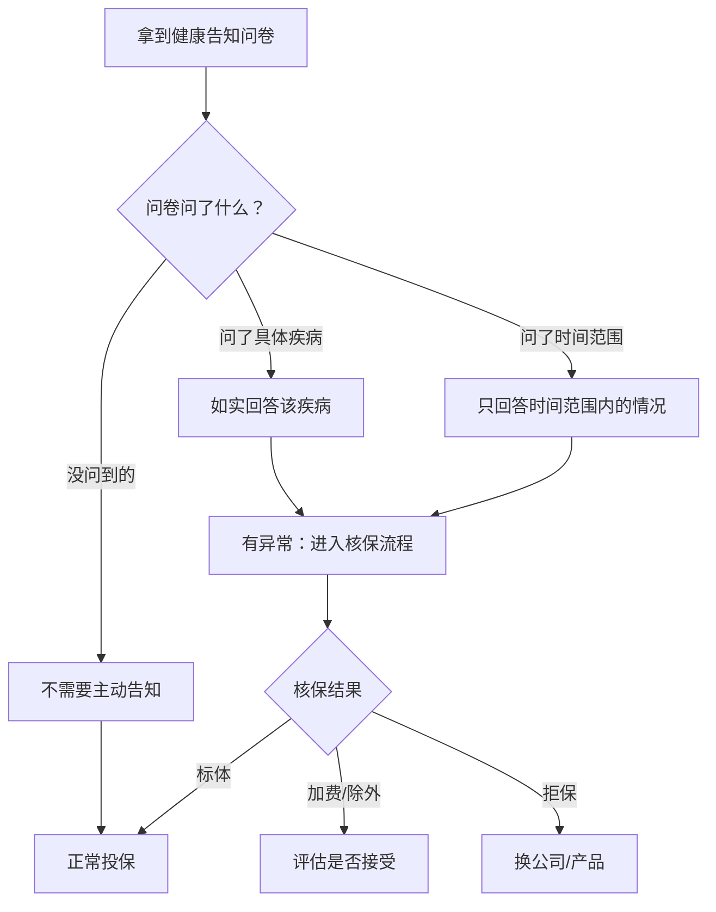

**原则一：问什么答什么，不问不答**

健康告知问卷采用"有限告知"原则——只回答问卷中明确问到的问题。例如：
- 问卷问"2年内是否住过院" → 你5年前住过院 → **不需要告知**
- 问卷问"是否曾被诊断为高血压" → 你体检时血压偏高但未确诊 → **不需要告知**
- 问卷问"是否患有甲状腺疾病" → 你有甲状腺结节但未确诊疾病 → 看具体措辞，"结节"不等于"疾病"

**原则二：注意时间和范围限定**

问卷中经常有时间和范围限定词：
- "2年内"：超过2年的不用告知
- "被诊断/被治疗"：仅体检发现但未就医的不算
- "住院"：门诊治疗不算住院
- "连续服药30天以上"：短期用药不需要告知

**原则三：不确定时先智能核保**

如果你对自己的健康状况是否需要告知不确定，**先用智能核保系统试探**。智能核保不留记录，被拒不影响在其他公司投保。这是最安全的试探方式。

**健康告知问卷常见问题的应对策略**：

| 常见问题 | 应对策略 | 注意事项 |
|---------|---------|---------|
| "是否曾被诊断为XX疾病" | 只回答有正式诊断记录的 | 体检报告的"建议复查"不算诊断 |
| "2年内是否有体检异常" | 看异常的具体项目 | 轻微的血脂偏高、脂肪肝等可能不影响 |
| "是否曾被保险公司拒保/加费" | 如实回答，但提供后续改善的证明 | 智能核保被拒不算正式拒保记录 |
| "直系亲属是否有XX疾病史" | 如实回答 | 家族史影响核保但通常不会导致拒保 |
| "目前是否有未治愈的疾病" | 说明治疗进展和预后 | 提供医生的预后良好的证明有帮助 |

**健康告知材料准备清单**：

在投保前，建议提前准备好以下材料，以便在核保时提供：

```text
□ 近2年内的体检报告（完整版，不是摘要）
□ 相关疾病的门诊病历（如有）
□ 相关疾病的住院病历和出院小结（如有）
□ 最新的复查报告（证明病情稳定或好转）
□ 医生的诊断证明（明确说明预后良好）
□ 既往的保险理赔记录（如有）
```

**健康告知的"组合拳"策略**：

当身体有多项异常时，不要只试一家公司，而是制定系统的尝试策略：

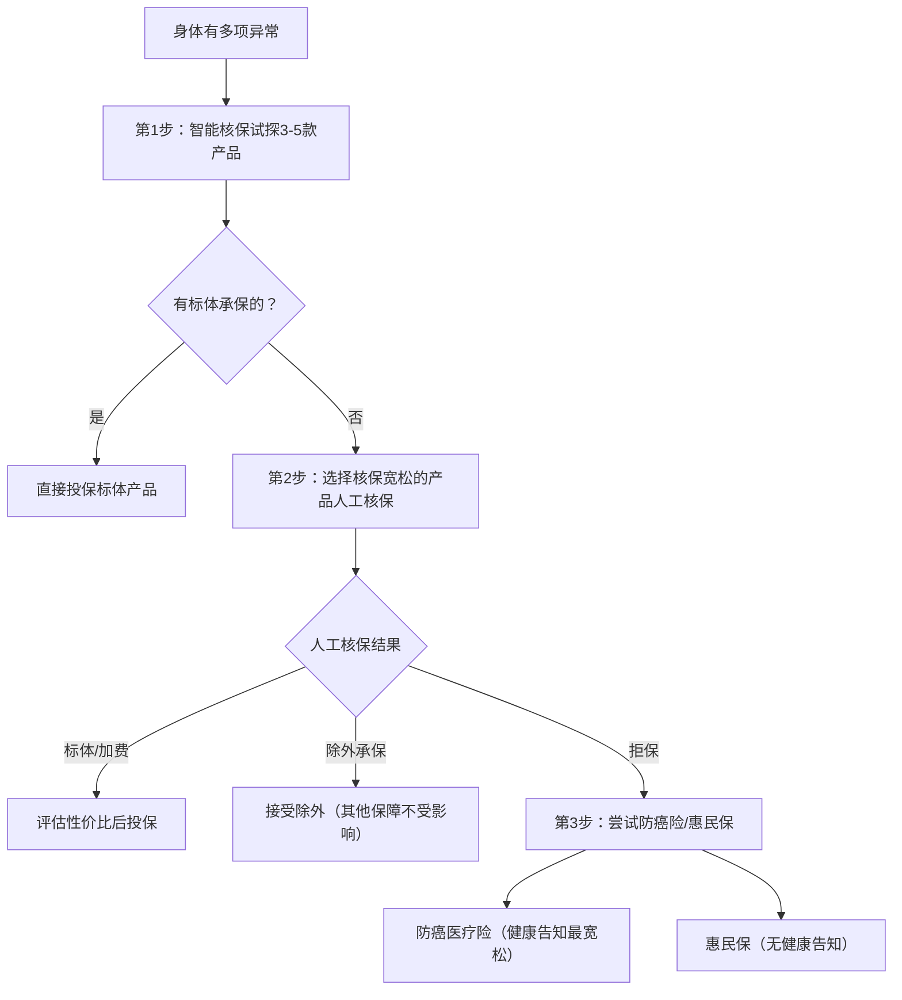

### 4.4.6 两年不可抗辩条款的正确理解

**两年不可抗辩条款**：

《保险法》第十六条规定："自合同成立之日起超过两年的，保险人不得解除合同；发生保险事故的，保险人应当承担赔偿或者给付保险金的责任。"

这意味着：即使你投保时隐瞒了病史，只要合同超过两年，保险公司不能以此为由拒赔。

**但要注意三点**：
- 这不是鼓励你隐瞒病史。如果你故意隐瞒严重的既往症，保险公司仍可能通过法律途径争取拒赔
- 两年不可抗辩保护的是"过失未告知"，而非"恶意骗保"
- 投保时如实告知才是正道，不要赌两年不可抗辩条款

**司法实践中的争议**：

两年不可抗辩条款在司法实践中有不同判例：
- **多数法院倾向保护投保人**：即使存在未如实告知，只要合同满两年，法院通常判决保险公司赔付
- **少数判例支持保险公司**：如果能证明投保人存在"恶意骗保"行为（如明知癌症晚期仍投保），法院可能支持拒赔
- **关键证据**：保险公司的举证责任很重——需要证明投保人"故意"隐瞒，而非"过失"遗漏

**正确态度**：两年不可抗辩条款是保护消费者的"兜底条款"，但不应成为隐瞒病史的理由。如实告知是最安全、最省心的做法。

**两年不可抗辩的实际运用建议**：
- 如果你确实有未如实告知的情况（比如之前代理人帮你隐瞒了），不要慌张，先确认合同是否已满两年
- 合同满两年后，保险公司不能单方面解除合同，但仍可能就"未告知事项"与"出险疾病"之间的因果关系进行抗辩
- 如果保险公司以"未如实告知"拒赔但合同已满两年，你有很强的法律依据进行申诉或起诉
- 建议保留投保时的所有沟通记录（微信聊天、录音等），以备将来可能的纠纷

## 4.5 保险购买渠道与策略

### 4.5.1 购买渠道对比

| 渠道 | 代表 | 优势 | 劣势 | 适合人群 |
|------|------|------|------|---------|
| **保险代理人** | 平安、国寿的代理人 | 面对面服务，有专人跟进 | 只卖自家产品，可能有利益导向 | 喜欢线下服务的人 |
| **保险经纪人** | 明亚、大童、永达理 | 代理多家公司产品，立场相对中立 | 水平参差不齐 | 需要专业建议的人 |
| **互联网平台** | 蚂蚁保、微保、水滴保 | 产品丰富、价格透明、可自助投保 | 无专人服务，理赔需自己跟进 | 有一定保险知识的人 |
| **银行渠道** | 各大银行代销 | 方便（与银行业务一起办理） | 产品选择少，手续费高 | 不推荐 |

**保险代理人 vs 保险经纪人的核心区别**：

代理人代表保险公司利益（是保险公司的"销售员"），经纪人理论上代表投保人利益（是你的"采购顾问"）。但实际体验取决于具体的人，好的代理人比差的经纪人强百倍。关键是看这个人是否**愿意帮你分析需求而非只推产品**。

**互联网保险的法律效力**：电子保单和纸质保单法律效力完全相同（《保险法》第十三条明确规定）。网上投保更透明——你可以同时看到几十个产品的条款，自行对比，不受单一代理人的信息操控。

### 4.5.2 购买顺序

**标准配置顺序**（按优先级从高到低）：

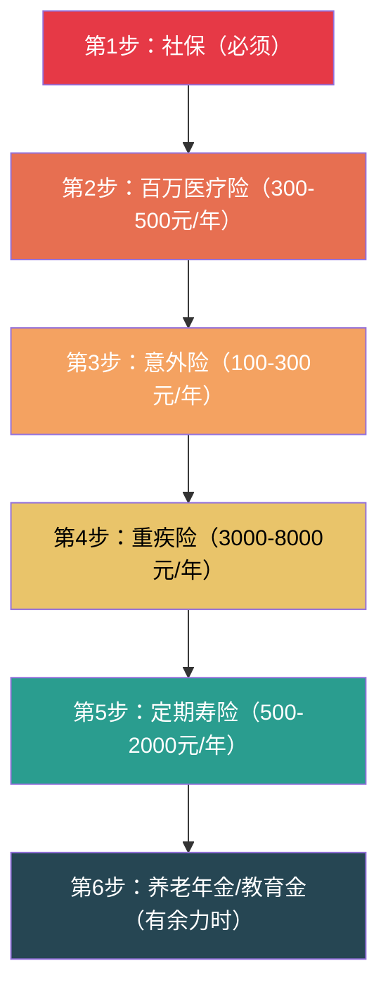

为什么是这个顺序？因为每一步解决的风险"致命程度"不同：

1. **社保**：基础中的基础，没有社保意味着看病全自费
2. **百万医疗**：解决"看不起病"的问题，几百元保费撬动几百万保额，杠杆最高
3. **意外险**：意外无处不在，100-300元就能获得几十万保障
4. **重疾险**：解决"大病后没收入"的问题，是保费最高的险种
5. **定期寿险**：解决"人没了家庭怎么办"的问题，有房贷/家庭责任时必须配
6. **年金险**：解决"老了没钱花"的问题，属于理财范畴，保障充足后再考虑

### 4.5.3 最佳购买年龄

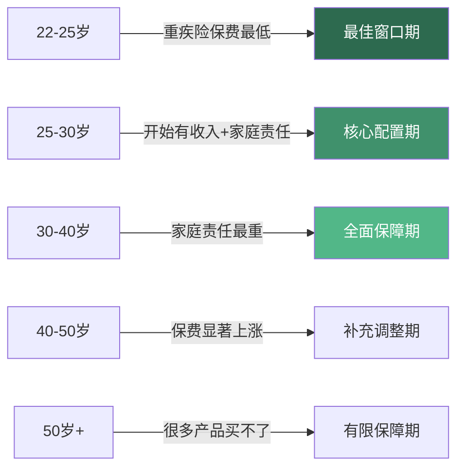

**各险种最佳购买时点**：

- **重疾险**：25-35岁。以30岁男性为例，50万保额终身重疾，25岁投保约5500元/年，35岁投保约8500元/年，晚10年多交约30%保费
- **医疗险**：任何年龄都可以，但建议趁健康时尽早购买，一旦有既往症可能被除外或拒保
- **意外险**：任何年龄，一年一买，随时可以调整
- **寿险**：成家后、有房贷后。单身无负债可以暂不配置

### 4.5.4 核保流程与实战策略

健康告知的原则和实操方法已在4.4.5节详细讲解，本节聚焦**核保流程本身**——提交健康告知后，保险公司如何评估你的风险，以及如何在核保环节争取最好的结果。

**核保的内部流程**：

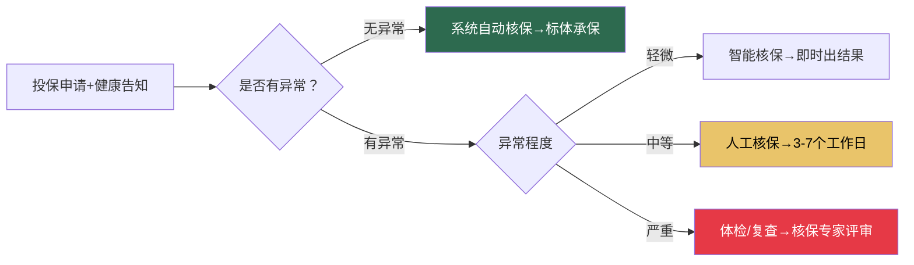

**常见核保结果及应对策略**：

| 核保结果 | 含义 | 对你的影响 | 应对策略 |
|---------|------|-----------|---------|
| **标体承保** | 正常承保 | 最好结果，正常价格 | 直接投保 |
| **加费承保** | 多交10%-50%保费 | 保障完整，只是贵一点 | 评估加费幅度是否可接受，与除外承保对比 |
| **除外承保** | 某个部位/疾病不保 | 比如"甲状腺癌除外"，其他正常 | 通常可接受——被除外的风险可通过防癌险补充 |
| **延期承保** | 需要观察一段时间 | 比如肺结节，半年后复查再决定 | 按时复查，复查结果改善后重新投保 |
| **拒保** | 买不了 | 留下正式拒保记录 | 换其他公司（核保标准不同）或转向防癌险/惠民保 |

**智能核保vs人工核保的选择策略**：

- **智能核保**：在线快速出结果（通常几分钟），关键优势是**不留记录**（不影响在其他公司投保）。适合身体有小异常但不确定能否通过的情况——先用智能核保"试水"，被拒无任何损失
- **人工核保**：更灵活，可以提交资料说明情况（如提供复查报告证明结节已缩小），但**会留正式记录**。通常需要3-7个工作日出结果。建议在智能核保被拒后再走人工核保
- **预核保**：部分平台支持预核保（正式投保前的模拟核保），不留记录，可以提前知道结果。明亚、大童等经纪平台通常提供此服务

**核保实战中的进阶技巧**：

1. **多家同时投保**：不同保险公司的核保数据库和标准不同，A公司拒保不代表B公司也拒。建议同时向3-5家公司提交申请，选核保结果最好的那家
2. **善用"除外承保"**：甲状腺结节被除外甲状腺癌承保，听起来亏了，但实际上甲状腺癌的治疗费用通常只有3-5万（远低于其他癌症），接受除外承保获得其他保障是值得的
3. **利用复查结果翻盘**：如果首次核保被延期或除外，不要放弃。定期复查后如果指标改善（如结节缩小、肝功能恢复正常），可以拿着最新的检查报告重新申请核保，有机会升级为标体承保
4. **投保顺序很重要**：先投保核保最宽松的产品（如意外险，通常不需要健康告知），确保有基础保障后再尝试核保较严的产品（如重疾险、医疗险）
5. **选择核保"窗口期"**：部分保险公司在新产品上市初期核保政策较宽松（为了冲业绩），可以关注行业动态，在窗口期投保

## 4.6 理赔实操指南

### 4.6.1 理赔流程

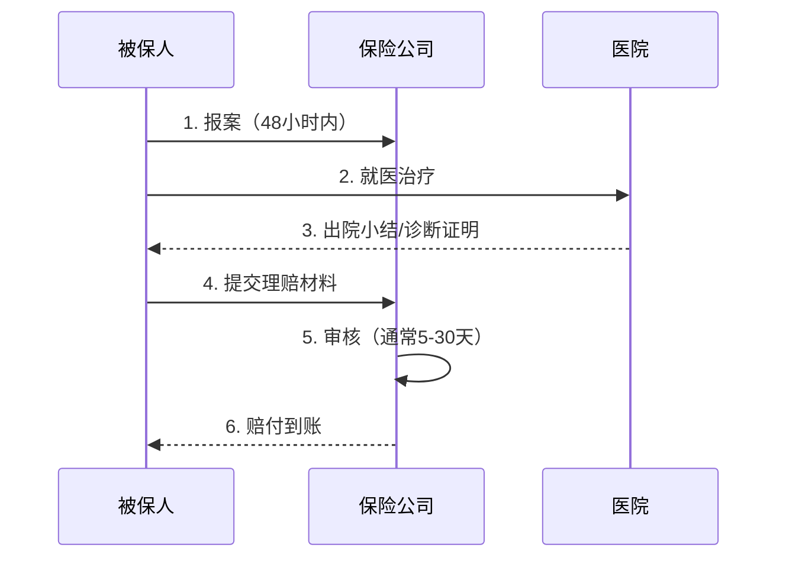

**理赔材料清单**：

| 险种 | 核心材料 | 补充材料 | 获取渠道 |
|------|---------|---------|---------|
| 医疗险 | 住院发票原件、费用清单、出院小结、病历 | 检查报告、处方 | 医院收费处+病案室 |
| 重疾险 | 诊断证明、病理报告、检查报告 | 手术记录、入院/出院记录 | 医院病理科+病案室 |
| 意外险 | 事故证明、医疗发票、伤残鉴定（伤残时） | 警方记录（交通事故时） | 医院+公安 |
| 寿险 | 死亡证明、户籍注销证明、受益人身份证明 | 法院判决书（意外身故时） | 派出所+医院 |

**理赔材料获取的实操技巧**：

| 材料 | 获取方法 | 注意事项 |
|------|---------|---------|
| 住院发票原件 | 出院时在收费处打印 | 只有一张原件，医疗险理赔需要原件（多家报销用费用分割单） |
| 费用清单 | 出院时在收费处或自助机打印 | 包含每项费用明细，核对是否有遗漏 |
| 出院小结/诊断证明 | 出院时找主治医生开具 | 务必确认诊断名称与保单条款一致 |
| 病理报告 | 在病理科窗口领取 | 通常需要5-7个工作日（手术标本需要时间处理） |
| 病历复印件 | 在病案室复印（带身份证） | 出院后2-4周病历才会归档到病案室 |
| 伤残鉴定报告 | 到保险公司认可的鉴定机构做 | 需要在治疗终结后（通常伤后6个月）才能做 |

### 4.6.2 提高理赔成功率的技巧

- **就医时就说有商业保险**：医生会在病历中注意措辞，避免使用可能影响理赔的表述
- **保留所有原件**：发票、病历、检查报告的原件都要保留。医疗险理赔需要发票原件（如果多家保险公司报销，第一家报销后会出具"费用分割单"，第二家凭分割单报销）
- **第一时间报案**：出险后48小时内报案，不要拖。报案不需要准备材料，打个电话告知出险情况即可，后续材料可以慢慢准备
- **注意病历措辞**：避免写"既往有XX病史"（除非确实有），这可能导致保险公司以未如实告知为由拒赔。具体技巧：就诊时主动告诉医生"我有商业保险，请注意措辞"
- **多家保险可以同时理赔**：给付型保险（重疾、寿险、意外身故）可以多家同时理赔，互不影响。报销型保险（医疗险）不能重复报销，但可以在一家报销后凭费用分割单去另一家报销剩余部分
- **理赔申请时效**：保险法规定理赔申请时效为5年（从知道或应当知道保险事故发生之日起算），但建议尽早申请，避免材料丢失

**就医时与医生沟通的模板话术**：

```text
"医生您好，我有商业保险需要理赔，请您在病历中注意以下几点：
1. 请准确描述发病时间和症状（不要提前发病时间）
2. 如果是首次发现的疾病，请注明'首次发现'或'首次确诊'
3. 如果既往体健，请如实记录
4. 诊断名称请使用保单条款中的标准疾病名称
感谢您的配合！"
```

### 4.6.3 理赔被拒怎么办

如果理赔被拒，不要慌张，按以下步骤处理：

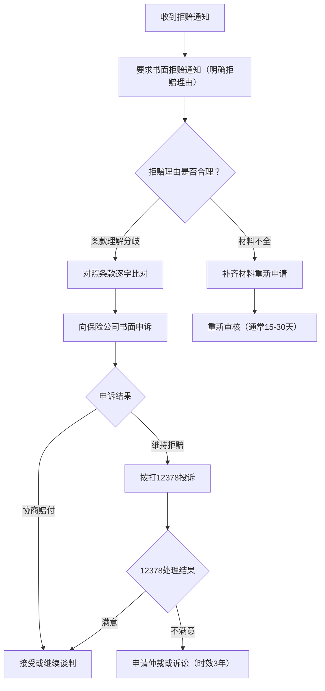

**12378投诉的正确姿势**：
- 拨打12378，按照语音提示选择投诉
- 准备好保单号、被拒赔的具体情况、你的诉求
- 投诉要具体、有理有据，不要情绪化
- 12378会将投诉转给保险公司，要求保险公司在规定时间内回复
- 投诉后保险公司通常会在3-5个工作日内主动联系你协商

**真实理赔纠纷案例**：

> **案例一：等待期内症状的争议**
> 
> 李女士投保重疾险（等待期90天），第85天体检发现甲状腺结节，第120天确诊甲状腺癌。保险公司以"等待期内发病"为由拒赔。李女士申诉称：等待期内只是发现结节，并非确诊癌症。最终保险公司协商赔付50%保额。
> 
> **教训**：投保后尽量不要在等待期内做体检（除非必要），避免触发"等待期内发病"的争议。

> **案例二：如实告知的边界**
> 
> 王先生投保时健康告知问"2年内是否住过院"，他3年前因阑尾炎住过院，没有告知。后来确诊肝癌，保险公司以"未如实告知"拒赔。王先生起诉至法院，法院认为阑尾炎住院与肝癌无因果关系，判决保险公司赔付。
> 
> **教训**：未如实告知不一定导致拒赔，关键看"未告知的事项"与"出险的疾病"之间是否有因果关系。但最安全的做法还是如实告知。

> **案例三：病历措辞导致的拒赔**
> 
> 赵先生因急性心肌梗死住院，病历中医生记录"患者既往有高血压病史5年"。赵先生投保时健康告知问"是否被诊断为高血压"，他回答了"否"。保险公司以"未如实告知高血压"为由拒赔心梗理赔。赵先生辩称自己确实不知道有高血压，但病历记录了"5年病史"，法院最终支持保险公司拒赔。
> 
> **教训**：病历措辞至关重要。如果确实不知道自己有高血压，应该要求医生修改为"本次住院发现血压升高"而非"既往有高血压病史5年"。就诊时主动告诉医生自己有商业保险，请注意措辞。

**12378投诉的详细操作指南**：

12378是中国银保监会（现国家金融监督管理总局）的消费者投诉热线，是保险理赔纠纷中最有效的外部施压手段。

**投诉前的准备工作**：

```text
□ 整理保单信息：保单号、投保日期、保障内容
□ 收集拒赔证据：书面拒赔通知、拒赔理由说明
□ 准备申诉材料：与拒赔理由相反的证据（如条款原文、医学证明）
□ 计算诉求金额：你认为应该赔付的金额及计算依据
□ 记录沟通历史：与保险公司所有沟通的时间、内容、对方姓名
```

**投诉话术模板**：

```text
"您好，我要投诉XX保险公司。我的保单号是XX，于XX年XX月投保。
XX年XX月出险后申请理赔，保险公司于XX年XX月以'XX理由'拒赔。
我认为拒赔不合理，理由如下：
1. [具体理由一]
2. [具体理由二]
我的诉求是：[具体赔付金额或要求]
请协助处理，谢谢。"
```

**投诉后的跟进**：
- 12378会在1-2个工作日内将投诉转给保险公司
- 保险公司必须在规定时间内（通常10-15个工作日）回复
- 如果保险公司拖延，可以再次拨打12378催办
- 投诉记录会被纳入保险公司的监管考核指标，所以公司通常会认真对待

**保险纠纷调解与仲裁**：

当12378投诉仍无法解决时，还有以下正式途径：

| 途径 | 适用场景 | 时间成本 | 成本 | 成功率 |
|------|---------|---------|------|--------|
| **保险行业调解** | 金额较小、争议不大 | 1-2个月 | 免费 | 约60%-70% |
| **仲裁** | 合同中有仲裁条款 | 3-6个月 | 仲裁费（按金额比例） | 约50%-60% |
| **法院诉讼** | 争议较大、金额较高 | 6-12个月 | 诉讼费+律师费 | 约65%-75%（消费者胜诉率较高） |

**诉讼的注意事项**：
- **管辖法院**：可以选择被告（保险公司）住所地或合同履行地的法院
- **诉讼时效**：保险理赔纠纷的诉讼时效为3年（从知道或应当知道保险事故发生之日起算）
- **举证责任**：保险合同纠纷中，保险公司对"免责条款已向投保人明确说明"承担举证责任——如果保险公司无法证明已尽到说明义务，免责条款不生效
- **律师费**：部分地区法院判决保险公司承担胜诉方的合理律师费
- **先调解后诉讼**：部分法院要求保险纠纷先经行业调解，调解不成再起诉

**保险纠纷调解机构**：
- 各地保险行业协会下设的保险纠纷调解委员会
- 12378热线可直接转接调解
- 部分地区的消费者协会也受理保险纠纷

### 4.6.4 线上理赔的实操流程

现在大部分保险公司都支持线上理赔，流程比传统方式更高效：

**线上理赔的标准步骤**：

1. **下载保险公司官方App**或关注官方微信公众号
2. **绑定保单**：输入保单号或身份证号，系统自动关联名下所有保单
3. **在线报案**：填写出险时间、地点、原因，上传初步材料照片
4. **上传理赔材料**：将发票、病历、检查报告等拍照上传（注意清晰度）
5. **等待审核**：保险公司在线审核，通常3-15个工作日
6. **赔付到账**：审核通过后直接打到绑定的银行账户

**线上理赔的注意事项**：
- 照片要清晰完整，四角都要拍到，避免反光和遮挡
- 发票原件需要邮寄给保险公司（部分公司接受电子发票）
- 大额理赔（通常超过5万）可能需要补充原件或面谈
- 保留所有上传材料的电子备份，以防需要补交

**理赔进度跟踪**：

| 状态 | 含义 | 预计时间 | 你需要做什么 |
|------|------|---------|------------|
| 已报案 | 保险公司已记录出险信息 | 即时 | 等待，准备材料 |
| 材料审核中 | 正在审核你提交的材料 | 3-7个工作日 | 保持电话畅通，可能需要补充材料 |
| 补充材料 | 缺少某些必要材料 | 视情况 | 在规定时间内补齐（通常15天） |
| 核赔中 | 材料齐全，正在核算赔付金额 | 5-15个工作日 | 等待 |
| 已结案 | 赔付决定已做出 | — | 确认赔付金额是否正确 |
| 已支付 | 赔付款已到账 | 1-3个工作日 | 查收银行到账 |

**理赔进度查询方式**：
- 保险公司官方App：最方便，实时查看
- 保险公司客服电话：可询问具体进度和预计时间
- 保险经纪人/代理人：如果有，可以让其代为跟进
- 12378热线：如果理赔超过30天仍无结果，可以投诉催办

### 4.6.5 完整理赔案例：从出险到赔付全过程

以下是一个完整的理赔案例，展示从出险到最终赔付的全过程，帮助读者理解实际操作中的每个环节。

**案例背景**：

陈先生，35岁，互联网公司技术总监，年收入40万。2022年配置了以下保险：
- 重疾险：50万保额（某中小保险公司，年缴5200元）
- 百万医疗险：300万保额（保证续保20年，年缴450元）
- 意外险：100万保额（含猝死保障，年缴260元）
- 定期寿险：200万保额（保至60岁，年缴1800元）

2025年3月，陈先生因持续咳嗽就医，CT发现肺部结节，进一步检查确诊为早期肺腺癌（IA期）。

**理赔全过程时间线**：

| 时间 | 事件 | 具体操作 |
|------|------|---------|
| 3月10日 | 确诊当天 | 电话报案：拨打重疾险和百万医疗险的客服电话，告知出险情况。客服记录报案号 |
| 3月10日 | 确诊当天 | 告知医生有商业保险，请注意病历措辞 |
| 3月15日 | 住院手术 | 微创手术切除肿瘤，住院5天 |
| 3月20日 | 出院 | 在收费处打印住院发票（87,000元）和费用清单；找主治医生开具出院小结和诊断证明 |
| 3月27日 | 病理报告出来 | 到病理科领取病理报告（确诊：肺腺癌IA期） |
| 4月1日 | 收集完毕 | 到病案室复印完整病历 |
| 4月2日 | 社保报销 | 先用社保报销，获得社保报销后的费用分割单 |
| 4月3日 | 百万医疗险理赔 | 在保险公司App上传：住院发票、费用清单、出院小结、社保报销凭证 |
| 4月5日 | 重疾险理赔 | 在保险公司App上传：诊断证明、病理报告、入院记录 |
| 4月10日 | 百万医疗险赔付到账 | 社保报销后自费部分23,000元，扣除1万免赔额后赔付13,000元（因社保报销后免赔额降为0，实际赔付23,000元——见4.4.3节免赔额条款解读） |
| 4月15日 | 重疾险赔付到账 | 50万理赔款打到银行账户 |
| 4月15日 | 重疾险保费豁免 | 后续20年保费（约104,000元）全部免交，保障继续有效 |
| 4月20日 | 意外险和寿险 | 本次疾病不涉及意外险和寿险理赔 |

**陈先生的理赔总结**：

```text
医疗费用总计：87,000元
社保报销：64,000元（73.6%）
百万医疗险赔付：23,000元（26.4%）
个人医疗费用负担：0元

重疾险赔付：500,000元
用途规划：
  - 康复期生活费（2年）：200,000元
  - 房贷还款（2年）：180,000元
  - 营养品和康复费用：60,000元
  - 应急储备：60,000元

保费豁免：后续20年保费约104,000元免交
总获赔金额：523,000元
总保费投入（3年）：约23,130元
杠杆倍数：523,000 / 23,130 ≈ 22.6倍
```

这个案例展示了保险配置的核心价值：每年不到8000元的保费投入，在风险发生时撬动了52.3万的赔付，覆盖了医疗费用和康复期间的全部经济需求。

## 4.7 常见误区与避坑指南

### 4.7.1 十大保险误区

| 误区 | 真相 | 数据/案例 |
|------|------|----------|
| "有社保就够了" | 社保报销有限，大病自费部分可能高达几十万 | 2023年重大疾病平均自费比例约40%-60% |
| "给孩子先买保险" | 大人才是孩子的保障，经济支柱优先配置 | 孩子生病不会导致家庭收入中断，大人生病才会 |
| "返还型保险更划算" | 返还型保费贵50%-100%，多交的保费自己理财收益更高 | 详见下方对比计算 |
| "保险是骗人的" | 是产品不对或理解有误，不是保险本身有问题 | 行业平均获赔率>97% |
| "买一份就够了" | 医疗险+重疾险+意外险+寿险功能不同，缺一不可 | 四个险种解决四个完全不同的问题 |
| "大公司理赔更容易" | 理赔看合同条款，不看公司大小 | 国家金融监督管理总局统一监管，理赔标准一致 |
| "体检异常就买不了" | 很多小异常可以标体承保或加费承保 | 甲状腺结节1-3级大部分产品可保 |
| "保险越贵越好" | 保费高可能是因为品牌溢价、渠道费用 | 同保额不同公司保费可差30%-50% |
| "网上买保险不靠谱" | 电子保单和纸质保单法律效力相同 | 《保险法》第十三条明确规定 |
| "买保险不用看条款" | 条款是理赔依据，必须认真看 | 拒赔案例90%以上与条款理解有关 |

### 4.7.2 返还型vs消费型：算一笔账

以30岁男性、50万保额、保至70岁为例：

| 对比项 | 返还型重疾险 | 消费型重疾险 |
|--------|------------|------------|
| 年缴保费 | 约8000元 | 约3500元 |
| 缴费期 | 20年 | 20年 |
| 总保费 | 16万 | 7万 |
| 70岁未出险 | 返还16万 | 不返还 |
| 差额 | 多交9万 | 省下9万 |

如果把省下的9万（实际上每年省4500元，分20年投入）做年化4%的理财，到70岁时本息合计约**18万**，比返还的16万还多。

**结论**：消费型+自己理财 > 返还型保险。返还型的"返还"本质上就是你多交的那部分钱，保险公司拿去做投资，到期还给你——但给你的收益远低于你自己投资的收益。

### 4.7.3 常见销售套路识别

- **"这款产品马上停售"**：制造紧迫感，实际上好产品很多，不急这一时。保险产品更新迭代很快，停售一款，马上会有替代品上市
- **"我们公司理赔最快"**：理赔速度看案件复杂度，不看公司大小。简单的重疾理赔，大部分公司都在15-20个工作日内完成
- **"这个产品什么都保"**：没有万能产品，什么都保往往什么都保不好。保障范围越广，每个单项的保障力度往往越弱
- **"先给孩子买教育金"**：教育金优先级最低，先把保障类险种配齐。教育金本质是理财，年化收益通常只有2%-3%，不如自己做基金定投
- **"保险可以避税避债"**：情况复杂，不是所有保险都能避债。如果是在负债之后购买的大额保险，法院可能会认定为恶意转移财产
- **"分红险收益很高"**：分红险的"分红"是不保证的，实际分红可能远低于演示利率。以"中档演示"为例，实际分红常常只达到"低档"甚至更低
- **"增额终身寿IRR有3.5%"**：2024年后监管已将增额终身寿的预定利率上限从3.5%下调至3.0%，宣传3.5%的产品要么已停售，要么存在误导。实际IRR（内部收益率）要扣除各种费用后计算，真实IRR通常低于预定利率
- **"年金险收益稳定"**：年金险的保证利率通常只有1.75%-3%，远低于宣传的"演示利率"。购买前要求保险公司提供"保证利益演示表"，只看保证部分

**销售套路的底层逻辑与识别方法**：

所有销售套路本质上都在利用三种心理机制：

| 心理机制 | 套路表现 | 识别信号 | 应对方法 |
|---------|---------|---------|---------|
| **损失厌恶** | "不买就亏了""这款产品随时停售" | 制造紧迫感，催促你当场决定 | 任何需要你"当场决定"的保险产品都不是好产品，好产品不怕你货比三家 |
| **权威效应** | "我们是世界500强""明星代言" | 用品牌光环替代产品分析 | 要求对方展示条款原文，而不是宣传材料 |
| **锚定效应** | "原价8000，现在只要5000" | 用虚高原价衬托"优惠" | 对比同类产品价格，不与"原价"比 |

**实战验证问题模板**：

当代理人推荐产品时，用以下问题逐一验证。如果对方回避或含糊其辞，基本可以判断产品不适合你：

```text
问题1："这款产品的保证利率是多少？请在条款中指出具体位置。"
       → 如果对方只说"演示利率"或"历史收益"，要警惕

问题2："如果我不买这款产品，您推荐的替代方案是什么？"
       → 好的顾问会给你多个选择，差的顾问只会推一个

问题3："这款产品的免责条款有几条？分别是什么？"
       → 如果对方答不上来或回避，说明他自己也没仔细看过条款

问题4："您自己买了这款产品吗？买了多少保额？"
       → 这个问题能过滤掉大多数"自己都不信"的推销员

问题5："我回去对比一下其他产品，明天再联系您可以吗？"
       → 如果对方强烈阻止你对比，说明产品可能经不起比较
```

### 4.7.4 投连险与万能险：看起来很美的陷阱

在所有保险产品中，**投资连结险（投连险）和万能险**是最容易让人踩坑的两类。它们号称"保障+投资两不误"，但实际上往往两头都做不好。

**万能险的运作机制**：

万能险有一个"万能账户"，你交的保费扣除初始费用后进入账户，按结算利率增值。听起来很好，但问题是：

| 费用项 | 具体说明 | 影响 |
|--------|---------|------|
| 初始费用 | 第1年扣50%-60%，第2年扣25%-30%，逐年递减 | 前几年实际进入账户的钱很少 |
| 保障成本 | 每月从账户扣除风险保障费用，随年龄增长而增加 | 年龄越大扣得越多，账户增值被侵蚀 |
| 退保费用 | 前5年退保扣1%-5%不等 | 前几年退保损失大 |
| 保底利率 | 通常1.75%-2.5%（写入合同的才是保证的） | 演示利率4%-5%不保证，实际可能只拿到保底 |

**万能险的真实收益计算**：

以某万能险为例，年交保费1万元，保底利率2.5%，演示利率4.5%：
- 第1年：扣除初始费用60%，实际进入账户4000元
- 第2年：扣除初始费用30%，实际进入账户7000元
- 第3年起：扣除初始费用5%，实际进入账户9500元
- 每月还要扣除保障成本（30岁时约50元/月，50岁时约200元/月）

前5年的实际IRR通常为**负数**，10年后的实际IRR通常只有1%-2%，远低于宣传的4.5%。如果你把同样的钱买消费型保险+余额做理财，收益远高于万能险。

**投连险的风险更高**：

投连险没有保底利率，账户价值完全取决于投资表现。如果市场不好，你可能亏损本金——而你同时还交着不低的保障费用。投连险本质上是"用保险的包装卖基金"，但管理费和初始费用远高于直接买基金。

**正确做法**：保障归保障，投资归投资。买纯保障型产品（消费型重疾险、定期寿险），省下的保费自己做投资，收益和灵活性都远优于万能险/投连险。

### 4.7.5 保险中的关键时间节点

保险合同中有多个重要的时间节点，错过任何一个都可能造成损失：

| 时间节点 | 期限 | 含义 | 错过的后果 |
|---------|------|------|-----------|
| **犹豫期** | 10-20天（签收保单后） | 可无条件全额退保 | 过了犹豫期退保只能拿回现金价值，损失巨大 |
| **等待期** | 90-180天（投保后） | 等待期内出险不赔 | 如果在等待期内确诊，该次疾病不赔（部分产品合同终止） |
| **宽限期** | 60天（应缴费日起） | 宽限期内保障仍有效 | 过了宽限期保单中止，保障完全停止 |
| **中止期** | 2年（保单中止后） | 可申请复效 | 超过2年保险公司有权解除合同，保单彻底失效 |
| **理赔时效** | 5年（出险后） | 必须在5年内申请理赔 | 超过时效可能丧失理赔权利 |
| **诉讼时效** | 3年（拒赔后） | 必须在3年内起诉 | 超过时效丧失胜诉权 |
| **复效等待期** | 90-180天（复效后） | 复效后重新计算等待期 | 复效后等待期内出险不赔 |

**最关键的三个时间节点**：
1. **犹豫期**：收到保单后立刻仔细阅读条款，10天内发现问题可以无损退保
2. **宽限期**：忘记缴费后有60天缓冲，但这60天内保障仍然有效——如果在宽限期内出险，保险公司仍然赔付（但会扣除欠交保费）
3. **理赔时效**：出险后5年内都可以申请理赔，但建议尽早申请——时间越长，材料越难收集

### 4.7.6 保险欺诈与防骗指南

近年来保险相关诈骗案件频发，消费者需要提高警惕。以下是最常见的保险诈骗类型及防范方法。

**常见保险诈骗类型**：

| 诈骗类型 | 具体手法 | 识别方法 | 应对措施 |
|---------|---------|---------|---------|
| **假保单诈骗** | 伪造保险公司的电子保单，收取保费后消失 | 在保险公司官网或App验证保单号 | 只通过官方渠道投保，收到保单后立即验证 |
| **代理退保黑产** | 声称可以"全额退保"，收取30%-50%手续费 | 任何承诺"全额退保"的都是骗局或违规操作 | 退保直接联系保险公司，不找第三方 |
| **虚假理赔** | 伪造医疗材料骗取理赔金 | 保险公司有专业调查团队 | 诚实理赔，伪造材料属刑事犯罪 |
| **冒充客服** | 冒充保险公司客服，要求提供银行卡信息 | 保险公司不会通过电话索要银行卡密码 | 挂断电话，拨打官方客服核实 |
| **传销式保险** | 以"高收益理财"名义拉人头卖保险 | 正规保险不需要发展下线 | 遇到"拉人返佣"模式立即远离 |

**"代理退保"黑产详解**：

这是近年最猖獗的保险诈骗形式之一。黑产中介通过短视频平台、社交媒体发布"全额退保"广告，诱导消费者委托其代理退保。具体流程：

1. 中介要求你提供保单、身份证、银行卡等敏感信息
2. 中介以你的名义向保险公司恶意投诉（如编造"销售误导"）
3. 如果成功退保，中介收取30%-50%的手续费
4. 你的保障彻底丧失，再想投保可能因年龄增长或健康变化而无法购买

**风险警示**：代理退保不仅会让你损失保障，还可能导致个人信息泄露、被用于其他违法活动。2023年国家金融监督管理总局已明确将"代理退保"列为重点打击的违法行为。如果对保单有疑问，直接拨打保险公司官方客服或12378热线。

## 4.8 进阶：高阶保险配置策略

### 4.8.1 家庭保障整体规划

不要按个人买，要按家庭整体规划：

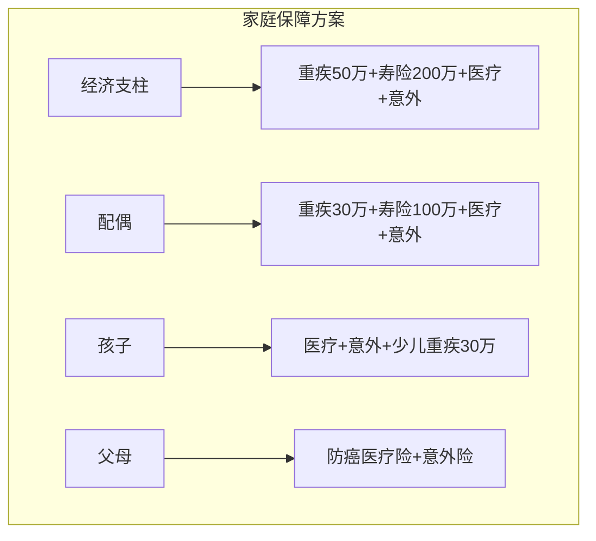

**原则**：
- 经济支柱保额最高（家庭收入主要来源）
- 夫妻双方都要配（任何一方出事都会影响家庭）
- 孩子不买寿险（孩子不承担经济责任）
- 父母优先买医疗险（年龄大，重疾险保费倒挂，防癌险是替代方案）

**家庭保障预算分配示例**（家庭年收入30万）：

| 成员 | 年保费 | 占比 | 说明 |
|------|--------|------|------|
| 经济支柱（丈夫） | 8000元 | 44% | 保额最高 |
| 配偶（妻子） | 5000元 | 28% | 保额次之 |
| 孩子 | 3000元 | 17% | 医疗+意外+重疾 |
| 父母（一方） | 2000元 | 11% | 防癌医疗+意外 |
| **合计** | **18000元** | **100%** | 占家庭收入6% |

#### 典型家庭保险方案详解

以一个常见的"双职工+1孩+4老"家庭为例，提供完整的保险配置方案参考：

**家庭情况**：
- 丈夫：32岁，程序员，年收入25万
- 妻子：30岁，教师，年收入12万
- 孩子：2岁
- 双方父母：均55-60岁，有社保

**丈夫的保险配置**（年保费约9500元）：

| 险种 | 产品类型 | 保额 | 年保费 | 关键选择理由 |
|------|---------|------|--------|------------|
| 百万医疗险 | 保证续保20年 | 300万 | 400元 | 续保条件最重要 |
| 意外险 | 综合意外 | 100万 | 260元 | 含猝死保障（程序员必备） |
| 重疾险 | 消费型终身+定期组合 | 50万（终身20万+定期30万） | 5800元 | 组合方案降低保费 |
| 定期寿险 | 保至60岁 | 200万 | 1800元 | 覆盖房贷+家庭3年开支 |
| 投保人豁免 | 附加 | — | 200元 | 为妻子保单附加 |

**妻子的保险配置**（年保费约5500元）：

| 险种 | 产品类型 | 保额 | 年保费 |
|------|---------|------|--------|
| 百万医疗险 | 保证续保20年 | 300万 | 350元 |
| 意外险 | 综合意外 | 50万 | 150元 |
| 重疾险 | 消费型终身 | 30万 | 3200元 |
| 定期寿险 | 保至60岁 | 100万 | 600元 |
| 投保人豁免 | 附加 | — | 150元 |

**孩子的保险配置**（年保费约2800元）：

| 险种 | 产品类型 | 保额 | 年保费 |
|------|---------|------|--------|
| 百万医疗险 | 保证续保20年 | 300万 | 600元 |
| 意外险 | 少儿意外 | 20万 | 60元 |
| 少儿重疾险 | 消费型定期（保30年） | 50万 | 800元 |
| 小额医疗险 | 门诊+住院 | 1万 | 500元 |

**父母的保险配置**（每位老人年保费约2000-3000元）：

| 险种 | 产品类型 | 保额 | 年保费 | 说明 |
|------|---------|------|--------|------|
| 防癌医疗险 | 终身保证续保 | 200万 | 1200元 | 三高可投 |
| 意外险 | 老年意外 | 20万 | 200元 | 含骨折保障 |
| 惠民保 | 当地惠民保 | 100万 | 100元 | 兜底保障 |

**家庭总保费**：约9500 + 5500 + 2800 + 2×2500 = **22,800元/年**，占家庭年收入的6.2%，在合理范围内。

### 4.8.2 加保策略

随着收入增长和家庭责任变化，需要定期加保：

- **收入增长30%以上**：考虑增加重疾险和寿险保额
- **买房后**：立即增加定期寿险，保额覆盖房贷
- **生娃后**：增加寿险保额（多一个需要抚养的人），为孩子配置基础保障
- **每3年检视一次**：对照当前保障和需求，查漏补缺
- **升职/创业后**：收入结构变化，可能需要调整保额和险种

**加保的注意事项**：
- 加保不是"换产品"，而是在已有保障基础上增加保额
- 如果之前的产品性价比不高，可以考虑用新产品替代旧产品（但要注意等待期重叠问题）
- 加保时身体状况可能已不如从前，提前规划很重要

**保单替换的决策流程**：

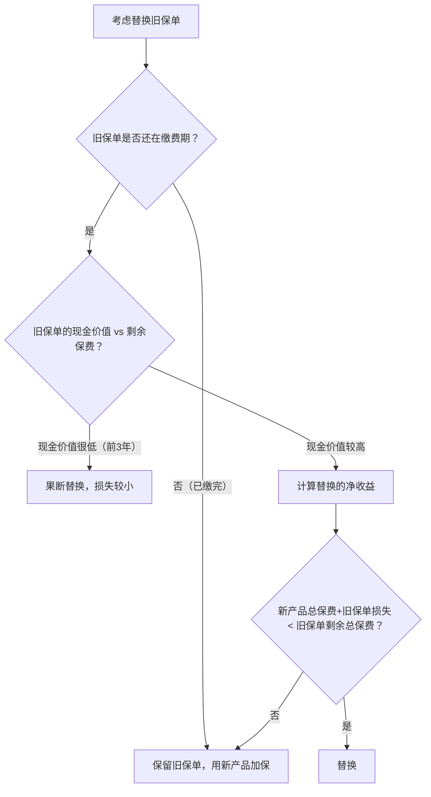

#### 通货膨胀对保障的侵蚀

很多人买了保险后就以为"搞定了"，但忽略了通货膨胀的侵蚀效应。以3%的年通胀率计算：

| 保额 | 今天购买力 | 10年后实际购买力 | 20年后实际购买力 | 30年后实际购买力 |
|------|-----------|----------------|----------------|----------------|
| 50万 | 50万 | 37.2万 | 27.6万 | 20.6万 |
| 100万 | 100万 | 74.4万 | 55.4万 | 41.2万 |
| 200万 | 200万 | 148.8万 | 110.7万 | 82.4万 |

**核心问题**：你今天买的50万重疾险，30年后实际购买力只相当于今天的20万。而30年后你恰恰是重疾高发年龄段。

**应对策略**：

1. **初期保额适度偏高**：如果预算允许，初次投保时保额比当前需求高20%-30%，预留通胀空间
2. **定期加保**：每5-8年评估一次保额是否仍然充足，根据通胀和收入增长情况加保
3. **选择保额递增的产品**：部分重疾险和寿险有"保额递增"功能（如每年递增3%），可以在一定程度上对冲通胀
4. **不要过度依赖早期保单**：25岁时买的50万重疾险到55岁时保障力度已大打折扣，需要适时补充

**不同险种受通胀影响的程度**：

| 险种 | 受通胀影响 | 原因 | 应对方式 |
|------|-----------|------|---------|
| 重疾险 | **大** | 保额固定，医疗费用随通胀上涨 | 定期加保 |
| 医疗险 | **小** | 报销型，按实际医疗费用赔付 | 选择续保条件好的产品 |
| 意外险 | **中** | 保额固定，但意外伤残赔付随保额定 | 每年续保时可调整保额 |
| 寿险 | **大** | 保额固定，家庭负债和生活成本随通胀增加 | 买房/收入增长时加保 |

### 4.8.3 保单复效：失效保单的挽救方法

保单因未按时缴费而中止后，在一定期限内可以申请复效（恢复效力）。

**复效的基本条件**：

| 条件 | 说明 |
|------|------|
| 申请时限 | 保单中止后2年内（超过2年保险公司有权解除合同） |
| 补缴保费 | 需补缴欠交保费及利息（利率通常3%-5%） |
| 健康告知 | 需重新进行健康告知（这是复效的最大风险点） |
| 等待期 | 部分产品复效后重新计算等待期 |

**复效的风险**：

复效最大的风险在于**重新健康告知**。如果你在保单中止期间体检发现了新的健康问题（如结节、血压升高、血糖异常），复效时必须如实告知，可能导致：
- 加费承保：保费增加10%-30%
- 除外承保：某些疾病不保
- 拒绝复效：保单彻底失效

**保单中止期间的保障真空**：

保单中止后到复效成功前，保障完全停止。如果在这期间出险，保险公司不承担赔付责任。这就是为什么设置自动扣费、确保扣费银行卡余额充足如此重要。

**实操建议**：
- 设置缴费日历提醒（手机日历+闹钟双重提醒）
- 确保扣费银行卡在缴费日前后一周内有足够余额
- 如果确实忘记缴费，在60天宽限期内尽快补缴（宽限期内保障仍然有效）
- 如果超过60天进入中止期，立即申请复效，不要拖到接近2年
- 复效前先做一次体检，确认健康状况没有重大变化

### 4.8.4 保单贷款与现金价值运用

部分保险产品（如终身寿险、增额终身寿险、年金险）有**现金价值**，可以用于保单贷款。

**现金价值的形成**：
```text
现金价值 = 已交保费 - 保险成本 - 运营费用 + 投资收益
```

现金价值在保单前期较低（因为保险公司扣除了大量运营成本），随缴费年限增长而逐渐增加。终身寿险通常在缴费10年以后，现金价值会接近甚至超过已交保费。

**保单贷款的详细机制**：

| 维度 | 说明 |
|------|------|
| 贷款额度 | 现金价值的80%（监管上限） |
| 贷款利率 | 通常4.5%-5.5%（低于信用贷款，高于房贷） |
| 贷款期限 | 通常6个月，到期可续贷（只还利息即可续） |
| 用途 | 不限，可用于应急资金、周转、甚至投资 |
| 审批速度 | 通常1-3个工作日（远快于银行贷款） |
| 征信影响 | 不上征信（保单贷款不属于银行信贷） |
| 保障影响 | 不影响保单效力（保障继续有效） |

**保单贷款vs其他融资方式对比**：

| 融资方式 | 利率 | 审批速度 | 是否影响征信 | 需要抵押 | 适合场景 |
|---------|------|---------|------------|---------|---------|
| 保单贷款 | 4.5%-5.5% | 1-3天 | 否 | 否（以现金价值为担保） | 短期应急周转 |
| 银行信用贷款 | 5%-15% | 3-7天 | 是 | 否 | 较大金额需求 |
| 信用卡分期 | 12%-18% | 即时 | 是 | 否 | 消费分期 |
| 房屋抵押贷款 | 3.5%-5% | 15-30天 | 是 | 是 | 大额长期贷款 |
| 亲友借款 | 0% | 即时 | 否 | 否 | 人情成本高 |

**典型场景详解**：

**场景一：紧急医疗费用周转**。陈先生的父亲突发疾病需要手术费30万，而他的定期理财还有2个月才到期。他用终身寿险（现金价值40万）申请保单贷款24万（80%），利率5%，3天到账。2个月后理财到期，偿还本息约24.2万，总利息成本仅2000元，避免了提前赎回理财的损失。

**场景二：创业资金周转**。李女士创业初期需要一笔过桥资金，不想卖股票（看好后市）。她用增额终身寿险（现金价值60万）贷款48万，用3个月后项目回款归还。利率5%，3个月利息6000元，保单保障不受影响，股票也继续持有并上涨了15%。

**注意事项**：
- 贷款金额不要超过现金价值的80%，否则保单可能失效
- 如果贷款本息超过现金价值，保单会自动终止（保险公司会提前通知）
- 长期贷款（超过1年）建议每6个月还一次利息，避免利滚利
- 保单贷款适合短期周转（6个月以内），不建议作为长期融资手段

**现金价值的特殊运用——减额交清**：

如果不想继续缴费但又不想退保，可以选择"减额交清"——用现有现金价值作为一次性保费，购买一份保额降低但不需要再缴费的保单。比如你已交了5年重疾险保费，现金价值有3万，可以选择减额交清，保额从50万降到15万，但后续15年保费不用再交了。这比直接退保划算，因为你仍然保留了一定的保障。

**退保的正确姿势**：

退保是最后的选择，但如果确实需要退保，注意以下几点：
- 犹豫期内退保（10-20天）：全额退还保费，无损失
- 犹豫期后退保：只能拿回现金价值，前几年损失巨大（第1年退保通常只能拿回已交保费的10%-30%）
- 退保前先确认新保障已到位：不要裸退（先买好新产品、等等待期过了再退旧产品）
- 退保的最佳时点：如果决定退保，在下一个缴费日前退保，避免多交一年保费

### 4.8.5 保险与投资的配合

保险解决的是"极端风险"，投资解决的是"财富增值"，两者配合才能构建完整的财务安全体系：

| 财务目标 | 工具 | 优先级 | 说明 |
|---------|------|-------|------|
| 大病风险 | 重疾险+医疗险 | 最高 | 保障类，必须优先 |
| 身故风险 | 定期寿险 | 高 | 有家庭责任时必须 |
| 意外风险 | 意外险 | 高 | 保费低，杠杆高 |
| 子女教育 | 教育金定投（基金） | 中 | 保障充足后再考虑 |
| 养老规划 | 养老年金+个人养老金 | 中 | 长期规划 |
| 财富增值 | 指数基金/股票 | 低 | 保障充足后的进阶 |

**核心原则**：先把保障做足，再考虑投资。用保险锁定风险下限，用投资追求收益上限。

**个人养老金账户**：2022年起中国推出个人养老金制度，每年可存入最高12000元，享受税收优惠（存入金额可抵扣个税）。账户内可购买养老目标基金、养老储蓄、养老保险、养老理财四类产品。对于个税税率在10%以上的人群，个人养老金账户有明显的节税效果。

**个人养老金的实操要点**：

| 维度 | 说明 |
|------|------|
| 开户条件 | 已参加城镇职工或城乡居民基本养老保险 |
| 年缴上限 | 12000元/年 |
| 税收优惠 | 存入时抵扣个税，领取时按3%缴税 |
| 节税测算 | 税率10%→节税1200元，税率20%→节税2400元，税率30%→节税3600元 |
| 投资选择 | 养老目标基金、养老储蓄、养老保险、养老理财 |
| 领取条件 | 退休、完全丧失劳动能力、出国定居、身故 |
| 开户渠道 | 各大银行App均可开户 |

### 4.8.6 保单管理方法

很多人买了保险后就把保单丢在一边，等到需要理赔时找不到保单、不知道保了什么。以下是系统的保单管理方法：

**保单整理清单**（建议用表格或Excel记录）：

| 字段 | 内容 |
|------|------|
| 保险公司 | 公司名称 |
| 产品名称 | 具体产品名 |
| 险种类型 | 医疗/重疾/意外/寿险 |
| 被保人 | 谁被保 |
| 保额 | 赔付金额 |
| 年缴保费 | 每年交多少 |
| 缴费期限 | 交多少年 |
| 保障期限 | 保到什么时候 |
| 保单号 | 理赔时需要 |
| 客服电话 | 出险时拨打 |
| 生效日期 | 了解等待期 |
| 受益人 | 指定的受益人及比例 |

**保单管理的三个动作**：
1. **整理**：把所有保单信息汇总到一个文档中（电子版+纸质版）
2. **告知**：让家人知道保单的存放位置和保险公司联系方式。很多人出险后家属不知道有商业保险，白白错过了理赔
3. **检视**：每年检查一次保单，确认缴费正常、受益人是否需要更新、保障是否仍然充足

**保单整理工具推荐**：
- **保险公司的官方App**：大多数保险公司支持电子保单查看和管理
- **金事通App**（中国银保信（银保监会下属机构）官方出品）：可查询名下所有保险公司的保单，一键汇总，是最权威的保单查询工具
- **深蓝保小程序**：支持拍照识别保单，自动生成保障分析报告
- **Excel/飞书表格**：手动整理最灵活，可以自定义字段和筛选条件

**受益人的指定**：
- **一定要指定受益人**，不要选"法定"。法定受益人意味着保险金作为遗产分配，可能涉及继承纠纷和遗产税
- 指定受益人可以精确到比例，比如"配偶60%、子女40%"
- 受益人变更需要书面申请，通常免费
- 受益人可以指定多人，建议至少指定2人，避免唯一受益人先于被保人身故的情况

#### 年度保单检视清单

每年至少进行一次保单检视，以下是完整的检视流程：

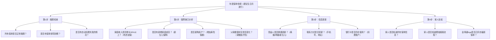

**检视时的常见发现**：
- **重复投保**：有些人在不同渠道购买了功能重叠的产品（比如两份百万医疗险），可以退掉一份
- **保障不足**：收入增长后保额没有跟上，需要加保
- **保单失效**：忘记缴费导致保单中止，需要尽快复效
- **受益人未指定**：很多保单的受益人选了"法定"，需要改为指定受益人
- **保障过时**：早期购买的产品性价比低，可以用新产品替代

### 4.8.7 重大人生事件的保险调整清单

保险配置不是一劳永逸的，每次重大人生事件都需要重新审视保障方案。

**结婚**：
- 受益人变更：将受益人从"父母"调整为"配偶"或"配偶+父母"（按比例分配）
- 互相投保：夫妻互保并附加投保人豁免，一方出险另一方保费全免
- 寿险加保：结婚意味着多了一个需要你照顾的人，寿险保额需要增加
- 保费预算重新分配：从"个人预算"转为"家庭预算"（家庭年收入的5%-10%）

**买房**：
- 立即配置定期寿险：保额≥房贷余额，保障期限≥房贷剩余年限
- 原因：如果贷款人身故，房贷不会消失，配偶/家人需要继续还款
- 时机：在签订购房合同后、放款前完成寿险配置（等待期90天，越早越好）

**生子**：
- 经济支柱加保：寿险保额增加一个孩子的教育和抚养费用（约50-80万）
- 为孩子配置基础保障：百万医疗+意外+少儿重疾（总保费约2000-3000元/年）
- 不要给孩子买寿险：孩子不承担家庭经济责任，寿险无意义
- 不要给孩子买教育金：先把保障做足，教育金用基金定投替代

**离婚**：
- 受益人必须变更：将前配偶从受益人中移除（否则身故赔付金归前配偶所有）
- 保单分割：婚姻期间购买的保单属于共同财产，离婚时需要协商分割
- 保费来源调整：原由一方缴纳的保单，可能需要变更投保人
- 孩子保障：确定孩子的抚养权后，由抚养方负责孩子的保险配置

**换工作/创业**：
- 团险空窗期：离职后团险立即失效，入职新公司团险通常有3个月等待期
- 提前配置个人保险：不要依赖团险，个人保险是"铁打的保障"
- 收入变化：收入增长30%以上考虑加保；收入下降考虑调整为消费型产品
- 创业者特殊需求：考虑配置关键人保险（企业主身故/重疾时，保险公司赔付企业一笔资金用于过渡）

**退休**：
- 重疾险保额可能不足：30年前买的50万保额，考虑通胀后实际购买力大幅缩水
- 医疗险续保：确认百万医疗险仍在续保期内，到期后考虑防癌医疗险
- 意外险调整：增加骨折保障（老年人骨折发生率显著上升）
- 年金险领取：确认年金险的领取时间和方式，做好现金流规划

## 4.9 保险配置检查清单

在完成保险配置后，用以下清单逐一检查：

**基础配置检查**：
- [ ] 社保是否正常缴纳
- [ ] 百万医疗险是否已购买（保额≥100万，优选保证续保20年的产品）
- [ ] 意外险是否已购买（保额≥50万，含猝死保障，意外医疗0免赔）
- [ ] 重疾险保额是否≥年收入×3（优先消费型，选最长缴费期）
- [ ] 有房贷/家庭责任的人是否有定期寿险（保额覆盖房贷+家庭3年开支）

**细节检查**：
- [ ] 所有保单受益人是否已指定（不要选"法定"）
- [ ] 家人是否知道保单信息（保险公司、保单号、客服电话）
- [ ] 是否仔细阅读了每份保单的"保险责任"和"责任免除"
- [ ] 保单是否每年检视一次
- [ ] 保险预算是否在家庭年收入的10%以内

**进阶检查**：
- [ ] 是否避免了返还型、万能型等低性价比产品
- [ ] 百万医疗险是否覆盖外购药（报销比例100%）
- [ ] 重疾险是否覆盖高发轻症（轻度恶性肿瘤、较轻急性心梗、轻度脑中风）
- [ ] 父母是否配置了防癌医疗险或百万医疗险
- [ ] 保单信息是否已汇总整理并告知家人
- [ ] 是否使用金事通App查询并备份了所有保单
- [ ] 缴费银行卡是否有足够余额（避免保单失效）
- [ ] 是否已下载各保险公司官方App（便于在线报案和理赔）

## 4.10 实用工具推荐

| 工具/平台 | 用途 | 说明 |
|-----------|------|------|
| 深蓝保 | 保险产品测评对比 | 独立第三方，内容相对客观，有产品对比工具 |
| 蜗牛保险 | 保险方案定制 | 提供免费方案，可以参考但不要盲从 |
| 金事通App | 保单查询汇总 | 中国银保信（银保监会下属机构）官方出品，查询名下所有保单 |
| 国家金融监督管理总局官网 | 查询保险产品备案 | 确认产品是否正规，查询保险公司偿付能力 |
| 保险师/小雨伞 | 保险产品对比 | 多产品横向对比，支持在线投保 |
| 12378热线 | 保险投诉 | 理赔纠纷时使用，最有效的外部施压方式 |
| 各保险公司官方App | 保单管理/在线理赔 | 电子保单查看、在线报案、上传理赔材料 |
| 国家医保服务平台App | 社保查询 | 查询医保余额、报销记录、办理家庭共济 |
| 中国裁判文书网 | 理判案例参考 | 搜索保险理赔纠纷判决，了解法院裁判倾向 |

### 4.10.1 互联网保险的新趋势

互联网保险正在深刻改变传统保险行业的运作方式。了解这些趋势，能帮助你更好地利用新工具、新渠道。

**智能核保的进化**：

传统核保需要3-7个工作日，且结果不透明。智能核保系统通过算法实时评估健康风险，几分钟内出结果。目前主流智能核保系统的特点：

| 特点 | 说明 | 对消费者的影响 |
|------|------|--------------|
| 即时出结果 | 填写健康告知后立即显示核保结论 | 不用等待3-7天 |
| 不留记录 | 智能核保的拒保不计入正式拒保记录 | 可以大胆"试水"，被拒无损失 |
| 标准化评估 | 算法统一标准，减少人为偏差 | 核保结果更公平 |
| 局限性 | 只能处理标准化的健康异常 | 复杂病例仍需人工核保 |

**保险科技（InsurTech）的应用**：

- **区块链保单存证**：部分保险公司已将保单信息上链，确保保单不可篡改、永久可查
- **AI理赔审核**：小额理赔（通常5000元以下）已实现AI自动审核，最快几分钟到账
- **可穿戴设备定价**：部分健康险开始引入可穿戴设备数据（如运动量、心率），健康行为好的人可以享受更低保费
- **健康管理服务**：越来越多的医疗险附带在线问诊、健康评估、慢病管理等服务，从"事后赔付"转向"事前预防"

**值得关注的平台**：

| 平台类型 | 代表 | 特点 | 适合人群 |
|---------|------|------|---------|
| 保险超市 | 蚂蚁保、微保 | 产品丰富，支持自助对比 | 有一定保险知识的人 |
| 智能推荐 | 蜗牛保险、小帮规划 | 根据需求智能推荐方案 | 保险小白 |
| 独立测评 | 深蓝保、保二爷 | 独立第三方测评，相对客观 | 做决策前参考 |
| 经纪平台 | 明亚、大童、永达理 | 代理多家产品，可定制方案 | 需要专业服务的人 |

**注意**：无论使用哪个平台，最终都要回到**条款原文**来判断产品好坏。平台推荐只是起点，不是终点。

## 4.11 自制保险需求计算器

除了使用工具平台，你也可以用Excel或在线表格自制保险需求计算器。以下是一个实用的模板框架：

**Step 1：收集基础数据**

| 数据项 | 填写 | 说明 |
|--------|------|------|
| 年龄 | ___岁 | 影响所有险种保费 |
| 年收入 | ___万元 | 决定保额需求 |
| 配偶年收入 | ___万元 | 决定配偶保额 |
| 房贷余额 | ___万元 | 寿险保额的核心参考 |
| 车贷余额 | ___万元 | 寿险保额参考 |
| 子女数量 | ___人 | 影响寿险保额 |
| 子女年龄 | ___岁 | 决定保障期限 |
| 父母年龄 | ___岁 | 影响赡养费用估算 |
| 现有存款 | ___万元 | 可对冲部分风险 |
| 现有保额 | ___万元 | 避免重复投保 |

**Step 2：计算各险种保额需求**

```text
重疾险保额 = 年收入 × 3~5 + 康复费用（20~30万）
寿险保额 = 房贷余额 + 子女教育费 + 父母赡养费 + 家庭3年生活费 - 存款
意外险保额 = 年收入 × 10
医疗险保额 = 100万以上（百万医疗即可）
```

**Step 3：预算分配**

```text
家庭年保费预算 = 家庭年收入 × 5%~10%
分配建议：
  经济支柱：40%-50%
  配偶：25%-35%
  孩子：10%-15%
  父母：10%-15%
```

**Step 4：缺口分析**

```text
保障缺口 = 应有保额 - 已有保额
预算缺口 = 所需保费 - 可用预算
优先级排序：缺口最大的险种优先配置
```

这个计算框架虽然简单，但覆盖了保险需求分析的核心逻辑。建议每年用这个框架做一次保障检视，确保保障与需求匹配。

---

### 4.11.1 保险核心术语速查表

在阅读保险条款和与保险从业者沟通时，以下术语会频繁出现。掌握这些术语，能让你在保险配置中更加从容。

| 术语 | 英文 | 定义 | 实际影响 |
|------|------|------|---------|
| **保额** | Sum Insured | 保险公司赔付的最高金额 | 保额不足等于白买 |
| **保费** | Premium | 你交给保险公司的钱 | 保费≠保额，保费通常远低于保额 |
| **等待期** | Waiting Period | 投保后等待保障生效的期间 | 等待期内出险不赔 |
| **犹豫期** | Free Look Period | 可无条件退保的期间 | 通常10-20天，退保全额退还保费 |
| **宽限期** | Grace Period | 缴费到期后允许延迟的期间 | 通常60天，宽限期内保障仍有效 |
| **现金价值** | Cash Value | 退保时能拿回的金额 | 前几年远低于已交保费 |
| **免赔额** | Deductible | 保险公司不赔付的部分 | 1万免赔额意味着自费1万后才开始报销 |
| **报销比例** | Reimbursement Ratio | 保险公司报销的比例 | 80%报销意味着自己承担20% |
| **标体承保** | Standard Issue | 以正常费率承保 | 最好的核保结果 |
| **除外承保** | Exclusion | 某个部位/疾病不保 | 其他保障不受影响 |
| **加费承保** | Rated | 多交保费承保 | 保障完整，只是贵一点 |
| **拒保** | Decline | 保险公司拒绝承保 | 留下拒保记录，影响后续投保 |
| **核保** | Underwriting | 保险公司评估你的风险 | 决定你能否投保及保费高低 |
| **理赔** | Claim | 出险后向保险公司申请赔付 | 材料完整、措辞准确是关键 |
| **受益人** | Beneficiary | 获得赔付金的人 | 指定优于法定，避免继承纠纷 |
| **保费豁免** | Waiver of Premium | 出险后免交后续保费 | 杠杆极高的附加功能 |
| **减额交清** | Paid-up | 用现金价值购买低保额免交保单 | 比退保划算 |

## 4.12 保险配置的常见时间线陷阱

很多人在购买保险时踩过以下时间相关的坑：

| 陷阱 | 具体表现 | 正确做法 |
|------|---------|---------|
| **等待期内体检** | 投保后第60天单位体检发现结节，触发"等待期内发病"争议 | 投保前做完体检；等待期内非必要不体检 |
| **犹豫期后后悔** | 买了不适合的产品，犹豫期过了才意识到，退保损失大 | 收到保单后立即仔细阅读，10天犹豫期内做决定 |
| **换工作保障空窗** | 离职后团险失效，新公司团险要3个月后才生效 | 个人保险先于团险配置，不要依赖团险 |
| **续保忘记缴费** | 一年期医疗险到期忘记续保，保障中断 | 设置自动续费，或在到期前30天设置提醒 |
| **保单中止后出险** | 忘记缴费超过60天，保单中止期间确诊重疾 | 确保扣费卡余额充足，设置多层提醒 |
| **年龄误报** | 投保时填错出生日期，影响保费计算和理赔 | 以身份证日期为准，投保时仔细核对 |
| **受益人未及时变更** | 离婚后保单受益人仍是前配偶 | 婚姻状态变化后第一时间变更受益人 |

---

## 4.13 本节知识体系总览

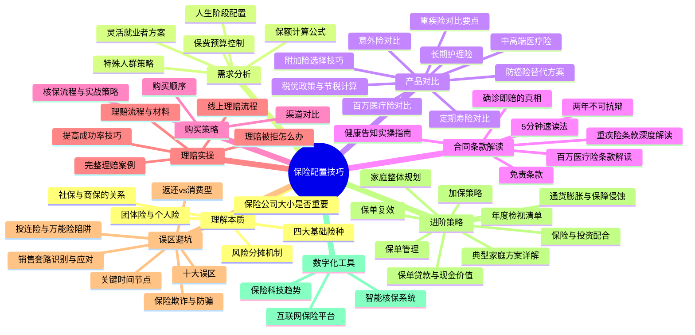

---

> **本节核心要点**：
>
> **道——理解本质**：保险是用确定的小额支出对冲不确定的巨额损失，是普通人能合法使用的最高杠杆金融工具。保险不是投资，不要期待"回本"。
>
> **法——配置原则**：遵循"先保障后理财、先大人后小孩、先经济支柱后其他成员"的原则。保额充足比品牌更重要，消费型产品性价比通常优于返还型。
>
> **术——实操技巧**：按照医疗险→意外险→重疾险→寿险的顺序逐步配置。学会读条款（重点看"保险责任"和"责任免除"），掌握健康告知的"有限告知"原则（问什么答什么，不问不答），核保时善用智能核保试探，理赔时注意病历措辞和材料完整性。
>
> **器——工具运用**：利用金事通App管理保单、12378热线维权、智能核保系统试水、税优政策节税。互联网保险平台让产品对比更透明，但最终决策要回到条款原文。
>
> **最后提醒**：保险不是买完就结束了。管理保单、告知家人、定期检视，才是完整的保险配置闭环。每3年检视一次保障方案，随着人生阶段变化动态调整。你的保险配置，应该和你的人生一起成长。
