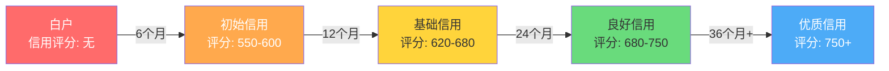
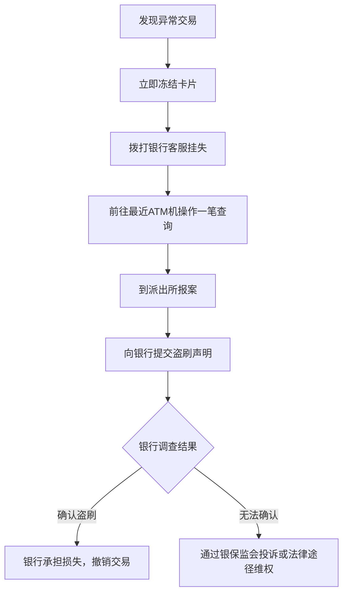
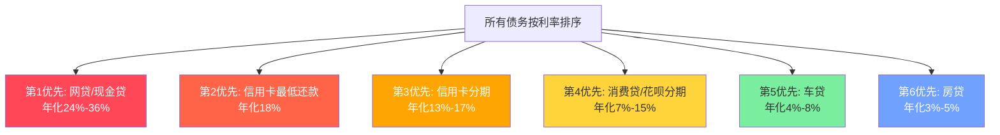
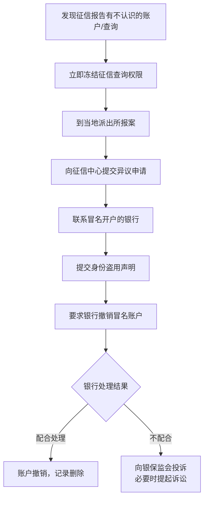
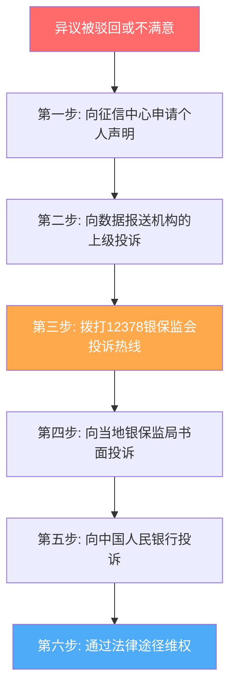
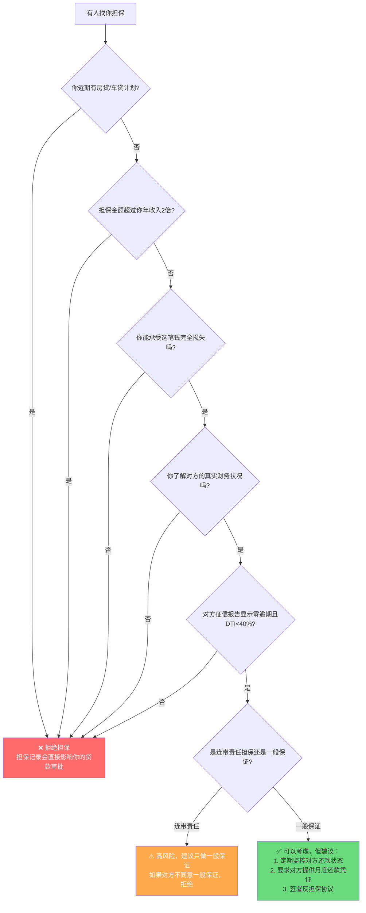
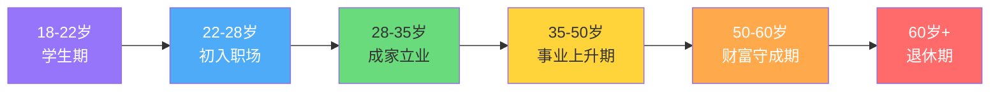

## 五、信用管理技巧

信用不是"不欠钱"，而是一种可以主动经营、量化评估、产生实际收益的金融资产。本节从实操角度出发，提供从零建立信用、日常维护优化、危机应对处理到进阶信用资产最大化利用的完整工具箱。每个技巧都配有具体步骤、操作模板和真实场景示例，可以直接照着做。

> 信用管理的理论基础（征信体系架构、评分模型数学原理、风险管理框架等）请参阅"理论基础"章节。信用修复的完整案例请参阅"实战案例"章节。

### 本节知识全景图

在深入实操之前，先建立全局视角。信用管理可以拆解为七大模块，形成从"建"到"用"到"护"的完整闭环：

```mermaid
graph TD
    A["信用管理全景"] --> B["信用建设"]
    A --> C["信用卡深度管理"]
    A --> D["负债管理"]
    A --> E["征信监控与异议"]
    A --> F["场景化信用策略"]
    A --> G["信用资产战略"]
    A --> H["人生大事信用规划"]

    B --> B1["白户起步"]
    B --> B2["信用类型多样化"]
    B --> B3["信用评分提升路径"]
    B --> B4["信用查询实操"]

    C --> C1["多卡组合"]
    C --> C2["免息期最大化"]
    C --> C3["还款策略"]
    C --> C4["提额方法论"]
    C --> C5["安全防护"]
    C --> C6["权益最大化"]

    D --> D1["负债率计算"]
    D --> D2["债务排序与还款"]
    D --> D3["债务整合"]
    D --> D4["协商还款"]

    E --> E1["征信报告解读"]
    E --> E2["查询类型区分"]
    E --> E3["异议操作指南"]
    E --> E4["身份盗用应对"]
    E --> E5["投诉升级路径"]

    F --> F1["数字金融产品"]
    F --> F2["担保风险管理"]
    F --> F3["婚姻与信用"]
    F --> F4["就业与信用"]
    F --> F5["租房与信用"]
    F --> F6["创业与信用"]

    G --> G1["信用量化价值"]
    G --> G2["战略储备"]
    G --> G3["信用冻结与解冻"]
    G --> G4["国际信用对比"]

    H --> H1["买房"]
    H --> H2["结婚"]
    H --> H3["生子"]
    H --> H4["创业"]
    H --> H5["退休"]

    style A fill:#4dabf7,color:#fff
    style B fill:#69db7c,color:#333
    style C fill:#ffd43b,color:#333
    style D fill:#ffa94d,color:#fff
    style E fill:#ff6b6b,color:#fff
    style F fill:#b197fc,color:#fff
    style G fill:#3bc9db,color:#fff
    style H fill:#f783ac,color:#fff
```



---

### 1. 信用评分的底层逻辑：知道分数怎么来的，才能精准提升

很多人只知道"信用分越高越好"，却不理解分数是怎么算出来的。不知道规则，就只能盲目操作。本节拆解信用评分的核心构成要素，让你的每一步优化都有的放矢。

#### 1.1 信用评分的五大核心维度

中国主流信用评分体系（央行征信、百行征信、各银行内部评分）虽然算法各异，但评估维度高度一致，可以归纳为五大板块：

| 维度 | 权重（约） | 核心指标 | 优化方向 |
|------|-----------|---------|---------|
| 还款历史 | 35%-40% | 是否按时还款、逾期次数和天数 | 绝对不能逾期，这是信用的底线 |
| 负债水平 | 25%-30% | 信用卡利用率、总负债/收入比、贷款余额 | 信用卡利用率控制在30%以内 |
| 信用历史长度 | 10%-15% | 最早开户时间、平均账户年龄 | 保留最早的信用卡，不轻易注销 |
| 信用类型多样性 | 10%-15% | 信用卡、房贷、车贷、消费贷等类型数量 | 适度丰富，但不为多样性而盲目申请 |
| 新信用申请 | 5%-10% | 近期硬查询次数、新开账户数 | 控制半年内硬查询不超过3次 |

理解这个权重分布后，策略就很清晰：**还款历史和负债水平占了65%-70%的权重，是绝对优先级**。其他维度是锦上添花。

**各维度优化的投入产出比分析**：

| 优化动作 | 预期提升 | 见效时间 | 难度 | 推荐优先级 |
|---------|---------|---------|------|----------|
| 修复逾期记录（异议成功） | 30-80分 | 20-45天 | 中 | 最高 |
| 信用卡利用率从60%降至20% | 20-50分 | 1-2个账单周期 | 低 | 最高 |
| 还清小额贷款（花呗/借呗） | 10-30分 | 1-2个月 | 低 | 高 |
| 注销多余信贷账户 | 5-20分 | 1-2个月 | 低 | 中 |
| 持续6个月完美还款 | 10-30分 | 6个月 | 低 | 中 |
| 申请提额（降低使用率） | 5-15分 | 1-2个月 | 低 | 中 |
| 丰富信用类型 | 5-10分 | 6-12个月 | 中 | 低 |

#### 1.2 信用评分的实操查询方法

知道自己的信用状况是管理的第一步。以下是查询信用评分和征信报告的完整渠道对比：

**渠道一：央行征信中心（最权威）**

```text
操作步骤：
  1. 访问 www.pbccrc.org.cn（中国人民银行征信中心）
  2. 点击"互联网个人信用信息服务平台"
  3. 注册账号（需要身份证号 + 银行卡验证）
  4. 申请查询"个人信用报告"
  5. 24小时内收到短信通知，登录下载

报告类型：
  ├── 简版：免费，显示信用概要（账户数、逾期概况）
  └── 详版：免费（每年前2次），包含每笔贷款的详细记录

注意：
  - 详版报告包含完整的还款记录、查询记录、担保信息
  - 建议每年至少查1次详版，用于全面核对
  - 简版适合日常快速检查
```

**渠道二：商业银行APP（最方便）**

| 银行 | 查询路径 | 报告类型 | 出报告时间 | 特色功能 |
|------|---------|---------|-----------|---------|
| 工商银行 | 我的→信用报告 | 简版 | 实时 | 支持PDF下载 |
| 招商银行 | 我的→信用报告 | 简版+评分 | 实时 | 有信用评分变化趋势图 |
| 建设银行 | 更多→信用报告 | 简版 | 实时 | 支持对比历史报告 |
| 交通银行 | 我的→信用管理 | 简版 | 实时 | 有信用健康度评分 |
| 中信银行 | 我的→信用报告 | 简版 | 实时 | 有信用优化建议 |
| 平安银行 | 我的→信用报告 | 简版+评分 | 实时 | 有行业信用分位排名 |

```text
银行APP查询的优缺点：
  优点：
    ✅ 免费、实时、操作简单
    ✅ 可以看到银行内部的信用评分（央行报告不包含）
    ✅ 部分银行提供信用变化趋势分析
  缺点：
    ❌ 只能看到简版，不如央行详版完整
    ❌ 每次查询算一次"贷后管理"（软查询，不影响评分）
    ❌ 各银行看到的内容可能有细微差异
```

**渠道三：第三方信用平台**

| 平台 | 数据来源 | 特色 | 费用 | 推荐度 |
|------|---------|------|------|--------|
| 芝麻信用（支付宝） | 蚂蚁集团自有数据 | 覆盖电商、支付、生活场景 | 免费 | ⭐⭐⭐⭐ |
| 百行征信APP | 百行征信 | 覆盖网贷、消费金融数据 | 免费 | ⭐⭐⭐ |
| 央行征信中心"信用小帮手" | 央行征信 | 征信变动推送提醒 | 免费 | ⭐⭐⭐⭐ |

**注意**：芝麻信用分（350-950分）和央行征信评分是两套独立体系，分数不能直接对比。芝麻信用更侧重消费行为数据，央行征信更侧重信贷还款数据。

#### 1.3 硬查询 vs 软查询：一个被严重误解的概念

征信报告中的"查询记录"分两种类型，对信用评分的影响截然不同：

**硬查询（Hard Inquiry）——会影响评分**：

| 触发场景 | 说明 | 影响程度 |
|---------|------|---------|
| 申请信用卡 | 银行审核你的申请时查询 | 每次扣5-10分，持续影响12个月 |
| 申请贷款（房贷/车贷/消费贷） | 贷款审批查询 | 同上 |
| 申请网贷/花呗/微粒贷额度 | 平台授信查询 | 同上，且"小额贷款"标签更伤 |
| 为他人担保 | 担保资格审核查询 | 同上 |

**软查询（Soft Inquiry）——不影响评分**：

| 触发场景 | 说明 |
|---------|------|
| 本人查询征信 | 自己在央行官网或银行APP查 |
| 贷后管理查询 | 已有业务的银行定期复查 |
| 预审批/预授信查询 | 银行推送"您有XX额度"时的查询 |
| 公积金中心查询 | 申请公积金贷款时的查询 |

**实操要点**：

```text
硬查询管理规则
━━━━━━━━━━━━━━━━━━━━━━━━━━━━━━━━━━━━━━━━━
1. 半年内硬查询不超过 3 次（安全线）
2. 一年内硬查询不超过 6 次（警戒线）
3. 超过 6 次 → 银行认为你"资金饥渴" → 大幅降分
4. 硬查询记录保留 2 年，但主要影响前 12 个月

常见坑：
  ✗ 网上随手点"看看我能借多少" → 触发硬查询
  ✗ 同时申请多家银行信用卡 → 多次硬查询叠加
  ✗ 申请网贷平台"测额度" → 硬查询 + 小额贷款标签

正确做法：
  ✓ 申请前确认该操作是否会查征信
  ✓ 集中在一个时间段申请同类产品（如45天内申请房贷，
    多家银行查询算1次——征信合并规则）
  ✓ 利用银行的"预审批"功能（软查询）先评估通过率
━━━━━━━━━━━━━━━━━━━━━━━━━━━━━━━━━━━━━━━━━
```

**征信合并规则详解**：根据央行征信中心的规定，对于同一类型的贷款（如房贷），如果在短时间内（通常45天，即"异议处理窗口期"内）被多家银行查询，征信系统会将这些查询合并为1次硬查询处理。这个规则的目的是保护消费者在比价过程中的信用权益。

但需要注意以下关键区别：

| 贷款类型 | 是否享受合并规则 | 合并窗口期 | 实操建议 |
|---------|----------------|-----------|---------|
| 房贷 | 是 | 45天 | 45天内集中申请多家银行比价 |
| 车贷 | 是 | 45天 | 同上 |
| 消费贷 | 是 | 45天 | 同上 |
| 信用卡 | **否** | 不适用 | 每申请一家都是独立硬查询，必须谨慎 |
| 网贷/消费金融 | 否 | 不适用 | 每次申请独立计算 |

**实操案例**：

```text
场景：你要申请200万房贷，想比较3家银行的利率

错误做法：
  1月申请A银行 → 1次硬查询
  3月申请B银行 → 1次硬查询（已超过45天窗口）
  5月申请C银行 → 1次硬查询
  → 总计3次硬查询，分别影响评分

正确做法：
  4月1日申请A银行 → 1次硬查询
  4月10日申请B银行 → 合并到A的查询
  4月20日申请C银行 → 合并到A的查询
  → 总计算1次硬查询，评分影响最小化

注意：选择利率最优的那家银行后，其他两家的审批流程
      可以主动撤回，避免产生不必要的贷款记录。
```

#### 1.4 逾期记录的生命周期：五年规则的完整解读

《征信业管理条例》第十六条规定：不良信息的保存期限为自不良行为终止之日起5年。

这条规则的完整含义：

```text
五年自动消除规则详解
━━━━━━━━━━━━━━━━━━━━━━━━━━━━━━━━━━━━━━━━━
关键时点："不良行为终止之日" = 你还清欠款的那一天
          不是从逾期发生的那一天开始算

示例：
  2021年3月：信用卡逾期发生
  2021年5月：还清全部欠款（不良行为终止）
  2026年5月：该逾期记录从征信报告中消除（5年后）
  
  如果一直没还清 → 记录永远存在 → 不会自动消除

不同类型记录的存留规则：
┌─────────────────┬─────────────────────────────┐
│ 记录类型         │ 存留规则                      │
├─────────────────┼─────────────────────────────┤
│ 逾期记录         │ 还清后保留5年自动消除          │
│ 呆账记录         │ 还清后保留5年（但需先转为逾期） │
│ 正常信贷记录     │ 永久保留（正面记录，不影响）    │
│ 查询记录         │ 保留2年                       │
│ 法院执行记录     │ 履行完毕后保留5年              │
│ 公共信息（欠税等）│ 相关事项终止后保留5年          │
└─────────────────┴─────────────────────────────┘

对信用评分的实际影响：
  逾期1-30天（"1"）：影响较小，12个月后大幅减弱
  逾期31-60天（"2"）：影响中等，24个月后明显减弱
  逾期61-90天（"3"）：影响较大，36个月后逐渐减弱
  逾期90天以上（"4-7"）：影响严重，需要更长时间修复
  呆账/代偿：最严重，必须优先处理
━━━━━━━━━━━━━━━━━━━━━━━━━━━━━━━━━━━━━━━━━
```

**"连三累六"的特殊含义**：银行内部常用的风控术语——"连三"指连续3个月逾期，"累六"指累计6次逾期。触及任何一条，多数银行会直接拒绝贷款申请，不看其他条件。这是比单次逾期严重得多的红线。

**银行风控红线分级体系**：

不同逾期程度触发的银行内部风控等级不同，了解这些红线可以帮助你预判贷款审批结果：

| 风控等级 | 触发条件 | 银行内部标记 | 贷款审批影响 | 恢复难度 |
|---------|---------|------------|------------|---------|
| 绿色（安全） | 近24个月零逾期 | 优质客户 | 正常审批，可能获得利率优惠 | — |
| 黄色（关注） | 近12个月有1次逾期（30天内） | 偶发逾期 | 需补充说明，影响较小 | 低：6-12个月良好记录即可恢复 |
| 橙色（预警） | 近12个月有2-3次逾期，或单次逾期30-60天 | 逾期客户 | 审批从严，可能降低额度或提高利率 | 中：12-24个月良好记录 |
| 红色（高危） | "连三累六"、单次逾期90天以上 | 高风险客户 | 大概率被拒，部分银行直接进黑名单 | 高：24-60个月持续良好记录 |
| 黑色（禁入） | 呆账、代偿、法院执行、被强制止付 | 禁入客户 | 所有银行直接拒绝 | 极高：还清后等待5年消除记录 |

**各银行"连三累六"后的具体态度**：

| 银行 | "连三"后态度 | "累六"后态度 | 恢复后首次申请难度 | 备注 |
|------|------------|------------|-----------------|------|
| 工商银行 | 直接拒绝，列入内部黑名单 | 同上 | 较难 | 工行黑名单系统较严格，需等待更长时间 |
| 招商银行 | 拒绝，但2年后可重新评估 | 同上 | 中等 | 相对灵活，看重逾期后的还款表现 |
| 建设银行 | 拒绝，内部标记3年 | 同上 | 较难 | 偏保守，恢复周期较长 |
| 中信银行 | 拒绝，但可提交补充材料 | 同上 | 中等 | 会综合评估逾期原因 |
| 广发银行 | 拒绝，1年后可尝试 | 同上 | 较易 | 相对宽松，恢复速度较快 |

**"连三累六"后的恢复策略**：

```text
"连三累六"后的信用恢复路线图
━━━━━━━━━━━━━━━━━━━━━━━━━━━━━━━━━━━━━━━━━
第1阶段：止血期（第1-3个月）
  ├── 立即还清所有逾期欠款（本金+利息+违约金）
  ├── 如果是多张卡逾期，优先还清金额最小的（减少逾期账户数）
  ├── 联系银行申请"非恶意逾期证明"（如适用）
  └── 关闭所有不必要的信贷账户，减少管理负担

第2阶段：静默期（第3-12个月）
  ├── 保留1-2张最早的信用卡
  ├── 每月小额消费（额度的5%-10%）+ 全额还款
  ├── 绝对不申请任何新的信贷产品
  ├── 不要点击任何"测额度""看看我能借多少"链接
  └── 每3个月检查一次征信报告，确认逾期记录状态

第3阶段：重建期（第12-24个月）
  ├── 保持完美还款记录12个月以上
  ├── 尝试申请1张新信用卡（选择审批宽松的银行）
  ├── 如果被拒，再等3个月重新申请
  ├── 逐步将信用卡使用率控制在20%-30%
  └── 开始关注银行的"预审批"推送（软查询，不伤征信）

第4阶段：恢复期（第24个月+）
  ├── 此时"连三累六"的影响已大幅减弱
  ├── 可以尝试申请消费贷、车贷等产品
  ├── 如果需要房贷，建议等到第36个月后
  └── 持续保持良好信用习惯，让正面记录持续覆盖负面记录
━━━━━━━━━━━━━━━━━━━━━━━━━━━━━━━━━━━━━━━━━

关键认知：银行不仅看"有没有逾期"，更看"逾期之后的行为模式"。
如果在"连三累六"后连续24个月保持完美记录，银行会重新评估你的风险等级。
这就是为什么"止血后立即重建"比"什么都不做等着消除"效果好得多。
```

---

### 2. 信用建设的完整路径

#### 2.1 "白户"如何从零建立信用

没有任何信贷记录的人在征信系统中被称为"白户"。白户面临的核心矛盾是：没有信用记录就无法申请到好的信贷产品，而没有信贷产品就无法建立信用记录。打破这个死循环需要策略。

**第一步：申请一张适合入门的信用卡**

| 申请渠道 | 推荐人群 | 通过率 | 注意事项 |
|---------|---------|--------|---------|
| 工资卡所在银行 | 有稳定工资流水者 | 高（银行已有你的收入数据） | 直接在手机银行APP申请，无需面签 |
| 支付宝/微信联名卡 | 支付宝/微信活跃用户 | 中高（平台数据辅助审核） | 花呗/微信支付使用记录可作为参考 |
| 学生信用卡 | 在校大学生 | 中（额度较低，通常1000-5000元） | 部分银行已停发，需现场办理 |
| 以卡办卡 | 已持有他行信用卡者 | 高 | 需持卡满6个月以上 |
| 银行存款关系 | 有闲置资金者 | 高 | 先存5万定期3个月，再申请 |

**申请被拒的应对策略**：

1. **降低申请门槛**：选择金卡而非白金卡，选择普通联名卡而非高端卡
2. **提供辅助材料**：在网点申请时携带工资流水、社保缴纳证明、房产证（如有）
3. **先建立存款关系**：在目标银行存入5万元以上定期存款，3个月后再申请
4. **申请银行的"虚拟信用卡"**：如招行的"e闪付"、浦发的"小浦红贷"，审批门槛低于实体卡
5. **选择"宽松"的发卡行**：中信、广发、浦发的入门卡审批相对宽松，可以作为第一张卡
6. **尝试银行联名卡**：京东联名卡、淘宝联名卡等，审批时会参考你在合作平台的消费数据

**第二步：建立基础消费记录**

拿到第一张信用卡后，前6个月的使用策略决定了后续的信用走向：

```text
前6个月用卡策略
━━━━━━━━━━━━━━━━━━━━━━━━━━━━━━━━━━━━━━━━━
月消费金额：额度的 20%-50%（太少没记录，太多显紧张）
消费场景：至少覆盖 3 类以上商户
         ├── 餐饮（超市、外卖）
         ├── 日用（便利店、加油站）
         ├── 线上（电商平台）
         ├── 出行（打车、加油）
         └── 娱乐（视频会员、电影票）
还款方式：全额还款，绝不最低还款
关键动作：设置自动还款 + 还款日前2天手动检查
━━━━━━━━━━━━━━━━━━━━━━━━━━━━━━━━━━━━━━━━━
```

**为什么消费场景要多元化**：银行的内部评分模型会分析你的消费行为模式。消费场景覆盖越广，说明你的生活越稳定、消费能力越强。单一场景（比如只在便利店消费）会被识别为"刻意养卡"，反而可能触发风控。

**第三步：在第6个月申请提额**

用卡6个月后，向发卡行申请提升固定额度。首次提额幅度通常在30%-100%之间。提额成功后，你的总授信额度增加，信用利用率（已用额度/总额度）自然下降，信用评分提升。

**第四步：逐步丰富信用类型**

当信用卡使用满1年且有提额记录后，可以考虑申请其他类型的信贷产品：

| 阶段 | 时间节点 | 可申请的产品 | 目的 |
|------|---------|------------|------|
| 起步期 | 第1-6个月 | 1张信用卡 | 建立基础还款记录 |
| 成长期 | 第6-12个月 | 第2张信用卡 + 花呗/白条 | 丰富消费场景记录 |
| 进阶期 | 第12-24个月 | 消费分期（如有需要） | 增加信用类型多样性 |
| 成熟期 | 第24个月+ | 按需申请（房贷、车贷等） | 信用基础已稳固 |

**重要提醒**：每一步之间至少间隔3个月，避免短期内多次"硬查询"。每次申请前确认上一笔信贷产品已正常还款3期以上。

#### 2.2 信用建设的时间规划

信用建设是一个需要耐心的长期过程。以下是各阶段的时间预期：



| 阶段 | 关键动作 | 可获得的金融权益 |
|------|---------|----------------|
| 白户→初始信用 | 申请第一张信用卡，正常使用6个月 | 申请普通信用卡、花呗 |
| 初始信用→基础信用 | 持卡1年+，提额1次，2-3张卡 | 申请消费贷、信用卡金卡 |
| 基础信用→良好信用 | 持卡2年+，多元消费，零逾期 | 申请车贷、信用贷，利率下浮 |
| 良好信用→优质信用 | 持卡3年+，信用类型多样，低负债率 | 房贷优惠利率，高端信用卡，高额度 |

#### 2.3 信用受损后的重建路径

信用受损不等于信用死亡。即使是严重逾期甚至呆账，只要按照正确的方法处理，信用仍然可以逐步恢复。

**按受损程度分级的重建策略**：

| 受损程度 | 典型情况 | 重建时间 | 关键策略 |
|---------|---------|---------|---------|
| 轻度（1-2次短期逾期） | 忘记还款，逾期30天内 | 6-12个月 | 立即还清，此后保持完美记录 |
| 中度（多次逾期或单次长期逾期） | 逾期60-90天，或3次以上短期逾期 | 12-24个月 | 还清欠款，降低负债率，保持零逾期 |
| 重度（呆账/代偿/连续逾期90天+） | 信用卡被冻结，呆账记录 | 24-60个月 | 还清全部欠款→销户→重建新信用记录 |
| 极重度（法院执行/破产记录） | 被起诉、被执行 | 60个月+ | 履行判决→等待5年消除→重建 |

**中重度受损后的具体操作流程**：

```text
信用重建四步法
━━━━━━━━━━━━━━━━━━━━━━━━━━━━━━━━━━━━━━━━━
第一步：止血（立即执行）
  ├── 还清所有逾期欠款（包括本金+利息+违约金）
  ├── 如果是呆账：联系银行确认还清后转为"逾期"状态
  ├── 如果是代偿：联系保险公司/担保公司还清代偿金额
  └── 保留所有还款凭证（银行流水、电子回单）

第二步：清理（1个月内完成）
  ├── 查询完整征信报告，确认所有负面信息
  ├── 对不实信息提交征信异议（见第5.3节）
  ├── 关闭不必要的信贷账户（花呗、借呗、微粒贷）
  └── 注销额度低、权益差的信用卡

第三步：重建（持续执行）
  ├── 保留1-2张最早的信用卡（维护信用历史长度）
  ├── 每月小额消费 + 全额还款（重建正面记录）
  ├── 将信用卡使用率控制在30%以内
  ├── 不申请任何新的信贷产品（至少6个月）
  └── 设置所有还款的自动扣款（防止再次忘记）

第四步：优化（12个月后）
  ├── 申请提额（降低使用率）
  ├── 恢复正常使用模式
  ├── 逐步申请新的信贷产品（间隔3个月以上）
  └── 每半年查询一次征信报告，跟踪恢复进度
━━━━━━━━━━━━━━━━━━━━━━━━━━━━━━━━━━━━━━━━━
```

**关键认知**：银行在审批贷款时，不仅看"有没有逾期"，更看"逾期之后的表现"。如果你在逾期后连续24个月保持完美还款记录，银行会认为那次逾期是"偶发事件"而非"行为模式"，影响会大幅减弱。

**"非恶意逾期"的特殊处理**：以下情况可以联系银行申请"非恶意逾期证明"，对后续贷款审批有帮助：

| 场景 | 证明方式 | 需要材料 |
|------|---------|---------|
| 银行系统扣款失败 | 联系银行出具系统故障证明 | 银行系统日志截图 |
| 出差/住院导致忘记还款 | 提供出差证明/住院证明 | 机票/酒店记录、住院证明 |
| 还款日当天还款但系统延迟 | 提供还款时间戳 | 转账记录（精确到分钟） |
| 年费/小额费用不知情 | 联系银行退还费用并修改记录 | 银行客服沟通记录 |

**"非恶意逾期"异议申请模板**：

```text
致：中国人民银行征信中心

异议申请人：XXX
身份证号：XXXXXXXXXXXXXXXXXX
联系电话：XXXXXXXXXXX

异议事项：
  本人征信报告中，XX银行信用卡（卡号尾号XXXX）于XXXX年XX月
  显示逾期XX天，金额XX元。

异议理由：
  该笔逾期并非本人主观恶意造成。具体情况如下：
  （选择适用的理由并详细说明）
  □ 银行系统自动扣款失败，本人已设置自动还款，
    但因银行系统升级导致扣款未执行。
    证据：自动还款设置截图、银行系统升级公告截图。
  □ 本人因出差/住院，无法及时操作还款，
    但已在恢复后第一时间全额还清。
    证据：出差机票/住院证明、还清欠款的银行流水。
  □ 该笔费用为年费/小额费用，本人从未收到任何
    账单通知或提醒短信。
    证据：手机通话/短信记录查询结果。

诉求：
  1. 请核实上述情况
  2. 申请删除/更正该条不实逾期记录
  3. 如无法删除，请在征信报告中添加个人情况说明

附件：
  1. 身份证复印件
  2. 征信报告（标注异议记录页）
  3. 上述证据材料

申请人签名：XXX
日期：XXXX年XX月XX日
```

---

### 3. 信用卡管理的实用技巧

#### 3.1 多卡组合策略

持有3-5张信用卡是多数人的最优解。关键是每张卡要有明确的定位，形成互补而非冗余。

**推荐的4卡组合方案**：

```text
卡1：主力消费卡（招行经典白 / 浦发AE白 / 中信易卡白）
  ├── 定位：日常消费主力，积分回报率最高
  ├── 权益：积分兑换里程/酒店，机场贵宾厅
  └── 使用：每月主要消费走这张卡

卡2：网购专用卡（淘宝联名卡 / 京东联名卡 / 拼多多联名卡）
  ├── 定位：电商消费加成
  ├── 权益：电商平台多倍积分/返现，专属优惠券
  └── 使用：线上购物全部走这张卡

卡3：境外消费卡（全币种信用卡）
  ├── 定位：海淘和出境消费
  ├── 权益：免货币转换费（1.5%），境外返现
  └── 使用：海外网站购物、出境旅行

卡4：应急备用卡（高额度卡 / 取现手续费低的卡）
  ├── 定位：紧急情况下的资金周转
  ├── 权益：高额度，取现手续费低或免费
  └── 使用：平时不用，保持活跃即可（每季度刷1笔）
```

**不同人群的卡片组合建议**：

| 人群类型 | 推荐组合 | 卡片数量 | 重点考量 |
|---------|---------|---------|---------|
| 刚工作（月薪5k-10k） | 1张入门卡 + 1张网购卡 | 2张 | 额度够用就好，先建立信用 |
| 职场白领（月薪10k-25k） | 主力卡 + 网购卡 + 境外卡 | 3张 | 积分回报最大化 |
| 中产家庭（双职工） | 主力卡 + 网购卡 + 境外卡 + 备用卡 | 4张 | 权益覆盖全面 |
| 高收入（年薪50万+） | 高端白金卡 + 联名卡 + 全币种卡 | 3-4张 | 高端权益（贵宾厅、酒店、高尔夫） |
| 企业主 | 个人卡 + 商务卡 + 全币种卡 | 3张 | 公私分离，商务支出走商务卡 |

**选卡时的核心评估维度**：

| 维度 | 评估要点 | 权重 |
|------|---------|------|
| 年费政策 | 是否可免年费（刷满N笔/N金额），刚性年费是否值得 | 高 |
| 积分价值 | 积分兑换比例，有效期，可兑换的品类 | 高 |
| 返现/折扣 | 日常消费返现比例，合作商户优惠 | 中 |
| 额度上限 | 该行给额度是否大方（参考社区反馈） | 中 |
| APP体验 | 账单查询、还款、积分管理是否方便 | 低 |
| 附加权益 | 机场贵宾厅、延误险、体检、洗牙等 | 视个人需求 |

#### 3.2 账单日管理与免息期最大化

信用卡的免息期是从消费日到还款日之间的时间，最长可达50-56天。通过合理安排账单日，可以让每笔消费都享受接近最长的免息期。

**单卡免息期计算**：

```text
假设：账单日 = 每月10日，还款日 = 每月28日

情况A：在账单日前1天（9日）消费
  → 该笔消费计入本期账单，还款日为28日
  → 免息期 = 28 - 9 = 19天（最短）

情况B：在账单日后1天（11日）消费
  → 该笔消费计入下期账单，下月10日出账，下月28日还款
  → 免息期 = 30 + 28 - 11 = 47天（接近最长）

结论：在账单日后第1天消费，享受最长免息期
```

**多卡错开账单日技巧**：

将3-5张信用卡的账单日均匀分布在一个月内，形成"消费接力"：

```text
卡片分配（以持有3张卡为例）：
━━━━━━━━━━━━━━━━━━━━━━━━━━━━━━━━━━━━━━━━━
卡A：账单日 5日  → 最佳消费日：6日-15日
卡B：账单日 15日 → 最佳消费日：16日-25日
卡C：账单日 25日 → 最佳消费日：26日-次月5日
━━━━━━━━━━━━━━━━━━━━━━━━━━━━━━━━━━━━━━━━━

效果：在任何一天消费，都能选择距离最近账单日最远的那张卡
      始终享受接近最长的免息期
```

**修改账单日的操作方法**：

大部分银行支持修改账单日，但有以下限制：

| 银行 | 是否可改 | 修改方式 | 限制条件 |
|------|---------|---------|---------|
| 招商银行 | 可以 | APP/客服电话 | 每半年可改1次 |
| 工商银行 | 不可以 | — | 账单日固定 |
| 建设银行 | 部分卡可改 | 客服电话 | 需咨询具体卡种 |
| 交通银行 | 可以 | 客服电话 | 每年可改1次 |
| 浦发银行 | 可以 | APP/客服 | 每年可改1次 |
| 中信银行 | 可以 | 客服电话 | 每半年可改1次 |
| 广发银行 | 可以 | 客服电话 | 每年可改1次 |
| 平安银行 | 可以 | APP/客服 | 每半年可改1次 |
| 民生银行 | 可以 | 客服电话 | 每年可改1次 |
| 兴业银行 | 可以 | 客服电话 | 每年可改1次 |
| 光大银行 | 可以 | 客服电话 | 每半年可改1次 |

**免息期最大化的高级技巧**：

```text
大额消费的免息期策略
━━━━━━━━━━━━━━━━━━━━━━━━━━━━━━━━━━━━━━━━━
场景：计划购买一台 8,000元 的笔记本电脑

错误做法：
  随便拿一张卡直接购买 → 可能只享受19天免息期

正确做法：
  1. 查看各卡账单日，选择"刚过账单日"的那张卡
  2. 如果今天距离最近账单日不足5天，等2-3天再买
  3. 用这张卡支付 → 享受约45-50天免息期
  4. 将8,000元存入货币基金（年化2%-3%）
  5. 免息期内的理财收益 = 8,000 × 2.5% ÷ 365 × 45 ≈ 25元

虽然单次收益不高，但养成习惯后，一年下来可节省数百元
━━━━━━━━━━━━━━━━━━━━━━━━━━━━━━━━━━━━━━━━━
```

#### 3.3 还款策略详解

选择正确的还款方式直接影响你的资金成本和信用评分。

**全额还款（强烈推荐）**：

```text
优势：
  ✅ 零利息零手续费
  ✅ 征信报告显示"全额还款"，信用最优
  ✅ 银行认为你是优质客户，提额更容易

操作要点：
  1. 设置自动全额还款（绑定工资卡）
  2. 还款日前2天手动检查余额是否充足
  3. 如遇余额不足，立即手动还款
```

**最低还款（尽量避免）**：

```text
利息计算方式（很多人不理解的陷阱）：

假设：账单金额 10,000元，最低还款额 1,000元
      还款日已还 1,000元（最低还款），剩余 9,000元

利息计算：不是按 9,000元 计算，而是按 10,000元 计算！
         从每笔消费的入账日起，日息万分之五

如果这10,000元是账单日前30天消费的：
  利息 = 10,000 × 0.05% × 30天 = 150元（首月）
  第二个月如果仍未还清：9,000 × 0.05% × 30 = 135元（利滚利）

年化利率 = 0.05% × 365 = 18.25%

结论：最低还款的实际成本极高，且复利效应会让债务快速膨胀
```

**分期还款的成本真相**：

银行宣传"月费率仅0.6%"，看起来很便宜，但实际年化利率远高于此：

```text
分期的真实年化利率计算：

假设：分期金额 12,000元，分12期，月费率 0.6%
      每月手续费 = 12,000 × 0.6% = 72元
      每月本金 = 12,000 ÷ 12 = 1,000元
      每月还款 = 1,000 + 72 = 1,072元

表面上看：年化利率 = 0.6% × 12 = 7.2%？
实际上：你每个月都在还本金，但手续费始终按 12,000 元收取

真实年化利率 ≈ 13.03%（用IRR公式计算）

常见分期费率对应的真实年化利率：
┌────────────┬────────────────┬──────────────────┐
│ 月费率      │ 真实年化利率    │ 对比银行信用贷    │
├────────────┼────────────────┼──────────────────┤
│ 0.50%      │ 10.9%          │ 信用贷4%-8%贵2-3倍│
│ 0.60%      │ 13.0%          │ 信用贷4%-8%贵2-3倍│
│ 0.65%      │ 14.1%          │ 信用贷4%-8%贵2-4倍│
│ 0.70%      │ 15.2%          │ 信用贷4%-8%贵2-4倍│
│ 0.75%      │ 16.2%          │ 信用贷4%-8%贵2-4倍│
│ 0.80%      │ 17.3%          │ 信用贷4%-8%贵2-4倍│
└────────────┴────────────────┴──────────────────┘

结论：信用卡分期的真实成本是银行信用贷的2-4倍
```

**IRR快速计算方法**：

不需要金融计算器，用Excel或手机计算器就能算出真实年化利率：

```text
用Excel计算分期真实年化利率：
━━━━━━━━━━━━━━━━━━━━━━━━━━━━━━━━━━━━━━━━━
假设：借款12,000元，分12期，月费率0.6%
      每月还款 = 1,000 + 72 = 1,072元

步骤：
  1. 在A1输入：12000（到手金额，正数）
  2. 在A2-A13输入：-1072（每月还款，负数，共12个）
  3. 在任意单元格输入公式：
     =IRR(A1:A13)*12
  4. 得到结果：约13.03%（即真实年化利率）

简易估算公式（适用于等额本息还款）：
  真实年化 ≈ 名义年化 × 1.8 ~ 1.9
  例如：月费率0.6% → 名义年化7.2% → 真实年化约13%-14%
━━━━━━━━━━━━━━━━━━━━━━━━━━━━━━━━━━━━━━━━━
```

**不同场景下的最优还款策略**：

| 场景 | 推荐策略 | 原因 |
|------|---------|------|
| 有能力全额还款 | 全额还款 | 零成本，信用最优 |
| 临时资金紧张（1-2个月） | 最低还款 → 下月全额还清 | 避免逾期，但利息成本高 |
| 大额消费需分摊（3-6个月） | 银行信用贷置换 | 年化4%-8%，远低于分期 |
| 购买免息分期商品 | 商家免息分期 | 零成本，相当于延期付款 |
| 已有多笔分期 | 债务整合（见第4节） | 降低综合利率 |

#### 3.4 提额的系统方法

信用卡提额不是碰运气，而是有系统的方法论。银行的核心逻辑是：**你让我赚到钱 + 你有能力还钱 = 我愿意给你更多额度**。

**有效的提额操作清单**：

```text
提额前准备（用卡满3-6个月后开始）
━━━━━━━━━━━━━━━━━━━━━━━━━━━━━━━━━━━━━━━━━
□ 确认近6个月无逾期记录
□ 确认信用卡使用率在 30%-70% 之间
□ 确认近3个月有多元化消费记录
□ 准备好财力证明材料（可选）

提额操作
━━━━━━━━━━━━━━━━━━━━━━━━━━━━━━━━━━━━━━━━━
□ 方式1：手机银行APP自助申请（最方便）
       路径：APP → 信用卡 → 额度管理 → 申请调额
□ 方式2：拨打客服电话申请
       话术："我使用贵行信用卡已经X个月，每月消费约X元，
             均全额还款，近期有大额消费需求，希望申请提升
             固定额度至X元"
□ 方式3：网点提交财力证明
       携带：房产证、车辆行驶证、存款证明、工资流水
       适用于：APP申请被拒但实际有实力的用户

提额后维护
━━━━━━━━━━━━━━━━━━━━━━━━━━━━━━━━━━━━━━━━━
□ 拿到新额度后，正常使用，不要突然大额消费
□ 继续保持多元化消费模式
□ 继续全额还款
□ 3-6个月后可再次申请提额
```

**各行提额速度参考**：

| 银行 | 首次提额时间 | 提额幅度 | 提额难度 | 特点 |
|------|------------|---------|---------|------|
| 招商银行 | 3-6个月 | 30%-100% | 较易 | APP自助提额方便，被称为"提额最快" |
| 浦发银行 | 6个月 | 50%-200% | 中等 | 额度给得大方，但风控严格 |
| 广发银行 | 6个月 | 30%-100% | 较易 | 提额频率高，被称为"提额王" |
| 中信银行 | 6个月 | 30%-50% | 中等 | 需要多元化消费 |
| 交通银行 | 6个月 | 20%-50% | 较难 | 偏好稳定用卡，不太喜欢频繁申请 |
| 工商银行 | 6个月 | 不定 | 较难 | 看星级和资产，有存款更容易 |
| 建设银行 | 6个月 | 20%-50% | 中等 | 偏好工资卡用户 |

**降低额度的策略（申请房贷前）**：

如果你计划在6个月内申请房贷，但信用卡总额度过高（超过年收入2倍），银行可能会要求你先降低信用卡额度或注销部分卡片。主动提前处理：

```text
房贷前6个月的信用卡优化清单
━━━━━━━━━━━━━━━━━━━━━━━━━━━━━━━━━━━━━━━━━
1. 计算总授信额度 = 所有信用卡额度之和
2. 如果总授信 > 年收入 × 2，考虑：
   a. 拨打不常用卡片的客服电话，主动申请降低额度
   b. 注销近期新开的、权益重复的卡片
   c. 保留最早的1-2张卡（维护信用历史长度）
3. 确保所有卡片使用率 < 30%
4. 确保近6个月零逾期
5. 确保近6个月无新增硬查询
━━━━━━━━━━━━━━━━━━━━━━━━━━━━━━━━━━━━━━━━━
```

#### 3.5 信用卡安全防护

信用卡欺诈和盗刷是信用管理中常被忽略但后果严重的问题。

**日常防护措施**：

| 防护措施 | 具体操作 | 防护对象 |
|---------|---------|---------|
| 设置交易短信/APP推送 | 每笔消费实时收到通知 | 盗刷第一时间发现 |
| 设置单笔/单日限额 | 在APP中设置大额消费限额 | 限制盗刷损失 |
| 开启境外交易锁 | 不用时关闭境外无卡交易 | 防止海外盗刷 |
| 不在公共WiFi下支付 | 使用移动数据网络 | 防止数据截获 |
| 定期检查CVV码 | 确认卡背面安全码未被刮取拍照 | 防止信息泄露 |
| 不向任何人透露验证码 | 银行绝不会电话索要验证码 | 防止电信诈骗 |
| 使用虚拟卡号 | 海淘时使用银行提供的虚拟卡号 | 保护实体卡信息 |

**发现盗刷的应急处理流程**：



**关键操作**：发现盗刷后，立即到最近的ATM机做一笔查询或小额取现，打印凭条。这可以证明"真卡在你手上"，是盗刷而非本人消费的关键证据。

#### 3.6 信用卡权益最大化

信用卡不只是支付工具，更是权益载体。很多人持有高端信用卡却从未使用附带的权益，等于白白浪费了年费。

**常见被忽略的高价值权益**：

| 权益类型 | 典型内容 | 年价值（估算） | 获取方式 |
|---------|---------|--------------|---------|
| 机场贵宾厅 | 每年4-12次免费使用 | 200-500元/次 | APP预约或出示信用卡 |
| 航班延误险 | 延误2-4小时赔付200-500元 | 1-2次/年即可回本 | 用该卡买机票自动激活 |
| 酒店权益 | 免费住一晚/房型升级 | 500-2000元/次 | 预订时使用指定渠道 |
| 道路救援 | 免费拖车、换胎、搭电 | 200-500元/次 | 拨打信用卡背面电话 |
| 体检/洗牙 | 每年1次免费 | 500-1500元 | APP预约 |
| 积分兑换 | 兑换里程/酒店/商品 | 因卡而异 | APP积分商城 |
| 高尔夫球场 | 每年数次免费打球 | 500-1000元/次 | APP预约 |
| 保险保障 | 航空意外险、购物保障险 | 视情况 | 自动附带或激活 |

**权益利用的操作建议**：

```text
信用卡权益使用清单（建议打印贴在钱包里）
━━━━━━━━━━━━━━━━━━━━━━━━━━━━━━━━━━━━━━━━━
□ 用主力卡买所有机票 → 自动激活延误险
□ 出差/旅行前预约贵宾厅 → 免费候机
□ 每年安排一次酒店权益兑换 → 免费住宿
□ 每年预约一次免费体检或洗牙
□ 检查积分余额，兑换即将过期的积分
□ 了解各卡的道路救援号码（存入手机通讯录）
□ 出境旅行时使用全币种卡 → 节省1.5%货币转换费
□ 大额购物使用有购物保障险的信用卡
━━━━━━━━━━━━━━━━━━━━━━━━━━━━━━━━━━━━━━━━━
```

**积分价值最大化的技巧**：

```text
积分兑换的效率排名（从高到低）：
━━━━━━━━━━━━━━━━━━━━━━━━━━━━━━━━━━━━━━━━━
1. 兑换航空里程（价值最高，约1万分=100-200元机票价值）
2. 兑换酒店积分（价值较高，适合旅行者）
3. 兑换年费抵扣（直接省钱）
4. 兑换实物商品（价值较低，约1万分=10-30元）
5. 兑换话费/油卡（价值中等）
6. 直接抵扣消费（价值最低）
━━━━━━━━━━━━━━━━━━━━━━━━━━━━━━━━━━━━━━━━━

关键原则：积分会过期！每半年检查一次各卡积分有效期
          优先兑换即将过期的积分
```

#### 3.7 2025-2026年信用卡欺诈新趋势与防范

随着技术发展，信用卡欺诈手段也在不断升级。了解最新的威胁类型是有效防范的前提。

**新型欺诈手段识别与防范**：

| 欺诈类型 | 作案手法 | 识别特征 | 防范措施 |
|---------|---------|---------|---------|
| AI换脸视频认证 | 利用深度伪造技术通过银行人脸识别 | 视频通话时对方表情僵硬、光线不自然 | 开启"活体检测+短信验证码"双重认证 |
| SIM卡劫持（SIM Swap） | 补办你的手机号，接收所有验证码 | 手机突然无信号、收到不明补卡短信 | 到运营商设置SIM卡锁定密码，开启二次验证 |
| 钓鱼短信升级版 | 伪装银行官方号码发送"账单异常"短信 | 短信中的链接域名与官方不符 | 永不点击短信链接，直接打开银行APP查看 |
| POS机侧录 | 在不正规商户刷卡时复制磁条信息 | 刷卡后收到不明消费通知 | 优先使用芯片插卡或NFC支付，避免磁条刷卡 |
| 虚假客服诈骗 | 冒充银行客服以"提额""退款"为由索要信息 | 主动打电话给你并索要验证码 | 银行绝不会电话索要验证码和密码 |
| 代办信用卡骗局 | 以"包下卡""内部渠道"为诱饵收取费用 | 要求先交"手续费""保证金" | 信用卡申请全程免费，任何收费都是骗局 |

**建立个人反欺诈体系的五道防线**：

```text
第一道防线：信息隔离
  ├── 不同平台使用不同密码（使用密码管理器）
  ├── 银行APP开启指纹/面容登录
  ├── 不在社交媒体透露收入、资产等财务信息
  └── 快递单、账单等纸质材料撕碎后再丢弃

第二道防线：交易监控
  ├── 每张信用卡开启实时交易通知（APP推送+短信双保险）
  ├── 设置单笔消费限额（如单笔不超过5000元）
  ├── 设置单日消费限额（如单日不超过20000元）
  └── 不常用卡片开启"境外交易锁"和"夜间交易锁"

第三道防线：定期巡检
  ├── 每月核对信用卡账单（逐笔检查，不要只看总额）
  ├── 每季度检查征信报告中的查询记录
  ├── 每半年查询完整征信报告
  └── 发现任何异常立即冻结卡片并联系银行

第四道防线：应急准备
  ├── 手机通讯录中保存各银行信用卡客服电话（不是955XX总机，而是信用卡专线）
  ├── 了解各银行的紧急挂失流程（APP挂失最快）
  ├── 知道最近的ATM机位置（盗刷取证需要）
  └── 派出所报案的流程和所需材料提前了解

第五道防线：技术防护
  ├── 手机安装正规安全软件，定期扫描
  ├── 不在公共WiFi下进行任何金融操作
  ├── 银行APP从官方应用商店下载，不使用第三方链接
  └── 手机丢失后立即远程锁定并挂失所有银行卡
```

---

### 4. 负债管理的实操方法

#### 4.1 个人负债率的精确计算

银行评估你的信用风险时，负债率是仅次于还款记录的第二重要指标。你需要精确计算两个核心比率：

**比率一：负债收入比（DTI）**

```text
DTI = 每月所有贷款还款额 ÷ 月收入 × 100%

计算示例：
┌─────────────────────────┬──────────┐
│ 项目                     │ 月还款额  │
├─────────────────────────┼──────────┤
│ 房贷                     │ 5,000元  │
│ 车贷                     │ 2,000元  │
│ 信用卡最低还款（如有）    │ 500元    │
│ 花呗分期                  │ 300元    │
├─────────────────────────┼──────────┤
│ 月还款总额               │ 7,800元  │
│ 月收入                   │ 15,000元 │
├─────────────────────────┼──────────┤
│ DTI = 7800 ÷ 15000      │ 52%      │
└─────────────────────────┴──────────┘

评估：DTI 52% 偏高（安全线为50%以内）
建议：优先还清花呗分期（降低300元），DTI降至50%
```

**DTI的银行审批红线**：

| DTI区间 | 银行评估 | 贷款审批影响 |
|---------|---------|------------|
| <30% | 优秀 | 审批通过率高，可能获得利率优惠 |
| 30%-40% | 良好 | 正常审批 |
| 40%-50% | 偏高 | 可能需要提供更多证明材料 |
| 50%-60% | 高风险 | 审批困难，可能被要求降低负债 |
| >60% | 极高风险 | 大概率被拒 |

**比率二：信用卡利用率**

```text
信用卡利用率 = 所有信用卡已用额度之和 ÷ 所有信用卡总额度 × 100%

计算示例：
┌──────────┬──────────┬──────────┬──────────┐
│ 卡片      │ 总额度    │ 已用额度  │ 使用率    │
├──────────┼──────────┼──────────┼──────────┤
│ 招行白金  │ 50,000   │ 8,000    │ 16%      │
│ 浦发AE   │ 60,000   │ 15,000   │ 25%      │
│ 中信易卡  │ 30,000   │ 20,000   │ 67%      │
├──────────┼──────────┼──────────┼──────────┤
│ 合计      │ 140,000  │ 43,000   │ 30.7%    │
└──────────┴──────────┴──────────┴──────────┘

问题：中信易卡使用率67%，远超30%安全线
解决方案：在中信账单日前还款15,000元，将使用率降至17%
```

**降低信用卡利用率的技巧**：

1. **账单日前还款**：在出账单前还清大部分欠款，征信报告上显示的"已用额度"会很低
2. **申请提额**：额度翻倍，使用率自动减半（但不要因此增加消费）
3. **分散消费**：将大额消费分散到多张卡上，避免单卡使用率过高
4. **临时额度**：申请临时额度可以在短期内降低使用率（注意临时额度到期后使用率会回升）

#### 4.2 债务优先级排序与还款策略

当你有多笔债务时，还款顺序直接决定总利息支出。

**按利率从高到低排序**：



**雪崩法 vs 雪球法的实操对比**：

假设你有以下3笔债务：
- 债务A：网贷 2万元，年化30%
- 债务B：信用卡分期 3万元，年化15%
- 债务C：消费贷 5万元，年化8%

每月可用于还债的额外资金：3,000元（在各笔最低还款额之外）

```text
雪崩法（优先还利率最高的A）：
━━━━━━━━━━━━━━━━━━━━━━━━━━━━━━━━━━━━━━━━━
第1-8个月：集中还A（每月3000额外+最低还款）→ A还清
第9-18个月：集中还B → B还清
第19-28个月：集中还C → C还清
总利息支出：约 11,200元
还清时间：约 28个月
━━━━━━━━━━━━━━━━━━━━━━━━━━━━━━━━━━━━━━━━━

雪球法（优先还金额最小的A）：
━━━━━━━━━━━━━━━━━━━━━━━━━━━━━━━━━━━━━━━━━
第1-8个月：集中还A（金额最小，先消灭）→ A还清
第9-20个月：集中还B → B还清
第21-30个月：集中还C → C还清
总利息支出：约 13,800元
还清时间：约 30个月
━━━━━━━━━━━━━━━━━━━━━━━━━━━━━━━━━━━━━━━━━

差异：雪崩法节省 2,600元利息，但需要更强的纪律性
```

**实操建议**：如果你的债务中有年化超过20%的高息贷款，必须用雪崩法优先消灭——每多拖一天都是在烧钱。如果所有债务利率相近，用雪球法获得心理激励更重要。

**债务管理的心理陷阱**：

| 陷阱 | 表现 | 正确应对 |
|------|------|---------|
| "最低还款就够了" | 只还最低额，觉得压力不大 | 算清楚18%年化的复利成本，醒醒 |
| "下个月一起还" | 拖延还款，期望下个月收入能覆盖 | 设置自动还款，消除人为干预 |
| "分期手续费不高" | 被"月费率0.6%"的表面数字欺骗 | 用IRR公式算真实年化，或直接问客服"年化利率是多少" |
| "还清了可以再借" | 把信用卡当成收入来源 | 信用卡是支付工具，不是收入来源 |
| "这点小钱无所谓" | 对几百元的利息不在意 | 几百元×12个月×几年 = 可观的金额 |
| "借新还旧没问题" | 用新贷款还旧贷款 | 只会越滚越多，必须从根源控制消费 |

#### 4.3 债务整合的具体操作

债务整合的核心思路是"用低息贷款替换高息贷款"，降低综合利率。

**方案对比**：

| 整合方案 | 适用条件 | 利率范围 | 操作难度 | 风险 |
|---------|---------|---------|---------|------|
| 银行信用贷置换 | 有稳定工作，征信良好 | 4%-8% | 中等 | 需要注意不要继续新增信用卡债务 |
| 公积金信用贷 | 有公积金缴存记录 | 3%-5% | 较易 | 额度可能不够覆盖全部债务 |
| 余额代偿（以卡办卡） | 已有他行信用卡 | 首年分期优惠 | 较易 | 优惠期过后利率回升 |
| 抵押贷置换 | 有房产 | 3.5%-5% | 较难 | 房产被抵押，风险较高 |
| 亲友借款 | 有愿意帮忙的亲友 | 0%（人情成本） | 看关系 | 可能影响关系，务必写借条 |

**操作示例：银行信用贷置换信用卡债务**

```text
现状：
  信用卡A：欠款 2万元，分期年化 15%
  信用卡B：欠款 3万元，最低还款年化 18%
  总债务：5万元，综合年化约 16.8%

操作步骤：
  1. 登录工资卡所在银行的手机银行APP
  2. 查找信用贷产品（如招行e招贷、工行融e借、建行快贷）
  3. 申请 5万元，12期
  4. 到账后立即还清两张信用卡的全部欠款
  5. 此后每月按时还信用贷

结果：
  信用贷年化 6%，12期
  月还款额 = 4,303元
  总利息 = 1,636元
  对比原方案总利息 3,900元，节省 2,264元（58%）
```

**整合后的关键纪律**：

```text
债务整合后的"三个绝不"：
  ❌ 绝不因为信用卡还清了就继续大额消费
  ❌ 绝不在整合期间新增任何信贷产品
  ❌ 绝不将信用贷资金用于投资或消费

债务整合后的"三个必须"：
  ✅ 必须将信用卡使用率控制在30%以下
  ✅ 必须设置信用贷自动还款
  ✅ 必须每月检查负债率变化
```

#### 4.4 与银行协商还款：困难时期的救命稻草

当你确实无法按时还款时，主动与银行协商远比逃避逾期好得多。银行有专门的"特殊资产管理部门"处理这类情况。

**可协商的方案**：

| 协商方案 | 内容 | 适用条件 | 对征信的影响 |
|---------|------|---------|------------|
| 停息挂账（个性化分期） | 停止计息，欠款分12-60期偿还 | 有还款意愿但暂时无力偿还 | 征信显示"协商还款"，5年后消除 |
| 延期还款 | 延长还款期限1-3个月 | 临时性资金困难 | 通常不影响征信 |
| 减免利息/违约金 | 减免部分或全部利息和违约金 | 逾期后主动协商 | 逾期记录仍存在 |
| 最低还款额调整 | 降低最低还款额 | 收入下降 | 视具体协商结果 |

**协商话术模板**：

```text
拨打银行客服电话，转人工后说：

"您好，我是贵行信用卡持卡人，卡号尾号XXXX。
 我目前遇到了（具体的经济困难，如：公司裁员/家人生病/
 生意亏损），暂时无法全额还款。
 我有还款意愿，想申请个性化分期还款方案，
 请帮我转接特殊资产管理部或协商还款专线。"

注意事项：
  1. 态度诚恳，说明具体困难原因
  2. 明确表达"有还款意愿，但暂时无力全额偿还"
  3. 主动提出你期望的分期期数和每月可承受的还款额
  4. 如果第一次被拒，不要放弃，多打几次或换一个客服
  5. 所有协商结果要求书面确认（邮件或纸质协议）
```

**《商业银行信用卡业务监督管理办法》第七十条**规定：在特殊情况下，确认信用卡欠款金额超出持卡人还款能力、且持卡人仍有还款意愿的，发卡银行可以与持卡人平等协商，达成个性化分期还款协议。最长期限不得超过5年（60期）。这是你协商还款的法律依据。

**协商成功后的注意事项**：

```text
协商还款期间的管理清单：
━━━━━━━━━━━━━━━━━━━━━━━━━━━━━━━━━━━━━━━━━
□ 严格按协商方案还款，二次违约后果更严重
□ 保留所有协商文件和还款凭证
□ 定期检查征信报告，确认记录更新正确
□ 协商期间不要申请任何新的信贷产品
□ 协商完成后，征信记录会在还款完毕后5年消除
□ 如果协商期间收入恢复，可以提前还清剩余本金
━━━━━━━━━━━━━━━━━━━━━━━━━━━━━━━━━━━━━━━━━
```

---

### 5. 信用监控与异常处理

#### 5.1 征信报告的查询与解读

定期查询征信报告是信用管理的基本功。很多人只在申请贷款时才看征信，发现问题时已经晚了。

**查询渠道对比**：

| 渠道 | 操作方式 | 出报告时间 | 费用 | 推荐场景 |
|------|---------|-----------|------|---------|
| 央行征信中心官网 | www.pbccrc.org.cn注册申请 | 24小时内 | 免费 | 定期自查 |
| 商业银行手机银行 | 工行/招行/建行等APP内查询 | 实时 | 免费 | 快速查看简版 |
| 商业银行智慧柜员机 | 携带身份证到银行网点 | 即时 | 免费 | 需要详细版 |
| 人民银行线下柜台 | 当地人民银行征信查询网点 | 即时 | 每年前2次免费，之后25元/次 | 异议申请等 |

**征信报告的"必看项"检查清单**：

拿到征信报告后，逐项核对以下内容：

```text
征信报告检查清单
━━━━━━━━━━━━━━━━━━━━━━━━━━━━━━━━━━━━━━━━━
□ 个人基本信息是否正确（姓名、身份证号、婚姻状况）
  → 如有错误，可能是他行报送有误，联系该银行更正

□ 信贷账户是否都是自己开立的
  → 发现不认识的账户 → 可能被冒名开户 → 立即异议+报警

□ 所有逾期记录是否属实
  → 发现不属实的逾期 → 提交征信异议
  → 发现属实但非恶意 → 联系银行申请添加情况说明

□ 查询记录中是否有不认识的机构查询
  → 发现异常查询 → 可能身份信息泄露 → 加强防护

□ 信贷账户的额度、余额是否与实际一致
  → 发现不一致 → 联系对应银行核实

□ 是否有"呆账"记录
  → 呆账比逾期更严重 → 必须优先处理

□ 担保信息是否正确
  → 发现不认识的担保 → 可能被冒名担保 → 异议+报警

□ 是否有"代偿"记录
  → 代偿意味着保险公司替你偿还了贷款 → 比逾期更严重

□ 公共信息是否正确（欠税、民事判决、强制执行等）
  → 发现不实信息 → 异议申请
━━━━━━━━━━━━━━━━━━━━━━━━━━━━━━━━━━━━━━━━━
```

#### 5.2 信用监控的自动化方案

人工定期检查征信报告存在滞后性。以下方案可以帮助你实时监控信用变化：

**方案一：银行APP提醒（免费）**

```text
设置步骤：
1. 打开每张信用卡的发卡行APP
2. 开启以下通知：
   ├── 账单提醒（出账单当天通知）
   ├── 还款提醒（还款日前3天通知）
   ├── 交易提醒（每笔消费实时通知）
   └── 额度变动提醒（提额/降额通知）
3. 确认通知方式：APP推送 + 短信（双保险）
```

**方案二：第三方信用监控服务**

| 服务 | 功能 | 费用 | 推荐指数 |
|------|------|------|---------|
| 央行征信中心"信用小帮手" | 征信变动提醒 | 免费 | ⭐⭐⭐⭐ |
| 百行征信APP | 信用评分查询 | 免费 | ⭐⭐⭐ |
| 各银行"信用报告解读"功能 | 征信报告自动解读 | 免费 | ⭐⭐⭐ |

**方案三：日历提醒系统**

```text
创建以下周期性提醒：
┌──────────────┬──────────────────────────────────┐
│ 频率          │ 提醒内容                          │
├──────────────┼──────────────────────────────────┤
│ 每月1日       │ 检查所有信用卡账单，确认无异常      │
│ 每月还款日前3天│ 确认还款账户余额充足               │
│ 每季度末      │ 检查不常用信用卡是否有消费（防降额） │
│ 每半年        │ 查询央行征信报告，逐项核对          │
│ 每年1月       │ 全面信用健康检查（见第8节清单）     │
└──────────────┴──────────────────────────────────┘
```

#### 5.3 征信异议的完整操作指南

当你发现征信报告中有错误信息时，有权向征信中心提出异议。

**异议申请的两种方式**：

**方式一：线上申请（推荐）**

```text
步骤：
1. 登录 www.pbccrc.org.cn
2. 注册并登录"互联网个人信用信息服务平台"
3. 点击"异议申请"
4. 选择需要异议的信息项
5. 填写异议原因和事实依据
6. 上传证明材料（扫描件/照片）
7. 提交申请

处理时间：征信中心收到申请后 20个工作日内 完成核查并回复
结果通知：短信+平台消息
```

**方式二：线下申请**

```text
步骤：
1. 携带本人身份证原件到当地人民银行征信查询网点
2. 填写《个人征信异议申请表》
3. 提交相关证明材料
4. 获取受理回执

处理时间：20个工作日
结果通知：电话/短信通知
```

**异议申请的材料准备**：

| 异议类型 | 需要准备的材料 | 预期结果 |
|---------|--------------|---------|
| 非本人操作（被冒名开户/贷款） | 身份证复印件、报案回执、情况说明 | 删除冒名记录 |
| 银行系统错误 | 还款凭证（银行流水）、对账单 | 更正错误记录 |
| 非恶意逾期 | 情况说明、还款凭证、银行沟通记录 | 添加情况说明或删除记录 |
| 信息不准确（金额、日期等） | 正确信息的证明材料 | 更正信息 |

**异议处理后的跟进**：

```text
异议提交后：
  ├── 第1-5个工作日：征信中心受理并转交数据提供机构核查
  ├── 第5-15个工作日：数据提供机构调查核实
  ├── 第15-20个工作日：征信中心收到核查结果并更新
  └── 第20个工作日后：查看征信报告确认是否已更正

如果对异议处理结果不满意：
  ├── 向征信中心申请"添加个人声明"
  ├── 向银保监会投诉（12378热线）
  └── 必要时通过法律途径解决
```

#### 5.4 身份盗用的预防与应对

身份盗用是信用管理中最严重的安全威胁。一旦你的身份信息被他人冒用申请贷款或信用卡，后果可能是灾难性的。

**预防措施**：

| 防护层级 | 具体措施 | 说明 |
|---------|---------|------|
| 物理层 | 身份证复印件加注"仅供XX用途使用" | 防止复印件被挪用 |
| 物理层 | 不随意丢弃含有个人信息的文件 | 账单、快递单等需撕碎 |
| 数字层 | 不在不明网站填写身份证号和银行卡号 | 防止信息泄露 |
| 数字层 | 定期修改银行APP密码，开启双重验证 | 防止账户被盗 |
| 制度层 | 定期查询征信报告（每半年1次） | 及时发现异常开户 |
| 制度层 | 开启征信查询提醒 | 有人查你征信时收到通知 |

**发现身份被盗用的应对流程**：



**关键证据收集**：

```text
身份盗用维权的证据清单：
  □ 征信报告（标注异常账户）
  □ 派出所报案回执
  □ 身份证原件及挂失记录（如有丢失）
  □ 冒名账户的开卡/贷款申请材料（要求银行提供签名样本）
  □ 笔迹鉴定报告（如签名明显不同）
  □ 不在场证明（如开卡当天你在外地的机票/酒店记录）
```

#### 5.5 异议失败后的证据链构建与法律维权

当征信异议被驳回时，很多人会放弃。但如果你确信信息有误，系统性的证据链构建是翻盘的关键。

**证据链构建的五层框架**：

```text
第一层：基础证据（必须有）
  ├── 征信报告原件（标注问题记录）
  ├── 身份证原件及复印件
  ├── 与银行的沟通记录（录音、截图、书面回复）
  └── 异议申请的受理回执和驳回通知

第二层：事实证据（证明信息有误）
  ├── 银行流水（证明按时还款）
  ├── 转账记录（精确到分钟的时间戳）
  ├── 还款成功的短信/APP截图
  ├── 银行系统故障的证明（如银行公告、新闻报道）
  └── 自动还款扣款失败的银行系统日志

第三层：因果证据（证明非本人过错）
  ├── 出差证明（机票、酒店记录、公司出差审批单）
  ├── 住院证明（病历、入院/出院记录）
  ├── 银行系统升级/故障的公告截图
  ├── 银行客服承诺"不会影响征信"的录音
  └── 年费/小额费用不知情的证明（从未收到账单通知）

第四层：损害证据（证明造成了实际损失）
  ├── 贷款被拒的银行通知函
  ├── 因征信问题导致的利率上浮证明
  ├── 求职被拒的相关证据（如适用）
  └── 精神损害的相关证明（如适用）

第五层：法律依据（支撑你的主张）
  ├── 《征信业管理条例》第十六条（不良记录5年消除）
  ├── 《征信业管理条例》第二十五条（异议权）
  ├── 《民法典》第一千零二十九条（信用评价权）
  ├── 《个人信息保护法》第四十六条（更正权）
  └── 最高人民法院相关判例（如有）
```

**异议成功的典型判例参考**：

| 案例类型 | 关键证据 | 结果 | 参考价值 |
|---------|---------|------|---------|
| 银行系统扣款失败导致逾期 | 银行系统日志+自动还款设置截图 | 删除逾期记录 | 银行系统问题由银行承担责任 |
| 年费逾期未通知 | 从未收到账单通知的证明 | 删除逾期记录 | 银行有通知义务 |
| 被冒名贷款 | 笔迹鉴定+不在场证明 | 删除全部冒名记录 | 身份盗用银行需承担审核责任 |
| 还款日当天还款被算逾期 | 转账时间戳（还款日23:59前） | 更正逾期记录 | 还款到账时间以银行系统为准 |
| 信用卡被盗刷后逾期 | 报案回执+盗刷声明 | 删除逾期记录 | 盗刷非本人消费 |

#### 5.6 投诉升级路径：当异议无法解决时

异议申请被驳回或处理不满意时，不要放弃。中国有完整的金融消费者权益保护体系，可以逐级升级：



**各渠道详细操作**：

| 渠道 | 联系方式 | 处理时效 | 适用场景 |
|------|---------|---------|---------|
| 征信中心个人声明 | 官网申请 | 20个工作日 | 补充说明，不删除记录 |
| 银行投诉热线 | 各银行客服电话转投诉 | 15个工作日 | 银行自身数据报送错误 |
| 12378银保监会热线 | 电话12378 | 60天 | 银行不配合处理 |
| 银保监局书面投诉 | 当地银保监局地址 | 60天 | 热线投诉未解决 |
| 人民银行投诉 | 12363 | 30天 | 征信中心处理不当 |
| 法院起诉 | 被告所在地法院 | 3-6个月 | 所有渠道均未解决 |

**投诉信模板**：

```text
致：中国银保监会XX监管局

本人XXX，身份证号XXXXXXXXXXXXXXXXXX，
就XX银行报送不实征信信息一事，投诉如下：

一、事实经过
  （简述发现错误的过程、与银行沟通的经过、银行的答复）

二、诉求
  1. 要求XX银行更正/删除不实征信记录
  2. 要求XX银行书面道歉

三、附件
  1. 身份证复印件
  2. 征信报告（标注问题记录）
  3. 与银行沟通的录音/书面记录
  4. 证明信息不实的相关材料

投诉人：XXX
日期：XXXX年XX月XX日
联系电话：XXXXXXXXXXX
```

---

### 6. 生活场景中的信用管理

#### 6.1 数字金融产品对征信的影响

花呗、借呗、微粒贷、京东白条等数字金融产品已逐步接入征信系统，了解它们对征信的具体影响非常重要。

**各产品征信影响对照表**：

| 产品 | 是否上征信 | 上报方式 | 对征信的影响 | 建议 |
|------|-----------|---------|------------|------|
| 花呗 | 是（已全面接入） | 每笔消费记录上报为"小额贷款" | 账户数+1，占用一个信贷账户 | 如果有信用卡，可考虑关闭花呗 |
| 借呗 | 是 | 作为消费贷款上报 | 账户数+1，占用授信额度 | 不用时关闭，减少信贷账户数 |
| 微粒贷 | 是 | 作为小额贷款上报 | 账户数+1，每次查询有硬查询 | 慎用，开通即查征信 |
| 京东白条 | 部分（消费分期上） | 分期部分作为消费贷款上报 | 分期交易影响较大 | 尽量不分期，按时全额还 |
| 信用卡（正常消费） | 是 | 每月账单汇总上报 | 正面记录为主 | 最优的信用建设工具 |
| 银行信用贷 | 是 | 作为个人消费贷款上报 | 账户数+1，负债增加 | 有明确用途时使用 |
| 微信分付 | 是 | 作为消费贷款上报 | 开通即查征信，每笔消费记录上报 | 不用时关闭，优先使用信用卡 |
| 抖音月付 | 是 | 作为消费贷款上报 | 电商平台诱导开通，容易误触 | 在设置中主动关闭"先用后付" |
| 美团月付 | 是 | 作为消费贷款上报 | 外卖场景诱导开通 | 关闭自动开通选项 |
| 拼多多先用后付 | 部分上报 | 小额高频，征信报告显得杂乱 | — | 关闭该功能 |
| 度小满金融 | 百度 | 作为小额贷款上报 | 与百度搜索数据关联 | 慎用，新增小额贷款账户 |

**关键影响**：

```text
问题：花呗、借呗、微粒贷在征信报告中显示为"小额贷款"

影响分析：
  1. 银行审批房贷时，看到征信报告中有多个"小额贷款"记录
     → 会认为你依赖小额借贷，资金状况不佳
     → 可能影响房贷审批或利率

  2. 每个产品占用一个"信贷账户"名额
     → 花呗1个 + 借呗1个 + 微粒贷1个 = 3个小额贷款账户
     → 加上信用卡，账户数过多

  3. 花呗的每笔消费都上报
     → 频繁的小额消费记录让征信报告显得"杂乱"

建议：
  - 有信用卡的情况下，优先使用信用卡消费
  - 不使用的花呗/借呗/微粒贷，主动关闭
  - 需要小额消费分期时，优先使用信用卡分期（银行内部产品）
  - 申请房贷前6个月，关闭所有非必要数字金融产品
```

**关闭数字金融产品的操作方法**：

| 产品 | 关闭路径 | 注意事项 |
|------|---------|---------|
| 花呗 | 支付宝→花呗→设置→关闭花呗 | 需还清所有欠款，关闭后征信报告更新需1-2个月 |
| 借呗 | 支付宝→借呗→设置→关闭借呗 | 同上 |
| 微粒贷 | 微信→微粒贷→还清后联系客服关闭 | 无法自助关闭，需拨打微众银行客服 |
| 京东白条 | 京东APP→白条→设置→注销白条 | 需还清所有欠款 |
| 微信分付 | 微信→我→服务→钱包→分付→关闭 | 需还清所有欠款 |
| 抖音月付 | 抖音→我的→月付→设置→关闭 | 需还清所有欠款 |
| 美团月付 | 美团→我的→月付→设置→关闭 | 需还清所有欠款 |

**数字金融产品的"征信污染"评估模型**：

```text
评估你在征信报告中的"数字金融污染指数"：

每有一个数字金融产品账户，扣分如下：
  花呗：-3分（频繁小额消费记录让报告显得杂乱）
  借呗：-5分（小额贷款标签，银行眼中的"资金饥渴"信号）
  微粒贷：-5分（同上，且开通即硬查询）
  微信分付：-4分（新增产品，银行评估标准尚不统一）
  抖音月付：-3分（同花呗，小额高频记录）
  美团月付：-3分（同上）
  拼多多先用后付：-2分（小额，但增加账户数）
  各银行消费贷：-4分（虽然银行内部产品，但仍增加负债）

污染指数评估：
  0-5分：优秀，征信报告干净
  6-10分：一般，建议关闭不必要的产品
  11-15分：较差，申请房贷前必须清理
  >15分：严重，立即关闭多余产品并等待征信更新

注意：关闭产品后，征信报告更新需要1-3个月。
如果计划申请房贷，至少提前6个月关闭所有非必要数字金融产品。
```

#### 6.2 担保的风险与应对

为他人提供担保是最容易被忽略的信用风险。很多人不知道，担保记录会出现在自己的征信报告中，被担保人的逾期也会对自己产生影响。

**担保对征信的具体影响**：

```text
你为朋友的 50万元 贷款做了担保

对你的影响：
  1. 征信报告显示一笔 50万元 的"对外担保"
  2. 银行评估你的负债时，会将这 50万元 计入你的潜在负债
  3. 你的 DTI 可能因此超标，影响自己申请贷款
  4. 如果朋友逾期，你的征信也会受到影响
  5. 如果朋友违约，银行有权向你追偿

具体场景：
  你的月收入 2万元，计划申请房贷，月供 8,000元
  DTI = 8,000 ÷ 20,000 = 40%（可接受）
  
  但如果朋友的贷款也计入：潜在月供 3,000元
  DTI = (8,000 + 3,000) ÷ 20,000 = 55%（超标，可能被拒）
```

**担保的两种类型及其风险差异**：

| 担保类型 | 含义 | 风险等级 | 何时需要承担责任 |
|---------|------|---------|----------------|
| 一般保证 | 债务人无法偿还时，银行先起诉债务人，不足部分才找担保人 | 中 | 债务人确实无力偿还，且银行已起诉债务人 |
| 连带责任保证 | 银行可以直接要求担保人全额偿还 | 极高 | 债务人逾期，银行可直接找担保人 |

**"该不该为别人担保"决策树**：



**担保前的必要评估**：

| 评估项 | 检查内容 | 红线 |
|--------|---------|------|
| 被担保人还款能力 | 收入是否稳定，负债率是否健康 | DTI超过60%不要担保 |
| 被担保人信用状况 | 要求对方出示征信报告 | 有逾期记录不要担保 |
| 担保金额 | 是否在自己可承受范围内 | 超过年收入2倍不要担保 |
| 自身贷款计划 | 近期是否有房贷/车贷计划 | 有计划则不担保 |
| 担保类型 | 一般担保 vs 连带责任担保 | 连带责任担保风险极大 |

**已经担保了，如何降低风险**：

1. **监控被担保人的还款状态**：定期询问对方是否正常还款
2. **在征信报告中关注担保记录**：每半年检查一次
3. **如果被担保人出现逾期风险**：提前沟通，协助对方还款或协商
4. **贷款结清后**：确认担保记录从征信中消除
5. **如果被担保人已经违约**：尽快代偿以止损，然后向被担保人追偿

#### 6.3 婚姻与信用管理

婚姻状况对信用管理有重大影响，尤其是共同贷款和配偶信用。

**婚前信用规划**：

```text
婚前需要了解的信用信息：
  □ 对方是否有逾期记录
  □ 对方的负债情况（房贷、车贷、信用卡、网贷）
  □ 对方是否为他人做过担保
  □ 对方是否有法院执行记录
  □ 对方的信用卡总额度

查询方式：
  建议双方交换征信报告，坦诚讨论
  这不是不信任，而是对未来共同财务负责
```

**婚后信用管理要点**：

| 场景 | 影响 | 应对策略 |
|------|------|---------|
| 共同申请房贷 | 双方征信都审核，取较差一方的利率 | 征信好的一方作为主贷人 |
| 配偶有逾期记录 | 可能影响共同贷款审批 | 提前修复，或以单人名义申请 |
| 离婚后的共同债务 | 婚姻存续期间的共同债务仍需共同偿还 | 离婚协议中明确债务归属，并通知银行 |
| 配偶为他人担保 | 间接增加家庭负债风险 | 了解并评估风险 |

**离婚后的信用处理**：

```text
离婚后的信用管理清单：
  1. 获取个人征信报告，确认所有信贷账户状态
  2. 将离婚协议中债务分割的条款通知相关银行
  3. 如果共同贷款需要变更还款人，与银行协商
  4. 如果对方被分配偿还某笔贷款，确认已通知银行并变更
     （注意：离婚协议中的债务分割不能对抗银行，
     银行仍有权向你追偿婚姻存续期间的共同债务）
  5. 移除前配偶作为附属卡持卡人
  6. 更新银行预留的联系方式和地址
```

#### 6.4 就业与信用

越来越多的企业在招聘时会查询候选人的征信报告，尤其是金融行业、政府机关和高管岗位。

**哪些岗位会查征信**：

| 行业/岗位 | 查询原因 | 影响程度 |
|---------|---------|---------|
| 银行/证券/保险 | 监管要求，从业人员须无重大信用问题 | 高——有严重逾期可能无法入职 |
| 公务员/事业单位 | 政审要求 | 中——多次逾期可能影响录用 |
| 企业高管（CFO/财务总监） | 财务岗位信任度要求 | 高——信用问题直接影响录用 |
| 一般企业 | 部分企业会做背调 | 低——通常不影响，但严重问题可能有影响 |

**应对建议**：

```text
如果你正在或计划求职：
  1. 提前查询自己的征信报告
  2. 确保没有"呆账""代偿""连三累六"等严重记录
  3. 如有不实信息，提前提交异议修正
  4. 如有逾期但已还清，准备好解释材料
  5. 求职期间不要申请新的信贷产品（避免新增硬查询）
```

#### 6.5 租房与信用

信用在租房场景中的作用越来越重要，尤其在一线城市的长租公寓和品牌中介。

**信用在租房中的应用场景**：

| 场景 | 信用要求 | 无信用/差信用的后果 |
|------|---------|-------------------|
| 长租公寓（自如、泊寓等） | 芝麻信用650+可免押金 | 需要缴纳1-2个月押金 |
| 中介租房 | 部分中介查征信 | 差信用可能被要求增加押金 |
| 信用租房（月付租金贷） | 需要征信审核通过 | 无法使用月付，需季付/年付 |
| 蚂蚁信用租房 | 芝麻信用600+ | 无法享受免押金服务 |

**信用租房的注意事项**：

```text
⚠️ 警惕"租金贷"陷阱：
  某些长租公寓以"月付租金"为卖点，实际是让你签一笔贷款合同
  你的"月付"实际上是在还贷款，一旦公寓跑路，你还得继续还贷
  
  正确识别方式：
    1. 看合同签订方：如果是XX金融公司而非公寓本身 → 租金贷
    2. 看是否查征信：查征信的大概率是贷款
    3. 看付款方式：月付但合同签了一年 → 可能是贷款

  如果确定不是租金贷：
    信用好的租客可以免押金，节省数千元
    积极维护芝麻信用，租房前确认信用分达到免押门槛
```

#### 6.6 创业者与自由职业者的信用管理

如果你是企业主或自由职业者，信用管理有额外的注意事项和策略。

**收入证明的准备策略**：

```text
自由职业者/企业主的收入证明难点：
  → 没有固定工资流水
  → 收入波动大
  → 银行难以评估还款能力

解决方案：
  1. 保持稳定的银行账户入账
     → 即使收入不固定，也通过1-2个固定账户走账
     → 形成连续的、可追溯的收入记录

  2. 准备完整的纳税记录
     → 个税APP中的缴税记录是有力的收入证明
     → 良好的纳税记录可以转化为信用贷款依据

  3. 申请"税贷联动"产品
     → 建行惠懂你：基于纳税数据的信用贷款
     → 微众银行微业贷：基于企业纳税和经营数据
     → 网商银行：基于电商经营数据

  4. 提前6个月开始优化
     → 稳定银行入账
     → 降低信用卡使用率
     → 结清小额贷款
     → 减少征信查询
```

**公私分明原则**：

| 原则 | 具体做法 | 原因 |
|------|---------|------|
| 个人卡不用于企业支出 | 企业支出走对公账户或商务卡 | 避免征信显示异常消费模式 |
| 企业贷款不与个人混用 | 企业贷款走企业征信 | 避免个人负债率被高估 |
| 定期检查个人征信 | 每季度检查一次 | 及时发现企业经营对个人信用的影响 |
| 法人代表风险隔离 | 了解企业债务对个人信用的影响 | 避免企业经营风险传导到个人 |

**创业者的特殊信用策略**：

```text
创业前6个月的信用准备清单：
━━━━━━━━━━━━━━━━━━━━━━━━━━━━━━━━━━━━━━━━━
□ 申请1-2张高额度信用卡（作为创业初期的应急资金池）
□ 申请银行信用贷预审批额度（先批下来，需要时再用）
□ 将个人信用卡使用率降至20%以下
□ 结清所有消费贷和网贷
□ 确保征信报告零逾期
□ 准备12个月的个人生活备用金（独立于创业资金）
□ 了解企业注册后对个人征信的影响（如作为法人代表的连带责任）
━━━━━━━━━━━━━━━━━━━━━━━━━━━━━━━━━━━━━━━━━
```

---

### 7. 进阶：信用资产的战略管理

#### 7.1 信用的量化价值

良好的信用不是抽象的好处，而是可以直接用金钱衡量的资产。

**利率差异的终身成本**：

以100万元房贷、30年期等额本息为例：

| 征信状况 | 贷款利率 | 月供 | 总利息 | 与优质客户的利息差 |
|---------|---------|------|--------|-----------------|
| 优质客户 | 3.5% | 4,490元 | 616,560元 | — |
| 普通客户 | 4.0% | 4,774元 | 718,695元 | +102,135元 |
| 征信瑕疵 | 4.5% | 5,067元 | 823,943元 | +207,383元 |
| 被拒贷 | 无法贷款 | — | — | 丧失购房机会 |

**一个人一生中信用的总价值估算**：

```text
信用的终身价值 = Σ (每次融资的利率差异 × 融资金额 × 融资期限)

以普通城市中产为例：
┌────────────────────┬─────────────┬───────────────────┐
│ 融资类型            │ 金额/期限    │ 信用差异带来的节省  │
├────────────────────┼─────────────┼───────────────────┤
│ 房贷               │ 200万/30年  │ 20-30万元          │
│ 车贷               │ 15万/5年    │ 0.5-1万元          │
│ 经营贷（如有）       │ 50万/10年   │ 3-5万元            │
│ 信用卡分期（累计）   │ 约20万/各年 │ 1-2万元            │
├────────────────────┼─────────────┼───────────────────┤
│ 终身信用价值差异     │             │ 约 25-38万元       │
└────────────────────┴─────────────┴───────────────────┘

年均信用维护投入时间：约 10-20小时/年
折算时薪：25万 ÷ 30年 ÷ 15小时 = 约 556元/小时

结论：信用管理是时薪最高的"兼职"之一
```

#### 7.2 信用的战略储备

信用卡额度不仅是消费工具，更是应急资金体系的一部分。

**额度的战略配置**：

```text
信用卡总额度 = 应急消费额度 + 战略储备额度

日常使用（不超过总额度的30%）：
  → 用于日常消费，每月按时全额还款
  → 保持活跃，避免被降额

战略储备（总额度的70%）：
  → 平时不使用
  → 在以下紧急情况下动用：
    ├── 突发医疗费用
    ├── 失业期间的生活开支过渡
    ├── 临时大额支出（房屋维修等）
    └── 短期资金周转（配合低息贷款使用）

总额度建议：年收入的 1-2 倍
  → 低于1倍：应急能力不足
  → 超过2倍：可能影响房贷审批
```

**每张卡的最低使用频率**：

银行对长期不用的"睡眠卡"可能降额甚至停卡。保持每张卡活跃的最低操作：

```text
每季度至少使用1次每张信用卡

最简单的操作：
  用这张卡支付一笔小额消费（如话费充值50元）
  → 下个账单日全额还清
  → 记录存在，卡片保持活跃

自动化方案：
  设置某张卡为手机话费/视频会员的自动扣款
  → 每月自动扣款 → 自动还款
  → 零操作，永久保持活跃
```

#### 7.3 信用冻结与解冻

信用冻结是一种主动防护手段，可以防止他人冒用你的身份申请贷款或信用卡。

**何时需要信用冻结**：

- 身份证丢失或被盗
- 发现个人信息泄露（如数据泄露事件）
- 怀疑有人冒用你的身份
- 长期不需要申请新信贷产品

**信用冻结的操作方法**：

```text
方法一：央行征信中心线上操作
  1. 登录 www.pbccrc.org.cn
  2. 进入"安全中心"
  3. 选择"信用报告查询开关"
  4. 关闭查询权限

方法二：通过各银行APP操作
  部分银行支持在APP内设置"征信保护"功能
  关闭后，该银行的贷款/信用卡申请将无法查询你的征信

方法三：拨打征信中心客服
  电话：400-810-8866
  要求冻结信用报告查询权限
```

**冻结后的注意事项**：

```text
冻结后的效果：
  ✅ 所有机构无法查询你的征信（硬查询被阻止）
  ✅ 即使有人冒用你的身份申请贷款，也会因无法查询征信而失败
  ⚠️ 你自己也无法申请新的贷款或信用卡
  ⚠️ 不影响已有的贷款和信用卡正常使用
  ⚠️ 不影响软查询（本人查询、贷后管理）

解冻方法：
  → 登录征信中心官网，重新开启查询权限
  → 即时生效
```

**信用冻结 vs 欺诈警报的区别**：

| 功能 | 信用冻结 | 欺诈警报 |
|------|---------|---------|
| 效果 | 完全阻止机构查询 | 机构仍可查询，但需额外验证身份 |
| 申请条件 | 任何人可申请 | 需声明身份被盗或疑似被盗 |
| 有效期 | 长期有效，手动解冻 | 1年，可续期 |
| 对已有业务 | 不影响 | 不影响 |
| 费用 | 免费 | 免费 |
| 适用场景 | 长期防护 | 短期风险应对 |

#### 7.4 国际信用体系对比：了解不同市场的信用逻辑

如果你有海外生活、工作或投资的计划，了解不同国家的信用体系差异非常重要。

**中美信用体系核心差异**：

| 维度 | 中国（央行征信） | 美国（FICO/VantageScore） |
|------|----------------|------------------------|
| 评分范围 | 无统一公开分数（银行内部评分各异） | 300-850（FICO），统一标准 |
| 数据来源 | 银行/金融机构为主 | 银行+水电煤+租房+手机运营商 |
| 信用历史 | 保留5年（不良记录） | 保留7-10年 |
| 免费查询 | 每年2次免费详版 | 每年1次免费（三大机构各1次） |
| 评分因素 | 还款记录>负债>历史>类型>查询 | 还款记录(35%)>负债(30%)>历史(15%)>新申请(10%)>类型(10%) |
| 信用冻结 | 支持（央行官网） | 支持（三大机构均支持） |
| 异议处理 | 20个工作日 | 30天（可延长至45天） |

**对海外生活的影响**：

```text
如果你计划在美国生活：
  1. 中国的信用记录在美国完全无效
  2. 需要从零建立美国信用记录
  3. 第一步：申请Secured Credit Card（押金制信用卡）
     → 存入500-2000美元作为押金
     → 正常使用6-12个月
     → 升级为普通信用卡
  4. 6个月后可以申请SSN（社会安全号码）关联的信用卡
  5. 1-2年后信用分可达680-720
  6. 3年后可能申请到房贷

关键差异：
  美国的信用分直接影响生活方方面面：
    ├── 租房：房东查信用分，低于620可能被拒
    ├── 手机合约：信用差需要交押金
    ├── 保险费率：信用差，车险/房险更贵
    ├── 就业：部分岗位查信用
    └── 贷款利率：FICO 760+可获最优利率
```

#### 7.5 提前还贷对信用的影响

很多人在手头有闲钱时会考虑提前还贷，但这对信用的影响需要权衡。

**提前还贷的信用影响分析**：

| 影响维度 | 正面影响 | 负面影响 |
|---------|---------|---------|
| 负债率 | ✅ DTI降低，信用评分提升 | — |
| 信用历史 | — | ⚠️ 提前还清房贷后，少了一条长期正面记录 |
| 信用类型多样性 | — | ⚠️ 贷款结清后，信用类型可能变单一 |
| 信用卡利用率 | ✅ 释放更多收入用于信用卡还款 | — |
| 总体评分 | 轻微正面 | 轻微负面 |

**提前还贷的决策框架**：

```text
提前还贷的优先级排序：
━━━━━━━━━━━━━━━━━━━━━━━━━━━━━━━━━━━━━━━━━
应该优先提前还的（利率高于投资回报率）：
  ✅ 网贷/现金贷（年化24%-36%）→ 有闲钱立即还
  ✅ 信用卡最低还款（年化18%）→ 有闲钱立即还
  ✅ 信用卡分期（年化13%-17%）→ 建议提前还

可以考虑提前还的：
  ⚠️ 消费贷/花呗分期（年化7%-15%）→ 看是否有更好的投资渠道
  ⚠️ 车贷（年化4%-8%）→ 提前还省利息，但机会成本需考量

不建议提前还的：
  ❌ 房贷（年化3%-5%）→ 利率很低，资金有更好的用途
     例外：如果你的房贷利率高于5%，且没有更好的投资渠道

提前还贷前的检查清单：
  □ 确认无提前还款违约金（部分银行收取1%-3%）
  □ 确认不会影响近期的其他贷款申请
  □ 确保留有至少6个月的应急资金
  □ 确认还贷后信用卡使用率仍在合理范围内
━━━━━━━━━━━━━━━━━━━━━━━━━━━━━━━━━━━━━━━━━
```

#### 7.6 人生阶段信用策略

不同人生阶段的信用管理重点截然不同。以下是各阶段的信用策略框架：



| 人生阶段 | 信用目标 | 核心策略 | 风险警示 |
|---------|---------|---------|---------|
| 学生期（18-22岁） | 建立基础信用记录 | 申请入门信用卡，小额消费+全额还款 | 不要申请网贷，不要办多张卡 |
| 初入职场（22-28岁） | 积累信用，准备房贷 | 3张卡组合，逐步提额，丰富信用类型 | 控制消费欲望，不要"月光" |
| 成家立业（28-35岁） | 获得最优房贷利率 | 房贷前6个月信用优化，清理小额贷款 | 夫妻征信协同规划 |
| 事业上升期（35-50岁） | 信用资产最大化利用 | 高端信用卡权益，经营贷优化 | 不要为企业经营过度担保 |
| 财富守成期（50-60岁） | 风险防控为主 | 减少信贷产品，关注担保风险 | 为退休后的信用管理做准备 |
| 退休期（60岁+） | 维护基本信用 | 保留1-2张信用卡保持活跃 | 注意防范针对老年人的信用诈骗 |

**买房前的信用优化（最常见也最重要的人生场景）**：

```text
买房前12个月信用优化时间表
━━━━━━━━━━━━━━━━━━━━━━━━━━━━━━━━━━━━━━━━━
T-12个月：
  □ 查询完整征信报告，识别所有问题
  □ 提交所有异议申请（预留2个月处理时间）
  □ 开始还清所有消费贷/网贷

T-9个月：
  □ 关闭花呗、借呗、微粒贷等数字金融产品
  □ 确认异议处理结果，如有需要再次提交
  □ 计算当前DTI，制定降负债计划

T-6个月：
  □ 信用卡使用率降至20%以下
  □ 注销权益重复的多余信用卡（保留3张以内）
  □ 如果总授信过高，主动申请降额
  □ 停止申请任何新的信贷产品

T-3个月：
  □ 再次查询征信报告，确认一切正常
  □ 确保近6个月零逾期、零硬查询
  □ 准备收入证明材料（工资流水、纳税证明）

T-1个月：
  □ 最终确认征信报告无异常
  □ 准备征信报告打印件（详版）
  □ 了解目标银行的房贷利率和审批偏好

T（申请月）：
  □ 提交房贷申请
  □ 审批期间不要有任何信用操作
  □ 保持手机畅通，配合银行补充材料要求
━━━━━━━━━━━━━━━━━━━━━━━━━━━━━━━━━━━━━━━━━
```

**结婚前后的信用协同策略**：

```text
结婚前（T-6个月）：
  □ 双方交换征信报告，坦诚讨论财务状况
  □ 如果一方有逾期，提前开始修复
  □ 计划婚后由谁作为主贷人申请房贷
  □ 协调双方的信用卡数量和额度

结婚后：
  □ 主贷人（征信较好的一方）保持完美信用
  □ 另一方可以适当放松信用优化（但仍需保持基本良好）
  □ 共同贷款前6个月，双方都停止新增信贷产品
  □ 如果一方为企业主，注意企业负债与个人负债的隔离

关键决策：
  → 如果双方征信都良好：联合申请，额度更高
  → 如果一方征信较差：单人申请，另一方作为共同还款人
  → 如果一方有"连三累六"：只能单人申请，且需等待恢复期
```

**退休前的信用过渡策略**：

```text
退休前24个月信用过渡清单：
━━━━━━━━━━━━━━━━━━━━━━━━━━━━━━━━━━━━━━━━━
□ 逐步减少信用卡数量（保留2-3张权益实用的）
□ 结清所有消费贷和分期（退休后收入下降，还款压力增大）
□ 评估是否需要提前还清房贷
  → 如果月供占退休后收入比例超过30%，建议还清
  → 如果比例可控，保留房贷（利率低，资金更灵活）
□ 确保信用卡总额度适中（退休后不需要高额度）
□ 将最常用的信用卡设置自动还款（避免忘记）
□ 了解老年人信用诈骗的常见手段（见第10节）
□ 教会家人基本的信用管理知识（如发现异常如何处理）
━━━━━━━━━━━━━━━━━━━━━━━━━━━━━━━━━━━━━━━━━
```

---

### 8. 信用管理年度检查清单

每年至少执行一次完整的信用健康检查，及时发现并解决问题。以下清单采用加权评分制，帮你量化自己的信用健康状况。

```text
信用管理年度检查清单
━━━━━━━━━━━━━━━━━━━━━━━━━━━━━━━━━━━━━━━━━

一、征信报告检查（权重：30分）
  □ [5分] 查询央行征信报告（详细版）
  □ [3分] 核对个人基本信息（姓名、身份证号、婚姻状况、居住地址、职业）
  □ [5分] 检查信贷账户是否都是自己开立的
  □ [5分] 核实所有逾期记录是否属实
  □ [5分] 检查是否有"呆账"或"代偿"记录
  □ [2分] 核实担保信息是否正确
  □ [3分] 检查查询记录是否有异常机构查询
  □ [2分] 如有错误信息，提交征信异议

二、信用卡健康检查（权重：25分）
  □ [3分] 统计所有信用卡的总额度和已用额度
  □ [5分] 计算信用卡利用率（目标：<30%）
  □ [3分] 检查所有自动还款是否正常运行
  □ [2分] 检查不常用信用卡是否有异常扣费
  □ [4分] 注销权益重复、长期不用的卡片（保留最早的1-2张）
  □ [3分] 检查各卡年费是否已达标减免
  □ [2分] 盘点各卡未使用的权益（贵宾厅、延误险等）
  □ [3分] 确认每张卡至少每季度有1笔消费

三、负债率检查（权重：20分）
  □ [5分] 计算所有债务的月还款总额
  □ [5分] 计算DTI（目标：<40%）
  □ [4分] 检查是否有可优化的高息债务
  □ [3分] 规划下一年的还款计划
  □ [3分] 检查数字金融产品（花呗/借呗/微粒贷/抖音月付/美团月付）是否需要关闭

四、安全检查（权重：15分）
  □ [3分] 检查是否有身份信息泄露风险
  □ [2分] 更新所有银行预留的手机号和地址
  □ [3分] 确认所有信用卡的交易通知已开启
  □ [3分] 检查是否有为他人提供的担保需要处理
  □ [2分] 检查信用卡密码是否需要更换
  □ [2分] 确认未使用的信用卡已开启交易锁

五、规划（权重：10分）
  □ [3分] 设定下一年的信用优化目标（如提额、降负债率等）
  □ [3分] 如有房贷/车贷计划，提前6个月开始信用优化
  □ [2分] 检查是否需要申请新的信用卡以优化组合
  □ [2分] 如有创业计划，了解企业信用与个人信用的关系

评分标准：
  90-100分：优秀，信用健康状况极佳
  75-89分：良好，有少量优化空间
  60-74分：一般，需要重点关注标红项
  <60分：警告，存在重大风险，立即处理

━━━━━━━━━━━━━━━━━━━━━━━━━━━━━━━━━━━━━━━━━
```

**季度快速检查（5分钟）**：

```text
每季度快速检查清单：
  □ 所有信用卡是否有逾期？（APP检查）
  □ 信用卡利用率是否<30%？（快速计算）
  □ 不常用卡是否有消费？（每季度至少1笔）
  □ 自动还款是否正常运行？（抽查1-2张）
  □ 是否有新办的数字金融产品需要关闭？
```

---

### 9. 常见误区速查表

| 误区 | 真相 | 正确做法 |
|------|------|---------|
| 逾期一次就完了 | 单次短期逾期影响有限，24个月良好记录可稀释 | 继续正常使用，保持按时还款 |
| 销卡能消除逾期记录 | 销卡不会消除逾期记录，反而缩短信用历史 | 保留卡片，继续使用并按时还款 |
| 频繁查征信没关系 | 本人查询不影响，但机构查询（硬查询）会影响 | 控制硬查询频率，半年内不超过3次 |
| 信用卡越多信用越好 | 3-5张最优，过多会增加管理难度且影响房贷 | 精简到3-5张，每张有明确用途 |
| 不借钱就没有信用问题 | "白户"反而不利于信用建设 | 至少持有1张信用卡并正常使用 |
| 帮别人担保不影响自己 | 担保记录出现在征信中，被担保人逾期会影响你 | 谨慎担保，评估被担保人还款能力 |
| 花钱可以修复征信 | 任何声称"花钱消除征信"的都是骗局 | 只有异议申诉和5年自动消除两种途径 |
| 最低还款不算逾期 | 不算逾期，但利息按全额计算，年化18% | 尽量全额还款，避免最低还款 |
| 分期手续费很低 | 真实年化利率约13%-17%，远高于表面数字 | 优先使用银行信用贷（年化4%-8%） |
| 不用的信用卡放着就行 | 长期不用可能被降额或停卡 | 每季度至少刷1笔小额消费 |
| 网贷不影响征信 | 花呗、借呗、微粒贷已全面接入征信 | 优先使用信用卡，不用的网贷及时关闭 |
| 随便点"测额度"没关系 | 很多平台测额度会触发硬查询 | 测额度前确认是否查征信，不确认就不点 |
| 信用报告里的记录不能改 | 非本人操作或银行错误可以通过异议修正 | 定期检查征信，发现错误及时异议 |
| 被担保人不还钱也不影响我 | 连带责任保证下，银行可以直接找你要钱 | 尽量不做连带责任担保，已担保的密切关注 |
| 提前还房贷一定好 | 可能减少正面信贷记录，且有违约金 | 权衡利率、投资回报、违约金后再决定 |
| 芝麻信用分等于央行征信分 | 两套独立体系，算法和数据来源完全不同 | 两者都要关注，分别维护 |
| 信用好就能贷到款 | 还需要收入证明、负债率等多维度审核 | 信用是必要条件，不是充分条件 |
| 离婚了对方的债就跟我没关系 | 婚姻存续期间的共同债务仍需共同偿还 | 离婚协议中明确债务归属，并通知银行 |

---

### 10. 信用修复骗局识别与防范

市面上存在大量声称可以"花钱消除征信记录""快速修复信用"的机构和个人，这些几乎都是骗局。了解正规渠道和骗局特征，是保护自己的最后一道防线。

**信用修复的唯一正规渠道**：

```text
正规信用修复渠道（只有这三种）：
━━━━━━━━━━━━━━━━━━━━━━━━━━━━━━━━━━━━━━━━━
渠道1：征信异议
  → 针对"不实信息"提出异议
  → 免费，直接向征信中心申请
  → 处理时间：20个工作日
  → 成功条件：信息确实有误

渠道2：银行协商
  → 针对"非恶意逾期"联系银行说明情况
  → 免费，直接联系发卡行
  → 银行可添加情况说明或更正记录
  → 成功条件：能提供非恶意逾期的证据

渠道3：时间等待
  → 不良记录自还清之日起5年后自动消除
  → 无需任何操作，到时间自动生效
  → 期间保持良好信用习惯
  → 这是唯一"确定有效"的方法

❌ 不存在的渠道：
  × 花钱找"征信修复公司"消除记录
  × 找"银行内部人员"删除记录
  × 通过"特殊渠道"修改征信数据
  × 购买"信用修复课程"获得修复资格
━━━━━━━━━━━━━━━━━━━━━━━━━━━━━━━━━━━━━━━━━
```

**信用修复骗局的常见套路**：

| 骗局类型 | 话术 | 真相 | 后果 |
|---------|------|------|------|
| 收费代异议 | "我们有专业团队帮你提交异议，保证成功" | 异议申请任何人都可以免费提交 | 损失数千元，异议结果和自己提交一样 |
| 内部关系消记录 | "我们有银行内部渠道，可以删除记录" | 银行无权删除真实逾期记录 | 被骗钱，还可能泄露个人信息 |
| 养卡提分 | "交钱加入我们的养卡计划，3个月提升100分" | 信用评分无法通过外部干预快速提升 | 损失金钱，可能因异常用卡触发风控 |
| 代办信用卡 | "交手续费帮你办高额度信用卡" | 信用卡申请全程免费 | 被骗手续费，个人信息泄露 |
| 债务优化服务 | "交钱帮你跟银行谈减免" | 协商还款可以自己做，不需要中介 | 被收高额服务费（通常为债务金额的5%-10%） |
| 征信洗白培训 | "教你一套方法，自己就能修复征信" | 所谓"方法"就是正常异议流程 | 被收培训费（通常数千元） |

**如何识别信用修复骗局的六个特征**：

```text
🚩 以下特征出现任何一个，大概率是骗局：

1. 承诺"100%成功"或"保证消除"
   → 征信异议有严格的审核标准，没有人能保证成功

2. 要求先付钱再服务
   → 正规异议申请免费，任何收费都是骗局

3. 声称有"内部渠道"或"特殊关系"
   → 征信系统由央行统一管理，没有"内部渠道"

4. 要求你提供银行卡密码、验证码
   → 任何正规机构都不会索要这些信息

5. 要求你签署"授权委托书"
   → 可能用你的授权去做更多贷款

6. 承诺"快速修复"（几天到几周）
   → 即使异议成功，也需要20个工作日以上
```

**被骗后的应对措施**：

```text
如果已经被骗：
  1. 立即停止与对方的一切联系
  2. 保存所有聊天记录、转账记录、合同等证据
  3. 拨打110报警
  4. 向当地市场监督管理局举报（12315）
  5. 如果泄露了银行卡信息，立即挂失并更换
  6. 如果签署了授权委托书，立即书面撤销授权
  7. 向中国人民银行征信中心反映情况
```

---

### 11. 信用趋势与未来展望

信用体系正在快速演进，了解趋势可以提前布局。

#### 11.1 征信数据的扩展

```text
传统征信数据（已有）：
  ├── 银行信贷记录（信用卡、贷款）
  ├── 法院执行记录
  └── 公共信息（欠税、行政处罚）

正在纳入的新数据源：
  ├── 水电煤气缴费记录（部分地区试点）
  ├── 租房履约记录（长租公寓试点）
  ├── 电商消费行为（百行征信）
  ├── 社保公积金缴纳记录
  ├── 个人所得税缴纳记录
  └── 电信缴费记录

影响：
  → 信用评估维度将更全面
  → "白户"问题将逐步缓解
  → 良好的日常缴费习惯也将贡献信用分
```

#### 11.2 2025-2026年征信新规解读

近两年征信体系经历了重大政策调整，直接影响每个人的信用管理策略：

**核心政策变化**：

| 政策变化 | 实施时间 | 具体内容 | 对个人的影响 |
|---------|---------|---------|------------|
| 征信二代系统全面运行 | 2024年起 | 采集维度更广，包括水电煤、电信缴费等 | 良好的日常缴费习惯开始贡献信用分 |
| 个人征信查询免费次数增加 | 2025年起 | 每年可免费查询详版征信次数增加 | 更方便定期自查 |
| 数字金融产品全面接入征信 | 2024-2025年 | 花呗、微粒贷、各平台消费贷全面上报 | 必须重新评估数字金融产品的使用策略 |
| 征信异议处理时效优化 | 2025年起 | 部分简单异议可在10个工作日内处理 | 维权效率提升 |
| 个人信用修复试点 | 2025-2026年 | 部分地区试点"信用修复"机制 | 非恶意逾期有了更便捷的修复渠道 |
| 跨境征信互通试点 | 2026年起 | 与部分国家/地区征信数据互通 | 有海外需求的人群受益 |

**个人应对策略**：

```text
面对征信新规，你需要做的调整：
━━━━━━━━━━━━━━━━━━━━━━━━━━━━━━━━━━━━━━━━━
1. 重新评估所有数字金融产品
   → 花呗、借呗、微粒贷、微信分付等已全面接入征信
   → 不用的产品立即关闭，减少征信报告中的"小额贷款"标签

2. 重视日常缴费记录
   → 水电煤气、手机话费按时缴纳
   → 租房时保留良好的履约记录
   → 这些数据未来可能影响信用评分

3. 利用免费查询机会
   → 每年至少查询2次详版征信报告
   → 发现问题及时异议，不要等到申请贷款时才发现

4. 关注信用修复试点政策
   → 如果有非恶意逾期记录，了解当地是否有信用修复通道
   → 信用修复≠花钱消记录，是正规的行政程序

5. 了解个人信息保护权利
   → 《个人信息保护法》赋予你查询、更正、删除个人信息的权利
   → 征信机构必须在规定时限内响应你的请求
━━━━━━━━━━━━━━━━━━━━━━━━━━━━━━━━━━━━━━━━━
```

#### 11.3 数字人民币与信用

数字人民币（e-CNY）的推广可能改变信用数据的采集方式：

| 影响维度 | 可能的变化 | 对个人的影响 |
|---------|-----------|------------|
| 支付数据 | 数字人民币交易可追溯 | 良好的消费习惯可能纳入信用评估 |
| 信贷模式 | 基于数字人民币流水的新型信用贷 | 现金流好的个人可能获得更好的信贷条件 |
| 跨境支付 | 数字人民币跨境结算 | 国际信用数据互通可能成为现实 |

#### 11.4 AI与大数据征信的未来影响

人工智能和大数据技术正在深刻改变征信行业的底层逻辑：

```text
AI征信的技术演进方向：
━━━━━━━━━━━━━━━━━━━━━━━━━━━━━━━━━━━━━━━━━
1. 替代数据评估
   ├── 社交媒体行为分析（社交圈质量、互动频率）
   ├── 电商消费模式（消费稳定性、品类偏好）
   ├── 手机使用习惯（是否经常更换号码、套餐类型）
   ├── 出行数据（通勤规律、出行频率）
   └── 水电煤使用模式（居住稳定性、消费习惯）

2. 实时信用评估
   ├── 从"静态报告"转向"动态画像"
   ├── 信用评分可能实时变动
   └── 消费行为即时影响信用评估

3. 机器学习风控
   ├── 银行使用AI模型替代传统评分卡
   ├── 能识别更复杂的信用风险模式
   └── "非线性"特征可能被纳入评估

对个人的影响：
  ✅ 利好：信用评估维度更丰富，"白户"问题缓解
  ⚠️ 挑战：数据隐私风险增加，个人信息保护更重要
  ⚠️ 挑战：信用"黑箱"化，个人更难理解评分逻辑
━━━━━━━━━━━━━━━━━━━━━━━━━━━━━━━━━━━━━━━━━
```

**个人应对建议**：

| 趋势 | 风险 | 应对策略 |
|------|------|---------|
| 替代数据纳入征信 | 社交、消费行为影响信用 | 保持稳定的消费和社交习惯 |
| 实时信用评估 | 信用评分随时变化 | 持续保持良好信用行为，不能"临时抱佛脚" |
| AI风控模型 | 评分逻辑不透明 | 多维度维护信用，不依赖单一策略 |
| 数据隐私风险 | 个人信息泄露 | 谨慎授权，定期检查征信报告 |

#### 11.5 个人需要做的准备

```text
面向未来的信用管理建议：
  1. 保持良好的水电煤气缴费习惯（未来可能纳入征信）
  2. 租房时选择正规渠道，保持良好的履约记录
  3. 关注数字人民币的信用应用场景
  4. 注意个人信息安全——数据维度越多，泄露风险越大
  5. 定期检查征信报告，适应新增的数据项
  6. 了解《个人信息保护法》对征信数据使用的保护
```

---

### 附录：信用管理常用工具与资源

| 工具/资源 | 用途 | 获取方式 |
|---------|------|---------|
| 央行征信中心官网 | 查询征信报告、提交异议 | www.pbccrc.org.cn |
| 12378银保监会热线 | 金融消费者投诉 | 电话12378 |
| 12363人民银行热线 | 征信相关投诉 | 电话12363 |
| 个税APP | 查询纳税记录（收入证明） | 各应用商店下载 |
| 各银行手机APP | 查询简版征信、管理信用卡 | 各应用商店下载 |
| IRR计算器 | 计算分期真实年化利率 | 搜索"IRR计算器"在线使用 |
| 信用小帮手（微信小程序） | 征信变动实时提醒 | 微信搜索"信用小帮手" |
| 百行征信APP | 查询百行征信报告 | 各应用商店下载 |

---

信用管理不是一劳永逸的事情，而是一项需要持续关注和维护的长期工程。把本节的技巧转化为日常习惯，你的信用资产会随着时间不断增值，最终成为你最重要的隐形财富之一。记住一个核心原则：**信用的本质是信任的量化，而信任只能通过长期的一致性行为来积累——没有捷径。**
