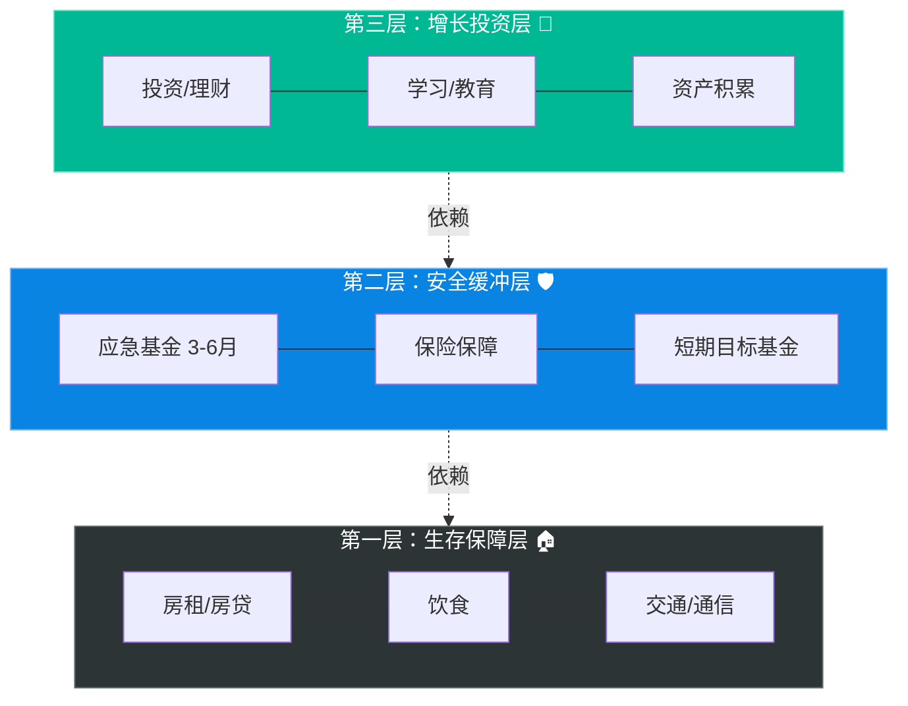
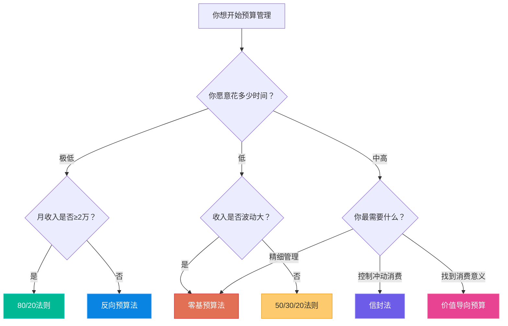
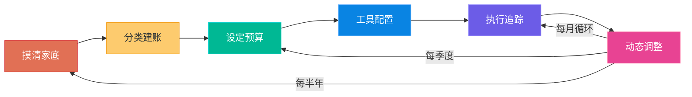

# 六、预算管理技巧

预算不是限制消费的枷锁，而是赋予每一分钱使命的分配系统。一个设计良好的预算，是你的财务大脑——它帮你决定钱从哪来、往哪去、为什么去那里。本节从预算的底层心理学原理出发，系统讲解六大主流预算方法的选择逻辑与实操细节、完整的落地执行流程（从摸清家底到动态调整的六个步骤）、七种常见误区的根因分析与纠正策略、面向四类收入水平和三种特殊场景的定制化方案，以及让预算系统自我进化的高阶技巧。无论你是月光族还是高收入者，本节都能帮你找到适合自己的预算方法并真正执行下去。

**本节知识地图**：

| 板块 | 内容 | 适合谁读 |
|------|------|----------|
| 第1节 · 为什么需要预算 | 心理学基础、没有预算的代价、三层目标体系 | 所有人，尤其"觉得自己不需要预算"的人 |
| 第2节 · 六大主流预算方法 | 50/30/20、信封法、零基预算、反向预算、价值导向、80/20 | 想了解有哪些预算方法的人 |
| 第3节 · 预算方法选择指南 | 选择矩阵、痛点演进路径、混合使用策略 | 不知道该用哪种方法的人 |
| 第4节 · 完整执行流程 | 摸清家底→分类建账→设定预算→工具配置→执行追踪→动态调整 | 准备开始执行预算的人 |
| 第5节 · 常见误区与纠错 | 七个误区的根因分析与纠正方案 | 预算执行中遇到问题的人 |
| 第6节 · 不同收入水平策略 | 3K-5K / 5K-10K / 10K-30K / 30K+ 的定制方案 | 想要量身定制方案的人 |
| 第7节 · 进阶技巧 | 自动化、弹性预算、目标联动、数据优化、订阅管理 | 预算已入门，想进一步优化的人 |
| 第8节 · 特殊场景 | 家庭联合预算、育儿预算、自由职业、应急预算、生活转折 | 处于特殊财务场景的人 |
| 第9节 · 长期心态与习惯内化 | 坚持策略、习惯科学、五个成熟度等级 | 担心自己坚持不下去的人 |
| 第10节 · 速查表 | 黄金比例、执行节奏、应急清单 | 日常快速参考 |

```mermaid
flowchart TD
    A[预算管理全景] --> B[为什么需要预算]
    A --> C[六大主流方法]
    A --> D[完整执行流程]
    A --> E[常见误区与纠错]
    A --> F[收入分层策略]
    A --> G[进阶技巧]
    A --> H[特殊场景]
    A --> I[长期心态与习惯]

    B --> B1[心理学基础]
    B --> B2[没有预算的代价]
    B --> B3[三层目标体系]

    C --> C1[50/30/20法则]
    C --> C2[信封法]
    C --> C3[零基预算法]
    C --> C4[反向预算法]
    C --> C5[价值导向预算法]
    C --> C6[80/20预算法]

    D --> D1[摸清家底]
    D --> D2[分类建账]
    D --> D3[设定预算]
    D --> D4[工具配置]
    D --> D5[执行追踪]
    D --> D6[动态调整]

    G --> G1[自动化系统]
    G --> G2[弹性预算机制]
    G --> G3[目标联动]
    G --> G4[数据驱动优化]
    G --> G5[订阅管理]
    G --> G6[实操脚本]

    H --> H1[家庭联合预算]
    H --> H2[有孩家庭预算]
    H --> H3[自由职业预算]
    H --> H4[应急预算]
    H --> H5[生活重大转折]

    I --> I1[心理策略]
    I --> I2[习惯科学]
    I --> I3[成熟度模型]

    style A fill:#1a1a2e,stroke:#e94560,color:#fff
    style B fill:#16213e,stroke:#0f3460,color:#fff
    style C fill:#16213e,stroke:#0f3460,color:#fff
    style D fill:#16213e,stroke:#0f3460,color:#fff
    style E fill:#16213e,stroke:#0f3460,color:#fff
    style F fill:#16213e,stroke:#0f3460,color:#fff
    style G fill:#16213e,stroke:#0f3460,color:#fff
    style H fill:#16213e,stroke:#0f3460,color:#fff
    style I fill:#16213e,stroke:#0f3460,color:#fff
```



## 1. 为什么需要预算：从"钱不够花"到"钱花在刀刃上"

### 1.1 预算的心理学基础

行为经济学家 Richard Thaler 在《"错误"的行为》中提出"心理账户"理论：人类天然会把钱分成不同的心理账户——工资、奖金、意外之财——并对不同账户采用截然不同的消费态度。比如，同样是1000元，辛苦加班得来的加班费你会精打细花，而年终奖里多出来的1000元却可能随手就花掉了。从经济学角度看，这两笔钱的购买力完全相同，但在心理账户的作用下，我们的消费行为却截然不同。

预算的本质是**用理性账户取代心理账户**，让资金分配基于目标而非情绪。当你为每笔收入都设定好去向，无论这笔钱来自工资、奖金还是退款，它都会按照既定规则流转，不会因为"意外之财"的标签而被随意挥霍。

普林斯顿大学 Eldar Shafir 和斯坦福大学 Sendhil Mullainathan 的研究（《稀缺》，2013）发现，财务决策质量在资源匮乏时显著下降——越是缺钱，越容易做出糟糕的消费决策。这种现象被称为"管窥效应"（Tunneling）：当你专注于眼前的财务压力时，会忽略更长远的规划。预算系统的作用正是**消除"余闲不足"的心理压力**，通过提前规划释放认知带宽。当你知道本月的房租、饮食、交通都已安排妥当，就不必在每次消费时反复权衡"这个月还够不够花"。

哈佛大学心理学教授 Daniel Gilbert 的研究进一步表明，不确定性本身就是压力的来源。一份清晰的预算方案，本质上是在用确定性对抗焦虑——你不必预测未来会发生什么，但你已经为各种可能做好了准备。

**预算影响消费决策的三个心理机制**：

| 机制 | 原理 | 预算如何利用 |
|------|------|------------|
| **锚定效应** | 人的判断会被先入为主的数字影响 | 设定预算上限作为消费锚点，让每次消费都在"锚"的框架内决策 |
| **损失厌恶** | 损失带来的痛苦是同等收益快乐的2倍 | 信封法利用现金减少的"痛感"抑制冲动消费 |
| **承诺机制** | 提前做出的承诺比即时决策更有约束力 | 预算就是你对未来的承诺——月初设定的数字，就是你和自己的契约 |

### 1.2 没有预算的代价

根据中国人民银行2024年《消费者金融素养调查》，仅有约35%的受访者有明确的月度预算规划。没有预算的人面临三个隐性成本：

| 隐性成本 | 具体表现 | 年化损失估算 |
|---------|------|------------|
| **消费黑洞** | 每月有10-15%的支出无法追溯用途——那些"不知道花在哪了"的钱，往往是零散的冲动消费（便利店零食、打车代替地铁、凑单买的无用商品） | 年损失约5,000-15,000元 |
| **应急脆弱** | 遇到突发支出（手机摔坏、家电故障、突发医疗）只能借贷，产生利息。信用卡分期年化利率约13-18%，花呗分期约14-16% | 年利息支出2,000-8,000元 |
| **目标延迟** | 储蓄目标被动摇，买房/旅行/进修计划反复搁置。每一次推迟都意味着更高的房价、更贵的学费、更短的复利时间 | 机会成本难以量化，但长期影响巨大 |

**一个具体的例子**：小李月薪8,000元，没有预算。他觉得自己"也没买什么大件"，但月底总是所剩无几。导出三个月的支付宝和微信账单后，他发现：奶茶和咖啡月均680元，外卖平台的"满减凑单"月均多花320元，各种App自动续费（已经不用的会员）月均180元，打车费比预估高出400元。仅这四项，每月"蒸发"1,580元——一年就是18,960元。这就是没有预算的代价。

**更深层的代价——"穷人心态"的恶性循环**：没有预算的人往往陷入一个心理学上的"决策疲劳"循环——每次消费都需要临时判断"该不该花"，这种频繁的小决策消耗大量认知资源。当真正需要做大决策时（换工作、买房、投资），反而没有足够的精力去做理性判断。预算把那些重复的"该不该花"的判断自动化了，释放认知带宽给真正重要的财务决策。

### 1.3 预算管理的三层目标

预算管理的目标不是"省钱"，而是建立一个分层递进的财务安全体系：

| 层级 | 名称 | 核心目标 | 达成标准 | 典型时间 |
|------|------|---------|---------|---------|
| 第一层 | 生存保障层 | 确保房租、饮食、交通等刚性支出不中断 | 每月收入能覆盖所有刚性支出，且有至少10%的缓冲 | 立即 |
| 第二层 | 安全缓冲层 | 建立应急基金，抵御突发事件 | 存够3-6个月的必要支出（注意：是必要支出，不是总收入） | 6-18个月 |
| 第三层 | 增长投资层 | 将资金导向增值方向（投资、学习、资产积累） | 储蓄率稳定在30%以上，且资金按配置比例投入不同资产 | 持续优化 |

三层目标的关系是递进的：只有第一层稳固，才有资格讨论第二层；第二层建立后，第三层才不会因为中途被抽走资金而失效。很多人犯的错误是急于投资（第三层），却连应急基金（第二层）都没有——结果遇到突发情况不得不亏损卖出投资，反而亏了本金。



**判断你处于哪一层的快速自测**：

- 如果你无法回答"如果明天失业，我能维持多久的生活"——你在第一层
- 如果你能回答上面的问题，但答案是"不到3个月"——你在第一层到第二层之间
- 如果你有6个月以上的应急基金，且每月有稳定的闲置资金——你已进入第三层

## 2. 六大主流预算方法详解

### 2.1 50/30/20 法则

**原理**：源自 Elizabeth Warren 和 Amelia Warren Tyagi 的《All Your Worth》（2005），将税后收入分为三大类：

- **50% 必要支出**（Needs）：房租/房贷、饮食、水电、交通、保险最低还款额
- **30% 个人需求**（Wants）：娱乐、外出就餐、购物、订阅服务、旅行
- **20% 储蓄与还债**（Savings & Debt Repayment）：应急基金、投资、额外还贷

**适用人群**：预算新手、收入稳定的上班族、刚毕业的大学生。

**实操示例**（月收入10,000元）：

| 类别 | 预算比例 | 金额(元) | 具体项目 |
|------|---------|----------|---------|
| 必要支出 | 50% | 5,000 | 房租2,500 + 饮食1,200 + 交通400 + 水电300 + 保险600 |
| 个人需求 | 30% | 3,000 | 娱乐800 + 购物600 + 餐饮社交500 + 订阅200 + 其他900 |
| 储蓄还债 | 20% | 2,000 | 应急基金1,000 + 基金定投800 + 额外还贷200 |

**中国城市的调整建议**：50/30/20的比例在欧美国家设计时，住房成本占收入比通常在25-30%。但在中国一线城市，房租/房贷可能占到收入的40-60%。因此可以灵活调整为：

| 城市层级 | 建议比例 | 住房参考占比 | 储蓄参考占比 |
|---------|---------|------------|------------|
| 一线城市（北上广深） | 60/20/20 或 55/25/20 | 35-50% | 20% |
| 二线城市 | 50/30/20（原版适用） | 25-35% | 20% |
| 三线及以下 | 40/35/25 | 15-25% | 25% |

**优势**：规则简单、上手快、不需要逐项追踪。**局限**：高房价城市房租可能吃掉50%以上收入，需要灵活调整比例；对收入波动大的人群不够精细。

**50/30/20 的常见误用**：

很多初学者会把"必要支出"的定义放得太宽——比如把每天一杯星巴克归入"饮食"（必要支出），实际上它应该归入"个人需求"（可选消费）。判断标准很简单：**如果明天失业，这笔消费你还会继续吗？** 如果答案是否，它就不属于"必要支出"。

**50/30/20 的进阶调整——动态比例法**：

原版比例是静态的，但收入和生活状态会变化。一个更聪明的做法是：

- 储蓄率目标按年递增：第一年20%，第二年25%，第三年30%
- 当收入增长时，储蓄比例自动上调，而非维持固定比例（这就是"防止生活方式膨胀"的自动化版本）
- 当刚性支出占比暂时过高（如刚买房头两年），允许短期调整为70/15/15，但必须设定回归正常比例的时间表

### 2.2 信封法（Envelope Method）

**原理**：Dave Ramsey 推广的经典现金管理法。将预算金额分别放入不同信封（物理或虚拟），每个信封对应一个支出类别。信封里的钱用完即止，不能从其他信封"借调"。信封法的核心心理学机制是"损失厌恶"——当你看到信封里的现金在减少，消费的"痛感"远高于刷卡或扫码。

**执行步骤**：

1. 确定预算周期（通常为月度）
2. 列出所有支出类别（8-12个为宜）
3. 为每个信封分配金额
4. 每次消费从对应信封取钱（物理信封取现金，虚拟信封记录扣减）
5. 月底结余处理：可转入储蓄，或滚入下月同类别信封（形成"缓冲"）

**典型信封分类**：

```text
┌─────────────────────────────────────────────────┐
│  信封预算分配（月收入 8,000 元）                    │
├──────────┬──────────┬──────────┬────────────────┤
│ 房租     │ 饮食     │ 交通     │ 娱乐          │
│ 2,400    │ 1,500    │ 400      │ 600           │
├──────────┼──────────┼──────────┼────────────────┤
│ 日用品   │ 服饰     │ 医疗     │ 学习/投资     │
│ 300      │ 400      │ 200      │ 1,200         │
├──────────┼──────────┼──────────┼────────────────┤
│ 社交     │ 应急     │ 机动     │ 储蓄          │
│ 400      │ 500      │ 100      │ 0（月末结余） │
└──────────┴──────────┴──────────┴────────────────┘
```

**物理信封 vs 虚拟信封对比**：

| 维度 | 物理信封（现金） | 虚拟信封（App） |
|------|----------------|----------------|
| 消费痛感 | 高——研究显示现金支付的"痛感"比刷卡高约20% | 中——数字消费的痛感较低 |
| 便利性 | 低——需要提前取现，无法用于线上消费 | 高——随时随地记录，支持自动分类 |
| 记账功能 | 无——需要手动记录每笔消费 | 强——自动记录、统计、生成报表 |
| 安全性 | 低——现金丢失无法找回 | 高——数据云端备份 |
| 适用场景 | 控制冲动消费效果最佳 | 日常管理最方便 |

**推荐方案**：对于线下高频消费类别（餐饮、娱乐、社交），使用物理现金信封效果最好；对于固定支出和线上消费，使用虚拟信封。推荐工具：随手记的"预算"模块、YNAB的Category功能、MoneyWiz的信封系统。

**优势**：每笔支出有明确归属、强制量入为出。**局限**：现金使用减少的时代操作不便，大额固定支出（房贷）不适合信封管理。

**信封法的进阶玩法——"信封借贷"规则**：

当你确实需要从一个信封借调资金到另一个信封时，必须遵循三条规则：(1) 只能从非必需类别借给必需类别，不能反向操作；(2) 借调必须记录，且月底复盘时分析原因；(3) 同一类别连续两个月被借调，说明初始预算设定不合理，需要调整而非继续借调。

**信封法的"结余滚存"策略**：

月底信封里没花完的钱，有三种处理方式：

1. **转入储蓄**（推荐新手）：简单直接，强化储蓄习惯
2. **滚入下月同类别**（推荐进阶者）：形成"缓冲"，允许某月在某个类别上花多一些（比如攒两个月的娱乐信封，可以看一场演唱会）
3. **50/50分配**：一半转入储蓄，一半滚入下月——兼顾储蓄目标和消费弹性

### 2.3 零基预算法（Zero-Based Budgeting）

**原理**：每一分钱在月初就已经被分配了去向。收入减去所有支出（含储蓄和投资）等于零。不意味着花光所有钱，而是所有钱都有"工作"。这个方法最早由德州仪器公司在1960年代开发用于企业预算管理，后被个人理财领域借鉴。

**核心公式**：

```text
收入 - 支出 - 储蓄 - 投资 - 还债 - 应急 = 0
```

**执行流程**：

1. **列出所有收入来源**：工资、副业、利息、租金、退款等，注意税后金额
2. **逐项分配支出**：从最刚性的开始（房租→水电→饮食→交通→...），确保每一笔都有归属
3. **分配储蓄和投资**：先支付自己（Pay Yourself First），这是零基预算的核心原则
4. **检查余额**：如果还有剩余，分配到具体目标（如旅行基金、进修基金）
5. **确认最终余额为零**：如果有"未分配"余额，说明规划不够细致

**与50/30/20的区别**：50/30/20是粗放的比例分配，零基预算是精细的逐项分配。前者适合入门，后者适合需要严格控制支出或收入波动较大的人群（如自由职业者）。

**实操模板**（月收入12,000元自由职业者）：

```yaml
收入：
  设计项目：9,000
  平台分成：2,000
  理财收益：500
  其他：500
  总计：12,000

支出（刚性）：
  房租：3,000
  水电物业：350
  饮食：1,800
  交通：300
  通信：100
  保险：800
  社保自缴：1,500
  小计：7,850

支出（弹性）：
  娱乐：500
  购物：300
  社交：400
  订阅服务：150
  小计：1,350

储蓄与投资：
  应急基金：500
  指数基金定投：1,500
  学习基金：500
  小计：2,500

机动预留：300

总计：12,000 ✓（余额 = 0）
```

**零基预算的常见陷阱**：

- **遗漏不规则支出**：忘记年度保险费、季度体检等，导致某月突然超支。解决：建立年度支出日历，均摊到每月（详见第4节）。
- **过于理想化**：把弹性支出压得太低，执行两三周后放弃。解决：在历史平均值基础上压缩10-20%，而非直接砍半。
- **不做复盘**：零基预算的最大价值在于逐项对比，如果不做月度复盘，就失去了精细化管理的意义。

**零基预算的"预分配日历"技巧**：

不要等到月初才一次性分配所有预算。建议在每月25日就开始准备下月的零基预算——这时你已经知道本月的实际支出情况，能更准确地预估下月需求。同时，如果下月有已知的特殊支出（朋友生日、节日、体检），可以提前纳入预算，避免月末才发现"忘了"。

### 2.4 反向预算法（Reverse Budgeting）

**原理**：也叫"先付给自己"法（Pay Yourself First）。核心逻辑是**在花钱之前先把储蓄/投资扣掉**，剩余的钱才是可支配收入。这个方法的底层逻辑是：大多数人是"收入-支出=储蓄"，而反向预算是"收入-储蓄=支出"。顺序的颠倒，结果天差地别。

**执行步骤**：

1. 发工资当天，自动转账目标金额到储蓄/投资账户
2. 剩余的钱自由支配，不需要逐项追踪
3. 如果月底有结余，再转入储蓄

**适用场景**：自律性较强但不想花时间精细记账的人；收入足以覆盖储蓄目标的中高收入人群。

**优势**：最省心、最节省时间、储蓄目标自动达成。**局限**：不追踪消费细节，可能导致某些类别超支而不自知。

**关键技巧**：设置工资到账日的自动转账，将"储蓄"变成和房租一样的"刚性支出"。研究显示自动化的储蓄率比手动操作高约30%（Thaler & Benartzi, 2004, "Save More Tomorrow"）。

**实操配置示例**：

```text
工资卡 → 工资到账日自动触发以下转账：
  → 应急基金账户：1,500元（固定）
  → 基金定投账户：2,000元（自动扣款日设为工资日后1天）
  → 年度大额支出账户：500元（车险/旅行等均摊）
  → 剩余 → 日常消费账户（自由支配）
```

**如何确定储蓄目标金额**：建议从收入的15-20%起步，每3个月上调5%，直到找到"刚好感觉有压力但不影响生活质量"的甜蜜点。不要一上来就存50%——那种紧缩感会在两个月内摧毁你的预算系统。

**反向预算的风险盲区**：因为不追踪消费细节，可能出现"收入涨了但储蓄率没涨"的情况。建议每季度做一次简单的支出审计——不需要逐笔记账，只需要看看银行卡和支付宝的月度账单摘要，确认没有异常增长的消费类别。

**反向预算的"升级路径"**：

反向预算是最适合"逐步深化"的方法。你可以按以下路径渐进式优化：

```text
阶段1：只存工资的15% → 剩余自由花
阶段2：存20%，剩余自由花
阶段3：存20% + 设置2-3个"关注类别"（如餐饮、娱乐）的粗略上限
阶段4：存30%，关注类别扩展到5个，开始月度复盘
阶段5：在阶段4基础上，每季度做一次趋势分析
```

每升一个阶段，花3-6个月稳定后再进入下一阶段。这种渐进式方法比"一步到位"的方法可持续性高出数倍。

### 2.5 价值导向预算法（Values-Based Budgeting）

**原理**：先明确个人价值观（什么对你最重要），然后让支出结构反映这些价值观。与其问"我应该在餐饮上花多少钱"，不如问"餐饮体验在我的人生优先级中排第几"。这个方法的核心洞察是：大多数人的消费结构并不反映他们的真实价值观——他们把大量金钱花在了"不太重要"的事情上，却在"非常重要的事情"上吝啬。

**执行步骤**：

1. **价值观排序**：列出10个生活领域，按重要性排序
   - 示例排序：健康 > 家庭 > 学习成长 > 职业发展 > 社交 > 旅行 > 美食 > 时尚 > 科技产品 > 娱乐
2. **对照现有支出**：把过去3个月的实际消费按类别汇总
3. **识别错配**：如果"健康"排第1但实际支出排第7，说明存在价值观错配
4. **调整预算**：将支出结构向价值观靠拢

**案例**：小王月入15,000元，价值观排序是健康>学习>家庭>社交。但实际消费中，社交应酬占了3,200元（排名最高），而健身和学习加起来只有800元。通过价值导向预算，他将社交预算砍到1,500元，健身预算提升到1,200元，学习预算提升到1,500元。三个月后满意度显著提升，因为钱花在了真正重要的地方。

**价值导向预算的深度应用**：

不仅仅是调整金额，更要审视消费行为本身。比如"健康"排第1位的人，除了增加健身预算，还应该审视：

- 是否经常因为"忙"而跳过午餐或吃垃圾食品？这不需要花更多钱，只需要改变习惯
- 是否为了省20块钱走路30分钟而牺牲了本可以用来运动或休息的时间？这是时间价值观的错配
- 是否在买最便宜的食材？健康饮食不一定贵，但需要投入时间学习烹饪

**价值观排序的实操方法——"葬礼测试"**：

想象你80岁时回顾一生，你希望在哪些领域投入了最多的时间和金钱？这个思想实验能帮你穿透社会压力和同辈比较，触及真正重要的东西。很多人做完这个测试后，会发现自己的排序和"我以为的排序"有显著差异——这正是价值导向预算的起点。

价值导向预算的最高境界，是让你的每一笔消费都能清晰地回答："这笔钱花在了我人生中最重要的事情上吗？"

**价值导向预算与50/30/20的结合使用**：

价值导向预算解决的是"钱应该往哪流"的战略问题，50/30/20解决的是"具体分多少"的战术问题。两者结合的实操方式是：

1. 先用价值导向法确定你的价值观排序
2. 然后在50/30/20的30%（个人需求）中，按价值观排序分配权重
3. 价值观排名前3的类别，各分配30/30/20的权重；后7个类别分配剩余的20%

### 2.6 80/20 预算法（Anti-Budget）

**原理**：极简版预算，只关注储蓄率。收入的20%自动转入储蓄/投资，剩下的80%随意花。这个方法的哲学基础是帕累托法则（Pareto Principle）——80%的结果来自20%的努力。在预算管理中，这20%的努力就是"自动储蓄"这一件事。

**执行规则**：

- 收入到账 → 立即转20%到专用账户
- 剩余80% → 自由支配，不用记账
- 月底余额 → 不转入下月，直接转入投资

**适用人群**：高收入人群（月入2万以上）、极度厌恶记账的人、储蓄习惯已经内化的人。

**与反向预算的区别**：反向预算的储蓄比例通常更高（30-50%），且会对剩余支出做大致规划；80/20法则的储蓄比例固定为20%，剩余部分完全自由。反向预算更像"有规划的自动化"，80/20更像"极简自动化"。

**风险提示**：80/20法则的前提是你的80%收入足够覆盖所有必要支出。如果月入10,000元，存20%后只剩8,000元，在一线城市可能不够覆盖房租+饮食。这种情况下，应该先确保必要支出有保障，再确定储蓄比例。

**80/20法则的实操配置**：

```text
工资卡（月入25,000元）
  │
  ├── 工资到账日自动转账：5,000元（20%）→ 储蓄/投资账户
  │   ├── 余额宝/零钱通：2,000元（应急基金补充）
  │   ├── 指数基金定投：2,000元（自动扣款）
  │   └── 债券基金：1,000元（稳健配置）
  │
  └── 剩余20,000元 → 日常消费账户（自由支配）
      ├── 房贷/房租：自动扣款
      ├── 信用卡：自动还款
      └── 其余：自由消费
```

**80/20法则的"反脆弱"升级版**：在收入好的月份，将储蓄比例临时提升到30%甚至40%，建立"超额储蓄缓冲"。这样在收入下降的月份，即使储蓄比例降到10%，年均储蓄率仍然能维持在20%以上。这种方法特别适合收入有季节性波动的人群（如电商卖家、教师、旅游从业者）。

**80/20法则的"隐性检查"机制**：虽然不需要逐笔记账，但建议每月花5分钟做一次"粗检"——打开支付宝/微信的月度账单摘要，确认没有异常增长的消费类别。如果发现某个月的80%不够用，说明需要调整储蓄比例或审视消费结构，而非简单地减少储蓄。

## 3. 预算方法选择指南

选择哪种方法取决于你的财务状况、性格特征和管理偏好：

| 方法 | 复杂度 | 时间投入 | 适合人群 | 储蓄效果 | 最佳搭配 |
|------|--------|---------|---------|---------|---------|
| 50/30/20 | ★☆☆ | 低（月均30分钟） | 预算新手、稳定收入者 | ★★★ | + 记账App自动分类 |
| 信封法 | ★★☆ | 中（月均1小时） | 消费冲动者、有孩家庭 | ★★★★ | + 物理现金用于高频消费 |
| 零基预算 | ★★★ | 高（月均2小时） | 自由职业者、精细管理者 | ★★★★★ | + 电子表格做月度规划 |
| 反向预算 | ★☆☆ | 极低（设置一次即可） | 中高收入、厌恶记账者 | ★★★★ | + 银行App自动转账 |
| 价值导向 | ★★☆ | 中（首月较高，后续降低） | 消费迷茫、价值观驱动者 | ★★★ | + 季度价值观复盘 |
| 80/20 | ★☆☆ | 极低 | 高收入、已养成储蓄习惯 | ★★★ | + 投资账户自动定投 |

**建议**：入门者从50/30/20开始，熟悉3个月后，根据痛点选择进阶方法。最常见的痛点演进路径是：

```text
50/30/20（入门）→ 某类支出失控 → 信封法（精准控制）
                 → 想提高储蓄率 → 反向预算（自动化储蓄）
                 → 收入波动大   → 零基预算（精细分配）
                 → 感觉"钱花了但不开心" → 价值导向（意义驱动）
```

**混合使用策略**：不必死守一种方法。很多成熟的预算管理者会混合使用：用反向预算做储蓄自动化（大框架），用信封法控制几个容易超支的类别（如餐饮、娱乐），用价值导向做季度复盘（战略层面）。关键是找到适合自己的组合。

**预算方法选择的"决策树"**：



## 4. 预算管理的完整执行流程



### 4.1 第一步：摸清家底

在做任何预算之前，需要先了解自己当前的财务状况：

1. **汇总收入**：税后工资 + 副业 + 利息 + 其他所有稳定收入。注意区分"稳定收入"和"偶发收入"——前者用于做预算基数，后者归入额外收入单独处理
2. **回溯3个月支出**：从银行账单、支付宝/微信账单导出数据，按类别汇总。3个月是最低要求，6个月更佳——因为能覆盖季节性波动
3. **计算净资产**：资产（存款+投资+房产等）- 负债（房贷+信用卡+花呗等）
4. **计算储蓄率**：（收入 - 支出）/ 收入 × 100%

**实操：账单导出方法**：

支付宝账单导出路径：我的 → 账单 → 右上角"..." → 开具交易流水证明（可选时间范围，生成Excel）。微信路径：我 → 服务 → 钱包 → 账单 → 右上角"..." → 账单下载。

**导出后的数据处理**：

拿到Excel后，按以下步骤操作：
1. 删除非消费类记录（转账、还款、理财申购赎回等）
2. 新增一列"类别"，用关键词匹配自动分类（如"美团"→餐饮，"滴滴"→交通）
3. 用数据透视表按类别汇总月均支出
4. 计算每个类别占总支出的比例

**用 Python 自动分类账单数据**：

```python
import pandas as pd

# 读取支付宝/微信导出的CSV
df = pd.read_csv('账单.csv', encoding='utf-8')

# 定义分类关键词映射
category_map = {
    '餐饮': ['美团', '饿了么', '肯德基', '麦当劳', '星巴克', '瑞幸', '海底捞', '奶茶', '咖啡'],
    '交通': ['滴滴', '高德', '地铁', '公交', '加油', '停车', '铁路', '12306', '携程火车'],
    '购物': ['淘宝', '京东', '拼多多', '天猫', '唯品会', '苏宁'],
    '娱乐': ['电影', '游戏', '网易云', 'QQ音乐', '爱奇艺', '腾讯视频', 'B站', 'bilibili'],
    '生活缴费': ['电费', '水费', '燃气', '物业', '话费', '中国移动', '中国联通'],
    '医疗': ['医院', '药店', '大药房', '门诊', '挂号'],
    '教育': ['得到', '知乎', '极客时间', '慕课', '网易公开课'],
    '社交': ['红包', '转账']
}

def classify(desc):
    """根据交易描述自动分类"""
    for category, keywords in category_map.items():
        for kw in keywords:
            if kw in str(desc):
                return category
    return '其他'

# 自动分类
df['类别'] = df['商品说明'].apply(classify)

# 按类别汇总月均支出
df['月份'] = pd.to_datetime(df['交易时间']).dt.to_period('M')
summary = df.groupby(['月份', '类别'])['金额'].sum().unstack(fill_value=0)
print(summary)

# 计算各类别占比
total = summary.sum()
print("\n各类别占比：")
print((total / total.sum() * 100).round(1).sort_values(ascending=False))
```

**基准指标**：

| 指标 | 健康范围 | 警戒线 | 说明 |
|------|---------|--------|------|
| 储蓄率 | 20-40% | <10% | 含还贷本金部分 |
| 住房支出占比 | <30% | >50% | 含房贷/房租/物业/水电 |
| 必需/弹性比 | 60:40 | >80:20 | 必需支出不应挤占所有空间 |
| 债务偿还比 | <20% | >40% | 月还款额/月收入 |
| 订阅支出占比 | <3% | >5% | 容易被忽视的隐形消费 |

### 4.2 第二步：分类建账

将所有支出分为以下大类和小类：

**大类划分原则**：固定 vs 可变，必需 vs 非必需。

```text
├── 固定必需（Fixed Essentials）
│   ├── 房租/房贷
│   ├── 物业费/水电燃气
│   ├── 保险（医疗、意外、重疾最低保额）
│   ├── 通信费
│   └── 交通月票/通勤费
│
├── 可变必需（Variable Essentials）
│   ├── 饮食（自炊+外食）
│   ├── 日用品
│   ├── 医疗
│   ├── 教育/学习
│   └── 服饰（基础需求部分）
│
├── 弹性消费（Discretionary）
│   ├── 娱乐
│   ├── 社交
│   ├── 购物（升级需求部分）
│   ├── 订阅服务
│   └── 旅行
│
└── 财务目标（Financial Goals）
    ├── 应急基金
    ├── 投资/理财
    ├── 还债（超出最低还款额部分）
    └── 长期目标（买房首付、教育基金等）
```

**分类的黄金原则**：大类控制在6-8个，子类不超过15个。问自己："这个子类的月度预算会超过总收入的5%吗？" 如果不会，就不需要单独设类别，归入"其他"即可。过于细致的分类只会增加管理成本，导致你更快放弃。

**分类的进阶技巧——"归因分类法"**：

不要按消费渠道分类（"支付宝"、"微信"、"现金"），而要按消费目的分类（"生存"、"享受"、"成长"）。同样一笔200元的消费，在书店买技术书籍是"学习"，在书店买杂志是"娱乐"——渠道相同，目的不同，分类也应不同。这个原则看似简单，但很多人在实际操作中会混淆，导致预算数据失真。

**常见的分类陷阱**：

| 陷阱 | 例子 | 正确分类 |
|------|------|---------|
| 把"健康食品"归入健康 | 在超市买的有机蔬菜 | → 饮食（可变必需） |
| 把"电子设备"归入学习 | 买了一台iPad用于看视频 | → 娱乐（弹性消费），除非你能证明70%以上时间用于学习 |
| 把"工作餐"归入社交 | 和同事一起叫外卖 | → 饮食（可变必需），不是社交 |
| 把"护肤品"归入健康 | 日常护肤 | → 日用品（可变必需），除非是皮肤科处方药 |

分类的核心原则是**消费目的**，而非**商品属性**。同一瓶水，在超市买是日用品，在景区买是娱乐消费的一部分。

### 4.3 第三步：设定预算

基于回溯数据和目标储蓄率，为每个类别设定月度预算：

**设定公式**：

```text
类别预算 = 历史平均支出 × 调整系数

调整系数逻辑：
  - 刚性支出：1.0（维持不变）或根据涨价预期上调至1.05-1.10
  - 弹性支出：0.7-0.9（通常需要压缩10-30%）
  - 财务目标：根据目标倒推（如5年攒30万 → 月存5,000）
  - 新增类别：参考同类人群数据或先试运行一个月
```

**关键原则**：预算要**略微宽松**而非极度紧缩。行为研究显示，过度紧缩的预算会在2-3周内引发"报复性消费"，导致预算崩溃。建议在计算出的"理想值"基础上加10%的缓冲。

**预算分配的优先级排序**（当收入不够分配时的取舍顺序）：

1. 固定必需（房租、保险、最低还款）——不可压缩
2. 可变必需的基础部分（饮食、交通、基础医疗）——可微调
3. 财务目标中的应急基金——安全网，优先保障
4. 可变必需的升级部分（更好的食材、学习投入）——视情况调整
5. 储蓄和投资——在应急基金建立后优先
6. 弹性消费——最后分配，但不能为零

**预算设定的"三轮校准法"**：

- **第一轮（试运行）**：基于历史数据设定预算，执行一个月，不做任何人为干预
- **第二轮（校准）**：对比第一轮的预算vs实际，找出偏差超过20%的类别，分析原因并调整预算
- **第三轮（稳定）**：执行校准后的预算，连续3个月偏差控制在10%以内，即为稳定状态

大多数人在第一轮就会发现：餐饮和交通预算严重低估，娱乐和购物预算高估。这是正常现象——人们倾向于低估高频小额消费（外卖、打车），高估低频大额消费（买衣服、买电子产品）。

**通胀调整机制**：

预算不是设一次就永远不变的。中国居民消费价格指数（CPI）年均涨幅约2-3%，但不同类别的通胀率差异很大：

| 类别 | 近年年均涨幅 | 建议调整频率 |
|------|------------|------------|
| 餐饮/食品 | 3-5% | 每半年微调 |
| 住房 | 0-8%（因城市而异） | 每年评估 |
| 教育 | 5-8% | 每年上调 |
| 交通 | 2-3% | 每年微调 |
| 电子产品 | -5~-10%（降价趋势） | 不需上调 |
| 医疗 | 3-6% | 每年微调 |

建议每年1月做一次全面的预算通胀调整：对涨幅较大的类别上调3-5%，对降价趋势的类别可以下调或维持。

### 4.4 第四步：工具选择与配置

| 工具类型 | 代表产品 | 优势 | 劣势 | 最适合 |
|---------|---------|------|------|--------|
| 手机记账App | 随手记、MoneyWiz、记账鹅 | 随手记、自动分类 | 容易遗漏、需坚持 | 日常记录 |
| 电子表格 | Excel、Google Sheets、飞书表格 | 完全自定义、无隐私风险 | 手动维护、无提醒 | 月度规划与复盘 |
| 专业预算软件 | YNAB、Copilot | 强大的预算引擎 | 需付费、国内使用不便 | 深度预算管理 |
| 银行App内置 | 各大银行App的"账本"功能 | 自动同步银行卡流水 | 只覆盖单一银行 | 银行卡消费追踪 |
| 自建系统 | Python + SQLite + 脚本 | 100%自定义、可自动化 | 技术门槛高 | 技术型用户 |

**推荐组合**：记账App（日常记录）+ 电子表格（月度预算规划与复盘）。这个组合覆盖了从日常流水到战略规划的完整链路。

**工具选择的"三步法"**：

1. **先试用一周**：不要一上来就付费购买任何工具。大多数记账App都有免费版，先用一周感受操作流畅度
2. **评估三个维度**：记录便利性（你愿意每天用它吗？）、数据可视化（能不能一目了然看到预算执行情况？）、导出能力（数据能不能导出为Excel/CSV？）
3. **坚持一个月再决定**：如果一个月内你有超过5次"懒得记录"的感觉，说明这个工具不适合你，换一个

**主流记账App深度对比**：

| 功能维度 | 随手记 | MoneyWiz | 记账鹅 | YNAB | 钱迹 |
|---------|--------|----------|--------|------|------|
| 免费版功能 | 基础记账+预算 | 有限账户数 | 完整功能（有广告） | 34天试用 | 完整功能 |
| 自动分类 | ✓ 支持自定义规则 | ✓ 智能分类 | ✓ 简单规则 | ✓ 强规则引擎 | ✓ 支持 |
| 多账户管理 | ✓ | ✓✓ 强项 | ✗ 有限 | ✓✓ | ✓ |
| 预算模块 | ✓ 有信封功能 | ✓✓ 强项 | ✓ 基础 | ✓✓✓ 核心功能 | ✓ 基础 |
| 数据导出 | CSV/Excel | CSV/PDF/Excel | CSV | CSV | CSV |
| 多币种 | ✓ | ✓✓ 自动汇率 | ✗ | ✓✓ | ✓ |
| 隐私安全 | 云端同步 | 本地+云端 | 云端 | 云端 | 本地优先 |
| 年费（人民币） | 免费/VIP 98元 | 128元 | 免费/VIP 68元 | ≈700元 | 免费/VIP 60元 |
| 最适合人群 | 入门用户 | 多账户/跨境用户 | 极简用户 | 深度预算管理者 | 隐私敏感用户 |

**工具配置要点**：

记账App设置：
- 预设与你分类体系一致的类别（6-8个大类）
- 开启自动分类规则（如"美团"自动归入餐饮）
- 设置每个类别的月度预算上限
- 开启超支提醒（建议设为预算的80%时提醒，而非100%）

电子表格模板结构：
- Sheet 1：月度预算规划（类别、预算金额、实际金额、差异）
- Sheet 2：年度支出日历（大额支出的时间点和均摊月预算）
- Sheet 3：储蓄/投资进度追踪（目标金额、当前金额、完成百分比）
- Sheet 4：趋势分析（近6个月的储蓄率、各类别支出趋势图）

**自建 Python 预算追踪脚本**：

```python
"""
极简预算追踪器：基于SQLite的本地预算管理系统
适用于技术型用户，支持自动分类、月度报告、趋势分析
"""
import sqlite3
import datetime
from pathlib import Path

DB_PATH = Path.home() / '.budget' / 'budget.db'

def init_db():
    """初始化数据库"""
    DB_PATH.parent.mkdir(exist_ok=True)
    conn = sqlite3.connect(DB_PATH)
    c = conn.cursor()
    c.execute('''CREATE TABLE IF NOT EXISTS transactions (
        id INTEGER PRIMARY KEY AUTOINCREMENT,
        date TEXT NOT NULL,
        amount REAL NOT NULL,
        category TEXT NOT NULL,
        description TEXT,
        source TEXT DEFAULT 'manual'
    )''')
    c.execute('''CREATE TABLE IF NOT EXISTS budgets (
        month TEXT NOT NULL,
        category TEXT NOT NULL,
        amount REAL NOT NULL,
        PRIMARY KEY (month, category)
    )''')
    conn.commit()
    return conn

def add_transaction(conn, date, amount, category, desc='', source='manual'):
    """添加一笔交易"""
    conn.execute(
        'INSERT INTO transactions (date, amount, category, description, source) VALUES (?,?,?,?,?)',
        (date, amount, category, desc, source)
    )
    conn.commit()

def set_budget(conn, month, category, amount):
    """设定某月某类别的预算"""
    conn.execute(
        'INSERT OR REPLACE INTO budgets (month, category, amount) VALUES (?,?,?)',
        (month, category, amount)
    )
    conn.commit()

def monthly_report(conn, month):
    """生成月度报告"""
    c = conn.cursor()

    # 获取预算
    c.execute('SELECT category, amount FROM budgets WHERE month=?', (month,))
    budgets = {row[0]: row[1] for row in c.fetchall()}

    # 获取实际支出
    c.execute('''SELECT category, SUM(amount) FROM transactions
                 WHERE date LIKE ? AND amount < 0
                 GROUP BY category''', (f'{month}%',))
    actual = {row[0]: abs(row[1]) for row in c.fetchall()}

    # 生成对比报告
    all_categories = set(list(budgets.keys()) + list(actual.keys()))
    print(f"\n{'='*60}")
    print(f"  {month} 月度预算报告")
    print(f"{'='*60}")
    print(f"{'类别':<12} {'预算':>10} {'实际':>10} {'差异':>10} {'状态':>8}")
    print(f"{'-'*60}")

    total_budget = 0
    total_actual = 0
    for cat in sorted(all_categories):
        b = budgets.get(cat, 0)
        a = actual.get(cat, 0)
        diff = b - a
        status = '✓' if diff >= 0 else '⚠️ 超支'
        total_budget += b
        total_actual += a
        print(f"{cat:<12} {b:>10,.0f} {a:>10,.0f} {diff:>+10,.0f} {status:>8}")

    print(f"{'-'*60}")
    total_diff = total_budget - total_actual
    print(f"{'总计':<12} {total_budget:>10,.0f} {total_actual:>10,.0f} {total_diff:>+10,.0f}")

    # 计算储蓄率
    c.execute('SELECT SUM(amount) FROM transactions WHERE date LIKE ? AND amount > 0', (f'{month}%',))
    income = c.fetchone()[0] or 0
    if income > 0:
        savings_rate = (income - total_actual) / income * 100
        print(f"\n月收入：{income:,.0f}  |  储蓄率：{savings_rate:.1f}%")

# 使用示例
if __name__ == '__main__':
    conn = init_db()

    # 设定2026年7月预算
    month = '2026-07'
    for cat, amt in [('房租', 2500), ('饮食', 1500), ('交通', 400),
                     ('娱乐', 800), ('购物', 600), ('储蓄', 2000)]:
        set_budget(conn, month, cat, amt)

    # 记录一笔消费
    add_transaction(conn, '2026-07-01', -45.5, '饮食', '午餐-美团')

    # 生成报告
    monthly_report(conn, month)
```

### 4.5 第五步：执行与追踪

**日常习惯**（每天2分钟）：

- 消费后立即记录（或设置自动同步）
- 睡前花1分钟检查今日支出，确认在预算范围内
- 如有大额意外支出，记录原因——不是为了自责，而是为了发现规律

**每周检查**（每周10分钟）：

- 查看各信封/类别的余额
- 发现某类别即将超支，及时调整其他类别（这不叫"打破预算"，叫"动态管理"）
- 记录本周的"冲动消费"，为下周提供警醒
- 检查是否有自动续费的订阅需要取消

**月度复盘**（月末30分钟）：

- 对比预算 vs 实际
- 分析超支/节余的原因
- 调整下月预算
- 更新储蓄/投资进度

**月度复盘模板**：

```markdown
## 2026年6月预算复盘

### 收入
- 工资：10,000（预算10,000）✓
- 副业：800（预算500）↑
- 总计：10,800

### 支出
| 类别 | 预算 | 实际 | 差异 | 原因分析 |
|------|------|------|------|---------|
| 房租 | 2,500 | 2,500 | 0 | — |
| 饮食 | 1,500 | 1,680 | +180 | 朋友聚餐3次超支 |
| 交通 | 400 | 350 | -50 | 本月多骑车 |
| 娱乐 | 800 | 620 | -180 | 减少了电影和游戏消费 |
| ... | ... | ... | ... | ... |
| **总计** | **9,000** | **8,750** | **-250** | 整体节余 |

### 储蓄进度
- 应急基金：已有28,000（目标50,000，完成56%）
- 定投基金：本月投入1,200，累计15,600

### 本月洞察
- 发现：外卖消费中"满减凑单"导致实际多花了约200元
- 行动：下月尝试每周3天自炊，预计可节省300元

### 下月调整
- 饮食预算上调到1,600（考虑物价和社交需求）
- 娱乐预算维持800（实际消费低于预算，说明800够用）
```

### 4.6 第六步：动态调整

预算是活的工具，不是一成不变的教条。以下情况需要调整：

| 触发事件 | 调整幅度 | 调整方式 |
|---------|---------|---------|
| 加薪 | 重新分配比例 | 增量部分至少50%用于储蓄/投资（防止生活方式膨胀） |
| 降薪 | 压缩弹性支出 | 先保刚性，弹性砍30-50%，储蓄降低但不归零 |
| 搬家 | 新增/调整住房预算 | 提前1个月测算新住所的全部成本（含通勤变化） |
| 结婚 | 合并预算体系 | 建立共同账户+个人账户的双层结构 |
| 生子 | 新增育儿类别 | 提前6个月开始存"育儿启动金" |
| 换工作 | 重新评估收入结构 | 注意试用期薪资差异、新城市生活成本 |
| 季节性波动 | 类别间调剂 | 冬季取暖费↑、春节社交↑、暑假亲子↑ |

**调整频率建议**：小调整（类别间调剂）每周可做；大调整（比例重分配）每月最多一次；结构性调整（更换预算方法）每季度评估一次。

## 5. 常见预算误区与纠错

### 误区一：预算过于细致

**症状**：把支出分成了30多个子类别（"早餐"、"午餐"、"晚餐"、"下午茶"、"夜宵"分别设类别），每天花30分钟记账，两周后放弃。

**根因**：试图完美控制一切，忽略了管理成本。管理学中有一个概念叫"管理成本不应超过管理收益"——如果你花在记账上的时间精力，超过了预算帮你省下的钱，那就本末倒置了。

**纠正**：大类控制在6-8个，子类不超过15个。问自己："这个类别的月度预算会超过总收入的5%吗？" 如果不会，就不需要单独设类别，归入"其他"即可。

**一个实用的测试**：如果你连续3天忘记记账，说明你的分类体系太复杂了。简化到你能每天不费力地完成记录的程度。

### 误区二：预算过于严苛

**症状**：把所有弹性支出压缩到最低，连续两周"省钱"后突然大肆消费——买了一堆不需要的东西，花掉了比正常消费更多的钱。

**根因**：忽略了心理需求。行为经济学中的"自我损耗"（Ego Depletion）理论表明，持续的自控力消耗最终会导致失控。就像弹簧被压得太紧，反弹时会弹得更远。

**纠正**：**必须保留"快乐基金"**——每月200-500元的无理由消费额度。这笔钱的作用是释放心理压力，防止"报复性消费"摧毁整个预算。快乐基金不需要记账，不需要解释，花完即可。它是预算系统的"安全阀"。

**进阶做法**：快乐基金的比例可以随储蓄率提升而增加。比如储蓄率20%时快乐基金300元，储蓄率30%时快乐基金500元——用更高的储蓄率"赚取"更多的自由消费权，形成正向激励。

### 误区三：只关注支出不关注收入

**症状**：在支出上精打细算，花了大量时间比较哪个超市的鸡蛋便宜2毛钱，却从不思考如何增加收入。

**根因**：节流有上限（最多省100%），开源没有上限。一个人月入5,000元，即使把支出压缩到极致（假设能存3,000元），也不如月入15,000元、支出10,000元（存5,000元）来得有效。

**纠正**：预算管理的时间分配应该是：60%关注支出管理，40%关注收入增长。具体来说，除了月度复盘支出，每季度评估一次收入增长可能性（加薪谈判、副业开发、投资收益优化）。把"省下的时间"投入到能产生收入的活动上。

**一个思维实验**：假设你每小时的工资是50元，你花1小时比价节省了15元——你实际上亏了35元。当然，有些比价习惯一旦建立就不需要额外时间，但如果你发现自己在"省钱"上投入了大量时间精力，不妨算一算这些时间如果用来工作或学习能创造多少价值。

### 误区四：忽视年度/季度大额支出

**症状**：月度预算执行良好，但保险年费、旅游、年终购物等大额支出突然出现时措手不及，不得不动用应急基金或借贷。

**根因**：只做了月度预算，没有建立"年度支出日历"。

**纠正**：建立年度支出日历，将大额年度支出均摊到每月预算中：

| 年度支出 | 金额(元) | 发生月份 | 均摊月预算 |
|---------|---------|---------|----------|
| 车险 | 4,800 | 3月 | 400/月 |
| 旅行 | 12,000 | 7月、12月 | 1,000/月 |
| 双十一购物 | 6,000 | 11月 | 500/月 |
| 年节礼金 | 3,600 | 1月、2月 | 300/月 |
| 体检 | 1,200 | 9月 | 100/月 |
| 季度保险 | 2,400 | 每季度 | 200/月 |
| **合计** | **30,000** | — | **2,500/月** |

每月额外存入2,500元到"年度大额支出"专用账户（可以是余额宝或银行活期），到期时直接从中支付。这样，当你需要支付4,800元车险时，账户里已经积累了足够的资金，不会对当月预算造成冲击。

**中国特色大额支出日历**：

| 时期 | 大额支出 | 建议提前准备 |
|------|---------|------------|
| 春节（1-2月） | 年货、红包、聚餐、旅行 | 提前3个月开始存"春节基金" |
| 618（6月） | 电商平台大促 | 5月列出"真正需要"清单，设预算上限 |
| 暑假（7-8月） | 亲子旅行、夏令营 | 提前2个月规划，比临时订便宜30-50% |
| 双十一（11月） | 年度最大购物节 | 10月列出清单，只买清单上的物品 |
| 年末（12月） | 明年保险续费、体检 | 11月开始比价和预约 |

### 误区五：和别人比较预算

**症状**：看到别人月花3,000，觉得自己月花6,000太浪费。或者看到别人月花10,000，觉得自己也应该"享受生活"。

**根因**：忽略收入差异、城市差异、生活阶段差异。月入3,000花3,000和月入30,000花10,000，后者的绝对消费高但储蓄率更高（67% vs 0%）。

**纠正**：预算的唯一参照系是**自己的收入和目标**。评判标准不是绝对金额，而是以下三个指标：

1. **储蓄率是否达标**（你的目标储蓄率是多少？）
2. **支出结构是否符合自己的价值观**（钱花在了你真正在意的地方吗？）
3. **财务目标是否在推进**（买房/旅行/进修的进度如何？）

### 误区六：把预算当成一次性任务

**症状**：花了一整个周末制定了完美的预算方案，打印出来贴在墙上，然后——再也没有更新过。

**根因**：把预算当成"项目"而非"习惯"。预算是持续的财务管理过程，不是一次性的规划活动。

**纠正**：预算系统需要"维护时间"——每天2分钟记录、每周10分钟检查、每月30分钟复盘。把这三个时间点设为手机日历的固定提醒，就像刷牙一样成为日常习惯。

**习惯养成的"两分钟规则"**：

预算坚持不下来的根本原因是"启动成本太高"。解决方案是：把每天的预算维护压缩到两分钟以内——

- 消费后花10秒打开App记录（或开启自动同步，0秒）
- 睡前花1分钟扫一眼今天的支出总额
- 如果某天完全忘记，不要自责，第二天补上就好——"连续三天忘记"才需要警觉

### 误区七：忽视"订阅蠕变"与数字支付陷阱

**症状**：每月账单里总有一些"不知道什么时候开通"的扣款——视频会员、云存储、健身App、各种"首月1元"的自动续费。

**根因**：数字支付消除了消费的"痛感"，而订阅制商业模式的盈利逻辑就是利用用户的惰性。研究显示，平均每个中国互联网用户有8.3个付费订阅，其中约30%处于"不活跃使用"状态（即付了钱但几乎不用）。

**纠正——订阅审计清单**：

每季度做一次完整的订阅审计：

```text
第1步：导出所有自动扣款记录
  - 支付宝：设置 → 支付设置 → 免密支付/自动扣款
  - 微信：我 → 服务 → 钱包 → 支付设置 → 自动续费
  - Apple ID：设置 → Apple ID → 订阅
  - 各银行App的代扣管理

第2步：逐项评估
  对每个订阅问三个问题：
  ① 过去30天我用过这个服务吗？
  ② 如果取消，我会主动重新订阅吗？
  ③ 有没有免费替代品？（如网易云音乐→免费版、爱奇艺→等广告版）

第3步：执行清理
  - 立即取消所有"30天内没用过"的订阅
  - 对"偶尔用"的订阅，降级到最低档
  - 对"每天都用"的订阅，确认当前档位是否最优

第4步：记录节省金额
  通常一次审计能发现每月100-300元的"隐形扣款"
```

**预防订阅蠕变的规则**：

- 新订阅必须在日历上标注"3个月后审查"的提醒
- 首月优惠订阅，开通时就设置"在优惠期结束前3天"的取消提醒
- 每月预算中单独列出"订阅服务"类别，上限设为收入的2-3%
- 年付比月付便宜时，优先年付（但前提是你确定会用满一年）

## 6. 不同收入水平的预算策略

每个收入水平面临的核心挑战不同，需要的策略也不同。本节针对四个收入段给出从"道"（核心策略）到"术"（具体操作）的完整方案，包括容易被忽视的陷阱和真实案例。

### 6.1 月入3,000-5,000元：生存优先，极简生活

**核心挑战**：必要支出占比极高（70-80%），几乎没有弹性空间。这个阶段的预算目标不是"优化结构"，而是"确保不透支"并建立最基础的储蓄习惯。

**预算参考**（月入4,000元）：

| 预算类别 | 建议比例 | 金额(元) | 具体操作 |
|---------|---------|---------|---------|
| 住房 | 25-35% | 1,200 | 合租是最有效的住房成本控制方式 |
| 饮食 | 25-30% | 1,100 | 自炊为主，学会批量备餐（Meal Prep） |
| 交通 | 5-10% | 200 | 公交/地铁为主，共享单车代替短途打车 |
| 通信 | 2-3% | 80 | 选择互联网套餐（如移动花卡19元/月+流量包） |
| 储蓄 | 5-10% | 200 | 哪怕只有200元，也要建立"先存后花"的习惯 |
| 其他 | 剩余 | 1,420 | 日用品、医疗、社交等 |

**关键行动**：

1. **控制饮食成本**：自炊为主，学会批量备餐（Meal Prep），每周花2小时准备一周的午餐。一份Meal Prep的成本约8-12元/餐，而外卖均价25-35元/餐，仅此一项月省600-1,200元
2. **审查所有订阅**：这个收入水平不应该有任何付费订阅。音乐用免费版，视频等广告版，云存储用免费额度
3. **每月强制储蓄**：哪怕只有200元，也要建立"先存后花"的习惯——金额不重要，习惯最重要。200元/月 × 12月 = 2,400元/年，这是一笔"不向朋友借钱"的安全垫
4. **关注免费资源**：图书馆、公园、免费线上课程（B站、Coursera旁听）、社区活动

**这个阶段最容易犯的错误**：

- **"反正也存不了多少，干脆不存"**：这是最危险的心态。200元的意义不在于金额，而在于建立"收入-储蓄=支出"的思维模式。当你月入10,000时，这个习惯会自动让你存2,000
- **用信用卡/花呗"提前享受"**：这个收入水平的债务成本极高。信用卡分期年化13-18%，一旦陷入最低还款的循环，每月利息可能吞噬你仅有的储蓄空间
- **忽视小钱的累积效应**：每天一瓶3元的矿泉水（月90元），每天一包15元的烟（月450元），这些"小钱"在这个收入水平下占比惊人

**真实案例**：小张，三线城市超市收银员，月入3,500元。以前每月月光，有时还需父母接济。开始预算后：合租从单间800元降到合租500元，自炊替代外卖（饮食从1,800降到900），取消了3个不用的App会员（省75元），骑车上班代替打车（交通从300降到100）。每月固定存300元到余额宝。一年后存款3,600元——不多，但这是她人生中第一次有"自己的钱"。

### 6.2 月入5,000-10,000元：建立结构，稳步积累

**核心挑战**：收入刚好够覆盖生活+储蓄，但弹性空间有限。这个阶段最容易陷入"消费升级陷阱"——收入涨了，但支出涨得更快。

**预算参考**（月入8,000元）：

| 预算类别 | 建议比例 | 金额(元) | 说明 |
|---------|---------|---------|------|
| 必要支出 | 50% | 4,000 | 房租1,800 + 饮食1,200 + 交通400 + 水电300 + 保险300 |
| 弹性消费 | 30% | 2,400 | 娱乐600 + 购物500 + 社交500 + 订阅200 + 其他600 |
| 储蓄投资 | 20% | 1,600 | 应急基金800 + 基金定投600 + 学习基金200 |

**关键行动**：

1. **建立完整的预算分类体系**：从这个收入水平开始，值得花时间建立6-8个大类的分类体系。推荐从50/30/20法则起步
2. **开始基金定投**：每月500-1,000元即可起步。选择宽基指数基金（如沪深300ETF），设置自动扣款。定投的核心价值是"强制储蓄+长期复利"，而非择时
3. **建立应急基金**：目标 = 3个月必要支出 ≈ 12,000元。按每月存800元计算，约15个月完成。应急基金放在货币基金（余额宝/零钱通）中，兼顾流动性和收益
4. **重点防范消费升级陷阱**：加薪后，增量的至少50%应该用于储蓄。月薪从6,000涨到8,000时，不是把多出的2,000全部用于消费，而是至少存1,000

**这个阶段的"隐形陷阱"**：

- **社交消费膨胀**：收入提升后，社交圈层可能变化，聚餐、礼物、旅行的频次和档次都在上升。建议每月社交预算设上限（如收入的6-8%），超过部分用"下次再约"替代
- **"奖励自己"的频率过高**：每次加薪、完成项目、过节都想"奖励自己"，一年下来"奖励消费"可能占到总收入的10-15%。建议每季度只允许一次"大奖励"（500元以内），平时用低成本方式奖励自己（看一部电影、买一本好书）
- **忽视保险配置**：这个收入水平最怕突发大额医疗支出。一份百万医疗险（25岁约200-300元/年）和一份意外险（约100-150元/年）是必要的安全网，年成本不到500元

**真实案例**：小陈，二线城市互联网公司运营，月入7,500元。开始预算前，每月存不下1,000元。使用50/30/20法则后，发现"购物"类月均超2,000元（主要是直播间冲动消费）。设置规则：直播间看到想买的东西，先加入购物车，等24小时再决定。一个月后，购物支出降到800元。加上其他优化，每月稳定储蓄2,000元，8个月后应急基金达到16,000元。

### 6.3 月入10,000-30,000元：优化结构，加速积累

**核心挑战**：有足够的空间做精细化管理，但"小钱不算"的心态开始蔓延。每天一杯30元咖啡 = 年化10,950元；每周一次200元聚餐 = 年化10,400元。这些"不觉得贵"的消费加起来，可能比你想象的多得多。

**预算参考**（月入20,000元）：

| 预算类别 | 建议比例 | 金额(元) | 说明 |
|---------|---------|---------|------|
| 储蓄投资 | 30-40% | 7,000 | 应急基金补充 + 指数基金定投 + 其他投资 |
| 必要支出 | 35-40% | 7,500 | 房贷/房租4,000 + 饮食1,500 + 交通600 + 保险500 + 其他900 |
| 弹性消费 | 20-30% | 5,500 | 娱乐1,200 + 购物1,000 + 社交1,000 + 订阅300 + 旅行基金1,000 + 其他1,000 |

**关键行动**：

1. **采用反向预算法或零基预算法**：收入足以支撑更精细的管理。反向预算法适合不想花太多时间的人（设置自动转账即可），零基预算法适合想要极致控制的人
2. **开始关注投资配置**：不再只是"存钱"，而是"让钱工作"。建立指数基金（60%）+ 债券基金（20%）+ 货币基金（20%）的基础配置
3. **利用价值导向预算优化消费结构**：收入足够覆盖需求后，应该问"钱花在了我真正在意的地方吗？"。做一次价值观排序，对照实际支出，识别错配
4. **建立完整的资产配置框架**：开始考虑公积金最大化、个税专项扣除等税务优化手段

**这个阶段的"隐形陷阱"**：

- **"面子消费"失控**：收入提升后，社交圈层的消费标准也在上升。请客吃饭从人均100升到人均300，送礼从200升到500。建议设定"社交消费上限"——每月社交支出不超过收入的5-8%
- **"小钱不算"的累积效应**：收入越高，越容易忽视小额消费。但30元/天的咖啡 = 10,950元/年，50元/天的外卖溢价 = 18,250元/年。这些钱如果投入指数基金（年化8%），10年后分别变成15.8万和26.5万
- **生活方式膨胀**：加薪5,000元，但房租涨了1,500（换更好的房子）、餐饮涨了1,000（开始吃更好的餐厅）、购物涨了1,500（开始买品牌）——实际只多了1,000元储蓄。建议加薪后，增量的50%以上直接转入储蓄

**真实案例**：小李，一线城市产品经理，月入18,000元。使用反向预算法，工资到账日自动转5,400元（30%）到投资账户。剩余12,600元自由支配。每季度做一次支出审计，发现"社交应酬"从月均2,000涨到3,500——原因是新团队聚餐文化浓厚。调整策略：设定社交预算上限3,000元/月，超出部分用"AA制"或"下次我请"替代。一年后储蓄率达到35%，投资账户累计超过8万。

### 6.4 月入30,000元以上：资产配置，财富增长

**核心挑战**：支出管理已经不是瓶颈，如何让钱生钱才是核心议题。这个阶段最大的风险不是"花太多"，而是"没有让钱工作"。

**预算参考**（月入50,000元）：

| 预算类别 | 建议比例 | 金额(元) | 说明 |
|---------|---------|---------|------|
| 储蓄投资 | 50%+ | 25,000+ | 多元化投资组合 + 税务优化 |
| 必要支出 | 25-30% | 13,000 | 房贷/房租6,000 + 饮食2,500 + 交通1,000 + 保险1,500 + 其他2,000 |
| 弹性消费 | 20-25% | 12,000 | 由价值观驱动分配 |

**关键行动**：

1. **建立完整的资产配置框架**：不再只是"买基金"，而是建立包含股票、债券、房产、另类投资的多元化组合。具体配置比例参考投资相关章节
2. **税务优化**：这个收入水平的税务筹划空间很大。公积金最大化缴纳（税前扣除）、充分利用个税专项附加扣除（子女教育、住房贷款利息、赡养老人等）、考虑商业养老保险的税延优惠
3. **建立家庭财务安全体系**：充足的保险配置（重疾险保额建议为年收入的3-5倍）、开始考虑遗嘱/信托规划
4. **预算重点从"控制支出"转向"优化资产配置"**：月度复盘的重点不是"餐饮超支了200元"，而是"投资组合的收益率是否达到预期"

**"隐形财富杀手"——让钱睡觉的代价**：

如果25,000元/月只是躺在活期账户里（年化0.2%），而不是投入到合理配置的资产组合中（年化5-8%），10年后的差距是巨大的：

| 投资方式 | 年化收益 | 10年后总额 | 差额 |
|---------|---------|-----------|------|
| 活期存款 | 0.2% | 约3,010,000元 | — |
| 稳健配置 | 5% | 约3,880,000元 | +870,000元 |
| 积极配置 | 8% | 约4,550,000元 | +1,540,000元 |

87万到154万的差距，就是"让钱睡觉"的代价。这个阶段的预算管理，核心是确保每一笔闲置资金都在"工作"。

**高收入者的专属风险**：

- **过度自信**：收入高容易产生"我不需要预算"的错觉。但高收入者的生活方式膨胀速度往往更快——年入百万但存款为零的人并不罕见
- **忽视流动性**：把太多资金锁定在房产、长期理财等低流动性资产中，遇到突发需求（如创业机会）时无法快速调动资金。建议始终保持6个月支出的流动资金
- **税务合规风险**：收入越高，税务结构越复杂。建议每年做一次专业的税务筹划审计，确保合规的同时充分利用优惠政策

## 7. 进阶技巧：让预算系统自我进化

### 7.1 自动化预算系统

利用银行App的自动转账功能建立资金分流：

```text
工资到账日（每月10日）
    │
    ├── 自动转账 → 应急基金账户（固定金额）
    ├── 自动转账 → 投资账户（定投扣款）
    ├── 自动转账 → 年度大额支出账户（均摊金额）
    ├── 自动扣款 → 房租/房贷
    ├── 自动扣款 → 保险
    │
    └── 剩余 → 日常消费账户（自由支配）
```

**自动化的核心价值**：减少决策疲劳。每一次"要不要转钱到储蓄账户"的决策都消耗意志力，而自动化让这个决策只做一次（设置时），之后永远执行。这就是Thaler所说的"助推"（Nudge）——通过改变选择架构来改善行为，而不是依赖意志力。

**自动化程度的三个层级**：

| 层级 | 描述 | 适合人群 | 实现方式 |
|------|------|---------|---------|
| L1 基础自动化 | 工资到账自动转储蓄 | 所有人 | 银行App设置定时转账 |
| L2 分类自动化 | 消费自动归类，预算自动对比 | 有一定技术基础 | 记账App + 银行卡同步 |
| L3 全自动监控 | 超支预警、趋势分析、自动调优 | 技术型用户 | Python脚本 + 定时任务 |

### 7.2 弹性预算机制

不是所有月都一样。建立弹性规则：

| 情境 | 规则 | 示例 |
|------|------|------|
| **好月**（有额外收入） | 额外收入的50%存起来，30%奖励自己，20%还债或补充应急基金 | 副业多赚3,000 → 存1,500 + 奖励900 + 还债600 |
| **坏月**（收入下降） | 先保刚性支出，弹性消费压缩50%，储蓄比例降低但不归零 | 收入减少30% → 弹性消费从3,000降到1,500，储蓄从2,000降到500 |
| **意外收入**（年终奖、退款） | 至少存50%，剩余自由处理 | 年终奖20,000 → 存10,000 + 自由支配10,000 |
| **突发大额支出**（医疗、维修） | 先用应急基金，然后在3个月内补回 | 手机维修2,000 → 从应急基金支出 → 下3个月每月多存667 |

**意外收入的分配框架——"三桶法"**：

意外收入（年终奖、项目奖金、退款、中奖）是最容易被挥霍的钱。原因是心理账户理论在起作用——"意外之财"被大脑归入"可随意使用"的账户。解决方法是提前建立分配规则：

```text
意外收入（以年终奖30,000元为例）
  │
  ├── 桶1：储蓄/投资（50%）→ 15,000元
  │   → 应急基金补充：5,000
  │   → 投资追加：10,000
  │
  ├── 桶2：目标推进（30%）→ 9,000元
  │   → 旅行基金：5,000
  │   → 学习基金：4,000
  │
  └── 桶3：自由享受（20%）→ 6,000元
      → 不需要理由，想怎么花就怎么花
```

这个框架的关键是"桶3"——20%的自由享受额度不是浪费，而是让整个系统可持续的心理润滑剂。如果把意外收入100%存起来，下一次你会本能地抗拒这个规则。

### 7.3 预算与目标联动

将预算与SMART目标结合，让预算成为目标的执行引擎，而非独立的数字游戏：

**目标联动的"倒推法"**：

```text
目标：3年内攒够30万买房首付
  时间：36个月
  所需月储蓄：30万 ÷ 36 = 8,333元/月
  当前月入：15,000元
  需要储蓄率：55.6%
  当前储蓄率：30%
  缺口：每月多存3,833元
  
行动方案：
  1. 削减弹性消费：-1,500/月
  2. 副业增收：+2,000/月
  3. 投资收益：预估年化5%，约+500/月
  4. 仍缺口：-833/月 → 需要进一步优化或延长目标到3.5年
  
里程碑：
  第6个月：应急基金6万 ✓ → 专注首付储蓄
  第12个月：首付进度40%
  第24个月：首付进度80%
  第36个月：首付进度100% ✓
```

**多目标并行时的预算分配策略**：

当你同时有多个财务目标（如应急基金 + 买房首付 + 旅行），按优先级和时间紧急度分配：

| 目标 | 优先级 | 时间紧迫度 | 分配策略 |
|------|--------|----------|---------|
| 应急基金 | P0 | 立即 | 先全力存够3个月，再分散到其他目标 |
| 短期目标（旅行、购物） | P2 | 6个月内 | 每月固定存入"目标基金" |
| 中期目标（买车、装修） | P1 | 1-3年 | 每月定投稳健理财 |
| 长期目标（子女教育、退休） | P1 | 5年以上 | 指数基金定投 + 复利 |

**目标追踪的"进度条"可视化**：

在月度复盘时，用简单的进度条追踪每个目标的完成度。这比看数字更有激励效果——人类的大脑对"视觉进度"比对"抽象数字"更敏感：

```text
应急基金  ████████████████████░░░░░░░░░░  67%  (20,000/30,000)
买房首付  ████████░░░░░░░░░░░░░░░░░░░░░░  27%  (80,000/300,000)
旅行基金  ██████████████████████████░░░░  87%  (13,000/15,000)
```

### 7.4 数据驱动优化

连续执行3个月预算后，你会积累足够的数据来发现规律。数据驱动优化的核心理念是：**不要凭感觉调整预算，要用数据说话**。

**三个核心分析维度**：

**维度一：季节性模式识别**

```text
分析方法：
  1. 导出过去12个月的支出数据（如果不足12个月，至少6个月）
  2. 按月汇总各类别支出
  3. 计算每个月的支出相对于年均值的偏差百分比
  4. 识别偏差 > 20% 的月份，标记为"季节性波动月"

常见模式：
  - 春节月（1-2月）：社交/红包/年货 支出通常比平时高50-100%
  - 618/双十一月：购物支出可能翻倍
  - 暑假月（7-8月）：亲子/旅行 支出上升
  - 开学季（9月）：教育支出集中
```

**维度二：消费趋势监测**

每月计算各类别的"移动平均支出"（最近3个月的平均值），与6个月前的移动平均值对比：

```text
趋势指标 = 本月3月均值 / 6月前3月均值 × 100

判断标准：
  < 95：该类别支出在下降（可能是好习惯生效了）
  95-105：稳定（正常波动）
  105-115：上升趋势（需要关注）
  > 115：快速增长（需要立即干预）
```

**维度三：效率指标追踪**

| 指标 | 计算方式 | 健康趋势 | 警戒信号 |
|------|---------|---------|---------|
| 储蓄率 | (收入-支出)/收入×100% | 逐月上升或稳定 | 连续下降 |
| 必需/弹性比 | 必需支出/弹性支出 | 60:40 或更低 | >70:30 |
| 投资占比 | 投资金额/收入×100% | 逐月上升 | 停滞或下降 |
| 消费黑洞比 | 无法归类的支出/总支出×100% | < 5% | > 10% |
| 订阅占比 | 订阅支出/收入×100% | < 3% | > 5% |

每季度花1小时做一次趋势分析，比每天纠结10元钱的去向更有价值。

**趋势分析模板**：

```markdown
## 2026年Q2预算趋势分析

### 储蓄率趋势
- 4月：22% → 5月：25% → 6月：28% ↑
- 趋势：持续改善，目标30%在望

### 超支类别TOP 3
1. 餐饮：连续3个月超支10-15% → 原因：工作忙导致外卖增加
   行动：尝试每周日Meal Prep
2. 交通：6月超支20% → 原因：出差打车
   行动：出差费用单列，不计入日常交通预算
3. 订阅服务：逐月增长 → 原因：新增了2个付费会员
   行动：审查所有订阅，取消不常用的

### 生活方式膨胀检测
- 弹性消费占收入比：4月28% → 6月32% ⚠️
- 刚好超过30%警戒线，需要关注
```

**生活方式膨胀的量化检测指标**：

"生活方式膨胀"（Lifestyle Inflation）是高收入者最大的隐形敌人。定义一个简单的检测公式：

```text
膨胀指数 = 本月弹性支出 / 6个月前弹性支出 × 100

判断标准：
  < 105：健康（轻微波动）
  105-115：关注（正在膨胀中）
  115-130：警戒（需要主动干预）
  > 130：危险（预算体系可能正在崩溃）
```

### 7.5 订阅管理与数字消费控制

在数字支付时代，消费的"痛感"被极大弱化。一张100元纸币递出去会犹豫，但手机扫码、指纹支付、免密扣款让消费变得毫无摩擦。预算管理必须直面这个现实。

**数字消费的心理陷阱**：

| 陷阱 | 机制 | 应对 |
|------|------|------|
| 无痛支付 | 扫码/指纹消除了"掏钱包"的物理动作，减少了消费的心理阻力 | 对高频小额消费（<50元）使用现金，恢复消费痛感 |
| 订阅遗忘 | 自动续费利用人的惰性，"不取消"比"取消"容易得多 | 每季度做一次订阅审计（详见误区七） |
| 凑单心理 | "满200减20"让你花180元买本来只需要100元的东西 | 计算"凑单后实际单价"，如果高于不凑单的单价，不凑 |
| 先用后付 | 花呗、白条让消费和付款分离，降低了消费的即时痛感 | 关闭所有"先用后付"功能，强制"即时支付" |
| 零钱通/余额宝 | 钱放在这些账户里"看起来不多"，但累积起来是一笔不小的数目 | 每月初把余额宝/零钱通里超过预算的钱转到专用储蓄账户 |

**数字支付的"冷却机制"**：

针对冲动消费，设置一个强制等待期：

```text
消费金额 < 100元：可即时决定
消费金额 100-500元：等24小时再决定
消费金额 500-2000元：等3天再决定
消费金额 > 2000元：等7天再决定
```

这个机制的原理是"时间折扣"——消费欲望会随时间衰减。研究显示，24小时后仍有强烈购买欲望的物品，后悔率低于5%；而冲动购买的物品，后悔率高达40-60%。

### 7.6 预算管理的实用脚本

**订阅审计脚本**——帮你快速识别所有自动扣款：

```python
"""
订阅审计助手
从支付宝/微信账单中筛选所有"自动扣款"类交易
"""
import pandas as pd

def audit_subscriptions(csv_path, months=3):
    """
    从导出的账单CSV中识别订阅类支出
    参数：csv_path - 账单文件路径，months - 分析最近几个月
    """
    df = pd.read_csv(csv_path, encoding='utf-8')

    # 筛选最近N个月
    df['交易时间'] = pd.to_datetime(df['交易时间'])
    cutoff = df['交易时间'].max() - pd.Timedelta(days=months * 30)
    df = df[df['交易时间'] > cutoff]

    # 筛选支出类交易
    expenses = df[df['金额'] < 0].copy()
    expenses['金额'] = expenses['金额'].abs()

    # 按商户名聚合，找出重复出现的消费（可能是订阅）
    merchant_stats = expenses.groupby('商品说明').agg(
        出现次数=('金额', 'count'),
        总金额=('金额', 'sum'),
        平均金额=('金额', 'mean'),
        首次出现=('交易时间', 'min'),
        最后出现=('交易时间', 'max')
    ).sort_values('出现次数', ascending=False)

    # 筛选出现3次以上的商户（很可能是订阅）
    potential_subs = merchant_stats[merchant_stats['出现次数'] >= months]

    print(f"\n{'='*70}")
    print(f"  可能的订阅/自动扣款（最近{months}个月出现{months}次以上）")
    print(f"{'='*70}")
    print(f"{'商户':<20} {'次数':>6} {'总金额':>10} {'月均':>10}")
    print(f"{'-'*70}")

    total_monthly = 0
    for name, row in potential_subs.iterrows():
        monthly = row['总金额'] / months
        total_monthly += monthly
        print(f"{str(name)[:18]:<20} {row['出现次数']:>6.0f} {row['总金额']:>10,.0f} {monthly:>10,.0f}")

    print(f"{'-'*70}")
    print(f"{'潜在月均订阅支出':<20} {'':>6} {'':>10} {total_monthly:>10,.0f}")
    print(f"\n💡 提示：请逐项确认是否仍在使用，不用的立即取消自动续费")

# 使用示例
# audit_subscriptions('支付宝账单.csv', months=3)
```

**月度预算自动报告脚本**：

```python
"""
月度预算报告生成器
自动对比预算与实际支出，生成可视化报告
"""
import sqlite3
import datetime

def generate_monthly_summary(db_path, month):
    """
    生成月度预算摘要
    month格式：'2026-07'
    """
    conn = sqlite3.connect(db_path)
    c = conn.cursor()

    # 获取该月所有交易
    c.execute('''SELECT category, SUM(ABS(amount))
                 FROM transactions
                 WHERE date LIKE ? AND amount < 0
                 GROUP BY category''', (f'{month}%',))
    actual = dict(c.fetchall())

    # 获取该月预算
    c.execute('SELECT category, amount FROM budgets WHERE month=?', (month,))
    budget = dict(c.fetchall())

    # 生成报告
    print(f"\n{'='*60}")
    print(f"  💰 {month} 月度预算报告")
    print(f"{'='*60}")

    all_cats = sorted(set(list(budget.keys()) + list(actual.keys())))
    total_budget = 0
    total_actual = 0
    overspent = []

    for cat in all_cats:
        b = budget.get(cat, 0)
        a = actual.get(cat, 0)
        total_budget += b
        total_actual += a
        diff = b - a
        pct = (a / b * 100) if b > 0 else 0

        if diff < 0:
            overspent.append((cat, -diff))
            icon = '🔴'
        elif pct > 80:
            icon = '🟡'
        else:
            icon = '🟢'

        print(f"  {icon} {cat:<12} 预算:{b:>8,.0f}  实际:{a:>8,.0f}  "
              f"{'节余' if diff>=0 else '超支'}:{abs(diff):>8,.0f}")

    print(f"\n  {'─'*50}")
    savings = total_budget - total_actual
    print(f"  总预算: {total_budget:>10,.0f}")
    print(f"  总支出: {total_actual:>10,.0f}")
    print(f"  {'节余' if savings>=0 else '超支'}: {abs(savings):>10,.0f}")

    if overspent:
        print(f"\n  ⚠️  超支类别：")
        for cat, amt in overspent:
            print(f"     • {cat}：超支 {amt:,.0f} 元")

    conn.close()

# 使用示例
# generate_monthly_summary('budget.db', '2026-07')
```

## 8. 特殊场景的预算管理

### 8.1 家庭联合预算

**三种常见模式**：

| 模式 | 描述 | 适合人群 | 优点 | 缺点 |
|------|------|---------|------|------|
| 完全合并 | 所有收入入共同账户，统一管理 | 财务理念高度一致的夫妻 | 透明度最高，便于做大规划 | 缺少个人自由度 |
| 部分合并 | 共同账户承担家庭支出，各自保留个人账户 | 最主流的方式 | 兼顾家庭责任和个人自由 | 需要协商分摊比例 |
| 完全独立 | 各自管理各自收入，按约定比例分摊家庭支出 | 财务独立意识强的伴侣 | 自由度最高 | 容易产生"谁付出更多"的争议 |

**推荐比例方案**（双收入家庭，部分合并模式）：

```text
家庭共同账户 = (A收入 + B收入) × 60-70%
  → 房贷、水电、饮食、孩子教育、保险、家庭旅行
  
A个人账户 = A收入 × 15-20%
  → A的个人消费、社交、爱好
  
B个人账户 = B收入 × 15-20%
  → B的个人消费、社交、爱好

家庭储蓄/投资 = (A收入 + B收入) × 10-15%
```

**家庭预算的关键原则**：

- **透明但不监控**：双方都应知道家庭财务全貌，但不需要审查对方的每一笔个人消费
- **定期沟通**：每月一次"财务约会"——不是争吵，而是一起看看本月的财务状况，讨论下月的计划
- **尊重差异**：两个人的消费习惯不可能完全一致，找到双方都能接受的"底线"比追求完美一致更重要

**"财务约会"的实操指南**：

每月选一个固定的晚上（比如第一个周日），花30分钟完成以下议程：

1. **数据回顾**（10分钟）：一起看本月的收支数据，不带评判
2. **超支讨论**（5分钟）：哪些超支是合理的？哪些下月可以避免？
3. **目标检查**（5分钟）：储蓄/投资目标进度如何？
4. **下月计划**（5分钟）：有哪些已知的额外支出？需要调整哪些预算？
5. **感谢环节**（5分钟）：感谢对方在财务管理上的努力——这个环节看似多余，却是维持"财务约会"持续进行的关键

**情侣/夫妻预算谈判的常见冲突与解决方案**：

| 冲突场景 | 根因 | 解决方案 |
|---------|------|---------|
| "你花太多在XX上" | 用自己的价值观衡量对方的消费 | 用价值导向预算，各自定义"值得花"的领域 |
| "为什么我要多出钱" | 收入不同，AA制不公平 | 按收入比例分摊（收入高者多出），而非等额 |
| "你背着我买了这个" | 缺乏透明度，引发信任危机 | 设定"需要商量的金额阈值"（如单笔>500元需告知） |
| "孩子的教育不能省" | 对"必要支出"的定义不同 | 先讨论"孩子的教育目标是什么"，再反推需要花多少钱 |

**家庭预算冲突的"降级规则"**：

当双方对某笔消费有争议时，按以下规则处理，避免争吵升级：

1. **金额降级**：单笔<月收入1%的消费，不需要对方同意
2. **频率降级**：同一类别连续3个月超预算，才需要讨论调整
3. **情绪降级**：如果讨论开始变得情绪化，暂停24小时后再谈
4. **终局降级**：如果无法达成一致，用数据说话——看看过去3个月的实际数据，用事实而非感受做判断

### 8.2 有孩家庭的预算调整

孩子相关支出通常占家庭总支出的20-35%：

| 阶段 | 主要支出项 | 月均参考（元） | 预算建议 |
|------|-----------|---------------|---------|
| 0-3岁 | 奶粉、纸尿裤、早教、医疗 | 3,000-6,000 | 提前6个月开始存"育儿启动金" |
| 3-6岁 | 幼儿园、兴趣班、营养 | 4,000-8,000 | 兴趣班不超过2个，避免过度投入 |
| 6-12岁 | 学费、课外辅导、体育培训 | 5,000-12,000 | 教育支出占比不超过家庭收入30% |
| 12岁以上 | 学费、补习、电子产品、社交 | 6,000-15,000 | 开始培养孩子自己的理财意识 |

**建议**：为孩子设立独立的预算子账户，并提前3年开始教育基金定投。以2026年为例，如果孩子3岁，目标是18岁时有50万教育基金，每月定投约2,100元（按年化6%计算）。

**育儿预算的三个常见错误**：

1. **过度投入早期教育**：早教班一年2-3万，但研究显示0-3岁最关键的教育环境是家庭互动而非机构培训。把早教班的预算省下来，一半投入亲子活动（绘本、户外），一半存入教育基金
2. **忽视"隐形育儿成本"**：孩子出生后，父母的社交支出下降但家庭杂支上升（更多的水电、更大的住房需求、更多的医疗支出），这些往往没有被纳入预算
3. **不做教育基金的定期评估**：教育成本每年通胀约5-8%，如果10年前设定的定投金额不做调整，实际购买力会大幅缩水

### 8.3 自由职业者/收入波动者的预算策略

收入不固定是预算管理的最大挑战。解决方案是"基准预算+弹性层"：

```text
基准收入 = 近6个月收入的最低值（不是平均值）
基准预算 = 基准收入 × 80%  → 用于覆盖所有必要支出
弹性层 = 实际收入 - 基准预算
  → 50% 增加储蓄/投资
  → 30% 提升生活品质（更好的食材、学习投入）
  → 20% 存入"低收入缓冲基金"（应对未来收入低谷）
```

**关键技巧**：
- 在收入高的月份多存，不要因为"这个月赚得多"就大幅增加消费
- 建立至少3个月的"收入缓冲基金"——即使连续3个月零收入也能维持生活
- 必要支出尽量选择可调整的方案（如租房选可短租的，保险选可月缴的）

**自由职业者的"税收预算"**：

很多自由职业者忽略了税务规划，等到报税时才发现需要补缴一大笔税款。建议每月从收入中预提10-15%到"税务准备金"账户：

```text
月收入 15,000 元（自由职业）
  → 税务准备金：1,500元（10%，存入专用账户不动）
  → 可支配收入：13,500元
  → 基于13,500元做预算分配
```

**自由职业者的税务筹划要点**：

| 筹划方式 | 说明 | 节税效果 |
|---------|------|---------|
| 合理利用专项扣除 | 子女教育、住房贷款、赡养老人等 | 每项可扣除1,000-2,000元/月 |
| 注册个体工商户 | 年收入<120万可享受小规模纳税人优惠 | 综合税负可降至1-3% |
| 合理列支成本 | 办公设备、软件订阅、培训费用等可作为经营成本 | 减少应纳税所得额 |
| 利用年终奖单独计税 | 如果有部分收入可归类为年终奖 | 适用更低的税率档次 |

**自由职业者的季度预算校准**：

因为收入波动大，自由职业者不适合用月度预算做严格的年度规划。建议用"季度滚动预算"：

```text
Q1（1-3月）：
  基于Q1实际收入制定Q2预算
  Q1收入高 → Q2预算略微上调（但不超过10%）
  Q1收入低 → Q2预算下调，启动"低收入模式"

Q2（4-6月）：
  基于Q2实际收入制定Q3预算
  同时回顾Q1→Q2的预算准确度，校准方法

每季度结束时做一次"年度收入预测"：
  年收入预测 = 已过季度的平均月收入 × 12
  用这个数字校准下半年的储蓄目标
```

### 8.4 应急预算调整（失业/大病/突发状况）

当收入突然大幅下降时，需要在24小时内启动"应急预算模式"。这不是悲观，而是对不确定性的理性应对——正如纳西姆·塔勒布在《反脆弱》中所说："风会熄灭蜡烛，却能使火越烧越旺。"应急预算的目标，是让你成为那团火。

**四优先级应急支出框架**：

| 优先级 | 支出类别 | 应急策略 |
|--------|---------|---------|
| P0（不可断） | 房租/房贷、基本饮食、必要药物 | 用应急基金覆盖 |
| P1（尽量保） | 保险（不要断保！）、通信、基本交通 | 寻找最低成本方案 |
| P2（可暂停） | 订阅服务、非必要社交、弹性消费 | 全部暂停 |
| P3（立即停） | 投资定投、额外还贷、奢侈消费 | 全部停止，等收入恢复后重启 |

**应急预算的核心原则**：保命不保面子，保安全不保舒适。同时，不要因为应急就停止所有社交——维持基本的人际关系网络，对快速恢复收入至关重要。

**失业期间的"最低生存预算"计算公式**：

```text
最低生存月支出 =
  房租/房贷
  + 基本饮食（自炊，月800-1,200元）
  + 水电燃气
  + 通信费
  + 保险续费（尤其是医疗险，千万不能断）
  + 基本交通
  = 通常为正常月支出的40-60%

应急基金能维持的月数 = 应急基金总额 ÷ 最低生存月支出
```

**应急预算的"恢复计划"**：

应急状态不是永久的。在启动应急预算的同时，制定一个收入恢复计划：

```text
应急期第1个月：
  □ 盘点可变现的技能和资源
  □ 更新简历/作品集
  □ 联系前同事、行业人脉
  □ 列出可能的收入来源（全职、兼职、自由职业）

应急期第2-3个月：
  □ 每周投递10+份简历
  □ 启动副业/兼职（如技术咨询、在线教学）
  □ 评估是否需要临时降级工作要求

恢复期（找到新收入后）：
  □ 前3个月维持应急预算（不要立即恢复原生活水平）
  □ 优先补回应急基金
  □ 逐步恢复被暂停的服务和投资
```

### 8.5 生活重大转折的预算调整

人生中的重大转折往往伴随着财务结构的根本性变化。以下是四个最常见的转折场景及其预算调整策略。

**场景一：结婚——从"我的钱"到"我们的钱"**

结婚意味着两套独立的财务系统需要合并或对接。最常见的错误是婚后才开始讨论钱的问题——建议在婚前3个月就启动"财务对话"。

```text
婚前财务清单：
  □ 双方各自列出资产（存款、投资、房产）和负债（贷款、信用卡）
  □ 讨论并确认家庭财务模式（完全合并/部分合并/完全独立）
  □ 设定共同财务目标（买房、旅行、生育时间表）
  □ 确定大额消费的"通知阈值"（如单笔 > 月收入5%需商量）
  □ 讨论各自的家庭赡养责任（给父母的生活费）

婚后预算结构调整：
  → 新增"婚礼基金"回收（份子钱的合理使用）
  → 新增"家庭共同支出"类别
  → 可能新增"房贷"或"房租上调"（换更大的房子）
  → 保险配置调整（受益人变更、配偶医疗险）
```

**场景二：生育——最大的财务结构变化**

孩子出生后的第1年，家庭总支出通常增加30-50%。最大的财务风险不是孩子本身的花费，而是"没准备好就生了"。

```text
生育预算时间线：
  备孕期（提前12个月）：
    → 开始存"育儿启动金"（目标：3-5万元）
    → 评估医疗保险覆盖范围（产检、分娩费用）
    → 考虑是否需要升级住房

  孕期（9个月）：
    → 列出所有待产清单，设预算上限
    → 调整家庭预算，新增"育儿"大类
    → 评估是否需要一方减少工作（收入变化）

  产后第1年：
    → 月均新增支出：3,000-8,000元（奶粉、纸尿裤、医疗、早教）
    → 建立"育儿应急基金"（孩子生病的突发支出）
    → 开始教育基金定投（越早开始，复利效应越大）
```

**场景三：买房——最大的单笔财务决策**

买房不仅是一笔巨额支出，更是未来20-30年现金流结构的根本性变化。

```text
买房预算检查清单：
  □ 首付资金来源确认（存款+父母支持+公积金提取）
  □ 月供不超过家庭月收入的30-35%（警戒线40%）
  □ 购房后仍能维持至少3个月的应急基金
  □ 装修预算单独规划（通常为房价的10-15%）
  □ 搬家后的通勤成本变化评估
  □ 物业费、取暖费等新增固定支出纳入预算
  □ 房贷利率类型选择（固定vs浮动）对长期现金流的影响
```

**场景四：换城市——全面的预算重建**

换城市工作意味着整套生活成本结构的重置。最常见的错误是用旧城市的标准预估新城市的支出。

```text
换城市预算评估框架：
  1. 住房成本调研：目标城市不同区域的房租/房价
  2. 交通成本：通勤方式、距离、费用
  3. 饮食成本：外食vs自炊的价格差异
  4. 社交成本：新城市的社交消费水平
  5. 税收差异：不同城市的社保基数、公积金比例
  6. 过渡期预算：搬家费用+前3个月的适应期（通常比正常支出高20-30%）
```

## 9. 预算管理的长期心态与习惯内化

预算管理最大的敌人不是方法，而是**放弃**。根据行为科学的研究，一个新习惯的养成平均需要66天（而非流行的"21天"说法——那是对1960年Maxwell Maltz研究的误读）。预算习惯的内化，本质上是一场与自身惰性和旧习惯的持久战。

### 9.1 坚持的五个心理策略

**1. 接受不完美——"80%法则"**

超支不等于失败。分析原因、调整预算、继续执行。一个偶尔超支但持续运行的预算系统，远比一个"完美"但两周就放弃的系统有价值100倍。设定一个心理底线：只要本月执行了80%以上的预算计划，就算成功。剩下的20%是人性的缓冲空间。

**2. 关注趋势而非单点——"三月规则"**

单月超支不可怕，连续三个月超支才需要警觉。就像体重管理，某天多吃了一顿不会发胖，但连续三个月的饮食习惯会。建立一个简单的判断标准：

```text
单月超支 → 记录原因，下月调整（正常波动）
连续2月同类超支 → 分析根因，调整该类别预算（趋势信号）
连续3月整体超支 → 重新审视预算方法是否适合当前阶段（系统性问题）
```

**3. 奖励自己——"里程碑激励"**

每达成一个储蓄目标，允许自己用一小部分庆祝。达成10万存款目标？拿出1,000元犒劳自己——这不是"浪费"，而是为下一个目标充电。行为心理学称之为"正向强化"：奖励产生的多巴胺会让你的大脑把"储蓄"和"愉悦"关联起来，形成正向循环。

**4. 简化到可持续——"最低有效剂量"**

宁可用简单的方法坚持3年，也不要用复杂的方法坚持3周。预算系统的可持续性比精确性重要100倍。如果你发现自己经常忘记记账，说明系统太复杂了——简化到每天2分钟以内能完成的程度。

**5. 定期升级——"半年评估"**

每半年评估一次预算系统是否还适合当前的生活状态。收入涨了、生活阶段变了、价值观调整了——预算系统也应该跟着进化。一个不变的预算系统，终将被变化的生活淘汰。

### 9.2 习惯养成的科学方法

**习惯回路的三个要素**（Charles Duhigg，《习惯的力量》）：

| 要素 | 预算管理中的体现 | 优化方法 |
|------|----------------|---------|
| **提示**（Cue） | 触发你记账/复盘的信号 | 将预算维护绑定到已有习惯上（如"刷牙后看一眼账单"） |
| **行为**（Routine） | 打开App记录、检查余额、做复盘 | 让行为足够简单——2分钟内能完成 |
| **奖励**（Reward） | 完成后的满足感、看到储蓄增长的成就感 | 每次完成预算复盘后给自己一个小奖励（一杯好咖啡、10分钟休闲） |

**"习惯叠加"技巧**（James Clear，《原子习惯》）：

不要试图建立全新的习惯，而是把预算行为"叠加"到已有习惯上：

```text
已有习惯：每天早上喝咖啡
  → 叠加：喝咖啡时花1分钟查看昨日消费

已有习惯：每月10日发工资
  → 叠加：工资到账后立即执行自动转账

已有习惯：每月底付房租
  → 叠加：付房租时做月度复盘

已有习惯：每周日做家务
  → 叠加：做家务时检查本周预算执行情况
```

**"不要断链"策略**：

在日历上标记每个完成预算维护的日子。连续标记会产生一条"链"——你的心理会抗拒"断链"。这是Jerry Seinfeld的写作方法，同样适用于预算习惯。即使某天只是花10秒看了一眼余额，也算"不断链"。

### 9.3 预算成熟度模型

```text
Level 1（0-3个月）：知道钱花在哪了
  → 目标：建立记账习惯，完成第一次月度复盘
  → 关键指标：连续记账天数 ≥ 20天/月
  
Level 2（3-6个月）：能控制住支出
  → 目标：储蓄率稳定在15%以上，不再月光
  → 关键指标：月储蓄率 ≥ 15%，连续3个月无大额超支
  
Level 3（6-12个月）：能按计划储蓄
  → 目标：应急基金建立完成，投资定投开始
  → 关键指标：应急基金 ≥ 3个月必要支出
  
Level 4（1-2年）：预算成为本能
  → 目标：不需要刻意记账也能保持健康的消费习惯
  → 关键指标：消费直觉准确率 ≥ 80%（无需记录也能估准月支出）
  
Level 5（2年以上）：财务自由的起点
  → 目标：预算系统自动运行，精力用于更高层次的财务规划
  → 关键指标：年储蓄率 ≥ 30%，投资组合年化收益稳定
```

**从Level 1到Level 5的"通关指南"**：

| 等级 | 关键挑战 | 通关策略 | 常见失败原因 |
|------|---------|---------|------------|
| L1→L2 | 坚持记账 | 选择最简单的工具，从50/30/20开始 | 工具太复杂、分类太细、忘了记 |
| L2→L3 | 建立应急基金 | 设置自动转账，从小额开始（500元/月） | 中途取出应急基金用于非紧急消费 |
| L3→L4 | 内化为习惯 | 不再需要逐笔记账，靠直觉判断"该不该花" | 过度放松，忘记月度复盘 |
| L4→L5 | 自动化运行 | 预算系统完全自动化，自己只做季度战略调整 | 收入增长后停止优化，陷入"温水煮青蛙" |

## 10. 预算管理速查表

在日常执行中，你可能需要快速参考一些关键数字和规则。以下速查表可以打印出来贴在电脑旁或存入手机备忘录：

**预算黄金比例速查**：

| 指标 | 健康值 | 警戒线 | 说明 |
|------|--------|--------|------|
| 储蓄率 | ≥20% | <10% | 含还贷本金 |
| 住房占比 | ≤30% | >50% | 含物业水电 |
| 必需:弹性 | 60:40 | >80:20 | 必需不应挤占全部 |
| 债务偿还比 | ≤20% | >40% | 月还款/月收入 |
| 订阅占比 | ≤3% | >5% | 容易被忽视 |

**预算执行节奏速查**：

| 频率 | 任务 | 用时 |
|------|------|------|
| 每天 | 记录消费、睡前检查 | 2分钟 |
| 每周 | 查看余额、调整类别 | 10分钟 |
| 每月 | 月度复盘、调整预算 | 30分钟 |
| 每季 | 趋势分析、订阅审计 | 1小时 |
| 每半年 | 评估预算方法是否还适合 | 2小时 |

**应急预算启动清单**：

```text
□ 计算最低生存月支出
□ 确认应急基金能维持的月数
□ 暂停所有P2/P3类支出
□ 审查保险是否有效（医疗险不能断）
□ 暂停投资定投和额外还贷
□ 通知家人/伴侣，启动家庭应急模式
□ 记录所有暂停的服务，以便恢复后重启
□ 制定收入恢复计划
```

**预算自检五问**（每月复盘时问自己）：

```text
1. 这个月我的储蓄率达标了吗？
2. 有没有哪个类别的支出连续2个月超预算？
3. 我的支出结构是否反映了我真正在意的事情？
4. 有没有"不知道花在哪了"的钱？
5. 下个月有哪些已知的额外支出需要提前准备？
```

记住，预算的终极目的不是省钱，而是**让钱流向你真正重视的地方**。当你能够自信地说"我的每一分钱都有它存在的理由"，预算管理就真正内化成了你的财务本能。
