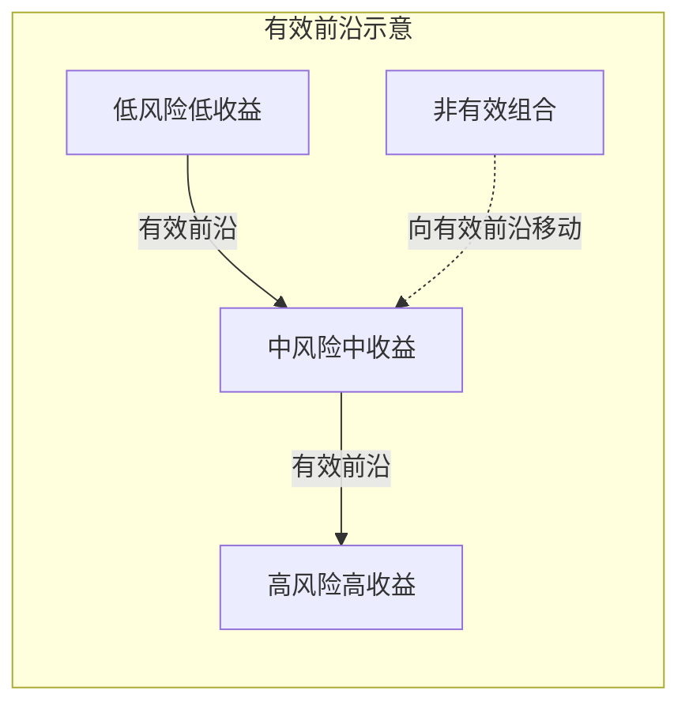
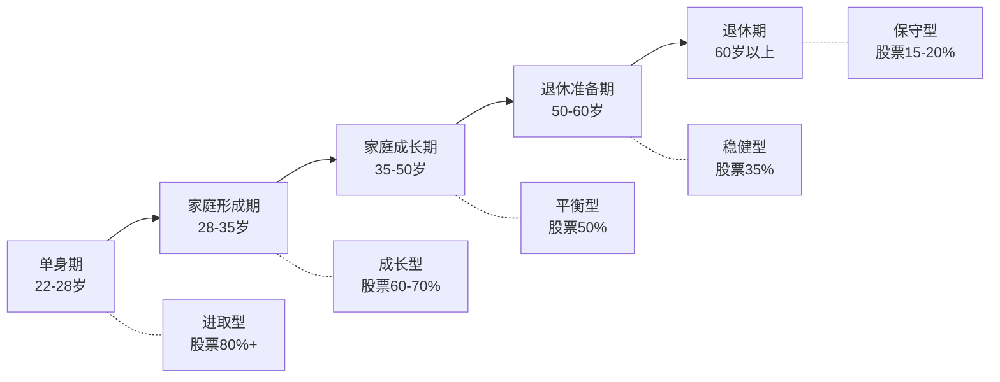

# 八、投资组合管理技巧

投资组合管理不是"买了几只基金就算配置"，而是一套贯穿选品、构建、监控、调整全流程的系统工程。本节从组合管理的核心理念出发，系统讲解资产配置方法论、组合构建的实操流程、再平衡策略、风险管理框架、绩效评估方法，以及面向中国市场的工具选择和常见误区。无论你是刚开始定投的新手，还是已有百万级组合的进阶投资者，都能在本节找到可落地的管理框架。

本节的知识地图：

```mermaid
graph TD
    A[投资组合管理] --> B[核心理念]
    A --> C[资产配置方法论]
    A --> D[组合构建实操]
    A --> E[再平衡策略]
    A --> F[风险管理]
    A --> G[绩效评估]
    A --> H[工具与平台]
    A --> H2[数据来源]

    H2 --> H2A[指数估值数据]
    H2 --> H2B[基金筛选数据]
    H2 --> H2C[宏观经济数据]
    H2 --> H2D[Python数据工具]
    A --> I[常见误区]
    A --> J[进阶技巧]
    A --> K[完整工作流]
    A --> L[行为矫正系统]

    B --> B1[分散化的数学原理]
    B --> B2[组合管理三层目标]
    B --> B3[行为金融学基础]

    C --> C1[战略配置SAA]
    C --> C2[战术配置TAA]
    C --> C3[生命周期配置]
    C --> C4[相关性分析]
    C --> C5[ESG可持续投资]
    C --> C6[另类资产配置]
    C --> C7[债券久期与凸度]

    D --> D1[目标与约束]
    D --> D2[产品选择]
    D --> D3[权重确定]
    D --> D4[定投策略]
    D --> D5[回测验证]

    E --> E1[再平衡原理]
    E --> E2[三种策略对比]
    E --> E3[税费优化]

    F --> F1[量化指标]
    F --> F2[预警机制]
    F --> F3[蒙特卡洛模拟]
    F --> F4[尾部风险]
    F --> F5[风险预算框架]
    F --> F6[压力测试]

    G --> G1[评估框架]
    G --> G2[业绩归因]
    G --> G3[基准选择]
    G --> G4[序列风险]
    G --> G4A[债券帐篷策略]

    L --> L1[投资日记]
    L --> L2[24小时冷静期]
    L --> L3[反向检查清单]
    L --> L4[预先承诺策略]

    J --> J1[因子投资SmartBeta]
    J --> J1A[多因子组合构建]
    J --> J2[全球配置]
    J --> J3[税务优化]
    J --> J4[FIRE策略]
    J --> J5[动态资产配置]
    J --> J6[压力测试方法]
    J --> J7[真实案例]
```



---

## 1. 投资组合管理的核心理念

### 1.1 为什么需要组合管理：单一资产的致命缺陷

很多投资者的习惯是"看好某只基金/股票就重仓买入"，但单一资产投资存在三个结构性缺陷：

| 缺陷 | 说明 | 真实案例 |
|------|------|---------|
| **集中风险** | 单一资产的波动直接等于组合波动 | 2021年初重仓中概互联网ETF的投资者，半年内亏损超50% |
| **择时依赖** | 买入卖出时机对结果影响过大 | 2015年6月买入创业板指数的投资者，到2018年底仍亏损超40% |
| **心理压力** | 单一持仓波动大，容易做出非理性决策 | 恐慌割肉在底部、贪婪加仓在顶部 |
| **流动性陷阱** | 急需用钱时被迫在不利时点卖出 | 2022年底部分投资者因收入下降被迫割肉还房贷 |

组合管理的核心价值在于：**通过资产之间的低相关性或负相关性，降低整体波动的同时不牺牲（甚至提高）长期收益**。这就是马科维茨（Harry Markowitz）所说的"免费午餐"——分散化是投资中唯一接近免费的午餐。

**为什么分散化是"免费的午餐"？** 假设你有两个资产，各自年化收益10%、波动率20%。如果它们的相关性为0，组合的波动率降到14.1%（而非20%），但收益仍然是10%——风险降低了29%，收益没有损失。这就是分散化的数学魔力，也是现代投资组合理论（MPT）的核心发现。

### 1.2 组合管理的三层目标

投资组合管理不是单纯追求最高收益，而是在收益、风险、流动性之间寻找最优平衡：

```text
第一层：风险控制 —— 确保组合波动在可承受范围内，不因市场下跌而被迫卖出
第二层：收益获取 —— 在给定风险水平下，获取尽可能高的长期回报
第三层：目标匹配 —— 组合的现金流和波动特征与个人财务目标匹配
```

三层目标的优先级是递进的：先控制风险，再追求收益，最终服务于具体的人生目标（买房、子女教育、退休等）。

**为什么风险控制排在第一位？** 因为亏损和盈利在数学上是不对称的。亏损50%后需要盈利100%才能回本，亏损70%后需要盈利233%。这就是为什么保本比赚钱更重要——一个从不亏损的组合，即使年化收益只有5%，30年后也能增长4.3倍；而一个大起大落的组合，即使平均收益更高，最终可能因为几次大跌而元气大伤。

| 亏损幅度 | 回本所需涨幅 | 难度感受 |
|---------|------------|---------|
| -10% | +11.1% | 轻松 |
| -20% | +25.0% | 一般 |
| -30% | +42.9% | 较难 |
| -50% | +100.0% | 困难 |
| -70% | +233.3% | 极难 |
| -90% | +900.0% | 几乎不可能 |

### 1.3 组合管理与"买基金"的本质区别

很多人以为"买了几只不同的基金"就是做组合管理，但两者有本质区别：

| 维度 | 买基金 | 组合管理 |
|------|--------|---------|
| 决策依据 | 看排行榜、听推荐 | 基于资产配置框架 |
| 选品逻辑 | 追逐近期业绩好的 | 根据相关性和风险收益特征选择 |
| 持有行为 | 涨了加仓、跌了割肉 | 定期再平衡，逆向操作 |
| 风险意识 | 不清楚组合整体风险 | 量化监控波动率、最大回撤、夏普比率 |
| 目标感 | "赚越多越好" | "在可承受风险下达成具体目标" |
| 应对暴跌 | 恐慌卖出或装死不动 | 按预设规则执行（加仓/再平衡/不动） |
| 费用意识 | 不关注费率 | 精算费率对长期收益的影响 |

### 1.4 现代投资组合理论的数学基础

理解组合管理的底层逻辑，需要了解马科维茨的现代投资组合理论（MPT）的核心数学原理。

**组合收益率**是各资产收益率的加权平均：

```text
E(Rp) = Σ wi × E(Ri)

其中：
  wi = 第i个资产的权重
  E(Ri) = 第i个资产的预期收益率
```

**组合波动率**不是简单的加权平均，而是取决于资产间的**协方差**：

```text
σp² = Σ Σ wi × wj × Cov(Ri, Rj)
     i  j

等价于矩阵形式：
σp² = w^T × Σ × w

其中：
  Σ = 协方差矩阵
  Cov(Ri, Rj) = σi × σj × ρij
  ρij = 资产i和j的相关系数
```

**关键推论**：当相关系数ρ<1时，组合波动率**始终小于**各资产波动率的加权平均值。相关系数越低，风险降低的效果越显著。

| 两资产相关系数 | 组合波动率（各50%权重，σ均为20%） | 风险降低幅度 |
|--------------|--------------------------------|------------|
| ρ = 1.0 | 20.0% | 0%（无分散效果） |
| ρ = 0.5 | 17.3% | 13.5% |
| ρ = 0.0 | 14.1% | 29.3% |
| ρ = -0.5 | 10.0% | 50.0% |
| ρ = -1.0 | 0.0% | 100%（完全对冲） |

**有效前沿（Efficient Frontier）**：在给定风险水平下，存在一个收益最高的组合；在给定收益水平下，存在一个风险最低的组合。所有这些最优组合连成的曲线就是有效前沿。组合管理的目标就是找到有效前沿上的点。



**为什么普通投资者不需要手动计算有效前沿？** 因为：(1) 历史数据不代表未来，精确计算的输入参数本身就不可靠；(2) 优化结果对输入参数极度敏感，微小的预期收益变化可能导致完全不同的配置；(3) 实践中，简单的等权重或风险平价法已经能捕获大部分分散化收益。了解数学原理是为了理解"为什么分散化有效"，而不是为了手动计算。

### 1.5 行为金融学与组合管理

组合管理最大的敌人不是市场，而是投资者自己的大脑。行为金融学揭示了人类在投资中系统性的认知偏差：

| 偏差 | 表现 | 对组合管理的危害 | 应对策略 |
|------|------|----------------|---------|
| **损失厌恶** | 亏损带来的痛苦是盈利快乐的2.5倍 | 在市场下跌时恐慌卖出 | 设定自动再平衡规则，减少主观判断 |
| **近因偏差** | 过度关注最近发生的事件 | 追涨杀跌，追逐热门基金 | 回顾长期历史数据，用3-5年滚动收益评估 |
| **过度自信** | 高估自己的判断能力 | 频繁调仓，集中持仓 | 设定调仓频率上限（如每季度最多一次） |
| **锚定效应** | 被买入价格或历史高点锚定 | "等回本再卖"或"回到高点再买" | 只看当前配置是否合理，忘记买入成本 |
| **确认偏差** | 只关注支持自己观点的信息 | 忽视反面证据，坚持错误判断 | 定期审视"为什么我可能是错的" |
| **禀赋效应** | 对已持有的资产赋予过高价值 | 不愿卖出亏损的基金 | 定期问自己：如果现在是空仓，还会买入这只基金吗？ |
| **心理账户** | 对不同来源的钱区别对待 | 把年终奖当"意外之财"冒更大风险 | 所有资金统一管理，遵守同一套配置规则 |
| **羊群效应** | 跟随大众决策 | 在市场顶部集体涌入，底部集体逃离 | 制定并写投资日记，记录每笔操作的逻辑 |

**行为金融学的核心教训**：承认自己是非理性的，然后设计制度来约束自己。组合管理框架（再平衡规则、预警机制、定期评估）本质上就是一套"防傻机制"——在你清醒时制定规则，在你冲动时执行规则。

---

## 2. 资产配置方法论

资产配置是组合管理的第一步，也是决定组合长期收益的最关键因素。Brinson等人1986年的经典研究表明，**资产配置解释了投资组合收益差异的93.6%**，远超择时和选品的影响。后续研究（Ibbotson & Kaplan, 2000）进一步确认：资产配置解释了同一基金不同时间收益差异的约40%，以及不同基金之间收益差异的约90%。

**为什么资产配置如此重要？** 因为不同资产类别的收益差异远大于同一类别内不同产品的差异。过去20年，A股年化收益约8-10%，债券约4-5%，黄金约7-8%。即使你在A股中选了最差的基金，只要配置了足够比例的债券和黄金，组合收益也不会太差；反之，即使选了最好的基金，如果全仓A股遇到2008年或2015年的暴跌，组合照样亏损惨重。

### 2.1 战略资产配置（SAA）：长期基准

战略资产配置是基于长期目标设定的基准配置比例，通常3-5年调整一次。它是组合管理的"地基"，决定了组合的长期收益特征。

**核心-卫星配置法**（最适合个人投资者）：

```text
总配置 = 核心资产（60%-80%） + 卫星资产（20%-40%）

核心资产：低成本宽基指数基金，长期持有不动
  ├── 国内股票：沪深300指数基金（大盘价值）
  ├── 国内股票：中证500指数基金（中盘成长）
  ├── 海外股票：标普500指数基金（全球龙头）
  ├── 债券：十年国债ETF / 中高等级信用债基金
  └── 货币：货币基金（应急金部分）

卫星资产：灵活调整，捕捉阶段性机会
  ├── 行业/主题ETF（科技、医药、新能源、消费）
  ├── 海外新兴市场（越南、印度等QDII基金）
  ├── 另类资产（黄金ETF、REITs基金）
  └── 商品类（原油、有色金属等期货ETF）
```

**为什么核心占60%-80%？** 核心资产的作用是提供稳定的β收益（市场平均回报）。卫星资产虽然可能带来超额收益α，但同时也带来更高的不确定性。核心比例越高，组合越稳定；卫星比例越高，组合越灵活但波动越大。从风险收益比的角度看，β（市场回报）的性价比远高于α（超额回报）——因为获取β只需要持有指数基金，成本极低（0.15%管理费），而获取α需要选股/择时能力，成本高（0.5-1.5%管理费）且不确定。

**核心资产的选择原则**：

| 原则 | 说明 | 具体要求 |
|------|------|---------|
| **低费率** | 费率直接影响长期收益 | 管理费+托管费 < 0.3% |
| **高流动性** | 确保买卖不受价格冲击 | ETF日均成交额 > 1亿元 |
| **宽基覆盖** | 代表整个市场或大板块 | 沪深300/中证500/标普500 |
| **跟踪精度** | 偏离指数越小越好 | 年化跟踪误差 < 0.5% |
| **规模适中** | 太小有清盘风险 | 5亿 < 规模 < 500亿 |

### 2.2 战术资产配置（TAA）：短期调整

战术资产配置是在战略配置基础上，根据市场估值、宏观环境等因素做短期偏离（通常±10%-15%），以捕捉市场机会或规避风险。

**估值驱动的战术调整规则**：

| 指标 | 低估区间 | 正常区间 | 高估区间 | 数据来源 |
|------|---------|---------|---------|---------|
| 沪深300 PE | <11倍 | 11-14倍 | >14倍 | 中证指数官网 |
| 中证500 PE | <20倍 | 20-30倍 | >30倍 | 中证指数官网 |
| 标普500 PE | <18倍 | 18-22倍 | >25倍 | multpl.com |
| 10年国债收益率 | >3.5%（债券低估） | 2.5%-3.5% | <2.5%（债券高估） | 中国债券信息网 |
| 黄金/白银比 | >80（白银低估） | 60-80 | <60（黄金低估） | 财经网站 |

**战术调整示例**（假设战略配置为股票60%/债券30%/现金10%）：

- 当沪深300 PE进入低估区间（<11倍）：股票比例上调至70%，债券下调至20%
- 当沪深300 PE进入高估区间（>14倍）：股票比例下调至50%，债券上调至35%，现金15%
- 正常区间：维持战略配置不变

**关键纪律**：战术调整必须有明确的规则和上限。偏离战略配置不超过±15%，避免变成"赌博式择时"。

**战术配置的三个前提条件**：

1. **有明确的估值指标**：不能凭感觉判断"贵"还是"便宜"，必须有量化标准
2. **有预设的调整规则**：什么估值对应什么比例，提前写好，不能临时决定
3. **有严格的偏离上限**：即使极度看好某类资产，也不超过战略配置±15%

不满足这三个条件的投资者，建议不做战术调整，老老实实执行战略配置。历史数据表明，大多数投资者的战术调整（择时）反而降低了收益，因为人类天生在顶部贪婪、在底部恐惧。

### 2.3 不同风险等级的配置模板

根据风险承受能力，以下是五种典型的配置模板：

| 配置模板 | 股票 | 债券 | 现金 | 另类 | 预期年化收益 | 预期最大回撤 | 适合人群 |
|---------|------|------|------|------|-------------|-------------|---------|
| **保守型** | 15% | 55% | 25% | 5% | 3%-5% | -5%~-8% | 退休人群、极度风险厌恶者 |
| **稳健型** | 35% | 40% | 15% | 10% | 5%-7% | -10%~-15% | 临近退休、有短期刚性支出目标 |
| **平衡型** | 50% | 30% | 10% | 10% | 7%-9% | -15%~-25% | 30-45岁、有一定风险承受力 |
| **成长型** | 70% | 20% | 5% | 5% | 9%-12% | -25%~-35% | 25-40岁、收入稳定、投资期限长 |
| **进取型** | 85% | 10% | 0% | 5% | 10%-15% | -35%~-50% | 年轻、高收入、心理承受力强 |

**选择方法**：不要凭感觉选，用以下量化评估：

```text
风险承受评分 = 年龄因素(30%) + 收入稳定性(25%) + 投资期限(20%) + 心理承受力(15%) + 应急金充足度(10%)

年龄因素：25岁以下=5分, 25-35=4分, 35-45=3分, 45-55=2分, 55以上=1分
收入稳定性：公务员/大企业=5分, 普通企业=3分, 自由职业=1分
投资期限：10年以上=5分, 5-10年=3分, 3-5年=2分, 3年以下=1分
心理承受力：能接受30%回撤=5分, 20%=3分, 10%=1分
应急金充足度：6个月以上=5分, 3-6个月=3分, 不足3个月=1分

总分 > 4.0：成长型/进取型
总分 3.0-4.0：平衡型
总分 2.0-3.0：稳健型
总分 < 2.0：保守型
```

**评分示例**：30岁程序员，大厂工作（收入稳定性4分），计划15年后退休（投资期限5分），经历过2022年下跌没卖（心理承受力4分），有6个月应急金（5分），年龄30岁（4分）。

总分 = 4×30% + 4×25% + 5×20% + 4×15% + 5×10% = 1.2+1.0+1.0+0.6+0.5 = 4.3 → 适合成长型/进取型配置。

### 2.4 生命周期配置调整

资产配置不是一成不变的，需要随人生阶段动态调整：



**各阶段配置逻辑详解**：

| 阶段 | 股票比例 | 核心逻辑 | 关键考虑 |
|------|---------|---------|---------|
| **单身期** | 80%+ | 时间是最好的朋友，可以承受大波动 | 即使亏50%，还有几十年工资收入弥补 |
| **家庭形成期** | 60-70% | 收入增长快，但开始有刚性支出（房贷、育儿） | 需要留足应急金，但长期投资仍以增长为主 |
| **家庭成长期** | 50% | 子女教育和养老需要开始平衡 | 教育金需要逐渐从股票转向债券 |
| **退休准备期** | 35% | 即将失去工资收入，需要降低波动 | 开始规划退休后的现金流来源 |
| **退休期** | 15-20% | 保本为主，但仍需抗通胀 | 配置足够的抗通胀资产（如通胀保值债券、REITs） |

**调整时机**：不是每年机械调整，而是在人生重大事件（结婚、买房、生子、换工作、退休）发生时重新评估。

### 2.5 相关性分析：分散化的关键

分散化的效果完全取决于资产间的相关性。盲目持有"多只基金"不等于分散化——如果这些基金高度相关，分散效果接近于零。

**主要资产类别的历史相关性矩阵**（2010-2024年中国市场，数据来源：Wind、Yahoo Finance、akshare计算）：

|  | 沪深300 | 中证500 | 标普500 | 中国国债 | 黄金 | 货币基金 |
|--|--------|--------|--------|---------|------|---------|
| 沪深300 | 1.00 | 0.85 | 0.35 | -0.15 | 0.05 | 0.00 |
| 中证500 | 0.85 | 1.00 | 0.30 | -0.10 | 0.00 | 0.00 |
| 标普500 | 0.35 | 0.30 | 1.00 | -0.20 | 0.10 | 0.00 |
| 中国国债 | -0.15 | -0.10 | -0.20 | 1.00 | 0.15 | 0.30 |
| 黄金 | 0.05 | 0.00 | 0.10 | 0.15 | 1.00 | 0.05 |
| 货币基金 | 0.00 | 0.00 | 0.00 | 0.30 | 0.05 | 1.00 |

**从相关性矩阵得出的关键结论**：

1. **沪深300与中证500高度相关（0.85）**：同时持有这两只只提供了有限的分散效果，真正的分散来自它们与债券（-0.15）、黄金（0.05）的低相关性
2. **A股与美股相关性中等（0.35）**：全球配置确实能降低风险，但不如债券和黄金的分散效果显著
3. **债券与股票负相关（-0.15~-0.20）**：这是"股债搭配"有效的核心原因
4. **黄金与股票几乎不相关（0.05）**：黄金是最好的"混乱对冲"工具

**用Python计算和可视化相关性矩阵**：

```python
"""
资产相关性分析工具
功能：获取资产历史数据，计算相关性矩阵，生成热力图
"""
import numpy as np
import pandas as pd
import matplotlib.pyplot as plt
import seaborn as sns
from datetime import datetime, timedelta

def calculate_correlation_matrix(returns_df: pd.DataFrame, window: int = None) -> pd.DataFrame:
    """
    计算资产收益率的相关性矩阵
    
    参数:
        returns_df: 各资产日/周/月收益率的DataFrame，列名为资产名称
        window: 滚动窗口（天数），None表示全样本
    
    返回:
        相关性矩阵（DataFrame）
    """
    if window:
        return returns_df.rolling(window).corr()
    return returns_df.corr()

def plot_correlation_heatmap(corr_matrix: pd.DataFrame, title: str = "资产相关性矩阵"):
    """绘制相关性热力图"""
    plt.figure(figsize=(10, 8))
    sns.heatmap(
        corr_matrix,
        annot=True,        # 显示数值
        fmt='.2f',         # 保留两位小数
        cmap='RdYlGn_r',   # 红色=正相关，绿色=负相关
        center=0,          # 0值居中
        vmin=-1, vmax=1,   # 范围固定
        square=True,       # 正方形格子
        linewidths=0.5     # 格子间距
    )
    plt.title(title, fontsize=14, fontweight='bold')
    plt.tight_layout()
    plt.savefig('correlation_heatmap.png', dpi=150, bbox_inches='tight')
    plt.show()

def find_diversification_benefit(corr_matrix: pd.DataFrame, weights: np.ndarray) -> dict:
    """
    计算分散化收益
    
    参数:
        corr_matrix: 相关性矩阵
        weights: 各资产权重
    
    返回:
        分散化指标
    """
    # 假设各资产波动率均为15%（简化计算）
    vol = 0.15
    cov_matrix = corr_matrix.values * vol * vol
    
    # 组合波动率
    port_vol = np.sqrt(weights @ cov_matrix @ weights)
    
    # 加权平均波动率
    weighted_avg_vol = np.sum(weights) * vol  # 权重之和为1，所以就是vol
    
    # 分散化比率
    diversification_ratio = weighted_avg_vol / port_vol
    
    return {
        'portfolio_volatility': port_vol,
        'weighted_avg_volatility': weighted_avg_vol,
        'diversification_ratio': diversification_ratio,
        'risk_reduction': 1 - port_vol / weighted_avg_vol
    }

# 使用示例
if __name__ == "__main__":
    # ========== 方式一：使用真实数据（推荐） ==========
    # 需要安装：pip install akshare
    try:
        import akshare as ak
        
        # 获取各指数历史数据（近5年）
        symbols = {
            '沪深300': 'sh000300',
            '中证500': 'sh000905',
            '标普500': 'sp500',  # akshare的美股指数
            '黄金': 'hf_GC',     # COMEX黄金
        }
        
        # 获取沪深300数据示例
        df_hs300 = ak.stock_zh_index_daily(symbol='sh000300')
        df_hs300 = df_hs300.set_index('date')['close'].pct_change()
        
        # 合并各资产收益率，计算相关性
        # returns = pd.DataFrame({...})  # 根据实际获取的数据构建
        # corr = calculate_correlation_matrix(returns)
        
        print("提示：请根据实际获取的akshare数据构建收益率DataFrame")
        print("akshare文档：https://akshare.akfamily.xyz/")
        
    except ImportError:
        print("未安装akshare，使用模拟数据演示")
    
    # ========== 方式二：模拟数据（用于演示） ==========
    np.random.seed(42)
    dates = pd.date_range('2020-01-01', periods=1000, freq='D')
    
    # 模拟各资产日收益率（基于真实参数）
    returns = pd.DataFrame({
        '沪深300': np.random.normal(0.0003, 0.015, 1000),
        '中证500': np.random.normal(0.0004, 0.018, 1000),
        '标普500': np.random.normal(0.0004, 0.012, 1000),
        '中国国债': np.random.normal(0.0001, 0.003, 1000),
        '黄金': np.random.normal(0.0002, 0.010, 1000),
    }, index=dates)
    
    # 计算相关性矩阵
    corr = calculate_correlation_matrix(returns)
    print("相关性矩阵：")
    print(corr.round(2))
    
    # 绘制热力图
    plot_correlation_heatmap(corr)
    
    # 计算分散化收益
    weights = np.array([0.30, 0.15, 0.15, 0.25, 0.15])
    div = find_diversification_benefit(corr, weights)
    print(f"\n分散化分析：")
    print(f"  组合波动率: {div['portfolio_volatility']:.2%}")
    print(f"  加权平均波动率: {div['weighted_avg_volatility']:.2%}")
    print(f"  分散化比率: {div['diversification_ratio']:.2f}")
    print(f"  风险降低幅度: {div['risk_reduction']:.1%}")
```

**相关性的陷阱**：相关性不是恒定的。在市场危机期间，几乎所有资产的相关性都会趋近于1（"危机时所有东西一起跌"）。这就是为什么需要配置真正的避险资产——长期国债和黄金在危机期间通常能保持低相关甚至负相关。

### 2.6 ESG与可持续投资的组合整合

ESG（环境Environmental、社会Social、治理Governance）投资不再是"情怀投资"，而是被越来越多的研究证明能提供风险调整后的超额收益。将ESG因素纳入组合管理，是2020年代投资者不可忽视的趋势。

**ESG投资的三种策略**：

| 策略 | 操作方式 | 适合人群 | 对收益的影响 |
|------|---------|---------|------------|
| **负面筛选** | 排除高污染、高争议行业（煤炭、烟草、赌博） | 所有投资者 | 影响极小，几乎无成本 |
| **ESG整合** | 在选品时加入ESG评分作为额外维度 | 中级投资者 | 可能提升长期风险调整收益 |
| **影响力投资** | 主动投资于解决社会/环境问题的企业 | 高级投资者 | 可能牺牲部分收益换取社会影响 |

**中国市场ESG投资的实操路径**：

```text
第一步：了解ESG评级体系
  ├── 国内：中证ESG评级、华证ESG评级、商道融绿
  ├── 国际：MSCI ESG评级、Sustainalytics
  └── 数据来源：Wind、Choice、天天基金（部分展示ESG评分）

第二步：选择ESG指数基金
  ├── 中证ESG 120策略指数（000969.CSI）
  ├── 上证180 ESG指数
  ├── MSCI中国A股国际通ESG通用指数
  └── 对应ETF/指数基金产品

第三步：在组合中分配ESG权重
  ├── 保守方案：核心资产的50%替换为ESG版本（整体配置影响小）
  ├── 平衡方案：核心资产全部替换为ESG版本
  └── 激进方案：额外配置10-20%的绿色/清洁能源主题基金
```

**ESG投资的争议与平衡**：

ESG并非完美。批评者指出：(1) ESG评级标准不统一，同一公司在不同评级机构的得分可能差异很大；(2) "漂绿"（Greenwashing）问题——企业可能通过包装而非实质改善来获得高ESG评分；(3) 排除高碳行业可能在能源价格高涨时拖累收益（如2021-2022年）。

**务实建议**：采用"负面筛选+ESG整合"的组合策略——排除最差的（如严重环境违规企业），在剩余池子中用ESG评分作为选品的加分项而非唯一标准。这样既降低了ESG风险敞口，又不至于过度限制投资范围。

### 2.7 另类资产配置：超越股债的传统框架

除了股票、债券、现金这三大传统资产，另类资产可以进一步提升组合的分散化效果。

**主要另类资产类型**：

| 资产类型 | 代表产品 | 预期收益 | 波动性 | 与股票相关性 | 流动性 | 配置建议 |
|---------|---------|---------|-------|------------|-------|---------|
| **REITs（不动产信托）** | 鹏华前海万科REIT（184801） | 6%-10% | 中等 | 0.4-0.6 | 中等（场外为主） | 5%-15% |
| **商品期货** | 黄金ETF、原油基金 | 3%-8% | 高 | 0.0-0.3 | 高（ETF） | 5%-10% |
| **基础设施** | 中航首钢绿能REIT（180801） | 5%-8% | 低 | 0.2-0.4 | 低 | 0%-5% |
| **加密货币** | 比特币、以太坊 | 极高 | 极高 | 0.3-0.5（近年趋高） | 高 | 0%-3%（仅限高风险承受者） |

**REITs的独特价值**：REITs提供"股票+债券"的混合收益特征——有稳定的租金分红（类似债券利息），又有资产增值潜力（类似股票增值）。在中国市场，公募REITs起步较晚（2021年首批上市），产品数量有限，但值得关注和逐步配置。

**商品资产的配置逻辑**：商品（特别是黄金）的核心价值不在于"赚钱"，而在于"危机保护"。2008年金融危机期间，全球股市下跌超过40%，黄金上涨约5%。2020年3月疫情恐慌中，黄金短期下跌后迅速反弹，全年涨幅25%。5%-10%的黄金配置，相当于给组合买了"保险"。

**加密货币的理性态度**：加密货币（特别是比特币）确实提供了与传统资产低相关性的收益来源，但其极端波动性（年化波动率60%-80%）意味着即使配置3%，也可能贡献组合10%以上的波动。建议：只有在充分理解风险、能够承受归零损失的前提下，才考虑1%-3%的配置。将其视为"彩票"而非"投资"。

### 2.8 债券久期与凸度：理解利率风险

很多投资者把债券当作"安全资产"，但债券同样面临价格波动风险，其核心驱动因素是**利率变动**。理解久期和凸度，是管理债券仓位的基础。

**久期（Duration）**：衡量债券价格对利率变动的敏感度。久期越长，利率变动1%时债券价格变动越大。

```text
债券价格变动 ≈ -久期 × 利率变动

示例：
  持有久期5年的债券基金
  利率上升1% → 基金净值约下跌5%
  利率下降1% → 基金净值约上涨5%
```

**不同债券品种的久期特征**：

| 品种 | 久期范围 | 利率敏感度 | 适合场景 |
|------|---------|-----------|---------|
| 货币基金 | ~0 | 几乎无 | 现金管理、应急金 |
| 短债基金 | 0.5-1年 | 极低 | 1年内要用的资金 |
| 中短债基金 | 1-3年 | 低 | 1-3年投资期限 |
| 中长期纯债基金 | 3-7年 | 中等 | 3-5年投资期限 |
| 十年国债ETF | 7-8年 | 高 | 长期配置、对冲股票风险 |
| 30年国债ETF | 18-22年 | 极高 | 专业投资者利率下行博弈 |

**凸度（Convexity）**：久期只在利率小幅变动时准确。当利率大幅变动时，凸度修正久期的线性近似误差——正凸度意味着利率下降时涨幅大于久期预测，利率上升时跌幅小于久期预测。对于个人投资者，理解"长久期债券在利率下行周期中收益更大"这一结论就够了。

**债券配置的久期策略**：

```text
利率下行周期（经济衰退、央行降息）：
  → 延长久期，配置长久期债券/国债ETF
  → 利率下降1%，久期8年的国债ETF可涨约8%

利率上行周期（经济过热、央行加息）：
  → 缩短久期，配置短债基金/货币基金
  → 利率上升1%，久期8年的国债ETF可跌约8%

不确定周期：
  → 哑铃策略：一半短久期（货币/短债）+ 一半长久期（国债ETF）
  → 或者直接用中短债基金（久期2-3年），平衡收益和风险
```

**为什么组合中必须配置债券？** 除了降低波动率，债券在股灾中通常表现优异（"避险效应"）。2008年A股跌72%，但中国国债指数涨12%；2022年A股跌27%，国债利率涨3%。这种负相关性是组合管理中最宝贵的分散化来源。但要注意：2022年全球债券因加息而大跌（美国长久期债券跌超30%），说明"债券=安全"是有条件的——久期管理和信用风险管理同样重要。

**债券信用风险分层**：

| 信用等级 | 代表品种 | 违约风险 | 收益率 | 适合配置 |
|---------|---------|---------|--------|---------|
| 国债/政金债 | 十年国债ETF、国开债基金 | 几乎零 | 2-3% | 核心配置 |
| 高等级信用债 | AAA企业债基金 | 极低 | 3-4% | 核心配置 |
| 中等级信用债 | AA+企业债基金 | 低 | 4-5% | 卫星配置 |
| 低等级信用债 | AA及以下信用债基金 | 中等 | 5-7% | 谨慎配置 |
| 可转债 | 可转债基金 | 视正股而定 | 波动大 | 卫星配置（<10%） |

**信用风险管理原则**：
1. 核心债券配置只用国债和政金债，不承担信用风险
2. 信用债配置不超过债券仓位的30%
3. 避免"信用下沉"——不要为了追求更高收益而买入低评级债券
4. 信用利差扩大时（经济下行期），减少信用债、增加国债

---

## 3. 组合构建的实操流程

### 3.1 第一步：确定投资目标和约束

在选任何产品之前，先回答以下问题：

```yaml
投资目标：
  用途：退休储备 / 子女教育 / 买房首付 / 资产增值
  目标金额：___ 万元
  期望达成时间：___ 年
  每月可投入金额：___ 元

约束条件：
  风险承受能力：最大可接受回撤 ___ %
  流动性需求：未来 ___ 年内是否有大额支出计划
  税务考虑：是否有税优账户可用（如个人养老金账户）
  投资限制：是否有不能投资的品种（如不投海外市场）
```

**目标金额的倒推计算**：

假设目标：15年后积累300万退休金，当前已有30万，每月可投入5,000元。

```text
需要的年化收益率 = ?

用Excel的RATE函数：=RATE(15, -5000*12, -300000, 3000000)
结果：约 8.5%

验证：
  30万 × (1+8.5%)^15 = 30万 × 3.39 = 101.7万（本金增值部分）
  每年6万 × 年金终值系数(8.5%, 15年) = 6万 × 28.02 = 168.1万（定投增值部分）
  合计 = 269.8万 → 略有差距，需要稍高收益或增加投入

调整：每月投入6,000元或目标收益9.2%即可达成300万。
```

这个倒推计算非常重要——它告诉你需要承担多少风险。如果计算结果需要20%的年化收益，说明目标不现实，需要调高投入或延长投资期限。

### 3.2 第二步：选择具体产品

有了配置框架后，需要选择具体的基金/ETF。选品的核心标准：

**指数基金选品六维评估法**：

| 维度 | 权重 | 评估标准 | 工具/数据来源 |
|------|------|---------|-------------|
| **跟踪误差** | 25% | 越小越好，优秀标准<0.5%/年 | 基金年报、天天基金网 |
| **费率** | 20% | 管理费+托管费，越低越好 | 基金招募说明书 |
| **规模** | 20% | 太小有清盘风险，太大影响跟踪精度。优选5-100亿 | 天天基金网、晨星 |
| **流动性** | 15% | ETF看日均成交额，场外基金看赎回效率 | 券商行情软件 |
| **成立时间** | 10% | 至少3年以上，有足够历史数据验证 | 基金公司官网 |
| **基金公司** | 10% | 大厂优先（华夏、易方达、南方、嘉实、华泰柏瑞等） | 行业口碑 |

**中国市场主流宽基指数基金推荐清单**：

| 指数 | 代表基金 | 基金代码 | 管理费 | 适合配置 |
|------|---------|---------|--------|---------|
| 沪深300 | 华泰柏瑞沪深300ETF | 510300 | 0.15% | 核心-大盘价值 |
| 中证500 | 南方中证500ETF | 510500 | 0.15% | 核心-中盘成长 |
| 创业板指 | 易方达创业板ETF | 159915 | 0.15% | 卫星-成长风格 |
| 恒生科技 | 华夏恒生科技ETF | 513180 | 0.50% | 卫星-港股科技 |
| 标普500 | 博时标普500ETF联接 | 050025 | 0.60% | 核心-海外发达市场 |
| 纳斯达克100 | 国泰纳斯达克100ETF | 513100 | 0.80% | 卫星-海外科技 |
| 中证红利 | 万家中证红利ETF | 159581 | 0.15% | 核心-高股息策略 |
| 十年国债 | 国泰上证10年期国债ETF | 511260 | 0.15% | 核心-债券 |
| 黄金 | 华安黄金ETF | 518880 | 0.25% | 卫星-避险资产 |

**选品的常见坑**：

| 坑 | 表现 | 正确做法 |
|---|------|---------|
| 追捧新基金 | 新基金有"封闭期"，错过行情 | 优先选成立3年以上的老基金 |
| 只看收益不看规模 | 规模<2亿有清盘风险 | 规模5-100亿为宜 |
| 忽视跟踪误差 | 指数涨10%但基金只涨8% | 对比基金净值走势与指数走势 |
| ETF成交额太低 | 买卖价差大，实际成本高 | 日均成交额至少5,000万 |
| 场外基金选错份额 | 买了A份额（有申购费）想短持 | 短持选C份额（无申购费，但有销售服务费） |

### 3.3 第三步：确定各资产权重并计算买入金额

**实操示例**：月入15,000元，每月可投资5,000元，平衡型配置

```text
配置方案（月度定投）：
  沪深300指数基金     30%    1,500元/月
  中证500指数基金     15%      750元/月
  标普500联接基金     10%      500元/月
  中证红利ETF        10%      500元/月
  十年国债ETF        20%    1,000元/月
  黄金ETF             5%      250元/月
  货币基金(应急补充)  10%      500元/月
  合计              100%    5,000元/月
```

**权重确定的三种方法**：

**方法一：等权重法**（最简单）
每类资产分配相同权重。适合初学者，避免主观偏见。

**方法二：风险平价法**（中等复杂度）
波动率低的资产分配更高权重，使每类资产对组合风险的贡献相等。

```text
资产i的权重 = (1/σᵢ) / Σ(1/σⱼ)

示例：假设三类资产波动率分别为
  股票σ=20%, 债券σ=5%, 黄金σ=15%

  股票权重 = (1/0.20) / (1/0.20 + 1/0.05 + 1/0.15)
           = 5 / (5 + 20 + 6.67) = 15.8%
  债券权重 = 20 / 31.67 = 63.2%
  黄金权重 = 6.67 / 31.67 = 21.0%
```

**风险平价法的核心思想**：传统配置（如60/40股债）中，股票贡献了组合90%以上的风险，债券只贡献不到10%。风险平价让每类资产贡献相同的风险，避免"名义分散、实际集中"。

**方法三：均值方差优化法**（复杂度最高）
基于历史数据计算有效前沿，选择最优风险收益比的组合。需要Python工具辅助：

```python
import numpy as np
from scipy.optimize import minimize

# 资产历史年化收益率（示例数据）
expected_returns = np.array([0.10, 0.04, 0.06, 0.03])  # 股票、债券、黄金、现金

# 资产协方差矩阵（示例数据）
cov_matrix = np.array([
    [0.0400, -0.002, 0.003, 0.000],
    [-0.002, 0.004, 0.001, 0.000],
    [0.003, 0.001, 0.025, 0.000],
    [0.000, 0.000, 0.000, 0.0001]
])

def portfolio_stats(weights, returns, cov):
    port_return = np.dot(weights, returns)
    port_vol = np.sqrt(np.dot(weights.T, np.dot(cov, weights)))
    sharpe = (port_return - 0.02) / port_vol  # 无风险利率假设2%
    return port_return, port_vol, sharpe

# 最大化夏普比率
def neg_sharpe(weights):
    return -portfolio_stats(weights, expected_returns, cov_matrix)[2]

constraints = {'type': 'eq', 'fun': lambda w: np.sum(w) - 1}
bounds = [(0, 1)] * 4
x0 = np.array([0.4, 0.3, 0.2, 0.1])

result = minimize(neg_sharpe, x0, method='SLSQP', bounds=bounds, constraints=constraints)
optimal_weights = result.x

print("最优配置权重：")
labels = ['股票', '债券', '黄金', '现金']
for label, weight in zip(labels, optimal_weights):
    print(f"  {label}: {weight:.1%}")
ret, vol, sharpe = portfolio_stats(optimal_weights, expected_returns, cov_matrix)
print(f"预期年化收益: {ret:.1%}")
print(f"预期年化波动: {vol:.1%}")
print(f"夏普比率: {sharpe:.2f}")
```

**推荐**：初学者用等权重法，有一定经验后过渡到风险平价法，进阶投资者可以尝试均值方差优化但不要过度依赖（历史数据不代表未来）。

**三种方法的对比**：

| 方法 | 复杂度 | 数据需求 | 核心优势 | 核心劣势 | 推荐场景 |
|------|-------|---------|---------|---------|---------|
| 等权重 | ★ | 无 | 简单，避免偏见 | 不考虑风险差异 | 初学者，资产<5类 |
| 风险平价 | ★★ | 各资产波动率 | 风险贡献均衡 | 忽略预期收益 | 中级投资者 |
| 均值方差优化 | ★★★★ | 收益+波动+相关性 | 理论最优 | 对输入极敏感，容易过拟合 | 有量化基础的投资者 |

### 3.4 第四步：定投还是一次性投入？

| 策略 | 优点 | 缺点 | 适合场景 |
|------|------|------|---------|
| **一次性投入** | 长期收益更高（市场长期向上） | 择时风险大，可能买在高点 | 有大额闲钱、市场处于低估区间 |
| **定期定额（定投）** | 平均成本、纪律性强、降低择时压力 | 牛市中收益低于一次性投入 | 工薪族、每月有固定结余 |
| **价值平均定投** | 低估多买、高估少买，比普通定投收益更高 | 计算复杂，需要持续关注估值 | 有一定经验的投资者 |

**一次性投入 vs 定投的数据对比**：Vanguard的研究（1926-2014年美股数据）显示，一次性投入在67%的情况下跑赢定投，因为市场长期向上，早投入意味着更长时间享受复利。但对于每月有固定收入的工薪族，定投是唯一可行的选择，而且定投的心理压力远小于一次性投入。

**价值平均定投的实操方法**：

```text
每月定投金额 = 基准金额 × 估值系数

估值系数规则（以沪深300 PE为参考）：
  PE < 10（极度低估）：基准金额 × 2.0
  PE 10-11（低估）：基准金额 × 1.5
  PE 11-13（正常偏低）：基准金额 × 1.2
  PE 13-14（正常）：基准金额 × 1.0
  PE 14-16（正常偏高）：基准金额 × 0.8
  PE 16-18（高估）：基准金额 × 0.5
  PE > 18（极度高估）：暂停定投，开始分批卖出
```

**价值平均定投的数学原理**：普通定投在每个时间点投入相同金额，而价值平均定投在低估时多买（同样的钱买到更多份额）、高估时少买（避免在贵的时候买入太多）。长期来看，这相当于在便宜时积累更多筹码，自然拉低了持仓成本。

**定投频率的选择**：周定投还是月定投？数据表明，两者长期收益差异极小（<0.1%/年）。选择你能坚持的频率即可。周定投略微平滑成本，但增加了操作次数。对于大多数人，月定投（发工资后第二天自动扣款）是最简单且有效的方案。

### 3.5 第五步：组合回测验证

构建好组合后，**必须**用历史数据回测，验证组合在不同市场环境下的表现。回测不是为了预测未来，而是为了理解你的组合在极端情况下会怎样。

```python
"""
投资组合回测工具
功能：输入配置方案，回测历史表现，输出关键指标
"""
import numpy as np
import pandas as pd
from datetime import datetime

def backtest_portfolio(
    returns_df: pd.DataFrame,
    weights: dict,
    initial_capital: float = 100000,
    monthly_contribution: float = 0,
    rebalance_freq: str = 'Q',  # Q=季度, M=月度, Y=年度
    rebalance_threshold: float = None  # 阈值再平衡（如0.05=5%）
) -> dict:
    """
    投资组合回测
    
    参数:
        returns_df: 各资产月收益率DataFrame，列名与weights的key匹配
        weights: 目标配置权重 {'asset_name': weight, ...}
        initial_capital: 初始资金
        monthly_contribution: 每月追加投入
        rebalance_freq: 再平衡频率
        rebalance_threshold: 偏离阈值（None表示仅按频率再平衡）
    
    返回:
        回测结果字典
    """
    assets = list(weights.keys())
    target_weights = np.array([weights[a] for a in assets])
    
    # 初始化
    n_months = len(returns_df)
    portfolio_values = []
    holdings = {a: initial_capital * weights[a] for a in assets}
    
    for month_idx in range(n_months):
        # 获取当月收益率
        month_returns = returns_df.iloc[month_idx][assets].values
        
        # 更新持仓市值
        for i, asset in enumerate(assets):
            holdings[asset] *= (1 + month_returns[i])
        
        # 追加投入
        if monthly_contribution > 0:
            total_value = sum(holdings.values())
            for asset in assets:
                holdings[asset] += monthly_contribution * weights[asset]
        
        # 检查是否需要再平衡
        total_value = sum(holdings.values())
        current_weights = np.array([holdings[a] / total_value for a in assets])
        deviation = np.max(np.abs(current_weights - target_weights))
        
        need_rebalance = False
        if rebalance_threshold and deviation >= rebalance_threshold:
            need_rebalance = True
        elif rebalance_freq == 'M':
            need_rebalance = True
        elif rebalance_freq == 'Q' and (month_idx + 1) % 3 == 0:
            need_rebalance = True
        elif rebalance_freq == 'Y' and (month_idx + 1) % 12 == 0:
            need_rebalance = True
        
        if need_rebalance:
            for asset in assets:
                holdings[asset] = total_value * weights[asset]
        
        portfolio_values.append(total_value)
    
    # 计算指标
    values = np.array(portfolio_values)
    monthly_returns = np.diff(values) / values[:-1]
    
    total_return = (values[-1] / values[0]) - 1
    years = n_months / 12
    cagr = (values[-1] / values[0]) ** (1/years) - 1
    annual_vol = np.std(monthly_returns) * np.sqrt(12)
    sharpe = (cagr - 0.02) / annual_vol  # 无风险利率2%
    
    # 最大回撤
    peak = np.maximum.accumulate(values)
    drawdown = (values - peak) / peak
    max_drawdown = np.min(drawdown)
    
    # 卡玛比率
    calmar = cagr / abs(max_drawdown) if max_drawdown != 0 else float('inf')
    
    # 排序收益（Sortino只惩罚下行风险）
    downside_returns = monthly_returns[monthly_returns < 0]
    downside_vol = np.std(downside_returns) * np.sqrt(12) if len(downside_returns) > 0 else 0.001
    sortino = (cagr - 0.02) / downside_vol
    
    # VaR和CVaR（95%置信度）
    var_95 = np.percentile(monthly_returns, 5)  # 月度VaR
    cvar_95 = np.mean(monthly_returns[monthly_returns <= var_95])  # 月度CVaR
    
    # 最长回撤持续时间（月数）
    in_drawdown = drawdown < 0
    dd_groups = np.diff(np.where(np.concatenate(([in_drawdown[0]], in_drawdown[:-1] != in_drawdown[1:], [True])))[0])
    max_dd_duration = max(dd_groups[::2]) if len(dd_groups[::2]) > 0 else 0
    
    return {
        'total_return': total_return,
        'cagr': cagr,
        'annual_volatility': annual_vol,
        'sharpe_ratio': sharpe,
        'sortino_ratio': sortino,
        'max_drawdown': max_drawdown,
        'max_dd_duration_months': max_dd_duration,
        'calmar_ratio': calmar,
        'var_95_monthly': var_95,
        'cvar_95_monthly': cvar_95,
        'final_value': values[-1],
        'portfolio_values': values
    }

# 使用示例
if __name__ == "__main__":
    # 模拟10年月度数据
    np.random.seed(42)
    n_months = 120
    dates = pd.date_range('2014-01', periods=n_months, freq='M')
    
    returns_df = pd.DataFrame({
        'stocks': np.random.normal(0.008, 0.04, n_months),
        'bonds': np.random.normal(0.003, 0.01, n_months),
        'gold': np.random.normal(0.005, 0.03, n_months),
    }, index=dates)
    
    # 回测平衡型组合
    weights = {'stocks': 0.50, 'bonds': 0.35, 'gold': 0.15}
    result = backtest_portfolio(
        returns_df, weights,
        initial_capital=100000,
        monthly_contribution=5000,
        rebalance_freq='Q'
    )
    
    print("=== 回测结果 ===")
    print(f"初始资金: ¥100,000")
    print(f"每月追加: ¥5,000")
    print(f"总收益率: {result['total_return']:.1%}")
    print(f"年化收益(CAGR): {result['cagr']:.1%}")
    print(f"年化波动率: {result['annual_volatility']:.1%}")
    print(f"夏普比率: {result['sharpe_ratio']:.2f}")
    print(f"索提诺比率: {result['sortino_ratio']:.2f}")
    print(f"最大回撤: {result['max_drawdown']:.1%}")
    print(f"最长回撤持续: {result['max_dd_duration_months']}个月")
    print(f"卡玛比率: {result['calmar_ratio']:.2f}")
    print(f"月度VaR(95%): {result['var_95_monthly']:.1%}")
    print(f"月度CVaR(95%): {result['cvar_95_monthly']:.1%}")
    print(f"最终市值: ¥{result['final_value']:,.0f}")
```

**回测的注意事项**：

1. **不要过拟合**：用2014-2020年数据优化参数，然后在2021-2024年数据上验证。如果在验证期表现大幅下降，说明过拟合了。
2. **包含极端市场**：回测期必须包含至少一次大跌（如2015、2018、2020、2022），否则最大回撤指标没有参考价值。
3. **考虑费用**：回测中扣除管理费、交易费、赎回费，否则收益虚高。
4. **幸存者偏差**：只回测现存的基金会高估收益，因为表现差的基金已经被清盘了。

---

## 4. 再平衡策略

### 4.1 为什么必须再平衡

随着时间推移，各资产涨跌不同，组合会自然偏离目标配置。假设初始配置为股票60%/债券40%，一年后股票涨30%、债券涨5%，实际比例变为68.4%/31.6%——组合风险不知不觉中增加了。

再平衡的作用：
- **控制风险**：防止组合在牛市中过度偏向股票
- **强制"高卖低买"**：卖出涨多的、买入涨少的，天然的逆向操作
- **提升长期收益**：学术研究显示，再平衡可提升年化收益0.3%-0.8%

**再平衡的数学原理**：假设两个资产A和B，各50%权重，预期收益都是10%，波动率都是20%，相关性为0。在不考虑再平衡的情况下，组合波动率会随时间漂移；而定期再平衡将组合拉回50/50，相当于每次都在"高卖低买"。这种"再平衡红利"（Rebalancing Bonus）在资产波动越大、相关性越低时越显著。

**再平衡红利的近似公式**：

```text
再平衡红利 ≈ 0.5 × Σ wi × (1-wi) × σi² × (1 - ρij)

其中：
  wi = 各资产权重
  σi = 各资产波动率
  ρij = 资产间相关性

示例（50%股票σ=20%, 50%债券σ=5%, ρ=-0.15）：
  再平衡红利 ≈ 0.5 × [0.5×0.5×0.04×1.15 + 0.5×0.5×0.0025×1.15]
             ≈ 0.5 × [0.0115 + 0.00072]
             ≈ 0.61%/年
```

### 4.2 三种再平衡策略对比

| 策略 | 触发条件 | 操作频率 | 优点 | 缺点 |
|------|---------|---------|------|------|
| **定期再平衡** | 固定时间间隔（季度/半年/年） | 低 | 简单易执行，适合大多数人 | 可能错过最佳时机 |
| **阈值再平衡** | 任一资产偏离目标超过阈值 | 中 | 更及时，效率更高 | 需要持续监控 |
| **现金流再平衡** | 通过新增资金调整到目标比例 | 灵活 | 避免卖出产生的税费/手续费 | 偏离大时调整慢 |

**推荐组合策略**：**定期检查 + 阈值触发**

```text
规则：
1. 每季度检查一次组合比例
2. 任一资产类别偏离目标 ≥ 5个百分点 → 执行再平衡
3. 偏离 < 5个百分点 → 不操作，等下季度再看
4. 再平衡时优先通过新增资金调整，其次才卖出调整
5. 卖出时优先卖出超额资产中成本最高的份额（降低税费）
```

**阈值5%的来源**：Vanguard的研究（2015年）测试了不同阈值（1%-20%）和不同频率（月/季/年）的再平衡策略，结论是：5%阈值 + 季度检查是最优组合。阈值太小（如1%）导致频繁交易、成本高；阈值太大（如20%）导致组合长期偏离目标、风险失控。

### 4.3 再平衡的完整操作流程

**Step 1：记录目标配置**

```yaml
目标配置：
  沪深300: 30%
  中证500: 15%
  标普500: 10%
  中证红利: 10%
  债券基金: 20%
  黄金: 5%
  货币基金: 10%
```

**Step 2：查询当前持仓市值**

| 资产 | 目标比例 | 当前市值 | 当前比例 | 偏离 | 是否需调整 |
|------|---------|---------|---------|------|-----------|
| 沪深300 | 30% | 38,000 | 38% | +8% | 是 |
| 中证500 | 15% | 12,000 | 12% | -3% | 否 |
| 标普500 | 10% | 11,000 | 11% | +1% | 否 |
| 中证红利 | 10% | 8,000 | 8% | -2% | 否 |
| 债券基金 | 20% | 18,000 | 18% | -2% | 否 |
| 黄金 | 5% | 6,000 | 6% | +1% | 否 |
| 货币基金 | 10% | 7,000 | 7% | -3% | 否 |
| **合计** | **100%** | **100,000** | **100%** | — | — |

**Step 3：计算调整方案**

沪深300偏离8%（超过5%阈值），需要卖出部分：

```text
目标市值 = 100,000 × 30% = 30,000
当前市值 = 38,000
需卖出 = 38,000 - 30,000 = 8,000元

卖出资金分配：
  → 中证500：需补 100,000×15% - 12,000 = 3,000
  → 债券基金：需补 100,000×20% - 18,000 = 2,000
  → 货币基金：需补 100,000×10% - 7,000 = 3,000
  合计需补：8,000 ✓
```

**Step 4：执行操作并记录**

在券商/基金平台执行卖出和买入，记录操作日期、金额、份额，作为下次再平衡的参考。

**Step 5：事后验证**

操作完成后，再次检查各资产比例是否回到目标附近（允许1-2%的误差，因为交易价格会有微小偏差）。

### 4.4 再平衡的税费考量

在中国市场，再平衡涉及的税费成本：

| 产品类型 | 买入费用 | 卖出费用（持有<7天） | 卖出费用（持有>1年） | 建议 |
|---------|---------|-------------------|-------------------|------|
| 场内ETF | 佣金万2-万3 | 佣金万2-万3 | 佣金万2-万3 | 再平衡成本最低 |
| 场外指数基金 | 申购费0.1%-0.15%（打折后） | 赎回费1.5% | 赎回费0% | 持有超1年再卖出 |
| 主动基金 | 申购费0.15%（打折后） | 赎回费1.5% | 赎回费0% | 持有超1年再卖出 |
| 货币基金 | 0 | 0 | 0 | 无摩擦 |

**降低成本的技巧**：
1. 优先通过新增资金再平衡（只买不卖）
2. 必须卖出时，优先卖出持有超1年的份额（免赎回费）
3. 尽量使用场内ETF（交易成本最低）
4. 避免持有不足7天卖出（惩罚性赎回费1.5%）

**税费计算示例**：假设再平衡需要卖出50,000元的场外指数基金（持有不足1年）：

```text
赎回费 = 50,000 × 0.5% = 250元（持有30天-1年费率0.5%）
申购费（买入新基金）= 50,000 × 0.12% = 60元（打折后）
总成本 = 310元

如果通过新增资金再平衡：
  新增50,000元，只买不卖
  申购费 = 50,000 × 0.12% = 60元
  总成本 = 60元（节省250元）
```

---

## 5. 组合风险管理

### 5.1 风险的量化指标

| 指标 | 含义 | 计算方法 | 参考标准 |
|------|------|---------|---------|
| **波动率（σ）** | 收益率的标准差 | σ = √(Σ(Rᵢ-R̄)²/N) | <15%为低波动，15-25%为中等，>25%为高波动 |
| **最大回撤** | 从最高点到最低点的最大跌幅 | max(Peak - Trough) / Peak | <15%优秀，15-25%可接受，>35%需要反思 |
| **夏普比率** | 每单位风险获得的超额收益 | (Rp - Rf) / σp | >1.0良好，>1.5优秀，>2.0卓越 |
| **索提诺比率** | 只惩罚下行风险的夏普比率 | (Rp - Rf) / σd | 比夏普比率更适合评估偏态分布 |
| **卡玛比率** | 年化收益/最大回撤 | CAGR / MaxDD | >1.0良好，>2.0优秀 |
| **信息比率** | 相对基准的超额收益/跟踪误差 | (Rp - Rb) / TE | >0.5良好，>1.0优秀 |
| **VaR（95%）** | 95%概率下最大月度亏损 | 历史收益率的5%分位数 | <-5%需要警惕 |
| **CVaR（95%）** | 超过VaR时的平均亏损 | 低于VaR的收益率均值 | 比VaR更能反映尾部风险 |
| **最长回撤持续** | 从下跌到恢复新高的最长时间 | 统计回撤持续期 | >2年需要反思配置 |

**各指标的适用场景**：

| 场景 | 推荐指标 | 原因 |
|------|---------|------|
| 评估整体组合 | 夏普比率 | 综合考虑收益和风险 |
| 评估下行风险 | 索提诺比率 | 只惩罚亏损，不惩罚盈利 |
| 评估极端风险 | 最大回撤 | 最直观的风险感受 |
| 评估相对表现 | 信息比率 | 与基准对比 |
| 评估收益/回撤 | 卡玛比率 | 收益与最大回撤的比值 |

### 5.2 风险预警与应对机制

建立分级预警系统，提前制定应对方案，避免在市场波动时做情绪化决策：

```text
预警级别        触发条件                  应对措施
━━━━━━━━━━━━━━━━━━━━━━━━━━━━━━━━━━━━━━━━━━━━━━━━━━━━━━━━━━━
🟢 绿色（正常）  回撤 < 10%              不操作，维持定投
🟡 黄色（关注）  回撤 10%-15%            检查组合，确认配置无异常
🟠 橙色（警惕）  回撤 15%-25%            启动"逆向加仓"，加大定投金额
🔴 红色（危机）  回撤 > 25%              审视基本面，如果是系统性恐慌，
                                         用应急金以外的资金逢低加仓
⚫ 黑色（极端）  回撤 > 40%              全面审视，如果逻辑未变，
                                         坚持甚至大幅加仓；如果逻辑变了，
                                         止损离场
```

**关键原则**：应对方案必须在市场平静时写好，贴在显眼位置。市场暴跌时人的理性决策能力会大幅下降（杏仁核劫持），提前制定的规则是唯一可靠的锚。

**逆向加仓的资金来源**：

| 来源 | 可用金额 | 使用条件 | 注意事项 |
|------|---------|---------|---------|
| 月度定投加倍 | 基准金额×1.5-2 | 橙色预警 | 不影响日常生活 |
| 债券/货币基金转换 | 组合的10-20% | 红色预警 | 保留最低5%现金 |
| 额外闲钱 | 视个人情况 | 黑色预警 | 必须是真正的闲钱，不影响应急 |
| 应急金 | 0 | 永远不动 | 这是底线，再便宜也不能抄 |

### 5.3 尾部风险管理

标准的风险指标（波动率、夏普比率）假设收益正态分布，但现实中的极端事件（黑天鹅）远比正态分布预测的频繁。需要额外的尾部风险管理：

**尾部风险管理三板斧**：

1. **压力测试**：假设重演历史最差场景，你的组合会怎样？
   - 2008年金融危机：A股跌70%，美股跌55%，黄金涨5%
   - 2015年股灾：A股两个月跌45%
   - 2020年疫情：全球股市一个月跌30%
   - 问自己：如果明天重演这些场景，你能承受吗？

2. **避险资产配置**：始终持有5%-15%的负相关资产
   - 长期国债（与股票负相关）
   - 黄金（危机时的避风港）
   - 货币基金（提供流动性缓冲）

3. **仓位上限**：任何单一资产/行业/市场不超过组合的30%
   - 单只基金不超过10%
   - 单个行业不超过20%
   - 单个市场（A股/美股/港股）不超过50%

### 5.4 蒙特卡洛模拟：用概率思维评估组合

蒙特卡洛模拟通过随机抽样生成成千上万条可能的收益路径，让你看到组合未来的概率分布，而不仅仅是"预期收益"这一个数字。

```python
"""
蒙特卡洛组合模拟工具
功能：模拟组合未来N年的可能结果分布
"""
import numpy as np

def monte_carlo_simulation(
    expected_return: float,    # 预期年化收益
    volatility: float,         # 年化波动率
    initial_value: float,      # 初始资金
    monthly_contribution: float,  # 每月追加
    years: int,                # 模拟年数
    n_simulations: int = 10000,  # 模拟次数
    inflation_rate: float = 0.03  # 通胀率
) -> dict:
    """
    蒙特卡洛模拟投资组合未来表现
    
    返回：各种概率下的最终金额
    """
    monthly_return = expected_return / 12
    monthly_vol = volatility / np.sqrt(12)
    n_months = years * 12
    
    # 存储每次模拟的最终结果
    final_values = []
    
    for _ in range(n_simulations):
        portfolio_value = initial_value
        
        for month in range(n_months):
            # 随机月度收益（对数正态分布）
            monthly_r = np.random.normal(monthly_return, monthly_vol)
            portfolio_value *= (1 + monthly_r)
            portfolio_value += monthly_contribution
        
        # 扣除通胀
        real_value = portfolio_value / ((1 + inflation_rate) ** years)
        final_values.append(real_value)
    
    final_values = np.array(final_values)
    
    # 计算分位数
    percentiles = [5, 10, 25, 50, 75, 90, 95]
    results = {f"p{p}": np.percentile(final_values, p) for p in percentiles}
    
    # 计算达成目标的概率
    target = initial_value + monthly_contribution * 12 * years  # 本金总投入
    results['prob_above_principal'] = np.mean(final_values > target)
    
    # 计算亏损概率
    results['prob_loss'] = np.mean(final_values < target)
    
    results['all_values'] = final_values
    return results

# 使用示例
if __name__ == "__main__":
    # 平衡型组合：预期收益8%，波动率12%
    result = monte_carlo_simulation(
        expected_return=0.08,
        volatility=0.12,
        initial_value=100000,
        monthly_contribution=5000,
        years=15,
        n_simulations=10000
    )
    
    total_invested = 100000 + 5000 * 12 * 15  # = 1,000,000
    
    print("=== 蒙特卡洛模拟结果（15年，10,000次模拟）===")
    print(f"总投入本金: ¥{total_invested:,.0f}")
    print(f"\n未来15年后的资产分布（扣除通胀后）：")
    print(f"  悲观（5%概率）: ¥{result['p5']:,.0f}")
    print(f"  保守（25%概率）: ¥{result['p25']:,.0f}")
    print(f"  中性（50%概率）: ¥{result['p50']:,.0f}")
    print(f"  乐观（75%概率）: ¥{result['p75']:,.0f}")
    print(f"  极度乐观（95%概率）: ¥{result['p95']:,.0f}")
    print(f"\n跑赢本金的概率: {result['prob_above_principal']:.1%}")
    print(f"亏损概率: {result['prob_loss']:.1%}")
```

**蒙特卡洛模拟的核心价值**：它告诉你"最坏情况下会怎样"。如果你的p5（5%概率的最差结果）仍然高于你的目标金额，说明组合足够安全；如果p5远低于目标，说明需要降低风险预期或增加投入。

### 5.5 回撤恢复分析

最大回撤不仅看深度，还要看恢复时间。一个回撤30%但3个月恢复的组合，比回撤25%但2年才恢复的组合更好。

| 历史事件 | 最大回撤 | 恢复时间 | 教训 |
|---------|---------|---------|------|
| 2008年金融危机（沪深300） | -72% | 约7年 | A股回撤极深，恢复极慢 |
| 2015年股灾（沪深300） | -47% | 约3年 | 杠杆牛崩塌后的长尾效应 |
| 2020年疫情（沪深300） | -16% | 约3个月 | 政策刺激下恢复最快 |
| 2022年下跌（沪深300） | -27% | 约2年 | 持续阴跌，信心恢复慢 |
| 2008年金融危机（标普500） | -56% | 约4年 | 美股恢复比A股快 |
| 2020年疫情（标普500） | -34% | 约5个月 | 美联储放水效果显著 |

**回撤恢复所需涨幅**：

```python
def recovery_analysis(drawdown_pct: float) -> dict:
    """计算回撤恢复所需涨幅和时间"""
    # 所需涨幅
    recovery_gain = 1 / (1 - abs(drawdown_pct)) - 1
    
    # 在不同年化收益下的恢复时间
    scenarios = {}
    for annual_return in [0.05, 0.08, 0.10, 0.15]:
        if annual_return > 0:
            months = np.log(1 + recovery_gain) / np.log(1 + annual_return/12)
            scenarios[f"{annual_return:.0%}年化"] = f"{months:.0f}个月"
    
    return {
        'drawdown': f"{drawdown_pct:.0%}",
        'recovery_gain_needed': f"{recovery_gain:.1%}",
        'recovery_times': scenarios
    }

# 示例：不同回撤的恢复分析
for dd in [-0.10, -0.20, -0.30, -0.50]:
    result = recovery_analysis(dd)
    print(f"回撤{result['drawdown']} → 需涨{result['recovery_gain_needed']}恢复")
    for scenario, time in result['recovery_times'].items():
        print(f"  {scenario}: {time}")
    print()
```

### 5.6 风险预算框架：从仓位限制到风险分配

前面5.3节提到了仓位上限（单一资产不超过30%、单一行业不超过20%），但这是"名义约束"——30%的债券和30%的股票对组合风险的贡献完全不同。进阶的风险管理应该用**风险预算**（Risk Budgeting）来替代简单的仓位限制。

**风险预算的核心思想**：不是按资金比例分配，而是按风险贡献分配。每类资产对组合总风险的贡献应该与其战略意图一致。

```text
传统配置的问题：
  60%股票（σ=20%）+ 40%债券（σ=5%）
  股票对组合风险的贡献 = 约92%
  债券对组合风险的贡献 = 约8%

  → 名义上60/40分散，实际上92%的风险来自股票

风险预算配置：
  目标：股票和债券各贡献50%的风险
  计算结果：约17%股票 + 83%债券（风险平价）
  或者：约35%股票 + 65%债券（温和风险预算）
```

**风险预算的实操计算**：

```python
"""
风险预算工具
功能：根据目标风险贡献，反推各资产权重
"""
import numpy as np
from scipy.optimize import minimize

def risk_budget_weights(
    cov_matrix: np.ndarray,
    risk_budgets: np.ndarray,
    asset_names: list = None
) -> np.ndarray:
    """
    计算风险预算权重
    
    参数:
        cov_matrix: 资产协方差矩阵
        risk_budgets: 各资产的目标风险贡献比例（总和为1）
        asset_names: 资产名称（用于输出）
    
    返回:
        最优权重
    """
    n = len(risk_budgets)
    
    def risk_contribution_error(weights):
        # 组合波动率
        port_vol = np.sqrt(weights @ cov_matrix @ weights)
        # 边际风险贡献
        marginal_risk = cov_matrix @ weights / port_vol
        # 风险贡献 = 权重 × 边际风险
        risk_contrib = weights * marginal_risk
        # 风险贡献比例
        risk_contrib_pct = risk_contrib / np.sum(risk_contrib)
        # 与目标的偏差
        return np.sum((risk_contrib_pct - risk_budgets) ** 2)
    
    constraints = {'type': 'eq', 'fun': lambda w: np.sum(w) - 1}
    bounds = [(0.01, 0.99)] * n
    x0 = np.ones(n) / n
    
    result = minimize(
        risk_contribution_error, x0,
        method='SLSQP', bounds=bounds, constraints=constraints,
        options={'ftol': 1e-12}
    )
    
    return result.x

# 示例：股票、债券、黄金的风险预算
# 目标：股票贡献50%风险，债券贡献35%，黄金贡献15%
cov = np.array([
    [0.0400, -0.002, 0.003],
    [-0.002, 0.004, 0.001],
    [0.003, 0.001, 0.025]
])
budgets = np.array([0.50, 0.35, 0.15])
weights = risk_budget_weights(cov, budgets)

labels = ['股票', '债券', '黄金']
print("风险预算配置：")
for label, w, b in zip(labels, weights, budgets):
    print(f"  {label}: 权重 {w:.1%}, 目标风险贡献 {b:.0%}")
```

**风险预算 vs 仓位限制的对比**：

| 维度 | 仓位限制 | 风险预算 |
|------|---------|---------|
| 分配依据 | 资金比例 | 风险贡献 |
| 优点 | 简单直观 | 真正的风险分散 |
| 缺点 | 忽略资产波动率差异 | 计算复杂，需要协方差矩阵 |
| 适合场景 | 初学者、资产<5类 | 中级投资者、资产>5类 |
| 实操难度 | ★ | ★★★ |

**务实建议**：大多数个人投资者不需要精确计算风险预算，但应该理解其核心思想——**债券的仓位可以比股票高，但对组合风险的贡献可能更低**。在实际操作中，用"感觉上股票太多了"来判断，不如用"股票贡献了90%以上的风险"来判断更准确。

---

## 6. 组合绩效评估

### 6.1 评估频率与框架

| 评估类型 | 频率 | 关注重点 | 决策导向 |
|---------|------|---------|---------|
| **日常监控** | 每周看一次 | 是否有异常波动 | 一般不操作 |
| **定期评估** | 每季度 | 收益率、偏离度、再平衡需求 | 微调配置 |
| **深度复盘** | 每年 | 风险指标、策略有效性、目标进度 | 可能调整策略 |
| **全面重构** | 3-5年或重大事件后 | 整体框架是否还适用 | 可能重构组合 |

### 6.2 季度评估清单

每季度花30分钟完成以下评估：

```markdown
## Q_ 2026 组合评估报告

### 1. 收益回顾
- 本季度组合收益率：___%
- 同期基准收益率（沪深300×60% + 中债指数×40%）：___%
- 超额收益：___%（正=跑赢基准，负=跑输基准）

### 2. 风险指标
- 本季度最大回撤：___%
- 组合波动率（年化）：___%
- 夏普比率（滚动1年）：___

### 3. 配置偏离检查
| 资产 | 目标 | 实际 | 偏离 | 需要调整？ |
|------|------|------|------|-----------|

### 4. 操作记录
- 本季度买入/卖出/再平衡操作及原因

### 5. 下季度计划
- 是否需要调整配置？
- 估值水平如何？是否需要战术偏离？
- 有无重大事件需要提前准备？
```

### 6.3 业绩归因分析

当组合跑赢或跑输基准时，需要分析原因：

**Brinson归因模型（简化版）**：

```text
总超额收益 = 配置效应 + 选品效应 + 交互效应

配置效应：因为偏离基准权重带来的收益（资产配置层面的贡献）
选品效应：在同一资产类别内选择了更好的产品带来的收益
交互效应：配置和选品的交叉影响

示例：
  沪深300基准权重30%，实际权重35%，指数涨10%
  中证500基准权重15%，实际权重10%，指数涨15%

  配置效应 = (35%-30%) × 10% + (10%-15%) × 15%
            = 0.5% - 0.75% = -0.25%
  （因为少配了涨更多的中证500，配置效应为负）
```

归因分析的价值在于：帮你搞清楚收益到底是来自"能力"还是"运气"。如果超额收益主要来自选品效应，说明你有选品能力；如果主要来自配置效应，可能只是某类资产恰好涨得好。

### 6.4 基准选择指南

评估组合表现需要一个合适的基准。基准太简单（如只用沪深300）会忽视债券部分的表现；基准太复杂则失去参考意义。

**常用基准组合**：

| 投资者类型 | 推荐基准 | 计算方法 |
|-----------|---------|---------|
| 保守型 | 沪深300×15% + 中债指数×85% | 加权平均 |
| 稳健型 | 沪深300×35% + 中债指数×65% | 加权平均 |
| 平衡型 | 沪深300×50% + 中债指数×50% | 加权平均 |
| 成长型 | 沪深300×70% + 中债指数×30% | 加权平均 |
| 进取型 | 沪深300×85% + 中债指数×15% | 加权平均 |

**基准选择的原则**：基准应该反映你的"不作为"收益——即如果你不做任何主动决策（不择时、不选品），按照战略配置被动持有宽基指数能获得的收益。如果你的组合长期跑输基准，说明你的主动管理在"扣分"，不如直接买指数。

### 6.5 序列风险（Sequence of Returns Risk）

序列风险是退休规划中最重要的风险之一：**即使长期平均收益相同，收益的先后顺序会极大影响最终结果**。

**为什么序列风险如此重要？** 假设两个人各投资100万，平均年化收益都是7%，但收益顺序不同：

```text
投资者A（先涨后跌）：
  年1: +25%  → 125万
  年2: +25%  → 156.25万
  年3: -15%  → 132.81万
  年4: -15%  → 112.89万
  年5: +25%  → 141.11万
  平均收益: 7.0%, 最终: 141.11万

投资者B（先跌后涨）：
  年1: -15%  → 85万
  年2: -15%  → 72.25万
  年3: +25%  → 90.31万
  年4: +25%  → 112.89万
  年5: +25%  → 141.11万
  平均收益: 7.0%, 最终: 141.11万
```

纯积累阶段，序列风险不影响最终结果。但**如果在积累期或提取期有现金流进出，序列风险就会产生巨大影响**。

**退休提取场景**（每年提取8万）：

```text
投资者A（先涨后跌，年提取8万）：
  年1: +25%, 提取8万 → 141万 → 提取后133万
  年2: +25%, 提取8万 → 166.25万 → 提取后158.25万
  年3: -15%, 提取8万 → 134.51万 → 提取后126.51万
  年4: -15%, 提取8万 → 107.53万 → 提取后99.53万
  年5: +25%, 提取8万 → 124.41万 → 提取后116.41万

投资者B（先跌后涨，年提取8万）：
  年1: -15%, 提取8万 → 96.5万 → 提取后88.5万
  年2: -15%, 提取8万 → 75.23万 → 提取后67.23万
  年3: +25%, 提取8万 → 84.04万 → 提取后76.04万
  年4: +25%, 提取8万 → 95.05万 → 提取后87.05万
  年5: +25%, 提取8万 → 108.81万 → 提取后100.81万
```

同样的平均收益，投资者A最终116万，投资者B最终101万——差了15万。如果时间拉长到20-30年，差距可能达到数十万甚至上百万元。

**应对序列风险的策略**：

1. **债券阶梯**：退休前5年的支出用债券/存款锁定，不受股市波动影响
2. **降低提取率**：安全提取率从4%降到3-3.5%，留出更多缓冲
3. **动态提取**：市场好时多提一点，市场差时少提一点
4. **保留股票仓位**：即使退休也保留30-40%股票，用于对抗通胀和提供长期增长
5. **债券帐篷策略（Bond Tent）**：退休前后各5年提高债券比例至60-70%，度过"脆弱十年"后再恢复到平衡配置

**债券帐篷策略详解**：

序列风险最危险的时期是退休前后各5年（共10年），称为"脆弱十年"（Red Zone）。这一策略通过在关键时期临时提高债券比例来降低序列风险：

```text
债券帐篷配置时间线：

退休前10年（50岁）：开始逐步提高债券比例
  股票70% → 债券30%

退休前5年（55岁）：债券比例达到峰值
  股票40% → 债券50% → 现金10%

退休时（60岁）：维持高债券配置
  股票35% → 债券50% → 现金15%

退休后5年（65岁）：逐步恢复股票比例
  股票45% → 债券45% → 现金10%

退休后10年（70岁）：回到长期配置
  股票50% → 债券40% → 现金10%
```

**为什么债券帐篷有效？** 它在你最脆弱的时期（刚退休，还没有足够的"时间"来恢复损失）提供了最大的保护。退休后5年如果没有遭遇重大亏损，你的组合已经"活过了"最危险的阶段，可以重新承担更多风险来对抗通胀。

---

## 7. 工具与平台选择

### 7.1 组合管理工具对比

| 工具 | 类型 | 优势 | 劣势 | 费用 | 推荐指数 |
|------|------|------|------|------|---------|
| **天天基金App** | 综合理财平台 | 基金品种全、费率低、有组合功能 | 仅限基金 | 免费 | ★★★★ |
| **且慢** | 智投平台 | 有成熟的策略组合、自动跟投 | 策略选择有限 | 免费/策略费 | ★★★★ |
| **蛋卷基金** | 组合投资平台 | 组合可视化好、调仓提醒 | 产品不如天天基金全 | 免费 | ★★★ |
| **雪球** | 投资社区+交易 | 信息丰富、社区讨论活跃 | 信息噪音多 | 免费 | ★★★ |
| **Portfolio Visualizer** | 专业分析工具 | 回测功能强大、支持蒙特卡洛模拟 | 英文、需付费 | $199/年 | ★★★★★ |
| **Excel/Google Sheets** | 自建系统 | 完全自定义、无隐私风险 | 需手动更新 | 免费 | ★★★★ |
| **Python自建** | 编程方案 | 100%可控、可自动化 | 技术门槛高 | 免费 | ★★★★★ |

### 7.2 Excel组合管理模板

以下是一个实用的Excel组合管理模板结构：

**Sheet 1：持仓明细**

| 列 | 内容 |
|----|------|
| A | 资产类别 |
| B | 基金名称 |
| C | 基金代码 |
| D | 持有份额 |
| E | 最新净值（手动更新或用公式拉取） |
| F | 当前市值 = D × E |
| G | 买入成本 |
| H | 浮盈/浮亏 = F - G |
| I | 收益率 = H / G |
| J | 目标比例 |
| K | 当前比例 = F / SUM(F:F) |

**Sheet 2：资产配置仪表盘**

用饼图展示当前配置与目标配置的对比，用条件格式标红偏离超过5%的资产。

**Sheet 3：再平衡计算器**

输入当前各资产市值和目标比例，自动计算需要买入/卖出的金额。

**Sheet 4：历史记录**

每次再平衡操作的日期、操作内容、费用、操作后配置比例。

**Sheet 5：蒙特卡洛仪表盘**

用Excel的随机数函数（NORM.INV + RAND）模拟1000次未来收益路径，用PERCENTILE函数计算各分位数结果。

### 7.3 Python自动化组合监控

对于有技术基础的投资者，可以用Python实现自动化的组合监控：

```python
"""
投资组合监控脚本 - 功能概述：
1. 定期获取持仓基金最新净值
2. 计算当前配置比例和偏离度
3. 偏离超过阈值时发出提醒
4. 生成季度评估报告
"""

import json
from datetime import datetime, timedelta

# 组合配置定义
PORTFOLIO = {
    "target": {
        "510300": {"name": "沪深300ETF", "weight": 0.30},
        "510500": {"name": "中证500ETF", "weight": 0.15},
        "050025": {"name": "标普500联接", "weight": 0.10},
        "159581": {"name": "中证红利ETF", "weight": 0.10},
        "511260": {"name": "十年国债ETF", "weight": 0.20},
        "518880": {"name": "黄金ETF", "weight": 0.05},
    },
    "threshold": 0.05,  # 偏离阈值5%
}

def check_rebalance(holdings: dict) -> dict:
    """
    holdings: {"510300": {"shares": 10000, "nav": 3.85, "market_value": 38500}, ...}
    返回偏离度和再平衡建议
    """
    total_value = sum(h["market_value"] for h in holdings.values())
    alerts = []
    suggestions = []

    for code, target in PORTFOLIO["target"].items():
        if code not in holdings:
            continue
        current_weight = holdings[code]["market_value"] / total_value
        deviation = current_weight - target["weight"]

        if abs(deviation) >= PORTFOLIO["threshold"]:
            target_value = total_value * target["weight"]
            current_value = holdings[code]["market_value"]
            diff = target_value - current_value
            action = "买入" if diff > 0 else "卖出"
            alerts.append(f"⚠️ {target['name']}: 偏离{deviation:+.1%}")
            suggestions.append(f"  → {action} {abs(diff):,.0f}元")

    return {
        "total_value": total_value,
        "alerts": alerts,
        "suggestions": suggestions,
        "needs_rebalance": len(alerts) > 0
    }

# 使用示例
if __name__ == "__main__":
    # 模拟当前持仓（实际使用时从券商API或Excel导入）
    holdings = {
        "510300": {"shares": 10000, "nav": 3.85, "market_value": 38500},
        "510500": {"shares": 5000, "nav": 6.20, "market_value": 31000},
        "050025": {"shares": 2000, "nav": 2.80, "market_value": 5600},
        "159581": {"shares": 3000, "nav": 1.05, "market_value": 3150},
        "511260": {"shares": 2000, "nav": 108.5, "market_value": 217000},
        "518880": {"shares": 500, "nav": 5.20, "market_value": 2600},
    }
    
    result = check_rebalance(holdings)
    print(f"组合总市值: ¥{result['total_value']:,.0f}")
    
    if result["needs_rebalance"]:
        print("\n🚨 需要再平衡:")
        for alert in result["alerts"]:
            print(alert)
        print("\n建议操作:")
        for suggestion in result["suggestions"]:
            print(suggestion)
    else:
        print("\n✅ 组合配置正常，无需调整")
```

---

## 8. 数据来源与获取

投资组合管理需要持续获取市场数据。以下是按用途分类的数据来源清单：

### 8.1 指数估值数据

| 数据 | 免费来源 | 付费来源 | 更新频率 |
|------|---------|---------|---------|
| A股指数PE/PB | 中证指数官网(csindex.com.cn)、理杏仁(lixinger.com) | Wind、Choice | 每日 |
| 美股指数PE | multpl.com、macrotrends.net | Bloomberg | 每日 |
| 指数历史收益 | 中证指数官网、Yahoo Finance | Wind | 每日 |
| 全球指数估值 | starfinancials.com | MSCI Barra | 月度 |

### 8.2 基金筛选与对比数据

| 数据 | 免费来源 | 说明 |
|------|---------|------|
| 基金净值/费率/规模 | 天天基金网(fund.eastmoney.com) | 最全面的免费基金数据库 |
| 基金持仓/风格 | 晨星中国(morningstar.cn) | 风格箱分析、持仓重叠度 |
| ETF实时行情 | 券商行情软件、雪球 | 实时买卖价差、成交额 |
| 基金评级 | 晨星、银河证券、海通证券 | 三年/五年评级 |

### 8.3 宏观经济与利率数据

| 数据 | 免费来源 | 用途 |
|------|---------|------|
| 中国国债收益率 | 中国债券信息网(chinabond.com.cn) | 判断债券估值、利率趋势 |
| CPI/PPI/PMI | 国家统计局(stats.gov.cn) | 通胀判断、经济周期识别 |
| 社融/M2 | 中国人民银行(pbc.gov.cn) | 流动性判断 |
| 美联储利率 | federalreserve.gov | 全球流动性风向标 |
| 美国CPI/PCE | bls.gov、bea.gov | 美国通胀判断 |

### 8.4 Python数据获取工具

```python
# 推荐的数据获取库（按优先级排序）

# 1. akshare（最推荐，免费，中国金融数据全面）
# pip install akshare
import akshare as ak
# 获取沪深300历史数据
df = ak.stock_zh_index_daily(symbol='sh000300')
# 获取基金净值
fund = ak.fund_open_fund_info_em(fund='510300', indicator='单位净值走势')

# 2. tushare（需要注册获取token，数据全面）
# pip install tushare
import tushare as ts
ts.set_token('your_token_here')
pro = ts.pro_api()
# 获取指数日线
df = pro.index_daily(ts_code='000300.SH')

# 3. yfinance（全球市场数据，适合获取美股数据）
# pip install yfinance
import yfinance as yf
sp500 = yf.download('^GSPC', start='2020-01-01')

# 4. efinance（轻量级，适合快速获取）
# pip install efinance
import efinance as ef
stock_data = ef.stock.get_quote_history('510300')
```

**数据获取的最佳实践**：

1. **本地缓存**：将获取的数据保存为CSV/Parquet文件，避免重复请求API
2. **定时更新**：用cron每天收盘后自动更新数据，而非每次手动获取
3. **数据校验**：获取数据后检查缺失值、异常值，特别是分红除权日
4. **多源验证**：关键数据（如指数PE）用两个来源交叉验证，避免单一来源错误

---

## 9. 常见误区与纠正

### 误区一：把"分散持仓"当作"分散风险"

**症状**：持有10只基金，但全部是A股偏股型基金，或全部是同一行业（如新能源）。

**根因**：只关注了"数量"上的分散，没有关注"相关性"上的分散。

**纠正**：分散化的核心是**低相关性**。持有10只高度相关的基金，不如持有3只低相关的基金。检查方法：在天天基金或晨星网查看基金的"持仓重叠度"和"风格箱"，确保组合覆盖了不同的风格（价值/成长）、不同的市场（A股/美股/港股）、不同的资产类别（股票/债券/商品）。

**快速检查法**：如果组合中任意两只基金的前十大持仓重叠超过3只，说明分散不足。

### 误区二：追逐去年的冠军基金

**症状**：每年1月看到上年业绩排名，把资金全部切换到排名前几的基金。

**根因**：幸存者偏差和近因偏差。过去一年表现好的基金，往往是恰好押中了当年热门板块，而热门板块在次年大概率均值回归。

**数据佐证**：晨星统计显示，前一年业绩排名前25%的基金，次年仍留在前25%的概率不到20%。

**纠正**：选择基金的标准应该是长期业绩稳定性（3-5年滚动收益）、费率、规模和跟踪误差，而非短期排名。

### 误区三：频繁调仓

**症状**：每周甚至每天看账户，一有波动就想"调整一下"。

**根因**：过度关注短期波动，把"不操作"当作"没有在管理"。

**数据佐证**：Vanguard研究显示，年度再平衡和季度再平衡的长期收益差异不到0.1%，但频繁再平衡（月度或更频繁）会产生显著的交易成本和税费，反而降低收益。

**纠正**：最好的组合管理是"设定规则后少动"。把看账户的频率从每天降到每周，再降到每月。设定好再平衡规则后，只在触发条件时才操作。

### 误区四：忽视费率的影响

**症状**：选择基金时不看费率，或者觉得"差0.5%无所谓"。

**根因**：低估了复利效应下费率的累积影响。

**数据佐证**：假设投资100万，年化收益8%，持有30年：
- 费率0.15%（ETF）：终值约967万
- 费率1.2%（主动基金）：终值约709万
- 差额：258万（占终值的27%）

**纠正**：同一类指数基金，优先选择费率最低的。A股宽基指数ETF的管理费已经降到0.15%，没有理由选择费率超过0.5%的同类产品。

**费率影响计算器**：

```python
"""
费率对长期收益的影响计算器
"""
def fee_impact(initial_investment, annual_return, years, fee_rate):
    """计算扣除费率后的终值"""
    net_return = annual_return - fee_rate
    final_value = initial_investment * (1 + net_return) ** years
    return final_value

# 对比不同费率
initial = 1_000_000  # 100万
annual_return = 0.08  # 8%年化收益
years = 30

scenarios = [
    ("货币基金(0费率)", 0.00),
    ("指数ETF(0.15%)", 0.0015),
    ("指数ETF(0.50%)", 0.005),
    ("主动基金(1.20%)", 0.012),
    ("主动基金(1.50%)", 0.015),
]

print(f"初始投资: ¥{initial:,}  年化收益: {annual_return:.0%}  持有: {years}年")
print(f"{'产品类型':<20} {'费率':>6} {'终值':>15} {'费率成本':>15}")
print("-" * 60)

base_value = fee_impact(initial, annual_return, years, 0)
for name, fee in scenarios:
    value = fee_impact(initial, annual_return, years, fee)
    cost = base_value - value
    print(f"{name:<20} {fee:>5.2%} ¥{value:>13,.0f} ¥{cost:>13,.0f}")
```

输出：
```text
初始投资: ¥1,000,000  年化收益: 8%  持有: 30年
产品类型                费率             终值           费率成本
------------------------------------------------------------
货币基金(0费率)      0.00%    ¥10,062,657          ¥0
指数ETF(0.15%)       0.15%     ¥9,671,144    ¥391,513
指数ETF(0.50%)       0.50%     ¥8,754,955  ¥1,307,702
主动基金(1.20%)      1.20%     ¥7,090,913  ¥2,971,744
主动基金(1.50%)      1.50%     ¥6,490,017  ¥3,572,640
```

### 误区五：把组合管理当作"预测市场"

**症状**：不断调整配置是因为"觉得"某类资产要涨或要跌。

**根因**：混淆了"组合管理"和"市场预测"。组合管理的核心是风险管理，不是择时。

**纠正**：承认自己无法持续准确预测市场。组合管理的价值在于：即使你不知道明天市场涨还是跌，你的组合也能在各种市场环境下生存并长期增值。把精力从"猜市场"转移到"控风险"上。

### 误区六：牛市中抛弃配置框架

**症状**：当市场大涨时，觉得"债券拖后腿"，把债券全部换成股票；或者觉得"这次不一样"，把稳健配置改为全仓进取。

**根因**：近因偏差和过度自信。牛市中人会高估自己的风险承受能力。

**纠正**：记住，配置框架存在的意义恰恰是为了在你失去理性时保护你。2021年初全仓A股核心资产的人，2022年底亏了30%-50%。当时觉得"债券没用"的人，后来发现债券是唯一赚钱的资产。

### 误区七：忽视汇率风险

**症状**：配置了大量QDII基金或海外资产，但不考虑人民币汇率波动的影响。

**根因**：只看资产本身的收益，忽略了汇率变动对最终收益的影响。

**数据佐证**：2022年人民币对美元贬值约9%，持有标普500指数基金的投资者，指数本身跌了-19%，但因为汇率收益，实际亏损缩小到约-10%。反之，2023年人民币升值，汇率吃掉了一部分美股收益。

**纠正**：海外资产配置比例建议不超过组合的30%，且不要把所有海外资产都集中在单一货币（如美元）。分散到美元、港币、日元等不同货币的资产，可以部分对冲汇率风险。

### 误区八：把应急金和投资混在一起

**症状**：没有独立的应急金，遇到突发支出被迫卖出投资组合中的资产。

**根因**：急于开始投资，跳过了"先建立安全垫"这一步。

**纠正**：在开始投资组合之前，必须先建立3-6个月生活费的应急金（放在货币基金中）。应急金和投资组合是两个完全独立的池子，互不侵犯。没有应急金的投资者，在市场下跌时最容易被迫割肉——不是因为不看好，而是因为需要用钱。

---

## 10. 行为矫正系统：建立你的"防傻机制"

知道行为偏差的存在只是第一步，真正的挑战是如何在关键时刻不被偏差控制。以下是一套经过验证的行为矫正系统，帮助你在投资中保持理性。

**投资日记——最重要的行为工具**：

每次做投资决策（买入、卖出、再平衡）时，强制自己写下：

```markdown
## 投资操作记录

日期：____
操作：买入/卖出/再平衡 ____（基金名称）
金额：____ 元

### 决策逻辑（必须在操作前写完）
1. 为什么现在做这个操作？（具体原因，不是"感觉"）
2. 这个操作符合我的配置框架吗？（引用具体规则）
3. 如果操作后立刻亏损20%，我会怎么做？
4. 这个决定在6个月后回看，最可能的评价是什么？

### 情绪状态自检
- 当前情绪：平静 / 兴奋 / 焦虑 / 恐慌 / 贪婪
- 是否受到近期新闻/社交媒体影响？是/否
- 如果现在不看任何新闻，还会做同样的决定吗？是/否

### 事后复盘（操作后1个月填写）
- 实际结果：____
- 决策逻辑是否正确？是/否/部分
- 学到了什么？
```

**为什么投资日记有效？** 它强制你在操作前"冷思考"，把潜意识中的情绪和偏见显性化。当你发现自己写不出合理的逻辑、只能写"感觉要涨/跌"时，就是在给自己发出警告信号。此外，事后复盘让你看到自己的决策模式——是频繁犯同一种错误，还是在进步。

**"24小时冷静期"规则**：

```text
规则：任何非计划内的投资决策，必须等待24小时后再执行

适用场景：
  ├── 看到新闻说某行业要爆发 → 等24小时
  ├── 市场暴跌想抄底 → 等24小时
  ├── 市场暴涨想加仓 → 等24小时
  ├── 朋友推荐了一只好基金 → 等24小时
  └── 定投计划内的操作 → 不需要等（这是预设规则）

例外：只有触发预设的预警机制（如回撤超过25%触发逆向加仓）时
      可以不等24小时——因为这些规则是在冷静时制定的
```

**"反向检查"清单**（在做任何重大决策前过一遍）：

| 检查项 | 问自己 | 如果答案是"是" |
|--------|--------|--------------|
| 确认偏差 | 我是否只在找支持我观点的信息？ | 主动搜索3条反面观点 |
| 近因偏差 | 这个决定是否受最近1个月的行情影响？ | 看看3年、5年的长期数据 |
| 从众效应 | 我是否因为别人都在买/卖才做这个决定？ | 关闭社交媒体和财经论坛1周 |
| 过度自信 | 我是否觉得自己"看懂了"市场？ | 回顾过去3次"看懂"的结果 |
| 损失厌恶 | 我是否因为害怕亏损而不执行再平衡？ | 重新计算不行动的风险成本 |
| 锚定效应 | 我是否被买入成本或历史高点影响？ | 只看当前配置是否合理 |

**"预先承诺"策略**：

在市场平静时，写下你在不同市场情景下的应对方案，签名承诺：

```text
我，____，在此承诺：

1. 当市场下跌20%时，我将执行以下操作：____
2. 当市场上涨50%时，我将执行以下操作：____
3. 当我的组合连续3个月跑输基准时，我将：____
4. 当所有人都说"这次不一样"时，我将：____
5. 当我感到恐慌想全部卖出时，我将先：____

签名：____  日期：____
```

这份承诺书在你最需要理性的时候，会成为你最可靠的锚。

**操作频率限制表**（防止过度交易的硬性规则）：

| 操作类型 | 最低间隔 | 理由 | 例外情况 |
|---------|---------|------|---------|
| **再平衡** | 季度（3个月） | 频繁再平衡增加成本、降低收益 | 偏离超过10%可立即执行 |
| **更换基金** | 1年 | 避免追涨杀跌，给基金足够观察期 | 基金经理离职、基金清盘风险 |
| **调整战略配置** | 3年 | 战略配置是长期框架，短期波动不改变 | 人生重大事件（结婚/买房/退休） |
| **卫星资产调仓** | 1个月 | 卫星可灵活，但也不能太频繁 | 触发止损线（浮亏>20%） |
| **新增资产类别** | 6个月 | 确保充分研究后再加入 | 无 |

**为什么需要硬性频率限制？** 行为金融学研究表明，投资者的交易频率与收益呈负相关——交易越频繁，收益越低。Barber & Odean（2000）的经典研究发现，交易最频繁的投资者比交易最少的投资者年化收益低约7%。频率限制不是限制你的自由，而是保护你不受冲动的伤害。

---

## 11. 进阶技巧

### 11.1 因子投资（Smart Beta）

传统指数按市值加权，大市值公司权重高。因子投资通过特定规则加权，获取超越市值加权的超额收益：

| 因子 | 策略逻辑 | 代表ETF | 长期超额收益 | 适合环境 |
|------|---------|---------|-------------|---------|
| **价值** | 低PE/PB的便宜股票 | 300价值ETF (512040) | 年化1%-3% | 经济复苏期 |
| **质量** | 高ROE、低负债的优质公司 | 质量ETF (512100) | 年化1%-2% | 经济下行期 |
| **低波动** | 波动率最低的股票 | 低波ETF (512890) | 年化1%-2% | 市场震荡期 |
| **红利** | 高股息率的分红公司 | 红利ETF (510880) | 年化2%-4% | 利率下行期 |
| **动量** | 近期涨幅最大的股票 | 动量因子较少有纯ETF | 不稳定 | 趋势行情 |

**因子投资的深层逻辑**：因子超额收益本质上是"风险补偿"。价值股跑赢是因为便宜的公司有更高的破产风险（你承担了更多风险，所以获得更多补偿）；红利股跑赢是因为稳定分红的公司有更低的增长预期（你牺牲了成长性，获得了股息补偿）。理解这一点很重要——因子收益不是"免费午餐"，而是"有代价的超额收益"。

**因子轮动风险**：没有任何因子在所有时间都有效。价值因子在2007-2020年跑输成长因子长达13年，让无数"价值投资者"怀疑人生。应对方法是多因子组合，而非押注单一因子。

**多因子组合构建方法**：

多因子组合的核心思想是：不同因子在不同市场环境下表现各异，组合后可以平滑收益曲线。

```text
经典多因子组合（中国市场实操）：

方案一：红利+低波（防御型）
  中证红利ETF (510880)      50%
  低波ETF (512890)          50%
  → 逻辑：高股息+低波动双重筛选，熊市回撤小
  → 历史表现：年化约10-12%，最大回撤约-20%

方案二：红利+质量+价值（均衡型）
  中证红利ETF (510880)      40%
  质量ETF (512100)          30%
  300价值ETF (512040)        30%
  → 逻辑：分红+盈利质量+估值三重筛选
  → 历史表现：年化约11-14%，最大回撤约-25%

方案三：全面多因子（进取型）
  中证红利ETF (510880)      25%
  低波ETF (512890)          20%
  质量ETF (512100)          20%
  300价值ETF (512040)        20%
  动量因子（自建或择时）      15%
  → 逻辑：五因子全覆盖，任何市场环境都有因子贡献正收益
  → 复杂度高，需要定期再平衡
```

**因子相关性矩阵**（基于A股2015-2024年历史数据估算，不同市场环境下相关性会变化）：

| | 价值 | 红利 | 低波 | 质量 | 动量 |
|--|------|------|------|------|------|
| 价值 | 1.00 | 0.60 | 0.30 | 0.20 | -0.30 |
| 红利 | 0.60 | 1.00 | 0.55 | 0.40 | -0.20 |
| 低波 | 0.30 | 0.55 | 1.00 | 0.35 | -0.40 |
| 质量 | 0.20 | 0.40 | 0.35 | 1.00 | 0.10 |
| 动量 | -0.30 | -0.20 | -0.40 | 0.10 | 1.00 |

关键发现：动量与价值/低波呈负相关，这意味着在价值因子表现差时动量因子往往表现好，反之亦然。将动量纳入多因子组合可以显著平滑收益曲线。

**用Python计算因子相关性**：

```python
"""
因子相关性分析
功能：获取Smart Beta指数数据，计算因子间的相关性
"""
import akshare as ak
import pandas as pd

def get_factor_returns():
    """获取主要Smart Beta指数的历史收益率"""
    factor_indices = {
        '中证红利': '000922',      # 中证红利指数
        '300价值': '000919',       # 300价值指数
        '300低波': 'H30464',       # 300低波动指数
        '国证质量': '399395',      # 国证质量指数
    }
    
    returns = {}
    for name, code in factor_indices.items():
        try:
            df = ak.index_zh_a_hist(symbol=code, period='weekly',
                                     start_date='20190101', end_date='20241231')
            returns[name] = df.set_index('日期')['收盘'].pct_change().dropna()
        except Exception as e:
            print(f"获取{name}失败: {e}")
    
    return pd.DataFrame(returns).dropna()

# 计算相关性
# factor_returns = get_factor_returns()
# corr = factor_returns.corr()
# print(corr.round(2))
```

**使用建议**：不要单独使用单一因子，而是多因子组合（如红利+低波），避免单一因子的风格轮动风险。对于大多数个人投资者，红利+低波的双因子组合已经足够——它在牛市中能跟上大部分涨幅，在熊市中回撤显著小于宽基指数。

### 11.2 全球配置

中国投资者的组合通常高度集中于A股，但全球配置可以显著降低单一市场风险：

**全球配置参考比例**（中等风险偏好）：

```text
A股（沪深300+中证500）   40%   ← 母市场偏重
美股（标普500）           15%
港股（恒生指数）           10%
新兴市场（越南/印度QDII）   5%
中国债券                   20%
黄金                       5%
现金                       5%
```

**全球配置的实操渠道**：
- QDII基金：通过国内基金公司投资海外市场（额度有限，可能限购）
- 港股通：直接投资港股（需要50万门槛开通港股通）
- 海外券商：如富途、老虎、盈透（需要境外银行卡入金）

**全球配置的注意事项**：

| 考虑因素 | 说明 | 应对方案 |
|---------|------|---------|
| QDII限购 | 热门QDII基金经常限制大额申购 | 分散到多只QDII，或用港股通替代 |
| 时差交易 | 美股交易时间在中国深夜 | 用ETF联接基金（T+1确认）而非直接买美股 |
| 汇率波动 | 人民币升值会降低海外资产收益 | 控制海外资产比例在30%以内 |
| 税务差异 | 美股分红预扣10%税（中美税收协定） | 优先选不分红或低分红的ETF |

### 11.3 税务优化

投资收益的税费管理也是组合管理的一部分：

| 策略 | 具体操作 | 节税效果 |
|------|---------|---------|
| **持有超1年免赎回费** | 场外基金持有超1年卖出免赎回费 | 0%-1.5% |
| **个人养老金账户** | 每年12,000元额度，投资收益暂不征税 | 年省税360-5,400元 |
| **亏损收割（Tax-Loss Harvesting）** | 卖出亏损品种抵扣盈利品种的税费 | 视亏损金额而定 |
| **分红方式选择** | 选择"红利再投"而非"现金分红" | 避免分红时的税款 |
| **场内ETF优先** | 场内ETF买卖只收佣金，无印花税 | 相比股票节省0.1% |

**个人养老金账户的深度分析**：

个人养老金账户每年最高缴存12,000元，缴存金额可从应纳税所得额中扣除。对于边际税率20%的纳税人（年收入约20-35万），每年可节省2,400元税款；边际税率45%的纳税人（年收入超过96万），每年可节省5,400元。

```text
个人养老金的"免费收益"：
  假设边际税率20%，每年缴存12,000元
  当年节税 = 12,000 × 20% = 2,400元
  相当于额外获得了20%的即时收益

  但注意：取出时按3%征税
  如果投资收益部分为X，取出时税费 = X × 3%
  只要投资收益 > 0，这个"免费收益"就是正的
```

**亏损收割的实操**：

当组合中某只基金浮亏较大时，可以卖出亏损基金实现"纸上亏损"，同时买入另一只跟踪相同指数的基金（避免踏空）。亏损可以抵扣其他投资收益，减少应税金额。

```text
示例：
  持有沪深300ETF-A（510300），浮亏10,000元
  卖出510300，实现亏损10,000元
  同时买入沪深300ETF-B（510310），保持配置不变
  如果当年有其他盈利15,000元
  应税盈利 = 15,000 - 10,000 = 5,000元
  节税 = 10,000 × 税率（中国目前基金免资本利得税，此策略主要适用于有资本利得税的市场）
```

注意：中国目前对个人投资者的基金资本利得暂不征税，因此亏损收割在国内的实际效果有限。但如果你投资美股等海外市场，亏损收割是非常有效的节税策略。

### 11.4 FIRE（财务独立提前退休）组合策略

FIRE运动的核心是：通过高储蓄率和合理投资，在传统退休年龄之前实现财务独立。FIRE组合与传统组合的关键区别在于对"提取率"的极度关注。

**安全提取率（Safe Withdrawal Rate）**：

```text
4%法则（Trinity Study, 1998）：
  每年从组合中提取初始金额的4%，根据通胀调整
  基于美国1926-1995年数据，30年期成功率为95%+

  FIRE所需资金 = 年支出 / 4% = 年支出 × 25

  示例：
    每年支出12万 → 需要 12万 × 25 = 300万
    每年支出20万 → 需要 20万 × 25 = 500万
```

**4%法则的局限性**：

1. 基于美国历史数据，A股的波动更大、回撤更深
2. 30年期限可能不够（如果40岁退休，需要50年以上的资金）
3. 未考虑中国的特殊情况（医保、养老金、房产等）

**中国FIRE投资者的安全提取率建议**：

| FIRE类型 | 提取率 | 所需倍数 | 适合人群 |
|---------|--------|---------|---------|
| 肥FIRE | 2.5-3% | 年支出×33-40 | 追求绝对安全，不想工作 |
| 标准FIRE | 3-3.5% | 年支出×29-33 | 有一定缓冲，可接受偶尔兼职 |
| 瘦FIRE | 4% | 年支出×25 | 生活节俭，有一定风险承受力 |
| Coast FIRE | 只投不取 | 已有资金自动增长到退休 | 继续工作但降低强度 |

**FIRE组合的资产配置建议**：

```text
FIRE组合（50%提取率目标）：
  沪深300       25%
  中证500       10%
  标普500       15%
  中证红利       10%   ← 提供现金流
  十年国债       20%   ← 降低波动
  黄金           5%   ← 对冲极端风险
  货币基金       15%   ← 3年提取储备金

  关键：保留3年支出的货币基金/短期债券
  即使股市暴跌50%，也不需要卖出股票
```

**FIRE完整计算案例**：

假设：28岁，年支出15万，目标标准FIRE（3.5%提取率），计划35岁退休。

```text
Step 1：计算FIRE目标金额
  FIRE金额 = 年支出 / 提取率 = 150,000 / 3.5% = 428.6万

Step 2：计算所需储蓄率和投资收益
  当前年收入：30万
  当前年支出：15万（储蓄率50%）
  当前已有投资：50万
  
  假设投资组合年化收益8%（扣除通胀后约5%）
  
  用Excel计算：=NPER(5%, -150000*12, -500000, 4286000)/12
  结果：约6.5年
  
  即：28岁开始，35岁可达成FIRE目标

Step 3：敏感性分析

| 年化收益 | 达成年限 | 所需储蓄率 | 风险等级 |
|---------|---------|-----------|---------|
| 6%（保守） | 7.8年 | 55% | 低 |
| 8%（平衡） | 6.5年 | 50% | 中 |
| 10%（进取） | 5.5年 | 45% | 高 |

Step 4：FIRE后的现金流管理
  每年提取：428.6万 × 3.5% = 15万
  保留3年支出在货币基金：45万
  剩余383.6万按成长型配置投资
  
  月度现金流：
    每月初从货币基金提取：15万/12 = 1.25万
    每季度从投资组合补充货币基金至45万
```

**FIRE的中国特殊考量**：

| 因素 | 影响 | 应对方案 |
|------|------|---------|
| 医保 | FIRE后失去职工医保 | 以灵活就业身份缴纳社保，或购买商业医疗险 |
| 养老金 | 未缴满15年无退休金 | FIRE前确认社保缴纳年限，或自行缴纳 |
| 通胀 | 中国CPI约2-3%，但教育/医疗涨幅更高 | 提取率留足缓冲（3-3.5%而非4%） |
| 房产 | 如有自住房，实际年支出降低 | FIRE金额可扣除房贷余额 |
| 父母赡养 | 可能增加意外支出 | FIRE金额额外预留20%作为弹性缓冲 |

**动态提取策略（Guyton-Klinger规则）**：

固定4%提取率在极端市场下仍可能耗尽资金。动态提取根据市场表现调整提取金额，大幅提高组合存活率：

```text
Guyton-Klinger动态提取规则：

基础规则：
  初始提取率 = 4%（基于初始组合价值）
  每年根据通胀调整提取金额

决策规则：
  1. 通胀规则：每年按通胀调整提取金额（但不超过上一年的5%增长）
  2. 资本利得规则：
     - 如果组合当年收益 > 0：正常提取
     - 如果组合当年收益 < 0：暂停通胀调整，提取金额不变
  3. 过度提取规则：
     - 如果当前提取率 > 初始提取率 × 1.2（即 > 4.8%）：
       → 减少提取金额10%
  4. 资金充裕规则：
     - 如果当前提取率 < 初始提取率 × 0.8（即 < 3.2%）：
       → 增加提取金额10%

示例：
  初始组合：400万，初始提取率4%，年提取16万

  第1年：组合涨10% → 424万，提取16万 → 408万
  第2年：组合跌20% → 326万，提取16万（暂停通胀调整）→ 310万
  第3年：组合涨15% → 357万，提取16.5万（恢复通胀调整）→ 340万
  ...
```

**动态提取 vs 固定提取的对比**：

| 场景 | 固定4%提取 | 动态提取 | 差异 |
|------|-----------|---------|------|
| 30年存活率（美股历史） | 95% | 99%+ | 动态提取几乎不会耗尽 |
| 最差年份提取金额 | 固定不变 | 可能下降10-20% | 动态提取需接受波动 |
| 最好年份提取金额 | 固定不变 | 可能增加10-20% | 动态提取享受好年景 |
| 心理适应难度 | 低 | 中等 | 需要接受收入波动 |

### 11.5 动态资产配置：基于市场状态的策略

不同市场状态下，最优配置截然不同。识别当前市场状态并调整策略，是进阶投资者的重要能力。

```python
"""
市场状态识别与动态配置建议
"""
def identify_market_state(
    stock_pe: float,          # 当前PE
    stock_pe_percentile: float,  # PE历史百分位（0-100）
    yield_10y: float,         # 10年国债收益率
    yield_spread: float,      # 信用利差
    vix_equivalent: float     # 波动率指标
) -> dict:
    """
    识别市场状态并给出配置建议
    
    返回：市场状态判断和建议配置调整
    """
    # 估值信号
    if stock_pe_percentile < 20:
        valuation_signal = "极度低估"
        equity_adjust = +15
    elif stock_pe_percentile < 40:
        valuation_signal = "低估"
        equity_adjust = +10
    elif stock_pe_percentile < 60:
        valuation_signal = "正常"
        equity_adjust = 0
    elif stock_pe_percentile < 80:
        valuation_signal = "高估"
        equity_adjust = -10
    else:
        valuation_signal = "极度高估"
        equity_adjust = -15
    
    # 流动性信号
    if yield_10y > 3.5:
        liquidity_signal = "紧缩"
        bond_adjust = +10
    elif yield_10y < 2.5:
        liquidity_signal = "宽松"
        bond_adjust = -5
    else:
        liquidity_signal = "中性"
        bond_adjust = 0
    
    # 情绪信号
    if vix_equivalent > 30:
        sentiment_signal = "恐慌"
        contrarian_adjust = +10  # 逆向加仓
    elif vix_equivalent > 20:
        sentiment_signal = "紧张"
        contrarian_adjust = +5
    elif vix_equivalent < 12:
        sentiment_signal = "极度乐观"
        contrarian_adjust = -10  # 减仓信号
    else:
        sentiment_signal = "正常"
        contrarian_adjust = 0
    
    # 综合调整
    total_equity_adjust = equity_adjust + contrarian_adjust
    total_equity_adjust = max(-15, min(15, total_equity_adjust))  # 限制在±15%
    
    return {
        "valuation": valuation_signal,
        "liquidity": liquidity_signal,
        "sentiment": sentiment_signal,
        "equity_adjustment": f"{total_equity_adjust:+d}%",
        "recommendation": f"股票配置{'增加' if total_equity_adjust > 0 else '减少'}{abs(total_equity_adjust)}%"
    }

# 示例
result = identify_market_state(
    stock_pe=10.5,
    stock_pe_percentile=15,
    yield_10y=2.8,
    yield_spread=1.2,
    vix_equivalent=28
)
print("市场状态分析：")
for key, value in result.items():
    print(f"  {key}: {value}")
```

### 11.6 压力测试方法论：超越蒙特卡洛

蒙特卡洛模拟假设收益服从正态分布，但现实中的极端事件远比正态分布预测的频繁。压力测试通过假设具体的极端情景，评估组合在"已知的最坏情况"下的表现。

**三种压力测试方法**：

**方法一：历史情景重演**

将历史上发生过的极端事件"施加"到当前组合上：

```python
"""
历史情景压力测试
功能：假设历史极端事件重演，计算当前组合的损失
"""

# 历史极端事件的资产跌幅
HISTORICAL_SCENARIOS = {
    "2008全球金融危机": {
        "A股大盘": -0.72, "A股中小盘": -0.65, "美股": -0.55,
        "港股": -0.65, "中国国债": +0.12, "黄金": +0.05, "货币": 0.0
    },
    "2015A股股灾": {
        "A股大盘": -0.47, "A股中小盘": -0.55, "美股": +0.01,
        "港股": -0.15, "中国国债": +0.05, "黄金": +0.02, "货币": 0.0
    },
    "2020新冠疫情": {
        "A股大盘": -0.16, "A股中小盘": -0.18, "美股": -0.34,
        "港股": -0.20, "中国国债": +0.02, "黄金": -0.05, "货币": 0.0
    },
    "2022全球滞胀": {
        "A股大盘": -0.27, "A股中小盘": -0.22, "美股": -0.25,
        "港股": -0.25, "中国国债": +0.03, "黄金": +0.10, "货币": 0.0
    }
}

def stress_test(portfolio: dict, scenario: dict) -> dict:
    """
    对组合施加历史情景压力测试
    
    portfolio: {"A股大盘": 0.30, "中国国债": 0.20, ...}
    scenario: {"A股大盘": -0.72, "中国国债": 0.12, ...}
    """
    total_loss = 0
    asset_losses = {}
    
    for asset, weight in portfolio.items():
        shock = scenario.get(asset, 0)
        loss = weight * shock
        total_loss += loss
        asset_losses[asset] = {"weight": weight, "shock": shock, "contribution": loss}
    
    return {"total_loss": total_loss, "asset_losses": asset_losses}

# 示例：平衡型组合的压力测试
portfolio = {
    "A股大盘": 0.30, "A股中小盘": 0.15, "美股": 0.10,
    "中国国债": 0.20, "黄金": 0.05, "货币": 0.20
}

print("=== 压力测试结果 ===")
for name, scenario in HISTORICAL_SCENARIOS.items():
    result = stress_test(portfolio, scenario)
    print(f"\n{name}: 组合预计损失 {result['total_loss']:.1%}")
```

**方法二：假设情景构建**

构建历史上未发生但理论上可能的极端情景：

| 假设情景 | 描述 | 各资产假设跌幅 |
|---------|------|--------------|
| 中国房地产危机 | 房价全国性下跌30%，银行坏账飙升 | A股-40%, 国债+5%, 黄金+15% |
| 台海冲突 | 地缘政治紧张升级 | A股-50%, 美股-15%, 黄金+25% |
| 全球通胀失控 | 通胀持续>10%两年 | A股-20%, 国债-15%, 黄金+40% |
| 日本式通缩 | 中国进入长期通缩和低增长 | A股-30%, 国债+20%, 黄金+5% |

**方法三：因子冲击测试**

不是测试整个市场下跌，而是测试特定风险因子的冲击：

```text
利率冲击：利率突然上升200bp → 债券下跌多少？
汇率冲击：人民币贬值15% → 海外资产收益如何？
信用冲击：信用利差扩大300bp → 信用债基金损失多少？
流动性冲击：所有资产流动性枯竭 → 能否在不大幅折价的情况下卖出？
```

**压力测试的决策框架**：

```text
如果压力测试显示最大损失 > 你能承受的金额：
  选项1：降低高风险资产比例（减少股票、增加债券）
  选项2：增加避险资产（黄金、长期国债）
  选项3：降低目标收益预期（接受更低但更安全的回报）
  选项4：增加投入金额（用更多本金弥补可能的损失）

如果压力测试显示最大损失 < 你能承受的金额：
  → 组合风险可控，维持当前配置
  → 但每半年重新测试一次，因为资产相关性会变化
```

### 11.7 真实案例：一个平衡型组合的10年生命周期

以下是一个基于真实市场数据的完整案例，展示一个组合从构建到成熟的过程。

**投资者背景**：30岁程序员，月入20,000元，每月可投资8,000元，目标：15年后积累400万退休金。

**Step 1：风险评估**

```text
年龄因素：30岁 → 4分
收入稳定性：大厂程序员 → 4分
投资期限：15年 → 5分
心理承受力：经历过2022年下跌没卖 → 4分
应急金：有6个月 → 5分

总分 = 4×30% + 4×25% + 5×20% + 4×15% + 5×10% = 4.3 → 成长型配置
```

**Step 2：初始配置（2024年1月）**

| 资产 | 基金 | 权重 | 月投金额 | 选品理由 |
|------|------|------|---------|---------|
| A股大盘 | 沪深300ETF(510300) | 30% | 2,400元 | 低费率0.15%，规模大，流动性好 |
| A股中盘 | 中证500ETF(510500) | 15% | 1,200元 | 与沪深300互补，中盘成长风格 |
| 美股 | 标普500联接(050025) | 10% | 800元 | 全球分散，美元资产 |
| 红利 | 中证红利ETF(159581) | 10% | 800元 | 高股息，防御性 |
| 债券 | 十年国债ETF(511260) | 20% | 1,600元 | 与股票负相关，降低波动 |
| 黄金 | 黄金ETF(518880) | 5% | 400元 | 极端风险对冲 |
| 现金 | 货币基金 | 10% | 800元 | 流动性缓冲 |

**Step 3：前3年的执行记录**

```text
2024年：坚持月度定投，Q2再平衡一次（沪深300涨超5%偏离，卖出部分买入债券）
        年度收益：+12.3%  最大回撤：-8.5%

2025年：市场震荡，Q3触发逆向加仓（回撤达12%，定投金额×1.5）
        年度收益：+3.1%  最大回撤：-14.2%

2026年：市场反弹，全年无需再平衡（偏离均在5%以内）
        年度收益：+15.7%  最大回撤：-6.3%

3年累计：投入本金 28.8万，组合市值 33.2万，累计收益 +15.3%
年化收益：约 9.8%（含再平衡红利）
```

**里程碑资产增长表**（基于8%年化收益假设）：

| 年份 | 年龄 | 累计投入 | 组合市值 | 年化收益 | 里程碑事件 |
|------|------|---------|---------|---------|-----------|
| 第1年 | 31岁 | 9.6万 | 10.8万 | +12.3% | 建立组合，养成定投习惯 |
| 第3年 | 33岁 | 28.8万 | 33.2万 | +9.8% | 经历首次完整市场周期 |
| 第5年 | 35岁 | 48.0万 | 58.5万 | +8.5% | 进入家庭形成期，调整配置 |
| 第8年 | 38岁 | 76.8万 | 108.2万 | +8.2% | 复利效应开始显现 |
| 第10年 | 40岁 | 96.0万 | 152.6万 | +8.0% | 组合市值超过投入的1.5倍 |
| 第12年 | 42岁 | 115.2万 | 210.3万 | +7.8% | 复利收益超过定投收益 |
| 第15年 | 45岁 | 144.0万 | 328.5万 | +7.5% | 接近400万目标，微调配置 |

**关键观察**：前5年复利收益仅占总收益的18%，但到第15年复利收益占到56%。这就是"复利需要耐心"的数学证明——前半程靠储蓄，后半程靠复利。

**Step 4：关键决策时刻**

```text
时刻1：2025年Q3，市场下跌12%
  内心：恐慌，想暂停定投
  行动：查看预警机制 → 黄色预警 → "检查组合，确认配置无异常"
  结果：确认配置合理后继续定投，并将定投金额从8,000提高到12,000
  事后：这次加仓在2026年反弹中贡献了约2,000元额外收益

时刻2：2024年Q2，AI概念股暴涨
  内心：想卖掉债券，全仓AI主题基金
  行动：查看投资日记 → 发现上次追热点（2021年新能源）亏损30%
  结果：仅从卫星配置中拨出2%配置AI主题ETF，主体配置不变
  事后：AI概念在2025年回调40%，2%的损失对组合影响<1%

时刻3：2026年初，朋友推荐"稳赚不赔"的量化基金
  内心：想把部分指数基金换成量化基金
  行动：24小时冷静期 → 研究发现该基金历史仅2年、管理费1.5%
  结果：拒绝，维持低费率指数基金
  事后：该量化基金2026年跑输基准5%
```

**Step 5：5年复盘与调整**

到第5年末（2029年），投资者35岁，进入家庭形成期（结婚、考虑买房）：

```text
调整内容：
  1. 风险评分重评：收入稳定性5分（升职），但投资期限缩短 → 总分4.0 → 平衡型
  2. 股票比例从70%下调至55%，债券从20%上调至30%
  3. 新增5%的REITs配置（分散资产类别）
  4. 应急金从6个月提升至9个月（考虑家庭支出增加）
  
调整方式：不卖出股票，通过调整每月新增资金的分配比例，
          用6个月时间逐步过渡到新配置
```

**这个案例的核心教训**：

1. **坚持比择时重要**：3年中最好的决策不是任何一次择时，而是每一次按时定投
2. **规则比判断可靠**：3次关键决策都是靠预设规则做出的，没有一次靠"感觉"
3. **成本比收益可控**：选品时优先考虑费率（0.15% vs 1.5%），15年复利差异巨大
4. **调整比固执明智**：人生阶段变化时及时调整配置，但调整方式是渐进而非激进

---

## 12. 组合管理的完整工作流

将以上所有内容整合为一个可执行的年度工作流：

```text
年初（1月）
├── 设定年度投资目标和预算
├── 检查战略配置是否需要调整（重大事件？人生阶段变化？）
├── 设定年度定投计划（金额、品种、频率）
├── 更新风险评估（重新做风险承受力评分）
└── 检查个人养老金账户是否已满额缴存

每季度末（3/6/9/12月）
├── 计算组合收益率和风险指标
├── 检查配置偏离度，执行再平衡（如需要）
├── 评估卫星资产是否需要调整
├── 更新估值数据，评估战术调整需求
├── 填写季度评估报告
└── 跑一次蒙特卡洛模拟，确认组合仍在安全路径上

每月
├── 执行定投（自动扣款）
├── 快速浏览组合，确认无异常
└── 记录本月操作

遇到市场大幅波动（单日跌幅>3%）
├── 查看预警级别
├── 检查是否触发再平衡阈值
├── 如触发逆向加仓条件，执行加仓
└── 记录决策过程（用于事后复盘）

年末（12月）
├── 全面复盘年度表现
├── 归因分析（收益来源拆解）
├── 评估策略有效性
├── 调整下年度计划
├── 税务处理（如有亏损收割需求）
└── 评估是否需要全面重构组合
```

**工作流的简化版**（适合刚开始的投资者）：

```text
每月：发工资后第二天自动定投，不看账户
每季度：花30分钟填写评估表，检查是否需要再平衡
每年：花2小时做年度复盘
有大事时：重新评估风险承受力和配置
```

不要被完整工作流吓到——刚开始只需要做到"每月自动定投 + 每季度检查一次"，就已经超过80%的投资者了。随着经验增加，再逐步加入更多环节。

---

## 13. 从零开始的行动清单

如果你读完本节后想立刻开始，以下是按优先级排列的行动清单：

```text
第1周：基础准备
□ 确定你的投资目标（用途、金额、时间）
□ 计算每月可投资金额（收入-支出-应急金储备）
□ 做风险承受力评分，确定适合的配置模板
□ 开通证券账户（如还没有）

第2周：建立应急金
□ 计算3-6个月生活费的金额
□ 将应急金存入货币基金
□ 确认应急金与投资资金完全隔离

第3周：构建组合
□ 选择具体基金/ETF（参考推荐清单）
□ 确定各资产权重
□ 设置自动定投（在基金平台设置每月自动扣款）
□ 记录目标配置到Excel或笔记中

第4周：建立管理习惯
□ 设定再平衡规则（季度检查+5%阈值）
□ 设定风险预警规则（参考预警机制）
□ 创建季度评估报告模板
□ 设定日历提醒（每季度末评估）

持续执行：
□ 每月：确认定投正常执行
□ 每季度：花30分钟评估并决定是否再平衡
□ 每年：花2小时做年度复盘
□ 人生大事时：重新评估配置
```

---

投资组合管理的终极目标不是打败市场，而是让你的财富在可控的风险下稳步增长，最终服务于你的人生目标。最好的组合是你能在市场最恐慌时依然拿得住的组合——因为任何策略，坚持执行才是最难的部分。

**三个你必须记住的数字**：

```text
93.6% —— 资产配置对投资收益差异的解释力（Brinson, 1986）
0.15%  —— 优质指数基金的年管理费率（2024年A股ETF最低水平）
5%     —— 再平衡阈值的最佳实践值（Vanguard, 2015研究）
```

**三个你必须避免的错误**：

```text
错误1：花90%的时间研究"买什么"，只花10%思考"怎么配置"
       → 应该反过来：90%精力在配置，10%在选品

错误2：在市场波动时频繁调整
       → 年度再平衡和季度再平衡的收益差异不到0.1%

错误3：没有应急金就开始投资
       → 没有安全垫的投资者，在底部被迫卖出的概率最高
```

**本节核心框架总结**：

```text
投资组合管理 = 道 × 法 × 术 × 器

道（理念层）：
  ├── 分散化是唯一的"免费午餐"
  ├── 风险控制优先于收益追求
  ├── 承认自己是非理性的，用规则约束自己
  └── 长期主义：时间是复利最好的朋友

法（方法层）：
  ├── 战略资产配置：核心-卫星法，60-80%核心不动
  ├── 战术资产配置：基于估值的±15%偏离
  ├── 生命周期调整：随人生阶段动态调整
  └── 风险预算：按风险贡献而非资金比例分配

术（实操层）：
  ├── 选品：低费率、宽基、高流动性、大规模
  ├── 定投：月度自动扣款 + 价值平均加减码
  ├── 再平衡：季度检查 + 5%阈值触发
  ├── 风险预警：分级预警 + 预设应对方案
  └── 行为矫正：投资日记 + 24小时冷静期 + 反向检查

器（工具层）：
  ├── 初级：天天基金App + Excel模板
  ├── 中级：且慢/蛋卷 + Python监控脚本
  └── 高级：Portfolio Visualizer + 自建量化系统
```

**记住这个比例**：投资成功的因素中，资产配置占90%，选品占7%，择时占3%。把90%的精力放在"配置什么"上，而不是"什么时候买卖"上。这就是本节1800多行内容想传达的最核心信息。
