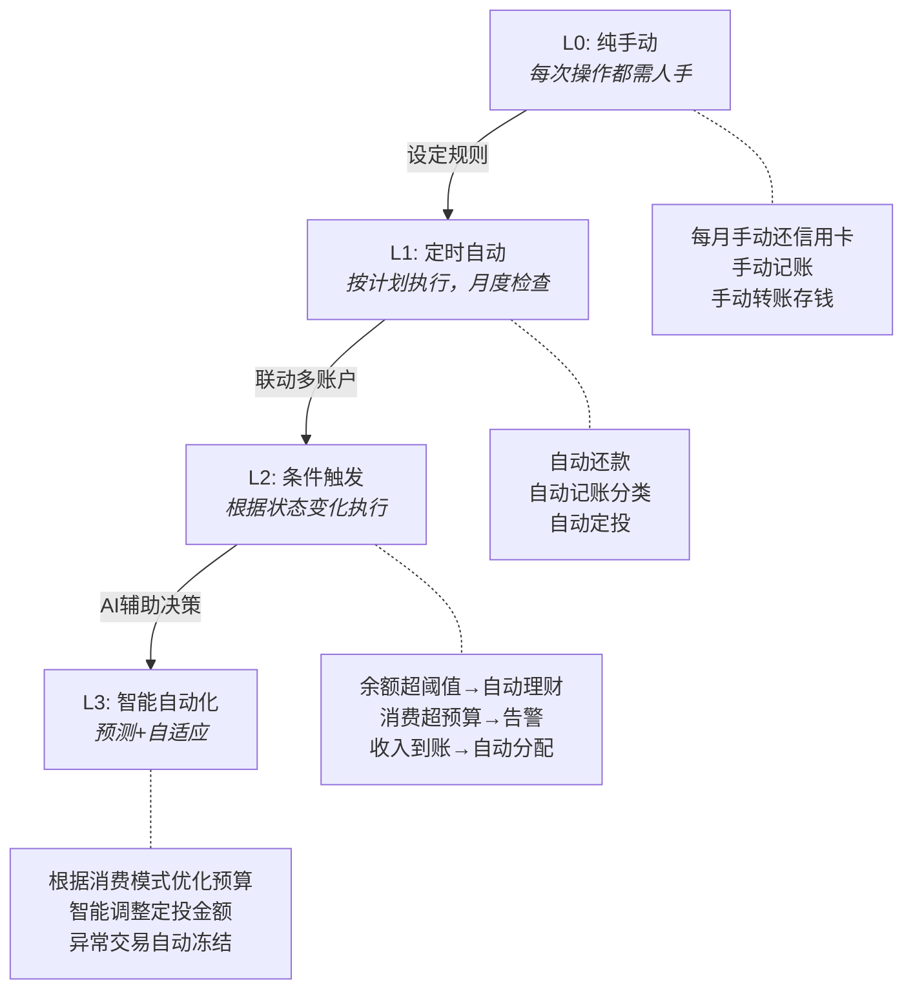
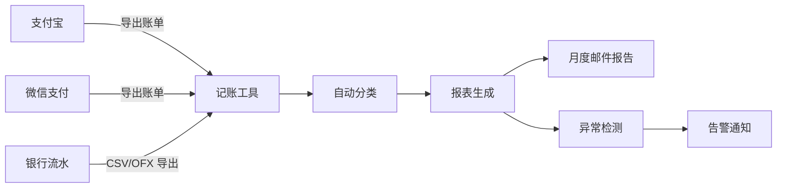
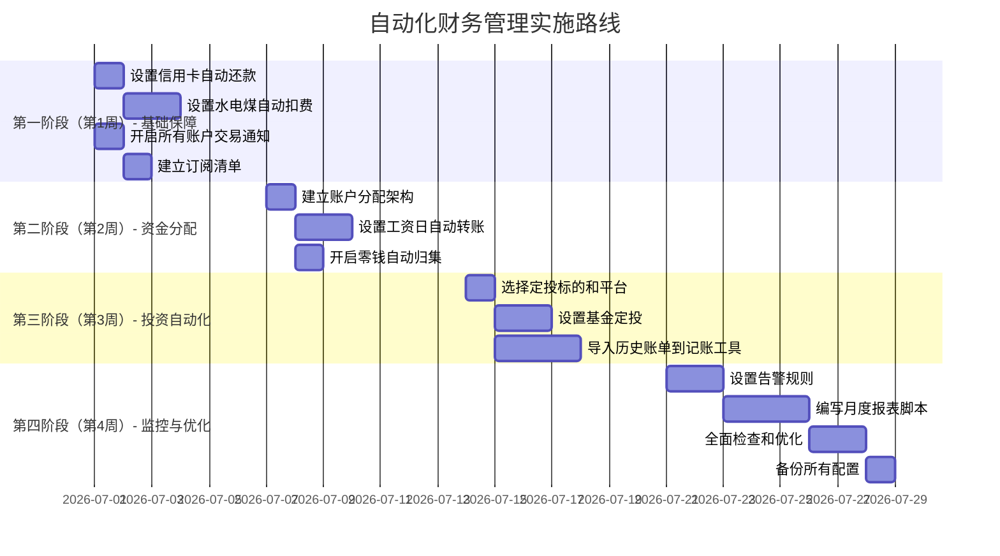

## 九、自动化财务管理

手动记账、手动转账、手动查账——这些重复性操作不仅消耗时间，还会因为遗忘和拖延导致逾期还款、漏记支出、错过投资时机。自动化财务管理的核心理念是：**把确定性高的操作交给系统，把决策权留给自己**。

本节从自动化的底层逻辑出发，覆盖账户联动、账单支付、储蓄规则、投资定投、债务管理、资产再平衡、税务优化、报表生成、异常告警、安全防护、灾难恢复等模块，提供从入门到精通的完整操作方案。读完本节，你将拥有一套可落地的自动化财务管理系统——不需要编程基础也能实现 L1 级自动化，有编程能力的读者可以直接搭建 L2 级系统。

---

### 1. 为什么需要自动化：从认知到行动

#### 1.1 手动管理的隐性成本

大多数人的财务管理停留在"想起来才做"的状态，这带来四类隐性成本：

- **时间成本**：每月花在记账、核对、转账上的时间累计 2-4 小时，一年就是 24-48 小时。按一线城市平均时薪 100 元计算，相当于每年浪费 2400-4800 元
- **遗忘成本**：忘记还款导致征信逾期（影响未来 5 年贷款利率，可能多付数万元利息）、忘记续费导致服务中断、忘记报销导致资金损失。央行征信报告显示，2025 年因"非恶意逾期"产生的征信异议申请超过 300 万件，其中大部分是忘记还款日导致的
- **情绪成本**：每次打开账本面对一堆未处理的流水，心理负担持续累积。行为经济学研究表明，财务焦虑会占用认知资源，降低其他领域的决策质量（Baumeister 等人的"决策疲劳"实验表明，连续做出财务决策后，后续决策质量下降 40%）
- **机会成本**：手动操作的延迟意味着资金在活期账户闲置更久。假设每月工资到账后闲置 3 天才转入货币基金，以 2% 年化计算，月薪 1 万的人每年损失约 50 元利息——看起来不多，但这是完全无风险的收益

#### 1.2 自动化的本质：确定性操作的系统化

自动化不是"交给机器管钱"，而是把满足以下条件的操作交给系统执行：

| 条件 | 说明 | 示例 | 不满足时的风险 |
|------|------|------|---------------|
| 规则明确 | 触发条件和执行动作完全确定 | 每月 5 日还信用卡 | 需要判断的场景不能自动化 |
| 金额可预判 | 金额固定或在可控范围内浮动 | 房贷月供、水电费 | 金额波动太大需要人工确认 |
| 风险可控 | 自动执行不会造成不可逆损失 | 定投基金（有止损线） | 自动化可能导致重大损失 |
| 不需要即时决策 | 不涉及实时市场判断 | 自动转入储蓄账户 | 错过最佳决策窗口 |

**不适用自动化的场景**：大额消费决策（超过月收入 20%）、市场择时交易、涉及合同签订的金融操作、首次使用的新金融产品。这些场景需要人脑介入，因为它们要么金额大到不可逆，要么需要实时判断。

**自动化的四大禁忌**：

| 禁忌 | 说明 | 后果 |
|------|------|------|
| 模糊规则自动化 | 把需要主观判断的决策交给系统 | 错误决策被批量放大 |
| 无监控的自动化 | 设了规则就不管，不设告警 | 小问题积累成大损失 |
| 过度自动化 | 连每月一次的低频操作也自动化 | 维护成本超过收益 |
| 一刀切自动化 | 所有场景用同一套规则 | 边界情况频繁误触发 |

#### 1.3 自动化层级模型



| 层级 | 名称 | 人工干预频率 | 典型工具 | 搭建难度 | 搭建时间 |
|------|------|-------------|---------|---------|---------|
| L0 | 纯手动 | 每次操作 | Excel、纸质账本 | 无 | 无 |
| L1 | 定时自动 | 每月检查一次 | 银行自动扣款、记账 App | 低 | 2-4 小时 |
| L2 | 条件触发 | 异常时才介入 | 脚本 + 规则引擎、银行智能规则 | 中 | 1-2 天 |
| L3 | 智能自动化 | 仅重大决策时介入 | AI 理财顾问、自建系统 | 高 | 1-2 周 |

**关键判断**：大多数人应先达到 L1 水平，再向 L2 进阶。L3 目前仍在发展中，仅在定投调仓、预算预测等特定场景成熟，需要谨慎选择。跳过 L1 直接搭建 L2/L3 系统是最常见的失败模式——系统越复杂，维护成本越高，半途而废的概率越大。

#### 1.4 自动化的心理障碍与克服

很多人知道自动化的好处，却迟迟不行动。这不是懒惰，而是几种可预测的心理机制在起作用：

| 心理障碍 | 表现 | 根因 | 克服方法 |
|---------|------|------|---------|
| 控制感丧失 | "把钱交给系统我不放心" | 损失厌恶——人们对失去控制权的恐惧大于获得便利的渴望 | 从风险最低的操作开始（如水电自动缴费），逐步建立信任 |
| 设置成本感知 | "设置太麻烦了" | 当下偏差——高估眼前的投入，低估未来的收益 | 分解为 15 分钟的小任务，每天完成一个 |
| 损失具象化 | "万一批款失败怎么办？" | 负面事件的想象比正面收益更生动 | 用数据说明：自动还款失败率 < 0.1%，而手动忘记还款率约 15% |
| 现状偏好 | "现在手动也还行" | 现状偏见——维持现状比改变更让人舒适 | 量化手动管理的时间和金钱成本（见 1.1 节） |
| 完美主义 | "我要设计一个完美的系统再开始" | 全有全无思维——觉得不完美不如不做 | 接受"70% 的自动化好过 0%"，先运行再优化 |

**行动建议**：今天就做一件事——开启信用卡自动全额还款。这个操作只需 5 分钟，却能消除你最严重的财务风险（征信逾期）。用这个小胜利建立信心，再逐步扩展。

#### 1.5 影子模式：自动化上线前的必经步骤

在正式启用任何自动化规则之前，强烈建议先运行 1-2 个周期的"影子模式"——规则照常运行，但只记录不执行。这个步骤被大多数人跳过，却是避免自动化事故的关键防线。

**影子模式的操作方法**：

```python
from datetime import datetime
from typing import List, Dict, Optional
import json
import logging
from pathlib import Path

logger = logging.getLogger(__name__)


class ShadowModeExecutor:
    """
    影子模式执行器
    - 记录规则触发时应该执行的动作
    - 与实际人工操作对比，验证规则正确性
    - 确认无误后再切换为自动执行
    
    设计原则：
    - 幂等性：相同输入多次执行只产生一条记录（用 idempotency_key 去重）
    - 审计性：所有操作带时间戳和模式标记，支持事后追溯
    - 容错性：日志持久化，断电不丢失
    """
    
    def __init__(self, rule_name: str, auto_execute: bool = False,
                 log_path: Optional[str] = None,
                 max_retries: int = 3, retry_delay: float = 1.0):
        self.rule_name = rule_name
        self.auto_execute = auto_execute
        self.log_path = Path(log_path) if log_path else None
        self.log: List[Dict] = []
        self.max_retries = max_retries
        self.retry_delay = retry_delay
        self._seen_keys: set = set()  # 幂等性去重
        self._load_existing_log()
    
    def _load_existing_log(self) -> None:
        """加载已有日志，支持断点续跑"""
        if self.log_path and self.log_path.exists():
            try:
                with open(self.log_path, 'r', encoding='utf-8') as f:
                    self.log = json.load(f)
                # 恢复已执行的幂等键
                for record in self.log:
                    key = record.get("idempotency_key")
                    if key:
                        self._seen_keys.add(key)
            except (json.JSONDecodeError, IOError) as e:
                logger.warning(f"加载日志失败，从空日志开始: {e}")
                self.log = []
    
    def _save_log(self) -> None:
        """持久化日志（原子写入：先写临时文件再 rename）"""
        if self.log_path:
            self.log_path.parent.mkdir(parents=True, exist_ok=True)
            tmp_path = self.log_path.with_suffix('.tmp')
            try:
                with open(tmp_path, 'w', encoding='utf-8') as f:
                    json.dump(self.log, f, ensure_ascii=False, indent=2)
                tmp_path.replace(self.log_path)  # 原子替换
            except IOError as e:
                logger.error(f"日志保存失败: {e}")
    
    def _generate_idempotency_key(self, action: str, amount: float,
                                   source: str, target: str) -> str:
        """生成幂等键：相同参数生成相同 key，防止重复执行"""
        import hashlib
        raw = f"{self.rule_name}:{action}:{amount}:{source}:{target}"
        return hashlib.md5(raw.encode()).hexdigest()[:16]
    
    def execute(self, action: str, amount: float, source: str, 
                target: str, metadata: Optional[Dict] = None,
                idempotency_key: Optional[str] = None) -> Dict:
        """执行一条自动化规则
        
        Args:
            action: 操作类型（转入/转出/还款/定投）
            amount: 金额
            source: 来源账户
            target: 目标账户
            metadata: 附加信息
            idempotency_key: 幂等键（可选，默认自动生成）
        
        Returns:
            执行记录字典
        """
        # 幂等性检查
        key = idempotency_key or self._generate_idempotency_key(
            action, amount, source, target)
        if key in self._seen_keys:
            logger.info(f"幂等去重：跳过已执行的操作 {key}")
            return {"result": "SKIPPED (duplicate)", "idempotency_key": key}
        
        record = {
            "rule": self.rule_name,
            "action": action,
            "amount": amount,
            "source": source,
            "target": target,
            "mode": "SHADOW" if not self.auto_execute else "LIVE",
            "timestamp": datetime.now().isoformat(),
            "metadata": metadata or {},
            "idempotency_key": key,
        }
        
        if self.auto_execute:
            # 带重试的执行
            for attempt in range(1, self.max_retries + 1):
                try:
                    result = self._perform_transfer(amount, source, target)
                    record["result"] = "SUCCESS"
                    record["transaction_id"] = result
                    record["attempt"] = attempt
                    self._seen_keys.add(key)
                    break
                except InsufficientBalanceError as e:
                    record["result"] = f"FAILED (余额不足: {e})"
                    logger.error(f"余额不足，不重试: {e}")
                    break
                except Exception as e:
                    record["result"] = f"FAILED (attempt {attempt}): {str(e)}"
                    logger.warning(f"第 {attempt} 次尝试失败: {e}")
                    if attempt < self.max_retries:
                        import time
                        time.sleep(self.retry_delay * attempt)  # 指数退避
        else:
            record["result"] = "SKIPPED (shadow mode)"
            print(f"[SHADOW] 应执行: {action} ¥{amount} {source} → {target}")
        
        self.log.append(record)
        self._save_log()
        return record
    
    def _perform_transfer(self, amount: float, source: str, target: str) -> str:
        """实际执行转账（需根据具体银行 API 实现）
        
        实现要点：
        - 必须使用银行 SDK 或 API，不要模拟操作
        - 必须处理网络超时和重试
        - 必须返回交易流水号用于对账
        """
        # 此处对接银行 API，返回交易流水号
        raise NotImplementedError("请对接具体银行 API")
    
    def compare_with_actual(self, actual_records: List[Dict], 
                            tolerance: float = 0.01) -> tuple:
        """对比影子记录与实际人工操作，计算规则准确率
        
        Args:
            actual_records: 实际执行的记录列表
            tolerance: 金额容差（元），允许小数点精度差异
        
        Returns:
            (accuracy_rate, mismatches_list)
        """
        shadow_records = [r for r in self.log if r["mode"] == "SHADOW"]
        if not shadow_records:
            return 0.0, []
        
        matches = 0
        mismatches = []
        used_actuals: set = set()
        
        for shadow in shadow_records:
            matched = False
            for i, actual in enumerate(actual_records):
                if i in used_actuals:
                    continue
                amount_match = abs(shadow["amount"] - actual.get("amount", 0)) <= tolerance
                target_match = shadow["target"] == actual.get("target", "")
                if amount_match and target_match:
                    matches += 1
                    used_actuals.add(i)
                    matched = True
                    break
            if not matched:
                mismatches.append(shadow)
        
        accuracy = matches / len(shadow_records) * 100
        return round(accuracy, 2), mismatches
    
    def generate_report(self) -> str:
        """生成影子模式运行报告"""
        shadow_records = [r for r in self.log if r["mode"] == "SHADOW"]
        total_amount = sum(r["amount"] for r in shadow_records)
        
        report_lines = [
            f"=== 影子模式报告: {self.rule_name} ===",
            f"运行周期: {len(shadow_records)} 次触发",
            f"总金额: ¥{total_amount:,.2f}",
            f"目标账户: {', '.join(set(r['target'] for r in shadow_records))}",
            "",
            "逐笔明细:",
        ]
        for r in shadow_records:
            report_lines.append(
                f"  {r['timestamp'][:10]} | {r['action']} | "
                f"¥{r['amount']:,.2f} | {r['source']} → {r['target']}"
            )
        
        return "\n".join(report_lines)


class InsufficientBalanceError(Exception):
    """余额不足异常"""
    pass


# 使用示例
shadow = ShadowModeExecutor("工资分配", auto_execute=False, log_path="/tmp/shadow_log.json")
shadow.execute("转入", 3000, "工资卡", "日常消费账户")
shadow.execute("转入", 3500, "工资卡", "固定支出账户")
shadow.execute("转入", 1500, "工资卡", "储蓄账户")
print(shadow.generate_report())
# 运行一个月后对比实际操作，确认规则正确再切换为 auto_execute=True
```

**影子模式的验收标准**：

| 指标 | 合格线 | 不合格时的处理 |
|------|--------|--------------|
| 金额准确率 | ≥ 95% | 检查规则逻辑，调整阈值参数 |
| 分类准确率 | ≥ 90% | 补充关键词映射，增加异常分支 |
| 时间准确率 | 100% | 调整执行时间，避开系统维护窗口 |
| 无误触发 | 0 次误触发 | 增加前置条件检查，收紧触发规则 |

**影子模式常见陷阱**：

1. **影子周期太短**：只跑一周就上线，未覆盖月末、季末等特殊时间点。建议至少覆盖一个完整月度周期
2. **不对比实际操作**：只记录影子数据，不与实际人工操作对比，无法发现偏差。必须逐笔对比
3. **忽略边界情况**：节假日工资延迟到账、跨行转账延迟、银行系统维护等边界情况在影子模式中被忽略。建议在影子期间主动测试这些场景
4. **影子模式的执行时间与真实时间不一致**：如果影子模式在白天运行但自动转账设在凌晨，可能无法模拟真实的系统负载情况
5. **忘记切换回实时模式**：影子模式运行结束后，需要手动将 `auto_execute=False` 改为 `True`。建议在日历中设置提醒

---

### 2. 账户联动：自动化的基础设施

#### 2.1 设计账户架构

在设置任何自动化规则之前，先建立清晰的账户架构。推荐采用"一个中心、多个专户"的模型：

```text
收入账户（工资卡/支付宝/微信）
    ├── [自动转入] 日常消费账户（绑定日常支付）
    ├── [自动转入] 固定支出账户（房贷/车贷/保险/订阅）
    ├── [自动转入] 储蓄应急账户（高流动性，如货币基金）
    ├── [自动转入] 投资账户（基金/股票/ETF）
    ├── [自动转入] 债务偿还账户（信用卡/消费贷/助学贷款）
    └── [自动转入] 自由支配账户（娱乐/社交/个人提升）
```

**账户设计原则**：

- **物理隔离**：每个用途用独立的银行账户或电子钱包，避免资金混用。支付宝和微信都可以开多个子账户，银行也支持一卡多账户
- **命名清晰**：账户备注写明用途（如"日常消费-招行储蓄卡"），转账时不容易搞混
- **层级不超过 3 层**：太深的层级增加管理复杂度，违反自动化初衷
- **应急通道**：保留至少一个高流动性账户（如余额宝/零钱通），能在 2 小时内转出使用
- **债务优先**：有负债时，债务偿还账户的分配优先级高于投资和自由支配

#### 2.2 家庭账户的自动化架构

夫妻或家庭共管财务时，自动化需要额外考虑权限划分和信息透明：

```text
家庭收入池（共同账户）
    ├── [自动转入] 房贷/车贷专户（刚性支出，优先级最高）
    ├── [自动转入] 家庭公共账户（水电煤/物业/孩子教育/日用）
    ├── [自动转入] 甲方个人账户（个人消费/社交）
    ├── [自动转入] 乙方个人账户（个人消费/社交）
    ├── [自动转入] 家庭应急基金（目标: 6个月家庭总支出）
    └── [自动转入] 家庭投资账户（长期目标: 子女教育/养老）
```

**家庭自动化的关键规则**：

| 规则 | 说明 | 为什么重要 |
|------|------|-----------|
| 共同账户双方可见 | 两人都开启交易通知 | 避免信息不对称引发信任问题 |
| 个人账户互不干涉 | 各自的自由支配账户不设对方的通知 | 保留个人财务自主权 |
| 大额支出需确认 | 超过 500 元的非固定支出双人确认 | 防止冲动消费影响家庭预算 |
| 定期对账 | 每月一次家庭财务会议（15分钟） | 确保双方对财务状况有共识 |
| 变更通知 | 任何自动化规则的新增/修改/删除必须通知对方 | 防止单方面操作引发信任危机 |

**家庭财务管理的推荐工具**：

| 工具 | 功能 | 适合场景 | 价格 |
|------|------|---------|------|
| 口袋记账（App） | 共同账本、预算管理 | 轻量级家庭记账 | 免费 |
| 随手记（App） | 多账本、多人协作 | 中等复杂度家庭 | 免费/付费 |
| YNAB（Web/App） | 预算导向、共同管理 | 严格执行预算的家庭 | 订阅制 |
| Firefly III（自部署） | 规则引擎、多用户 | 技术用户家庭 | 免费开源 |
| Notion + 数据库 | 高度自定义 | 已使用 Notion 的家庭 | 免费/付费 |

#### 2.3 账户联动的具体设置

以国内主流银行和支付平台为例，核心联动操作如下：

**工资卡自动分配**（以招商银行为例）：

```text
操作路径: 招行 App → 转账 → 定时转账 → 新增定时转账

设置项：
- 转出账户: 工资卡
- 转入账户: 日常消费卡
- 金额: 固定金额（如月工资的 30%）
- 频率: 每月
- 执行日: 每月 1 日（工资到账次日）
- 备注: "日常消费分配"
```

**支付宝自动转账设置**：

```text
方案一：余额自动转入余额宝
操作路径: 支付宝 → 我的 → 余额宝 → 优选服务 → 自动转入
设置: 开启"自动转入"，设定转入金额或"保留余额 XX 元"
说明: 超过保留余额的部分每天自动转入余额宝，年化约 1.5-2%

方案二：定时转账
操作路径: 支付宝 → 转账 → 定时转账
设置: 指定日期、金额、收款账户
限制: 单笔最高 5 万元，日累计最高 20 万元
```

**微信自动转账设置**：

```text
方案一：零钱自动转入零钱通
操作路径: 微信 → 我 → 服务 → 钱包 → 零钱通 → 自动转入
设置: 开启"零钱自动转入"，设定保留金额

方案二：定时转账（部分银行支持微信端定时转出）
操作路径: 微信 → 我 → 服务 → 钱包 → 银行卡 → 对应银行卡 → 自动扣款
说明: 微信的自动转账功能较支付宝有限，建议复杂场景用银行 App 直接设置
```

**多账户分配清单**：

| 目标账户 | 分配比例 | 自动转入方式 | 执行时间 | 说明 |
|---------|---------|-------------|---------|------|
| 日常消费 | 30% | 银行定时转账 | 每月 1 日 | 覆盖餐饮、交通、日用 |
| 固定支出 | 35% | 银行定时转账 | 每月 1 日 | 房贷/车贷/保险/订阅 |
| 应急储蓄 | 15% | 银行定时转账 → 货币基金自动转入 | 每月 1 日 | 目标: 6 个月生活费 |
| 投资账户 | 15% | 银行定时转账 → 基金定投 | 每月 1 日 | 长期投资，不动用 |
| 自由支配 | 5% | 银行定时转账 | 每月 1 日 | 娱乐、社交、个人提升 |

> **注意**：百分比是建议值，应根据个人实际情况调整。固定支出占比高（如有房贷）的读者，应压缩自由支配和投资比例，确保固定支出刚性覆盖。一个简单的检查方法：固定支出账户每月末余额应始终为正，如果连续 3 个月出现赤字，说明分配比例需要调整。

**不同收入水平的推荐分配方案**：

| 月收入 | 日常消费 | 固定支出 | 应急储蓄 | 投资 | 自由支配 |
|--------|---------|---------|---------|------|---------|
| 5000-8000 元 | 35% | 30% | 15% | 10% | 10% |
| 8000-15000 元 | 30% | 35% | 15% | 15% | 5% |
| 15000-30000 元 | 25% | 30% | 15% | 20% | 10% |
| 30000 元以上 | 20% | 25% | 15% | 30% | 10% |

收入越高，投资和自由支配的比例空间越大。收入较低时，优先保证应急储蓄的积累速度。

**有负债时的分配调整**：当存在消费贷、信用卡分期等非刚性负债时，应优先压缩投资和自由支配比例用于加速还债：

| 负债状态 | 日常消费 | 固定支出 | 债务偿还 | 应急储蓄 | 投资 | 自由支配 |
|---------|---------|---------|---------|---------|------|---------|
| 无负债 | 30% | 35% | 0% | 15% | 15% | 5% |
| 轻度负债（<月收入50%） | 28% | 30% | 20% | 10% | 7% | 5% |
| 中度负债（月收入50-100%） | 25% | 28% | 30% | 10% | 2% | 5% |
| 重度负债（>月收入100%） | 22% | 25% | 40% | 8% | 0% | 5% |

重度负债时暂停所有投资，集中火力还债——除非投资收益率确定高于负债利率（这种情况极为罕见）。

#### 2.4 账户联动的安全设置

自动化意味着资金自动流动，安全措施必须同步到位：

1. **单日转出限额**：将工资卡的单日自动转出限额设为月分配总额的 1.2 倍，防止异常大额转出。操作路径：银行 App → 安全中心 → 转账限额设置
2. **转入确认**：对储蓄和投资账户设置转入短信/推送通知，每笔到账都知晓
3. **异常冻结**：开启银行的"异常交易提醒"功能，单笔超过日常均值 3 倍的交易触发人工确认
4. **定期审计**：每月固定一天（如 15 日）检查所有自动转账是否正常执行。建议在日历中设置提醒，耗时约 5 分钟
5. **备用方案**：至少设置两个不同银行的自动转账通道，当主通道故障时可以手动触发备用通道

#### 2.5 跨银行账户管理

当资产分布在多家银行时，管理复杂度上升。推荐以下策略：

- **主副卡策略**：选择一家银行作为主账户（工资卡所在行），其他银行设为副账户。所有自动分配从主账户出发
- **跨行转账时效**：同行转账实时到账，跨行转账可能有 1-2 小时延迟。定时转账的执行日应考虑这个延迟，建议设为工资到账后第 2 个工作日
- **跨行费用**：目前大部分银行的手机银行跨行转账已免费，但部分银行对自动转账仍收取手续费。设置前确认费用政策
- **统一视图**：使用记账工具（如随手记、MoneyWiz）聚合所有银行账户数据，实现"一个界面看全部"

#### 2.6 数字人民币与新兴支付场景

数字人民币（e-CNY）正在逐步普及，其自动化场景与传统银行有所不同：

| 特性 | 数字人民币 | 传统银行转账 |
|------|-----------|-------------|
| 到账速度 | 实时到账，无延迟 | 同行实时/跨行1-2小时 |
| 手续费 | 完全免费 | 大部分免费，部分收费 |
| 离线支付 | 支持（NFC碰一碰） | 不支持 |
| 自动转账 | 目前功能有限，各银行App逐步支持 | 成熟稳定 |
| 余额收益 | 无利息 | 活期有微薄利息 |

**数字人民币的自动化适用场景**：

1. **日常小额消费**：开通数字人民币钱包的"小额免密"功能，低于 200 元自动扣款，无需每次输密码
2. **公共交通**：部分城市支持数字人民币乘车码自动扣费
3. **政务缴费**：水电煤、社保等政务缴费场景，数字人民币正在快速接入

**建议**：数字人民币目前的自动化功能不如传统银行成熟。日常消费和定投仍建议使用银行 App 或支付宝/微信的成熟自动转账功能。数字人民币可以作为备用支付通道和日常小额消费的补充。

---

### 3. 账单自动支付：告别逾期

#### 3.1 自动还款的层次化设置

账单自动支付是自动化的第一优先级，因为逾期的代价（征信影响、罚息）远高于自动化的风险。

**第一层：信用卡自动还款**

```text
操作路径（以支付宝为例）：
支付宝 → 信用卡还款 → 选择信用卡 → 自动还款设置

推荐设置：
- 还款方式: 全额还款（避免利息，最低还款是陷阱——年化利率高达 18.25%）
- 扣款来源: 工资卡/余额宝
- 执行日: 账单日后第 3 天（给银行系统处理留出缓冲）
- 提醒设置: 还款日前 3 天推送提醒
```

**为什么选全额还款**：最低还款看似减轻压力，但未还部分按日息万分之五计息，且从消费日起计算（不是从还款日起），实际年化利率远超大多数贷款。假设账单 1 万元，最低还款 1000 元，剩余 9000 元的利息在下个账单周期约为 135 元。一年下来可能多付 1000+ 元利息。

**多张信用卡的管理策略**：

| 场景 | 策略 | 操作 |
|------|------|------|
| 2-3 张信用卡 | 每张单独设置自动还款 | 各卡绑定各自的扣款来源 |
| 4 张以上信用卡 | 合并到 1-2 张主力卡，其余注销 | 减少管理复杂度，降低忘记还款的概率 |
| 账单日分散 | 统一调整账单日 | 大部分银行支持修改账单日，统一到每月 5 日或 15 日 |
| 外币信用卡 | 确认自动还款是否包含购汇 | 部分银行的自动还款不覆盖外币账单，需手动购汇还款 |

**第二层：水电煤/物业/宽带自动扣费**

| 账单类型 | 绑定方式 | 注意事项 | 推荐扣费上限 |
|---------|---------|---------|-------------|
| 水费 | 支付宝/微信自动扣费 | 首次需在 App 中主动签约 | 月均值的 2 倍 |
| 电费 | 国网 App 自动缴费 | 设置扣费上限，防止计量异常 | 月均值的 2 倍 |
| 燃气费 | 燃气公司 App 或支付宝 | 部分城市需到营业厅签约 | 月均值的 3 倍（季节波动大） |
| 物业费 | 银行代扣或物业 App | 通常按季度/年度扣款 | 固定金额 |
| 宽带/话费 | 运营商 App 自动充值 | 设置充值上限，防止套餐变更后多扣 | 套餐金额的 1.2 倍 |

**第三层：订阅服务管理**

订阅服务（视频会员、云存储、软件许可）是"自动化陷阱"的重灾区——很多服务在免费试用期结束后自动扣费，而你可能已经忘记它的存在。据调查，平均每人每年在"忘记取消的订阅"上浪费 500-2000 元。

管理方法：

1. **集中签约**：所有订阅尽量通过同一个支付渠道（如支付宝或 Apple ID），便于统一管理
2. **订阅清单维护**：在记账工具中建立专门的"订阅"分类，记录每项订阅的名称、金额、扣费日期、续费周期
3. **季度清理**：每季度检查一次订阅清单，取消不再使用的服务。具体操作：打开支付宝 → 我的 → 设置 → 支付设置 → 免密支付/自动扣款，逐一审查
4. **试用期管理**：签约免费试用时，立即在日历中设置"试用到期前 3 天"的提醒，届时决定是否继续

```python
from datetime import datetime, date, timedelta
from typing import Dict, List, Optional
from dataclasses import dataclass, field


@dataclass
class Subscription:
    name: str
    amount: float
    cycle: str           # monthly, quarterly, yearly
    provider: str
    renewal_date: date
    priority: str        # 高/中/低
    last_used: Optional[date] = None
    payment_channel: str = "支付宝"  # 支付渠道，便于集中管理
    cancel_url: str = ""  # 取消链接，方便一键跳转
    
    @property
    def annual_cost(self) -> float:
        """计算年化成本"""
        multipliers = {"monthly": 12, "quarterly": 4, "yearly": 1}
        return self.amount * multipliers.get(self.cycle, 12)
    
    @property
    def days_until_renewal(self) -> int:
        """距离下次续费的天数"""
        return (self.renewal_date - date.today()).days
    
    @property
    def should_review(self) -> bool:
        """是否需要审查（低优先级且超过 60 天未使用）"""
        if self.priority != "低":
            return False
        if self.last_used is None:
            return True
        return (date.today() - self.last_used).days > 60


class SubscriptionManager:
    """订阅服务管理器
    
    功能：
    - 维护订阅清单，自动计算年化成本
    - 检测即将续费和建议取消的订阅
    - 生成月度/季度报告
    - 识别重复功能的订阅（如同时订阅了两个视频平台）
    """
    
    def __init__(self) -> None:
        self.subscriptions: List[Subscription] = []
    
    def add(self, sub: Subscription) -> None:
        self.subscriptions.append(sub)
    
    def get_annual_total(self) -> float:
        """所有订阅的年化总成本"""
        return sum(s.annual_cost for s in self.subscriptions)
    
    def get_expiring_soon(self, days: int = 7) -> List[Subscription]:
        """获取即将续费的订阅"""
        return [s for s in self.subscriptions if 0 < s.days_until_renewal <= days]
    
    def get_review_candidates(self) -> List[Subscription]:
        """获取建议取消的订阅"""
        return [s for s in self.subscriptions if s.should_review]
    
    def find_duplicates(self) -> List[tuple]:
        """识别功能重复的订阅（同一类型有多个）"""
        # 简单分类：按 provider 类型归类
        categories: Dict[str, List[Subscription]] = {}
        category_map = {
            "爱奇艺": "视频", "优酷": "视频", "腾讯视频": "视频", "B站": "视频",
            "网易云音乐": "音乐", "QQ音乐": "音乐", "Spotify": "音乐",
            "iCloud": "云存储", "阿里云盘": "云存储", "百度网盘": "云存储",
        }
        for sub in self.subscriptions:
            cat = category_map.get(sub.provider, sub.provider)
            categories.setdefault(cat, []).append(sub)
        
        duplicates = []
        for cat, subs in categories.items():
            if len(subs) > 1:
                duplicates.append((cat, subs))
        return duplicates
    
    def generate_report(self) -> str:
        """生成订阅清单报告"""
        lines = ["=== 订阅服务清单 ===", ""]
        lines.append(f"订阅总数: {len(self.subscriptions)}")
        lines.append(f"年化总成本: ¥{self.get_annual_total():,.2f}")
        lines.append("")
        
        # 按年化成本排序
        sorted_subs = sorted(self.subscriptions, key=lambda s: s.annual_cost, reverse=True)
        lines.append(f"{'名称':<12} {'月费':>8} {'年化':>10} {'续费日':>12} {'优先级':>6}")
        lines.append("-" * 60)
        for s in sorted_subs:
            lines.append(
                f"{s.name:<12} ¥{s.amount:>7.2f} ¥{s.annual_cost:>9.2f} "
                f"{str(s.renewal_date):>12} {s.priority:>6}"
            )
        
        # 审查建议
        candidates = self.get_review_candidates()
        if candidates:
            lines.append("")
            lines.append("⚠️ 建议审查的订阅（低优先级且长期未使用）:")
            for s in candidates:
                lines.append(f"  - {s.name} ({s.provider}) ¥{s.amount}/{s.cycle}")
        
        # 重复订阅提醒
        duplicates = self.find_duplicates()
        if duplicates:
            lines.append("")
            lines.append("⚠️ 功能重复的订阅:")
            for cat, subs in duplicates:
                names = ", ".join(s.name for s in subs)
                total = sum(s.annual_cost for s in subs)
                lines.append(f"  - {cat}类: {names}（年化合计 ¥{total:,.0f}，建议保留一个）")
        
        return "\n".join(lines)


# 使用示例
manager = SubscriptionManager()
manager.add(Subscription("视频会员", 25, "monthly", "爱奇艺", date(2026, 9, 15), "低",
                         last_used=date(2026, 3, 10)))
manager.add(Subscription("云存储", 68, "yearly", "阿里云盘", date(2026, 12, 1), "高"))
manager.add(Subscription("开发工具", 69, "monthly", "JetBrains", date(2026, 7, 20), "高",
                         last_used=date(2026, 6, 20)))
manager.add(Subscription("健身房", 200, "monthly", "XX健身房", date(2026, 7, 1), "中",
                         last_used=date(2026, 6, 18)))
manager.add(Subscription("音乐会员", 15, "monthly", "网易云音乐", date(2026, 8, 1), "低",
                         last_used=date(2026, 1, 5)))

print(manager.generate_report())
```

#### 3.2 自动还款的风险与应对

| 风险 | 场景 | 应对措施 | 预防手段 |
|------|------|---------|---------|
| 余额不足扣款失败 | 工资延迟到账或大额消费后余额不足 | 在扣款账户保持 1.2 倍月供的最低余额 | 设置余额低于安全线时的即时告警 |
| 重复扣款 | 系统故障导致同一笔账单扣两次 | 开启银行交易通知，异常扣款 48 小时内联系银行 | 保留所有扣款记录，月末核对 |
| 账单金额异常 | 运营商/物业错误计费 | 设置扣费上限，超限部分暂停自动扣款，人工核实 | 保留历史账单作为基准参考 |
| 忘记取消试用期 | 免费试用自动转为付费 | 试用签约时立即在日历中设置到期提醒 | 所有试用统一记录在订阅清单中 |
| 银行系统维护 | 定时转账在系统维护窗口执行失败 | 设置执行日为到账后第 2-3 天而非当天 | 保留扣款失败后的手动补扣通道 |
| 自动还款只还最低 | 设置时误选"最低还款" | 每月检查还款金额是否等于账单全额 | 设置时反复确认"全额还款"选项 |

#### 3.3 自动还款的验证清单

每月花 5 分钟完成以下检查，确保自动还款系统正常运行：

```text
□ 信用卡自动还款是否成功（检查还款记录，确认金额=账单全额）
□ 水电煤自动扣费是否正常（检查扣费记录）
□ 订阅服务扣费是否符合预期（对照订阅清单）
□ 扣款账户余额是否充足（下月扣款前检查）
□ 是否有新增的自动扣费项（陌生扣费及时排查）
□ 是否有需要取消的试用期订阅
□ 自动还款方式是否仍为"全额还款"（银行系统升级可能重置设置）
```

---

### 4. 自动储蓄规则：先存后花

#### 4.1 "先存后花"的自动化实现

"先存后花"是理财的基本原则，但大多数人是"先花后存"——月底看剩多少再存。行为经济学称之为"心理账户"效应：人们倾向于把剩余的钱当作"可支配收入"而非"储蓄"。自动化可以把这个行为反过来，绕过心理账户的陷阱。

**方案一：工资日自动定额转入储蓄**

```text
规则: 每月 1 日，从工资卡自动转入 1000 元到储蓄账户
工具: 银行定时转账
优点: 简单直接，适合收入稳定的工薪族
缺点: 收入变化时需要手动调整金额
```

**方案二：百分比自动转入**

```text
规则: 每月 1 日，从工资卡自动转入工资的 15% 到储蓄账户
工具: 部分银行支持百分比转账（如招行智能转账）
优点: 收入波动时储蓄金额自动调整
缺点: 大多数银行不支持百分比，需要手动计算金额后设置
```

**方案三：余额触发式转入（L2 层级）**

```text
规则: 工资卡余额超过 5000 元时，超出部分自动转入货币基金
工具: 
  - 招商银行"智能归集"
  - 支付宝"余额自动转入余额宝"
  - 微信"零钱自动转入零钱通"
优点: 充分利用闲置资金，无需手动操作
注意: 阈值需要覆盖日常 3-5 天的消费，设置太低会导致频繁转出
```

**方案四：52 周存钱法的自动化**

52 周存钱法（第一周存 10 元，第二周存 20 元……第 52 周存 520 元，全年存 13780 元）是经典的储蓄训练方法。手动执行容易遗忘，可以这样自动化：

```python
from datetime import datetime, timedelta
from typing import List, Dict


def generate_52_week_plan(start_date: str, base_amount: int = 10,
                          reverse: bool = False) -> List[Dict]:
    """
    生成 52 周存钱计划的转账指令列表
    
    Args:
        start_date: 起始日期，格式 YYYY-MM-DD
        base_amount: 基础金额（第一周存入金额）
        reverse: 是否倒序执行（先存多后存少，适合年初有年终奖的情况）
    
    Returns:
        包含每周存钱计划的字典列表
    """
    plans: List[Dict] = []
    current_date = datetime.strptime(start_date, "%Y-%m-%d")
    total = 0
    
    for week in range(1, 53):
        if reverse:
            amount = base_amount * (53 - week)
        else:
            amount = base_amount * week
        total += amount
        plans.append({
            "week": week,
            "date": current_date.strftime("%Y-%m-%d"),
            "amount": amount,
            "cumulative": total,
            "description": f"第{week}周存钱: {amount}元（累计: {total}元）"
        })
        current_date += timedelta(days=7)
    
    return plans


def generate_monthly_summary(plans: List[Dict]) -> List[Dict]:
    """将周计划汇总为月度计划，便于设置银行定时转账"""
    monthly: Dict[str, Dict] = {}
    for p in plans:
        month_key = p["date"][:7]  # YYYY-MM
        if month_key not in monthly:
            monthly[month_key] = {"month": month_key, "total": 0, "weeks": 0}
        monthly[month_key]["total"] += p["amount"]
        monthly[month_key]["weeks"] += 1
    
    return sorted(monthly.values(), key=lambda x: x["month"])


# 生成计划
plan = generate_52_week_plan("2026-07-07", base_amount=10, reverse=False)
print("=== 52 周存钱计划 ===")
for p in plan[:5]:  # 只显示前 5 周
    print(f"{p['date']}  转入储蓄 {p['amount']:>5d} 元  ({p['description']})")
print(f"... (共 52 周)")
print(f"全年总计: ¥{plan[-1]['cumulative']:,}")

# 生成月度汇总，便于设置银行定时转账
print("\n=== 月度汇总（建议设为银行定时转账金额）===")
monthly = generate_monthly_summary(plan)
for m in monthly:
    print(f"{m['month']}: ¥{m['total']:,}（{m['weeks']} 周）")
```

> **实操建议**：大多数银行的定时转账不支持逐周变化金额。实际操作时，可以按月汇总（每周 10-520 元，月均约 1100 元），设置每月固定转入一个中等金额，年底根据实际收支情况补齐差额。或者将 52 周计划导入日历 App，每周手动执行一次——手动操作的"仪式感"反而能增强储蓄动力。

#### 4.2 零钱自动归集

日常消费产生的零钱（如消费 23.5 元，系统自动将 0.5 元转入储蓄）是一种无痛储蓄方式：

- **支付宝"笔笔攒"**：每笔消费后自动存入指定金额（1.88/3.88/5.88 元可选）。按每天消费 5 笔、每笔存 1.88 元计算，一年可自动储蓄约 3400 元
- **微信"零钱通自动转入"**：零钱余额超阈值自动转入零钱通，目前年化约 1.5-2%
- **银行"零存整取"**：传统产品，每月固定存入，到期一次性支取本息。利率略高于活期，但流动性差

这些功能开启后无需任何操作，长期坚持能积少成多。

#### 4.3 储蓄自动化的心理学基础

为什么"先存后花"需要自动化？行为经济学给出了三个解释：

1. **默认效应**：人们倾向于接受默认选项。自动储蓄把"储蓄"设为默认行为，"不储蓄"需要主动取消，大多数惰性会站在储蓄这一边
2. **损失厌恶**：手动储蓄需要"割舍"一部分可支配收入，心理上是损失。自动储蓄在你看到工资到账前就已经转走了，感知上的损失更小
3. **当下偏差**：人们倾向于过度重视当下的满足感，低估未来的收益。自动化跳过了"当下决策"这个环节，避免了意志力消耗

Richard Thaler 的"为明天储蓄更多"（Save More Tomorrow）计划正是基于这些原理：让员工在加薪前承诺提高储蓄率，加薪后自动执行。实验数据显示，参与者的储蓄率从 3.5% 提升到了 13.6%，且几乎没有主动退出。

**国内落地的类似机制**：部分银行的"薪资理财"功能支持工资到账后自动将指定比例转入理财产品。招商银行的"薪资专享"、工商银行的"薪金溢"都是此类产品。设置后无需每月操作，且收益率高于活期存款。

---

### 5. 自动投资：定投策略的系统化执行

#### 5.1 基金定投的自动化设置

基金定投是自动化的最佳应用场景之一——规则明确、长期执行、不需要择时。定投的核心逻辑是"时间分散"：通过定期买入，在价格低时多买份额、价格高时少买份额，长期下来摊低持仓成本。

**定投参数设置建议**：

| 参数 | 建议值 | 说明 |
|------|-------|------|
| 定投频率 | 每周/每两周 | 比每月定投更能平滑成本。实测数据：周定投比月定投的年化波动率低 5-8% |
| 定投金额 | 月可投资金额的 1/4（周投） | 确保不影响日常现金流。可投资金额 = 月收入 - 固定支出 - 储蓄 - 生活费 |
| 扣款日 | 工资到账后第 2 个工作日 | 避免扣款失败。周末和节假日银行不处理转账 |
| 定投标的 | 宽基指数基金（沪深 300、中证 500） | 适合长期持有，波动适中，不依赖单一行业 |
| 分红方式 | 红利再投资 | 复利效应最大化。10 年维度下，红利再投资比现金分红多产生 15-25% 的总收益 |
| 止损线 | 累计亏损 30% 触发审视 | 不是立即卖出，而是审视投资逻辑是否变化 |

**主流平台定投设置路径**：

```text
支付宝定投:
蚂蚁财富 → 基金 → 选择基金 → 定投 → 设置金额/频率/扣款日

天天基金定投:
天天基金 App → 基金详情 → 定投 → 设置参数

银行 App 定投:
以招行为例: App → 理财 → 基金 → 定投管理 → 新增定投

蛋卷基金定投:
蛋卷 App → 基金详情 → 定投 → 设置参数
```

#### 5.2 智能定投（L2 层级）

传统定投是"定时定额"，智能定投在市场估值低时多买、估值高时少买或暂停。这种策略的理论基础是"均值回归"——市场估值长期围绕均值波动，极端低估和高估都是暂时的。

```text
智能定投策略示例（基于 PE 百分位）：

IF 沪深300 PE < 历史 30% 分位:
    定投金额 = 基础金额 × 1.5    # 低估多买
ELIF 沪深300 PE 在 30%-70% 分位:
    定投金额 = 基础金额 × 1.0    # 正常定投
ELIF 沪深300 PE 在 70%-90% 分位:
    定投金额 = 基础金额 × 0.5    # 高估少买
ELIF 沪深300 PE > 90% 分位:
    暂停定投，仅持有不动          # 极端高估暂停
```

**PE 百分位数据获取**：

- 理杏仁（lixinger.com）：免费查看各指数的 PE/PB 百分位
- 且慢 App：提供指数估值温度计
- 中证指数官网（csindex.com.cn）：官方数据源

支持智能定投的平台：

| 平台 | 智能定投功能 | 调整依据 | 费率 |
|------|------------|---------|------|
| 支付宝"慧定投" | 根据均线偏离度自动调整金额 | 250 日均线 | 与普通定投相同 |
| 蛋卷基金"估值定投" | 根据 PE 百分位调整 | 历史 PE 分位 | 与普通定投相同 |
| 且慢"长赢计划" | 多策略组合，自动调仓 | 估值 + 动量 + 网格 | 平台服务费 0.5%/年 |
| 天天基金"智能定投" | 均线偏离度 + 估值 | 500 日均线 | 与普通定投相同 |

#### 5.3 定投的监控与调整

定投不是"设了就不管"，需要定期审视。频率过高会陷入"频繁关注→焦虑→手动干预→破坏纪律"的恶性循环；频率过低可能错过基金基本面变化的信号。

**月度检查（5 分钟）**：
- 定投是否正常扣款（检查交易记录）
- 账户余额是否充足（确保下月扣款不会失败）
- 基金是否有公告（分红、转型、清盘风险）

**季度检查（30 分钟）**：
- 定投收益率与基准指数对比（如果长期跑输基准，考虑换基金）
- 当前估值百分位，是否需要调整定投策略
- 是否有更优的替代基金（费率更低、跟踪误差更小）

**年度检查（1-2 小时）**：
- 全年定投成本和收益汇总（用 XIRR 函数计算真实年化收益率）
- 资产配置比例是否偏离目标（股票/债券/现金的比例）
- 定投标的是否需要更换（如行业主题基金的逻辑是否变化）
- 检查定投平台的费率是否有更优选择

```python
from scipy.optimize import brentq
from datetime import date
from typing import List, Tuple


def xirr(transactions: List[Tuple[date, float]], guess: float = 0.1) -> float:
    """
    计算 XIRR（考虑现金流时间的年化收益率）
    
    Args:
        transactions: [(date, amount)] 列表，投入为负，赎回/市值为正
        guess: 初始猜测值
    
    Returns:
        年化收益率（小数形式）
    
    Raises:
        ValueError: 无法收敛时抛出
    """
    if not transactions:
        raise ValueError("交易列表为空")
    
    # 按日期排序
    transactions = sorted(transactions, key=lambda x: x[0])
    d0 = transactions[0][0]
    
    def npv(rate: float) -> float:
        return sum(
            cf / (1 + rate) ** ((d - d0).days / 365.25)
            for d, cf in transactions
        )
    
    # 检查是否有解：NPV 在 -100% 和 +1000% 的符号是否相反
    try:
        npv_low = npv(-0.99)
        npv_high = npv(10.0)
        if npv_low * npv_high > 0:
            # 没有实数解，返回 NaN
            return float('nan')
        return brentq(npv, -0.99, 10.0, xtol=1e-8)
    except ValueError:
        return float('nan')


# 示例：每月定投 1000 元，12 个月后市值 13500 元
transactions = [
    (date(2025, 7, 1), -1000), (date(2025, 8, 1), -1000),
    (date(2025, 9, 1), -1000), (date(2025, 10, 1), -1000),
    (date(2025, 11, 1), -1000), (date(2025, 12, 1), -1000),
    (date(2026, 1, 1), -1000), (date(2026, 2, 1), -1000),
    (date(2026, 3, 1), -1000), (date(2026, 4, 1), -1000),
    (date(2026, 5, 1), -1000), (date(2026, 6, 1), -1000),
    (date(2026, 6, 15), 13500),  # 当前市值
]
rate = xirr(transactions)
print(f"定投年化收益率: {rate:.2%}")  # 约 25.9%

# 常见误区：简单用 (终值-总投入)/总投入 计算收益率
total_invested = sum(abs(t[1]) for t in transactions if t[1] < 0)
naive_return = (13500 - total_invested) / total_invested
print(f"简单收益率: {naive_return:.2%}")  # 约 12.5%（未考虑资金时间价值）
print(f"XIRR 更准确，因为它考虑了每笔资金的投入时间")
```

#### 5.4 智能投顾（Robo-Advisor）集成

智能投顾是 L3 层级的自动化投资工具，通过算法自动管理投资组合。国内主流平台：

| 平台 | 起投金额 | 管理费 | 策略类型 | 适合人群 |
|------|---------|--------|---------|---------|
| 且慢「长赢计划」 | 1000 元 | 0.5%/年 | 估值+动量+网格 | 有一定投资经验 |
| 蛋卷「蛋卷基金」 | 100 元 | 0-0.5% | 组合投资 | 入门投资者 |
| 天天基金「智投」 | 1000 元 | 0-0.5% | 均线+估值 | 中等经验 |
| 招行「摩羯智投」 | 20000 元 | 0.6%/年 | 资产配置 | 高净值用户 |
| 蚂蚁「帮你投」 | 800 元 | 0.5%/年 | 风险评估+配置 | 入门用户 |

**智能投顾的自动化集成方式**：

```text
1. 设置智能投顾账户的自动转入（每月工资日）
2. 平台自动执行资产配置和再平衡
3. 设置收益/亏损告警（月度收益 > 10% 或 < -10% 时通知）
4. 每季度审视一次策略表现，与基准指数对比
```

**智能投顾 vs 手动定投的对比**：

| 维度 | 智能投顾 | 手动定投 |
|------|---------|---------|
| 自动化程度 | 高（全自动） | 中（需手动选择标的） |
| 费率 | 较高（0.5-0.6%/年） | 较低（仅基金费率） |
| 资产配置 | 自动再平衡 | 需手动调整 |
| 透明度 | 中（策略黑箱） | 高（自己选择标的） |
| 适合人群 | 不想花时间研究 | 有投资知识和时间 |

**建议**：入门投资者先用智能投顾建立投资习惯，积累经验后逐步转向手动定投（费率更低、控制力更强）。

#### 5.5 定投中的税务考量

自动投资产生的收益涉及税务问题：

- **基金分红**：个人投资者从基金获得的分红暂免个人所得税（政策有效期需关注最新规定）
- **基金赎回**：基金赎回收益暂免个人所得税
- **股票分红**：持股超过 1 年免征个人所得税，持股 1 个月以内全额征税，1 个月至 1 年减半征收
- **利息收入**：货币基金（余额宝/零钱通）的收益暂免个人所得税
- **ETF 交易**：ETF 买卖暂免印花税，佣金费率通常低于 0.05%

定投的优势之一是天然满足长期持股条件，但如果你的定投标的包括股票或 ETF，需注意分红的持股期限要求。

**税务优化策略**：

1. **利用免税额度**：基金分红和赎回收益暂免个税，优先选择基金而非直接持有股票
2. **红利再投资**：选择红利再投资而非现金分红，避免分红到账后闲置
3. **长期持有**：股票持有超过 1 年免征红利税，定投天然适合长期持有
4. **亏损抵扣**：基金亏损无法抵扣其他投资收益（国内目前不支持投资亏损抵扣），但可以通过卖出亏损基金降低持仓成本

---

### 6. 债务自动管理：加速上岸

#### 6.1 债务清单的自动化维护

有负债时，第一步是建立完整的债务清单并保持自动更新：

```python
from dataclasses import dataclass
from datetime import date
from typing import List


@dataclass
class Debt:
    name: str               # 债务名称
    balance: float          # 当前余额
    annual_rate: float      # 年利率（小数形式，如 0.1825 表示 18.25%）
    min_payment: float      # 最低月还款额
    due_day: int            # 每月还款日
    debt_type: str          # 信用卡/消费贷/房贷/助学贷款/亲友借款
    
    @property
    def monthly_rate(self) -> float:
        return self.annual_rate / 12
    
    @property
    def monthly_interest(self) -> float:
        """本月利息"""
        return self.balance * self.monthly_rate
    
    @property
    def months_to_payoff_min(self) -> int:
        """仅还最低还款额需要的月数"""
        if self.min_payment <= self.monthly_interest:
            return 999  # 永远还不完
        months = 0
        balance = self.balance
        while balance > 0 and months < 600:
            interest = balance * self.monthly_rate
            principal = self.min_payment - interest
            balance -= principal
            months += 1
        return months
    
    @property
    def total_interest_min_payment(self) -> float:
        """仅还最低还款额的总利息"""
        total_interest = 0.0
        balance = self.balance
        for _ in range(self.months_to_payoff_min):
            interest = balance * self.monthly_rate
            total_interest += interest
            principal = self.min_payment - interest
            balance -= principal
        return total_interest


class DebtManager:
    """债务管理器
    
    功能：
    - 雪崩法（Avalanche）：优先还利率最高的债务，数学最优
    - 雪球法（Snowball）：优先还余额最小的债务，心理激励最强
    - 自动对比两种方法的利息差异
    - 生成还债计划和还款日历
    """
    
    def __init__(self) -> None:
        self.debts: List[Debt] = []
    
    def add(self, debt: Debt) -> None:
        self.debts.append(debt)
    
    def get_total_balance(self) -> float:
        return sum(d.balance for d in self.debts)
    
    def get_total_min_payment(self) -> float:
        return sum(d.min_payment for d in self.debts)
    
    def get_avalanche_order(self) -> List[Debt]:
        """雪崩法排序：优先还利率最高的债务"""
        return sorted(self.debts, key=lambda d: d.annual_rate, reverse=True)
    
    def get_snowball_order(self) -> List[Debt]:
        """雪球法排序：优先还余额最小的债务"""
        return sorted(self.debts, key=lambda d: d.balance)
    
    def calculate_payoff_plan(self, extra_payment: float = 0,
                               method: str = "avalanche") -> dict:
        """
        计算还债计划
        
        Args:
            extra_payment: 每月额外可用于还债的金额
            method: "avalanche"（雪崩法）或 "snowball"（雪球法）
        
        Returns:
            包含还债计划详情的字典
        """
        if method == "avalanche":
            order = self.get_avalanche_order()
        else:
            order = self.get_snowball_order()
        
        # 模拟还款过程
        remaining = [(d.name, d.balance, d.min_payment, d.annual_rate) for d in order]
        total_interest = 0.0
        months = 0
        freed_payments = 0.0  # 已还清债务的最低还款额，可用于加速还其他债
        
        while any(r[1] > 0 for r in remaining):
            months += 1
            extra = extra_payment + freed_payments
            
            for i, (name, balance, min_pay, rate) in enumerate(remaining):
                if balance <= 0:
                    continue
                
                interest = balance * (rate / 12)
                total_interest += interest
                
                # 分配额外还款：优先分配给排序第一的未还清债务
                extra_for_this = 0.0
                if i == next(j for j, r in enumerate(remaining) if r[1] > 0):
                    extra_for_this = extra
                
                payment = min(min_pay + extra_for_this, balance + interest)
                principal = payment - interest
                new_balance = max(0, balance - principal)
                
                if new_balance == 0 and balance > 0:
                    freed_payments += min_pay  # 还清了，释放最低还款额
                
                remaining[i] = (name, new_balance, min_pay, rate)
            
            if months > 600:  # 安全阀
                break
        
        return {
            "method": method,
            "months": months,
            "years": months / 12,
            "total_interest": total_interest,
            "extra_payment": extra_payment,
        }
    
    def compare_methods(self, extra_payment: float = 0) -> str:
        """对比雪崩法和雪球法"""
        avalanche = self.calculate_payoff_plan(extra_payment, "avalanche")
        snowball = self.calculate_payoff_plan(extra_payment, "snowball")
        
        interest_saved = snowball["total_interest"] - avalanche["total_interest"]
        months_saved = snowball["months"] - avalanche["months"]
        
        lines = [
            "=== 债务还清方案对比 ===",
            "",
            f"{'指标':<16} {'雪崩法':>12} {'雪球法':>12} {'差异':>12}",
            "-" * 54,
            f"{'还清月数':<16} {avalanche['months']:>10}个月 {snowball['months']:>10}个月 {months_saved:>+10}个月",
            f"{'总利息':<16} ¥{avalanche['total_interest']:>10,.0f} ¥{snowball['total_interest']:>10,.0f} ¥{interest_saved:>+10,.0f}",
            f"{'月供总额':<16} ¥{self.get_total_min_payment() + extra_payment:>10,.0f}",
            "",
            f"结论: 雪崩法节省 ¥{interest_saved:,.0f} 利息，提前 {months_saved} 个月还清",
            f"       雪球法更快减少债务笔数，心理激励更强",
            f"       建议: 理性选雪崩法，需要动力选雪球法",
        ]
        return "\n".join(lines)
    
    def generate_payment_calendar(self, extra_payment: float = 0,
                                   method: str = "avalanche") -> str:
        """生成还债日历（每月还款明细）"""
        if method == "avalanche":
            order = self.get_avalanche_order()
        else:
            order = self.get_snowball_order()
        
        remaining = [(d.name, d.balance, d.min_payment, d.annual_rate, d.due_day)
                     for d in order]
        freed = 0.0
        month = 0
        lines = ["=== 还债日历 ===", ""]
        
        while any(r[1] > 0 for r in remaining) and month < 60:
            month += 1
            extra = extra_payment + freed
            lines.append(f"第 {month} 月:")
            
            for i, (name, balance, min_pay, rate, due_day) in enumerate(remaining):
                if balance <= 0:
                    lines.append(f"  ✅ {name}: 已还清")
                    continue
                
                interest = balance * (rate / 12)
                extra_for_this = 0.0
                if i == next(j for j, r in enumerate(remaining) if r[1] > 0):
                    extra_for_this = extra
                
                payment = min(min_pay + extra_for_this, balance + interest)
                principal = payment - interest
                new_balance = max(0, balance - principal)
                
                lines.append(
                    f"  {name}: 还 ¥{payment:,.0f}（本金 ¥{principal:,.0f} + 利息 ¥{interest:,.0f}）"
                    f" → 剩余 ¥{new_balance:,.0f}"
                )
                
                if new_balance == 0 and balance > 0:
                    freed += min_pay
                    lines.append(f"  🎉 {name} 在本月还清！释放 ¥{min_pay:,.0f}/月")
                
                remaining[i] = (name, new_balance, min_pay, rate, due_day)
            
            lines.append("")
        
        return "\n".join(lines)


# 使用示例
dm = DebtManager()
dm.add(Debt("信用卡A", 15000, 0.1825, 1500, 25, "信用卡"))
dm.add(Debt("消费贷", 30000, 0.072, 2800, 10, "消费贷"))
dm.add(Debt("信用卡B", 5000, 0.1825, 500, 15, "信用卡"))

print(dm.compare_methods(extra_payment=2000))
print()
print(dm.generate_payment_calendar(extra_payment=2000, method="avalanche"))
```

#### 6.2 债务自动还款的设置

| 债务类型 | 自动还款方式 | 注意事项 |
|---------|-------------|---------|
| 信用卡 | 支付宝/银行 App 全额自动还款 | 确保是"全额"而非"最低"还款 |
| 房贷 | 银行自动扣款（放款时已设置） | 扣款日前确保账户余额充足 |
| 消费贷 | 银行自动扣款 | 关注是否有提前还款违约金 |
| 助学贷款 | 支付宝自动还款 | 还款期内可申请利息补贴 |
| 亲友借款 | 银行定时转账 | 保留转账记录作为还款凭证 |

#### 6.3 债务告警规则

| 告警 | 触发条件 | 处理方式 |
|------|---------|---------|
| 还款日前余额不足 | 还款日前 3 天余额低于月供 1.2 倍 | 立即转入资金 |
| 信用卡账单异常 | 本月账单超过近 3 月均值 50% | 核实是否有大额消费或被盗刷 |
| 利率变动 | 贷款利率调整通知 | 重新计算还债计划 |
| 债务总额上升 | 本月债务总额高于上月 | 检查是否有新增消费或利息累积 |

---

### 7. 资产再平衡自动化

#### 7.1 为什么需要再平衡

即使初始配置完美，市场波动也会让资产比例偏离目标。假设初始配置 60% 股票 + 40% 债券，一年后股票大涨，比例变成 75% + 25%——风险水平已经远超预期。再平衡就是通过买卖操作，把比例拉回目标值。

**再平衡的两种触发方式**：

| 方式 | 说明 | 优点 | 缺点 |
|------|------|------|------|
| 日历触发 | 每季度/半年/年固定再平衡 | 简单，不需要监控 | 可能在不需要时交易，增加成本 |
| 阈值触发 | 偏离目标超过 5% 时触发 | 只在必要时交易 | 需要持续监控 |

**推荐策略**：两者结合——每季度检查一次，仅在偏离超过 5% 时执行再平衡。

#### 7.2 再平衡的自动化实现

```python
from typing import Dict, List, Tuple
from dataclasses import dataclass


@dataclass
class AssetPosition:
    """资产持仓"""
    name: str           # 资产名称
    current_value: float  # 当前市值
    target_pct: float     # 目标占比（0-100）


class PortfolioRebalancer:
    """投资组合再平衡器
    
    设计原则：
    - 最小交易量：忽略 10 元以内的调整，避免频繁小额交易
    - 税务优先：优先通过调整新增资金分配方向实现再平衡（无卖出）
    - 极端保护：单日跌幅 > 5% 时暂停再平衡
    """
    
    def __init__(self, positions: List[AssetPosition], threshold: float = 5.0):
        """
        Args:
            positions: 资产持仓列表
            threshold: 偏离阈值（百分比），超过此值触发再平衡
        """
        self.positions = positions
        self.threshold = threshold
    
    @property
    def total_value(self) -> float:
        return sum(p.current_value for p in self.positions)
    
    def get_current_allocation(self) -> Dict[str, float]:
        """获取当前资产配置百分比"""
        total = self.total_value
        if total == 0:
            return {p.name: 0 for p in self.positions}
        return {p.name: p.current_value / total * 100 for p in self.positions}
    
    def needs_rebalance(self) -> Tuple[bool, List[Dict]]:
        """检查是否需要再平衡
        
        Returns:
            (是否需要再平衡, 偏离详情列表)
        """
        current = self.get_current_allocation()
        deviations: List[Dict] = []
        max_deviation = 0.0
        
        for p in self.positions:
            current_pct = current.get(p.name, 0)
            deviation = current_pct - p.target_pct
            max_deviation = max(max_deviation, abs(deviation))
            deviations.append({
                "name": p.name,
                "current_pct": current_pct,
                "target_pct": p.target_pct,
                "deviation": deviation,
                "over_threshold": abs(deviation) > self.threshold
            })
        
        return max_deviation > self.threshold, deviations
    
    def calculate_trades(self) -> List[Dict]:
        """计算再平衡需要的交易操作
        
        Returns:
            交易操作列表（正值为买入，负值为卖出）
        """
        total = self.total_value
        trades: List[Dict] = []
        
        for p in self.positions:
            target_value = total * (p.target_pct / 100)
            diff = target_value - p.current_value
            if abs(diff) > 10:  # 忽略 10 元以内的调整
                trades.append({
                    "name": p.name,
                    "current_value": p.current_value,
                    "target_value": target_value,
                    "trade_amount": diff,
                    "action": "买入" if diff > 0 else "卖出"
                })
        
        return sorted(trades, key=lambda t: abs(t["trade_amount"]), reverse=True)
    
    def calculate_trades_with_new_money(self, new_money: float) -> List[Dict]:
        """通过新增资金实现再平衡（避免卖出产生税费）
        
        Args:
            new_money: 本月新增可投资金额
        
        Returns:
            各资产的买入金额分配
        """
        total = self.total_value + new_money
        allocations: List[Dict] = []
        
        for p in self.positions:
            target_value = total * (p.target_pct / 100)
            gap = target_value - p.current_value
            if gap > 0:
                allocations.append({
                    "name": p.name,
                    "buy_amount": round(min(gap, new_money), 2),
                    "gap": round(gap, 2),
                })
        
        # 按缺口大小分配新增资金
        allocations.sort(key=lambda x: x["gap"], reverse=True)
        return allocations
    
    def generate_report(self) -> str:
        """生成再平衡报告"""
        needs, deviations = self.needs_rebalance()
        trades = self.calculate_trades() if needs else []
        
        lines = [
            "=== 投资组合再平衡报告 ===",
            f"总资产: ¥{self.total_value:,.2f}",
            f"再平衡阈值: ±{self.threshold}%",
            f"是否需要再平衡: {'是 ✓' if needs else '否 ✗'}",
            "",
            f"{'资产':<12} {'当前占比':>10} {'目标占比':>10} {'偏离':>10} {'状态':>8}",
            "-" * 54,
        ]
        
        for d in deviations:
            status = "⚠️ 超限" if d["over_threshold"] else "✅ 正常"
            lines.append(
                f"{d['name']:<12} {d['current_pct']:>9.1f}% {d['target_pct']:>9.1f}% "
                f"{d['deviation']:>+9.1f}% {status:>8}"
            )
        
        if trades:
            lines.append("")
            lines.append("需要执行的交易:")
            for t in trades:
                lines.append(
                    f"  {t['action']} {t['name']}: ¥{abs(t['trade_amount']):,.2f} "
                    f"({t['current_value']:,.0f} → {t['target_value']:,.0f})"
                )
        
        return "\n".join(lines)


# 使用示例
positions = [
    AssetPosition("沪深300ETF", 45000, 35),
    AssetPosition("中证500ETF", 20000, 15),
    AssetPosition("债券基金", 30000, 30),
    AssetPosition("货币基金", 15000, 15),
    AssetPosition("海外ETF", 5000, 5),
]

rebalancer = PortfolioRebalancer(positions, threshold=5.0)
print(rebalancer.generate_report())
```

#### 7.3 再平衡的注意事项

- **交易成本**：再平衡会产生手续费和可能的税费。基金赎回费通常持有超过 7 天至 30 天后降至 0.5%，超过 1-2 年可能免赎回费。频繁再平衡的成本可能超过收益
- **最小交易金额**：部分基金有最低申购金额（如 100 元），计算出的调整金额低于最低限额时忽略
- **税务影响**：卖出盈利的基金/股票会产生税费。优先通过调整新增资金的分配方向来实现再平衡（无卖出操作）
- **市场极端情况**：暴跌时不要恐慌性再平衡买入——可能是抄底，也可能是接飞刀。设置规则：单日跌幅超过 5% 时暂停再平衡，等待 3 个交易日再评估

---

### 8. 自动化报表与洞察

#### 8.1 自动记账的数据流

自动化记账的核心是减少手动输入。目前国内主流的自动记账数据源：



**支付宝账单自动导出**：

```text
路径: 支付宝 App → 我的 → 账单 → 右上角"..." → 开具交易流水证明
格式: CSV，包含交易时间、金额、收/支、对方、商品名称
频率: 建议每月 1 日导出上月数据
注意: 支付宝账单最长可导出近 12 个月的数据
```

**微信账单导出**：

```text
路径: 微信 → 我 → 服务 → 钱包 → 账单 → 常见问题 → 下载账单
格式: CSV
注意: 微信账单导出覆盖近 3 个月数据，更早的数据需通过微信支付公众号获取
替代方案: 
  1. 使用第三方记账 App（如随手记）的微信账单读取功能
  2. 通过微信支付公众号的历史账单手动补录
```

**银行流水导出**：

```text
大部分银行 App 支持导出近 1-3 年的交易流水（CSV 或 PDF 格式）
路径示例（招行）: App → 我的 → 交易查询 → 导出
格式: CSV（推荐）或 PDF
注意: 部分银行的 CSV 编码为 GBK，需要用 Python 指定 encoding='gbk' 读取
```

#### 8.2 自动生成财务报表

使用 Python 脚本将导出的账单数据自动生成月度报表：

```python
import pandas as pd
from datetime import datetime, timedelta
from pathlib import Path
from typing import Optional, Dict, List
import warnings
warnings.filterwarnings('ignore')

# 分类关键词映射（可根据实际消费习惯扩展）
CATEGORY_KEYWORDS: Dict[str, List[str]] = {
    "餐饮": ["外卖", "美团", "饿了么", "餐厅", "食堂", "小吃", "奶茶", "咖啡", 
             "肯德基", "麦当劳", "星巴克", "瑞幸", "海底捞", "火锅", "烧烤"],
    "交通": ["滴滴", "地铁", "公交", "出租车", "加油", "停车", "高铁", "机票",
             "高德", "曹操出行", "哈啰", "共享单车", "ETC"],
    "购物": ["淘宝", "京东", "拼多多", "超市", "商场", "天猫", "唯品会", "苏宁",
             "闲鱼", "得物"],
    "住房": ["房租", "水费", "电费", "燃气", "物业", "房贷", "维修", "装修"],
    "娱乐": ["电影", "游戏", "KTV", "旅游", "酒店", "景区", "剧本杀", "密室"],
    "教育": ["课程", "书", "培训", "学费", "考试", "知乎", "得到", "极客时间"],
    "医疗": ["医院", "药店", "体检", "保险", "挂号", "口腔", "眼科"],
    "订阅": ["会员", "VIP", "订阅", "云存储", "iCloud", "百度网盘", "WPS"],
    "社交": ["红包", "转账", "礼物", "聚餐", "份子钱"],
    "服饰": ["优衣库", "ZARA", "HM", "耐克", "阿迪", "鞋", "衣服"],
}


def auto_classify(item_name: str, custom_keywords: Optional[Dict] = None) -> str:
    """根据交易描述自动分类
    
    Args:
        item_name: 交易描述
        custom_keywords: 自定义关键词映射（与默认映射合并）
    
    Returns:
        分类名称
    """
    if not isinstance(item_name, str) or not item_name.strip():
        return "其他"
    
    keywords = {**CATEGORY_KEYWORDS}
    if custom_keywords:
        keywords.update(custom_keywords)
    
    item_lower = item_name.lower()
    for category, words in keywords.items():
        for keyword in words:
            if keyword.lower() in item_lower:
                return category
    return "其他"


def load_alipay_csv(filepath: str) -> Optional[pd.DataFrame]:
    """加载支付宝账单 CSV
    
    支付宝导出的 CSV 格式：前几行是标题信息，需要跳过
    列顺序：交易号,商户订单号,交易创建时间,付款时间,最近修改时间,交易来源地,
            类型,收/支,金额（元）,商品名称,商家名称,门店,备注
    """
    try:
        # 支付宝 CSV 前几行是说明信息，找到真正的表头
        with open(filepath, 'r', encoding='utf-8') as f:
            lines = f.readlines()
        
        header_row = 0
        for i, line in enumerate(lines):
            if '交易创建时间' in line or '交易号' in line:
                header_row = i
                break
        
        df = pd.read_csv(filepath, encoding='utf-8', skiprows=header_row)
        
        # 标准化列名（兼容不同版本的支付宝导出格式）
        col_mapping: Dict[str, str] = {}
        for col in df.columns:
            col_lower = col.strip()
            if '金额' in col_lower and '元' in col_lower:
                col_mapping[col] = 'amount'
            elif '商品' in col_lower or '名称' in col_lower:
                col_mapping[col] = 'item'
            elif '交易创建' in col_lower or '付款' in col_lower:
                col_mapping[col] = 'date'
            elif '收/支' in col_lower:
                col_mapping[col] = 'direction'
            elif '类型' in col_lower:
                col_mapping[col] = 'type'
        
        df = df.rename(columns=col_mapping)
        df['source'] = '支付宝'
        return df
    except Exception as e:
        print(f"加载支付宝账单失败: {e}")
        return None


def load_wechat_csv(filepath: str) -> Optional[pd.DataFrame]:
    """加载微信账单 CSV
    
    微信导出的 CSV 格式：前几行是说明信息
    列顺序：交易时间,交易类型,交易对方,商品,收/支,金额(元),支付方式,当前状态,交易单号,商户单号,备注
    """
    try:
        with open(filepath, 'r', encoding='utf-8') as f:
            lines = f.readlines()
        
        header_row = 0
        for i, line in enumerate(lines):
            if '交易时间' in line and '交易类型' in line:
                header_row = i
                break
        
        df = pd.read_csv(filepath, encoding='utf-8', skiprows=header_row)
        
        col_mapping: Dict[str, str] = {}
        for col in df.columns:
            col_lower = col.strip()
            if '金额' in col_lower:
                col_mapping[col] = 'amount'
            elif '商品' in col_lower:
                col_mapping[col] = 'item'
            elif '交易时间' in col_lower:
                col_mapping[col] = 'date'
            elif '收/支' in col_lower:
                col_mapping[col] = 'direction'
            elif '交易类型' in col_lower:
                col_mapping[col] = 'type'
        
        df = df.rename(columns=col_mapping)
        df['source'] = '微信'
        return df
    except Exception as e:
        print(f"加载微信账单失败: {e}")
        return None


def generate_monthly_report(alipay_csv: Optional[str] = None,
                            wechat_csv: Optional[str] = None,
                            output_path: str = "report.md",
                            custom_keywords: Optional[Dict] = None) -> Optional[str]:
    """从支付宝/微信 CSV 导出生成月度财务报告
    
    Args:
        alipay_csv: 支付宝账单 CSV 文件路径
        wechat_csv: 微信账单 CSV 文件路径
        output_path: 报告输出路径
        custom_keywords: 自定义分类关键词
    
    Returns:
        报告内容字符串，失败返回 None
    """
    frames: List[pd.DataFrame] = []
    
    if alipay_csv:
        df = load_alipay_csv(alipay_csv)
        if df is not None:
            frames.append(df)
    
    if wechat_csv:
        df = load_wechat_csv(wechat_csv)
        if df is not None:
            frames.append(df)
    
    if not frames:
        print("错误: 未找到有效的账单文件")
        return None
    
    df = pd.concat(frames, ignore_index=True)
    df['date'] = pd.to_datetime(df['date'], errors='coerce')
    df['amount'] = pd.to_numeric(
        df['amount'].astype(str).str.replace(',', '').str.strip(), 
        errors='coerce'
    )
    df = df.dropna(subset=['date', 'amount'])
    
    # 自动分类
    df['category'] = df['item'].apply(lambda x: auto_classify(x, custom_keywords))
    
    # 分离收入和支出
    income = df[df['direction'].astype(str).str.contains('收入', na=False)]
    expense = df[df['direction'].astype(str).str.contains('支出', na=False)]
    
    if expense.empty:
        print("警告: 未找到支出记录")
        return None
    
    # 按类别汇总支出
    category_summary = expense.groupby('category')['amount'].sum().sort_values(ascending=False)
    total_expense = expense['amount'].sum()
    total_income = income['amount'].sum() if not income.empty else 0
    net_saving = total_income - total_expense
    saving_rate = (net_saving / total_income * 100) if total_income > 0 else 0
    
    # 消费行为分析
    daily_expense = expense.groupby(expense['date'].dt.date)['amount'].sum()
    avg_daily = daily_expense.mean()
    max_day = daily_expense.idxmax() if not daily_expense.empty else "N/A"
    max_amount = daily_expense.max() if not daily_expense.empty else 0
    
    # 星期分析：哪天花得最多
    expense_by_weekday = expense.groupby(expense['date'].dt.dayofweek)['amount'].sum()
    weekday_names = ['周一', '周二', '周三', '周四', '周五', '周六', '周日']
    peak_weekday = weekday_names[expense_by_weekday.idxmax()] if not expense_by_weekday.empty else "N/A"
    
    # 异常消费检测（超过日均 3 倍）
    anomaly_days = daily_expense[daily_expense > avg_daily * 3]
    
    # 生成报告
    month_str = datetime.now().strftime('%Y年%m月')
    report = f"""# 月度财务报告 - {month_str}

## 收支概览
| 指标 | 金额 |
|------|------|
| 总收入 | ¥{total_income:,.2f} |
| 总支出 | ¥{total_expense:,.2f} |
| 净储蓄 | ¥{net_saving:,.2f} |
| 储蓄率 | {saving_rate:.1f}% |

## 支出分类 TOP 10
| 排名 | 分类 | 金额 | 占比 |
|------|------|------|------|
"""
    for i, (cat, amount) in enumerate(category_summary.head(10).items(), 1):
        pct = amount / total_expense * 100
        report += f"| {i} | {cat} | ¥{amount:,.2f} | {pct:.1f}% |\n"
    
    report += f"""
## 消费行为分析
| 指标 | 值 |
|------|-----|
| 日均消费 | ¥{avg_daily:,.2f} |
| 消费最高日 | {max_day}（¥{max_amount:,.2f}） |
| 消费最高星期 | {peak_weekday} |
| 交易笔数 | {len(expense)} 笔 |
| 单笔最大 | ¥{expense['amount'].max():,.2f} |
| 单笔均值 | ¥{expense['amount'].mean():,.2f} |
"""
    
    if not anomaly_days.empty:
        report += "\n## ⚠️ 异常消费日\n"
        for day, amount in anomaly_days.items():
            report += f"- {day}: ¥{amount:,.2f}（日均的 {amount/avg_daily:.1f} 倍）\n"
    
    # 分类准确率
    classified = len(expense[expense['category'] != '其他'])
    total_txns = len(expense)
    classification_rate = classified / total_txns * 100 if total_txns > 0 else 0
    
    report += f"""
## 自动分类准确率
- 已分类: {classified} / {total_txns} 笔
- 分类率: {classification_rate:.1f}%
- 建议: 未分类交易手动归类后，更新 CATEGORY_KEYWORDS 提高准确率
"""
    
    # 保存报告
    output = Path(output_path)
    output.parent.mkdir(parents=True, exist_ok=True)
    with open(output, 'w', encoding='utf-8') as f:
        f.write(report)
    
    print(f"报告已生成: {output_path}")
    return report


# 使用示例
# generate_monthly_report('alipay_202606.csv', 'wechat_202606.csv', 'report_202606.md')
```

#### 8.3 自动发送财务报告

将报表生成脚本与定时任务结合，实现每月自动发送报告：

```bash
#!/bin/bash
# monthly_finance_report.sh
# 每月 2 日自动生成上月报告并发送邮件

set -euo pipefail

REPORT_DIR="/opt/data/finance/reports"
CSV_DIR="/opt/data/finance/raw"
SCRIPT_DIR="/opt/data/finance/scripts"
MONTH=$(date -d "last month" +%Y%m)
ALIPAY_CSV="$CSV_DIR/alipay_${MONTH}.csv"
WECHAT_CSV="$CSV_DIR/wechat_${MONTH}.csv"
OUTPUT="$REPORT_DIR/report_${MONTH}.md"

mkdir -p "$REPORT_DIR"

# 检查账单文件是否存在
if [ ! -f "$ALIPAY_CSV" ] && [ ! -f "$WECHAT_CSV" ]; then
    echo "错误: 未找到 ${MONTH} 的账单文件，请手动导出" >&2
    # 发送提醒通知
    # curl -s -X POST "$NOTIFICATION_WEBHOOK" -H "Content-Type: application/json" \
    #     -d "{\"msgtype\":\"text\",\"text\":{\"content\":\"⚠️ 月度财务报告生成失败：未找到 ${MONTH} 账单文件\"}}"
    exit 1
fi

# 生成报告
python3 "$SCRIPT_DIR/generate_monthly_report.py" \
    ${ALIPAY_CSV:+--alipay "$ALIPAY_CSV"} \
    ${WECHAT_CSV:+--wechat "$WECHAT_CSV"} \
    --output "$OUTPUT"

# 检查报告是否生成成功
if [ ! -f "$OUTPUT" ]; then
    echo "错误: 报告生成失败" >&2
    exit 1
fi

# 发送通知
echo "报告已生成: $OUTPUT"
echo "文件大小: $(du -h "$OUTPUT" | cut -f1)"

# 可选：通过邮件发送
# hermes send --to user@example.com --subject "月度财务报告 $MONTH" \
#     --body "$(cat $OUTPUT)"
```

使用 Hermes 的 Cron 功能实现自动化：

```bash
hermes cron add --schedule "0 9 2 * *" --script /opt/data/finance/scripts/monthly_finance_report.sh
```

#### 8.4 常用记账/财务工具对比

| 工具 | 类型 | 自动记账 | 报表能力 | 数据导出 | 开源 | 适合人群 |
|------|------|---------|---------|---------|------|---------|
| 随手记 | App | 支持部分银行对接 | 中等 | CSV | 否 | 入门用户 |
| MoneyWiz | App | 支持全球银行 | 强 | CSV/PDF | 否 | 多账户管理 |
| Beancount | CLI | 需手动录入或脚本导入 | 极强（Fava） | 文本文件 | 是 | 技术用户 |
| GnuCash | 桌面 | 不支持 | 中等 | 多种格式 | 是 | 传统记账 |
| Firefly III | Web | 支持规则引擎 | 强 | CSV/JSON | 是 | 自部署用户 |
| 账有书 | Web | 部分支持 | 中等 | CSV | 否 | 中小企业 |
| YNAB | Web/App | 支持部分银行 | 强 | CSV | 否 | 预算导向用户 |
| Ghostfolio | Web | 需手动录入 | 强（投资导向） | CSV/JSON | 是 | 投资组合管理 |

**技术用户的推荐方案**：Beancount + Fava。Beancount 是纯文本的复式记账系统，所有数据存为文本文件，可以版本控制（Git）。Fava 是它的 Web 前端，提供交互式报表和图表。配合 Python 脚本自动导入银行流水，可以实现完全自动化的记账流程。

```beancount
# Beancount 示例：自动导入支付宝账单后的记账文件
2026-06-15 * "美团外卖" "午餐"
  Assets:Bank:CMB:Checking    -35.50 CNY
  Expenses:Food:Delivery       35.50 CNY

2026-06-15 * "地铁" "通勤"
  Assets:WeChat:Balance        -4.00 CNY
  Expenses:Transport:Metro      4.00 CNY

# Beancount 的优势：支持多币种、自动对账、插件系统
# 配合 beancount-ingest 可以自动解析银行流水格式
```

---

### 9. 异常告警：自动化的安全网

#### 9.1 必须设置的告警规则

自动化不等于放任不管，需要设置告警机制确保异常被及时发现：

| 告警类型 | 触发条件 | 通知方式 | 处理方式 | 告警级别 |
|---------|---------|---------|---------|---------|
| 大额消费 | 单笔超过日均消费 3 倍 | 即时推送 | 确认是否本人操作 | critical |
| 定投失败 | 扣款日余额不足 | 即时推送 | 24 小时内手动补投 | critical |
| 账户余额低 | 活期余额低于安全线（如 2000 元） | 即时推送 | 从货币基金转出补充 | warning |
| 订阅扣费 | 订阅类扣费发生时 | 日报汇总 | 确认是否继续订阅 | info |
| 月度预算超支 | 当月累计支出超过预算 | 周报提醒 | 削减非必要支出 | warning |
| 征信变动 | 央行征信报告有新增查询或记录 | 即时推送 | 核实是否本人操作 | critical |
| 定投收益异常 | 定投组合单月亏损超过 10% | 即时推送 | 审视投资逻辑，非恐慌性操作 | warning |
| 自动转账失败 | 定时转账执行失败 | 即时推送 | 检查原因并手动补转 | critical |
| 债务异常增长 | 本月债务总额高于上月 | 即时推送 | 检查是否有新增消费或利息累积 | warning |

#### 9.2 告警的技术实现

**方案一：银行 App 内置告警**

所有主流银行都支持交易推送通知。务必开启以下通知：

- 每笔交易通知（收入和支出）
- 信用卡消费提醒
- 定投扣款提醒
- 账户余额变动提醒
- 转账失败通知

**方案二：自建告警脚本**

对于银行不支持的自定义规则，可以用脚本实现：

```python
import json
from datetime import datetime, timedelta
from dataclasses import dataclass, field
from typing import List, Dict, Optional
from pathlib import Path


@dataclass
class AlertRule:
    name: str
    rule_type: str        # 'amount_above', 'category_budget', 'balance_below', 'daily_spend'
    threshold: float
    level: str = 'warning'  # 'info', 'warning', 'critical'
    category: Optional[str] = None
    cooldown_hours: int = 24  # 同一规则的冷却时间


@dataclass
class Alert:
    level: str
    message: str
    rule_name: str
    timestamp: str = field(default_factory=lambda: datetime.now().isoformat())
    acknowledged: bool = False


class FinanceAlertEngine:
    """财务告警引擎
    
    特性：
    - 支持多种规则类型（金额、分类预算、余额、日消费）
    - 冷却机制避免重复告警
    - 告警历史持久化
    - 支持动态阈值（基于历史数据）
    """
    
    def __init__(self, rules: List[AlertRule], alert_log_path: str = "alerts.json") -> None:
        self.rules = rules
        self.alert_log_path = Path(alert_log_path)
        self.alert_history: List[Dict] = self._load_history()
    
    def _load_history(self) -> List[Dict]:
        if self.alert_log_path.exists():
            try:
                with open(self.alert_log_path, 'r', encoding='utf-8') as f:
                    return json.load(f)
            except (json.JSONDecodeError, IOError):
                return []
        return []
    
    def _save_history(self) -> None:
        self.alert_log_path.parent.mkdir(parents=True, exist_ok=True)
        with open(self.alert_log_path, 'w', encoding='utf-8') as f:
            json.dump(self.alert_history, f, ensure_ascii=False, indent=2)
    
    def _is_in_cooldown(self, rule_name: str, cooldown_hours: int) -> bool:
        """检查规则是否在冷却期内"""
        cutoff = datetime.now() - timedelta(hours=cooldown_hours)
        for alert in reversed(self.alert_history):
            if alert['rule_name'] == rule_name:
                alert_time = datetime.fromisoformat(alert['timestamp'])
                if alert_time > cutoff:
                    return True
        return False
    
    def _is_expected_expense(self, txn: Dict, expected_expenses: List[Dict]) -> bool:
        """检查交易是否为预期支出（如保费、房租）"""
        for expected in expected_expenses:
            if (txn.get('item', '') == expected.get('item', '') 
                and abs(txn.get('amount', 0) - expected.get('amount', 0)) < 10):
                return True
        return False
    
    def check_transactions(self, transactions: List[Dict],
                          expected_expenses: Optional[List[Dict]] = None) -> List[Alert]:
        """检查交易是否触发告警规则
        
        Args:
            transactions: 交易记录列表
            expected_expenses: 预期支出列表（不触发告警）
        
        Returns:
            触发的告警列表
        """
        alerts: List[Alert] = []
        expected = expected_expenses or []
        
        for rule in self.rules:
            if self._is_in_cooldown(rule.name, rule.cooldown_hours):
                continue
            
            if rule.rule_type == 'amount_above':
                for txn in transactions:
                    if (txn.get('amount', 0) > rule.threshold 
                        and not self._is_expected_expense(txn, expected)):
                        alerts.append(Alert(
                            level=rule.level,
                            message=f"大额消费: {txn.get('item', '未知')} ¥{txn['amount']:.2f} @ {txn.get('date', '未知')}",
                            rule_name=rule.name
                        ))
            
            elif rule.rule_type == 'category_budget':
                current_month = datetime.now().strftime('%Y-%m')
                category_total = sum(
                    t['amount'] for t in transactions
                    if t.get('category') == rule.category
                    and t.get('date', '').startswith(current_month)
                )
                if category_total > rule.threshold:
                    overspend = category_total - rule.threshold
                    alerts.append(Alert(
                        level=rule.level,
                        message=(f"{rule.category}预算超支: ¥{category_total:.2f} / ¥{rule.threshold:.2f} "
                                f"（超出 ¥{overspend:.2f}）"),
                        rule_name=rule.name
                    ))
            
            elif rule.rule_type == 'daily_spend':
                today = datetime.now().strftime('%Y-%m-%d')
                today_total = sum(
                    t['amount'] for t in transactions
                    if t.get('date', '').startswith(today)
                )
                if today_total > rule.threshold:
                    alerts.append(Alert(
                        level=rule.level,
                        message=f"今日消费超限: ¥{today_total:.2f}（阈值 ¥{rule.threshold:.2f}）",
                        rule_name=rule.name
                    ))
        
        # 记录告警到历史
        for alert in alerts:
            self.alert_history.append({
                'level': alert.level,
                'message': alert.message,
                'rule_name': alert.rule_name,
                'timestamp': alert.timestamp,
                'acknowledged': False
            })
        self._save_history()
        
        return alerts
    
    def get_unacknowledged_alerts(self) -> List[Dict]:
        """获取未确认的告警"""
        return [a for a in self.alert_history if not a['acknowledged']]
    
    def acknowledge_alert(self, index: int) -> None:
        """确认告警"""
        unacked = self.get_unacknowledged_alerts()
        if 0 <= index < len(unacked):
            target = unacked[index]
            for alert in self.alert_history:
                if alert['timestamp'] == target['timestamp'] and alert['rule_name'] == target['rule_name']:
                    alert['acknowledged'] = True
                    break
            self._save_history()
    
    def get_alert_stats(self, days: int = 30) -> Dict:
        """获取最近 N 天的告警统计"""
        cutoff = datetime.now() - timedelta(days=days)
        recent = [
            a for a in self.alert_history
            if datetime.fromisoformat(a['timestamp']) > cutoff
        ]
        
        stats: Dict = {
            'total': len(recent),
            'by_level': {},
            'by_rule': {},
            'unacknowledged': sum(1 for a in recent if not a['acknowledged'])
        }
        
        for a in recent:
            stats['by_level'][a['level']] = stats['by_level'].get(a['level'], 0) + 1
            stats['by_rule'][a['rule_name']] = stats['by_rule'].get(a['rule_name'], 0) + 1
        
        return stats


# 配置告警规则
ALERT_RULES = [
    AlertRule(name="大额消费警告", rule_type="amount_above", threshold=500, level="warning"),
    AlertRule(name="大额消费严重", rule_type="amount_above", threshold=2000, level="critical"),
    AlertRule(name="餐饮预算", rule_type="category_budget", category="餐饮", threshold=3000),
    AlertRule(name="娱乐预算", rule_type="category_budget", category="娱乐", threshold=1000),
    AlertRule(name="交通预算", rule_type="category_budget", category="交通", threshold=1500),
    AlertRule(name="购物预算", rule_type="category_budget", category="购物", threshold=2000),
    AlertRule(name="今日消费超限", rule_type="daily_spend", threshold=800, level="warning", cooldown_hours=24),
]

# 使用示例
engine = FinanceAlertEngine(ALERT_RULES, alert_log_path="/tmp/finance_alerts.json")

# 模拟交易数据
sample_transactions = [
    {"date": "2026-06-15", "item": "商场购物", "amount": 800, "category": "购物"},
    {"date": "2026-06-16", "item": "外卖", "amount": 35, "category": "餐饮"},
    {"date": "2026-06-17", "item": "数码产品", "amount": 3000, "category": "购物"},
]

# 预期支出（不触发告警）
expected = [
    {"item": "房租", "amount": 3000},
    {"item": "保险费", "amount": 500},
]

alerts = engine.check_transactions(sample_transactions, expected_expenses=expected)
for alert in alerts:
    print(f"[{alert.level.upper()}] {alert.message}")

# 查看统计
stats = engine.get_alert_stats(days=30)
print(f"\n最近 30 天告警统计: {stats}")
```

#### 9.3 告警通知渠道配置

告警产生后需要通过可靠的渠道送达。不同渠道的适用场景和配置方法：

| 渠道 | 延迟 | 适合级别 | 免费额度 | 配置复杂度 |
|------|------|---------|---------|-----------|
| 银行 App 推送 | 即时 | 所有 | 无限 | 低（App 内开启） |
| 短信 | 即时 | critical | 每月有限 | 低（运营商订阅） |
| 企业微信/钉钉机器人 | <5秒 | warning/critical | 无限 | 中（需 Webhook） |
| Bark (iOS) | 即时 | 所有 | 无限 | 低（免费 App） |
| Server酱 | <1分钟 | warning | 每天 5 条 | 低（微信推送） |
| Telegram Bot | <5秒 | 所有 | 无限 | 中（需 Bot Token） |
| 邮件 | <5分钟 | 日报/info | 无限 | 低 |

**企业微信机器人配置示例**：

```python
import requests
from datetime import datetime


def send_wechat_alert(webhook_url: str, title: str, content: str, 
                      level: str = "warning") -> bool:
    """通过企业微信机器人发送告警
    
    Args:
        webhook_url: 企业微信机器人 Webhook URL
        title: 告警标题
        content: 告警详情
        level: 告警级别 (info/warning/critical)
    
    Returns:
        是否发送成功
    """
    level_emoji = {"info": "ℹ️", "warning": "⚠️", "critical": "🚨"}
    emoji = level_emoji.get(level, "📌")
    
    payload = {
        "msgtype": "markdown",
        "markdown": {
            "content": f"""
{emoji} **{title}**
> 级别: {level.upper()}
> 时间: {datetime.now().strftime('%Y-%m-%d %H:%M')}
> 详情: {content}
"""
        }
    }
    
    try:
        resp = requests.post(webhook_url, json=payload, timeout=10)
        if resp.status_code == 200:
            result = resp.json()
            return result.get('errcode') == 0
        return False
    except requests.RequestException:
        return False
```

**Bark (iOS) 推送配置**：

```python
import requests
from urllib.parse import quote


def send_bark_alert(bark_url: str, title: str, body: str, 
                    level: str = "warning") -> bool:
    """通过 Bark 发送 iOS 推送
    
    Args:
        bark_url: Bark 推送 URL（如 https://api.day.app/your-key）
        title: 推送标题
        body: 推送内容
        level: 告警级别
    
    Returns:
        是否发送成功
    """
    level_icon = {"info": "💡", "warning": "⚠️", "critical": "🚨"}
    icon = level_icon.get(level, "📌")
    
    try:
        # URL 编码中文内容
        url = f"{bark_url}/{quote(f'{icon} {title}')}/{quote(body)}"
        resp = requests.get(url, timeout=10)
        return resp.status_code == 200
    except requests.RequestException:
        return False
```

#### 9.4 告警疲劳的避免

告警太多会导致"狼来了"效应——用户逐渐忽略所有通知。根据告警疲劳研究，当用户每天收到超过 5 条非紧急通知时，响应率会下降 60%。避免告警疲劳的方法：

1. **分级通知**：critical 级别即时推送（短信/电话）、warning 级别日报汇总（邮件/推送）、info 级别仅记录不推送（仅在报表中展示）
2. **动态阈值**：告警阈值根据近 3 个月的消费均值动态调整，而不是固定值。例如，餐饮预算不是固定 3000 元，而是近 3 个月平均值的 120%
3. **抑制重复**：同一规则在冷却期内只触发一次。推荐冷却期：critical 级别 1 小时，warning 级别 24 小时，info 级别 7 天
4. **静默时段**：已知的大额支出（如缴纳保费、房租、学费）在执行前标记为"预期支出"，不触发告警
5. **告警审计**：每月查看一次告警日志，删除不合理的告警规则，新增遗漏的规则

```python
import numpy as np
from typing import List, Optional


def calculate_dynamic_threshold(historical_amounts: List[float],
                                 percentile: int = 90,
                                 multiplier: float = 1.2,
                                 fallback: float = 500,
                                 min_data_points: int = 30) -> float:
    """
    基于历史数据计算动态告警阈值
    
    Args:
        historical_amounts: 近 3-6 个月的每日消费金额列表
        percentile: 使用第 N 百分位作为基准
        multiplier: 安全系数（1.2 表示在基准上加 20% 的容差）
        fallback: 数据不足时的固定阈值
        min_data_points: 最少需要的数据点数
    
    Returns:
        动态阈值
    """
    if len(historical_amounts) < min_data_points:
        return fallback
    
    base = np.percentile(historical_amounts, percentile)
    return round(base * multiplier, 2)


# 示例
history = [120, 85, 200, 150, 90, 300, 110, 95, 180, 160,
           130, 140, 170, 80, 250, 100, 115, 190, 145, 125,
           165, 135, 155, 175, 105, 195, 142, 128, 185, 160]  # 30 天数据

threshold = calculate_dynamic_threshold(history, percentile=90, multiplier=1.2)
print(f"动态告警阈值: ¥{threshold}")
# 输出: 动态告警阈值: ¥264.0（基于 90 百分位 220 元 × 1.2）
```

---

### 10. 自动化的安全防护

#### 10.1 自动化带来的安全风险

自动化让资金自动流动，意味着攻击面增大。需要特别关注以下风险：

| 风险类型 | 场景 | 严重程度 | 防范措施 |
|---------|------|---------|---------|
| API 密钥泄露 | 脚本中的 API Key 被提交到公开仓库 | 高 | 使用环境变量或密钥管理工具 |
| 中间人攻击 | 脚本通过 HTTP（非 HTTPS）访问银行 API | 高 | 强制使用 HTTPS，验证证书 |
| 权限过大 | 自动化脚本拥有转账权限而非仅查询权限 | 高 | 遵循最小权限原则 |
| 钓鱼攻击 | 伪装成银行通知的钓鱼邮件/短信 | 中 | 不点击通知中的链接，直接打开官方 App |
| 设备安全 | 运行自动化脚本的设备被入侵 | 高 | 设备加密、定期更新、使用独立设备 |
| 数据泄露 | 账单数据、消费记录被未授权访问 | 中 | 数据加密存储、访问权限控制 |

#### 10.2 最小权限原则

每个自动化组件只应拥有完成其任务所需的最小权限：

- **记账脚本**：只需要"查询"权限，不需要"转账"权限
- **定投脚本**：只需要绑定的基金账户的"买入"权限，不需要"卖出"权限
- **告警脚本**：只需要"读取"交易数据，不需要"修改"任何账户

```text
权限分层：
L1 - 只读: 查询余额、查看交易记录、读取账单
L2 - 限定写入: 定时转入指定账户、定投指定基金
L3 - 完全写入: 任意转账、卖出持仓（不推荐自动化）

原则: 自动化组件应停留在 L1 或 L2，L3 权限保留给人工操作
```

#### 10.3 多因素认证与生物识别

自动化系统本身也需要安全加固。推荐的安全层级：

| 安全措施 | 适用场景 | 设置方法 | 安全等级 |
|---------|---------|---------|---------|
| 短信验证码 | 登录和转账 | 银行 App 默认开启 | 中（SIM 可被劫持） |
| 银行 App 生物识别 | 登录和转账确认 | App → 安全中心 → 指纹/面容 | 高 |
| U 盾/数字证书 | 大额转账 | 银行柜台申请 | 极高 |
| 硬件密钥（YubiKey） | 脚本/API 认证 | 购买硬件密钥 + 配置 | 极高 |
| TOTP（如 Google Authenticator） | 第三方服务登录 | 绑定 TOTP 应用 | 高 |

**推荐配置**：

```text
银行 App:
├── 登录: 指纹/面容识别（生物识别）
├── 小额支付（< 500 元）: 免密
├── 中额支付（500-5000 元）: 密码 + 短信验证
└── 大额支付（> 5000 元）: 密码 + 短信 + 生物识别

自动化脚本:
├── API 认证: TOTP 或硬件密钥
├── 敏感操作: 额外的人工确认步骤
└── 日志访问: 独立的只读凭证
```

#### 10.4 API 密钥与凭证管理

自动化脚本中不可避免地会用到各类凭证（银行 API Key、邮箱密码、通知服务 Token）。管理原则：

1. **绝不硬编码**：不要把密钥直接写在脚本中。使用环境变量或 `.env` 文件
2. **版本控制排除**：`.gitignore` 中必须排除 `.env`、`credentials.json`、`token.json` 等文件
3. **定期轮换**：每 3-6 个月更换一次 API 密钥
4. **独立凭证**：自动化使用的账户与日常使用的账户分离，即使泄露也不影响主要资产
5. **日志脱敏**：确保日志文件中不包含完整的凭证信息（如只记录 API Key 的前 4 位和后 4 位）

```bash
# .env 文件示例（不提交到 Git）
ALERT_EMAIL=your_email@gmail.com
ALERT_EMAIL_PASSWORD=app_specific_password
NOTIFICATION_WEBHOOK=https://hooks.example.com/finance-alert
BANK_QUERY_API_KEY=***

# .gitignore 中添加
.env
.env.local
.env.production
credentials.json
token.json
*.key
*.pem
```

```python
import os
from pathlib import Path
from dotenv import load_dotenv


def load_config() -> dict:
    """安全加载配置，所有敏感信息从环境变量读取"""
    # 尝试多个 .env 文件位置
    env_paths = [
        Path('.env'),
        Path.home() / '.finance' / '.env',
        Path('/opt/data/finance/.env'),
    ]
    
    for env_path in env_paths:
        if env_path.exists():
            load_dotenv(env_path)
            break
    
    config = {
        'alert_email': os.getenv('ALERT_EMAIL'),
        'alert_email_password': os.getenv('ALERT_EMAIL_PASSWORD'),
        'notification_webhook': os.getenv('NOTIFICATION_WEBHOOK'),
        'bank_api_key': os.getenv('BANK_QUERY_API_KEY'),
    }
    
    # 验证必要配置
    required = ['notification_webhook']
    missing = [k for k in required if not config.get(k)]
    if missing:
        raise EnvironmentError(f"缺少必要的环境变量: {', '.join(missing)}")
    
    return config


# 使用
config = load_config()
# config['alert_email'] 可能为 None，使用时需要检查
```

**密钥轮换流程**：

```text
1. 生成新密钥（在对应平台的开发者后台）
2. 更新 .env 文件中的旧密钥
3. 重启依赖该密钥的自动化服务
4. 验证新密钥工作正常（发送一条测试告警）
5. 在平台上删除旧密钥
6. 记录轮换日期，设置下次轮换提醒（3-6 个月后）
```

#### 10.5 自动化系统的备份与恢复

自动化系统的配置（规则、脚本、凭证模板）需要定期备份：

```bash
#!/bin/bash
# backup_finance_automation.sh
# 备份自动化财务系统的所有配置

set -euo pipefail

BACKUP_DIR="/opt/data/finance/backups"
DATE=$(date +%Y%m%d)
BACKUP_FILE="$BACKUP_DIR/finance_automation_$DATE.tar.gz"

mkdir -p "$BACKUP_DIR"

# 备份内容清单（排除敏感文件和临时文件）
tar -czf "$BACKUP_FILE" \
    /opt/data/finance/scripts/ \
    /opt/data/finance/rules/ \
    /opt/data/finance/.env.example \
    /opt/data/finance/beancount/ \
    --exclude="*.pyc" \
    --exclude="__pycache__" \
    --exclude=".env" \
    --exclude="*.log"

# 验证备份完整性
if tar -tzf "$BACKUP_FILE" > /dev/null 2>&1; then
    echo "✅ 备份验证通过"
else
    echo "❌ 备份文件损坏" >&2
    rm -f "$BACKUP_FILE"
    exit 1
fi

# 保留最近 30 个备份
ls -t "$BACKUP_DIR"/finance_automation_*.tar.gz 2>/dev/null | tail -n +31 | xargs -r rm

echo "备份完成: $BACKUP_FILE ($(du -h "$BACKUP_FILE" | cut -f1))"
```

**备份策略**：
- **配置文件**：每次修改后备份（可以用 Git 版本控制）
- **账单数据**：每月导出后备份到外部存储
- **凭证模板**：备份 `.env.example`（不含真实密钥），不备份 `.env`
- **恢复演练**：每半年测试一次备份恢复流程，确保备份可用

#### 10.6 自动化失败的应急恢复

自动化系统不是永远不出错的。当自动转账失败、定投扣款失败、报表脚本报错时，你需要一套标准化的应急恢复流程：

**常见故障与恢复操作**：

| 故障类型 | 表现 | 恢复步骤 | 预防措施 |
|---------|------|---------|---------|
| 定时转账失败 | 扣款日未扣款，收到失败通知 | 1. 检查余额是否充足 2. 手动发起即时转账 3. 确认转入账户已到账 | 扣款日前一天检查余额 |
| 定投扣款失败 | 基金账户未新增份额 | 1. 检查基金账户余额 2. 手动补投（部分平台支持 24h 内补投） 3. 记录漏投金额，下次合并投入 | 设置扣款日余额告警 |
| 记账脚本报错 | 月度报表未生成或数据异常 | 1. 检查账单 CSV 文件是否完整 2. 手动运行脚本查看报错信息 3. 修复后重新生成 | 脚本加 try-catch 和日志 |
| 通知未送达 | 没有收到预期的告警/报告 | 1. 检查 Webhook/Token 是否过期 2. 测试通知渠道是否正常 3. 手动发送测试消息 | 每月发送一次测试告警 |
| 数据库损坏 | Beancount/Firefly III 数据丢失 | 1. 停止所有自动化任务 2. 从最近的备份恢复 3. 重新导入最近一个月的账单 | 每日自动备份数据库 |

**应急恢复脚本模板**：

```bash
#!/bin/bash
# finance_emergency_check.sh
# 自动化系统的健康检查脚本，建议每天运行一次

set -euo pipefail

ERRORS=0
WARNINGS=0

echo "=== 财务自动化系统健康检查 $(date '+%Y-%m-%d %H:%M') ==="

# 检查 1: 定时转账是否全部成功
echo ""
echo "--- 定时转账状态 ---"
TRANSLOG="/opt/data/finance/logs/transfers_$(date -d 'last month' +%Y%m).log"
if [ -f "$TRANSLOG" ]; then
    FAILED=$(grep -c "FAILED" "$TRANSLOG" || true)
    if [ "$FAILED" -gt 0 ]; then
        echo "❌ 发现 $FAILED 笔失败的转账"
        ERRORS=$((ERRORS + 1))
    else
        echo "✅ 所有转账正常"
    fi
else
    echo "⚠️ 未找到上月转账日志"
    WARNINGS=$((WARNINGS + 1))
fi

# 检查 2: 告警通知是否正常
echo ""
echo "--- 告警通道测试 ---"
NOTIFY_WEBHOOK="${NOTIFICATION_WEBHOOK:-}"
if [ -n "$NOTIFY_WEBHOOK" ]; then
    HTTP_CODE=$(curl -s -o /dev/null -w "%{http_code}" \
        -X POST "$NOTIFY_WEBHOOK" \
        -H "Content-Type: application/json" \
        -d '{"msgtype":"text","text":{"content":"[测试] 财务自动化系统健康检查"}}' \
        --connect-timeout 5 || echo "000")
    if [ "$HTTP_CODE" = "200" ]; then
        echo "✅ 通知通道正常"
    else
        echo "❌ 通知通道异常 (HTTP $HTTP_CODE)"
        ERRORS=$((ERRORS + 1))
    fi
else
    echo "⚠️ 未配置通知 Webhook"
    WARNINGS=$((WARNINGS + 1))
fi

# 检查 3: 备份是否及时
echo ""
echo "--- 备份状态 ---"
BACKUP_DIR="/opt/data/finance/backups"
LATEST_BACKUP=$(ls -t "$BACKUP_DIR"/finance_automation_*.tar.gz 2>/dev/null | head -1)
if [ -n "$LATEST_BACKUP" ]; then
    BACKUP_AGE=$(( ($(date +%s) - $(stat -c %Y "$LATEST_BACKUP")) / 86400 ))
    if [ "$BACKUP_AGE" -le 7 ]; then
        echo "✅ 最近备份: $(basename "$LATEST_BACKUP") ($BACKUP_AGE 天前)"
    else
        echo "⚠️ 备份过旧: $BACKUP_AGE 天前"
        WARNINGS=$((WARNINGS + 1))
    fi
else
    echo "❌ 未找到任何备份"
    ERRORS=$((ERRORS + 1))
fi

# 检查 4: 磁盘空间
echo ""
echo "--- 磁盘空间 ---"
DISK_USAGE=$(df /opt/data | tail -1 | awk '{print $5}' | tr -d '%')
if [ "$DISK_USAGE" -gt 90 ]; then
    echo "❌ 磁盘使用率 ${DISK_USAGE}%，空间不足"
    ERRORS=$((ERRORS + 1))
elif [ "$DISK_USAGE" -gt 80 ]; then
    echo "⚠️ 磁盘使用率 ${DISK_USAGE}%，建议清理"
    WARNINGS=$((WARNINGS + 1))
else
    echo "✅ 磁盘使用率 ${DISK_USAGE}%"
fi

# 检查 5: 定投是否正常（最近一个定投日）
echo ""
echo "--- 定投状态 ---"
FUND_LOG="/opt/data/finance/logs/fund_dca.log"
if [ -f "$FUND_LOG" ]; then
    LAST_DCA=$(tail -1 "$FUND_LOG" | head -1)
    echo "最近定投: $LAST_DCA"
else
    echo "⚠️ 未找到定投日志"
    WARNINGS=$((WARNINGS + 1))
fi

# 检查 6: 自动化脚本是否正常运行（检查最近运行时间）
echo ""
echo "--- 脚本运行状态 ---"
SCRIPT_LOG="/opt/data/finance/logs/automation.log"
if [ -f "$SCRIPT_LOG" ]; then
    LAST_RUN=$(tail -1 "$SCRIPT_LOG")
    echo "最近运行: $LAST_RUN"
else
    echo "⚠️ 未找到脚本运行日志"
    WARNINGS=$((WARNINGS + 1))
fi

# 检查 7: 订阅服务是否异常扣费
echo ""
echo "--- 订阅扣费检查 ---"
SUB_LOG="/opt/data/finance/logs/subscriptions.log"
if [ -f "$SUB_LOG" ]; then
    # 检查是否有超出预期的扣费
    UNEXPECTED=$(grep -c "UNEXPECTED" "$SUB_LOG" 2>/dev/null || true)
    if [ "$UNEXPECTED" -gt 0 ]; then
        echo "⚠️ 发现 $UNEXPECTED 笔预期外的订阅扣费"
        WARNINGS=$((WARNINGS + 1))
    else
        echo "✅ 订阅扣费正常"
    fi
else
    echo "ℹ️ 未配置订阅扣费监控"
fi

# 汇总
echo ""
echo "=== 检查完成: $ERRORS 个错误, $WARNINGS 个警告 ==="
if [ "$ERRORS" -gt 0 ]; then
    echo "🔴 存在严重问题，请立即处理"
    exit 1
elif [ "$WARNINGS" -gt 0 ]; then
    echo "🟡 存在警告，建议尽快处理"
    exit 0
else
    echo "🟢 系统运行正常"
    exit 0
fi
```

---

### 11. 税务自动化

#### 11.1 个人所得税的自动化管理

中国个人所得税采用累进税率，工薪族通常由单位代扣代缴。但以下场景需要额外关注：

**专项附加扣除的自动提醒**：

| 扣除项 | 扣除标准 | 需要的材料 | 提醒时间 |
|--------|---------|-----------|---------|
| 子女教育 | 2000 元/月/孩 | 学籍信息 | 每年 9 月（入学季） |
| 继续教育 | 400 元/月（学历）或 3600 元/年（职业资格） | 证书编号 | 取得证书当月 |
| 大病医疗 | 超过 15000 元部分，最高 80000 元 | 医疗费用票据 | 次年 3-6 月汇算 |
| 住房贷款利息 | 1000 元/月 | 贷款合同编号 | 首次还款当月 |
| 住房租金 | 800-1500 元/月（按城市） | 租赁合同 | 租房变动时 |
| 赡养老人 | 3000 元/月 | 老人身份信息 | 每年 1 月 |
| 3 岁以下婴幼儿照护 | 2000 元/月/孩 | 出生证明 | 孩子出生当月 |

**自动化管理方法**：

1. **扣除信息维护清单**：在记账工具中建立"税务扣除"分类，记录每项扣除的有效期和变动时间
2. **年度汇算提醒**：每年 3 月 1 日至 6 月 30 日是综合所得年度汇算期，设置 3 月 1 日的提醒
3. **扣除变动监控**：当贷款还清、孩子毕业、租房变动时，及时更新扣除信息

#### 11.2 年度汇算的自动化辅助

年度汇算的核心是确认全年的收入、扣除和已缴税款是否匹配，多退少补。

```python
from dataclasses import dataclass
from typing import List, Dict


@dataclass
class TaxBracket:
    """个税累进税率表（2024 年起适用）"""
    lower: float       # 起征点
    upper: float       # 上限
    rate: float        # 税率
    deduction: float  # 速算扣除数


# 综合所得税率表（按年）
ANNUAL_TAX_BRACKETS = [
    TaxBracket(0, 36000, 0.03, 0),
    TaxBracket(36000, 144000, 0.10, 2520),
    TaxBracket(144000, 300000, 0.20, 16920),
    TaxBracket(300000, 420000, 0.25, 31920),
    TaxBracket(420000, 660000, 0.30, 52920),
    TaxBracket(660000, 960000, 0.35, 85920),
    TaxBracket(960000, float('inf'), 0.45, 181920),
]

# 基本减除费用（起征点）
ANNUAL_BASIC_DEDUCTION = 60000  # 5000 元/月 × 12


def calculate_annual_tax(
    annual_income: float,
    special_deductions: float = 0,
    other_deductions: float = 0,
    prepaid_tax: float = 0,
) -> Dict:
    """计算年度综合所得税
    
    Args:
        annual_income: 全年工资薪金收入总额
        special_deductions: 专项附加扣除总额（全年）
        other_deductions: 其他扣除（如社保公积金个人部分）
        prepaid_tax: 已预缴税款
    
    Returns:
        税额计算详情
    """
    # 应纳税所得额 = 收入 - 基本减除 - 专项附加扣除 - 其他扣除
    taxable_income = max(0, annual_income - ANNUAL_BASIC_DEDUCTION 
                         - special_deductions - other_deductions)
    
    # 查找适用税率
    tax = 0
    bracket_used = None
    for bracket in ANNUAL_TAX_BRACKETS:
        if taxable_income > bracket.lower:
            tax = taxable_income * bracket.rate - bracket.deduction
            bracket_used = bracket
    
    # 应补（退）税额
    tax_diff = tax - prepaid_tax
    
    return {
        "annual_income": annual_income,
        "basic_deduction": ANNUAL_BASIC_DEDUCTION,
        "special_deductions": special_deductions,
        "other_deductions": other_deductions,
        "taxable_income": taxable_income,
        "tax_rate": bracket_used.rate if bracket_used else 0,
        "tax_amount": round(tax, 2),
        "prepaid_tax": prepaid_tax,
        "tax_refund": round(-tax_diff, 2) if tax_diff < 0 else 0,
        "tax_owed": round(tax_diff, 2) if tax_diff > 0 else 0,
    }


# 示例：月薪 20000 元，专项附加扣除 3000 元/月
result = calculate_annual_tax(
    annual_income=240000,
    special_deductions=36000,  # 3000 × 12
    other_deductions=48000,    # 社保公积金约 4000/月
    prepaid_tax=10800,
)
print(f"全年收入: ¥{result['annual_income']:,.0f}")
print(f"应纳税所得额: ¥{result['taxable_income']:,.0f}")
print(f"适用税率: {result['tax_rate']:.0%}")
print(f"应缴税款: ¥{result['tax_amount']:,.2f}")
print(f"已预缴: ¥{result['prepaid_tax']:,.2f}")
if result['tax_refund'] > 0:
    print(f"应退税: ¥{result['tax_refund']:,.2f}")
elif result['tax_owed'] > 0:
    print(f"应补税: ¥{result['tax_owed']:,.2f}")
```

#### 11.3 自由职业者的税务自动化

自由职业者（自媒体、咨询、设计等）的收入通常需要自行申报：

| 收入类型 | 税率 | 申报方式 | 自动化建议 |
|---------|------|---------|-----------|
| 劳务报酬 | 20%-40%（预扣） | 支付方代扣 | 记录每笔收入的税额，年度汇算多退少补 |
| 稿酬 | 14%（预扣，实际更低） | 支付方代扣 | 同上 |
| 经营所得 | 5%-35% | 自行申报 | 每季度设置申报提醒 |
| 特许权使用费 | 20%（预扣） | 支付方代扣 | 同上 |

**自由职业者的税务自动化工具**：

```text
1. 收入记录自动化：
   - 每笔收入到账时自动记录（银行通知 → 记账工具）
   - 分类标记收入类型（劳务/稿酬/经营）
   - 记录支付方信息和发票状态

2. 季度预缴提醒：
   - 设置每季度末的申报提醒（1/4/7/10 月 15 日前）
   - 自动汇总当季度的收入和已扣税款

3. 年度汇算辅助：
   - 自动汇总全年的分类收入
   - 计算应纳税所得额和应缴税款
   - 与已预缴税款对比，预估退税/补税金额
```

---

### 12. 跨系统编排与进阶自动化

#### 12.1 规则引擎与跨平台串联

当单一平台的自动化无法满足需求时，可以用规则引擎串联多个系统：

**示例规则**：

```text
规则 1: 工资到账 → 自动分配到各账户 → 发送 Telegram 通知
规则 2: 信用卡账单生成 → 自动从余额宝还款 → 记录到 Notion 数据库
规则 3: 基金定投扣款 → 更新投资台账 → 计算累计收益率
规则 4: 月度报告生成 → 转为 PDF → 上传到云盘 → 发送邮件
规则 5: 余额低于安全线 → 从货币基金转出补充 → 发送告警
规则 6: 债务还清 → 自动调整分配比例（原还款金额转入投资）
```

**国内可用的规则引擎**：

| 工具 | 优势 | 局限 | 适用场景 | 学习成本 |
|------|------|------|---------|---------|
| iOS 快捷指令 | 与系统深度集成，免费 | 仅限 Apple 生态 | iPhone 用户的日常记账自动化 | 低 |
| Tasker (Android) | 高度可定制 | 学习曲线陡峭 | Android 用户的复杂规则 | 高 |
| n8n | 开源，可自部署，可视化编排 | 需要服务器 | 跨平台全自动化编排 | 中 |
| Node-RED | 开源，IoT 生态丰富 | UI 较旧 | 硬件联动场景 | 中 |
| Python 脚本 + Cron | 最灵活，无限制 | 需要编程能力 | 任何自定义自动化需求 | 高 |
| Hermes Agent Cron | AI 驱动，自然语言配置 | 依赖 AI 服务 | 智能化财务管理 | 低 |
| IFTTT | 简单易用 | 免费版有限制 | 简单的跨平台联动 | 低 |
| Zapier | 功能丰富，集成多 | 价格较高 | 企业级跨平台自动化 | 中 |

**n8n 工作流示例：月度财务报告自动化**

```text
触发器: Cron（每月 2 日 9:00）
  ↓
HTTP 请求: 调用 Python 报表脚本 API
  ↓
IF 节点: 检查报告是否生成成功
  ├── 成功 → 读取报告文件 → 发送邮件 → 上传 Google Drive
  └── 失败 → 发送告警通知（企业微信机器人）
```

**IFTTT 示例：消费提醒自动化**

```text
IF 支付宝消费通知（短信关键词"支出"）
THEN → 提取金额 → IF > 500 → 发送 Telegram 消息提醒
```

#### 12.2 自动化的成本-收益评估

不是所有自动化都值得投入时间去设置。用以下框架评估：

```text
自动化价值 = (手动操作时间 × 频率 × 时薪) - (设置时间 + 维护时间 × 频率) - 风险成本

举例 1：信用卡自动还款
- 每月手动还信用卡: 5 分钟 × 12 次 = 60 分钟/年
- 设置自动还款: 15 分钟（一次性）
- 风险成本: 极低（银行自动还款非常可靠）
- 净收益: 约 45 分钟/年 + 消除逾期风险
- 结论: 高优先级，立即设置

举例 2：自动记账分类
- 每周手动整理消费分类: 20 分钟 × 52 次 = 1040 分钟/年
- 设置自动分类规则: 3 小时（一次性）+ 每月 10 分钟修正
- 风险成本: 中等（自动分类可能有 5-15% 的误分类）
- 净收益: 约 700 分钟/年
- 结论: 高优先级，值得投入

举例 3：自动投资再平衡
- 每季度手动检查并调仓: 2 小时 × 4 次 = 8 小时/年
- 设置自动再平衡: 1 天（一次性）+ 每季度 30 分钟审视
- 风险成本: 较高（错误的再平衡可能产生税务影响）
- 净收益: 约 6 小时/年
- 结论: 中优先级，需要谨慎评估风险
```

**自动化优先级矩阵**：

用"执行频率"和"规则确定性"两个维度判断是否值得自动化：

```text
                    规则确定性
                低              高
执行  高    ┌──────────────┬──────────────┐
频率        │  不建议自动化  │  强烈建议自动化 │
            │ （需人工判断）  │ （如自动还款）  │
        低  ├──────────────┼──────────────┤
            │  不值得投入    │  看投入产出比   │
            │ （低频且不确定）│ （如年度再平衡）│
            └──────────────┴──────────────┘
```

右上角（高频+确定）是自动化收益最大的区域，左下角（低频+不确定）是收益最低的区域。

#### 12.3 从自动化到智能化的过渡

当你在 L1/L2 层级运行稳定后，可以探索 L3 层级的智能化：

1. **消费预测**：基于历史数据预测下月支出，提前调整储蓄和投资计划。例如，根据过去 12 个月的消费趋势，用简单线性回归预测下月各类支出
2. **动态预算**：根据季节性消费模式自动调整各分类预算（如春节月份社交预算自动上调 50%，暑期旅游预算自动增加）
3. **投资再平衡**：当资产配置偏离目标超过 5% 时自动触发再平衡。例如目标是 60% 股票 + 40% 债券，当股票占比升至 68% 时自动卖出部分股票买入债券
4. **信用优化**：根据信用卡账单日和还款日自动规划消费时间，最大化免息期。例如账单日是每月 5 日，在 6 日消费可以享受最长免息期（约 50 天）
5. **异常模式识别**：用统计方法（如 Z-score）检测消费模式的突然变化，可能是身份盗用或消费习惯剧变的信号

```python
import numpy as np
from typing import Tuple, List
from datetime import date, timedelta


def detect_spending_anomaly(daily_amounts: List[float], new_amount: float,
                            threshold: float = 2.5) -> Tuple[bool, float]:
    """
    使用 Z-score 检测消费异常
    
    Z-score 衡量一个值偏离均值多少个标准差：
    |Z| > 2.5 对应 99% 置信度的异常
    |Z| > 3.0 对应 99.7% 置信度的异常
    
    Args:
        daily_amounts: 历史每日消费金额（至少 7 天）
        new_amount: 今日消费金额
        threshold: Z-score 阈值（默认 2.5，对应 99% 置信度）
    
    Returns:
        (is_anomaly, z_score)
    """
    if len(daily_amounts) < 7:
        return False, 0.0
    
    mean = np.mean(daily_amounts)
    std = np.std(daily_amounts, ddof=1)  # 使用样本标准差
    
    if std == 0:
        return False, 0.0
    
    z_score = (new_amount - mean) / std
    is_anomaly = abs(z_score) > threshold
    
    return is_anomaly, round(z_score, 2)


def detect_spending_pattern_change(history_30d: List[float], history_7d: List[float],
                                    threshold: float = 2.0) -> Tuple[bool, dict]:
    """
    检测消费模式是否发生结构性变化（如收入变化、消费习惯改变、身份盗用）
    
    比较近 7 天与近 30 天的消费分布，如果均值或方差显著不同则报警
    
    Args:
        history_30d: 近 30 天每日消费
        history_7d: 近 7 天每日消费
        threshold: Z-score 阈值
    
    Returns:
        (is_changed, details)
    """
    mean_30 = np.mean(history_30d)
    mean_7 = np.mean(history_7d)
    std_30 = np.std(history_30d, ddof=1)
    
    if std_30 == 0:
        return False, {}
    
    mean_z = (mean_7 - mean_30) / (std_30 / np.sqrt(7))
    
    details = {
        "mean_30d": round(mean_30, 2),
        "mean_7d": round(mean_7, 2),
        "mean_change_pct": round((mean_7 - mean_30) / mean_30 * 100, 1) if mean_30 > 0 else 0,
        "z_score": round(mean_z, 2),
        "direction": "上升" if mean_z > 0 else "下降",
    }
    
    is_changed = abs(mean_z) > threshold
    return is_changed, details


# 示例
history_30 = [50, 80, 30, 120, 45, 60, 90, 70, 55, 85,
              40, 75, 65, 100, 50, 85, 60, 45, 90, 70,
              55, 80, 65, 45, 75, 60, 50, 85, 70, 55]

# 单日异常检测
today = 500
is_anomaly, z = detect_spending_anomaly(history_30, today)
print(f"单日异常检测: ¥{today}, Z-score: {z}, 异常: {is_anomaly}")
# 输出: 单日异常检测: ¥500, Z-score: 10.23, 异常: True

# 消费模式变化检测
recent_7 = [200, 250, 180, 300, 220, 280, 260]  # 近 7 天消费明显上升
is_changed, details = detect_spending_pattern_change(history_30, recent_7)
print(f"\n模式变化检测: 变化: {is_changed}")
print(f"  30 天日均: ¥{details['mean_30d']}")
print(f"  7 天日均: ¥{details['mean_7d']}")
print(f"  变化幅度: {details['mean_change_pct']}%")
print(f"  方向: {details['direction']}")
```

#### 12.4 真实案例：自动化前后的对比

**案例一：工薪族小王（月薪 15000 元）**

| 维度 | 自动化前 | 自动化后 | 改善 |
|------|---------|---------|------|
| 每月记账时间 | 3 小时 | 0.5 小时（仅审查） | 节省 83% |
| 信用卡逾期 | 每年 1-2 次 | 0 次 | 消除征信风险 |
| 闲置资金收益 | ¥0（活期） | ¥800/年（货币基金） | 纯增量 |
| 订阅浪费 | ¥1200/年 | ¥200/年 | 节省 ¥1000 |
| 投资纪律 | 时投时停 | 每周自动定投 | 收益率提升 3-5% |
| 年度总收益 | - | +¥2500/年（时间+利息+订阅节省） | - |

**案例二：自由职业者小李（月收入波动 8000-25000 元）**

| 维度 | 自动化前 | 自动化后 | 改善 |
|------|---------|---------|------|
| 收入分配 | 月底看剩多少 | 到账即按比例分配 | 储蓄率从 5% 提升到 20% |
| 税务管理 | 每年汇算手忙脚乱 | 季度预缴自动提醒 | 避免滞纳金 |
| 应急基金 | 无 | 3 个月生活费 | 抗风险能力大幅提升 |
| 债务管理 | 忘记还款导致罚息 | 自动还款 + 告警 | 0 逾期 |

**案例三：家庭（双收入，月入合计 35000 元）**

| 维度 | 自动化前 | 自动化后 | 改善 |
|------|---------|---------|------|
| 财务沟通 | 经常因消费吵架 | 每月 15 分钟财务会议 | 减少 90% 财务冲突 |
| 资金分配 | 谁有空谁转 | 自动分配到各账户 | 零遗漏 |
| 子女教育储蓄 | 想到才存 | 每月自动转入 2000 元 | 5 年后积累 12 万+ |
| 投资管理 | 各自为政 | 统一投资账户 + 自动再平衡 | 收益率提升 |

---

### 13. 自动化生命周期管理

自动化系统不是一劳永逸的。就像软件需要持续维护一样，自动化财务系统也需要定期的生命周期管理：

#### 13.1 季度审查清单

每季度花 30 分钟完成以下检查：

```text
□ 所有自动扣款是否正常执行（对照扣款记录）
□ 告警规则是否合理（是否有误触发或遗漏）
□ 分配比例是否需要调整（收入变化、生活阶段变化）
□ 定投标的是否仍然合适（基金基本面是否变化）
□ 订阅服务是否需要清理（低频使用的订阅）
□ 备份是否正常运行（最近一次恢复测试是什么时候）
□ 通知渠道是否仍然有效（Webhook 是否过期）
□ 是否有新的自动化场景可以添加
```

#### 13.2 年度系统审计

每年进行一次全面审计：

1. **安全审计**：检查所有凭证是否需要轮换，日志中是否包含敏感信息，权限设置是否仍然合适
2. **成本审计**：计算全年的自动化投入（设置时间 + 维护时间）和收益（节省的时间 + 避免的损失），确认净收益为正
3. **工具审计**：评估当前工具是否仍然是最优选择（是否有更好的替代品、当前工具是否还在维护）
4. **规则审计**：删除不再适用的规则，新增新场景的规则，调整阈值参数

#### 13.3 生活阶段转换时的系统调整

重大生活事件通常需要重新调整自动化系统：

| 事件 | 需要调整的内容 | 优先级 |
|------|---------------|--------|
| 换工作/收入变化 | 所有分配比例重新计算，定投金额调整 | 高 |
| 结婚/组建家庭 | 新增家庭账户架构，设置共同账户规则 | 高 |
| 买房/背房贷 | 新增房贷自动还款，压缩其他分配比例 | 高 |
| 生育 | 新增教育储蓄账户，调整保险配置 | 中 |
| 退休 | 调整投资策略（从增长转向稳健），设置定期提现 | 中 |
| 债务还清 | 将原还款金额自动转入投资或储蓄 | 中 |

---

### 14. 常见误区与纠正

| 误区 | 问题 | 纠正 | 正确做法 |
|------|------|------|---------|
| 设了自动还款就不管了 | 可能因余额不足导致扣款失败 | 每月至少检查一次扣款是否成功 | 设置还款成功/失败的双重通知 |
| 订阅太多自动化服务 | 多个平台的自动化规则互相冲突 | 统一在一个平台管理，建立规则清单 | 用文档记录所有自动化规则的触发条件和执行动作 |
| 把所有投资都自动化 | 市场剧烈波动时无法及时应对 | 大额投资仍需人工判断，小额定投可以自动化 | 定投自动化 + 定期审视 + 手动干预阈值 |
| 忽视安全设置 | 自动化增加资金暴露面 | 每个自动扣款渠道都要设独立限额 | 遵循最小权限原则，凭证加密存储 |
| 自动化 = 不需要财务知识 | 不理解规则背后的逻辑 | 先理解原理，再设置自动化，否则无法判断规则是否合理 | 自动化是执行力的延伸，不是认知的替代 |
| 过度自动化 | 连日常小额消费的预算都设告警 | 自动化只用于高频确定性操作，低频/大额操作保留人工决策 | 用"频率×确定性"矩阵判断是否适合自动化 |
| 忽视备份 | 系统崩溃后所有配置丢失 | 定期备份自动化配置和账单数据 | 配置 Git 版本控制 + 月度完整备份 |
| 不测试就上线 | 自动化规则有 bug 导致资金异常 | 先在测试环境验证，再上线 | 新规则先运行 1 个周期的"影子模式"（只记录不执行） |
| 忽略银行系统维护窗口 | 定时转账在银行维护时执行失败 | 避开月末/年末等维护高峰期，设置执行日为到账后第 2-3 天 | 关注银行公告，调整执行时间 |
| 家庭成员信息不对称 | 一方设置了自动转账另一方不知情 | 所有自动化规则对家庭成员透明 | 建立家庭自动化规则清单，变更时通知对方 |
| 只还信用卡最低还款 | 设置时误选"最低还款"导致高利息 | 每月确认还款金额等于账单全额 | 自动还款设置后截图确认，每季度复查一次 |
| 自动化后完全不看账单 | 可能错过异常扣费或重复扣费 | 每月花 5 分钟浏览所有自动扣款记录 | 设置月度验证提醒，对照检查清单 |

---

### 15. 实施路线图

如果你目前处于 L0（纯手动）阶段，按以下路线分步实现自动化：



**每周投入约 2 小时，4 周即可从 L0 跃升到 L1-L2 水平**。之后每月维护时间不超过 30 分钟。

**每个阶段的验收标准**：

| 阶段 | 验收标准 | 测试方法 |
|------|---------|---------|
| 第一阶段 | 所有固定账单实现自动扣款 | 手动检查所有自动扣费是否签约成功 |
| 第二阶段 | 工资到账后自动分配到各账户 | 等待一个工资周期，确认分配正确 |
| 第三阶段 | 定投正常执行，账单自动导入 | 检查定投扣款记录和账单导入准确率 |
| 第四阶段 | 告警正常触发，报表自动生成 | 模拟异常交易，验证告警是否触发 |

> **最后提醒**：自动化的目的是让你从繁琐的日常操作中解放出来，把注意力放在真正重要的财务决策上——比如职业发展、收入提升、大额投资判断。不要为了自动化而自动化，也不要让自动化替代你对财务状况的整体把控。**系统管执行，你管方向**。每月花 30 分钟审视一次自动化系统，比花 30 分钟手动操作更有价值——因为你审视的是方向，而不是执行细节。
