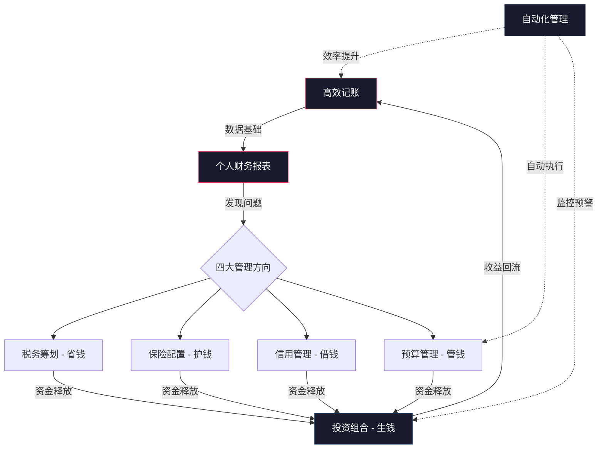
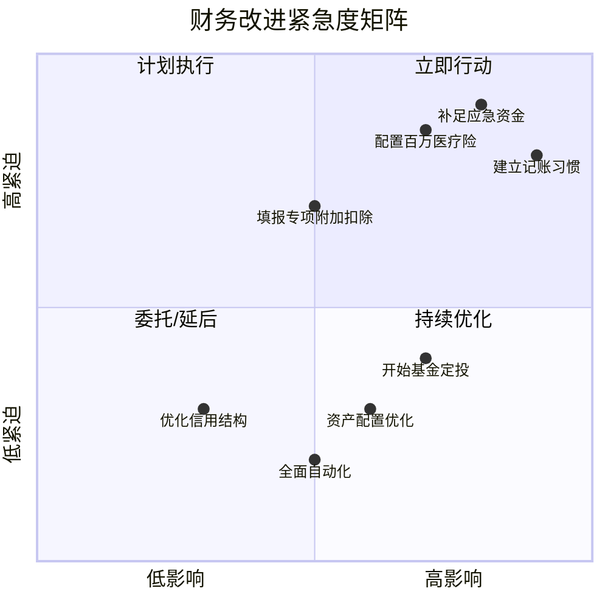
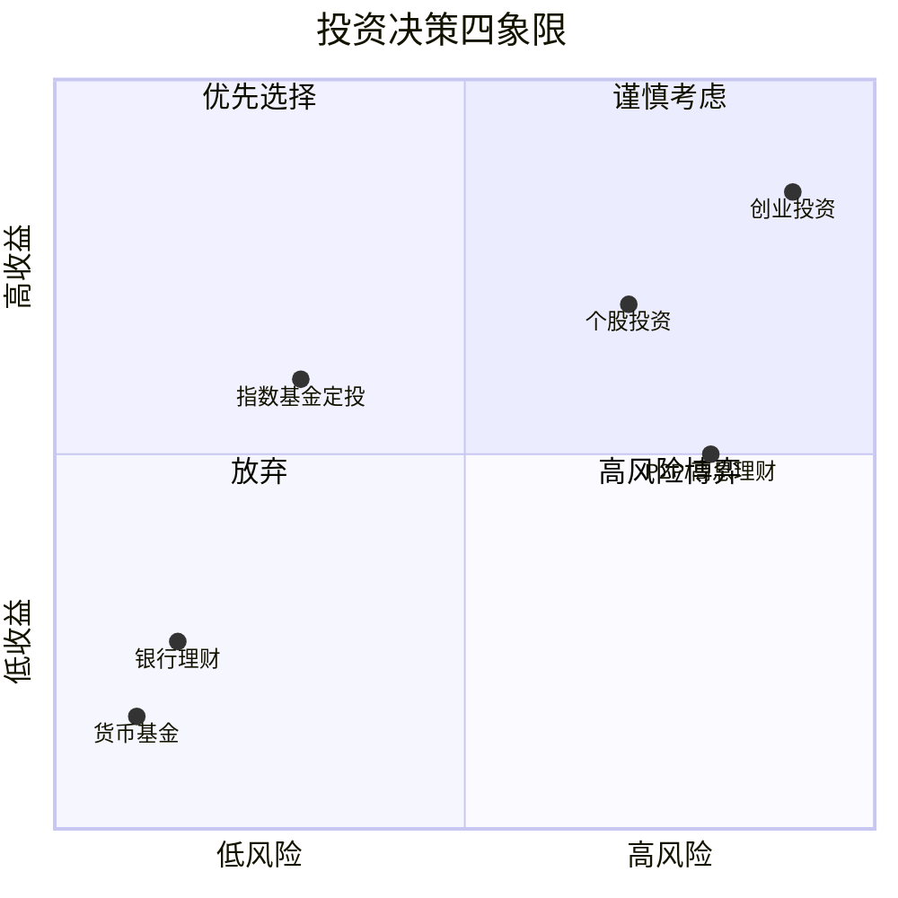

## 十、本节总结

> **道**：个人财务管理的终极目标不是"赚更多钱"，而是"用钱构建你想要的生活"。八大技巧不是八个独立工具，而是一个自我强化的系统——理解这个系统的运转逻辑，比掌握任何单个技巧都重要。
>
> **法**：系统化的路径是"记录→分析→优化→增值→自动化"。每一个环节都依赖前一个环节的数据和能力，跳过任何一步都会导致后续环节失效。
>
> **术**：每个技巧都有最低可行版本（MVP），从最低版本开始，先跑通闭环再逐步升级。
>
> **器**：工具服务于流程，不反过来。先确定你需要什么流程，再选择匹配的工具。

前面八个文件分别深入讲解了高效记账、个人财务报表、税务筹划、保险配置、信用管理、预算管理、投资组合管理和自动化管理的完整方法论。但八个独立的技巧如果不能形成合力，就会像散落的齿轮——每个都精良，却转不起来。本节的核心任务是**把八个齿轮组装成一台运转的机器**。

总结不是简单重复。本节要做七件事：

1. **建立系统性联系**：帮你看到八大技巧之间环环相扣的逻辑链条，理解"为什么必须一起用"
2. **提供自诊工具**：让你精确知道自己站在哪里、最紧迫的下一步是什么
3. **揭示组合陷阱**：那些单独看每个技巧都正确、但组合在一起时容易踩的坑
4. **给出行动路线**：从今天到一年后，分阶段、可执行的实施路径
5. **打通知行鸿沟**：用行为科学方法论帮你从"读完就忘"变成"持续执行"
6. **建立长期视角**：理解财务管理是终身技能，不是一次性项目
7. **构建元认知能力**：学会"如何思考财务问题"，而不只是"记住财务知识"

---

### 10.1 八大核心技巧知识全景图

八个技巧并非孤立存在，它们构成了一个完整的个人财务管理闭环——一个不断自我强化的"财务飞轮"。这个飞轮模型借鉴了系统动力学中的"增强回路"概念：系统的输出反过来成为输入，推动系统加速运转。



**飞轮逻辑**：记账（记录）→ 报表（分析）→ 税务/保险/信用/预算（优化）→ 投资（增值）→ 自动化（提效），形成一个不断正向循环的闭环。这个飞轮一旦转起来，每一圈都比上一圈更轻松——数据积累越多，分析越精准，优化越高效，投资越从容。

**飞轮的三个加速维度**：

| 维度 | 第一年 | 第三年 | 第五年 |
|------|--------|--------|--------|
| 时间投入 | 每天10分钟 | 每周30分钟复盘 | 每月2小时复盘 |
| 资金收益 | 税务筹划省下数千元 | 省下的钱定投已产生复利 | 复利收益可能超过当年省税额的2倍 |
| 心理状态 | 焦虑地看余额 | 从容地看报表 | 财务清晰感成为生活质量的一部分 |

**飞轮的启动条件**：飞轮不会自动转起来，它需要一个初始推力。这个推力就是"记录"——哪怕是最粗糙的记账，只要有数据流入系统，飞轮就开始转动。很多人失败的原因不是方法不对，而是等待"完美的开始条件"——等换手机再记账、等发工资再预算、等有钱了再投资。飞轮不等完美，它等启动。

**飞轮的卡死模式与修复**：飞轮也可能卡住。最典型的卡死点是"记账→报表"这个环节——很多人记了三个月账，却从未看过一次汇总，数据积累在系统里但没有转化为洞察。修复方法是设置一个"不可跳过的复盘触发器"：每月1号强制打开记账App的统计页面，只看5分钟，不需要做任何分析，仅仅是"看"这个动作就能重新激活飞轮。第二个常见卡死点是"报表→投资"——清楚了自己的财务状况，却迟迟不敢开始投资。这是"分析瘫痪"（Analysis Paralysis）的典型表现，解决方法不是继续分析，而是用一个极小的金额（100元/月）先跑通投资闭环，用行动打破心理障碍。

#### 10.1.1 每项技巧的核心定位

| 技巧 | 核心问题 | 一句话总结 | 优先级 | 推荐工具 |
|------|----------|------------|--------|----------|
| 高效记账 | 钱花到哪去了？ | 能坚持的记账方式才是最好的方式 | ★★★★★ | 钱迹（极简）、随手记（家庭）、Beancount（极客） |
| 财务报表 | 我的财务健康吗？ | 净资产和现金流是两张核心报表 | ★★★★★ | Excel/Google Sheets模板、MoneyWiz、Beancount |
| 税务筹划 | 合法地少交了多少税？ | 用足政策红利，不是偷税漏税 | ★★★★☆ | 个人所得税APP、个税计算器小程序 |
| 保险配置 | 风险来临时扛得住吗？ | 先保障后理财，先大人后小孩 | ★★★★☆ | 蜗牛保险、深蓝保、保险师 |
| 信用管理 | 我的信用值多少钱？ | 信用是最好的隐形资产 | ★★★☆☆ | 中国人民银行征信中心、各银行APP |
| 预算管理 | 钱该怎么花？ | 预算不是限制自由，是实现自由 | ★★★★★ | YNAB、随手记预算功能、Excel模板 |
| 投资组合 | 怎么让钱生钱？ | 分散风险，长期持有，复利增长 | ★★★★☆ | 天天基金、蛋卷基金、且慢 |
| 自动化管理 | 怎么省时间？ | 让系统替你执行，你只管决策 | ★★★☆☆ | 银行自动转账、基金定投计划、记账APP导入功能 |

**优先级说明**：记账、报表、预算三项标为五星，是因为它们构成"数据→分析→执行"的基础链路，没有这个基础，税务筹划不知道该优化什么，保险配置算不清保额该多少，投资决策更是缺乏依据。税务和保险四星，因为它们对中高收入群体的边际收益极高——年收入30万的人，仅专项附加扣除和个人养老金两项，每年就能省下5000-10000元税款。信用和自动化三星，不是因为不重要，而是它们更偏向"锦上添花"，在基础体系建立之后再优化效果更好。

**不同收入水平的优先级调整**：上述优先级适用于中等收入群体（月入8000-30000元）。如果你的月收入低于5000元，优先级需要调整：记账和预算的优先级不变，但投资应后置——此时建立应急基金（流动性比率≥6）比开始投资更重要，因为没有应急金的人一旦遇到突发支出就会被迫借高息贷款。如果你的月收入超过50000元，税务筹划的优先级应提升到五星——高收入群体的税务优化空间远大于中低收入群体，仅个人养老金一项每年就能省税5400-14400元。

#### 10.1.2 技巧之间的依赖关系

理解技巧之间的依赖关系，能帮你确定学习和实施的先后顺序：

| 技巧 | 依赖的前置技巧 | 被依赖的后置技巧 |
|------|----------------|------------------|
| 高效记账 | 无（入口点） | 财务报表、预算管理 |
| 财务报表 | 高效记账 | 投资组合、税务筹划 |
| 税务筹划 | 财务报表 | 投资组合（释放资金） |
| 保险配置 | 财务报表 | 投资组合（释放资金） |
| 信用管理 | 高效记账 | 投资组合（低成本融资） |
| 预算管理 | 高效记账、财务报表 | 投资组合（释放资金） |
| 投资组合 | 财务报表、预算管理 | 自动化管理 |
| 自动化管理 | 所有其他技巧 | 无（终点） |

**关键洞察**：记账是所有技巧的基石。没有记账数据，财务报表无从谈起，预算管理无法执行，投资决策缺乏依据。这也是记账被列为优先级最高的原因。但要注意一个反直觉的现象：很多人记账记了很久，却始终停留在"记录"阶段，从未进入"分析"和"优化"阶段。记账本身不是目的，从记账数据中发现财务问题、指导财务决策才是目的。如果你记了三个月账却没有看过一次汇总报表，那记账就只是在做无用功——你需要立刻进入第二步。

**依赖关系的实际应用**：当你发现自己在某个技巧上卡住时，回溯检查它的前置技巧是否到位。例如：

- 投资不敢开始？检查报表——你是否清楚自己的净资产和月现金流？如果不清楚，先完善报表再谈投资
- 预算总是超支？检查记账——你的分类体系是否合理？数据是否准确？预算需要基于真实数据才能有效
- 保险不知道买多少？检查报表——你的负债率、家庭责任、收入水平决定了保额需求

#### 10.1.3 八大技巧的协同效应——为什么必须系统化

单独使用任何一个技巧都有天花板，但多个技巧组合使用会产生远超简单叠加的协同效应。在管理学中，这被称为"1+1>2"的协同效应（Synergy Effect）——系统的整体表现优于各部分简单相加。

| 技巧组合 | 协同效应 | 实际收益 |
|----------|----------|----------|
| 记账 + 报表 | 数据变成洞察 | 从"不知道钱去哪了"到"精确知道每个分类的支出趋势" |
| 报表 + 预算 | 洞察变成行动 | 从"知道花多了"到"知道该在哪里省、省多少" |
| 预算 + 自动化 | 行动变成习惯 | 从"每月手动控制"到"系统自动执行，无需意志力" |
| 税务 + 投资 | 省下的钱生钱 | 每年省下的5000元税投入定投，10年后变成约8.2万元 |
| 保险 + 投资 | 安全地赚钱 | 有充足保障后，投资心态更从容，不会因恐慌割肉 |
| 信用 + 投资 | 低成本加杠杆 | 良好信用获取低息贷款，用于投资产生正利差 |
| 全部八项 | 财务飞轮 | 每个环节优化1%，整体效率提升远超8% |

**正面案例**：假设小王月收入15000元。单独记账，他知道自己每月花掉12000元。加上报表分析，他发现其中3000元是"不知道花在哪"的零散支出。加上预算管理，他把这3000元控制到1000元。加上税务筹划，他每年多退4800元。加上自动化，这些优化自动执行，不需要每月消耗意志力。最终他的储蓄率从20%提升到40%，多出来的钱通过定投进入市场——这就是系统化的力量。

**反面案例**：小李月收入20000元，只做了投资，把每月5000元投入股市。但他没有记账（不知道钱花到哪了），没有预算（信用卡经常分期），没有保险配置（一场感冒花掉3000元时只能从股市割肉卖出），没有信用管理（分期手续费年化13%）。结果他的投资收益7%还抵不上分期手续费13%——越投资越亏。这就是"只做一个技巧"的典型失败模式。小李的问题不在于投资能力差，而在于财务系统的其他环节全部缺位，导致投资端的收益被其他环节的漏洞吞噬。

---

### 10.2 八大技巧核心要点速览

以下是每个技巧最关键的三个洞察，用于快速回顾。详细方法论请参阅各技巧对应的独立文件。

#### 10.2.1 高效记账

**核心洞察**：记账失败的最大原因不是懒，而是流程太繁琐。45%的人因为每笔消费都要记录、选分类、加备注而放弃。记账的本质不是记流水账，而是建立对资金流向的感知能力。

**三个关键要点**：

1. **分类体系设计**：一级分类控制在7-10个（米勒定律：人类短期记忆容量为7±2个项目），推荐分类：餐饮、交通、住房、日用、娱乐、社交、学习、医疗、其他。分类原则是"互斥且穷尽"——每一笔支出有且只有一个归类
2. **记账方式选择**：不追求实时记录。批量记账法（每天5分钟集中录入）或自动导入法更适合长期坚持。"最低可行记账"策略：只记100元以上的消费，小额忽略
3. **数据应用**：每月花15分钟做一次"消费复盘"，重点关注三类异常——单笔超均值3倍的消费、某分类占比环比增幅超过20%、连续3个月增长的趋势性支出

**最常见失败模式**：记了几天就放弃 → 根本原因是流程太繁琐 → 解决方案是改用极简记账法，只记金额和分类，不追求精确到分。

#### 10.2.2 个人财务报表

**核心洞察**：90%的人不知道自己有多少净资产。两张表就够了——资产负债表告诉你"你有多少钱"，现金流量表告诉你"钱怎么流动"。

**四个健康指标速查**：

| 指标 | 公式 | 健康值 | 警戒值 |
|------|------|--------|--------|
| 储蓄率 | 月结余 ÷ 月收入 | ≥ 30% | < 10% |
| 负债率 | 总负债 ÷ 总资产 | < 40% | > 60% |
| 流动性比率 | 流动资产 ÷ 月支出 | ≥ 6 | < 3 |
| 财务自由度 | 被动收入 ÷ 月支出 | ≥ 100% | = 0% |

**一个容易忽视的细节**：自住房产按市价计入资产，但每月房贷要计入负债和现金流支出。很多人"觉得"自己资产很多（房子值500万），但扣掉房贷后净资产可能只有200万，而每月房贷支出占收入50%以上。公积金账户余额也是实实在在的资产，别忘了纳入计算。

#### 10.2.3 税务筹划

**核心洞察**：税务筹划不是偷税漏税，而是充分利用政策红利。一个普通工薪族每年可能少交数千甚至上万元的税。

**三个核心策略**：用足专项附加扣除（7项，详见个人所得税APP）→ 选择最优年终奖计税方式（单独计税 vs 并入综合所得，汇算时两种都试算选低的）→ 合理利用税收优惠账户（个人养老金每年12000元可税前扣除，边际税率20%的人每年省税2040元）。

**年终奖临界点陷阱**：年终奖存在"多发1元，多数千元税"的临界点。常见临界点为：36000元、144000元、300000元、420000元、660000元、960000元。如果你的年终奖恰好在临界点附近，与HR沟通调整发放金额。

#### 10.2.4 保险配置

**核心洞察**：保险的本质是用可控的小额支出转移不可控的大额风险。先保障，后理财；先大人，后小孩。

**四大基础险种配置公式**：

```text
重疾险保额 = 年收入 × 3~5 + 康复费用（约30万）
医疗险保额 = 100万以上（百万医疗即可）
意外险保额 = 年收入 × 10
寿险保额 = 家庭负债 + 子女教育 + 父母赡养 - 已有保障
```

**保费预算红线**：个人保费不超过年收入的5%-10%。配置优先级：社保（必须）→ 百万医疗险（优先）→ 意外险（必备）→ 定期寿险（家庭支柱优先）→ 重疾险（预算充足时配置）。

**最危险的误区**：只给孩子买保险。大人出事全家断粮——家庭经济支柱的保障永远排第一。

#### 10.2.5 信用管理

**核心洞察**：信用不只是"不逾期"那么简单。在中国，个人征信报告已经成为"经济身份证"——租房、求职、办签证都可能被查。

**三个关键行动**：设置所有信用卡自动全额还款（永不逾期）→ 信用卡使用额度控制在总额度30%以内 → 每年查询1-2次征信报告。

**最隐蔽的陷阱**：分期手续费。名义月费率0.6%，实际年化约13%，远高于表面数字。因为每期都在还本金，但手续费始终按原始金额计算。

#### 10.2.6 预算管理

**核心洞察**：预算不是限制你花钱，而是让你花在真正重要的地方。预算的本质是"主动分配"——你决定钱怎么花，而不是花完了才知道怎么没的。

**新手推荐方法**：50/30/20法则（50%必需、30%想要、20%储蓄），简单易行。进阶用零基预算法（收入-支出=0，每一分钱都有去处）。

**关键技巧**：总预算留10%的"机动金"应对意外支出。第一个月的预算一定不准，坚持三个月后才会越来越精准——不要因为第一个月偏差大就放弃。

#### 10.2.7 投资组合管理

**核心洞察**：投资最大的敌人不是市场波动，而是自己的情绪——恐惧和贪婪交替驱动，导致"高买低卖"的反向操作。

**核心原则**：分散投资（跨资产类别配置）→ 定期定额（基金定投，克服择时焦虑）→ 长期持有（至少3-5年，持有10年正收益概率接近95%）→ 控制成本（优先选费率低的指数基金）。

**复利的力量**：每月定投2000元、年化7%，30年后约243.9万元（本金72万，收益171.9万）。费率差1%，30年少赚33.6万——选低费率基金就是在赚钱。

#### 10.2.8 自动化管理

**核心洞察**：自动化的目标是把"需要意志力才能坚持的事"变成"不需要思考就能自动执行的事"。自动化不是偷懒，而是把有限的决策精力留给真正需要判断的事项。

**四层自动化体系**：收入自动化（工资到账自动分配）→ 支出自动化（账单自动扣款）→ 记账自动化（交易自动导入）→ 投资自动化（定期定额扣款）。

**安全边界**：不是所有事情都应该自动化。保险产品选择、大额投资决策、税务策略调整、信用产品申请——这些需要人工判断。

---

### 10.3 财务健康自诊断：你现在在哪里？

在制定行动计划之前，先做一次全面的自我诊断。以下诊断工具覆盖八大技巧的关键维度，帮你快速定位当前状态和最紧迫的改进方向。

#### 10.3.1 八维财务能力评估

对每个维度打分（0-5分），然后找到最薄弱的环节优先突破：

| 维度 | 0分（未开始） | 2分（起步） | 4分（成熟） | 5分（精通） | 你的得分 |
|------|-------------|------------|------------|------------|----------|
| 记账能力 | 从不记账 | 偶尔记账 | 每日记账，有分类体系 | 自动导入+定期复盘 | ☐ |
| 报表意识 | 不知道净资产 | 知道大概数字 | 定期制作完整报表 | 能从报表发现问题并行动 | ☐ |
| 税务筹划 | 从未关注 | 填报了部分扣除 | 用足所有扣除项 | 综合优化计税方式+个人养老金 | ☐ |
| 保险配置 | 没有任何商业保险 | 有社保 | 百万医疗+意外险 | 完整四险+定期检视 | ☐ |
| 信用管理 | 不知道自己的信用分 | 没有逾期 | 合理使用信用卡 | 主动优化信用结构+定期查征信 | ☐ |
| 预算管理 | 月月光 | 有大概预算 | 分类预算+定期调整 | 零基预算+自动执行 | ☐ |
| 投资能力 | 钱全在活期 | 有定期存款 | 有基金定投 | 资产配置+动态再平衡 | ☐ |
| 自动化水平 | 全手动 | 有自动还款 | 收入自动分配 | 四层自动化体系 | ☐ |

**评分解读**：

- **总分 0-10分**：起步阶段。优先解决记账和报表——这是所有后续优化的数据基础。没有数据，一切都是空谈
- **总分 11-20分**：成长阶段。已经有基础数据，开始做预算和保险配置。这个阶段最容易因为"觉得麻烦"而停滞，关键是把新动作绑定到已有习惯上
- **总分 21-30分**：进阶阶段。体系基本建立，重点优化税务和投资。这个阶段的收益开始显现——你会发现"系统在替你工作"
- **总分 31-40分**：精通阶段。追求自动化和精细化管理。此时财务管理已从"任务"变成"习惯"，你只需要月度复盘即可

**诊断后的行动原则**：不要试图同时提升所有维度。找到得分最低的1-2个维度，集中突破。根据10.1.2的依赖关系，如果低分维度依赖的前置技巧也不达标，应先补前置。

**自诊断结果的行动映射**：

| 最低分维度 | 前置检查 | 第一步行动 | 预计达标时间 |
|-----------|----------|-----------|-------------|
| 记账=0-1 | 无 | 下载钱迹，今天记第一笔 | 1个月养成习惯 |
| 报表=0-1 | 记账是否≥2分 | 列出资产负债清单，算净资产 | 1周完成首次 |
| 预算=0-1 | 记账+报表是否≥2分 | 用50/30/20法则做粗略预算 | 3个月趋于精准 |
| 税务=0-1 | 无 | 打开个人所得税APP，填报专项附加扣除 | 30分钟完成 |
| 保险=0-1 | 报表是否≥2分 | 买一份百万医疗险（年保费200-400元） | 2小时研究+购买 |
| 信用=0-1 | 无 | 查一次征信报告，设置自动还款 | 1天完成 |
| 投资=0-1 | 报表+预算是否≥2分 | 开一个基金账户，设置100元/月定投 | 1小时完成 |
| 自动化=0-1 | 其他维度是否≥2分 | 设置工资到账自动转储蓄 | 30分钟完成 |

#### 10.3.2 紧急度排序矩阵

不是所有改进都同样紧迫。用这个矩阵确定优先级：



**紧急且重要（立即行动）**：

- 建立记账习惯——所有后续优化的数据基础，不记账一切无从谈起
- 补足应急资金——至少覆盖3个月支出，没有应急金的人一次意外就可能陷入债务
- 配置百万医疗险和意外险——年保费仅1000-2000元，却能覆盖百万级医疗风险
- 填报专项附加扣除——直接省税，今天填报下个月工资就能多拿

**重要不紧急（计划执行）**：

- 开始基金定投——时间是投资最大的盟友，但不紧急到今天必须做
- 建立完整预算体系——需要先有记账数据才能制定合理预算
- 配置重疾险和寿险——保费较高，需要根据家庭情况仔细规划

**紧急不重要（可委托/简化）**：

- 自动化配置细节——可以逐步设置，不需要一次性完成
- 信用结构优化——除非近期有贷款需求，否则可以慢慢调整

**不紧急不重要（持续优化）**：

- 资产配置精细化——在投资金额较小的时候，简单配比即可
- 高端保险产品——基础保障做好后再考虑
- 投资策略进阶——先从指数基金定投开始，积累经验后再扩展

---

### 10.4 技能进阶路线图

财务管理技能不是一蹴而就的。以下是分阶段的成长路线，每个阶段聚焦不同的能力：


**各阶段关键里程碑**：

| 阶段 | 时间投入 | 核心目标 | 验证标准 |
|------|----------|----------|----------|
| 入门期 | 每天10分钟 | 养成习惯 | 连续30天记账不断 |
| 成长期 | 每周30分钟 | 看懂财务状况 | 知道净资产和月现金流，并能解读趋势 |
| 进阶期 | 每周1小时 | 优化财务结构 | 储蓄率≥20%，已有基础保障，开始投资 |
| 精通期 | 每月2小时复盘 | 被动管理 | 系统自动运行，只需月度复盘和年度调整 |

**各阶段的常见卡点与突破方法**：

| 阶段 | 常见卡点 | 突破方法 |
|------|----------|----------|
| 入门期 | 记账坚持不下去 | 降低标准，只记大额消费（100元以上）；绑定已有习惯（如刷牙前记账）；设置每晚8点手机提醒 |
| 成长期 | 报表看不懂 | 重点关注储蓄率和负债率两个指标即可，不需要理解每一个数字 |
| 进阶期 | 投资不敢开始 | 从100元/月的指数基金定投开始，先体验3个月再加大金额；记住：不投资的风险（通胀侵蚀）远大于投资的风险 |
| 精通期 | 自动化配置复杂 | 逐步实施，先做收入自动化（自动转账），再做支出自动化（自动还款），最后做投资自动化（定投） |

---

### 10.5 常见误区与纠正

在个人财务管理实践中，以下误区出现频率最高，且造成的损失最大：

| 误区 | 错误认知 | 正确认知 | 潜在损失 |
|------|----------|----------|----------|
| 记账太麻烦 | 每笔都要精确记录 | 80/20法则，抓大放小 | 因嫌麻烦直接放弃，永远不知道钱花到哪了 |
| 等有钱了再理财 | 现在收入太低没必要 | 理财的核心是习惯，不是金额 | 损失3-5年的复利时间，少赚数万元 |
| 保险是浪费钱 | 年轻健康不需要保险 | 年轻时保费最便宜，风险不可预测 | 一场大病可能掏空全部积蓄 |
| 投资就是炒股 | 买股票才算投资 | 基金定投、债券、房产都是投资 | 追涨杀跌，亏损离场 |
| 预算限制自由 | 记账和预算让人不自由 | 财务清晰带来的才是真正的自由 | 月月光，永远存不下钱 |
| 信用只跟贷款有关 | 不买房不贷款就不用管 | 信用影响就业、租房、保险费率 | 需要时才发现信用已受损，修复需要5年 |
| 税务筹划是逃税 | 合法避税等于偷税漏税 | 充分利用国家给的政策红利 | 每年多交数千元冤枉税 |
| 自动化万能 | 设置完就不用管了 | 需要定期审查和调整 | 异常交易未被发现，自动扣款失败导致逾期 |

**误区背后的深层心理机制**：

这些误区之所以普遍，是因为它们迎合了人性的弱点：

- **即时满足偏好**：记账和储蓄是延迟满足，大脑天然抗拒。进化心理学认为，人类大脑在食物稀缺的环境中演化，倾向于"现在就消耗资源"而非"留到以后"。破解方法：给储蓄设定一个具体的短期目标（如"攒够旅行基金"），让延迟满足也有即时反馈
- **损失厌恶**：担心投资亏损，却忽视不投资的隐性损失（通胀侵蚀）。行为经济学研究显示，损失带来的痛苦是同等收益带来快乐的2-2.5倍。破解方法：用定投分散入场时间，降低"一次性投入后暴跌"的心理冲击
- **现状偏见**：维持现状感觉更安全，改变需要付出认知成本。即使现状明显不合理，大多数人仍倾向于"不变"。破解方法：把"开始理财"拆解为最小行动——"今天只下载一个记账App"
- **过度自信**：认为自己不需要系统化管理，靠直觉就能搞定。研究显示，80%的人认为自己的驾驶水平高于平均水平——财务管理中的过度自信同样普遍。破解方法：用数据说话——先记一个月账，看看直觉和实际差多少

---

### 10.6 跨技巧联合应用：那些单独看都对、组合起来会踩的坑

这是很多理财书籍不会告诉你的部分——每个技巧单独执行都是正确的，但当你同时应用多个技巧时，会出现一些隐蔽的冲突和陷阱。

#### 10.6.1 典型冲突场景

**冲突一：储蓄率目标 vs 保险配置 vs 投资启动**

三个技巧都建议你拿出收入的一部分：储蓄率要求≥30%存起来，保险配置要求5%-10%买保险，投资要求开始定投。如果同时执行，可能需要拿出收入的40%-50%，对很多人来说根本不现实。

**正确做法**：分阶段叠加。第一个月只做记账，第二个月开始预算（先做到储蓄率15%），第三个月加入保险（从百万医疗+意外险开始，年保费约1000-2000元），第六个月开始定投（从储蓄中划出一部分）。不要试图一步到位——任何试图同时执行所有技巧的人，最终的结果通常是全部放弃。

**冲突二：信用管理的"合理负债" vs 预算管理的"减少负债"**

信用管理建议你保持一定的信用卡使用率（30%左右）来维护信用评分，而预算管理建议你尽量减少负债。两者看似矛盾。

**正确做法**：区分"工具性负债"和"消费性负债"。用信用卡消费后按时全额还款，这既是"合理使用信用"（维护信用评分），又不是"负债"（因为没有产生利息）。真正要避免的是分期付款和最低还款——这才是既损害预算又不真正帮助信用的做法。

**冲突三：自动化执行 vs 定期复盘调整**

自动化技巧说"设置完让系统执行"，但预算管理和投资组合管理都要求"定期调整"。如果完全自动化不复盘，预算可能早已不合理，投资组合可能已经偏离目标。

**正确做法**：自动化执行，但设置固定的复盘节点。每月1号检查自动转账是否成功，每季度检查预算合理性，每年检查投资组合再平衡。自动化不等于"set and forget"，而是"set and review periodically"。

**冲突四：保险配置的"充足保障" vs 预算管理的"控制支出"**

保险配置建议保额要充足（重疾险年收入×3-5），但充足的保额意味着更高的保费。对于月入8000元的年轻人，50万保额的重疾险年保费可能需要5000-8000元，占年收入的5%-8%。在预算已经很紧张的情况下，这笔支出可能挤占其他重要项目。

**正确做法**：采用"阶梯式配置"策略。第一步只买百万医疗险（年保费200-500元）和意外险（年保费100-300元），覆盖最大风险；第二步收入提升后加定期寿险；第三步预算充裕后再加消费型重疾险。不要为了追求"完美保障"而在入门阶段就承受过重的保费负担。

**冲突五：税务筹划的"个人养老金" vs 投资的"流动性需求"**

个人养老金每年缴存12000元可以省税，但这笔钱要到退休才能取出。对于年轻人来说，这笔钱锁定几十年的机会成本可能超过省税收益。尤其是当你的投资能力较强时，自己投资可能获得更高收益。

**正确做法**：评估自己的边际税率。如果适用10%税率，每年省税1200元，锁定到60岁——这笔钱的机会成本需要仔细计算。如果适用20%及以上税率，省税收益明显，值得投入。一个折中方案：先缴存一半（6000元），观察1-2年自己的投资收益率后再决定是否缴满。

**冲突六：信用管理"保持信用卡活跃" vs 预算管理"减少消费"**

信用管理建议每月消费占额度30%-70%以保持信用活跃，但预算管理可能要求你减少消费。如果你的信用卡额度是5万元，30%就是1.5万元——这可能远超你的预算。

**正确做法**：信用管理的"使用率"是指已用额度占总额度的比例，而不是消费金额。你可以通过以下方式降低实际使用率：申请临时额度提升、申请多张信用卡分散额度、在账单日前还款降低账面余额。关键是按时全额还款，而不是追求高消费。

#### 10.6.2 八技巧并行实施的合理时间表

| 时间 | 新增动作 | 每日新增耗时 | 累计管理动作 |
|------|----------|-------------|-------------|
| 第1周 | 下载记账App，开始记录 | 5分钟 | 1项（记账） |
| 第2周 | 梳理资产负债，计算净资产 | 10分钟（一次性） | 2项（记账+报表） |
| 第1月 | 建立分类预算，用50/30/20法则 | 5分钟 | 3项（记账+报表+预算） |
| 第2月 | 填报专项附加扣除，检查税务 | 30分钟（一次性） | 4项（+税务） |
| 第3月 | 配置百万医疗+意外险 | 2小时（一次性） | 5项（+保险） |
| 第4月 | 设置自动转账和自动还款 | 1小时（一次性） | 6项（+自动化部分） |
| 第6月 | 开始第一笔基金定投 | 30分钟（一次性） | 7项（+投资） |
| 第9月 | 完善自动化体系，导入银行账单 | 2小时（一次性） | 8项（全部完成） |

**关键原则**：每一项新技巧都要在前一项稳定运行至少2周后再加入。贪多嚼不烂是财务管理实践失败的头号原因。当你觉得某一项"已经不需要刻意关注了"（进入了习惯层），再加入下一项。

#### 10.6.3 系统性失败的诊断与修复

当你的财务管理系统出现全面崩塌时——比如连续三个月没有记账、预算完全失控、投资计划中断——不要试图"从断点继续"，而是按以下步骤重启：

**第一步：止血（当天完成）**

停止所有非必要支出，检查银行余额和信用卡账单，确保没有逾期还款。如果有逾期，立即还清并设置自动还款。这一步的目的是防止损失继续扩大。

**第二步：归因（1小时内完成）**

分析系统崩塌的根本原因。常见的五种崩塌模式：

| 崩塌模式 | 根本原因 | 修复策略 |
|----------|----------|----------|
| 记账中断 | 流程太繁琐，每次记账都要花5分钟以上 | 切换到极简记账法，只记金额和分类 |
| 预算失控 | 没有预留弹性空间，一笔超支导致放弃 | 降低预算精度，先做到大类控制 |
| 投资中断 | 市场下跌导致恐慌暂停定投 | 设置自动定投，不看收益，只看扣款是否成功 |
| 保险断缴 | 忘记续保或觉得"用不上" | 设置日历提醒，把保费视为"必须支出" |
| 全面放弃 | 一次性引入太多新动作 | 回到只做记账一件事，其他全部暂停 |

**第三步：最小重启（1天内完成）**

不要试图恢复到崩塌前的状态。只恢复一个动作——记账。其他全部暂停。连续记账两周后，再逐步恢复其他技巧。重启的关键是"降低门槛到不可能失败的程度"——哪怕只记一天的消费，也算重启成功。

**第四步：防崩设计（1周内完成）**

分析这次崩塌的触发因素，在系统中加入防崩机制：

- **如果是因为忙碌**：设置"最低可行记账"——忙的时候只记100元以上的消费，闲的时候恢复正常记账
- **如果是因为旅行/出差**：提前设置"旅行模式"——旅行期间只记录总花费，不逐笔记账
- **如果是因为情绪低落**：允许自己暂停一周，但设置"一周后自动提醒"重新开始
- **如果是因为觉得没效果**：回顾10.9的公式速查，计算这段时间的实际财务变化，用数据说服自己

---

### 10.7 快速行动清单

如果你读完本节只记住一件事，那就是：**现在就开始，从最简单的一步做起。** 以下是可以今天就完成的行动：

**今天（30分钟内）**：

1. 下载一个记账App（推荐钱迹或随手记），录入今天的第一笔消费
2. 列出你所有的资产和负债，算出你的净资产
3. 查看你的社保和公积金缴纳情况

**本周内（2小时内）**：

1. 整理过去一个月的收支记录，算出你的储蓄率
2. 查看个人征信报告（中国人民银行征信中心，每年两次免费）
3. 确认你的专项附加扣除是否已全部填报

**本月内（4小时内）**：

1. 建立一套适合自己的分类体系，开始持续记账
2. 制作第一张月度财务报表，了解自己的财务全貌
3. 检查现有保险配置是否覆盖了基础风险

**本季度内**：

1. 建立完整的预算体系（推荐50/30/20法则起步）
2. 配置好基础保险（百万医疗+意外险）
3. 开始第一笔基金定投（哪怕每月只投100元）
4. 设置银行自动转账，实现收入自动分配

**行动追踪表**：

| 行动项 | 完成日期 | 完成状态 | 备注 |
|--------|----------|----------|------|
| 下载记账App并记录第一笔 |  | ☐ |  |
| 计算净资产 |  | ☐ |  |
| 查看社保公积金 |  | ☐ |  |
| 计算储蓄率 |  | ☐ |  |
| 查询个人征信 |  | ☐ |  |
| 填报专项附加扣除 |  | ☐ |  |
| 建立分类体系 |  | ☐ |  |
| 制作月度报表 |  | ☐ |  |
| 检查保险配置 |  | ☐ |  |
| 建立预算体系 |  | ☐ |  |
| 配置基础保险 |  | ☐ |  |
| 开始基金定投 |  | ☐ |  |
| 设置自动转账 |  | ☐ |  |

---

### 10.8 中国理财日历：关键时间节点

财务管理有很强的时间属性——错过某些窗口期，当年的优惠就无法补救。以下是一份按月排列的中国理财日历：

| 月份 | 关键事项 | 具体操作 | 错过的代价 |
|------|----------|----------|-----------|
| 1月 | 年度税务规划 | 更新专项附加扣除、确认个人养老金缴存计划 | 全年少扣一个月 |
| 2月 | 年终奖发放 | 确认计税方式（单独/并入），检查临界点 | 多交数千元税 |
| 3-6月 | 个税汇算清缴 | 登录个税APP，试算两种计税方式，提交退税 | 无法补退税 |
| 5月 | 保险续保检查 | 检查保单到期日，评估是否更换产品 | 保障中断 |
| 6月 | 半年财务复盘 | 制作半年度资产负债表，评估预算执行情况 | 问题积累到年底 |
| 9月 | 孩子开学季 | 教育金支出规划，检查子女教育扣除 | 预算超支 |
| 10月 | 国庆消费控制 | 预设假期预算，避免冲动消费 | 月度预算崩溃 |
| 11月 | 双十一冷静期 | 提前列购物清单，区分"需要"和"想要" | 冲动消费 |
| 12月 | 年终查漏补缺 | 确认个人养老金是否缴满、检查全年扣除是否用足 | 次年无法补缴 |
| 12月 | 下年预算编制 | 基于全年数据制定下年预算 | 新年无预算可执行 |

**月度固定事项**：

```text
每月1号：
  ├── 上月财务复盘（15分钟）
  ├── 对比预算与实际支出
  ├── 检查自动转账/还款是否成功
  └── 导入上月银行账单到记账App

每季度末：
  ├── 检查投资组合再平衡（偏差>5%则调整）
  ├── 检查保险配置是否需要调整
  └── 更新资产负债表
```

**年度大事记深度指南**：

**个税汇算清缴（3-6月）实操要点**：这是全年最重要的税务操作。很多人只填报了基础信息就提交了，白白损失了几千块。完整操作流程：

1. 打开个人所得税APP → 综合所得年度汇算
2. 核对全年收入明细（特别注意：是否有漏报的专项扣除、是否有重复计税的收入）
3. 分别试算"年终奖单独计税"和"并入综合所得"两种方式，选择税额更低的
4. 检查专项附加扣除是否完整：子女教育（有孩子吗？）、继续教育（考过证吗？）、住房贷款（有房贷吗？）、住房租金（在租房吗？）、赡养老人（父母满60了吗？）、婴幼儿照护（有3岁以下孩子吗？）、大病医疗（年度自付超15000了吗？）
5. 检查个人养老金扣除：如果去年缴存了个人养老金，确保已填报扣除
6. 提交申请，等待退税到账（通常2-4周）

一个容易被忽略的细节：如果你有劳务报酬、稿酬等非工资收入，在汇算时这些收入可能适用比预扣预缴更低的税率，意味着你能拿回一笔退税。

---

### 10.9 核心公式速查

```text
# 财务健康四指标
净资产 = 总资产 - 总负债
储蓄率 = (月收入 - 月支出) / 月收入 × 100%
负债率 = 总负债 / 总资产 × 100%
流动性比率 = 流动资产 / 月支出
财务自由度 = 被动收入 / 月支出 × 100%

# 保险配置公式
重疾险保额 = 年收入 × 3~5 + 30万(康复费)
寿险保额 = 家庭负债 + 子女教育 + 赡养费用 - 已有保障
个人保费预算 = 年收入 × 5%~10%

# 投资计算公式
复利终值 = 本金 × (1 + 年化收益率)^年数
定投终值 = 每月投入 × [(1+月收益率)^月数 - 1] / 月收益率
72法则：资产翻倍所需年数 ≈ 72 ÷ 年化收益率(%)

# 税务筹划速算
个人养老金年省税 = 12000 × 适用边际税率
专项附加扣除年省税 = 扣除总额 × 适用边际税率

# 信用管理公式
信用卡真实年化 ≈ 名义月费率 × 12 × 2（近似值）
实际年化 ≈ 名义月费率 × 24 × 期数 / (期数 + 1)（精确值）

# 净资产参考基准
参考净资产 = (年龄 × 年收入) / 10
```

**公式应用示例**：

假设你月收入15000元，月支出10000元，总资产50万，总负债20万，流动资产8万，被动收入0元：

```text
净资产 = 500000 - 200000 = 300000元
储蓄率 = (15000 - 10000) / 15000 × 100% = 33.3% ✓（健康）
负债率 = 200000 / 500000 × 100% = 40% ⚠️（临界值，需关注）
流动性比率 = 80000 / 10000 = 8 ✓（健康，超过6个月）
财务自由度 = 0 / 10000 × 100% = 0% ⚠️（需增加被动收入）
参考净资产 = 30 × 180000 / 10 = 540000元 → 实际30万，差距24万

结论：基础健康，但负债率偏高且缺乏被动收入。
行动：优先偿还部分负债降低负债率，同时开始基金定投建立被动收入。
```

再看一个案例：月入8000元的25岁年轻人，月支出6500元，总资产5万，总负债0，流动资产3万：

```text
净资产 = 50000 - 0 = 50000元
储蓄率 = (8000 - 6500) / 8000 × 100% = 18.8% ⚠️（需改进，目标≥20%）
负债率 = 0 / 50000 × 100% = 0% ✓（无负债，优秀）
流动性比率 = 30000 / 6500 = 4.6 ⚠️（接近警戒线，目标≥6）
参考净资产 = 25 × 96000 / 10 = 240000元 → 实际5万，差距19万（年龄小，正常）

结论：无负债是优势，但储蓄率偏低，流动性不足。
行动：优化支出结构，将储蓄率提升到20%以上；优先补充流动资产到6个月支出水平。
```

---

### 10.10 从"知道"到"做到"的转化框架

很多人读完理财书籍后依然无法行动，根本原因是缺乏从知识到行为的转化机制。行为科学告诉我们，"知道"和"做到"之间隔着一道鸿沟——这道鸿沟不是靠"意志力"能填平的，而是需要系统性的转化机制。

**知行转化的四步法**：


| 层级 | 描述 | 关键行动 | 时间跨度 | 退出标准 |
|------|------|----------|----------|----------|
| 认知层 | 理解为什么要这么做 | 阅读本章，理解每个技巧的原理 | 1-2天 | 能向别人解释清楚每个技巧的价值 |
| 技能层 | 掌握具体怎么做 | 按照操作指南实际执行 | 1-4周 | 能独立完成各项操作，不需要查指南 |
| 习惯层 | 不需要提醒也能坚持 | 设置自动化，减少意志力消耗 | 1-3个月 | 中断一周会感到"缺了点什么" |
| 本能层 | 成为生活的一部分 | 只需月度复盘，日常无需刻意关注 | 6个月以上 | 财务管理像刷牙一样自然 |

**从技能层到习惯层的关键突破**：

习惯的养成需要三个要素：触发条件、执行行为、正向反馈。缺了任何一个，习惯都养不成。

```text
以"每日记账"为例：
  触发条件：每天晚上刷牙前（绑定已有习惯，利用"习惯叠加"原理）
  执行行为：打开记账App，记录当天消费（控制在2分钟内）
  正向反馈：看到本月累计消费金额，感受掌控感

以"每月复盘"为例：
  触发条件：每月1号早上（固定时间，利用"时间锚点"）
  执行行为：打开财务报表，对比上月数据（控制在15分钟内）
  正向反馈：发现储蓄率提升，净资产增长

以"基金定投"为例：
  触发条件：每月工资到账后第2天（自动扣款，无需触发）
  执行行为：系统自动执行（零操作）
  正向反馈：每季度查看一次收益曲线
```

**最小可行系统（MVS）**：不要试图一开始就建立完美的财务管理系统。先建立一个"最小可行系统"——只包含最核心的元素，能跑通闭环即可。等这个最小系统稳定运转后，再逐步升级。

```text
最小可行系统的三个组件：
  1. 一个记账App（只记金额和分类，不追求精确）
  2. 一张净资产清单（在手机备忘录里列出资产负债）
  3. 一个自动转账规则（工资到账自动转10%到储蓄账户）

这个系统每天只需要2分钟，但它跑通了"记录→分析→执行"的闭环。
从这个最小系统开始，逐步扩展到完整的八大技巧体系。
```

**失败后的重启策略**：

中断是正常的，关键是快速重启：

1. **不要追求完美**：中断一天不等于失败，第二天继续即可。研究显示，习惯养成过程中平均会中断3-5次
2. **降低重启门槛**：如果记账中断了一周，不要试图补录所有记录，只记今天的。试图"补作业"往往导致更大的拖延
3. **分析中断原因**：是流程太繁琐？还是没有触发条件？还是正向反馈不足？针对性调整
4. **设置"最小行动"**：即使再忙，也要完成最小行动（如只记一笔消费）。保持连续性比保持完美更重要
5. **建立"问责机制"**：找一个也在记账的朋友互相检查，或者在社交平台公开打卡。外部压力是维持习惯的有效手段

**当需要专业帮助时**：

个人财务管理的大部分内容可以自学自用，但以下场景建议寻求专业人士帮助：

- **税务筹划**：年收入超过30万、有多种收入来源（工资+股权+副业+投资）、或涉及跨境收入时，建议咨询税务师
- **保险配置**：家庭年收入超过50万、有复杂家庭结构（如再婚家庭、多子女）、或有特殊健康状况时，建议咨询独立保险经纪人（不是保险代理人）
- **投资规划**：可投资资产超过100万、或有特殊投资需求（如海外资产配置、家族信托）时，建议咨询持牌理财规划师
- **法律问题**：涉及婚姻财产分割、遗产规划、商业纠纷时，建议咨询律师

**选择专业人士的标准**：优先选择按小时收费或按项目收费的顾问，避免选择按产品佣金收费的销售。前者利益与你一致，后者利益与销售业绩挂钩。

---

### 10.11 财务管理的长期视角

个人财务管理不是一次性任务，而是伴随一生的持续过程。理解这一点，能帮你避免"三分钟热度"——把财务管理当成一个需要长期经营的系统，而不是一个短期项目。

#### 10.11.1 生命周期与财务重点的变化

| 人生阶段 | 年龄段 | 财务重点 | 核心策略 | 最大风险 |
|----------|--------|----------|----------|----------|
| 起步期 | 22-30岁 | 建立习惯，积累第一桶金 | 储蓄率>30%，开始定投 | 过度消费，错失复利窗口 |
| 成长期 | 30-40岁 | 资产快速积累，家庭责任增加 | 提升收入，优化配置 | 过度负债（房贷+车贷+消费贷叠加） |
| 成熟期 | 40-55岁 | 财富稳健增长，为退休做准备 | 降低风险，增加被动收入 | 中年失业风险，子女教育支出压力 |
| 退休期 | 55岁以上 | 财富保值，享受生活 | 稳健配置，控制支出 | 医疗支出侵蚀积蓄，通胀侵蚀购买力 |

**各阶段的关键财务决策**：

**起步期（22-30岁）**：

- 是否租房还是买房？——如果首付需要掏空家庭积蓄且月供超过收入40%，建议先租房积累
- 是否要开始投资？——越早越好，哪怕每月只投100元，建立投资习惯比金额更重要
- 如何处理学生贷款？——优先还款（利率通常5%-8%），同时建立应急基金

**成长期（30-40岁）**：

- 如何平衡房贷和投资？——如果房贷利率低于4%，可以适当减少提前还款，将资金投入长期投资
- 如何规划子女教育金？——从孩子出生开始定投教育基金，每月500-1000元，18年后可观
- 如何应对收入波动？——副业收入不稳定时，以工资收入为基础做预算，副业收入全部存入投资账户

**成熟期（40-55岁）**：

- 如何应对中年失业风险？——保持6个月以上的应急资金，持续学习新技能，维护职业人脉
- 如何规划退休？——计算退休后每月需要多少被动收入，倒推现在需要积累多少资产
- 如何处理父母赡养？——提前规划赡养费用，考虑为父母购买医疗险和意外险

**退休期（55岁以上）**：

- 如何避免"人还在，钱没了"？——采用"4%法则"——每年从投资组合中取出不超过4%用于生活开支，理论上可以维持30年以上
- 如何应对医疗支出？——充分利用医保、购买补充医疗险、建立专项医疗基金
- 如何规划遗产？——提前立遗嘱，考虑资产传承的税务影响

#### 10.11.2 跨越经济周期的财务韧性

经济有繁荣也有衰退，财务管理系统需要具备韧性：

- **保持充足流动性**：无论何时，至少保留6个月支出的应急资金。经济下行时，流动性比收益率更重要。2020年疫情期间，很多"高收益投资者"因为没有应急资金被迫割肉卖出
- **分散投资**：不把所有资产押注在单一类别或市场。2022年股债双杀的教训告诉我们，真正的分散需要跨资产类别甚至跨地域（如同时配置A股、美股、债券、黄金）
- **控制负债**：负债率保持在合理水平，避免过度杠杆。经济繁荣时加的杠杆，在衰退时会成为致命负担。一个安全线：月还款额不超过月收入的30%
- **持续学习**：经济环境变化时，及时调整策略。过去有效的策略（如买房必赚）不代表未来继续有效。保持对宏观经济的基本关注，每季度花1小时阅读财经简报

**经济下行期的财务应急清单**：

```text
立即检查：
  ├── 应急资金是否足够6个月支出？
  ├── 是否有即将到期的债务需要偿还？
  ├── 保险保障是否充足？
  └── 投资组合是否过于集中在单一资产？

短期调整（1-3个月）：
  ├── 削减非必要支出，提高储蓄率
  ├── 暂停高风险投资，增加现金和债券比例
  ├── 检查是否有副业或兼职机会
  └── 与贷款机构沟通，了解是否有延期还款政策

长期策略（3-12个月）：
  ├── 持续定投（市场下跌时定投成本更低）
  ├── 学习新技能，提升职业竞争力
  ├── 重新评估职业规划和收入来源
  └── 保持心理健康，避免恐慌性决策
```

#### 10.11.3 家庭财务管理的特殊考量

当财务管理从个人扩展到家庭时，需要额外考虑以下因素：

**夫妻财务管理模式**：

| 模式 | 描述 | 优点 | 缺点 | 适合场景 |
|------|------|------|------|----------|
| 完全合并 | 所有收入合并管理 | 透明度高，便于规划 | 缺乏个人自由 | 收入相近、消费观一致的夫妻 |
| 完全独立 | 各自管理各自收入 | 个人自由度高 | 难以规划共同目标 | 收入差距大、消费观差异大的夫妻 |
| 混合模式 | 共同账户+个人账户 | 平衡透明与自由 | 需要协商规则 | 大多数夫妻的最佳选择 |

**混合模式的推荐做法**：

1. 设立一个共同账户，双方按收入比例（如各30%）转入，用于房贷、家庭日常开支、子女教育等共同支出
2. 各自保留个人账户，用于个人消费和自由支配
3. 设立一个共同投资账户，用于家庭长期投资目标
4. 每月一次"家庭财务会议"（30分钟），回顾上月支出，讨论下月计划

**子女财商教育**：

- **3-6岁**：教孩子认识钱的概念——用现金买东西，让孩子看到"钱换东西"的过程
- **7-12岁**：给孩子零花钱，教孩子做预算——每周固定金额，花完就没有，让孩子学会取舍
- **13-18岁**：教孩子记账和储蓄——让孩子参与家庭财务讨论，理解收入和支出的关系
- **18岁以上**：教孩子投资基础——用少量资金（如压岁钱）开始基金定投，体验复利的力量

---

### 10.12 财务决策框架：面对选择时如何判断

在日常生活中，你会不断面临财务决策——要不要买这个？要不要投这个？要不要借这笔钱？以下框架可以帮你做出更理性的判断。

#### 10.12.1 消费决策三问法

面对每一笔非必要消费，问自己三个问题：

1. **这笔消费的"每小时成本"是多少？**——将消费金额除以你的时薪。例如时薪50元，一双鞋800元，相当于工作16小时。你愿意用16小时的劳动换这双鞋吗？
2. **这笔消费的"使用频率"是多少？**——将消费金额除以预计使用次数。800元的鞋如果穿200次，每次4元；如果只穿10次，每次80元。高频使用的物品更值得投资
3. **这笔消费的"机会成本"是多少？**——这笔钱如果投入定投，10年后值多少？800元年化7%定投10年约1573元。你愿意放弃这个未来的收益来换取现在的消费吗？

**三问法的进阶应用**：对于大额消费（如电子产品、奢侈品），还可以加上第四问——**"等待72小时后还想要吗？"**行为经济学中的"冷静期"研究表明，72小时的等待能过滤掉70%以上的冲动消费。把想买的东西加入购物车，设一个72小时后的提醒，到时候再决定。

#### 10.12.2 投资决策四象限法

面对每一个投资机会，从两个维度评估：



- **低风险高收益（优先选择）**：指数基金定投、税收优惠账户
- **低风险低收益（基础配置）**：货币基金、银行存款、国债
- **高风险高收益（谨慎考虑）**：个股投资、创业投资——仅用"输得起"的钱
- **高风险低收益（坚决放弃）**：P2P、高息理财、不明来源的"保本高收益"产品

**识别投资骗局的五个红旗信号**：

1. 承诺"保本保收益"——任何正规投资都不可能保证收益
2. 年化收益超过10%却声称"无风险"——风险和收益永远成正比
3. 需要"拉人头"才能获得更高收益——这是传销的典型特征
4. 无法提供正规金融牌照或监管备案
5. 资金去向不透明，无法查询底层资产

#### 10.12.3 借贷决策原则

面对借贷决策，遵循以下原则：

- **好债**：利率低于投资收益率、用于购买增值资产（如房贷买自住房、教育贷款提升技能）
- **坏债**：利率高于投资收益率、用于购买贬值物品（如信用卡分期买手机、消费贷旅游）
- **安全线**：月还款总额不超过月收入的30%
- **底线**：绝不用借来的钱投资——即使投资收益看起来高于借贷利率，因为投资收益不确定而借贷成本确定

**好债和坏债的判断矩阵**：

| 场景 | 利率 | 用途 | 性质 | 建议 |
|------|------|------|------|------|
| 房贷（首套自住） | 3%-4% | 自住刚需 | 好债 | 可以借，月供不超过收入30% |
| 教育贷款 | 4%-6% | 提升职业技能 | 好债 | 可以借，但确保投资回报期合理 |
| 信用卡分期 | 13%-18% | 消费 | 坏债 | 坚决不借，除非极端紧急 |
| 消费贷旅游 | 8%-15% | 享乐 | 坏债 | 坚决不借 |
| 经营贷创业 | 4%-8% | 创业投资 | 好债（有条件） | 仅当有成熟商业计划且能承受失败 |

---

### 10.13 激励与持续动力：给未来的自己写一封信

行为科学研究表明，"与未来自我的连接"（Future Self-Continuity）是维持长期行为的强大驱动力。哈佛大学心理学家Hal Hershfield的研究发现，那些能清晰想象未来自我的人，储蓄率比对照组高出30%以上。

**具体做法**：

现在就给5年后的自己写一封信，描述你希望达到的财务状态。信中应包含以下具体信息：

1. **数字目标**：你希望5年后的净资产是多少？储蓄率达到多少？被动收入占月支出的比例？
2. **生活目标**：你希望实现哪些用钱支撑的目标——买房、结婚、子女教育、创业、旅行？
3. **习惯目标**：你希望养成哪些财务习惯？每天花多少时间管理财务？
4. **情绪目标**：你希望在财务上感受到什么——从容、自信、安全感？

**关键细节**：信中的数字要具体。"我希望变得有钱"没有激励效果，"我希望净资产达到50万，每月被动收入3000元"才有。具体的目标能激活大脑的"目标梯度效应"——距离目标越近，行动力越强。

把这封信存在手机备忘录里，每月复盘时打开看一次。当你看到自己距离目标越来越近（或发现偏离目标），都会产生强烈的行动驱动力。

**进阶做法——"可视化进度条"**：

在手机或电脑上创建一个简单的进度追踪：用Excel画一个净资产趋势图，每月更新一个数据点。当你看到曲线在稳步上升时，财务管理的动力会自我强化。如果曲线走平或下降，就是及时的预警信号。

---

### 10.14 元认知能力培养：学会"如何思考财务问题"

前面的所有内容都是"知识"和"方法"——教你具体怎么做。但最高层次的能力是"元认知"——学会"如何思考财务问题"，形成自己的判断框架。

**元认知的三个层次**：

**第一层：知道自己的认知偏差**

每个人都容易犯特定的财务认知错误。你需要识别自己的"盲点模式"：

| 认知偏差 | 表现 | 对策 |
|----------|------|------|
| 锚定效应 | 被第一个看到的数字影响判断（如标价1000元的鞋打5折觉得便宜，实际可能不值500元） | 做消费决策前，先查市场价格区间 |
| 确认偏误 | 只关注支持自己观点的信息（如只看"买房必赚"的文章） | 主动寻找反对意见，问自己"什么情况下这个判断是错的" |
| 沉没成本谬误 | 因为已经投入了钱/时间而继续投入（如亏损的股票不肯卖） | 只问"如果今天重新选择，我还会投吗" |
| 从众心理 | 别人都在买我也要买（如追热点基金、炒概念股） | 记住：当所有人都在买的时候，风险已经很高了 |
| 过度自信 | 认为自己的判断比平均水平更准 | 用数据记录自己的决策和结果，定期回顾 |

**第二层：建立财务问题的分析框架**

遇到任何财务决策时，用以下框架分析：

```text
1. 定义问题：我真正需要解决的是什么？（表面需求 vs 真实需求）
2. 收集数据：我有哪些相关的数据？（记账数据、市场数据、政策信息）
3. 评估选项：有哪些可行的方案？每个方案的收益、风险、成本是什么？
4. 检验假设：我做了哪些假设？这些假设成立吗？
5. 做出决策：选择最优方案，设定检查节点
6. 回顾复盘：结果与预期是否一致？偏差的原因是什么？
```

**第三层：形成自己的财务哲学**

随着经验积累，你应该逐渐形成自己的财务价值观——什么对你来说是"够"的？你愿意为"安全感"付出多少成本？你愿意为"自由"承担多少风险？

这些问题没有标准答案，但必须有你自己的答案。没有财务哲学的人，会在每个决策点上反复纠结；有财务哲学的人，决策快速且一致。

一些值得思考的问题：

- 你追求的是"财务安全"（不担心意外）还是"财务自由"（不用为钱工作）？两者的路径完全不同
- 你愿意用多少当下的享受换取未来的财务自由？答案不是"越多越好"——过度节俭和过度消费一样有害
- 你对"不确定性"的容忍度有多高？这决定了你的投资策略应该偏保守还是偏积极
- 你的财务目标是为了"自己"还是"家人"？这会影响保险配置和遗产规划的优先级

---

### 结语：八个齿轮，一台机器

回顾整个核心技巧部分，我们从八个独立的技巧出发——记账、报表、税务、保险、信用、预算、投资、自动化——最终组装成一台完整的财务管理系统。这台机器的核心逻辑可以用一句话概括：

**用数据驱动决策，用系统替代意志力，用时间放大复利。**

八个齿轮缺一不可。没有记账，其他七个齿轮都没有数据输入；没有报表，你不知道机器运转是否正常；没有预算，钱会从每个缝隙漏掉；没有保险，一次意外就能让整台机器停转；没有税务筹划，你在给机器"漏油"；没有信用管理，你在为未来的融资埋雷；没有投资，机器空转不产出；没有自动化，你就是那个最容易疲劳的零件。

但更重要的是理解一个底层真理：**个人财务管理的终极目标不是"数字好看"，而是"生活更好"。** 净资产增长是为了安全感，储蓄率提升是为了选择权，投资收益是为了自由度。如果你在财务管理的过程中感到痛苦、焦虑、被束缚，那一定是哪里出了问题——要么是目标设错了，要么是方法太僵化了。

财务管理应该像呼吸一样自然——你不会因为"必须呼吸"而感到压力，因为呼吸已经成了本能。当记账变成刷牙前的习惯，当复盘变成每月1号的仪式，当定投变成工资到账后的自动动作——到那一天，你会发现财务清晰感已经成为生活质量的一部分，而不仅仅是手机里的一个数字。

最后回到那句话：**不要追求完美，先追求开始。** 你今天的第一个行动，比明天最完美的计划更有价值。

> 回顾本节，我们完成了核心技巧部分的知识全景梳理、八维自诊断工具、跨技巧联合应用的陷阱分析、系统性失败的修复方案、分阶段实施路线图、中国理财日历、核心公式速查、从知识到行为的转化框架、以及元认知能力培养。如果你已经完成了10.3.1的自诊断，现在就去做10.7中"今天"的三项行动——30分钟后，你就已经迈出了财务管理的第一步。
