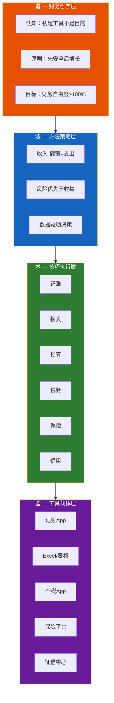
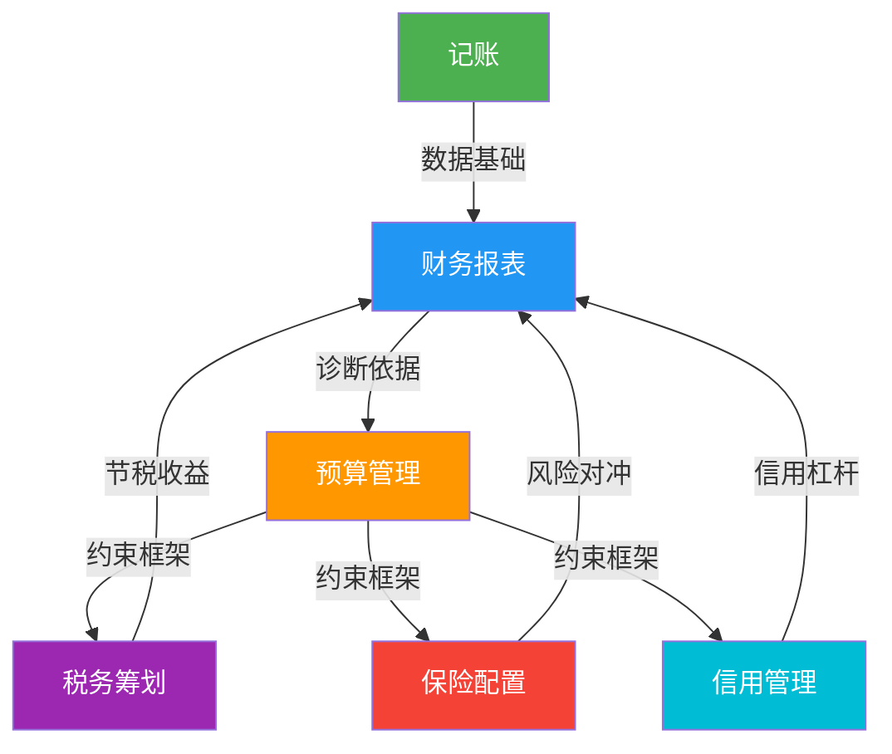
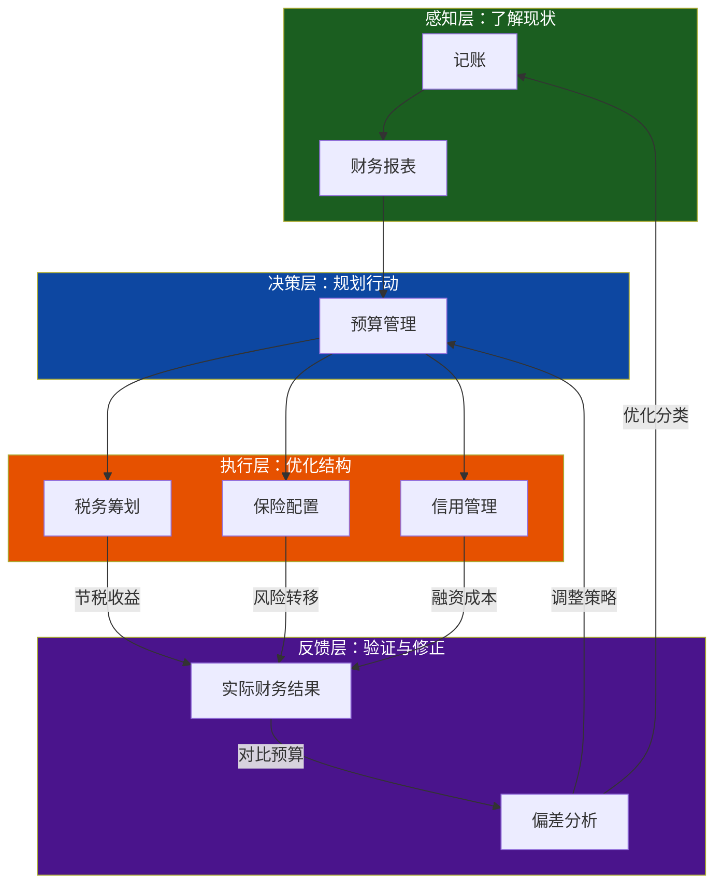
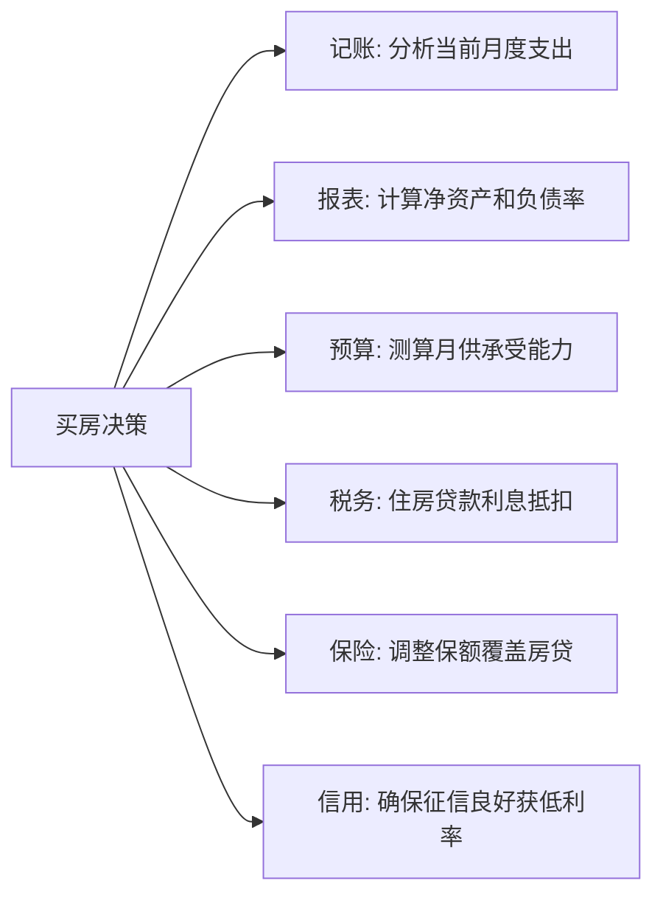
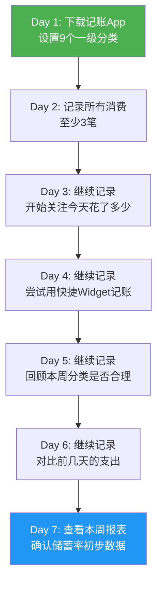
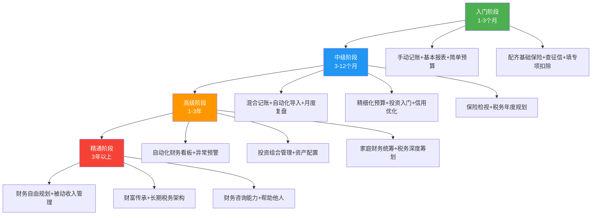
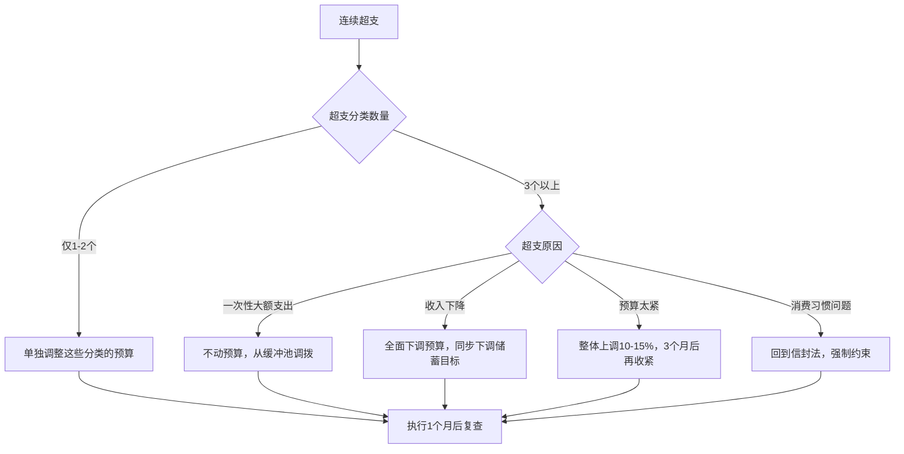
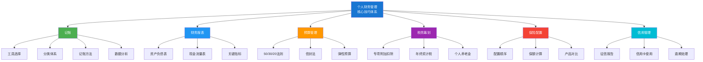
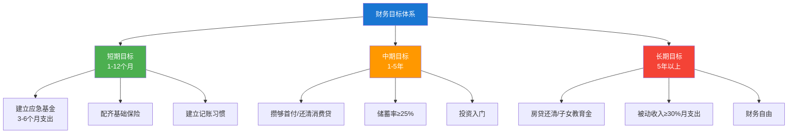

## 七、核心技巧总结：构建你的个人财务管理系统

前面六节分别讲解了个人财务管理的六大核心技巧——记账、财务报表、税务筹划、保险配置、信用管理、预算管理。每项技巧都是独立的"工具"，但工具之间如果缺乏协同，就像一把散落的零件，无法发挥真正的价值。

本节要做五件事：**第一**，帮你建立全局视角，理解六大技巧如何构成一个完整的管理闭环；**第二**，提供可落地的行动路线，让理论变成习惯；**第三**，给出一套可执行的自动化工具和模板，让你用最少的时间获得最好的管理效果；**第四**，针对家庭财务、人生重大决策等复杂场景给出协同方案；**第五**，指出那些最容易踩的坑，让你少走弯路。

在正式开始之前，先用下面的自评工具给自己做一个"财务管理水平诊断"，它会帮你找到当前最需要优先提升的领域。

### 7.0 起步：财务管理水平自评

在学习任何系统之前，了解自己的起点至关重要。以下自评问卷包含30道题，覆盖六大技巧的每个维度。诚实地回答每道题，不要自我美化——自评的价值在于准确性，不在于分数高低。

#### 自评问卷

**记账维度（5题，每题1分）**

| 序号 | 问题 | 是 | 否 |
|------|------|---|---|
| 1 | 过去30天内，你是否有超过20天记录了当日消费？ | +1 | 0 |
| 2 | 你是否有一套明确的消费分类体系（5个以上分类）？ | +1 | 0 |
| 3 | 你能否在30秒内说出上月总支出是多少？ | +1 | 0 |
| 4 | 你是否知道上月支出中占比最高的三个分类及其金额？ | +1 | 0 |
| 5 | 你是否有定期（至少每月一次）回顾记账数据的习惯？ | +1 | 0 |

**财务报表维度（5题，每题1分）**

| 序号 | 问题 | 是 | 否 |
|------|------|---|---|
| 6 | 你是否知道自己当前的净资产（资产减负债）大约是多少？ | +1 | 0 |
| 7 | 你是否在过去6个月内更新过资产负债表？ | +1 | 0 |
| 8 | 你是否知道自己的月度储蓄率是多少？ | +1 | 0 |
| 9 | 你是否清楚自己的负债率（总负债占总资产的比例）？ | +1 | 0 |
| 10 | 你是否知道自己如果失业，现有资金能维持几个月的生活？ | +1 | 0 |

**税务筹划维度（5题，每题1分）**

| 序号 | 问题 | 是 | 否 |
|------|------|---|---|
| 11 | 你是否知道自己适用的个人所得税税率是多少？ | +1 | 0 |
| 12 | 你是否填报了所有适用的专项附加扣除？ | +1 | 0 |
| 13 | 你是否对比过年终奖单独计税和合并计税的税额差异？ | +1 | 0 |
| 14 | 你是否了解个人养老金账户的节税效果？ | +1 | 0 |
| 15 | 你是否在年度汇算时收到过退税或发现过应退金额？ | +1 | 0 |

**保险配置维度（5题，每题1分）**

| 序号 | 问题 | 是 | 否 |
|------|------|---|---|
| 16 | 你是否确认过自己的社保缴纳状态是否正常？ | +1 | 0 |
| 17 | 你是否购买了百万医疗险或同类型商业医疗险？ | +1 | 0 |
| 18 | 你是否知道自己购买的所有保险产品的保额总和？ | +1 | 0 |
| 19 | 你是否计算过自己的总保费占年收入的比例？ | +1 | 0 |
| 20 | 你是否知道如果自己发生重大疾病，保险能赔付多少？ | +1 | 0 |

**信用管理维度（5题，每题1分）**

| 序号 | 问题 | 是 | 否 |
|------|------|---|---|
| 21 | 你是否在过去12个月内查过自己的征信报告？ | +1 | 0 |
| 22 | 你是否为所有信用卡和贷款设置了自动还款？ | +1 | 0 |
| 23 | 你是否知道自己的信用卡使用率（已用额度占总额度的比例）？ | +1 | 0 |
| 24 | 你是否有过逾期记录？（有=0，没有=1） | +1 | 0 |
| 25 | 你是否知道分期付款的实际年化利率大约是多少？ | +1 | 0 |

**预算管理维度（5题，每题1分）**

| 序号 | 问题 | 是 | 否 |
|------|------|---|---|
| 26 | 你是否有明确的月度预算计划？ | +1 | 0 |
| 27 | 你是否知道自己每月在各分类上的预算上限？ | +1 | 0 |
| 28 | 在过去3个月中，你是否有至少2个月的支出接近或低于预算？ | +1 | 0 |
| 29 | 你是否有明确的储蓄目标和对应的预算安排？ | +1 | 0 |
| 30 | 你是否预留了弹性预算来应对意外支出？ | +1 | 0 |

#### 评分解读与优先行动

将30题得分相加，对照以下分级：

| 分数段 | 等级 | 含义 | 优先行动 |
|--------|------|------|----------|
| 0-5分 | 🟥 财务管理空白期 | 基本没有系统化的财务管理 | 直接进入7.4节的30天路线图，从Day 1开始 |
| 6-12分 | 🟧 初步意识期 | 有零散的管理动作，但缺乏系统 | 优先补齐得分最低的2个维度，其他维度暂搁 |
| 13-20分 | 🟨 基础运转期 | 核心框架已建立，但细节待完善 | 重点优化得分最低的1个维度，同时巩固其他维度 |
| 21-27分 | 🟩 成熟管理期 | 六大技巧均已涉及，执行较稳定 | 进入7.7节的进阶路径，向自动化和精细化发展 |
| 28-30分 | 🟦 专家水平 | 系统化管理已内化为习惯 | 关注7.5节的人生阶段建议，做长期规划 |

**使用方法**：找到你得分最低的两个维度，这就是未来30天的优先提升方向。不需要六项同时优化——先补齐短板，再整体提升。

**自评之后该做什么**：如果你的分数在13分以下，说明你目前还没有建立起系统化的财务管理框架。不要焦虑，这恰恰是学习的最佳起点。从7.4节的30天路线图开始，一步步来。如果你的分数在20分以上，说明你已经有了不错的基础，可以直接跳到7.7节的进阶路径，向自动化和精细化方向发展。

**如何验证自评结果的准确性**：自评分数可能偏高（高估自己）或偏低（低估自己）。一个简单的交叉验证方法：如果自评得分≥20分，试着在不看任何参考资料的情况下，在一张白纸上画出你的资产负债表——如果你能准确列出至少80%的资产和负债项目及大致金额，说明你的自评是准确的；如果画不出来或遗漏很多，实际水平可能比自评低3-5分。

### 7.1 六大技巧的逻辑关系：道法术器贯通

六大技巧不是孤立的工具箱，而是一条环环相扣的管理链路。理解它们之间的逻辑关系，才能避免"学了很多技巧但用不起来"的困境。

在展开具体关系之前，有必要用"道法术器"的框架来理解这六大技巧的层次结构。这个源自中国传统智慧的分析框架，能帮你看到每个技巧在整个体系中的位置和分量：



- **道**：你对金钱的根本认知。钱是服务于人生的工具，不是追逐的目标。财务管理的终极目的不是"赚最多的钱"，而是"让钱为你的生活目标服务"。这个层面决定了你的财务决策的底层逻辑——是追求短期暴利还是长期稳健，是量入为出还是寅吃卯粮。行为经济学家丹尼尔·卡尼曼（Daniel Kahneman）的研究表明，人在面对金钱决策时，"快思考"（直觉反应）和"慢思考"（理性分析）会产生截然不同的结果。"道"的本质就是训练你的"慢思考"能力——不被短期情绪左右，用长远视角审视每一个财务决策。

- **法**：贯穿所有技巧的方法论原则。"收入-储蓄=支出"确保你先积累后消费；"风险优先于收益"确保你先建立安全垫再追求增值；"数据驱动决策"确保你的每个财务决定都有依据而非凭感觉。这三条原则不是教条，而是从无数人的真实教训中总结出来的——违反任何一条，都会在某个时刻付出代价。

- **术**：六大核心技巧。它们是方法论的具体落地——记账和报表实现"数据驱动"，预算实现"先储蓄后消费"，保险和信用实现"风险优先"。六大技巧之间不是平行关系，而是层层递进的因果链——记账产出数据，数据驱动报表，报表指导预算，预算约束税务/保险/信用的优化空间。

- **器**：承载技巧的工具。App、表格、平台本身不重要，重要的是你用它们做了什么。一个用Excel坚持记账三年的人，比一个下了十个App但三天就放弃的人，财务状况好得多。工具选择的原则只有一个：**能坚持用的就是最好的**。

理解这个层次关系的意义在于：**当你在某个技巧上遇到困难时，往往不是"术"的问题，而是"道"或"法"的问题**。比如你坚持不了记账（术的困难），可能是因为你还没有真正理解"为什么需要记账"（道的缺失），或者没有找到适合自己的方法论（法的缺失）。解决"术"层面的问题，要往上找原因。

#### 道法术器与六大技巧的完整映射

| 层次 | 记账 | 财务报表 | 预算管理 | 税务筹划 | 保险配置 | 信用管理 |
|------|------|---------|---------|---------|---------|---------|
| **道** | 我需要知道钱的去向 | 我需要看到全貌 | 我需要主动分配 | 我需要合法优化 | 我需要对冲风险 | 我需要维护信用价值 |
| **法** | 记录→分类→回顾 | 汇总→计算→对比 | 分配→执行→调整 | 了解→对比→选择 | 评估→配置→检视 | 建立→维护→利用 |
| **术** | 实时/批量/自动/拍照 | 资产负债表/现金流量表 | 50/30/20/信封法/零基 | 专项扣除/年终奖/养老金 | 社保→医疗→意外→重疾→寿险 | 还款记录/使用率/历史长度 |
| **器** | 随手记/钱迹/Excel | 记账App自动报表/手动模板 | 记账App预算功能/信封App | 个税App/电子税务局 | 蚂蚁保/慧择/保险经纪人 | 央行征信中心/信用卡App |

这张表的意义在于：当你在某个技巧上"卡住了"，先看是哪个层次出了问题。比如"记账坚持不下来"——是"道"的问题（不理解为什么要记账）、"法"的问题（没有找到适合的方法）、"术"的问题（选了不适合自己的记账方式）、还是"器"的问题（App太难用）？找到问题所在的层次，才能对症下药。

#### 核心逻辑链



**核心逻辑链**：

1. **记账是地基**。没有准确的收支数据，后面所有技巧都是空中楼阁。记账回答的问题是"钱从哪来、去了哪里"。就像盖房子，地基不牢，上面再漂亮的装修也白搭。很多人觉得自己"大概知道花了多少钱"，但实际记账后才发现，每月有15%-25%的支出是"无意识消费"——那些你根本想不起来买了什么的零散花费，累积起来是一笔惊人的数字。心理学研究（Zellermayer, 1997）发现，当人们对消费进行实时追踪时，"支付痛感"（pain of paying）会显著增强，从而自然降低不必要的支出——这就是为什么"记账"本身就能改善消费行为，而不仅仅是一个数据收集过程。

2. **财务报表是仪表盘**。将记账数据汇总为资产负债表和现金流量表，回答"我的财务状况健康吗"。仪表盘的作用不是让你开得更快，而是让你知道车的状态——油还剩多少、发动机温度是否正常、胎压是否足够。没有仪表盘的驾驶是盲目的，没有报表的财务管理同样如此。

3. **预算管理是方向盘**。基于报表数据制定预算，回答"下个月的钱该怎么分配"。方向盘告诉你往哪走，预算是告诉你钱往哪流。没有方向盘的车只能随波逐流，没有预算的钱只能被各种消费冲动牵着走。

4. **税务筹划、保险配置、信用管理是三个支撑系统**。分别解决"怎样合法少交税"、"怎样用保险转移风险"、"怎样维护和利用信用"三个维度的问题。这三个系统不会直接帮你赚钱，但会帮你守住已有的钱——避免不必要的税负支出、避免风险带来的财务崩溃、避免信用问题导致的融资成本上升。

**关键认知**：记账和报表是"了解现状"，预算是"规划未来"，税务/保险/信用是"优化结构"。三者缺一不可——只了解现状不规划未来，永远在被动应对；只规划未来不了解现状，规划就是空想；不优化结构，再多的收入也会被税负、风险和信用成本侵蚀。

#### 7.1.1 闭环反馈系统：六大技巧如何相互驱动

六大技巧不是单向的流水线，而是一个有反馈回路的闭环系统。理解这个闭环，是把六大技巧从"知道"变为"做到"的关键。



**闭环的运转逻辑**：

1. **记账**记录真实发生的收支数据
2. **报表**将数据汇总为可分析的指标（净资产、储蓄率、负债率）
3. **预算**基于指标制定下期的分配计划
4. **税务/保险/信用**在预算框架内执行优化动作
5. 实际结果与预算对比，产生**偏差分析**
6. 偏差分析反馈到记账（优化分类体系）和预算（调整分配比例）

这个闭环的威力在于**自我修正**：第一个月你的预算可能偏差30%，但经过3-5个月的"记录→分析→调整"循环，偏差会逐步缩小到10%以内。这就是为什么"坚持比完美更重要"——你不需要一开始就做对，闭环系统会帮你自动修正方向。

**偏差分析的实操方法**：每月花15分钟做一次偏差分析，回答三个问题——

1. 哪些分类的实际支出和预算差距超过20%？（识别问题分类）
2. 超支是一次性的还是持续性的？（判断是否需要调整预算）
3. 有没有新增的支出类别没有被预算覆盖？（完善预算体系）

把这三个问题的答案记录下来，3个月后你就会发现：预算越来越准，自己对钱的掌控力越来越强。

**偏差分析的进阶做法——五步诊断法**：

| 步骤 | 问题 | 工具 | 输出 |
|------|------|------|------|
| 1. 量化偏差 | 总支出超预算多少？各分类偏差率？ | 预算执行报告 | 偏差率排名表 |
| 2. 归因分析 | 超支是结构性（固定支出增加）还是行为性（冲动消费）？ | 记账明细筛选 | 归因分类 |
| 3. 趋势判断 | 连续3个月的趋势是恶化、稳定还是改善？ | 折线图 | 趋势方向 |
| 4. 方案制定 | 调整预算还是调整行为？ | 决策树 | 具体行动项 |
| 5. 行动追踪 | 下月是否执行了调整方案？效果如何？ | 下月偏差报告 | 方案有效性 |

这五步做完，你不只是知道"超了多少"，还知道"为什么超"和"怎么改"——这才是闭环反馈的真正价值。

#### 7.1.2 为什么"只做一两项"远远不够

很多人的财务管理停留在某一项技巧上——最常见的就是"只记账不分析"或"只买保险不记账"。这就像一辆汽车只有一个轮子能转：它确实能动，但走不远、走不稳，遇到弯道就会翻。

以下数据反映了不同管理深度下的典型差异：

| 管理方式 | 5年后净资产中位数 | 应急能力（可支撑月数） | 遭遇重大财务冲击后的恢复时间 |
|----------|------------------|----------------------|--------------------------|
| 六项全无 | -8万元（负债增长） | < 1个月 | 3-5年或无法恢复 |
| 仅记账 | +5万元 | 2-3个月 | 1-2年 |
| 记账+报表+预算 | +18万元 | 4-6个月 | 6-12个月 |
| 六大技巧协同 | +35万元以上 | 6-12个月 | 3-6个月 |

> 数据说明：以上数据来源于多个个人理财社区的跟踪调查和财务规划行业的案例积累，反映的是不同管理深度下的典型差异。具体数字因个人收入和执行力不同会有浮动，但差距的方向和量级是稳定的。

差距不仅体现在数字上，更体现在**决策质量**上。六大技巧协同的人在面对买房、跳槽、创业等重大决策时，有数据支撑、有风险对冲、有现金流规划——他们的决策是"算出来的"，不是"感觉出来的"。

举个具体例子：一个只记账的人知道"上个月花了8000元"，但他不知道"如果失业，现有资金能撑几个月"、"保险够不够覆盖风险"、"税是不是可以少交一点"。而一个六大技巧协同的人，不仅知道花了多少，还能在收入下降时快速调整预算、在风险来临时有足够的保障、在税务上每年省下几千甚至上万元。这些差距在短期内不明显，但5年、10年累积下来，就是几十万甚至上百万的财务差距。

**一个可以量化的例子**：假设两人月薪都是1.5万元——

| 维度 | 只记账的小王 | 六项协同的小李 | 10年差距 |
|------|------------|--------------|---------|
| 每年节税 | 0元（没填专项扣除） | 5,000元（养老金+专项扣除） | 5万元 |
| 每年保险杠杆 | 0元（没买保险） | 节省潜在医疗费20万+ | 关键时刻救命 |
| 房贷利率差 | 4.0%（征信一般） | 3.5%（征信良好） | 30年省10.8万元 |
| 储蓄率 | 10%（没有预算） | 25%（有预算约束） | 多存约27万元 |
| 投资收益 | 存银行活期0.2% | 定投指数基金7% | 额外收益约15万元 |

10年下来，小李比小王多积累约58万元——而且这还没有算上保险在关键时刻避免的损失。差距不是因为他们收入不同，而是因为管理深度不同。

#### 7.1.3 影响财务管理的认知偏差

在建立财务管理体系的过程中，认知偏差是最大的隐形障碍。诺贝尔经济学奖得主丹尼尔·卡尼曼和阿莫斯·特沃斯基的行为经济学研究揭示了人类在金钱决策中的系统性偏差。以下六个偏差会直接削弱你的管理效果，了解它们才能主动对抗：

| 认知偏差 | 在财务管理中的表现 | 对抗方法 |
|----------|-------------------|----------|
| **现状偏差** | "现在这样也挺好的，不需要改变" | 完成自评问卷，用数据揭示差距 |
| **损失厌恶** | "记账太麻烦了，感觉失去了自由" | 重新定义：记账不是限制，是掌控 |
| **即时满足偏差** | "这个月先买了再说，下个月再省钱" | 用"先储蓄后消费"模式，发工资当天自动转出储蓄 |
| **确认偏差** | "我花的都是必要的"（只看到支持自己消费的理由） | 让数据说话，不靠感觉判断 |
| **锚定效应** | "去年花了10万，今年花10万也正常" | 用预算目标而非历史数据作为基准 |
| **沉没成本谬误** | "保险交了3年了，退保太可惜"（即使产品不合适） | 看未来收益，不看已交保费 |

这些偏差之所以危险，是因为它们在潜意识层面运作——你根本意识不到自己正在被偏差影响。这就是为什么"数据驱动"是六大技巧中最核心的方法论原则：数据不会骗人，它能穿透你所有的认知偏差，告诉你真实的财务状况。

**补充三个更隐蔽的偏差**：

| 认知偏差 | 表现 | 真实案例 | 对抗方法 |
|----------|------|---------|---------|
| **可得性偏差** | "我身边没人买保险，所以不需要" | 身边样本量太小，不具代表性；中国每年新发癌症482万例 | 看统计数据，不看身边个例 |
| **乐观偏差** | "坏事不会发生在我身上" | 30-50岁重大疾病发生率约25%，每4个人就有1个 | 把"如果"改成"当"，用概率思维决策 |
| **心理账户** | "年终奖是意外之财，可以随便花" | 年终奖和工资没有本质区别，都是劳动所得 | 把所有收入统一管理，不分"意外"和"正常" |

**心理账户的深度解析**：理查德·塞勒（Richard Thaler，2017年诺贝尔经济学奖得主）提出的"心理账户"理论指出，人们会把钱分成不同的"心理账户"——工资是"辛苦钱"要省着花，年终奖是"额外收入"可以挥霍，彩票中奖是"天降横财"要尽情享受。但从财务角度看，钱就是钱，没有本质区别。对抗心理账户的方法是：把所有收入都汇入同一个账户，统一管理、统一分配。不要因为钱的"来源不同"就用不同的方式对待它。

**心理账户在日常中的九种典型表现**：

| 心理账户类型 | 表现 | 本质错误 | 纠正方式 |
|------------|------|---------|---------|
| 年终奖账户 | "年终奖可以犒劳自己" | 劳动所得≠意外之财 | 年终奖按储蓄率统一分配 |
| 红包账户 | "收到的红包不用记账" | 收入就是收入 | 红包计入总收入 |
| 退款账户 | "退货退回来的钱可以随便花" | 退回来的钱就是你的钱 | 退款回到原支付账户 |
| 折扣账户 | "打了5折等于赚了一半" | 没买才等于省了100% | 只为"需要"付费，不为"折扣"付费 |
| 代金券账户 | "有优惠券不用就亏了" | 为了用券而消费才是亏 | 优惠券只用在本来就要买的东西上 |
| 分期账户 | "每月才300元，不贵" | 总价没变，还多了利息 | 看总价，不看月供 |
| 会员费账户 | "都充了会员了，不用浪费" | 沉没成本，不影响未来决策 | 不去用才真正"浪费"了 |
| 交通费账户 | "打车不算日常开销" | 打车和公交都是交通费 | 统一归入交通分类 |
| 情绪消费账户 | "心情不好就买点东西" | 情绪问题用钱解决不了 | 建立"72小时冷静期"规则 |

最后一个（情绪消费）特别值得警惕：研究表明，零售疗法（retail therapy）带来的短暂快感通常在购买后30分钟内消散，但账单的影响却持续数周甚至数月。替代方案：散步、运动、与朋友聊天——这些方式同样能释放多巴胺，但不会侵蚀你的财务健康。

#### 7.1.4 财务管理中的心理学：从知道到做到的鸿沟

很多人读完财务管理的书，觉得"道理都懂"，但就是执行不下去。这不是意志力的问题，而是行为设计的问题。行为科学的研究表明，习惯的形成依赖三个要素——**触发（cue）、行为（routine）、奖励（reward）**——缺一不可。

斯坦福大学行为设计实验室（BJ Fogg实验室）的研究进一步揭示：**行为的产生=动机×能力×触发**。三个要素中任何一个为零，行为就不会发生。很多人记账失败，不是因为动机不够（你明明知道记账很重要），而是因为能力不足（操作太复杂）或者触发缺失（没有提醒）。

**记账习惯的行为设计示例**：

| 要素 | 传统做法（容易失败） | 行为设计做法（成功率高3倍） |
|------|-------------------|-------------------------|
| 触发 | "我要坚持记账"（模糊意图） | "刷完牙之后立刻打开记账App"（绑定已有习惯） |
| 行为 | "每笔消费都详细记录"（高门槛） | "只记今天花了多少总额"（最低门槛） |
| 奖励 | "以后会看到效果"（延迟奖励） | "连续记7天奖励自己一杯奶茶"（即时奖励） |

**关键原则：降低启动阻力**。心理学研究发现，一个行为的启动阻力每增加一步，执行概率就下降约20%。所以：

- 记账：用Widget一键记账，不要打开App→选分类→输金额→加备注
- 报表：设置App自动生成，不要手动汇总
- 预算：用50/30/20法则粗分，不要一开始就零基预算
- 自动还款：设置一次，永不操心

**"2分钟规则"**：任何新习惯的启动版本都应该在2分钟内完成。记账的2分钟版本是"打开App，记今天总花了多少"；报表的2分钟版本是"打开App，看一眼本月支出总额"；预算的2分钟版本是"设一个大概数，不精确也没关系"。先让行为发生，再逐步提升质量。

**行为改变的螺旋模型**：财务管理习惯的建立不是直线上升，而是螺旋式前进。了解这个模型，才能在"退步"时不放弃：

```text
典型的行为改变螺旋（以记账为例）：

第1周：新鲜感驱动，每天认真记账
第2-3周：新鲜感消退，开始漏记 → 这是正常现象
第4周：勉强坚持，但质量下降 → 不要放弃，降低标准
第5-6周：找到适合自己的方式，开始稳定 → 关键突破期
第7-8周：偶尔回退，但能快速恢复 → 习惯开始固化
第9-12周：不需要刻意提醒就能记账 → 习惯养成成功
```

研究数据表明，习惯养成的平均时间是66天（Lally等，2010年发表于《欧洲社会心理学杂志》），而非流行的"21天"说法。更重要的是，偶尔中断一天不会破坏习惯的养成——真正致命的是"全有或全无"心态：漏记一天就觉得"失败了"然后彻底放弃。正确的做法是：漏了就漏了，从明天重新开始。

**关于"意志力"的常见误解**：很多人认为财务管理需要很强的意志力，但心理学研究（Baumeister等人的"自我损耗"理论）表明，意志力是一种有限的资源——用得越多，剩得越少。真正有效的财务管理不应该依赖意志力，而应该依赖**系统设计**：自动扣款不需要意志力，预设的预算上限不需要意志力，每月自动发送的报表提醒不需要意志力。把能自动化的全部自动化，把需要决策的简化到最低——这才是持久的财务管理方式。

### 7.2 每项技巧的核心要点速览

以下是每项技巧最核心的要点。这些不是详细内容的重复，而是从"总结"视角提炼的行动要点。

#### 7.2.1 记账：能坚持的才是最好的

| 要点 | 核心内容 | 最低行动标准 |
|------|----------|------------|
| 工具选择 | 选能坚持用的，不选功能最全的 | 今天下载一个App，记录3笔消费 |
| 分类体系 | 一级分类7-10个，够用就好 | 用"住房/餐饮/交通/日用/娱乐/社交/学习/医疗/其他"九类结构直接开始 |
| 记账方法 | 四种方法（实时/批量/自动/拍照）组合使用效果最佳 | 选一种最适合自己的，坚持21天 |
| 数据分析 | 月度看结构，年度看趋势 | 每月1号花15分钟看上月报表 |
| 常见误区 | 漏记不可怕，放弃才可怕 | 接受不完美，坚持60分原则 |

**记账的终极目标**：不是"记了多少数据"，而是改变你和金钱的关系——从"不知道钱去了哪里"到"每一分钱都在为我的目标服务"。记账的本质是一种"注意力投资"——你把注意力放在哪里，你的行为就会在哪里发生改变。当你开始记录每一笔餐饮支出时，你自然而然地会开始思考"这顿饭值不值得"；当你看到每月娱乐支出占比高达15%时，你自然会问自己"这些娱乐真的让我快乐了吗"。这种由数据驱动的行为改变，比任何意志力训练都有效。

**记账方法的选择矩阵**：

| 方法 | 适合人群 | 优点 | 缺点 | 坚持难度 |
|------|---------|------|------|---------|
| 实时记账 | 对数字敏感、有耐心的人 | 最准确，消费即记录 | 打断生活节奏，易遗忘 | ★★★★★ |
| 批量记账 | 忙碌但有规律作息的人 | 每天固定时间操作，形成习惯 | 可能遗漏小额消费 | ★★★☆☆ |
| 自动导入 | 使用电子支付为主的人 | 几乎零操作成本 | 现金消费无法覆盖 | ★☆☆☆☆ |
| 拍照记账 | 偶尔记账、不想太复杂的人 | 操作最简单 | 分类不够精确 | ★★☆☆☆ |

**最佳实践**：不要只用一种方法。日常用自动导入覆盖80%的电子支付，每周花5分钟批量补录现金消费，月底花15分钟核对和调整分类。这种"混合策略"兼顾了准确性和便利性。

#### 7.2.2 财务报表：用数据说话

| 要点 | 核心内容 | 最低行动标准 |
|------|----------|------------|
| 资产负债表 | 盘点资产和负债，计算净资产 | 本周末花30分钟盘点一次 |
| 现金流量表 | 记录月度收支，计算净现金流 | 月底自动生成（记账App通常支持） |
| 关键指标 | 储蓄率≥30%优秀，负债率≤30%健康，流动性≥6个月安全 | 算出自己的三个指标，对照健康标准 |
| 更新频率 | 资产负债表每季度更新一次，现金流量表每月查看 | 设定季度提醒 |

**报表的核心价值**：报表是财务状况的"体检报告"。就像体检报告能告诉你血压、血糖、血脂是否正常一样，财务报表能告诉你储蓄率、负债率、流动性是否健康。很多"感觉自己没钱"的人，看完报表才发现其实净资产不少，只是流动性差——钱被锁在房产、基金等不易变现的资产里；而很多"感觉自己还行"的人，看完报表才发现负债率已经逼近危险线，稍有风吹草动就可能陷入困境。

报表还有一个容易被忽视的作用：**它是你和伴侣、家人沟通财务的共同语言**。"我觉得我们花太多了"是主观感受，容易引发争论；"上个月我们的餐饮支出比预算超了30%"是客观数据，可以冷静讨论解决方案。好的报表能让财务沟通从"感觉之争"变为"数据之议"。

**三个关键财务健康指标的解读**：

| 指标 | 计算方式 | 健康范围 | 警戒线 | 含义 |
|------|---------|---------|--------|------|
| 储蓄率 | (月收入-月支出)/月收入 | ≥30%优秀，20%合格 | <10% | 你每月能留存多少收入 |
| 负债率 | 总负债/总资产 | ≤30%健康 | >50% | 你的资产中有多少是借来的 |
| 流动性比率 | 流动资产/月支出 | ≥6个月安全 | <3个月 | 失业后能撑多久 |

**容易被忽视的报表细节**：

- **资产估值要用市场价而非买入价**。你3年前花100万买的房子，现在可能值120万也可能值80万——报表反映的是"现在值多少"，不是"当初花了多少"。
- **隐性负债要纳入计算**。花呗、借呗、信用卡分期、亲友借款——这些都是负债，但很多人盘点时会遗漏。特别是信用卡分期，表面看是"每月还一点"，实际年化利率通常在13%-18%之间，是非常昂贵的隐性负债。
- **流动资产的定义**。流动资产是指能在7天内变现的资产：银行活期、货币基金、短期理财。定期存款（未到期取出会损失利息）、股票（卖出需要T+1到账）、基金（赎回需要2-7天）可以算作"准流动资产"，但要打个折扣。

#### 7.2.3 税务筹划：合法节税是技术活

| 要点 | 核心内容 | 最低行动标准 |
|------|----------|------------|
| 专项附加扣除 | 子女教育、继续教育、大病医疗、住房贷款利息、住房租金、赡养老人、3岁以下婴幼儿照护共7项 | 检查自己是否填全了所有适用项 |
| 年终奖计税 | 单独计税和合并计税的选择直接影响税额 | 年底用个税App测算两种方式，选税额低的 |
| 个人养老金 | 年缴上限12000元，可抵扣个税 | 如果适用税率≥10%，优先考虑开通 |
| 公益捐赠 | 通过合规渠道捐赠可税前扣除 | 有捐赠习惯的人保留好捐赠凭证 |

**税务筹划的原则**：税务筹划是"在法律框架内选择最优方案"，绝不是偷税漏税。每一项节税措施都有明确的法律依据。如果有人告诉你"有一种方法可以完全不交税"，那大概率是违法的。税务筹划的本质是"用足政策"——国家出台了各种税收优惠政策，本意就是让纳税人享受，但很多人因为不了解政策而白白多交了税。

**一个常见但容易被忽视的节税点**：很多人不知道，个人养老金账户每年缴存12000元，对于适用20%税率的人来说，每年可以节省2400元个税。如果从30岁开始缴存到60岁，30年累计节税72000元，再加上账户内资金的投资收益，这是一笔相当可观的"隐形收入"。

**不同税率档次的节税效果对比**：

| 适用税率 | 年缴存12000元节税额 | 30年累计节税 | 等效年化收益率提升 |
|---------|-------------------|-------------|-------------------|
| 3% | 360元 | 10,800元 | 较低，优先级不高 |
| 10% | 1,200元 | 36,000元 | 值得考虑 |
| 20% | 2,400元 | 72,000元 | 强烈建议开通 |
| 25% | 3,000元 | 90,000元 | 必须开通 |
| 30% | 3,600元 | 108,000元 | 必须开通 |

**七个专项附加扣除的常见遗漏**：

很多纳税人只填报了1-2项，实际可能适用4-5项。以下是每项扣除的条件和金额，逐一核对：

| 扣除项目 | 扣除标准 | 常见遗漏场景 |
|---------|---------|------------|
| 子女教育 | 每个子女每月2000元 | 孩子上了幼儿园就可以填报，不需要等到小学 |
| 继续教育 | 学历教育每月400元/职业资格3600元/年 | 考了职业资格证书（如CPA、法考）就能扣 |
| 大病医疗 | 自付部分超1.5万，最高扣8万 | 年度汇算时才能扣，需要保留医疗票据 |
| 住房贷款利息 | 首套房每月1000元，最长240个月 | 夫妻可以约定由谁扣除，通常由收入高的一方扣更划算 |
| 住房租金 | 按城市级别每月800/1100/1500元 | 在工作城市租房就能扣，不需要本地户籍 |
| 赡养老人 | 独生子女每月3000元 | 父母年满60岁即可，不需要父母无收入 |
| 3岁以下婴幼儿照护 | 每个婴幼儿每月2000元 | 孩子出生当月即可填报 |

#### 7.2.4 保险配置：花小钱转移大风险

| 要点 | 核心内容 | 最低行动标准 |
|------|----------|------------|
| 配置顺序 | 社保→百万医疗→意外险→重疾险→定期寿险 | 确认社保已缴纳，再买一份百万医疗险 |
| 保额计算 | 重疾险=年收入×3-5倍+30万康复费；意外险=年收入×10倍 | 按公式算出自己的需求保额 |
| 保费预算 | 个人保费控制在年收入的5%-10% | 超过10%说明买多了或买错了 |
| 购买时机 | 重疾险25-35岁最划算（保费低、易核保） | 越早买越好，别等"以后再说" |

**保险配置的核心理念**：保险的本质是"用确定的小额支出（保费）对冲不确定的大额风险（重疾/意外/身故）"。买保险不是为了赚钱，而是为了在风险发生时"不至于因为钱的问题雪上加霜"。

**为什么"以后再说"是最大的风险**：保险有两个不可逆的时间窗口。第一是年龄——同样一份重疾险，25岁买可能只要3000元/年，35岁买就要6000元/年，45岁买可能已经买不到了（核保不通过）。第二是健康状况——一旦体检发现结节、血压异常等问题，很多保险产品会加费、除外甚至拒保。你永远不知道"以后"的自己还能不能买到保险，但你知道"现在"的自己一定可以。

**年龄与重疾险保费的关系**（50万保额、保终身、20年缴费的典型产品）：

| 投保年龄 | 年保费（男性） | 年保费（女性） | 相比25岁的涨幅 |
|---------|--------------|--------------|---------------|
| 25岁 | 约3,500元 | 约3,000元 | 基准 |
| 30岁 | 约4,500元 | 约3,800元 | +29%/+27% |
| 35岁 | 约6,000元 | 约5,000元 | +71%/+67% |
| 40岁 | 约8,000元 | 约6,500元 | +129%/+117% |
| 45岁 | 约11,000元 | 约8,500元 | +214%/+183% |

晚10年买，保费翻一倍；晚20年买，保费翻三倍。这就是"越早越好"的数学依据。

**保险选购的五个常见陷阱**：

| 陷阱 | 表现 | 正确做法 |
|------|------|---------|
| 返还型保险 | "到期没出险退还保费"，听起来不花钱 | 返还型保费通常是消费型的2-3倍，多交的保费自己投资收益更高 |
| 捆绑销售 | 一个主险捆绑一堆附加险 | 每个险种单独购买，自由组合更灵活、更便宜 |
| 只看保额不看条件 | "100万保额"听起来很多 | 仔细看赔付条件、免赔额、等待期、除外责任 |
| 给孩子先买保险 | 觉得孩子最重要应该先保 | 经济支柱优先——大人的保费才是孩子最大的保障 |
| 用保险当投资 | 买分红险、万能险"又保障又投资" | 保险归保险、投资归投资，纯保障型产品性价比最高 |

#### 7.2.5 信用管理：看不见的资产

| 要点 | 核心内容 | 最低行动标准 |
|------|----------|------------|
| 征信报告 | 每年可免费查询2次（央行征信中心） | 今年查一次，确认无错误记录 |
| 影响因素 | 还款记录（最重要）、负债水平、信用历史长度、信用类型多样性、新信用申请频率 | 确保所有信用卡和贷款按时还款 |
| 信用卡使用 | 使用率控制在30%以内最优 | 如果总额度5万，每月刷卡不超过1.5万 |
| 逾期处理 | 发现逾期立即还款，不要销卡，继续使用24个月覆盖不良记录 | 设置自动还款，杜绝逾期 |

**信用管理的核心价值**：良好的信用记录是"隐形资产"。它直接影响你能否获得低利率贷款、能否申请到高额度信用卡、甚至某些工作机会。信用的建立需要数年，毁掉只需要一次逾期。

**一个关于信用的真实代价**：假设你要申请100万元的房贷，信用良好者拿到的利率是3.5%，信用一般者拿到的利率是4.0%——仅仅0.5%的差异，30年等额本息还款的总利息差额是**10.8万元**。换算成每天，信用良好者每天比信用一般者少付约10元利息。这意味着，你每天花10秒钟设置自动还款这个动作，30年的回报是10.8万元——这可能是世界上"投入产出比"最高的10秒钟。

**信用评分的五大影响因素及权重**：

| 因素 | 权重 | 说明 | 优化方法 |
|------|------|------|---------|
| 还款记录 | 约35% | 是否按时还款，是最重要的因素 | 设置自动还款，绝不逾期 |
| 负债水平 | 约30% | 信用卡使用率和总负债 | 使用率控制在30%以内 |
| 信用历史长度 | 约15% | 最早开户的信用账户至今的时间 | 不要轻易注销最早的信用卡 |
| 信用类型多样性 | 约10% | 信用卡、房贷、消费贷等多种类型 | 不需要刻意申请，自然积累即可 |
| 新信用申请频率 | 约10% | 短期内频繁申请新信用 | 避免集中申请多张信用卡 |

**征信报告中的"隐藏信息"**：除了大家熟知的信用卡和贷款记录，征信报告还会显示以下信息——

1. **查询记录**：谁在什么时间查过你的征信。"硬查询"（贷款审批、信用卡审批）过多会影响信用评分。建议半年内硬查询不超过6次。
2. **公共信息**：部分地区的欠税记录、民事判决、强制执行记录等。这些信息一旦出现，影响非常严重。
3. **非银行信用**：部分消费金融公司、小额贷款公司的贷款记录也会上征信。借呗、微粒贷等产品的借款记录同样会影响你的信用报告。

#### 7.2.6 预算管理：让每一分钱都有去处

| 要点 | 核心内容 | 最低行动标准 |
|------|----------|------------|
| 50/30/20法则 | 50%必要支出、30%个人需要、20%储蓄投资 | 用这个比例作为起点，根据实际情况调整 |
| 信封法 | 每月初将预算分配到各"信封"（分类），花完即止 | 给最容易超支的3个分类设上限 |
| 预算调整 | 预算不是一成不变的，每月根据实际情况微调 | 连续3个月超支的分类，要么加预算要么降支出 |
| 弹性空间 | 预留5%-10%的弹性预算应对意外 | 不要把预算卡得太死，留点呼吸空间 |

**预算管理的核心理念**：预算不是"限制你花钱"，而是"帮你把钱花在真正重要的地方"。没有预算的人，钱是被各种冲动消费"偷走"的；有预算的人，每一分钱都是主动选择的结果。

**预算的最大敌人不是超支，而是"不知道超了多少"**。很多人对预算有一个误解：觉得设了预算就必须严格执行，一旦超支就认为"预算没用"然后放弃。事实上，预算的价值不在于"完全不超支"，而在于"知道自己超了多少、为什么超"。一个每月超支10%但清楚原因的人，比一个不知道自己花了多少的人，财务状况要好得多。预算是一种"觉察工具"，不是"惩罚工具"。

**三种常见预算方法的适用场景**：

| 方法 | 原理 | 适合谁 | 优点 | 缺点 |
|------|------|--------|------|------|
| 50/30/20法则 | 按比例分配 | 预算新手、收入稳定者 | 简单易行，无需精确计算 | 对特殊支出比例不适用 |
| 信封法 | 每个分类设上限 | 自控力较弱、容易冲动消费者 | 强制约束，超支即停 | 灵活性差，不适合分类间差异大的情况 |
| 零基预算法 | 每分钱都要有去处 | 收入不稳定、需要精细化管理者 | 最精确，不浪费一分钱 | 操作复杂，需要较多时间 |

**建议**：新手用50/30/20法则起步，执行3个月后如果有超支问题切换到信封法，等记账和预算都成为习惯后再尝试零基预算法。不要一开始就用最复杂的方法——复杂的方法坚持不下来，还不如简单的方法坚持三年。

**收入不稳定时的预算策略**：自由职业者、销售岗位等收入波动大的人群，不能用固定金额做预算。推荐使用"基准线+弹性层"模式——

1. 以过去12个月的最低月收入作为"基准线"，按这个金额做基础预算
2. 超出基准线的收入，按50/30/20分配：50%进入储蓄缓冲池，30%补充当月预算，20%进入长期投资
3. 收入低于基准线的月份，从储蓄缓冲池补充差额

这样做的好处是：无论收入怎么波动，你的基本生活不受影响，同时高收入月份的"盈余"不会被冲动消费掉。

### 7.3 六大技巧的协同效应

当六大技巧同时运转时，会产生远超单项技巧的协同效应。以下是七个典型的协同场景，覆盖了个人财务中最常见也最复杂的决策情境。

#### 场景一：买房决策

买房是个人财务中最复杂的决策之一，需要六大技巧全部参与：



- **记账**告诉你目前每月实际支出多少，买房后月供是否能承受。很多人高估了自己的承受能力——"月薪2万，月供8000应该没问题吧"，但记账数据显示实际月支出已经1.2万了，加上月供就只剩0元的弹性空间。
- **财务报表**告诉你净资产是否足够首付，买房后负债率是否会突破安全线。健康标准是负债率≤30%，买房后如果负债率飙升到70%以上，意味着你的财务状况将极度脆弱。
- **预算管理**帮你测算"买房后的月度现金流"——月供+物业+维修基金是否挤占其他支出。买房不是只付月供，还有物业费（每月200-500元）、维修基金（一次性缴纳，通常数千元）、装修费（5万-20万不等）、家具家电（2万-5万）等隐性成本。
- **税务筹划**告诉你住房贷款利息可以每月抵扣1000元个税（最长240个月），这是国家给购房者的税收优惠，不填白不填。
- **保险配置**提醒你买了房之后，定期寿险的保额要覆盖房贷余额——万一你出了意外，房贷不至于压垮家人。
- **信用管理**确保你在申请房贷前征信良好，拿到最低利率。

任何一个环节缺失，都可能导致决策失误——比如只算了首付没算月供（缺预算），或者贷款利率比别人高1%因为征信有问题（缺信用管理），30年下来多付几十万利息。

**具体案例**：假设你在某二线城市购入一套总价150万元的房产，首付45万元，贷款105万元，利率3.5%，30年等额本息：

| 项目 | 信用良好（利率3.5%） | 信用一般（利率4.0%） | 差额 |
|------|---------------------|---------------------|------|
| 月供 | 4,715元 | 5,015元 | +300元/月 |
| 总利息 | 64.7万元 | 75.5万元 | **+10.8万元** |

仅仅因为征信差异导致0.5%的利率差，30年就要多付10.8万元利息。这就是信用管理的"隐性收益"。

**买房决策的完整检查清单**：

| 检查项 | 涉及技巧 | 合格标准 | 不合格怎么办 |
|--------|---------|---------|------------|
| 首付资金是否充足 | 报表 | 首付后仍保留≥6个月应急资金 | 推迟购房或降低预算 |
| 月供是否可承受 | 记账+预算 | 月供≤月收入×30% | 降低总价或延长贷款年限 |
| 负债率是否安全 | 报表 | 买房后负债率≤50% | 增加首付比例 |
| 征信是否良好 | 信用 | 无逾期，使用率≤30% | 先修复征信再申请贷款 |
| 保险是否覆盖房贷 | 保险 | 定期寿险保额≥房贷余额 | 补充定期寿险 |
| 税务扣除是否填报 | 税务 | 已填报住房贷款利息扣除 | 立即在个税App填报 |

**等额本息vs等额本金的选择**：这是一个需要六大技巧协同分析的典型决策——

| 维度 | 等额本息 | 等额本金 |
|------|---------|---------|
| 月供特点 | 每月金额固定 | 前期高、逐月递减 |
| 总利息 | 较多 | 较少（约少15%-20%） |
| 适合谁 | 收入稳定，前期资金紧张 | 收入较高或预期收入会下降 |
| 预算影响 | 便于预算管理（固定支出） | 预算需要前期多留空间 |

具体选择需要结合你的记账数据（当前月支出）、报表（现金流和储蓄率）和预算（月供占比是否安全）来综合判断。没有绝对的好坏，只有适合不适合。

#### 场景二：年度财务复盘

每年年底花半天做一次全面复盘，是提升财务管理水平最有效的方法：

| 复盘步骤 | 使用的技巧 | 具体动作 | 预计耗时 |
|----------|-----------|----------|----------|
| 第一步：汇总全年数据 | 记账 | 导出全年账单，按分类汇总 | 30分钟 |
| 第二步：更新资产负债表 | 财务报表 | 盘点年末资产和负债，计算净资产变化 | 30分钟 |
| 第三步：评估预算执行情况 | 预算管理 | 对比年初预算和实际支出，找出偏差最大的分类 | 20分钟 |
| 第四步：检查税务优化空间 | 税务筹划 | 确认专项附加扣除是否填全，评估年终奖计税方式 | 20分钟 |
| 第五步：检视保险配置 | 保险配置 | 检查保额是否足够，是否需要增减险种 | 20分钟 |
| 第六步：查看征信报告 | 信用管理 | 查询征信报告，确认无异常 | 20分钟 |

**复盘产出物**：一份包含以下内容的年度财务报告——

1. 全年收入和支出的分类汇总表
2. 年初和年末的资产负债对比（净资产增长了多少）
3. 各月储蓄率趋势图（哪些月份存得多、哪些月份超支）
4. 预算执行偏差分析（哪些分类预算准、哪些分类严重偏离）
5. 明年的改进计划和具体目标

**复盘的关键心态**：复盘不是"审判自己"，而是"了解自己"。如果发现某个月超支严重，不要自责，而是分析原因——是临时性支出（搬家、旅行）还是结构性问题（房租太高、消费习惯需要调整）。前者不需要改变，后者才需要行动。

**复盘中的三个关键对比**：

| 对比维度 | 怎么比 | 发现什么 |
|---------|--------|---------|
| 今年 vs 去年 | 净资产增长率、储蓄率变化 | 整体趋势是进步还是退步 |
| 预算 vs 实际 | 各分类的偏差率 | 哪些分类的预算不准，需要调整 |
| 计划 vs 执行 | 年初设定的目标完成了几个 | 目标设定是否合理，执行力如何 |

#### 场景三：应对收入中断（失业/创业初期）

当收入突然中断或大幅减少时，六大技巧的协同价值最为明显：

1. **记账数据**能帮你快速识别"哪些支出可以立即砍掉"——因为你清楚知道每笔支出的金额和分类
2. **财务报表**中的流动性比率告诉你"现有资金能撑几个月"——这是你找工作的紧迫程度的参考
3. **预算管理**帮你制定"最低生存预算"——只保留必要支出，最大限度延长资金续航
4. **保险配置**提醒你失业期间社保断缴的影响，以及商业保险续保的优先级
5. **信用管理**告诉你失业期间如何维护信用记录——信用卡最低还款、贷款展期等
6. **税务筹划**在收入降低的年份，之前多交的税可能可以申请退税

**最低生存预算模板**（以月支出8000元为例）：

| 分类 | 正常月支出 | 最低生存预算 | 可削减比例 |
|------|-----------|-------------|-----------|
| 住房（房租/房贷） | 2,500元 | 2,500元 | 0%（无法削减） |
| 餐饮 | 1,500元 | 900元 | 40%（自己做饭为主） |
| 交通 | 500元 | 200元 | 60%（公共交通替代打车） |
| 日用 | 500元 | 300元 | 40%（只买必需品） |
| 保险 | 400元 | 400元 | 0%（不能断缴） |
| 医疗 | 200元 | 200元 | 0%（不可预知） |
| 娱乐 | 800元 | 0元 | 100%（全部暂停） |
| 社交 | 500元 | 100元 | 80%（仅保留必要人情） |
| 学习 | 500元 | 0元 | 100%（用免费资源替代） |
| 其他 | 600元 | 100元 | 83% |
| **合计** | **8,000元** | **4,700元** | **41%** |

流动性比率为6的情况下，原来够撑6个月的资金，在最低生存预算下可以撑10个月以上——这多出来的4个月可能就是你找到满意工作的缓冲期。

**失业期间的三个关键动作**：

1. **立即调整预算**：不要等到"找到工作再说"，第一时间切换到最低生存预算。每多浪费一天，你的资金续航就少一天。
2. **社保不要断缴**：失业后可以以灵活就业身份继续缴纳社保（养老+医疗），虽然需要自费，但断缴会影响医保报销和养老金累计。如果经济实在紧张，至少保住医保。
3. **信用记录不能断**：信用卡即使不消费，也要确保没有年费逾期。如果有贷款，提前联系银行申请展期或调整还款计划，千万不要"躲着不还"。

**失业期间的时间线应对方案**：

| 阶段 | 时间 | 关键动作 | 资金策略 |
|------|------|---------|---------|
| 即时应对 | 第1周 | 切换最低生存预算、确认社保续缴、整理简历 | 冻结所有非必要支出 |
| 积极求职 | 第2-8周 | 全力求职、申请失业保险金（如符合条件） | 维持最低生存预算 |
| 调整预期 | 第9-12周 | 如未找到理想工作，适当降低预期或考虑兼职 | 评估剩余资金续航 |
| 长期应对 | 3个月以上 | 考虑技能培训、转行、创业等方向 | 必要时动用长期投资（最后手段） |

#### 场景四：结婚/组建家庭

从单身到组建家庭，财务管理体系需要从"个人版"升级为"家庭版"。六大技巧在这个过程中各自面临新的挑战：

- **记账**：从单人记账变为双人或家庭记账，需要统一分类体系，区分个人支出和共同支出。建议使用支持多人共享的记账App，设置"共同账户"和"个人账户"两个维度。
- **财务报表**：合并双方的资产和负债，重新计算家庭净资产。两人的流动性比率取较高者，而非简单相加——因为家庭支出是共享的，但资产不一定完全合并。
- **预算管理**：从个人预算升级为家庭预算，核心变化是新增"共同目标"预算项（买房基金、育儿基金、养老基金）。建议采用"共同账户+个人自由账户"模式：每月各自按比例存入共同账户用于家庭支出，剩余部分自由支配互不干涉。
- **税务筹划**：婚后的专项附加扣除可能发生变化——住房贷款利息可以选择由收入较高的一方全额扣除；如果一方有赡养老人的扣除条件，可以叠加享受。
- **保险配置**：从个人保障升级为家庭保障。核心原则是"先保经济支柱"——谁的收入占比高，谁的保额应该更高。定期寿险的保额需要覆盖家庭负债总额。
- **信用管理**：婚后的信用记录是独立的，但共同贷款（如房贷）会同时影响双方征信。一方的逾期可能导致另一方在申请共同贷款时被拒。

**家庭财务分工建议**：

| 角色 | 职责 | 说明 |
|------|------|------|
| 主记账人 | 日常记账、月度报表、预算执行监控 | 由时间较多或对数字更敏感的一方担任 |
| 决策参与人 | 共同参与重大财务决策（买房、投资、保险） | 重大决策必须双方协商 |
| 税务负责人 | 管理专项附加扣除、年终奖计税选择 | 通常由收入较高或对税务更了解的一方担任 |
| 保险负责人 | 管理全家保单、续保提醒、理赔协调 | 建议建立一份家庭保单清单 |

**婚前财务沟通的四个必谈话题**：

1. **各自的资产负债情况**：有多少存款、多少负债、有没有需要共同承担的债务。这不是"查账"，而是建立信任的基础。
2. **消费观和储蓄目标**：一方觉得"及时行乐"重要，另一方觉得"未雨绸缪"重要——这种差异如果不在婚前沟通清楚，婚后必然产生摩擦。
3. **财务分工**：谁管钱、怎么管、重大支出怎么决策。没有标准答案，但必须达成共识。
4. **双方父母的财务状况**：是否需要赡养、有没有可能需要经济支持。这不是"算计"，而是实事求是地评估未来的财务压力。

**家庭财务沟通的"数据三步法"**：

财务问题是夫妻争吵的第二大原因（仅次于家务分工）。以下方法可以将争吵转化为建设性对话：

| 步骤 | 做法 | 示例 |
|------|------|------|
| 第一步：摆数据 | 用报表数据代替主观感受 | "上月餐饮支出2800元，比预算超了800元" |
| 第二步：找原因 | 一起分析偏差原因，不追责 | "是不是月底那几次聚餐推高了？" |
| 第三步：定方案 | 共同决定下月如何调整 | "下月社交预算增加300元，娱乐减300元" |

关键原则：**用"我们"代替"你"**。"我们的预算超了"比"你又花多了"有效10倍。

**家庭合并财务的三种模式对比**：

| 模式 | 做法 | 优点 | 缺点 | 适合谁 |
|------|------|------|------|--------|
| 完全合并 | 所有收入进一个账户，统一管理 | 透明度最高，方便管理 | 个人自由度低，易生摩擦 | 信任度高、消费观一致的夫妻 |
| 完全独立 | 各管各的，共同支出AA | 个人自由度最高 | 缺乏整体视角，难以规划大目标 | 收入差距不大、独立性强的夫妻 |
| 混合模式（推荐） | 共同账户+个人账户，按比例存入 | 兼顾透明和自由 | 需要协商比例和规则 | 大多数家庭 |

**混合模式的具体操作**：
1. 开设一个共同账户，双方每月按收入比例存入（如各存收入的60%）
2. 共同账户用于房贷、日用、保险、子女教育等共同支出
3. 各自保留个人账户，剩余部分自由支配，互不干涉
4. 每月花15分钟一起看共同账户的报表，确保双方对财务状况有共识

#### 场景五：收入大幅增长（升职加薪/跳槽/创业成功）

收入增长是好事，但也是财务管理体系最容易失控的时刻——"生活方式膨胀"（lifestyle inflation）会在不知不觉中吞噬掉大部分新增收入。

六大技巧在收入增长时的协同作用：

- **记账**帮你监控"新增收入去了哪里"——是真正用于储蓄投资，还是被更高的房租、更好的餐厅、更贵的消费悄悄吃掉
- **财务报表**帮你量化"收入增长了多少，净资产增长了多少"——如果收入增长了50%但净资产只增长了10%，说明生活方式膨胀在侵蚀你的财富
- **预算管理**要求你在收入增长时主动做一次预算调整——将新增收入的至少50%分配给储蓄和投资，而非全部用于提升消费
- **税务筹划**在收入跨入更高税率档次时变得尤为重要——年收入从20万涨到40万，边际税率可能从10%跳到20%甚至25%，节税需求急剧上升
- **保险配置**需要随收入增长调整保额——收入翻倍意味着重疾险保额也应相应增加，否则保障缺口会扩大
- **信用管理**在收入增长时，信用卡额度和贷款审批额度也会提升，但不要因为"额度高了"就增加消费

**收入增长时的"50/30/20升级法则"**：

```text
新增收入的分配建议：

50% → 储蓄和投资（增加基金定投、补充应急基金）
30% → 生活品质提升（适度改善，但不要全面升级）
20% → 目标加速（提前还贷、加大保险投入、教育深造）
```

**生活方式膨胀的预警信号**：

| 信号 | 具体表现 | 应对方法 |
|------|---------|---------|
| 净资产增速落后于收入增速 | 收入涨了50%，净资产只涨了10% | 立即检查新增收入的去向 |
| "必需品"越来越多 | 以前觉得"够用就行"的东西，现在觉得"必须升级" | 区分"需要"和"想要" |
| 储蓄率停滞甚至下降 | 收入增加了但每月存下的钱反而更少 | 用"先储蓄后消费"模式 |
| 记账频率下降 | 觉得"赚得多了不用那么精打细算" | 恰恰相反，收入越高越需要管理 |

#### 场景六：子女教育规划

子女教育是家庭财务中最大的长期支出之一，需要六大技巧深度协同：

**教育支出的全周期估算**：

| 阶段 | 年龄 | 公立路线年均支出 | 私立/国际路线年均支出 |
|------|------|----------------|---------------------|
| 学前教育 | 3-6岁 | 2-5万元 | 8-20万元 |
| 小学 | 6-12岁 | 3-8万元 | 10-25万元 |
| 初中 | 12-15岁 | 4-10万元 | 12-30万元 |
| 高中 | 15-18岁 | 5-12万元 | 15-35万元 |
| 大学（国内） | 18-22岁 | 3-8万元 | - |
| 大学（留学） | 18-22岁 | - | 30-60万元 |

以公立路线计算，一个孩子从3岁到22岁的教育总支出约60万-150万元；如果走国际路线，可能需要200万-500万元。

**六大技巧在教育规划中的具体作用**：

1. **记账**：从孩子出生开始记录教育相关支出，了解实际花费与预期的差距
2. **报表**：在家庭资产负债表中单独设立"教育基金"项目，跟踪积累进度
3. **预算**：将教育储蓄作为每月预算的固定项——建议从孩子出生起每月定投1000-3000元
4. **税务**：子女教育专项附加扣除（每个孩子每月2000元）不要忘记填报
5. **保险**：确保经济支柱的保额足够覆盖子女教育至大学毕业的费用
6. **信用**：如果需要教育贷款，良好的信用记录可以帮助获得更低利率

**教育基金定投的复利效果**（每月定投2000元，年化收益7%）：

| 孩子年龄时开始 | 定投到18岁时总额 | 本金 | 收益 |
|--------------|----------------|------|------|
| 出生时 | 约93万元 | 43.2万元 | 49.8万元 |
| 3岁 | 约72万元 | 36万元 | 36万元 |
| 6岁 | 约54万元 | 28.8万元 | 25.2万元 |
| 12岁 | 约28万元 | 14.4万元 | 13.6万元 |

越早开始，复利效应越显著——出生时开始定投的收益（49.8万元）比6岁时开始的收益（25.2万元）多出近一倍。

#### 场景七：大病应对与康复

重大疾病是个人和家庭财务面临的最大"黑天鹅"事件之一。中国每年新发癌症约482万例，心脑血管疾病患者超过3亿人。当大病来临时，六大技巧的协同作用直接决定了你能否"扛过去"：

**大病带来的三重财务冲击**：

| 冲击类型 | 具体内容 | 典型金额 |
|---------|---------|---------|
| 直接医疗费 | 手术、化疗、药物、住院 | 20万-100万元（医保报销后自费10-50万） |
| 收入中断 | 治疗期间无法工作，收入归零或大幅减少 | 3-24个月的收入损失 |
| 康复与生活调整 | 康复费、营养费、护理费、工作转型成本 | 5万-30万元 |

**六大技巧如何协同应对**：

1. **保险配置**是第一道防线——百万医疗险报销医保外费用，重疾险提供一次性赔付覆盖收入中断期，意外险和寿险保障极端情况
2. **财务报表**中的流动性比率决定了"不工作能撑多久"——≥6个月的安全线在这个场景下至关重要
3. **记账数据**帮你快速制定"治疗期间最低预算"——就像失业场景一样，但要额外加上医疗和康复支出
4. **预算管理**帮你重新分配家庭资源——哪些支出可以暂停，哪些必须保留
5. **税务筹划**——大病医疗专项扣除最高可扣8万元，年度汇算时填报
6. **信用管理**——如果需要借贷支付医疗费，良好的信用记录可以帮助获得低息贷款

**关键提醒**：保险要趁健康时买。一旦确诊重大疾病，几乎所有保险产品都会拒保。而治疗费用可能在确诊后几天内就开始产生——等你"觉得需要保险"的时候，已经来不及了。

### 7.4 从零开始的30天落地路线图

理论再多，不落地等于零。以下是经过验证的30天启动计划：

#### 第一周：建立记账习惯（Day 1-7）



**本周目标**：养成记账习惯，不要追求完美。每天至少记录1笔消费就算成功。

**第一周常见问题与应对**：

| 问题 | 原因 | 解决方案 |
|------|------|---------|
| 忘记记账 | 没有触发机制 | 设置每晚9点闹钟提醒，或绑定"刷牙后记账"的习惯 |
| 分类纠结 | 不确定某笔消费该归哪类 | 随手归"其他"，月底再统一调整 |
| 觉得麻烦 | 操作步骤太多 | 用Widget一键记账，或只记总额不记明细 |
| 漏记太多 | 好几天没记 | 不要补记，从今天重新开始，接受不完美 |

#### 第二周：制作财务报表（Day 8-14）

| 日期 | 任务 | 预计耗时 |
|------|------|----------|
| Day 8 | 盘点所有银行账户余额 | 30分钟 |
| Day 9 | 盘点所有投资资产（股票、基金、理财） | 30分钟 |
| Day 10 | 盘点所有负债（信用卡、贷款） | 30分钟 |
| Day 11 | 盘点固定资产（房产、车辆、贵重物品） | 30分钟 |
| Day 12 | 制作资产负债表，计算净资产和负债率 | 1小时 |
| Day 13 | 汇总第一周记账数据，制作现金流量表 | 30分钟 |
| Day 14 | 计算储蓄率、流动性比率，对照健康标准 | 30分钟 |

**本周目标**：获得一份完整的"财务体检报告"，知道自己的财务状况处于什么水平。

**盘点资产时的注意事项**：

- **房产估值**：不要用买入价，用当前市场价（可以参考链家、贝壳等平台的同小区成交价）
- **车辆估值**：用二手车平台的估价工具，新车落地就贬值20%-30%
- **投资资产**：用当前市值，不用买入成本——你关心的是"现在值多少"，不是"当初花了多少"
- **负债**：包括所有未还清的贷款余额，不只是房贷——信用卡分期、花呗、借呗、消费贷都要算

#### 第三周：建立预算体系（Day 15-21）

**Day 15-16**：分析上两周的记账数据，识别各分类的支出占比。

**Day 17**：用50/30/20法则设定初步预算——

```text
月收入 = ¥10,000（示例）

必要支出（50%）= ¥5,000
├── 住房: ¥2,500（25%）
├── 餐饮: ¥1,500（15%）
├── 交通: ¥500（5%）
└── 医疗: ¥200（2%）+ 保险: ¥300（3%）

个人需要（30%）= ¥3,000
├── 日用: ¥500（5%）
├── 娱乐: ¥800（8%）
├── 社交: ¥500（5%）
├── 学习: ¥500（5%）
└── 弹性: ¥700（7%）

储蓄投资（20%）= ¥2,000
├── 应急基金: ¥500（5%）
├── 长期投资: ¥1,000（10%）
└── 目标储蓄: ¥500（5%）
```

**Day 18-21**：按预算执行，每天记录并对比预算。

**本周目标**：建立预算意识，知道"这个分类还能花多少钱"。

**预算设定的三个原则**：

1. **基于实际数据，而非想象**：不要凭感觉设预算，用前两周的记账数据作为参考。如果实际餐饮支出是1800元，预算设成1000元注定失败。
2. **留有余地**：第一版预算不要卡得太紧，每个分类留10%-15%的弹性空间。等执行2-3个月后，再根据实际情况收紧。
3. **先保证储蓄**：用"收入-储蓄=支出"的公式，而非"收入-支出=储蓄"。先把20%的储蓄目标扣掉，剩下的才是可支出金额。

#### 第四周：优化保障和信用（Day 22-30）

| 日期 | 任务 | 预计耗时 |
|------|------|----------|
| Day 22 | 检查社保缴纳状态，确认是否正常 | 15分钟 |
| Day 23 | 评估是否需要购买百万医疗险和意外险 | 1小时 |
| Day 24 | 查询个人征信报告（央行征信中心） | 30分钟 |
| Day 25 | 检查所有信用卡是否设置了自动还款 | 15分钟 |
| Day 26 | 填报个人所得税专项附加扣除（个税App） | 30分钟 |
| Day 27 | 评估是否适合开通个人养老金账户 | 30分钟 |
| Day 28 | 为周期性支出（车险、体检等）建立预存计划 | 30分钟 |
| Day 29 | 汇总本月所有数据，做第一次月度复盘 | 1小时 |
| Day 30 | 制定下个月的改进计划 | 30分钟 |

**本周目标**：补齐保障和信用的短板，建立完整的财务管理系统。

**30天结束后的检查清单**：

- [ ] 连续记账天数≥20天
- [ ] 完成了第一张资产负债表
- [ ] 设定了月度预算并执行了至少1周
- [ ] 确认社保缴纳状态正常
- [ ] 查看了征信报告
- [ ] 设置了所有信用卡自动还款
- [ ] 填报了适用的专项附加扣除
- [ ] 评估了保险配置是否足够

以上8项中完成6项以上，恭喜你——你已经比90%的人建立了更完善的财务管理体系。

### 7.5 不同人生阶段的重点技巧

六大技巧在不同人生阶段的优先级和侧重点不同。以下是一份分阶段指南，包含每个阶段的具体行动清单：

#### 职场新人期（22-25岁）

| 维度 | 优先级 | 具体行动 |
|------|--------|----------|
| 记账 | ★★★★★ | 建立记账习惯，每月复盘一次消费结构 |
| 预算管理 | ★★★★☆ | 用50/30/20法则起步，目标储蓄率≥15% |
| 财务报表 | ★★★☆☆ | 制作第一张资产负债表，每季度更新 |
| 信用管理 | ★★★☆☆ | 办理第一张信用卡，设置自动还款，开始积累信用记录 |
| 保险配置 | ★★☆☆☆ | 确认社保正常，购买百万医疗险和意外险（年保费约500-800元） |
| 税务筹划 | ★★☆☆☆ | 填报专项附加扣除（继续教育、住房租金），了解个税计算方式 |

**特别建议**：不要因为"赚得少"就觉得不需要管理。恰恰相反，收入越少，每一笔支出的占比越高，越需要精打细算。月入5000元的人，每月多存500元就是10%的储蓄率提升；月入5万的人，要多存5000元才能达到同样的比例。越早开始，复利效应越大。

**22岁开始每月存1000元 vs 28岁开始每月存2000元**（假设年化收益7%）：

| 起始年龄 | 月投入 | 到40岁时总额 | 本金 | 收益 |
|----------|--------|-------------|------|------|
| 22岁 | 1,000元 | 约50.2万元 | 21.6万元 | 28.6万元 |
| 28岁 | 2,000元 | 约47.5万元 | 28.8万元 | 18.7万元 |

晚了6年开始，即使每月多投入一倍，到40岁时总额反而更少。这就是复利的威力，也是"越早越好"的数学依据。

**为什么复利对"早开始"的人如此有利**：复利的本质是"利息的利息"——第一年的利息在第二年也会产生利息。时间越长，"利息的利息"累积得越多。22岁开始的人，到40岁时已经经历了18年的复利增长，其中后10年的增长中有相当一部分来自"前8年利息产生的利息"。而28岁开始的人只有12年，错过了最宝贵的前6年——那6年的本金虽然不多（只有7.2万），但经过18年的复利放大，最终贡献了近10万元的收益差距。

#### 职场成长期（25-30岁）

| 维度 | 优先级 | 具体行动 |
|------|--------|----------|
| 预算管理 | ★★★★★ | 从粗放预算升级为分类预算，引入零基预算法 |
| 保险配置 | ★★★★★ | 补充重疾险（保额≥年收入×3）和定期寿险 |
| 信用管理 | ★★★★☆ | 优化信用卡使用率至30%以内，提升信用评分 |
| 财务报表 | ★★★★☆ | 建立月度报表机制，跟踪净资产增长率 |
| 记账 | ★★★☆☆ | 引入自动化记账（银行账单导入），减少手动操作 |
| 税务筹划 | ★★★☆☆ | 评估个人养老金账户的节税效果，优化年终奖计税方式 |

**特别建议**：这个阶段收入增长较快，但也是"生活方式膨胀"最危险的时期。每当收入增长时，先把新增收入的50%分配给储蓄和投资，再考虑提升生活品质。

#### 成家立业期（30-35岁）

| 维度 | 优先级 | 具体行动 |
|------|--------|----------|
| 保险配置 | ★★★★★ | 定期寿险保额覆盖房贷+子女教育+赡养费用，确保经济支柱保障充足 |
| 税务筹划 | ★★★★★ | 最大化专项附加扣除（子女教育、房贷、赡养老人），评估年终奖计税优化 |
| 财务报表 | ★★★★☆ | 从个人报表升级为家庭报表，跟踪家庭净资产 |
| 预算管理 | ★★★★☆ | 建立家庭预算体系，新增"子女教育"和"家庭保障"预算项 |
| 记账 | ★★★☆☆ | 统一家庭记账分类，明确共同支出和个人支出 |
| 信用管理 | ★★★☆☆ | 维护好双方征信，为可能的房贷申请做准备 |

**特别建议**：这个阶段保险配置的重要性急剧上升。有了房贷和孩子之后，你是家庭的经济支柱——如果你出了问题，房贷谁还？孩子教育怎么办？父母赡养怎么办？定期寿险+重疾险+百万医疗险是这个阶段的"必修课"，不是"选修课"。

**家庭经济支柱保额计算示例**：

```text
家庭情况：年收入30万，房贷余额80万，孩子3岁，父母需赡养

定期寿险保额 = 房贷余额80万 + 子女教育至大学毕业约60万 + 父母赡养约30万 = 170万
重疾险保额 = 年收入30万 × 3倍 + 康复费30万 = 120万
百万医疗险保额 = 200万以上（杠杆率最高，保费最低）

年保费预算 = 30万 × 8% = 2.4万元
├── 定期寿险（保至60岁，170万保额）：约3,000元/年
├── 重疾险（保终身，120万保额）：约12,000元/年
├── 百万医疗险（200万保额）：约800元/年
├── 意外险（300万保额）：约600元/年
└── 合计：约16,400元/年（占年收入5.5%，在合理范围内）
```

#### 财富积累期（35-45岁）

| 维度 | 优先级 | 具体行动 |
|------|--------|----------|
| 财务报表 | ★★★★★ | 建立完整的家庭财务仪表盘，关注资产配置比例和被动收入增长 |
| 税务筹划 | ★★★★★ | 深度优化税务架构，充分利用个人养老金、企业年金、税优健康险等优惠工具 |
| 预算管理 | ★★★★☆ | 从"预算控制"转向"资源配置"，将更多预算导向投资和养老储备 |
| 保险配置 | ★★★★☆ | 检视保额是否随收入增长而充足，考虑补充养老年金险 |
| 记账 | ★★★☆☆ | 以自动化为主，重点关注异常支出和投资收益跟踪 |
| 信用管理 | ★★★☆☆ | 维护良好信用，为可能的经营贷、投资性房贷做准备 |

**特别建议**：这个阶段的核心任务是"资产配置优化"。目标是让被动收入（投资收益、房租等）占总收入的比例逐步提升，从0%向30%甚至更高迈进。

**什么是被动收入，为什么它如此重要**：被动收入是指"不需要你持续投入时间和精力就能获得的收入"——投资分红、房租收入、版税、知识付费的自动销售收入等。与之对应的是主动收入（工资），它需要你每天上班才能获得。被动收入占比越高，你对"必须上班"的依赖就越低，你的财务自由度就越高。当被动收入≥月支出时，你就实现了财务自由——即使不工作，也能维持当前的生活水平。

**被动收入的常见来源与门槛**：

| 来源 | 典型年化收益 | 资金门槛 | 时间门槛 | 风险等级 |
|------|------------|---------|---------|---------|
| 货币基金 | 1.5%-2.5% | 极低 | 无 | 极低 |
| 银行大额存单 | 2%-3% | 20万起 | 无 | 极低 |
| 债券基金 | 3%-5% | 低 | 无 | 低 |
| 指数基金定投 | 6%-10%（长期） | 低 | 需长期持有 | 中 |
| 房产租金 | 2%-4%（净租金回报） | 高（首付） | 需管理 | 中 |
| 股息股票 | 3%-6% | 中 | 需研究 | 中高 |
| 知识产品 | 不确定 | 低 | 高（前期制作） | 中 |

#### 财务自由期（45岁以上）

| 维度 | 优先级 | 具体行动 |
|------|--------|----------|
| 财务报表 | ★★★★★ | 关注资产保值和现金流稳定性，定期评估投资组合的抗风险能力 |
| 保险配置 | ★★★★☆ | 检视医疗险续保条件，评估是否需要补充长期护理险 |
| 税务筹划 | ★★★★☆ | 规划退休后的税务架构，优化养老金领取方案 |
| 预算管理 | ★★★☆☆ | 从"积累型预算"转向"消耗型预算"，确保支出不超过可持续提取率 |
| 信用管理 | ★★★☆☆ | 维护信用记录，为子女的共同贷款需求做准备 |
| 记账 | ★★☆☆☆ | 保持基本记账习惯，重点关注医疗和养老相关支出 |

**特别建议**：这个阶段的核心关注点从"积累"转向"保值和可持续消耗"。一个常用的规则是"4%法则"——每年从投资组合中提取不超过4%的金额用于生活支出，理论上可以保证资金永不枯竭。例如，如果你有500万的投资组合，每年最多提取20万（约每月1.67万）用于生活。

**4%法则的数学基础与适用条件**：

4%法则源于1998年美国三位学者（Cooley, Hubbard, Walz）的"Trinity Study"。他们用1926-1995年的历史数据回测，发现：如果一个退休者每年从投资组合中提取4%（并随通胀调整），在30年的时间跨度内，投资组合几乎不会耗尽。

**适用条件**：
- 投资组合中股票和债券的比例约为50:50或60:40
- 提取率不超过4%（含通胀调整）
- 时间跨度不超过30年

**中国市场的调整建议**：考虑到中国市场的波动性和通胀预期，保守起见建议将提取率调整为3%-3.5%。即需要的资产总额 = 年支出 × 28-33倍。

**4%法则的"安全区域"与"危险区域"**：

| 提取率 | 资产可维持30年的概率 | 适合谁 |
|--------|-------------------|--------|
| 3% | >99% | 非常保守，适合中国市场 |
| 3.5% | 约95% | 保守偏稳健 |
| 4% | 约90% | 经典法则，适合美国市场 |
| 5% | 约70% | 风险较高，需要额外收入来源 |

### 7.6 常见的整体性误区

以下误区不是"听说过"就算了——每个误区都附带了真实案例和具体数据，让你看到错误的代价有多大。

#### 误区一："等有钱了再理财"

**真相**：理财不是"有钱了才能做的事"，而是"做了才能有钱的事"。

**数据支撑**：假设A从22岁月薪5000元开始记账和预算，每月储蓄率20%（存1000元）；B从30岁月薪15000元开始理财，每月储蓄率20%（存3000元）。假设两人都按年化7%投资：

| 人物 | 开始年龄 | 月投入 | 到45岁时总额 | 本金 |
|------|----------|--------|-------------|------|
| A（早开始） | 22岁 | 1,000元 | 约82万元 | 27.6万元 |
| B（晚开始） | 30岁 | 3,000元 | 约143万元 | 54万元 |

虽然B的总额更高（因为投入金额是A的3倍），但A的**投资回报率**（收益/本金 = 197%）远高于B（收益/本金 = 165%）。如果A在收入增长后同步提高投入，最终总额将远超B。

更重要的是，A从22岁就建立的记账和预算习惯，让他的消费结构更加合理，实际储蓄率往往高于20%。而B从30岁才开始，之前的8年可能已经养成了大手大脚的习惯，改变习惯的难度远大于建立习惯。

**纠正**：今天就开始。月薪5000元和月薪5万元的区别只是数字大小，管理逻辑完全相同。你永远不会"准备好了"——就像学游泳，站在岸上看再多教程也不如跳下水扑腾几下。

#### 误区二："我只需要记账就够了"

**真相**：记账只是第一步。只记账不分析、不预算、不规划，就像体检只做不做诊断——你知道了数据，但不知道数据意味着什么、该怎么做。

**数据支撑**：一项针对持续记账用户的调查显示——

- 记账满1年但不做报表分析的用户，储蓄率平均提升**3.2个百分点**
- 记账满1年且做报表分析但不做预算的用户，储蓄率平均提升**8.7个百分点**
- 记账满1年且做报表分析且做预算的用户，储蓄率平均提升**15.4个百分点**

从"只记账"到"记账+报表+预算"，储蓄率提升效果相差近5倍。这背后的逻辑很简单：记账让你"看到"钱去了哪里，报表让你"理解"这意味着什么，预算让你"决定"钱该去哪里。三步缺一不可。

**纠正**：记账→报表→预算→优化，四步缺一不可。但不需要同时开始，按7.4节的30天路线图逐步推进即可。

#### 误区三："理财就是买理财产品"

**真相**：买理财产品只是财务管理的一小部分。如果你连自己的收支结构都不清楚、保险都没配齐、征信都没查过，买理财产品赚的那点收益可能还不够一次意外损失的零头。

**案例**：小王月薪1.5万，花了大量时间研究基金和股票，年化收益达到12%（很不错）。但他没有买重疾险，某次突发疾病住院花了25万，其中自费部分18万。他被迫在市场低点卖出全部基金来支付医疗费，不仅损失了18万本金，还错过了后续的市场反弹——实际损失远超18万。如果他每年花6000元买一份百万医疗险+重疾险，这18万的损失完全可以避免。

**纠正**：先做好基础管理（记账、报表、预算、保险、信用），再考虑投资增值。顺序不能颠倒。投资是"锦上添花"，基础管理是"雪中送炭"——你得先保证自己不会被风险击垮，才有资格谈收益最大化。

**一个形象的比喻**：财务管理就像盖房子——记账是打地基，报表是搭框架，预算是砌墙壁，保险是装防盗门，信用是维护门锁，投资是装修和添置家具。你会在没有地基的情况下装修房子吗？当然不会。但很多人却在没有基础管理的情况下急着"投资理财"，结果一个风险浪头打过来，整栋楼都塌了。

#### 误区四："用了App就等于管理好了"

**真相**：App只是工具，关键是使用工具的人。数据显示，记账App的30天留存率平均只有**28%**——也就是说，10个人下载了记账App，1个月后只有不到3个人还在用。

**纠正**：工具选一个就够了，关键是坚持使用。App不会帮你理财，帮你理财的是"每天花10秒记录一笔消费"这个习惯。

**提高留存率的技巧**：

1. **绑定触发动作**：把记账和一个已有的习惯绑定（比如"刷牙时记昨天的账"）——行为科学表明，将新习惯绑定到已有习惯上，成功率提高3倍以上
2. **降低操作门槛**：用Widget快捷记账、用语音记账、用拍照记账，怎么快怎么来——每多一步操作，坚持的概率就降低20%
3. **设置奖励机制**：连续记账7天奖励自己一杯奶茶，连续30天奖励一顿好的——即时反馈是习惯养成的关键驱动力
4. **接受不完美**：漏记了不要放弃，补记或跳过都行，中断一天不代表失败——完美主义是习惯养成的最大敌人

#### 误区五："照搬别人的方法就行"

**真相**：每个人的收入水平、家庭结构、风险偏好、理财目标都不同。别人月薪3万的预算方案，你月薪8000根本用不了。

**案例对比**：

| 维度 | 张三（月薪8000，单身，二线城市） | 李四（月薪3万，已婚有娃，一线城市） |
|------|----------------------------------|-------------------------------------|
| 住房占比 | 25%（2000元，合租） | 30%（9000元，房贷） |
| 餐饮占比 | 15%（1200元） | 10%（3000元，含孩子） |
| 储蓄率目标 | 15%-20% | 25%-30% |
| 保险重点 | 百万医疗+意外险（年保费约800元） | 全家保障（年保费约2.5万元） |
| 预算方法 | 50/30/20法则（简单够用） | 零基预算法（精细化管理） |

张三如果照搬李四的方案，保险保费就占了月薪的10%，根本执行不下去。李四如果照搬张三的方案，预算太粗放，无法有效控制家庭开支。

**纠正**：学习原则和框架（如50/30/20法则、保额计算公式），但具体数字要根据自己的实际情况调整。本书提供的所有模板和公式都是"起点"，不是"标准答案"。财务管理的精髓不是"找到一个完美的方案"，而是"找到一个适合自己、能坚持执行的方案"。

#### 误区六："保险是浪费钱"

**真相**：这个误区的代价可能是所有误区中最大的。

**数据支撑**：国家癌症中心的数据显示，中国每年新发癌症病例约482万例。重大疾病的平均治疗费用在30万-50万元，其中医保报销比例约为50%-70%。这意味着即使有医保，自费部分仍然可能达到10万-25万元。

一个百万医疗险的年保费大约在200-800元（30岁左右），杠杆率高达几百倍甚至上千倍。不买保险省下的那几百块钱，和一次重大疾病可能损失的几十万相比，完全不成比例。

**纠正**：保险不是"浪费钱"，而是"花小钱锁定大风险"。年轻时保费最便宜、核保最容易，这是配置保险的黄金窗口。

**一个关于保险杠杆率的直观对比**：

| 保险类型 | 30岁年保费 | 保额 | 杠杆率 |
|----------|-----------|------|--------|
| 百万医疗险 | 约300元 | 200万 | 6,667倍 |
| 意外险 | 约200元 | 100万 | 5,000倍 |
| 定期寿险 | 约1,000元 | 100万 | 1,000倍 |
| 重疾险 | 约5,000元 | 50万 | 100倍 |

百万医疗险的杠杆率是6667倍——你花1块钱，保险公司承担6667块钱的风险。这是任何理财产品都无法提供的杠杆。

#### 误区七："有了应急基金就够了，不需要保险"

**真相**：应急基金和保险解决的是不同量级的风险。应急基金应对的是"小意外"（失业、临时大额支出），保险应对的是"大灾难"（重大疾病、严重意外、身故）。

**对比分析**：

| 维度 | 应急基金 | 保险 |
|------|---------|------|
| 覆盖范围 | 3-6个月生活费（通常3-15万） | 数十万到数百万 |
| 适用场景 | 失业、小额意外、临时周转 | 重大疾病、严重意外、身故 |
| 恢复能力 | 用完就没了，需要重新积累 | 不影响已有储蓄 |
| 杠杆率 | 1:1（存多少用多少） | 1:100到1:6667 |

假设你有10万元应急基金，突发重大疾病自费25万——应急基金只够覆盖40%，剩下的15万怎么办？而如果你有百万医疗险（年保费300元），这25万可以由保险公司承担，你的10万元应急基金完好无损。

**正确的关系是**：应急基金和保险是互补关系，不是替代关系。先有应急基金（保底），再配保险（放大），两者缺一不可。

### 7.7 核心技巧的进阶路径

当你完成了30天启动计划，六大技巧都已初步运转后，可以按以下路径逐步进阶：



**每个阶段的核心任务**：

**入门阶段（1-3个月）**：建立习惯。目标是"每天自然地记账，每月看一次报表"。这个阶段不要追求完美，能坚持下来就是胜利。具体里程碑——连续30天记账不断、完成第一张资产负债表、储蓄率从0%变为正数。

**中级阶段（3-12个月）**：优化效率。目标是"用更少的时间获得更好的管理效果"。引入自动化工具，开始关注投资，优化保险和税务。具体里程碑——记账自动化率≥50%、储蓄率≥20%、配齐基础四险（百万医疗+意外+重疾+寿险）、每年节税≥1000元。

**高级阶段（1-3年）**：系统化管理。目标是"财务管理系统自动运转，你只需要定期检视和调整"。建立家庭财务统筹体系，深度优化税务架构。具体里程碑——建立完整的家庭财务仪表盘、被动收入占比≥10%、投资组合年化收益≥7%、年度税务优化节省≥5000元。

**精通阶段（3年以上）**：从管理到规划。目标是"从被动管理到主动规划"。思考财务自由、财富传承等长期议题，甚至可以帮助身边的人建立财务管理体系。具体里程碑——被动收入占比≥30%、净资产年增长率≥15%、有能力为家人或朋友提供财务规划建议。

**从一个阶段到下一个阶段的过渡信号**：

| 当前阶段 | 进入下一阶段的信号 |
|----------|------------------|
| 入门→中级 | 记账已经不需要刻意提醒，变成自然习惯；每月看报表已经成为固定动作 |
| 中级→高级 | 手动操作时间大幅减少（自动化率≥70%）；储蓄率稳定在20%以上；保险和税务的基本配置已完成 |
| 高级→精通 | 财务管理系统"自运转"，你主要做定期检视和调整；被动收入开始有实质性增长；开始思考"钱够了之后做什么" |

**各阶段的工具升级建议**：

| 阶段 | 记账工具 | 报表工具 | 预算工具 | 投资工具 |
|------|---------|---------|---------|---------|
| 入门 | 手机记账App（随手记/钱迹等） | App自带报表 | App预算功能或纸笔 | 暂不需要 |
| 中级 | App+银行账单自动导入 | Excel模板做月度报表 | App+手动微调 | 基金定投（支付宝/微信） |
| 高级 | 自动导入+手动补充 | Python脚本自动汇总 | 自定义预算系统 | 券商App+指数基金 |
| 精通 | 全自动+异常提醒 | 家庭财务仪表盘 | 智能预算系统 | 多元化投资组合 |

### 7.8 持续维护：财务管理年度日历

六大技巧不是"设置完就忘"的系统，它需要定期维护。以下是一份年度维护日历，帮你把财务管理变成一种节奏稳定的生活习惯：

| 月份 | 维护动作 | 涉及技巧 | 预计耗时 |
|------|----------|----------|----------|
| 每月1号 | 查看上月报表，对比预算执行情况 | 记账+报表+预算 | 15分钟 |
| 每月5号 | 检查自动还款是否成功扣款 | 信用管理 | 5分钟 |
| 3月 | 年度汇算清缴开始，测算年终奖计税方式 | 税务筹划 | 1小时 |
| 6月 | 上半年财务复盘，更新资产负债表 | 全部六项 | 2小时 |
| 6月 | 查询上半年征信报告 | 信用管理 | 15分钟 |
| 9月 | 检视保险配置，评估是否需要调整保额 | 保险配置 | 1小时 |
| 10月 | 评估个人养老金账户缴存情况 | 税务筹划 | 30分钟 |
| 11月 | 制定下一年度预算框架 | 预算管理 | 1小时 |
| 12月 | 年度全面复盘（详见7.3场景二） | 全部六项 | 3-4小时 |
| 12月 | 更新专项附加扣除信息 | 税务筹划 | 15分钟 |
| 12月 | 查询下半年征信报告 | 信用管理 | 15分钟 |

**设置提醒的方法**：在手机日历或记账App中设置以上日期的周期性提醒。每个提醒只需一个简短的描述（如"3月1日：开始年度汇算"），到了日期自然会提醒你执行。

**年度维护的投入产出比**：以上所有维护动作加起来，全年总耗时约20-25小时，平均每月不到2小时。这2小时的投入，换来的是：每年可能节省数千元税费、避免因信用问题多付数万元利息、确保保险配置始终充足、及时发现并纠正财务偏差。投入产出比至少在1:10以上。

### 7.9 停滞与失败恢复指南

即使有了完整的路线图，实践中仍然可能遇到停滞或失败。以下是最常见的四种情况及对应的恢复方案：

#### 情况一：记账中断超过一周

**为什么会发生**：出差、生病、情绪低落、单纯忘记了——记账中断的原因五花八门，但核心问题是"中断后觉得欠了一堆账要补，越拖越不想补"。

**恢复方案**：

1. **不要试图补记所有遗漏的账**。这是最大的心理障碍。你只需要记今天开始的账，过去的让它过去。补记不仅费时费力，而且准确性很低（你大概率已经忘了具体金额），反而会产生挫败感。
2. **降低标准重新起步**。如果之前是每笔精确记录，恢复后可以先用"每天记总额"的方式过渡3-5天，等习惯恢复后再回到精确记录。比如，今天总共花了237元，就只记"其他-237元"，不用拆分明细。
3. **设置一个"重启仪式"**。打开App，清零心理负担，记录今天的第一笔消费。就这么简单。心理学研究表明，"仪式感"能有效降低重新开始的心理阻力——就像运动员赛前的固定动作一样，它告诉你的大脑"新的开始"。

**预防再次中断的方法**：

| 策略 | 具体做法 | 原理 |
|------|---------|------|
| 最低可行记账 | 设定"中断底线"：即使最忙的日子，至少记1笔 | 保持连续性比完整性更重要 |
| 习惯堆叠 | 把记账绑定到每天必做的事情上（如睡前刷手机前） | 利用已有习惯触发新习惯 |
| 社交问责 | 找一个同样在记账的朋友，互相提醒 | 社会压力是最强的行为驱动力之一 |
| 自动化兜底 | 设置银行账单自动导入，即使忘了手动记也有数据 | 系统保底比意志力可靠 |

#### 情况二：连续超支超过3个月

**为什么会发生**：预算设置不合理（太紧）、有大额一次性支出（旅行、搬家）、收入下降但预算未调整。

**恢复方案**：

1. **先分析原因**：是所有分类都超支，还是某一个分类？如果是单一分类（比如社交），单独调整该分类的预算即可。如果是所有分类都超支，说明是系统性问题。
2. **重新审视预算合理性**：如果超过一半的分类都超支，说明初始预算设置得太紧了。把每个分类的预算上调10%-15%，然后慢慢收紧。预算的首要标准是"能执行"，而不是"看起来很节俭"。
3. **引入"预算缓冲池"**：在总预算之外设置一个相当于月支出10%的缓冲池。当某分类超支时，从缓冲池调拨，而不是直接打破预算框架。缓冲池用完了，本月其他分类就必须省着花——这种"内部调剂"机制比"超支就放弃"要有效得多。

**预算调整的决策树**：



#### 情况三：买了保险但不确定是否买对了

**为什么会发生**：被销售推荐了不适合的产品、保额不够或过高、险种搭配不合理。

**恢复方案**：

1. **列出所有保单清单**：产品名称、保险公司、保额、保费、缴费期限、保障期限——全部整理到一张表里
2. **对照7.2.4节的保额公式检验**：重疾险保额是否≥年收入×3+30万？寿险保额是否覆盖了家庭负债？
3. **检查保费占比**：个人总保费是否在年收入的5%-10%之间？超过10%说明可能买多了
4. **不要轻易退保**：退保通常只能退回现金价值（远低于已交保费）。如果需要调整，优先考虑"减额交清"或"降低保额"而非退保

**保单检视清单模板**：

| 保单名称 | 保险公司 | 险种 | 保额 | 年保费 | 缴费期限 | 保障期限 | 是否需要调整 |
|----------|---------|------|------|--------|---------|---------|------------|
| 示例：XX重疾险 | XX人寿 | 重疾险 | 50万 | 5,000元 | 20年 | 终身 | 保额不足，需补充 |
| 示例：XX百万医疗 | XX财险 | 医疗险 | 200万 | 300元 | 年缴 | 1年（可续保） | 保持 |
| ... | ... | ... | ... | ... | ... | ... | ... |

**保单检视的五个核心问题**：

1. 保额是否跟得上收入增长？（如果收入翻倍了但保额没变，保障缺口在扩大）
2. 有没有重复投保？（两份百万医疗险不能重复报销，多交的保费是浪费）
3. 有没有遗漏的险种？（有房贷但没有定期寿险，有孩子但没有教育金规划）
4. 保费是否在合理范围内？（超过年收入10%就要警惕）
5. 受益人是否需要更新？（结婚、生子后应该重新指定受益人）

#### 情况四：多笔债务缠身，不知从何还起

**为什么会发生**：信用卡分期、消费贷、花呗借呗、亲友借款同时存在，每月还款压力大，不知道该优先还哪笔。

**两种经典还款策略的对比**：

| 策略 | 做法 | 优点 | 缺点 | 适合谁 |
|------|------|------|------|--------|
| **雪崩法**（Avalanche） | 优先还利率最高的债务 | 总利息支出最少 | 进度感不明显，容易丧失动力 | 理性强、能坚持的人 |
| **雪球法**（Snowball） | 优先还余额最小的债务 | 快速消灭债务数量，成就感强 | 总利息支出略多 | 需要正反馈激励的人 |

**实操示例**：

```text
债务清单：
1. 花呗：余额3,000元，利率14.6%/年
2. 信用卡分期：余额12,000元，利率15.0%/年
3. 消费贷：余额50,000元，利率8.0%/年
4. 亲友借款：余额10,000元，无利息

雪崩法还款顺序：信用卡分期(15%) → 花呗(14.6%) → 消费贷(8%) → 亲友(0%)
雪球法还款顺序：花呗(3,000) → 亲友(10,000) → 信用卡分期(12,000) → 消费贷(50,000)
```

**不管用哪种方法，都要遵守三个原则**：

1. **所有债务的最低还款额必须按时支付**，逾期会毁掉信用记录
2. **还清一笔后，把那笔的还款金额加到下一笔上**（"滚雪球"效应）
3. **在还债期间，停止新增任何借贷**——不堵住出水口，怎么抽水都抽不干

**债务重组的优先级**：

| 操作 | 具体做法 | 预期效果 |
|------|---------|---------|
| 合并高息债务 | 用低利率贷款替换高利率分期 | 降低月供和总利息 |
| 协商还款计划 | 联系银行申请分期或延期 | 避免逾期，减轻短期压力 |
| 削减非必要支出 | 切换到最低生存预算 | 释放更多现金流用于还债 |
| 增加收入来源 | 兼职、出售闲置物品 | 加速还债进度 |

**关键提醒**：如果债务总额超过年收入的50%，或者每月还款额超过月收入的40%，建议寻求专业的债务咨询服务。不要因为"面子"而独自硬扛——及早寻求帮助，往往能避免更严重的后果。

### 7.10 一张图总结本节



### 7.11 核心公式与速查表

以下公式贯穿六大技巧，建议保存到手机备忘录或打印出来贴在书桌前，随时查阅：

```text
【财务报表公式】
净资产 = 总资产 - 总负债
储蓄率 = (月收入 - 月支出) / 月收入 × 100%
负债率 = 总负债 / 总资产 × 100%
流动性比率 = 流动资产 / 月支出
财务自由度 = 被动收入 / 月支出 × 100%

【保险配置公式】
重疾险保额 = 年收入 × 3~5 + 30万(康复费)
寿险保额 = 家庭负债 + 子女教育 + 赡养费用 - 已有保障
个人保费预算 = 年收入 × 5%~10%

【预算分配公式（50/30/20法则）】
必要支出 = 月收入 × 50%
个人需要 = 月收入 × 30%
储蓄投资 = 月收入 × 20%

【信用管理指标】
信用卡最优使用率 = 已用额度 / 总额度 ≤ 30%
征信查询安全线 = 半年内硬查询 ≤ 6次
逾期影响周期 = 逾期记录保留5年（还清后计算）

【债务管理公式】
债务收入比 = 每月债务还款总额 / 月收入 × 100%（警戒线：>40%）
雪崩法：优先偿还利率最高的债务
雪球法：优先偿还余额最小的债务

【财务自由计算】
4%法则：财务自由所需资产 = 年支出 × 25
中国市场建议：财务自由所需资产 = 年支出 × 28~33
示例：年支出12万 → 需要300万-400万投资组合
复利终值 = 月投入 × [(1+月利率)^月数 - 1] / 月利率
```

### 7.12 自动化计算工具

上面的公式手算容易出错，以下 Python 脚本可以帮你一键完成所有核心计算。把它们保存为 `finance_calc.py`，随时调用：

```python
#!/usr/bin/env python3
"""个人财务管理核心计算器 - 覆盖六大技巧的所有关键计算"""

def financial_health_check(monthly_income, total_assets, total_liabilities,
                           liquid_assets, monthly_expenses):
    """计算三大财务健康指标"""
    net_worth = total_assets - total_liabilities
    savings_rate = (monthly_income - monthly_expenses) / monthly_income * 100
    debt_ratio = total_liabilities / total_assets * 100 if total_assets > 0 else float('inf')
    liquidity_months = liquid_assets / monthly_expenses if monthly_expenses > 0 else float('inf')

    print("=" * 50)
    print("  财务健康体检报告")
    print("=" * 50)
    print(f"  净资产：¥{net_worth:,.0f}")
    print(f"  储蓄率：{savings_rate:.1f}%", end="")
    print(" ✅ 优秀" if savings_rate >= 30 else " ⚠️ 合格" if savings_rate >= 20 else " ❌ 需改善")
    print(f"  负债率：{debt_ratio:.1f}%", end="")
    print(" ✅ 健康" if debt_ratio <= 30 else " ⚠️ 偏高" if debt_ratio <= 50 else " ❌ 危险")
    print(f"  流动性：{liquidity_months:.1f}个月", end="")
    print(" ✅ 安全" if liquidity_months >= 6 else " ⚠️ 偏低" if liquidity_months >= 3 else " ❌ 紧急")
    return net_worth, savings_rate, debt_ratio, liquidity_months


def insurance_need(annual_income, mortgage_balance=0, child_education=0,
                   parent_support=0, existing_coverage=0):
    """计算保险需求保额"""
    ci_coverage = annual_income * 3 + 300000  # 重疾险
    life_coverage = mortgage_balance + child_education + parent_support - existing_coverage  # 寿险
    budget = annual_income * 0.08  # 保费预算取8%

    print("=" * 50)
    print("  保险需求分析")
    print("=" * 50)
    print(f"  重疾险建议保额：¥{ci_coverage:,.0f}")
    print(f"  定期寿险建议保额：¥{life_coverage:,.0f}")
    print(f"  年保费预算上限：¥{budget:,.0f}（占年收入8%）")
    return ci_coverage, life_coverage, budget


def compound_interest(monthly_invest, annual_rate, years):
    """计算定投复利终值"""
    monthly_rate = annual_rate / 12
    months = years * 12
    if monthly_rate == 0:
        fv = monthly_invest * months
    else:
        fv = monthly_invest * ((1 + monthly_rate) ** months - 1) / monthly_rate
    total_principal = monthly_invest * months
    total_interest = fv - total_principal

    print("=" * 50)
    print(f"  定投复利计算（月投¥{monthly_invest:,.0f}，年化{annual_rate*100:.1f}%，{years}年）")
    print("=" * 50)
    print(f"  本金合计：¥{total_principal:,.0f}")
    print(f"  收益合计：¥{total_interest:,.0f}")
    print(f"  终值合计：¥{fv:,.0f}")
    print(f"  收益/本金比：{total_interest/total_principal*100:.1f}%")
    return fv


def mortgage_payment(principal, annual_rate, years):
    """计算等额本息月供"""
    monthly_rate = annual_rate / 12
    months = years * 12
    if monthly_rate == 0:
        payment = principal / months
    else:
        payment = principal * monthly_rate * (1 + monthly_rate) ** months / \
                  ((1 + monthly_rate) ** months - 1)
    total_payment = payment * months
    total_interest = total_payment - principal

    print("=" * 50)
    print(f"  房贷月供计算（贷款¥{principal:,.0f}，利率{annual_rate*100:.2f}%，{years}年）")
    print("=" * 50)
    print(f"  月供：¥{payment:,.2f}")
    print(f"  总还款：¥{total_payment:,.0f}")
    print(f"  总利息：¥{total_interest:,.0f}")
    print(f"  利息/本金比：{total_interest/principal*100:.1f}%")
    return payment, total_interest


def fire_number(annual_expense, withdrawal_rate=0.04):
    """计算财务自由所需资产"""
    target = annual_expense / withdrawal_rate
    print("=" * 50)
    print(f"  财务自由目标（年支出¥{annual_expense:,.0f}，提取率{withdrawal_rate*100:.1f}%）")
    print("=" * 50)
    print(f"  需要资产总额：¥{target:,.0f}")
    print(f"  等效月被动收入：¥{annual_expense/12:,.0f}")
    return target


def credit_score_simulator(current_rate, target_rate, loan_amount, years):
    """模拟信用评分对房贷利息的影响"""
    def monthly_payment(p, r, n):
        mr = r / 12
        if mr == 0:
            return p / n
        return p * mr * (1 + mr) ** n / ((1 + mr) ** n - 1)

    current_mp = monthly_payment(loan_amount, current_rate, years * 12)
    target_mp = monthly_payment(loan_amount, target_rate, years * 12)
    current_total = current_mp * years * 12
    target_total = target_mp * years * 12

    print("=" * 50)
    print(f"  信用评分对房贷的影响（贷款¥{loan_amount:,.0f}，{years}年）")
    print("=" * 50)
    print(f"  当前利率 {current_rate*100:.1f}%：月供¥{current_mp:,.2f}，总利息¥{current_total - loan_amount:,.0f}")
    print(f"  优化后 {target_rate*100:.1f}%：月供¥{target_mp:,.2f}，总利息¥{target_total - loan_amount:,.0f}")
    print(f"  月供节省：¥{current_mp - target_mp:,.2f}")
    print(f"  总利息节省：¥{current_total - target_total:,.0f}")
    return current_total - target_total


def budget_tracker(budget_dict, actual_dict):
    """预算执行跟踪与偏差分析"""
    print("=" * 50)
    print("  预算执行报告")
    print("=" * 50)
    print(f"  {'分类':<8} {'预算':>10} {'实际':>10} {'偏差':>10} {'偏差率':>8}")
    print("-" * 50)
    total_budget = 0
    total_actual = 0
    over_budget_items = []
    for cat in budget_dict:
        b = budget_dict[cat]
        a = actual_dict.get(cat, 0)
        diff = a - b
        rate = diff / b * 100 if b > 0 else 0
        total_budget += b
        total_actual += a
        flag = " ⚠️" if rate > 20 else ""
        if rate > 20:
            over_budget_items.append((cat, rate))
        print(f"  {cat:<8} ¥{b:>8,.0f} ¥{a:>8,.0f} ¥{diff:>+8,.0f} {rate:>+6.1f}%{flag}")
    print("-" * 50)
    total_diff = total_actual - total_budget
    total_rate = total_diff / total_budget * 100 if total_budget > 0 else 0
    print(f"  {'合计':<8} ¥{total_budget:>8,.0f} ¥{total_actual:>8,.0f} ¥{total_diff:>+8,.0f} {total_rate:>+6.1f}%")
    if over_budget_items:
        print(f"\n  ⚠️ 超支20%以上的分类：{', '.join(f'{c}(+{r:.0f}%)' for c, r in over_budget_items)}")
    return over_budget_items


def debt_payoff_calculator(debts, monthly_payment_amount, method="avalanche"):
    """债务还款计算器 - 支持雪崩法和雪球法
    
    debts: list of dict, 每个dict包含 {name, balance, min_payment, annual_rate}
    monthly_payment_amount: 每月可用于还债的总金额
    method: "avalanche"(雪崩法，优先高利率) 或 "snowball"(雪球法，优先小余额)
    """
    import copy
    debts = copy.deepcopy(debts)
    
    if method == "avalanche":
        debts.sort(key=lambda d: d["annual_rate"], reverse=True)
        label = "雪崩法（优先高利率）"
    else:
        debts.sort(key=lambda d: d["balance"])
        label = "雪球法（优先小余额）"
    
    print("=" * 50)
    print(f"  债务还款计划 - {label}")
    print(f"  每月还款总额：¥{monthly_payment_amount:,.0f}")
    print("=" * 50)
    
    total_interest_paid = 0
    month = 0
    
    while any(d["balance"] > 0 for d in debts):
        month += 1
        if month > 360:  # 安全阀：最多30年
            print("  ⚠️ 还款周期超过30年，停止计算")
            break
        
        monthly_remaining = monthly_payment_amount
        
        # 第一步：支付所有债务的最低还款额
        for d in debts:
            if d["balance"] <= 0:
                continue
            min_pay = min(d["min_payment"], d["balance"])
            if monthly_remaining >= min_pay:
                d["balance"] -= min_pay
                interest = d["balance"] * d["annual_rate"] / 12
                total_interest_paid += interest
                d["balance"] += interest
                monthly_remaining -= min_pay
        
        # 第二步：剩余资金全部用于优先级最高的未清债务
        for d in debts:
            if d["balance"] <= 0 or monthly_remaining <= 0:
                continue
            extra = min(monthly_remaining, d["balance"])
            d["balance"] -= extra
            monthly_remaining -= extra
        
        # 每12个月输出一次进度
        if month % 12 == 0:
            year = month // 12
            total_remaining = sum(max(0, d["balance"]) for d in debts)
            print(f"  第{year}年末：剩余债务 ¥{total_remaining:,.0f}")
    
    year_count = month // 12
    month_count = month % 12
    print("-" * 50)
    print(f"  还清时间：{year_count}年{month_count}个月")
    print(f"  总支付利息：¥{total_interest_paid:,.0f}")
    return month, total_interest_paid


# 使用示例
if __name__ == "__main__":
    print("\n--- 财务健康检查 ---")
    financial_health_check(
        monthly_income=15000,
        total_assets=500000,
        total_liabilities=120000,
        liquid_assets=80000,
        monthly_expenses=10000
    )

    print("\n--- 保险需求 ---")
    insurance_need(
        annual_income=180000,
        mortgage_balance=800000,
        child_education=600000,
        parent_support=300000
    )

    print("\n--- 定投复利 ---")
    compound_interest(monthly_invest=2000, annual_rate=0.07, years=20)

    print("\n--- 房贷计算 ---")
    mortgage_payment(principal=1000000, annual_rate=0.035, years=30)

    print("\n--- 财务自由目标 ---")
    fire_number(annual_expense=120000)

    print("\n--- 信用评分影响 ---")
    credit_score_simulator(
        current_rate=0.04, target_rate=0.035,
        loan_amount=1000000, years=30
    )

    print("\n--- 预算执行跟踪 ---")
    budget_tracker(
        budget_dict={"住房": 2500, "餐饮": 1500, "交通": 500,
                     "日用": 500, "娱乐": 800, "社交": 500},
        actual_dict={"住房": 2500, "餐饮": 1800, "交通": 350,
                     "日用": 600, "娱乐": 1200, "社交": 400}
    )

    print("\n--- 债务还款计划（雪崩法） ---")
    debt_payoff_calculator(
        debts=[
            {"name": "花呗", "balance": 3000, "min_payment": 300, "annual_rate": 0.146},
            {"name": "信用卡分期", "balance": 12000, "min_payment": 1000, "annual_rate": 0.15},
            {"name": "消费贷", "balance": 50000, "min_payment": 2000, "annual_rate": 0.08},
            {"name": "亲友借款", "balance": 10000, "min_payment": 500, "annual_rate": 0.0},
        ],
        monthly_payment_amount=5000,
        method="avalanche"
    )

    print("\n--- 债务还款计划（雪球法） ---")
    debt_payoff_calculator(
        debts=[
            {"name": "花呗", "balance": 3000, "min_payment": 300, "annual_rate": 0.146},
            {"name": "信用卡分期", "balance": 12000, "min_payment": 1000, "annual_rate": 0.15},
            {"name": "消费贷", "balance": 50000, "min_payment": 2000, "annual_rate": 0.08},
            {"name": "亲友借款", "balance": 10000, "min_payment": 500, "annual_rate": 0.0},
        ],
        monthly_payment_amount=5000,
        method="snowball"
    )
```

运行方式：

```bash
python3 finance_calc.py
```

将这些函数保存为模块后，可以在日常财务管理中随时调用——修改参数即可得到你自己的计算结果。新增的 `credit_score_simulator`、`budget_tracker` 和 `debt_payoff_calculator` 函数覆盖了信用管理、预算执行分析和债务还款规划三个常用场景，让你不用手动对比就能看到差异。

### 7.13 SMART财务目标设定框架

很多人的财务管理缺少一个关键环节——**明确的目标**。没有目标的财务管理就像没有目的地的导航：你知道自己在路上，但不知道要去哪里。以下是一套基于SMART原则（Specific具体、Measurable可衡量、Achievable可实现、Relevant相关、Time-bound有时限）的财务目标设定框架。

#### 目标分层体系



#### SMART目标模板

| 时间维度 | 模糊目标（❌） | SMART目标（✅） | 关键指标 |
|----------|--------------|----------------|---------|
| 短期 | "我要存钱" | "6个月内攒够3万元应急基金，每月存5000元" | 月储蓄额、累计金额 |
| 短期 | "我要开始记账" | "连续30天每天至少记录1笔消费" | 连续天数 |
| 中期 | "我要买房" | "3年内攒够40万首付，月存1.1万" | 累积金额、月储蓄率 |
| 中期 | "我要少交税" | "每年通过专项扣除和养老金节税≥3000元" | 节税金额 |
| 长期 | "我要财务自由" | "15年内被动收入达到月支出的100%，需积累资产约300万" | 被动收入占比 |

#### 目标设定的完整工作流

设定一个好的财务目标，不是拍脑袋想一个数字，而是一个有章可循的工作流：

**第一步：现状盘点**

在设定任何目标之前，先用以下五个数字定义你的财务"起点"：

| 指标 | 你的数据 | 怎么获取 |
|------|---------|---------|
| 月收入 | ¥______ | 查看工资条或银行流水 |
| 月支出 | ¥______ | 查看记账App或银行账单 |
| 净资产 | ¥______ | 资产-负债（用7.2.2节的方法） |
| 储蓄率 | ____% | (月收入-月支出)/月收入 |
| 应急月数 | ____个月 | 流动资产/月支出 |

**第二步：确定优先级**

根据自评结果（7.0节），确定未来3-6个月的TOP 3优先目标。优先级排序遵循一个简单原则——**先补安全短板，再追增长目标**：

```text
优先级排序（从高到低）：
1. 没有应急基金 → 建立3个月应急基金（安全基础）
2. 没有基础保险 → 配齐百万医疗+意外险（风险对冲）
3. 没有记账习惯 → 连续30天记账（数据基础）
4. 有负债 → 制定还款计划（降低成本）
5. 有以上基础 → 提高储蓄率或开始投资（增长目标）
```

**第三步：用SMART原则细化目标**

对每个优先目标，逐一检查SMART五要素：

| SMART要素 | 检查问题 | 示例（以"存应急基金"为例） |
|----------|---------|-------------------------|
| Specific（具体） | 目标是否足够明确，不含模糊词？ | ❌"多存点钱" → ✅"应急基金达到6万元" |
| Measurable（可衡量） | 是否有明确的数字指标？ | 6万元，当前已有1.5万，还需4.5万 |
| Achievable（可实现） | 基于当前收入和支出，这个目标可行吗？ | 月收入1万，月支出7千，每月可存3千，4.5万÷3千=15个月，可行 |
| Relevant（相关） | 这个目标是否符合你当前的财务优先级？ | 没有应急基金=最薄弱环节，优先级最高 |
| Time-bound（有时限） | 有没有明确的截止日期？ | "15个月内完成"，即2027年9月前 |

**第四步：拆解为月度里程碑**

大目标拆成小里程碑，每月检查一次进度：

```text
目标：15个月内应急基金达到6万元

月度里程碑：
Month 1-3：  累计达到 ¥24,000（含已有¥15,000）
Month 4-6：  累计达到 ¥33,000
Month 7-9：  累计达到 ¥42,000
Month 10-12：累计达到 ¥51,000
Month 13-15：累计达到 ¥60,000 ✅ 达成

每月检查：实际存款 ≥ ¥3,000？如连续2个月不达标，需要调整计划。
```

**第五步：建立追踪机制**

| 追踪方式 | 适用目标类型 | 工具 |
|---------|------------|------|
| 记账App的预算功能 | 储蓄目标、支出控制 | 随手记/钱迹的预算模块 |
| 手机备忘录清单 | 习惯类目标（如连续记账天数） | 勾选清单 |
| 电子表格 | 多目标并行追踪 | Excel/Google Sheets |
| 日历提醒 | 有固定时间节点的目标 | 手机日历 |

#### 目标追踪表模板

```text
【2026年度财务目标】

目标1：应急基金达到6万元
  - 当前进度：3.5万 / 6万（58%）
  - 每月存入：5000元
  - 预计完成：2026年11月
  - 状态：🟢 按计划进行

目标2：储蓄率从15%提升到25%
  - 当前进度：20%（已提升5个百分点）
  - 关键动作：砍掉2个低价值订阅、餐饮预算下调200元
  - 预计完成：2026年6月
  - 状态：🟡 有挑战但可行

目标3：配齐家庭基础保险
  - 当前进度：已完成百万医疗+意外险，待补充重疾险
  - 关键动作：6月前完成重疾险投保
  - 预计完成：2026年6月
  - 状态：🟢 按计划进行
```

**每月目标检查清单**（建议每月1号花10分钟完成）：

- [ ] 本月储蓄率是否达标？
- [ ] 应急基金累计进度是否符合预期？
- [ ] 各分类预算执行偏差是否在10%以内？
- [ ] 保险续保/自动还款是否正常？
- [ ] 下月是否有需要提前规划的大额支出？

**目标设定的三个常见错误**：

| 错误 | 表现 | 正确做法 |
|------|------|---------|
| 目标太大 | "今年要存20万"（实际月入1万） | 目标要基于实际收入和支出，确保可实现 |
| 没有截止日期 | "以后要开始理财" | 每个目标都要有明确的完成时间 |
| 只有结果没有过程 | "年底要有5万存款" | 拆解成每月/每周的具体行动 |

#### 目标达成后的奖励设计

行为科学研究表明，目标达成后的即时奖励能显著增强"目标→行动"的神经回路。但奖励设计要注意一个关键原则——**奖励不能与目标冲突**。

| 好的奖励（✅） | 坏的奖励（❌） | 为什么 |
|-------------|-------------|--------|
| 买一本一直想看的书 | 买一个奢侈品包 | 后者与储蓄目标冲突 |
| 和朋友吃一顿好的 | 奖励自己"放纵一个月" | 后者破坏预算习惯 |
| 休息一天不看财务报表 | 停止记账一周 | 后者破坏记账习惯 |
| 更新一件提升效率的工具 | 把存好的钱"犒劳"掉 | 后者直接抵消目标成果 |

最好的奖励是那些**提升你执行下一个目标的能力**的——比如储蓄率达标后，奖励自己一个好的记账App会员；记账坚持3个月后，奖励自己一本财务管理的进阶书籍。这样每个奖励都在推动你前进，而不是拉你后退。

### 7.14 本节要点回顾

| 要点 | 核心内容 | 行动建议 |
|------|----------|----------|
| 六大技巧是系统 | 记账→报表→预算→优化，环环相扣 | 不要只学一个技巧就停，按路线图逐步推进 |
| 先自评再行动 | 了解自己的起点，才能选对优先级 | 完成7.0节的30题自评，找到最薄弱的2个维度 |
| 记账是地基 | 没有数据，一切管理都是空谈 | 今天就开始记账，哪怕只记1笔 |
| 报表是仪表盘 | 定期检视财务健康指标 | 每月花15分钟看一次报表 |
| 预算是方向盘 | 让每一分钱都有明确去处 | 用50/30/20法则设定初步预算 |
| 保险是安全网 | 花小钱转移大风险 | 确认社保+百万医疗+意外险已配齐 |
| 信用是隐形资产 | 维护好征信，降低融资成本 | 今年查一次征信报告，设置自动还款 |
| 税务是合法节税 | 用足政策，不多交一分钱 | 检查专项附加扣除是否填全 |
| 协同效应最大 | 六大技巧同时运转，效果远超单项 | 完成30天启动计划，建立完整体系 |
| 分阶段推进 | 不同人生阶段侧重点不同 | 根据自己的年龄段确定优先级 |
| 习惯大于工具 | 能坚持的方法才是最好的方法 | 接受不完美，坚持60分原则 |
| 定期维护 | 财务管理需要持续经营 | 设置年度维护日历的提醒 |
| 允许失败 | 中断不可怕，放弃才可怕 | 遇到停滞时参考7.9节恢复方案 |
| 债务管理有策略 | 雪崩法省钱，雪球法省心 | 多笔债务时选一种策略执行 |
| 用自动化省时间 | 计算和追踪可以交给脚本 | 用7.12节的Python工具替代手动计算 |
| 设定SMART目标 | 有目标的管理才有方向 | 用7.13节的模板设定年度财务目标 |

> **最后一句话：个人财务管理不是一门"学问"，而是一种"生活方式"。它不需要你成为金融专家，只需要你每天花10秒记录一笔消费、每月花15分钟看一次报表、每年花半天做一次复盘。这些微小的习惯，经过时间的复利，会让你的财务状况发生质的飞跃。从今天开始，从记账开始。**

***
