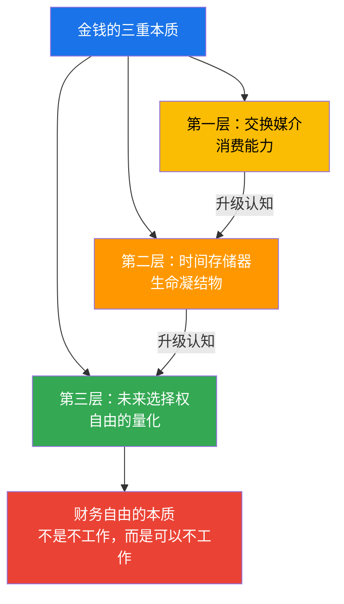
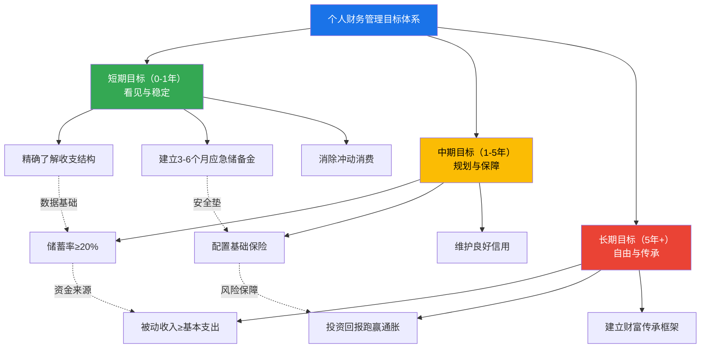
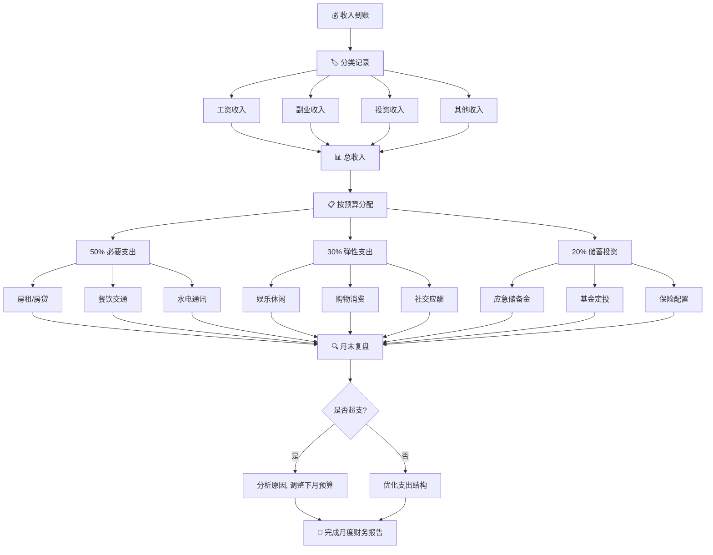
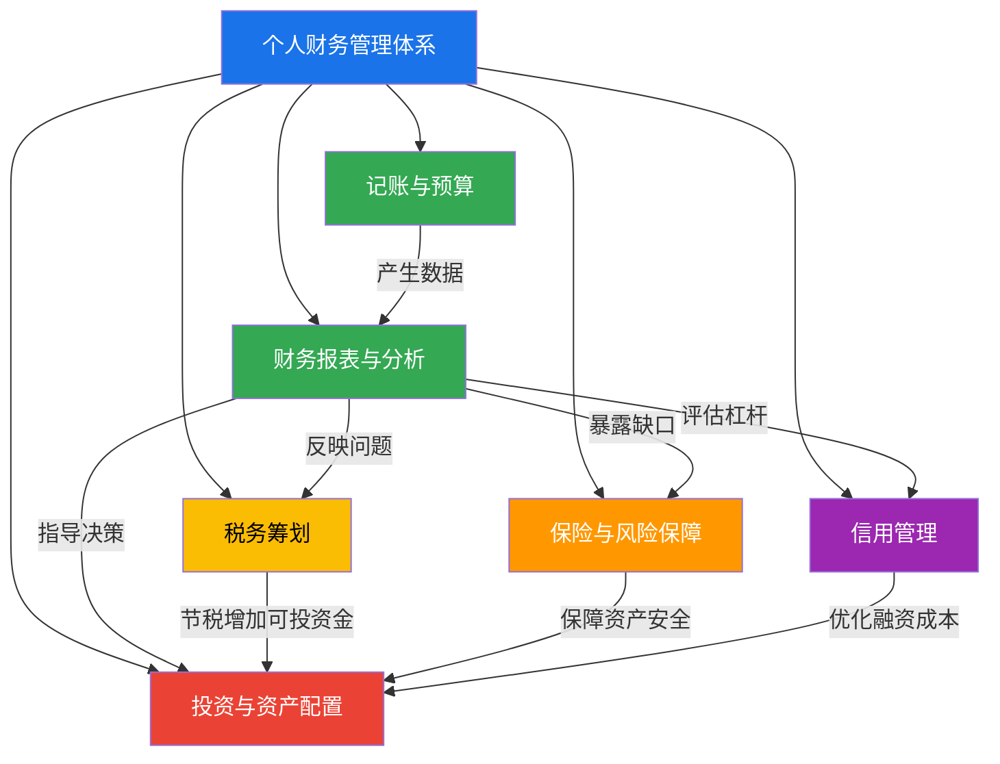

## 一、个人财务管理的本质

> "一个人对待金钱的态度，折射出他对待人生的态度。"

个人财务管理不是一门让人头疼的学科，也不是只有"有钱人"才需要考虑的事。它是每个现代人必须掌握的生存技能——和做饭、开车、使用智能手机一样基础。本节将从"道法术器"四个层次，由浅入深地拆解个人财务管理的本质，帮你建立对金钱的完整认知框架。

---

### 1.1 道：理解金钱的本质

在讨论任何"技巧"之前，先解决一个根本问题：**钱是什么？你和钱的关系应该是什么样的？**

#### 1.1.1 金钱的三重本质

大多数人对金钱的理解停留在第一层，这导致了大量错误的财务决策：

**第一层：交换媒介** —— 钱是用来买东西的。这是最表面的认知，大多数人停留于此。停留在这一层的人，把钱等同于"消费能力"，赚多少花多少，因为"钱就是用来花的"。这种认知的问题在于：它忽略了钱的其他属性，让你的财务决策完全被"当下欲望"驱动。你看到一件好看的衣服，第一反应是"我买得起吗"，而不是"这笔钱如果存下来，30年后值多少"。

**第二层：时间存储器** —— 钱是你过去投入时间的凝结物。你工作一小时赚100元，这100元就是你生命中一小时的"冷冻保存"。花掉它，就等于花掉了一小时的生命。这个认知让你重新审视每一笔消费：这杯30元的奶茶，值不值得你用18分钟的生命去交换？

这个视角有一个更深层的推论：**你的真实时薪远低于你以为的数字**。如果你月薪15000元，每月工作22天、每天10小时（含通勤），你的真实时薪是68元，而不是15000÷22÷8=85元。再加上加班、焦虑、通勤疲劳等隐性成本，你用生命换来的每一分钱都更加珍贵。

**第三层：未来选择权** —— 钱是未来自由度的量化。你拥有的每一分钱，都代表着未来的一个选择——选择休息、选择换工作、选择陪家人、选择追求理想。存款为零意味着你没有任何选择权，必须接受任何能赚钱的工作。存款100万意味着你可以在不满意的工作面前说"不"。从这个角度看，**储蓄不是"延迟享受"，而是"购买自由"**。



**一个思维实验**：假设你面前有两个按钮——按红色按钮，立刻获得100万元现金；按蓝色按钮，获得一个永远不会失业、但月薪固定8000元的工作。你会选哪个？

大多数人会选红色按钮。但从财务本质的角度看，蓝色按钮的价值远超100万：月薪8000元、工作30年，总收入是288万元，而且是稳定现金流。红色按钮的100万如果管理不当，可能几年就花光了。这个实验揭示了一个核心道理：**现金流比存量更重要，持续赚钱的能力比一笔横财更有价值**。

#### 1.1.2 金钱观的形成与重塑

你的金钱观不是天生的，而是在成长过程中被"编程"的。心理学家布拉德·克朗茨（Brad Klontz）提出了"金钱脚本"（Money Scripts）理论，将人的金钱信念分为四类：

| 金钱脚本 | 核心信念 | 典型表现 | 财务后果 |
|----------|---------|---------|---------|
| **金钱逃避** | "钱是万恶之源""有钱人都不是好人" | 回避谈钱，不做财务规划，花钱后内疚 | 收入再高也存不下钱，自我破坏财务目标 |
| **金钱崇拜** | "钱越多越幸福""只要有钱就能解决一切问题" | 过度追求收入，用消费填补内心空虚 | 永远觉得不够，生活方式膨胀失控 |
| **金钱地位** | "身价=自我价值""别人怎么看我取决于我有多少钱" | 攀比消费，透支购买奢侈品，用钱衡量一切 | 高收入高负债，外表光鲜内里空虚 |
| **金钱警觉** | "钱随时可能消失""必须时刻警惕" | 过度节俭，不敢花钱享受，对财务信息过度焦虑 | 虽然有存款但生活质量极低，焦虑永不停止 |

**健康的金钱观**不是上述任何一种极端，而是一种平衡：承认钱的重要性，但不被钱控制；愿意为未来储蓄，但也允许自己享受当下；关注财务安全，但不为此焦虑失眠。

**如何识别自己的金钱脚本**：问自己以下四个问题，第一个浮现的念头往往就是你的真实信念——

1. 谈到"有钱人"，你脑海中浮现的第一个词是什么？
2. 小时候家里谈论钱时，氛围通常是怎样的？
3. 当你花了一笔"大钱"（比如买了件贵衣服），内心的第一反应是兴奋还是内疚？
4. 你觉得"财务自由"意味着什么？是不工作，还是想买什么就买什么？

识别自己的金钱脚本是改变的第一步——你无法修改一个你不知道存在的程序。

**金钱脚本的重塑路径**：识别只是第一步，真正的改变需要"认知-行为-反馈"三个阶段的循环：

1. **认知阶段**（1-2周）：记录自己每次涉及金钱的情绪反应。花了一笔钱后是焦虑还是愉悦？看到别人买了奢侈品是羡慕还是无感？这些情绪反应就是你的金钱脚本在"运行"。
2. **行为阶段**（1-3个月）：针对你的脚本类型，刻意练习相反的行为。如果你是"金钱逃避"型，尝试每周花30分钟看一次自己的银行余额；如果你是"金钱警觉"型，给自己设置一个"每月必须花掉的享受基金"。
3. **反馈阶段**（持续）：记录行为改变后的结果。当你开始正视余额后，焦虑是增加了还是减少了？当你允许自己适度消费后，生活质量是否提升了？这些反馈会逐渐"重写"你的金钱脚本。

#### 1.1.3 中国传统文化中的财富智慧

中国文化对财富的态度是复杂而辩证的，既有积极的财富观，也有需要警惕的思维陷阱：

**值得借鉴的智慧：**

- **"君子爱财，取之有道"**（《论语》的延伸解读）——追求财富是正当的，但手段必须正当。这与现代"合法合规赚钱"的理念完全一致。
- **"量入为出"**（《礼记·王制》）——根据收入决定支出，这是最基本的预算原则，比任何西方理财书籍的建议都早了两千多年。
- **"未雨绸缪"**（《诗经·豳风》）——提前为未来的风险做准备，这正是现代保险规划和应急储备金的哲学源头。
- **"授人以鱼不如授人以渔"**——这个理念在财务领域同样适用：给孩子留下财富，不如教会孩子管理财富。

**需要警惕的陷阱：**

- **"谈钱伤感情"** —— 导致很多人回避财务话题，不做规划，不和伴侣讨论钱的问题。事实上，不谈钱才是最伤感情的——财务问题是离婚的第一大原因。根据中国民政部数据，因经济纠纷导致的离婚占比约30%-40%。
- **"小富即安"** —— 容易让人在温饱线以上就停止成长，不做长期规划。在通胀环境下，"不进则退"，今天的"小富"可能十年后就是"温饱"。
- **"财不外露"** —— 导致很多人从不和朋友、家人交流财务知识，各人摸索各人的，浪费大量时间踩同样的坑。

**中西财富观的互补**：西方财务规划体系强调量化、系统性和工具理性（资产负债表、现金流分析、保险精算），中国传统文化则提供了一种"关系性"的财富视角——钱不是孤立存在的，它与家庭、社会关系、人生意义紧密相连。最理想的财务管理，是用西方的工具方法论，融入中国"修身齐家"的价值内核。

---

### 1.2 法：个人财务管理的定义与定位

#### 1.2.1 精确定义

**个人财务管理**（Personal Financial Management, PFM）是指个人或家庭对自身收入、支出、储蓄、投资、负债和风险保障进行系统性规划、执行和监控的持续过程。

这个定义有三个关键词：

- **有限资源约束** —— 不管你月入5千还是5万，你的资源都是有限的。没有人的钱是无限的，所以"配置"才重要。经济学的基本假设就是资源稀缺性，个人财务管理本质上是一门"稀缺资源配置学"。
- **最优配置** —— 不是省钱，不是不花钱，而是把钱花在回报最高的地方。花2000元学一门能涨薪的技能，比花2000元买一件穿两次就扔的衣服，回报率高出几十倍。最优配置的标准因人而异——取决于你的价值观和人生目标。
- **系统性过程** —— 不是心血来潮记三天账，不是年底突击看一下银行余额，而是一套持续运转的体系。就像健康管理不是生病了才去运动，而是每天的饮食、运动、睡眠的综合管理。

#### 1.2.2 个人财务管理与企业财务管理的对照

把自己类比为一家"公司"，是理解个人财务管理最有效的思维框架之一。你就是自己人生的CEO，你的收入就是公司的营收，你的支出就是公司的成本，你的净资产就是公司的市值。

| 维度 | 个人/家庭财务管理 | 企业财务管理 | 关键启示 |
|------|-------------------|-------------|---------|
| **目标** | 生活质量最大化、人生目标达成 | 利润最大化、股东价值最大化 | 个人目标是多元的，不能只看一个数字 |
| **周期** | 覆盖整个人生（通常50-70年） | 以财年为单位滚动（通常1-5年规划） | 个人决策的长期影响远大于企业 |
| **复杂度** | 收入来源较少（1-3种），支出类别相对固定 | 多条业务线，复杂的成本结构 | 简单反而容易做好，别给自己过度复杂化 |
| **报告对象** | 自己和家人 | 股东、监管机构、债权人 | 没有外部监督=更容易拖延，需要自驱 |
| **专业门槛** | 无需专业背景，自学即可掌握 | 通常需要财务/会计专业人员 | 不需要成为专家，但需要基本素养 |
| **决策频率** | 月度/季度复盘即可 | 需要日度/周度的财务监控 | 不需要每天盯，但至少每月看一次 |
| **核心工具** | 记账App、Excel表格 | ERP系统、财务软件 | 工具越简单越好，重点是坚持使用 |
| **容错空间** | 很小（一次大病可能倾家荡产） | 较大（可以分散投资、商业保险） | 个人比企业更需要保险 |

如果你经营一家公司却从不看财务报表，这家公司迟早要倒闭——你的人生也是一样。

**企业财务思维的迁移应用**：企业财务管理中有几个核心概念，可以直接迁移到个人财务管理中：

- **杜邦分析法**：企业的ROE（净资产收益率）可以拆解为利润率×周转率×杠杆率。个人版就是：你的净资产增长=收入水平×储蓄率×投资回报率。三个因子中任何一个提升，都能加速财富积累。
- **现金流管理**：企业最怕的不是亏损，而是现金流断裂——有利润但收不到钱。个人同理：你可能"总资产"很高（比如有房有车），但如果现金流断裂（失业+没有应急金），照样会陷入困境。
- **风险管理**：企业通过保险、对冲、分散化来管理风险。个人也应该建立多层风险防线：应急金→保险→分散投资→稳定收入来源。

#### 1.2.3 个人财务管理的边界：它不是什么

明确"不是什么"和明确"是什么"同样重要，因为很多人对财务管理的抗拒来自于误解：

- **不是投资学** —— 投资只是财务管理六大模块之一，而且排在最后。先做好记账、报表、税务、保险、信用，再谈投资。
- **不是"抠门学"** —— 财务管理的目标不是让你少花钱，而是让你把钱花在最值得的地方。一个做好预算的人，可以毫无负罪感地花5000元去看一场演唱会，因为他知道这笔钱来自"娱乐预算"，而不是从"应急储备金"里挪出来的。
- **不是一次性事件** —— 不是"学完就会了"的事情，而是需要持续实践的习惯。就像健身，不是办了卡就健康了，而是要持续去练。
- **不是只有专业人士才能做的事** —— 个人财务管理用到的数学不超过小学水平：加减乘除和百分比。复利公式（FV = PV × (1+r)^n）看起来复杂，但你不需要手动计算——Excel和在线计算器可以帮你搞定。

---

### 1.3 为什么需要个人财务管理

#### 1.3.1 一组令人警醒的数据

中国人民银行2024年的调查数据显示，中国居民人均可支配收入约为3.9万元/年，但同期居民存款增速持续放缓，消费信贷余额已突破20万亿元。这意味着大量收入被消费掉了，而且其中很大一部分是通过信贷消费——花的不仅是现在的钱，还有未来的钱。

招商银行的调研数据更加直观：月入1万-3万的群体中，超过60%的人无法准确说出自己上个月的支出结构，超过40%的人没有任何形式的记账习惯。央行征信中心的数据则显示，截至2024年底，个人消费贷款逾期率持续上升，90后群体的平均负债已超过月收入的18倍。

这些数据指向同一个事实：**大多数人不是赚得不够多，而是管得太差**。

#### 1.3.2 中国个人财务管理的现实挑战

中国居民面临的财务环境有其特殊性，理解这些背景有助于制定更切合实际的策略：

**资产结构高度集中于房产**。中国家庭资产中，房产占比高达60%-70%（央行2019年调查数据），远高于美国的25%-30%。这意味着一旦房价下跌，大量家庭的"纸面财富"会大幅缩水，而日常的现金流管理却被忽视。很多人"有房无现金"——房子值500万，但银行卡里可能只有5万。

**社会保障体系仍在完善中**。虽然基本养老保险和医疗保险已实现广覆盖，但替代率（退休金/退休前工资）仅40%-50%，远低于OECD国家平均58%的水平。这意味着仅靠社保无法维持退休前的生活水平，个人必须提前做补充规划。

**金融消费者保护制度逐步建立**。2021年开始实施的《深圳经济特区个人破产条例》是中国个人破产制度的首次试点，标志着"诚实而不幸"的债务人有了重新开始的法律通道。但全国性的个人破产法仍在制定中，大多数人仍然面临着"一旦负债过重，没有合法退出机制"的困境。

**数字支付的双刃剑效应**。中国移动支付普及率超过86%，现金使用率持续下降。扫码支付的便捷性让消费的"痛感"大幅降低——研究显示，使用现金支付时的"支付痛感"是刷卡/扫码的3-5倍。这意味着数字化支付在提高效率的同时，也在无形中削弱了人对消费金额的感知。

**独生子女家庭的特殊压力**。中国独特的"4-2-1"家庭结构（四个老人、一对夫妻、一个孩子）意味着一对夫妻可能需要赡养四位老人和抚养一个（或两个）孩子。这种结构下的财务压力远大于多子女家庭分摊的情况，也意味着个人财务规划中的"保障性"比其他文化环境更加重要。

#### 1.3.3 "高收入穷人"现象

所谓"高收入穷人"，是指收入不低但几乎没有积蓄、甚至负债累累的人群。这个现象在一线城市的年轻白领中极为普遍。

**典型画像**：
- 月入3万，存款为零
- 收入越高，消费也水涨船高（经济学上叫"生活方式膨胀"或 Lifestyle Inflation）
- 没有预算，没有记账，钱在不知不觉中花光
- 信用卡账单每月过万，分期还款成常态
- 觉得"反正下个月还有工资"，从不做长期规划

**一个真实的消费黑洞分析**（基于多个记账案例的统计平均）：

| 支出类别 | 月均金额 | 占比 | 是否必要 | 隐藏的浪费 |
|---------|---------|------|---------|-----------|
| 房租/房贷 | 8,000元 | 27% | 必要 | 可通过合租/换房优化 |
| 餐饮（含外卖） | 4,500元 | 15% | 部分必要 | 外卖溢价约40%，自制可省1500元 |
| 交通出行 | 1,500元 | 5% | 必要 | 打车占比过高时可优化 |
| 购物（服饰/数码/日用） | 5,000元 | 17% | 部分必要 | 冲动消费约占35%（1750元） |
| 娱乐休闲 | 3,000元 | 10% | 弹性 | 部分为社交压力驱动 |
| 社交应酬 | 2,500元 | 8% | 弹性 | 可选择低成本社交方式 |
| 订阅服务 | 800元 | 3% | 部分必要 | 未使用的约占50%（400元） |
| 其他零散支出 | 4,700元 | 15% | 不可追踪 | **完全黑洞** |
| **合计** | **30,000元** | **100%** | — | 可优化空间约5000-7000元 |

注意最后一项——"其他零散支出"占比15%，高达4700元，但当事人完全说不清这些钱花在了哪里。这就是**隐形消费黑洞**。记账的目的之一，就是把这些黑洞暴露在阳光下。仅这一项暴露出来后，通过有意识的管控，就可能每月省下2000-3000元。

#### 1.3.4 "低收入富人"现象

与"高收入穷人"相对的是"低收入富人"——收入不高但积蓄稳步增长的人。

**典型画像**：
- 月入8千，每年存下3万元（储蓄率约31%）
- 精打细算，量入为出，但并不抠门
- 有明确的财务目标（比如3年攒够首付）
- 每月记账，清楚每一分钱的去向
- 消费决策有优先级排序，非必要支出会延迟满足

**关键差异对比**：

| 对比维度 | 高收入穷人（月入3万） | 低收入富人（月入8千） |
|---------|---------------------|---------------------|
| 月支出 | 30,000元 | 5,500元 |
| 月储蓄 | 0元 | 2,500元 |
| 年储蓄 | 0元 | 30,000元 |
| 5年后存款 | ≈0元 | 150,000元（不含投资收益） |
| 核心差异 | 赚得多但没有管理 | 赚得少但管理精准 |
| 记账习惯 | 无 | 每日记账，每月分析 |
| 财务目标 | 无 | 明确的3-5年目标 |
| 应急能力 | 一次失业即陷入困境 | 可支撑6个月以上 |
| 心理状态 | 表面光鲜，内心焦虑 | 表面朴素，内心安定 |

这个差异的根源不是"省钱能力"，而是**财务意识**。低收入富人之所以能存下钱，不是因为他们不享受生活，而是因为他们知道自己的钱去了哪里，并且有意识地把资源配置到最重要的地方。

#### 1.3.5 你无法改善你不了解的东西

管理学中有句被广泛引用的话："不能衡量的东西，就无法管理。"这句话在个人财务领域尤其刺痛人心。

你可能觉得自己每月大概花了五六千，但实际上可能是八千甚至一万。你可能觉得自己主要花在吃和住上，但实际上购物和娱乐占了三分之一。你可能觉得偶尔喝杯奶茶没什么，但一杯15元、一个月30杯就是450元，一年就是5400元——够买一台不错的手机了。

**一组常见的"认知偏差数据"**（基于记账App的用户调研）：

| 认知项 | 你以为的 | 实际的 | 偏差幅度 |
|--------|---------|--------|---------|
| 月餐饮支出 | 2000元 | 3500元 | +75% |
| 月购物支出 | 1000元 | 3000元 | +200% |
| 年订阅服务费 | 500元 | 3600元 | +620% |
| 年交通费用 | 5000元 | 12000元 | +140% |
| 月储蓄率 | 30% | 5% | -83% |

财务管理的第一步不是"省钱"，不是"投资"，而是**看见**。你必须先看见自己的财务全貌，才能做出有意义的决策。这就是为什么记账是所有财务管理的起点——不是为了让你焦虑，而是为了让你清醒。

---

### 1.4 财务管理的核心目标体系

个人财务管理的目标不是单一的"存更多钱"，而是一个分层递进的目标体系。理解这个体系，才能避免"只顾存钱忘了生活"或"只顾享受忘了未来"两个极端。



#### 1.4.1 短期目标（0-1年）：建立财务可见性

短期目标的核心是**看见**和**稳定**：

- **了解自己的收支状况** —— 精确到每个类别的月度收支数据，不是"大概"，而是"准确"。你需要知道每月餐饮花了多少、交通花了多少、购物花了多少，误差控制在10%以内。
- **建立应急储备金** —— 目标是3-6个月的基本生活费。注意是"基本生活费"，不是总收入。如果你每月基本生活费是6000元，应急储备金的目标是1.8万-3.6万元。这笔钱放在货币基金或活期存款里，流动性是第一要求，收益率是次要的。
- **控制不必要的支出** —— 不是削减所有弹性支出，而是消除那些你事后会后悔的消费。买了不穿的衣服、充了不去的健身房、订了不看的会员，这些才是应该砍掉的。

**短期目标的检验标准**：连续3个月能准确说出自己的月度支出结构，应急储备金达到3个月基本生活费。

#### 1.4.2 中期目标（1-5年）：建立财务稳定性

中期目标的核心是**规划**和**保障**：

- **制定并执行储蓄计划** —— 储蓄率（月储蓄/月收入）达到20%以上。这不是一个随意的数字：20%的储蓄率意味着你每工作5年就积累了1年的"自由资金"。如果加上合理的投资回报，这个积累速度会更快。
- **合理配置保险** —— 用小额保费转移大额风险。基础配置至少包括：百万医疗险（年保费300-800元）、意外险（年保费100-300元）、重疾险（年保费3000-8000元，视年龄和保额而定）。保险不是消费，是风险转移工具——用确定的小额支出（保费）对冲不确定的大额损失（医疗费、收入中断）。
- **维护良好信用记录** —— 按时还款，控制负债率（总负债/总资产不超过50%），不频繁申请新信用卡或贷款。信用是现代社会的"第二张身份证"，影响你买房贷款的利率、租房的押金、甚至某些工作岗位的录用。

**中期目标的检验标准**：储蓄率稳定在20%以上，基础保险配置完整，征信报告无逾期记录。

#### 1.4.3 长期目标（5年以上）：实现财务自由

长期目标的核心是**自由**和**传承**：

- **实现财务自由** —— 被动收入（投资收益、租金收入、版税等）覆盖基本生活支出。注意是"基本生活支出"，不是"奢侈生活支出"。如果你每月基本生活费是8000元，当你的被动收入稳定超过8000元时，你就实现了基础版的财务自由。
- **财富保值增值** —— 投资回报率跑赢通胀。中国的年均通胀率大约在2%-3%（CPI口径），如果你的投资回报率长期低于这个数字，你的财富实际上在缩水。
- **财富传承** —— 通过合理的资产配置、保险规划和法律工具（遗嘱、信托等），确保财富能有效传递给下一代。

**长期目标的检验标准**：被动收入≥基本生活支出，投资回报率长期跑赢通胀，已建立基本的财富传承框架。

**财务自由的量化计算——4%法则**：

如何知道自己"需要多少钱"才能财务自由？国际上最广泛使用的量化标准是"4%法则"（源自1998年Trinity University的研究）：如果你每年的生活支出不超过你投资组合总额的4%，你的钱大概率可以"永远花不完"（基于美国股市1926-1995年的历史数据回测）。

换算公式很简单：

```text
财务自由所需资金 = 年生活支出 × 25
```

举例：
- 如果你每年基本生活支出是10万元，你需要250万元的投资组合
- 如果你每年基本生活支出是15万元，你需要375万元的投资组合
- 如果你每年基本生活支出是20万元，你需要500万元的投资组合

**4%法则的局限性**：
1. 它基于美国股市的历史数据，中国市场波动更大，保守估计可以用3.5%甚至3%来计算（即年支出×28-33）
2. 它假设你退休后每年提取固定比例，不考虑突发大额支出（如医疗费）
3. 它没有考虑中国的社保养老金收入——如果你有社保，所需的投资组合可以相应减少
4. 通胀会侵蚀购买力，实际计算时需要用扣除通胀后的真实回报率

一个更贴近中国实际的计算方式：

```text
财务自由所需资金 = (年生活支出 - 社保养老金年收入) ÷ 安全提取率
```

例如：年支出12万，退休后社保每年提供5万，安全提取率3.5%，则需要 (12-5)÷3.5% = 200万元。这个数字比直接套用4%法则的300万要现实得多。

#### 1.4.4 收支管理全流程与533法则

以下流程图展示了从收入到账到月末复盘的完整财务管理闭环：



**533法则**（一个简化版的预算分配框架）：

在标准的50/30/20法则基础上，考虑到中国年轻人高房租的现实，可以调整为533法则——50%必要支出（含房租/房贷）、30%弹性支出、20%储蓄投资。这个比例不是固定的，而是起步线：

| 储蓄率 | 水平 | 含义 | 适合人群 |
|--------|------|------|---------|
| 10% | 及格线 | 有储蓄意识，但积累速度慢 | 刚毕业、收入较低的阶段 |
| 20% | 良好 | 每5年积累1年自由资金 | 收入稳定、控制力较好的阶段 |
| 30% | 优秀 | 每3.3年积累1年自由资金 | 收入较高、有明确目标的阶段 |
| 50% | 极简/高储蓄 | 每2年积累1年自由资金 | 极简主义者或高收入人群 |

**50/30/20法则的创始人伊丽莎白·沃伦**（Elizabeth Warren，现为美国参议员）在《All Your Worth》一书中提出了这个框架。她的核心观点是：只要你的"需求"（必要支出）控制在收入的50%以内，你就不会在财务上"失控"。这个法则的精髓不在于精确的百分比，而在于"分类思维"——把支出分为"必须""想要"和"未来"三类，然后有意识地分配。

**核心要点**：收支管理的关键在于"先储蓄后消费"（Pay Yourself First）。工资到账后，第一件事不是交房租、不是点外卖，而是把计划储蓄的部分转入专门的储蓄或投资账户。剩下的才是可支配金额。这个顺序的转换，是从"月光族"到"有储蓄的人"最关键的一步。

**为什么"先储蓄后消费"有效**：行为经济学研究表明，人们对"剩余金额"的敏感度远高于"分配金额"。如果你先花钱再存钱（剩下的存起来），每个月都不会"剩下"什么；但如果你先存钱再花钱（存完之后花），你会自动调整消费习惯来适应可支配金额。这不是意志力的问题，而是决策顺序的问题——改变顺序，比改变意志力容易一百倍。

**实操建议**：设置工资卡的"自动转账"功能。每月工资到账当天（或次日），自动将固定金额（或固定比例）转入储蓄账户。这个操作只需要设置一次，之后每个月自动执行。你不需要每月做一次"要不要存钱"的决定——决定已经提前做好了。

---

### 1.5 财务管理的心理学基础

很多人以为财务管理是个"技术问题"——只要学会了记账方法、知道了投资技巧，就能管好钱。但现实中，绝大多数财务管理失败的原因不是技术问题，而是心理问题。你的大脑天生不擅长做财务决策，因为它在漫长的进化过程中形成的决策机制，是为一个完全不同的环境设计的。

#### 1.5.1 行为经济学揭示的五大财务决策偏误

**第一，即时满足偏误（Present Bias）**

人类天生偏好当下的满足而非未来的收益。一杯30元的奶茶带来的快乐是即时的、确定的，而把这30元存起来30年后变成多少的收益是延迟的、不确定的。大脑的"默认设置"就是选择前者。

行为经济学家理查德·塞勒（Richard Thaler，2017年诺贝尔经济学奖得主）提出了"心理账户"（Mental Accounting）理论：人们会在心里把钱分成不同的"账户"，比如"工资账户""年终奖账户""意外收入账户"，并且对不同账户的钱有不同的消费倾向。年终奖更容易被"挥霍"，因为大脑把它归类为"意外之财"。

**对策**：取消心理账户，把所有收入视为同一个池子里的钱。年终奖和工资一样，都是你用时间换来的收入，不应该被区别对待。一个实操方法：年终奖到账后，立刻转入储蓄或投资账户，和工资一样按比例分配，而不是当作"横财"去挥霍。

**第二，锚定效应（Anchoring Effect）**

你在做消费决策时，会被第一个看到的数字"锚定"。一件衣服原价1999元、打折后799元，你会觉得很划算——但这件衣服的实际价值可能只有300元。你比较的对象不是"这件东西值多少钱"，而是"省了多少钱"。

这个效应在电商促销中被广泛利用。"原价999，限时特价299"——你的大脑自动锚定在999上，299显得便宜极了。但如果你不知道原价，你可能会觉得299元买这个东西很贵。

**对策**：做消费决策时，问自己一个问题——"如果这件东西原价就是799元，我还会买吗？"如果答案是"不会"，那你只是被折扣锚定了，并不是真的需要它。进一步的实操技巧：在购物节之前提前列好购物清单和心理价位，促销时只买清单上的东西，且只在价格低于心理价位时购买。

**第三，损失厌恶（Loss Aversion）**

心理学研究表明，损失100元带来的痛苦感，大约是获得100元带来的快乐感的2-2.5倍（卡尼曼和特沃斯基，1979年前景理论）。这导致两个常见的财务错误：一是不愿意止损（比如亏损的股票舍不得卖，因为"卖了就真的亏了"）；二是过度规避风险（比如只存银行不投资，因为"投资可能亏本"）。

**对策**：区分"账面损失"和"实际损失"。账面浮亏不是真正的损失，只有你卖出的那一刻才变成实际损失。同时理解一个事实：不投资也是一种风险——通胀会悄悄吃掉你银行存款的购买力。10万元存银行活期（年利率0.2%），10年后名义上是10.02万元，但按3%的通胀率计算，实际购买力只相当于7.4万元——你"什么都没做"就损失了2.6万元。

**损失厌恶的延伸——沉没成本谬误**：与损失厌恶密切相关的是"沉没成本谬误"（Sunk Cost Fallacy）。你花500元买了一张电影票，看了30分钟发现电影很烂，但你舍不得走——"票都买了，不看完就亏了"。在财务管理中，沉没成本谬误表现为：已经亏了30%的股票舍不得卖（"都亏这么多了，再等等看"）、已经投入大量时间的副业项目看不到希望但不愿放弃（"已经投入这么多了"）。正确的心态是：过去的投入已经无法收回，未来的决策只应该基于"从现在起，继续投入的预期回报是否高于其他选择"。

**第四，从众效应（Herd Behavior）**

"别人都买了""大家都在投资这个""朋友推荐的肯定没错"——这种从众心理在财务决策中极其危险。2015年A股牛市期间，大量从未接触过股票的人在5000点冲进市场，就是因为"别人都在赚钱"。结果股灾来临时，很多人损失惨重。

从众效应在社交媒体时代被进一步放大。当你在小红书看到"25岁月入5万的理财分享"，在抖音看到"基金定投一年赚了30%"的视频，你的大脑会自动产生"别人都能做到，我也应该做到"的想法。但你看到的是幸存者偏差——那些亏了钱的人不会发帖。

**对策**：财务决策要基于自己的分析和需求，而不是别人的行为。别人买基金是因为他有3-5年不用的闲钱，你跟风买基金可能下个月就要用这笔钱——你们的财务状况完全不同，决策也应该不同。在做任何财务决策前，先问自己三个问题：（1）我了解这个产品吗？（2）这笔钱我多久不需要用？（3）如果亏损50%，我能承受吗？

**第五，过度自信偏误（Overconfidence Bias）**

研究表明，大多数人认为自己的财务能力高于平均水平——这在统计学上是不可能的。过度自信导致的典型错误包括：不做研究就投资、频繁交易（研究表明频繁交易者的收益长期跑输大盘）、低估风险敞口。

加州大学的研究发现，交易越频繁的投资者，净收益越低。年换手率最高的投资者群体，年化收益比大盘低6.5%。原因很简单：每次交易都有成本（佣金、印花税、买卖价差），而且频繁交易意味着你在不断做出决策——而每多做一次决策，就多一次犯错的机会。

**对策**：用数据说话，不要凭感觉。记账就是最好的"去自信化"工具——你以为自己每月只花5000元，记完账发现是8000元，这就是数据对感觉的纠正。在投资领域，定期查看你的实际收益率（而不是凭记忆），和大盘指数对比，看看你的"主动操作"是否真的跑赢了"什么都不做"。

#### 1.5.2 超越偏误：建立反脆弱的决策系统

仅仅知道偏误的存在是不够的——你需要建立一套系统来对抗它们。行为经济学的核心启示不是"变得更理性"（这几乎不可能），而是**设计环境和流程来减少非理性决策的发生**。

**系统一：预承诺机制（Pre-commitment）**

在你理性的时候为未来的自己做决定，绑住冲动时的手脚。具体方法：

- **自动转账**：工资到账当天，自动将20%转入储蓄/投资账户。你不需要每月做一次"要不要存钱"的决定，因为决定已经提前做好了。
- **24小时冷静期**：对于任何超过500元的非必要消费，强制等待24小时再决定。你会发现，24小时后很多东西你已经不想要了。
- **封存信用卡**：如果你有信用卡消费过度的问题，把信用卡放在家里一个不容易拿到的地方（比如锁在抽屉里），只在真正需要时才使用。物理距离能有效降低冲动消费。

**系统二：环境设计（Choice Architecture）**

改变你周围的"选择环境"，让好的行为变容易、坏的行为变困难：

- **卸载购物App或关闭推送通知**：减少"被动触发消费"的机会。你不会去逛一个你没有的商场，也不会买一件你根本没看到的商品。
- **设置消费提醒**：很多记账App支持设置月度预算上限和单笔消费提醒。当某个月的餐饮支出接近预算上限时，App会提醒你——这就是一个"选择架构"。
- **使用"信封法"的数字版本**：把月度预算按类别分配到不同的账户或标签中。当"娱乐"标签的钱用完了，这个月就不再娱乐消费——而不是从"餐饮"标签里挪。

**系统三：定期"财务体检"（Systematic Review）**

把财务管理变成一个固定的习惯，而不是"想起来才做"的事情：

- **每周5分钟**：快速浏览本周支出，确认没有异常大额消费
- **每月30分钟**：对照预算检查本月支出，分析偏差原因
- **每季度2小时**：更新资产负债表，检查投资组合，评估保险是否充足
- **每年半天**：全面的财务健康检查，调整下一年的目标和策略

#### 1.5.3 延迟满足与复利思维

斯坦福大学著名的"棉花糖实验"（Marshmallow Test）追踪了数百名儿童，发现那些能够延迟满足（等待15分钟以获得两块棉花糖）的孩子，在成年后的学业成绩、收入水平和财务管理能力都显著优于即时满足的孩子。

延迟满足不是"不享受"，而是"把享受的回报最大化"。每月存2000元投资，假设年化回报率8%，30年后你将拥有约300万元。而如果每月把这2000元花掉，30年后你什么都没有。复利的威力需要时间来显现——这就是为什么越早开始财务管理越好。

**复利的直观感受**：假设年化回报率8%——

| 开始年龄 | 每月投入 | 到55岁时累计 | 差距 |
|---------|---------|-------------|------|
| 25岁 | 1000元 | ≈150万元 | 基准 |
| 30岁 | 1000元 | ≈100万元 | 少了33% |
| 35岁 | 1000元 | ≈59万元 | 少了61% |
| 40岁 | 1000元 | ≈35万元 | 少了77% |
| 45岁 | 1000元 | ≈18万元 | 少了88% |

晚开始10年，最终金额少了将近60%。这不是线性减少，而是指数级的差距。这就是时间的价值，也是为什么"现在就开始"比"等有钱了再开始"重要得多。

**复利的数学本质**：复利公式 FV = PV × (1+r)^n 中，r（收益率）和n（时间）都是指数关系，但n的影响力远大于r。也就是说：**时间比收益率更重要**。一个从25岁开始、年化6%回报的投资者，最终财富会超过一个从35岁开始、年化10%回报的投资者。这就是"早开始"的数学依据。

**72法则**：一个快速估算复利效果的口诀——用72除以年化收益率，得到资金翻倍所需的年数。例如：
- 年化6%：72÷6=12年翻倍
- 年化8%：72÷8=9年翻倍
- 年化12%：72÷12=6年翻倍
- 年化3%（通胀率）：72÷3=24年购买力减半

72法则告诉你两件事：第一，即使是看似不起眼的收益率差异，长期效果差距巨大；第二，通胀是隐性杀手——如果你的投资回报率低于通胀率的两倍以上，你的财富增长速度其实很慢。

---

### 1.6 财务管理的生命周期

人在不同人生阶段面临不同的财务挑战，财务管理的重心也完全不同。用25岁刚毕业时的策略去管理45岁的家庭财务，或者用45岁的投资方式去要求25岁的年轻人，都是错误的。

| 阶段 | 年龄范围 | 典型特征 | 核心任务 | 关键指标 | 常见陷阱 |
|------|---------|---------|---------|---------|---------|
| 起步期 | 22-28岁 | 收入较低，支出增长快，社交消费高 | 养成记账习惯，建立应急金，控制消费膨胀 | 储蓄率≥10%，应急金≥3个月 | 攀比消费、过度使用分期 |
| 积累期 | 28-35岁 | 收入快速上升，面临买房/结婚/生子等大额支出 | 增加收入渠道，开始投资，合理负债 | 储蓄率≥20%，净资产年增长>15% | 房贷压力过大、保险配置不足 |
| 成长期 | 35-45岁 | 收入进入平台期，家庭责任加重，子女教育支出增加 | 资产配置优化，保险体系完善，教育金规划 | 净资产稳步增长，投资组合多元化 | 忽视保险、教育金过度投入挤压退休准备 |
| 成熟期 | 45-55岁 | 收入达到峰值，开始考虑退休，父母养老压力 | 财富保值，退休规划，降低投资风险 | 投资回报>通胀率，退休储备达标 | 过度保守跑不赢通胀 |
| 收获期 | 55岁以上 | 收入下降或退休，医疗支出增加，考虑传承 | 财富传承规划，现金流管理，享受生活 | 被动收入覆盖支出，医疗保障充足 | 被金融诈骗、过度补贴子女 |

**关键认知**：生命周期不是固定不变的线性过程。有人25岁就开始创业，30岁就进入成熟期；有人50岁遭遇职业危机，需要重新回到积累期。理解生命周期的意义不在于按部就班，而在于**识别自己当前所处的阶段**，从而确定财务管理的优先级。

#### 各阶段的具体行动指南

**起步期（22-28岁）——建立习惯比存多少钱更重要**

这个阶段最大的优势是时间——你有30-40年的时间让复利发挥作用。最大的劣势是收入低、诱惑多。核心策略是"低标准、高坚持"：

1. 下载一个记账App，坚持记录每一笔支出（前3个月）
2. 工资到账后立即转出10%到一个不容易动用的账户
3. 不要用分期付款买消费品（手机、电脑、衣服）
4. 了解公司提供的五险一金，搞清楚自己的社保权益
5. 配置一份百万医疗险（年保费200-400元，20多岁很便宜）

**起步期的优先级排序**：如果你月入只有5000元，可能觉得"根本存不下钱"。这时候的关键是"先养成习惯，再提升金额"。哪怕每月只存200元，也比一分不存强——因为你在建立一个"收入到账→自动储蓄"的神经回路。这个回路一旦建立，未来收入增长时，储蓄比例可以自然提升。

**积累期（28-35岁）——增加收入的同时控制负债**

这个阶段收入增长最快的时期，也是最容易陷入"生活方式膨胀"的时期。核心策略是"收入增长快于支出增长"：

1. 记账从"记录"升级到"分析"——每月花10分钟看支出趋势
2. 建立完整的保险体系（医疗+重疾+意外+定期寿险）
3. 买房要量力而行——月供不超过月收入的30%
4. 开始学习投资——从指数基金定投入手
5. 利用好专项附加扣除，合法节税

**成长期（35-45岁）——优化配置、分散风险**

这个阶段家庭责任最重，上有老下有小，容错空间变小。核心策略是"稳健增长、全面保障"：

1. 每年做一次完整的财务体检（资产负债表+现金流量表+指标计算）
2. 投资组合从单一的基金定投扩展到股债混合配置
3. 完善子女教育金规划（教育金保险或定投专户）
4. 开始关注父母的养老和医疗安排
5. 每3年做一次保险保额检视——收入增长了，保额也要跟着增加

**成熟期（45-55岁）——保值为主、准备退休**

这个阶段收入仍在高位但增长放缓，距离退休越来越近。核心策略是"守住财富、规划退出"：

1. 逐步降低高风险资产的比例
2. 计算退休后需要的月度现金流
3. 清理不必要的负债（提前还贷的时机选择）
4. 开始学习财富传承知识（遗嘱、保险受益人指定等）
5. 关注个人养老金账户的政策和开户

**收获期（55岁以上）——现金流管理、享受生活**

这个阶段的核心是确保退休后的生活质量不下降。核心策略是"稳定现金流、防范风险"：

1. 投资以低风险为主（国债、大额存单、货币基金）
2. 医疗保障是重中之重——检查商业医疗险是否可以续保
3. 警惕金融诈骗——任何承诺"高收益低风险"的投资都是骗局
4. 合理规划财富传承——趁意识清醒时立好遗嘱
5. 保持适度消费——既不抠门也不挥霍，享受应得的生活

**生命周期的非线性现实**：上面的表格描绘了一个理想化的线性路径，但现实往往更加曲折。以下是一些常见的"非线性"场景及应对策略：

- **30岁失业/被裁**：回到积累期的策略，优先压缩支出、动用应急金、降低投资仓位，同时快速寻找新收入来源。不要恐慌性抛售投资。
- **35岁创业**：创业期间的财务策略完全不同——可能需要动用大量积蓄、承受巨大的现金流压力。关键是设定"止损线"：如果创业资金消耗超过X万元或Y个月仍无起色，就回到职场。
- **40岁离婚**：财产分割会大幅改变财务状况，可能需要重新制定5-15年的财务计划。优先确保现金流稳定，暂缓大额投资决策。
- **50岁遭遇重大疾病**：这就是为什么保险配置如此重要——一份好的重疾险和医疗险，可以让你在疾病面前不用做"钱和命"的选择题。

---

### 1.7 财务管理的完整知识体系

个人财务管理不是零散的"省钱技巧"或"投资秘籍"，而是一套完整的知识体系。这个体系包含六大模块，它们之间相互支撑、缺一不可。



**模块一：记账与预算——数据层**

记账是整个财务管理体系的地基。没有准确的收支数据，所有后续的分析、决策都是空中楼阁。预算则是在记账数据基础上的主动规划——不是限制你花钱，而是让你把钱花在最重要的地方。

本章对应内容：第三节"记账的理论基础"→核心技巧第一节"高效记账技巧"→核心技巧第六节"预算管理技巧"。

**模块二：财务报表与分析——诊断层**

资产负债表告诉你"你现在有多少钱"（资产-负债=净资产），现金流量表告诉你"你的钱从哪来到哪去"。这两个表加上几个关键指标（储蓄率、负债率、流动性比率），就构成了你的"财务体检报告"。

本章对应内容：第二节"个人财务报表理论"→核心技巧第二节"个人财务报表制作技巧"。

**模块三：税务筹划——策略层**

税务筹划是在法律框架内，通过合理利用税收优惠政策来降低税负。很多人每年多交了几千甚至上万元的税，仅仅是因为不知道专项附加扣除的存在，或者选错了年终奖的计税方式。

本章对应内容：第四节"税务筹划理论"→核心技巧第三节"税务筹划技巧"。

**模块四：保险与风险保障——安全层**

保险的本质是风险转移——用确定的小额支出（保费）对冲不确定的大额损失。没有保险的财务体系就像没有安全气囊的车，平时没问题，一出事就是大问题。

本章对应内容：第五节"保险规划理论"→核心技巧第四节"保险配置技巧"。

**模块五：信用管理——杠杆层**

信用是你的"金融身份证"。良好的信用记录意味着更低的贷款利率、更高的授信额度、更多的金融选择。信用管理的核心是"合理使用杠杆"——借钱投资能产生高于利息的回报是好杠杆，借钱消费是坏杠杆。

本章对应内容：第六节"信用管理理论"→核心技巧第五节"信用管理技巧"。

**模块六：投资与资产配置——增长层**

投资是让资产增值的关键手段，但它排在最后是有原因的——没有前五个模块的支撑，投资就像在沙子上建房子。你得先有记账习惯（知道能投多少钱）、财务报表（知道整体财务状况）、税务筹划（知道税后真实收益）、保险保障（不会因为意外事件被迫卖出投资）、良好信用（需要时能获得低成本融资），才能安心地做投资。

本章对应内容：核心技巧第七节"投资组合管理技巧"。

---

### 1.8 数字时代的个人财务管理

个人财务管理正在经历一场深刻的技术变革。理解这些变化，不是为了追新潮，而是因为技术工具正在从根本上降低财务管理的门槛——以前需要专业会计做的事，现在一个App就能完成。

#### 1.8.1 从手工到智能：记账工具的演进

| 时代 | 工具 | 优势 | 劣势 |
|------|------|------|------|
| 纸笔时代（2000年前） | 纸质账本、计算器 | 无门槛 | 耗时、容易遗漏、无法统计分析 |
| 电子表格时代（2000-2010） | Excel、WPS表格 | 灵活、可计算 | 需要手动输入，公式维护复杂 |
| 移动记账时代（2010-2020） | 随手记、MoneyWiz等App | 随时记录、自动分类、图表分析 | 多平台数据分散，手动录入仍是主流 |
| 智能化时代（2020至今） | AI记账、银行账单自动导入 | 零手动录入、智能分类、预测性分析 | 数据隐私问题、过度依赖工具 |

**当前阶段的核心变化**：银行账单自动导入功能让"记账"从一个主动行为变成了被动行为——你不再需要记录每一笔消费，App会自动从你的银行卡和支付平台抓取数据。这意味着记账的"坚持成本"大幅降低，从"每天花5分钟记录"变成了"每周花5分钟核对"。

**中国主流记账工具对比**：

| 工具 | 平台 | 核心特色 | 适合人群 | 费用 |
|------|------|---------|---------|------|
| 随手记 | iOS/Android/Web | 功能最全面，支持多账本、预算、报表 | 需要深度财务管理的用户 | 基础免费，高级版98元/年 |
| 钱迹 | Android/iOS | 极简设计，无广告，手动记账体验最佳 | 追求简洁的用户 | 免费，高级版30元/年 |
| 鲨鱼记账 | Android/iOS | 界面友好，图表丰富，入门门槛低 | 记账新手 | 基础免费 |
| 微信/支付宝账单 | 微信/支付宝内置 | 零额外操作，自动记录所有交易 | 不想装额外App的人 | 免费 |
| Excel/WPS表格 | 全平台 | 完全自定义，灵活度最高 | 喜欢自己掌控数据的用户 | 免费（或Office订阅） |

**工具选择建议**：如果你是记账新手，先用手机自带的备忘录或微信账单"看见"自己的消费结构，坚持1个月后再升级到专业记账App。不要一上来就选功能最复杂的工具——功能越多，学习成本越高，放弃的概率也越大。

#### 1.8.2 数字化带来的新挑战

技术在降低门槛的同时，也带来了新的财务管理问题：

**支付无痛化**。扫码支付让消费过程变得毫无阻力。研究显示，使用现金时人体会产生"支付痛感"（Pay Pain），这是大脑前岛叶的激活反应——花100元现金的"痛感"是刷卡支付的3-5倍。当你感觉不到花钱的"痛"时，花钱就变得容易得多。这就是为什么很多人"不知道钱花在哪里了"——不是他们不看价格，而是支付过程太顺畅，大脑根本没有"记录"这个消费事件。

**算法诱导消费**。电商平台的推荐算法、限时折扣推送、"猜你喜欢"功能，本质上都在触发你的购买欲望。更隐蔽的是"价格歧视"——同一商品，不同用户看到的价格可能不同（基于消费历史和支付能力）。你的消费数据被用来"对付"你，而不是"帮助"你。

**数字足迹的财务价值**。你在支付宝、微信支付、银行App里的消费记录，是最真实的财务数据来源。学会利用这些数据（导出账单、用记账App自动分析），比手动记账更准确、更高效。

**如何导出你的数字消费数据**：
- **支付宝**：我的→账单→右上角"..."→开具交易流水证明
- **微信**：我→服务→钱包→账单→右上角"..."→账单下载
- **银行App**：大多数银行App支持导出近1-3年的交易明细（CSV或PDF格式）

导出这些数据后，你可以用Excel做一个简单的分类汇总，就能看到过去一年的真实消费结构——这比任何"你觉得"都准确。

#### 1.8.3 AI辅助财务管理的前沿

人工智能正在改变个人财务管理的面貌。以下是一些已经可用或即将普及的应用：

- **智能分类**：AI自动识别消费类型（餐饮、交通、购物），准确率已达95%以上
- **异常检测**：当某笔消费明显超出你的日常模式时，系统会自动提醒
- **预测性预算**：基于你的历史消费数据，预测下个月各类支出的合理范围
- **投资建议**：基于你的风险偏好和财务目标，提供个性化的资产配置建议

**但要注意**：AI是工具，不是决策者。它可以帮你分析数据、发现问题，但最终的决策权必须在你手中。任何AI给出的建议都需要你理解其背后的逻辑，而不是盲目执行。

---

### 1.9 财务健康与心理健康

这是一个经常被忽略但极其重要的话题：**你的财务状况和心理健康是深度关联的**。

#### 1.9.1 财务压力的心理影响

多项研究表明，财务压力是导致焦虑和抑郁的主要因素之一。美国心理协会（APA）的年度调查显示，72%的成年人在某些时候会因钱而感到压力，22%的人表示财务压力"极其严重"。

财务压力的心理影响包括：

- **认知功能下降**：研究发现，财务焦虑会占用大量"认知带宽"，导致决策能力下降13-14分IQ点——相当于失去一夜睡眠的影响。这形成了一个恶性循环：财务焦虑→决策能力下降→做出更差的财务决策→财务状况恶化→更加焦虑。
- **关系紧张**：财务问题是夫妻/伴侣关系冲突的第一大原因。不是"没钱"导致关系破裂，而是"对钱的态度不同"和"不愿沟通"导致关系破裂。
- **身体健康受损**：长期财务压力与高血压、失眠、免疫力下降等健康问题密切相关。

#### 1.9.2 财务安全感的构建

**财务安全感不等于"有钱"**。一个人月入10万但不知道下个月是否有收入，可能比一个月入1万但有稳定工作和6个月应急金的人更焦虑。财务安全感来自于三个要素：

1. **可见性**：你知道自己有多少钱，钱从哪来到哪去
2. **缓冲**：你有应急储备金，不会因为一次意外就陷入困境
3. **规划**：你有明确的财务目标和达成路径，而不是"走一步看一步"

这正是个人财务管理的前三个短期目标——它们不仅是"数字上的改善"，更是"心理上的减压"。

#### 1.9.3 避免走向另一个极端

有些人开始财务管理后，会从"完全不管理"变成"过度管理"——每一分钱都要记录，任何超预算的消费都会内疚，看到储蓄率下降就焦虑。这不是健康的财务管理，而是另一种形式的"金钱焦虑"。

**健康的财务管理应该让你更自由，而不是更焦虑**。如果记账让你觉得被束缚，说明你可能需要：
- 放宽预算的精度（从精确到元改为精确到百元）
- 设置"无须记账"的小额消费（比如10元以下的消费可以不记）
- 给自己留出"无负罪感消费"的预算（每月固定的"放纵基金"）

**一个实用的平衡点**：如果你发现自己花在"管理钱"上的时间超过了花在"赚钱"上的时间，说明你可能过度管理了。财务管理是手段，不是目的——它的存在是为了让你更好地生活，而不是成为生活的负担。

---

### 1.10 常见认知误区

提到"财务管理"，很多人的第一反应是"少花钱""省钱""抠门"。这是对财务管理最大的误解。财务管理的目标从来不是让你过苦行僧一样的生活，而是让你**在有限的资源下过上最好的生活**。

**误区一：财务管理=省钱**

省钱只是财务管理的一个极小的子集，而且是最不重要的那个。一个年薪50万但不做税务筹划的人，每年可能多交2-5万元的税——这比任何"省钱技巧"都管用。一个不做保险规划的人，一场大病可能花光所有积蓄——再怎么省也省不出50万的医疗费。

**误区二：等有钱了再做财务管理**

这是最致命的误区。财务管理的最佳时机永远是"现在"。月入5千时不做财务管理，月入5万时大概率也不会做——因为习惯没有建立起来。而且，收入越高，不做管理的代价越大。月入5千时犯一个错误，损失可能是几百元；月入5万时犯同样的错误，损失可能是几万元。

**误区三：记账太麻烦了**

现代记账App支持银行账单自动导入、消费自动分类，每周只需要花5-10分钟核对一下数据。很多人每天花1-2小时刷短视频不觉得麻烦，每周花10分钟管理自己的财务却觉得"太麻烦"——这不是能力问题，是优先级问题。

**误区四：投资就是财务管理的全部**

投资是财务管理的重要组成部分，但绝不是全部。在没有应急储备金的情况下投资，一旦遇到突发需要用钱，就不得不在不好的时机卖出；在没有保险保障的情况下投资，一场大病就可能被迫清仓。投资是"锦上添花"，而记账、预算、保险是"雪中送炭"——先把后者做好，再考虑前者。

**误区五：财务管理需要很高的数学水平**

个人财务管理用到的数学不超过小学水平：加减乘除和百分比。复利公式（FV=PV×(1+r)^n）看起来复杂，但你不需要手动计算——Excel表格和在线计算器可以帮你搞定所有计算。你需要的是意愿和习惯，不是数学天赋。

**误区六：跟着"理财达人"学就行了**

社交媒体上有大量"理财达人"分享自己的投资收益和理财方法。但你需要警惕三点：（1）幸存者偏差——你只看到赚钱的人发帖，亏钱的人不会发；（2）利益冲突——很多"达人"推荐产品是因为他们收了推广费；（3）个人差异——别人的策略基于他的收入、风险承受能力和目标，这些和你可能完全不同。学习理财知识是好事，但盲目跟从他人的具体策略是危险的。

**误区七：年轻时不需要考虑财务问题**

"我还年轻，以后再说"——这句话可能是年轻人对自己财务状况最大的自我安慰。20多岁恰恰是建立财务习惯的黄金期：你犯错的成本最低（收入低，损失绝对值小），时间的杠杆最大（复利效应最显著）。一个25岁开始记账、储蓄、学习投资的人，和一个35岁才开始的人，到55岁时的财务状况可能相差数百万。

---

### 1.11 本节核心框架总结

理解了个人财务管理的本质后，你可以用以下框架来审视自己的财务状况：

| 维度 | 核心问题 | 自我评估 | 行动建议 |
|------|---------|---------|---------|
| **可见性** | 我能准确说出上个月每个类别的支出吗？ | 是/否/大概 | 下载记账App，坚持记录1个月 |
| **储蓄性** | 我每月有固定比例的储蓄吗？储蓄率是多少？ | 百分比：____% | 设置工资自动转账，先储蓄后消费 |
| **保障性** | 我有应急储备金吗？有基本的保险配置吗？ | 是/否 | 优先建立3个月应急金，配置百万医疗险 |
| **杠杆性** | 我的负债率是多少？负债是否在可控范围内？ | 百分比：____% | 负债率>50%时优先还债，暂停投资 |
| **增长性** | 我的投资回报率跑赢通胀了吗？ | 是/否/不确定 | 先完成前四项，再开始系统学习投资 |
| **计划性** | 我有明确的财务目标和达成计划吗？ | 是/否 | 写下1年/3年/5年的财务目标 |

如果你的答案中有3个以上的"否"或"不确定"，那么接下来的内容对你尤其重要。这不代表你做得"差"——大多数人都是这样。重要的是从今天开始改变。

**下一步行动**：不需要一次性学完所有内容。从今天开始做一件事——记录明天的每一笔支出。这是整个财务管理体系的第一步，也是最重要的一步。管好钱的第一步，永远是看见钱去了哪里。

***
