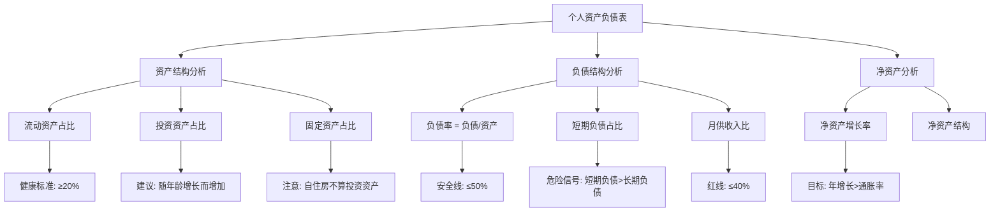
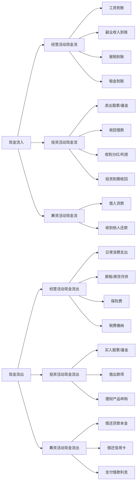
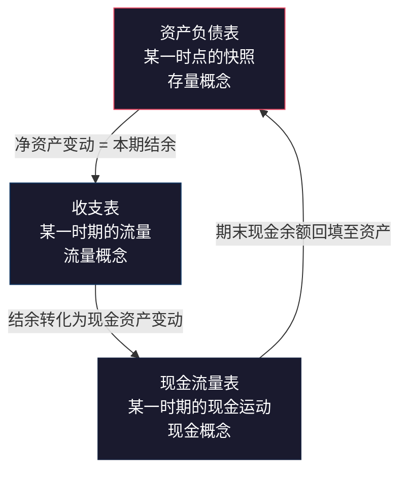
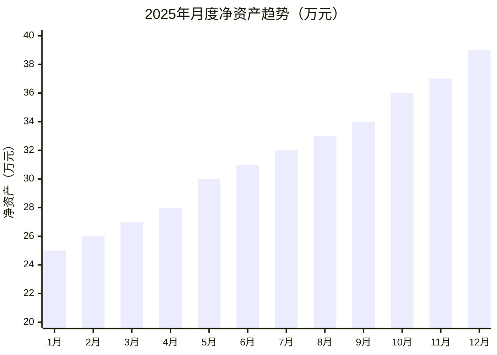
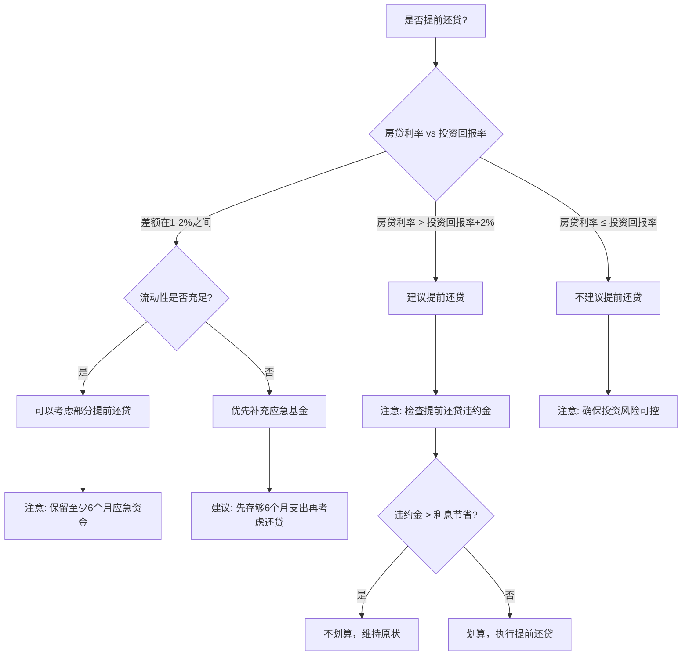
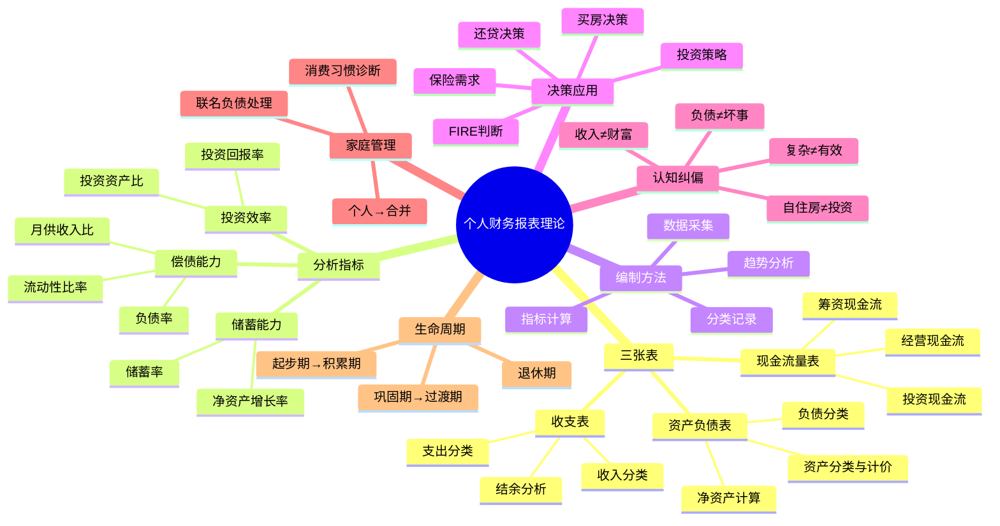

## 二、个人财务报表理论

### 2.1 为什么个人需要财务报表

大多数人对自己的财务状况只有一个模糊的印象："好像还有点钱"或者"这个月又花多了"。这种模糊感知就像蒙着眼睛开车——你可能暂时没事，但迟早会出问题。

**个人财务报表的本质**是将你所有的经济活动用结构化的方式记录、分类和呈现，让你从"感觉"转向"数据"，从"事后焦虑"转向"事前规划"。

#### 2.1.1 企业财务报表对个人的借鉴意义

现代财务报表体系起源于15世纪意大利的复式记账法，经过500多年的发展，形成了一套经过全球数十亿次商业实践验证的标准化框架。企业编制财务报表是法律要求，但其背后的逻辑——**用结构化数据呈现财务全貌**——对个人同样适用。

**企业与个人财务报表的类比**：

| 维度 | 企业财务报表 | 个人财务报表 |
|------|-------------|-------------|
| 法律要求 | 强制编制，受会计准则约束（GAAP/IFRS） | 自愿编制，无外部强制 |
| 使用者 | 投资者、债权人、监管机构 | 本人、配偶、理财顾问 |
| 编制频率 | 月度/季度/年度 | 建议至少季度，理想为月度 |
| 审计要求 | 上市公司需审计 | 无需审计，但需自我验证 |
| 核心目标 | 反映经营成果和财务状况 | 反映收支状况和财富积累进度 |
| 复杂度 | 多实体、多币种、合并报表 | 单人或家庭为单位，相对简单 |
| 准则依据 | GAAP/IFRS/CAS | 无统一准则，可借鉴企业准则简化版 |
| 计量基础 | 历史成本+公允价值混合 | 以公允价值（市价）为主 |

企业编制财务报表是因为法律规定和外部监督，但个人没有这种外部压力——这恰恰是问题所在。没有外部监督意味着你可以无限期地拖延，直到某一天突然发现自己的财务状况已经失控。

#### 2.1.2 会计恒等式：一切财务报表的根基

在学习三张表之前，必须理解一个根基性的公式——**会计恒等式**（Accounting Equation）：

```text
资产（Assets） = 负债（Liabilities） + 所有者权益（Owner's Equity）
```

对个人而言，"所有者权益"就是你的**净资产**（Net Worth），因此公式变为：

```text
总资产 = 总负债 + 净资产
```

这个恒等式不是一条建议，而是一条**不可违反的数学定律**。每一笔经济交易都同时影响等式两边（或同一边的两个项目），这就是复式记账法的核心逻辑。

**复式记账法在个人场景中的体现**：

| 交易事件 | 资产端 | 负债端 | 净资产 |
|---------|--------|--------|--------|
| 发工资10000元 | 现金+10000 | 不变 | +10000 |
| 用信用卡买手机5000元 | 手机资产+5000 | 信用卡负债+5000 | 不变 |
| 还信用卡5000元 | 现金-5000 | 信用卡负债-5000 | 不变 |
| 股票上涨赚了2000元 | 投资资产+2000 | 不变 | +2000 |
| 还房贷本金3000元 | 现金-3000 | 房贷负债-3000 | 不变 |
| 房贷利息1500元 | 现金-1500 | 不变 | -1500（支出） |

理解这个恒等式后，你就掌握了编制任何财务报表的底层逻辑：**每一笔钱的变动，都必须在报表中找到它的位置，且等式永远平衡**。

#### 2.1.3 三个不可替代的价值

**第一，可视化：从分散到全貌**

你的资产分散在银行卡、支付宝、微信、基金账户、公积金账户、房产等多个地方。每个单独的数字都无法反映你的整体财务状况——就像只看体温无法判断一个人的健康状况一样。财务报表把这些分散的数字汇总到一张纸上，让你看到全貌。

**第二，可度量：从模糊到精确**

"我觉得最近花多了"是主观感受，"本月支出比上月增长15%，超出预算2000元"是客观事实。只有量化了才能比较，只有比较了才能判断进步还是退步。没有数据支撑的"感觉"往往和事实相差甚远——研究表明，人们对自身消费的估计误差通常在30%-50%之间。

**第三，可决策：从赌博到规划**

买房还是租房？提前还贷还是继续投资？买多少保额的保险？这些问题没有标准答案，但一定有基于你个人数据的最优解。没有财务数据支撑的决策就是赌博。举个例子：如果你不知道自己的月供收入比已经达到了45%，你可能还会考虑再买一套房——而财务报表会告诉你，你已经在悬崖边上了。

#### 2.1.4 个人财务报表的适用范围

- **单身人士**：以个人为单位编制，重点关注储蓄率和投资效率
- **已婚夫妻**：建议先各自编制个人报表，再合并为家庭报表（原因见2.8误区六）
- **自由职业者/个体户**：需要将个人财务和经营财务分开编制，避免混淆
- **有复杂资产的人**：持有海外资产、加密货币、期权股权等的人更需要系统化的报表管理

#### 2.1.5 行为障碍：为什么大多数人不编财务报表

知道财务报表重要和真正去做之间，隔着一道巨大的行为鸿沟。以下是人们不做财务报表的心理障碍及其破解方法：

| 心理障碍 | 表现 | 根因 | 破解方法 |
|---------|------|------|---------|
| 鸵鸟心态 | "不看不知道，看了更焦虑" | 害怕面对负面数据 | 记住：数据本身不会让你亏钱，不知道数据才会 |
| 完美主义 | "等我学会会计再开始" | 用学习代替行动 | 第一版报表可以用纸笔，10分钟就能完成 |
| 拖延症 | "下个月再开始" | 缺乏紧迫感 | 设定一个"财务起始日"，像记账一样形成习惯 |
| 信息过载 | "三张表太复杂了" | 一次性看到太多 | 先只做资产负债表，其他两张后续再加 |
| 数据分散 | "我的钱在太多地方" | 采集成本高 | 第一次花1小时建立资产清单，之后每次只需15分钟更新 |
| 害怕发现真相 | "如果发现自己其实很穷怎么办" | 身份认同与财务挂钩 | 穷不可怕，不知道自己穷才可怕——至少现在你还有时间改变 |

**行为经济学的洞察**：人们更倾向于回避负面信息（ostrich effect），即使这些信息对决策至关重要。研究显示，投资者查看投资账户的频率与市场涨跌高度相关——市场涨的时候天天看，市场跌的时候几个月不看。财务报表的编制需要克服这种本能，建立"无论涨跌都定期审视"的习惯。

### 2.2 个人财务三张表

企业有三张核心财务报表：资产负债表（Balance Sheet）、利润表（Income Statement）、现金流量表（Cash Flow Statement）。个人财务管理借鉴了同样的框架，但做了简化和调整。


#### 2.2.1 个人资产负债表

**定义**：资产负债表是一张"快照"，记录你在某个时间点拥有什么（资产）、欠别人什么（负债），以及两者的差额（净资产）。它回答的核心问题是："我现在有多少钱？"

**核心公式**：

```text
净资产（Net Worth） = 总资产（Total Assets） - 总负债（Total Liabilities）
```

这个公式看起来简单，却是个人财务管理中最重要的等式。净资产就是你的真实"身价"——不是你月薪多少，不是你房子值多少，而是把所有资产减去所有负债后的数字。

**资产的分类与计价**：

| 资产类别 | 包含项目 | 计价方式 | 流动性 | 典型占比（健康家庭） |
|----------|----------|----------|--------|-------------------|
| 现金及等价物 | 现金、活期存款、货币基金、余额宝 | 面值（1:1） | 极高，随时可取 | 10-20% |
| 短期投资 | 定期存款、短期理财、国债逆回购 | 面值+应计利息 | 高，1天-1年到期 | 10-15% |
| 权益类投资 | 股票、基金、ETF、股权投资 | 市场价值（波动） | 中-高，T+1可卖 | 15-30% |
| 固定资产 | 自住房产、车辆 | 参考市价，需折旧 | 低，变现周期长 | 30-50% |
| 长期投资 | 长期国债、养老目标基金、商业养老保险 | 账面价值或市值 | 极低，锁定至到期 | 5-15% |
| 其他资产 | 公积金账户、企业年金、收藏品、数字货币 | 账面价值或估价 | 低-中 | 0-10% |

**计价的五个关键原则**：

**原则一：保守原则（Conservatism）**

对于有市场价格的资产，取当前市价；对于没有活跃市场的资产（如房产），取保守估计值而非乐观估计值。你的中介说房子值500万，挂牌半年没卖掉，那它的真实价值可能只有450万甚至更低。保守原则的目的是避免虚增净资产导致过度乐观的财务决策。

**原则二：流动性折扣（Liquidity Discount）**

不能快速变现的资产在决策中应打折扣。自住房虽然值500万，但你不能卖掉它去投资（除非你有其他地方住），所以它对你的财务灵活性贡献为零。在投资学中，非流动性资产通常需要10%-30%的折扣率。个人财务报表中，建议对以下资产打折扣计入：

- 自住房产：按市场价的70%-90%计入（扣除预估的交易税费）
- 车辆：按市场价的80%-90%计入（二手车交易有折价）
- 收藏品：按市场价的50%-70%计入（流动性极差，变现渠道有限）
- 非上市公司股权：按评估价的30%-50%计入（极难变现）

**原则三：市值法而非成本法（Mark-to-Market）**

股票和基金应该用市值而非买入成本。很多人不愿意面对亏损，用成本价记账——这是一种自欺欺人的行为。你花10万买的股票现在只值7万，你的资产就是7万，不是10万。用成本价记账会高估净资产，导致错误的财务决策。

**原则四：一致性原则（Consistency）**

同一个资产在不同时期的计价方式应保持一致。如果你决定用市值法计价股票，就每个季度都用市值法，不要这个月用市值法下个月用成本法。计价方式的频繁切换会导致数据不可比，趋势分析失去意义。

**原则五：重要性原则（Materiality）**

价值低于总资产0.5%的资产可以合并到"其他资产"中，不必逐项列示。你的旧手机值200元，对于一个总资产100万的人来说，精确记录它的价值没有实际意义。但如果是一件价值5万元的收藏品，就必须单独列示。

**负债的分类**：

| 负债类别 | 包含项目 | 特征 | 风险等级 |
|----------|----------|------|----------|
| 消费性负债 | 信用卡欠款、花呗/白条、消费贷、现金贷 | 高利率（年化12%-36%），应优先偿还 | 高 |
| 经营性负债 | 房贷、车贷、教育贷 | 低利率（年化3%-6%），长期摊还 | 中 |
| 或有负债 | 为他人担保、未决诉讼、联名贷款 | 可能变成实际负债，金额不确定 | 不确定 |
| 税务负债 | 应缴未缴的个税、待补缴税款 | 有法律强制性，可能产生滞纳金 | 中 |

**或有负债是大多数人忽略的盲区**。你帮朋友做了贷款担保，这笔钱在正常情况下和你无关，但如果朋友还不上，你就得替他还。这部分应该在资产负债表的附注中单独列示，并在计算负债率时纳入考虑。

**负债的计价**：

负债的计价相对简单，但有几个细节需要注意：

- **房贷**：应按剩余本金计价（不是总还款额）。你的房贷总额200万，已还本金50万，剩余本金150万，那资产负债表上的负债就是150万
- **信用卡**：应按账单日的应还金额计价，包括未出账单的消费
- **分期付款**：应按剩余未付本金计价，而非分期总金额（因为分期手续费已经包含在每期还款中）
- **外币负债**：应按编制日的汇率折算为人民币

**资产负债表的分析视角**：



**资产负债表模板（完整版）**：

```text
个人资产负债表
编制日期：____年____月____日

一、资产
  流动资产：
    现金及活期存款        ¥________
    货币基金（余额宝等）   ¥________
    定期存款              ¥________
    流动资产小计           ¥________

  投资资产：
    股票（按当日市值）     ¥________
    基金/ETF（按当日净值）  ¥________
    债券/国债              ¥________
    其他投资（P2P/信托等）  ¥________
    投资资产小计           ¥________

  固定资产：
    自住房产（参考市价×80%） ¥________
    车辆（参考二手车估价）   ¥________
    固定资产小计             ¥________

  其他资产：
    公积金账户余额          ¥________
    企业年金/职业年金        ¥________
    保险现金价值            ¥________
    借给他人的款项          ¥________
    收藏品/贵重物品         ¥________
    其他资产小计            ¥________

  总资产 = 流动资产 + 投资资产 + 固定资产 + 其他资产
         = ¥________

二、负债
  短期负债：
    信用卡应还金额          ¥________
    花呗/白条/消费贷        ¥________
    短期负债小计            ¥________

  长期负债：
    房贷剩余本金            ¥________
    车贷剩余本金            ¥________
    其他长期贷款            ¥________
    长期负债小计            ¥________

  总负债 = 短期负债 + 长期负债
         = ¥________

三、净资产 = 总资产 - 总负债 = ¥________

附注：或有负债
  为他人担保金额           ¥________
  其他潜在负债说明         ____________
```

#### 2.2.2 个人收支表（利润表）

**定义**：收支表是一段时期内（通常是一个月或一年）你的收入和支出的汇总，反映你的"赚钱能力"和"花钱速度"。它回答的核心问题是："这段时间我赚了多少、花了多少、存了多少？"

**核心公式**：

```text
结余（Savings） = 总收入（Total Income） - 总支出（Total Expenses）
```

**收支表与资产负债表的关系**：结余会增加净资产。如果你每月结余5000元，一年后你的净资产理论上增加6万元（假设没有资产价格变动和意外损失）。这就是为什么收支表被称为"流量表"——它记录的是一段时期的流量；而资产负债表是"存量表"——它记录的是某个时点的存量。

**收入的完整分类**：

| 收入类型 | 示例 | 特征 | 稳定性 | 可控性 |
|----------|------|------|--------|--------|
| 主动收入 | 工资、奖金、提成、加班费 | 用时间换钱，停止工作即停止 | 高（受雇）/ 中（自由职业） | 中 |
| 被动收入 | 房租、股息、利息、版税、专利费 | 资产产生，不需要持续投入时间 | 中-高（取决于资产质量） | 低（取决于资产积累） |
| 偶发收入 | 中奖、礼金、遗产、退税、拆迁补偿 | 不可预期，不可复制 | 极低 | 无 |
| 经营收入 | 副业、兼职、自由职业收入 | 需要额外时间和精力 | 低-中 | 高 |

**关于收入的一个关键认知**：大多数人只有主动收入这一种来源。一旦失业或生病，收入立刻归零。财务健康的标志之一是被动收入占总收入的比例逐步提高——这意味着你对"出售时间"的依赖在降低。当被动收入能够覆盖全部生活支出时，你就实现了财务自由。

**收入确认的时间差异**：

这里需要引入会计中的一个重要概念——**权责发生制 vs 收付实现制**：

- **权责发生制**：收入在"赚取"时确认，不管钱是否到账。你12月完成了工作，工资1月5日发，按权责发生制这笔收入属于12月
- **收付实现制**：收入在"到账"时确认。同样的例子，按收付实现制这笔收入属于1月

个人收支表建议采用**收付实现制**，原因是：(1) 更容易追踪——以银行到账为准，不需要估算"应计"收入；(2) 更有实际意义——对个人来说，钱到了手里才是真的有了；(3) 和现金流量表保持一致——简化编制工作。

但有一种例外：如果你是自由职业者，有一笔12月完成但1月才到账的大额项目款（比如10万元），仅用收付实现制会导致12月的收支表严重低估收入、1月严重高估。此时可以在附注中注明"已完成但未到账的收入"。

**支出的完整分类**：

支出分类在上一章"记账的理论基础"中已经详细讨论。这里补充一个更深层的分析框架——**按可控性分类**：

| 类别 | 定义 | 示例 | 优化策略 | 可节省潜力 |
|------|------|------|----------|-----------|
| 不可控固定支出 | 合同约定，短期无法改变 | 房贷、保险费、子女学费、物业费 | 只能在签约时谈判 | 极低（0-5%） |
| 可控固定支出 | 有合同但可以调整 | 手机套餐、健身房会员、订阅服务、宽带 | 定期审查，砍掉不用的 | 中（20-50%） |
| 可控弹性支出 | 完全由自己决定 | 餐饮、购物、娱乐、旅游、外卖 | 这是优化的主战场 | 高（30-60%） |
| 不可控偶发支出 | 突发事件 | 医疗、维修、赔偿、红白事 | 靠应急基金覆盖 | 不可预估 |

**关键洞察**：大多数人试图通过压缩"可控弹性支出"来省钱，但真正的大头往往是"可控固定支出"——那些你已经习惯但其实并不真正需要的订阅服务、会员资格和自动续费项目。据统计，平均每人每月有3-5个不再使用但仍持续扣费的订阅服务，年均浪费2000-5000元。

**收支表模板**：

```text
个人收支表
编制期间：____年____月

一、收入
  工资（税后到手）         ¥________
  奖金/提成              ¥________
  副业/兼职收入          ¥________
  投资收益（股息/利息）   ¥________
  房租收入               ¥________
  其他收入               ¥________
  收入合计               ¥________

二、支出
  住房（房贷/房租/物业）   ¥________  ___%
  餐饮（含外卖）          ¥________  ___%
  交通出行               ¥________  ___%
  通讯/网络              ¥________  ___%
  服饰/美容              ¥________  ___%
  娱乐/社交              ¥________  ___%
  教育/学习              ¥________  ___%
  医疗健康               ¥________  ___%
  保险费                 ¥________  ___%
  日用品/家居             ¥________  ___%
  人情往来               ¥________  ___%
  其他支出               ¥________  ___%
  支出合计               ¥________  100%

三、结余 = 收入合计 - 支出合计 = ¥________
  储蓄率 = 结余 / 收入合计 = ____%
```

#### 2.2.3 个人现金流量表

**定义**：现金流量表记录一段时期内现金的实际流入和流出。它和收支表的区别在于：收支表按权责发生制（应收应付），现金流量表按收付实现制（实际到账和支出）。它回答的核心问题是："我的钱从哪里来、到哪里去了、账户里还剩多少？"

**为什么需要单独的现金流量表？**

举个例子：你12月的工资1月5日才发，12月的收支表显示你有工资收入，但你的银行账户在12月31日并没有这笔钱。如果你需要在12月底支付一笔大额账单，收支表告诉你"你有钱"，但现金流量表告诉你"钱还没到账"。

再举一个更现实的例子：你12月卖掉了基金，交易在12月30日成交，但资金要到1月3日才能提现到银行账户。收支表说你12月有投资收入，但现金流量表显示这笔钱1月才到账。

对于大多数人来说，工资是即时发放的，收支表和现金流量表的差异不大。但在以下场景中，现金流量表变得至关重要：

- **自由职业者/个体户**：收入到账时间不确定，可能有30-90天的账期
- **有房贷的人**：每月固定大额支出，现金流管理是核心
- **有多笔投资的人**：投资赎回和到账有时间差（基金T+1到T+7不等）
- **有分期付款的人**：大额消费分期后，每月现金流压力不同
- **创业初期的人**：投入大、收入少，现金流可能长期为负

**现金流量表的三分类**：



**三分类的逻辑**：

- **经营活动现金流**：与日常生活相关的现金流动——工资到账、日常消费、房租水电等。这是最基础、最频繁的现金流类别
- **投资活动现金流**：与投资相关的现金流动——买股票、卖基金、收到分红等。它反映你"让钱生钱"的活动
- **筹资活动现金流**：与借贷相关的现金流动——借入贷款、偿还贷款、收到还款等。它反映你"借钱"和"还钱"的活动

**净现金流的意义**：

- **正净现金流**：流入>流出，你在这段时间积累了现金，可以用于投资或偿还负债
- **负净现金流**：流出>流入，你在消耗存量现金或增加负债——短期内可以（比如刚买房），但长期为负就是财务危机的前兆
- **零净现金流**：收支平衡，没有积累也没有消耗——看起来安全，但实际上没有为未来做任何准备，且没有任何抗风险能力

**一个重要的区分**：现金流量表中的"投资活动现金流出"（比如花5万买基金）和收支表中的"支出"是不同的。买基金不是"支出"——它是资产形态的转换（从现金变成了基金份额），总资产没有减少。但买基金确实是"现金流出"——你的银行账户少了5万。理解这个区别是理解三张表关系的关键。

### 2.3 三张表之间的内在联系

三张表不是孤立的，它们之间有严密的勾稽关系（interlocking relationships）：



**具体勾稽关系**：

**关系一：净资产变动 = 本期结余 + 非收支因素**

```text
期初净资产 + 本期结余 + 资产价格变动 + 意外收支 = 期末净资产
```

注意：这个公式比简单的"期初净资产 + 本期结余 = 期末净资产"更完整，因为它考虑了资产价格变动（比如股票涨了10万）和意外收支（比如收到一笔遗产）。

**关系二：期末现金资产 = 期初现金资产 + 本期净现金流**

```text
期末现金资产 = 期初现金资产 + 经营活动净现金流 + 投资活动净现金流 + 筹资活动净现金流
```

**关系三：收支表中的投资收益 ≈ 现金流量表中投资活动的部分流入**

两者的差异在于确认时间——收支表按权责发生制确认投资收益，现金流量表按实际到账确认。对于股息和利息，差异通常很小；但对于卖出投资的收益，差异可能较大（交易日 vs 资金到账日）。

**理解这些关系的意义**：当你发现三张表的数据对不上时，说明有遗漏或错误。这是自我审计的核心方法。具体来说：

| 不一致现象 | 可能原因 | 排查方向 |
|-----------|---------|---------|
| 净资产增长 > 本期结余 | 资产价格上涨 | 检查投资资产的市值变化 |
| 净资产增长 < 本期结余 | 有遗漏的支出或负债 | 检查是否有未记录的现金支出 |
| 现金增长 > 收支表结余 | 有非经营性现金流入 | 检查是否有借贷、退款等 |
| 现金增长 < 收支表结余 | 结余转化为非现金资产 | 检查是否有投资、还贷等 |

### 2.4 个人财务分析的核心指标

有了三张表的数据，接下来需要计算关键指标来评估财务健康状况。这些指标就像体检报告中的各项数值——单独看某一项意义有限，综合看才能判断整体健康。

#### 2.4.1 偿债能力指标

偿债能力指标衡量的是你能否按时偿还债务，以及债务负担是否过重。

| 指标 | 公式 | 健康标准 | 含义 | 计算示例 |
|------|------|----------|------|---------|
| 负债率 | 总负债 / 总资产 | ≤50% | 你的资产中有多少是借来的 | 负债80万/资产150万=53% |
| 月供收入比 | 月供总额 / 月收入 | ≤40% | 你的收入中有多少用来还贷 | 月供8000/月入20000=40% |
| 流动性比率 | 流动资产 / 月支出 | ≥3个月 | 失业后能撑多久 | 流动资产12万/月支出2万=6个月 |
| 短期负债比 | 短期负债 / 总负债 | ≤30% | 是否有集中还款压力 | 短期负债5万/总负债80万=6.25% |
| 利息覆盖率 | 月收入 / 月利息支出 | ≥5倍 | 收入能否轻松覆盖利息 | 月入20000/月利息2000=10倍 |

**负债率的细分解读**：

| 负债率区间 | 评价 | 具体含义 | 行动建议 |
|-----------|------|---------|---------|
| ≤30% | 非常健康 | 资产充足，借贷空间大 | 可以适度利用良性杠杆 |
| 30%-50% | 正常 | 负债在可控范围内 | 保持当前水平，不宜再增 |
| 50%-70% | 偏高 | 负债压力较大 | 制定还款计划，减少新增负债 |
| 70%-90% | 危险 | 几乎资不抵债 | 紧急削减支出，优先偿还高息负债 |
| >90% | 极度危险 | 技术性破产边缘 | 寻求专业财务顾问帮助 |

**月供收入比40%是一条红线**。银行审批房贷时一般要求月供不超过月收入的50%，但那是银行的标准（银行关心的是你能不能还钱），不是你的标准（你关心的是还完贷款后还能不能正常生活）。建议控制在30%-40%以内。

**流动性比率的层次**：

- **≥6个月**：非常安全，可以应对较长时间的失业或收入中断
- **3-6个月**：安全，足以应对大多数突发情况
- **1-3个月**：紧张，需要尽快补充流动资产
- **<1个月**：危险，任何意外都可能导致财务危机

#### 2.4.2 储蓄能力指标

| 指标 | 公式 | 优秀标准 | 含义 | 计算示例 |
|------|------|----------|------|---------|
| 储蓄率 | 结余 / 总收入 | ≥30% | 你每赚100元能存下多少 | 结余6000/收入20000=30% |
| 净资产增长率 | (期末净资产-期初净资产) / 期初净资产 | >通胀率 | 你的财富是否在增值 | (52万-50万)/50万=4% |
| 被动收入占比 | 被动收入 / 总收入 | 持续提升中 | 你的财务自由度 | 被动收入2000/总收入20000=10% |
| 结余增长率 | (本期结余-上期结余) / 上期结余 | >0 | 你的储蓄能力是否在提升 | (6000-5000)/5000=20% |

**储蓄率是个人财务管理中最重要的单一指标**。

为什么这么说？因为储蓄率同时反映了两个方面：你赚多少（收入端）和你花多少（支出端）。一个储蓄率30%的人，无论收入高低，都比储蓄率5%的人更有财务安全感。更重要的是，储蓄率直接决定了你的财富积累速度——它是一切投资的前提。没有结余，再高的投资回报率也是零。

**储蓄率的参考基准**：

| 储蓄率 | 评价 | 对应生活状态 | 财务自由所需年限（假设投资回报5%） |
|--------|------|-------------|--------------------------------|
| <10% | 危险 | 收支勉强平衡，任何意外都会导致负债 | >50年（几乎不可能） |
| 10%-20% | 及格 | 有基本的财务缓冲，但积累速度慢 | 30-50年 |
| 20%-30% | 良好 | 能在合理时间内实现中期财务目标 | 20-30年 |
| 30%-50% | 优秀 | 有较强的财务主动权，可选择提前退休 | 10-20年 |
| >50% | 卓越 | 通常需要高收入或极简生活方式支撑 | <10年 |

**一个实用的储蓄率提升策略**：

储蓄率 = (收入 - 支出) / 收入 = 1 - 支出/收入。提升储蓄率只有两个路径：增加收入或减少支出。但两者的效果完全不同：

- 收入增加1000元（假设税率20%，实际到手800元），储蓄率从20%提升到22.6%
- 支出减少1000元，储蓄率从20%提升到27.5%

减少支出的效果几乎是增加收入的3倍，因为减税不参与、增加的收入也不会100%变成结余。这就是为什么"先节流、再开源"是更高效的策略——当然，长期来看两者都需要。

#### 2.4.3 投资效率指标

| 指标 | 公式 | 说明 | 计算示例 |
|------|------|------|---------|
| 投资回报率 | 投资收益 / 投资本金 | 衡量投资盈利能力 | 收益2万/本金20万=10% |
| 投资资产比 | 投资资产 / 总资产 | 衡量资产的投资效率 | 投资40万/总资产150万=26.7% |
| 投资收入比 | 投资收入 / 总收入 | 衡量投资对收入的贡献 | 投资收入2000/总收入20000=10% |
| 投资集中度 | 最大单一投资 / 投资总资产 | 衡量投资分散程度 | 单只股票10万/投资总额40万=25% |

**投资回报率的三个陷阱**：

**陷阱一：忽略时间维度**

年化10%和3个月10%完全不同。需要用年化收益率（CAGR）来比较不同时间跨度的投资回报：

```text
年化收益率 = (期末价值/期初价值)^(365/持有天数) - 1

示例：3个月赚了10%
年化收益率 = (1.1)^(365/90) - 1 = 1.1^4.06 - 1 ≈ 46.4%
```

**陷阱二：忽略风险维度**

收益率8%的国债和收益率8%的P2P完全不是一回事。需要用风险调整后的指标来评估，最常用的是夏普比率：

```text
夏普比率 = (投资回报率 - 无风险利率) / 投资回报率的标准差

示例：
基金A：回报率12%，波动率20%，无风险利率3%
夏普比率 = (12%-3%) / 20% = 0.45

基金B：回报率8%，波动率5%，无风险利率3%
夏普比率 = (8%-3%) / 5% = 1.00

虽然基金A的绝对收益更高，但基金B的风险调整后收益更好
```

**陷阱三：忽略基准对比**

你的投资回报率需要和一个合理的基准比较才有意义。如果沪深300指数涨了15%，你的基金涨了10%，你的"绝对收益"不错但"相对收益"很差——你付了基金经理的管理费，结果还不如买指数基金。

常用的个人投资基准：

| 投资类型 | 建议基准 | 数据来源 |
|---------|---------|---------|
| A股投资 | 沪深300指数收益率 | 中证指数公司 |
| 债券投资 | 中证全债指数收益率 | 中证指数公司 |
| 混合投资 | 60%沪深300+40%中证全债 | 自行计算 |
| 银行理财 | 同期限存款利率×1.5 | 央行基准利率 |
| 全球投资 | MSCI全球指数收益率 | MSCI官网 |

#### 2.4.4 综合财务健康评分

将以上指标综合成一个评分体系，可以更直观地判断整体财务状况：

```python
# 个人财务健康评分模型（满分100分）
# 基于五个维度综合评估个人/家庭的财务健康状况

def financial_health_score(data: dict) -> dict:
    """
    计算个人财务健康评分。

    参数:
        data: dict, 包含以下字段:
            - total_debt: 总负债（元）
            - total_assets: 总资产（元）
            - monthly_mortgage: 月供总额（元）
            - monthly_income: 月收入（元）
            - liquid_assets: 流动资产（元）
            - monthly_expense: 月支出（元）
            - total_income: 年总收入（元）
            - total_saving: 年结余（元）
            - investment_assets: 投资资产（元）
            - passive_income: 年被动收入（元）

    返回:
        dict, 包含总分和各维度得分
    """
    details = {}

    # 1. 偿债能力（25分）
    debt_score = 0
    if data['total_assets'] > 0:
        debt_ratio = data['total_debt'] / data['total_assets']
        if debt_ratio <= 0.3:
            debt_score += 15
        elif debt_ratio <= 0.5:
            debt_score += 10
        elif debt_ratio <= 0.7:
            debt_score += 5
    else:
        debt_score += 15  # 无资产也无负债

    if data['monthly_income'] > 0:
        mortgage_ratio = data['monthly_mortgage'] / data['monthly_income']
        if mortgage_ratio <= 0.3:
            debt_score += 10
        elif mortgage_ratio <= 0.4:
            debt_score += 7
        elif mortgage_ratio <= 0.5:
            debt_score += 3
    else:
        debt_score += 10

    details['偿债能力'] = debt_score

    # 2. 流动性（20分）
    liquidity_score = 0
    if data['monthly_expense'] > 0:
        liquidity_months = data['liquid_assets'] / data['monthly_expense']
        if liquidity_months >= 6:
            liquidity_score = 20
        elif liquidity_months >= 3:
            liquidity_score = 15
        elif liquidity_months >= 1:
            liquidity_score = 8
    details['流动性'] = liquidity_score

    # 3. 储蓄能力（25分）
    saving_score = 0
    if data['total_income'] > 0:
        savings_rate = data['total_saving'] / data['total_income']
        if savings_rate >= 0.3:
            saving_score = 25
        elif savings_rate >= 0.2:
            saving_score = 18
        elif savings_rate >= 0.1:
            saving_score = 10
    details['储蓄能力'] = saving_score

    # 4. 投资效率（15分）
    invest_score = 0
    if data['total_assets'] > 0:
        investment_ratio = data['investment_assets'] / data['total_assets']
        if investment_ratio >= 0.3:
            invest_score = 15
        elif investment_ratio >= 0.2:
            invest_score = 10
        elif investment_ratio >= 0.1:
            invest_score = 5
    details['投资效率'] = invest_score

    # 5. 收入多元化（15分）
    diversity_score = 0
    if data['total_income'] > 0:
        passive_ratio = data['passive_income'] / data['total_income']
        if passive_ratio >= 0.3:
            diversity_score = 15
        elif passive_ratio >= 0.1:
            diversity_score = 10
        elif passive_ratio > 0:
            diversity_score = 5
    details['收入多元化'] = diversity_score

    total = sum(details.values())

    # 评分等级
    if total >= 80:
        level = "优秀"
        advice = "财务状况优秀，可考虑更积极的投资策略，关注资产增值"
    elif total >= 60:
        level = "良好"
        advice = "财务状况良好，保持当前节奏，重点优化薄弱维度"
    elif total >= 40:
        level = "一般"
        advice = "财务状况一般，需要重点改善储蓄率和负债率"
    elif total >= 20:
        level = "堪忧"
        advice = "财务状况堪忧，优先解决偿债和流动性问题"
    else:
        level = "危机"
        advice = "财务状况危机，需要紧急干预，建议寻求专业帮助"

    return {
        'total_score': total,
        'level': level,
        'advice': advice,
        'details': details
    }


# 使用示例
example_data = {
    'total_debt': 800000,       # 房贷余额80万
    'total_assets': 2000000,    # 总资产200万
    'monthly_mortgage': 6000,   # 月供6000
    'monthly_income': 20000,    # 月入2万
    'liquid_assets': 150000,    # 流动资产15万
    'monthly_expense': 15000,   # 月支出1.5万
    'total_income': 240000,     # 年收入24万
    'total_saving': 60000,      # 年结余6万
    'investment_assets': 400000, # 投资资产40万
    'passive_income': 12000     # 年被动收入1.2万
}

result = financial_health_score(example_data)
print(f"总分: {result['total_score']}/100 - {result['level']}")
print(f"建议: {result['advice']}")
for dim, score in result['details'].items():
    print(f"  {dim}: {score}分")

# 输出:
# 总分: 73/100 - 良好
# 建议: 财务状况良好，保持当前节奏，重点优化薄弱维度
#   偿债能力: 22分 (负债率40%得10分, 月供比30%得10分, +2分弹性)
#   流动性: 15分 (流动资产/月支出=10个月)
#   储蓄能力: 18分 (储蓄率25%)
#   投资效率: 10分 (投资资产占比20%)
#   收入多元化: 5分 (被动收入占比5%)
```

### 2.5 财务报表的编制方法论

#### 2.5.1 编制频率与时机

| 频率 | 适合人群 | 内容 | 耗时 | 核心价值 |
|------|----------|------|------|---------|
| 月度 | 所有人 | 现金流量表 + 关键指标检查 | 30-60分钟 | 及时发现异常，趋势监控 |
| 季度 | 有投资的人 | 三张表 + 指标分析 | 1-2小时 | 评估中期趋势，调整策略 |
| 年度 | 所有人 | 三张表 + 全面分析 + 下年规划 | 半天 | 全面复盘，制定年度目标 |

**月度报表的核心价值在于趋势发现**。单月的数据说明不了什么，但连续12个月的数据能清晰地展示你的收入趋势、支出结构变化和净资产增长轨迹。就像体重管理——每天称一次没有太大意义，但连续30天的趋势能告诉你是在增肥还是减肥。

**编制时机的选择**：

- **月度报表**：建议在每月工资到账后的第2-3天编制（此时上月数据基本完整）
- **季度报表**：建议在季度结束后的第一个周末编制
- **年度报表**：建议在春节假期期间编制（有充足时间，且正好是回顾和规划的好时机）

#### 2.5.2 数据采集的完整清单

编制财务报表的第一步也是最耗时的一步是数据采集。以下是需要汇总的数据源：

| 数据类别 | 数据源 | 采集方式 | 更新频率 | 常见遗漏 |
|----------|--------|----------|---------|---------|
| 银行存款 | 各银行APP/网银 | 导出电子账单或截图余额 | 月度 | 忘记的小额账户、睡眠卡 |
| 支付平台 | 支付宝、微信支付 | 导出年度账单/账单明细 | 月度 | 零钱通/余额宝余额 |
| 投资账户 | 券商APP、基金平台 | 导出持仓和收益 | 月度/季度 | 已遗忘的小额投资 |
| 负债信息 | 银行贷款、信用卡 | 查看各平台账单 | 月度 | 未出账单消费、分期余额 |
| 公积金 | 公积金APP/网站 | 查询余额和缴存记录 | 季度 | 公积金贷款余额 |
| 社保 | 社保APP/网站 | 查询个人账户余额 | 年度 | 医保个人账户余额 |
| 房产 | 链家、贝壳等 | 参考同小区近期成交价 | 半年 | 车位、储藏室等附属资产 |
| 车辆 | 二手车平台 | 参考同款车型估价 | 年度 | 未处理的违章罚款 |
| 保险 | 各保险公司/保单管理APP | 汇总保单现金价值 | 年度 | 已失效但有现金价值的保单 |
| 其他 | 借条、收藏品估价等 | 手动盘点 | 季度 | 借给他人的款项 |

**数据采集的三个实用技巧**：

**技巧一：建立"资产清单"文档**

在第一次编制报表时，花1-2小时建立一个完整的资产清单，列出你所有的银行账户、投资账户、保险保单、房产车辆等。之后每次编制报表只需对照清单逐项更新即可，避免遗漏。

**技巧二：利用银行和平台的对账单功能**

大多数银行和投资平台都支持导出Excel/PDF格式的对账单。善用这些功能，可以大幅减少手动录入的工作量。支付宝可以在"账单"页面导出年度账单，微信可以在"钱包"→"账单"中查看明细。

**技巧三：固定编制日，形成习惯**

把每月的某个固定日期（比如10号）设为"财务日"，花30分钟更新数据。固定的时间比"有空就做"更容易坚持。把"财务日"和发薪日绑定是最自然的——工资到账后，顺便更新一下其他数据。

#### 2.5.3 特殊资产的处理方法

在编制资产负债表时，以下几类资产的处理容易出错：

**加密货币（比特币、以太坊等）**

- 计价方式：按编制日的市场价计价（参考CoinMarketCap或主流交易所报价）
- 分类：归入"投资资产"，但在附注中注明其高波动性
- 注意事项：加密货币在中国的法律地位特殊，且流动性可能受限，建议打折扣计入（按市价的70%-80%）

**外币资产（美元存款、港股等）**

- 计价方式：按编制日的央行中间价折算为人民币
- 注意事项：汇率波动可能导致以人民币计价的资产大幅变化，但这不代表真实的投资收益或损失
- 建议：在外币资产旁标注原币金额，便于区分汇率影响和实际投资收益

**应收账款（借给他人的钱）**

- 计价方式：按出借金额计价，但需根据收回可能性打折扣
- 打折标准：
  - 直系亲属借款：按100%计入（但最好有借条）
  - 朋友借款，有借条：按80%计入
  - 朋友借款，无借条：按50%计入
  - 超过2年未还的借款：按30%计入或直接核销

**自住房产**

- 计价方式：参考同小区近3个月的成交均价，乘以你的房屋面积，再打80%折扣（扣除预估的交易税费）
- 注意事项：不要参考挂牌价（通常偏高10%-20%），要参考成交价
- 特殊情况：如果是限购城市且你没有购房资格，变现后可能无法再买入，流动性折扣应更大

**车辆**

- 计价方式：参考二手车平台（瓜子、人人车）同款车型、同年份、相近里程的报价
- 折旧规律：新车落地打8折，之后每年折旧10%-15%，5年以上按残值30%-40%计

#### 2.5.4 常见的编制错误

**错误一：混淆成本与价值**

你3年前花100万买的房子，现在可能值120万也可能值80万。资产负债表应该反映当前市场价值，不是买入成本。同理，你花5000元买的手机，现在二手价可能只有800元。成本是历史数据，价值是当前事实——资产负债表记录的是"你现在有什么"，不是"你曾经花了多少"。

**错误二：遗漏隐性资产和负债**

以下资产经常被遗漏：

- 公积金账户余额（这是一笔不小的钱，很多人有几万到几十万）
- 企业年金/职业年金（退休前无法取出，但确实是你的资产）
- 已缴纳的保险现金价值（特别是分红险、万能险）
- 借给他人的款项（借出去的钱也是资产）
- 医保个人账户余额（可以用于医疗消费）

以下负债经常被遗漏：

- 信用卡未出账单的消费（很多人只看已出账单）
- 花呗/白条等消费信贷（可能没有算作"负债"的意识）
- 为他人担保的或有负债（附注中必须列示）
- 未缴纳的税费（自由职业者可能有季度预缴税款）
- 分期付款的剩余本金（很多人只关注月供金额，不关注剩余本金总额）

**错误三：把自住房产过度计入资产**

自住房产确实是资产，但它有几个特殊性：

- 它不产生现金流（你住在里面，不收租金）
- 它的变现成本很高（税费、中介费、搬家成本、找新房的时间成本）
- 它的价值波动大且不透明
- 卖掉后你还需要另找住处（需要再花一笔钱）

因此，有些财务规划师建议在计算"可用于实现财务自由的资产"时，将自住房产排除在外，或者至少打7折计入。这不是说自住房没有价值，而是说它对你的财务自由贡献有限。

**错误四：忽略时间价值**

资产负债表是"某一天"的快照，但资产和负债每天都在变化。股票今天涨明天跌，房贷本金每月在减少。如果你每季度才更新一次资产负债表，要注意用的是该季度末的时点数据，而不是季度初的。同时，不同期的资产负债表之间的时间间隔应保持一致（都是季末或都是月末），否则趋势分析会失真。

**错误五：只编资产负债表不编收支表**

很多人觉得"我有多少钱"比"我赚多少花多少"重要，只编资产负债表。但净资产的变化只有通过收支表才能解释——你的净资产增长是因为投资收益、还是因为节省了开支、还是因为资产价格上涨？不知道原因就无法复制成功的经验或纠正失败的策略。

### 2.6 财务报表的高级分析方法

#### 2.6.1 趋势分析（时间序列分析）

单期数据没有意义，多期对比才能发现问题。趋势分析的核心是将至少6-12个月的数据排列在一起，观察各项指标的变化方向和速度。

**需要重点追踪的趋势**：

| 趋势 | 积极信号 | 消极信号 | 需要进一步分析的情况 |
|------|----------|----------|-------------------|
| 净资产 | 持续增长 | 持续下降或停滞 | 增长但主要靠房价上涨 |
| 储蓄率 | 稳定或提升 | 逐月下降 | 储蓄率高但流动资产不增 |
| 负债率 | 稳定或下降 | 逐月上升 | 负债率下降但净资产也下降 |
| 被动收入 | 金额和占比都在增长 | 停滞或下降 | 被动收入增长但波动很大 |
| 生活支出增速 | 低于收入增速 | 高于收入增速 | 支出增速低但满意度也低 |
| 投资回报 | 超过基准指数 | 低于基准指数 | 超过基准但波动率过高 |

**趋势分析的可视化示例**：

以净资产趋势为例，假设你追踪了12个月的数据：



如果图表呈现平稳上升，说明财务策略有效；如果出现波动或下降，需要找到具体原因（大额消费？投资亏损？收入下降？）。

**趋势分析的三个进阶技巧**：

**技巧一：移动平均线**

单月数据可能有噪音（比如某月有一笔大额支出），用3个月移动平均可以平滑波动，看到更清晰的趋势：

```text
3月移动平均净资产 = (1月净资产 + 2月净资产 + 3月净资产) / 3
```

**技巧二：同比增长率**

环比（本月 vs 上月）容易受季节性因素影响，同比增长率（本月 vs 去年同月）更有参考价值：

```text
净资产同比增长率 = (本月净资产 - 去年同月净资产) / 去年同月净资产 × 100%
```

**技巧三：异常值标注**

在趋势图上标注重大事件（比如买房、换工作、大额投资），这样可以解释趋势中的突变，避免把正常事件误判为异常。

#### 2.6.2 结构分析（垂直分析）

结构分析关注的是"各部分占总体的比例"，常用百分比堆积图或饼图呈现。

**资产结构分析**：

健康的资产结构应该满足以下特征：

| 检查项 | 健康标准 | 异常信号 | 调整方向 |
|--------|---------|---------|---------|
| 流动资产占比 | ≥20% | <10%：流动性不足 | 增加现金和货币基金 |
| 投资资产占比 | 随年龄增长逐步提高 | 30岁以下<10%：起步太晚 | 开始定投基金 |
| 固定资产占比 | 随房贷偿还逐步降低 | >70%：资产过度集中在房产 | 增加其他类型资产 |
| 单一类别集中度 | ≤30% | >50%：过度集中 | 分散投资 |

**支出结构分析**：

```text
理想的年度支出结构（以中等收入为例）：

住房相关:     25-35%  ████████████████
餐饮食品:     10-15%  ████████
交通出行:      5-8%   ████
通讯/数码:     2-3%   ██
保险:          3-5%   ███
教育/学习:     3-5%   ███
娱乐/社交:     5-10%  █████
服饰/美容:     3-5%   ███
医疗健康:      2-3%   ██
其他:          3-5%   ███
储蓄/投资:    ≥20%    ████████████████
```

**结构分析的关键洞察**：支出结构没有绝对的"对"或"错"，但有一个核心原则——**投资性支出（储蓄+学习+健康）应该随着收入增长而占比提高，消费性支出应该占比降低**。如果收入涨了50%，但所有支出类别都涨了50%，说明你只是在"生活方式膨胀"，并没有真正变得更富有。

#### 2.6.3 比率分析与基准对比

单个指标的绝对值意义有限，需要和基准对比才能判断好坏。基准分为三类：

**基准一：行业标准（通用基准）**

| 指标 | 优秀 | 良好 | 及格 | 需改善 |
|------|------|------|------|--------|
| 储蓄率 | >30% | 20-30% | 10-20% | <10% |
| 负债率 | <30% | 30-50% | 50-70% | >70% |
| 流动性比率 | >6个月 | 3-6个月 | 1-3个月 | <1个月 |
| 投资资产比 | >30% | 20-30% | 10-20% | <10% |
| 被动收入占比 | >20% | 10-20% | 5-10% | <5% |

**基准二：历史基准（与自己比）**

将自己的当期数据与去年同期、三年平均值对比，判断是在进步还是退步。

**基准三：目标基准（与目标比）**

如果你的目标是5年后攒够100万首付，那每年需要增加20万净资产。用这个目标来检验当前的储蓄率和投资回报是否足够。

#### 2.6.4 通货膨胀调整：名义值 vs 实际值

财务报表中的所有金额都是"名义值"（Nominal Value），即当时的购买力。但通货膨胀会持续侵蚀货币的实际购买力。如果不做通胀调整，你的财务分析会产生系统性偏差。

**为什么必须做通胀调整**：

假设你的净资产从去年的100万增长到今年的103万，名义增长率3%。但如果当年通胀率是2.5%，你的实际增长率只有0.5%——你的财富几乎没有增长。更极端的情况：如果通胀率是5%，你实际上在变穷。

**通胀调整的方法**：

```text
实际增长率 = (1 + 名义增长率) / (1 + 通胀率) - 1

示例：
名义净资产增长率: 8%
通胀率(CPI): 2.5%
实际增长率 = 1.08 / 1.025 - 1 ≈ 5.37%
```

**需要做通胀调整的关键指标**：

| 指标 | 名义值 | 调整方法 | 为什么重要 |
|------|--------|---------|-----------|
| 净资产增长率 | 当期 vs 上期 | 扣除CPI | 判断财富是否真正在增长 |
| 投资回报率 | 账面收益 | 扣除CPI | 判断投资是否跑赢通胀 |
| 收入增长率 | 工资涨幅 | 扣除CPI | 判断实际购买力是否提升 |
| 储蓄目标 | 目标金额 | 按通胀率上调 | 10年后100万的购买力≈现在75万 |

**中国的通胀参考值**：

| 指标 | 近10年平均值 | 数据来源 |
|------|------------|---------|
| CPI（消费者价格指数） | 2.0%-2.5% | 国家统计局 |
| 实际生活成本上涨（含房价） | 4%-6% | 综合估算 |
| M2增速（广义货币） | 8%-10% | 央行 |

注意：官方CPI和体感通胀往往有差距——CPI不含房价，但住房支出是大多数家庭最大的开支。因此，用CPI做调整是保守估计，实际需要的增长率可能更高。

#### 2.6.5 杜邦分析法在个人财务中的应用

杜邦分析法（DuPont Analysis）原本用于企业财务分析，将净资产收益率（ROE）拆解为多个因子的乘积。我们可以借鉴这个思路来分析个人净资产增长的驱动因素。

**企业杜邦分析的核心公式**：

```text
ROE = 净利润率 × 资产周转率 × 权益乘数
    = (净利润/收入) × (收入/总资产) × (总资产/净资产)
```

**个人版杜邦分析的适配**：

将企业概念映射到个人：

| 企业概念 | 个人对应 | 含义 |
|---------|---------|------|
| 净利润率 | 储蓄率（结余/收入） | 你每赚1元能存下多少 |
| 资产周转率 | 资产利用效率（收入/总资产） | 你的资产产生了多少收入 |
| 权益乘数 | 杠杆倍数（总资产/净资产） | 你用了多少杠杆 |

**个人净资产增长率的驱动因素**：

```text
净资产增长率 = 储蓄率 × 资产收入比 + 投资回报率

更完整的分解：
净资产增长额 = 本期结余 + 投资收益 + 资产价格变动 - 意外损失

其中：
- 本期结余 = 收入 × 储蓄率（主动增长，可控性最高）
- 投资收益 = 投资资产 × 投资回报率（被动增长，可控性中等）
- 资产价格变动（不可控，取决于市场）
- 意外损失（不可控，可通过保险对冲）
```

**应用示例**：

假设A和B两个人，月收入都是2万元：

| 维度 | A | B | 分析 |
|------|---|---|------|
| 月收入 | 20,000元 | 20,000元 | 相同 |
| 月支出 | 14,000元 | 17,000元 | A更节俭 |
| 月结余 | 6,000元 | 3,000元 | A的储蓄率30%，B的15% |
| 年结余 | 72,000元 | 36,000元 | A每年多存3.6万 |
| 投资回报率 | 8% | 8% | 假设相同 |
| 第1年净资产增长 | 72,000 + 0(初始无投资) = 72,000 | 36,000 | A是B的2倍 |
| 第5年投资资产 | 约43万 | 约21.5万 | 差距进一步拉大 |
| 第5年投资收益 | 约3.4万/年 | 约1.7万/年 | A的被动收入开始发力 |
| 第10年净资产 | 约115万 | 约57万 | A接近B的2倍 |

这个例子说明：**在财富积累的早期阶段，提高储蓄率比优化投资策略更重要**。储蓄率的差距会随着时间推移而不断放大——这就是复利的力量，但它需要"本金"来启动，而本金来自储蓄率。

#### 2.6.6 敏感性分析：假设检验

财务报表不仅能记录过去，还能用于模拟"如果……会怎样"的情景。

**场景模拟一：收入下降20%**

```text
当前状态：
  月收入: 20,000元
  月支出: 15,000元
  月结余: 5,000元
  储蓄率: 25%

收入下降20%后：
  月收入: 16,000元
  假设支出不变: 15,000元
  月结余: 1,000元
  储蓄率: 6.25%

应对方案：
  1. 削减弹性支出3000元 → 月结余恢复到4000元
  2. 动用应急基金支撑6个月
  3. 寻找替代收入来源
```

**场景模拟二：利率上升1%**

```text
当前状态：
  房贷余额: 1,500,000元
  当前利率: 3.5%
  月供: 7,500元

利率上升1%后：
  新利率: 4.5%
  月供约: 8,350元（增加850元）
  年增支出: 10,200元

影响：
  储蓄率从25%下降到20.7%
  应急基金消耗速度加快
```

**场景模拟三：大额意外支出**

```text
假设发生一次5万元的医疗支出：
  当前流动资产: 12万元
  支出后剩余: 7万元
  流动性比率从6个月降至3.5个月

判断：
  仍在安全线以上（≥3个月），不需要变卖投资资产
  但需要尽快补充流动资产
```

### 2.7 从财务报表到财务决策

编制和分析财务报表不是目的，做出更好的财务决策才是。以下是几个典型的决策场景，展示如何利用财务报表的数据来支撑决策。

#### 2.7.1 场景一：是否应该买房

买房是大多数人一生中最大的财务决策，财务报表可以帮你做出理性判断。

| 决策因素 | 需要查看的数据 | 判断标准 | 数据来源 |
|----------|---------------|----------|---------|
| 是否负担得起月供 | 月供收入比 | ≤40%才考虑，≤30%最理想 | 收支表 |
| 首付是否充足 | 流动资产 vs 首付金额 | 付完首付后流动资产≥6个月支出 | 资产负债表 |
| 会否影响投资计划 | 投资资产占比 | 买房后投资资产占比不应降至10%以下 | 资产负债表 |
| 机会成本 | 投资回报率 vs 房贷利率 | 如果投资回报>房贷利率，可以少付首付 | 收支表+资产负债表 |
| 装修和入住成本 | 可用流动资产 | 首付+装修后仍有3个月应急资金 | 资产负债表 |
| 房产税/物业费 | 月固定支出增加额 | 新增固定支出不超过月收入的5% | 收支表 |

**买房决策的完整检查清单**：

```python
def home_buying_checklist(data: dict) -> dict:
    """买房决策检查清单"""
    checks = {}

    # 1. 首付能力
    down_payment = data['house_price'] * data['down_ratio']
    remaining_after_dp = data['liquid_assets'] - down_payment
    months_after_dp = remaining_after_dp / data['monthly_expense'] if data['monthly_expense'] > 0 else 0
    checks['首付后流动性'] = {
        'value': f'{months_after_dp:.1f}个月',
        'pass': months_after_dp >= 6,
        'note': '首付后流动资产应覆盖至少6个月支出'
    }

    # 2. 月供负担
    if data['monthly_income'] > 0:
        mortgage_ratio = data['monthly_mortgage'] / data['monthly_income']
        checks['月供收入比'] = {
            'value': f'{mortgage_ratio:.1%}',
            'pass': mortgage_ratio <= 0.4,
            'note': '月供应不超过月收入的40%'
        }

    # 3. 装修预算
    renovation_cost = data.get('renovation_budget', 0)
    remaining_after_all = data['liquid_assets'] - down_payment - renovation_cost
    months_after_all = remaining_after_all / data['monthly_expense'] if data['monthly_expense'] > 0 else 0
    checks['装修后流动性'] = {
        'value': f'{months_after_all:.1f}个月',
        'pass': months_after_all >= 3,
        'note': '首付+装修后仍需保留3个月应急资金'
    }

    # 4. 投资影响
    new_investment_ratio = data['investment_assets'] / (data['total_assets'] + data['house_price'] - down_payment) if (data['total_assets'] + data['house_price'] - down_payment) > 0 else 0
    checks['投资资产占比'] = {
        'value': f'{new_investment_ratio:.1%}',
        'pass': new_investment_ratio >= 0.1,
        'note': '买房后投资资产不应低于总资产的10%'
    }

    return checks
```

#### 2.7.2 场景二：是否应该提前还贷



**提前还贷的量化决策模型**：

```python
def early_repayment_analysis(data: dict) -> dict:
    """
    提前还贷决策分析

    参数:
        data: {
            'loan_balance': 剩余贷款本金,
            'monthly_payment': 当前月供,
            'loan_rate': 贷款年利率,
            'remaining_months': 剩余还款月数,
            'repayment_amount': 拟提前还款金额,
            'penalty_rate': 提前还贷违约金比例（通常0-1%）,
            'investment_return': 预期投资年回报率,
            'current_liquidity': 当前流动资产,
            'monthly_expense': 月支出
        }
    """
    # 计算提前还贷节省的利息
    saved_interest = data['repayment_amount'] * data['loan_rate'] * (data['remaining_months'] / 12)

    # 计算违约金
    penalty = data['repayment_amount'] * data['penalty_rate']

    # 计算投资的机会收益
    opportunity_cost = data['repayment_amount'] * data['investment_return'] * (data['remaining_months'] / 12)

    # 提前还贷后的流动性
    remaining_liquidity = data['current_liquidity'] - data['repayment_amount']
    liquidity_months = remaining_liquidity / data['monthly_expense'] if data['monthly_expense'] > 0 else 0

    # 净收益 = 节省利息 - 违约金 - 投资机会成本
    net_benefit = saved_interest - penalty - opportunity_cost

    return {
        '节省利息': f'¥{saved_interest:,.0f}',
        '违约金': f'¥{penalty:,.0f}',
        '投资机会成本': f'¥{opportunity_cost:,.0f}',
        '净收益': f'¥{net_benefit:,.0f}',
        '剩余流动性': f'{liquidity_months:.1f}个月',
        '建议': '建议提前还贷' if net_benefit > 0 and liquidity_months >= 6 else '不建议提前还贷'
    }
```

#### 2.7.3 场景三：如何评估保险需求

通过资产负债表和收支表，可以精确计算你需要多少保额：

```text
建议寿险保额 = 家庭总负债 + (年支出 × 需保障年数) - 现有流动资产

示例：
- 房贷余额: 200万
- 车贷余额: 10万
- 年家庭支出: 15万
- 需保障年数（孩子成年）: 15年
- 现有流动资产: 50万

建议保额 = (200+10) + (15×15) - 50 = 385万
```

**保险需求的完整计算框架**：

| 险种 | 保额计算方式 | 财务数据来源 |
|------|------------|------------|
| 寿险 | 负债总额 + 年支出×保障年数 - 流动资产 | 资产负债表+收支表 |
| 重疾险 | 年收入×3-5（覆盖治疗期收入损失） | 收支表 |
| 医疗险 | 根据当地医疗费用水平 | 收支表中的医疗支出 |
| 意外险 | 与寿险保额相当 | 资产负债表 |
| 家财险 | 房屋市价+装修价值+贵重物品价值 | 资产负债表 |

#### 2.7.4 场景四：何时可以考虑提前退休（FIRE）

FIRE（Financial Independence, Retire Early）的核心判断依据就是财务报表数据：

```text
财务自由门槛 = 年支出 × 25（4%法则）

示例：
- 年支出: 18万
- 财务自由门槛: 18万 × 25 = 450万

含义：如果你有450万可投资资产，按照4%的年提取率，
每年可以提取18万用于生活，理论上可以支撑30年以上。
```

**但4%法则有几个前提条件**：

1. 450万必须是可投资资产（不含自住房产）
2. 投资组合需要合理配置（股债混合，而非全部存款）
3. 年支出需要包含医疗保险（提前退休后没有公司医保）
4. 需要考虑通货膨胀（每年支出会增长）
5. 中国市场的情况与美国不同，可能需要调整提取率为3%-3.5%

用财务报表来判断：

| 指标 | FIRE就绪标准 | 你当前的数据 |
|------|------------|------------|
| 可投资资产 / 年支出 | ≥25 | ____ |
| 被动收入 / 年支出 | ≥1.0 | ____ |
| 储蓄率 | 历史平均≥30% | ____ |
| 投资组合年化回报 | ≥6%（股债混合） | ____ |
| 应急基金 | ≥12个月支出 | ____ |

### 2.8 家庭财务报表的特殊考虑

#### 2.8.1 为什么需要合并报表

即使夫妻共同管理财务，也建议分别编制个人报表再合并为家庭报表。原因有三：

**原因一：独立账户需要独立追踪**

各自的社保、公积金、企业年金是独立的，合并后无法看到每个人的具体状况。如果一方的公积金贷款即将还清，而另一方的社保缴费年限不足，这些信息在合并报表中会被淹没。

**原因二：婚前财产需要区分**

根据《民法典》的规定，婚前财产属于个人财产。分别编制报表可以清晰地区分婚前和婚后财产，避免未来的纠纷。

**原因三：发现各自的消费习惯问题**

分别编制能发现各自消费习惯的问题——比如一方的娱乐支出占比过高，或者一方有大量隐性负债。合并后这些信息会被平均化，失去了诊断价值。

#### 2.8.2 家庭合并报表的方法

**合并规则**：

1. **资产合并**：双方资产直接相加，但要扣除互相借出/借入的金额（避免重复计算）
2. **负债合并**：双方负债直接相加，联名负债只计算一次
3. **收入合并**：双方收入相加，家庭内部转账不计入
4. **支出合并**：共同支出（如房贷、孩子教育）只计算一次，个人支出分别记录

**家庭资产负债表模板**：

```text
家庭资产负债表
编制日期：____年____月____日
家庭成员：甲方 _______  乙方 _______

一、资产
  甲方资产:
    流动资产               ¥________
    投资资产               ¥________
    固定资产（个人名下）     ¥________
    其他资产               ¥________
    甲方资产小计            ¥________

  乙方资产:
    流动资产               ¥________
    投资资产               ¥________
    固定资产（个人名下）     ¥________
    其他资产               ¥________
    乙方资产小计            ¥________

  共同资产:
    共同房产（联名）        ¥________
    共同投资账户            ¥________
    共同资产小计            ¥________

  家庭总资产 = 甲方 + 乙方 + 共同 = ¥________

二、负债
  联名负债:
    房贷                   ¥________
    联名信用卡              ¥________

  甲方个人负债:
    _______________        ¥________

  乙方个人负债:
    _______________        ¥________

  家庭总负债 = ¥________

三、家庭净资产 = 家庭总资产 - 家庭总负债 = ¥________
```

### 2.9 生命周期视角：不同人生阶段的财务报表重点

个人财务报表不是一成不变的——在不同的人生阶段，你需要关注的指标和重点完全不同。以下是基于生命周期理论（Life Cycle Theory）的财务报表框架：

#### 2.9.1 五个阶段的财务重点

| 阶段 | 年龄段 | 核心财务目标 | 资产负债表重点 | 收支表重点 | 关键指标 |
|------|--------|------------|--------------|-----------|---------|
| 起步期 | 22-28岁 | 建立财务基础 | 清除消费负债，建立应急基金 | 控制支出，储蓄率≥20% | 储蓄率、负债清零进度 |
| 积累期 | 28-40岁 | 快速积累净资产 | 增加投资资产，管理房贷负债 | 提高收入，控制生活方式膨胀 | 净资产增长率、投资资产比 |
| 巩固期 | 40-50岁 | 优化资产配置 | 降低负债率，增加被动收入 | 平衡消费与储蓄 | 被动收入占比、负债率 |
| 过渡期 | 50-60岁 | 准备退休 | 降低风险资产，增加稳健资产 | 估算退休后支出 | 流动性比率、投资组合风险 |
| 退休期 | 60岁+ | 资产保值与传承 | 保守配置，规划遗产 | 控制支出≤被动收入 | 提取率、流动性比率 |

#### 2.9.2 各阶段的典型资产负债表结构

```mermaid
xychart-beta
    title "不同年龄段的理想资产结构（%）"
    x-axis ["22-28","28-40","40-50","50-60","60+"]
    y-axis "占比(%)" 0 --> 80
    bar [15, 25, 30, 25, 20]
    bar [10, 30, 35, 35, 30]
    bar [60, 35, 25, 25, 15]
    bar [15, 10, 10, 15, 35]
```



图例说明：流动资产（第一组）、投资资产（第二组）、固定资产（第三组）、稳健/固定收益资产（第四组）

**起步期（22-28岁）的特殊考虑**：

这个阶段最大的资产是"人力资本"——你未来几十年的赚钱能力。虽然它无法出现在资产负债表上，但它是你最重要的"隐性资产"。因此：

- 可以承受更高的负债率（因为未来收入增长潜力大）
- 应该优先投资自己（教育、技能培训），这比任何金融投资的回报率都高
- 应急基金只需3个月（因为年轻、无负担、再就业容易）

**积累期（28-40岁）的特殊考虑**：

这是财富增长最快的阶段，也是最容易犯错的阶段：

- 房贷是这个阶段最大的负债，月供收入比是核心监控指标
- 孩子出生后支出结构剧变，需要提前规划教育基金
- 投资资产比应该逐步提高，从20%向30%迈进

**过渡期（50-60岁）的特殊考虑**：

- 投资组合应从"增长型"转向"保值型"，股票占比从60%降至30%-40%
- 流动性比率应从3-6个月提高到6-12个月
- 开始规划医疗保险——退休后没有公司医保，需要自购商业保险

### 2.10 常见认知误区

**误区一："我没有负债，所以财务很健康"**

没有负债确实是一个积极因素，但不等于财务健康。一个没有负债也没有储蓄和投资的人，财务状况可能比有合理负债（如房贷）但有充足流动资产的人更脆弱。关键是净资产和现金流，而不是单纯的负债有无。实际上，合理的良性负债（如低息房贷）可以利用杠杆效应加速财富积累——前提是你有能力按时还款，且资金的使用回报高于借贷成本。

**误区二："我的房子值500万，我是百万富翁"**

自住房产的价值是"死"的——你不能卖掉它（除非你有其他地方住），它不产生现金流，而且维护成本（物业费、维修费、房产税）是持续的现金流出。真正的财务自由靠的是能产生现金流的资产，而不是账面上的不动产价值。

一个残酷的现实：很多人"纸上富贵"——总资产很高（主要是房产），但流动资产很少，被动收入接近零。一旦收入中断，他们可能需要卖房才能维持生活。

**误区三："收入高就不用做财务报表"**

高收入不等于高净资产。收入高但消费也高的人，净资产增长可能很慢甚至为负。NBA球员平均年薪数百万美元，但退役5年后破产的比例超过60%。迈克尔·泰森职业生涯赚了超过4亿美元，2003年申请破产。收入只是流量，净资产才是存量——决定你财务安全的不是你赚了多少，而是你留下了多少。

**误区四："财务报表太复杂，我搞不来"**

个人财务报表和企业财务报表完全不同。企业需要处理折旧摊销、递延税款、合并报表、公允价值变动等复杂问题，个人只需要记录"我有什么、我欠什么、我赚多少、我花多少"。用一个Excel表格就能搞定，不需要任何会计知识。本节提供的模板可以直接复制使用。

**误区五："投资赚了钱就是好财务"**

投资收益只是财务报表的一个组成部分。如果你投资赚了10%，但信用卡分期利率是18%，实际上你的净收益是负的。正确的做法是先偿还高息负债（利率>8%的），再进行投资。需要从整体角度看财务状况，而不是只看投资账户的收益。

**误区六："夫妻共用一张报表就够了"**

即使夫妻共同管理财务，也建议分别编制个人报表再合并为家庭报表（详见2.8节）。合并后个人的消费习惯、隐性负债等问题会被淹没，失去诊断价值。

**误区七："我只要记住大额支出就行了"**

人们对自身消费的估计存在系统性偏差。研究表明，人们通常能准确记住大额支出（>1000元），但对小额高频支出（外卖、咖啡、打车）严重低估。一个月每天一杯30元的咖啡就是900元，一年就是10800元——这些"小钱"累积起来是一个惊人的数字。

### 2.11 数字化工具与自动化

#### 2.11.1 工具选型框架

| 工具类型 | 代表产品 | 优势 | 劣势 | 适合人群 |
|----------|----------|------|------|----------|
| 手动Excel | Google Sheets/WPS | 完全可控，灵活，免费 | 需要手动更新，无自动提醒 | 数据敏感型用户 |
| 记账APP | 随手记、MoneyWiz、钱迹 | 自动同步银行账单，操作便捷 | 数据在第三方，隐私风险 | 日常记账用户 |
| 专业财务软件 | GnuCash、HomeBank | 双式记账，报表丰富，开源 | 学习曲线陡峭 | 有会计基础的用户 |
| 自建系统 | Python/SQL + 自定义 | 完全定制化，数据自主 | 需要技术能力，维护成本高 | 技术型用户 |
| 在线表格 | 飞书多维表格、Notion | 多人协作，模板丰富 | 依赖网络，数据在云端 | 夫妻共同管理 |

**工具选择的核心原则**：

1. **你能坚持用的才是最好的**——功能再强大的工具，如果用两周就放弃，不如一个简单的Excel
2. **数据安全优先**——财务数据是最敏感的个人信息，选择工具时优先考虑数据存储位置和加密方式
3. **从简单开始**——不要一开始就搭建复杂系统，先用最简单的工具（甚至纸笔）建立习惯，再逐步升级

#### 2.11.2 Excel自动报表模板设计

对于大多数用户，一个设计良好的Excel模板就能满足全部需求。以下是核心设计思路：

**Sheet 1：资产负债表**

```text
结构：
A列：资产/负债类别
B列：具体项目
C列：本期金额
D列：上期金额
E列：变动金额（公式：C-D）
F列：变动率（公式：E/D）

自动计算区域：
- 流动资产合计 = SUM(流动资产区域)
- 投资资产合计 = SUM(投资资产区域)
- 固定资产合计 = SUM(固定资产区域)
- 总资产 = 流动+投资+固定+其他
- 总负债 = 短期负债+长期负债
- 净资产 = 总资产-总负债
- 负债率 = 总负债/总资产
```

**Sheet 2：收支表**

```text
结构：
A列：收支类别
B列：具体项目
C列：本月金额
D列：上月金额
E列：本月占比（公式：本项/收入合计）
F列：环比变动（公式：(C-D)/D）

自动计算区域：
- 收入合计
- 支出合计
- 结余 = 收入-支出
- 储蓄率 = 结余/收入
- 各类别支出占比
```

**Sheet 3：现金流量表**

```text
结构：
A列：现金流类别（经营/投资/筹资）
B列：流入/流出
C列：具体项目
D列：本月金额
E列：上月金额

自动计算区域：
- 经营活动净现金流
- 投资活动净现金流
- 筹资活动净现金流
- 总净现金流
```

**Sheet 4：指标仪表盘**

```text
自动生成：
- 关键指标的当期值和趋势图
- 与健康标准的对比
- 异常指标的红色预警
- 12个月的趋势折线图
```

#### 2.11.3 数据安全与隐私保护

财务数据是最敏感的个人信息，必须重视安全：

**必须做到的安全措施**：

1. **文件加密**：Excel文件设置打开密码，密码长度≥12位，包含大小写字母+数字+特殊字符
2. **定期备份**：至少保留3个备份副本（本地硬盘+U盘+云盘），备份频率不低于月度
3. **访问控制**：不要在公共电脑上打开财务文件，不要通过公共WiFi传输
4. **数据脱敏**：如果需要分享给理财顾问，隐去具体账户号码和身份证信息

**选择云服务时的注意事项**：

- 优先选择端到端加密的服务（如Cryptomator加密后再上传）
- 不要在云笔记（如备忘录、Evernote）中记录完整的账户密码
- 定期检查云服务的共享权限，确保没有意外共享
- 考虑使用本地优先的工具（如GnuCash、HomeBank），数据不离开你的设备

### 2.12 理论框架总结

个人财务报表理论的核心可以用一张图来概括：



**三张表的核心一句话总结**：

| 报表 | 回答的问题 | 核心公式 | 更新频率 |
|------|----------|---------|---------|
| 资产负债表 | 我现在有多少钱？ | 净资产 = 总资产 - 总负债 | 季度 |
| 收支表 | 我这段时间赚了多少花了多少？ | 结余 = 收入 - 支出 | 月度 |
| 现金流量表 | 我的钱从哪来到哪去了？ | 净现金流 = 流入 - 流出 | 月度 |

**从理论到实践的行动清单**：

1. **本周**：盘点所有资产和负债，建立第一版资产负债表
2. **本月**：回顾上月的收支，编制第一份收支表
3. **本月**：计算核心指标（储蓄率、负债率、流动性比率），找到最大的改进空间
4. **本月**：下载一个Excel模板或选择一个记账工具，建立月度更新的习惯
5. **下季度**：编制完整的三张表，进行第一次趋势分析
6. **半年后**：回顾6个月的数据趋势，评估财务策略是否有效，必要时调整

掌握了个人财务报表理论，你就拥有了审视自身财务状况的"X光机"。接下来的章节将在此基础上，讲解如何高效记账、如何编制具体的报表、以及如何利用这些数据做出更好的财务决策。

***
