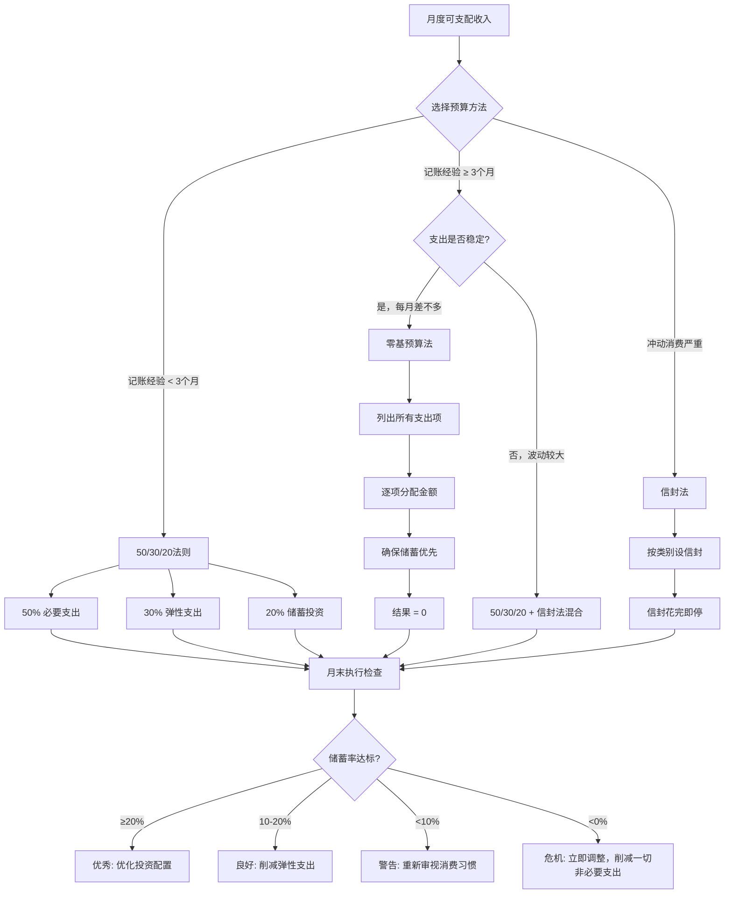
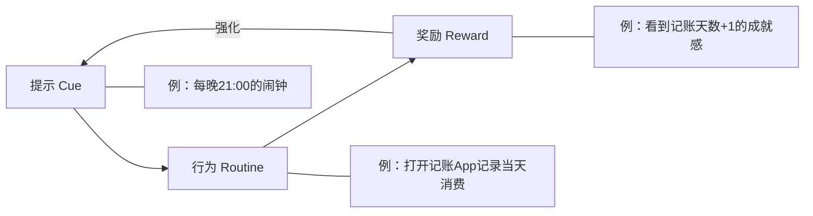
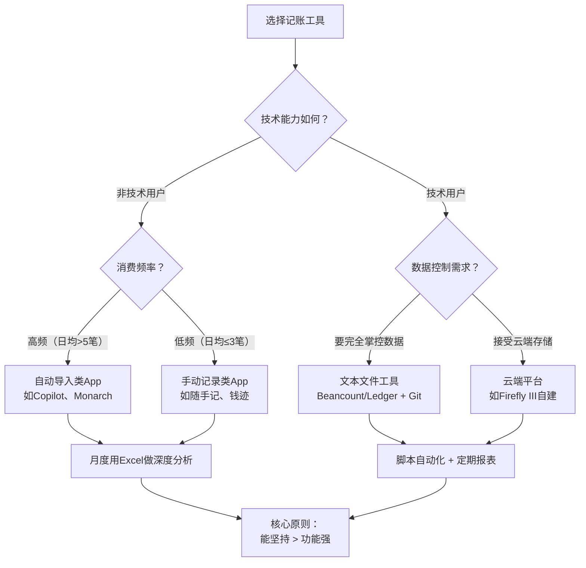
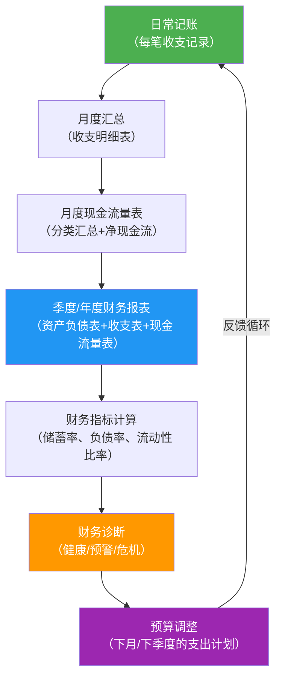

## 三、记账的理论基础

大多数人对记账的认知停留在"记流水账"——每天花几分钟把消费金额输入App，月底看看总数。这种理解就像把"学开车"理解为"会转方向盘"一样，忽略了方向盘背后的力学原理、交通规则和驾驶心理学。

记账不是一项机械操作，而是一套有理论支撑的认知系统。理解这些理论，你才能明白为什么有些人的记账习惯能持续十年，而有些人三天就放弃；为什么同样的数据，有人能从中发现"消费黑洞"，有人看了等于没看；为什么记账是所有财务管理的起点，而不是起点之一。

### 3.1 记账的认知框架：为什么"看见"能改变行为

#### 3.1.1 彼得·德鲁克的度量原理

管理学大师彼得·德鲁克（Peter Drucker）有一句被引用了无数遍的话："不能衡量的东西，就无法管理。"（What gets measured gets managed.）

这句话的底层逻辑是：**人类大脑无法准确感知自己行为的真实模式**。你以为自己"没怎么花钱"，但实际上每月有3000元消失在你完全说不清的地方。你以为自己"主要花在吃住上"，但实际上购物和娱乐占了三分之一。这不是智力问题，而是认知科学早已证实的心理现象——人类对自己行为的自我评估，与客观数据之间存在系统性偏差。

记账的本质就是**用客观数据替代主观感知**。它不改变你的消费行为本身，它改变的是你对消费行为的"看见"程度。而"看见"本身就会引发改变——这就是心理学中著名的"霍桑效应"（Hawthorne Effect）的一个变体：当人们意识到自己正在被观察（哪怕观察者是自己），行为就会自动调整。

**一个经典实验**：康奈尔大学的研究者让一组受试者记录每天的食物摄入量（不改变任何饮食习惯），结果发现仅仅是"记录"这个行为，就让受试者的日均热量摄入下降了约5%。他们没有刻意少吃，但"看见"自己吃了什么，自动改变了后续的选择。记账的"看见效应"与此完全一致。

#### 3.1.2 记账的三个层次

记账不是单一行为，而是一个从浅到深的三层体系：

| 层次 | 核心能力 | 解决的问题 | 典型产出 | 对应能力 |
|------|----------|-----------|----------|----------|
| **记录层** | 数据采集 | "我的钱花到哪里去了？" | 月度收支明细表 | 知道事实 |
| **分析层** | 模式识别 | "我的支出结构合理吗？" | 支出分类占比图、趋势图、异常值标注 | 理解模式 |
| **优化层** | 决策指导 | "我应该怎么调整？" | 预算方案、消费降级/升级建议、储蓄目标 | 采取行动 |

**大多数人只停留在第一层**——记录了数据但从不分析，就像去医院做了全套体检却从来不看报告。记录层产生数据，分析层产生洞察，优化层产生行动。三层之间是递进关系，但每一层都不可或缺：

- 没有记录层，分析层没有数据基础（巧妇难为无米之炊）
- 没有分析层，记录层只是数据坟墓（记了一堆数字不知道有什么用）
- 没有优化层，分析层只是纸上谈兵（知道问题但不采取行动）

**本节重点**：本节聚焦于第一层（记录）和第二层（分析）的理论基础。第三层（优化）涉及预算管理、消费策略等，在后续的"核心技巧·预算管理技巧"中详细展开。

#### 3.1.3 记账不是为了省钱——重新定义记账的目的

如果有人告诉你"记账是为了少花钱"，这个理解是错误的，而且这个错误理解是大多数人放弃记账的根本原因。

记账的目的是**了解**，不是**控制**。两者的核心区别：

| 维度 | "了解"导向的记账 | "控制"导向的记账 |
|------|-----------------|-----------------|
| 心态 | 好奇——"我想知道我的钱去了哪里" | 焦虑——"我要把每一分钱都管住" |
| 对大额消费的态度 | 分析——"这笔钱花得值不值？" | 自责——"又花多了！" |
| 对漏记的态度 | 补记或跳过，不影响继续 | 焦虑，觉得"今天白记了" |
| 对弹性支出的态度 | 合理范围内正常消费 | 尽量压缩，追求"越少越好" |
| 长期效果 | 可持续，形成终身习惯 | 3-6个月后因过度压抑而放弃 |
| 最终结果 | 自然而然地优化支出结构 | 报复性消费反弹 |

**为什么"控制"导向会失败？** 行为经济学中有一个概念叫"自我损耗"（Ego Depletion）：人的意志力是有限资源，每一次克制消费都在消耗意志力。当意志力耗尽时，就会出现"报复性消费"——节食一个月后暴饮暴食、节俭三个月后疯狂购物。这就是为什么"记账=省钱"的认知反而会导致更差的财务结果。

**正确的记账心态**：把记账当作"财务日记"——你写日记不是为了控制自己的生活，而是为了记录和理解。记账也一样：你记录消费不是为了惩罚自己，而是为了看见自己的消费模式，然后在"看见"的基础上做出更好的选择。这种选择是自然而然发生的，不需要刻意克制。

### 3.2 支出分类理论：从马斯洛需求到财务决策

#### 3.2.1 为什么需要分类——信息论的视角

如果没有分类体系，你的记账数据就是一堆杂乱的数字：38元、15元、200元、8元、1500元……这些数字本身毫无意义。分类的本质是**给数据增加结构**，让数据从"数字"变成"信息"。

信息论的创始人克劳德·香农（Claude Shannon）指出，信息的价值在于降低不确定性。一笔"38元"的消费如果归入"餐饮"分类，你就知道这是吃饭的钱；如果归入"娱乐"分类，你就知道这是休闲的钱。同一个数字，不同的分类承载了完全不同的信息。

**分类质量决定了分析质量**。一个设计良好的分类体系能让你在5秒内判断自己的支出结构是否合理；一个设计糟糕的分类体系会让你在50个分类中纠结半天，最后什么都分析不出来。

#### 3.2.2 马斯洛需求层次与支出分类的映射

亚伯拉罕·马斯洛（Abraham Maslow）在1943年提出的需求层次理论，虽然是心理学理论，但它为个人支出分类提供了一个天然的理论框架。不同层次的需求对应不同性质的支出，理解这个映射关系，你就能明白为什么有些支出"必须花"而有些支出"可以省"。

| 需求层次 | 对应支出类型 | 具体示例 | 优先级 | 支出弹性 | 优化空间 |
|----------|------------|---------|--------|---------|---------|
| **生理需求** | 生存性支出 | 房租/房贷、基本餐饮、水电、通勤交通 | 最高 | 极低（几乎不可压缩） | 有限（可通过搬家、自炊等降低） |
| **安全需求** | 保障性支出 | 保险、医疗、应急储蓄、基本穿着 | 高 | 低（压缩可能带来风险） | 中等（可通过优化保险方案调整） |
| **社交需求** | 关系性支出 | 聚餐、礼物、社交活动、通讯费 | 中 | 中（可根据社交策略调整） | 较大（优化社交圈层和方式） |
| **尊重需求** | 身份性支出 | 品牌消费、奢侈品、豪车、高端餐饮 | 低 | 高（完全可替代） | 很大（区分真实需求和面子消费） |
| **自我实现** | 发展性支出 | 学习培训、旅行体验、兴趣爱好、公益捐赠 | 中高 | 中（回报率通常很高） | 有限（通常值得增加而非减少） |

**关键洞察**：

**第一，优化顺序应该是从下往上压缩，从上往下增加。** 大多数人的错误恰恰相反——他们在生存性支出上精打细算（比如为了省5元走20分钟路），却在身份性支出上大手大脚（比如为了面子买超出预算的包）。正确的做法是：先确保生理和安全需求被充分满足，然后把身份性支出压缩到合理水平，最后把省下来的钱投入到发展性支出——因为发展性支出的投资回报率通常远高于身份性支出带来的满足感。

**第二，"自我实现"层的支出不是奢侈品，而是投资。** 花3000元学一门能涨薪的技能，投资回报率可能是几十倍；花3000元买一件穿两次就扔的衣服，投资回报率接近零。很多年轻人在"尊重需求"上花费过多，在"自我实现"上投入不足——这是最典型的支出错配。

**第三，同一笔支出可能跨越多个层次。** 一双500元的运动鞋，可能是生理需求（基本穿着）、社交需求（和朋友一起运动）、自我实现（保持健康的身体）。分类时应该根据消费的**主要动机**来归类，而不是纠结于"到底算哪一层"。

#### 3.2.3 支出弹性的三维分析模型

传统的"刚性支出/弹性支出"二分法过于简单。实际上，支出弹性需要从三个维度来评估：

| 维度 | 问题 | 示例（以餐饮为例） |
|------|------|-------------------|
| **时间弹性** | 这笔支出能延迟多久？ | 今天不吃会饿——时间弹性极低 |
| **金额弹性** | 这笔支出的金额能压缩多少？ | 从外卖改自炊，月支出可从4000降到2000——金额弹性高 |
| **替代弹性** | 这笔支出能用更低的替代方案吗？ | 咖啡可以从星巴克换成自制——替代弹性高 |

**三种弹性支出的组合模式**：

- **低时间弹性 + 低金额弹性 + 低替代弹性**：真正的刚性支出。房租（签了合同）、房贷（月供固定）、基本餐饮（不能不吃饭）属于此类。这类支出只能在签约时谈判，日常无法优化。
- **低时间弹性 + 高金额弹性 + 高替代弹性**：伪刚性支出。很多人认为"餐饮是刚性支出"，但餐饮的金额弹性和替代弹性其实很高——同样的营养需求，花销可以差3-5倍。外卖、打车、咖啡都属于此类。
- **高时间弹性 + 高金额弹性 + 高替代弹性**：纯弹性支出。购物、娱乐、旅游等。这类支出可以延迟、压缩或替代，是优化的主战场。

**实操意义**：当你分析自己的支出时，不要简单地按"刚性/弹性"分类，而是用三维模型评估。你会发现，很多你以为是"刚性"的支出，其实有很大的优化空间。

#### 3.2.4 投资性支出：一个常被忽视的特殊类别

在传统分类中，支出通常被分为"必要"和"非必要"。但这种二分法忽略了一个关键类别——**投资性支出**，即那些当下花了钱，但未来能产生回报的支出。

| 投资性支出类型 | 示例 | 投资回报形式 | 回报周期 |
|--------------|------|------------|---------|
| 教育培训 | 在线课程、职业认证、语言学习 | 涨薪、晋升、转行机会 | 6个月-3年 |
| 健康维护 | 健身、体检、营养补充 | 减少医疗支出、提升工作效率 | 长期 |
| 社交投资 | 行业活动、高质量聚餐 | 人脉资源、合作机会 | 不确定但通常正向 |
| 工具设备 | 高性能电脑、舒适工学椅 | 提升工作效率，减少身体损伤 | 1-3年 |
| 信息获取 | 付费新闻、行业报告、专业书籍 | 决策质量提升 | 持续 |

**投资性支出的核心判断标准**：花这笔钱之后，你未来获得的收益（可以是金钱、时间、健康、能力）是否超过这笔支出？如果答案是"是"，这笔支出就不应该被当作"消费"来压缩，而应该被当作"投资"来增加。

一个典型的反面案例：有人为了省钱，拒绝花200元买一本能提升工作效率的书。但他每个月花500元在奶茶上毫无感觉。200元的书可能让他每年节省100小时的工作时间，而500元的奶茶只能带来短暂的愉悦。这就是缺乏"投资性支出"意识导致的决策失误。

### 3.3 预算管理理论：从被动记录到主动规划

#### 3.3.1 预算的本质：有限资源的最优配置

如果记账是"看见过去"，预算就是"规划未来"。预算是基于历史记账数据，对未来的收入和支出做出合理预期和分配。

**预算的经济学本质**是"约束条件下的最优化问题"：

```text
目标：最大化人生效用（生活质量 + 长期目标达成）
约束条件：月收入 = 必要支出 + 弹性支出 + 储蓄投资
```

这个公式的核心信息是：你的收入是有限的，而需求是无限的。预算的作用不是消灭需求，而是在有限资源下做出最优的配置——把钱花在边际效用最高的地方。

**边际效用递减法则在支出中的应用**：经济学中有一个基本原理——随着消费数量的增加，每增加一单位消费带来的满足感是递减的。以餐饮为例：

- 第一顿饭：满足感100（生存需求）
- 第二顿饭（改善伙食）：满足感60
- 第三顿饭（加个甜点）：满足感30
- 第四顿饭（再加个奶茶）：满足感10
- 第五顿饭（夜宵烧烤）：满足感5，可能还有负效用（长胖、消化不良）

预算的意义就是帮你在每个类别中找到"边际效用等于边际成本"的最优点——超过这个点的消费，带来的满足感已经不值那个价格。

#### 3.3.2 三大预算管理理论详解

预算管理不是只有一种方法。不同的预算理论适合不同的人、不同的财务状况、不同的管理风格。以下是最主流的三种理论：

**理论一：50/30/20法则——简单至上的分类预算**

50/30/20法则是美国参议员伊丽莎白·沃伦（Elizabeth Warren）在《All Your Worth》一书中提出的。它的核心思想是：将税后收入按固定比例分配到三个大桶中。

| 类别 | 比例 | 包含内容 | 设计原理 |
|------|------|---------|---------|
| **必要支出（Needs）** | 50% | 房租/房贷、基本餐饮、交通、水电、保险、基本通讯 | 这些支出是生存和工作的基本保障 |
| **弹性支出（Wants）** | 30% | 娱乐、购物、社交、旅游、订阅服务、美食升级 | 这些支出提升生活质量但非必需 |
| **储蓄投资（Savings）** | 20% | 应急储备金、基金定投、还债加速、养老金 | 这些支出为未来做准备 |

**50/30/20法则的优势**：

- 极度简单——只有三个桶，不需要精细分类
- 记忆负担低——只需要记住三个数字
- 容错性高——每个桶内有30-50%的调整空间
- 心理阻力小——30%的弹性支出意味着你不需要苦行僧式地省钱

**50/30/20法则的局限**：

- 对高房价城市不友好——一线城市房租可能占收入的40%以上，50%的"必要支出"可能不够
- 不区分收入水平——月入5千和月入5万的"50%"含义完全不同
- 假设过于简化——现实中的支出往往跨越"必要"和"弹性"的边界

**适用场景**：刚开始记账的新手、收入相对稳定的人、不想花太多时间在预算管理上的人。

**理论二：零基预算法——每一分钱都有去处**

零基预算法（Zero-Based Budgeting，ZBB）源自企业管理领域，由德州仪器的彼得·皮特（Peter Pyhrr）在1970年代提出。核心思想是：每个月的预算从零开始编制，不参考上月预算，每一分钱都要有明确的去向。

**核心公式**：

```text
收入 - 所有支出 - 所有储蓄 - 所有投资 = 0
```

注意最后一个数字是**零**。这意味着你的每一块钱都被分配了任务——要么被花掉，要么被存起来，要么被投资。没有"无主"的钱。

**零基预算的操作流程**：

1. 列出本月的预期收入（工资、副业、投资收益等）
2. 优先列出储蓄和投资目标（储蓄率至少20%）
3. 列出所有固定支出（房租、房贷、保险、通讯套餐等）
4. 列出所有预期弹性支出（餐饮、交通、娱乐等）
5. 如果收入减去以上各项不等于零，调整弹性支出直到为零
6. 执行过程中，如果某项超支，必须从其他项中等额扣除

**零基预算的优势**：

- 极其精确——每一分钱都有明确的用途
- 避免"月末才发现超支"的问题
- 强制储蓄——储蓄在消费之前分配
- 灵活性高——每月都可以根据实际情况重新分配

**零基预算的局限**：

- 操作成本高——每月需要花30-60分钟编制预算
- 对不规律收入（自由职业者）不太友好
- 过于精确可能导致"预算焦虑"

**适用场景**：有3个月以上记账经验的人、需要严格控制支出的人、有明确财务目标的人（如攒首付）。

**理论三：信封法——物理约束的行为设计**

信封法（Envelope Method）是最古老的预算管理方法之一，其历史可以追溯到现金时代。核心思想是：将预算金额分配到不同的"信封"中，每个信封对应一个消费类别，信封里的钱花完了就不能再花。

**数字时代的信封法实现**：

在电子支付普及的今天，物理信封已经不太现实，但信封法的原理可以通过以下方式数字化：

- **银行子账户**：在工资卡下开设多个子账户，每个子账户对应一个消费类别
- **多张银行卡**：不同卡用于不同用途（生活卡、娱乐卡、储蓄卡）
- **记账App的预算功能**：大多数记账App都支持按类别设置预算限额
- **支付宝/微信的零钱分组**：利用平台自带的分账功能

**信封法的心理学基础——心理账户理论**：

2017年诺贝尔经济学奖得主理查德·塞勒（Richard Thaler）提出的"心理账户"（Mental Accounting）理论解释了信封法为何有效。该理论指出，人们会自动在心里把钱分成不同的"账户"，并且对不同账户的钱有不同的消费倾向。

例如，你钱包里的1000元和年终奖里的1000元，在经济学上是完全等价的，但你对它们的消费态度完全不同——钱包里的钱你会精打细算，年终奖的钱你更倾向于"挥霍"。

信封法正是利用了这种心理机制：通过物理或数字的方式把钱分成不同的"信封"，每个信封有明确的用途，你就不会在一个类别中超支，因为超支意味着"信封空了"——这种物理/视觉约束比抽象的"预算限制"更有效。

**信封法的优势**：

- 视觉直观——看到信封变薄/变空就有紧迫感
- 天然防超支——花完就不能再花
- 无需复杂的数字计算
- 特别适合控制冲动消费

**信封法的局限**：

- 电子支付时代实施困难（除非用数字信封）
- 不够灵活——某个信封超支时需要手动调整
- 不适合收入和支出波动较大的人

**适用场景**：容易冲动消费的人、对数字不敏感的人、偏好直观管理方式的人。

#### 3.3.3 预算方法选择的决策框架

三种预算理论各有优劣，选择哪种取决于你的个人特质和财务状况：



**选择建议总结**：

| 你的情况 | 推荐方法 | 理由 |
|----------|---------|------|
| 完全新手 | 50/30/20法则 | 简单易记，建立"分配"意识 |
| 有记账习惯但月月超支 | 零基预算法 | 精确到每一分钱，堵住漏洞 |
| 冲动消费严重 | 信封法 | 物理约束比意志力更可靠 |
| 收入波动大 | 50/30/20 + 信封法混合 | 大框架用比例，具体用信封 |
| 高收入但存不下钱 | 零基预算法 | 问题往往出在"不知道钱花哪了" |
| 已有稳定习惯 | 保持现有方法 | 不要为了"更好"而破坏已有的好习惯 |

**最重要的原则**：没有"最好的"预算方法，只有"你能坚持的"预算方法。一个你能坚持执行6个月的简单方法，远比一个你执行3天就放弃的完美方法有价值。

### 3.4 记账的行为经济学基础：为什么大脑不擅长管钱

#### 3.4.1 五大财务决策偏误与记账的对冲作用

人类大脑的决策机制是在漫长的进化过程中形成的，它适应的是一个"即时回报"的环境——打到猎物马上吃掉，找到果实马上采摘。但现代财务决策需要的是"延迟回报"——今天的储蓄要在几十年后才产生最大价值。这种错配导致了系统性的财务决策偏误。

| 偏误 | 表现 | 对财务的影响 | 记账如何对冲 |
|------|------|------------|------------|
| **即时满足偏误** | 偏好当下的快乐而非未来的收益 | 月光、过度消费、不储蓄 | 记账让你"看见"即时消费的累积效应 |
| **锚定效应** | 被第一个看到的数字锚定 | 冲动购买打折商品 | 记账数据提供"历史均价"作为理性参考 |
| **损失厌恶** | 对损失的痛苦感是获得快乐感的2倍 | 不止损亏损投资、过度保守 | 记账让账面数据替代主观感受 |
| **从众效应** | 跟随他人的消费行为 | 攀比消费、跟风投资 | 记账让你聚焦于自己的财务目标 |
| **心理账户** | 对不同来源的钱区别对待 | 年终奖被挥霍、意外收入被浪费 | 统一记账消除"意外之财"的心理特权 |

**记账的"去偏误"机制**：记账不是让你变成一个冷冰冰的计算机器，而是通过数据反馈来校准你的主观判断。就像体重秤不会让你自动变瘦，但它会告诉你"你比你以为的重了5公斤"——这个信息本身就会改变你的行为。

#### 3.4.2 前景理论与"消费痛苦感"管理

丹尼尔·卡尼曼（Daniel Kahneman）和阿摩司·特沃斯基（Amos Tversky）提出的前景理论（Prospect Theory）揭示了一个关键现象：人们对"损失"的感知是相对于某个参考点的，而不是绝对的。

这个理论对记账有两个重要启示：

**启示一：支付方式影响消费痛苦感。** 现金支付时，你看着钱包里的钱变少，"损失感"最强；信用卡支付时，你只看到一个数字，损失感大大降低；手机扫码支付时，几乎没有任何损失感——因为你看不到任何"减少"的东西。

这就是为什么电子支付时代的消费比现金时代更高：支付的"摩擦感"越低，消费越容易失去控制。记账的作用是重建这种"摩擦感"——当你知道今晚这顿外卖要记到账上、月底会出现在支出报表中时，你对这笔消费的感知会更加清醒。

**启示二：频率影响感知。** 每天记3笔小额消费（奶茶15+午餐30+零食10=55元），你可能会觉得"才55元不多"。但如果每周汇总一次（55×7=385元），你会意识到"每周385元不是小数目"。如果每月汇总一次（385×4=1540元），你一定会震惊——"每月光零食和奶茶就花了1500多？！"

这就是为什么**定期查看汇总数据**比每天看流水更有价值。记账数据的分析频率建议：每日看流水（保持意识），每周看趋势（发现模式），每月看结构（做出决策），每年看全局（规划未来）。

#### 3.4.3 习惯回路理论与记账习惯的建立

查尔斯·杜希格（Charles Duhigg）在《习惯的力量》中提出的"习惯回路"模型，解释了为什么有些习惯能自动维持，而有些习惯总是半途而废。

一个完整的习惯回路由三个环节组成：



**记账习惯的三个关键要素**：

- **提示（Cue）**：必须有一个固定的时间或事件触发记账行为。最有效的提示是"时间+地点"的组合——比如"每晚洗完澡后坐在书桌前"。不要依赖"记性好"，要依赖"环境设计"。
- **行为（Routine）**：记账行为本身要尽可能简单。前21天只记录金额和一级分类，不加备注、不选标签、不拍照。行为越简单，坚持概率越高。
- **奖励（Reward）**：必须有即时反馈。最有效的奖励是"视觉反馈"——看到连续记账天数增加、看到月度报表图表、看到储蓄率上升。很多记账App的"打卡"功能就是基于这个原理。

**21天习惯养成的时间线**：

| 阶段 | 时间 | 心理状态 | 策略 |
|------|------|---------|------|
| 启动期 | 第1-7天 | 新鲜感 + 不习惯 | 降低标准：每天记1笔就算成功 |
| 适应期 | 第8-14天 | 开始形成记忆，偶尔忘记 | 设置提醒：闹钟+App Widget |
| 稳定期 | 第15-21天 | 基本自动化，偶尔需要提醒 | 扩展范围：从1笔增加到全部消费 |
| 习惯期 | 第22天+ | 自动执行，不记反而不舒服 | 升级质量：增加分析和优化 |

### 3.5 记账的数据分析基础：从数字到洞察

#### 3.5.1 描述性统计：你的财务数据在说什么

记账数据的分析不需要高深的统计学知识，但需要掌握几个基本概念：

**均值（Average）**：月均支出 = 年度总支出 ÷ 12。这是最基本的统计量，但它可能产生误导——如果某个月有一笔大额支出（如旅行花了2万），均值会被拉高，不能反映"典型月份"的支出水平。

**中位数（Median）**：将12个月的支出从低到高排列，取第6和第7个月的平均值。中位数比均值更能反映"典型月份"的支出水平，因为它不受极端值的影响。

**标准差（Standard Deviation）**：衡量支出的波动程度。标准差越大，说明你的支出越不稳定——好的月份和坏的月份差距很大。低标准差意味着支出可预测，有利于预算管理。

**实操建议**：

```text
每月分析时，同时看三个数字：
1. 本月支出 vs 月均值——是高于还是低于平均水平？
2. 本月支出 vs 中位数——更接近"典型月份"还是异常值？
3. 近6个月标准差——支出波动是在增大还是减小？
```

#### 3.5.2 趋势分析：识别支出的长期走势

单月数据说明不了什么问题，但6-12个月的趋势数据能揭示重要的模式：

**需要关注的五种趋势信号**：

| 趋势信号 | 数据表现 | 可能原因 | 应对策略 |
|----------|---------|---------|---------|
| **支出增速 > 收入增速** | 储蓄率逐月下降 | 生活方式膨胀（Lifestyle Inflation） | 审视是否有不必要的升级消费 |
| **某类别占比持续上升** | 如餐饮从15%升到25% | 消费习惯恶化或生活状态变化 | 拆分二级分类定位原因 |
| **季节性波动过大** | 某月支出暴增（如双十一、春节） | 大额集中消费 | 提前按月预存，平滑支出曲线 |
| **"其他"类别持续增长** | 从5%增长到15% | 分类体系不完善 | 优化分类，把高频项独立出来 |
| **储蓄率持续下降** | 从25%降到10% | 收入未增长但支出在增加 | 启动预算管理，设置储蓄底线 |

#### 3.5.3 结构分析：支出占比的健康标准

除了看趋势，还需要评估当下的支出结构是否健康。以下是一个基于大量记账数据总结的参考标准：

```text
健康的月度支出结构（以中等收入为例）：

住房相关:     25-35%  ████████████████
餐饮食品:     10-20%  ██████████
交通出行:      5-10%  █████
日用消费:      5-10%  █████
保险医疗:      3-8%   ███
教育培训:      3-10%  ████（投资性支出，越高越好）
娱乐社交:      5-15%  ██████
储蓄投资:     ≥20%    ████████████████
其他杂项:      0-5%   ██（越低越好）
```

**结构异常的诊断方法**：

当某个类别的占比超出"健康范围"时，按以下步骤诊断：

1. **拆分二级分类**——找到占比最高的子类别
2. **分析消费频次**——是"少量大额"还是"大量小额"
3. **评估消费动机**——是"需要"还是"想要"还是"习惯"
4. **寻找替代方案**——是否有更经济的替代方式
5. **设定优化目标**——给一个具体的降比目标和时间表

#### 3.5.4 从账房先生到AI记账：个人记账工具的四次革命

理解记账工具的演进历史，有助于你选择最适合当下的方案：

| 时代 | 工具 | 记录方式 | 分析能力 | 局限性 |
|------|------|---------|---------|--------|
| **纸质时代**（~2000年） | 账本、记账簿 | 手写 | 人工汇总，极其耗时 | 容易遗漏，无法自动统计 |
| **电子表格时代**（2000-2010） | Excel、Numbers | 手动输入公式 | 可自动计算，图表可视化 | 需要Excel技能，移动端不便 |
| **App时代**（2010-2020） | 随手记、挖财、钱迹 | 手机录入+部分自动 | 自动分类、报表、预算 | 仍需大量手动操作 |
| **智能时代**（2020-至今） | 自动导入+AI分类+语音记账 | 账单自动同步 | 智能分类、异常提醒、预测分析 | 数据安全和隐私问题 |

**当前最佳实践**：利用App时代的便利性（自动导入、移动记录），结合电子表格时代的灵活性（自定义分析），再叠加智能时代的自动化（AI分类、异常检测）。

#### 3.5.5 单式记账与复式记账：两种记账范式的理论对比

**单式记账（Single-Entry Bookkeeping）**：每笔交易只记录一次——收入记一笔，支出记一笔。绝大多数个人记账App采用的就是单式记账。它的优点是简单直观，缺点是无法自动核对（如果漏记了一笔，你可能完全不知道）。

**复式记账（Double-Entry Bookkeeping）**：每笔交易同时记录在两个账户——"从哪里来"和"到哪里去"。这个概念最早由意大利数学家卢卡·帕乔利（Luca Pacioli）在1494年的《算术、几何、比与比例概要》中系统描述，被沃伦·巴菲特称为"人类智慧的伟大发明之一"。

**复式记账的核心原理——会计等式**：

```text
资产 = 负债 + 所有者权益
```

这个等式必须始终成立。每笔交易都会同时影响等式两边（或同侧的两个科目），确保"借贷必相等"。以"花30元买午餐"为例：

| 操作 | 借方（Debit） | 贷方（Credit） |
|------|-------------|---------------|
| 消费30元午餐 | 餐饮支出 +30 | 现金/银行存款 -30 |
| 收到10000元工资 | 银行存款 +10000 | 工资收入 +10000 |
| 信用卡还款5000元 | 信用卡负债 -5000 | 银行存款 -5000 |

**复式记账在个人财务中的独特价值**：当你同时拥有银行存款、现金、信用卡、支付宝余额、微信零钱、基金账户等多个"钱包"时，单式记账无法回答一个关键问题——"我的总资产到底是多少？"复式记账通过资产账户的自动汇总，可以随时给出准确答案。

| 维度 | 单式记账 | 复式记账 |
|------|---------|---------|
| 学习门槛 | 极低 | 较高（需要理解借贷概念） |
| 记录速度 | 快（一笔一条） | 慢（一笔两条） |
| 纠错能力 | 弱（漏记不易发现） | 强（借贷不平衡会暴露错误） |
| 资产追踪 | 需手动维护 | 自动汇总所有账户 |
| 适合场景 | 收支简单的个人 | 有投资、副业、多账户的复杂财务 |
| 工具支持 | 所有记账App | Beancount、GnuCash、Ledger、hledger |
| 数据完整性 | 取决于人的自律 | 系统性保障 |
| 版本控制 | 不适用 | 可配合Git追踪每一次变更 |

**实践建议**：大多数人使用单式记账就足够了。如果你符合以下任一条件，建议考虑复式记账：

- 同时管理5个以上资金账户（银行卡+电子钱包+投资账户）
- 有副业收入或自由职业，需要区分个人和业务流水
- 持有多种投资品种（基金、股票、债券、加密货币），需要追踪成本和收益
- 希望用Git版本控制财务数据，实现"时光机"般的回溯能力

推荐工具方面，Beancount使用纯文本文件记录，天然适合程序员和极客——可以用编辑器快速录入、用脚本自动化处理、用Git追踪变更历史。GnuCash提供图形界面，更适合非技术用户。Ledger和hledger是命令行工具，性能极佳，适合处理大量历史数据。

### 3.6 记账的数据质量理论：准确性、完整性与一致性

数据质量是记账系统的生命线。一套记录不准确、不完整的账本，不仅没有分析价值，还可能误导决策——基于错误数据做出的财务判断，比不做判断更危险。

#### 3.6.1 数据质量的四个维度

记账数据的质量可以从四个维度来评估：

| 维度 | 定义 | 常见威胁 | 保障措施 |
|------|------|---------|---------|
| **准确性** | 记录的金额、分类与实际交易一致 | 手误输错金额、分类选错 | 电子账单导入、双重核对 |
| **完整性** | 所有交易都被记录，无遗漏 | 忘记记录现金消费、小票丢失 | 每日对账、多渠道交叉验证 |
| **及时性** | 交易发生后尽快记录 | 拖延到周末才记、记忆模糊 | 实时记录习惯、自动导入 |
| **一致性** | 相同类型的交易始终使用相同分类 | 今天把咖啡归"餐饮"明天归"娱乐" | 分类规则文档化、定期审查 |

**数据质量的"木桶效应"**：四个维度中，最弱的那个决定了整体数据质量。记录了1000笔但有200笔分类混乱，不如记录500笔但每笔都准确清晰。

#### 3.6.2 漏记检测与对账方法论

即使最自律的人也会漏记。关键是建立一套系统化的对账流程来发现和补救遗漏：

**逐笔核对法（最严格）**：

1. 导出本月银行/支付宝/微信账单
2. 逐笔与记账App中的记录比对
3. 标记未匹配的交易（App中有但账单中没有 → 可能是重复记录；账单中有但App中没有 → 漏记）
4. 补记遗漏交易，删除重复记录

**总额核对法（高效实用）**：

1. 月末从银行App导出本月总支出
2. 查看记账App的本月总支出
3. 计算差异率：`差异率 = |记账总额 - 银行总额| / 银行总额 × 100%`
4. 差异率 < 5% → 数据质量合格；5%-15% → 需要排查；> 15% → 数据不可靠

**账户余额校验法（复式记账专用）**：

```text
预期余额 = 上月余额 + 本月收入 - 本月支出
实际余额 = 银行App显示的当前余额
差额 = 实际余额 - 预期余额
```

如果差额为零，说明记录完全准确。如果差额不为零，差额就是"消失的钱"——要么漏记了收入，要么漏记了支出，要么有未记录的转账。

#### 3.6.3 分类一致性维护：规则文档化

分类不一致是记账数据中最隐蔽的质量问题。你可能在三个月内把"咖啡"分别归入了"餐饮""饮料""零食""办公""社交"五个不同的分类——这使得该类别的趋势分析完全失去意义。

**解决方案：建立个人分类规则文档**。

```markdown
## 我的分类规则

### 餐饮
- 堂食、外卖、自购食材 → 餐饮
- 咖啡（独立消费）→ 餐饮/饮品
- 咖啡（和朋友一起）→ 社交
- 请客吃饭 → 社交（非餐饮）

### 交通
- 地铁/公交/通勤打车 → 交通/通勤
- 出游打车/租车 → 旅游
- 拼车顺风车 → 交通/通勤

### 购物
- 日用品（纸巾、洗衣液）→ 日用
- 衣服鞋子（基础款）→ 穿着
- 衣服鞋子（品牌溢价）→ 品牌消费
```

这份文档不需要很正式，可以用备忘录或笔记App维护。关键是在分类拿不准时，有一个"权威参考"可以查阅，而不是每次凭感觉随机归类。建议每季度审查一次，根据实际消费模式调整分类规则。

### 3.7 记账工具选择理论：选型矩阵与技术架构

#### 3.7.1 记账工具的技术架构分类

理解记账工具的技术架构，有助于你在选择工具时做出更明智的决策：

| 架构类型 | 代表工具 | 数据存储 | 优势 | 风险 |
|----------|---------|---------|------|------|
| **本地App** | 随手记、钱迹、MoneyWiz | 手机本地/本地同步 | 速度快、离线可用 | 手机丢失可能丢数据 |
| **云端App** | 挖财、微力记账 | 云服务器 | 多设备同步、不依赖单一设备 | 公司倒闭数据可能丢失 |
| **银行自动导入** | Copilot、Monarch Money | 云端 | 零手动录入 | 仅支持绑定的银行，隐私顾虑 |
| **文本文件** | Beancount、Ledger | 纯文本文件 | 完全掌控数据、可Git管理 | 需要技术能力 |
| **电子表格** | Excel、Google Sheets | 本地/云端 | 完全自定义、无学习曲线 | 容易出错、无自动导入 |
| **AI辅助** | 语音记账、拍照识别 | 取决于底层平台 | 录入极快 | 准确率需要人工复核 |

#### 3.7.2 记账工具选型的决策框架

选择记账工具不是选"功能最多的"，而是选"你最可能坚持使用的"。以下是一个基于使用场景的选型决策矩阵：



**选型的五个关键评估维度**：

| 维度 | 评估问题 | 权重 |
|------|---------|------|
| **录入效率** | 记一笔需要多少秒？能否自动导入？ | 最高（决定能否坚持） |
| **分类灵活性** | 能否自定义分类层级？能否批量修改？ | 高（决定分析质量） |
| **报表能力** | 能否生成趋势图、占比图？能否导出数据？ | 中（决定分析深度） |
| **数据可迁移性** | 能否导出为通用格式（CSV/JSON）？换工具时数据会丢失吗？ | 中（长期保障） |
| **隐私安全** | 数据是否需要上传云端？公司是否有数据泄露历史？ | 视个人敏感度而定 |

#### 3.7.3 记账数据的隐私与安全

记账数据是最敏感的个人数据之一——它完整暴露了你的收入水平、消费习惯、生活轨迹甚至人际关系。保护记账数据的安全，是理论基础中不可忽视的一环。

**核心风险场景**：

| 风险 | 场景 | 后果 | 防范措施 |
|------|------|------|---------|
| **数据泄露** | 记账App公司被黑客攻击 | 收入和消费记录被公开 | 选择信誉良好的工具，开启两步验证 |
| **账号被盗** | 弱密码或密码复用 | 账户被入侵，数据被篡改 | 使用强密码+两步验证，不在公共WiFi下登录 |
| **设备丢失** | 手机丢失且未加密 | 所有本地财务数据暴露 | 手机设置密码/指纹锁，启用远程擦除 |
| **云端依赖** | 记账公司倒闭或停止服务 | 历史数据可能无法取回 | 定期导出数据备份，选择支持数据导出的工具 |
| **授权过广** | 自动导入需要银行账号授权 | 银行凭证被第三方存储 | 使用OAuth授权（不暴露密码），定期审查授权 |

**数据安全的最佳实践**：

1. **本地优先**：如果对隐私高度敏感，优先选择数据存储在本地的工具（如Beancount、Excel）
2. **定期备份**：每月导出一次CSV备份，存储在加密的本地硬盘或私人云盘中
3. **最小授权原则**：自动导入类工具只绑定必要的银行账户，不绑定的账户手动记录
4. **数据脱敏**：如果需要分享记账数据（如请教理财顾问），先脱敏处理姓名、账号等信息
5. **退出计划**：使用任何工具前，先确认它支持数据导出——如果有一天你想换工具，数据能带走

### 3.8 记账的习惯持续理论：从21天到终身

#### 3.8.1 超越21天：习惯维持的四个阶段

3.4.3节介绍了习惯回路理论和21天养成计划，但21天只是习惯的"启动阶段"。要让记账成为终身习惯，需要理解习惯维持的完整生命周期：

| 阶段 | 时间 | 核心挑战 | 应对策略 |
|------|------|---------|---------|
| **启动期** | 第1-21天 | 忘记、嫌麻烦、看不到效果 | 降低标准、设置提醒、即时奖励 |
| **适应期** | 第22-60天 | 新鲜感消退、开始质疑价值 | 加入分析环节、发现第一个"意外发现" |
| **巩固期** | 第61-180天 | 生活变动打断节奏（出差、旅行、生病） | 允许中断但不放弃、建立"重启协议" |
| **内化期** | 第180天+ | 形成自动化行为，不记反而不舒服 | 升级工具和方法，向复式记账进阶 |

**"重启协议"的概念**：任何习惯都可能被生活打断。关键不是"永远不中断"，而是"中断后能快速重启"。建议预设一个重启协议：

```text
如果连续3天没有记账：
1. 不要试图"补记"过去3天的每一笔（太痛苦，会进一步拖延）
2. 从今天开始继续记录，过去的3天标记为"未记录期"
3. 月末对账时，从银行账单中补录这3天的总额（只记总数，不逐笔）
4. 不要自责——中断是正常的，重启才是关键
```

#### 3.8.2 记账倦怠的识别与应对

即使成功养成了记账习惯，大多数人也会在某个阶段经历"记账倦怠"——觉得记账变得无趣、没有收获、想要放弃。

**记账倦怠的五个信号**：

1. 记账从"顺手做"变成"强迫自己做"
2. 开始频繁漏记，且不在意
3. 月底不再看报表，觉得"看了也没用"
4. 对消费数据不再感到意外或好奇
5. 记账时间明显缩短（不是因为更熟练，而是因为敷衍）

**应对记账倦怠的五种策略**：

| 策略 | 具体做法 | 原理 |
|------|---------|------|
| **降低频率** | 从逐笔记录改为每日汇总记录 | 减少操作次数，降低心理负担 |
| **切换工具** | 换一个界面不同的记账App | 新鲜感重新激活兴趣 |
| **引入社交** | 和伴侣/朋友一起记账，互相监督 | 社交压力转化为动力 |
| **设定新目标** | 从"记录"升级为"优化某个类别" | 从被动记录变为主动挑战 |
| **回顾成就** | 翻看过去的报表，计算累计节省的金额 | 用数据证明记账的价值 |

### 3.9 记账与财务报表的衔接：数据流转的完整链路

记账不是孤立的行为，它是整个个人财务管理体系的数据来源。理解记账数据如何流向后续的财务报表和决策，你才能明白为什么"记好账"是所有财务管理的起点。



**数据流转的关键节点**：

1. **记账 → 汇总**：每日记账数据在月末自动汇总为收支明细表。这一步的关键是分类准确性——如果分类混乱，汇总后的数据就无法反映真实的支出结构。
2. **汇总 → 报表**：月度汇总数据填充到现金流量表中，与资产负债表的期初/期末数据形成勾稽关系。如果三张表对不上，说明有遗漏或错误。
3. **报表 → 指标**：从报表数据中计算关键财务指标（储蓄率、负债率等）。这些指标是判断财务健康的核心依据。
4. **指标 → 诊断**：将指标与健康标准对比，判断财务状态。储蓄率<10%是预警信号，负债率>70%是危险信号。
5. **诊断 → 预算**：根据诊断结果调整下月预算。支出超标的类别需要压缩，储蓄率不足需要提高储蓄优先级。
6. **预算 → 记账**：预算为记账提供"参照系"——你不是盲目地记录，而是带着"这个月预算还剩多少"的意识去记录。

**这个闭环的核心价值**：记账为预算提供数据基础，预算为记账提供目标导向，两者相互强化。没有预算的记账是"盲记"——记了不知道有什么用；没有记账的预算是"空想"——规划了没有数据支撑。

### 3.10 常见认知误区与纠正

#### 误区一："记账太麻烦了，没时间"

**真相**：现代记账工具已经将每笔记录的时间压缩到10-15秒。一天消费5笔，总耗时不到2分钟。很多人每天刷短视频1-2小时不觉得麻烦，2分钟记账却觉得"太麻烦"——这不是时间问题，是优先级问题。

**纠正**：用最简单的方式开始。第一个月只记录餐饮和购物两个类别的总额（不需要逐笔），每天晚上花1分钟在备忘录里写两个数字。建立习惯后再升级工具和精度。

#### 误区二："记账会让我不开心，因为总看到自己花多了"

**真相**：这种不开心不是记账导致的，而是你的消费行为导致的。记账只是像一面镜子——镜子不会让你变丑，它只是让你看到真实的自己。不照镜子，你的脸也不会变好看。

**纠正**：把记账的心态从"自我审判"切换到"自我观察"。你不是法官，你只是一个好奇的观察者——"有趣，我这个月奶茶花了800元"，然后决定下个月要不要调整。没有对错，只有选择。

#### 误区三："小钱不用记，记大账就行"

**真相**：正是那些"小钱"构成了你最大的财务黑洞。一杯奶茶15元、一次打车20元、一包零食10元——每一笔都"不值一记"，但一个月下来可能是2000-3000元。这就是大卫·巴赫（David Bach）提出的"拿铁因子"（Latte Factor）理论：每天小额的非必要消费，长期累积会侵蚀大量财富。

**纠正**：前3个月，每笔都记。目的不是为了抠每一笔小钱，而是为了发现你的"拿铁因子"到底是哪些。当你发现某个类别的小额消费月总额超预期时，再决定是否需要调整。

#### 误区四："我记了三个月，感觉没什么用"

**真相**：记账的价值在第4-6个月才开始显现——因为你需要至少3个月的数据才能做趋势分析和结构分析。前3个月是"数据积累期"，就像健身前3个月你可能看不到明显效果，但基础正在建立。

**纠正**：给自己设定一个"最低承诺"——坚持记账6个月，然后做一次完整的年度/半年度分析。如果6个月后你觉得没有价值，再放弃也不迟。但大多数人在这个时间点已经发现了至少一个让自己意外的"消费黑洞"。

#### 误区五："用Excel记账比App更专业"

**真相**：工具的好坏取决于你能否坚持使用，而不是功能是否强大。Excel功能确实强大，但它的录入速度远不如专业记账App（每笔需要打开文件、找到单元格、输入数据），这个额外的摩擦会显著降低坚持率。

**纠正**：在手机App上记录日常消费（追求速度和便利），在Excel/Google Sheets上做月度/年度分析（追求灵活性和自定义）。两者配合使用，而不是二选一。

### 3.11 本节核心框架总结

记账的理论基础可以用一个完整的框架来概括：

```mermaid
graph TD
    A["记账的理论基础"] --> B["认知框架"]
    A --> C["分类理论"]
    A --> D["预算理论"]
    A --> E["行为经济学"]
    A --> F["数据分析"]
    A --> G["历史演进"]
    A --> H["数据质量"]
    A --> I["工具选择"]
    A --> J["习惯持续"]
    A --> K["财务报表衔接"]

    B --> B1["德鲁克度量原理：看见→管理"]
    B --> B2["三层递进：记录→分析→优化"]
    B --> B3["目的重定义：了解≠控制"]

    C --> C1["马斯洛需求映射"]
    C --> C2["三维弹性分析模型"]
    C --> C3["投资性支出识别"]

    D --> D1["50/30/20法则"]
    D --> D2["零基预算法"]
    D --> D3["信封法"]

    E --> E1["五大决策偏误与记账对冲"]
    E --> E2["前景理论与支付摩擦"]
    E --> E3["习惯回路与21天养成"]

    F --> F1["描述性统计：均值/中位数/标准差"]
    F --> F2["趋势分析：五种异常信号"]
    F --> F3["结构分析：健康占比标准"]

    H --> H1["数据质量四维度"]
    H --> H2["漏记检测与对账方法"]
    H --> H3["分类一致性维护"]

    I --> I1["工具架构分类"]
    I --> I2["选型决策矩阵"]
    I --> I3["数据隐私与安全"]

    J --> J1["习惯维持四阶段"]
    J --> J2["重启协议"]
    J --> J3["倦怠识别与应对"]

    style A fill:#1a73e8,color:#fff
    style B fill:#34a853,color:#fff
    style C fill:#fbbc04,color:#000
    style D fill:#ff9800,color:#fff
    style E fill:#9c27b0,color:#fff
    style F fill:#ea4335,color:#fff
    style G fill:#46bdc6,color:#fff
    style H fill:#e91e63,color:#fff
    style I fill:#00bcd4,color:#fff
    style J fill:#795548,color:#fff
    style K fill:#607d8b,color:#fff
```



**核心认知回顾**：

1. 记账的本质是"看见"，不是"控制"。看见本身就会改变行为。
2. 支出分类要基于需求层次和弹性维度，而不是随意划分。投资性支出应该被增加而不是压缩。
3. 没有"最好的"预算方法，只有"你能坚持的"预算方法。从最简单的开始，逐步升级。
4. 大脑天生不擅长做财务决策，记账是最重要的"去偏误"工具。
5. 记账数据的分析比记录更重要——每月花10分钟看报表，比每天花10分钟记流水更有价值。
6. 数据质量是记账系统的生命线——准确性、完整性、及时性、一致性，缺一不可。
7. 选择记账工具的核心标准是"能否坚持使用"，而非"功能是否强大"。录入效率是第一优先级。
8. 记账习惯的建立不是21天就够的，需要经历启动→适应→巩固→内化四个阶段，关键是建立"重启协议"。
9. 记账数据是最敏感的个人数据之一，保护隐私安全与记录数据同等重要。
10. 记账是整个财务管理体系的数据来源，它是连接"消费行为"和"财务决策"的桥梁。

**下一步行动**：理论的价值在于指导实践。如果你还没有记账习惯，现在就下载一个记账App，今天记录3笔消费——不需要完美，只需要开始。如果你已经在记账，花10分钟回顾上个月的数据，看看有没有让你意外的发现。

***
