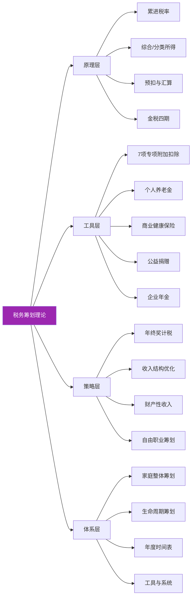
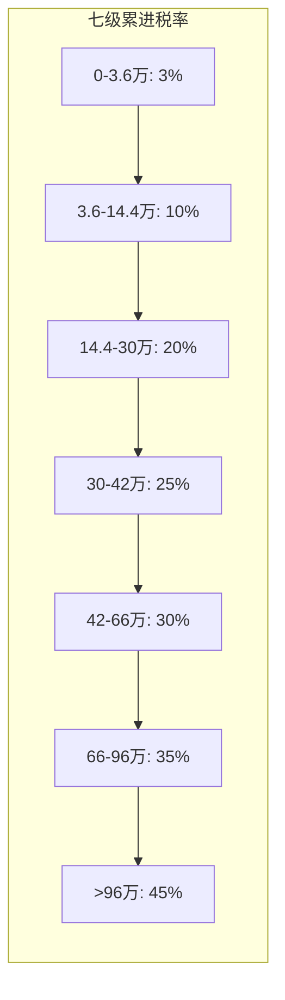
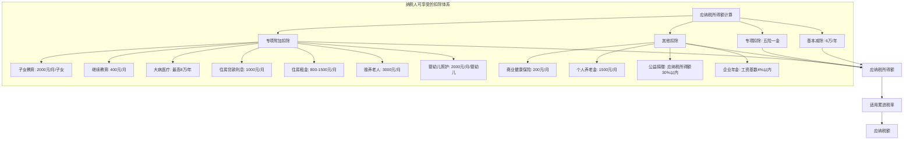
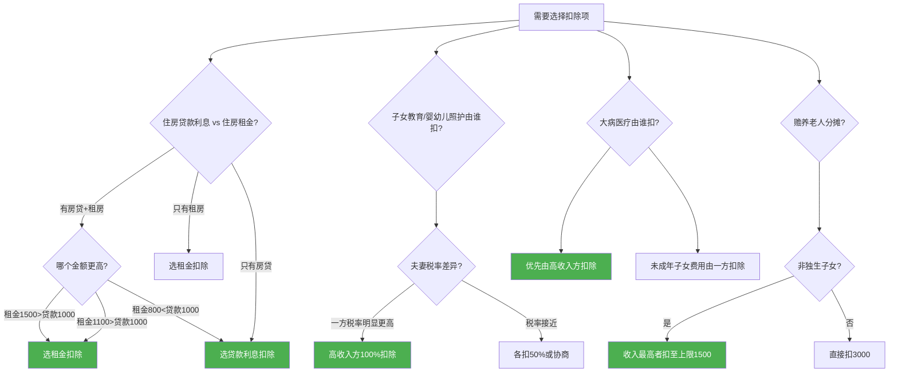
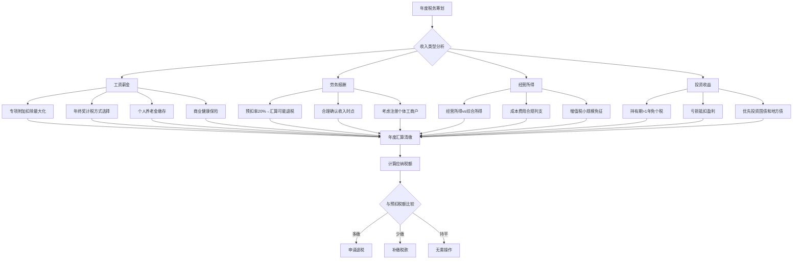
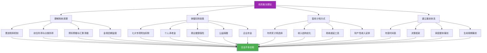

## 四、税务筹划理论

税务筹划是个人财务管理中投入产出比最高的技能之一。一个普通中产家庭，仅靠"用足政策"这一件事，每年就能合法节省数千到数万元的税款——这笔钱不需要加班、不需要冒险、不需要任何专业背景，只需要你理解规则并主动行动。

本节从税收原理出发，系统讲解中国个人所得税的运行机制，逐项拆解所有合法节税工具，提供从入门到精通的完整路径。无论你是月薪5000的职场新人，还是年入百万的高收入者，都能在本节中找到适合自己的筹划方案。

**本节知识地图：**



### 4.1 为什么要学税务筹划

#### 4.1.1 一组触目惊心的数据

很多人对"税务筹划"有天然的抵触心理——要么觉得这是有钱人的游戏，要么觉得这是在打法律的擦边球。这两种想法都是错的。

来看一组真实的数字：

- 中国个人所得税纳税人中，超过70%的人没有充分利用专项附加扣除政策。2023年国家税务总局的数据显示，全国专项附加扣除的平均申报率仅为58%，意味着42%的纳税人放弃了合法的税收减免
- 以一个典型的中等收入纳税人（月薪2万、有房贷、赡养老人、有子女教育）为例，如果充分利用所有专项附加扣除，每年可以少交税约8000-15000元。这不是小钱——相当于很多人一个月的工资
- 2025年个税汇算清缴数据显示，全国约有超过1亿人申请了退税，人均退税金额约1800元。但与此同时，也有大量纳税人因为不了解政策、操作失误或疏忽大意，每年多交了数千甚至上万元的税

#### 4.1.2 税务筹划的本质定义

**税务筹划的本质是：在法律框架内，通过合理安排收入和支出，最大化地享受税收优惠政策。** 它不是教你少交税，而是教你不多交税。

这个定义包含三层含义：

1. **法律框架内**——一切操作以现行法律法规为依据，不涉及任何灰色地带
2. **合理安排**——调整的是收入确认时点、扣除项目归属、计税方式选择等可控变量
3. **最大化享受**——不是发明新的扣除项，而是把国家已经给你的权利用满用足

#### 4.1.3 税务筹划的三大原则

| 原则 | 含义 | 举例 | 违反后果 |
|------|------|------|----------|
| 合法性 | 一切操作在法律框架内进行 | 利用专项附加扣除政策，而非虚报支出 | 补税+罚款+信用降级 |
| 事前性 | 必须在纳税义务发生之前规划 | 年初选择年终奖计税方式，而非事后补救 | 机会永久丧失 |
| 整体性 | 从全年收入整体角度规划 | 综合考虑工资、劳务、稿酬等多种收入 | 局部优化反而增加总税负 |

**为什么"事前性"是最容易被忽视的原则？** 大多数人只在年度汇算清缴时才想起税务筹划，但很多节税机会一旦错过就无法弥补。具体来说：

- 年终奖的计税方式选择必须在发放前确定，发放后无法更改
- 个人养老金的缴存必须在12月31日前完成，跨年不能补缴
- 专项附加扣除信息变更需要在发生时及时更新，延迟申报可能损失当月扣除
- 年初确认扣除信息（每年12月需确认下一年度），忽略则新年度扣除中断

等到汇算清缴时再想调整，很多选项已经关闭了。

### 4.2 中国个人所得税的基本原理

#### 4.2.1 累进税率机制

中国个人所得税采用**七级超额累进税率**，这是理解税务筹划的基石。累进税率意味着收入越高，边际税率越高——但关键在于，不是所有收入都按最高税率交税，而是每一级收入按对应的税率交税。



**关键概念：应纳税所得额**

应纳税所得额 ≠ 你的工资。它的计算公式是：

```text
应纳税所得额 = 年收入 - 60000元（基本减除费用）- 专项扣除 - 专项附加扣除 - 其他扣除
```

| 扣除项目 | 具体内容 | 年度限额 |
|----------|----------|----------|
| 基本减除费用 | 每人每年固定扣除 | 60,000元 |
| 专项扣除 | 五险一金个人缴纳部分 | 按实际缴纳 |
| 专项附加扣除 | 子女教育、继续教育等七项 | 见4.4节详表 |
| 其他扣除 | 商业健康保险、个人养老金等 | 各有限额 |

**实际税负率与边际税率的区别**：这两个概念是税务筹划的基础认知，必须搞清楚。

- **边际税率**：你"最后一块钱收入"适用的税率。例如月薪3万（年收入36万）的人，边际税率是25%
- **实际税负率**：你交的总税除以总收入。同样月薪3万的人，实际税负率只有约15%

计算示例：年收入36万，扣除五险一金约4.8万、基本减除6万，应纳税所得额约25.2万。
- 0-3.6万部分：36000×3% = 1080元
- 3.6-14.4万部分：108000×10% = 10800元
- 14.4-25.2万部分：108000×20% = 21600元
- 合计：33480元
- 实际税负率：33480÷360000 = 9.3%

**税务筹划的目标是降低实际税负率**，而不是盲目追求降低边际税率。很多人只关注"我跳到了25%的档"而忽略了实际税负率远没有那么高。

**详细的应纳税额速算表：**

| 全年应纳税所得额 | 税率 | 速算扣除数 | 实际税负率范围 |
|-----------------|------|-----------|--------------|
| 不超过36,000元 | 3% | 0 | 0%-3% |
| 36,000-144,000元 | 10% | 2,520 | 3%-8.25% |
| 144,000-300,000元 | 20% | 16,920 | 8.25%-14.36% |
| 300,000-420,000元 | 25% | 31,920 | 14.36%-17.41% |
| 420,000-660,000元 | 30% | 52,920 | 17.41%-21.97% |
| 660,000-960,000元 | 35% | 85,920 | 21.97%-26.07% |
| 超过960,000元 | 45% | 181,920 | 26.07%以上 |

**速算扣除数的原理**：速算扣除数是为了简化计算而存在的。如果没有速算扣除数，你需要分段计算每级税率对应的税额再相加。有了速算扣除数，可以直接用"应纳税所得额×税率-速算扣除数"一步得出结果。例如应纳税所得额20万，直接用200000×20%-16920=23080元，与分段计算的结果完全一致。

#### 4.2.2 综合所得与分类所得

中国个人所得税将个人所得分为两大类，适用不同的税率和计算方式：

**综合所得**（按年计算，适用3%-45%累进税率）：
- 工资薪金所得
- 劳务报酬所得
- 稿酬所得
- 特许权使用费所得

**分类所得**（按次或按月计算，适用比例税率）：
- 经营所得：5%-35%累进税率
- 利息、股息、红利所得：20%
- 财产租赁所得：20%
- 财产转让所得：20%
- 偶然所得：20%

**综合所得的合并计算逻辑**：工资薪金、劳务报酬、稿酬、特许权使用费四种收入在预扣预缴阶段各自独立计算税款，但在年度汇算时全部合并为综合所得，统一按3%-45%累进税率计算。

这导致两种情况：

| 情况 | 预扣阶段 | 汇算结果 | 说明 |
|------|---------|---------|------|
| 劳务报酬为主，年收入不高 | 每笔按20%预扣 | 合并后适用10%或3% | 可退税 |
| 多处劳务报酬，收入较高 | 每处按20%预扣 | 合并后跳到20%或更高 | 需补税 |
| 工资+劳务混合 | 各自独立预扣 | 合并后可能跳档 | 可退可补 |

**实务意义**：综合所得在年度汇算清缴时合并计算，多退少补。这意味着年初每月预扣预缴的税款可能不是最终税额，年度汇算时有机会退税。很多人不知道这一点，没有进行年度汇算清缴，白白损失了退税。

**稿酬所得的特殊优惠**：稿酬所得在计入综合所得时按70%计算（即打七折），这是国家对知识创作的税收鼓励。如果你的收入可以被认定为"稿酬所得"（出版书籍、发表文章、撰写技术文档获得的报酬），税负天然低于劳务报酬。但税务机关对"稿酬所得"的认定有严格标准——必须是因其作品以图书、报刊等形式出版、发表而取得的所得。

#### 4.2.3 预扣预缴与汇算清缴

个人所得税的征管采用"预扣预缴 + 年度汇算清缴"两步机制：

| 环节 | 时间 | 内容 | 关键点 |
|------|------|------|--------|
| 预扣预缴 | 每月 | 单位代扣代缴 | 累计预扣法，前几个月可能税率低，后几个月税率高 |
| 年度汇算 | 次年3月1日-6月30日 | 全年收入汇总计算 | 多退少补，是退税的唯一窗口 |

**累计预扣法的含义**：每月计算税款时，不是只看当月收入，而是累计从1月到当前月份的总收入，扣除累计的减除费用和扣除项目，计算累计应纳税额，再减去之前已预扣的税额。

这导致了一个常见现象——**年初几个月到手工资多，年末几个月到手工资少**。很多人以为是公司克扣了工资，其实是累计预扣法导致的税率跳档。

**累计预扣法的实际影响举例**：假设月薪2万，无专项附加扣除，社保个人缴纳约4000元/月。

| 月份 | 累计收入 | 累计减除 | 累计应纳税所得额 | 适用税率 | 累计应纳税额 | 当月实缴 | 当月到手 |
|------|---------|---------|----------------|---------|------------|---------|---------|
| 1月 | 20,000 | 9,000 | 11,000 | 3% | 330 | 330 | 15,670 |
| 4月 | 80,000 | 36,000 | 44,000 | 10% | 1,880 | 740 | 15,260 |
| 7月 | 140,000 | 63,000 | 77,000 | 10% | 5,180 | 1,150 | 14,850 |
| 10月 | 200,000 | 90,000 | 110,000 | 10% | 8,480 | 1,200 | 14,800 |
| 12月 | 240,000 | 108,000 | 132,000 | 10% | 10,680 | 1,040 | 14,960 |

可以看到，1月到手15670元，7月到手降至14850元，差额820元。这不是公司克扣，是累计预扣法的正常结果。

#### 4.2.4 金税四期与个人税务监管

2021年起，中国税务系统开始全面升级到"金税四期"，这对个人税务筹划有深远影响：

**金税四期的核心能力**：

| 能力 | 具体内容 | 对个人的影响 |
|------|---------|-------------|
| 大数据比对 | 银行流水、社保数据、不动产登记、车辆登记、股权变更等信息全部打通 | 每一笔大额收入、房产交易、股权转让都有记录 |
| CRS信息交换 | 中国已与100多个国家和地区签署CRS（共同申报准则） | 海外资产和收入对税务机关不再透明 |
| 个人纳税信用体系 | 类似于个人征信 | 纳税信用不良会影响贷款、出行、子女入学 |
| 智能风险识别 | AI自动识别异常申报模式 | 虚假申报被发现的概率大幅提高 |

**金税四期下的高风险行为**：

| 行为 | 风险等级 | 后果 |
|------|---------|------|
| 隐瞒多处收入不汇算 | 高 | 补税+滞纳金+罚款 |
| 虚报专项附加扣除（如虚假租房信息） | 高 | 补税+罚款+信用降级 |
| 大额现金交易不申报 | 中高 | 触发反洗钱调查+税务核查 |
| 频繁大额转账与收入不匹配 | 中 | 被约谈说明资金来源 |
| 通过个人账户收公司款项 | 高 | 可能被认定为偷逃税 |
| 利用多个银行账户分散收入 | 高 | 大数据穿透识别关联账户 |

**金税四期时代的核心认知**：隐瞒收入被发现的概率已大幅提高——以前靠"查不到"逃税的时代已经结束。反过来，合规的税务筹划反而更加安全——系统能清晰区分合法扣除与虚假申报，合法筹划零风险。

### 4.3 节税、避税与逃税的本质区别

这三个概念经常被混淆，但它们有本质性的法律差异：

| 维度 | 节税（税务筹划） | 避税 | 逃税 |
|------|------------------|------|------|
| 法律性质 | 完全合法 | 灰色地带，可能被调整 | 违法犯罪 |
| 本质 | 利用税收优惠政策 | 利用税法漏洞 | 隐匿收入或虚报支出 |
| 风险 | 零风险 | 中等风险（可能被追缴） | 高风险（罚款+刑责） |
| 典型做法 | 充分申报专项附加扣除 | 设立壳公司转移收入 | 隐瞒收入不申报 |
| 法律后果 | 受法律保护 | 可能被纳税调整 | 补税+滞纳金+0.5-5倍罚款+刑事责任 |
| 国家态度 | 鼓励 | 不鼓励，逐步堵漏 | 严厉打击 |

**逃税的法律后果有多严重？**

《税收征收管理法》第六十三条规定：纳税人偷税的，由税务机关追缴其不缴或者少缴的税款、滞纳金，并处不缴或者少缴的税款百分之五十以上五倍以下的罚款；构成犯罪的，依法追究刑事责任。

《刑法》第二百零一条规定，逃税数额较大且占应纳税额10%以上的，处三年以下有期徒刑或者拘役；数额巨大且占应纳税额30%以上的，处三年以上七年以下有期徒刑。

**滞纳金的计算**：从滞纳之日起，按日加收万分之五的滞纳金。折合年化约18.25%，比大多数信用卡利率还高。如果欠税10万元，一年的滞纳金就是18250元。这笔钱没有任何商量余地。

**避税与节税的边界案例**：某高收入者将自己的收入分散到多个家庭成员名下（通过"发工资"给不实际工作的配偶），被税务机关认定为虚假申报。但如果家庭成员确实在企业工作且有合理薪酬，则属于合法安排。关键区别在于：是否有真实的经济实质支撑。

**节税的核心策略是"用足政策"**：国家出台的每一项税收优惠政策，都是为了引导特定的经济行为（如鼓励教育、鼓励养老、鼓励住房）。利用这些政策不仅是合法的，甚至是国家鼓励的。

### 4.4 七大专项附加扣除详解

专项附加扣除是个人税务筹划的核心工具。2019年实施新个税法以来，专项附加扣除已经从最初的6项扩展到7项，覆盖了教育、住房、医疗、养老等核心民生领域。

#### 4.4.1 子女教育

| 项目 | 内容 |
|------|------|
| 适用范围 | 年满3岁至博士研究生阶段的子女 |
| 扣除标准 | 每个子女每月2000元（2023年9月起由1000元提高至2000元） |
| 扣除方式 | 父母各扣50%，或一方扣100% |
| 起止时间 | 满3岁的当月至学历教育结束 |
| 所需材料 | 子女身份信息、教育阶段信息 |

**实务要点**：
- 2023年标准从1000元/月提高到2000元/月，这是近年来最大的扣除标准提升
- 父母双方可以协商扣除比例，但一个纳税年度内不得变更
- 如果夫妻双方收入差距较大（一方适用高税率，一方适用低税率或无收入），应由高收入一方全额扣除，节税效果最大
- 子女在中国境外接受教育的，也可以享受扣除，但需要留存境外学校录取通知书、留学签证等备查资料
- 子女年满3岁但尚未入园的，也可以享受扣除——很多人误以为必须入园后才能扣除
- 一个纳税年度内扣除比例不能变更，但可以在下一个年度重新约定

**计算示例**：父亲月薪3万（适用20%税率），母亲月薪8000元（适用3%税率）。有两个孩子：

| 方案 | 父亲月节税 | 母亲月节税 | 合计月节税 | 年节税 |
|------|-----------|-----------|-----------|--------|
| 各扣50% | 2000×2×50%×20%=400 | 2000×2×50%×3%=60 | 460 | 5,520 |
| 父亲全扣 | 2000×2×20%=800 | 0 | 800 | 9,600 |
| **差额** | | | **340** | **4,080** |

仅仅是选择正确的扣除比例，一年多节税4080元——这需要做的只是在APP里改一个选项。

#### 4.4.2 继续教育

| 项目 | 内容 |
|------|------|
| 学历继续教育 | 每月400元，最长48个月 |
| 职业资格继续教育 | 取得证书当年一次性扣除3600元 |
| 扣除主体 | 本人扣除 |

**实务要点**：
- 学历继续教育包括自考、成考、网络教育、开放大学等
- 职业资格继续教育包括国家职业资格目录内的各类证书
- 同一学历继续教育的扣除期限不能超过48个月
- 如果当年取得了职业资格证书，可以额外扣除3600元，与学历继续教育不冲突

**哪些证书可以扣除？** 核心判断标准是是否列入《国家职业资格目录》。2024年版本的目录包括：

| 类别 | 典型证书举例 | 是否可扣除 |
|------|------------|-----------|
| 专业技术人员职业资格 | 注册会计师、法律职业资格、医师、建筑师、税务师 | 可以 |
| 技能人员职业资格 | 消防设施操作员、焊工、电工 | 可以 |
| 国际证书（不在目录内） | CFA、PMP、AWS认证、Google认证 | 不可以 |
| 行业协会证书 | 各类行业协会自行颁发的证书 | 不可以（除非在目录内） |

**隐藏的节税机会**：如果你在读在职研究生或MBA，每月400元的继续教育扣除是可以在读期间持续享受的。4年合计可以扣除400×48=19200元，按20%税率计算，节税3840元。

#### 4.4.3 大病医疗

| 项目 | 内容 |
|------|------|
| 扣除标准 | 医保目录范围内个人自付累计超过15000元的部分 |
| 扣除限额 | 每年最高80000元 |
| 扣除时间 | 年度汇算清缴时扣除（不能预扣预缴时扣除） |
| 扣除主体 | 本人或配偶扣除；未成年子女由父母一方扣除 |

**实务要点**：
- 大病医疗是唯一不能在每月预扣预缴时享受的专项附加扣除，必须在年度汇算时申报
- 15000元的门槛是"个人自付累计"，不是单次就诊
- 80000元的限额对应最高25%税率档位（应纳税所得额14.4-30万），最多可节税20000元
- 可以通过"国家医保服务平台"APP查询年度医疗费用明细
- 医保目录范围外的自费药、自费项目不计入可扣除金额

**计算示例**：某纳税人年度医疗费用自付部分累计6万元：
- 超出门槛 = 60000 - 15000 = 45000元
- 可扣除45000元
- 若适用20%税率，节税9000元

**家庭优化策略**：如果夫妻双方都有医疗费用，可以灵活分配。例如丈夫自付4万、妻子自付3万：
- 各自计算：(40000-15000) + (30000-15000) = 40000元
- 也可以选择由一方扣除全部（但只能扣除该方和未成年子女的医疗费用）
- 需比较哪种方式总扣除额更大

**查询医疗费用的步骤**：
1. 下载"国家医保服务平台"APP
2. 注册并绑定医保卡
3. 进入"年度费用汇总"查询
4. 查看"个人自付"金额（注意不是"个人自费"）
5. 将该数据用于年度汇算清缴时的大病医疗扣除申报

#### 4.4.4 住房贷款利息

| 项目 | 内容 |
|------|------|
| 适用范围 | 首套住房贷款（认贷不认房） |
| 扣除标准 | 每月1000元 |
| 扣除期限 | 最长240个月（20年） |
| 扣除主体 | 本人或配偶，约定后一个纳税年度内不得变更 |

**实务要点**：
- "首套住房贷款"的认定标准是贷款合同是否注明为首套住房贷款利率
- 如果夫妻双方婚前各有一套首套房贷，婚后只能选择其中一套，由购买方扣除100%或双方各扣50%
- 住房贷款利息与住房租金不能同时享受，必须二选一
- 如果在还贷的同时租房居住（如工作城市与购房城市不同），应选择金额较高的一项
- 提前还贷后，贷款利息扣除在还清贷款当月停止

**"认贷不认房"的含义**：只要你的贷款合同被银行认定为首套房贷利率（即使你名下已有其他住房），就可以享受扣除。反之，如果贷款合同注明为二套房贷利率，即使你名下只有一套住房，也不能享受此扣除。

#### 4.4.5 住房租金

| 项目 | 内容 |
|------|------|
| 适用条件 | 本人及配偶在主要工作城市没有自有住房 |
| 扣除标准 | 按城市等级分档（见下表） |
| 扣除主体 | 签订租赁合同的承租人 |

**城市等级与扣除标准**：

| 城市等级 | 月扣除额 | 代表城市 |
|---------|---------|---------|
| 直辖市/省会/计划单列市/国务院确定的其他城市 | 1500元 | 北京、上海、广州、深圳、天津、重庆、各省会城市、大连、青岛、宁波、厦门，以及苏州、无锡、佛山等 |
| 市辖区户籍人口>100万的城市 | 1100元 | 大多数地级市 |
| 市辖区户籍人口≤100万的城市 | 800元 | 县级市、小城市 |

**实务要点**：
- 夫妻双方主要工作城市相同的，只能由一方扣除
- 夫妻双方主要工作城市不同的，可以各自扣除
- 合租情况下，每个承租人都可以按照自己签订的租赁合同享受扣除（前提是各自符合条件）
- 需要留存住房租赁合同等备查资料

**住房贷款利息与住房租金的对比决策：**

| 对比项 | 住房贷款利息 | 住房租金 |
|--------|-------------|----------|
| 扣除标准 | 固定1000元/月 | 按城市等级：800/1100/1500元/月 |
| 适用条件 | 首套房贷 | 本人及配偶在主要工作城市无自有住房 |
| 不能同时享受 | 是 | 是 |
| 城市适用 | 全国统一 | 因城市而异 |
| 期限限制 | 最长240个月 | 无期限限制（只要符合条件） |

**选择策略**：在一线城市（租金扣除1500元/月）且有房贷的情况下，如果租金扣除金额高于贷款利息扣除（1000元/月），应选择租金扣除。但要注意，一旦选择了租金扣除，就不能同时享受贷款利息扣除。如果房贷还剩较长时间（如15年），每年多扣6000元（(1500-1000)×12），15年累计多节税12000-27000元（取决于税率）。

#### 4.4.6 赡养老人

| 项目 | 内容 |
|------|------|
| 适用条件 | 被赡养人为年满60岁的父母，或子女均已去世的年满60岁的祖父母/外祖父母 |
| 扣除标准 | 独生子女：每月3000元（2023年9月起由2000元提高至3000元） |
|  | 非独生子女：兄弟姐妹分摊每月3000元的额度，每人不超过1500元/月 |
| 扣除方式 | 独生子女直接扣除；非独生子女需签订书面分摊协议 |

**实务要点**：
- 2023年标准从2000元/月提高到3000元/月
- 非独生子女的分摊方式有三种：均摊、约定分摊、被赡养人指定分摊
- 约定分摊或指定分摊需要签订书面协议，指定分摊优先于约定分摊
- 具体分摊方式和额度在一个纳税年度内不能变更
- 被赡养人中有一位年满60岁即可享受，不需要两位都满60岁
- 被赡养人是否有退休金、是否有其他收入不影响扣除资格

**计算示例**：独生子女，月薪25000元，赡养老人扣除3000元/月：
- 适用税率20%
- 每月节税 = 3000×20% = 600元
- 一年节税7200元

**非独生子女的最优分摊策略**：

三兄弟中，老大月薪5万（适用30%税率），老二月薪2万（适用20%税率），老三月薪8000（适用3%税率）。

| 分摊方案 | 老大扣除 | 老二扣除 | 老三扣除 | 年节税合计 |
|---------|---------|---------|---------|-----------|
| 均摊 | 1000元 | 1000元 | 1000元 | 1000×30%×12+1000×20%×12+1000×3%×12 = 6,360元 |
| 最优分摊 | 1500元 | 1500元 | 0元 | 1500×30%×12+1500×20%×12 = 9,000元 |
| **差额** | | | | **2,640元/年** |

仅靠调整分摊比例，一年多节税2640元。

#### 4.4.7 3岁以下婴幼儿照护

| 项目 | 内容 |
|------|------|
| 适用范围 | 0-3岁的婴幼儿 |
| 扣除标准 | 每个婴幼儿每月2000元（2023年9月起由1000元提高至2000元） |
| 扣除方式 | 父母各扣50%，或一方扣100% |
| 起止时间 | 出生当月至满3周岁的前一个月 |

**实务要点**：
- 与子女教育衔接：满3岁后自动转入子女教育扣除
- 扣除比例选择策略与子女教育相同——由高收入一方全额扣除效果最大
- 出生当月即可开始扣除，不需要等落户或办完手续后再申报——可以事后补报

**关于"出生当月"的理解**：如果孩子是2025年3月15日出生，那么从2025年3月开始就可以享受婴幼儿照护扣除，直到2028年2月（满3周岁的前一个月）。2028年3月起自动转入子女教育扣除。

#### 4.4.8 七项扣除汇总与最大节税额计算

| 扣除项目 | 最高月扣除额 | 最高年扣除额 | 适用最高税率（45%）时最大年节税 |
|----------|-------------|-------------|-------------------------------|
| 子女教育 | 2000元/子女 | 24000元/子女 | 10800元/子女 |
| 继续教育 | 400元 | 4800元 | 2160元 |
| 大病医疗 | - | 80000元 | 36000元 |
| 住房贷款利息 | 1000元 | 12000元 | 5400元 |
| 住房租金 | 1500元 | 18000元 | 8100元 |
| 赡养老人 | 3000元 | 36000元 | 16200元 |
| 婴幼儿照护 | 2000元/婴幼儿 | 24000元/婴幼儿 | 10800元/婴幼儿 |

**典型家庭场景计算**：一对夫妻，月薪各2.5万（适用20%税率），有1个2岁孩子、1个5岁孩子、赡养2位老人、有首套房贷。

```text
月扣除额 = 2000(婴幼儿) + 2000×2(子女教育，扣除一方) + 3000(赡养老人) + 1000(房贷) = 9000元/月
年扣除额 = 108000元
年节税 = 108000×20% = 21600元
```

这意味着这个家庭每年通过专项附加扣除可以合法少交21600元的税——相当于多了一个月的工资。



#### 4.4.9 专项附加扣除的冲突决策树

当多个扣除项之间存在冲突或需要选择时，按以下决策树操作：



**核心决策原则**：所有可选择的扣除项，都应优先分配给适用更高边际税率的一方，以最大化节税效果。

#### 4.4.10 专项附加扣除的操作指南

**申报渠道**（四种方式，任选其一）：

| 渠道 | 操作方式 | 适用场景 | 推荐指数 |
|------|---------|---------|---------|
| 个人所得税APP | 下载→登录→专项附加扣除填报→选择项目→填写信息→选择申报方式 | 最常用，适合大多数人 | ★★★★★ |
| 自然人电子税务局网页版 | 登录 https://etax.chinatax.gov.cn → 专项附加扣除填报 | 习惯电脑操作的人 | ★★★★ |
| 扣缴义务人（公司HR）代为申报 | 将相关信息告知单位，由单位在扣缴客户端填报 | 不熟悉APP操作的人 | ★★★ |
| 纸质报表 | 到办税服务厅填写纸质申报表 | 不推荐，效率最低 | ★ |

**申报时间选择**：
- **通过扣缴义务人申报**：信息实时传送到公司，下个月发工资时就能享受扣除。推荐大多数人选择此方式
- **综合所得年度自行申报**：平时不扣除，年度汇算时一次性扣除并退税。适合有多处收入、不想让公司知道自己扣除信息的人

**信息变更与作废**：
- 扣除信息发生变化的（如子女毕业、贷款还清、老人去世），应在发生变化的当月及时修改
- 发现之前填报错误的，可以作废重新填报
- **每年12月需要确认下一年度的扣除信息**——很多人忽略这一步，导致新年度扣除中断

**常见操作问题排查**：

| 问题 | 原因 | 解决方案 |
|------|------|---------|
| APP显示"未查询到您的任职受雇信息" | 公司未在个税系统中报送 | 联系HR确认并补报 |
| 填报后工资没有变化 | 选了"自行申报"而非"扣缴义务人申报" | 修改申报方式 |
| 夫妻双方都填了同一项扣除导致重复 | 双方都填了100% | 一方修改扣除比例 |
| 换工作后扣除中断 | 新公司未获取扣除信息 | 在新公司重新确认扣除信息 |
| 年度中间开始享受扣除 | 之前月份未扣除 | 汇算清缴时可补扣，不会损失 |
| 提示"该子女信息已被他人填报" | 配偶已填报 | 协商后一方修改 |

### 4.5 年终奖的计税选择

年终奖（全年一次性奖金）的计税方式选择是税务筹划中争议最大、节税效果最明显的一个环节。

#### 4.5.1 两种计税方式

**方式一：单独计税**

将年终奖除以12个月，按商数查找对应的月度税率表，确定适用税率和速算扣除数，单独计算税款。

```text
应纳税额 = 年终奖 × 适用税率 - 速算扣除数
```

年终奖单独计税的月度税率表：

| 月度应纳税所得额 | 税率 | 速算扣除数 |
|------------------|------|-----------|
| ≤3000元 | 3% | 0 |
| 3000-12000元 | 10% | 210 |
| 12000-25000元 | 20% | 1410 |
| 25000-35000元 | 25% | 2660 |
| 35000-55000元 | 30% | 4410 |
| 55000-80000元 | 35% | 7160 |
| >80000元 | 45% | 15160 |

**方式二：并入综合所得**

将年终奖并入全年工资薪金收入，一起计算个人所得税。

**注意**：单独计税优惠政策目前延续至2027年12月31日。届时是否继续延续，需要关注财政部和税务总局的最新政策。

#### 4.5.2 选择策略

**原则**：两种方式都算一遍，选择税额更低的那个。以下规律可以帮助快速判断：

| 情况 | 推荐方式 | 原因 |
|------|----------|------|
| 年终奖金额不高，且综合所得应纳税所得额为负或很低 | 并入综合所得 | 可以用综合所得的扣除额度抵消年终奖 |
| 年终奖金额较高，综合所得已适用较高税率 | 单独计税 | 避免年终奖推高综合所得的边际税率 |
| 年终奖正好处于税率临界点附近 | 需要精确计算 | 临界点陷阱（见下文） |
| 综合所得应纳税所得额为负数 | 并入综合所得 | 用负数抵消年终奖的税基 |
| 年终奖金额很小（如几千元），综合所得税率10%以上 | 并入综合所得 | 并入后可能不增加额外税款 |

**精确计算示例**：假设年终奖36000元，综合所得应纳税所得额200000元。

```text
单独计税：
  年终奖税 = 36000×3% = 1080元
  综合所得税 = 200000×20%-16920 = 23080元
  总税 = 24160元

并入综合所得：
  总应纳税所得额 = 236000元
  税 = 236000×20%-16920 = 30280元

单独计税节税 = 30280-24160 = 6120元
```

#### 4.5.3 年终奖的"临界点陷阱"

由于年终奖除以12后的商数决定税率，存在一些"多发1块钱反而少拿钱"的临界点：

| 年终奖金额 | 除以12 | 适用税率 | 应纳税额 | 税后收入 |
|-----------|--------|----------|----------|----------|
| 36,000元 | 3,000 | 3% | 1,080 | 34,920 |
| 36,001元 | 3,000.08 | 10% | 3,390.1 | 32,610.9 |
| 差额 | - | - | **多交2310元** | **少拿2309元** |

**所有临界点及对应的"多发损失"**：

| 临界点 | 低档税后收入 | 高档税后收入（仅多1元） | 损失金额 |
|--------|------------|----------------------|---------|
| 36,000→36,001 | 34,920 | 32,610.9 | 2,309元 |
| 144,000→144,001 | 131,680 | 126,420.75 | 5,259元 |
| 300,000→300,001 | 268,080 | 257,520.75 | 10,559元 |
| 420,000→420,001 | 364,080 | 349,920.75 | 14,159元 |
| 660,000→660,001 | 541,080 | 518,820.75 | 22,259元 |
| 960,000→960,001 | 723,120 | 689,520.75 | 33,599元 |

**应对方法**：如果你的年终奖刚好在这些数字附近，应该主动与HR沟通，将超出部分并入月薪发放。例如公司要发36500元年终奖，应建议将年终奖定为36000元，剩余500元并入月薪发放。大部分HR都理解这个逻辑，但需要你主动提出。

**"避开陷阱区"的安全区间**：在每个临界点以下，存在一个"安全区间"，在这个区间内多发钱是值得的：

| 临界点 | 安全区间（建议年终奖范围） | 说明 |
|--------|------------------------|------|
| 36,000 | 0-36,000 或 38,566-144,000 | 38566是弥补2309损失后的平衡点 |
| 144,000 | 144,000 或 160,500-300,000 | 超过144000不如直接到160500 |
| 300,000 | 300,000 或 318,333-420,000 | 同理 |

#### 4.5.4 年终奖与月薪的最优配比

年终奖和月薪之间存在一个最优配比。核心思路是：让月薪对应的边际税率和年终奖对应的税率尽量匹配，避免一边税率很高而另一边很低。

**优化示例**：年总收入50万

| 方案 | 月薪 | 年终奖 | 月薪部分税 | 年终奖税 | 总税 |
|------|------|--------|-----------|---------|------|
| 方案A（当前） | 3万 | 14万 | 33,480 | 11,480 | 44,960 |
| 方案B | 2.5万 | 20万 | 21,480 | 22,920 | 44,400 |
| 方案C | 2万 | 26万 | 10,680 | 35,120 | 45,800 |

方案B最优，比方案A节税560元。方案C反而多交了1400元——配比不是越大越好，需要精确计算。

**寻找最优配比的方法**：
1. 列出你的年总收入、各项扣除金额
2. 在Excel中设置公式，将月薪和年终奖作为变量
3. 以1000元为步长，遍历不同的月薪-年终奖组合
4. 找到总税额最低的组合

### 4.6 其他合法节税渠道

#### 4.6.1 个人养老金账户

2022年11月起，中国在36个城市试点个人养老金制度，2024年12月起在全国推广。

| 项目 | 内容 |
|------|------|
| 年度缴存上限 | 18,000元（2024年12月起由12000元提高至18000元） |
| 税前扣除 | 缴存金额全额在应纳税所得额中扣除 |
| 投资收益 | 暂不征税 |
| 领取时 | 按3%单独计税 |
| 领取条件 | 退休、完全丧失劳动能力、出国定居等 |

**节税效果计算**（以年缴存18000元为例）：

| 边际税率 | 缴存时节税 | 领取时交税（3%） | 净节税/年 | 30年累计净节税 |
|---------|-----------|----------------|----------|--------------|
| 3% | 540元 | 540元 | 0元 | 0元 |
| 10% | 1800元 | 540元 | 1260元 | 37,800元 |
| 20% | 3600元 | 540元 | 3060元 | 91,800元 |
| 25% | 4500元 | 540元 | 3960元 | 118,800元 |
| 30% | 5400元 | 540元 | 4860元 | 145,800元 |
| 35% | 6300元 | 540元 | 5760元 | 172,800元 |
| 45% | 8100元 | 540元 | 7560元 | 226,800元 |

**结论**：只有边际税率高于3%的纳税人才适合缴存个人养老金。边际税率越高，节税效果越明显。

**个人养老金的投资选择**：账户内的资金可以投资于四类产品：

| 产品类型 | 预期收益 | 风险等级 | 适合人群 |
|---------|---------|---------|---------|
| 储蓄存款 | 2%-3% | 极低 | 保守型，临近退休 |
| 商业养老保险 | 3%-4% | 低 | 稳健型，注重保障 |
| 公募基金（养老目标基金） | 5%-8% | 中 | 平衡型，长期投资 |
| 理财产品 | 3%-5% | 中低 | 稳健型 |

**个人养老金的流动性风险**：这笔钱原则上要到法定退休年龄才能取出。对于30岁的人来说，意味着锁定30年以上。如果当前现金流紧张（如正在还房贷、养育幼儿），需要权衡节税收益与流动性损失。建议在保证日常生活和应急储备充足的前提下再考虑缴存。

#### 4.6.2 商业健康保险扣除

购买符合规定的商业健康保险产品（税优健康险），每月可扣除200元，每年2400元。

| 项目 | 内容 |
|------|------|
| 扣除限额 | 200元/月，2400元/年 |
| 适用产品 | 有税优识别码的商业健康保险 |
| 购买渠道 | 保险公司或保险经纪平台 |
| 适用人群 | 取得工资薪金所得、连续性劳务报酬所得的个人 |

**如何识别"税优健康险"**：产品名称中通常含有"税优"字样，保单上会有唯一的"税优识别码"（18位数字）。购买时需要向保险公司确认该产品是否在税优健康险目录内。

**2023年的新变化**：税优健康险的产品范围从原来的单一医疗险扩大到了医疗保险、长期护理保险和疾病保险三种，可选择的产品更多了。

**节税效果**：适用20%税率的人，年节税=2400×20%=480元。虽然金额不大，但税优健康险本身的保障功能是有价值的，相当于用较低的成本获得了健康保障+税收优惠的双重收益。

#### 4.6.3 公益捐赠扣除

个人通过公益性社会组织或国家机关进行的捐赠，不超过应纳税所得额30%的部分可以扣除。

| 项目 | 内容 |
|------|------|
| 扣除比例 | 应纳税所得额的30%以内 |
| 特殊情况 | 向某些特定机构的捐赠可全额扣除 |
| 凭证要求 | 需取得公益性捐赠统一票据 |
| 扣除方式 | 综合所得、经营所得中扣除 |

**可全额扣除的特殊捐赠**（不受30%限制）：
- 通过公益性社会组织向目标脱贫地区的捐赠
- 向教育事业的捐赠（通过教育发展基金会等）
- 向公益性青少年活动场所的捐赠
- 向红十字事业的捐赠
- 向福利性、非营利性老年服务机构的捐赠
- 通过中国境内非营利的社会团体、国家机关向遭受自然灾害地区、贫困地区的捐赠

**捐赠票据的获取和保管**：捐赠后一定要索取"公益事业捐赠统一票据"，上面会注明捐赠人名称、金额、日期等信息。电子票据同样有效。在年度汇算时，通过"其他扣除"项目填报捐赠信息，并上传或留存票据备查。

**大额捐赠的筹划**：如果你计划进行大额捐赠（如向母校捐赠50万），可以考虑分多年捐赠，使每年的扣除额不超过应纳税所得额的30%，最大化扣除效果。一次性捐赠超出30%的部分不能结转以后年度扣除。

#### 4.6.4 企业年金

如果你所在单位有企业年金计划，个人缴费部分不超过本人缴费工资计税基数4%的部分可以从应纳税所得额中扣除。

| 项目 | 内容 |
|------|------|
| 扣除比例 | 个人缴费工资计税基数的4%以内 |
| 领取时 | 按3%单独计税（与个人养老金类似） |
| 适用人群 | 所在单位有企业年金计划的员工 |
| 企业缴费 | 企业缴费部分计入个人账户时不缴纳个税 |

**企业年金与个人养老金的叠加**：两者可以同时享受，互不影响。假设月薪3万（适用20%税率）：
- 企业年金个人缴费按4%上限 = 30000×4% = 1200元/月
- 年节税 = 1200×12×(20%-3%) = 2448元
- 个人养老金年缴存18000元，节税 = 18000×(20%-3%) = 3060元
- 两者叠加年节税 = 2448 + 3060 = 5508元

#### 4.6.5 五项扣除工具的对比总览

| 工具 | 年度上限 | 节税条件 | 流动性 | 复杂度 | 推荐优先级 |
|------|---------|---------|--------|--------|-----------|
| 专项附加扣除 | 因项而异 | 必须有对应支出 | 无限制 | 低 | 最高 |
| 个人养老金 | 18,000元 | 边际税率>3% | 退休才能取出 | 中 | 高 |
| 企业年金 | 工资×4% | 边际税率>3% | 退休才能取出 | 低 | 高（有则用） |
| 商业健康保险 | 2,400元 | 无门槛 | 退保有损失 | 低 | 中 |
| 公益捐赠 | 应纳税所得额30% | 有捐赠行为 | 不可逆 | 中 | 按需 |

### 4.7 财产性收入的税务筹划

除了工资薪金和专项附加扣除，财产性收入的税务筹划同样重要，尤其是在房产交易和投资收益方面。

#### 4.7.1 房产交易相关税收

房产交易涉及的个人所得税是最复杂的领域之一：

**卖房时的个人所得税**：

| 情况 | 税率 | 计算方式 |
|------|------|---------|
| 能提供房屋原值凭证 | 20% | （转让收入-房屋原值-转让税金-合理费用）×20% |
| 不能提供原值凭证 | 1%-2% | 转让收入×核定征收率（各地不同） |
| 满五唯一 | 免征 | 家庭唯一住房且持有满5年 |

**"满五唯一"的含义和认定**：
- "满五"：以取得房产证或契税完税证明的时间为准，哪个先算哪个
- "唯一"：家庭成员（包括本人、配偶、未成年子女）在该省份内只有这一套住房
- 税务机关会通过不动产登记系统核实"唯一"性

**买房时的契税优惠**（2024年最新政策）：

| 情况 | 契税税率 |
|------|---------|
| 首套房，面积≤140㎡ | 1% |
| 首套房，面积>140㎡ | 1.5% |
| 二套房，面积≤140㎡ | 1% |
| 二套房，面积>140㎡ | 2% |
| 三套及以上 | 3%-5%（各地不同） |

**房产交易的税务筹划要点**：
1. 如果卖房时可以选择核定征收（1%-2%）或据实征收（20%），需比较哪种方式税额更低
2. 卖房前确认是否满足"满五唯一"条件，如果差几个月就满5年，可以考虑推迟交易
3. 保留好房屋原值凭证（购房发票、契税完税证明、装修发票等），可以大幅降低据实征收的税基
4. 夫妻名下的住房数量是合并计算的，离婚后房产分割可能影响"唯一"认定

**据实征收vs核定征收的选择计算**：

假设卖房收入200万，原值120万，合理费用（契税+装修+中介费）约20万：
- 据实征收：(200-120-20)×20% = 12万元
- 核定征收（假设1.5%）：200×1.5% = 3万元
- 核定征收省税9万元

但如果原值较高（如180万），据实征收：(200-180-20)×20% = 0元，反而不用交税。所以两种方式都要算。

#### 4.7.2 投资收益的税务安排

| 投资类型 | 税务处理 | 筹划要点 |
|---------|---------|---------|
| A股股票转让所得 | 暂免征收个人所得税 | 无须筹划，天然免税 |
| A股股息红利 | 持有≤1个月：20%；1-12个月：10%；>1年：免征 | 延长持有期至1年以上 |
| 基金分红 | 个人投资者暂免 | 无须筹划 |
| 基金转让所得 | 个人投资者暂免 | 无须筹划 |
| 债券利息 | 20%（国债和地方债利息免税） | 优先投资国债 |
| 期货交易所得 | 暂免 | 无须筹划 |
| 比特币等虚拟货币 | 目前无明确政策，实践中视为财产转让20% | 保留交易记录 |
| 理财产品收益 | 部分免税，部分需缴税 | 关注产品说明 |

**股息红利的持有期策略**：某投资者持有A股100万元，年股息率3%（即年分红3万元）。

| 持有时间 | 股息税率 | 应缴税款 | 税后收益 |
|---------|---------|---------|---------|
| 不足1个月 | 20% | 6,000元 | 24,000元 |
| 1-12个月 | 10% | 3,000元 | 27,000元 |
| 超过1年 | 0% | 0元 | 30,000元 |

仅靠延长持有期，年收益增加6000元——相当于额外0.6%的收益率。

**持有期的计算规则**：从买入日到卖出日计算，不同批次买入的股票按"先进先出"法确定持有期。

#### 4.7.3 财产租赁的税务处理

出租房屋取得租金收入，需要缴纳多个税种：

| 税种 | 个人出租住房 | 个人出租非住房 |
|------|------------|--------------|
| 个人所得税 | 10% | 20% |
| 增值税 | 1.5%（减按） | 5% |
| 房产税 | 4% | 12% |

**实际操作中**：很多地方对个人出租住房采用综合征收率（如北京为5%，上海为3.5%），远低于各项税种的加总税率。

**租金收入的筹划要点**：
1. 如实申报租金收入是底线——金税四期下，银行流水会暴露租金收入
2. 可以扣除的费用包括：房屋租赁过程中缴纳的税费、修缮费用（每月最多扣800元，扣完为止）
3. 夫妻共有房产的租金收入，按产权比例各自申报

### 4.8 自由职业者和副业收入的税务筹划

自由职业者（如自媒体人、设计师、程序员外包）和有副业收入的人群，税务筹划空间更大，但合规要求也更高。

#### 4.8.1 劳务报酬的税务处理

| 收入区间（扣除后） | 预扣预缴税率 | 速算扣除数 |
|---------|------------|-----------|
| ≤20,000元 | 20% | 0 |
| 20,000-50,000元 | 30% | 2,000 |
| >50,000元 | 40% | 7,000 |

**劳务报酬的预扣率vs汇算税率**：劳务报酬预扣时按20%-40%计税，但汇算时并入综合所得按3%-45%累进税率。如果你的主要收入是劳务报酬且年收入不太高，汇算时大概率可以退税。

**退税案例**：自由设计师年劳务报酬收入15万元：
```text
预扣税额 = 150000×(1-20%)×20% = 24000元
汇算时应纳税所得额 = 150000×(1-20%)-60000-社保约24000 = 36000元
适用税率3%，应纳税额 = 36000×3% = 1080元
可退税 = 24000-1080 = 22920元
```

退税22920元——这就是不了解税务筹划的代价。

#### 4.8.2 个体工商户的税务优势

自由职业者可以注册为个体工商户，将劳务报酬转化为经营所得，享受以下优势：

| 对比项 | 劳务报酬（个人） | 经营所得（个体工商户） |
|--------|----------------|---------------------|
| 扣除方式 | 收入×(1-20%)或800元定额 | 全部合理成本费用 |
| 税率 | 预扣20%-40%，汇算3%-45% | 5%-35%累进税率 |
| 增值税 | 无优惠 | 月销售额≤10万免征 |
| 附加税 | 无优惠 | 增值税免征则附加税免征 |
| 发票能力 | 需代开 | 可自行开具 |
| 社保 | 需自行缴纳 | 可选择灵活就业社保 |

**个体工商户的核定征收**：很多地区对小规模个体工商户实行核定征收（按收入的一定比例核定应税所得率），实际税负可以低至0.5%-2%。但需要注意：
1. 核定征收政策正在收紧，部分高收入行业已不再允许核定
2. 核定征收不等于不交税，仍需按时申报
3. 如果被查实收入与核定标准差异过大，可能被改为查账征收

**注册个体工商户的时机选择**：当你的年劳务报酬收入超过20万元时，注册个体工商户的节税效果开始显现。收入越高，优势越明显。但也要考虑注册和维护成本（记账、报税、工商年报等，约每年2000-5000元）。

#### 4.8.3 不同收入水平的筹划方案对比

| 年劳务收入 | 个人劳务报酬税负 | 个体工商户税负（查账） | 个体工商户税负（核定1%） | 推荐方案 |
|-----------|----------------|---------------------|----------------------|---------|
| 10万 | 约1.1%（汇算退税后） | 约2% | 约1% | 个人即可 |
| 20万 | 约6% | 约5% | 约1.5% | 两者均可 |
| 50万 | 约12% | 约10% | 约2% | 建议注册 |
| 100万 | 约18% | 约15% | 约2.5% | 强烈建议注册 |

### 4.9 税务筹划的系统性思维

#### 4.9.1 税务筹划的决策框架



#### 4.9.2 收入结构优化的理论基础

不同类型的收入适用不同的税率和计算方式，合理的收入结构可以显著降低整体税负：

| 收入类型 | 税率结构 | 优化思路 |
|----------|----------|----------|
| 工资薪金 | 3%-45%累进 | 充分扣除，控制边际税率 |
| 劳务报酬 | 预扣20%，汇算合并 | 高收入者可能汇算退税 |
| 稿酬所得 | 预扣20%×70%，汇算合并 | 实际预扣率14%，有优惠 |
| 经营所得 | 5%-35%累进 | 合规列支成本费用 |
| 股息红利 | 20%（持有>1年A股免征） | 延长持有期 |
| 财产转让 | 20% | 利用"满五唯一"免征 |

**合法的收入结构调整示例**：
- 自由职业者可以注册个体工商户，将劳务报酬转化为经营所得，利用经营所得的成本费用扣除降低税负
- 企业主可以合理设计薪酬结构，在工资薪金和股息分红之间找到最优平衡点
- 投资者可以通过延长股票持有期（超过1年免征个人所得税）来降低投资收益的税负
- 技术人员可以将部分技术服务收入转化为特许权使用费（如有专利授权），享受稿酬类似的税收优惠

#### 4.9.3 家庭整体税务筹划

税务筹划不应局限于个人，而应从家庭整体角度考虑：

**家庭筹划的核心原则**：
1. **收入分散化**：如果夫妻双方都有收入，合理分配扣除项（如一方扣除子女教育，另一方扣除房贷），最大化总扣除额
2. **税率匹配**：将扣除项分配给适用高税率的一方。月薪5万的一方扣除2000元节税=2000×25%=500元；月薪1万的一方扣除同样2000元仅节税=2000×3%=60元
3. **收入时间安排**：如果一方在某一年收入特别高（如获得大额年终奖），另一方收入较低，可以考虑将部分扣除项集中到高收入一方

**家庭年度税务筹划清单**：

| 时间 | 事项 | 负责人 |
|------|------|--------|
| 1月 | 确认所有专项附加扣除信息是否正确 | 夫妻双方 |
| 1月 | 确定年终奖计税方式 | 各自与HR沟通 |
| 1月 | 计划个人养老金缴存额度 | 夫妻协商 |
| 3-6月 | 完成年度汇算清缴 | 夫妻各自操作 |
| 6月 | 检查是否有新的扣除项需要申报 | 夫妻双方 |
| 9-10月 | 关注政策变化 | 夫妻双方 |
| 12月 | 完成个人养老金缴存 | 各自操作 |
| 12月 | 确认下一年度扣除信息 | 夫妻双方 |

#### 4.9.4 生命周期税务筹划矩阵

不同人生阶段的税务筹划重点不同：

| 人生阶段 | 典型年龄 | 税务筹划重点 | 可用扣除项 |
|---------|---------|-------------|-----------|
| 职场新人 | 22-28岁 | 继续教育扣除、了解汇算退税 | 继续教育、租房 |
| 成家立业 | 25-35岁 | 首套房贷扣除、结婚后扣除项分配优化 | 房贷利息/租金、继续教育 |
| 养育阶段 | 28-45岁 | 子女教育+婴幼儿照护最大化、年终奖优化 | 子女教育、婴幼儿照护、赡养老人、房贷 |
| 事业巅峰 | 35-55岁 | 收入结构优化、个人养老金、投资收益筹划 | 全部扣除项+养老金+企业年金 |
| 退休过渡 | 55-60岁 | 个人养老金领取规划、资产传承 | 赡养老人（如适用） |
| 退休生活 | 60岁+ | 养老金领取税务安排、房产传承 | 大病医疗 |

**关键认知**：税务筹划不是一次性任务，而是伴随人生各阶段持续优化的过程。每个阶段都有新的筹划机会，也有需要提前规划的事项。

### 4.10 年度汇算清缴实操指南

年度汇算清缴是税务筹划的最后一环，也是很多人最容易出错的环节。

#### 4.10.1 是否需要办理汇算清缴

**必须办理的情况**：
1. 已预缴税额大于年度应纳税额且申请退税的
2. 综合所得收入超过12万元且补税金额超过400元的

**无需办理的情况**：
1. 年度汇算需补税但综合所得收入不超过12万元的
2. 年度汇算需补税金额不超过400元的
3. 已预缴税额与年度应纳税额一致的
4. 符合退税条件但不申请退税的

**注意**：即使不需要办理汇算清缴，也不意味着不能办理。如果你符合条件（如有多处收入预扣率较高），主动办理汇算清缴可以申请退税。

#### 4.10.2 汇算清缴的操作步骤

**通过个人所得税APP办理**（最推荐的方式）：

1. **下载并登录**：在应用商店下载"个人所得税"APP，使用身份证号+密码或人脸识别登录
2. **进入综合所得年度汇算**：首页 → 综合所得年度汇算 → 选择年度
3. **选择填报方式**：
   - **需要申报表预填服务**（推荐）：系统自动导入你的收入和扣除信息，只需核对
   - **自行填写**：手动输入各项数据（适合有多处收入且系统数据不完整的情况）
4. **核对收入信息**：仔细检查每一笔收入是否正确
   - 显示了你不认识的"任职受雇信息"——可能是身份信息被盗用，需要申诉
   - 某笔收入金额不对——联系支付方更正
   - 少了某笔收入——需要自行添加
5. **核对扣除信息**：确认专项附加扣除、其他扣除是否完整
6. **计算应纳税额**：系统自动计算。重点看"应退税额"或"应补税额"
7. **提交申报**：确认无误后提交
8. **申请退税**：如果有退税，绑定银行卡并申请退税
9. **补缴税款**：如果需要补税且金额超过400元，在6月30日前完成补缴

**汇算清缴的常见问题排查**：

| 问题 | 原因 | 解决方案 |
|------|------|---------|
| 收入数据不完整 | 扣缴单位未及时报送 | 联系单位补报，或自行添加 |
| 显示了非本人的收入 | 身份信息被盗用 | 在APP中对该条收入进行申诉 |
| 退税审核不通过 | 银行卡信息错误 | 更新银行卡信息后重新申请 |
| 系统提示需要补税 | 有多处收入合并后跳档 | 确认金额无误后按时补缴 |
| 汇算结果与自行计算不一致 | 可能遗漏了某项扣除 | 检查扣除信息是否全部填报 |
| 提示"存在待处理的异议申诉" | 之前对某笔收入提出了申诉 | 先处理完申诉再进行汇算 |

#### 4.10.3 退税的到账时间和方式

- **审核时间**：提交后通常3-5个工作日完成审核，复杂情况可能需要15个工作日
- **到账时间**：审核通过后，退税通常在3-7个工作日内到达绑定的银行卡
- **退税方式**：只能退到本人名下的银行卡（借记卡），不支持信用卡和他人账户
- **查询进度**：在APP首页 → 我要查询 → 申报查询 → 选择对应的年度汇算记录

**加速退税的技巧**：
1. 尽早办理（3月1日开放后尽快提交），避免高峰期排队
2. 确保银行卡信息正确且状态正常（建议使用四大行的借记卡）
3. 如实填报，避免因信息不一致导致审核退回
4. 如果被退回，及时修改并重新提交

#### 4.10.4 补税的注意事项

- 补税金额不超过400元且综合所得收入不超过12万元的，无需补缴
- 补税必须在6月30日前完成，逾期将产生滞纳金（每日万分之五）
- 补税可以通过APP直接支付（支持银联、支付宝等）
- 如果对补税金额有异议，可以在APP中发起申诉

#### 4.10.5 税务记录的保存与管理

**需要保存的资料**：

| 资料类型 | 保存期限 | 保存方式 |
|---------|---------|---------|
| 个人所得税APP申报记录 | 永久 | APP内可查询 |
| 专项附加扣除相关凭证 | 扣除期间+3年 | 电子档+纸质档 |
| 大病医疗费用清单 | 申报年度+5年 | 医保APP查询+截图 |
| 公益捐赠票据 | 申报年度+5年 | 纸质原件+电子扫描件 |
| 房产交易相关凭证 | 交易完成后+5年 | 纸质原件+电子扫描件 |
| 年终奖发放记录 | 申报年度+5年 | 工资条/银行流水 |

**记录保存的实操建议**：
1. 在手机上建立"税务资料"相册，及时拍照保存各类凭证
2. 在云盘（如百度网盘、iCloud）建立"税务"文件夹，按年度归档
3. 每年汇算清缴完成后，导出申报记录保存
4. 重要凭证（如房产交易发票、捐赠票据）保留纸质原件

### 4.11 常见税务筹划误区

#### 误区一：收入不高就不用做税务筹划

**真相**：收入越低，每一块钱越重要。

**具体计算**：月薪1万，无专项附加扣除时年税=(10000×12-60000-社保24000)×3%=36000×3%=1080元。如果有赡养老人扣除3000元/月，年税=(120000-60000-24000-36000)×3%=0元×3%=0元。年节税1080元，相当于多发一个月工资的10%。

#### 误区二：税务筹划就是找关系、走后门

**真相**：现代税收征管系统（金税四期）已经高度信息化，数据比对能力极强。任何不合规的操作都会被系统标记。合法的税务筹划是"用足政策"，不是"钻空子"。

#### 误区三：年终奖越高越好

**真相**：年终奖存在"临界点陷阱"。在某些金额区间，多发1块钱反而少拿几千块。合理的做法是与HR沟通，在月薪和年终奖之间找到最优分配比例。

#### 误区四：退税说明我的公司报税有问题

**真相**：退税是正常的税务结果。累计预扣法、年中入职、专项附加扣除未及时申报、有多处收入等情况，都会导致预扣税额与实际应纳税额不一致。申请退税是纳税人的合法权利。

**常见导致退税的正常原因**：
1. 年度中间入职——前几个月没有收入但减除费用照常累计
2. 年度中间有几个月失业——收入中断但减除费用继续
3. 有劳务报酬等其他收入——预扣率20%但汇算时可能适用更低税率
4. 年度中间才申报专项附加扣除——前几个月的扣除在汇算时补扣
5. 年终奖选择并入综合所得——单独预扣的税可能高于合并后的税

#### 误区五：个人养老金不值得买

**真相**：对于边际税率高于3%的纳税人，个人养老金有明确的节税效果。而且个人养老金账户内的投资收益暂不征税，相当于获得了额外的税收递延优惠。

**决策矩阵**（以年缴存18000元为例）：

| 边际税率 | 年节税 | 是否建议缴存 | 附加条件 |
|---------|--------|------------|---------|
| 3% | 0元 | 不建议 | 没有节税效果 |
| 10% | 1,260元 | 建议 | 确保流动性充足 |
| 20% | 3,060元 | 强烈建议 | 确保流动性充足 |
| 25% | 3,960元 | 强烈建议 | 确保流动性充足 |
| 30% | 4,860元 | 必须缴存 | 节税效果显著 |
| 35% | 5,760元 | 必须缴存 | 节税效果显著 |
| 45% | 7,560元 | 必须缴存 | 节税效果显著 |

#### 误区六：专项附加扣除报了也没多少钱

**真相**：以一个典型中产家庭为例（2个孩子+赡养老人+房贷），月扣除额可达9000元，按20%税率计算，年节税21600元。20年下来就是43.2万元——这还不考虑未来扣除标准可能继续提高。

#### 误区七：换工作时不需要关心税务

**真相**：换工作涉及两个税务风险：
1. 年度中间入职新公司，新公司的累计预扣法从零开始计算，可能导致前几个月少扣税，汇算时需要补税
2. 如果从新公司拿到了离职补偿金（经济补偿金），在当地上年职工平均工资3倍以内的部分免征个税

**换工作时的税务清单**：
- 确认新公司是否已获取你的专项附加扣除信息
- 了解前公司的累计预扣情况，预估汇算时是否需要补税
- 如有离职补偿金，确认免税额度
- 保留前公司的完税证明

#### 误区八：境外收入不用交税

**真相**：中国税务居民（在中国有住所，或无住所但一个纳税年度内在中国累计居住满183天）需就全球收入缴纳个人所得税。已在境外缴纳的税款可以按规定抵免，但必须如实申报。CRS信息交换机制下，隐瞒境外收入的风险极高。

#### 误区九：税务筹划只在年底做一次就够了

**真相**：税务筹划是贯穿全年的持续过程。年初确认扣除信息、年中跟踪政策变化、年末查漏补缺、次年汇算清缴——这四个时间节点，每一个都不能错过。很多节税机会有明确的时间窗口（如个人养老金12月31日前缴存、年终奖发放前确定计税方式），错过就无法弥补。

### 4.12 税务筹划的进阶理论

#### 4.12.1 税收的经济效应理论

税收不仅影响纳税人的可支配收入，还会通过替代效应和收入效应影响纳税人的经济行为：

- **替代效应**：税收改变了不同经济活动的相对成本。例如，对劳务报酬征收较高税率会促使纳税人更多地选择工资薪金收入（因为工薪的扣除项更多）
- **收入效应**：税收减少了纳税人的可支配收入，可能促使纳税人更加努力工作以弥补税收损失
- **税收楔子**：雇主支付的劳动力成本与雇员实际拿到手的收入之间的差额，由个人所得税和社保缴费构成

**税收楔子的实际影响**：假设雇主愿意为某岗位支付月薪40000元。

| 项目 | 雇员模式 | 自由职业者模式 |
|------|---------|-------------|
| 雇主支付 | 40,000元 | 40,000元 |
| 个人社保 | -4,000元 | -2,000元（灵活就业） |
| 公积金 | -4,800元 | 0 |
| 个税 | -3,000元 | -2,000元（核定征收） |
| **到手** | **28,200元** | **36,000元** |

两者差距约7800元/月——这就是"税收楔子"在实际生活中的体现。理解这个差异有助于自由职业者做出更合理的职业选择和定价决策。

#### 4.12.2 拉弗曲线与最优税率

阿瑟·拉弗提出的拉弗曲线指出：税率从零开始上升时，税收收入先增后减，存在一个使税收收入最大化的最优税率。

**对个人税务筹划的启示**：
- 边际税率过高时，纳税人有强烈的动力进行税务筹划或改变行为模式
- 合理的税务筹划是市场对高税率的正常反应
- 国家每提高一次扣除标准或推出新的税收优惠，实际上就是在降低纳税人的实际税负

**中国的实践印证**：2019年新个税法实施后，个税起征点从3500元提高到5000元，增加专项附加扣除，中低收入群体的税负大幅下降。2023年又提高了三项扣除标准（子女教育1000→2000、婴幼儿照护1000→2000、赡养老人2000→3000）。2024年个人养老金缴存上限从12000元提高至18000元。这些政策调整正是"拉弗曲线"理论的政策应用——通过降低实际税率来提高纳税人的获得感和经济活力。

#### 4.12.3 现金流的时间价值与税收递延

税收递延（如个人养老金、企业年金）的核心价值在于货币的时间价值。今天的1元钱比明天的1元钱更值钱，因为今天的1元钱可以用来投资获得收益。

**计算示例**：假设年投资收益率5%，适用税率20%。现在缴存12000元到个人养老金账户：
- 不缴存：交税2400元，剩余9600元投资。30年后=9600×(1.05)^30=41,529元
- 缴存：不交税，12000元投资。30年后取出交3%税=12000×(1.05)^30×(1-3%)=49,948元
- 差额：49,948-41,529=8,419元

**不同收益率下的递延效果**（以20%税率、缴存12000元、30年为例）：

| 年化收益率 | 不缴存终值 | 缴存终值（扣3%税后） | 递延收益 |
|-----------|----------|-------------------|---------|
| 3% | 21,502 | 25,764 | 4,262元 |
| 5% | 41,529 | 49,948 | 8,419元 |
| 8% | 91,581 | 110,315 | 18,734元 |
| 10% | 162,262 | 195,074 | 32,812元 |

收益率越高，税收递延的收益越大。这也是为什么在个人养老金账户中选择有增长潜力的投资产品（如指数基金）比选择存款更有利的原因。

#### 4.12.4 税务筹划中的博弈论思维

税务筹划可以看作纳税人与税务机关之间的博弈：
- **纳税人的目标**：在合法框架内最小化税负
- **税务机关的目标**：确保税款应收尽收
- **均衡点**：税法明确规定的权利和义务边界

**博弈的启示**：
1. 不要试图"赢"过税务机关——他们有无限的追查资源和时间
2. 最优策略是"透明合规"——所有操作都有真实的经济实质支撑
3. 利用税法明确赋予的权利（如专项附加扣除、年终奖单独计税等），这些是法律给你的好处，不用白不用
4. 关注政策变化——博弈规则在不断调整，今天的最优策略明年可能不再适用

### 4.13 税务筹划工具与资源

#### 4.13.1 官方工具

| 工具 | 用途 | 获取方式 |
|------|------|---------|
| 个人所得税APP | 申报、查询、汇算清缴 | 各应用商店搜索"个人所得税" |
| 自然人电子税务局 | 网页版办税平台 | https://etax.chinatax.gov.cn |
| 国家医保服务平台APP | 查询年度医疗费用 | 各应用商店搜索 |
| 12366纳税服务热线 | 政策咨询 | 拨打12366 |
| 国家税务总局官网 | 政策文件查询 | https://www.chinatax.gov.cn |

#### 4.13.2 个税计算工具

**快速估算税额的简化公式**：

```text
近似税额 ≈ (年收入 - 60000 - 五险一金 - 专项附加扣除) × 适用税率 - 速算扣除数
```

**用Excel自行计算的数组公式**：

```text
=MAX(0, (年收入-60000-五险一金-专项附加扣除)*{3;10;20;25;30;35;45}/100-{0;2520;16920;31920;52920;85920;181920})
```

使用SUMPRODUCT可以更优雅地实现。但对于大多数人来说，直接使用APP或在线工具更方便。

**在线计算工具**：
- 国家税务总局提供的"个税计算器"（在自然人电子税务局网页版中）
- 微信小程序搜索"个税计算器"（多个第三方工具可用）
- 各大银行APP中通常也提供个税计算功能

#### 4.13.3 政策信息获取渠道

| 渠道 | 特点 | 推荐指数 |
|------|------|---------|
| 国家税务总局官网 | 权威、全面、更新及时 | ★★★★★ |
| 各省税务局官网 | 地方性政策、操作指南 | ★★★★ |
| 12366热线 | 直接咨询、解答具体问题 | ★★★★ |
| 财政部官网 | 重大税改政策发布 | ★★★★ |
| 专业财税公众号 | 政策解读、实操指南 | ★★★（需辨别质量） |
| 会计师事务所 | 个性化咨询、复杂场景 | ★★★★（需付费） |

**关注政策的重点时间**：
- **每年3-6月**：年度汇算清缴相关政策
- **每年9-12月**：下一年度的扣除标准调整、新政策预告
- **重大会议期间**：两会期间的税改提案和后续落地政策

### 4.14 本节总结



**税务筹划的核心要记住三句话**：

1. **合法是底线**——所有筹划必须在法律框架内进行，利用优惠政策而非钻法律漏洞。金税四期时代，任何不合规操作的风险都在急剧升高
2. **用足是关键**——国家给了7项专项附加扣除+个人养老金+商业健康保险+公益捐赠+企业年金，你用了几项？以一个典型中产家庭为例，每年可以合法节税2-4万元
3. **事前是原则**——年终奖计税方式、收入结构优化、养老金缴存，都需要在事前规划，事后补不了

**立即行动清单**：
1. 打开"个人所得税"APP，检查你的专项附加扣除信息是否完整
2. 如果你的边际税率高于3%，计算一下缴存个人养老金能省多少税
3. 问问HR你的年终奖是怎么计税的，是否可以优化
4. 在日历上标记3月1日和12月31日两个日期——汇算清缴开始日和养老金缴存截止日

税务筹划不是一次性的任务，而是贯穿全年的持续过程。年初确认扣除信息，年中跟踪政策变化，年末查漏补缺，次年汇算清缴——这四个时间节点，每一个都不能错过。
