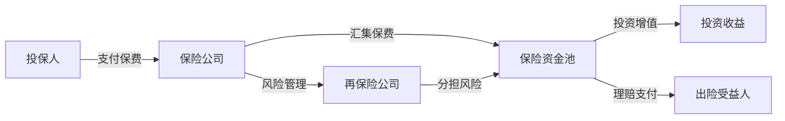
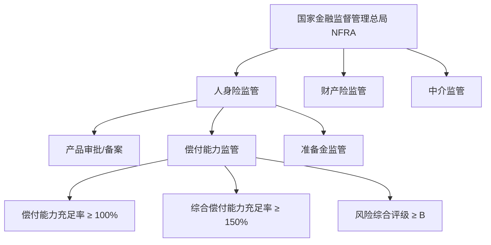
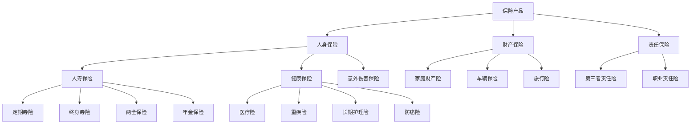
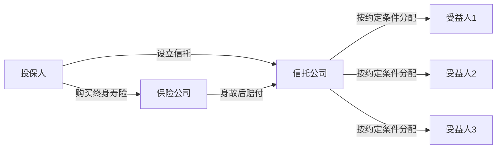
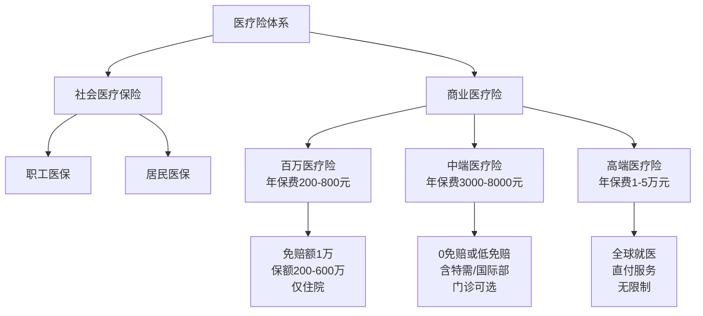
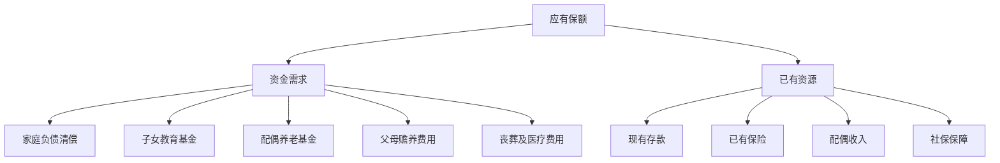
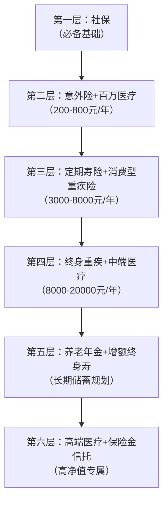
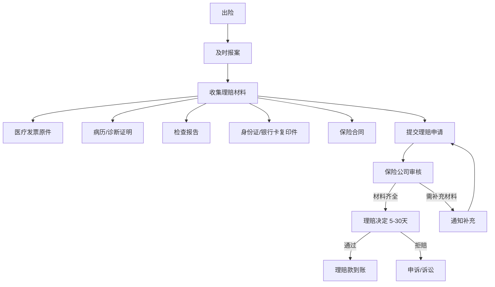
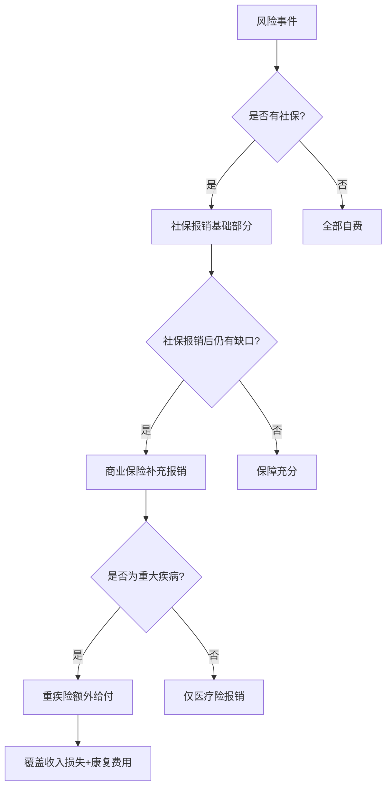

## 五、保险规划理论

保险是个人财务安全网的核心组件。它不是消费，不是投资，而是一种**用确定性对冲不确定性的风险管理工具**。本章从保险的经济学本质出发，系统讲解保险产品体系、规划方法论、人生阶段配置策略，以及理赔实操和常见误区，帮助读者建立科学的保险决策框架。

### 1. 保险的本质与运作原理

#### 1.1 保险的经济学本质

保险的本质是**风险转移机制**——投保人通过支付确定的小额成本（保费），将不确定的大额损失转移给保险公司。这个过程的经济学基础是**大数法则**（Law of Large Numbers）：当样本量足够大时，实际损失率会趋近于预期损失率，使得保险公司能够精确计算风险并定价。

从个人财务角度看，保险解决的核心问题是：**用可承受的确定性支出，对冲不可承受的不确定性风险**。一个年收入30万的家庭，可能无法承受一次100万的重大疾病支出，但每年支付1-2万的保费却在可承受范围内。

**为什么保险不是"赌博"？** 赌博是主动创造风险以追求收益，保险是在已有风险的前提下转移风险。你不需要保险来"赚"钱——你需要保险来确保当灾难发生时，你和你的家人不会因为经济原因陷入困境。这背后的经济学原理是**期望效用理论**（Expected Utility Theory）：对于风险厌恶型个体而言，用一笔小额确定支出（保费）替代一笔大额不确定损失（风险事件的期望损失），能够提升总效用。

**风险自留 vs 风险转移的决策矩阵：**

并非所有风险都需要通过保险转移。保险只转移"低频高损"的风险，对于"高频低损"的风险应该自留，对于"高频高损"的风险应该规避（避免从事该活动）。

| 风险类型 | 频率 | 损失程度 | 最优策略 | 举例 |
|----------|------|----------|----------|------|
| 低频低损 | 低 | 低 | 自留 | 手机碎屏 |
| 低频高损 | 低 | 高 | **转移（买保险）** | 重大疾病、车祸 |
| 高频低损 | 高 | 低 | 自留 | 感冒发烧 |
| 高频高损 | 高 | 高 | 规避 | 不参与高危活动 |

这个矩阵的实操意义：不要为小事买保险（如航班延误险、手机碎屏险的保费占比往往偏高），把保险预算集中在"低频高损"的核心风险上。

#### 1.2 保险的运作机制



**保费构成公式：**

```text
保费 = 纯保费 + 附加保费

纯保费 = 预期损失 + 风险附加
附加保费 = 运营成本 + 利润 margin + 渠道费用
```

各组成部分的含义和占比：

| 组成部分 | 含义 | 占比参考 |
|----------|------|----------|
| **纯保费** | 覆盖预期赔付，基于精算模型计算 | 约占总保费的60%-70% |
| **风险附加** | 应对实际损失超出预期的缓冲 | 约占纯保费的10%-20% |
| **运营成本** | 公司运营、人员、系统等费用 | 约占总保费的10%-15% |
| **利润margin** | 保险公司的合理利润 | 约占总保费的5%-10% |
| **渠道费用** | 代理人佣金、银行手续费等 | 首年保费的30%-50% |

理解保费构成的实际意义：**为什么首年退保损失巨大？** 因为首年保费中30%-50%已作为渠道费用支付给了代理人或银行，这部分无法退还。附加保费中的运营成本也是已发生的沉没成本。这就是为什么退保只能拿回"现金价值"，通常远低于已交保费。

#### 1.3 保险的核心原则

| 原则 | 含义 | 实际影响 | 违反后果 |
|------|------|----------|----------|
| **最大诚信原则** | 投保人必须如实告知所有重要事实 | 隐瞒病史可能导致理赔被拒 | 保险公司有权解除合同且不退保费 |
| **保险利益原则** | 投保人必须对保险标的具有法律认可的利益 | 不能为无关第三人投保 | 合同无效 |
| **损失补偿原则** | 赔付不超过实际损失（财产险适用） | 不能通过保险获利 | 超额部分不赔 |
| **近因原则** | 只赔付保险责任范围内的近因导致的损失 | 需要因果关系明确 | 非近因导致的损失不赔 |
| **代位求偿原则** | 保险公司赔付后可向第三方追偿 | 避免重复获利 | 投保人不得放弃对第三方的追偿权 |

**最大诚信原则的实操要点：** 投保时的健康告知是理赔纠纷的第一大源头。中国实行**"询问告知"**制度——保险公司问什么，你就如实回答什么。保险公司没问的，你无需主动告知。但一旦问到了，就必须如实回答。实操建议：

- 有健康异常时，不要隐瞒，而是如实告知并走**智能核保**或**人工核保**流程
- 智能核保的结果可能是：标准体承保、除外承保（如除外甲状腺相关疾病）、加费承保或拒保
- 即使被一家公司拒保，也不代表所有公司都会拒保——不同公司的核保标准不同
- 投保前的体检报告、门诊记录、住院记录都是核保的重要依据
- **关键时间节点**：《保险法》第十六条规定，保险合同成立超过两年的，保险公司不得以投保人未如实告知为由解除合同（即"两年不可抗辩条款"）。但这不意味着可以故意隐瞒——故意欺诈不受此条款保护

#### 1.4 保险合同的关键时间节点

保险合同中有几个至关重要但常被忽略的时间节点，直接影响保障是否生效和理赔是否成功：

| 时间节点 | 含义 | 典型期限 | 实操要点 |
|----------|------|----------|----------|
| **犹豫期** | 签收合同后可无条件全额退保的期间 | 15-20天 | 充分利用犹豫期审阅条款，不满意可全额退保 |
| **等待期** | 合同生效后，某些保障暂不生效的期间 | 重疾/寿险90-180天，医疗险30天 | 等待期内出险不赔付，续保无等待期 |
| **宽限期** | 到期未缴费，保障仍有效的缓冲期 | 60天 | 宽限期内出险仍赔付，但需补交保费 |
| **复效期** | 保单失效后可申请恢复的期限 | 2年 | 复效需重新健康告知，可能被拒 |
| **不可抗辩期** | 合同成立超过此期限，保险公司不得以未如实告知解约 | 2年 | 保护消费者，但不保护故意欺诈 |

**等待期的深层理解：** 等待期是保险公司防止"带病投保"的机制。如果在等待期内确诊疾病，处理方式因产品而异：

- **重疾险**：等待期内确诊重疾，通常退还已交保费，合同终止
- **医疗险**：等待期内发生的疾病，即使等待期后治疗，通常也不赔付该疾病相关费用
- **寿险**：等待期内因疾病身故，退还已交保费；因意外身故通常无等待期
- **意外险**：一般无等待期，次日零时即生效

**宽限期与复效的实操意义：** 很多人因为忘记缴费导致保单失效。60天宽限期是"救命稻草"——只要在宽限期内补交保费，保障完全不受影响。超过宽限期保单中止，但在2年内可以申请复效。复效时需要重新做健康告知，如果这两年内健康状况恶化，可能被拒复效。因此建议设置自动扣款，并确保扣款账户余额充足。

#### 1.5 中国保险监管体系

了解监管体系有助于判断保险产品的安全性和可靠性：



**偿付能力监管三支柱：**

| 支柱 | 内容 | 对消费者的意义 |
|------|------|----------------|
| 第一支柱：定量资本要求 | 最低资本金要求 | 确保保险公司有足够的钱赔付 |
| 第二支柱：定性监管要求 | 风险管理评估 | 确保保险公司运营规范 |
| 第三支柱：市场约束 | 信息披露 | 消费者可查询保险公司偿付能力报告 |

**消费者的保障机制：** 即使保险公司破产，人寿保险合同也会由其他保险公司接管或由保险保障基金兜底。《保险法》第八十九条规定，经营人寿保险业务的保险公司不得解散。这是保险区别于其他金融产品的重要安全边际。

**偿付能力查询实操：** 每家保险公司的偿付能力报告在每个季度都会在官网披露。查询路径：保险公司官网 → 公开信息披露 → 偿付能力报告。重点关注三个指标：综合偿付能力充足率（≥150%为优秀）、核心偿付能力充足率（≥100%为合格）、风险综合评级（A为优秀，B为合格，C/D需警惕）。当某家公司偿付能力持续下降或接近监管红线时，监管机构会采取限制新业务、要求增资等措施。

### 2. 保险产品体系与分类

#### 2.1 按保障对象分类



#### 2.2 核心保险产品深度解析

##### （一）定期寿险（Term Life Insurance）

**定义：** 在约定期间内提供死亡保障，期间届满则保障终止，不退还保费。

**核心特点：**
- 纯保障型产品，不包含任何储蓄或投资成分
- 保费在所有寿险产品中最低，杠杆率最高
- 保障期限灵活：可选10年、20年、30年，或保至60岁、70岁
- 缴费方式：趸交（一次性）、年交、月交

**适用场景：**
- 家庭经济支柱，需要确保身故后家人的生活质量
- 有房贷、车贷等负债的人群——寿险保额应至少覆盖负债总额
- 创业者——确保企业不会因创始人身故而陷入财务困境
- 有赡养义务的人——父母赡养、子女抚养的经济责任

**保费参考：** 30岁男性，100万保额，20年期，20年缴费，年保费约1000-1500元。30岁女性同等条件约600-900元。定期寿险是所有保险产品中**性价比最高**的——以最低的成本转移最大的财务风险。

**选购要点：**
- 保额：至少覆盖家庭负债 + 5-10年家庭生活费
- 保障期限：覆盖到最小子女经济独立（通常保至60岁）
- 注意免责条款：不同产品的免责条款差异较大，优选免责少的产品（最少的仅3条免责）
- 是否包含全残责任：部分产品包含全残保障，实用性更强
- **减额交清**功能：如果未来缴费压力大，能否转为减额交清（不再交费，保额相应降低）

##### （二）终身寿险（Whole Life Insurance）

**定义：** 提供终身死亡保障，兼具储蓄功能。

**核心特点：**
- 保障终身有效，不存在保障到期的问题
- 具有现金价值，可保单贷款或退保取现
- 保费远高于定期寿险（通常为定期寿的5-10倍）

**三种形态对比：**

| 类型 | 保额变化 | 现金价值增长 | 适合人群 | 核心用途 |
|------|----------|--------------|----------|----------|
| 传统终身寿险 | 固定不变 | 稳定但较低 | 保守型 | 确定性保障 |
| 增额终身寿险 | 逐年递增（3%-3.5%复利） | 快速增长，后期超过保额 | 追求长期增值 | 财富传承+养老储备 |
| 万能寿险 | 灵活调整 | 有保底利率（通常1.75%-3%） | 收入不稳定者 | 灵活保障+投资 |

**增额终身寿险的特殊价值：** 近年来增额终身寿险成为热门产品，其核心卖点是"锁定利率"。在利率下行的经济环境中，增额终身寿险的3%-3.5%复利增长写入合同，不受市场利率波动影响。适合用作：
- 强制储蓄工具——退保有损失，强制你坚持长期储蓄
- 养老金补充——退休后通过减保取现获得现金流
- 财富传承——身故保险金指定受益人，定向传承

**但需注意：** 增额终身寿险的前期现金价值低于已交保费，通常需要持有7-10年才能"回本"。如果资金可能在5年内使用，增额终身寿险并非合适的选择。

**增额终身寿险IRR计算实操：**

IRR（内部收益率）是衡量增额终身寿险实际收益的核心指标。以一款3%复利增长的产品为例，年交10万，交5年：

| 保单年度 | 累计已交保费 | 现金价值 | IRR |
|----------|-------------|----------|-----|
| 第3年 | 30万 | 24.2万 | -7.5% |
| 第5年 | 50万 | 45.8万 | -1.7% |
| 第7年 | 50万 | 52.3万 | 0.6% |
| 第10年 | 50万 | 60.1万 | 1.8% |
| 第20年 | 50万 | 81.2万 | 2.5% |
| 第30年 | 50万 | 109.3万 | 2.7% |
| 第40年 | 50万 | 147.0万 | 2.8% |

从表中可以看出：前5年IRR为负（退保亏损），第7年左右"回本"，长期持有IRR逐渐接近3%。**如果不能持有10年以上，增额终身寿险的实际收益不如银行定存。** 这是选购前必须认清的事实。

**保险金信托——终身寿险的进阶应用：**

对于高净值家庭（可投资资产500万以上），终身寿险可以与信托结合，形成**保险金信托**：



保险金信托的优势：
- **防止受益人挥霍**：约定分期领取、达到特定条件才发放（如子女考上大学、年满30岁等）
- **债务隔离**：信托资产独立于受益人的个人资产
- **跨代传承**：可以约定多代受益人
- **门槛降低**：目前很多信托公司降低了保险金信托的设立门槛，保额100万即可设立

##### （三）重大疾病保险（Critical Illness Insurance）

**定义：** 确诊合同约定的重大疾病即赔付，赔付金额与实际医疗费用无关，一次性给付。

**核心病种：** 2020年修订后的《重大疾病保险的疾病定义使用规范》规定28种必保重疾，其中前6种为所有重疾险必须包含的核心病种：

| 序号 | 病种 | 发病率参考 |
|------|------|-----------|
| 1 | 恶性肿瘤——重度 | 占理赔的60%-80% |
| 2 | 较重急性心肌梗死 | 占理赔的10%-15% |
| 3 | 严重脑中风后遗症 | 占理赔的5%-10% |
| 4 | 重大器官移植术或造血干细胞移植术 | 少见但费用极高 |
| 5 | 冠状动脉搭桥术 | 心血管疾病高发 |
| 6 | 严重慢性肾衰竭（尿毒症期） | 需长期透析 |

**赔付方式：** 确诊即赔，不问用途。这笔钱可以用于：
- 医疗费用自费部分
- 康复期的营养费、护理费
- 收入损失补偿——这往往是最大的隐性成本
- 偿还房贷等负债
- 家庭日常开支

**保额建议：** 年收入的3-5倍。为什么是3-5倍？因为重大疾病从确诊到恢复通常需要2-3年，期间可能完全丧失工作能力。以年收入30万为例，3年收入损失即90万，加上治疗和康复费用，50-100万的保额是合理的起点。

**产品形态对比：**

| 类型 | 保障期限 | 保费 | 适合人群 | 优缺点 |
|------|----------|------|----------|--------|
| 消费型定期 | 20-30年或至70岁 | 低（50万保额约3000-5000元/年） | 预算有限的年轻人 | 优：杠杆高；缺：到期无返还 |
| 储蓄型终身 | 终身 | 中高（50万保额约8000-12000元/年） | 追求长期保障 | 优：终身有效+现金价值；缺：保费高 |
| 返还型 | 固定期限 | 高（比消费型贵60%-100%） | 希望"不亏本"的人群 | 优：到期返还保费；缺：实际收益低 |

**多次赔付 vs 单次赔付：** 多次赔付重疾险在首次重疾赔付后，仍可对其他组别的重疾进行赔付。随着医疗技术进步，重疾存活率不断提升，多次赔付的价值正在增加。但多次赔付产品的保费通常比单次赔付高30%-50%。建议在预算充足时优先考虑多次赔付，预算有限时优先保证首次赔付的保额充足。

**多次赔付的分组策略：** 多次赔付产品通常将重疾分为3-6组，每组赔付一次。关键看高发重疾（恶性肿瘤、心脑血管疾病）是否分散在不同组——如果把最高发的几种病放在同一组，多次赔付的价值就大打折扣。

**轻症和中症责任：** 现代重疾险通常包含轻症（赔付保额的20%-30%）和中症（赔付保额的50%-60%）责任。例如，原位癌属于轻症，不严重的急性心肌梗死属于中症。轻症/中症赔付后，重疾保额不受影响，且通常豁免后续保费。

**保费豁免的价值：** 被保险人豁免（确诊轻症/中症/重疾后免交后续保费）和投保人豁免（投保人身故/重疾后免交后续保费）是重疾险的重要附加功能。特别是夫妻互保（各自做对方的投保人并附加投保人豁免），可以实现"一人出险，两张保单都免交保费"的效果。

##### （四）医疗险（Medical Insurance）

**定义：** 报销医疗费用，实报实销（受保额限制），遵循补偿原则。

**医疗险的层次体系：**



**百万医疗险深度解析：**

百万医疗险是普通家庭最实用的医疗险产品。它的核心逻辑是：**用几百元的保费，转移住院医疗费用中超过1万元（免赔额）的部分**。

关键条款解读：

| 条款 | 含义 | 选购要点 |
|------|------|----------|
| **免赔额** | 低于此金额的费用自付 | 通常1万，社保报销可抵扣免赔额 |
| **等待期** | 投保后等待期间不赔付 | 通常30天，续保无等待期 |
| **保证续保** | 保证续保期内不因健康变化拒保 | 优选保证续保20年的产品 |
| **院外药** | 医院买不到但在院外药房能买到的药 | 癌症靶向药常需院外购买，必须覆盖 |
| **质子重离子** | 先进的癌症治疗技术 | 单次治疗费约30万，优选含此责任的产品 |
| **特殊门诊** | 门诊放化疗、肾透析等 | 部分产品只保住院不含特殊门诊 |

**社保报销后百万医疗险的实际作用示例：**

假设住院治疗总费用25万元，其中社保目录内15万，社保目录外（自费药、进口药）10万：

```text
社保报销 = 15万 × 70% = 10.5万
个人自付 = 25万 - 10.5万 = 14.5万
百万医疗报销 = 14.5万 - 1万(免赔额) = 13.5万
个人实际承担 = 1万元（仅免赔额部分）
```

**与重疾险的核心区别：**

| 对比维度 | 医疗险 | 重疾险 |
|----------|--------|--------|
| 赔付方式 | 报销制（实报实销） | 给付制（确诊即赔） |
| 赔付金额 | 不超过实际医疗费用 | 固定保额，与医疗费用无关 |
| 用途限制 | 仅限医疗费用 | 不限用途 |
| 病种限制 | 不限病种 | 限定重大疾病 |
| 保障期限 | 通常1年，可续保 | 长期或终身 |
| 保费变化 | 随年龄增长（有费率表） | 投保时锁定，终身不变 |

**两者不是替代关系，而是互补关系。** 医疗险解决的是"治病的钱"，重疾险解决的是"养病的钱"。一场大病带来的经济损失远不止医疗费用——还有至少2-3年的收入损失、康复费用、护理费用、营养费用，这些都需要重疾险的给付来覆盖。

**中端医疗险的升级价值：** 当家庭年收入超过30万时，可以考虑从百万医疗险升级到中端医疗险。核心升级点：
- **0免赔**：小额住院也能报销
- **特需/国际部**：更好的就医环境和更快的就医速度
- **门诊可选**：覆盖日常门诊费用
- **直付服务**：保险公司直接与医院结算，无需垫付

##### （五）意外伤害保险

**定义：** 因意外事故导致的身故、伤残、医疗费用的保险。

**"意外"的严格定义——四要素缺一不可：**
1. **外来的**：伤害来自外部因素，非身体内部疾病导致
2. **突发的**：突然发生，非长期慢性过程
3. **非本意的**：非故意行为导致
4. **非疾病的**：排除疾病因素

**哪些情况属于"意外"：** 交通事故、跌倒摔伤、烧伤烫伤、溺水、触电、被坠物砸伤、被动物咬伤（非传染病）。

**哪些情况不属于"意外"：** 猝死（通常由心脏疾病导致）、中暑（身体机能问题）、高原反应（身体适应问题）、食物中毒（个体差异，存在争议）、医疗事故（责任认定复杂）。

**核心保障内容：**

| 保障项目 | 赔付标准 | 说明 |
|----------|----------|------|
| 意外身故 | 赔付100%保额 | 一次性给付 |
| 意外伤残 | 按伤残等级赔付 | 1级100%，10级10%，每级差10% |
| 意外医疗 | 报销医疗费用 | 通常限社保内用药，注意免赔额和报销比例 |
| 住院津贴 | 按天给付 | 每天50-200元，有天数限制 |

**保费特点：** 杠杆率极高，100-300元/年可获100万意外身故/伤残保障。这是所有保险产品中**杠杆率最高**的。

**选购要点：**
- 意外伤残保障比意外身故更重要——伤残意味着持续的经济负担
- 注意是否包含**猝死保障**——传统意外险不赔猝死，但现在部分产品增加了猝死责任
- 注意是否限社保内用药——优选不限社保的意外医疗
- 注意免责条款——高风险运动、酒驾等通常免责
- **意外医疗免赔额**：优选0免赔、100%报销比例的产品

##### （六）年金保险与教育金

**定义：** 以被保险人生存为给付条件，在约定时间定期给付保险金。

**年金保险的核心价值：** 解决"长寿风险"——活得越久，钱花得越多。年金险将一笔大额资金转化为终身稳定的现金流，确保"人在钱在"。

**年金保险的类型：**

| 类型 | 给付开始时间 | 适合场景 |
|------|------------|----------|
| 即期年金 | 投保后立即开始 | 已有大额资金，需要立刻获得现金流 |
| 延期年金 | 投保后若干年开始 | 在工作期间积累，退休后领取 |
| 教育年金 | 子女上大学时开始 | 子女教育规划 |
| 养老年金 | 退休后开始 | 养老规划 |

**年金保险的实际收益率分析：** 年金保险的IRR（内部收益率）通常在2%-3.5%之间，看似不高，但它的核心价值不在于收益率，而在于**确定性**——不受市场波动影响，活多久领多久。

**养老年金 vs 自己投资养老的对比：**

| 对比维度 | 养老年金 | 自己投资 |
|----------|----------|----------|
| 收益确定性 | 确定（写入合同） | 不确定（受市场波动） |
| 长寿风险 | 完全覆盖（终身领取） | 存在"人活着钱花完了"的风险 |
| 收益率 | 2%-3.5% | 取决于投资能力，可能更高也可能亏损 |
| 流动性 | 差（退保有损失） | 好（随时可取） |
| 适合人群 | 风险厌恶、缺乏投资能力 | 有投资纪律和能力的人 |

**实操建议：** 年金险不是替代投资，而是投资的"安全垫"。建议用退休所需资金的30%-50%配置养老年金（覆盖基本生活开支），其余部分自行投资（追求更高收益）。

##### （七）长期护理险

**定义：** 因失能（丧失日常生活能力）需要长期护理时，按月给付护理金。

**失能的判定标准：** 通常以"六项日常生活活动"（ADL）为判定依据——进食、穿衣、如厕、洗澡、移动、控制大小便。当无法独立完成其中2-3项时，即判定为失能。

**为什么长期护理险越来越重要？** 中国正快速进入老龄化社会。2025年60岁以上人口已超过3亿。阿尔茨海默症、帕金森病等神经退行性疾病导致的失能，需要长达数年甚至十几年的护理。护理费用每月5000-15000元（居家护理）或10000-30000元（专业机构），对家庭财务是巨大负担。

**长期护理险的配置建议：** 目前中国商业长期护理险产品较少且保费较高。建议策略：
1. 优先参加社保体系中的长期护理保险试点（已在49个城市试点）
2. 50岁前考虑配置商业长期护理险
3. 用增额终身寿险或养老年金险的部分功能替代——通过减保取现获得护理资金

##### （八）防癌险

**定义：** 专门针对恶性肿瘤的保险，适合因健康原因无法投保重疾险的人群。

**防癌险 vs 重疾险：**

| 对比维度 | 防癌险 | 重疾险 |
|----------|--------|--------|
| 保障范围 | 仅恶性肿瘤 | 28种+重疾 |
| 健康告知 | 宽松（三高、糖尿病可投） | 严格 |
| 保费 | 较低 | 较高 |
| 适合人群 | 健康异常、年龄偏大 | 标准体 |

**适用场景：**
- 50岁以上无法投保重疾险的中老年人
- 有高血压、糖尿病等慢性病的人群
- 曾被重疾险拒保或除外承保的人群
- 作为重疾险的补充保障（叠加保额）

### 3. 保险规划的理论框架

#### 3.1 需求分析法（Needs Analysis Approach）

需求分析法是最科学的保险规划方法，核心思路是：**计算家庭在被保险人身故/重病时的资金缺口，以此确定保额**。



**计算公式：**

```text
应有保额 = 资金需求 - 已有资源

资金需求 = 房贷余额 + 子女教育金 + 配偶养老金 + 父母赡养费 + 丧葬费
已有资源 = 储蓄 + 已有保险赔付 + 配偶未来收入现值 + 社保
```

**案例：** 张先生，35岁，年收入30万，妻子年收入10万，一个3岁孩子，房贷余额150万

| 需求项目 | 金额（万元） | 说明 |
|----------|-------------|------|
| 房贷清偿 | 150 | 剩余贷款本金 |
| 子女教育 | 100 | 从幼儿园到大学（含课外辅导、留学预备金） |
| 配偶养老 | 80 | 至60岁的生活费补充（扣除配偶自身收入后） |
| 父母赡养 | 50 | 双方父母10年赡养（每月每方约2000元） |
| 丧葬费用 | 10 | 丧葬及临终医疗 |
| **合计需求** | **390** | — |

| 已有资源 | 金额（万元） | 说明 |
|----------|-------------|------|
| 储蓄投资 | 30 | 家庭流动资产 |
| 社保赔付 | 20 | 社保身故赔偿（丧葬费+抚恤金，估算） |
| 配偶收入现值 | 150 | 妻子未来收入折现（年收入10万 × 25年 × 0.6折现因子） |
| **合计资源** | **200** | — |

**应有保额 = 390 - 200 = 190万元**

需求分析法的优势在于它是个性化的——每个家庭的负债、收入、成员结构都不同，计算出的保额也不同。它避免了"一刀切"的保额建议。

**动态调整机制：** 需求分析不是一次性计算。每当家庭发生重大变化时，应重新计算保额需求：
- 收入大幅增长或下降
- 新增房贷/还清房贷
- 生育子女
- 子女经济独立（可减少寿险保额）
- 父母去世（可减少赡养费用）

#### 3.2 生命价值法（Human Life Value Approach）

生命价值法从被保险人的**未来收入现值**角度计算保额：

```text
生命价值 = Σ (年收入 - 年个人消费) / (1 + 折现率)^n
```

**简化计算（假设收入恒定）：**

```text
生命价值 ≈ (年收入 - 年个人消费) × 工作年限 × 折现因子
```

例如：年收入30万，个人消费5万，剩余工作年限25年，折现率3%

```text
生命价值 ≈ 25万 × 25 × 0.75 ≈ 468万
```

**折现因子的含义：** 未来的钱不如今天的钱值钱。3%的折现率意味着今天的100万相当于25年后的约46万。折现因子0.75是25年期3%折现率的简化近似值。

**两种方法对比：**

| 对比维度 | 需求分析法 | 生命价值法 |
|----------|-----------|-----------|
| 计算基础 | 家庭实际资金缺口 | 被保险人未来收入 |
| 优点 | 精确反映家庭需求，结果更具个性化 | 计算简单，快速估算 |
| 缺点 | 需要详细的财务数据 | 可能高估保额，忽略配偶收入贡献 |
| 适用场景 | 已有家庭责任的人，需要精确规划 | 快速估算或收入变化大难以精算的人 |
| 建议 | 优先使用此方法 | 作为需求分析法的交叉验证 |

**实操建议：** 用需求分析法确定保额下限，用生命价值法确定保额上限，最终保额取两者之间的合理值，同时考虑保费预算约束。

#### 3.3 保费预算原则

**"双十原则"：**

- 保费支出 = 年收入的 5%-10%
- 保额 = 年收入的 10 倍

**分收入段调整建议：**

| 年收入 | 保费占比 | 产品策略 | 说明 |
|--------|----------|----------|------|
| < 10万 | ≤ 5% | 意外险+百万医疗+消费型定期重疾 | 优先保障型，用最低成本获得最大保障 |
| 10-30万 | 5%-8% | 增加定期寿险，重疾可选终身型 | 保障+适度储蓄 |
| 30-50万 | 8%-10% | 完整四大金刚+可选增额终身寿 | 全面保障+长期储蓄 |
| > 50万 | 10%-15% | 全面保障+年金/终身寿+高端医疗 | 可考虑财富传承类保险 |

**保费预算的弹性空间：** "双十原则"是指导而非铁律。如果家庭负债较高（如房贷占收入比超过50%），可以适当提高保费预算到12%-15%。如果家庭有充足的被动收入来源，可以适当降低保险预算。关键是确保在风险发生时，家庭财务不会崩溃。

#### 3.4 保险配置的"阶梯法"

保险配置不是一步到位的，而应该像搭阶梯一样分阶段推进：



**阶梯法的核心逻辑：**
- 每一层都是在前一层充分保障后才向上升级
- 预算有限时，优先保证下层保障充足
- 不要在第一层都没建好的情况下直接跳到第五层
- 随着收入增长和家庭责任增加，逐步向上升级

**典型错误：** 一个年收入15万的年轻人，没有买意外险和百万医疗险，却花1.2万买了增额终身寿险——这就是"底层没建好就盖顶层"的典型错误。

### 4. 不同人生阶段的保险规划

#### 4.1 人生阶段与保险需求矩阵


| 阶段 | 核心风险 | 必备保险 | 保费占比 | 保额重点 | 预算参考（年收入30万） |
|------|----------|----------|----------|----------|----------------------|
| **单身期** | 意外、重疾 | 意外险+百万医疗+消费型定期重疾 | 3%-5% | 重疾50万+ | 约5000-8000元/年 |
| **家庭形成期** | 身故、重疾 | 定期寿险+重疾+医疗+意外 | 5%-8% | 寿险100万+ | 约1.5-2.4万元/年 |
| **家庭成长期** | 身故、重疾、教育 | 寿险+重疾+医疗+意外 | 8%-10% | 寿险200万+ | 约2.4-3万元/年 |
| **家庭成熟期** | 养老、医疗 | 重疾+医疗+意外+养老险 | 8%-10% | 重疾100万+ | 约2.4-3万元/年 |
| **退休期** | 医疗、护理 | 医疗险+意外险+护理险 | 5%-8% | 医疗200万+ | 需根据退休金调整 |

#### 4.2 家庭经济支柱的保险配置

**配置优先级：**

1. **第一优先：定期寿险**——覆盖负债+家庭责任期，确保身故后家人不会因经济问题陷入困境
2. **第二优先：重疾险**——覆盖收入损失+康复费用，确保大病期间家庭收入不中断
3. **第三优先：百万医疗险**——覆盖大额医疗费用，防止因病致贫
4. **第四优先：意外险**——高杠杆补充保障，弥补意外伤残的长期经济损失

**配置示例（30岁男性，年收入30万）：**

| 险种 | 产品类型 | 保额 | 年保费 | 核心作用 |
|------|----------|------|--------|----------|
| 定期寿险 | 消费型，保至60岁 | 200万 | 2000元 | 覆盖房贷+家庭责任 |
| 重疾险 | 消费型，保至70岁 | 50万 | 5000元 | 收入损失+康复费用 |
| 百万医疗 | 保证续保20年 | 400万 | 300元 | 大额医疗费用 |
| 意外险 | 一年期 | 100万 | 200元 | 意外身故/伤残 |
| **合计** | — | — | **7500元（2.5%）** | — |

**配偶配置示例（30岁女性，年收入10万）：**

| 险种 | 产品类型 | 保额 | 年保费 |
|------|----------|------|--------|
| 定期寿险 | 消费型，保至60岁 | 100万 | 800元 |
| 重疾险 | 消费型，保至70岁 | 50万 | 3500元 |
| 百万医疗 | 保证续保20年 | 400万 | 250元 |
| 意外险 | 一年期 | 100万 | 200元 |
| **合计** | — | — | **4750元** |

**夫妻合计保费 = 7500 + 4750 = 12250元/年**，占家庭年收入40万的约3%，在合理范围内。

#### 4.3 儿童保险配置

**核心原则：** 先保大人，后保小孩。孩子不是家庭经济支柱，保险配置的优先级低于成人。

**儿童必备保险（按优先级）：**

1. **少儿医保（社保）**：出生即可参保，年缴费约200-400元，覆盖基础医疗
2. **百万医疗险**：年保费约600-800元，覆盖大额医疗费用
3. **意外险**：年保费约60-100元，覆盖意外伤害和意外医疗
4. **少儿重疾险**：可选消费型定期，50万保额约500-800元/年

**为什么不需要给孩子买寿险？** 孩子身故不会造成家庭收入损失，因此不需要寿险保障。部分代理人推荐的"教育金+寿险"组合产品，往往保费高、收益低、保障不足。

**少儿保险的保费参考（0岁儿童）：**

| 险种 | 保额 | 年保费 | 说明 |
|------|------|--------|------|
| 百万医疗 | 200万 | 700元 | 保证续保20年 |
| 意外险 | 20万 | 60元 | 含意外医疗 |
| 少儿重疾 | 50万 | 600元 | 消费型定期30年 |
| **合计** | — | **1360元** | — |

**教育金的真实收益分析：** 很多家长被推荐购买教育金保险。以一款典型的教育金产品为例：年交2万，交10年，孩子18-21岁每年领取5万。IRR计算结果通常只有1.5%-2.5%，远低于同期银行大额存单利率。教育金保险的核心问题在于：**用"教育"的名义包装了一个低收益的储蓄产品**。如果家长有基本的投资理财能力，每年存2万到指数基金定投，18年后的预期收益远高于教育金保险。

#### 4.4 老年人保险配置

老年人面临的核心问题是：**保费贵、保额低、可选产品少**。很多保险产品对50岁以上人群有严格的健康告知和核保要求。

**老年人保险配置策略：**

| 年龄段 | 可选产品 | 保费特点 | 建议 |
|--------|----------|----------|------|
| 50-60岁 | 百万医疗+意外险+防癌险 | 保费较高但仍可承受 | 优先配置，这是最后的窗口期 |
| 60-70岁 | 意外险+防癌险+惠民保 | 百万医疗可能无法投保 | 防癌险对健康要求较低 |
| 70岁+ | 意外险+惠民保 | 选择极少 | 以社保+惠民保为主 |

**惠民保的价值：** 各地政府指导的"惠民保"（如上海沪惠保、北京京惠保等）不限年龄、不限健康状况、不限职业，年保费通常在100-200元，保额100-300万。虽然免赔额较高（通常2-3万），报销比例较低（50%-80%），但对于无法投保商业医疗险的老年人来说，是最后的保障兜底。

**给父母买保险的实操策略：** 如果父母已经50岁以上且健康状况一般，建议按以下顺序尝试：
1. 百万医疗险——先尝试投保，看健康告知能否通过
2. 防癌医疗险——健康告知宽松，三高可投
3. 意外险——基本无健康告知限制
4. 惠民保——兜底方案，无门槛

**健康异常人群的投保策略：**

健康异常是投保最大的障碍。以下是常见的健康异常及投保策略：

| 健康异常 | 重疾险 | 医疗险 | 寿险 | 推荐策略 |
|----------|--------|--------|------|----------|
| 甲状腺结节1-2级 | 标准体或除外 | 除外甲状腺 | 标准体 | 正常投保，除外可接受 |
| 乳腺结节 | 除外或加费 | 除外 | 标准体 | 多家投保对比核保结果 |
| 乙肝病毒携带 | 可能标准体 | 除外或拒保 | 标准体 | 优先尝试智能核保 |
| 乙肝小三阳 | 除外或加费 | 大概率拒保 | 可能加费 | 尝试多家核保，选最优结果 |
| 高血压（轻度） | 加费或拒保 | 大概率拒保 | 加费 | 选防癌险替代重疾险 |
| 糖尿病 | 大概率拒保 | 大概率拒保 | 大概率拒保 | 防癌险+惠民保+意外险 |
| 抑郁症/焦虑症 | 可能除外 | 可能除外或拒保 | 可能加费 | 如实告知，多家尝试 |

**核心原则：** 永远不要隐瞒健康异常。如实告知后被除外承保，远好于隐瞒后理赔被拒。被一家公司拒保不代表所有公司都会拒保——每家公司的核保标准不同，同一异常在不同公司可能得到完全不同的结果。

**多家投保的实操技巧：**
- 同时向3-5家公司提交投保申请
- 先用智能核保试探结果（不留拒保记录）
- 智能核保不通过再尝试人工核保
- 收到多家核保结果后，选择最优的接受

### 5. 保险规划的常见误区

#### 5.1 十大误区详解

**误区一：先给孩子买保险**

- **错误原因**：孩子不是家庭经济支柱，身故不会造成家庭财务危机
- **正确做法**：先给家庭经济支柱（夫妻）买足保障，再考虑孩子
- **孩子真正需要的**：医疗险（几百元）+ 意外险（100元）+ 少儿重疾险（可选）
- **典型场景**：一个家庭年收入30万，给孩子买了年缴8000元的教育金保险，大人自己却只有社保——一旦大人出事，整个家庭财务崩溃

**误区二：返还型保险更划算**

- **错误原因**：返还型保费通常是消费型的2-3倍，"返还"的是自己多交的钱
- **真相**：用多交的保费去投资，30年后的收益通常高于返还金额
- **数据**：消费型重疾险50万保额年缴5000元，返还型年缴12000元，差额7000元投资30年（年化5%）≈ 46万 > 返还的30万
- **更深层的问题**：返还型保险的"返还"金额通常是"已交保费"而非"保额"，实际收益率往往低于银行定期存款

**误区三：保险是骗人的**

- **错误原因**：混淆了"保险产品"和"销售行为"
- **真相**：保险合同具有法律效力，理赔依据是合同条款
- **理赔数据**：2023年行业平均理赔率 > 97%，拒赔主因是未如实告知
- **根本原因**：消费者购买时没有仔细阅读条款，销售人员误导或夸大保障范围
- **对策**：自己花30分钟读一遍保险条款，重点看"保障责任"和"责任免除"两部分

**误区四：有社保就够了**

社保的局限性：

| 项目 | 社保覆盖 | 社保不覆盖 |
|------|----------|-----------|
| 门诊费用 | 部分报销（有起付线） | 超过封顶线部分 |
| 住院费用 | 50%-85%（根据医院等级） | 自费药、进口药、靶向药 |
| 重大疾病 | 无专项保障 | 收入损失、康复费用 |
| 身故保障 | 丧葬费+抚恤金（约10-20万） | 家庭长期生活保障 |
| 意外伤害 | 工伤保险（仅限工作期间） | 非工作期间的意外 |

**真实案例：** 某患者确诊肺癌，靶向治疗总费用约50万。社保目录内用药约20万，报销14万；社保目录外靶向药约30万，全部自费。个人实际承担36万。如果有百万医疗险，扣除1万免赔额后可报销35万，个人仅承担1万元。

**误区五：保险买一份就够了**

- **正确做法**：不同险种解决不同问题，需要组合配置
- **基本组合**：寿险 + 重疾险 + 医疗险 + 意外险（四大金刚）
- **为什么需要组合？** 每种保险都有其特定的保障范围和赔付条件，没有任何一种保险能够覆盖所有风险

**误区六：保额越高越好**

- **正确做法**：保额应与家庭责任匹配，过高保额会导致保费压力
- **合理保额**：寿险 = 家庭负债 + 5-10年生活费，重疾 = 3-5年收入
- **保额过高的问题**：保费占收入比过高，影响家庭现金流，甚至可能导致中途退保

**误区七：只看品牌不看条款**

- **正确做法**：条款比品牌重要，关注保障范围、免责条款、理赔条件
- **建议**：重点看"保障责任"和"责任免除"两部分
- **现实**：大品牌的产品不一定比小品牌好，有时品牌溢价会导致同样的保障要多付30%-50%的保费

**误区八：保险可以随时买**

- **真相**：年龄越大，保费越贵；健康异常可能导致拒保或加费
- **数据**：同样50万重疾险，30岁年缴5000元，40岁年缴8000元，50岁可能无法投保
- **最佳投保时间**：现在。健康时投保选择最多、保费最低、核保最容易

**误区九：保险是投资**

- **真相**：保险的核心功能是保障，不是投资
- **正确态度**：先保障后理财，保障归保障，投资归投资
- **例外**：增额终身寿险和年金险有一定的储蓄/投资功能，但其核心价值在于"确定性"而非"高收益"

**误区十：买保险不需要专业人士**

- **正确做法**：保险产品复杂，需要专业人士协助分析需求、选择产品、办理理赔
- **注意**：选择独立的保险经纪人，而非单一公司的代理人
- **经纪人 vs 代理人：**

| 维度 | 保险经纪人 | 保险代理人 |
|------|-----------|-----------|
| 代表利益 | 代表客户利益 | 代表保险公司利益 |
| 产品范围 | 可推荐多家公司产品 | 只能推荐本公司产品 |
| 服务模式 | 需求分析→产品匹配→理赔协助 | 产品介绍→促成交易 |
| 收入来源 | 佣金（与代理人相当） | 佣金+公司绩效 |

#### 5.2 雇主团体险的陷阱

很多人认为"公司给我买了保险，不用自己再买了"。这是一个危险的误区。

**雇主团体险的局限性：**

| 维度 | 雇主团体险 | 个人商业险 |
|------|-----------|-----------|
| 保障持续性 | 离职即失去 | 终身有效 |
| 保额 | 通常较低（重疾10-20万） | 可自定义（50万+） |
| 保障范围 | 基础保障 | 可定制 |
| 产品选择 | 公司统一采购，无法选择 | 自由选择最优产品 |
| 受益人 | 通常法定 | 可指定 |

**核心风险：** 如果你在45岁时因健康原因离职或被裁，雇主团体险随之消失，此时再投保个人商业险可能因健康异常被拒保或加费。

**正确做法：** 雇主团体险是"锦上添花"，不能替代个人商业保险。个人商业保险应作为保障的"基本盘"，雇主团体险作为"额外加分"。

### 6. 理赔实操指南

#### 6.1 理赔流程



**关键时间节点：**

| 环节 | 时间要求 | 说明 |
|------|----------|------|
| 报案 | 出险后10天内 | 越早越好，部分公司要求48小时内 |
| 材料提交 | 收到通知后及时提交 | 部分公司支持在线提交 |
| 理赔审核 | 收到完整材料后5-30天 | 小额理赔通常更快 |
| 理赔款到账 | 审核通过后10天内 | 银行转账 |

#### 6.2 理赔材料清单

**医疗险理赔材料：**
- 医疗费用发票原件（最重要，丢失无法补办）
- 费用清单/明细
- 病历（门诊/住院）
- 出院小结（住院时）
- 检查报告/化验单
- 身份证复印件
- 银行卡复印件
- 社保报销凭证（如有社保报销）

**重疾险理赔材料：**
- 诊断证明书（需符合合同约定的疾病定义）
- 病理报告（恶性肿瘤需要）
- 检查报告
- 病历
- 身份证复印件
- 银行卡复印件

**寿险理赔材料：**
- 死亡证明
- 户籍注销证明
- 受益人身份证
- 受益人与被保险人关系证明
- 保险合同
- 银行卡复印件

**发票原件的关键提示：** 如果同时投保了多家公司的医疗险，发票原件只有一份。解决方案：
1. 先向第一家保险公司申请理赔，要求其出具**理赔分割单**（注明已报销金额和剩余可报销金额）
2. 持理赔分割单+发票复印件向第二家公司申请理赔
3. 部分公司支持电子发票多次理赔，无需原件

#### 6.3 常见拒赔原因及应对

| 拒赔原因 | 占比 | 应对方法 |
|----------|------|----------|
| 未如实告知 | 约40% | 投保时如实告知健康状况，有异常走核保 |
| 不在保障范围内 | 约25% | 仔细阅读保障责任和免责条款 |
| 未达到理赔标准 | 约15% | 了解每种疾病的理赔定义 |
| 等待期内出险 | 约10% | 注意等待期，通常30-90天 |
| 材料不齐全 | 约10% | 按要求准备完整材料 |

**被拒赔后的维权路径：**
1. **与保险公司沟通**：了解拒赔的具体理由和依据的条款
2. **向保险公司申诉**：提交补充材料或异议说明
3. **向金融监管总局投诉**：拨打12378热线，监管部门会介入调解
4. **仲裁或诉讼**：通过法律途径解决，法院通常倾向于保护消费者

**12378投诉的实操效果：** 12378是金融消费者投诉维权热线，由中国银行保险监督管理委员会设立。投诉后，保险公司通常会在5个工作日内主动联系消费者协商解决。对于争议较大的理赔案件，12378投诉的解决率较高。需要注意的是，投诉应基于合理诉求，不能无理取闹。

#### 6.4 多家保险公司的理赔顺序优化

当同时持有多家保险公司的产品时，理赔顺序影响实际获赔金额：

**医疗险理赔顺序：**
1. 先用社保报销
2. 再用百万医疗险报销（大部分百万医疗险的免赔额可以用社保报销金额抵扣）
3. 如果还有小额医疗险，用理赔分割单向其报销剩余部分

**重疾险理赔顺序：**
- 重疾险是给付制，不存在顺序问题——每家都按保额全额赔付
- 可以同时向多家保险公司申请理赔

### 7. 保险的税务与法律功能

#### 7.1 税务优势

| 税务项目 | 规定 | 适用产品 |
|----------|------|----------|
| 保险赔款免个税 | 身故赔偿金、重疾给付金免征个人所得税 | 所有人身险 |
| 税优健康险 | 年缴2400元可税前扣除 | 指定的税优健康险产品 |
| 个人养老金 | 年缴12000元可税前扣除 | 指定的个人养老金保险产品 |
| 遗产税规避 | 保险金不属于遗产（指定受益人时） | 终身寿险、年金险 |

**税优健康险的实操：** 税优健康险是国家政策支持的保险产品，每年保费2400元（每月200元）可享受个人所得税税前扣除。对于月薪1万的纳税人，每年可节省约240-720元的个税（取决于税率档位）。

**个人养老金的保险配置：** 个人养老金账户每年可存入12000元，购买指定的养老保险产品可享受税前扣除。对于适用20%税率的纳税人，每年可节省2400元个税。但需注意：个人养老金在退休前不能取出，流动性极差。

#### 7.2 法律功能

**债务隔离：**
- 人寿保险金在指定受益人的情况下，不属于被保险人的遗产，原则上不能被债权人追偿
- **关键条件**：必须在负债前投保，且指定受益人（非"法定"）。如果在负债后投保，法院可能认定为恶意转移财产
- **法律依据**：《保险法》第四十二条，保险金作为被保险人遗产处理的前提是没有指定受益人

**婚姻财产隔离：**
- 婚前投保的保险属于个人财产
- 婚后用个人财产（如婚前存款）投保的，保单现金价值属于个人财产
- 婚后用夫妻共同财产投保的，离婚时保单现金价值需要分割
- **实操建议**：如果需要做婚姻财产隔离，建议在婚前完成投保，或用婚前财产支付保费

**财富传承：**
- 通过指定受益人，实现财富定向传承，避免继承纠纷
- 保险金赔付速度快（通常10-30天），不走遗产继承程序
- 可以指定多个受益人及分配比例，灵活控制财富流向

**受益人指定的实操要点：**
- **必须指定受益人**，不要选"法定"——法定受益人等同于遗产，丧失债务隔离和传承功能
- 可以指定多个受益人，按比例分配（如配偶60%、子女40%）
- 受益人可以随时变更，但需要书面申请
- 受益人与被保险人的关系证明要保留好（结婚证、出生证等）
- **身故受益人 ≠ 生存受益人**：重疾险、年金险的生存受益人通常是被保险人本人

#### 7.3 保单贷款与现金价值

**现金价值的形成：**

```text
现金价值 = 已交保费 - 保险成本 - 运营费用 + 投资收益
```

现金价值在保单前期很低（因为前期的保险成本和渠道费用较高），后期逐渐增长。增额终身寿险的现金价值增长最快，通常在第7-10年超过已交保费。

**保单贷款：**

| 项目 | 内容 |
|------|------|
| 贷款额度 | 现金价值的80% |
| 贷款利率 | 通常4.5%-5.5%（低于信用贷款） |
| 贷款期限 | 通常6个月，可续贷 |
| 用途 | 不限，可用于应急资金 |
| 影响 | 贷款期间保障不受影响，但未还贷款及利息会从理赔款中扣除 |

**保单贷款的实际应用场景：** 当急需资金但不想退保（退保损失现金价值）时，保单贷款是比退保更优的选择。保单贷款利率通常低于信用贷款和信用卡取现，且不影响保障。

**退保 vs 保单贷款的决策：**

| 情景 | 建议 | 原因 |
|------|------|------|
| 短期资金周转（6个月内） | 保单贷款 | 保障不受影响，利率合理 |
| 长期不需要这份保障 | 退保 | 继续交费浪费，不如及时止损 |
| 只是觉得产品不好 | 减额交清 | 保留部分保障，不再交费 |
| 保单已交费超过10年 | 不建议退保 | 现金价值已接近或超过已交保费，保障成本很低 |

**减额交清——退保的替代方案：** 如果不想继续交费但也不想完全退保，可以申请"减额交清"——用现有现金价值一次性交清剩余保费，保额相应降低。这样既不用继续交费，又保留了一定的保障。

### 8. 保险与社保的协同

#### 8.1 社保与商保的互补关系



| 保障项目 | 社保 | 商业保险 | 协同策略 |
|----------|------|----------|----------|
| 医疗费用 | 基础报销（50%-85%） | 百万医疗补充 | 社保报销后，医疗险报销剩余部分（扣除免赔额） |
| 重大疾病 | 无专项保障 | 重疾险给付 | 重疾险赔付用于康复和收入补偿，与医疗险互补 |
| 身故保障 | 丧葬费+抚恤金（有限，约10-20万） | 寿险高额赔付 | 寿险覆盖家庭长期责任（房贷、子女教育等） |
| 意外伤害 | 工伤保险（仅限工作期间） | 意外险全面覆盖 | 意外险补充社保不足，覆盖24小时所有意外 |
| 养老 | 养老金（替代率约40%） | 商业养老保险/年金 | 补充养老金缺口，维持退休后生活水平 |

#### 8.2 社保断缴的影响

社保断缴对商业保险的影响常被忽视：

| 社保状态 | 百万医疗险报销 | 说明 |
|----------|--------------|------|
| 社保在缴 | 社保报销后100%赔付 | 最优状态 |
| 社保断缴 | 未经社保报销，仅赔付60% | 报销比例大幅下降 |
| 从未参保 | 未经社保报销，仅赔付60% | 同上 |

**实操建议：** 如果辞职或创业期间社保可能断缴，务必确保百万医疗险的投保页面选择"无社保"版本（保费会略高），或在续保时及时更新社保状态。

**社保补缴的注意事项：** 社保断缴3个月内通常可以补缴，补缴后商业医疗险的报销比例恢复正常。但超过3个月的断缴，部分地区的医保需要重新连续缴纳6个月才能恢复报销资格。

### 9. 保险购买渠道对比

#### 9.1 四大购买渠道

| 维度 | 线上平台 | 保险经纪人 | 保险代理人 | 银行渠道 |
|------|----------|-----------|-----------|----------|
| 代表产品 | 支付宝好医保、微保 | 各家产品灵活组合 | 单一公司产品 | 银行代销产品 |
| 产品范围 | 平台合作产品 | 多家公司 | 仅本公司 | 银行代销产品 |
| 价格 | 较低（无中间人费用） | 适中 | 较高（含代理人佣金） | 较高（含银行手续费） |
| 专业服务 | 自助为主 | 需求分析+方案定制+理赔协助 | 产品介绍+促成交易 | 理财经理推荐 |
| 适合人群 | 有一定保险知识的人 | 需要专业规划的人 | 信任特定品牌的人 | 在银行办理业务时顺便了解 |
| 理赔服务 | 在线自助 | 经纪人协助 | 代理人协助 | 银行转介 |

**线上投保的优势与风险：**

优势：
- 产品对比方便，信息透明
- 保费通常更低（省去代理人佣金）
- 投保流程简单快捷
- 智能核保即时出结果

风险：
- 缺乏专业指导，可能买错产品
- 健康告知理解不准确
- 理赔时缺乏专业协助
- 容易被"网红产品"误导

**实操建议：** 如果你有一定保险知识，可以在线上平台自主投保（如支付宝、微保、慧择等）。如果保险知识有限，建议找独立的保险经纪人协助规划。无论哪种渠道，都要自己读懂保险条款。

#### 9.2 保险产品对比工具

在选购保险产品时，善用以下工具提高效率：

| 工具 | 类型 | 主要功能 | 网址/方式 |
|------|------|----------|-----------|
| 深蓝保 | 产品测评 | 产品深度评测、对比、知识科普 | 深蓝保官网/公众号 |
| 奶爸保 | 产品测评 | 产品对比、方案定制 | 奶爸保官网/公众号 |
| 慧择 | 保险经纪 | 产品对比、在线投保 | 慧择官网 |
| 蚂蚁保 | 线上平台 | 好医保系列、智能核保 | 支付宝内 |
| 微保 | 线上平台 | 微保系列、在线投保 | 微信内 |
| 12378 | 监管投诉 | 理赔纠纷投诉 | 电话热线 |

### 10. 保险规划实操清单

#### 10.1 购买保险前的自检清单

- [ ] 是否已了解家庭财务状况（收入、支出、负债、资产）？
- [ ] 是否已计算家庭经济支柱的保额需求（需求分析法）？
- [ ] 是否已确认社保保障范围和额度？
- [ ] 是否已整理家庭成员的健康状况（体检报告、门诊记录）？
- [ ] 是否已设定合理的保费预算（年收入5%-10%）？
- [ ] 是否已比较至少3家公司的同类产品？
- [ ] 是否已仔细阅读保险条款（特别是"保障责任"和"责任免除"）？
- [ ] 是否已指定受益人（而非"法定"）？
- [ ] 是否了解等待期、免赔额、续保条件等关键条款？
- [ ] 是否已确认投保时的健康告知准确无误？
- [ ] 是否了解犹豫期（签收后15-20天可全额退保）？
- [ ] 是否已设置自动扣款避免断缴？

#### 10.2 保单年检清单

每年检查一次保单，建议在每年的家庭财务回顾时一并进行：

- [ ] 保障额度是否仍能满足家庭需求（收入增长、负债变化）？
- [ ] 受益人信息是否需要更新（结婚、离婚、生育）？
- [ ] 联系方式是否需要变更？
- [ ] 是否有新增的家庭责任需要补充保障？
- [ ] 是否有不再需要的保障可以调整？
- [ ] 缴费账户余额是否充足？
- [ ] 是否有新产品性价比更高，值得替换？
- [ ] 社保状态是否正常（未断缴）？
- [ ] 家庭成员健康状况变化是否需要补充投保？

#### 10.3 保险产品对比模板

在比较同类产品时，使用以下模板确保对比全面：

| 对比维度 | 产品A | 产品B | 产品C |
|----------|-------|-------|-------|
| 保险公司 | | | |
| 产品名称 | | | |
| 保额 | | | |
| 年保费 | | | |
| 保障期限 | | | |
| 缴费期限 | | | |
| 等待期 | | | |
| 免责条款数量 | | | |
| 轻症/中症保障 | | | |
| 多次赔付 | | | |
| 保证续保 | | | |
| 院外药覆盖 | | | |
| 保费豁免 | | | |
| 现金价值 | | | |
| 线上/线下投保 | | | |
| 理赔口碑 | | | |

#### 10.4 保单整理表模板

一个家庭通常有多份保单，如果不整理，出险时可能遗漏理赔。建议使用以下模板整理所有保单：

| 保单号 | 保险公司 | 产品名称 | 被保险人 | 险种 | 保额 | 年保费 | 缴费日期 | 保障期限 | 受益人 | 备注 |
|--------|----------|----------|----------|------|------|--------|----------|----------|--------|------|
| 示例：P001 | 中国人寿 | 定寿A款 | 张先生 | 定期寿险 | 200万 | 2000元 | 每年3月15日 | 至60岁 | 配偶60%子女40% | — |

**保单整理的实操建议：**
- 使用电子表格或保单管理APP（如"保险师"、"小雨伞"等）
- 将所有保单信息集中管理，家人也知道存放位置
- 每年更新一次，新增保单及时录入
- 出险时第一时间查阅保单整理表，确认所有可理赔的保单

### 11. 进阶话题：保险精算基础

#### 11.1 精算定价的核心参数

保险产品的定价基于以下精算参数：

| 参数 | 含义 | 影响 |
|------|------|------|
| **死亡率表** | 不同年龄人群的死亡概率 | 年龄越大，寿险保费越高 |
| **发病率表** | 不同年龄人群的疾病发病率 | 年龄越大，重疾险保费越高 |
| **利率假设** | 保险公司预期的投资收益率 | 利率越高，保费越低（因为投资收益可覆盖部分成本） |
| **费用率** | 运营成本占保费的比例 | 费用率越高，保费越高 |
| **退保率** | 预期的退保比例 | 影响现金流和准备金 |

**为什么女性保费低于男性？** 因为女性的平均预期寿命高于男性，死亡率和发病率（尤其是心血管疾病）均低于同龄男性。因此，女性的寿险和重疾险保费通常比男性低10%-20%。

**年龄对保费的精确影响（以50万重疾险为例）：**

| 投保年龄 | 年保费（男性） | 年保费（女性） | 累计保费（交至60岁） |
|----------|--------------|--------------|-------------------|
| 25岁 | 3800元 | 3200元 | 13.3万/11.2万 |
| 30岁 | 5000元 | 4200元 | 15.0万/12.6万 |
| 35岁 | 6800元 | 5600元 | 17.0万/14.0万 |
| 40岁 | 9200元 | 7500元 | 18.4万/15.0万 |
| 45岁 | 12500元 | 10200元 | 18.8万/15.3万 |
| 50岁 | 可能无法投保 | 可能无法投保 | — |

从表中可以看出：30岁投保比40岁投保，累计保费节省约3.4万（男性）。更重要的是，45岁以后很多重疾险产品可能无法投保。

#### 11.2 利率环境对保险产品的影响

在低利率环境下（如当前中国市场），保险产品的趋势是：
- **预定利率下调**：从3.5%降至3.0%，意味着同样的保障需要更高的保费
- **增额终身寿险吸引力下降**：因为其锁定利率的优势被削弱
- **分红险和万能险兴起**：因为保险公司可以通过浮动收益部分对冲利率风险
- **保障型产品价值凸显**：纯保障型产品受利率影响最小

**消费者的应对策略：** 在利率下行周期中，如果有长期储蓄需求，尽早锁定当前利率的增额终身寿险或年金险。保障型产品（定期寿险、重疾险、医疗险）则不受利率环境影响，任何时候购买都是合理的。

**预定利率下调的实际影响：** 以增额终身寿险为例，预定利率从3.5%降至3.0%后，同样的保费投入，30年后的现金价值差异约为15%-20%。这就是为什么利率下行前的"末班车"产品会被抢购。但需要注意：不要因为"抢末班车"而忽略了自己的实际需求和资金流动性。

---

**本章小结：** 保险规划是个人财务管理的基石。科学的保险规划应基于需求分析，遵循"先保障后理财、先大人后小孩、先经济支柱后其他成员"的原则，通过合理的险种组合和保额配置，用最小的成本转移最大的风险。保险不是消费，而是对家庭财务安全的投资。在选购保险时，条款比品牌重要，保障比收益重要，现在比将来重要。定期检视保单，根据家庭变化动态调整保障方案，才能确保保险这个"安全网"始终足够结实。
