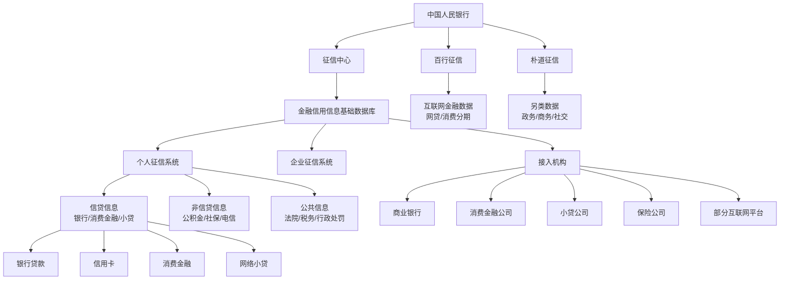
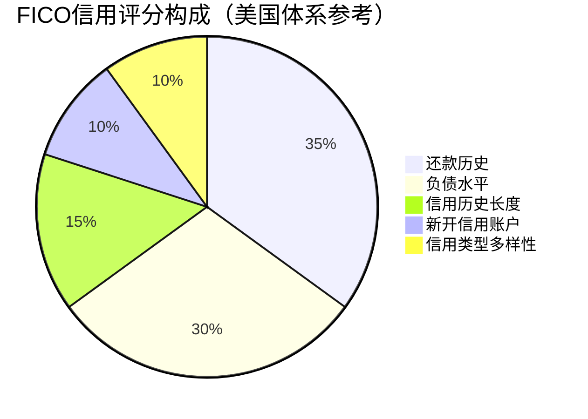
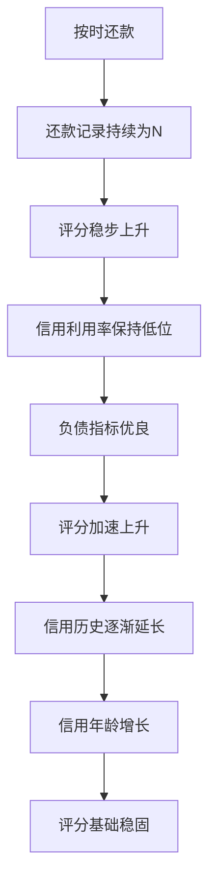
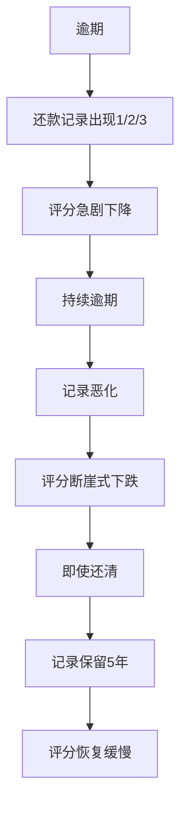
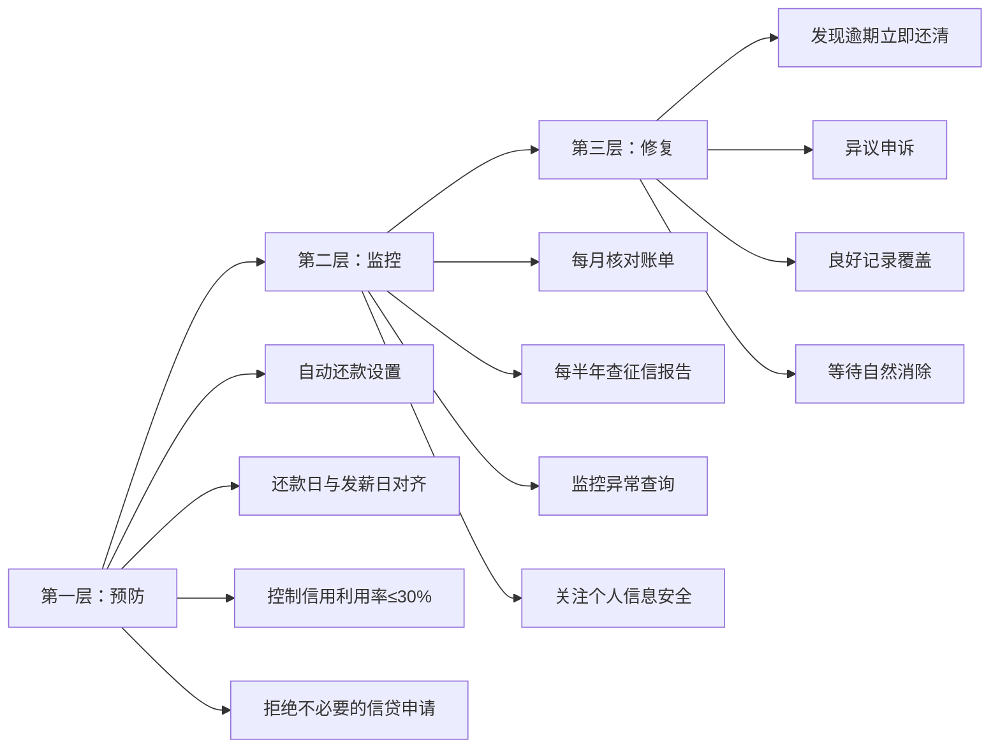
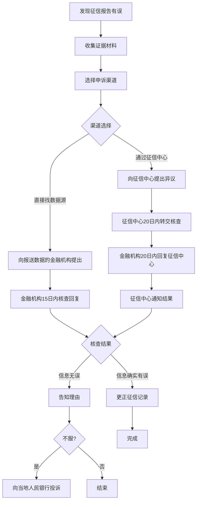

## 六、信用管理理论

信用是现代金融体系的基石。对于个人而言，信用不是抽象的道德概念，而是一个可以量化、可以管理、可以直接折算为融资成本差额的经济资产。理解信用管理的底层理论，才能在每一个金融决策中做出正确选择，而不是在需要贷款时才发现信用已经"破产"。

本章从信用的本质出发，系统讲解征信系统的运作机制、评分模型的数学原理、风险管理的三层防线，并提供异议申诉的完整实操流程、常见误区的深度纠偏，以及不同人生阶段的信用管理策略。

---

### 1. 信用的本质：从哲学到经济学

#### 1.1 信用的多维定义

信用（Credit）一词源自拉丁语 *credere*，意为"相信"。在不同学科中，信用有不同的定义维度：

| 维度 | 定义 | 核心要素 |
|------|------|----------|
| 经济学 | 跨期交易中的一方先行履约承诺 | 信任、时间差、履约能力 |
| 法律学 | 债权债务关系中的偿债能力和意愿 | 契约、法律约束、违约责任 |
| 社会学 | 个人在社会关系中的可信赖程度 | 声誉、一致性、社会网络 |
| 金融学 | 借款人按时偿还本金和利息的可能性 | 还款能力、还款意愿、历史记录 |
| 信息经济学 | 消除或降低信息不对称的制度安排 | 信号传递、信息甄别、机制设计 |

从个人财务管理的角度看，信用的核心定义是：**基于历史行为记录所体现的、按时履行经济承诺的能力和意愿的综合评估**。

这个定义包含三个关键要素：

- **历史行为记录**：信用不是凭空产生的，而是通过长期的金融行为积累而成。每一次按时还款、每一次逾期违约，都会被记录并影响未来的信用评估。
- **能力与意愿并重**：银行不仅关心你"能不能还"（还款能力），还关心你"想不想还"（还款意愿）。高收入但频繁逾期的人，信用评分可能低于收入一般但从不逾期的人。
- **综合评估**：信用不是单一指标，而是多维度数据的综合结果。银行的风控模型会综合考量还款记录、负债水平、收入稳定性、资产状况等多个维度。

#### 1.2 信用的经济学基础——信号理论

迈克尔·斯宾塞（Michael Spence）的信号理论（Signaling Theory）为理解信用提供了重要的经济学框架。在金融市场中，借贷双方存在严重的信息不对称：借款人比贷款人更了解自己的还款能力和意愿。

信用记录就是借款人向贷款人发送的"信号"：

- **高信用评分** → 信号：我是可靠的借款人，按时还款的概率很高
- **低信用评分** → 信号：我的还款能力和意愿存在不确定性

这个信号的价值在于它是**高成本伪造**的——你不可能在短期内通过任何捷径获得高信用评分，只有通过长期的良好金融行为才能建立。这正是信用记录作为信号具有可信度的原因。

信号理论还解释了为什么"信用修复骗局"注定失败：如果低信用评分的人可以轻松获得高评分信号，这个信号就失去了区分能力，市场会寻找新的、更难伪造的信号来替代它。征信系统的持续完善（如接入更多数据维度）正是这种信号演化的过程。

#### 1.3 信用的货币时间价值

信用还有一个常被忽略的维度——它直接影响货币的时间价值。假设两个人同时购买一套价值300万元的房产，贷款210万元，期限30年：

| 项目 | 信用良好（利率LPR） | 信用一般（LPR+30BP） | 信用较差（LPR+60BP） |
|------|---------------------|----------------------|----------------------|
| 贷款利率 | 3.5% | 3.8% | 4.1% |
| 月供 | 9,430元 | 9,800元 | 10,180元 |
| 总利息 | 129.5万元 | 142.8万元 | 156.5万元 |
| 利息差额 | 基准 | 多付13.3万元 | 多付27万元 |

仅因为信用评分的差异，最终的利息支出可以相差27万元。这就是信用的"价格"——信用越好，资金成本越低。

把这个概念进一步延伸：

```text
信用的终身价值 = Σ (每次融资的利率差异 × 融资金额 × 融资期限)

以一个普通城市中产为例的估算：
- 房贷（210万/30年）：信用差异约20-30万元
- 车贷（15万/5年）：信用差异约0.5-1万元
- 经营贷（50万/10年）：信用差异约3-5万元
- 信用卡分期（累计约20万/各年）：信用差异约1-2万元
━━━━━━━━━━━━━━━━━━━━━━━━━━━━━━━━━━━━━━━━━
终身信用价值差异：约25-38万元
```

这意味着信用管理本质上是一种**年化收益率极高**的"投资"——每年花几小时维护信用，换来的是数万元的资金成本节省。将信用维护的时间投入折算为时薪，其回报率远超绝大多数理财行为。

#### 1.4 信用与货币创造的关系

从宏观视角看，个人信用参与了现代货币创造的过程。银行通过"贷款创造存款"（Loans Create Deposits）机制，将个人的信用承诺转化为新的货币供给。你的信用评分越高，银行越愿意向你发放贷款，你实际上在参与货币创造的过程。

这意味着个人信用不仅是个体的金融工具，更是整个信用货币体系运转的基础单元。维护个人信用，从某种意义上说也是在维护金融体系的稳定。

---

### 2. 征信系统的运作机制

#### 2.1 中国征信体系架构

中国的个人征信体系由中国人民银行征信中心（Credit Reference Center of PBC）主导运营，同时有持牌的市场化征信机构作为补充。



**三大持牌个人征信机构**：

| 机构 | 成立时间 | 股东背景 | 核心定位 | 数据来源 |
|------|---------|---------|---------|---------|
| 央行征信中心 | 2006年 | 中国人民银行 | 官方主导，覆盖传统金融机构 | 银行、消费金融、小贷等金融机构报送 |
| 百行征信（信联） | 2018年 | 中国互联网金融协会+8家市场机构 | 互联网金融信用信息共享 | 网贷平台、消费分期、互联网小贷 |
| 朴道征信 | 2020年 | 北京金控+京东数科等 | 差异化市场补充 | 政务数据、商务数据、另类数据 |

截至2024年底，央行征信系统已收录超过11亿自然人的信用信息，日均查询量超过1000万次。百行征信已接入超过2000家机构，覆盖大量此前央行征信未能覆盖的互联网金融人群。

**重要变化——二代征信系统（2020年上线）**相比一代的升级：

| 维度 | 一代征信 | 二代征信 |
|------|---------|---------|
| 还款记录展示 | 近2年 | 近5年 |
| 逾期金额 | 不展示具体金额 | 展示逾期及透支总额 |
| 共同借款人 | 不体现 | 体现共同借款信息 |
| 为他人担保 | 简单记录 | 详细展示担保金额 |
| 水电缴费 | 不纳入 | 部分地区试点纳入 |
| 个人为企业担保 | 不体现 | 体现 |
| 更新频率 | 月度 | 更及时（T+1渐进） |

**二代征信的实际影响**：由于还款记录从2年扩展到5年，银行可以更全面地评估借款人的信用历史。这意味着"养好24个月记录就能覆盖逾期"的旧策略不再完全有效——银行现在可以看到近5年的完整还款表现。但这并不意味着逾期记录的影响没有衰减，银行审批时仍然更关注近期表现。

#### 2.2 征信报告的构成

一份完整的个人征信报告包含以下核心模块：

**第一模块：个人基本信息**

包括身份信息（姓名、身份证号、婚姻状况）、居住信息、职业信息等。这些信息来源于各金融机构的报送，可能存在多个版本（因为你向不同机构提交的信息可能不同）。

实操提示：征信报告中的"职业信息"和"居住信息"可能有多条记录（不同银行报送的不一致），这不会影响信用评分，但在申请贷款时银行可能会要求你解释。建议在更换工作或住址后，主动更新主要银行预留的信息。

**第二模块：信息概要**

这是征信报告的"摘要"，包含：
- 信贷账户总数（按类型分类：住房贷款、其他贷款、贷记卡、准贷记卡）
- 逾期账户数和逾期总额
- 未结清贷款总额
- 最近6个月平均应还款
- 授信总额与已用额度

信息概要是银行审批人员第一眼看的部分。如果概要中出现"逾期账户数>0"，即使金额很小，也会引起审批人员的重点关注。

**"连三累六"——银行拒贷的核心红线**：

在信息概要中，银行审批人员最关注的一个指标是"连三累六"——连续3个月逾期或累计6次逾期。这是绝大多数银行的硬性拒贷标准，无论你的收入多高、资产多丰厚，触及这条红线都会被直接拒绝。

```text
"连三累六"的判定逻辑：

连三 = 最近任意连续3个还款期出现逾期（还款记录中出现连续的"1"或更严重代码）
累六 = 最近一定时期内（通常5年内）累计出现6次逾期

触碰任一条件 → 大型银行自动拒绝
触碰两个条件 → 几乎所有金融机构拒绝
```

**第三模块：信贷交易信息明细**

这是征信报告最核心的部分，详细记录每笔信贷业务：

| 信息项 | 说明 | 对信用的影响 |
|--------|------|-------------|
| 账户状态 | 正常/逾期/结清/呆账 | 逾期和呆账严重损害信用 |
| 余额 | 当前剩余未还金额 | 高余额意味着高负债率 |
| 最近还款日期 | 最后一次还款时间 | 反映还款习惯 |
| 还款记录 | 近24个月的还款状态（二代近60个月） | 这是银行最关注的部分 |
| 逾期金额 | 各期逾期的具体金额 | 反映逾期严重程度 |
| 逾期天数 | 各期逾期持续天数 | 30/60/90天是关键节点 |
| 五级分类 | 正常/关注/次级/可疑/损失 | 体现金融机构的风险评估 |

还款记录用特殊代码表示：

```text
N = 正常还款（当月按时足额还款）
1 = 逾期1-30天
2 = 逾期31-60天
3 = 逾期61-90天
4 = 逾期91-120天
5 = 逾期121-150天
6 = 逾期151-180天
7 = 逾期180天以上
D = 担保人代还
Z = 以资抵债
C = 结清
G = 结束（除结清外）
/ = 账户未开立
# = 账户已开立但当月无交易
```

举个例子，一段还款记录"NNN1NNNNNN2NNNNNNNNNNNN"表示：最近24个月中，大部分时间正常还款，但有1次逾期1-30天和1次逾期31-60天。

**逾期的分级影响**——不同严重程度的逾期对贷款审批的影响差异巨大：

| 逾期情况 | 影响程度 | 房贷审批可能结果 |
|---------|---------|----------------|
| 偶尔1次逾期1-30天，已还清 | 轻微 | 大概率通过，部分银行需写说明 |
| 近2年累计3次以内逾期1-30天 | 中等 | 大银行可能拒绝，中小银行可能通过但上浮利率 |
| 有1次逾期超过60天 | 严重 | 多数银行直接拒绝 |
| 连续3个月逾期（"连三"） | 致命 | 所有银行拒绝 |
| 累计6次逾期（"累六"） | 致命 | 所有银行拒绝 |
| 有"呆账"记录 | 致命 | 所有银行拒绝，需先消除呆账 |
| 当前有逾期未还 | 致命 | 所有银行拒绝 |

**五级分类的含义**：

银行对每笔贷款都会进行五级分类，这直接影响你的征信报告质量：

| 分类 | 定义 | 征信影响 |
|------|------|---------|
| 正常 | 借款人能正常还本付息 | 无负面影响 |
| 关注 | 借款人存在不利因素，但目前仍能还款 | 轻微负面，银行会额外关注 |
| 次级 | 借款人还款能力出现明显问题 | 严重负面，基本无法新增贷款 |
| 可疑 | 借款人无法足额偿还，即使执行担保也会造成较大损失 | 极严重负面 |
| 损失 | 贷款已无法收回或只能收回极少部分 | 最严重的负面记录 |

**第四模块：公共信息**

包括法院判决信息（失信被执行人、限消令）、行政处罚信息、住房公积金参缴记录、养老保险缴存记录等。

特别关注：如果有"失信被执行人"记录（即"老赖"），将直接影响所有信贷申请，且该记录在履行义务后仍需保留5年才能消除。失信被执行人的具体限制包括：

- 限制乘坐飞机、高铁商务座和一等座
- 限制在星级以上酒店、高尔夫球场等场所消费
- 限制子女就读高收费私立学校
- 限制购买不动产或新建、扩建房屋
- 限制出境
- 金融机构贷款或办信用卡基本无望

**第五模块：查询记录**

记录过去2年内谁查询了你的征信报告，以及查询原因。银行审批人员会重点看近半年的查询记录。

#### 2.3 征信查询的正规渠道

个人查询征信报告有以下正规渠道，**全部免费**（每人每年有2次免费线下查询机会，线上查询不限次数）：

| 渠道 | 操作方式 | 出报告时间 | 费用 |
|------|---------|-----------|------|
| 央行征信中心官网 | www.pbccrc.org.cn注册申请 | 次日（24小时内） | 免费 |
| 商业银行网银 | 工行、招行、建行等手机银行APP | 实时 | 免费 |
| 商业银行智慧柜员机 | 携带身份证到银行网点 | 即时 | 免费 |
| 线下柜台 | 当地人民银行征信查询网点 | 即时 | 每年前2次免费，第3次起25元/次 |

**线上查询详细步骤**（以央行征信中心为例）：

1. 访问 www.pbccrc.org.cn，点击"互联网个人信用信息服务平台"
2. 注册账号（需实名认证：身份证号+手机号+银行卡验证）
3. 登录后选择"信用信息提示"或"信用信息概要"或"个人信用报告"
4. 提交申请，等待24小时
5. 收到短信验证码后登录下载PDF报告

**通过手机银行查询**（推荐方式）：

以工商银行为例：打开工行手机银行APP → 搜索"信用报告" → 点击"个人信用报告查询" → 人脸识别验证 → 提交申请 → 实时获取报告。招商银行、建设银行、中国银行等主流银行的APP均支持类似功能，操作流程大同小异。

**查询频率建议**：

| 场景 | 建议频率 | 原因 |
|------|---------|------|
| 日常维护 | 每半年1次 | 及时发现异常 |
| 申请房贷前 | 前3个月查1次 | 确认无问题再申请 |
| 发现身份可能泄露 | 立即查询 | 排查是否被冒名开户 |
| 被银行拒贷后 | 立即查询 | 找出问题所在 |

#### 2.4 查询类型与影响

征信查询分为"硬查询"和"软查询"，它们对信用评分的影响完全不同：

| 类型 | 触发场景 | 是否影响评分 | 影响程度 |
|------|----------|-------------|----------|
| **硬查询** | | | |
| 贷款审批 | 申请贷款时 | 影响 | 每次扣5-10分 |
| 信用卡审批 | 申请信用卡时 | 影响 | 每次扣5-10分 |
| 担保资格审查 | 为他人担保时 | 影响 | 每次扣5-10分 |
| 融资租赁审批 | 申请融资租赁时 | 影响 | 每次扣5-10分 |
| **软查询** | | | |
| 本人查询 | 自己查征信 | 不影响 | 无 |
| 贷后管理 | 银行定期复查 | 不影响 | 无 |
| 异议查询 | 提出征信异议 | 不影响 | 无 |
| 特约商户实名审查 | 开通某金融服务 | 不影响 | 无 |

**关键规则**：半年内硬查询超过6次，很多银行会直接拒绝贷款申请。因为频繁的信贷申请被视为"资金饥渴"的信号——你可能正在多处借款，负债率可能快速上升。

**实操建议**：在申请贷款前，先通过软查询（自己查）确认征信状况良好，再正式提交贷款申请。避免在短时间内向多家银行同时提交贷款申请"试运气"——每试一次就多一条硬查询记录。

**特别注意"测额度"陷阱**：市面上很多APP和网站提供"测测你能贷多少"、"免费查额度"的功能。这些功能在你点击"查看"时，往往已经触发了一次贷款审批的硬查询。每次这样的操作都会在你的征信报告上留下一条记录。在申请房贷等重大贷款前6个月，绝对不要点击任何此类链接。

---

### 3. 信用评分的数学模型

#### 3.1 FICO评分模型的逻辑（美国体系，作为理论参考）

全球最广泛使用的信用评分模型是FICO模型（由Fair Isaac Corporation开发，1989年首次推出）。需要特别说明：**FICO是美国的信用评分模型，中国央行征信中心并未采用FICO体系**。但FICO的评分逻辑具有理论参考价值，理解它有助于理解信用评分的底层原理。FICO评分范围为300-850分，由五个维度构成：



**维度一：还款历史（权重35%）**

这是影响信用评分最大的因素。具体评估要素包括：

- 是否按时还款（最重要）
- 逾期的严重程度（30天 vs 90天差异巨大）
- 逾期的频率（偶尔一次 vs 频繁逾期）
- 逾期后的处理（是否及时补还）
- 是否有破产、法院判决等严重负面记录

数学上，还款历史可以用一个衰减函数来理解：一次逾期对评分的负面影响会随时间逐步衰减，但衰减速度取决于逾期的严重程度。短期逾期（30天内）的影响在12-18个月后显著减弱，而严重逾期（90天以上）的影响可能持续3-5年。

**维度二：负债水平（权重30%）**

主要评估指标是信用利用率（Credit Utilization Ratio）：

```text
信用利用率 = 已用信用额度 / 总信用额度 × 100%
```

例如，你有3张信用卡，总额度10万元，当前总欠款3万元，信用利用率就是30%。

| 信用利用率 | 对评分的影响 | 建议 |
|-----------|-------------|------|
| 1%-10% | 最优区间 | 保持 |
| 11%-30% | 良好 | 可接受 |
| 31%-50% | 一般 | 需要关注 |
| 51%-75% | 较差 | 需要降低 |
| 76%-100% | 很差 | 紧急处理 |

一个常见的误解是"不用信用卡信用就好"。实际上，信用利用率为0%（完全不用信贷产品）并不比1%-10%更好，因为没有任何信贷行为记录，银行无法评估你的信用。

**利用信用卡账单日优化信用利用率的技巧**：银行在每月账单日结出当期应还款金额并上报征信。如果你在账单日前一天还清大部分欠款，征信报告上显示的"已用额度"就会很低。这不改变你的实际消费，但能显著降低征信报告上的信用利用率。

具体操作方法：

```text
假设你的信用卡额度为5万元，日常消费约2万元/月

常规操作（不优化）：
  账单日：2万元消费计入账单 → 征信显示已用额度2万 → 信用利用率40%

优化操作：
  步骤1：确认账单日（假设每月15日）
  步骤2：在14日之前，将当月消费金额还入信用卡
  步骤3：15日账单日当天，账单金额接近0元 → 征信显示已用额度接近0
  结果：信用利用率从40%降至接近0%，但实际消费并未减少
```

**维度三：信用历史长度（权重15%）**

包含两个子指标：
- 所有信用账户的平均年龄
- 最早开户的信用账户年龄

这就是为什么"销卡"可能损害信用的原因——销掉最早的信用卡会缩短你的信用历史长度。建议保留使用时间最长的信用卡，即使不常用，也可以每年刷一两笔小额交易保持活跃（部分银行会对长期不用的"睡眠卡"自动销户）。

**维度四：新开信用账户（权重10%）**

短期内频繁开设新账户会被视为风险信号。具体评估：
- 近6个月新开账户数
- 近12个月新开账户数
- 距离上次开户的时间间隔

每次新开账户还会触发一次硬查询，形成双重扣分效应。因此，在申请房贷等重大贷款前6个月内，应避免开设任何新的信贷账户。

**维度五：信用类型多样性（权重10%）**

拥有多种类型的信贷产品（信用卡、房贷、车贷、消费贷）有助于提升评分，因为这表明你能够在不同类型的信贷关系中都保持良好表现。但这不是鼓励你主动去申请各种贷款——为了"多样性"而借贷是本末倒置。

#### 3.2 中国信用评分体系

中国央行征信中心的个人信用评分体系与FICO有相似之处，但也有自己的特点。评分范围通常在0-1000分之间，分为以下几个等级：

| 评分区间 | 信用等级 | 含义 | 贷款通过率 |
|---------|---------|------|-----------|
| 750-1000 | 极好 | 信用卓越，极低违约风险 | 95%+ |
| 700-749 | 优秀 | 信用良好，违约风险很低 | 85%-95% |
| 650-699 | 良好 | 信用一般，违约风险较低 | 70%-85% |
| 600-649 | 一般 | 信用中等，有一定违约风险 | 50%-70% |
| 500-599 | 较差 | 信用不佳，违约风险较高 | 20%-50% |
| 0-499 | 极差 | 信用很差，几乎无法获批 | <20% |

需要说明的是，央行征信中心并未公开其精确的评分算法。上表的评分区间为行业经验参考值，各银行在实际审批时还会结合自身的风控模型进行二次评估。

**中国商业银行常用的内部评分参考维度**（根据行业公开信息整理）：

| 维度 | 权重（参考） | 评估内容 |
|------|------------|---------|
| 还款记录 | 30-40% | 逾期次数、逾期天数、当前是否逾期 |
| 负债情况 | 20-30% | 总负债金额、负债收入比、信用卡使用率 |
| 信用历史 | 10-15% | 最早开户时间、平均账户年龄 |
| 申请频率 | 5-10% | 近期硬查询次数 |
| 资产信息 | 10-20% | 房产、车辆、存款（部分银行参考） |
| 职业稳定 | 5-10% | 单位性质、工作年限（部分银行参考） |

**中国征信体系与美国FICO的核心差异**：

| 维度 | 中国征信体系 | 美国FICO体系 |
|------|-------------|-------------|
| 数据来源 | 以金融机构报送为主 | 多元化（银行、零售商、公用事业等） |
| 评分主体 | 央行征信中心+银行内部评分 | 三大征信局（Equifax/Experian/TransUnion） |
| 评分透明度 | 算法未公开 | FICO评分因子公开 |
| 数据维度 | 金融行为为主，逐步纳入公共信息 | 金融行为+零售+租赁+公用事业 |
| 信用修复 | 异议申诉+5年自动消除 | 争议流程+7-10年消除 |
| 信用冻结 | 暂无个人主动冻结机制 | 个人可随时冻结/解冻 |
| 联合署名 | 二代征信开始体现共同借款人 | 共同账户信息长期共享 |

#### 3.3 评分变化的动态机制

信用评分不是静态的，它会随着你的金融行为动态变化。理解评分的动态机制有助于制定有效的信用管理策略：

**正向积累机制**：



**负向衰减机制**：



一个关键的非对称性：**信用破坏的速度远快于信用建设的速度**。建立良好的信用可能需要3-5年，但一次严重的逾期可以在一个月内将评分拉低50-100分。这种非对称性要求个人在信用管理上采取"防守优先"的策略。

**评分恢复的时间参考**（从问题解决后开始计算）：

| 问题类型 | 评分基本恢复 | 完全消除记录 |
|---------|------------|------------|
| 1次逾期30天内 | 6-12个月 | 5年（从还清之日起） |
| 连续逾期60-90天 | 12-24个月 | 5年 |
| 连续逾期90天以上 | 24-36个月 | 5年 |
| 呆账记录 | 需先消除呆账再计时 | 5年（从呆账结清之日起） |
| 多次逾期叠加 | 36-60个月 | 5年 |
| 失信被执行人记录 | 履行义务后5年 | 履行义务后5年 |

#### 3.4 信用评分模型的数学基础

信用评分的核心是统计学中的**逻辑回归（Logistic Regression）**模型。其基本原理如下：

```text
设 X₁, X₂, ..., Xₙ 为影响信用的特征变量（如还款次数、负债率等）

模型形式：
ln(P/(1-P)) = β₀ + β₁X₁ + β₂X₂ + ... + βₙXₙ

其中：
- P 为违约概率（Probability of Default）
- βᵢ 为各特征的权重系数（由历史数据拟合）
- P/(1-P) 为违约的"几率"（odds）
```

转换为评分的标准做法是以200分为基准、每20分翻一番几率：

```text
评分 = Offset - Factor × ln(几率)
其中：
- Factor = 20 / ln(2) ≈ 28.85
- Offset = 基准分 + Factor × ln(基准几率)
```

这意味着信用评分的变化是非线性的——从700分降到680分所代表的违约概率增幅，远小于从500分降到480分的增幅。这也解释了为什么低信用评分的恢复比高信用评分的维持更困难。

**信用评分模型的演进趋势**：

传统的逻辑回归模型正在被更复杂的机器学习模型补充：

| 模型类型 | 优势 | 劣势 | 应用现状 |
|---------|------|------|---------|
| 逻辑回归 | 可解释性强，监管友好 | 非线性关系捕捉能力弱 | 仍是主流基础模型 |
| 决策树/随机森林 | 能捕捉非线性关系 | 容易过拟合 | 辅助模型 |
| 梯度提升（XGBoost等） | 预测精度高 | 可解释性下降 | 部分银行已采用 |
| 深度学习 | 能处理非结构化数据 | 黑箱，监管审查困难 | 实验阶段 |
| 图神经网络 | 能分析社交网络关系 | 数据需求大，隐私争议 | 前沿研究 |

对于个人而言，理解这些模型的意义在于：你的信用评估越来越不仅仅依赖传统的还款记录，行为数据、社交关系、消费模式等都可能成为评估因子。

---

### 4. 信用风险管理理论

#### 4.1 信用风险的识别

个人面临的信用风险不仅仅是"自己逾期"，还包括以下几个维度：

**维度一：主动违约风险**

因自身财务管理不善导致的逾期，包括：
- 收入下降导致无力偿还
- 过度负债导致现金流断裂
- 疏忽大意忘记还款
- 对还款规则不了解（如最低还款的利息计算、自动还款扣款失败等）
- 多头借贷导致管理混乱

**维度二：被动违约风险**

非因自身原因导致的信用受损，包括：
- 被冒名贷款或开卡
- 银行系统错误导致的逾期记录
- 担保的他人违约（作为担保人被追偿）
- 身份信息泄露被不法分子利用
- 自动还款绑定的银行卡余额不足（系统未提醒）
- 未激活信用卡产生年费导致逾期

**维度三：关联风险**

与自身信用间接相关的风险：
- 配偶的信用状况影响共同贷款申请
- 作为法人代表时企业信用与个人信用的关联
- 共同借款人的信用变化
- 为亲友担保产生的连带责任

**维度四：系统性风险**

个人无法控制但需要防范的外部风险：
- 经济下行期银行收紧信贷标准（原本能通过的申请可能被拒）
- 利率政策变化导致还款压力上升
- 征信政策变化（如二代征信扩大数据采集范围）
- 行业监管政策变化（如网贷平台暴雷导致关联征信异常）

#### 4.2 信用风险的量化评估

个人可以通过以下指标体系评估自身的信用风险状况：

```text
个人信用健康度评估
━━━━━━━━━━━━━━━━━━━━━━━━━━━━━━━━━━━━━━━━━
指标1：还款准时率
  计算：按时还款月数 / 总还款月数 × 100%
  健康值：100%（零逾期）
  警戒线：低于95%（每年逾期超过1个月）

指标2：信用利用率
  计算：已用额度 / 总额度 × 100%
  健康值：10%-30%
  警戒线：超过50%

指标3：负债收入比（DTI）
  计算：月还款总额 / 月收入 × 100%
  健康值：低于35%
  警戒线：超过50%

指标4：硬查询频率
  计算：近6个月硬查询次数
  健康值：0-2次
  警戒线：超过4次

指标5：信用账户多样性
  计算：拥有的信贷产品类型数
  健康值：2-4种
  警戒线：超过6种（多头借贷风险）

指标6：应急储备覆盖率
  计算：流动资产 / 月还款总额
  健康值：≥6（覆盖6个月还款）
  警戒线：<3（覆盖不足3个月）
━━━━━━━━━━━━━━━━━━━━━━━━━━━━━━━━━━━━━━━━━
```

**信用健康度评分卡**（自评工具）：

将上述6个指标综合为一个自评分数，每季度进行一次自检：

| 指标 | 健康（10分） | 警戒（5分） | 危险（0分） | 你的得分 |
|------|------------|-----------|-----------|---------|
| 还款准时率 | 100% | 95%-99% | <95% | ___ |
| 信用利用率 | 10%-30% | 31%-50% | >50%或0% | ___ |
| 负债收入比 | <35% | 35%-50% | >50% | ___ |
| 硬查询频率 | 0-2次/半年 | 3-4次 | >4次 | ___ |
| 账户多样性 | 2-4种 | 1种或5-6种 | >6种 | ___ |
| 应急储备 | ≥6个月 | 3-6个月 | <3个月 | ___ |
| **总分** | | | | **/60** |

解读：50-60分=优秀，35-49分=良好需关注，20-34分=需要改进，<20分=紧急处理。

#### 4.3 信用风险的三层防线模型

有效的信用风险管理需要建立三层防线：



**第一层：预防（最重要）**

预防是信用管理的最优策略，因为信用一旦受损，修复的成本（时间成本和机会成本）远高于预防的成本。核心预防措施：

1. **自动化防线**：所有信贷账户设置自动全额还款，绑定工资卡作为还款账户。这是成本最低、效果最好的预防手段。
2. **时间对齐**：将还款日调整到发工资后的2-3天，确保账户余额充足。
3. **额度纪律**：信用卡消费控制在额度的30%以内。
4. **申请纪律**：非必要不申请新的信贷产品，避免不必要的硬查询。

**自动还款的注意事项**：

| 问题 | 风险 | 预防措施 |
|------|------|---------|
| 绑定卡余额不足 | 扣款失败导致逾期 | 设置余额提醒，还款日前检查余额 |
| 跨行还款延迟 | 可能T+1到账导致逾期 | 提前2-3天确保余额充足 |
| 自动还款只还最低 | 产生高额利息 | 设置"全额还款"而非"最低还款" |
| 更换工资卡后忘记更新 | 扣款失败 | 换卡后立即更新所有自动还款绑定 |
| 部分银行不支持跨行自动还款 | 需手动操作 | 设置日历提醒作为备选 |

**自动还款的"双重保险"设置**：

```text
主方案：绑定工资卡自动全额还款
备选方案：在日历APP中设置还款日前2天的提醒
应急方案：准备一张"还款专用"储蓄卡，每月发工资后
          先转入一笔覆盖所有还款的金额

三重保障确保：即使自动还款失败，也有提醒兜底；
即使提醒遗漏，也有专用卡保证余额充足
```

**第二层：监控**

即使有完善的预防措施，也需要定期监控来发现潜在问题：

1. **账单核对**：每月核对所有信贷账户的账单，确保没有异常交易。
2. **征信自查**：每半年通过正规渠道查询一次个人征信报告。
3. **异常监控**：关注征信报告中的查询记录，发现不明查询立即调查。
4. **信息安全**：定期检查个人信息是否泄露，发现异常及时处理。

**第三层：修复**

当信用已经受损时，采取系统性的修复措施。修复的核心公式：

```text
信用修复效果 = 异议撤销（能改的改）
             + 良好记录覆盖（能做的做）
             + 时间消解（等得起的等）
```

优先级：异议撤销 > 良好记录覆盖 > 时间消解。

---

### 5. 征信异议申诉实操指南

#### 5.1 什么情况可以提出异议

根据《征信业管理条例》第二十五条，信息主体认为征信机构采集、保存、提供的信息存在错误、遗漏的，有权提出异议。

**可申诉的典型情形**：

| 情形 | 具体表现 | 申诉成功概率 |
|------|---------|------------|
| 非本人操作 | 被冒名开卡/贷款 | 高（需提供证据） |
| 银行报送错误 | 已还款但显示未还 | 高（银行有记录可查） |
| 系扣款失败 | 自动还款扣款失败但银行未提醒 | 中（需证明银行有过失） |
| 还款金额误差 | 差几分钱未还清导致逾期 | 中（部分银行可通融） |
| 不可抗力 | 住院/自然灾害导致的逾期 | 中（需提供证明材料） |
| 年费逾期 | 未激活的卡产生年费导致逾期 | 中高（可要求银行处理） |
| 担保记录异议 | 担保已解除但征信未更新 | 高（银行有义务更新） |
| 信息主体身份信息错误 | 姓名/身份证号/婚姻状态有误 | 高（提供身份证明即可） |

**注意**：如果你确实逾期了，且银行报送的信息准确无误，异议申诉不会成功。异议申诉不是"花钱消记录"的渠道，而是纠正错误信息的法定权利。

#### 5.2 异议申诉的完整流程



**具体操作步骤**：

**步骤一：获取并分析征信报告**

通过央行征信中心官网或银行网点获取完整的个人信用报告，逐条检查所有信息项，找出可能存在的错误。建议打印出来，用荧光笔标记所有存疑的条目。

**步骤二：收集证据材料**

根据异议类型准备对应材料：

| 异议类型 | 需要准备的材料 |
|---------|-------------|
| 非本人贷款/开卡 | 身份证挂失记录、报警回执、笔迹鉴定（如有） |
| 已还款显示未还 | 还款流水、银行扣款记录、还款回单 |
| 年费争议 | 卡片未激活证明、银行未通知的证据 |
| 担保未解除 | 担保解除协议、法院判决书（如有） |
| 金额差异 | 具体的还款记录对比、银行账单 |
| 身份信息错误 | 身份证、户口本等证明材料 |

**步骤三：提交异议申请**

方式一：直接向金融机构申诉（推荐，速度更快）
- 联系产生该条记录的银行/机构客服
- 提交书面异议申请（附证据材料的复印件）
- 机构在15个自然日内完成核查并书面回复

方式二：通过征信中心申诉
- 登录 www.pbccrc.org.cn 提交在线异议申请
- 或携带身份证前往当地人民银行征信管理部门
- 填写《个人征信异议申请表》
- 征信中心在20个自然日内完成核查

**步骤四：跟进与升级**

如果对处理结果不满意：
1. 向金融机构的上级部门或投诉渠道反映
2. 向当地金融监管总局派出机构投诉
3. 向中国人民银行当地分支机构投诉
4. 必要时通过法律途径解决（可向法院提起诉讼）

**异议申诉的实用话术模板**（致电银行客服时）：

```text
"您好，我是贵行信用卡持卡人[姓名]，卡号尾号[XXXX]。
我在[日期]查询个人征信报告时发现，贵行报送的[具体条目]
存在错误/遗漏。具体情况是[描述问题]。
我已准备好相关证据材料，包括[列举材料]。
请问应该如何提交异议申请？需要什么材料？
请记录我的异议申请，我需要一个受理编号以便后续跟进。"
```

#### 5.3 非恶意逾期证明

如果异议申诉不适用（信息确实无误，但逾期有客观原因），可以尝试申请"非恶意逾期证明"：

**申请条件**：
- 逾期确有客观原因（生病住院、出差出国、自然灾害等）
- 逾期金额较小或逾期时间较短
- 逾期后已及时还清
- 整体信用记录良好

**申请流程**：
1. 联系贷款/信用卡所属银行的客服
2. 说明逾期原因并提供证明材料
3. 银行审核通过后出具《非恶意逾期情况说明》
4. 该证明可作为后续贷款申请的补充材料

非恶意逾期证明不会消除征信记录，但可以在银行审批时作为参考，降低逾期记录对贷款审批的负面影响。

#### 5.4 特殊情况：年费逾期的处理

年费逾期是最常见且最容易被忽略的信用问题之一。很多持卡人不知道，即使信用卡未激活，某些高端卡也可能产生年费。

**处理流程**：

```text
发现年费导致的逾期
    ↓
第一步：致电银行客服，说明不知情
    ↓
第二步：要求银行减免年费并消除逾期记录
    ↓
第三步：如果银行同意 → 记录在1-2个账单周期内更新
    ↓
如果银行不同意 →
    第四步：向银行投诉部门升级
    ↓
    第五步：仍不满意 → 向金融监管总局投诉
    ↓
    第六步：通过征信中心提交异议申请
```

大多数银行对于首次年费逾期，在持卡人主动联系后都会给予减免和征信修复处理。关键是**及时发现、主动沟通**。

---

### 6. 信用管理的核心原则

#### 6.1 原则一：信用是资产，不是工具

很多人把信用卡当作"提前消费的工具"，这种认知是片面的。信用实际上是一种**无形资产**，它具有以下资产特征：

- **积累性**：信用需要长期积累，不能一蹴而就
- **折损性**：一次严重违约可能导致多年积累毁于一旦
- **变现性**：良好的信用可以直接转化为更低的融资成本
- **稀缺性**：高信用评分是稀缺资源，不是人人都有
- **可传递性**：个人信用可以为企业融资提供背书

把信用当作资产来管理，意味着你在做每一个金融决策时，都需要考虑它对信用资产的影响。就像你不会随便把房产证抵押给陌生人一样，你也不应该随意为他人担保或不加控制地使用信贷额度。

#### 6.2 原则二：防守优于进攻

由于信用破坏的速度远快于建设的速度，信用管理应采取防守优先的策略：

| 策略 | 进攻型做法 | 防守型做法 | 推荐 |
|------|-----------|-----------|------|
| 信用卡使用 | 多申请信用卡"养信用" | 持有2-3张，正常使用 | 防守 |
| 额度使用 | 尽量用满额度 | 控制在30%以内 | 防守 |
| 贷款申请 | 频繁比较各银行利率 | 确定目标后再申请 | 防守 |
| 还款方式 | 有时还最低还款 | 始终全额还款 | 防守 |
| 逾期处理 | 等到催收再处理 | 发现逾期立即处理 | 防守 |
| 为他人担保 | 朋友开口就答应 | 评估风险后谨慎决定 | 防守 |

#### 6.3 原则三：信息对称是基础

征信系统中大量的信用问题源于信息不对称——不知道自己的征信状况、不了解还款规则、不清楚银行政策。信息对称原则要求：

1. **了解自己的征信状况**：定期查询征信报告，知道自己有多少信贷账户、有没有逾期记录、被查询了多少次。
2. **了解产品规则**：申请任何信贷产品前，充分了解利率、还款方式、逾期后果、年费政策等。
3. **了解权利和渠道**：知道如何提出征信异议、如何投诉银行、如何申请非恶意逾期证明。

#### 6.4 原则四：未雨绸缪优于亡羊补牢

这个原则体现在具体的行动清单上：

**事前（预防阶段）**：
- 开通自动还款并定期验证扣款成功
- 更换手机号/地址后24小时内更新所有金融账户信息
- 不点击任何"测额度"、"查贷款"的链接（每点一次可能触发一次硬查询）
- 为他人担保前充分评估对方的还款能力

**事中（使用阶段）**：
- 每月核对账单，确认无异常
- 发现可疑交易立即联系银行
- 大额消费前确认还款计划

**事后（出问题后）**：
- 发现逾期立即还清，不拖延
- 如非本人原因，立即走异议申诉
- 保留所有沟通记录和凭证

#### 6.5 原则五：全面覆盖

信用管理不能只关注银行信贷产品。在数字化时代，任何金融行为都可能影响征信：

- 信用卡和银行贷款（传统核心）
- 花呗、借呗、白条等互联网金融产品
- 为他人提供的担保
- 水电燃气等公共事业缴费（部分地区已纳入）
- 法院判决和行政处罚信息

---

### 7. 常见误区与纠正

#### 7.1 误区一："不借钱就没有信用问题"

**错误逻辑**：不使用任何信贷产品 → 没有逾期风险 → 信用最好

**事实**：完全没有信贷记录的人被称为"信用白户"。征信报告一片空白，银行无法评估其信用风险，在审批贷款时往往比有良好信用记录的人更困难。信用评分模型需要历史数据来计算评分，没有数据就无法评分。

**纠正**：适度使用1-2张信用卡，每月小额消费并按时全额还款，逐步建立信用记录。

#### 7.2 误区二："逾期了赶紧销卡就好了"

**错误逻辑**：逾期 → 销卡 → 记录消失

**事实**：销卡后，逾期记录仍然保留在征信报告中，从还清之日起保留5年。而且销卡会缩短信用历史长度，失去用后续良好记录覆盖不良记录的机会。

**纠正**：逾期后正确的做法是立即还清欠款，然后继续正常使用该卡片，用后续的按时还款记录逐步修复信用。最理想的策略是让后续连续24个月以上的"N"记录覆盖掉之前的一次不良记录（银行审批时重点看近24个月的还款记录）。

#### 7.3 误区三："征信可以花钱修复"

**错误逻辑**：找"征信修复"公司 → 花钱 → 记录消除

**事实**：2022年国家发改委明确表态，"征信修复"属于违法违规行为。市面上的征信修复公司要么是帮你做你自己就能做的异议申诉（收几千到上万的服务费），要么是伪造材料（涉嫌违法）。征信记录只有两种合法消除途径：异议申诉成功或5年到期自动消除。

**常见的"征信修复"骗局手法**：

| 骗局 | 手法 | 实际结果 |
|------|------|---------|
| "内部有人" | 声称认识征信中心的人可以删记录 | 收钱后消失，或持续索要更多费用 |
| "投诉施压" | 通过反复投诉银行逼其修改记录 | 确实是合法途径，但收你几千元做你自己能做的事 |
| "伪造材料" | 制造虚假的非恶意逾期证明 | 涉嫌伪造国家机关公文，可能触犯刑法 |
| "洗白套餐" | 收取高额费用承诺包洗白 | 5年后记录自动消除，他们只是在"等" |
| "包装流水" | 帮你伪造银行流水提升评分 | 涉嫌骗取贷款罪 |

**纠正**：异议申诉完全可以自己操作，通过征信中心官网或前往人民银行网点即可办理，无需花钱找中介。

#### 7.4 误区四："最低还款不影响信用"

**错误逻辑**：还了最低还款 → 没有逾期 → 信用不受影响

**事实**：虽然最低还款不会产生逾期记录，但有两个隐性问题：
1. **高额利息**：信用卡未还部分按日息万分之五计息（年化约18%），且按月复利。
2. **高负债率**：长期只还最低还款会导致信用卡余额持续偏高，拉高信用利用率，间接降低信用评分。银行在审批贷款时会查看信用卡的还款模式，长期最低还款会被视为"资金紧张"的信号。

**举例说明最低还款的利息成本**：

```text
场景：信用卡账单10,000元，选择最低还款（10%=1,000元）

第1期：未还9,000元 × 日息0.05% × 30天 = 135元利息
第2期：假设继续最低还款，约8,135元未还 ≈ 122元利息
第3期：继续最低还款... ≈ 110元利息
━━━━━━━━━━━━━━━━━━━━━━━━━━━━━━━━━━━━━━━━
3个月累计利息：约367元（占消费金额3.7%）
如果持续最低还款12个月：总利息约1,800元（占18%）
```

**对比：最低还款 vs 分期 vs 全额还款**：

| 还款方式 | 1万元消费12个月的总成本 | 对信用的影响 |
|---------|---------------------|------------|
| 全额还款 | 0元（无利息） | 最优 |
| 分期还款（12期） | 约700-900元（年化约13%-16%） | 正常，但增加负债记录 |
| 最低还款 | 约1,800元（年化约18%） | 负面（高负债率信号） |

**纠正**：始终全额还款。如果确实资金紧张，优先考虑利率更低的方式（如消费贷，年化约4%-8%）置换信用卡债务，而不是长期只还最低还款。

#### 7.5 误区五："帮朋友贷款/担保没关系"

**错误逻辑**：朋友关系好 → 他一定会还 → 担保没关系

**事实**：作为担保人，当主借款人违约时，你有法律上的连带偿还责任。担保记录会出现在你的征信报告中，担保的贷款金额会计入你的负债。如果主借款人逾期，你的征信也会受影响。

**担保的风险量化**：

| 担保金额 | 对你的影响 |
|---------|----------|
| 5万元 | 计入你5万元负债，影响你申请其他贷款的额度 |
| 20万元 | 你自己的房贷额度可能减少20万+ |
| 50万元 | 你可能被认定为"高负债"，无法申请新的贷款 |
| 若主借款人逾期 | 你的征信出现"担保人代偿"记录，等同于你自己逾期 |

**纠正**：为他人担保等于承担等额的债务风险。在担保前，必须评估：如果对方完全不还，你是否有能力承担这笔债务？如果答案是否定的，不要担保。

**一个实用的判断框架**：

```text
为他人担保前的"三问测试"：

问题1：如果对方完全不还，我能承担这笔债务吗？
  不能 → 绝不担保

问题2：这笔担保会影响我自己未来3年内的贷款计划吗？
  会 → 谨慎考虑，优先自己的财务目标

问题3：如果因为担保导致我自己房贷被拒或利率上浮，
       我能接受这个结果吗？
  不能 → 拒绝担保
```

#### 7.6 误区六："信用卡越多，信用越好"

**错误逻辑**：多张信用卡 → 信用记录多 → 信用评分高

**事实**：信用卡数量与信用评分之间不是正比关系。过多的信用卡带来以下问题：
- 每次申请产生硬查询
- 管理难度增加，容易忘记某张卡的还款
- 总授信额度过高，银行可能认为你的负债潜力过大
- 信用卡太多但使用率低，反而拉低信用评分

**纠正**：持有2-3张信用卡即可，选择不同银行以分散风险（如一张Visa一张银联），正常使用并按时还款。

#### 7.7 误区七："网贷不上征信所以没关系"

**错误逻辑**：网贷平台 → 不在征信系统中 → 不影响信用

**事实**：这是一个正在快速过时的认知。2020年以来，大量互联网金融产品已接入央行征信系统：

| 产品 | 是否上征信 | 报送机构 |
|------|-----------|---------|
| 花呗（部分用户） | 已逐步接入 | 蚂蚁消金 |
| 借呗 | 已接入 | 蚂蚁消金/合作银行 |
| 京东白条 | 已接入 | 京东科技 |
| 微粒贷 | 已接入 | 微众银行 |
| 美团月付 | 部分接入 | 重庆美团三快 |
| 各类消费分期 | 大部分已接入 | 对应消金公司 |

**纠正**：把所有互联网借贷产品都当作"上征信"来管理。不要心存侥幸认为某个平台"不会影响征信"——今天不上，明天可能就接入了。

#### 7.8 误区八："查征信越多信用越差"

**错误逻辑**：频繁查征信 → 信用评分下降

**事实**：需要区分"硬查询"和"软查询"。自己查询征信（软查询）完全不影响信用评分。只有贷款审批、信用卡审批等由金融机构发起的硬查询才会影响评分。

**纠正**：放心大胆地查询自己的征信报告，这是你的合法权利，也是信用管理的基本动作。建议每半年查一次，不查反而可能错过异常。

#### 7.9 误区九："还清逾期后征信记录立即消除"

**错误逻辑**：逾期 → 还清 → 记录消失

**事实**：逾期记录从还清之日起保留5年才会自动消除。如果一直不还清，逾期记录会一直存在。

**纠正**：尽早还清是第一步，然后耐心等待。在这5年内，通过良好的还款记录逐步重建信用。银行审批时更关注近期表现，所以即使旧记录还在，连续24个月的良好记录也能显著改善你的审批结果。

---

### 8. 进阶理论：信用博弈与行为经济学

#### 8.1 信用博弈的纳什均衡

从博弈论的角度看，借贷关系本质上是一个重复博弈。在单次博弈中，借款人有违约的动机（拿了钱不还）；但在重复博弈中，声誉机制使得合作（按时还款）成为均衡策略。

征信系统的作用就是将原本可能的单次博弈转化为重复博弈——你的每一次金融行为都被记录，成为未来博弈中的"声誉信号"。这种机制设计使得"按时还款"成为理性人的最优策略。

用博弈论的语言表述：

```text
设：
- R = 借款人按时还款获得的未来收益（持续获得信贷的能力）
- D = 借款人违约获得的一次性收益（不还钱）
- P = 违约被发现的概率（在征信系统中接近100%）
- L = 违约后的损失（失去未来所有信贷机会）

当 R × 持续期数 > D - P × L 时，合作（按时还款）是纳什均衡。
```

征信系统使得 P（发现概率）接近100%，L（损失）涵盖所有金融机构的合作机会，从而让"按时还款"成为绝大多数理性人的最优选择。

**博弈论视角下的信用管理启示**：

1. 征信系统越完善（P越高），违约的动机越弱
2. 未来借贷需求越多（R的持续期数越长），按时还款的价值越高
3. 即使当前没有借贷需求，保持良好信用也是为未来保留"博弈筹码"

#### 8.2 行为经济学视角：信用管理中的认知偏误

理解以下认知偏误有助于避免信用管理中的非理性决策：

**偏误一：现时偏误（Present Bias）**

人们对即时满足的偏好强于延迟满足。在信用管理中的表现：消费时享受刷卡的即时满足，却低估未来还款的痛苦。

应对策略：设置自动还款，将"还款"从需要主动决策的事情变为被动执行的系统流程。

**偏误二：乐观偏误（Optimism Bias）**

人们倾向于低估负面事件发生在自己身上的概率。在信用管理中的表现："下个月一定能还上"、"不会那么巧被催收"。

应对策略：建立应急资金（3-6个月生活费），避免在没有还款保障的情况下大额消费。

**偏误三：锚定效应（Anchoring Effect）**

人们在决策时过度依赖第一个接触到的信息。在信用管理中的表现：银行给出的信用卡额度成了消费的"锚"，额度越高消费越多。

应对策略：根据实际收入和预算决定消费水平，而不是根据信用卡额度。额度只是上限，不是目标。

**偏误四：损失厌恶（Loss Aversion）**

人们对损失的敏感度约为收益的2倍。在信用管理中的表现：为了避免"浪费"信用卡积分和权益，进行不必要的消费。

应对策略：积分和权益只是锦上添花，不应成为消费决策的驱动力。花1万元赚100元积分（1%回报率）并不划算——你的存款利率可能都比这高。

**偏误五：现状偏误（Status Quo Bias）**

人们倾向于维持现状，即使改变明显更有利。在信用管理中的表现：明明可以将信用卡还款日调整到发薪日后，却一直"懒得改"；明明该销掉高年费且不用的卡，却一直拖着。

应对策略：每半年做一次"信用体检"，主动审视是否有需要调整的信贷产品和设置。

**偏误六：可得性偏误（Availability Bias）**

人们倾向于根据容易回忆的信息做判断。在信用管理中的表现："我朋友逾期了也没事"、"网贷不还也没人找"——只关注身边个案，忽视系统性的风险规律。

应对策略：用数据和规则做决策，而不是用个案。一个人的侥幸经历不能代表系统性风险不存在。

#### 8.3 信用的社会网络效应

个人信用不是孤立存在的，它嵌入在一个社会网络中：

- **家庭维度**：配偶的信用状况会影响共同贷款申请。在某些地区，甚至会查看双方父母的征信。
- **商业维度**：作为企业法人或股东，企业的信用状况与个人信用相互影响。
- **社交维度**：在某些互联网金融场景中，社交网络中的信用状况可能影响你的信用评估（如芝麻信用的"人脉关系"维度）。

这意味着信用管理不能只关注自己，还需要关注与自身信用关联的其他人和实体。

---

### 9. 不同人生阶段的信用管理策略

#### 9.1 学生/刚工作阶段（22-25岁）

**核心任务**：建立信用记录

- 申请第一张信用卡（可以选择银行的学生/新人专属卡，如招行Young卡、交行Y-POWER卡等）
- 每月小额消费（500-1000元）并全额还款
- 不申请网贷、不点击"测额度"链接
- 开始关注自己的征信报告

**目标**：2-3年内建立一份干净的、有良好还款记录的信用档案。

**具体行动清单**：

| 时间点 | 行动 | 原因 |
|-------|------|------|
| 入职第1个月 | 申请第一张信用卡 | 尽早开始积累信用历史 |
| 每月 | 用信用卡消费500-1000元 | 产生信贷记录 |
| 每月 | 账单日次日全额还款 | 建立良好还款记录 |
| 半年后 | 查询第一次征信报告 | 确认记录正确 |
| 满1年后 | 可考虑申请第二张卡 | 增加信用多样性 |

#### 9.2 职业发展期（25-35岁）

**核心任务**：优化信用质量，为重大贷款做准备

- 信用卡使用率控制在30%以内
- 如有房贷需求，提前1-2年优化征信
- 控制硬查询次数，半年内不超过2次
- 开始关注信用评分的变化趋势

**目标**：在需要房贷/车贷时，拥有一份让银行满意的征信报告。

**房贷前征信优化清单**（提前6-12个月开始）：

| 行动 | 时间节点 | 说明 |
|------|---------|------|
| 查询征信报告 | 前12个月 | 了解当前状况，发现问题及时处理 |
| 降低信用卡使用率 | 前6个月 | 账单日前还款，让征信显示低使用率 |
| 还清消费贷/网贷 | 前6个月 | 降低负债率，消除小额贷款记录 |
| 停止申请新信用卡/贷款 | 前6个月 | 避免新增硬查询 |
| 确保零逾期 | 持续 | 任何逾期都可能导致拒贷 |
| 提前还清大额信用卡分期 | 前3个月 | 降低月还款金额 |

#### 9.3 家庭建设期（30-45岁）

**核心任务**：维护信用资产，管理家庭信用

- 夫妻双方共同维护良好的征信
- 合理使用房贷、车贷等大额信贷
- 避免为他人担保
- 关注配偶的征信状况

**目标**：在家庭重大财务决策时，信用不是瓶颈而是助力。

**家庭信用管理要点**：
1. 夫妻双方各自保持独立的良好征信
2. 共同贷款前，确认双方征信都没有问题
3. 避免一方以个人名义为另一方的经营行为担保
4. 家庭信贷总额控制在年收入的合理比例内

#### 9.4 财富积累期（45岁以上）

**核心任务**：信用资产的长期维护

- 保持2-3张长期持有的信用卡（信用历史长度）
- 适度降低负债率
- 为子女的信用教育提供指导
- 关注信用信息的安全防护

**目标**：信用成为财富管理的有机组成部分，而非需要专门操心的事项。

#### 9.5 特殊场景：离婚、继承与个人破产

**离婚场景**：

离婚对信用的潜在影响：
- 共同贷款（如房贷）的分割：即使离婚协议约定由一方承担，银行仍有权向另一方追偿，征信上仍可能显示共同负债
- 需要将共同贷款转为单方贷款（需要银行同意并重新审批）
- 离婚期间如有一方恶意透支共同信用卡，另一方也会受影响

**应对措施**：离婚前先理清所有共同信贷账户，协商清楚后尽快办理变更或结清手续。

**继承场景**：

继承遗产时需要注意的信用问题：
- 继承遗产的同时，也需要在遗产范围内承担被继承人的债务
- 如果被继承人有未结清的贷款，需要从遗产中优先偿还
- 及时处理被继承人的信用卡账户（注销或结清）

**个人破产（深圳试点）**：

2021年3月起，深圳开始试点个人破产制度。符合条件的自然人可以申请破产清算、重整或和解。破产信息会记录在个人征信中，破产期间（通常3-5年）受到消费限制。破产记录在免责考察期结束后保留5年。

注意：个人破产制度目前仅在深圳试点，全国性立法尚在推进中。不要将破产视为"轻松逃债"的途径——破产对个人信用和生活的限制非常严格。

---

### 10. 数字时代的信用管理新挑战

#### 10.1 大数据征信的兴起

除了央行征信系统，大数据征信正在成为重要的补充。典型的大数据征信平台包括：

| 平台 | 运营方 | 主要数据来源 | 应用场景 |
|------|--------|------------|----------|
| 芝麻信用 | 蚂蚁集团 | 支付宝消费、信用履约、身份特质、人脉关系 | 免押金租房/租车、签证简化 |
| 微信支付分 | 腾讯 | 微信支付、守约记录、身份信息 | 免押住宿、先享后付 |
| 小白信用 | 京东 | 京东消费、还款记录、资产信息 | 京东白条额度 |

大数据征信与央行征信的主要区别：

| 维度 | 央行征信 | 大数据征信 |
|------|---------|-----------|
| 数据来源 | 金融机构报送 | 互联网行为数据 |
| 评估维度 | 金融行为为主 | 消费、社交、行为多维度 |
| 更新频率 | 月度 | 实时或准实时 |
| 覆盖人群 | 有金融活动的人群 | 更广泛（含信用白户） |
| 法律效力 | 官方，贷款审批必须参考 | 辅助参考，非强制 |
| 算法透明度 | 高（有监管要求） | 低（商业机密） |

#### 10.2 个人信息安全与信用保护

数字时代，个人信息泄露是信用安全的最大威胁。保护措施：

1. **身份证复印件**：每次提交时注明"仅供XX用途，他用无效"，并压住部分号码。
2. **手机验证码**：不向任何人透露短信验证码，包括自称银行客服的人。
3. **网络授权**：定期检查手机APP的授权列表，取消不必要的授权。
4. **征信查询**：不随意授权第三方查询自己的征信。
5. **信息销毁**：含有个人信息的纸质文件（银行对账单、快递单）用碎纸机处理。
6. **密码管理**：不同金融平台使用不同密码，开启双因素认证。

**发现个人信息被冒用时的应急流程**：

```text
发现异常征信记录（非本人操作）
    ↓
第一步：立即拨打对应银行客服冻结账户
    ↓
第二步：前往公安机关报案（获取报案回执）
    ↓
第三步：向征信中心提交异议申请（附报案回执）
    ↓
第四步：向银行提交"非本人操作"声明和证据
    ↓
第五步：持续跟进，保留所有沟通记录
```

#### 10.3 AI与机器学习对信用评估的影响

人工智能正在深刻改变信用评估的方式：

**变化一：数据维度的扩展**

传统征信主要依赖金融行为数据（还款记录、负债水平）。AI模型可以处理更多维度的数据：
- 消费行为模式（消费时间、频率、商户类型）
- 社交网络关系
- 手机使用行为
- 电商购物记录

**变化二：评估精度的提升**

机器学习模型能够发现传统逻辑回归模型无法捕捉的非线性关系。例如，"消费金额在发薪日后急剧下降然后逐步上升"可能是一个正面信号（说明有储蓄习惯），而传统模型无法识别这种时间序列模式。

**变化三：实时评估的可能性**

传统征信按月更新，AI驱动的评估可以做到准实时。这意味着你的信用状况可能随时变化，也意味着信用管理需要更加持续和精细化。

**对个人的启示**：
- 在数字世界中的行为越来越重要——不仅是按时还款，消费习惯、社交行为等都可能成为信用评估的一部分
- 保持金融行为的一致性和稳定性比突击优化更有效
- 关注数据隐私，了解自己的哪些数据被采集和使用

#### 10.4 跨平台信用数据的整合趋势

未来信用管理的一个重要趋势是跨平台数据的整合。央行征信系统已开始接入部分互联网金融数据（如花呗、借呗等已纳入征信），这意味着：

- 在互联网平台上的借贷行为会影响央行征信
- "不上征信"的贷款产品越来越少
- 信用管理需要从"只管银行"扩展到"管所有金融行为"

#### 10.5 信用在非金融领域的扩展应用

信用正从金融领域向更多生活场景扩展：

| 场景 | 信用的应用 | 影响程度 |
|------|-----------|---------|
| 求职 | 部分岗位（金融、公务员）要求征信报告 | 可能影响录用 |
| 租房 | 免押金租房（信用分达标） | 降低租房成本 |
| 出行 | 免押金租车、共享单车 | 便利出行 |
| 签证 | 芝麻信用简化签证材料 | 减少办签手续 |
| 创业 | 企业贷款参考法人个人征信 | 影响融资能力 |
| 婚恋 | 部分相亲平台展示信用状况 | 社交信号 |

这意味着信用管理的意义已远超"按时还信用卡"——它正成为数字社会中个人信誉的基础设施。

#### 10.6 经济周期与信用政策

信用管理还需要关注宏观经济环境的变化：

| 经济周期 | 银行信用政策 | 个人应对策略 |
|---------|------------|------------|
| 经济繁荣期 | 信贷标准宽松，利率较低 | 适当利用低利率环境优化贷款结构 |
| 经济下行期 | 信贷标准收紧，审批更严格 | 提前优化征信，降低负债率 |
| 利率上升期 | 还款压力增大 | 评估是否需要转为固定利率贷款 |
| 利率下降期 | 月供减少，再融资机会 | 考虑是否需要重新定价或转贷 |

在经济下行期，银行会收紧信贷标准——原本评分刚好达标的借款人可能被拒。因此，在经济形势不明朗时，更应该注重信用质量的维护和提升，以应对可能到来的信贷收紧。

---

### 11. 信用管理理论的核心公式

将本章的理论浓缩为几个核心公式：

**公式一：信用价值公式**

```text
信用价值 = 信用评分 × 融资需求
```

没有融资需求时，信用评分再高也无法直接变现。但当融资需求出现时（买房、创业），信用评分的价值会立即体现。

**公式二：信用成本公式**

```text
信用成本 = 资金成本差异 + 机会成本 + 时间成本
```

低信用评分导致的不仅是更高的利率（资金成本差异），还包括贷款被拒后错失的机会（机会成本）和修复信用所需的时间（时间成本）。

**公式三：信用管理优先级公式**

```text
信用管理收益 = 预防收益 > 监控收益 > 修复收益
```

预防的成本最低、效果最好；监控的成本适中、效果次之；修复的成本最高、效果最差。

**公式四：信用决策评估公式**

```text
信用影响评估 = 正面收益 - (信用损伤概率 × 损伤恢复成本 × 恢复时间)
```

在做任何可能影响信用的决策（新申请信用卡、为他人担保、使用分期付款）时，用这个公式评估是否值得。

---

### 12. 常用术语速查表

| 术语 | 英文 | 含义 |
|------|------|------|
| 征信报告 | Credit Report | 记录个人信用历史的官方文件 |
| 信用评分 | Credit Score | 基于信用数据计算的综合评分 |
| 硬查询 | Hard Inquiry | 信贷审批产生的查询，影响评分 |
| 软查询 | Soft Inquiry | 自己查询或贷后管理，不影响评分 |
| 信用利用率 | Credit Utilization | 已用额度/总额度的比值 |
| 负债收入比 | Debt-to-Income (DTI) | 月还款/月收入的比值 |
| 呆账 | Bad Debt | 长期未还且银行已计提损失的贷款 |
| 五级分类 | Loan Classification | 正常/关注/次级/可疑/损失 |
| 连三累六 | - | 连续3个月逾期或累计6次逾期（银行拒贷红线） |
| 信用白户 | Thin File | 无任何信贷记录的人 |
| 异议申诉 | Dispute | 对征信报告中的错误信息提出异议 |
| 非恶意逾期证明 | Non-Malicious Overdue Certificate | 银行出具的说明逾期非故意的文件 |
| 失信被执行人 | Dishonest Person Subject to Enforcement | 被法院列入失信名单的人（"老赖"） |
| 多头借贷 | Multi-Lending | 同时在多个平台借贷，被视为高风险信号 |

---

### 本节小结

信用管理理论的核心要义可以概括为：

1. **信用是资产**：它是可以积累、需要维护、能够变现的无形资产，其价值可能高达数十万元（体现在融资成本差异上）。
2. **防守优先**：信用建设需要数年，信用破坏只需一次。预防的成本远低于修复。
3. **信息对称**：了解自己的征信状况、了解产品规则、了解维权渠道，是信用管理的基础。
4. **系统化管理**：建立自动化的还款体系、定期的监控流程、标准化的应急处理预案，而不是靠记忆和自觉。
5. **长期视角**：信用管理不是一次性的任务，而是贯穿整个金融生涯的持续过程。
6. **全面覆盖**：不仅关注银行信贷，还要关注互联网金融产品、担保责任、信息安全等所有可能影响信用的因素。

掌握这些理论后，下一节将进入信用管理的实操层面，通过真实的信用修复案例，展示如何将理论转化为行动。
