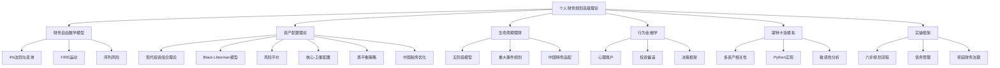
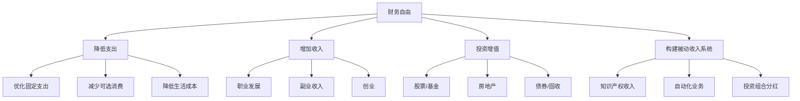
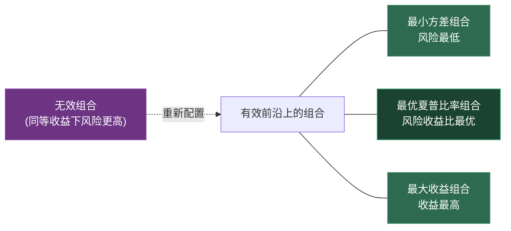
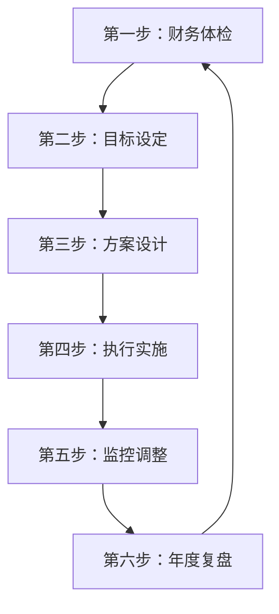

个人财务规划不是"存钱+买理财"的简单组合，而是一套基于经济学、心理学和数学的系统工程。本章从财务自由的数学本质出发，依次讲解资产配置的量化理论、生命周期理财的阶段策略、行为金融学对决策偏差的修正，最后落到可执行的规划框架。每一节都包含理论原理、数学模型和实操工具，确保读者既能理解"为什么"，也能知道"怎么做"。

**本章知识地图**：



---

### 8.1 财务自由的数学模型

#### 8.1.1 财务自由的本质定义

财务自由的核心公式：

$$被动收入 \ge 生活支出$$

这个公式看起来简单，但展开后涉及三个关键变量：**时间**、**收益率**和**通胀**。忽略任何一个变量的规划都是不完整的。

**更精确的财务自由定义**：当你的投资组合在不消耗本金的情况下，能够持续产生足以覆盖目标生活支出的现金流，且该现金流的购买力能够抵御通胀侵蚀，即达到财务自由。

**财务自由的三个层次**：

| 层次 | 定义 | 被动收入/支出比 | 典型场景 |
|------|------|-----------------|----------|
| **基础财务自由** | 被动收入覆盖基本生存支出（衣食住行） | 1.0-1.2x | 无需为基本生活担忧，但仍需控制开支 |
| **舒适财务自由** | 被动收入覆盖舒适生活支出（含旅游、教育、医疗） | 1.5-2.0x | 可以自由选择工作，不必为薪资妥协 |
| **完全财务自由** | 被动收入远超生活支出，可以随意消费 | 3.0x以上 | 完全不受金钱约束，专注于兴趣和使命 |

**为什么财务自由需要数学精确性？**

很多人对财务自由的理解停留在"有很多钱"的模糊概念上。但"很多"是相对的——月支出5000元的人和月支出5万元的人，所需资产相差10倍。更关键的是，如果忽略通胀，今天的"足够"可能在10年后变成"不够"。以3%通胀率计算，100万元的购买力在20年后缩水到55万元。因此，财务自由必须用数学模型来精确定义和量化。

#### 8.1.2 财务自由的4%法则

4%法则（Trinity Study）是美国Trinity大学三位教授在1998年提出的退休提取率研究。其核心结论是：**如果退休时投资组合的提取率为4%，且后续每年根据通胀调整提取金额，那么在30年内几乎不会耗尽本金**。

**数学推导**：

假设：
- 初始投资组合价值：P₀
- 年提取率：w = 4%
- 年投资回报率：r
- 年通胀率：g
- 提取年限：n

第t年的提取金额：$W_t = W_0 \times (1+g)^t$

第t年末的组合价值：$P_t = P_{t-1} \times (1+r) - W_t$

当 $P_t > 0$ 对所有 $t \in [1, n]$ 成立时，规划成功。

**历史回测数据**（1926-2023年美国市场）：

| 提取率 | 30年成功率 | 中位最终余额（初始值的倍数） |
|--------|-----------|---------------------------|
| 3% | 100% | 6.2x |
| 4% | 98% | 3.1x |
| 5% | 82% | 1.4x |
| 6% | 56% | 0.5x |

**4%法则的五大局限性**：

| 局限性 | 具体说明 | 应对策略 |
|--------|----------|----------|
| **美国市场特异性** | 基于美股历史数据，其他国家股市回报差异巨大（如日本1990年后长期低迷） | 使用本国市场数据进行回测，或采用全球分散投资降低单一市场风险 |
| **固定提取假设** | 假设每年按通胀调整提取，未考虑实际支出波动（如大病、旅游年份支出差异大） | 采用动态提取策略（见8.1.4节） |
| **忽略税收摩擦** | 投资收益需要缴税，实际可用金额低于名义收益 | 将税后收益纳入计算，利用税收优惠账户 |
| **30年期限限制** | 原始研究覆盖30年，提前退休者（如40岁退休）需要50-60年的规划 | 提前退休者应使用3%-3.5%的更低提取率 |
| **序列风险未考虑** | 退休初期遭遇熊市对组合寿命的打击远大于后期（见8.1.5节） | 采用水桶策略或动态提取缓冲序列风险 |

#### 8.1.3 FIRE运动：财务自由的四种路径

FIRE（Financial Independence, Retire Early）运动兴起于2010年代的美国，核心理念是通过极端储蓄率和投资实现提前退休。FIRE不是一种统一的方法论，而是包含四种截然不同的变体：

**四种FIRE变体对比**：

| FIRE类型 | 年支出目标 | 所需资产（25倍年支出） | 储蓄率要求 | 退休后生活 |
|----------|-----------|----------------------|-----------|-----------|
| **Lean FIRE** | <10万元/年 | <250万元 | 60%-80% | 极简生活，严格控制支出 |
| **Fat FIRE** | >30万元/年 | >750万元 | 50%-70% | 舒适生活，不牺牲品质 |
| **Barista FIRE** | 15-25万元/年 | 375-625万元（部分覆盖） | 40%-60% | 半退休，兼职覆盖部分支出和社保 |
| **Coast FIRE** | 视年龄而定 | 已有资产"自动增长"到退休目标 | 早期高，后期低 | 不再主动储蓄，只需覆盖当前生活 |

**FIRE的数学本质**：

FIRE的核心公式与4%法则相同，但强调了储蓄率的杠杆效应。储蓄率s与财务自由所需年限n的关系：

$$n = \frac{\ln\left(\frac{1}{1-s} \times \frac{r}{1+r}\right)}{\ln(1+r)}$$

其中r为投资回报率。这个公式揭示了一个反直觉的结论：

| 储蓄率 | 假设8%回报，达到财务自由所需年数 |
|--------|-------------------------------|
| 10% | 51.4年 |
| 20% | 36.7年 |
| 30% | 28.0年 |
| 50% | 16.6年 |
| 70% | 8.8年 |
| 80% | 5.6年 |

**关键洞察**：储蓄率从10%提升到30%（增加20个百分点），自由年限缩短23年；但从50%提升到70%（同样增加20个百分点），自由年限只缩短8年。边际效用递减。因此，对于大多数人来说，将储蓄率从10%-20%提升到30%-50%是最高效的阶段。

**FIRE在中国的可行性分析**：

| 维度 | 美国FIRE | 中国适配 | 挑战与对策 |
|------|----------|----------|-----------|
| **投资渠道** | 指数基金为主，401(k)/IRA税收优惠 | 沪深300指数基金、个人养老金账户（年缴12000元） | A股波动率高于美股，需更保守的提取率（3%-3.5%） |
| **医疗保障** | ACA医保市场，费用较高但可预期 | 城镇职工医保+商业保险 | 大病风险是中国FIRE的最大变量，需专项医疗基金 |
| **住房成本** | 差异大，可选择低成本地区 | 一二线城市住房成本极高 | 考虑"地理套利"——在低成本城市实现FIRE |
| **社保体系** | 社保替代率低（约40%），个人储蓄为主 | 社保替代率约45%，但个人养老金账户刚起步 | FIRE后社保断缴影响退休金，需自行缴纳或购买商业养老保险 |
| **通胀环境** | 长期通胀约2%-3% | 近年通胀约2%-3%，但教育/医疗涨幅更高 | 规划时使用4%-5%的综合通胀率更安全 |

#### 8.1.4 财务自由的量化计算

**所需资产总额的计算**：

```text
所需资产 = 年生活支出 ÷ 安全提取率
```

示例：
- 年生活支出：24万元（月均2万元）
- 安全提取率：3.5%（提前退休适用）
- 所需资产：24万 ÷ 3.5% ≈ 686万元

**达到财务自由所需时间的计算**：

假设：
- 当前年收入：I
- 储蓄率：s（储蓄/收入）
- 投资年化回报率：r
- 目标资产：T

每年储蓄额：$S = I \times s$

达到目标所需年数n满足：

$$\sum_{t=1}^{n} S \times (1+r)^{n-t} \ge T$$

简化公式（假设每年储蓄相同）：

$$n = \frac{\ln\left(\frac{T \times r}{S} + 1\right)}{\ln(1+r)}$$

**示例计算**：

| 年收入 | 储蓄率 | 年储蓄 | 投资回报率 | 目标资产 | 所需年数 |
|--------|--------|--------|-----------|----------|----------|
| 30万 | 30% | 9万 | 8% | 686万 | 24.3年 |
| 30万 | 50% | 15万 | 8% | 686万 | 18.7年 |
| 50万 | 40% | 20万 | 8% | 686万 | 16.2年 |
| 50万 | 60% | 30万 | 8% | 686万 | 13.1年 |

**关键洞察**：储蓄率对财务自由时间的影响远大于收入。收入翻倍（30万→50万）如果储蓄率不变，只减少6年；而储蓄率从30%提升到50%，同样收入下减少5.6年。

#### 8.1.5 序列风险：被忽视的退休杀手

**什么是序列风险（Sequence of Returns Risk）？**

序列风险是指投资回报的**顺序**对财务结果的影响，即使平均回报相同。这个风险在**提取阶段**（退休后）最为致命。

**直观解释**：

假设有两位投资者，初始资产都是100万元，每年提取5万元，投资10年。两人的年回报率完全相同（只是顺序不同）：

| 年份 | 投资者A的回报 | 投资者B的回报 |
|------|-------------|-------------|
| 第1年 | +25% | -25% |
| 第2年 | +20% | -10% |
| 第3年 | -15% | +5% |
| 第4年 | -10% | +20% |
| 第5年 | +5% | +25% |
| 第6-10年 | +10%/年 | +10%/年 |
| **平均回报** | **约7%** | **约7%** |

但10年后，投资者A可能还有120万元，投资者B可能只剩80万元——差距40万元，仅仅因为回报的顺序不同。

**为什么早期亏损杀伤力最大？**

退休初期，组合规模最大，此时的亏损金额绝对值最大。同时，提取行为在亏损期间进一步缩小了组合基数，导致后续即使市场恢复，组合也难以回到原来的规模。这被称为"负复利螺旋"。

**序列风险的数学建模**：

$$P_T = P_0 \times \prod_{t=1}^{T}(1+r_t) - \sum_{t=1}^{T} W_t \times \prod_{k=t}^{T}(1+r_k)$$

其中$r_t$为第t年的实际收益率，$W_t$为第t年的提取金额。当早期$r_t$为大负数时，第一项大幅缩水，而第二项（提取的复利累积）反而因为早期提取后仍经历了后续正收益而相对增大。

**应对序列风险的三大策略**：

**策略一：水桶策略（Bucket Strategy）**

将资产分为三个"水桶"，对应不同时间维度：

| 水桶 | 时间范围 | 资产配置 | 资金占比 | 功能 |
|------|---------|----------|---------|------|
| **水桶1：现金** | 1-3年 | 货币基金、短期存款 | 10%-15% | 覆盖近期生活支出，不受市场波动影响 |
| **水桶2：债券** | 3-10年 | 中期债券、债券基金 | 25%-35% | 提供稳定收益，补充水桶1 |
| **水桶3：股票** | 10年以上 | 股票、股票基金 | 50%-65% | 长期增值，对抗通胀 |

**运作机制**：退休后从水桶1提取生活费。当股市上涨时，从水桶3调拨资金补充水桶1和水桶2；当股市下跌时，只从水桶1提取，等待市场恢复。这样就避免了在低点被迫卖出股票。

**策略二：动态提取策略**

不再使用固定提取率，而是根据市场表现动态调整：

**Guyton-Klinger护栏策略**：

```text
初始提取率：4%
提取金额上限：初始提取额 × (1 + 通胀率) × 1.20
提取金额下限：初始提取额 × (1 + 通胀率) × 0.80

规则：
- 当年投资回报 > 0：提取额 = 上年提取额 × (1 + 通胀率)
- 当年投资回报 < 0 且提取率 > 5%：提取额冻结（不随通胀增长）
- 当年投资回报 < 0 且提取率 < 3.5%：提取额恢复正常增长
```

**变动百分比提取法（VPW）**：

每年提取率 = 1 / 剩余预期寿命。例如65岁时剩余预期寿命20年，提取率5%；75岁时剩余12年，提取率8.3%。这种方法确保资金在寿命结束前不会耗尽，但提取金额会波动。

**策略三：现金储备缓冲**

在退休初期（前5年）保持额外的现金储备（1-2年支出），用于在熊市期间避免卖出股票。当市场恢复正常后，再从投资收益中补充现金储备。

#### 8.1.6 财务自由的路径选择



**四条路径的对比**：

| 路径 | 难度 | 见效速度 | 可持续性 | 适合人群 |
|------|------|----------|----------|----------|
| 降低支出 | ★★☆ | 快（立即） | 中（有下限） | 所有人 |
| 增加收入 | ★★★ | 中（1-3年） | 高 | 有职业发展空间者 |
| 投资增值 | ★★★★ | 慢（5-10年） | 高 | 有投资知识和本金者 |
| 被动收入系统 | ★★★★★ | 慢（3-5年） | 极高 | 有专业技能或资源者 |

**路径组合策略**：最优解不是选一条路径，而是四条并行。短期靠降低支出建立储蓄基础，中期靠增加收入加速积累，长期靠投资增值实现复利，同时逐步构建被动收入系统作为最终保障。

---

### 8.2 资产配置理论

#### 8.2.1 现代投资组合理论（MPT）

现代投资组合理论由哈里·马科维茨（Harry Markowitz）在1952年提出，因此获得1990年诺贝尔经济学奖。其核心思想是：**通过资产之间的相关性构建投资组合，可以在给定风险水平下最大化收益，或在给定收益水平下最小化风险**。

**数学基础**：

投资组合的期望收益：

$$E(R_p) = \sum_{i=1}^{n} w_i \times E(R_i)$$

投资组合的方差（风险）：

$$\sigma_p^2 = \sum_{i=1}^{n} \sum_{j=1}^{n} w_i w_j \sigma_i \sigma_j \rho_{ij}$$

其中：
- $w_i$：资产i的权重
- $E(R_i)$：资产i的期望收益
- $\sigma_i$：资产i的标准差
- $\rho_{ij}$：资产i和j的相关系数

**有效前沿**：

在风险-收益坐标系中，所有可能的投资组合构成一个区域。该区域的左上边界称为"有效前沿"——在这条线上，每一单位风险都获得了最大收益。



**核心原则**：
- **分散化降低风险**：只要资产不完全正相关（ρ < 1），组合风险就低于加权平均风险
- **相关性是关键**：负相关资产（如股票和债券）的组合效果最好
- **风险-收益权衡**：不存在"高收益零风险"的资产，但存在"同等收益更低风险"的组合

**MPT的实际应用示例**：

假设只有两种资产——股票（预期收益10%，波动率20%）和债券（预期收益4%，波动率5%），相关系数为0.2：

| 股票比例 | 债券比例 | 组合预期收益 | 组合波动率 | 夏普比率 |
|---------|---------|------------|-----------|---------|
| 0% | 100% | 4.0% | 5.0% | 0.40 |
| 30% | 70% | 5.8% | 7.4% | 0.51 |
| 50% | 50% | 7.0% | 10.7% | 0.47 |
| 70% | 30% | 8.2% | 14.5% | 0.43 |
| 100% | 0% | 10.0% | 20.0% | 0.40 |

在这个例子中，30/70的股债组合夏普比率最高（0.51），即每单位风险获得的超额收益最大。这解释了为什么"全股票"不一定是最优选择。

#### 8.2.2 超越MPT：Black-Litterman模型与风险平价

**MPT的实操困境**：

虽然MPT在理论上优雅，但在实际应用中面临三个严重问题：

| 问题 | 具体表现 | 后果 |
|------|----------|------|
| **输入敏感性** | 最优配置对预期收益的微小变化极其敏感 | 收益估计偏差1%可能导致配置比例变化20%以上 |
| **极端配置** | 优化结果常出现极端比例（如99%配某类资产） | 不具备实际可操作性 |
| **估计误差** | 用历史数据估计未来收益，误差大 | 垃圾进、垃圾出（Garbage In, Garbage Out） |

**Black-Litterman模型**（1992年）：

Black-Litterman模型解决了MPT的输入敏感性问题。其核心思想是：**从市场均衡出发（先验），用投资者的主观观点进行微调（后验），而非直接估计预期收益**。

```text
Black-Litterman的数学框架：

1. 市场均衡收益（先验）：
   π = δ × Σ × w_mkt
   其中：δ=风险厌恶系数，Σ=协方差矩阵，w_mkt=市场权重

2. 投资者观点矩阵：
   P × π + ε = Q
   其中：P=观点矩阵，Q=观点收益，ε=观点不确定性

3. 后验预期收益：
   E(R) = [(τΣ)⁻¹ + P'Ω⁻¹P]⁻¹ × [(τΣ)⁻¹π + P'Ω⁻¹Q]
   其中：τ=标量不确定性，Ω=观点不确定性矩阵
```

**为什么Black-Litterman更实用？**

- 没有观点时，输出就是市场组合（如全球市值加权指数）——这本身就是合理的默认配置
- 有观点时（如"我认为A股会跑赢美股5%"），模型只做最小偏移
- 不会出现极端配置结果
- 观点可以是模糊的（"略看好"），不需要精确到小数点

**风险平价模型（Risk Parity）**：

传统的60/40股债组合看似分散，但实际上90%以上的风险来自股票（因为股票波动率远高于债券）。风险平价的核心理念是：**让每个资产类别贡献相等的风险，而非相等的金额**。

```text
风险平价 vs 传统配置：

传统60/40配置：
  股票60% × 波动率20% = 风险贡献约90%
  债券40% × 波动率5%  = 风险贡献约10%
  → 风险高度集中在股票

风险平价配置：
  股票25% × 波动率20% = 风险贡献约50%
  债券75% × 波动率5%  = 风险贡献约50%
  → 风险均匀分布

风险贡献 = (资产权重 × 资产波动率) / 组合总波动率
```

**风险平价的实操方法**：

$$w_i = \frac{1/\sigma_i}{\sum_{j=1}^{n} 1/\sigma_j}$$

其中$w_i$为资产i的权重，$\sigma_i$为资产i的波动率。这就是"反波动率加权"——波动率越低的资产获得越高的权重。

| 资产 | 波动率 | 1/波动率 | 风险平价权重 |
|------|--------|----------|------------|
| 股票 | 20% | 5.0 | 23% |
| 债券 | 5% | 20.0 | 57% |
| 黄金 | 15% | 6.7 | 20% |
| **合计** | - | **31.7** | **100%** |

**三种模型的适用场景**：

| 模型 | 优点 | 缺点 | 适合人群 |
|------|------|------|----------|
| **MPT** | 理论基础扎实，广泛研究 | 输入敏感，极端配置 | 学术理解，基础框架 |
| **Black-Litterman** | 从均衡出发，融入观点 | 数学复杂，需要量化工具 | 有量化背景的投资者 |
| **风险平价** | 简单直观，风险均匀 | 可能低配股票，杠杆需求 | 稳健型投资者，机构配置 |

**对个人投资者的建议**：理解MPT的原理，用风险平价的直觉做初始配置（确保风险分散），然后根据自己的判断做适度调整（类似Black-Litterman的思路）。不必严格计算——把握"风险分散"的核心原则比精确计算更重要。

#### 8.2.3 资产配置的实践框架

**资产类别分类**：

| 资产类别 | 预期年化收益 | 波动率 | 与股市相关性 | 流动性 | 适合配置比例 |
|----------|-------------|--------|-------------|--------|-------------|
| 现金及货币基金 | 2%-3% | 极低（<1%） | 0.05 | 极高 | 5%-15% |
| 国债及债券基金 | 3%-5% | 低（3%-6%） | -0.2~0.1 | 高 | 20%-40% |
| 股票及股票基金 | 8%-12% | 中高（15%-25%） | 1.0 | 高 | 30%-50% |
| 房地产/REITs | 5%-8% | 中（10%-15%） | 0.5-0.7 | 中 | 10%-20% |
| 黄金 | 3%-6% | 中（12%-18%） | 0.0-0.2 | 高 | 5%-10% |
| 另类投资 | 10%-20% | 高（20%-40%） | 0.3-0.6 | 低 | 0%-10% |

**核心-卫星配置法**：

```text
总配置 = 核心资产（70%-80%） + 卫星资产（20%-30%）

核心资产：低成本宽基指数基金，长期持有
  - A股：沪深300、中证500
  - 美股：标普500、全美市场
  - 债券：国债、高等级信用债

卫星资产：主动管理或主题投资，灵活调整
  - 行业ETF（科技、医疗、消费）
  - 海外市场（新兴市场、欧洲）
  - 另类资产（REITs、黄金、大宗商品）
```

**为什么核心-卫星配置有效？**

核心资产提供市场平均回报（β收益），成本低、分散化好、长期可靠。卫星资产提供超额回报的可能（α收益），但成本高、风险大。70/30的比例既保证了整体组合的稳定性，又保留了获取超额收益的机会。

#### 8.2.4 生命周期资产配置模型

资产配置应随年龄变化。经典的"100-年龄"法则建议用100减去年龄作为股票配置比例，但这个法则过于简化。更精确的模型需要考虑：

**关键因素**：
- **人力资本**：年轻时人力资本（未来收入的现值）大，可以承受更多金融风险
- **风险承受能力**：包括心理承受能力和财务承受能力
- **投资期限**：距退休时间越长，可以承受越高波动
- **收入稳定性**：稳定收入（如公务员）可以承担更高投资风险

**改进的资产配置模型**：

```text
股票比例 = 基础比例 × 人力资本系数 × 风险承受系数

基础比例 = 110 - 年龄（比传统法则更积极）

人力资本系数：
  - 稳定收入（公务员/大企业）：1.1-1.2
  - 一般收入（普通企业）：1.0
  - 不稳定收入（自由职业/创业）：0.8-0.9

风险承受系数：
  - 高（有充足应急金+无负债）：1.1-1.2
  - 中（有基本应急金）：1.0
  - 低（无应急金或有高息负债）：0.7-0.8
```

**示例**：30岁，普通企业员工，有基本应急金

股票比例 = (110-30) × 1.0 × 1.0 = 80%

**不同情境下的配置调整**：

| 情境 | 年龄 | 人力资本系数 | 风险承受系数 | 股票比例 | 说明 |
|------|------|------------|------------|---------|------|
| 公务员，有充足储蓄 | 35 | 1.15 | 1.15 | 75% | 收入稳定+财务安全垫厚 |
| 自由职业者，无应急金 | 35 | 0.85 | 0.75 | 48% | 收入不稳定+财务缓冲薄 |
| 大厂程序员，有房贷 | 40 | 1.1 | 0.85 | 57% | 收入高但负债压力大 |
| 退休人员 | 65 | - | - | 20%-30% | 保本为主，适度增值 |

#### 8.2.5 再平衡策略

投资组合会因各资产涨跌不同而偏离目标配置。再平衡是将组合恢复到目标比例的过程。

**再平衡的两种触发方式**：

| 方式 | 优点 | 缺点 | 适合场景 |
|------|------|------|----------|
| **定期再平衡** | 简单易执行，避免频繁交易 | 可能错过最佳时机 | 大多数投资者 |
| **阈值再平衡** | 只在偏离足够大时操作，效率高 | 需要持续监控 | 有经验的投资者 |

**推荐策略**：定期检查（每季度或每半年），当任一资产类别偏离目标超过5个百分点时执行再平衡。

**再平衡的实操步骤**：
1. 记录目标配置比例
2. 计算当前各资产的实际比例
3. 偏离超过阈值的资产需要调整
4. 优先通过新增资金调整（避免卖出产生的税费）
5. 必须卖出时，优先卖出超额资产

**再平衡的数学论证**：

为什么再平衡能提升收益？核心原因是"买低卖高"的纪律化执行。当股票上涨导致比例超标时，再平衡自动卖出股票（锁定利润）买入债券；当股票下跌时，自动卖出债券买入股票（抄底）。

历史回测显示（1970-2020年，60/40股债组合）：
- 不再平衡：年化8.2%，最大回撤-32%
- 年度再平衡：年化8.5%，最大回撤-28%
- 季度+5%阈值再平衡：年化8.7%，最大回撤-26%

再平衡不仅提升了收益，还降低了风险——这正是MPT理论的实践验证。

#### 8.2.6 中国特色的资产配置考量

**中国投资者面临的独特环境**：

| 维度 | 特点 | 对配置的影响 |
|------|------|------------|
| **房产占比过高** | 中国家庭约70%资产在房产上 | 金融资产配置应更偏股，以平衡整体组合 |
| **A股波动率高** | 沪深300年化波动率约25%，高于标普500的15% | 需要更高债券比例缓冲，或通过QDII配置海外 |
| **债券市场发展** | 国债收益率较低，信用债风险事件频发 | 以国债和高等级信用债为主，避免低等级信用债 |
| **个人养老金账户** | 2022年启动，年缴上限12000元，税收递延 | 优先用满额度，享受税收优惠 |
| **QDII额度限制** | 海外投资有额度限制，部分基金暂停申购 | 提前布局，不要等到需要时才申请 |

**推荐的中国投资者配置框架**：

```text
总金融资产配置（假设房产占比已知）：

国内股票（30%-40%）：
  - 沪深300指数基金：15%
  - 中证500指数基金：10%
  - 行业/主题ETF：5%-15%

国内债券（25%-35%）：
  - 国债/政金债：15%-20%
  - 高等级信用债基金：10%-15%

海外资产（15%-25%）：
  - 标普500 QDII：10%
  - 全球债券QDII：5%
  - 新兴市场QDII：0%-10%

另类资产（5%-15%）：
  - 黄金ETF：5%-10%
  - REITs：0%-5%
```

#### 8.2.7 中国投资者的税务优化策略

投资收益的税后回报才是真实回报。中国现行税制下，不同投资工具的税负差异巨大，合理利用税收规则可以显著提升长期收益。

**中国投资相关税种概览**：

| 税种 | 适用场景 | 税率 | 优惠政策 |
|------|----------|------|----------|
| **个人所得税** | 工资、劳务、稿酬等 | 3%-45%累进 | 专项附加扣除、个人养老金递延 |
| **股息红利税** | 持有上市公司股票分红 | 0%/10%/20% | 持有>1年免税，1个月-1年10%，<1个月20% |
| **资本利得税** | 买卖股票/基金差价 | **暂免征收** | A股个人投资者暂免，这是重大利好 |
| **利息税** | 银行存款利息 | **暂免征收** | 2008年起暂免 |
| **房产税** | 出租房产收入 | 4%-12% | 个人出租住房优惠税率4% |
| **增值税** | 金融商品转让 | **免征** | 个人买卖股票/基金免征 |

**关键发现**：A股个人投资者的资本利得（买卖差价）暂免征收，这意味着**指数基金定投**在税收上具有极大优势——长期持有不仅享受复利，还享受零资本利得税。

**五大税务优化策略**：

**策略一：充分利用个人养老金账户**

```text
个人养老金账户（2022年启动）：
  - 年缴上限：12,000元
  - 税收优惠：缴费阶段税前扣除，投资阶段收益暂不征税
    领取阶段按3%单独计税
  - 适用人群：年收入超过6万元的纳税人（边际税率≥3%）

  税收节省计算（假设边际税率20%）：
  年缴费：12,000元
  税收节省：12,000 × (20% - 3%) = 2,040元/年
  30年累计节省：约61,200元（不含投资收益的税收递延）
```

**不同收入水平的税收节省**：

| 年应纳税所得额 | 边际税率 | 年缴费节省 | 30年累计节省 |
|---------------|----------|-----------|-------------|
| 3.6万-14.4万 | 10% | 840元 | 25,200元 |
| 14.4万-30万 | 20% | 2,040元 | 61,200元 |
| 30万-42万 | 25% | 2,640元 | 79,200元 |
| 42万-66万 | 30% | 3,240元 | 97,200元 |
| 66万-96万 | 35% | 3,840元 | 115,200元 |

**策略二：股息红利的持有期管理**

```text
持有期决定红利税率：
  持有 > 1年：红利税 = 0%（免税）
  持有 1个月-1年：红利税 = 10%
  持有 < 1个月：红利税 = 20%

实操建议：
  - 高分红股票/基金至少持有1年以上
  - 高分红策略（如红利指数基金）的税收优势在长期持有下最大
  - 短线交易者应避免在除权日前后买卖高分红标的
```

**策略三：亏损收割（Tax-Loss Harvesting）**

虽然A股暂免资本利得税，但亏损收割在以下场景仍有价值：
- 如果未来恢复征收，历史亏损可以抵扣
- 养老金账户外的基金投资，部分涉及所得税场景
- 心理价值：将亏损转化为"已实现税收收益"的心理账户，减少处置效应

```text
亏损收割操作流程：
  1. 识别账面亏损超过阈值的持仓（如亏损>10%）
  2. 卖出亏损资产，实现亏损
  3. 买入相似但不完全相同的资产（避免踏空）
     例：卖出沪深300ETF → 买入中证A500ETF（风格相似但指数不同）
  4. 记录亏损，用于未来可能的税收抵扣
```

**策略四：资产的账户类型优化（Asset Location）**

将不同税收特征的资产放在最合适的账户类型中：

| 账户类型 | 税收特征 | 适合配置的资产 |
|----------|----------|--------------|
| **个人养老金账户** | 投资收益暂不征税，领取时3% | 高收益资产（股票基金），最大化税收递延 |
| **普通证券账户** | 资本利得免征，红利有税 | 资本利得型资产（成长股、低分红指数基金） |
| **银行存款/理财** | 利息免征 | 低收益、高流动性资产（应急金） |
| **企业年金** | 缴费免税，领取时3% | 如有，优先用满 |

**策略五：遗产与赠与的税务规划**

```text
中国现行规则（2025年）：
  - 遗产税：尚未开征（但未来可能出台）
  - 赠与税：尚未开征
  - 房产赠与：直系亲属免征增值税和个税，但需缴契税（3%）
  - 房产继承：免征增值税和个税，需缴契税（法定继承免征）

  实操建议：
  - 目前中国的遗产/赠与税负极低，是财富传承的窗口期
  - 关注遗产税立法动向，提前规划
  - 房产传承：继承 > 赠与 > 买卖（税负从低到高）
  - 金融资产传承：通过保险、信托架构可进一步优化
```

---

### 8.3 生命周期理财理论

#### 8.3.1 生命周期假说

生命周期假说（Life-Cycle Hypothesis）由佛朗哥·莫迪利亚尼（Franco Modigliani）提出，获得1985年诺贝尔经济学奖。其核心思想是：**人会在整个生命周期内平滑消费，年轻时储蓄为退休积累财富，退休后消耗储蓄**。

**消费-储蓄的生命周期曲线**：

```text
收入曲线：  低 → 高峰(45-55岁) → 下降(退休)
消费曲线：  相对平滑，略随收入增长
储蓄曲线：  负(学生) → 正(工作) → 负(退休)
```

**生命周期假说的实践意义**：

这个理论告诉我们，储蓄率不是越高越好——年轻时过度储蓄会压缩当期消费（降低生活质量），退休后过度消费会导致资金耗尽。最优策略是在整个生命周期内实现消费平滑。

但现实中，有两个因素使问题复杂化：
1. **流动性约束**：年轻人想借钱消费但借不到（银行不给没有收入的学生贷款）
2. **不确定性**：寿命、医疗支出、投资回报都是不确定的

因此，实际规划需要在理论最优和现实约束之间找到平衡。

#### 8.3.2 各阶段理财策略详解

**第一阶段：单身期（22-28岁）**

此阶段特征：收入较低但增长快，支出少，无家庭负担，时间是最大优势。

| 维度 | 具体策略 | 说明 |
|------|----------|------|
| **储蓄目标** | 储蓄率30%-50% | 利用低支出窗口期最大化储蓄 |
| **应急金** | 3个月支出 | 保持高流动性，货币基金即可 |
| **投资配置** | 股票80%/债券20% | 时间长可以承受高波动 |
| **保险** | 意外险+医疗险 | 保费低，保障高 |
| **重点投入** | 职业技能 | 此阶段投资自己回报率最高 |

**此阶段的关键决策**：
- 是否继续深造？硕士/博士的机会成本是2-3年的工资收入，但长期收入可能更高
- 租房vs买房？如果首付需要掏空家庭储蓄，租房+投资可能是更优选择
- 开始定投：即使每月只有500元，25年后（假设8%回报）可达47万元

**第二阶段：家庭形成期（28-35岁）**

此阶段特征：收入显著增长，但支出也大幅增加（结婚、买房、育儿），负债压力大。

| 维度 | 具体策略 | 说明 |
|------|----------|------|
| **储蓄目标** | 储蓄率20%-35% | 支出增加是正常的，不必过度焦虑 |
| **应急金** | 6个月支出 | 家庭责任增加，需要更多安全垫 |
| **投资配置** | 股票60%/债券30%/现金10% | 适度降低风险 |
| **保险** | 增加定期寿险 | 覆盖房贷和家庭责任 |
| **重点投入** | 房产决策 | 买房时机和贷款策略对财务影响巨大 |

**房贷策略深度分析**：

| 策略 | 适用场景 | 数学分析 |
|------|---------|---------|
| **等额本息** | 收入稳定，现金流可预期 | 月供固定，总利息较高，但前期压力小 |
| **等额本金** | 收入较高且预期增长 | 前期月供高，总利息低，适合收入递增者 |
| **提前还贷** | 贷款利率 > 投资预期收益 | 如果房贷利率4.5%，投资回报8%，不提前还更优 |
| **缩短年限** | 月供能力充足 | 比减少月供节省更多利息 |

**第三阶段：家庭成长期（35-50岁）**

此阶段特征：收入达到峰值，子女教育支出大，职业发展进入稳定期。

| 维度 | 具体策略 | 说明 |
|------|----------|------|
| **储蓄目标** | 储蓄率25%-40% | 收入峰值期应最大化储蓄 |
| **应急金** | 6-12个月支出 | 中年失业风险增加 |
| **投资配置** | 股票50%/债券35%/另类15% | 平衡增长和稳健 |
| **保险** | 增加重疾险 | 40岁后重疾风险显著上升 |
| **重点投入** | 子女教育金 | 教育金是刚性支出，需提前规划 |

**子女教育金规划**：

| 教育路径 | 年均费用（2025年价格） | K12+本科总费用 | 需要的月定投（8%回报） |
|---------|---------------------|--------------|---------------------|
| 公立学校+国内本科 | 3-5万 | 50-80万 | 1500-2400元/月 |
| 公立学校+留学本科 | 20-40万/年 | 120-200万 | 3600-6000元/月 |
| 国际学校+留学本科 | 30-50万/年 | 250-400万 | 7500-12000元/月 |

**第四阶段：退休准备期（50-60岁）**

此阶段特征：收入开始下降或保持高位，子女独立，需要为退休做最后冲刺。

| 维度 | 具体策略 | 说明 |
|------|----------|------|
| **储蓄目标** | 储蓄率30%-50% | 支出减少，收入尚存，最后冲刺期 |
| **投资配置** | 股票35%/债券45%/现金20% | 逐步降低风险 |
| **保险** | 审视现有保险，调整保额 | 减少不必要的保险支出 |
| **重点投入** | 退休规划 | 计算退休所需资金，补齐缺口 |
| **健康投资** | 健康管理 | 医疗支出是退休最大变量 |

**此阶段的关键任务**：
- 计算社保退休金预期金额，评估缺口
- 整理所有投资账户，建立统一视图
- 开始配置水桶策略的三个层次
- 考虑长期护理保险（65岁以上购买难度大增）

**第五阶段：退休期（60岁以上）**

此阶段特征：无工资收入，依赖投资收益和养老金，医疗支出增加。

| 维度 | 具体策略 | 说明 |
|------|----------|------|
| **提取策略** | 年提取率3%-4% | 避免过早耗尽本金 |
| **投资配置** | 股票20%/债券50%/现金30% | 保本为主，适度增值对抗通胀 |
| **医疗准备** | 专项医疗基金 | 预留大病医疗资金 |
| **重点投入** | 财富传承 | 遗嘱、信托、赠与等规划 |
| **生活规划** | 养老方式选择 | 居家养老、社区养老、机构养老 |

**退休支出的"微笑曲线"**：

研究显示，退休支出并非线性下降，而是呈"微笑"形状：
- **60-70岁**：支出较高（旅游、社交、爱好）
- **70-80岁**：支出下降（活动减少，消费欲望降低）
- **80岁以上**：支出回升（医疗、护理费用增加）

规划时应考虑这个非线性模式，避免按固定金额估算退休支出。

#### 8.3.3 人生重大财务事件规划

除常规阶段外，以下重大事件需要专项规划：

| 事件 | 影响 | 提前准备时间 | 资金需求估算 |
|------|------|-------------|-------------|
| 买房 | 大额负债+首付消耗 | 3-5年 | 首付30%-50%房价 |
| 结婚 | 一次性大额支出 | 1-2年 | 10-30万元（因地区差异大） |
| 生育 | 持续支出增加 | 1年 | 孕产+首年约5-10万元 |
| 子女教育 | 刚性长期支出 | 15-18年 | 国内K12约50-100万元 |
| 重大疾病 | 可能中断收入 | 随时准备 | 30-100万元 |
| 失业 | 收入中断 | 6个月应急金 | 3-12个月生活费 |
| 退休 | 永久收入中断 | 20-30年 | 年支出×25-33倍 |

---

### 8.4 财务心理账户理论

#### 8.4.1 理论基础

心理账户（Mental Accounting）由诺贝尔经济学奖得主理查德·塞勒（Richard Thaler）提出。其核心发现是：**人们对金钱的决策不是基于整体财富的理性计算，而是基于将金钱分配到不同"心理账户"中的非理性框架**。

**经典实验**：

塞勒设计了两个场景：

> 场景A：你花150元买了一张话剧票，到了剧场发现票丢了，你会再买一张吗？
> 
> 场景B：你打算到剧场买票，到了发现口袋里少了150元（但不确定怎么丢的），你还会买票吗？

大多数人对场景A说"不会"（觉得等于花了300元看话剧），对场景B说"会"（觉得只是少了150元现金）。

但从理性经济学角度看，两个场景完全等价——都是损失150元。差异在于人们将"话剧票"和"现金"放到了不同的心理账户中。

#### 8.4.2 常见心理账户及其影响

| 心理账户 | 典型行为 | 非理性表现 | 理性替代方案 |
|----------|----------|------------|-------------|
| **工资账户** | 日常开支，消费谨慎 | 对小钱过度计较，对大钱不敏感 | 建立统一预算，按比例分配 |
| **奖金账户** | 享乐消费，消费大方 | 把奖金当"意外之财"挥霍 | 奖金纳入统一收入，同样按比例储蓄 |
| **投资收益账户** | 风险投资，过度冒险 | "玩赚的钱"可以冒更大风险 | 投资收益是收入的一部分，统一管理 |
| **意外之财** | 奢侈消费，不珍惜 | 彩票中奖者破产率极高 | 任何收入都纳入统一财务系统 |
| **沉没成本** | 继续投入以"回本" | 亏损的股票不愿卖出 | 只看未来收益，不考虑已发生的成本 |

#### 8.4.3 消费决策中的心理陷阱

**锚定效应**：
商品原价1000元，打折后600元，人们觉得"省了400元"。但实际上，如果这件商品只值500元，你反而多花了100元。

**应对方法**：购买前问自己"如果没有折扣，我愿意付多少钱？"

**支付分离效应**：
把大额支出拆分成小单位会降低心理痛感。"每天只要一杯咖啡的钱"让订阅服务更容易被接受。

**应对方法**：计算年化总支出。每天15元的订阅 = 每年5475元。

**处置效应**：
投资者倾向于过早卖出盈利的资产（锁定利润），同时持有亏损的资产（不愿承认错误）。

**应对方法**：制定明确的卖出规则并严格执行，不受情绪影响。

**心理账户的正面运用**：

心理账户虽然常导致非理性，但可以被有意识地利用来改善财务管理：
- **专款专用账户**：为不同目标开设不同账户（应急金、旅行、教育），利用"分类管理"的心理倾向增强储蓄纪律
- **工资日自动分配**：发工资当天自动转入各账户，利用"看不见就不花"的心理
- **"零花钱"账户**：给自由消费设定上限，满足消费欲望的同时控制总额

#### 8.4.4 建立理性的财务决策框架

**第一步：统一收入管理**

将所有收入来源（工资、奖金、投资收益、兼职收入、意外之财）纳入统一的财务系统：

```text
总收入 → 统一账户 → 按比例分配
                       ├── 50% 必要支出
                       ├── 30% 储蓄投资
                       └── 20% 自由消费
```

**第二步：建立"时间账户"替代"心理账户"**

将资金按用途和时间维度分类，而非按来源分类：

| 时间维度 | 用途 | 资金存放 | 流动性要求 |
|----------|------|----------|-----------|
| 随时 | 应急金（3-6个月支出） | 货币基金 | 极高 |
| 1-3年 | 短期目标（旅行、家电） | 短债基金 | 高 |
| 3-10年 | 中期目标（买房、教育） | 股债混合 | 中 |
| 10年以上 | 长期目标（退休） | 股票为主 | 低 |

**第三步：设置决策检查清单**

每次重大财务决策前，完成以下检查：

```text
□ 这笔支出/投资是否符合我的整体财务计划？
□ 如果这笔钱是从其他"心理账户"来的，我的决策会不同吗？
□ 我是否被折扣、促销或情绪影响了判断？
□ 五年后的我会如何看待这个决定？
□ 如果我有10倍的钱，我还会做同样的决定吗？
```

---

### 8.5 行为金融学与投资决策偏差

#### 8.5.1 常见投资决策偏差

| 偏差类型 | 表现 | 后果 | 纠正方法 |
|----------|------|------|----------|
| **过度自信** | 高估自己的判断能力，频繁交易 | 交易成本侵蚀收益 | 记录交易决策和结果，定期复盘 |
| **羊群效应** | 跟风买入热门资产 | 买在高点，卖在低点 | 独立分析，逆向思考 |
| **确认偏差** | 只关注支持自己观点的信息 | 忽视风险信号 | 主动寻找反对意见 |
| **损失厌恶** | 亏损的痛苦是盈利快乐的2倍 | 过早止盈，不愿止损 | 制定规则并机械执行 |
| **近因偏差** | 过度重视最近的信息 | 追涨杀跌 | 拉长视角，看长期趋势 |
| **可得性偏差** | 容易想起的事件被认为更常见 | 高估小概率事件 | 用数据而非直觉判断 |
| **禀赋效应** | 高估自己已拥有的东西的价值 | 不愿卖出亏损资产 | 只看未来预期，不看成本价 |
| **后悔厌恶** | 害怕做出错误决定后后悔 | 过度保守，错过机会 | 接受"不完美决策"是常态 |

**损失厌恶的深层机制**：

卡尼曼和特沃斯基的前景理论发现，人们对损失的感受强度约为等额收益的2-2.5倍。这意味着：
- 赚100元的快乐 ≈ 亏40-50元的痛苦
- 投资者会为了避免确定的损失而承担更大的风险（如持有亏损股票等待"回本"）
- 这种不对称的心理反应是追涨杀跌、处置效应的根源

#### 8.5.2 系统化投资决策框架

为避免行为偏差影响投资决策，建立系统化的决策流程：

**投资决策检查清单**：

```text
1. 买入前检查：
   □ 我的买入理由是什么？（写下来）
   □ 我是否被市场情绪影响？
   □ 这个资产在我的整体配置中占什么位置？
   □ 我愿意持有这个资产多久？
   □ 什么情况下我会卖出？

2. 持有期间检查（每季度）：
   □ 买入理由是否仍然成立？
   □ 资产基本面是否发生变化？
   □ 我的配置是否偏离目标？

3. 卖出检查：
   □ 是否触发了预设的卖出条件？
   □ 我是因为恐惧/贪婪还是理性分析？
   □ 卖出后的资金去向是否明确？
```

**投资日志制度**：

记录每笔投资决策的以下信息，定期复盘：

| 字段 | 内容 | 复盘时检查 |
|------|------|-----------|
| 日期 | 买入/卖出日期 | - |
| 资产 | 具体标的 | - |
| 金额 | 投入金额 | - |
| 理由 | 为什么买/卖 | 理由是否成立？ |
| 情绪状态 | 当时的心理状态 | 是否被情绪影响？ |
| 预期 | 预期收益和持有期 | 实际结果如何？ |
| 实际结果 | 最终盈亏 | 从中能学到什么？ |

---

### 8.6 蒙特卡洛模拟在财务规划中的应用

#### 8.6.1 为什么需要蒙特卡洛模拟

传统的财务规划假设固定的收益率和通胀率，但现实中这些参数是随机波动的。蒙特卡洛模拟通过随机抽样数千次，给出财务目标实现的概率分布，比单一假设更可靠。

**蒙特卡洛模拟vs传统规划的对比**：

| 维度 | 传统规划 | 蒙特卡洛模拟 |
|------|---------|-------------|
| 假设 | 固定收益率和通胀率 | 随机抽样，考虑波动 |
| 输出 | 单一结果（如"20年后有500万"） | 概率分布（如"20年后有500万的概率为75%"） |
| 风险评估 | 无法量化极端情况 | 给出最差10%和最好10%的结果 |
| 决策支持 | "能"或"不能" | "有多大把握" |

#### 8.6.2 蒙特卡洛模拟的基本原理

1. 确定关键参数的概率分布（收益率、通胀率、支出增长率）
2. 随机抽样一次完整生命周期的参数序列
3. 计算该序列下的最终资产
4. 重复步骤2-3数千次（通常10000次）
5. 统计成功的概率和资产分布

#### 8.6.3 Python实现示例

```python
import numpy as np
import matplotlib.pyplot as plt
from dataclasses import dataclass
from typing import Optional

@dataclass
class AssetConfig:
    """资产配置参数"""
    name: str
    weight: float          # 配置权重
    return_mean: float     # 年化预期收益
    return_std: float      # 收益波动率
    dividend_yield: float  # 股息/利息率

def generate_correlated_returns(
    n_years: int,
    assets: list[AssetConfig],
    correlation_matrix: np.ndarray,
    mean_reversion: float = 0.0,
    seed: Optional[int] = None
) -> np.ndarray:
    """
    生成相关联的多资产收益率序列
    
    参数:
        n_years: 年数
        assets: 资产配置列表
        correlation_matrix: 资产间相关系数矩阵
        mean_reversion: 均值回归强度（0=无，0.3=中等）
        seed: 随机种子（可复现结果）
    """
    if seed is not None:
        np.random.seed(seed)
    
    n_assets = len(assets)
    means = np.array([a.return_mean for a in assets])
    stds = np.array([a.return_std for a in assets])
    
    # Cholesky分解生成相关随机数
    L = np.linalg.cholesky(correlation_matrix)
    
    returns = np.zeros((n_years, n_assets))
    current_returns = means.copy()  # 用于均值回归
    
    for t in range(n_years):
        # 生成独立标准正态随机数
        z = np.random.standard_normal(n_assets)
        # 通过Cholesky矩阵引入相关性
        correlated_z = L @ z
        
        # 均值回归：极端收益后倾向回归均值
        if mean_reversion > 0 and t > 0:
            deviation = current_returns - means
            current_returns = means + (1 - mean_reversion) * deviation
        
        # 计算当年收益
        returns[t] = current_returns + stds * correlated_z
        current_returns = returns[t]
    
    return returns

def monte_carlo_financial_plan(
    initial_assets: float,      # 初始资产
    annual_contribution: float, # 年储蓄
    annual_expense: float,      # 年支出
    years: int,                 # 规划年数
    num_simulations: int = 10000,  # 模拟次数
    # 多资产配置（默认：60%股票 + 30%债券 + 10%黄金）
    assets: Optional[list[AssetConfig]] = None,
    # 资产间相关系数矩阵
    correlation_matrix: Optional[np.ndarray] = None,
    # 均值回归强度
    mean_reversion: float = 0.15,
    # 通胀参数
    inflation_mean: float = 0.03,
    inflation_std: float = 0.02,
    # 提取策略
    withdrawal_strategy: str = 'fixed',  # 'fixed', 'dynamic', 'bucket'
    # 收入增长
    income_growth: float = 0.03,  # 年收入增长（储蓄随之增长）
) -> dict:
    """
    蒙特卡洛财务规划模拟（增强版）
    
    改进点：
    1. 多资产相关性：股票、债券、黄金的收益不是独立的
    2. 均值回归：极端收益后倾向回归均值（更符合现实）
    3. 动态提取策略：可选固定/动态/水桶策略
    4. 收入增长：储蓄额随收入增长
    """
    # 默认资产配置
    if assets is None:
        assets = [
            AssetConfig("股票", 0.60, 0.08, 0.20, 0.02),
            AssetConfig("债券", 0.30, 0.04, 0.05, 0.03),
            AssetConfig("黄金", 0.10, 0.05, 0.15, 0.00),
        ]
    
    # 默认相关系数矩阵（股票-债券弱负相关，股票-黄金弱正相关）
    if correlation_matrix is None:
        correlation_matrix = np.array([
            [1.00, -0.20, 0.10],   # 股票
            [-0.20, 1.00, 0.15],   # 债券
            [0.10, 0.15, 1.00],    # 黄金
        ])
    
    n_assets = len(assets)
    weights = np.array([a.weight for a in assets])
    dividend_yields = np.array([a.dividend_yield for a in assets])
    
    results = []
    all_paths = []
    max_drawdowns = []
    
    for sim in range(num_simulations):
        assets_value = initial_assets
        expense = annual_expense
        contribution = annual_contribution
        path = [assets_value]
        peak = assets_value
        max_dd = 0
        
        # 水桶策略状态
        bucket_cash = initial_assets * 0.12   # 12%现金桶（2年支出）
        bucket_bonds = initial_assets * 0.28  # 28%债券桶
        bucket_stocks = initial_assets * 0.60 # 60%股票桶
        
        # 生成相关收益序列
        asset_returns = generate_correlated_returns(
            years, assets, correlation_matrix, mean_reversion
        )
        
        for year in range(years):
            inflation = np.random.normal(inflation_mean, inflation_std)
            
            if withdrawal_strategy == 'bucket':
                # 水桶策略：从现金桶提取，定期补充
                # 各桶按各自资产收益增长
                stock_ret, bond_ret, _ = asset_returns[year]
                bucket_stocks *= (1 + stock_ret)
                bucket_bonds *= (1 + bond_ret)
                bucket_cash *= 1.02  # 现金桶按货币基金收益
                
                # 从现金桶提取生活费
                bucket_cash -= expense
                
                # 每3年从股票桶补充现金桶和债券桶
                if year > 0 and year % 3 == 0:
                    refill = min(bucket_stocks * 0.1, expense * 3 - bucket_cash)
                    if refill > 0:
                        bucket_cash += refill * 0.6
                        bucket_bonds += refill * 0.4
                        bucket_stocks -= refill
                
                assets_value = bucket_cash + bucket_bonds + bucket_stocks
                
            elif withdrawal_strategy == 'dynamic':
                # 动态提取：市场好时多提，市场差时少提
                portfolio_return = np.sum(weights * asset_returns[year])
                assets_value *= (1 + portfolio_return)
                
                # 动态调整提取额
                if portfolio_return > 0.05:
                    current_withdrawal = expense * 1.05  # 市场好，上浮5%
                elif portfolio_return < -0.10:
                    current_withdrawal = expense * 0.85  # 市场差，削减15%
                else:
                    current_withdrawal = expense
                
                assets_value -= current_withdrawal
                assets_value += contribution
                
            else:  # fixed
                # 固定提取（根据通胀调整）
                portfolio_return = np.sum(weights * asset_returns[year])
                dividend_income = assets_value * np.sum(weights * dividend_yields)
                assets_value = assets_value * (1 + portfolio_return) + contribution + dividend_income
                assets_value -= expense
            
            expense *= (1 + inflation)
            contribution *= (1 + income_growth)
            
            path.append(assets_value)
            
            # 跟踪最大回撤
            if assets_value > peak:
                peak = assets_value
            dd = (peak - assets_value) / peak if peak > 0 else 0
            if dd > max_dd:
                max_dd = dd
            
            if assets_value < 0:
                results.append({'final': 0, 'max_dd': max_dd, 'bankrupt_year': year + 1})
                break
        else:
            results.append({'final': assets_value, 'max_dd': max_dd, 'bankrupt_year': None})
            all_paths.append(path)
    
    finals = np.array([r['final'] for r in results])
    drawdowns = np.array([r['max_dd'] for r in results])
    bankrupt_years = [r['bankrupt_year'] for r in results if r['bankrupt_year'] is not None]
    
    return {
        'success_rate': np.sum(finals > 0) / num_simulations,
        'median_final_assets': np.median(finals[finals > 0]) if np.any(finals > 0) else 0,
        'percentile_10': np.percentile(finals, 10),
        'percentile_25': np.percentile(finals, 25),
        'percentile_75': np.percentile(finals, 75),
        'percentile_90': np.percentile(finals, 90),
        'mean_max_drawdown': np.mean(drawdowns),
        'worst_max_drawdown': np.max(drawdowns),
        'bankruptcy_rate': len(bankrupt_years) / num_simulations,
        'avg_bankrupt_year': np.mean(bankrupt_years) if bankrupt_years else None,
        'all_paths': all_paths,
    }

def visualize_simulation(result: dict, years: int):
    """
    可视化蒙特卡洛模拟结果
    """
    paths = np.array(result['all_paths'])
    
    plt.figure(figsize=(12, 6))
    
    # 绘制100条随机路径（半透明）
    indices = np.random.choice(len(paths), min(100, len(paths)), replace=False)
    for i in indices:
        plt.plot(range(years + 1), paths[i], alpha=0.05, color='blue')
    
    # 绘制百分位线
    percentiles = [10, 25, 50, 75, 90]
    colors = ['red', 'orange', 'green', 'orange', 'red']
    for p, c in zip(percentiles, colors):
        p_values = np.percentile(paths, p, axis=0)
        plt.plot(range(years + 1), p_values, color=c, linewidth=2, 
                 label=f'{p}%分位')
    
    plt.xlabel('年份')
    plt.ylabel('资产（元）')
    plt.title(f'蒙特卡洛模拟结果（成功率: {result["success_rate"]:.1%}）')
    plt.legend()
    plt.grid(True, alpha=0.3)
    plt.tight_layout()
    plt.savefig('monte_carlo_simulation.png', dpi=150)
    plt.show()

# 使用示例
result = monte_carlo_financial_plan(
    initial_assets=1000000,      # 100万初始资产
    annual_contribution=200000,  # 年储蓄20万
    annual_expense=240000,       # 年支出24万
    years=30,                    # 规划30年
    withdrawal_strategy='dynamic',  # 使用动态提取策略
)

print(f"成功率: {result['success_rate']:.1%}")
print(f"中位最终资产: {result['median_final_assets']:,.0f}元")
print(f"10%分位: {result['percentile_10']:,.0f}元")
print(f"90%分位: {result['percentile_90']:,.0f}元")
print(f"平均最大回撤: {result['mean_max_drawdown']:.1%}")
print(f"破产率: {result['bankruptcy_rate']:.1%}")

# 比较三种提取策略
for strategy in ['fixed', 'dynamic', 'bucket']:
    r = monte_carlo_financial_plan(
        initial_assets=1000000,
        annual_contribution=200000,
        annual_expense=240000,
        years=30,
        withdrawal_strategy=strategy,
    )
    print(f"\n{strategy}策略: 成功率={r['success_rate']:.1%}, "
          f"平均最大回撤={r['mean_max_drawdown']:.1%}")

# 可视化
visualize_simulation(result, 30)
```

#### 8.6.4 敏感性分析：哪些变量影响最大？

蒙特卡洛模拟的另一个价值是进行敏感性分析——改变单个参数，观察成功率的变化：

```python
def sensitivity_analysis(base_params: dict):
    """
    敏感性分析：测试各参数对成功率的影响
    """
    results = {}
    
    # 基准成功率
    base = monte_carlo_financial_plan(**base_params)['success_rate']
    results['基准'] = base
    
    # 测试储蓄率变化
    for delta in [-50000, 0, 50000]:
        params = base_params.copy()
        params['annual_contribution'] += delta
        rate = monte_carlo_financial_plan(**params)['success_rate']
        results[f'年储蓄{params["annual_contribution"]/10000:.0f}万'] = rate
    
    # 测试支出变化
    for delta in [-50000, 0, 50000]:
        params = base_params.copy()
        params['annual_expense'] += delta
        rate = monte_carlo_financial_plan(**params)['success_rate']
        results[f'年支出{params["annual_expense"]/10000:.0f}万'] = rate
    
    # 测试投资回报变化
    for delta in [-0.02, 0, 0.02]:
        params = base_params.copy()
        params['return_mean'] += delta
        rate = monte_carlo_financial_plan(**params)['success_rate']
        results[f'回报率{params["return_mean"]:.1%}'] = rate
    
    return results

# 运行敏感性分析
base_params = {
    'initial_assets': 1000000,
    'annual_contribution': 200000,
    'annual_expense': 240000,
    'years': 30,
}

sensitivity = sensitivity_analysis(base_params)
for key, value in sensitivity.items():
    print(f"{key}: {value:.1%}")
```

**敏感性分析的典型结论**：

| 参数变化 | 成功率变化 | 影响程度 |
|---------|-----------|---------|
| 年储蓄+5万 | +8%-12% | 高 |
| 年储蓄-5万 | -10%-15% | 高 |
| 年支出+5万 | -12%-18% | 极高 |
| 年支出-5万 | +10%-15% | 高 |
| 投资回报+2% | +5%-8% | 中 |
| 投资回报-2% | -6%-10% | 中 |

**关键洞察**：支出的敏感性高于储蓄和投资回报。这是因为支出同时影响资金的"消耗速度"和"目标金额"（提取率=支出/资产）。减少支出既降低了消耗，又降低了目标，产生双重杠杆效应。

#### 8.6.5 模拟结果的解读

蒙特卡洛模拟的核心价值不是给出一个确定的答案，而是给出**概率分布**：

- **成功率 > 90%**：规划非常稳健，可以适当提高生活品质或提前退休
- **成功率 70%-90%**：规划基本可行，建议保留一定安全边际
- **成功率 50%-70%**：规划存在风险，需要增加储蓄或降低支出
- **成功率 < 50%**：规划不可行，必须大幅调整

**如何使用模拟结果做决策**：

1. **不要追求100%成功率**：100%意味着过度保守，牺牲了当期生活质量
2. **80%是合理的底线**：意味着即使遇到不利情况，仍有4/5的概率成功
3. **关注最差10%的结果**：如果最差情况下资产为负，说明需要增加缓冲
4. **定期重新模拟**：每年用最新数据重新运行，调整规划

---

### 8.7 财务规划的实操框架

#### 8.7.1 个人财务规划的六步流程



**第一步：财务体检**

建立完整的资产负债表和现金流量表：

```text
资产负债表（某时点）：
资产：
  - 现金及等价物：____元
  - 投资资产：____元
  - 自用资产（房产/车）：____元
  - 其他资产：____元
  资产合计：____元

负债：
  - 房贷：____元
  - 车贷：____元
  - 信用卡：____元
  - 其他负债：____元
  负债合计：____元

净资产 = 资产合计 - 负债合计 = ____元

现金流量表（年度）：
收入：
  - 工资收入：____元
  - 投资收益：____元
  - 其他收入：____元
  收入合计：____元

支出：
  - 固定支出（房贷/房租/保险）：____元
  - 生活支出（食/衣/行/通讯）：____元
  - 可选支出（娱乐/旅游/学习）：____元
  支出合计：____元

年储蓄 = 收入合计 - 支出合计 = ____元
储蓄率 = 年储蓄 / 收入合计 = ____%
```

**关键健康指标**：

| 指标 | 健康范围 | 警戒线 | 说明 |
|------|---------|--------|------|
| 储蓄率 | 20%-50% | <10% | 储蓄率是财务健康的核心指标 |
| 负债收入比 | <40% | >50% | 月还款/月收入，超过50%风险极高 |
| 流动比率 | >3 | <1 | 流动资产/短期负债，低于1意味着可能无法偿还短期债务 |
| 应急金覆盖 | 3-6个月 | <1个月 | 流动资产/月支出 |
| 投资多元化 | 3+资产类别 | 单一资产 | 过度集中单一资产风险极高 |

**第二步：目标设定**

使用SMART原则设定财务目标：

| 目标类型 | 示例 | 金额 | 时间 | 优先级 |
|----------|------|------|------|--------|
| 短期（1年内） | 建立应急金 | 15万 | 12个月 | 最高 |
| 中期（1-5年） | 买车首付 | 10万 | 3年 | 高 |
| 长期（5年以上） | 退休储备 | 500万 | 25年 | 中 |
| 超长期 | 子女教育 | 100万 | 18年 | 中 |

**第三步：方案设计**

根据目标和当前财务状况，设计具体方案：

1. 优化支出结构（50/30/20法则或自定义比例）
2. 确定储蓄目标和投资策略
3. 选择具体的资产配置
4. 设计保险保障方案
5. 规划税务优化策略

**第四步：执行实施**

- 开设专用账户（应急金、投资、目标储蓄）
- 设置自动转账（工资日自动扣款）
- 建立投资定投计划
- 购买必要的保险产品

**自动化是执行的关键**：研究表明，将储蓄设为自动转账的人，储蓄率比手动转账的人高出30%-50%。原因是自动化消除了"意志力消耗"——你不需要每个月都做出"要不要储蓄"的决定。

**第五步：监控调整**

- 每月检查支出是否符合预算
- 每季度检查投资组合是否偏离目标
- 每半年评估是否需要调整方案

**第六步：年度复盘**

每年进行一次全面的财务复盘：
- 净资产变化
- 储蓄率是否达标
- 投资收益是否符合预期
- 目标完成进度
- 下一年的调整计划

#### 8.7.2 债务管理策略

债务是财务规划中不可忽视的环节。合理的债务可以加速财富积累（如低息房贷用于购房），但高息债务会严重侵蚀净资产。

**好债vs坏债**：

| 类型 | 特征 | 示例 | 策略 |
|------|------|------|------|
| **好债** | 利率低于投资回报率，用于购买增值资产 | 房贷（3%-5%）、教育贷款 | 按期还款，不提前偿还 |
| **中性债** | 利率接近投资回报率 | 车贷（4%-6%） | 按期还款，评估是否提前还 |
| **坏债** | 利率高于投资回报率，用于消费 | 信用卡分期（12%-18%）、消费贷 | 立即偿还，不惜动用投资资金 |

**两种还债策略对比**：

| 策略 | 方法 | 优点 | 缺点 | 适合人群 |
|------|------|------|------|----------|
| **雪崩法** | 优先偿还利率最高的债务 | 总利息支出最少 | 见效慢，容易放弃 | 理性、有纪律的人 |
| **雪球法** | 优先偿还余额最小的债务 | 快速获得成就感 | 总利息支出较多 | 需要心理激励的人 |

**雪崩法vs雪球法的数学对比**：

假设有三笔债务：
- 信用卡：余额2万，利率18%
- 消费贷：余额5万，利率12%
- 车贷：余额10万，利率6%

每月可支配还款金额：8000元（假设各债务最低还款共5000元，额外3000元用于加速还款）

| 策略 | 还款顺序 | 总利息支出 | 还清时间 |
|------|---------|-----------|---------|
| 雪崩法 | 信用卡→消费贷→车贷 | 约2.1万 | 约20个月 |
| 雪球法 | 信用卡→消费贷→车贷 | 约2.1万 | 约20个月 |

在这个例子中，两种方法结果相同，因为最小余额恰好是最高利率。但在其他情况下，雪崩法通常节省5%-15%的利息。

**建议**：如果你有足够的纪律性，使用雪崩法；如果你需要快速的成就感来保持动力，使用雪球法。最重要的是选择一个你能坚持执行的方法。

#### 8.7.3 常见误区与纠正

**认知层误区**：

| 误区 | 正确认知 | 纠正方法 |
|------|----------|----------|
| "等有钱了再理财" | 理财的核心是习惯，不是金额 | 从每月存100元开始，建立自动化储蓄 |
| "投资就是炒股" | 投资包括资产配置、风险管理、税务优化等系统工程 | 学习MPT理论，理解资产配置决定90%以上的收益差异 |
| "高收益高风险"是铁律 | 可以通过组合降低风险，实现同等收益更低风险 | 学习分散化原理，构建多资产组合 |
| "买房是最好的投资" | 房产有流动性差、集中度高、维护成本高的缺点 | 将房产纳入整体资产配置考量，金融资产配比不应被房产挤压 |

**行为层误区**：

| 误区 | 正确认知 | 纠正方法 |
|------|----------|----------|
| "分散投资就是买很多基金" | 分散是资产类别间的分散，不是基金数量的堆砌 | 10只A股基金不如1只A股+1只债券+1只黄金 |
| "记账太麻烦" | 记账是财务规划的基础，没有数据就没有优化 | 使用自动记账工具（支付宝/微信账单导出） |
| "追热点能赚钱" | 热点被发现时往往已是高点 | 建立定投纪律，不受市场情绪影响 |
| "亏损了要等回本" | 沉没成本不应影响未来决策 | 只看未来预期收益，不看买入成本 |

**规划层误区**：

| 误区 | 正确认知 | 纠正方法 |
|------|----------|----------|
| "我年轻不需要保险" | 年轻时买保险最便宜，且健康告知最容易通过 | 25岁前配置意外险+医疗险，30岁前加定期寿险 |
| "社保够了不用额外准备" | 社保替代率约45%，缺口需要自己补 | 计算社保退休金预期，用蒙特卡洛模拟评估缺口 |
| "应急金放在活期就行" | 活期利率跑不赢通胀，应急金也需要收益 | 货币基金或短债基金，兼顾流动性和收益 |
| "提前还房贷总是好的" | 如果房贷利率低于投资预期回报，提前还反而亏损 | 比较房贷利率与投资回报率，考虑税收和心理因素 |
| "退休规划是老年人的事" | 越早开始，复利效应越大，所需储蓄额越低 | 25岁开始每月定投500元，比35岁开始每月定投1500元效果更好 |

**误区背后的心理机制**：

大多数理财误区并非源于无知，而是源于**认知偏差**：

1. **现状偏差**：人们倾向于维持现状，即使改变明显更优。"等有钱了再理财"就是现状偏差的典型表现——维持当前的消费习惯比建立新习惯容易得多。

2. **双曲贴现**：人们对即时奖励的偏好远大于延迟奖励。今天花1000元的快乐，远大于30年后这1000元通过复利变成10000元的"抽象"收益。这就是为什么储蓄如此困难。

3. **可得性偏差**：媒体报道的"炒股暴富"故事比"稳健投资30年"更容易被记住，导致人们高估短线交易的成功率。

4. **确认偏差**：已经买了房的人只关注"房价又涨了"的新闻，忽视"房价下跌"或"流动性差"的信息。

**克服误区的系统方法**：

```text
1. 建立"决策日志"：记录每个重要财务决策的理由和预期
   → 3个月后复盘，用事实纠正偏差

2. 设置"冷静期"：超过月收入10%的消费决策，等待24小时
   → 减少冲动消费

3. 寻找"魔鬼代言人"：每次重大投资前，找一个持反对意见的人讨论
   → 对抗确认偏差

4. 自动化一切：储蓄、投资、保险扣款全部设为自动
   → 消除意志力消耗
```

#### 8.7.4 进阶：从个人规划到家庭财务治理

当个人财务规划扩展到家庭层面，复杂度呈指数级增长——不仅是两个人的资产相加，还涉及风险偏好差异、决策权分配、税务优化和代际传承。

**家庭财务会议制度**：

```text
家庭财务会议框架（每月一次，30-60分钟）：

会前准备：
  - 各自导出上月消费记录（支付宝/微信账单）
  - 更新家庭资产负债表
  - 准备需要讨论的议题

会议议程：
  1. 上月回顾（10分钟）
     - 总收入 vs 预算
     - 各类支出 vs 预算
     - 储蓄率是否达标

  2. 账户检查（5分钟）
     - 应急金是否充足
     - 投资组合是否偏离目标
     - 保险是否需要调整

  3. 下月计划（10分钟）
     - 重大支出计划（旅行、家电、教育）
     - 投资操作计划（定投、再平衡）
     - 收入预期变化

  4. 目标进度（5分钟）
     - 短期目标完成度
     - 长期目标是否需要调整

  5. 开放讨论（10分钟）
     - 财务焦虑或困惑
     - 新的理财想法
     - 决策需要对方支持的事项
```

**家庭资产配置的特殊考量**：

| 维度 | 个人规划 | 家庭规划 | 关键差异 |
|------|----------|----------|----------|
| **风险承受** | 看个人 | 看家庭整体 | 一方激进一方保守时，取加权平均 |
| **收入结构** | 单一 | 双收入或单收入 | 双收入家庭可承受更高投资风险 |
| **保险需求** | 个人保障 | 交叉保障 | 夫妻互保，确保一方出事另一方不受影响 |
| **税务优化** | 个人账户 | 多账户协同 | 分别开设个人养老金、企业年金，各自享受优惠 |
| **投资决策** | 独立决策 | 协商机制 | 建立"阈值规则"：超过X万的投资需双方同意 |

**家庭风险承受能力评估**：

```text
家庭风险承受能力 = 基础分 + 调整项

基础分（各5分，满分10）：
  收入稳定性：双方都有稳定工作=5，一方稳定=3，都不稳定=1
  应急金覆盖：6个月以上=5，3-6个月=3，不足3个月=1

调整项：
  +1 有房无贷
  +1 双收入且收入比<3:1
  +1 无子女或子女已独立
  -1 有房贷且月供>收入30%
  -1 有学龄前子女
  -1 有需要赡养的老人
  -2 一方收入不稳定

总分解读：
  8-12分：高风险承受，股票比例可达70%-80%
  5-7分：中等风险承受，股票比例50%-60%
  3-4分：低风险承受，股票比例30%-40%
  <3分：极低风险承受，以固收为主
```

**财富传承规划的四层架构**：

| 层次 | 工具 | 功能 | 适用场景 | 成本 |
|------|------|------|----------|------|
| **第一层：遗嘱** | 自书遗嘱/公证遗嘱 | 明确财产分配意愿 | 所有人 | 低（自书免费，公证约500元） |
| **第二层：保险** | 定期寿险/终身寿险 | 提供即时流动性，覆盖负债 | 有负债/有子女的家庭 | 中（年保费数千元） |
| **第三层：信托** | 家族信托/保险金信托 | 隔离风险，长期管理，按条件分配 | 高净值家庭（通常100万起） | 高（管理费0.5%-1%/年） |
| **第四层：赠与** | 生前赠与 | 利用免税额度提前转移 | 有明确传承意愿的家庭 | 低（直系亲属免个税） |

**遗嘱的关键要素**（中国法律框架）：

```text
有效遗嘱必须包含：
  1. 立遗嘱人身份信息
  2. 财产清单（房产、存款、投资、保险、知识产权等）
  3. 分配方案（谁得什么，比例多少）
  4. 执行人指定
  5. 立遗嘱日期和签名
  6. 见证人签名（代书遗嘱/录音遗嘱需要）

常见错误：
  × 只写了"财产归妻子"——没有具体清单，容易产生争议
  × 没有考虑债务——遗产先还债后分配
  × 没有定期更新——离婚、再婚、新增子女后遗嘱可能失效
  × 忽视保险受益人——保险金不进入遗产，需要单独指定
```

**家庭财务危机的预防机制**：

```text
风险预警指标（每月检查）：

红色警报（立即行动）：
  □ 应急金不足1个月支出
  □ 负债收入比超过60%
  □ 信用卡最低还款（利息陷阱）
  □ 借新债还旧债

黄色警告（本月内调整）：
  □ 应急金不足3个月支出
  □ 储蓄率连续3个月低于10%
  □ 投资组合偏离目标超过10%
  □ 保险保障缺口明显

应对方案：
  - 红色：立即召开家庭紧急会议，制定3个月止血计划
  - 黄色：下次家庭财务会议上讨论，制定调整方案
```

---

### 8.8 本章小结

个人财务规划的高级理论为实际操作提供了科学框架。核心要点：

1. **财务自由有数学公式**：不是模糊的"有钱"，而是被动收入≥生活支出的精确计算。4%法则提供基准参考，但中国投资者应使用更保守的3%-3.5%提取率。

2. **资产配置是投资收益的主要决定因素**：研究表明，90%以上的收益差异来自资产配置，而非选股或择时。超越MPT，了解Black-Litterman模型和风险平价，可以构建更稳健的组合。

3. **不同人生阶段需要不同策略**：年轻时可以激进，年老时需要稳健，但每个阶段都需要规划。生命周期假说告诉我们，最优策略是在整个生命周期内实现消费平滑。

4. **行为偏差是最大的敌人**：了解心理陷阱并建立系统化决策框架，比学习任何投资技巧都重要。损失厌恶、处置效应、锚定效应是三大最常见偏差。

5. **量化工具让规划更科学**：蒙特卡洛模拟等工具可以帮助评估规划的稳健性。使用多资产相关性模型比单资产模型更接近现实。

6. **序列风险是退休规划的隐形杀手**：水桶策略和动态提取可以有效缓冲退休初期的市场冲击。

7. **储蓄率比收入更重要**：提高储蓄率对财务自由时间的影响远大于提高收入。储蓄率从10%提升到30%，自由年限缩短23年。

8. **税务优化是被忽视的收益来源**：个人养老金账户、股息红利持有期管理、资产账户类型优化，每一项都能带来显著的长期收益提升。

9. **家庭财务治理比个人规划复杂得多**：需要建立会议制度、风险评估框架、危机预警机制和财富传承规划。

**下一步行动建议**：
- 完成个人财务体检（资产负债表+现金流量表）
- 设定三个具体的财务目标（短/中/长期）
- 建立自动化储蓄和投资系统
- 开通个人养老金账户，用满每年12000元额度
- 每季度进行一次投资组合再平衡
- 每年进行一次全面的财务复盘
- 运行一次蒙特卡洛模拟，评估当前规划的稳健性
- 如果已婚，召开第一次家庭财务会议
