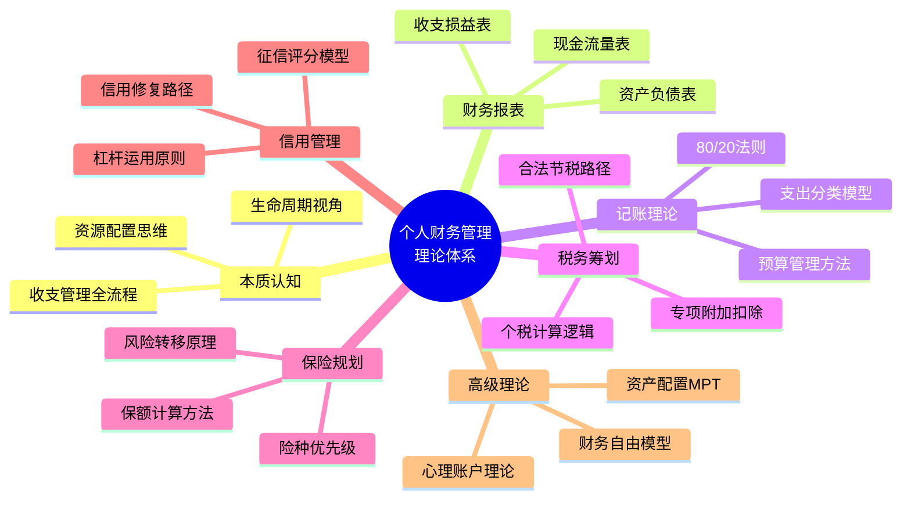
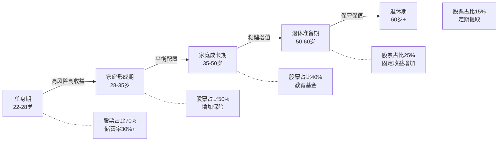
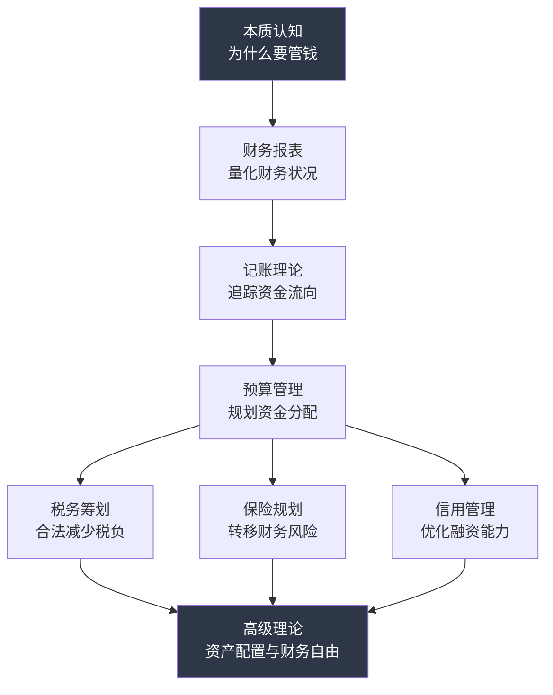
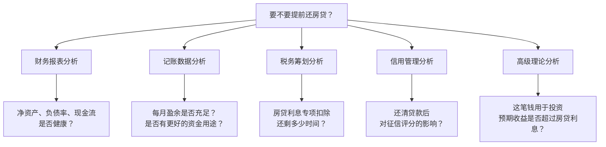

## 九、本节总结：个人财务管理理论体系全景回顾

理论不是空中楼阁——它是所有后续技巧和实战的根基。没有理论支撑的理财行为，本质上是赌博。本节系统梳理"理论基础"部分的全部知识框架，帮助读者建立完整的认知地图：你学了什么、为什么学、它们之间如何关联、以及如何从理论走向行动。

> **如何使用本节**：这不是一个需要逐字精读的章节，而是一张"认知地图"。建议先通读一遍建立全局观，然后在学习后续实操章节时反复回来对照——当你在实操中遇到困惑时，回到这里找到对应的理论模块，理解"为什么这样做"。

---

### 1. 知识体系总览

"理论基础"部分构建了一个完整的个人财务管理认知框架，涵盖七大核心领域。这七个领域不是并列关系，而是层层递进的——前一个模块是后一个模块的前提条件。



**道法术器四层结构**：每个模块都遵循"道法术器"的层次递进——"道"是底层原理（为什么这样做），"法"是方法论（按什么原则做），"术"是具体技巧（怎么一步步做），"器"是工具（用什么工具做）。理论基础部分主要覆盖"道"和"法"，后续章节会深入"术"和"器"。

| 层次 | 含义 | 本节覆盖内容 | 后续章节补充 |
|------|------|-------------|-------------|
| 道 | 底层原理，为什么这样做 | 每个模块的理论根基和核心逻辑 | — |
| 法 | 方法论，按什么原则做 | 50/30/20法则、80/20法则、4%法则等 | — |
| 术 | 具体技巧，一步步怎么做 | 涉及但未深入 | 记账实操、保险选购、投资操作等 |
| 器 | 工具，用什么来做 | 未涉及 | 记账APP、税务工具、投资平台等 |

**关键认知**：很多人的理财失败不是因为不懂"术"和"器"，而是"道"和"法"出了问题——方向错了，工具再好也到不了目的地。这就是为什么理论基础要放在最前面。

---

### 2. 各模块核心要点回顾

#### 2.1 个人财务管理的本质——认知起点

这是整个理论体系的起点，解决的是"为什么要管钱"的根本问题。

**核心认知突破**：

| 认知误区 | 正确认知 | 实际影响 |
|----------|----------|----------|
| 赚得多就过得好 | 管理能力决定财务健康 | 月入3万存款为零 vs 月入8千年存3万 |
| 理财是有钱人的事 | 理财从第一笔收入开始 | 起步越早，复利效应越强 |
| 记账就是省钱 | 记账是了解，不是控制 | 避免过度节俭降低生活质量 |
| 投资就是炒股 | 投资是资源配置决策 | 避免把投资等同于投机 |
| 负债都是坏的 | 好负债能加速财富积累 | 房贷利率低于投资回报率时，提前还贷反而亏钱 |
| 保险是浪费钱 | 保险是风险转移的金融工具 | 一场大病可以摧毁一个中产家庭十年的积累 |

**生命周期视角**是理解个人财务规划的核心框架。不同年龄段的核心任务完全不同——20多岁重点是建立习惯和积累第一桶金，30多岁要平衡风险和收益，40多岁开始注重保值和退休规划，50岁以后转向财富传承。跳过阶段直接做高阶操作（比如刚工作就做高杠杆投资），是年轻人最常见的财务错误。

**具体案例**：假设两个人月收入都是15000元。小A从25岁开始每月存3000元，年化收益7%，到60岁时拥有约445万元。小B从35岁才开始同样的计划，到60岁时只有约192万元。晚起步10年，最终差了253万元——这10年的"等待成本"高达253万。换算成每天的成本，小B每天"浪费"了约693元。这个数字比大多数人每天的工资还高。

**收支管理的"先储蓄后消费"原则**是所有财务行为的基石。不是花剩下的再存，而是存完剩下的再花。这个顺序的改变，对财务结果的影响是数量级的。实操方法：工资到账当天自动转入储蓄/投资账户，只留预算金额在消费账户中。

**"本质认知"模块的三个核心检验问题**：
1. 你能否区分"资产"和"负债"？（资产是把钱放进你口袋的东西，负债是从你口袋拿走钱的东西）
2. 你是否理解"时间价值"？（今天的一块钱比明天的一块钱更值钱，因为今天的钱可以投资增值）
3. 你是否接受了"财务管理是终身技能"这个事实？（不是学一次就够了，而是需要持续迭代）

---

#### 2.2 个人财务报表理论——量化你的财务状况

财务报表是财务管理的"仪表盘"。没有报表，你就是在黑暗中开车。

**三大核心报表**：

| 报表类型 | 核心公式 | 更新频率 | 关键用途 |
|----------|----------|----------|----------|
| 资产负债表 | 资产 - 负债 = 净资产 | 每季度 | 衡量财务健康度 |
| 收支损益表 | 收入 - 支出 = 盈余 | 每月 | 分析收支结构 |
| 现金流量表 | 流入 - 流出 = 净现金流 | 每月 | 监控流动性风险 |

**资产负债表的实操要点**：
- **资产分类**：流动资产（现金、活期、货币基金）、投资资产（股票、基金、债券）、固定资产（房产、车辆）、其他资产（保险现金价值、公积金余额）
- **负债分类**：短期负债（信用卡、消费贷）、长期负债（房贷、车贷、教育贷）
- **净资产的健康指标**：净资产增长率应持续为正；如果净资产在减少，说明你的"财务水池"在漏水
- **常见陷阱**：房产估值应使用市场成交价而非挂牌价，车辆应按折旧后价值计算而非购买价，否则会严重高估净资产
- **容易被忽略的资产**：公积金账户余额（通常有数万到数十万）、企业年金、已缴纳的保险现金价值、应收的借款

**收支损益表的分析重点**：
- 收入结构：主业收入占比是否过高（>90%说明收入来源单一，风险大）
- 支出结构：必要支出、弹性支出、投资性支出的比例
- 盈余率（储蓄率）：健康标准是 >=20%，优秀标准是 >=30%
- **同比分析**：将本月数据与去年同期对比，识别支出趋势是改善还是恶化
- **季节性波动**：注意春节、双十一、暑期等消费高峰期的支出波动，避免误判趋势

**现金流量表的预警作用**：
- 经营性现金流（工资等）是否稳定——失业或收入下降时的缓冲期有多长
- 投资性现金流（买卖资产）是否合理——是否在持续"出血"买入下跌资产
- 筹资性现金流（借贷）是否可控——新增借贷是否超过了偿还能力
- 当净现金流持续为负时，必须立即调整——连续3个月以上负现金流意味着财务危机正在逼近

**三大报表的联动关系**：资产负债表告诉你"现在在哪"，收支损益表告诉你"钱怎么来的、怎么没的"，现金流量表告诉你"还能撑多久"。三者缺一不可。

**报表之间的数据流转**：


**常见误区——把"有钱"等同于"健康"**：一个人可能有500万资产（主要在房产上），但每月现金流为负（房贷+生活费 > 收入），这种"资产富裕、现金贫困"的状态非常危险——一旦收入中断，可能被迫低价变卖资产。健康的财务状况需要三张表都达标。

---

#### 2.3 记账的理论基础——从记录到优化

记账是财务管理的基本功，但大多数人把记账做成了"记流水账"，既枯燥又无用。

**记账的三层次模型**：

```text
第1层：记录层 ─── 知道钱花到哪里去了
  │                （基础，但价值最低）
  ▼
第2层：分析层 ─── 了解支出结构和趋势
  │                （发现消费模式和异常）
  ▼
第3层：优化层 ─── 调整支出，提高资金效率
                   （真正的价值所在）
```

停留在第1层的记账毫无意义。记账的价值在于分析和优化——发现消费模式，找到优化空间。实操建议：每月底花30分钟回顾当月账单，找出TOP3大额支出，分析每笔是否必要，是否有更优替代方案。

**从记录到优化的完整链路**：

| 阶段 | 具体动作 | 产出 | 耗时 |
|------|---------|------|------|
| 记录 | 每笔支出即时记录或每日补录 | 完整的支出明细 | 每天2-3分钟 |
| 分类 | 按类别归类每笔支出 | 分类汇总表 | 记账时同步完成 |
| 分析 | 月度回顾，识别TOP5大额类别和趋势 | 月度分析报告 | 每月30分钟 |
| 优化 | 针对TOP3类别制定具体优化方案 | 优化计划 | 每月1-2小时 |
| 执行 | 落实优化方案，设置提醒和约束 | 行为改变 | 持续 |
| 复盘 | 对比优化前后的数据变化 | 效果评估 | 每季度1次 |

**支出分类的理论基础——马斯洛需求层次映射**：

这个模型将每一笔支出映射到人的需求层次上，帮助你判断支出的必要性和优先级：

| 需求层次 | 对应支出 | 优先级 | 弹性 | 典型占比 |
|----------|----------|--------|------|----------|
| 生理需求 | 餐饮、住房、交通 | 最高 | 低（刚性） | 40%-50% |
| 安全需求 | 保险、医疗、储蓄 | 高 | 低（刚性） | 15%-20% |
| 社交需求 | 聚餐、礼物、社交 | 中 | 中 | 10%-15% |
| 尊重需求 | 品牌消费、奢侈品 | 低 | 高 | 5%-10% |
| 自我实现 | 学习、旅行、兴趣 | 低 | 高 | 10%-15% |

**深层逻辑**：当低层次需求的支出占比过高（>60%），说明收入水平还未达到"有余力优化"的阶段，此时应聚焦于提升收入而非压缩支出。当高层次需求占比异常高（>30%），则需要审视是否存在"面子消费"或冲动消费。

**80/20法则在记账中的应用**：80%的支出来自20%的消费类别。重点关注那些金额大、频次高的消费类别（通常是房租/房贷、餐饮、交通、购物），小额零散支出不必过度纠结——过度关注琐碎支出反而会消耗精力，得不偿失。

**实操方法**：用记账APP导出月度数据，按类别汇总排序，找到前5大支出类别。这5个类别的优化空间通常超过其他所有类别之和。例如，发现每月外卖支出2000元，改为每周做3次饭+外卖2次，可能节省800-1000元，而砍掉每天的5元咖啡只能省150元。

**三大预算方法对比**：

| 方法 | 核心逻辑 | 优点 | 缺点 | 适合人群 |
|------|----------|------|------|----------|
| 50/30/20法则 | 按比例分配 | 简单易执行 | 不够精细 | 理财新手 |
| 零基预算法 | 每分钱有去处 | 最精细 | 执行成本高 | 精细管理者 |
| 信封法 | 按类别限额 | 物理约束强 | 不适合线上消费 | 容易超支者 |
| 反向预算法 | 先定储蓄目标 | 储蓄率有保障 | 需要一定自律 | 有一定基础者 |

**进阶技巧——"预算+信封"混合方案**：将50/30/20法则作为总体框架，在30%的弹性支出部分使用信封法做细分类别控制。这样既有宏观比例指导，又有微观消费约束，兼顾简单和精细。

**储蓄率评估标准**：

| 储蓄率 | 评级 | 行动建议 |
|--------|------|----------|
| >=30% | 优秀 | 优化投资配置，考虑增加投资性支出 |
| 20%-30% | 良好 | 检查弹性支出是否有优化空间 |
| 10%-20% | 及格 | 需要审视消费习惯，减少非必要支出 |
| <10% | 警告 | 必须立即调整，可能存在结构性支出问题 |

**重要提醒**：储蓄率不是越高越好。过度压缩生活质量会导致"报复性消费"——长期极度节省后突然大额挥霍，反而比适度消费更伤财务。可持续的储蓄率才是好储蓄率。判断标准：如果你的储蓄计划让你感到持续痛苦（而非适度节制），说明压缩过度了。

---

#### 2.4 税务筹划理论——合法减少税负

税务筹划不是逃税，而是在法律框架内，通过合理安排收入结构和利用税收优惠政策，合法降低税负。

**个人所得税的核心逻辑**：

中国个人所得税采用超额累进税率，理解这个机制是税务筹划的前提：

| 级数 | 全年应纳税所得额 | 税率 | 速算扣除数 |
|------|------------------|------|-----------|
| 1 | 不超过36,000元 | 3% | 0 |
| 2 | 36,000-144,000元 | 10% | 2,520 |
| 3 | 144,000-300,000元 | 20% | 16,920 |
| 4 | 300,000-420,000元 | 25% | 31,920 |
| 5 | 420,000-660,000元 | 30% | 52,920 |
| 6 | 660,000-960,000元 | 35% | 85,920 |
| 7 | 超过960,000元 | 45% | 181,920 |

**关键理解**：累进税率意味着收入越高，边际税率越高。税务筹划的核心思路是"削峰填谷"——把高税率区间的收入转移到低税率区间。这不是偷税，而是利用税法允许的方式合理安排。

**七大专项附加扣除**（最容易被忽视的合法节税工具）：

| 扣除项 | 扣除标准 | 适用条件 | 常见遗漏场景 |
|--------|----------|----------|-------------|
| 子女教育 | 2000元/月/子女 | 3岁到博士 | 多子女家庭每个孩子都可扣除 |
| 继续教育 | 400元/月或3600元/年 | 学历教育或职业资格 | 考取职业资格证书当年可扣3600元 |
| 大病医疗 | 最高8万元/年 | 自付超过15000元部分 | 配偶和未成年子女的医疗费也可扣除 |
| 住房贷款利息 | 1000元/月 | 首套房贷，最长240个月 | 夫妻双方只能一方扣除 |
| 住房租金 | 800-1500元/月 | 无自有住房，按城市等级 | 与房贷利息不能同时享受 |
| 赡养老人 | 3000元/月 | 60岁以上父母 | 独生子女扣3000，非独生分摊 |
| 婴幼儿照护 | 2000元/月/婴幼儿 | 3岁以下 | 多个婴幼儿每个都可扣除 |

**实操案例**：假设月收入25000元（年薪30万），有1个上小学的孩子、首套房贷、赡养60岁以上父母。可享受的专项附加扣除为：子女教育2000 + 住房贷款利息1000 + 赡养老人3000 = 6000元/月。全年可多扣除72000元，按20%税率计算，每年节税14400元。这相当于每月多拿1200元——很多人有资格却不知道申请。

**合法节税的核心策略**：
- **充分利用专项附加扣除**：每年年初在个税APP中核对所有扣除项，确保没有遗漏。家庭成员之间要协调扣除分配（比如房贷利息谁扣更划算——收入更高、适用税率更高的一方扣除更划算）
- **合理安排年终奖的计税方式**：全年一次性奖金可以选择单独计税或并入综合所得。当年终奖金额刚好跨过税率级距时（如36000元、144000元等临界点），多发1元可能导致税后收入反而减少——这就是"年终奖陷阱"
- **善用税收优惠账户**：个人养老金账户年缴12000元可全额抵扣，相当于在当前税率下节省税款，退休领取时按3%税率缴税——对于边际税率>3%的所有纳税人都是稳赚的
- **对于高收入者**：合理利用商业健康险（每年2400元抵扣）和税延养老保险

**年终奖临界点速查表**：

| 年终奖区间 | 税率 | 多发1元多缴税 | 建议操作 |
|-----------|------|-------------|---------|
| 36,000元 | 3%→10% | 多缴约2,310元 | 控制在36,000元以内 |
| 144,000元 | 10%→20% | 多缴约13,200元 | 控制在144,000元以内 |
| 300,000元 | 20%→25% | 多缴约13,500元 | 控制在300,000元以内 |
| 420,000元 | 25%→30% | 多缴约19,200元 | 控制在420,000元以内 |

**注意**：2027年12月31日前，年终奖可选择单独计税或并入综合所得。超出临界点的部分可以并入综合所得计算，不一定非要放弃年终奖。

---

#### 2.5 保险规划理论——风险转移的科学

保险的本质是风险转移工具，不是投资工具。用保险去投资，是最大的认知误区。

**保险规划的核心原则**：
- **先保障后理财**：纯保障型保险优先于储蓄型/分红型保险
- **先大人后小孩**：家庭经济支柱的保障优先于孩子
- **先保额后保费**：保额充足比保费便宜更重要
- **先需求后产品**：先确定保障需求，再选择具体产品

**四大基础险种及配置优先级**：

| 险种 | 作用 | 优先级 | 保额建议 | 年保费参考 |
|------|------|--------|----------|-----------|
| 医疗险 | 报销医疗费用 | 最高 | 200-400万 | 300-800元 |
| 重疾险 | 收入补偿 | 高 | 年收入×3-5倍 | 3000-8000元 |
| 意外险 | 意外伤残/身故 | 高 | 100万 | 100-300元 |
| 定期寿险 | 身故保障 | 中高 | 年收入×10倍 | 1000-3000元 |

**保额计算的核心逻辑**：
- **重疾险保额** = 治疗费用（30-50万） + 3-5年收入损失 + 康复费用（10-20万）。一场重疾的总成本通常在100-300万之间
- **寿险保额** = 家庭负债总额 + 子女教育费用（到大学毕业约50-100万） + 赡养费用（5-10年） - 已有储蓄
- **保费总支出**控制在家庭年收入的5%-10%——超过10%会挤压其他财务目标

**常见保险误区**：
- **返还型保险比消费型"划算"**：实际上返还型的隐含收益率极低（通常低于2%），不如买消费型+差额投资。以30岁男性重疾险为例：返还型年缴8000元，消费型年缴4000元。差额4000元/年按7%年化投资30年后约40万，远超返还型到期返还的25万
- **给孩子买教育金保险**：教育金保险的收益率跑不赢通胀，不如直接定投指数基金。孩子的最大保障是父母的收入能力——父母的保险优先级远高于孩子的教育金
- **单位有社保就够了**：社保的报销比例和上限有限，大病面前社保覆盖不足。以癌症治疗为例，靶向药和进口药很多不在社保目录内，自费部分可能高达数十万

**保险配置的生命周期策略**：

| 生命阶段 | 核心保障 | 预算占比 | 重点险种 |
|----------|----------|----------|----------|
| 单身期（22-28岁） | 意外+医疗 | 3%-5% | 意外险+百万医疗 |
| 家庭形成期（28-35岁） | 全面保障 | 5%-8% | 四大险种齐全 |
| 家庭成长期（35-50岁） | 加强保障 | 8%-10% | 提高保额，增加寿险 |
| 退休准备期（50岁+） | 医疗为主 | 5%-8% | 医疗险+意外险 |

**买保险的实操检查清单**：
1. 是否已经明确了家庭的风险敞口？（负债、收入依赖者、健康状况）
2. 保额是否覆盖了实际风险？（不是"买了就行"，而是"够不够"）
3. 是否优先保障了家庭经济支柱？
4. 是否是纯保障型产品？（拒绝捆绑理财功能的保险）
5. 是否仔细阅读了免责条款和等待期？
6. 是否如实告知了健康状况？（隐瞒会导致理赔被拒）

---

#### 2.6 信用管理理论——现代人的隐形资产

信用是现代社会的"隐形资产"，直接影响你的融资成本和生活质量。

**征信评分的核心因素**：

| 因素 | 权重 | 正面行为 | 负面行为 |
|------|------|----------|----------|
| 还款记录 | ~35% | 按时足额还款 | 逾期、违约 |
| 负债水平 | ~30% | 负债率<50% | 多头借贷、高负债率 |
| 信用历史长度 | ~15% | 老卡持续使用 | 频繁注销老卡 |
| 新增信用 | ~10% | 适度申请新信用 | 短期频繁申请 |
| 信用组合 | ~10% | 多类型信用产品 | 单一类型或无信用记录 |

**信用的经济价值量化**：良好的信用记录可以直接省钱。以100万房贷、30年期为例：信用优秀的借款人利率可能为3.5%，总利息约62万；信用一般的借款人利率可能为4.2%，总利息约76万。两者相差14万元——信用好的人白赚14万。这还没算信用卡额度、消费贷利率等方面的差异。

**杠杆运用的黄金法则**：
- **好杠杆**：用于购买增值资产（房贷买自住房、教育贷款提升技能）——资产增值收益大于借贷成本
- **坏杠杆**：用于购买贬值消费品（消费贷买奢侈品、信用卡分期买电子产品）——为贬值物品支付利息是最愚蠢的财务决策
- **月还款总额不超过月收入的40%**——这是安全线，超过这个比例，财务弹性会急剧下降
- **永远不要用短期借款支撑长期需求**（比如用信用卡分期付房贷首付）——短债长投是金融危机的经典模式

**判断一笔借贷是否合理的三步检验**：
1. **用途检验**：借来的钱是用于增值资产还是贬值消费？（买房=增值，买手机=贬值）
2. **成本检验**：借贷成本是否低于你用这笔钱能创造的收益？（房贷3.5% < 投资预期7%，合理）
3. **压力检验**：月还款额是否在收入的40%以内？（超过则风险过高）

**信用修复路径**：
1. 立即还清逾期欠款——不还清，不良记录会一直存在
2. 继续正常使用信用卡（24个月的良好记录会覆盖之前的逾期记录在银行内部评估中的影响）
3. 不要相信"花钱消除征信记录"——这是骗局，征信记录无法人为删除
4. 5年后不良记录自动消除（从还清欠款之日起计算，不是从逾期之日起）
5. 如有非本人原因导致的错误记录，可向征信中心提出异议申请

**信用管理的日常习惯**：
- 每年至少查询一次央行征信报告（通过中国人民银行征信中心官网免费查询）
- 信用卡数量控制在2-4张，过多会影响征信评分
- 避免为他人担保——担保等同于自己的负债
- 设置自动还款，避免因疏忽导致逾期
- 不要频繁申请信用卡或贷款——每次申请都会留下查询记录，短期内多次申请会被视为"资金紧张"

---

#### 2.7 高级理论——从管理到自由

高级理论面向已经掌握基础的读者，探讨如何从"管好钱"升级到"让钱为你工作"。

**财务自由的数学模型**：

财务自由的核心公式：

> 被动收入 >= 生活支出

这个公式的三个变量决定了你需要多长时间达到财务自由：

```text
财务自由所需时间 = f(储蓄率, 投资回报率, 生活支出水平)
```

**储蓄率与财务自由时间的关系**（假设年化投资回报率7%）：

| 储蓄率 | 财务自由所需年数 | 对应场景 |
|--------|----------------|---------|
| 10% | 约51年 | 几乎不可能在工作年限内实现 |
| 20% | 约37年 | 从22岁开始，约59岁实现 |
| 30% | 约28年 | 从22岁开始，约50岁实现 |
| 50% | 约17年 | 从22岁开始，约39岁实现 |
| 70% | 约8.5年 | 极端节俭，但速度最快 |

**关键洞察**：储蓄率翻倍（从20%到40%），财务自由时间不是减半，而是从37年缩短到约22年——节省了15年。这就是为什么"提高收入+控制支出"的组合比单纯"省钱"更有效。

**4%法则的实际应用**：这是国际上最广泛使用的退休规划工具。核心结论是：如果你的年生活支出为X，那么需要积累25X的投资资产（因为X ÷ 4% = 25X），就可以在不消耗本金的情况下维持生活。例如年支出20万，需要500万投资资产。

**4%法则的中国适用性修正**：
- 中国无资本利得税，这是优势
- 但中国的投资标的收益率波动更大（A股年化波动率约25%，美股约15%）
- 建议将安全提取率调整为3%-3.5%，对应需要29-33倍年支出的资产
- 另一个保守方案：采用"动态提取率"——好年份多提一点（不超过5%），差年份少提一点（不低于2.5%）

**财务自由的三个层次**：

| 层次 | 定义 | 被动收入要求 | 典型门槛（一线城市） |
|------|------|-------------|---------------------|
| 基础财务自由 | 被动收入覆盖基本生活 | 被动收入 >= 基本支出 | 约300-500万资产 |
| 舒适财务自由 | 被动收入覆盖舒适生活 | 被动收入 >= 舒适支出 | 约800-1500万资产 |
| 完全财务自由 | 被动收入远超生活需要 | 被动收入 >> 生活支出 | 约3000万+资产 |

**资产配置的现代投资组合理论（MPT）**：

马科维茨的MPT理论核心观点：分散投资可以在不降低预期收益的情况下降低风险。关键概念：

- **有效前沿**：在给定风险水平下收益最高的投资组合的集合
- **相关性**：资产之间的价格波动方向。相关性越低，分散效果越好
- **风险平价**：按风险贡献（而非资金比例）分配资产，避免某一类资产主导整体风险

**MPT的核心公式**：

投资组合的预期收益率是各资产收益率的加权平均，但组合的波动率（风险）不是各资产风险的加权平均——通过低相关性资产的组合，可以实现"1+1<2"的风险分散效果。这就是分散投资的数学基础。

**资产配置实践框架**：

| 资产类别 | 预期年化收益 | 风险等级 | 建议配置比例 | 作用 |
|----------|-------------|----------|-------------|------|
| 现金及货币基金 | 2%-3% | 极低 | 10%-20% | 流动性储备 |
| 债券及债券基金 | 4%-6% | 低 | 20%-30% | 稳定收益 |
| 股票及股票基金 | 8%-12% | 中高 | 30%-50% | 增长引擎 |
| 房地产 | 5%-8% | 中 | 10%-20% | 实物资产 |
| 另类投资 | 10%-20% | 高 | 5%-10% | 收益增强 |

**生命周期理财理论**——不同阶段的资产配置策略：



**"年龄法则"的修正**：传统建议"股票比例 = 100 - 年龄"过于简单。更精确的版本：股票比例 = (100 - 年龄) × 风险承受系数。风险承受系数取决于收入稳定性（稳定收入可承受更高风险）、家庭负担（无子女者更灵活）、已有资产规模（资产越多越能承受波动）。

**心理账户理论的理财启示**：

诺贝尔经济学奖得主理查德·塞勒的"心理账户"理论揭示了一个关键问题：人会不理性地将钱分到不同的"心理账户"中，导致决策偏差。

| 心理账户 | 消费倾向 | 典型错误 | 纠正方法 |
|----------|----------|----------|----------|
| 工资账户 | 谨慎消费 | 过度节省影响生活质量 | 设定合理的弹性消费额度 |
| 奖金账户 | 大方消费 | 把奖金当"意外之财"挥霍 | 奖金直接转入投资账户 |
| 投资收益账户 | 过度冒险 | 用赚到的钱做更高风险投资 | 投资收益纳入统一管理 |
| 意外之财账户 | 奢侈消费 | 彩票/红包不珍惜 | 所有收入统一管理 |

**关键认知**：所有收入都是平等的。无论是工资、奖金、投资收益还是意外之财，都应该纳入统一的预算管理系统，而不是因为来源不同就区别对待。

**行为金融学的其他常见偏差**：

| 偏差类型 | 表现 | 对理财的影响 | 应对策略 |
|----------|------|-------------|----------|
| 损失厌恶 | 亏损的痛苦是盈利快乐的2倍 | 过早卖出盈利资产，死守亏损资产 | 设定止损止盈规则并严格执行 |
| 锚定效应 | 过度依赖第一个接触到的信息 | 买入价成为"锚"，影响后续决策 | 用基本面而非买入价做决策 |
| 从众心理 | 跟风投资 | 在高点买入，低点卖出 | 建立独立的投资分析框架 |
| 过度自信 | 高估自己的投资能力 | 频繁交易、集中持仓 | 记录每次交易的决策依据和结果 |
| 现状偏见 | 倾向于维持现状 | 不调整不合理的资产配置 | 每季度强制review一次投资组合 |
| 沉没成本 | 因为已经投入而不愿放弃 | 死守亏损投资不割肉 | 只看未来收益，忽略已投入成本 |
| 禀赋效应 | 高估自己拥有的东西 | 不愿卖出已亏损的持仓 | 定期问自己"如果现在没有持仓，还会买入吗？" |

---

### 3. 理论之间的逻辑关系

这七个理论模块不是孤立的，它们构成了一个层层递进的认知体系：



**逻辑链条**：
1. 首先建立正确的**认知**（本质）——理解为什么需要财务管理
2. 然后学会**量化**（报表）——用数字描述财务状况
3. 接着掌握**追踪**（记账）——持续监控资金流向
4. 再学会**规划**（预算）——主动分配资金
5. 在此基础上优化**税负**（税务）、转移**风险**（保险）、管理**信用**
6. 最终实现从"管钱"到"钱生钱"的跃迁（高级理论）

**各模块的相互依赖关系**：

| 模块 | 依赖的前置模块 | 被依赖的后续模块 |
|------|---------------|-----------------|
| 本质认知 | 无 | 财务报表 |
| 财务报表 | 本质认知 | 记账理论 |
| 记账理论 | 财务报表 | 预算管理 |
| 税务筹划 | 预算管理 | 高级理论 |
| 保险规划 | 预算管理 | 高级理论 |
| 信用管理 | 预算管理 | 高级理论 |
| 高级理论 | 以上全部 | 实战操作 |

跳过前面的基础直接做后面的高级操作，是大多数人理财失败的根本原因。没有记账习惯就去做投资，不了解自己的财务状况就去买保险，不清楚税法就去做税务筹划——这些都是在沙子上建楼。

**一个完整的决策案例——"要不要提前还房贷"**：

这个问题看似简单，实际上需要综合运用多个模块的知识才能做出理性决策：



**完整分析过程**：

| 分析维度 | 需要的数据 | 关键判断 |
|---------|-----------|---------|
| 财务报表 | 当前净资产、负债率、月现金流 | 负债率是否在健康范围内（<50%）？还贷后现金流是否安全？ |
| 记账理论 | 月度盈余、资金闲置情况 | 每月有大量闲置资金还是刚好收支平衡？ |
| 税务筹划 | 专项附加扣除剩余期限 | 还贷后房贷利息扣除消失，每年多缴多少税？（通常约1200-2400元/年） |
| 信用管理 | 现有信用记录、未来融资需求 | 还清贷款对征信评分有正面影响，但短期内不会显著提升 |
| 高级理论 | 房贷利率 vs 投资预期收益 | 如果房贷利率3.5%，投资预期收益7%，提前还贷等于放弃了3.5%的利差 |

**决策矩阵**：

| 情况 | 建议 | 理由 |
|------|------|------|
| 房贷利率 > 5%，无投资渠道 | 提前还贷 | 节省的利息是最确定的"收益" |
| 房贷利率 < 4%，有稳定投资能力 | 不提前还贷 | 投资收益 > 贷款成本，利差为正 |
| 负债率 > 60%，现金流紧张 | 优先还贷 | 降低财务风险比追求收益更重要 |
| 还有5年内到期，金额不大 | 提前还贷 | 简化财务结构，减少管理成本 |
| 有专项附加扣除且期限较长 | 谨慎还贷 | 还贷后失去扣除，相当于隐性成本增加 |

这就是理论体系的价值——它让你在面对复杂财务决策时，不会只看一个维度，而是系统性地考虑所有相关因素。

---

### 4. 集成案例：七大模块协同决策

理论模块之间的关联不是抽象的，它们在真实的财务决策中协同工作。以下是一个完整的集成案例，展示七大模块如何在同一个场景中发挥作用。

#### 场景设定

**张明，32岁，杭州某互联网公司产品经理**：
- 月收入：税前28000元（到手约22000元）
- 配偶月收入：税前15000元（到手约12000元）
- 家庭月支出：约18000元（房贷8000 + 生活8000 + 其他2000）
- 存款：活期8万 + 定期15万 = 23万
- 负债：房贷余额120万（利率3.8%，还剩25年）
- 保险：仅有社保，无商业保险
- 有一个2岁的孩子

**张明的困惑**：手上有23万存款，同事推荐他买一只"年化收益15%"的理财产品，他很心动。同时他也在考虑要不要给孩子买一份教育金保险。他不知道这笔钱该怎么分配。

#### 模块一：本质认知——建立正确的决策框架

在做任何决策之前，张明需要先建立正确的认知框架：

- **资源配置思维**：23万不是"闲钱"，而是需要在多个目标之间分配的有限资源
- **风险管理优先**：在追求收益之前，先确保家庭的抗风险能力
- **生命周期定位**：32岁属于"家庭形成期"，核心任务是建立全面保障，而不是激进投资

**认知检查**：
- ✅ 他应该理财（不是"有钱了再理"）
- ❌ "年化收益15%且保本"的理财产品大概率是骗局——风险和收益永远成正比
- ❌ 给孩子买教育金保险不是最优选择——父母的保障优先于孩子的教育金

#### 模块二：财务报表——量化当前状况

**资产负债表**（简化版）：

| 资产 | 金额 | 负债 | 金额 |
|------|------|------|------|
| 活期存款 | 8万 | 房贷余额 | 120万 |
| 定期存款 | 15万 | | |
| 房产市值 | 250万 | | |
| 公积金余额 | 12万 | | |
| **资产合计** | **285万** | **净资产** | **165万** |

**收支损益表**（月度）：

| 收入 | 金额 | 支出 | 金额 |
|------|------|------|------|
| 张明工资（到手） | 22,000 | 房贷 | 8,000 |
| 配偶工资（到手） | 12,000 | 生活费 | 8,000 |
| | | 其他 | 2,000 |
| **月收入合计** | **34,000** | **月支出合计** | **18,000** |
| | | **月盈余** | **16,000** |

**现金流量表分析**：
- 月净现金流：+16,000元，健康
- 应急储备金：23万 ÷ 18,000 ≈ 12.8个月，充足（标准是3-6个月，他远超标准）
- 储蓄率：16,000 ÷ 34,000 ≈ 47%，非常优秀

**报表诊断结论**：张明的家庭财务状况健康，有优化空间。当前问题是资产配置过于保守（23万全在存款中），且缺乏保障。

#### 模块三：记账理论——分析支出结构

按马斯洛需求层次分析张明的支出：

| 需求层次 | 支出项 | 金额 | 占比 | 评估 |
|----------|--------|------|------|------|
| 生理需求 | 房贷+生活费 | 16,000 | 89% | 占比过高 |
| 安全需求 | 保险+储蓄 | 0 | 0% | 严重缺失 |
| 社交需求 | 聚餐等 | 1,000 | 5% | 正常 |
| 自我实现 | 学习等 | 1,000 | 5% | 偏低 |

**发现的问题**：
1. 安全需求支出为0——没有任何商业保险，家庭抗风险能力极弱
2. 80/20法则：前2大支出（房贷8000 + 生活费8000）占总支出的89%，优化这两项的效率最高
3. 生活费8000元/月是否合理？需要逐项拆分才能找到优化空间

#### 模块四：税务筹划——检查节税空间

**当前税务状况**：
- 张明年薪约33.6万，适用20%边际税率
- 需要检查是否充分利用了专项附加扣除

**应享有的扣除项**：

| 扣除项 | 月扣除额 | 年扣除额 | 节税金额（20%税率） |
|--------|---------|---------|-------------------|
| 子女教育（2岁婴幼儿照护） | 2,000 | 24,000 | 4,800 |
| 住房贷款利息 | 1,000 | 12,000 | 2,400 |
| 赡养老人（如有60+父母） | 3,000 | 36,000 | 7,200 |
| **合计** | **6,000** | **72,000** | **14,400** |

**关键决策**：房贷利息扣除——如果提前还贷，将失去每月1000元的扣除额度，每年多缴税约2400元。这是一笔隐性成本。

**额外建议**：张明年薪超过14.4万，个人养老金账户年缴12000元可抵扣，按20%税率节税2400元，退休领取时仅按3%缴税。

#### 模块五：保险规划——识别风险敞口

**当前风险敞口分析**：

| 风险类型 | 当前保障 | 缺口 | 潜在损失 |
|----------|---------|------|---------|
| 重大疾病 | 仅社保 | 社保外用药自费 | 30-100万 |
| 意外伤残 | 仅社保 | 无额外保障 | 收入中断 |
| 身故 | 仅社保 | 房贷120万无人偿还 | 家庭破产 |
| 医疗费用 | 仅社保 | 报销比例有限 | 10-50万 |

**优先级排序**（按"先大人后小孩"原则）：
1. **张明**（家庭主要收入来源）：百万医疗（约500元/年）+ 重疾险50万（约5000元/年）+ 定期寿险150万（约2000元/年）+ 意外险100万（约200元/年）
2. **配偶**：百万医疗 + 意外险 + 重疾险30万
3. **孩子**：百万医疗 + 意外险（不需要教育金保险！）

**总预算**：约15,000-20,000元/年，占家庭年收入约5%，在合理范围内。

#### 模块六：信用管理——维护信用资产

**张明当前信用状况**：
- 有房贷记录，按时还款 = 信用历史良好
- 无信用卡逾期记录
- 负债率：120万 ÷ 285万 ≈ 42%，在健康范围内

**建议**：
- 保持房贷按时还款的良好记录
- 未来如有装修等大额需求，可合理使用信用贷款（利率通常低于消费贷）
- 不要为同事推荐的"高收益理财"借贷投资——这是坏杠杆

#### 模块七：高级理论——资产配置方案

**综合以上六个模块的分析，张明的23万应该这样分配**：

| 用途 | 金额 | 占比 | 具体方案 |
|------|------|------|---------|
| 应急储备金 | 10万 | 43% | 货币基金（随时可取，年化2%-3%） |
| 保险配置（首年） | 2万 | 9% | 见模块五的方案 |
| 个人养老金 | 1.2万 | 5% | 年缴12000，选择目标日期基金 |
| 投资组合 | 9.8万 | 43% | 指数基金定投（股6债4比例） |

**后续每月的16,000元盈余分配**：
- 4,000元：定投指数基金（长期增值）
- 1,000元：个人养老金补充
- 2,000元：孩子的教育基金定投
- 剩余9,000元：根据未来目标灵活分配（旅行基金、进修基金、提前还贷基金等）

**关于同事推荐的"年化15%理财产品"**：
- 检验1：正规理财产品年化收益超过6%就要警惕，15%远超合理范围
- 检验2：如果真有"15%保本"的产品，为什么银行不卖？为什么基金经理不去买？
- 检验3：高收益必然伴随高风险，"保本"承诺大概率是庞氏骗局
- **结论：坚决不买**。宁可错过一个"机会"，也不能损失本金

**张明决策的最终结果**：通过七个模块的综合分析，张明不仅避免了一个可能的骗局，还建立了完整的家庭保障体系和投资计划。如果他只看"收益"一个维度，很可能会把23万全部投入那个"15%的理财产品"，同时继续忽视保险缺口——这正是大多数人理财失败的典型路径。

---

### 5. 理论落地的关键检查清单

理论学完之后，最重要的是检验自己是否真正掌握了。以下是每个模块的核心检查项：

| 模块 | 检查项 | 达标标准 |
|------|--------|----------|
| 本质认知 | 能否一句话说清财务管理的核心目标 | "让收入持续大于支出，并用盈余创造被动收入" |
| 财务报表 | 是否建立了自己的三大报表 | 至少每季度更新一次资产负债表 |
| 记账理论 | 是否连续记账3个月以上 | 能说出自己的月均支出和TOP3消费类别 |
| 预算管理 | 是否有明确的预算分配方案 | 储蓄率 >=20% |
| 税务筹划 | 是否申请了所有符合条件的专项附加扣除 | 逐项核对7大扣除项 |
| 保险规划 | 家庭经济支柱是否有足额保障 | 重疾险保额 >= 年收入×3倍 |
| 信用管理 | 是否知道自己的征信报告状态 | 至少每年查询一次央行征信报告 |
| 高级理论 | 是否有明确的资产配置方案 | 股债比例符合自己的风险承受能力 |

**自测题**（如果以下问题有3个以上答不上来，说明理论掌握不够扎实）：

1. 你目前的净资产是多少？比上季度增长了还是减少了？
2. 你上个月的储蓄率是多少？TOP3支出类别分别是什么？
3. 你今年申请了哪些专项附加扣除？还有哪些没有申请？
4. 你的重疾险保额是多少？是否覆盖了3-5年收入？
5. 你最近一次查询征信报告是什么时候？
6. 你的投资组合中股票和债券的比例是多少？
7. 你的应急储备金可以支撑几个月的生活？
8. 如果你明天失业，你的财务状况能撑多久？
9. 你的家庭保险总保费占年收入的比例是多少？
10. 你能否在3分钟内说清自己所有的资产和负债？

**评分标准**：
- 答对9-10个：理论掌握扎实，可以进入实操阶段
- 答对7-8个：基本合格，建议补齐薄弱环节
- 答对5-6个：需要重新复习对应模块
- 答对不到5个：建议从头系统学习

---

### 6. 从理论到实践的行动路线

#### 6.1 财务管理成熟度模型

在制定行动路线之前，先评估自己当前处于哪个阶段：

| 成熟度等级 | 特征 | 典型表现 | 下一步目标 |
|-----------|------|---------|-----------|
| L0：无意识 | 不关注财务 | 不知道月收入多少，有多少存款 | 建立财务感知 |
| L1：记录 | 开始记账 | 知道钱花在哪里了，但没有分析 | 从记录走向分析 |
| L2：分析 | 定期分析 | 知道支出结构和趋势，有储蓄 | 建立预算体系 |
| L3：规划 | 主动规划 | 有预算、有保险、有投资计划 | 优化配置和执行 |
| L4：优化 | 持续优化 | 资产配置合理，被动收入稳定增长 | 追求财务自由 |
| L5：自由 | 财务自由 | 被动收入覆盖生活支出 | 财富传承和社会价值 |

**大多数人处于L0-L1之间**。不要羞于承认自己的起点——意识到"需要管理财务"本身就是一大进步。

#### 6.2 阶段性目标

| 时间节点 | 目标 | 验证方式 | 对应成熟度 |
|----------|------|----------|-----------|
| 第1个月 | 连续记账30天，完成财务报表 | 能导出完整的月度收支明细 | L0→L1 |
| 第2个月 | 建立预算方案，储蓄率>=15% | 月底有盈余，且符合预算比例 | L1→L2 |
| 第3个月 | 储蓄率达到20%，完成保险配置 | 月度盈余为正，保单生效 | L2→L3 |
| 第6个月 | 所有专项附加扣除已申请，征信报告已查询 | 个税APP显示扣除已生效 | L3巩固 |
| 第12个月 | 有明确的资产配置方案并开始执行 | 投资账户已开户，首笔投资已完成 | L3→L4 |
| 第24个月 | 被动收入开始产生，投资组合运行稳定 | 季度投资报告显示正收益 | L4巩固 |

#### 6.3 第一周的最小可行行动

不要想太多，先做这几件事：

| 行动 | 耗时 | 具体操作 | 产出 |
|------|------|---------|------|
| 今天：开始记账 | 10分钟 | 下载记账APP，记录今天的每一笔支出 | 第一天的账单 |
| 本周：检查税务 | 30分钟 | 登录个税APP，核对所有专项附加扣除 | 扣除项清单 |
| 本周：摸清家底 | 30分钟 | 登录银行APP，汇总所有存款和负债，算出净资产 | 净资产数据 |
| 本周：检查保险 | 30分钟 | 查看已有保险清单和保额 | 保险缺口清单 |

这四件事加起来不超过2小时，但能让你对自己的财务状况从"模糊感觉"变成"精确数字"。

#### 6.4 学习顺序建议

不要试图同时掌握所有理论。推荐的学习顺序：

| 阶段 | 时间 | 学习内容 | 目标 |
|------|------|---------|------|
| 第一阶段 | 第1周 | 本质认知 + 财务报表 | 建立"数字感" |
| 第二阶段 | 第2-4周 | 记账理论 + 预算管理 | 养成日常习惯 |
| 第三阶段 | 第2个月 | 保险规划 | 先保障后投资 |
| 第四阶段 | 第3个月 | 税务筹划 + 信用管理 | 优化税负和信用 |
| 第五阶段 | 第4个月起 | 高级理论 | 资产配置和财务自由 |

**进阶书单**（每本都是该领域的经典，不必全读，按需选择）：

| 方向 | 书籍 | 适合阶段 | 核心价值 |
|------|------|----------|----------|
| 财务思维 | 《富爸爸穷爸爸》 | 入门 | 建立资产vs负债的基本认知 |
| 记账实操 | 《断舍离》 | 入门 | 理解消费与需求的关系 |
| 投资基础 | 《漫步华尔街》 | 进阶 | 理解市场效率和投资策略 |
| 资产配置 | 《投资最重要的事》 | 进阶 | 风险管理和逆向思维 |
| 行为金融 | 《思考，快与慢》 | 高阶 | 理解决策偏差的心理机制 |
| 财务规划 | 《小狗钱钱》 | 入门 | 用故事讲透理财基础 |
| 价值投资 | 《聪明的投资者》 | 高阶 | 格雷厄姆的投资哲学 |
| 个人理财 | 《巴比伦最富有的人》 | 入门 | 古老但永不过时的理财智慧 |

---

### 7. 理论学习的常见陷阱

| 陷阱 | 表现 | 后果 | 纠正方法 |
|------|------|------|----------|
| 理论完美主义 | 花大量时间学习理论，迟迟不行动 | 错过最佳起步时间（时间=复利） | 学完一个模块就立刻执行，边做边学 |
| 忽视个体差异 | 机械套用50/30/20等通用比例 | 方案不切实际，执行不下去 | 根据自己的收入水平和生活阶段调整 |
| 过度优化 | 对每一分钱都精打细算 | 消耗大量精力，得不偿失 | 关注大类支出，忽略小额零散消费 |
| 信息过载 | 同时看太多理财课程和书籍 | 无所适从，反而不知道怎么做 | 精读1-2本经典，然后实操 |
| 追求速成 | 期望3个月实现财务自由 | 失望后放弃 | 财务管理是终身技能，需要持续积累 |
| 忽视风险 | 只关注收益不关注风险 | 一次失误可能清零所有积累 | 每一笔投资决策都先问"最坏情况是什么" |
| 孤立学习 | 只学一个模块就下结论 | 决策片面，顾此失彼 | 理解模块间的关联，建立系统思维 |
| 忽视情绪管理 | 市场波动时恐慌操作 | 高买低卖，亏损扩大 | 提前制定策略，情绪波动时不操作 |
| 照搬他人方案 | 完全复制别人的理财方案 | 不适合自己的实际情况 | 理解原理后，根据自身情况定制方案 |
| 忽视收入增长 | 只关注省钱，不关注赚钱 | 省到极致也有下限，收入没有上限 | 收入增长和支出优化并重 |

---

### 8. 理论的边界与局限性

任何理论都有其适用范围和局限性，个人财务管理理论也不例外。了解这些局限性，才能更合理地运用理论。

**宏观经济因素的影响**：
- 理论框架假设经济环境相对稳定，但现实中可能面临经济衰退、通货膨胀、政策变化等系统性风险
- 4%法则基于美国市场的历史数据，中国的市场环境和政策可能产生不同结果
- 保险产品的条款和费率会随市场变化调整，今天的最优方案明天可能过时

**个体差异的复杂性**：
- 每个人的风险偏好、家庭状况、职业特性、健康状况都不同，通用比例和公式只能作为起点
- "储蓄率47%"对月薪3万的人和月薪5千的人意味着完全不同的生活质量
- 城市差异巨大：一线城市的住房成本可能占收入50%以上，这在通用框架中是"不健康"的，但可能是现实的唯一选择

**理论与现实的差距**：
- 理论假设人是理性的，但行为金融学已经证明人是非理性的——知道偏差的存在不等于能避免它
- 记账理论假设你能坚持记录，但大多数人会在2-3个月后放弃
- 资产配置理论假设你能严格执行再平衡，但现实中恐惧和贪婪会干扰执行

**如何在局限性中生存**：
1. **把理论当作指南针而非GPS**：理论给你方向，但具体路线需要根据路况调整
2. **接受"足够好"而非"完美"**：一个能执行80%的方案，好过一个完美但执行不了的方案
3. **保持学习和调整**：理论不是一成不变的，需要根据新的信息和环境变化持续更新
4. **重视执行力**：理论再好，不执行等于零。行动的边际价值远大于继续学习

---

### 9. 本节关键概念速查表

| 概念 | 定义 | 关键数据/公式 |
|------|------|--------------|
| 净资产 | 资产总额减去负债总额 | 净资产 = 资产 - 负债 |
| 储蓄率 | 月盈余占月收入的比例 | 储蓄率 = (收入-支出)/收入 × 100% |
| 负债率 | 负债总额占资产总额的比例 | 负债率 = 负债/资产 × 100%（健康值<50%） |
| 50/30/20法则 | 收入分配的基本比例 | 50%必要 + 30%弹性 + 20%储蓄 |
| 80/20法则 | 少数消费类别贡献多数支出 | 20%的类别 = 80%的支出 |
| 4%法则 | 退休安全提取率 | 需要25倍年支出的投资资产 |
| 财务自由 | 被动收入覆盖生活支出 | 被动收入 >= 生活支出 |
| MPT | 现代投资组合理论 | 分散投资降低非系统性风险 |
| 心理账户 | 人对不同来源的钱有不同态度 | 所有收入应统一管理 |
| 应急储备金 | 应对突发支出的现金储备 | 3-6个月生活费 |
| 保额充足原则 | 保险保额应覆盖实际风险敞口 | 重疾险 >= 年收入×3-5倍 |
| 有效前沿 | 给定风险下收益最高的组合集 | 由MPT理论推导 |
| 边际税率 | 最后一元收入适用的税率 | 中国个税7级累进，最高45% |
| 好杠杆 vs 坏杠杆 | 借贷用于增值资产 vs 贬值消费品 | 好杠杆：房贷买自住；坏杠杆：分期买手机 |
| 风险承受系数 | 影响资产配置激进程度的调节因子 | 取决于收入稳定性、家庭负担、资产规模 |
| 财务水池模型 | 收入是进水，支出是出水，净资产是水位 | 净资产持续增长 = 进水 > 出水 |

---

### 10. 写在最后

个人财务管理的理论体系，本质上是一套**资源配置的决策框架**。

它回答的是三个根本问题：
1. **钱从哪里来？**（收入结构优化）——不只是一份工资，而是构建多元化的收入来源
2. **钱到哪里去？**（支出结构优化）——不是消灭消费，而是让每一分钱都花在刀刃上
3. **如何让钱生钱？**（资产配置与被动收入）——不是追求暴富，而是让时间成为你的盟友

理论的价值不在于记住多少公式和概念，而在于它能帮你做出更好的决策。当你面对"要不要买这件东西""该不该接受这个投资机会""要不要提前还房贷"这些问题时，理论给你的是一个系统化的思考框架，而不是凭直觉做决定。

**三个值得铭记的原则**：

1. **复利是第八大奇迹**：爱因斯坦（据传）说过这句话。每月存1000元、年化7%，30年后是122万。本金只有36万，利息是本金的2.4倍。时间是普通人最强大的财富工具。

2. **风险和收益永远成正比**：如果有人告诉你一个"高收益零风险"的投资机会，那100%是骗局。理解风险、管理风险、承受风险——这是投资的必修课。

3. **财务管理服务于生活**：财务自由不是目的，自由地选择自己想要的生活方式才是。不要为了存钱而牺牲健康、关系和体验。最好的财务管理，是让你在不焦虑的状态下，过自己想过的生活。

**理论之后，你即将进入实战**。后续章节会覆盖具体的"术"和"器"——如何选择记账工具、如何购买保险、如何开设投资账户、如何构建投资组合。带着本节建立的理论框架去学习实操，你会发现每一个工具和技巧都有了"根"，不再是碎片化的操作步骤，而是有理论支撑的系统方法。

记住：财务管理不是目的，生活才是。理论学完之后，最重要的一步是——**开始行动**。

***
