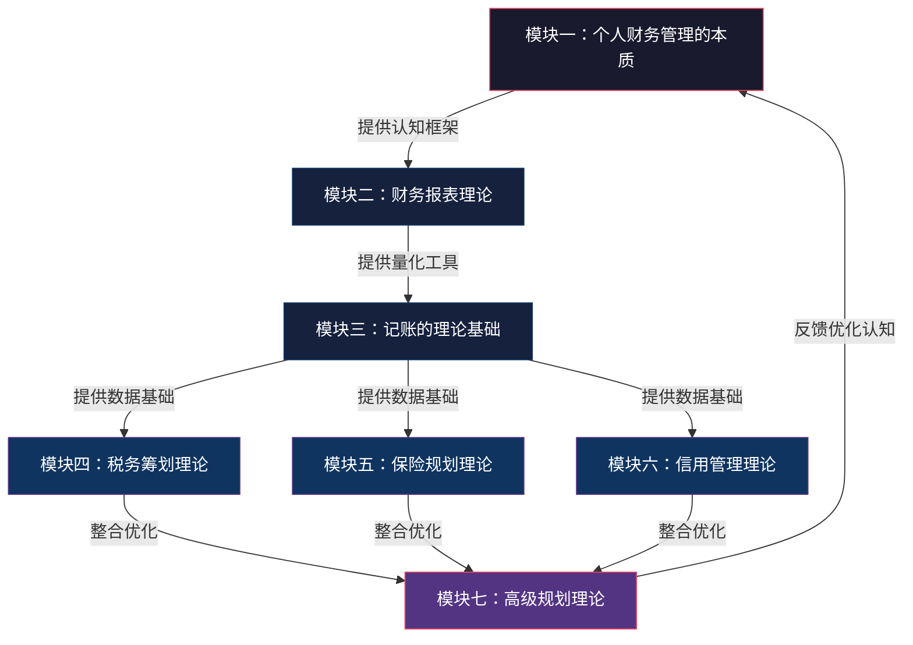
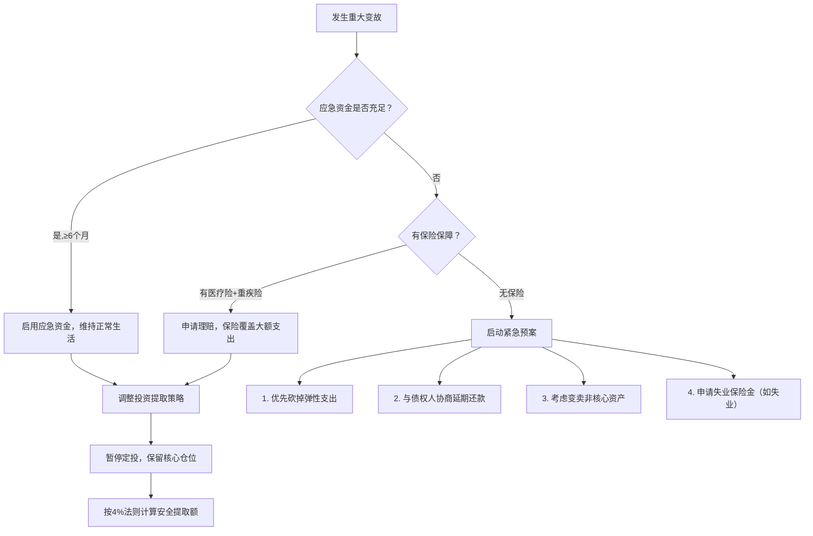

## 七、本节总结：个人财务管理理论体系全景

本节从七个维度构建了个人财务管理的理论基础——本质论、报表论、记账论、税务论、保险论、信用论、高级理论。这不是七个孤立的知识模块，而是一套环环相扣的系统：理解收入与支出的本质是起点，财务报表是度量工具，记账是数据采集手段，税务、保险、信用是三大支柱，高级理论则是将所有要素整合为可执行策略的框架。

本总结从十个层面进行系统梳理：知识地图揭示模块间的逻辑依赖关系，核心理论回顾提炼每个模块的关键要点与数字，跨模块整合分析展示理论如何协同工作，关键模型与公式提供可落地的量化工具，十大认知误区帮助规避常见陷阱，从理论到行动的阶段式实施路线图，核心指标监控面板，公式速查表，财务健康自评清单，以及延伸阅读指引。每一个层面都不是对前文的简单重复，而是在更高维度上的重新整合——当你把七个模块的知识编织成一张网，单个知识点的价值会因彼此的连接而成倍放大。

---

### 1. 知识地图：七大理论模块的逻辑关系

七大模块之间存在明确的依赖关系和信息流向。理解这个依赖图，是避免"学了理论不会用"的关键。



#### 1.1 各模块定位与核心问题

- **本质论**（模块一）回答"为什么要做财务管理"——建立正确的财富认知，理解收入-储蓄-投资-被动收入的递进链条，确立"先储蓄后消费"的铁律。这是整个体系的哲学根基，跳过它直接学技巧，会陷入"知道怎么做但坚持不了"的困境。本质论的核心洞见是：**赚钱不等于有钱，管理才是关键**。年入百万但月光的人，财务状况不如年入二十万但储蓄率40%的人。本质论还引入了复利效应——时间是财富增长最强大的盟友，也是最稀缺的资源。25岁开始每月定投2000元（年化8%），到60岁约为530万；35岁才开始同样条件只能积累约220万。10年的延迟，代价是310万。
- **报表论**（模块二）回答"用什么衡量财务健康"——提供资产负债表、收支表、现金流表三大量化工具。报表是财务管理的"仪表盘"，没有它你就是在黑暗中开车。资产负债表告诉你"你现在有多少钱"，收支表告诉你"你的钱从哪来到哪去"，现金流量表告诉你"你会不会突然断粮"。三张报表各司其职，缺一不可。
- **记账论**（模块三）回答"如何获取准确数据"——从记录到分析到优化的三层递进。记账不是目的，而是将模糊的"感觉钱不够花"转化为精确的"上个月餐饮支出占总收入23%，其中外卖占餐饮支出的68%"。数据驱动的财务管理，效率是直觉驱动的5-10倍。
- **税务论**（模块四）处理"如何合法少缴税"——通过理解税率级距、充分利用专项附加扣除、合理安排收入结构来降低实际税负。一个充分利用扣除项的纳税人，每年可比同收入水平但不利用扣除项的人少缴税8000-15000元。税务筹划是所有财务管理中"投入产出比"最高的环节——花1小时填报扣除项，可能带来上万元收益。
- **保险论**（模块五）处理"如何转移不可承受的风险"——用确定的小额支出（保费）对冲不确定的大额损失。保险不是投资，而是财务安全网。没有保险的高储蓄率家庭，一次重疾就能清零十年积蓄。保险的本质是用"可控的小损失"替代"不可控的大损失"。
- **信用论**（模块六）处理"如何管理隐形资产"——信用评分直接影响房贷利率、租房条件甚至就业机会。良好的信用管理可以让你在需要融资时获得更低的成本。信用是一种"隐形资产"——它不会出现在你的资产负债表上，但它的价值可能超过你银行账户里的数字。
- **高级理论**（模块七）将前六个模块整合为生命周期规划、资产配置、心理账户等系统性框架——从"管好钱"升级到"让钱为你工作"。高级理论的核心是三个框架：生命周期规划告诉你不同人生阶段该做什么，资产配置理论告诉你如何分散风险，财务自由公式告诉你距离目标还有多远。

#### 1.2 为什么必须按顺序学习

跳过前面的基础直接做后面的高级操作，是大多数人理财失败的根本原因。以下是具体的因果链条：

| 跳过的模块 | 直接做的操作 | 导致的后果 | 典型案例 |
|-----------|------------|----------|---------|
| 记账（模块三） | 直接投资（模块七） | 不知道自己能承受多大亏损，也不知道投多少钱不影响生活 | 月入1.5万，每月投8000进股市，遇到急事只能在亏损20%时割肉卖出 |
| 报表+记账（模块二、三） | 买保险（模块五） | 保额定多少全凭感觉，要么保额不足要么保费超支 | 年收入20万买了年缴3万的保险，第二年交不起保费被迫退保损失本金 |
| 税务（模块四） | 税务筹划 | 分不清"节税"和"逃税"的边界，或者白白浪费合法扣除 | 有房贷和赡养老人义务却不申报专项附加扣除，每年多缴税近万元 |
| 安全网（模块五） | 开始投资（模块七） | 没有应急资金，急需用钱时只能在市场低点卖出 | 疫情期间失业，投资基金浮亏30%被迫全部赎回，错过后续反弹 |
| 本质论（模块一） | 学所有技巧 | 知道该怎么做但执行不了，因为底层认知没建立 | 下载了5个记账App都坚持不到一个月，买了保险觉得是浪费钱第二年退保 |

**正确的学习路径是**：本质论建立认知→报表论学会度量→记账论获取数据→税务论/保险论/信用论搭建安全网→高级论整合优化。每一步都是下一步的地基。

#### 1.3 模块间的反馈回路

知识地图不是单向的流水线，而是存在多条反馈回路：

- **高级理论→本质论**：当你用资产配置理论实践一年后回头看本质论，会对"被动收入"有更深的理解——你不再只是"知道"这个概念，而是"体验"了它
- **税务论→记账论**：税务筹划需要精确的收支数据，这会倒逼你提高记账的精度和完整度
- **保险论→报表论**：配置保险后需要在资产负债表中记录保单的现金价值，保险支出也需要纳入收支表
- **信用论→高级理论**：良好的信用记录让你能以更低利率获得杠杆，这直接影响资产配置中的房产投资决策

---

### 2. 核心理论回顾：每个模块的精华与关键数字

| 模块 | 核心命题 | 核心模型/工具 | 最关键的数字 | 最常见的错误 |
|------|---------|--------------|-------------|------------|
| 财务管理本质 | 赚钱≠有钱，管理才是关键 | 收入→储蓄→投资→被动收入递进链 | 储蓄率≥30% | 把"花剩下的再存"当习惯 |
| 财务报表理论 | 看不见的财务才是最危险的 | 资产负债表、收支表、现金流量表 | 净资产年增长率 | 只看收入不看净资产 |
| 记账理论基础 | 记账是为了"理解"而非"控制" | 80/20法则、马斯洛需求分层、50/30/20规则 | 20%品类占80%支出 | 记流水账不分析 |
| 税务筹划理论 | 合法节税是财务管理的加速器 | 税率级距、专项扣除、税收递延 | 实际税负率 | 不申报专项附加扣除 |
| 保险规划理论 | 保险是安全网，不是投资工具 | 双十原则、保障金字塔、风险转移 | 保费占收入6-10% | 用保险理财替代保障 |
| 信用管理理论 | 信用是隐形资产也是隐形负债 | 信用评分五因素模型、信用利用率 | 信用利用率<30% | 随意注销老信用卡 |
| 高级规划理论 | 财务自由是数学问题不是运气 | 财务自由公式、MPT、生命周期规划 | 被动收入≥生活支出 | 忽视通胀侵蚀购买力 |

#### 2.1 各模块一句话深度解读

**模块一——本质**：财务管理的核心不是"少花钱"，而是"让每一块钱的回报最大化"。花2000元学一门能涨薪的技能，回报率是花2000元买衣服的几十倍。理解这一点，就不会把"节俭"等同于"理财"。本质论的深层含义是：**消费决策的本质是机会成本决策**——每一笔支出都意味着你放弃了这笔钱在其他用途上的回报。

**模块二——报表**：净资产=总资产-总负债。如果你的净资产连续两年没有增长，说明你的财务"水池"在漏水——不管收入多高，支出都在侵蚀积累。资产负债表每季度更新一次，是最低标准。**报表的价值不在于数字本身，而在于趋势**——一个季度的净资产下降可能是正常的（比如市场波动），但连续四个季度下降就是一个危险信号。

**模块三——记账**：80/20法则在记账中的应用极为精准——统计数据显示，80%的支出集中在20%的消费品类上（通常是房租/房贷、餐饮、交通、购物四大类）。找到这20%的"关键品类"集中优化，效率比在80%的零散品类上逐个节省高出数倍。记账的终极目标不是"记下来"，而是**建立"数据→洞察→决策→行动"的闭环**。

**模块四——税务**：中国个税纳税人中超过70%没有充分利用专项附加扣除。2023年数据显示全国专项附加扣除平均申报率仅58%，42%的纳税人放弃了合法减免。一个月薪2万、有房贷、赡养老人、有子女教育的典型纳税人，充分利用扣除每年可少缴税8000-15000元——相当于一个月工资。**税务筹划的投入产出比是所有财务管理活动中最高的**，因为它的"投入"几乎为零（只需要花时间了解政策和填报信息）。

**模块五——保险**：保险的经济学基础是大数法则——用可承受的确定性支出，对冲不可承受的不确定性风险。一个年收入30万的家庭可能无法承受一次100万的重疾支出，但每年1-2万的保费在可承受范围内。核心原则是"先保障后理财、先大人后小孩、先保额后保费"。**保险决策的本质是风险定价**——你需要评估每种风险发生的概率和造成的损失，然后决定是否值得用保费来转移它。

**模块六——信用**：信用评分由五大因素决定——还款记录（35%）、信用利用率（30%）、信用历史长度（15%）、新信用申请（10%）、信用类型（10%）。一次逾期可能导致房贷利率上浮10-30%，以100万30年房贷计算，多付利息可达20-50万元。**信用管理的"复利效应"与投资的复利效应方向相反**——一次负面记录的影响会随时间递减但不会完全消失（不良记录保留5年），而正面记录的积累则是持续的。

**模块七——高级理论**：财务自由的核心公式"被动收入≥生活支出"展开后涉及三个关键变量——时间、收益率和通胀。忽略任何一个变量的规划都是不完整的。马科维茨的MPT理论证明：分散投资可以在不降低预期收益的情况下降低风险。**高级理论的真正价值不在于公式本身，而在于它提供了一个系统化的决策框架**——当你面对"该不该买这只股票""要不要提前还房贷"这类问题时，理论帮你用数据和逻辑做决策，而不是凭直觉和情绪。

#### 2.2 关键数字速记卡

| 数字 | 含义 | 来源模块 |
|------|------|---------|
| ≥30% | 健康储蓄率下限 | 本质论 |
| ≤36% | DTI（负债收入比）安全线 | 报表论 |
| 80/20 | 20%品类占80%支出 | 记账论 |
| 50/30/20 | 必要/弹性/储蓄的理想比例 | 记账论 |
| 6-10% | 保费占收入的合理区间 | 保险论 |
| <30% | 信用利用率健康线 | 信用论 |
| 4% | 安全年提取率（4%法则） | 高级理论 |
| 72 | 资产翻倍年数≈72÷年化收益率% | 高级理论 |
| 6个月 | 应急资金覆盖月数 | 保险论+报表论 |
| 15000元/年 | 充分利用扣除项的节税额 | 税务论 |

---

### 3. 跨模块整合分析：理论如何协同工作

七个模块不是独立的工具箱，而是一个协同运转的系统。以下通过五个典型场景，展示理论如何跨模块联动。

#### 3.1 场景一：买房决策——需要四个模块协同

买房是个人财务中最重大的单笔决策，它同时触发报表、税务、保险、信用四个模块的理论应用。

| 涉及模块 | 具体应用 | 决策要点 |
|---------|---------|---------|
| 财务报表 | 计算当前净资产、评估负债承受能力 | DTI（负债收入比）≤36%是安全线 |
| 税务筹划 | 住房贷款利息专项附加扣除（1000元/月） | 首套房贷最长可扣240个月，合计抵扣24万应纳税所得额 |
| 保险规划 | 房贷增加后需提高寿险保额 | 寿险保额应覆盖剩余房贷本金 |
| 信用管理 | 提前6个月优化信用评分以获更低利率 | 信用评分差异可导致利率差0.5-1%，30年100万房贷利息差10-20万 |

**整合决策流程**：


**关键决策点详解**：

- **首付比例决策**：首付越高，贷款越少，利息总额越低，但同时会挤压应急资金和投资资金。理论上最优首付比例 = max(最低首付比例, 不影响应急资金和投资计划的最高比例)。对于大多数首次购房者，20-30%首付是平衡点
- **等额本息vs等额本金**：等额本息月供固定、前期利息多；等额本金月供递减、总利息少。以100万、3.8%、30年为例：等额本息月供4660元、总利息67.7万；等额本金首月5944元逐月递减、总利息57.1万。差额10.6万。如果前期现金流充裕选等额本金，否则选等额本息
- **提前还贷决策**：当投资年化收益率 > 房贷利率时，不提前还贷更优（差额即杠杆收益）；反之提前还贷更优。但要考虑流动性风险——提前还贷后资金锁死在房产中，无法应对突发需求

#### 3.2 场景二：年终奖发放——三个模块联动

年终奖发放是大多数人一年中最大的单笔收入事件，需要税务、报表、高级理论三个模块协同决策。

**税务决策**：年终奖可以选择"单独计税"或"并入综合所得"。当综合所得适用税率低于年终奖适用税率时，单独计税更优；反之并入更优。以月薪2万、年终奖10万为例：

| 计税方式 | 计算过程 | 应纳税额 | 差异 |
|---------|---------|---------|------|
| 单独计税 | 10万÷12=8333，适用10%税率，100000×10%-210=9790 | 9790元 | — |
| 并入综合所得 | 取决于全年综合所得总额和已预缴税额 | 需要具体计算 | 可能多缴或少缴 |

**快速判断方法**：如果全年综合所得（不含年终奖）减去各项扣除后，应纳税所得额已经落入最高税率级距，那么年终奖单独计税几乎总是更优的。如果综合所得还在低税率级距，需要具体计算两种方式的税额再决定。使用个税App可以一键对比两种方式。

**报表更新**：年终奖到账后，应立即更新资产负债表，将其纳入资产总额。同时在收支表中将年终奖标记为"非常规收入"，与月薪区分开——这有助于分析你的真实收入水平和消费结构。

**配置决策**：根据高级理论的资产配置框架，年终奖不应全部存入活期。推荐分配方式：

| 分配项 | 比例 | 金额（以10万为例） | 理论依据 |
|--------|------|-------------------|---------|
| 补充应急资金 | 20% | 2万 | 保险论：维持6个月支出储备 |
| 偿还高息负债 | 0-30% | 0-3万 | 信用论：降低信用利用率 |
| 定投指数基金 | 30-50% | 3-5万 | 高级理论：长期资产增值 |
| 当期消费/奖励 | 10-20% | 1-2万 | 本质论：避免过度节俭降低生活质量 |

**为什么必须留出消费/奖励比例？** 行为经济学的研究表明，完全没有"奖励"的财务计划很难长期坚持。适度的消费奖励可以强化"延迟满足"的心理感受，让你更容易坚持长期计划。完全不消费的"苦行僧"式理财，大多数人坚持不过半年。

#### 3.3 场景三：人生重大变故（失业/重疾）——全部模块联动

失业或重疾是检验财务体系是否健全的"压力测试"。如果平时没有做好理论到实践的转化，这种时刻会暴露所有短板。

| 应对环节 | 涉及模块 | 平时准备 | 事发时动作 |
|---------|---------|---------|-----------|
| 维持生活 | 记账论+报表论 | 了解月均刚性支出 | 计算应急资金可支撑月数 |
| 医疗费用 | 保险论 | 配置医疗险+重疾险 | 理赔申请、费用报销 |
| 收入中断 | 本质论+高级理论 | 建立被动收入来源 | 调整投资组合提取策略 |
| 信用维护 | 信用论 | 保持良好信用记录 | 如需延期还款，主动与银行协商 |
| 税务处理 | 税务论 | 了解大病医疗扣除政策 | 大病医疗支出超1.5万部分可扣除，上限8万/年 |

**应急财务决策树**：



**关键启示**：这个场景验证了一个核心观点——**财务安全网必须在风和日丽时搭建，暴风雨来临时已经来不及了**。应急资金、保险配置、信用维护，这三件事的成本在平时几乎可以忽略不计，但在危机时刻它们的价值是无量的。

#### 3.4 场景四：结婚——五个模块联动

结婚是两个独立财务系统的合并，涉及本质论（消费观对齐）、报表论（资产/负债合并）、保险论（保单整合）、税务论（个税专项附加扣除变化）、信用论（联名账户管理）。

| 涉及模块 | 具体操作 | 常见陷阱 |
|---------|---------|---------|
| 本质论 | 与伴侣对齐消费观和储蓄目标 | 婚前不谈钱，婚后因消费习惯冲突 |
| 报表论 | 合并资产负债表，明确共同资产和个人资产 | 不区分婚前财产和婚后共同财产 |
| 税务论 | 确认专项附加扣除的变化（如房贷利息由谁扣除） | 夫妻双方都申报同一套房的房贷扣除（不允许） |
| 保险论 | 互为受益人的寿险配置、合并家庭保单 | 只给一方买保险，另一方裸奔 |
| 信用论 | 联名贷款对双方信用的影响、共同负债管理 | 一方信用差导致联名贷款被拒或利率上浮 |

**婚前财务检查清单**：

1. 双方各自完成资产负债表，互相透明
2. 明确婚前财产和婚后共同财产的界限
3. 对齐储蓄率目标和消费优先级（用本质论的框架讨论）
4. 确认双方征信报告无异常（信用论）
5. 讨论保险配置方案（保险论）
6. 确认婚后专项附加扣除的最优分配方案（税务论）

#### 3.5 场景五：创业/副业决策——六个模块联动

创业或开展副业是将"时间"转化为"资产"的过程，几乎涉及所有模块。

| 涉及模块 | 创业场景应用 | 决策要点 |
|---------|------------|---------|
| 本质论 | 评估机会成本——投入创业的时间和资金如果不创业能产生什么回报 | 副业的最低回报率应高于主业时薪 |
| 报表论 | 创业前盘点可动用资金，确保不影响家庭财务安全 | 应急资金必须独立于创业资金 |
| 记账论 | 个人账户和业务账户严格分离 | 混淆个人支出和业务支出是最常见的创业财务错误 |
| 税务论 | 个体工商户vs有限公司的税务差异、增值税起征点、所得税优惠 | 年营收120万以下的个体户可享受增值税免征 |
| 保险论 | 创业期间社保断缴的补救方案、商业保险的连续性 | 离职创业后社保需自行缴纳，否则医保报销中断 |
| 信用论 | 经营贷对个人信用的影响、企业信用与个人信用的隔离 | 为创业借的经营贷会计入个人负债，影响DTI |

**创业财务安全线**：在辞职全职创业之前，确保以下条件同时满足——（1）应急资金≥12个月家庭支出（创业比失业风险更高）；（2）配偶收入能覆盖家庭刚性支出；（3）创业启动资金与家庭资金完全隔离；（4）所有保险正常续保。

---

### 4. 关键模型与公式提炼

#### 4.1 财务自由的数学模型

财务自由的核心判定公式：

$$\text{被动收入} \geq \text{生活支出}$$

展开为更精确的形式：

$$\text{财务自由所需本金} = \frac{\text{年生活支出}}{\text{投资年化收益率}}$$

例如：年支出12万，年化4%→需300万本金；年化8%→需150万本金。收益率翻倍，所需本金减半——这就是为什么投资能力是财务自由的核心变量之一。

**考虑通胀的修正公式**：

$$\text{实际所需本金} = \frac{\text{年生活支出} \times (1+\text{通胀率})^n}{\text{投资年化收益率} - \text{通胀率}}$$

假设年支出12万、通胀率3%、年化收益8%、20年后退休：

$$\frac{12 \times (1.03)^{20}}{0.08-0.03} = \frac{12 \times 1.806}{0.05} = 433.4\text{万}$$

不考虑通胀只需300万，考虑20年通胀后需要433万——差距达44%。忽略通胀是退休规划中最致命的错误。

**公式背后的三个关键假设**：

1. **收益率假设**：年化8%是基于股票市场长期历史平均回报（中国A股沪深300指数2005-2025年年化约9-10%），但未来不保证复现。安全做法是使用保守估计（4-6%）
2. **支出稳定性假设**：公式假设生活支出固定不变，但实际中支出会随生活方式变化。退休后支出通常下降20-30%（无通勤、无社交应酬），但医疗支出会上升
3. **提取率假设**：4%法则是基于美国30年退休期的研究（Trinity Study），在中国市场环境下可能需要调整为3-3.5%以留出安全边际

**三个层级的量化标准**：

| 层级 | 定义 | 被动收入/生活支出倍数 | 一线城市门槛 | 实现难度 |
|------|------|----------------------|-------------|---------|
| 基础自由 | 覆盖基本生活开支 | ≥1.0倍 | 300-500万资产 | 中等 |
| 舒适自由 | 覆盖舒适生活开支 | ≥1.5倍 | 800-1500万资产 | 较高 |
| 完全自由 | 覆盖所有欲望开支 | ≥3.0倍 | 3000万+资产 | 很高 |

**实现路径对比**：

| 路径 | 核心策略 | 时间周期 | 风险等级 | 适合人群 | 关键成功因素 |
|------|---------|---------|---------|---------|------------|
| 储蓄积累型 | 高储蓄率+稳健投资 | 15-25年 | 低 | 稳定收入的上班族 | 储蓄率>40%并坚持15年以上 |
| 投资增值型 | 权益类资产长期持有 | 10-20年 | 中高 | 有投资知识基础者 | 能承受30%+回撤而不割肉 |
| 创业经营型 | 构建可脱离个人的业务系统 | 5-15年 | 高 | 有创业能力和资源者 | 业务可复制、可脱离个人时间 |
| 混合型 | 多路径并行 | 8-15年 | 中 | 多数人（推荐） | 主业收入+副业+投资三线并行 |

#### 4.2 资产配置的核心框架

基于现代投资组合理论（MPT），个人资产配置的基本框架：

| 资产类别 | 预期年化收益 | 风险等级 | 建议配置比例 | 核心作用 | 最差年份参考回撤 |
|---------|------------|---------|------------|---------|----------------|
| 现金/货币基金 | 2-3% | 极低 | 10-20% | 流动性保障、应急资金 | 几乎无回撤 |
| 债券/固收 | 4-6% | 低 | 20-30% | 稳定收益、降低组合波动 | -5%至-10% |
| 股票/权益 | 8-12% | 中高 | 30-40% | 长期增值、战胜通胀 | -30%至-50% |
| 房产/不动产 | 5-8% | 中 | 15-25% | 实物资产、租金收入 | -20%至-40% |
| 另类投资 | 变化大 | 高 | 5-10% | 分散化、超额收益机会 | -50%以上 |

**配置比例动态调整原则**：

配置比例不是固定的，需要根据年龄、风险承受能力、收入稳定性动态调整。一个简化的"100法则"：股票类资产占比≈100-年龄。例如30岁→70%股票+30%固收；50岁→50%股票+50%固收。这个法则虽然粗糙，但作为起点足够用。

| 年龄段 | 股票/权益建议占比 | 固收/现金建议占比 | 调整逻辑 |
|--------|-----------------|-----------------|---------|
| 25-35岁 | 60-70% | 30-40% | 时间长，可承受波动，追求增长 |
| 35-45岁 | 50-60% | 40-50% | 平衡增长与稳健 |
| 45-55岁 | 35-50% | 50-65% | 减少波动，保护本金 |
| 55岁以上 | 20-35% | 65-80% | 保值为主，控制回撤 |

**再平衡策略**：当某类资产的实际比例偏离目标比例超过5个百分点时，触发再平衡。例如目标股票占比60%，当实际达到65%或降至55%时，卖出或买入使比例回归目标。再平衡的本质是"高卖低买"——卖出涨得多的资产、买入跌得多的资产——这与人性的追涨杀跌恰好相反，但它被学术研究反复证明是有效的长期策略。

#### 4.3 生命周期财务规划矩阵

| 生命阶段 | 年龄区间 | 财务优先级 | 核心任务 | 关键指标 | 最大风险 |
|---------|---------|-----------|---------|---------|---------|
| 单身期 | 22-28岁 | 积累原始资本 | 提升主业收入、建立记账习惯、开始基金定投 | 储蓄率>20% | 月光消费习惯固化 |
| 家庭形成期 | 28-35岁 | 建立安全网 | 购房规划、保险配置、应急资金 | 保险覆盖充足 | 房贷压力过大挤占保障 |
| 家庭成长期 | 35-50岁 | 资产增值 | 子女教育金、投资组合优化、税务筹划 | 投资回报>通胀 | 中年危机+教育支出双重压力 |
| 退休准备期 | 50-60岁 | 风险控制 | 降低投资风险、补充养老金、健康管理 | 养老金替代率>70% | 过晚开始退休准备 |
| 退休期 | 60岁+ | 保值与传承 | 资产保值、遗产规划、医疗保障 | 年提取率<4% | 长寿风险：钱花完了人还在 |

**各阶段的核心财务决策**：

- **单身期**：最大的资产是时间和人力资本。投资自己的回报率远高于投资金融市场。核心任务是建立记账习惯、提升主业收入、开始小额定投。这个阶段犯的最大错误是"等有钱了再理财"——月入5000时养成的习惯，月入5万时不会自动出现
- **家庭形成期**：最大的财务事件通常是买房和结婚。这两件事会同时消耗大量资金并增加负债。核心任务是在买房前确保DTI≤36%、保险覆盖充足、应急资金到位。这个阶段犯的最大错误是"先买房再说"——如果首付掏空了所有积蓄且没有应急资金，任何意外都可能导致财务危机
- **家庭成长期**：收入通常达到峰值，但支出也在增长（子女教育、父母赡养）。核心任务是优化税务筹划、调整投资组合、储备子女教育金。这个阶段犯的最大错误是"只顾孩子不顾自己"——把所有资源投入子女教育，忽略了自己的退休储备
- **退休准备期**：距离退休越来越近，承受波动的能力在下降。核心任务是逐步降低投资风险、补充养老金缺口、关注健康管理。这个阶段犯的最大错误是"太晚开始准备"——50岁才开始为退休存钱，时间太短，积累不足
- **退休期**：从"积累"模式切换为"消耗"模式。核心任务是控制提取率（≤4%）、保值为主、规划遗产。这个阶段犯的最大错误是"太保守"——把所有钱存银行，长期来看购买力会被通胀侵蚀

#### 4.4 记账的三层递进模型

| 层次 | 目标 | 核心方法 | 产出 | 停留在此层的后果 |
|------|------|---------|------|----------------|
| 记录层 | 搞清楚钱花到哪里去了 | 全量记录、分类标注 | 月度收支明细表 | 记了三个月就放弃（因为觉得没用） |
| 分析层 | 找出消费规律和问题 | 80/20分析、趋势对比、品类占比 | 消费洞察报告 | 发现问题但不知道怎么改 |
| 优化层 | 用数据驱动消费决策 | 预算制定、支出预警、自动化规则 | 优化后的预算方案 | ——到此层记账才有真正价值 |

**马斯洛需求层次在支出分类中的应用**：

| 需求层次 | 对应支出类别 | 优先级 | 弹性 | 典型占比 | 优化策略 |
|---------|------------|--------|------|---------|---------|
| 生理需求 | 餐饮、住房、交通 | 最高 | 低（刚性） | 40-50% | 优化结构而非压缩总量（如自己做饭替代外卖） |
| 安全需求 | 保险、医疗、储蓄 | 高 | 低（刚性） | 15-20% | 确保充足，不能省 |
| 社交需求 | 聚餐、礼物、社交活动 | 中 | 中 | 10-15% | 设定月度社交预算上限 |
| 尊重需求 | 品牌消费、奢侈品 | 低 | 高 | 5-10% | 问自己"没有品牌logo我还会买吗" |
| 自我实现 | 学习、旅行、兴趣培养 | 低 | 高 | 10-15% | 投资性支出，优先于尊重需求 |

**优化的正确顺序**：从低层次（弹性大）往高层次（弹性小）优化。先砍"尊重需求"中的面子消费，再控制"社交需求"中的聚餐频率，最后优化"生理需求"中的消费结构（如从外卖转向自己做饭）。永远不要先压缩"安全需求"中的保险和储蓄——这是你的底线。

#### 4.5 信用管理的五因素模型

| 因素 | 权重 | 核心要求 | 常见错误 | 修正后的具体行动 |
|------|------|---------|---------|----------------|
| 还款记录 | 35% | 按时还款，零逾期 | 忘记还款日、小额逾期无所谓 | 设置自动还款+提前2天提醒 |
| 信用利用率 | 30% | 已用额度/总额度<30% | 长期刷爆信用卡 | 大额消费后立即还款，或申请提额 |
| 信用历史长度 | 15% | 账户越老越好 | 随意注销最早的信用卡 | 最早的卡即使不用也保留（设小额自动扣费） |
| 新信用申请 | 10% | 避免短期内多次申请 | 同时申请多张信用卡 | 两次申请间隔至少3个月 |
| 信用类型 | 10% | 持有多种类型信用产品 | 只有信用卡没有其他信贷记录 | 适当持有房贷/消费贷等不同类型 |

**信用管理的实操要点**：

1. **每年查一次征信报告**：通过央行征信中心官网（www.pbccrc.org.cn）每年可免费查询2次。检查是否有错误记录（如非本人的贷款、错误的逾期记录），发现问题及时提出异议
2. **信用卡管理原则**：保留最早开的2-3张卡（保持信用历史长度），设置小额自动扣费防止因不活跃被降额或关卡，新增信用卡前评估是否真正需要
3. **逾期后的应急处理**：如果已经逾期，第一时间还清欠款，然后继续正常使用该信用卡24个月（用新的正常记录覆盖旧的逾期记录）。逾期记录在还清后保留5年自动消除，但对信用评分的影响会随时间递减

#### 4.6 保险配置的保障金字塔


保额计算公式：

- **重疾险保额** = 治疗费用（30-50万） + 3-5年收入损失 + 康复费用（10-20万）
- **寿险保额** = 家庭负债总额 + 子女教育至大学费用 + 父母赡养费用 - 已有储蓄和投资
- **双十原则**：保额≈年收入×10，保费≈年收入×10%

**保险配置的常见误区与纠正**：

| 误区 | 真相 | 正确做法 |
|------|------|---------|
| 给孩子买了很多保险，大人裸奔 | 大人是家庭经济支柱，大人倒下全家受影响 | 先保大人再保孩子 |
| 买了返还型保险觉得"不亏" | 返还型保费是消费型的2-3倍，返还的钱其实是自己多交的保费 | 买消费型保险，省下的钱自己投资 |
| 一份保险保所有 | 万能险/全能险什么都保但什么都不够 | 按保障金字塔逐层配置单一功能险种 |
| 公司有社保就够了 | 社保报销有上限、有自费药限制、不覆盖收入损失 | 社保是基础，商业保险是补充 |

---

### 5. 十大常见认知误区与量化纠正

| 序号 | 误区 | 真相 | 量化后果 | 纠正方法 |
|------|------|------|---------|---------|
| 1 | 只存钱不投资 | 存款利率长期跑不赢通胀，实际购买力在缩水 | 100万存银行30年（利率2%、通胀3%），实际购买力缩水至约74万 | 建立"储蓄→投资"的自动流水线 |
| 2 | 盲目追求高收益 | 高收益必然伴随高风险，没有例外 | P2P平均暴雷率>60%，部分投资者本金归零 | 先建立风险评估框架，再选择产品 |
| 3 | 没有应急资金就投资 | 投资的钱被迫在低点卖出，亏损被锁定了 | 假设投资亏损20%时被迫卖出，10万变8万，且错过后续反弹 | 先存6个月支出的应急资金再投资 |
| 4 | 负债都是坏的 | 良性负债（房贷、教育贷）可撬动资产增值 | 3%利率的房贷 vs 8%年化的投资收益，差额5%就是杠杆收益 | 区分好负债（增值资产）和坏负债（消费品） |
| 5 | 保险是浪费钱 | 一场大病可以清零十年积蓄 | 重疾治疗费用50-100万，无保险直接返贫 | 每年花收入的6-10%建立保障体系 |
| 6 | 记账太麻烦没用 | 记账3个月就能发现至少3个可优化支出项 | 每月多花1000-2000元浑然不觉，一年就是1.2-2.4万 | 用自动同步记账App，每周15分钟回顾 |
| 7 | 税务筹划=逃税 | 合法节税是每个纳税人的权利 | 未申报专项附加扣除，每年多缴税8000-15000元 | 逐项核对7大扣除项，确保全部申报 |
| 8 | 信用报告无所谓 | 信用记录影响房贷利率、就业、租房 | 信用评分差导致房贷利率上浮1%，100万30年多付利息约20万 | 每年查一次征信报告，保持良好记录 |
| 9 | 年轻不需要财务规划 | 25岁开始投资比35岁开始，终值差距可达2-3倍 | 月投2000、年化8%：25岁开始→60岁约530万；35岁开始→60岁约220万 | 从第一份工资开始建立储蓄和投资习惯 |
| 10 | 财务自由是有钱人的事 | 财务自由是数学问题，与绝对收入无必然关系 | 月入2万储蓄率50%比月入5万储蓄率10%积累速度快 | 提高储蓄率比提高收入更可控 |

#### 5.1 误区背后的认知偏差

每个误区背后都有对应的行为经济学原理，理解这些原理能帮你从根源上避免犯错：

| 误区序号 | 对应认知偏差 | 偏差解释 | 对抗方法 |
|---------|------------|---------|---------|
| 1 | 现状偏见 | 人们倾向于维持现状，害怕改变 | 设置"默认选项"为投资——每月工资到账自动转入投资账户 |
| 2 | 过度自信 | 高估自己判断风险的能力 | 设定"最坏情况"测试——如果本金全亏你能承受吗？ |
| 3 | 即时满足偏好 | 偏好当下的消费而非未来的安全 | 将应急资金命名为"不失业基金"，赋予情感意义 |
| 4 | 损失厌恶 | 对负债的恐惧超过对杠杆收益的理解 | 用数字对比——计算好负债的净收益率 |
| 5 | 侥幸心理 | "坏事不会发生在我身上" | 看真实案例——搜索"无保险重疾"的真实故事 |
| 6 | 规划谬误 | 低估记账的长期收益 | 先记3个月看数据，用实际省下的钱验证价值 |
| 7 | 权威恐惧 | 害怕"节税"被认定为"逃税" | 了解法律明确规定的扣除项，这些是法定权利 |
| 8 | 远期效应忽视 | 信用影响在未来才显现，当下感受不到 | 计算信用评分差导致的房贷利息差额 |
| 9 | 当下偏见 | 过度重视当前，低估未来的复利效应 | 用复利计算器看到具体数字——差距会震撼你 |
| 10 | 社会比较 | 跟高收入者比较觉得自己不够格 | 财务自由只跟自己的支出比，不跟别人的收入比 |

---

### 6. 从理论到行动：阶段式实施路线图

#### 第一阶段：认知重建（第1-2周）

**目标**：建立正确的财务管理心智模型

- [ ] 完成个人财务现状全面盘点：列出所有资产（存款、投资、房产、车辆、公积金、保险现金价值）和所有负债（房贷、车贷、信用卡、消费贷）
- [ ] 计算三个核心数字：当前净资产（资产-负债）、月储蓄率（(收入-支出)/收入）、信用利用率（已用额度/总额度）
- [ ] 用一句话写出自己的财务目标，必须包含时间期限和量化指标（例如："5年内被动收入覆盖基本生活支出的30%"，而非"实现财务自由"这种模糊表述）
- [ ] 对照本总结第5节的十大误区，逐条自我检查，标记自己正在犯的错误
- [ ] 阅读完本节所有模块的核心内容，确保理解每个模块的一句话精华

**验收标准**：能回答以下三个问题——"我的净资产是多少？""我的储蓄率是多少？""我离财务自由的差距有多大？"

**常见卡点**：很多人在第一步就卡住了——"我不知道自己有多少资产和负债"。这恰恰说明了为什么需要财务盘点。从你能查到的数字开始（银行App余额、信用卡账单、公积金账户），不需要一次完美，重要的是开始。

#### 第二阶段：数据基建（第3-6周）

**目标**：建立可靠的数据采集和分析体系

- [ ] 选择并坚持使用一款记账工具（推荐支持银行/支付宝/微信自动同步的App，如随手记、钱迹等）
- [ ] 每周花15分钟回顾本周支出，找出最大支出项及其占比
- [ ] 月末生成收支报告，用80/20法则分析消费结构，找出占支出80%的那20%品类
- [ ] 建立个人三大财务报表：
  - **资产负债表**：列出所有资产和负债，计算净资产
  - **收支损益表**：按月统计收入和支出，计算储蓄率
  - **现金流量表**：跟踪现金流入流出，确保不出现流动性危机
- [ ] 开始执行50/30/20预算法则（50%必要支出、30%弹性支出、20%储蓄），或根据自身情况调整比例

**验收标准**：能导出完整的月度收支明细，能说出自己的TOP3消费类别及其金额

**常见卡点**：记账坚持不下来。解决方法：（1）选自动同步的App，减少手动录入；（2）只坚持3个月——3个月后你就有足够数据做分析，不需要永远记下去；（3）每周回顾而不是每天——降低频率反而更容易坚持。

#### 第三阶段：安全网搭建（第7-12周）

**目标**：建立基础的财务安全防护

- [ ] 储备3-6个月生活支出的应急资金（存入货币基金，兼顾流动性和收益）
- [ ] 按保障金字塔顺序配置保险：
  1. 确认社保是否齐全
  2. 配置百万医疗险（200-400万保额，年保费300-800元）
  3. 配置意外险（100万保额，年保费100-300元）
  4. 配置重疾险（保额≥年收入×3倍）
  5. 有家庭负债者配置定期寿险（保额≥负债总额）
- [ ] 查询个人信用报告（央行征信中心官网每年2次免费查询），检查是否有错误记录
- [ ] 核对个人所得税专项附加扣除，逐项确认是否已申报所有符合条件的扣除项
- [ ] 设置所有信用卡和贷款的自动还款，避免因遗忘导致逾期

**验收标准**：应急资金到位、四险（医疗/重疾/意外/寿险）配置完成、征信报告无异常、所有专项附加扣除已申报

**常见卡点**：保险配置不知从何下手。最简单的方法：先在支付宝或微信上买一份百万医疗险（30岁左右年保费约300元），这是性价比最高的第一步。有了医疗险之后再逐步配置其他险种，不要试图一次到位。

#### 第四阶段：资产增值（第13周起，持续进行）

**目标**：让钱为你工作

- [ ] 根据自己的年龄和风险承受能力，确定资产配置比例（参考第4.2节的年龄-配置对照表）
- [ ] 开始基金定投：选择宽基指数基金（如沪深300、中证500），每月固定日期自动扣款
- [ ] 每季度检视一次投资组合，当某类资产偏离目标比例超过5%时进行再平衡
- [ ] 每年更新一次财务报表，计算并记录净资产增长率
- [ ] 逐步拓展被动收入来源：
  - 投资分红（股息、基金分红）
  - 租金收入（如有房产）
  - 知识付费（课程、写作、咨询）
  - 数字资产（版权、专利授权费）
- [ ] 每年重新评估保险需求，根据收入变化和家庭结构变化调整保额

**验收标准**：投资账户已开户且运行6个月以上、被动收入占总收入比例>5%、净资产年增长率>10%

**常见卡点**：不知道买什么基金。宽基指数基金（沪深300、中证500）是新手的最佳起点——它们不需要选股能力，费率低，分散度高。定投的核心不是"择时"，而是"坚持"——每月固定投入，不看涨跌，3-5年后大概率获得正收益。

---

### 7. 核心指标监控面板

贯穿整个财务管理过程，以下指标需要持续追踪。建议用电子表格或记账App的报表功能自动计算：

| 指标类别 | 具体指标 | 计算公式 | 监控频率 | 健康基准 | 预警阈值 | 预警动作 |
|---------|---------|---------|---------|---------|---------|---------|
| 收支类 | 月储蓄率 | (税后收入-总支出)/税后收入 | 每月 | ≥30% | <15% | 审查TOP3支出类别 |
| 收支类 | 必要支出占比 | (住房+餐饮+交通)/总收入 | 每月 | ≤50% | >70% | 寻找刚性支出优化空间 |
| 资产类 | 净资产年增长率 | (年末净资产-年初净资产)/年初净资产 | 每年 | ≥10% | <0% | 检查是否有隐性负债增长 |
| 资产类 | 投资组合年化收益 | (期末市值-期初市值-净投入)/期初市值 | 每年 | ≥8% | <通胀率 | 重新评估资产配置策略 |
| 负债类 | 负债收入比(DTI) | 月还款总额/月税前收入 | 每月 | ≤36% | >50% | 暂停新增负债，优先偿还高息贷款 |
| 负债类 | 信用利用率 | 已用信用额度/总信用额度 | 每月 | <30% | >50% | 提前还款或申请提额 |
| 保障类 | 保险覆盖率 | 已配置险种数/应配置险种数 | 每年 | 四险齐全 | 缺少重疾或寿险 | 立即补充缺失险种 |
| 保障类 | 应急资金月数 | 应急资金/月均刚性支出 | 每月 | ≥6个月 | <3个月 | 暂停投资，优先补充应急资金 |
| 自由类 | 被动收入占比 | 被动收入/总收入 | 每季 | ≥30% | <5% | 拓展被动收入来源 |
| 自由类 | 财务自由度 | 被动收入/生活支出×100% | 每年 | 逐年提升 | 停滞或下降 | 检查投资组合和支出水平 |

**指标联动关系**：这些指标不是独立的。例如：

- 储蓄率下降→应急资金月数减少→保险覆盖率可能不足（因为没钱交保费）
- 信用利用率上升→DTI上升→投资被迫中断
- 被动收入占比停滞→财务自由度停滞→说明资产配置或收入结构需要调整

**年度财务健康体检流程**：

每年固定一个日期（建议生日或年初），花2小时完成以下体检：

1. 更新资产负债表，计算净资产变化
2. 导出全年收支数据，分析消费结构变化
3. 计算所有监控指标，标记异常项
4. 检查保险是否需要调整保额
5. 检查信用报告是否有异常
6. 评估投资组合是否需要再平衡
7. 更新财务目标，调整下一阶段计划

---

### 8. 本节核心公式速查表

以下是贯穿本节七个模块的关键公式和速算方法，便于日常查阅使用：

```text
┌───────────────────────────────────────────────────────────────────────┐
│ 个人财务管理核心公式速查                                                │
├───────────────────────────────────────────────────────────────────────┤
│                                                                        │
│ ■ 基础公式                                                              │
│   净资产 = 总资产 - 总负债                                               │
│   储蓄率 = (税后收入 - 总支出) / 税后收入 × 100%                         │
│   月结余 = 税后收入 - 固定支出 - 弹性支出                                │
│   DTI = 月还款总额 / 月税前收入 × 100%  （健康标准：≤36%）               │
│                                                                        │
│ ■ 投资公式                                                              │
│   72法则：资产翻倍年数 ≈ 72 / 年化收益率(%)                              │
│     例：年化8% → 72÷8 = 9年翻倍                                        │
│   4%法则：年提取额 = 投资组合总值 × 4%                                   │
│     例：500万 × 4% = 20万/年 ≈ 1.67万/月                               │
│   复利终值：FV = PV × (1+r)^n                                          │
│     例：10万本金、年化8%、20年 → 10×(1.08)^20 = 46.6万                  │
│   定投终值：FV = PMT × [((1+r)^n - 1) / r]                            │
│     例：月投2000、年化8%、20年 → 2000×12×[(1.08^20-1)/0.08] ≈ 117.4万  │
│                                                                        │
│ ■ 保险公式                                                              │
│   双十原则：保额 ≈ 年收入 × 10                                          │
│            保费 ≈ 年收入 × 10%                                          │
│   重疾险保额 = 治疗费用(30-50万) + 3-5年收入 + 康复费(10-20万)          │
│   寿险保额 = 负债总额 + 教育费用 + 赡养费用 - 已有储蓄                   │
│                                                                        │
│ ■ 负债公式                                                              │
│   信用利用率 = 已用信用额度 / 总信用额度 × 100%  （健康标准：<30%）       │
│   房贷月供 = P × r × (1+r)^n / ((1+r)^n - 1)                          │
│     P=贷款总额, r=月利率, n=还款月数                                     │
│     例：100万、利率3.8%、30年 → 月供≈4660元                             │
│                                                                        │
│ ■ 财务自由公式                                                          │
│   自由度 = 被动收入 / 生活支出 × 100%                                   │
│   ≥100% = 财务自由                                                      │
│   所需本金 = 年生活支出 / 投资年化收益率                                  │
│     例：年支出12万，年化4% → 需300万                                    │
│   考虑通胀修正：本金 = 年支出×(1+通胀率)^n / (收益率-通胀率)             │
│                                                                        │
│ ■ 税务公式                                                              │
│   应纳税所得额 = 年收入 - 60000(起征点) - 五险一金 - 专项附加扣除         │
│   应纳税额 = 应纳税所得额 × 税率 - 速算扣除数                            │
│   最大节税额 = Σ(各项专项附加扣除) × 边际税率                            │
│     例：扣除合计5000元/月、边际税率20% → 年节税5000×12×20% = 12000元    │
│                                                                        │
└───────────────────────────────────────────────────────────────────────┘
```

---

### 9. 财务健康自评：理论掌握度检查清单

学完理论后，用以下检查清单评估自己是否真正掌握了每个模块。每个模块5个检查项，总分50分。

| 模块 | 检查项 | 自评（是/否） |
|------|--------|-------------|
| 本质认知 | 能用一句话解释"先储蓄后消费"为什么重要 |  |
| 本质认知 | 能区分"好负债"和"坏负债"并举例 |  |
| 本质认知 | 能说出复利效应的基本原理 |  |
| 本质认知 | 知道自己当前的储蓄率是多少 |  |
| 本质认知 | 能解释"赚钱≠有钱"的原因 |  |
| 财务报表 | 已建立或准备建立个人资产负债表 |  |
| 财务报表 | 知道自己的净资产及其变化趋势 |  |
| 财务报表 | 能区分流动资产、投资资产、固定资产 |  |
| 财务报表 | 知道DTI（负债收入比）的含义和健康标准 |  |
| 财务报表 | 能用现金流量表判断自己的流动性风险 |  |
| 记账理论 | 连续记账超过1个月 |  |
| 记账理论 | 知道自己的TOP3消费类别及其金额 |  |
| 记账理论 | 能解释80/20法则在记账中的应用 |  |
| 记账理论 | 了解50/30/20法则并有自己的调整版本 |  |
| 记账理论 | 知道马斯洛需求层次如何映射到支出分类 |  |
| 税务筹划 | 知道个人所得税7级超额累进税率 |  |
| 税务筹划 | 逐项核对了7大专项附加扣除的申报情况 |  |
| 税务筹划 | 了解年终奖单独计税与并入综合所得的区别 |  |
| 税务筹划 | 知道个人养老金账户年缴12000元可抵扣 |  |
| 税务筹划 | 能计算自己的实际税负率 |  |
| 保险规划 | 知道四大基础险种（医疗/重疾/意外/寿险）的作用 |  |
| 保险规划 | 了解"先保障后理财、先大人后小孩"原则 |  |
| 保险规划 | 能用双十原则估算自己的保额和保费预算 |  |
| 保险规划 | 知道重疾险保额的计算方法 |  |
| 保险规划 | 能区分消费型保险和返还型保险的优劣 |  |
| 信用管理 | 知道信用评分的五大因素及其权重 |  |
| 信用管理 | 知道自己的信用利用率是多少 |  |
| 信用管理 | 了解信用修复的基本路径 |  |
| 信用管理 | 已设置所有信用卡的自动还款 |  |
| 信用管理 | 知道好杠杆和坏杠杆的区别 |  |
| 高级理论 | 能说出财务自由的核心公式 |  |
| 高级理论 | 了解MPT（现代投资组合理论）的核心观点 |  |
| 高级理论 | 知道自己当前生命阶段对应的资产配置比例 |  |
| 高级理论 | 了解心理账户理论及其对消费决策的影响 |  |
| 高级理论 | 能计算考虑通胀后的财务自由所需本金 |  |

**评分标准**：

| 得分 | 评级 | 建议 |
|------|------|------|
| 40-50分 | 优秀 | 理论基础扎实，可进入实操阶段 |
| 30-39分 | 良好 | 回顾薄弱模块后进入实操 |
| 20-29分 | 及格 | 建议重新学习得分低的模块 |
| <20分 | 需要加强 | 不建议跳到实操，先巩固理论基础 |

#### 9.1 自我诊断矩阵：找到你的薄弱环节

如果得分低于40分，用以下矩阵定位具体薄弱模块，有针对性地复习：

| 如果你在这个模块失分最多 | 说明你可能… | 推荐的补救行动 |
|----------------------|-----------|--------------|
| 本质认知 | 对"为什么要理财"缺乏内在动力 | 读《富爸爸穷爸爸》第1-3章，重新理解资产vs负债 |
| 财务报表 | 从未系统梳理过自己的财务状况 | 立刻用Excel建一张资产负债表，花30分钟列出所有资产和负债 |
| 记账理论 | 知道该记账但从未坚持过 | 用自动同步App（如钱迹），先只记3个月，不给自己"永久记账"的压力 |
| 税务筹划 | 从未关注过专项附加扣除 | 现在就打开个税App，逐项检查是否已申报所有扣除项 |
| 保险规划 | 觉得保险是"浪费钱" | 搜索"无保险重疾家庭"的真实案例，理解风险的真实含义 |
| 信用管理 | 从未查过自己的征信报告 | 现在就去央行征信中心官网查询，了解自己的信用状况 |
| 高级理论 | 觉得"财务自由"离自己太远 | 用4%法则算一下自己需要多少本金，把"自由"变成一个具体数字 |

#### 9.2 知识掌握的四个层级

不要满足于"知道"，要追求"会用"：

| 层级 | 描述 | 检验方法 | 对应模块的达标标准 |
|------|------|---------|----------------|
| 知道 | 能说出概念和定义 | 能向别人解释这个概念 | 自评检查项回答"是" |
| 理解 | 能解释"为什么" | 能说出背后的原理和逻辑 | 能回答"为什么这样做" |
| 应用 | 能在实际场景中使用 | 已经用过这个知识做决策 | 已经完成过一次相关操作 |
| 内化 | 变成自动化的习惯 | 不需要刻意提醒就能执行 | 已经持续执行3个月以上 |

**本节的理论学习目标是帮你达到"理解"层级**。"应用"和"内化"需要在后续的实操章节中通过持续练习来实现。不要期望读完理论就能自动改变行为——行为改变需要至少21天的刻意练习。

---

### 10. 延伸阅读与下一步学习指引

本节建立了个人财务管理的理论框架。接下来的"核心技巧"部分将把这些理论转化为可执行的操作方法——从具体的记账技巧、报表制作、税务筹划操作，到保险配置、信用管理、投资组合管理的实战打法。

**建议的学习路径**：

1. **先巩固理论**：用第9节的自评清单检验自己的掌握程度，确保每个模块至少及格
2. **开始记账**：理论再好，没有数据就是空中楼阁。从今天开始记录每一笔收支
3. **做一次全面的财务体检**：用资产负债表、收支表、现金流量表给自己做一个完整的财务画像
4. **带着问题进入下一节**：你在理论学习中产生的疑问，大概率会在核心技巧部分找到答案

**推荐的经典阅读**：

| 书名 | 作者 | 核心价值 | 对应模块 | 阅读难度 |
|------|------|---------|---------|---------|
| 《富爸爸穷爸爸》 | 罗伯特·清崎 | 资产vs负债的认知重建 | 模块一：本质 | ⭐ 入门 |
| 《小狗钱钱》 | 博多·舍费尔 | 入门级理财思维启蒙 | 模块一+二 | ⭐ 入门 |
| 《指数基金投资指南》 | 银行螺丝钉 | 定投策略实操 | 模块七：高级理论 | ⭐⭐ 进阶 |
| 《聪明的投资者》 | 本杰明·格雷厄姆 | 价值投资核心理念 | 模块七：高级理论 | ⭐⭐⭐ 高级 |
| 《保险是怎么回事》 | 李元霸 | 保险配置实操指南 | 模块五：保险 | ⭐⭐ 进阶 |
| 《个人理财》 | 杰夫·马杜拉 | 系统性个人财务教材 | 全部模块 | ⭐⭐ 进阶 |
| 《思考，快与慢》 | 丹尼尔·卡尼曼 | 理解财务决策中的认知偏差 | 模块一+七 | ⭐⭐⭐ 高级 |
| 《行为经济学讲义》 | 汪丁丁 | 中国语境下的行为经济学 | 全部模块 | ⭐⭐⭐ 高级 |

**阅读顺序建议**：先读入门级（《富爸爸穷爸爸》或《小狗钱钱》）建立基础认知，再读进阶级补充实操知识，最后读高级级深化理论理解。不要一上来就读《聪明的投资者》——没有基础认知的支撑，经典著作中的智慧会被误读。

**一句话结尾**：财务管理不是一个"学会了就结束"的技能，而是一个需要终身迭代的系统工程。本节的理论为你提供了思考框架，但真正的财务智慧来自持续的实践、反思和调整。理论的价值不在于记住多少公式和概念，而在于它能帮你做出更好的决策——当你面对"要不要买这件东西""该不该接受这个投资机会""要不要提前还房贷"这些问题时，理论给你的是一个系统化的思考框架，而不是凭直觉做决定。

记住：**理论是地图，行动才是旅程。学完这七个模块，最重要的一步是——今天就开始。**
